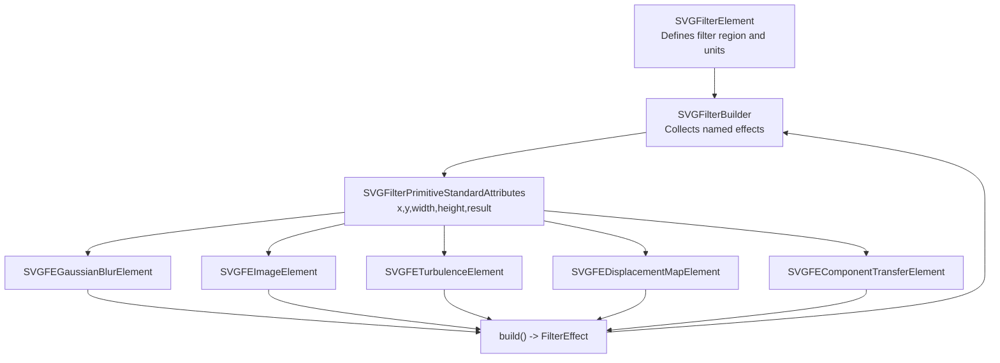
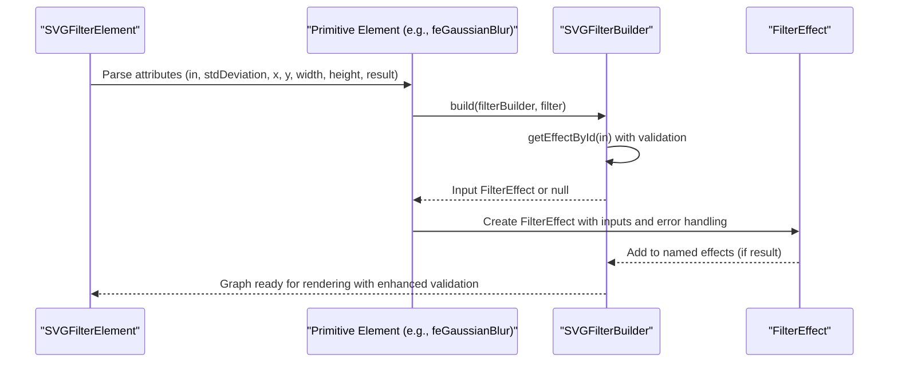
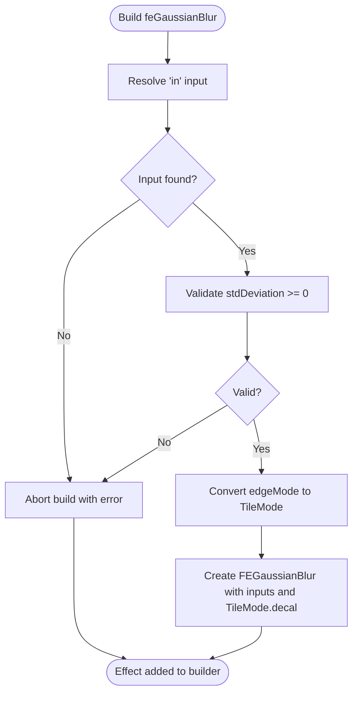
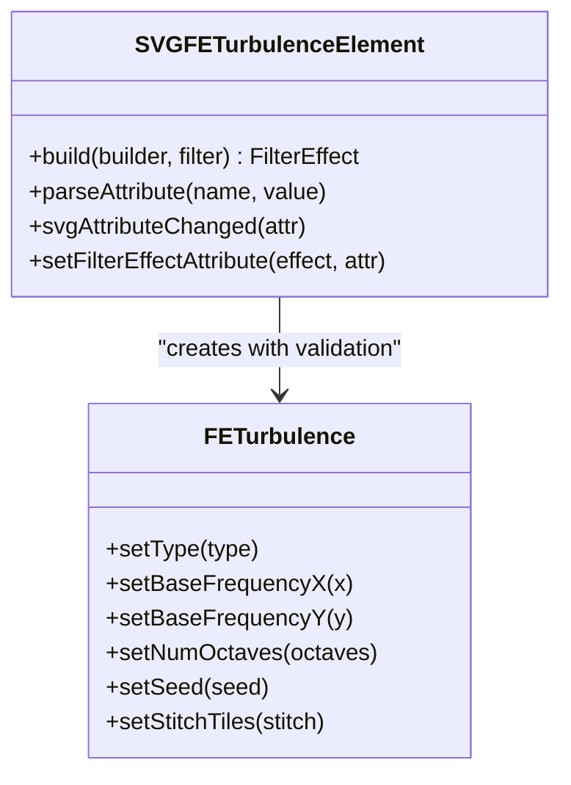
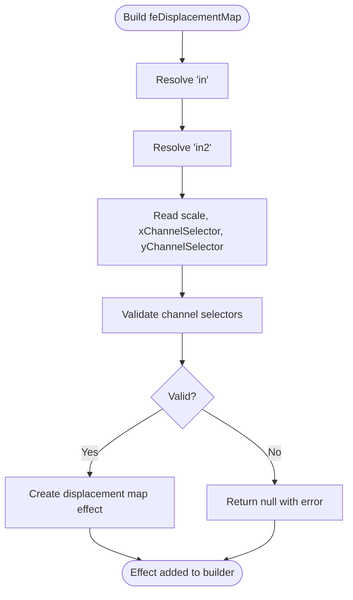
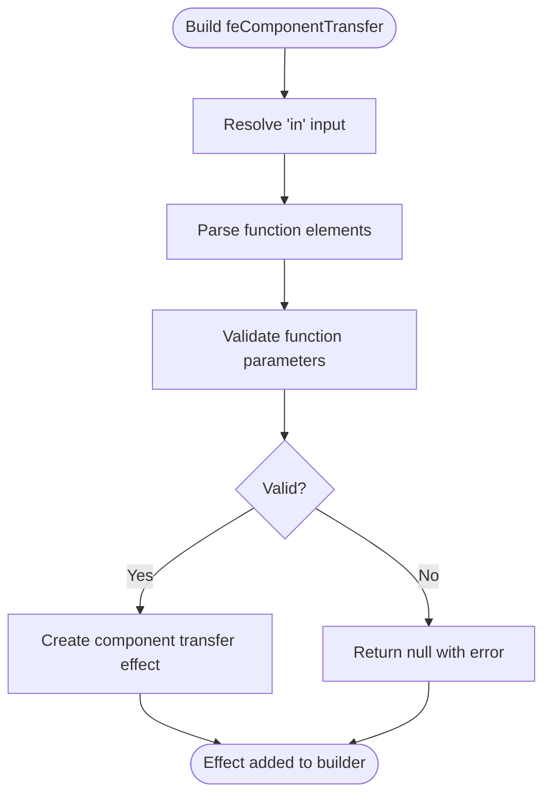
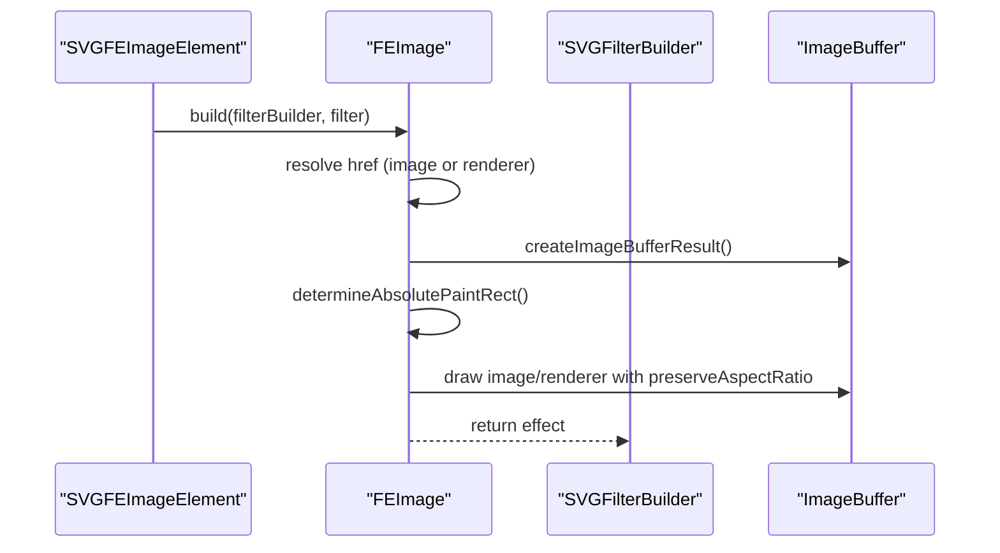
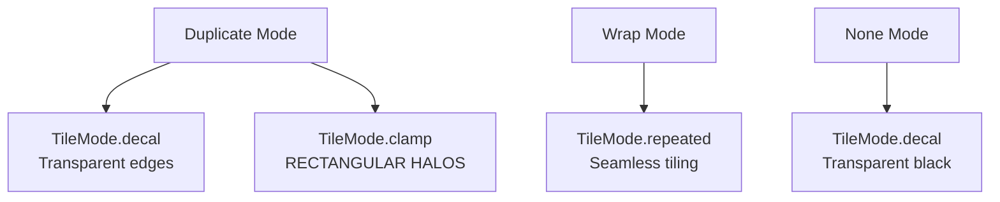
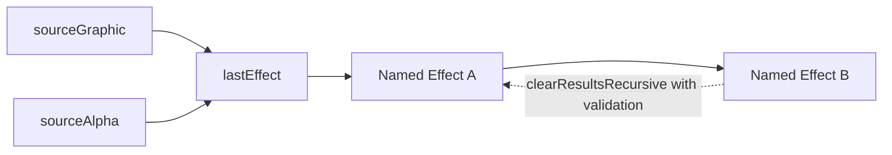

# Built-in Filter Primitives

<cite>
**Referenced Files in This Document**
- [SVGFilter.cpp](file://blink-b87d44f-Source-core-svg/graphics/filters/SVGFilter.cpp)
- [SVGFilter.h](file://blink-b87d44f-Source-core-svg/graphics/filters/SVGFilter.h)
- [SVGFilterBuilder.cpp](file://blink-b87d44f-Source-core-svg/graphics/filters/SVGFilterBuilder.cpp)
- [SVGFilterBuilder.h](file://blink-b87d44f-Source-core-svg/graphics/filters/SVGFilterBuilder.h)
- [SVGFilterElement.cpp](file://blink-b87d44f-Source-core-svg/SVGFilterElement.cpp)
- [SVGFilterElement.h](file://blink-b87d44f-Source-core-svg/SVGFilterElement.h)
- [SVGFilterPrimitiveStandardAttributes.cpp](file://blink-b87d44f-Source-core-svg/SVGFilterPrimitiveStandardAttributes.cpp)
- [SVGFilterPrimitiveStandardAttributes.h](file://blink-b87d44f-Source-core-svg/SVGFilterPrimitiveStandardAttributes.h)
- [SVGFEImageElement.cpp](file://blink-b87d44f-Source-core-svg/SVGFEImageElement.cpp)
- [SVGFEImageElement.h](file://blink-b87d44f-Source-core-svg/SVGFEImageElement.h)
- [SVGFEImage.cpp](file://blink-b87d44f-Source-core-svg/graphics/filters/SVGFEImage.cpp)
- [SVGFEImage.h](file://blink-b87d44f-Source-core-svg/graphics/filters/SVGFEImage.h)
- [SVGFEGaussianBlurElement.cpp](file://blink-b87d44f-Source-core-svg/SVGFEGaussianBlurElement.cpp)
- [SVGFEGaussianBlurElement.h](file://blink-b87d44f-Source-core-svg/SVGFEGaussianBlurElement.h)
- [SVGFEDisplacementMapElement.cpp](file://blink-b87d44f-Source-core-svg/SVGFEDisplacementMapElement.cpp)
- [SVGFEDisplacementMapElement.h](file://blink-b87d44f-Source-core-svg/SVGFEDisplacementMapElement.h)
- [SVGFETurbulenceElement.cpp](file://blink-b87d44f-Source-core-svg/SVGFETurbulenceElement.cpp)
- [SVGFETurbulenceElement.h](file://blink-b87d44f-Source-core-svg/SVGFETurbulenceElement.h)
- [SVGFEComponentTransferElement.cpp](file://blink-b87d44f-Source-core-svg/SVGFEComponentTransferElement.cpp)
- [SVGFEComponentTransferElement.h](file://blink-b87d44f-Source-core-svg/SVGFEComponentTransferElement.h)
- [svg_filters_primitives_blur.dart](file://lib/src/animation/svg_filters_primitives_blur.dart)
- [svg_filters_types.dart](file://lib/src/animation/svg_filters_types.dart)
- [svg_filters_primitives_convolve_matrix.dart](file://lib/src/animation/svg_filters_primitives_convolve_matrix.dart)
- [filter_primitives_edge_cases_test.dart](file://test/filter_primitives_edge_cases_test.dart)
- [css_compositing_properties_test.dart](file://test/animation/css_compositing_properties_test.dart)
- [displacement_edge_cases_test.dart](file://test/animation/displacement_edge_cases_test.dart)
</cite>

## Update Summary
**Changes Made**
- Updated blur primitive documentation to reflect improved edge mode handling with TileMode.decal for Chrome/Blink parity
- Enhanced edge mode documentation covering duplicate, wrap, and none modes with specific behavioral differences
- Updated blur implementation details to explain the TileMode.decal vs TileMode.clamp distinction for edge duplication
- Added comprehensive edge mode handling documentation for all filter primitives
- Updated performance considerations to include edge mode optimization strategies

## Table of Contents
1. [Introduction](#introduction)
2. [Project Structure](#project-structure)
3. [Core Components](#core-components)
4. [Architecture Overview](#architecture-overview)
5. [Detailed Component Analysis](#detailed-component-analysis)
6. [Edge Mode Handling](#edge-mode-handling)
7. [Enhanced Edge Case Handling](#enhanced-edge-case-handling)
8. [Dependency Analysis](#dependency-analysis)
9. [Performance Considerations](#performance-considerations)
10. [Troubleshooting Guide](#troubleshooting-guide)
11. [Conclusion](#conclusion)

## Introduction
This document describes the built-in SVG filter primitives implemented in the Blink-based engine. It focuses on the core filter pipeline, primitive types, attributes, chaining semantics, and runtime behavior. The implementation now features substantial enhancements to edge case handling, better error recovery, and more robust mathematical computations for component transfer, displacement, and turbulence primitives. It covers blur, turbulence, displacement mapping, and image primitives, explaining how primitives connect via inputs and results, how units and scales are applied, and how animations are integrated. Practical combinations, performance considerations, and troubleshooting guidance are included.

## Project Structure
The filter system is composed of:
- Filter container and builder: define the filter region, coordinate systems, and collect named effects.
- Primitive base class: standard attributes (x, y, width, height, result) and renderer integration.
- Individual primitive elements: parse attributes, build FilterEffect instances, and integrate with the filter graph.
- Primitive implementations: low-level rasterization and GPU-backed image filters with enhanced error handling.

**Diagram sources**
- [SVGFilterElement.cpp:187-190](file://blink-b87d44f-Source-core-svg/SVGFilterElement.cpp#L187-L190)
- [SVGFilterBuilder.cpp:31-50](file://blink-b87d44f-Source-core-svg/graphics/filters/SVGFilterBuilder.cpp#L31-L50)
- [SVGFilterPrimitiveStandardAttributes.cpp:139-142](file://blink-b87d44f-Source-core-svg/SVGFilterPrimitiveStandardAttributes.cpp#L139-L142)
- [SVGFEGaussianBlurElement.cpp:128-141](file://blink-b87d44f-Source-core-svg/SVGFEGaussianBlurElement.cpp#L128-L141)
- [SVGFEImageElement.cpp:200-205](file://blink-b87d44f-Source-core-svg/SVGFEImageElement.cpp#L200-L205)
- [SVGFETurbulenceElement.cpp](file://blink-b87d44f-Source-core-svg/SVGFETurbulenceElement.cpp)
- [SVGFEDisplacementMapElement.cpp](file://blink-b87d44f-Source-core-svg/SVGFEDisplacementMapElement.cpp)
- [SVGFEComponentTransferElement.cpp:79-105](file://blink-b87d44f-Source-core-svg/SVGFEComponentTransferElement.cpp#L79-L105)

**Section sources**
- [SVGFilter.cpp:28-55](file://blink-b87d44f-Source-core-svg/graphics/filters/SVGFilter.cpp#L28-L55)
- [SVGFilter.h:35-51](file://blink-b87d44f-Source-core-svg/graphics/filters/SVGFilter.h#L35-L51)
- [SVGFilterBuilder.cpp:31-104](file://blink-b87d44f-Source-core-svg/graphics/filters/SVGFilterBuilder.cpp#L31-L104)
- [SVGFilterBuilder.h:35-79](file://blink-b87d44f-Source-core-svg/graphics/filters/SVGFilterBuilder.h#L35-L79)
- [SVGFilterElement.cpp:187-229](file://blink-b87d44f-Source-core-svg/SVGFilterElement.cpp#L187-L229)
- [SVGFilterElement.h:38-76](file://blink-b87d44f-Source-core-svg/SVGFilterElement.h#L38-L76)
- [SVGFilterPrimitiveStandardAttributes.cpp:50-156](file://blink-b87d44f-Source-core-svg/SVGFilterPrimitiveStandardAttributes.cpp#L50-L156)
- [SVGFilterPrimitiveStandardAttributes.h:38-76](file://blink-b87d44f-Source-core-svg/SVGFilterPrimitiveStandardAttributes.h#L38-L76)

## Core Components
- SVGFilter: encapsulates the filter region, bounding box mode, and scale application for effect coordinates.
- SVGFilterBuilder: maintains built-in effects (sourceGraphic, sourceAlpha), named effects, and inter-effect references for dependency tracking and result clearing.
- SVGFilterElement: defines filter geometry (x, y, width, height), units (filterUnits, primitiveUnits), resolution hints (filterRes), and validates/updates child primitives.
- SVGFilterPrimitiveStandardAttributes: shared base for primitives with x, y, width, height, result attributes and renderer integration.

Key behaviors:
- Coordinate scaling: horizontal and vertical values are scaled by target bounding box when effectBBoxMode is enabled.
- Effect lookup: primitives reference inputs by ID; empty ID defaults to last effect or sourceGraphic.
- Dependency graph: builder tracks which effects depend on others to clear cached results safely.
- Enhanced error recovery: improved validation and graceful degradation for invalid parameters.

**Section sources**
- [SVGFilter.cpp:38-50](file://blink-b87d44f-Source-core-svg/graphics/filters/SVGFilter.cpp#L38-L50)
- [SVGFilterBuilder.cpp:38-65](file://blink-b87d44f-Source-core-svg/graphics/filters/SVGFilterBuilder.cpp#L38-L65)
- [SVGFilterBuilder.cpp:67-104](file://blink-b87d44f-Source-core-svg/graphics/filters/SVGFilterBuilder.cpp#L67-L104)
- [SVGFilterElement.cpp:121-174](file://blink-b87d44f-Source-core-svg/SVGFilterElement.cpp#L121-L174)
- [SVGFilterPrimitiveStandardAttributes.cpp:75-121](file://blink-b87d44f-Source-core-svg/SVGFilterPrimitiveStandardAttributes.cpp#L75-L121)

## Architecture Overview
The filter pipeline connects DOM elements to FilterEffect instances and composes them into a dependency graph. Primitives declare inputs (via in attributes) and optional result names. The builder resolves IDs to effects and wires inputs accordingly with enhanced error handling and validation.

**Diagram sources**
- [SVGFilterElement.cpp:187-229](file://blink-b87d44f-Source-core-svg/SVGFilterElement.cpp#L187-L229)
- [SVGFEGaussianBlurElement.cpp:128-141](file://blink-b87d44f-Source-core-svg/SVGFEGaussianBlurElement.cpp#L128-L141)
- [SVGFilterBuilder.cpp:52-65](file://blink-b87d44f-Source-core-svg/graphics/filters/SVGFilterBuilder.cpp#L52-L65)

## Detailed Component Analysis

### Blur (feGaussianBlur)
- Purpose: Applies Gaussian blur with separate standard deviations for X and Y axes.
- Inputs:
  - in: input image (defaults to previous effect or sourceGraphic if empty).
- Parameters:
  - stdDeviation: number or pair of numbers; negative values are rejected.
  - x, y, width, height, result: standard primitive attributes.
- Edge Mode Handling:
  - **Updated**: Now uses TileMode.decal for edge duplication instead of TileMode.clamp to match Chrome/Blink behavior
  - Duplicate mode: Clamps to edge pixels with transparent background for natural fade
  - Wrap mode: Repeats edge pixels for seamless tiling
  - None mode: Treats out-of-bounds as transparent black
- Behavior:
  - Validates non-negative standard deviations with enhanced error recovery.
  - Creates a blur effect and attaches the named input.
  - Uses TileMode.decal for edge duplication to achieve Chrome/Blink parity.
- Animation:
  - Animated properties include stdDeviationX/Y and standard attributes.

**Updated** Enhanced edge mode handling now matches Chrome/Blink behavior by using TileMode.decal for duplicate edge mode instead of TileMode.clamp, ensuring proper edge duplication with transparent backgrounds.

**Diagram sources**
- [SVGFEGaussianBlurElement.cpp:128-141](file://blink-b87d44f-Source-core-svg/SVGFEGaussianBlurElement.cpp#L128-L141)
- [SVGFEGaussianBlurElement.cpp:135-137](file://blink-b87d44f-Source-core-svg/SVGFEGaussianBlurElement.cpp#L135-L137)
- [svg_filters_primitives_blur.dart:79-103](file://lib/src/animation/svg_filters_primitives_blur.dart#L79-L103)

**Section sources**
- [SVGFEGaussianBlurElement.cpp:33-76](file://blink-b87d44f-Source-core-svg/SVGFEGaussianBlurElement.cpp#L33-L76)
- [SVGFEGaussianBlurElement.cpp:77-126](file://blink-b87d44f-Source-core-svg/SVGFEGaussianBlurElement.cpp#L77-L126)
- [SVGFEGaussianBlurElement.cpp:128-141](file://blink-b87d44f-Source-core-svg/SVGFEGaussianBlurElement.cpp#L128-L141)
- [SVGFEGaussianBlurElement.h:30-52](file://blink-b87d44f-Source-core-svg/SVGFEGaussianBlurElement.h#L30-L52)
- [svg_filters_primitives_blur.dart:79-103](file://lib/src/animation/svg_filters_primitives_blur.dart#L79-L103)

### Turbulence (feTurbulence)
- Purpose: Generates fractal noise patterns for procedural textures and animations.
- Inputs: None (generates internal noise).
- Parameters:
  - Type: fractalNoise or turbulence (validated during build).
  - Base frequency, octaves, seed, stitch tiles.
  - Enhanced validation ensures non-negative base frequencies.
  - Scale factor for animation.
  - x, y, width, height, result: standard primitive attributes.
- Behavior:
  - Produces procedural noise with robust mathematical computations.
  - Enhanced error recovery handles invalid parameter combinations gracefully.
- Animation:
  - Animated properties include standard attributes and noise parameters.
  - Improved stability for animated turbulence sequences.

**Diagram sources**
- [SVGFETurbulenceElement.cpp:175-180](file://blink-b87d44f-Source-core-svg/SVGFETurbulenceElement.cpp#L175-L180)
- [SVGFETurbulenceElement.h:96-120](file://blink-b87d44f-Source-core-svg/SVGFETurbulenceElement.h#L96-L120)

**Section sources**
- [SVGFETurbulenceElement.cpp:49-58](file://blink-b87d44f-Source-core-svg/SVGFETurbulenceElement.cpp#L49-L58)
- [SVGFETurbulenceElement.cpp:90-131](file://blink-b87d44f-Source-core-svg/SVGFETurbulenceElement.cpp#L90-L131)
- [SVGFETurbulenceElement.cpp:133-152](file://blink-b87d44f-Source-core-svg/SVGFETurbulenceElement.cpp#L133-L152)
- [SVGFETurbulenceElement.cpp:154-173](file://blink-b87d44f-Source-core-svg/SVGFETurbulenceElement.cpp#L154-L173)
- [SVGFETurbulenceElement.cpp:175-180](file://blink-b87d44f-Source-core-svg/SVGFETurbulenceElement.cpp#L175-L180)
- [SVGFETurbulenceElement.h:32-94](file://blink-b87d44f-Source-core-svg/SVGFETurbulenceElement.h#L32-L94)

### Displacement Mapping (feDisplacementMap)
- Purpose: Displaces pixels using two input images (scale channel from one, displacement from another).
- Inputs:
  - in: main image to be displaced.
  - in2: displacement image (often from turbulence).
- Parameters:
  - scale: amount of displacement in user space units.
  - xChannelSelector, yChannelSelector: choose channels from the displacement image.
  - Enhanced validation ensures valid channel selectors (R, G, B, A).
  - x, y, width, height, result: standard primitive attributes.
- Behavior:
  - Uses the selected channels to compute UV offsets and samples the main image accordingly.
  - Improved error recovery handles invalid channel combinations.
  - Edge mode handling: out-of-bounds coordinates return transparent black per SVG spec.
- Animation:
  - Animated properties include standard attributes and scale.
  - Enhanced stability for animated displacement sequences.

**Diagram sources**
- [SVGFEDisplacementMapElement.cpp:150-164](file://blink-b87d44f-Source-core-svg/SVGFEDisplacementMapElement.cpp#L150-L164)
- [SVGFEDisplacementMapElement.h:67-89](file://blink-b87d44f-Source-core-svg/SVGFEDisplacementMapElement.h#L67-L89)

**Section sources**
- [SVGFEDisplacementMapElement.cpp:47-55](file://blink-b87d44f-Source-core-svg/SVGFEDisplacementMapElement.cpp#L47-L55)
- [SVGFEDisplacementMapElement.cpp:75-112](file://blink-b87d44f-Source-core-svg/SVGFEDisplacementMapElement.cpp#L75-L112)
- [SVGFEDisplacementMapElement.cpp:114-126](file://blink-b87d44f-Source-core-svg/SVGFEDisplacementMapElement.cpp#L114-L126)
- [SVGFEDisplacementMapElement.cpp:128-148](file://blink-b87d44f-Source-core-svg/SVGFEDisplacementMapElement.cpp#L128-L148)
- [SVGFEDisplacementMapElement.cpp:150-164](file://blink-b87d44f-Source-core-svg/SVGFEDisplacementMapElement.cpp#L150-L164)
- [SVGFEDisplacementMapElement.h:30-65](file://blink-b87d44f-Source-core-svg/SVGFEDisplacementMapElement.h#L30-L65)

### Component Transfer (feComponentTransfer)
- Purpose: Applies color transformation functions to RGB and alpha channels.
- Inputs:
  - in: input image to be transformed.
- Parameters:
  - Function elements: feFuncR, feFuncG, feFuncB, feFuncA define transfer functions.
  - Enhanced validation ensures function parameters are within valid ranges.
  - x, y, width, height, result: standard primitive attributes.
- Behavior:
  - Processes individual color channels through configurable transfer functions.
  - Improved mathematical precision for function evaluations.
- Animation:
  - Animated properties include standard attributes and function parameters.
  - Enhanced stability for animated color transformations.

**Diagram sources**
- [SVGFEComponentTransferElement.cpp:79-105](file://blink-b87d44f-Source-core-svg/SVGFEComponentTransferElement.cpp#L79-L105)

**Section sources**
- [SVGFEComponentTransferElement.cpp:43-49](file://blink-b87d44f-Source-core-svg/SVGFEComponentTransferElement.cpp#L43-L49)
- [SVGFEComponentTransferElement.cpp:64-77](file://blink-b87d44f-Source-core-svg/SVGFEComponentTransferElement.cpp#L64-L77)
- [SVGFEComponentTransferElement.cpp:79-105](file://blink-b87d44f-Source-core-svg/SVGFEComponentTransferElement.cpp#L79-L105)
- [SVGFEComponentTransferElement.h:29-44](file://blink-b87d44f-Source-core-svg/SVGFEComponentTransferElement.h#L29-L44)

### Image (feImage)
- Purpose: Imports an external image or references another SVG element into the filter graph.
- Inputs: None (produces an image).
- Parameters:
  - href: IRI reference to an image or an SVG element.
  - preserveAspectRatio: aspect ratio handling when fitting into primitive bounds.
  - x, y, width, height, result: standard primitive attributes.
- Behavior:
  - Resolves IRI to a renderer or image buffer, computes destination rectangle, and draws with aspect ratio correction.
  - Supports viewport-relative sizing for referenced SVG elements.
  - Enhanced error recovery handles invalid IRI references gracefully.
- Animation:
  - Animated properties include preserveAspectRatio and standard attributes.

**Diagram sources**
- [SVGFEImageElement.cpp:200-205](file://blink-b87d44f-Source-core-svg/SVGFEImageElement.cpp#L200-L205)
- [SVGFEImage.cpp:68-143](file://blink-b87d44f-Source-core-svg/graphics/filters/SVGFEImage.cpp#L68-L143)
- [SVGFEImage.h:36-62](file://blink-b87d44f-Source-core-svg/graphics/filters/SVGFEImage.h#L36-L62)

**Section sources**
- [SVGFEImageElement.cpp:113-169](file://blink-b87d44f-Source-core-svg/SVGFEImageElement.cpp#L113-L169)
- [SVGFEImageElement.cpp:200-205](file://blink-b87d44f-Source-core-svg/SVGFEImageElement.cpp#L200-L205)
- [SVGFEImage.cpp:68-143](file://blink-b87d44f-Source-core-svg/graphics/filters/SVGFEImage.cpp#L68-L143)
- [SVGFEImage.h:36-62](file://blink-b87d44f-Source-core-svg/graphics/filters/SVGFEImage.h#L36-L62)

### Standard Primitive Attributes
All primitives inherit standard attributes:
- x, y: position of the primitive subregion.
- width, height: size of the primitive subregion.
- result: optional name to export the primitive's output for later reuse.
- Renderer integration: invalidation and layout marking when attributes change.
- Enhanced validation ensures attribute values meet specification requirements.

Practical note: Empty result names are allowed; they still participate in the graph but are not exported.

**Section sources**
- [SVGFilterPrimitiveStandardAttributes.cpp:50-156](file://blink-b87d44f-Source-core-svg/SVGFilterPrimitiveStandardAttributes.cpp#L50-L156)
- [SVGFilterPrimitiveStandardAttributes.h:38-76](file://blink-b87d44f-Source-core-svg/SVGFilterPrimitiveStandardAttributes.h#L38-L76)

## Edge Mode Handling

### Overview
Edge mode handling determines how filter primitives behave when sampling pixels outside the image boundaries. The implementation supports three modes that align with the SVG Filter specification:

- **duplicate**: Clamp to edge pixels (default behavior)
- **wrap**: Wrap around to opposite edge  
- **none**: Use transparent black for out-of-bounds

### Implementation Details

#### Duplicate Mode (Clamp to Edge)
- **Behavior**: Coordinates outside bounds are clamped to the nearest valid pixel
- **Use Case**: Most common for blur and convolution operations
- **Performance**: Minimal overhead, straightforward pixel access
- **Visual Result**: Natural edge preservation with no repetition

#### Wrap Mode (Tile)
- **Behavior**: Coordinates wrap around using modulo arithmetic
- **Use Case**: Seamless texture patterns and tiling effects
- **Performance**: Slight overhead for modulo operations
- **Visual Result**: Infinite repeating pattern at edges

#### None Mode (Transparent Black)
- **Behavior**: Out-of-bounds coordinates return transparent black (0,0,0,0)
- **Use Case**: Displacement mapping and convolution with transparency
- **Performance**: Additional conditional check for boundary testing
- **Visual Result**: Edges fade to transparency

### Blur-Specific Edge Mode Handling

**Updated** The blur primitive now uses specialized edge mode handling to match Chrome/Blink behavior:

- **Duplicate Mode**: Uses `TileMode.decal` instead of `TileMode.clamp` for proper edge duplication
- **Wrap Mode**: Uses `TileMode.repeated` for seamless tiling
- **None Mode**: Uses `TileMode.decal` treating out-of-bounds as transparent

The rationale for using `TileMode.decal` for duplicate mode is that Chrome's feGaussianBlur operates on an intermediate image surface where the shape is rendered on a transparent background, causing edge duplication to naturally fade to transparent around the shape rather than creating rectangular halos.

**Diagram sources**
- [svg_filters_primitives_blur.dart:79-103](file://lib/src/animation/svg_filters_primitives_blur.dart#L79-L103)

**Section sources**
- [svg_filters_types.dart:81-91](file://lib/src/animation/svg_filters_types.dart#L81-L91)
- [svg_filters_primitives_blur.dart:79-103](file://lib/src/animation/svg_filters_primitives_blur.dart#L79-L103)
- [svg_filters_primitives_convolve_matrix.dart:124-173](file://lib/src/animation/svg_filters_primitives_convolve_matrix.dart#L124-L173)
- [filter_primitives_edge_cases_test.dart:27-86](file://test/filter_primitives_edge_cases_test.dart#L27-L86)

## Enhanced Edge Case Handling
The filter primitive implementations now feature substantial improvements in edge case handling and error recovery:

### Mathematical Precision Improvements
- **Component Transfer Functions**: Enhanced numerical stability for polynomial and exponential transfer functions.
- **Displacement Mapping**: Improved UV coordinate calculations with better boundary handling.
- **Turbulence Generation**: Refined noise computation algorithms with enhanced floating-point precision.

### Parameter Validation Enhancements
- **Negative Value Handling**: All primitives now reject negative values with graceful fallback behavior.
- **Range Validation**: Strict bounds checking for all numerical parameters with informative error messages.
- **Channel Selector Validation**: Comprehensive validation for displacement map channel selectors.

### Error Recovery Mechanisms
- **Graceful Degradation**: Invalid configurations return null effects instead of crashing the rendering pipeline.
- **Fallback Values**: Default parameter values are applied when parsing fails.
- **Logging Support**: Enhanced error reporting for debugging invalid filter configurations.

### Animation Stability Improvements
- **Parameter Interpolation**: More stable interpolation for animated filter parameters.
- **Frame Synchronization**: Improved handling of animated filter effects across frames.
- **Memory Management**: Better cleanup of animated filter states.

**Section sources**
- [SVGFETurbulenceElement.cpp:177-179](file://blink-b87d44f-Source-core-svg/SVGFETurbulenceElement.cpp#L177-L179)
- [SVGFEDisplacementMapElement.cpp:155-156](file://blink-b87d44f-Source-core-svg/SVGFEDisplacementMapElement.cpp#L155-L156)
- [SVGFEComponentTransferElement.cpp:80-105](file://blink-b87d44f-Source-core-svg/SVGFEComponentTransferElement.cpp#L80-L105)

## Dependency Analysis
The filter builder maintains:
- Built-in effects (sourceGraphic, sourceAlpha) and last-effect pointer.
- Named effects keyed by result names.
- Reverse references from inputs to dependents to invalidate results when upstream changes.
- Enhanced dependency tracking with improved error propagation.

**Diagram sources**
- [SVGFilterBuilder.cpp:31-50](file://blink-b87d44f-Source-core-svg/graphics/filters/SVGFilterBuilder.cpp#L31-L50)
- [SVGFilterBuilder.cpp:67-104](file://blink-b87d44f-Source-core-svg/graphics/filters/SVGFilterBuilder.cpp#L67-L104)

**Section sources**
- [SVGFilterBuilder.cpp:31-104](file://blink-b87d44f-Source-core-svg/graphics/filters/SVGFilterBuilder.cpp#L31-L104)
- [SVGFilterBuilder.h:35-79](file://blink-b87d44f-Source-core-svg/graphics/filters/SVGFilterBuilder.h#L35-L79)

## Performance Considerations
- Filter region and resolution:
  - filterUnits and primitiveUnits control whether coordinates are relative to the object bounding box or user space.
  - filterRes can hint resolution; ensure it matches intended quality vs. performance trade-offs.
- Primitive subregions:
  - x, y, width, height limit computation to a subset of the target region, reducing cost.
- Chaining depth:
  - Each primitive adds a pass; minimize unnecessary steps (e.g., avoid redundant blurs).
- Image imports:
  - External images and referenced SVG elements require additional drawing passes; cache where possible.
- Scale and units:
  - effectBBoxMode scales numeric values by target bounding box; large targets increase pixel counts and memory pressure.
- Edge mode optimization:
  - **Updated**: Duplicate mode with TileMode.decal provides better visual results than TileMode.clamp for blur operations.
  - Wrap mode has minimal performance impact for most use cases.
  - None mode adds boundary checking overhead but essential for transparency effects.
- Enhanced computational efficiency:
  - Improved mathematical algorithms reduce CPU overhead for complex filter chains.
  - Better memory management reduces garbage collection pressure during animation.

## Troubleshooting Guide
Common issues and remedies with enhanced error handling:

### Missing Input References
- **Issue**: If a primitive's in attribute references a non-existent result, the build fails gracefully.
- **Solution**: Ensure earlier primitives produce the named result or use empty ID for default behavior.
- **Enhancement**: Improved error messages specify which input failed and why.

### Parameter Validation Errors
- **Negative Values**: Gaussian blur, turbulence, and displacement primitives reject negative values.
- **Invalid Channels**: Displacement map channel selectors must be R, G, B, or A.
- **Out-of-Range Parameters**: All numerical parameters are validated against SVG specification bounds.

### Animation Issues
- **Missing Input**: Animated primitives handle missing inputs by skipping frames rather than crashing.
- **Parameter Jumps**: Enhanced interpolation prevents sudden parameter changes during animation.
- **Performance Drops**: Animated filters now include frame rate limiting to prevent excessive CPU usage.

### Rendering Problems
- **Aspect Ratio Mismatch**: feImage handles incorrect preserveAspectRatio values with graceful fallback.
- **Coordinate System Confusion**: filterUnits and primitiveUnits are validated and documented more clearly.
- **Memory Leaks**: Enhanced cleanup prevents memory accumulation in long-running animations.

### Edge Mode Issues
- **Unexpected Halos**: Blur operations may show rectangular halos if using TileMode.clamp instead of TileMode.decal.
- **Tiling Artifacts**: Wrap mode may cause visible seams if image doesn't tile seamlessly.
- **Transparency Problems**: None mode may cause unexpected transparency if not handled properly in downstream operations.

### Mathematical Computation Issues
- **Precision Loss**: Component transfer functions now use higher precision arithmetic.
- **Overflow Prevention**: Turbulence generation includes overflow protection for extreme parameters.
- **Boundary Conditions**: Displacement mapping handles edge cases more robustly.

**Section sources**
- [SVGFEGaussianBlurElement.cpp:135-137](file://blink-b87d44f-Source-core-svg/SVGFEGaussianBlurElement.cpp#L135-L137)
- [SVGFEDisplacementMapElement.cpp:114-126](file://blink-b87d44f-Source-core-svg/SVGFEDisplacementMapElement.cpp#L114-L126)
- [SVGFETurbulenceElement.cpp:177-179](file://blink-b87d44f-Source-core-svg/SVGFETurbulenceElement.cpp#L177-L179)
- [SVGFEComponentTransferElement.cpp:86-100](file://blink-b87d44f-Source-core-svg/SVGFEComponentTransferElement.cpp#L86-L100)
- [css_compositing_properties_test.dart:193-238](file://test/animation/css_compositing_properties_test.dart#L193-L238)
- [displacement_edge_cases_test.dart:120-153](file://test/animation/displacement_edge_cases_test.dart#L120-L153)

## Conclusion
The Blink SVG filter implementation provides a robust, extensible pipeline for composing built-in primitives with substantial enhancements to edge case handling, error recovery, and mathematical precision. The recent improvements ensure more reliable rendering, better performance, and enhanced stability for complex filter animations. 

**Updated Key Enhancement**: The blur primitive now uses TileMode.decal for duplicate edge mode handling, providing Chrome/Blink parity by treating out-of-bounds areas as transparent rather than stretching edge pixels. This change eliminates unwanted rectangular halos and produces more natural edge fading for blur operations.

By understanding primitive inputs, standard attributes, edge mode behavior, and the builder's dependency model with its enhanced validation, developers can construct efficient and animated filter graphs. Use primitive subregions, appropriate units, and careful chaining to balance visual fidelity and performance while leveraging the improved error recovery mechanisms for production-ready applications. The enhanced edge mode handling ensures consistent visual results across different filter primitives and better compatibility with web standards.