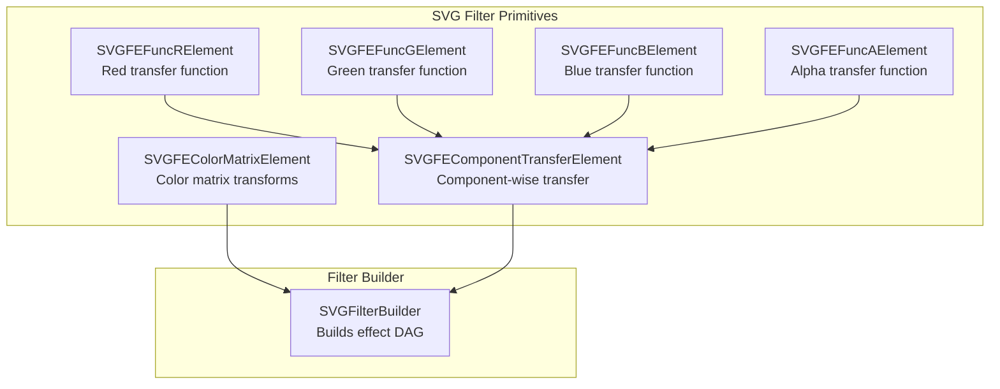
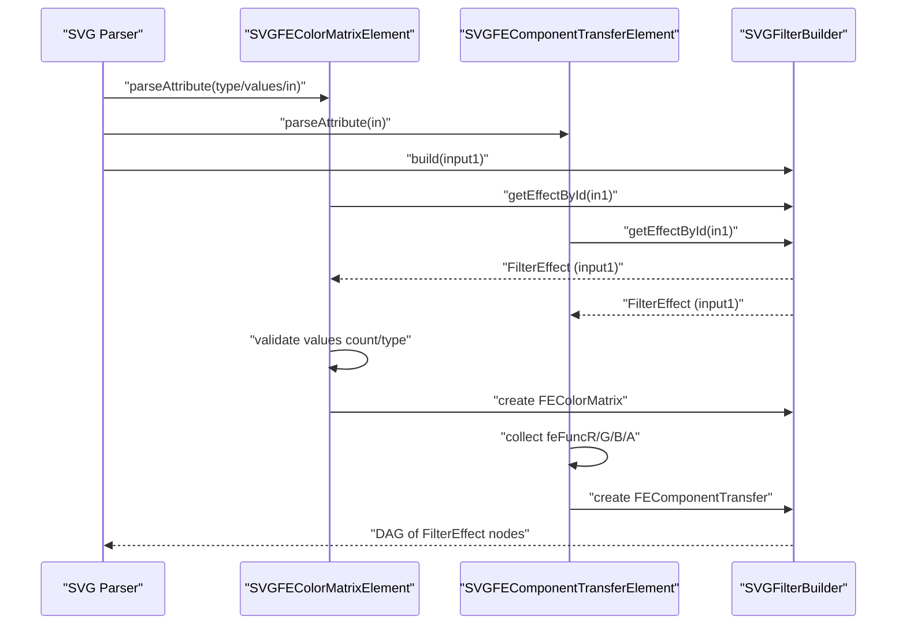
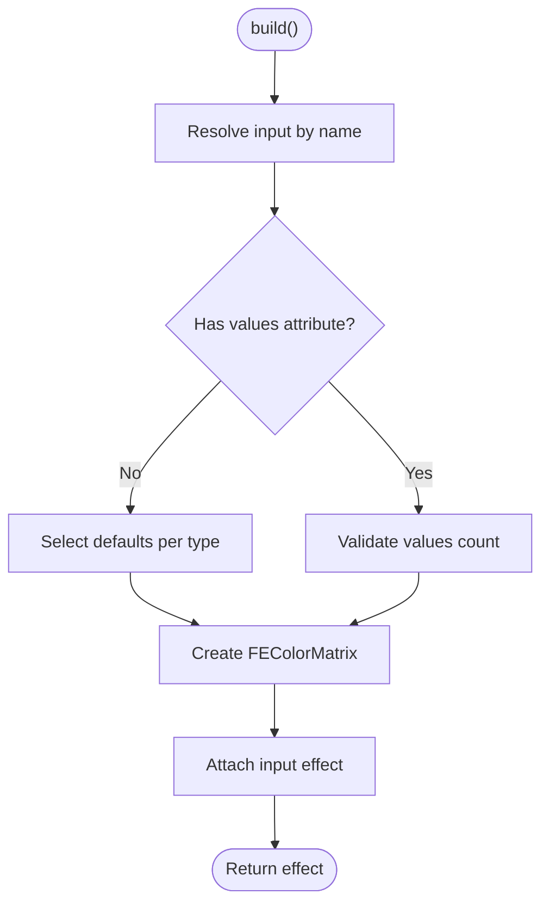
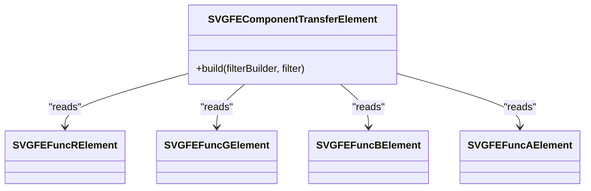
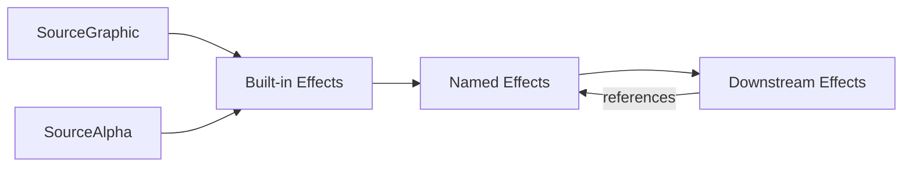

# Color Matrix and Transfer Effects

<cite>
**Referenced Files in This Document**
- [SVGFEColorMatrixElement.cpp](file://blink-b87d44f-Source-core-svg/SVGFEColorMatrixElement.cpp)
- [SVGFEColorMatrixElement.h](file://blink-b87d44f-Source-core-svg/SVGFEColorMatrixElement.h)
- [SVGFEComponentTransferElement.cpp](file://blink-b87d44f-Source-core-svg/SVGFEComponentTransferElement.cpp)
- [SVGFEComponentTransferElement.h](file://blink-b87d44f-Source-core-svg/SVGFEComponentTransferElement.h)
- [SVGFEFuncRElement.cpp](file://blink-b87d44f-Source-core-svg/SVGFEFuncRElement.cpp)
- [SVGFEFuncGElement.cpp](file://blink-b87d44f-Source-core-svg/SVGFEFuncGElement.cpp)
- [SVGFEFuncBElement.cpp](file://blink-b87d44f-Source-core-svg/SVGFEFuncBElement.cpp)
- [SVGFEFuncAElement.cpp](file://blink-b87d44f-Source-core-svg/SVGFEFuncAElement.cpp)
- [SVGFilterBuilder.cpp](file://blink-b87d44f-Source-core-svg/graphics/filters/SVGFilterBuilder.cpp)
- [SVGFilterBuilder.h](file://blink-b87d44f-Source-core-svg/graphics/filters/SVGFilterBuilder.h)
- [filters_test.dart](file://test/animation/filters_test.dart)
</cite>

## Table of Contents
1. [Introduction](#introduction)
2. [Project Structure](#project-structure)
3. [Core Components](#core-components)
4. [Architecture Overview](#architecture-overview)
5. [Detailed Component Analysis](#detailed-component-analysis)
6. [Dependency Analysis](#dependency-analysis)
7. [Performance Considerations](#performance-considerations)
8. [Troubleshooting Guide](#troubleshooting-guide)
9. [Conclusion](#conclusion)
10. [Appendices](#appendices)

## Introduction
This document explains color manipulation filter effects implemented in the codebase, focusing on:
- Color matrix transformations (including hue rotation, saturation, luminance-to-alpha)
- Component transfer functions (identity, gamma, linearity, table-based transfers)
- Practical workflows for color correction, theming, and dynamic effects
- Color space considerations, alpha handling, and interpolation techniques
- Accuracy, performance, and compatibility guidance

It synthesizes the SVG filter primitives for color matrix and component transfer, the transfer function elements, and the filter building pipeline that connects them into a renderable effect chain.

## Project Structure
The color manipulation features are implemented as SVG filter primitives and their associated transfer function elements. They integrate with a filter builder that wires inputs and named results into a directed acyclic graph of filter effects.

**Diagram sources**
- [SVGFEColorMatrixElement.cpp:133-174](file://blink-b87d44f-Source-core-svg/SVGFEColorMatrixElement.cpp#L133-L174)
- [SVGFEComponentTransferElement.cpp:79-105](file://blink-b87d44f-Source-core-svg/SVGFEComponentTransferElement.cpp#L79-L105)
- [SVGFEFuncRElement.cpp:28-38](file://blink-b87d44f-Source-core-svg/SVGFEFuncRElement.cpp#L28-L38)
- [SVGFEFuncGElement.cpp:28-38](file://blink-b87d44f-Source-core-svg/SVGFEFuncGElement.cpp#L28-L38)
- [SVGFEFuncBElement.cpp:28-38](file://blink-b87d44f-Source-core-svg/SVGFEFuncBElement.cpp#L28-L38)
- [SVGFEFuncAElement.cpp:28-38](file://blink-b87d44f-Source-core-svg/SVGFEFuncAElement.cpp#L28-L38)
- [SVGFilterBuilder.cpp:31-65](file://blink-b87d44f-Source-core-svg/graphics/filters/SVGFilterBuilder.cpp#L31-L65)

**Section sources**
- [SVGFEColorMatrixElement.cpp:133-174](file://blink-b87d44f-Source-core-svg/SVGFEColorMatrixElement.cpp#L133-L174)
- [SVGFEComponentTransferElement.cpp:79-105](file://blink-b87d44f-Source-core-svg/SVGFEComponentTransferElement.cpp#L79-L105)
- [SVGFilterBuilder.cpp:31-65](file://blink-b87d44f-Source-core-svg/graphics/filters/SVGFilterBuilder.cpp#L31-L65)

## Core Components
- Color Matrix Element: Parses attributes for input, type, and values; constructs a color matrix effect with appropriate defaults and validation.
- Component Transfer Element: Aggregates per-channel transfer functions (R, G, B, A) and builds a component transfer effect.
- Transfer Function Elements: Provide individual channel transfer definitions (e.g., linear, gamma, table).
- Filter Builder: Resolves inputs by name, manages built-in effects, and constructs the effect graph.

Key behaviors:
- Attribute parsing and animated property registration for type and values
- Validation of values count per type (matrix vs. hue/saturation)
- Default value selection when values are absent
- Per-channel transfer function composition

**Section sources**
- [SVGFEColorMatrixElement.h:31-66](file://blink-b87d44f-Source-core-svg/SVGFEColorMatrixElement.h#L31-L66)
- [SVGFEColorMatrixElement.cpp:69-97](file://blink-b87d44f-Source-core-svg/SVGFEColorMatrixElement.cpp#L69-L97)
- [SVGFEComponentTransferElement.cpp:79-105](file://blink-b87d44f-Source-core-svg/SVGFEComponentTransferElement.cpp#L79-L105)
- [SVGFEFuncRElement.cpp:28-38](file://blink-b87d44f-Source-core-svg/SVGFEFuncRElement.cpp#L28-L38)
- [SVGFEFuncGElement.cpp:28-38](file://blink-b87d44f-Source-core-svg/SVGFEFuncGElement.cpp#L28-L38)
- [SVGFEFuncBElement.cpp:28-38](file://blink-b87d44f-Source-core-svg/SVGFEFuncBElement.cpp#L28-L38)
- [SVGFEFuncAElement.cpp:28-38](file://blink-b87d44f-Source-core-svg/SVGFEFuncAElement.cpp#L28-L38)
- [SVGFilterBuilder.cpp:31-65](file://blink-b87d44f-Source-core-svg/graphics/filters/SVGFilterBuilder.cpp#L31-L65)

## Architecture Overview
The filter pipeline resolves named inputs and composes effects in a directed manner. The color matrix and component transfer primitives both accept an input and produce a filtered output that can be consumed by subsequent primitives.

**Diagram sources**
- [SVGFEColorMatrixElement.cpp:69-97](file://blink-b87d44f-Source-core-svg/SVGFEColorMatrixElement.cpp#L69-L97)
- [SVGFEComponentTransferElement.cpp:64-77](file://blink-b87d44f-Source-core-svg/SVGFEComponentTransferElement.cpp#L64-L77)
- [SVGFilterBuilder.cpp:52-65](file://blink-b87d44f-Source-core-svg/graphics/filters/SVGFilterBuilder.cpp#L52-L65)

## Detailed Component Analysis

### Color Matrix Transformations
The color matrix element supports:
- Matrix: 5x4 transformation plus offset column
- Saturate: single scalar controlling saturation strength
- Hue Rotate: angle in degrees rotating the hue
- Luminance To Alpha: converts luminance to alpha

Behavior highlights:
- Defaults when values are omitted
- Validation of values length per type
- Integration via the filter builder to attach input and produce output

**Diagram sources**
- [SVGFEColorMatrixElement.cpp:133-174](file://blink-b87d44f-Source-core-svg/SVGFEColorMatrixElement.cpp#L133-L174)

**Section sources**
- [SVGFEColorMatrixElement.h:31-66](file://blink-b87d44f-Source-core-svg/SVGFEColorMatrixElement.h#L31-L66)
- [SVGFEColorMatrixElement.cpp:133-174](file://blink-b87d44f-Source-core-svg/SVGFEColorMatrixElement.cpp#L133-L174)

### Component Transfer Functions
The component transfer element aggregates four per-channel transfer functions:
- Red (feFuncR)
- Green (feFuncG)
- Blue (feFuncB)
- Alpha (feFuncA)

Each function defines a transfer strategy (e.g., identity, gamma, linear, table/discrete) and parameters.

**Diagram sources**
- [SVGFEComponentTransferElement.cpp:79-105](file://blink-b87d44f-Source-core-svg/SVGFEComponentTransferElement.cpp#L79-L105)
- [SVGFEFuncRElement.cpp:28-38](file://blink-b87d44f-Source-core-svg/SVGFEFuncRElement.cpp#L28-L38)
- [SVGFEFuncGElement.cpp:28-38](file://blink-b87d44f-Source-core-svg/SVGFEFuncGElement.cpp#L28-L38)
- [SVGFEFuncBElement.cpp:28-38](file://blink-b87d44f-Source-core-svg/SVGFEFuncBElement.cpp#L28-L38)
- [SVGFEFuncAElement.cpp:28-38](file://blink-b87d44f-Source-core-svg/SVGFEFuncAElement.cpp#L28-L38)

**Section sources**
- [SVGFEComponentTransferElement.cpp:79-105](file://blink-b87d44f-Source-core-svg/SVGFEComponentTransferElement.cpp#L79-L105)
- [SVGFEFuncRElement.cpp:28-38](file://blink-b87d44f-Source-core-svg/SVGFEFuncRElement.cpp#L28-L38)
- [SVGFEFuncGElement.cpp:28-38](file://blink-b87d44f-Source-core-svg/SVGFEFuncGElement.cpp#L28-L38)
- [SVGFEFuncBElement.cpp:28-38](file://blink-b87d44f-Source-core-svg/SVGFEFuncBElement.cpp#L28-L38)
- [SVGFEFuncAElement.cpp:28-38](file://blink-b87d44f-Source-core-svg/SVGFEFuncAElement.cpp#L28-L38)

### Transfer Function Types and Parameters
Based on tests and element structure, the component transfer supports:
- Identity: no transformation
- Linear: slope and intercept parameters
- Gamma: amplitude, exponent, offset parameters
- Table: discrete mapping values
- Discrete: piecewise constant mapping values

These are configured per channel (R, G, B, A) and validated during construction.

**Section sources**
- [filters_test.dart:235-254](file://test/animation/filters_test.dart#L235-L254)

## Dependency Analysis
The filter builder maintains:
- Built-in effects (source graphic/alpha)
- Named effects by ID
- References from inputs to downstream effects
- Render-object to effect mapping

This ensures correct traversal and invalidation of dependent effects when attributes change.

**Diagram sources**
- [SVGFilterBuilder.cpp:31-65](file://blink-b87d44f-Source-core-svg/graphics/filters/SVGFilterBuilder.cpp#L31-L65)
- [SVGFilterBuilder.h:35-79](file://blink-b87d44f-Source-core-svg/graphics/filters/SVGFilterBuilder.h#L35-L79)

**Section sources**
- [SVGFilterBuilder.cpp:31-104](file://blink-b87d44f-Source-core-svg/graphics/filters/SVGFilterBuilder.cpp#L31-L104)
- [SVGFilterBuilder.h:35-79](file://blink-b87d44f-Source-core-svg/graphics/filters/SVGFilterBuilder.h#L35-L79)

## Performance Considerations
- Minimize chained filter primitives to reduce intermediate buffers and passes.
- Prefer vectorized or batched operations where applicable; keep per-pixel computations simple.
- Reuse named inputs to avoid duplicating upstream effects.
- Validate attribute counts early to fail fast and avoid unnecessary allocations.
- Keep transfer function tables compact; limit table sizes for table-based functions.

## Troubleshooting Guide
Common issues and resolutions:
- Incorrect values count for color matrix type: ensure 20 values for matrix, 1 for hueRotate/saturate; otherwise the primitive rejects the configuration.
- Missing input reference: if the input ID does not resolve, the primitive returns null; verify the named input exists earlier in the filter chain.
- Transfer function mismatch: ensure each feFunc* element matches the intended channel and type; verify parameters align with the chosen function type.

Validation and defaults are enforced in the build routines and element parsers.

**Section sources**
- [SVGFEColorMatrixElement.cpp:143-169](file://blink-b87d44f-Source-core-svg/SVGFEColorMatrixElement.cpp#L143-L169)
- [SVGFEComponentTransferElement.cpp:79-105](file://blink-b87d44f-Source-core-svg/SVGFEComponentTransferElement.cpp#L79-L105)

## Conclusion
The color matrix and component transfer primitives provide a robust foundation for color manipulation in SVG filters. By combining validated color matrix transforms with flexible per-channel transfer functions, applications can implement precise color corrections, theme-driven color swaps, and dynamic effects. Proper use of the filter builder ensures correct input resolution and effect composition, while adherence to validation rules and performance guidelines yields accurate and efficient rendering.

## Appendices

### Practical Workflows

- Color correction pipeline
  - Start with a color matrix to adjust brightness/contrast or desaturate.
  - Apply component transfer to fine-tune gamma and linear scaling per channel.
  - Optionally convert luminance to alpha for masking effects.

- Theme-based color changes
  - Use hue rotation to shift tones across a palette.
  - Adjust saturation to emphasize or de-emphasize vibrancy.
  - Combine with linear transfer to scale channel intensities uniformly.

- Dynamic color effects
  - Animate hue rotation or saturation values over time.
  - Use gamma transfer to simulate CRT-like curves or modern display curves.
  - Employ table transfer to approximate lookup-table (LUT) effects.

### Compatibility Notes
- Ensure values lists match the selected type to maintain compatibility with SVG filter semantics.
- Validate per-channel transfer function types and parameters to avoid undefined behavior.
- When integrating with higher-level frameworks, confirm that the filter builder’s input resolution and named effect scoping align with the rendering pipeline.