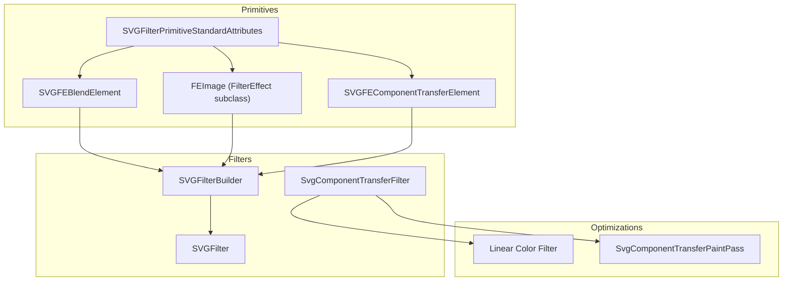
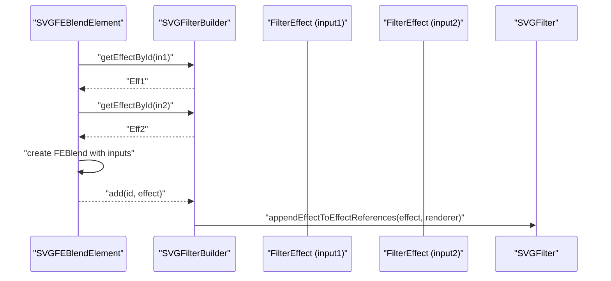
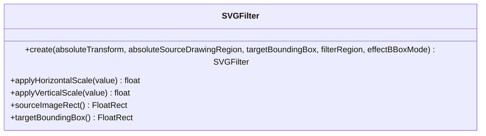
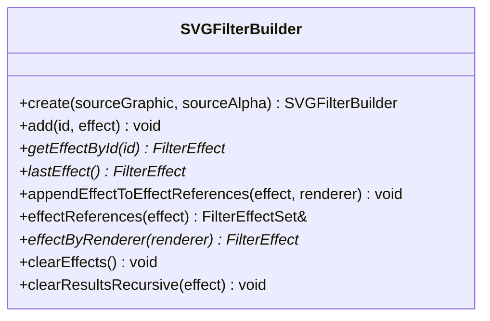
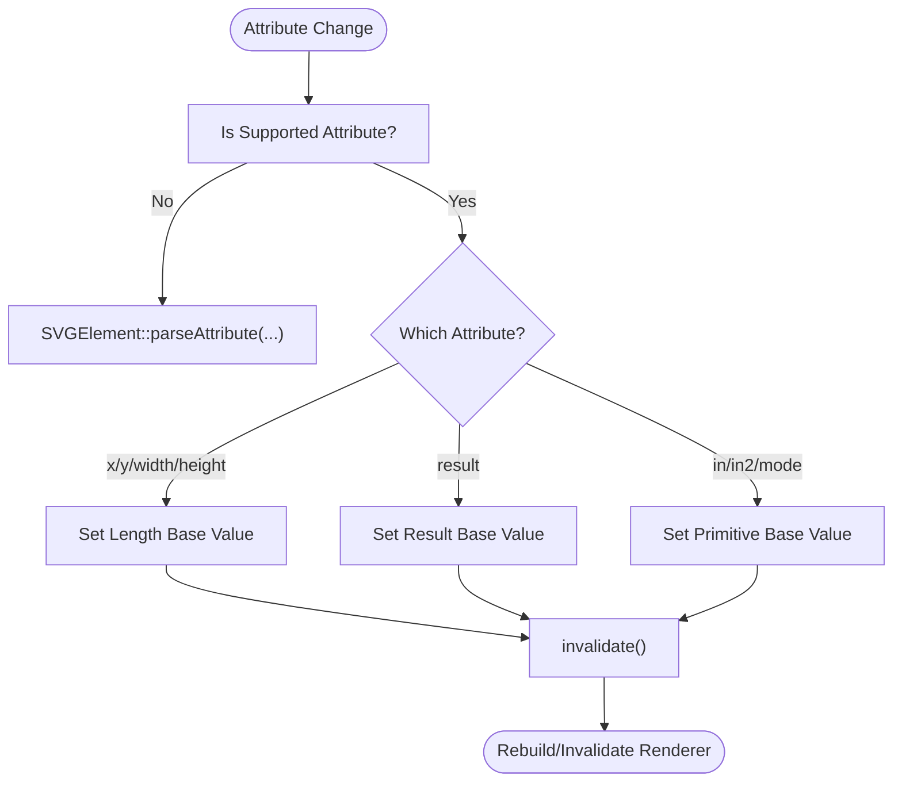
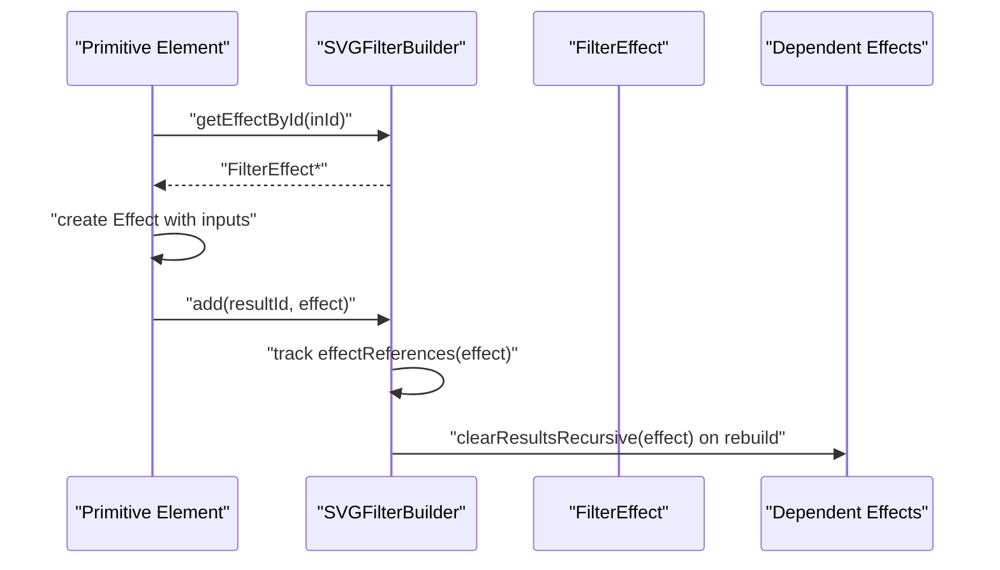
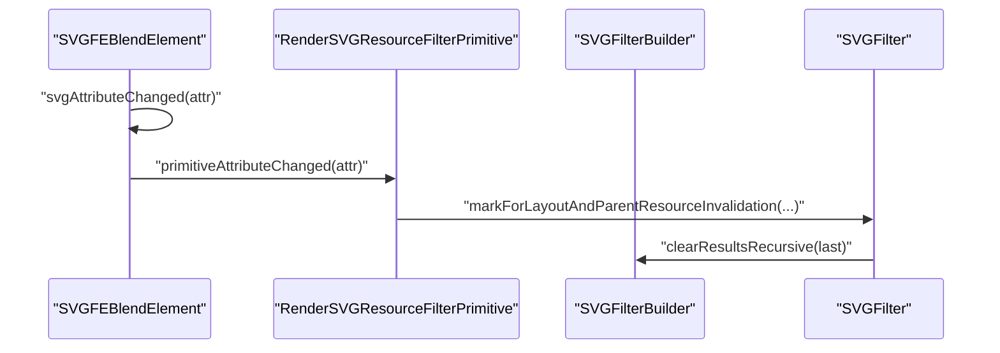
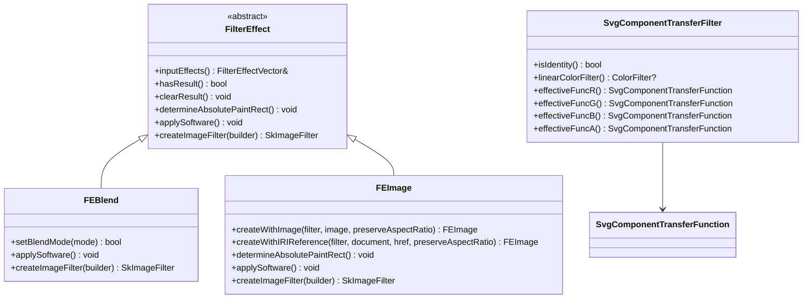
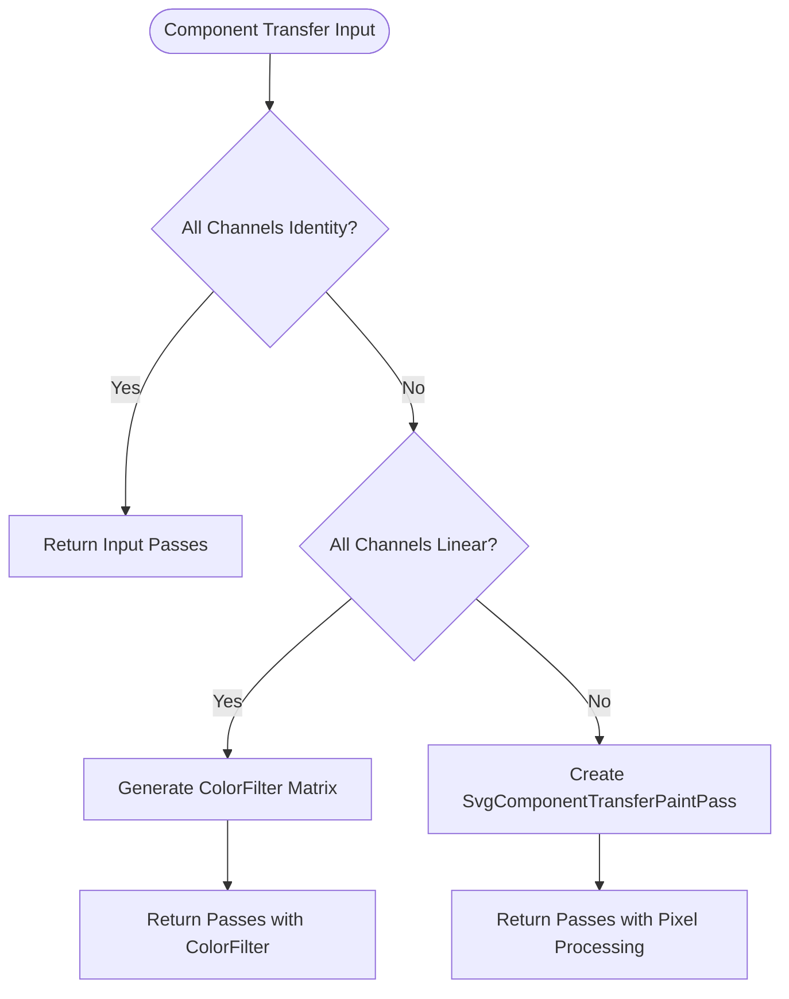
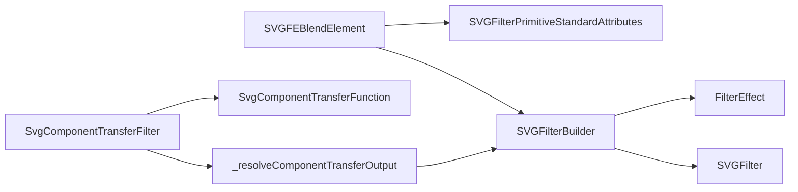

# Filter Architecture and Registry

<cite>
**Referenced Files in This Document**
- [SVGFilter.cpp](file://blink-b87d44f-Source-core-svg/graphics/filters/SVGFilter.cpp)
- [SVGFilter.h](file://blink-b87d44f-Source-core-svg/graphics/filters/SVGFilter.h)
- [SVGFilterBuilder.cpp](file://blink-b87d44f-Source-core-svg/graphics/filters/SVGFilterBuilder.cpp)
- [SVGFilterBuilder.h](file://blink-b87d44f-Source-core-svg/graphics/filters/SVGFilterBuilder.h)
- [SVGFEBlendElement.cpp](file://blink-b87d44f-Source-core-svg/SVGFEBlendElement.cpp)
- [SVGFilterPrimitiveStandardAttributes.cpp](file://blink-b87d44f-Source-core-svg/SVGFilterPrimitiveStandardAttributes.cpp)
- [SVGFEImage.h](file://blink-b87d44f-Source-core-svg/graphics/filters/SVGFEImage.h)
- [svg_filters_registry_pipeline_primitives_effects.dart](file://lib/src/animation/svg_filters_registry_pipeline_primitives_effects.dart)
- [svg_filters_primitives_component_transfer.dart](file://lib/src/animation/svg_filters_primitives_component_transfer.dart)
- [svg_filters_types.dart](file://lib/src/animation/svg_filters_types.dart)
- [filter_component_transfer_test.dart](file://test/animation/filter_component_transfer_test.dart)
- [filters_test.dart](file://test/animation/filters_test.dart)
- [SVGFEComponentTransferElement.cpp](file://blink-b87d44f-Source-core-svg/SVGFEComponentTransferElement.cpp)
- [SVGFEComponentTransferElement.h](file://blink-b87d44f-Source-core-svg/SVGFEComponentTransferElement.h)
</cite>

## Update Summary
**Changes Made**
- Enhanced component transfer filter registry with optimized linear transformation support
- Improved output resolution for component transfer operations through better pass-through optimization
- Added performance optimizations for common linear transformations using ColorFilter matrices
- Updated filter registry to distinguish between identity, linear-only, and pixel-processing transfers

## Table of Contents
1. [Introduction](#introduction)
2. [Project Structure](#project-structure)
3. [Core Components](#core-components)
4. [Architecture Overview](#architecture-overview)
5. [Detailed Component Analysis](#detailed-component-analysis)
6. [Enhanced Component Transfer Registry](#enhanced-component-transfer-registry)
7. [Performance Optimizations](#performance-optimizations)
8. [Dependency Analysis](#dependency-analysis)
9. [Performance Considerations](#performance-considerations)
10. [Troubleshooting Guide](#troubleshooting-guide)
11. [Conclusion](#conclusion)

## Introduction
This document explains the SVG filter architecture and registry system implemented in the Blink-based rendering engine portion of the project. It focuses on the pipeline composition model, filter primitive registration mechanism, input/output management, compositing operations, primitive effects processing, paint pipeline integration, filter chain execution order, intermediate result handling, and memory management strategies. The system now includes enhanced optimizations for component transfer operations with better output resolution and improved performance for common linear transformations.

## Project Structure
The filter subsystem resides under the graphics/filters directory and integrates with SVG element primitives and the generic filter effect framework. The key files include:
- SVGFilter: Defines the filter container and scaling behavior.
- SVGFilterBuilder: Manages named and built-in filter effects, input/output wiring, and result clearing.
- SVGFEBlendElement: Demonstrates primitive registration, attribute parsing, and effect construction.
- SVGFilterPrimitiveStandardAttributes: Provides shared primitive attributes (x, y, width, height, result) and renderer integration.
- SVGFEImage.h: Shows a concrete filter primitive class extending the generic FilterEffect base.
- SvgComponentTransferFilter: Enhanced component transfer filter with optimized linear transformation support.

**Diagram sources**
- [SVGFilter.cpp:28-55](file://blink-b87d44f-Source-core-svg/graphics/filters/SVGFilter.cpp#L28-L55)
- [SVGFilterBuilder.cpp:31-104](file://blink-b87d44f-Source-core-svg/graphics/filters/SVGFilterBuilder.cpp#L31-L104)
- [SVGFEBlendElement.cpp:128-142](file://blink-b87d44f-Source-core-svg/SVGFEBlendElement.cpp#L128-L142)
- [SVGFEImage.h:36-62](file://blink-b87d44f-Source-core-svg/graphics/filters/SVGFEImage.h#L36-L62)
- [svg_filters_primitives_component_transfer.dart:135-184](file://lib/src/animation/svg_filters_primitives_component_transfer.dart#L135-L184)
- [svg_filters_registry_pipeline_primitives_effects.dart:242-284](file://lib/src/animation/svg_filters_registry_pipeline_primitives_effects.dart#L242-L284)

**Section sources**
- [SVGFilter.cpp:28-55](file://blink-b87d44f-Source-core-svg/graphics/filters/SVGFilter.cpp#L28-L55)
- [SVGFilterBuilder.cpp:31-104](file://blink-b87d44f-Source-core-svg/graphics/filters/SVGFilterBuilder.cpp#L31-L104)
- [SVGFEBlendElement.cpp:128-142](file://blink-b87d44f-Source-core-svg/SVGFEBlendElement.cpp#L128-L142)
- [SVGFEImage.h:36-62](file://blink-b87d44f-Source-core-svg/graphics/filters/SVGFEImage.h#L36-L62)
- [svg_filters_primitives_component_transfer.dart:135-184](file://lib/src/animation/svg_filters_primitives_component_transfer.dart#L135-L184)
- [svg_filters_registry_pipeline_primitives_effects.dart:242-284](file://lib/src/animation/svg_filters_registry_pipeline_primitives_effects.dart#L242-L284)

## Core Components
- SVGFilter: Encapsulates filter geometry and coordinate scaling. It stores the absolute drawing region, target bounding box, and effect bounding-box mode, and applies horizontal/vertical scaling accordingly.
- SVGFilterBuilder: Maintains built-in effects (source graphic/alpha), named effects, and inter-effect references. It wires inputs, resolves IDs, and clears intermediate results recursively.
- SVGFilterPrimitiveStandardAttributes: Supplies common attributes for primitives (x, y, width, height, result) and renderer integration for filter primitives.
- SVGFEBlendElement: Registers animated properties, parses attributes, and constructs a blending effect with two inputs resolved via the builder.
- FEImage: A concrete filter effect representing image-based primitives, inheriting from FilterEffect.
- SvgComponentTransferFilter: Enhanced component transfer filter with optimized linear transformation support and pass-through optimization.

Key responsibilities:
- Pipeline composition: Builder composes a directed acyclic graph of FilterEffect nodes.
- Input/output management: Inputs are resolved by ID; named and built-in effects are supported.
- Paint pipeline integration: Primitives participate in rendering via renderers and can trigger invalidations on attribute changes.
- Memory management: Builder clears results recursively to avoid stale intermediate textures; effects manage their own internal resources.
- Component transfer optimization: Linear-only transformations use ColorFilter for better performance; identity and complex transforms use specialized passes.

**Section sources**
- [SVGFilter.cpp:28-55](file://blink-b87d44f-Source-core-svg/graphics/filters/SVGFilter.cpp#L28-L55)
- [SVGFilterBuilder.cpp:31-104](file://blink-b87d44f-Source-core-svg/graphics/filters/SVGFilterBuilder.cpp#L31-L104)
- [SVGFilterPrimitiveStandardAttributes.cpp:34-102](file://blink-b87d44f-Source-core-svg/SVGFilterPrimitiveStandardAttributes.cpp#L34-L102)
- [SVGFEBlendElement.cpp:37-142](file://blink-b87d44f-Source-core-svg/SVGFEBlendElement.cpp#L37-L142)
- [SVGFEImage.h:36-62](file://blink-b87d44f-Source-core-svg/graphics/filters/SVGFEImage.h#L36-L62)
- [svg_filters_primitives_component_transfer.dart:135-184](file://lib/src/animation/svg_filters_primitives_component_transfer.dart#L135-L184)

## Architecture Overview
The filter architecture follows a composition model:
- Each filter defines a region and coordinate scaling behavior.
- Primitives define inputs and outputs (via result IDs) and are wired by the builder.
- The builder maintains a registry of named effects and built-ins, enabling primitives to reference previous outputs by ID.
- On attribute changes, primitives invalidate and rebuild affected parts of the pipeline.
- Component transfer operations now include optimized pass-through detection and linear transformation support.

**Diagram sources**
- [SVGFEBlendElement.cpp:128-142](file://blink-b87d44f-Source-core-svg/SVGFEBlendElement.cpp#L128-L142)
- [SVGFilterBuilder.cpp:38-82](file://blink-b87d44f-Source-core-svg/graphics/filters/SVGFilterBuilder.cpp#L38-L82)

## Detailed Component Analysis

### SVGFilter
- Purpose: Container for filter geometry and scaling behavior.
- Behavior:
  - Stores absolute drawing region and target bounding box.
  - Applies horizontal/vertical scaling depending on effect bounding-box mode.
  - Exposes source image rect and target bounding box for downstream effects.

**Diagram sources**
- [SVGFilter.h:35-51](file://blink-b87d44f-Source-core-svg/graphics/filters/SVGFilter.h#L35-L51)
- [SVGFilter.cpp:28-55](file://blink-b87d44f-Source-core-svg/graphics/filters/SVGFilter.cpp#L28-L55)

**Section sources**
- [SVGFilter.h:35-51](file://blink-b87d44f-Source-core-svg/graphics/filters/SVGFilter.h#L35-L51)
- [SVGFilter.cpp:28-55](file://blink-b87d44f-Source-core-svg/graphics/filters/SVGFilter.cpp#L28-L55)

### SVGFilterBuilder
- Purpose: Compose and manage filter effect graphs.
- Responsibilities:
  - Register built-in effects (source graphic/alpha).
  - Add named effects by result ID; resolve empty IDs to last effect or source graphic.
  - Track effect references to enable recursive result clearing.
  - Clear effects and results; maintain renderer-to-effect mapping.

**Diagram sources**
- [SVGFilterBuilder.h:35-79](file://blink-b87d44f-Source-core-svg/graphics/filters/SVGFilterBuilder.h#L35-L79)
- [SVGFilterBuilder.cpp:31-104](file://blink-b87d44f-Source-core-svg/graphics/filters/SVGFilterBuilder.cpp#L31-L104)

**Section sources**
- [SVGFilterBuilder.h:35-79](file://blink-b87d44f-Source-core-svg/graphics/filters/SVGFilterBuilder.h#L35-L79)
- [SVGFilterBuilder.cpp:31-104](file://blink-b87d44f-Source-core-svg/graphics/filters/SVGFilterBuilder.cpp#L31-L104)

### Primitive Registration and Attribute Parsing
- SVGFilterPrimitiveStandardAttributes:
  - Registers animated properties for x, y, width, height, result.
  - Parses length attributes and sets base values.
  - Provides renderer creation and invalidation hooks for attribute changes.
- SVGFEBlendElement:
  - Registers animated properties for in1, in2, and mode.
  - Parses attributes and sets base values.
  - Builds a blending effect with two inputs resolved from the builder.

**Diagram sources**
- [SVGFilterPrimitiveStandardAttributes.cpp:75-113](file://blink-b87d44f-Source-core-svg/SVGFilterPrimitiveStandardAttributes.cpp#L75-L113)
- [SVGFEBlendElement.cpp:69-126](file://blink-b87d44f-Source-core-svg/SVGFEBlendElement.cpp#L69-L126)

**Section sources**
- [SVGFilterPrimitiveStandardAttributes.cpp:34-102](file://blink-b87d44f-Source-core-svg/SVGFilterPrimitiveStandardAttributes.cpp#L34-L102)
- [SVGFEBlendElement.cpp:37-142](file://blink-b87d44f-Source-core-svg/SVGFEBlendElement.cpp#L37-L142)

### Input/Output Management and Pipeline Composition
- Named effects are stored by result ID; empty ID defaults to last effect or source graphic.
- Inputs are appended to the effect's input vector; references are tracked for recursive clearing.
- The builder ensures each effect is uniquely registered and linked to dependents.

**Diagram sources**
- [SVGFilterBuilder.cpp:38-82](file://blink-b87d44f-Source-core-svg/graphics/filters/SVGFilterBuilder.cpp#L38-L82)
- [SVGFEBlendElement.cpp:128-142](file://blink-b87d44f-Source-core-svg/SVGFEBlendElement.cpp#L128-L142)

**Section sources**
- [SVGFilterBuilder.cpp:38-82](file://blink-b87d44f-Source-core-svg/graphics/filters/SVGFilterBuilder.cpp#L38-L82)
- [SVGFEBlendElement.cpp:128-142](file://blink-b87d44f-Source-core-svg/SVGFEBlendElement.cpp#L128-L142)

### Paint Pipeline Integration
- Primitives create a renderer when needed and participate in layout/resource invalidation.
- Attribute changes trigger invalidation and potential re-build of the filter graph.

**Diagram sources**
- [SVGFilterPrimitiveStandardAttributes.cpp:139-156](file://blink-b87d44f-Source-core-svg/SVGFilterPrimitiveStandardAttributes.cpp#L139-L156)
- [SVGFilterBuilder.cpp:93-104](file://blink-b87d44f-Source-core-svg/graphics/filters/SVGFilterBuilder.cpp#L93-L104)

**Section sources**
- [SVGFilterPrimitiveStandardAttributes.cpp:139-156](file://blink-b87d44f-Source-core-svg/SVGFilterPrimitiveStandardAttributes.cpp#L139-L156)
- [SVGFilterBuilder.cpp:93-104](file://blink-b87d44f-Source-core-svg/graphics/filters/SVGFilterBuilder.cpp#L93-L104)

### Compositing Operations and Primitive Effects Processing
- Example: feBlend constructs a two-input blending effect using inputs resolved by the builder.
- Other primitives (e.g., feImage) inherit from FilterEffect and implement apply/software/image filter paths.
- Component transfer operations now include optimized pass-through detection and linear transformation support.

**Diagram sources**
- [SVGFEBlendElement.cpp:128-142](file://blink-b87d44f-Source-core-svg/SVGFEBlendElement.cpp#L128-L142)
- [SVGFEImage.h:36-62](file://blink-b87d44f-Source-core-svg/graphics/filters/SVGFEImage.h#L36-L62)
- [svg_filters_primitives_component_transfer.dart:92-196](file://lib/src/animation/svg_filters_primitives_component_transfer.dart#L92-L196)

**Section sources**
- [SVGFEBlendElement.cpp:128-142](file://blink-b87d44f-Source-core-svg/SVGFEBlendElement.cpp#L128-L142)
- [SVGFEImage.h:36-62](file://blink-b87d44f-Source-core-svg/graphics/filters/SVGFEImage.h#L36-L62)
- [svg_filters_primitives_component_transfer.dart:92-196](file://lib/src/animation/svg_filters_primitives_component_transfer.dart#L92-L196)

## Enhanced Component Transfer Registry

### Linear Transformation Optimization
The component transfer filter registry now includes enhanced optimization for linear transformations:

- **Identity Detection**: The system detects when all channels are identity functions and passes through input unchanged without creating specialized passes.
- **Linear-Only Optimization**: When all channels use identity or linear functions, the system generates a ColorFilter matrix instead of pixel-by-pixel processing.
- **Complex Transform Detection**: For table, discrete, or gamma functions, the system creates specialized SvgComponentTransferPaintPass instances.

**Diagram sources**
- [svg_filters_registry_pipeline_primitives_effects.dart:242-284](file://lib/src/animation/svg_filters_registry_pipeline_primitives_effects.dart#L242-L284)
- [svg_filters_primitives_component_transfer.dart:135-184](file://lib/src/animation/svg_filters_primitives_component_transfer.dart#L135-L184)

### Component Transfer Function Types
The system supports five types of component transfer functions:

- **Identity**: No transformation applied (equivalent to 1.0 slope, 0.0 intercept)
- **Linear**: C' = slope × C + intercept
- **Gamma**: C' = amplitude × C^exponent + offset
- **Table**: Piecewise linear interpolation using table values
- **Discrete**: Step function using table values

**Section sources**
- [svg_filters_primitives_component_transfer.dart:4-86](file://lib/src/animation/svg_filters_primitives_component_transfer.dart#L4-L86)
- [svg_filters_types.dart:111-127](file://lib/src/animation/svg_filters_types.dart#L111-L127)

### Pass-Through Optimization
The registry implements intelligent pass-through optimization:

- **Identity Filters**: Completely bypass processing when all channels are identity
- **Linear-Only Filters**: Use ColorFilter for optimal performance
- **Mixed Functions**: Fall back to pixel-by-pixel processing for complex transformations

**Section sources**
- [svg_filters_registry_pipeline_primitives_effects.dart:242-284](file://lib/src/animation/svg_filters_registry_pipeline_primitives_effects.dart#L242-L284)
- [filter_component_transfer_test.dart:506-532](file://test/animation/filter_component_transfer_test.dart#L506-L532)

## Performance Optimizations

### ColorFilter Matrix Generation
For linear-only component transfer operations, the system generates optimized ColorFilter matrices:

- **Matrix Format**: 4×5 row-major matrix for RGB and alpha channels
- **Linear Functions**: Extract slope and intercept values for each channel
- **Identity Handling**: Automatically converts identity functions to 1.0 slope and 0.0 intercept

### Test Validation
Extensive testing validates the optimization behavior:

- **Identity Filters**: Pass through without creating SvgComponentTransferPaintPass
- **Linear-Only Filters**: Generate ColorFilter instead of pixel processing
- **Complex Filters**: Create SvgComponentTransferPaintPass for table, discrete, or gamma functions

**Section sources**
- [svg_filters_primitives_component_transfer.dart:135-184](file://lib/src/animation/svg_filters_primitives_component_transfer.dart#L135-L184)
- [filter_component_transfer_test.dart:512-551](file://test/animation/filter_component_transfer_test.dart#L512-L551)

## Dependency Analysis
- SVGFEBlendElement depends on SVGFilterPrimitiveStandardAttributes for shared attributes and on SVGFilterBuilder for effect resolution.
- SVGFilterBuilder depends on FilterEffect and maintains maps for built-in and named effects, and for effect references.
- SVGFilter encapsulates coordinate scaling and serves as the container for the composed pipeline.
- SvgComponentTransferFilter depends on SvgComponentTransferFunction for individual channel processing and on the registry for optimization decisions.

**Diagram sources**
- [SVGFEBlendElement.cpp:128-142](file://blink-b87d44f-Source-core-svg/SVGFEBlendElement.cpp#L128-L142)
- [SVGFilterBuilder.cpp:31-82](file://blink-b87d44f-Source-core-svg/graphics/filters/SVGFilterBuilder.cpp#L31-L82)
- [SVGFilter.cpp:28-55](file://blink-b87d44f-Source-core-svg/graphics/filters/SVGFilter.cpp#L28-L55)
- [svg_filters_primitives_component_transfer.dart:92-196](file://lib/src/animation/svg_filters_primitives_component_transfer.dart#L92-L196)
- [svg_filters_registry_pipeline_primitives_effects.dart:242-284](file://lib/src/animation/svg_filters_registry_pipeline_primitives_effects.dart#L242-L284)

**Section sources**
- [SVGFEBlendElement.cpp:128-142](file://blink-b87d44f-Source-core-svg/SVGFEBlendElement.cpp#L128-L142)
- [SVGFilterBuilder.cpp:31-82](file://blink-b87d44f-Source-core-svg/graphics/filters/SVGFilterBuilder.cpp#L31-L82)
- [SVGFilter.cpp:28-55](file://blink-b87d44f-Source-core-svg/graphics/filters/SVGFilter.cpp#L28-L55)
- [svg_filters_primitives_component_transfer.dart:92-196](file://lib/src/animation/svg_filters_primitives_component_transfer.dart#L92-L196)
- [svg_filters_registry_pipeline_primitives_effects.dart:242-284](file://lib/src/animation/svg_filters_registry_pipeline_primitives_effects.dart#L242-L284)

## Performance Considerations
- Intermediate result handling:
  - Use recursive result clearing to prevent stale intermediate textures when rebuilding the pipeline.
  - Avoid unnecessary recomputation by caching computed results until dependencies change.
- Filter chain execution order:
  - Ensure inputs are resolved in dependency order; the builder tracks references to propagate clears.
- Memory management:
  - Clear results recursively after invalidations; rely on RAII and RefPtr semantics for automatic cleanup.
- Pipeline optimization:
  - Minimize redundant intermediate results by sharing named effects where appropriate.
  - Prefer direct chaining of primitives with minimal intermediate steps.
- Component transfer optimization:
  - Use ColorFilter matrices for linear-only transformations to avoid pixel-by-pixel processing overhead.
  - Implement pass-through optimization for identity filters to eliminate unnecessary processing.
  - Create specialized passes only when required for complex transfer functions.

## Troubleshooting Guide
- Filter validation:
  - Verify that all inputs resolve to existing named effects or built-ins; unresolved inputs cause build failure.
  - Ensure result IDs are unique and consistently referenced.
- Error handling:
  - On attribute changes, primitives invalidate and rebuild; confirm that invalidation propagates to dependent effects.
  - Use recursive result clearing to avoid rendering artifacts from stale intermediates.
- Debugging complex filter chains:
  - Temporarily disable or reorder primitives to isolate problematic stages.
  - Inspect effect references and dependency chains maintained by the builder.
  - Confirm that attribute changes trigger expected invalidations and re-renders.
- Component transfer debugging:
  - Verify that linear-only filters generate ColorFilter instead of pixel processing passes.
  - Check that identity filters bypass processing entirely.
  - Ensure complex transfer functions (table, discrete, gamma) create SvgComponentTransferPaintPass instances.

**Section sources**
- [SVGFilterBuilder.cpp:93-104](file://blink-b87d44f-Source-core-svg/graphics/filters/SVGFilterBuilder.cpp#L93-L104)
- [SVGFEBlendElement.cpp:128-142](file://blink-b87d44f-Source-core-svg/SVGFEBlendElement.cpp#L128-L142)
- [filter_component_transfer_test.dart:506-551](file://test/animation/filter_component_transfer_test.dart#L506-L551)

## Conclusion
The SVG filter architecture composes a directed acyclic graph of FilterEffect nodes, managed by SVGFilterBuilder. Primitives register animated properties, parse attributes, and construct effects with inputs resolved by ID. SVGFilter handles coordinate scaling and geometry. The system integrates with the paint pipeline via renderers and invalidations, supports recursive result clearing for memory safety, and enables efficient composition of complex filter chains. 

The enhanced component transfer registry provides significant performance improvements through intelligent optimization:
- Identity filters pass through unchanged without processing overhead
- Linear-only transformations use ColorFilter matrices for optimal performance
- Complex transfer functions (table, discrete, gamma) use specialized pixel processing passes
- Comprehensive test coverage ensures correct behavior across all transfer function types

Following the registration and composition patterns demonstrated here allows adding custom primitives and optimizing pipelines effectively while maintaining backward compatibility and performance standards.