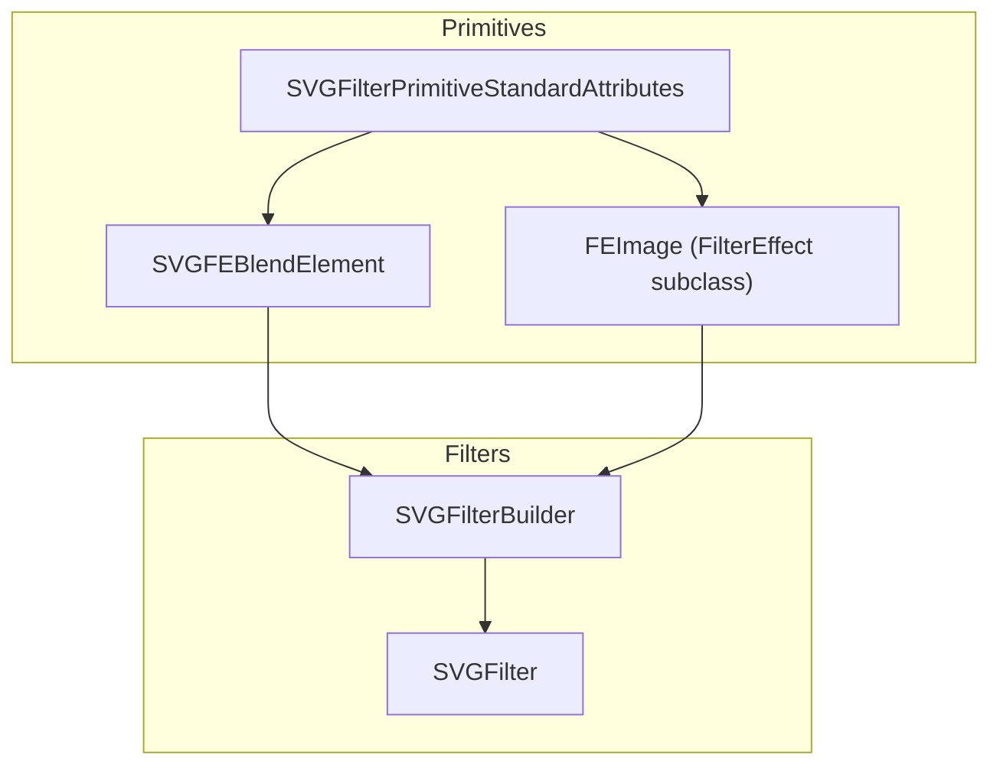
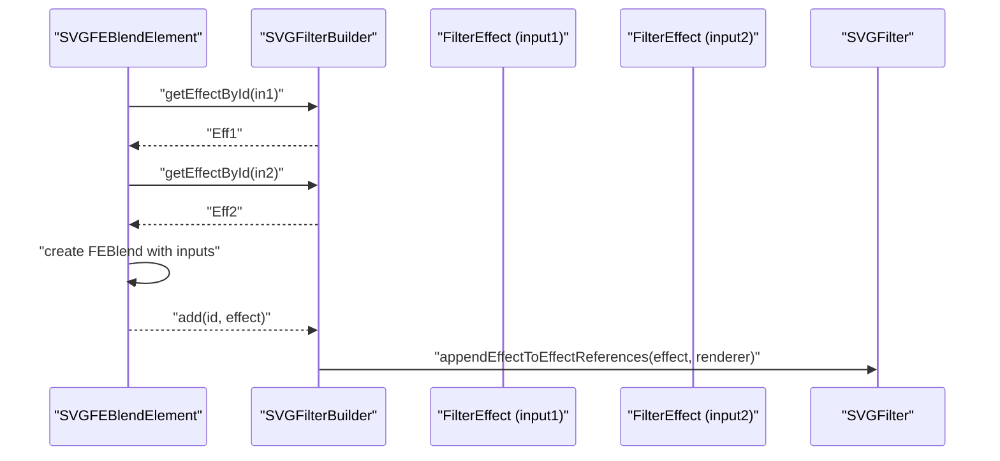
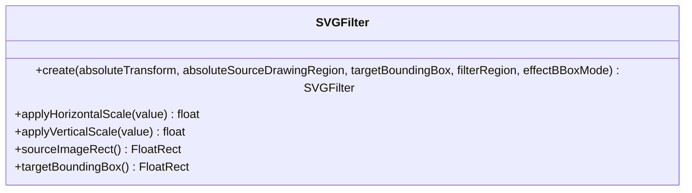
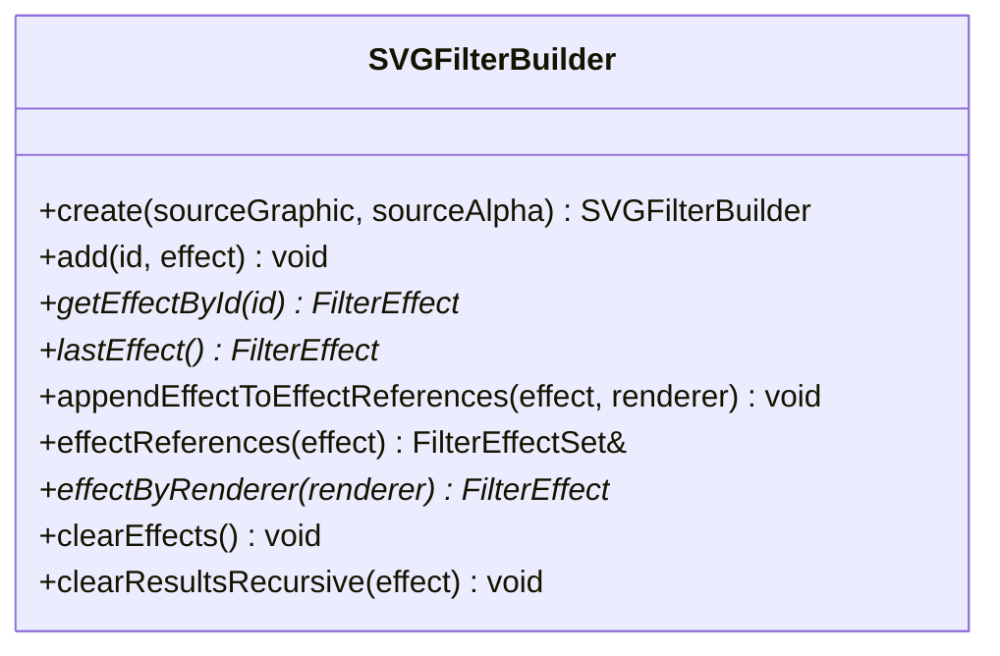
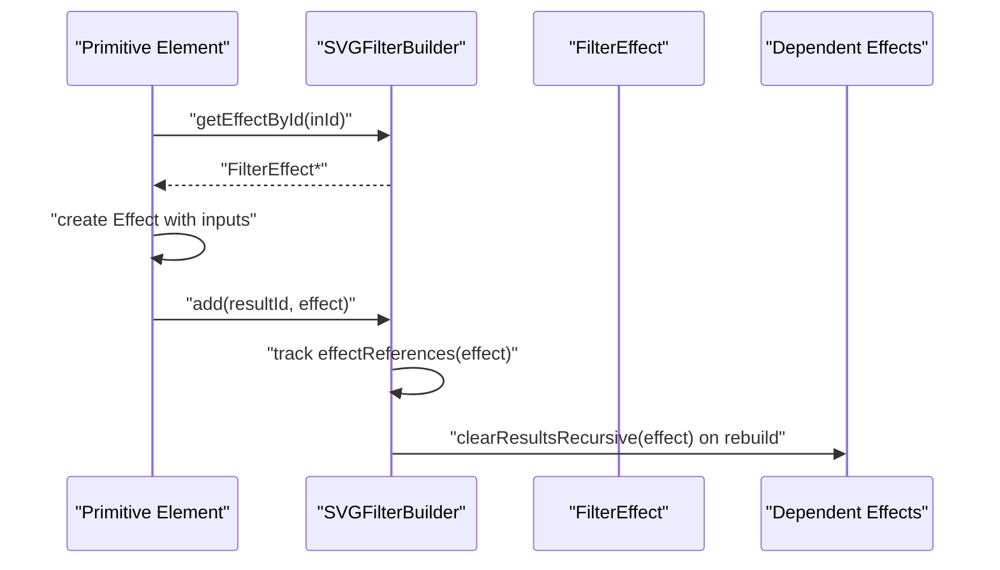
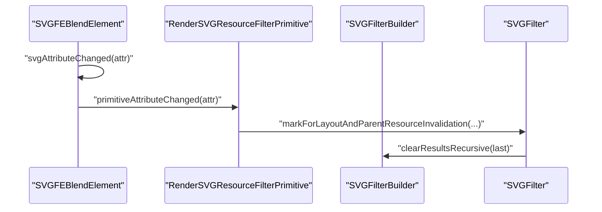
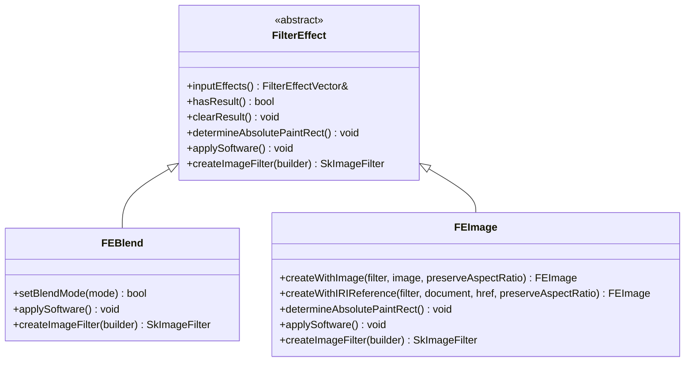
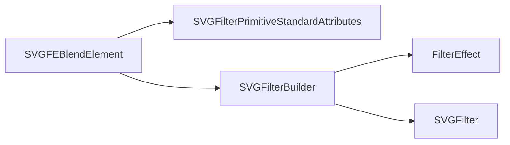

# Filter Architecture and Registry

<cite>
**Referenced Files in This Document**
- [SVGFilter.cpp](file://blink-b87d44f-Source-core-svg/graphics/filters/SVGFilter.cpp)
- [SVGFilter.h](file://blink-b87d44f-Source-core-svg/graphics/filters/SVGFilter.h)
- [SVGFilterBuilder.cpp](file://blink-b87d44f-Source-core-svg/graphics/filters/SVGFilterBuilder.cpp)
- [SVGFilterBuilder.h](file://blink-b87d44f-Source-core-svg/graphics/filters/SVGFilterBuilder.h)
- [SVGFEBlendElement.cpp](file://blink-b87d44f-Source-core-svg/SVGFEBlendElement.cpp)
- [SVGFilterPrimitiveStandardAttributes.cpp](file://blink-b87d44f-Source-core-svg/SVGFilterPrimitiveStandardAttributes.cpp)
- [SVGFEImage.h](file://blink-b87d44f-Source-core-svg/graphics/filters/SVGFEImage.h)
</cite>

## Table of Contents
1. [Introduction](#introduction)
2. [Project Structure](#project-structure)
3. [Core Components](#core-components)
4. [Architecture Overview](#architecture-overview)
5. [Detailed Component Analysis](#detailed-component-analysis)
6. [Dependency Analysis](#dependency-analysis)
7. [Performance Considerations](#performance-considerations)
8. [Troubleshooting Guide](#troubleshooting-guide)
9. [Conclusion](#conclusion)

## Introduction
This document explains the SVG filter architecture and registry system implemented in the Blink-based rendering engine portion of the project. It focuses on the pipeline composition model, filter primitive registration mechanism, input/output management, compositing operations, primitive effects processing, paint pipeline integration, filter chain execution order, intermediate result handling, and memory management strategies. It also provides examples of setting up the filter registry, registering custom primitives, optimizing pipelines, validating filters, handling errors, and debugging complex filter chains.

## Project Structure
The filter subsystem resides under the graphics/filters directory and integrates with SVG element primitives and the generic filter effect framework. The key files include:
- SVGFilter: Defines the filter container and scaling behavior.
- SVGFilterBuilder: Manages named and built-in filter effects, input/output wiring, and result clearing.
- SVGFEBlendElement: Demonstrates primitive registration, attribute parsing, and effect construction.
- SVGFilterPrimitiveStandardAttributes: Provides shared primitive attributes (x, y, width, height, result) and renderer integration.
- SVGFEImage.h: Shows a concrete filter primitive class extending the generic FilterEffect base.

**Diagram sources**
- [SVGFilter.cpp:28-55](file://blink-b87d44f-Source-core-svg/graphics/filters/SVGFilter.cpp#L28-L55)
- [SVGFilterBuilder.cpp:31-104](file://blink-b87d44f-Source-core-svg/graphics/filters/SVGFilterBuilder.cpp#L31-L104)
- [SVGFEBlendElement.cpp:128-142](file://blink-b87d44f-Source-core-svg/SVGFEBlendElement.cpp#L128-L142)
- [SVGFEImage.h:36-62](file://blink-b87d44f-Source-core-svg/graphics/filters/SVGFEImage.h#L36-L62)

**Section sources**
- [SVGFilter.cpp:28-55](file://blink-b87d44f-Source-core-svg/graphics/filters/SVGFilter.cpp#L28-L55)
- [SVGFilterBuilder.cpp:31-104](file://blink-b87d44f-Source-core-svg/graphics/filters/SVGFilterBuilder.cpp#L31-L104)
- [SVGFEBlendElement.cpp:128-142](file://blink-b87d44f-Source-core-svg/SVGFEBlendElement.cpp#L128-L142)
- [SVGFEImage.h:36-62](file://blink-b87d44f-Source-core-svg/graphics/filters/SVGFEImage.h#L36-L62)

## Core Components
- SVGFilter: Encapsulates filter geometry and coordinate scaling. It stores the absolute drawing region, target bounding box, and effect bounding-box mode, and applies horizontal/vertical scaling accordingly.
- SVGFilterBuilder: Maintains built-in effects (source graphic/alpha), named effects, and inter-effect references. It wires inputs, resolves IDs, and clears intermediate results recursively.
- SVGFilterPrimitiveStandardAttributes: Supplies common attributes for primitives (x, y, width, height, result) and renderer integration for filter primitives.
- SVGFEBlendElement: Registers animated properties, parses attributes, and constructs a blending effect with two inputs resolved via the builder.
- FEImage: A concrete filter effect representing image-based primitives, inheriting from FilterEffect.

Key responsibilities:
- Pipeline composition: Builder composes a directed acyclic graph of FilterEffect nodes.
- Input/output management: Inputs are resolved by ID; named and built-in effects are supported.
- Paint pipeline integration: Primitives participate in rendering via renderers and can trigger invalidations on attribute changes.
- Memory management: Builder clears results recursively to avoid stale intermediate textures; effects manage their own internal resources.

**Section sources**
- [SVGFilter.cpp:28-55](file://blink-b87d44f-Source-core-svg/graphics/filters/SVGFilter.cpp#L28-L55)
- [SVGFilterBuilder.cpp:31-104](file://blink-b87d44f-Source-core-svg/graphics/filters/SVGFilterBuilder.cpp#L31-L104)
- [SVGFilterPrimitiveStandardAttributes.cpp:34-102](file://blink-b87d44f-Source-core-svg/SVGFilterPrimitiveStandardAttributes.cpp#L34-L102)
- [SVGFEBlendElement.cpp:37-142](file://blink-b87d44f-Source-core-svg/SVGFEBlendElement.cpp#L37-L142)
- [SVGFEImage.h:36-62](file://blink-b87d44f-Source-core-svg/graphics/filters/SVGFEImage.h#L36-L62)

## Architecture Overview
The filter architecture follows a composition model:
- Each filter defines a region and coordinate scaling behavior.
- Primitives define inputs and outputs (via result IDs) and are wired by the builder.
- The builder maintains a registry of named effects and built-ins, enabling primitives to reference previous outputs by ID.
- On attribute changes, primitives invalidate and rebuild affected parts of the pipeline.

**Diagram sources**
- [SVGFEBlendElement.cpp:128-142](file://blink-b87d44f-Source-core-svg/SVGFEBlendElement.cpp#L128-L142)
- [SVGFilterBuilder.cpp:38-82](file://blink-b87d44f-Source-core-svg/graphics/filters/SVGFilterBuilder.cpp#L38-L82)

## Detailed Component Analysis

### SVGFilter
- Purpose: Container for filter geometry and scaling behavior.
- Behavior:
  - Stores absolute drawing region and target bounding box.
  - Applies horizontal/vertical scaling depending on effect bounding-box mode.
  - Exposes source image rect and target bounding box for downstream effects.

**Diagram sources**
- [SVGFilter.h:35-51](file://blink-b87d44f-Source-core-svg/graphics/filters/SVGFilter.h#L35-L51)
- [SVGFilter.cpp:28-55](file://blink-b87d44f-Source-core-svg/graphics/filters/SVGFilter.cpp#L28-L55)

**Section sources**
- [SVGFilter.h:35-51](file://blink-b87d44f-Source-core-svg/graphics/filters/SVGFilter.h#L35-L51)
- [SVGFilter.cpp:28-55](file://blink-b87d44f-Source-core-svg/graphics/filters/SVGFilter.cpp#L28-L55)

### SVGFilterBuilder
- Purpose: Compose and manage filter effect graphs.
- Responsibilities:
  - Register built-in effects (source graphic/alpha).
  - Add named effects by result ID; resolve empty IDs to last effect or source graphic.
  - Track effect references to enable recursive result clearing.
  - Clear effects and results; maintain renderer-to-effect mapping.

**Diagram sources**
- [SVGFilterBuilder.h:35-79](file://blink-b87d44f-Source-core-svg/graphics/filters/SVGFilterBuilder.h#L35-L79)
- [SVGFilterBuilder.cpp:31-104](file://blink-b87d44f-Source-core-svg/graphics/filters/SVGFilterBuilder.cpp#L31-L104)

**Section sources**
- [SVGFilterBuilder.h:35-79](file://blink-b87d44f-Source-core-svg/graphics/filters/SVGFilterBuilder.h#L35-L79)
- [SVGFilterBuilder.cpp:31-104](file://blink-b87d44f-Source-core-svg/graphics/filters/SVGFilterBuilder.cpp#L31-L104)

### Primitive Registration and Attribute Parsing
- SVGFilterPrimitiveStandardAttributes:
  - Registers animated properties for x, y, width, height, result.
  - Parses length attributes and sets base values.
  - Provides renderer creation and invalidation hooks for attribute changes.
- SVGFEBlendElement:
  - Registers animated properties for in1, in2, and mode.
  - Parses attributes and sets base values.
  - Builds a blending effect with two inputs resolved from the builder.

**Diagram sources**
- [SVGFilterPrimitiveStandardAttributes.cpp:75-113](file://blink-b87d44f-Source-core-svg/SVGFilterPrimitiveStandardAttributes.cpp#L75-L113)
- [SVGFEBlendElement.cpp:69-126](file://blink-b87d44f-Source-core-svg/SVGFEBlendElement.cpp#L69-L126)

**Section sources**
- [SVGFilterPrimitiveStandardAttributes.cpp:34-102](file://blink-b87d44f-Source-core-svg/SVGFilterPrimitiveStandardAttributes.cpp#L34-L102)
- [SVGFEBlendElement.cpp:37-142](file://blink-b87d44f-Source-core-svg/SVGFEBlendElement.cpp#L37-L142)

### Input/Output Management and Pipeline Composition
- Named effects are stored by result ID; empty ID defaults to last effect or source graphic.
- Inputs are appended to the effect’s input vector; references are tracked for recursive clearing.
- The builder ensures each effect is uniquely registered and linked to dependents.

**Diagram sources**
- [SVGFilterBuilder.cpp:38-82](file://blink-b87d44f-Source-core-svg/graphics/filters/SVGFilterBuilder.cpp#L38-L82)
- [SVGFEBlendElement.cpp:128-142](file://blink-b87d44f-Source-core-svg/SVGFEBlendElement.cpp#L128-L142)

**Section sources**
- [SVGFilterBuilder.cpp:38-82](file://blink-b87d44f-Source-core-svg/graphics/filters/SVGFilterBuilder.cpp#L38-L82)
- [SVGFEBlendElement.cpp:128-142](file://blink-b87d44f-Source-core-svg/SVGFEBlendElement.cpp#L128-L142)

### Paint Pipeline Integration
- Primitives create a renderer when needed and participate in layout/resource invalidation.
- Attribute changes trigger invalidation and potential re-build of the filter graph.

**Diagram sources**
- [SVGFilterPrimitiveStandardAttributes.cpp:139-156](file://blink-b87d44f-Source-core-svg/SVGFilterPrimitiveStandardAttributes.cpp#L139-L156)
- [SVGFilterBuilder.cpp:93-104](file://blink-b87d44f-Source-core-svg/graphics/filters/SVGFilterBuilder.cpp#L93-L104)

**Section sources**
- [SVGFilterPrimitiveStandardAttributes.cpp:139-156](file://blink-b87d44f-Source-core-svg/SVGFilterPrimitiveStandardAttributes.cpp#L139-L156)
- [SVGFilterBuilder.cpp:93-104](file://blink-b87d44f-Source-core-svg/graphics/filters/SVGFilterBuilder.cpp#L93-L104)

### Compositing Operations and Primitive Effects Processing
- Example: feBlend constructs a two-input blending effect using inputs resolved by the builder.
- Other primitives (e.g., feImage) inherit from FilterEffect and implement apply/software/image filter paths.

**Diagram sources**
- [SVGFEBlendElement.cpp:128-142](file://blink-b87d44f-Source-core-svg/SVGFEBlendElement.cpp#L128-L142)
- [SVGFEImage.h:36-62](file://blink-b87d44f-Source-core-svg/graphics/filters/SVGFEImage.h#L36-L62)

**Section sources**
- [SVGFEBlendElement.cpp:128-142](file://blink-b87d44f-Source-core-svg/SVGFEBlendElement.cpp#L128-L142)
- [SVGFEImage.h:36-62](file://blink-b87d44f-Source-core-svg/graphics/filters/SVGFEImage.h#L36-L62)

## Dependency Analysis
- SVGFEBlendElement depends on SVGFilterPrimitiveStandardAttributes for shared attributes and on SVGFilterBuilder for effect resolution.
- SVGFilterBuilder depends on FilterEffect and maintains maps for built-in and named effects, and for effect references.
- SVGFilter encapsulates coordinate scaling and serves as the container for the composed pipeline.

**Diagram sources**
- [SVGFEBlendElement.cpp:128-142](file://blink-b87d44f-Source-core-svg/SVGFEBlendElement.cpp#L128-L142)
- [SVGFilterBuilder.cpp:31-82](file://blink-b87d44f-Source-core-svg/graphics/filters/SVGFilterBuilder.cpp#L31-L82)
- [SVGFilter.cpp:28-55](file://blink-b87d44f-Source-core-svg/graphics/filters/SVGFilter.cpp#L28-L55)

**Section sources**
- [SVGFEBlendElement.cpp:128-142](file://blink-b87d44f-Source-core-svg/SVGFEBlendElement.cpp#L128-L142)
- [SVGFilterBuilder.cpp:31-82](file://blink-b87d44f-Source-core-svg/graphics/filters/SVGFilterBuilder.cpp#L31-L82)
- [SVGFilter.cpp:28-55](file://blink-b87d44f-Source-core-svg/graphics/filters/SVGFilter.cpp#L28-L55)

## Performance Considerations
- Intermediate result handling:
  - Use recursive result clearing to prevent stale intermediate textures when rebuilding the pipeline.
  - Avoid unnecessary recomputation by caching computed results until dependencies change.
- Filter chain execution order:
  - Ensure inputs are resolved in dependency order; the builder tracks references to propagate clears.
- Memory management:
  - Clear results recursively after invalidations; rely on RAII and RefPtr semantics for automatic cleanup.
- Pipeline optimization:
  - Minimize redundant intermediate results by sharing named effects where appropriate.
  - Prefer direct chaining of primitives with minimal intermediate steps.

[No sources needed since this section provides general guidance]

## Troubleshooting Guide
- Filter validation:
  - Verify that all inputs resolve to existing named effects or built-ins; unresolved inputs cause build failure.
  - Ensure result IDs are unique and consistently referenced.
- Error handling:
  - On attribute changes, primitives invalidate and rebuild; confirm that invalidation propagates to dependent effects.
  - Use recursive result clearing to avoid rendering artifacts from stale intermediates.
- Debugging complex filter chains:
  - Temporarily disable or reorder primitives to isolate problematic stages.
  - Inspect effect references and dependency chains maintained by the builder.
  - Confirm that attribute changes trigger expected invalidations and re-renders.

**Section sources**
- [SVGFilterBuilder.cpp:93-104](file://blink-b87d44f-Source-core-svg/graphics/filters/SVGFilterBuilder.cpp#L93-L104)
- [SVGFEBlendElement.cpp:128-142](file://blink-b87d44f-Source-core-svg/SVGFEBlendElement.cpp#L128-L142)

## Conclusion
The SVG filter architecture composes a directed acyclic graph of FilterEffect nodes, managed by SVGFilterBuilder. Primitives register animated properties, parse attributes, and construct effects with inputs resolved by ID. SVGFilter handles coordinate scaling and geometry. The system integrates with the paint pipeline via renderers and invalidations, supports recursive result clearing for memory safety, and enables efficient composition of complex filter chains. Following the registration and composition patterns demonstrated here allows adding custom primitives and optimizing pipelines effectively.