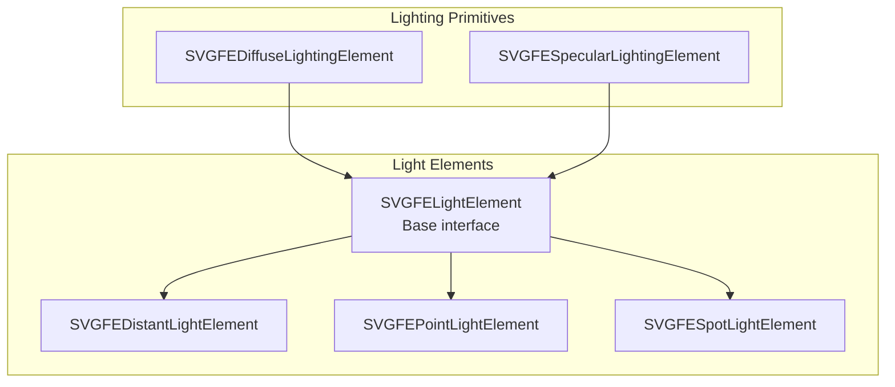
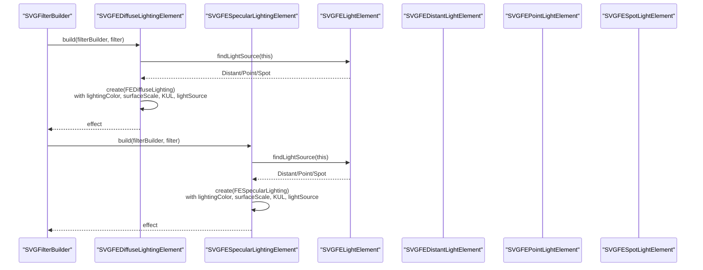
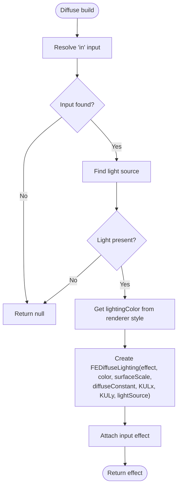
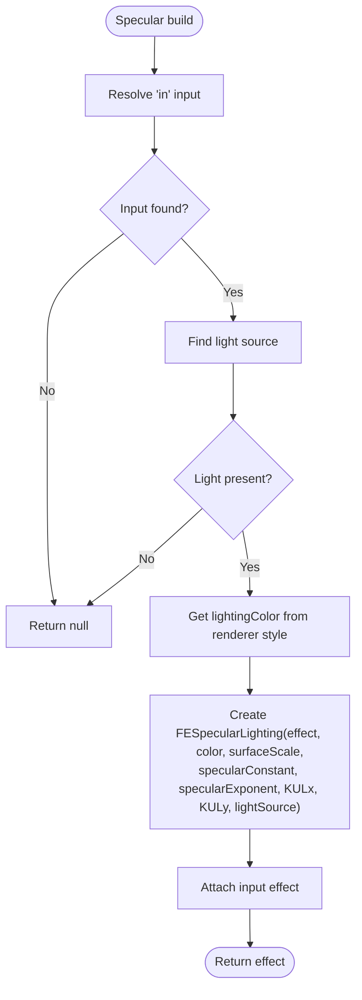
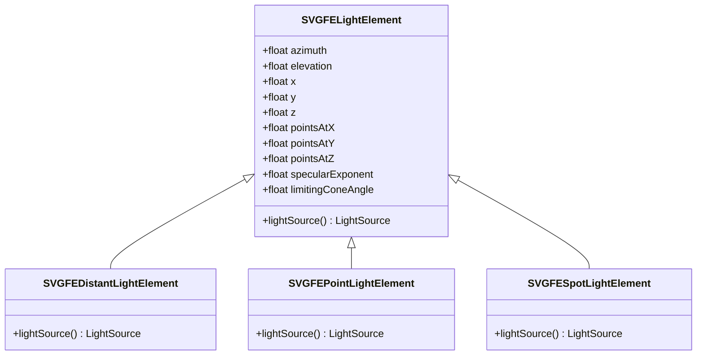
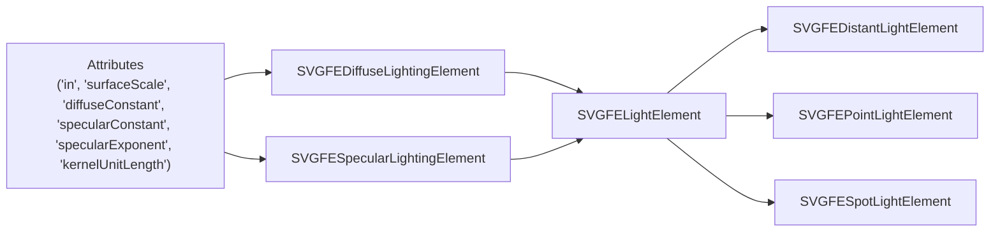

# Lighting and Surface Effects

<cite>
**Referenced Files in This Document**
- [SVGFEDiffuseLightingElement.cpp](file://blink-b87d44f-Source-core-svg/SVGFEDiffuseLightingElement.cpp)
- [SVGFEDiffuseLightingElement.h](file://blink-b87d44f-Source-core-svg/SVGFEDiffuseLightingElement.h)
- [SVGFESpecularLightingElement.cpp](file://blink-b87d44f-Source-core-svg/SVGFESpecularLightingElement.cpp)
- [SVGFESpecularLightingElement.h](file://blink-b87d44f-Source-core-svg/SVGFESpecularLightingElement.h)
- [SVGFELightElement.cpp](file://blink-b87d44f-Source-core-svg/SVGFELightElement.cpp)
- [SVGFELightElement.h](file://blink-b87d44f-Source-core-svg/SVGFELightElement.h)
- [SVGFEDistantLightElement.cpp](file://blink-b87d44f-Source-core-svg/SVGFEDistantLightElement.cpp)
- [SVGFEDistantLightElement.h](file://blink-b87d44f-Source-core-svg/SVGFEDistantLightElement.h)
- [SVGFEPointLightElement.cpp](file://blink-b87d44f-Source-core-svg/SVGFEPointLightElement.cpp)
- [SVGFEPointLightElement.h](file://blink-b87d44f-Source-core-svg/SVGFEPointLightElement.h)
- [SVGFESpotLightElement.cpp](file://blink-b87d44f-Source-core-svg/SVGFESpotLightElement.cpp)
- [SVGFESpotLightElement.h](file://blink-b87d44f-Source-core-svg/SVGFESpotLightElement.h)
</cite>

## Table of Contents
1. [Introduction](#introduction)
2. [Project Structure](#project-structure)
3. [Core Components](#core-components)
4. [Architecture Overview](#architecture-overview)
5. [Detailed Component Analysis](#detailed-component-analysis)
6. [Dependency Analysis](#dependency-analysis)
7. [Performance Considerations](#performance-considerations)
8. [Troubleshooting Guide](#troubleshooting-guide)
9. [Conclusion](#conclusion)

## Introduction
This document explains the lighting and surface effects pipeline implemented in the SVG filters subsystem. It focuses on diffuse and specular lighting calculations, light source configurations (distant, point, and spot), material properties exposed via filter attributes, and how light sources are wired into lighting primitives. It also covers surface normal generation, bump mapping, 3D effect simulation, light type specifications, realistic lighting setups, interactive controls, performance optimization, shadow effects, and artistic lighting techniques.

## Project Structure
The lighting and surface effects are implemented as part of the SVG filter primitives. The relevant components are organized around:
- A base light element interface that defines shared light attributes
- Three concrete light source types: distant, point, and spot
- Two lighting primitives: diffuse and specular lighting
- Attribute parsing, change propagation, and filter effect construction

**Diagram sources**
- [SVGFELightElement.h:31-60](file://blink-b87d44f-Source-core-svg/SVGFELightElement.h#L31-L60)
- [SVGFEDistantLightElement.h:27-35](file://blink-b87d44f-Source-core-svg/SVGFEDistantLightElement.h#L27-L35)
- [SVGFEPointLightElement.h:27-35](file://blink-b87d44f-Source-core-svg/SVGFEPointLightElement.h#L27-L35)
- [SVGFESpotLightElement.h:27-35](file://blink-b87d44f-Source-core-svg/SVGFESpotLightElement.h#L27-L35)
- [SVGFEDiffuseLightingElement.h:33-57](file://blink-b87d44f-Source-core-svg/SVGFEDiffuseLightingElement.h#L33-L57)
- [SVGFESpecularLightingElement.h:32-56](file://blink-b87d44f-Source-core-svg/SVGFESpecularLightingElement.h#L32-L56)

**Section sources**
- [SVGFELightElement.h:31-60](file://blink-b87d44f-Source-core-svg/SVGFELightElement.h#L31-L60)
- [SVGFEDiffuseLightingElement.h:33-57](file://blink-b87d44f-Source-core-svg/SVGFEDiffuseLightingElement.h#L33-L57)
- [SVGFESpecularLightingElement.h:32-56](file://blink-b87d44f-Source-core-svg/SVGFESpecularLightingElement.h#L32-L56)

## Core Components
- Diffuse Lighting Primitive
  - Exposes attributes for input channel, diffuse constant, surface scale, kernel unit length, and lighting color.
  - Builds a filter effect that computes Lambertian reflection using a configured light source.
  - Attributes: in, diffuseConstant, surfaceScale, kernelUnitLength, lighting_color.

- Specular Lighting Primitive
  - Exposes attributes for input channel, specular constant, specular exponent, surface scale, kernel unit length, and lighting color.
  - Builds a filter effect that computes Blinn-Phong or similar specular highlights using a configured light source.
  - Attributes: in, specularConstant, specularExponent, surfaceScale, kernelUnitLength, lighting_color.

- Light Element Base
  - Defines common light attributes: azimuth, elevation, x, y, z, pointsAtX/Y/Z, specularExponent, limitingConeAngle.
  - Propagates attribute changes to parent lighting primitives and triggers revalidation.

- Light Source Types
  - Distant Light: directional light defined by azimuth and elevation.
  - Point Light: positional light defined by 3D coordinates.
  - Spot Light: positional light with direction and optional cone angle limiting.

**Section sources**
- [SVGFEDiffuseLightingElement.cpp:35-49](file://blink-b87d44f-Source-core-svg/SVGFEDiffuseLightingElement.cpp#L35-L49)
- [SVGFEDiffuseLightingElement.cpp:78-123](file://blink-b87d44f-Source-core-svg/SVGFEDiffuseLightingElement.cpp#L78-L123)
- [SVGFESpecularLightingElement.cpp:36-52](file://blink-b87d44f-Source-core-svg/SVGFESpecularLightingElement.cpp#L36-L52)
- [SVGFESpecularLightingElement.cpp:82-132](file://blink-b87d44f-Source-core-svg/SVGFESpecularLightingElement.cpp#L82-L132)
- [SVGFELightElement.cpp:35-58](file://blink-b87d44f-Source-core-svg/SVGFELightElement.cpp#L35-L58)
- [SVGFELightElement.cpp:87-103](file://blink-b87d44f-Source-core-svg/SVGFELightElement.cpp#L87-L103)
- [SVGFEDistantLightElement.cpp:41-44](file://blink-b87d44f-Source-core-svg/SVGFEDistantLightElement.cpp#L41-L44)
- [SVGFEPointLightElement.cpp:41-44](file://blink-b87d44f-Source-core-svg/SVGFEPointLightElement.cpp#L41-L44)
- [SVGFESpotLightElement.cpp:41-47](file://blink-b87d44f-Source-core-svg/SVGFESpotLightElement.cpp#L41-L47)

## Architecture Overview
The lighting pipeline connects light elements to lighting primitives through a builder pattern. Each primitive constructs a filter effect that consumes a precomputed normal map or surface field and applies either diffuse or specular reflectance using the selected light source.

**Diagram sources**
- [SVGFEDiffuseLightingElement.cpp:204-226](file://blink-b87d44f-Source-core-svg/SVGFEDiffuseLightingElement.cpp#L204-L226)
- [SVGFESpecularLightingElement.cpp:215-237](file://blink-b87d44f-Source-core-svg/SVGFESpecularLightingElement.cpp#L215-L237)
- [SVGFELightElement.cpp:79-85](file://blink-b87d44f-Source-core-svg/SVGFELightElement.cpp#L79-L85)
- [SVGFEDistantLightElement.cpp:41-44](file://blink-b87d44f-Source-core-svg/SVGFEDistantLightElement.cpp#L41-L44)
- [SVGFEPointLightElement.cpp:41-44](file://blink-b87d44f-Source-core-svg/SVGFEPointLightElement.cpp#L41-L44)
- [SVGFESpotLightElement.cpp:41-47](file://blink-b87d44f-Source-core-svg/SVGFESpotLightElement.cpp#L41-L47)

## Detailed Component Analysis

### Diffuse Lighting Primitive
- Purpose: Computes Lambertian diffuse reflectance using a light source and surface normal field.
- Inputs:
  - in: input image/channel for normals or surface height.
  - lighting_color: base color applied to the diffuse contribution.
  - surfaceScale: scales the normal intensity.
  - diffuseConstant: multiplier for ambient-like scaling.
  - kernelUnitLengthX/Y: sampling step for gradients/normals.
- Behavior:
  - Parses attributes and forwards lighting parameters to the underlying effect.
  - Retrieves the associated light source and constructs the effect with the current renderer’s lighting color.

**Diagram sources**
- [SVGFEDiffuseLightingElement.cpp:204-226](file://blink-b87d44f-Source-core-svg/SVGFEDiffuseLightingElement.cpp#L204-L226)

**Section sources**
- [SVGFEDiffuseLightingElement.cpp:35-49](file://blink-b87d44f-Source-core-svg/SVGFEDiffuseLightingElement.cpp#L35-L49)
- [SVGFEDiffuseLightingElement.cpp:78-123](file://blink-b87d44f-Source-core-svg/SVGFEDiffuseLightingElement.cpp#L78-L123)
- [SVGFEDiffuseLightingElement.cpp:125-168](file://blink-b87d44f-Source-core-svg/SVGFEDiffuseLightingElement.cpp#L125-L168)
- [SVGFEDiffuseLightingElement.cpp:170-193](file://blink-b87d44f-Source-core-svg/SVGFEDiffuseLightingElement.cpp#L170-L193)
- [SVGFEDiffuseLightingElement.cpp:204-226](file://blink-b87d44f-Source-core-svg/SVGFEDiffuseLightingElement.cpp#L204-L226)

### Specular Lighting Primitive
- Purpose: Computes specular highlights using a light source and surface normal field.
- Inputs:
  - in: input image/channel for normals or surface height.
  - lighting_color: base color applied to the specular contribution.
  - surfaceScale: scales the normal intensity.
  - specularConstant: multiplier for specular strength.
  - specularExponent: controls highlight falloff/sharpness.
  - kernelUnitLengthX/Y: sampling step for gradients/normals.
- Behavior:
  - Parses attributes and forwards lighting parameters to the underlying effect.
  - Retrieves the associated light source and constructs the effect with the current renderer’s lighting color.

**Diagram sources**
- [SVGFESpecularLightingElement.cpp:215-237](file://blink-b87d44f-Source-core-svg/SVGFESpecularLightingElement.cpp#L215-L237)

**Section sources**
- [SVGFESpecularLightingElement.cpp:36-52](file://blink-b87d44f-Source-core-svg/SVGFESpecularLightingElement.cpp#L36-L52)
- [SVGFESpecularLightingElement.cpp:82-132](file://blink-b87d44f-Source-core-svg/SVGFESpecularLightingElement.cpp#L82-L132)
- [SVGFESpecularLightingElement.cpp:134-179](file://blink-b87d44f-Source-core-svg/SVGFESpecularLightingElement.cpp#L134-L179)
- [SVGFESpecularLightingElement.cpp:181-204](file://blink-b87d44f-Source-core-svg/SVGFESpecularLightingElement.cpp#L181-L204)
- [SVGFESpecularLightingElement.cpp:215-237](file://blink-b87d44f-Source-core-svg/SVGFESpecularLightingElement.cpp#L215-L237)

### Light Element Base and Light Source Types
- Base Light Element
  - Provides common attributes for light positioning and directionality.
  - Forwards attribute changes to parent lighting primitives to trigger updates.
- Distant Light
  - Defined by azimuth and elevation; produces a parallel beam.
- Point Light
  - Defined by 3D position (x, y, z); produces radially attenuating light.
- Spot Light
  - Defined by position, direction (pointsAtX/Y/Z), specular exponent, and limiting cone angle.

**Diagram sources**
- [SVGFELightElement.h:31-60](file://blink-b87d44f-Source-core-svg/SVGFELightElement.h#L31-L60)
- [SVGFEDistantLightElement.h:27-35](file://blink-b87d44f-Source-core-svg/SVGFEDistantLightElement.h#L27-L35)
- [SVGFEPointLightElement.h:27-35](file://blink-b87d44f-Source-core-svg/SVGFEPointLightElement.h#L27-L35)
- [SVGFESpotLightElement.h:27-35](file://blink-b87d44f-Source-core-svg/SVGFESpotLightElement.h#L27-L35)

**Section sources**
- [SVGFELightElement.cpp:35-58](file://blink-b87d44f-Source-core-svg/SVGFELightElement.cpp#L35-L58)
- [SVGFELightElement.cpp:87-103](file://blink-b87d44f-Source-core-svg/SVGFELightElement.cpp#L87-L103)
- [SVGFELightElement.cpp:165-204](file://blink-b87d44f-Source-core-svg/SVGFELightElement.cpp#L165-L204)
- [SVGFEDistantLightElement.cpp:41-44](file://blink-b87d44f-Source-core-svg/SVGFEDistantLightElement.cpp#L41-L44)
- [SVGFEPointLightElement.cpp:41-44](file://blink-b87d44f-Source-core-svg/SVGFEPointLightElement.cpp#L41-L44)
- [SVGFESpotLightElement.cpp:41-47](file://blink-b87d44f-Source-core-svg/SVGFESpotLightElement.cpp#L41-L47)

## Dependency Analysis
- Attribute Parsing and Change Propagation
  - Both diffuse and specular primitives define supported attributes and forward changes to the underlying effect.
  - Light element attributes propagate to parent primitives, which then recompute their effects.
- Effect Construction
  - Primitives resolve inputs, locate the appropriate light source, and construct the corresponding filter effect with material parameters.

**Diagram sources**
- [SVGFEDiffuseLightingElement.cpp:78-123](file://blink-b87d44f-Source-core-svg/SVGFEDiffuseLightingElement.cpp#L78-L123)
- [SVGFESpecularLightingElement.cpp:82-132](file://blink-b87d44f-Source-core-svg/SVGFESpecularLightingElement.cpp#L82-L132)
- [SVGFELightElement.cpp:87-103](file://blink-b87d44f-Source-core-svg/SVGFELightElement.cpp#L87-L103)
- [SVGFEDistantLightElement.cpp:41-44](file://blink-b87d44f-Source-core-svg/SVGFEDistantLightElement.cpp#L41-L44)
- [SVGFEPointLightElement.cpp:41-44](file://blink-b87d44f-Source-core-svg/SVGFEPointLightElement.cpp#L41-L44)
- [SVGFESpotLightElement.cpp:41-47](file://blink-b87d44f-Source-core-svg/SVGFESpotLightElement.cpp#L41-L47)

**Section sources**
- [SVGFEDiffuseLightingElement.cpp:125-168](file://blink-b87d44f-Source-core-svg/SVGFEDiffuseLightingElement.cpp#L125-L168)
- [SVGFESpecularLightingElement.cpp:134-179](file://blink-b87d44f-Source-core-svg/SVGFESpecularLightingElement.cpp#L134-L179)
- [SVGFELightElement.cpp:165-204](file://blink-b87d44f-Source-core-svg/SVGFELightElement.cpp#L165-L204)

## Performance Considerations
- Reduce kernel unit lengths to balance quality and cost; smaller steps increase sampling density.
- Prefer fewer overlapping lighting primitives for complex scenes; combine materials and lights where possible.
- Use surfaceScale and material constants judiciously to avoid excessive amplification of noise.
- For real-time interactive lighting, animate only essential attributes (e.g., azimuth/elevation or positions) and cache computed effects when feasible.
- Consider normal/bump maps that match the scene scale to minimize unnecessary interpolation artifacts.

## Troubleshooting Guide
- No lighting effect visible
  - Ensure the lighting primitive receives a valid input and that a light element exists as a child.
  - Verify lightingColor is set appropriately in the renderer style.
- Incorrect lighting orientation
  - Check azimuth/elevation for distant light and x/y/z/pointsAt attributes for spot light.
- Harsh or overly soft highlights
  - Adjust specularExponent and specularConstant for specular lighting; adjust diffuseConstant for diffuse lighting.
- Artifacts near edges
  - Increase kernelUnitLength slightly or ensure the normal/bump input is properly filtered beforehand.

**Section sources**
- [SVGFEDiffuseLightingElement.cpp:204-226](file://blink-b87d44f-Source-core-svg/SVGFEDiffuseLightingElement.cpp#L204-L226)
- [SVGFESpecularLightingElement.cpp:215-237](file://blink-b87d44f-Source-core-svg/SVGFESpecularLightingElement.cpp#L215-L237)
- [SVGFELightElement.cpp:165-204](file://blink-b87d44f-Source-core-svg/SVGFELightElement.cpp#L165-L204)

## Conclusion
The lighting and surface effects pipeline integrates three light source types with two lighting primitives to produce physically plausible shading. By configuring material parameters (surface scale, constants, exponents) and light geometry (position, direction, angles), developers can achieve realistic lighting setups. Interactive controls can target azimuth/elevation and positions, while performance can be optimized by tuning sampling rates and combining effects thoughtfully.