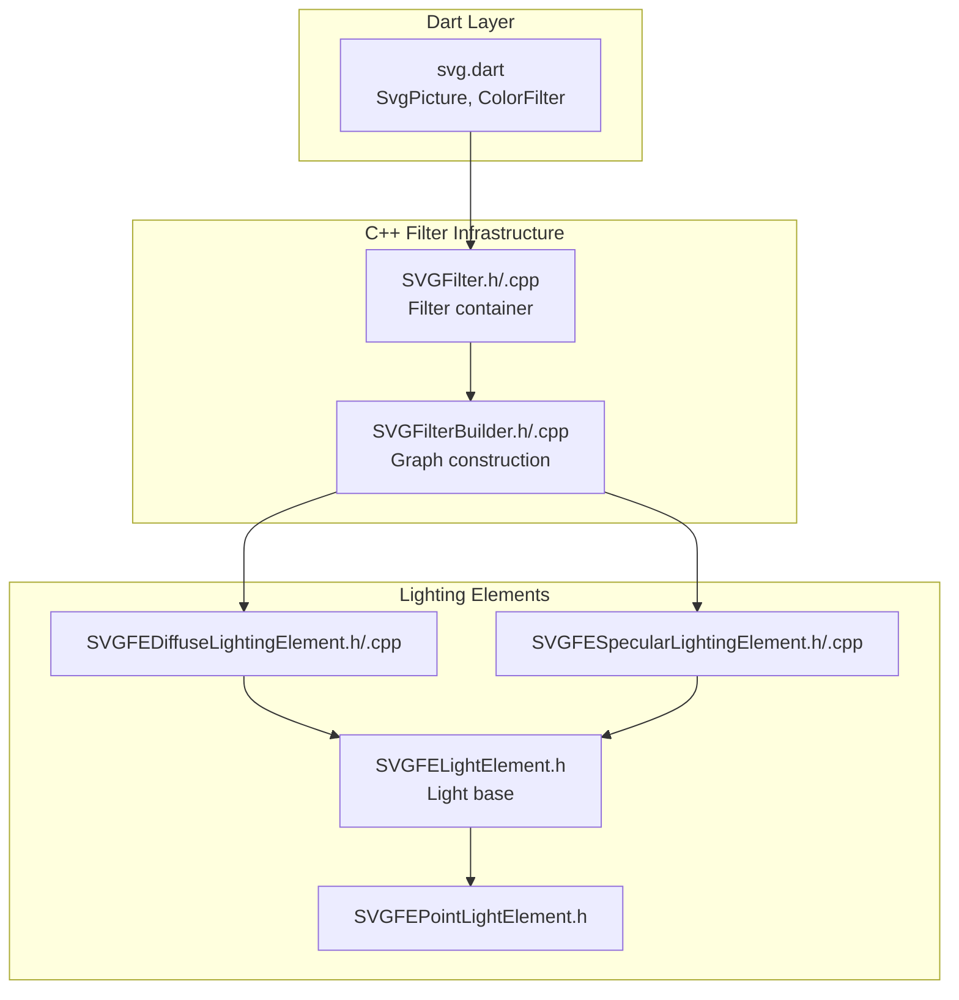
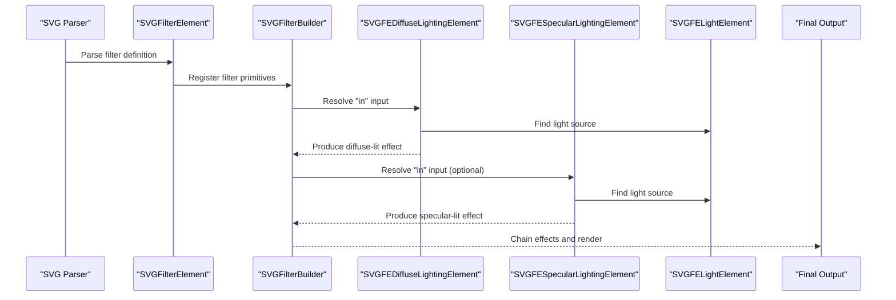
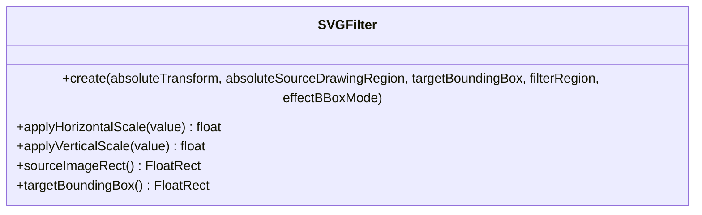
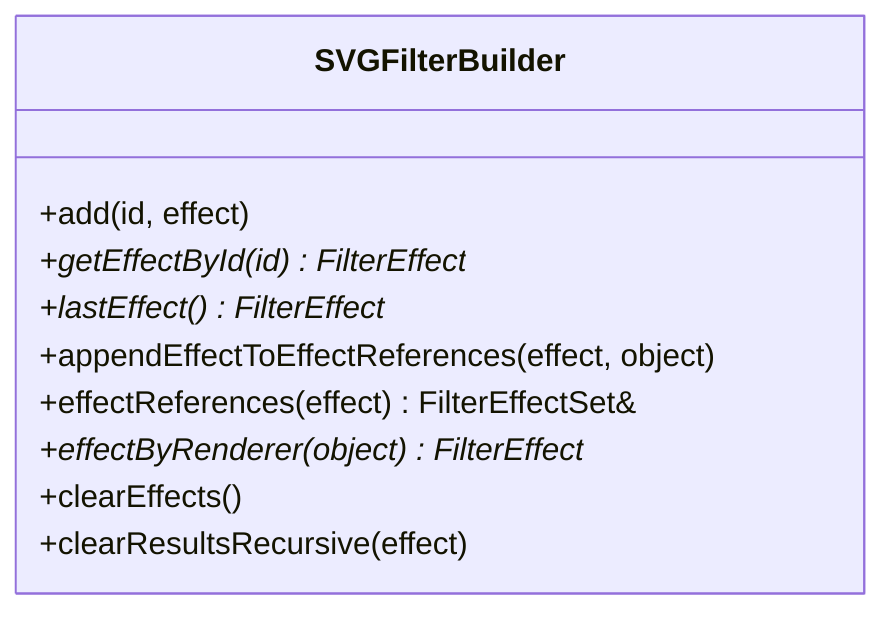
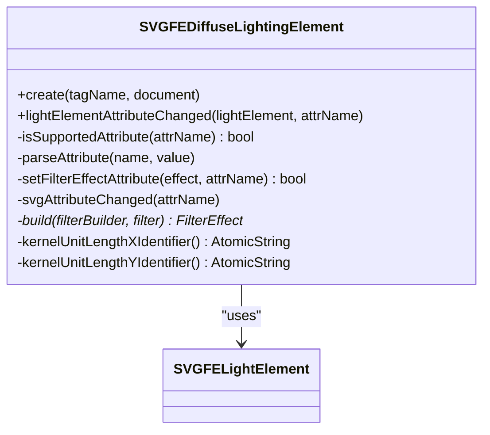
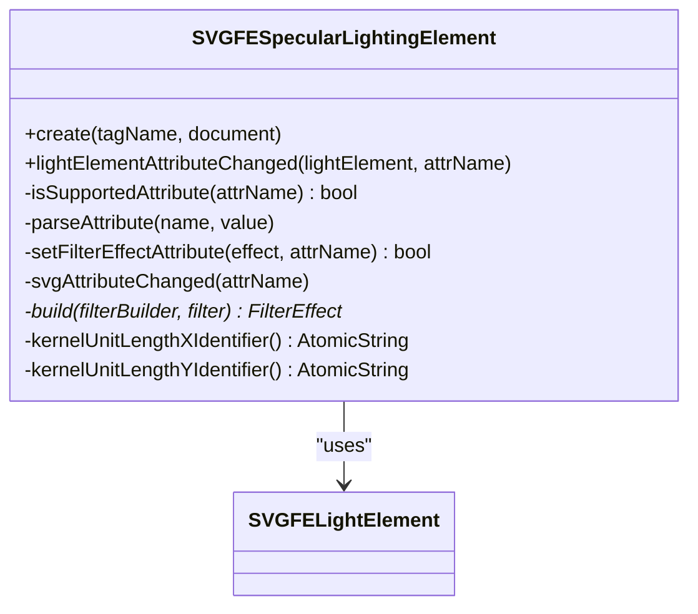
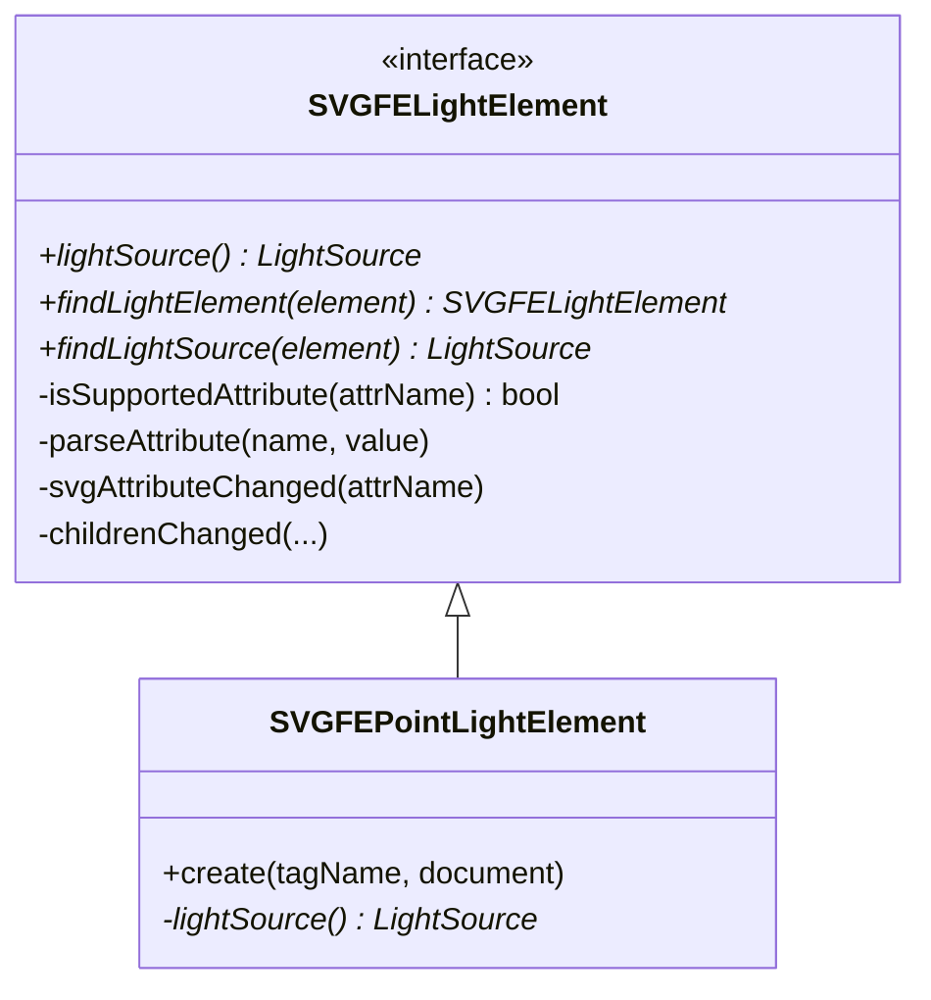
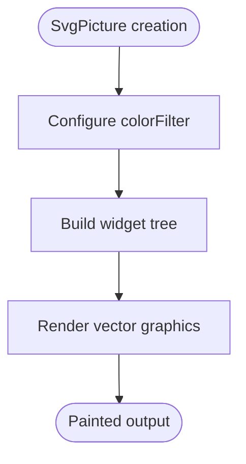
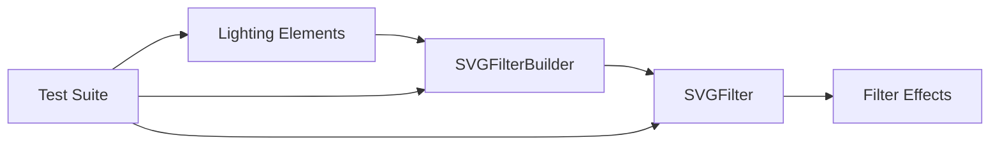

# Advanced Lighting and Filtering

<cite>
**Referenced Files in This Document**
- [svg.dart](file://lib/svg.dart)
- [filters_test.dart](file://test/animation/filters_test.dart)
- [fe_lighting_test.dart](file://test/animation/fe_lighting_test.dart)
- [SVGFilter.cpp](file://blink-b87d44f-Source-core-svg/graphics/filters/SVGFilter.cpp)
- [SVGFilter.h](file://blink-b87d44f-Source-core-svg/graphics/filters/SVGFilter.h)
- [SVGFilterBuilder.cpp](file://blink-b87d44f-Source-core-svg/graphics/filters/SVGFilterBuilder.cpp)
- [SVGFilterBuilder.h](file://blink-b87d44f-Source-core-svg/graphics/filters/SVGFilterBuilder.h)
- [SVGFEDiffuseLightingElement.cpp](file://blink-b87d44f-Source-core-svg/SVGFEDiffuseLightingElement.cpp)
- [SVGFEDiffuseLightingElement.h](file://blink-b87d44f-Source-core-svg/SVGFEDiffuseLightingElement.h)
- [SVGFESpecularLightingElement.cpp](file://blink-b87d44f-Source-core-svg/SVGFESpecularLightingElement.cpp)
- [SVGFESpecularLightingElement.h](file://blink-b87d44f-Source-core-svg/SVGFESpecularLightingElement.h)
- [SVGFELightElement.h](file://blink-b87d44f-Source-core-svg/SVGFELightElement.h)
- [SVGFEPointLightElement.h](file://blink-b87d44f-Source-core-svg/SVGFEPointLightElement.h)
</cite>

## Table of Contents
1. [Introduction](#introduction)
2. [Project Structure](#project-structure)
3. [Core Components](#core-components)
4. [Architecture Overview](#architecture-overview)
5. [Detailed Component Analysis](#detailed-component-analysis)
6. [Dependency Analysis](#dependency-analysis)
7. [Performance Considerations](#performance-considerations)
8. [Troubleshooting Guide](#troubleshooting-guide)
9. [Conclusion](#conclusion)

## Introduction
This document explains the advanced lighting and filtering capabilities implemented in the SVG rendering pipeline. It focuses on how diffuse and specular lighting filters integrate with light sources to produce realistic material shading effects, how the filter graph is constructed and resolved, and how these features are validated through tests. The goal is to provide both technical depth for developers and accessible explanations for users working with advanced SVG lighting.

## Project Structure
The advanced lighting and filtering features span three main areas:
- Dart API surface for SVG rendering and color filtering
- C++ filter infrastructure for building and applying filter graphs
- SVG element implementations for lighting primitives and light sources

**Diagram sources**
- [svg.dart:57-627](file://lib/svg.dart#L57-L627)
- [SVGFilter.h:35-51](file://blink-b87d44f-Source-core-svg/graphics/filters/SVGFilter.h#L35-L51)
- [SVGFilterBuilder.h:35-79](file://blink-b87d44f-Source-core-svg/graphics/filters/SVGFilterBuilder.h#L35-L79)
- [SVGFEDiffuseLightingElement.h:33-57](file://blink-b87d44f-Source-core-svg/SVGFEDiffuseLightingElement.h#L33-L57)
- [SVGFESpecularLightingElement.h:32-57](file://blink-b87d44f-Source-core-svg/SVGFESpecularLightingElement.h#L32-L57)
- [SVGFELightElement.h:31-60](file://blink-b87d44f-Source-core-svg/SVGFELightElement.h#L31-L60)
- [SVGFEPointLightElement.h:27-35](file://blink-b87d44f-Source-core-svg/SVGFEPointLightElement.h#L27-L35)

**Section sources**
- [svg.dart:57-627](file://lib/svg.dart#L57-L627)
- [SVGFilter.h:35-51](file://blink-b87d44f-Source-core-svg/graphics/filters/SVGFilter.h#L35-L51)
- [SVGFilterBuilder.h:35-79](file://blink-b87d44f-Source-core-svg/graphics/filters/SVGFilterBuilder.h#L35-L79)

## Core Components
- Filter container and scaling: The SVGFilter class encapsulates the filter region, target bounding box, and applies horizontal/vertical scaling based on effect bounding box mode.
- Filter graph builder: The SVGFilterBuilder manages built-in effects (source graphic/alpha), named effects, and references between effects to support chaining and result caching.
- Lighting primitives: Diffuse and specular lighting elements define attributes for surface scale, light constants/exponents, kernel unit length, and connect to light sources.
- Light sources: The light element interface defines common light attributes (position, direction, angles, exponents), with specialized implementations like point light.

Key responsibilities:
- Build and resolve filter graphs from SVG filter definitions
- Apply lighting calculations using light sources to produce shaded outputs
- Support attribute animations and dynamic updates via animated properties

**Section sources**
- [SVGFilter.cpp:28-55](file://blink-b87d44f-Source-core-svg/graphics/filters/SVGFilter.cpp#L28-L55)
- [SVGFilterBuilder.cpp:31-104](file://blink-b87d44f-Source-core-svg/graphics/filters/SVGFilterBuilder.cpp#L31-L104)
- [SVGFEDiffuseLightingElement.cpp:35-168](file://blink-b87d44f-Source-core-svg/SVGFEDiffuseLightingElement.cpp#L35-L168)
- [SVGFESpecularLightingElement.cpp:36-179](file://blink-b87d44f-Source-core-svg/SVGFESpecularLightingElement.cpp#L36-L179)
- [SVGFELightElement.h:31-60](file://blink-b87d44f-Source-core-svg/SVGFELightElement.h#L31-L60)

## Architecture Overview
The lighting pipeline integrates SVG elements into a filter graph. Filters are parsed and built into a chain of effects. Each lighting primitive consumes an input and a light source, producing a lit output that can be further processed by downstream filters.

**Diagram sources**
- [SVGFilterBuilder.cpp:52-65](file://blink-b87d44f-Source-core-svg/graphics/filters/SVGFilterBuilder.cpp#L52-L65)
- [SVGFEDiffuseLightingElement.cpp:204-226](file://blink-b87d44f-Source-core-svg/SVGFEDiffuseLightingElement.cpp#L204-L226)
- [SVGFESpecularLightingElement.cpp:215-237](file://blink-b87d44f-Source-core-svg/SVGFESpecularLightingElement.cpp#L215-L237)
- [SVGFELightElement.h:34-35](file://blink-b87d44f-Source-core-svg/SVGFELightElement.h#L34-L35)

## Detailed Component Analysis

### Filter Container and Scaling
The SVGFilter class stores metadata about the filter region and target bounding box, and scales values appropriately depending on whether effect bounding box mode is used. This ensures consistent behavior when units are expressed relative to the object bounding box.

**Diagram sources**
- [SVGFilter.h:35-51](file://blink-b87d44f-Source-core-svg/graphics/filters/SVGFilter.h#L35-L51)
- [SVGFilter.cpp:28-55](file://blink-b87d44f-Source-core-svg/graphics/filters/SVGFilter.cpp#L28-L55)

**Section sources**
- [SVGFilter.h:35-51](file://blink-b87d44f-Source-core-svg/graphics/filters/SVGFilter.h#L35-L51)
- [SVGFilter.cpp:28-55](file://blink-b87d44f-Source-core-svg/graphics/filters/SVGFilter.cpp#L28-L55)

### Filter Graph Construction and Resolution
The SVGFilterBuilder maintains:
- Built-in effects (source graphic and source alpha)
- Named effects mapped by ID
- References from input effects to dependent effects
- A mapping from render objects to their associated effects

It supports retrieving effects by ID, clearing effects, and recursively clearing results to maintain consistency during updates.

**Diagram sources**
- [SVGFilterBuilder.h:35-79](file://blink-b87d44f-Source-core-svg/graphics/filters/SVGFilterBuilder.h#L35-L79)
- [SVGFilterBuilder.cpp:31-104](file://blink-b87d44f-Source-core-svg/graphics/filters/SVGFilterBuilder.cpp#L31-L104)

**Section sources**
- [SVGFilterBuilder.h:35-79](file://blink-b87d44f-Source-core-svg/graphics/filters/SVGFilterBuilder.h#L35-L79)
- [SVGFilterBuilder.cpp:31-104](file://blink-b87d44f-Source-core-svg/graphics/filters/SVGFilterBuilder.cpp#L31-L104)

### Diffuse Lighting Element
The diffuse lighting element exposes attributes for input, surface scale, diffuse constant, and kernel unit length. It connects to a light source and constructs a diffuse lighting effect with the appropriate parameters.

**Diagram sources**
- [SVGFEDiffuseLightingElement.h:33-57](file://blink-b87d44f-Source-core-svg/SVGFEDiffuseLightingElement.h#L33-L57)
- [SVGFEDiffuseLightingElement.cpp:35-168](file://blink-b87d44f-Source-core-svg/SVGFEDiffuseLightingElement.cpp#L35-L168)
- [SVGFELightElement.h:31-60](file://blink-b87d44f-Source-core-svg/SVGFELightElement.h#L31-L60)

**Section sources**
- [SVGFEDiffuseLightingElement.h:33-57](file://blink-b87d44f-Source-core-svg/SVGFEDiffuseLightingElement.h#L33-L57)
- [SVGFEDiffuseLightingElement.cpp:35-168](file://blink-b87d44f-Source-core-svg/SVGFEDiffuseLightingElement.cpp#L35-L168)

### Specular Lighting Element
The specular lighting element mirrors the diffuse element but adds specular constant and specular exponent controls. It constructs a specular lighting effect and requires a valid light source.

**Diagram sources**
- [SVGFESpecularLightingElement.h:32-57](file://blink-b87d44f-Source-core-svg/SVGFESpecularLightingElement.h#L32-L57)
- [SVGFESpecularLightingElement.cpp:36-179](file://blink-b87d44f-Source-core-svg/SVGFESpecularLightingElement.cpp#L36-L179)
- [SVGFELightElement.h:31-60](file://blink-b87d44f-Source-core-svg/SVGFELightElement.h#L31-L60)

**Section sources**
- [SVGFESpecularLightingElement.h:32-57](file://blink-b87d44f-Source-core-svg/SVGFESpecularLightingElement.h#L32-L57)
- [SVGFESpecularLightingElement.cpp:36-179](file://blink-b87d44f-Source-core-svg/SVGFESpecularLightingElement.cpp#L36-L179)

### Light Source Interface and Point Light
The light element interface defines common attributes for positioning and characteristics of light sources. A concrete implementation (point light) provides a specific light source suitable for point light scenarios.

**Diagram sources**
- [SVGFELightElement.h:31-60](file://blink-b87d44f-Source-core-svg/SVGFELightElement.h#L31-L60)
- [SVGFEPointLightElement.h:27-35](file://blink-b87d44f-Source-core-svg/SVGFEPointLightElement.h#L27-L35)

**Section sources**
- [SVGFELightElement.h:31-60](file://blink-b87d44f-Source-core-svg/SVGFELightElement.h#L31-L60)
- [SVGFEPointLightElement.h:27-35](file://blink-b87d44f-Source-core-svg/SVGFEPointLightElement.h#L27-L35)

### API Integration and Color Filtering
The Dart API exposes SvgPicture with a colorFilter parameter that integrates with the underlying vector graphics rendering. While this is primarily for global color adjustments, it complements advanced lighting by allowing post-processing color modifications.

**Diagram sources**
- [svg.dart:57-627](file://lib/svg.dart#L57-L627)

**Section sources**
- [svg.dart:57-627](file://lib/svg.dart#L57-L627)

## Dependency Analysis
The lighting and filtering system exhibits clear separation of concerns:
- Elements define attributes and build filter effects
- The filter builder resolves dependencies and manages effect graphs
- The filter container handles coordinate scaling and regions
- Tests validate parsing, attribute handling, and color filter generation

**Diagram sources**
- [SVGFEDiffuseLightingElement.cpp:204-226](file://blink-b87d44f-Source-core-svg/SVGFEDiffuseLightingElement.cpp#L204-L226)
- [SVGFESpecularLightingElement.cpp:215-237](file://blink-b87d44f-Source-core-svg/SVGFESpecularLightingElement.cpp#L215-L237)
- [SVGFilterBuilder.cpp:52-65](file://blink-b87d44f-Source-core-svg/graphics/filters/SVGFilterBuilder.cpp#L52-L65)
- [SVGFilter.cpp:28-55](file://blink-b87d44f-Source-core-svg/graphics/filters/SVGFilter.cpp#L28-L55)

**Section sources**
- [SVGFEDiffuseLightingElement.cpp:204-226](file://blink-b87d44f-Source-core-svg/SVGFEDiffuseLightingElement.cpp#L204-L226)
- [SVGFESpecularLightingElement.cpp:215-237](file://blink-b87d44f-Source-core-svg/SVGFESpecularLightingElement.cpp#L215-L237)
- [SVGFilterBuilder.cpp:52-65](file://blink-b87d44f-Source-core-svg/graphics/filters/SVGFilterBuilder.cpp#L52-L65)
- [SVGFilter.cpp:28-55](file://blink-b87d44f-Source-core-svg/graphics/filters/SVGFilter.cpp#L28-L55)

## Performance Considerations
- Attribute animations: Animated properties on lighting elements trigger primitive attribute changes, enabling dynamic updates without full re-parsing.
- Effect graph reuse: The filter builder maintains named effects and references, supporting efficient recomputation when inputs change.
- Scaling and regions: Proper handling of effect bounding box mode and filter regions avoids unnecessary resampling and ensures predictable performance.

[No sources needed since this section provides general guidance]

## Troubleshooting Guide
Common issues and resolutions:
- Missing light source: If a specular or diffuse lighting element cannot find a valid light source, it returns null for the effect, preventing rendering artifacts.
- Attribute mismatches: Ensure that lighting elements receive supported attributes and that light element attributes are correctly mapped to their corresponding effect parameters.
- Filter graph resolution: Verify that effect IDs resolve correctly and that inputs are properly chained; empty or missing IDs will prevent effect construction.

Validation references:
- Parsing and type assertions for specular lighting filters
- Color filter generation with and without light sources
- Attribute parsing and effect building for lighting elements

**Section sources**
- [filters_test.dart:308-348](file://test/animation/filters_test.dart#L308-L348)
- [fe_lighting_test.dart:227-263](file://test/animation/fe_lighting_test.dart#L227-L263)
- [SVGFEDiffuseLightingElement.cpp:91-123](file://blink-b87d44f-Source-core-svg/SVGFEDiffuseLightingElement.cpp#L91-L123)
- [SVGFESpecularLightingElement.cpp:95-132](file://blink-b87d44f-Source-core-svg/SVGFESpecularLightingElement.cpp#L95-L132)

## Conclusion
The advanced lighting and filtering subsystem provides robust support for diffuse and specular lighting effects integrated into a flexible filter graph. By separating element definitions, graph construction, and filter containers, the system enables precise control over lighting parameters, dynamic updates, and efficient rendering. Tests confirm correct parsing, attribute handling, and color filter generation, ensuring reliable behavior across various lighting configurations.