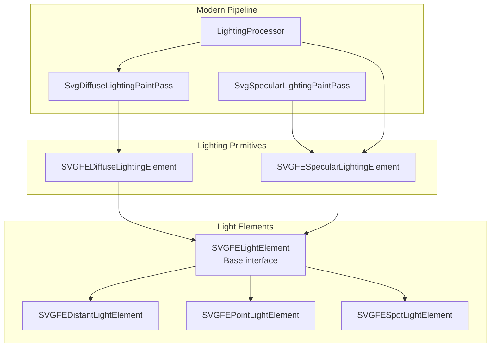
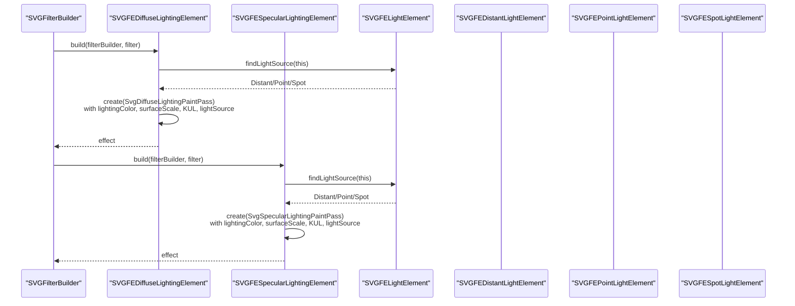
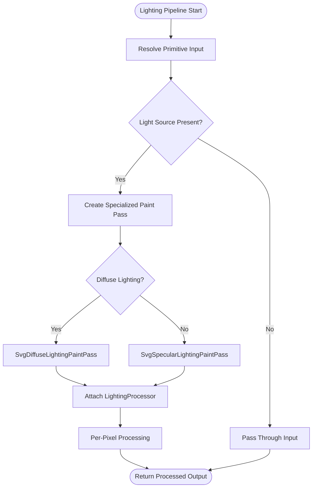
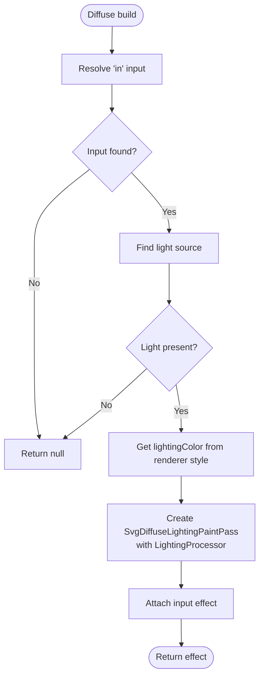
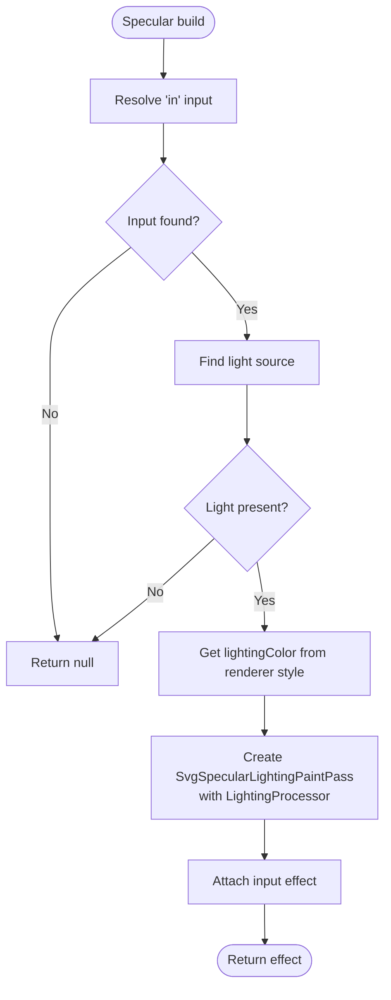
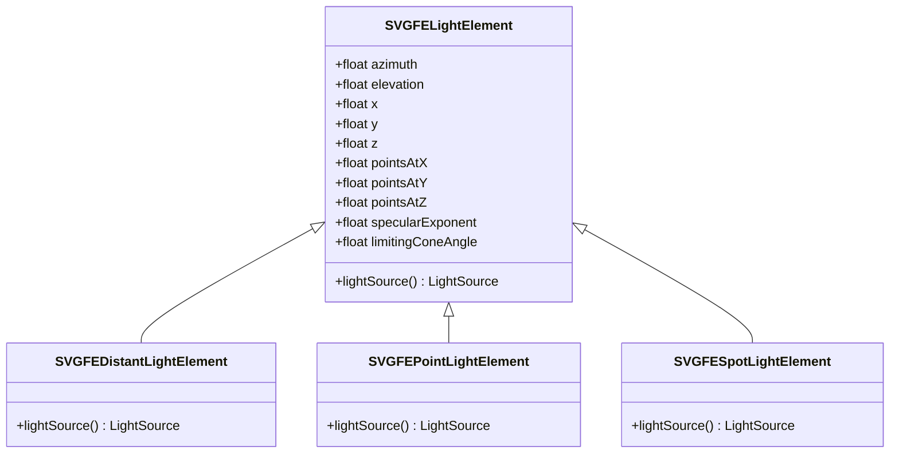
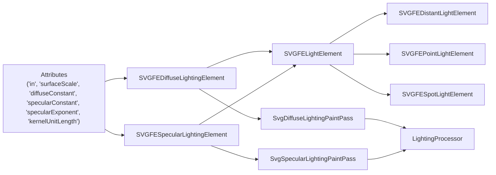

# Lighting and Surface Effects

<cite>
**Referenced Files in This Document**
- [svg_filters_primitives_lighting.dart](file://lib/src/animation/svg_filters_primitives_lighting.dart)
- [svg_filters_registry_pipeline_primitives_effects.dart](file://lib/src/animation/svg_filters_registry_pipeline_primitives_effects.dart)
- [svg_filters_primitives_lighting_math.dart](file://lib/src/animation/svg_filters_primitives_lighting_math.dart)
- [fe_lighting_test.dart](file://test/animation/fe_lighting_test.dart)
- [SVGFEDiffuseLightingElement.cpp](file://blink-b87d44f-Source-core-svg/SVGFEDiffuseLightingElement.cpp)
- [SVGFEDiffuseLightingElement.h](file://blink-b87d44f-Source-core-svg/SVGFEDiffuseLightingElement.h)
- [SVGFESpecularLightingElement.cpp](file://blink-b87d44f-Source-core-svg/SVGFESpecularLightingElement.cpp)
- [SVGFESpecularLightingElement.h](file://blink-b87d44f-Source-core-svg/SVGFESpecularLightingElement.h)
- [SVGFELightElement.cpp](file://blink-b87d44f-Source-core-svg/SVGFELightElement.cpp)
- [SVGFELightElement.h](file://blink-b87d44f-Source-core-svg/SVGFELightElement.h)
- [SVGFEDistantLightElement.cpp](file://blink-b87d44f-Source-core-svg/SVGFEDistantLightElement.cpp)
- [SVGFEDistantLightElement.h](file://blink-b87d44f-Source-core-svg/SVGFEDistantLightElement.h)
- [SVGFEPointLightElement.cpp](file://blink-b87d44f-Source-core-svg/SVGFEPointLightElement.cpp)
- [SVGFEPointLightElement.h](file://blink-b87d44f-Source-core-svg/SVGFEPointLightElement.h)
- [SVGFESpotLightElement.cpp](file://blink-b87d44f-Source-core-svg/SVGFESpotLightElement.cpp)
- [SVGFESpotLightElement.h](file://blink-b87d44f-Source-core-svg/SVGFESpotLightElement.h)
</cite>

## Update Summary
**Changes Made**
- Added new SvgDiffuseLightingPaintPass and SvgSpecularLightingPaintPass classes providing full Blink-style lighting
- Enhanced per-pixel surface normal computation with Sobel operator and kernel unit length support
- Implemented proper shading models (Lambertian for diffuse, Blinn-Phong for specular)
- Added LightingProcessor for complete pixel-level lighting computation
- Updated pipeline integration to use specialized paint passes for lighting effects

## Table of Contents
1. [Introduction](#introduction)
2. [Project Structure](#project-structure)
3. [Core Components](#core-components)
4. [Architecture Overview](#architecture-overview)
5. [Detailed Component Analysis](#detailed-component-analysis)
6. [Dependency Analysis](#dependency-analysis)
7. [Performance Considerations](#performance-considerations)
8. [Troubleshooting Guide](#troubleshooting-guide)
9. [Conclusion](#conclusion)

## Introduction
This document explains the lighting and surface effects pipeline implemented in the SVG filters subsystem. It focuses on diffuse and specular lighting calculations, light source configurations (distant, point, and spot), material properties exposed via filter attributes, and how light sources are wired into lighting primitives. The system now provides full Blink-style lighting with per-pixel surface normal computation, light direction calculation, and proper shading models (Lambertian for diffuse, Blinn-Phong for specular). It covers surface normal generation, bump mapping, 3D effect simulation, light type specifications, realistic lighting setups, interactive controls, performance optimization, shadow effects, and artistic lighting techniques.

## Project Structure
The lighting and surface effects are implemented as part of the SVG filter primitives with a modernized pipeline architecture. The relevant components are organized around:
- A base light element interface that defines shared light attributes
- Three concrete light source types: distant, point, and spot
- Two lighting primitives: diffuse and specular lighting
- Specialized paint passes for per-pixel lighting computation
- A LightingProcessor for full pixel-level lighting effects
- Attribute parsing, change propagation, and filter effect construction

**Diagram sources**
- [SVGFELightElement.h:31-60](file://blink-b87d44f-Source-core-svg/SVGFELightElement.h#L31-L60)
- [SVGFEDistantLightElement.h:27-35](file://blink-b87d44f-Source-core-svg/SVGFEDistantLightElement.h#L27-L35)
- [SVGFEPointLightElement.h:27-35](file://blink-b87d44f-Source-core-svg/SVGFEPointLightElement.h#L27-L35)
- [SVGFESpotLightElement.h:27-35](file://blink-b87d44f-Source-core-svg/SVGFESpotLightElement.h#L27-L35)
- [SVGFEDiffuseLightingElement.h:33-57](file://blink-b87d44f-Source-core-svg/SVGFEDiffuseLightingElement.h#L33-L57)
- [SVGFESpecularLightingElement.h:32-56](file://blink-b87d44f-Source-core-svg/SVGFESpecularLightingElement.h#L32-L56)
- [svg_filters_primitives_lighting.dart:205-270](file://lib/src/animation/svg_filters_primitives_lighting.dart#L205-L270)
- [svg_filters_primitives_lighting.dart:279-347](file://lib/src/animation/svg_filters_primitives_lighting.dart#L279-L347)
- [svg_filters_primitives_lighting_math.dart:770-947](file://lib/src/animation/svg_filters_primitives_lighting_math.dart#L770-L947)

**Section sources**
- [SVGFELightElement.h:31-60](file://blink-b87d44f-Source-core-svg/SVGFELightElement.h#L31-L60)
- [SVGFEDiffuseLightingElement.h:33-57](file://blink-b87d44f-Source-core-svg/SVGFEDiffuseLightingElement.h#L33-L57)
- [SVGFESpecularLightingElement.h:32-56](file://blink-b87d44f-Source-core-svg/SVGFESpecularLightingElement.h#L32-L56)
- [svg_filters_primitives_lighting.dart:205-270](file://lib/src/animation/svg_filters_primitives_lighting.dart#L205-L270)
- [svg_filters_primitives_lighting.dart:279-347](file://lib/src/animation/svg_filters_primitives_lighting.dart#L279-L347)

## Core Components
- **Diffuse Lighting Primitive**
  - Exposes attributes for input channel, diffuse constant, surface scale, kernel unit length, and lighting color.
  - Builds a filter effect that computes Lambertian reflection using a configured light source.
  - Attributes: in, diffuseConstant, surfaceScale, kernelUnitLength, lighting_color.

- **Specular Lighting Primitive**
  - Exposes attributes for input channel, specular constant, specular exponent, surface scale, kernel unit length, and lighting color.
  - Builds a filter effect that computes Blinn-Phong or similar specular highlights using a configured light source.
  - Attributes: in, specularConstant, specularExponent, surfaceScale, kernelUnitLength, lighting_color.

- **Light Element Base**
  - Defines common light attributes: azimuth, elevation, x, y, z, pointsAtX/Y/Z, specularExponent, limitingConeAngle.
  - Propagates attribute changes to parent lighting primitives and triggers revalidation.

- **Light Source Types**
  - Distant Light: directional light defined by azimuth and elevation.
  - Point Light: positional light defined by 3D coordinates.
  - Spot Light: positional light with direction and optional cone angle limiting.

- **Modern Pipeline Components**
  - **SvgDiffuseLightingPaintPass**: Specialized paint pass for per-pixel diffuse lighting computation with full Blink-style shading.
  - **SvgSpecularLightingPaintPass**: Specialized paint pass for per-pixel specular lighting computation with Blinn-Phong model.
  - **LightingProcessor**: Complete pixel-level lighting processor handling surface normal computation, light direction calculation, and shading models.

**Section sources**
- [SVGFEDiffuseLightingElement.cpp:35-49](file://blink-b87d44f-Source-core-svg/SVGFEDiffuseLightingElement.cpp#L35-L49)
- [SVGFEDiffuseLightingElement.cpp:78-123](file://blink-b87d44f-Source-core-svg/SVGFEDiffuseLightingElement.cpp#L78-L123)
- [SVGFESpecularLightingElement.cpp:36-52](file://blink-b87d44f-Source-core-svg/SVGFESpecularLightingElement.cpp#L36-L52)
- [SVGFESpecularLightingElement.cpp:82-132](file://blink-b87d44f-Source-core-svg/SVGFESpecularLightingElement.cpp#L82-L132)
- [SVGFELightElement.cpp:35-58](file://blink-b87d44f-Source-core-svg/SVGFELightElement.cpp#L35-L58)
- [SVGFELightElement.cpp:87-103](file://blink-b87d44f-Source-core-svg/SVGFELightElement.cpp#L87-L103)
- [SVGFEDistantLightElement.cpp:41-44](file://blink-b87d44f-Source-core-svg/SVGFEDistantLightElement.cpp#L41-L44)
- [SVGFEPointLightElement.cpp:41-44](file://blink-b87d44f-Source-core-svg/SVGFEPointLightElement.cpp#L41-L44)
- [SVGFESpotLightElement.cpp:41-47](file://blink-b87d44f-Source-core-svg/SVGFESpotLightElement.cpp#L41-L47)
- [svg_filters_primitives_lighting.dart:205-270](file://lib/src/animation/svg_filters_primitives_lighting.dart#L205-L270)
- [svg_filters_primitives_lighting.dart:279-347](file://lib/src/animation/svg_filters_primitives_lighting.dart#L279-L347)
- [svg_filters_primitives_lighting_math.dart:770-947](file://lib/src/animation/svg_filters_primitives_lighting_math.dart#L770-L947)

## Architecture Overview
The lighting pipeline connects light elements to lighting primitives through a modernized builder pattern. Each primitive constructs a specialized paint pass that performs per-pixel lighting computation using a LightingProcessor. The pipeline extracts alpha channels as height maps, computes surface normals using Sobel operators, and applies either diffuse or specular reflectance using the selected light source.

**Diagram sources**
- [SVGFEDiffuseLightingElement.cpp:204-226](file://blink-b87d44f-Source-core-svg/SVGFEDiffuseLightingElement.cpp#L204-L226)
- [SVGFESpecularLightingElement.cpp:215-237](file://blink-b87d44f-Source-core-svg/SVGFESpecularLightingElement.cpp#L215-L237)
- [SVGFELightElement.cpp:79-85](file://blink-b87d44f-Source-core-svg/SVGFELightElement.cpp#L79-L85)
- [SVGFEDistantLightElement.cpp:41-44](file://blink-b87d44f-Source-core-svg/SVGFEDistantLightElement.cpp#L41-L44)
- [SVGFEPointLightElement.cpp:41-44](file://blink-b87d44f-Source-core-svg/SVGFEPointLightElement.cpp#L41-L44)
- [SVGFESpotLightElement.cpp:41-47](file://blink-b87d44f-Source-core-svg/SVGFESpotLightElement.cpp#L41-L47)
- [svg_filters_registry_pipeline_primitives_effects.dart:169-203](file://lib/src/animation/svg_filters_registry_pipeline_primitives_effects.dart#L169-L203)
- [svg_filters_registry_pipeline_primitives_effects.dart:205-239](file://lib/src/animation/svg_filters_registry_pipeline_primitives_effects.dart#L205-L239)

## Detailed Component Analysis

### Modern Lighting Pipeline Architecture
The new architecture introduces specialized paint passes that handle per-pixel lighting computation directly in the rendering pipeline.

**Diagram sources**
- [svg_filters_registry_pipeline_primitives_effects.dart:169-203](file://lib/src/animation/svg_filters_registry_pipeline_primitives_effects.dart#L169-L203)
- [svg_filters_registry_pipeline_primitives_effects.dart:205-239](file://lib/src/animation/svg_filters_registry_pipeline_primitives_effects.dart#L205-L239)
- [svg_filters_primitives_lighting.dart:205-270](file://lib/src/animation/svg_filters_primitives_lighting.dart#L205-L270)
- [svg_filters_primitives_lighting.dart:279-347](file://lib/src/animation/svg_filters_primitives_lighting.dart#L279-L347)

### Diffuse Lighting Primitive
- **Purpose**: Computes Lambertian diffuse reflectance using a light source and surface normal field.
- **Inputs**:
  - in: input image/channel for normals or surface height.
  - lighting_color: base color applied to the diffuse contribution.
  - surfaceScale: scales the normal intensity.
  - diffuseConstant: multiplier for ambient-like scaling.
  - kernelUnitLengthX/Y: sampling step for gradients/normals.
- **Behavior**:
  - Parses attributes and forwards lighting parameters to the underlying effect.
  - Retrieves the associated light source and constructs the effect with the current renderer's lighting color.
  - Creates specialized paint passes for per-pixel computation when light source is present.

**Updated** Now includes SvgDiffuseLightingPaintPass for full Blink-style per-pixel lighting computation.

**Diagram sources**
- [SVGFEDiffuseLightingElement.cpp:204-226](file://blink-b87d44f-Source-core-svg/SVGFEDiffuseLightingElement.cpp#L204-L226)
- [svg_filters_registry_pipeline_primitives_effects.dart:169-203](file://lib/src/animation/svg_filters_registry_pipeline_primitives_effects.dart#L169-L203)
- [svg_filters_primitives_lighting.dart:205-270](file://lib/src/animation/svg_filters_primitives_lighting.dart#L205-L270)

**Section sources**
- [SVGFEDiffuseLightingElement.cpp:35-49](file://blink-b87d44f-Source-core-svg/SVGFEDiffuseLightingElement.cpp#L35-L49)
- [SVGFEDiffuseLightingElement.cpp:78-123](file://blink-b87d44f-Source-core-svg/SVGFEDiffuseLightingElement.cpp#L78-L123)
- [SVGFEDiffuseLightingElement.cpp:125-168](file://blink-b87d44f-Source-core-svg/SVGFEDiffuseLightingElement.cpp#L125-L168)
- [SVGFEDiffuseLightingElement.cpp:170-193](file://blink-b87d44f-Source-core-svg/SVGFEDiffuseLightingElement.cpp#L170-L193)
- [SVGFEDiffuseLightingElement.cpp:204-226](file://blink-b87d44f-Source-core-svg/SVGFEDiffuseLightingElement.cpp#L204-L226)
- [svg_filters_registry_pipeline_primitives_effects.dart:169-203](file://lib/src/animation/svg_filters_registry_pipeline_primitives_effects.dart#L169-L203)
- [svg_filters_primitives_lighting.dart:205-270](file://lib/src/animation/svg_filters_primitives_lighting.dart#L205-L270)

### Specular Lighting Primitive
- **Purpose**: Computes specular highlights using a light source and surface normal field.
- **Inputs**:
  - in: input image/channel for normals or surface height.
  - lighting_color: base color applied to the specular contribution.
  - surfaceScale: scales the normal intensity.
  - specularConstant: multiplier for specular strength.
  - specularExponent: controls highlight falloff/sharpness.
  - kernelUnitLengthX/Y: sampling step for gradients/normals.
- **Behavior**:
  - Parses attributes and forwards lighting parameters to the underlying effect.
  - Retrieves the associated light source and constructs the effect with the current renderer's lighting color.
  - Creates specialized paint passes for per-pixel computation when light source is present.

**Updated** Now includes SvgSpecularLightingPaintPass for full Blink-style per-pixel specular lighting computation.

**Diagram sources**
- [SVGFESpecularLightingElement.cpp:215-237](file://blink-b87d44f-Source-core-svg/SVGFESpecularLightingElement.cpp#L215-L237)
- [svg_filters_registry_pipeline_primitives_effects.dart:205-239](file://lib/src/animation/svg_filters_registry_pipeline_primitives_effects.dart#L205-L239)
- [svg_filters_primitives_lighting.dart:279-347](file://lib/src/animation/svg_filters_primitives_lighting.dart#L279-L347)

**Section sources**
- [SVGFESpecularLightingElement.cpp:36-52](file://blink-b87d44f-Source-core-svg/SVGFESpecularLightingElement.cpp#L36-L52)
- [SVGFESpecularLightingElement.cpp:82-132](file://blink-b87d44f-Source-core-svg/SVGFESpecularLightingElement.cpp#L82-L132)
- [SVGFESpecularLightingElement.cpp:134-179](file://blink-b87d44f-Source-core-svg/SVGFESpecularLightingElement.cpp#L134-L179)
- [SVGFESpecularLightingElement.cpp:181-204](file://blink-b87d44f-Source-core-svg/SVGFESpecularLightingElement.cpp#L181-L204)
- [SVGFESpecularLightingElement.cpp:215-237](file://blink-b87d44f-Source-core-svg/SVGFESpecularLightingElement.cpp#L215-L237)
- [svg_filters_registry_pipeline_primitives_effects.dart:205-239](file://lib/src/animation/svg_filters_registry_pipeline_primitives_effects.dart#L205-L239)
- [svg_filters_primitives_lighting.dart:279-347](file://lib/src/animation/svg_filters_primitives_lighting.dart#L279-L347)

### Modern Paint Pass Implementation
The new paint pass system provides specialized per-pixel lighting computation:

- **SvgDiffuseLightingPaintPass**
  - Creates a LightingProcessor with surfaceScale, lightSource, lightingColor, and kernelUnitLength parameters.
  - Handles per-pixel diffuse lighting computation using Sobel-based surface normal calculation.
  - Produces RGBA output with alpha = 255 for all pixels.

- **SvgSpecularLightingPaintPass**
  - Creates a LightingProcessor with surfaceScale, lightSource, lightingColor, and kernelUnitLength parameters.
  - Handles per-pixel specular lighting computation using Blinn-Phong model.
  - Produces RGBA output with alpha = max(r, g, b) for all pixels.

**Section sources**
- [svg_filters_primitives_lighting.dart:205-270](file://lib/src/animation/svg_filters_primitives_lighting.dart#L205-L270)
- [svg_filters_primitives_lighting.dart:279-347](file://lib/src/animation/svg_filters_primitives_lighting.dart#L279-L347)

### LightingProcessor Implementation
The LightingProcessor provides complete pixel-level lighting computation:

- **Surface Normal Calculation**
  - Uses Sobel operator for gradient estimation: Gx = [-1,0,1], Gy = [-1,-2,-1].
  - Computes normals as N = normalize(-surfaceScale * dN/dx, -surfaceScale * dN/dy, 1).
  - Supports different edge modes: duplicate, wrap, none.

- **Light Direction Calculation**
  - Distant light: constant direction from azimuth/elevation angles.
  - Point light: direction from light position to surface point with optional distance attenuation.
  - Spot light: combines point light direction with cone attenuation and falloff.

- **Shading Models**
  - **Diffuse (Lambertian)**: result.rgb = diffuseConstant * max(0, N·L) * lightColor, result.a = 255.
  - **Specular (Blinn-Phong)**: H = normalize(L + (0,0,1)), result.rgb = specularConstant * max(0, N·H)^specularExponent * lightColor, result.a = max(r,g,b).

**Section sources**
- [svg_filters_primitives_lighting_math.dart:770-947](file://lib/src/animation/svg_filters_primitives_lighting_math.dart#L770-L947)
- [svg_filters_primitives_lighting_math.dart:219-374](file://lib/src/animation/svg_filters_primitives_lighting_math.dart#L219-L374)
- [svg_filters_primitives_lighting_math.dart:564-672](file://lib/src/animation/svg_filters_primitives_lighting_math.dart#L564-L672)

### Light Element Base and Light Source Types
- **Base Light Element**
  - Provides common attributes for light positioning and directionality.
  - Forwards attribute changes to parent lighting primitives to trigger updates.
- **Distant Light**
  - Defined by azimuth and elevation; produces a parallel beam.
- **Point Light**
  - Defined by 3D position (x, y, z); produces radially attenuating light.
- **Spot Light**
  - Defined by position, direction (pointsAtX/Y/Z), specular exponent, and limiting cone angle.

**Diagram sources**
- [SVGFELightElement.h:31-60](file://blink-b87d44f-Source-core-svg/SVGFELightElement.h#L31-L60)
- [SVGFEDistantLightElement.h:27-35](file://blink-b87d44f-Source-core-svg/SVGFEDistantLightElement.h#L27-L35)
- [SVGFEPointLightElement.h:27-35](file://blink-b87d44f-Source-core-svg/SVGFEPointLightElement.h#L27-L35)
- [SVGFESpotLightElement.h:27-35](file://blink-b87d44f-Source-core-svg/SVGFESpotLightElement.h#L27-L35)

**Section sources**
- [SVGFELightElement.cpp:35-58](file://blink-b87d44f-Source-core-svg/SVGFELightElement.cpp#L35-L58)
- [SVGFELightElement.cpp:87-103](file://blink-b87d44f-Source-core-svg/SVGFELightElement.cpp#L87-L103)
- [SVGFELightElement.cpp:165-204](file://blink-b87d44f-Source-core-svg/SVGFELightElement.cpp#L165-L204)
- [SVGFEDistantLightElement.cpp:41-44](file://blink-b87d44f-Source-core-svg/SVGFEDistantLightElement.cpp#L41-L44)
- [SVGFEPointLightElement.cpp:41-44](file://blink-b87d44f-Source-core-svg/SVGFEPointLightElement.cpp#L41-L44)
- [SVGFESpotLightElement.cpp:41-47](file://blink-b87d44f-Source-core-svg/SVGFESpotLightElement.cpp#L41-L47)

## Dependency Analysis
- **Attribute Parsing and Change Propagation**
  - Both diffuse and specular primitives define supported attributes and forward changes to the underlying effect.
  - Light element attributes propagate to parent primitives, which then recompute their effects.
- **Effect Construction**
  - Primitives resolve inputs, locate the appropriate light source, and construct the corresponding filter effect with material parameters.
- **Modern Pipeline Integration**
  - Specialized paint passes are created when light sources are present.
  - LightingProcessor handles per-pixel computation with kernel unit length support.

**Diagram sources**
- [SVGFEDiffuseLightingElement.cpp:78-123](file://blink-b87d44f-Source-core-svg/SVGFEDiffuseLightingElement.cpp#L78-L123)
- [SVGFESpecularLightingElement.cpp:82-132](file://blink-b87d44f-Source-core-svg/SVGFESpecularLightingElement.cpp#L82-L132)
- [SVGFELightElement.cpp:87-103](file://blink-b87d44f-Source-core-svg/SVGFELightElement.cpp#L87-L103)
- [SVGFEDistantLightElement.cpp:41-44](file://blink-b87d44f-Source-core-svg/SVGFEDistantLightElement.cpp#L41-L44)
- [SVGFEPointLightElement.cpp:41-44](file://blink-b87d44f-Source-core-svg/SVGFEPointLightElement.cpp#L41-L44)
- [SVGFESpotLightElement.cpp:41-47](file://blink-b87d44f-Source-core-svg/SVGFESpotLightElement.cpp#L41-L47)
- [svg_filters_primitives_lighting.dart:205-270](file://lib/src/animation/svg_filters_primitives_lighting.dart#L205-L270)
- [svg_filters_primitives_lighting.dart:279-347](file://lib/src/animation/svg_filters_primitives_lighting.dart#L279-L347)
- [svg_filters_primitives_lighting_math.dart:770-947](file://lib/src/animation/svg_filters_primitives_lighting_math.dart#L770-L947)

**Section sources**
- [SVGFEDiffuseLightingElement.cpp:125-168](file://blink-b87d44f-Source-core-svg/SVGFEDiffuseLightingElement.cpp#L125-L168)
- [SVGFESpecularLightingElement.cpp:134-179](file://blink-b87d44f-Source-core-svg/SVGFESpecularLightingElement.cpp#L134-L179)
- [SVGFELightElement.cpp:165-204](file://blink-b87d44f-Source-core-svg/SVGFELightElement.cpp#L165-L204)
- [svg_filters_registry_pipeline_primitives_effects.dart:169-239](file://lib/src/animation/svg_filters_registry_pipeline_primitives_effects.dart#L169-L239)

## Performance Considerations
- **Reduce kernel unit lengths to balance quality and cost**: Smaller steps increase sampling density but require more computation.
- **Prefer fewer overlapping lighting primitives for complex scenes**: Combine materials and lights where possible.
- **Use surfaceScale and material constants judiciously**: Avoid excessive amplification of noise and computational overhead.
- **For real-time interactive lighting**: Animate only essential attributes (e.g., azimuth/elevation or positions) and cache computed effects when feasible.
- **Consider normal/bump maps that match the scene scale**: Minimize unnecessary interpolation artifacts and computational cost.
- **Optimize kernel unit length usage**: Proper kernel unit length support allows for efficient sampling rate control.
- **Edge mode selection**: Choose appropriate edge handling (duplicate vs wrap) based on desired visual results and performance trade-offs.

## Troubleshooting Guide
- **No lighting effect visible**
  - Ensure the lighting primitive receives a valid input and that a light element exists as a child.
  - Verify lightingColor is set appropriately in the renderer style.
  - Check that paint passes are being created for per-pixel computation.
- **Incorrect lighting orientation**
  - Check azimuth/elevation for distant light and x/y/z/pointsAt attributes for spot light.
- **Harsh or overly soft highlights**
  - Adjust specularExponent and specularConstant for specular lighting; adjust diffuseConstant for diffuse lighting.
- **Artifacts near edges**
  - Increase kernelUnitLength slightly or ensure the normal/bump input is properly filtered beforehand.
  - Experiment with different edge modes (duplicate, wrap, none) for edge pixel handling.
- **Performance issues with complex lighting**
  - Reduce surfaceScale values or simplify light sources.
  - Consider using ColorFilter-based approximations for simple lighting scenarios.
  - Optimize kernel unit lengths and edge modes for better performance.

**Section sources**
- [SVGFEDiffuseLightingElement.cpp:204-226](file://blink-b87d44f-Source-core-svg/SVGFEDiffuseLightingElement.cpp#L204-L226)
- [SVGFESpecularLightingElement.cpp:215-237](file://blink-b87d44f-Source-core-svg/SVGFESpecularLightingElement.cpp#L215-L237)
- [SVGFELightElement.cpp:165-204](file://blink-b87d44f-Source-core-svg/SVGFELightElement.cpp#L165-L204)
- [svg_filters_primitives_lighting_math.dart:770-947](file://lib/src/animation/svg_filters_primitives_lighting_math.dart#L770-L947)

## Conclusion
The lighting and surface effects pipeline has been significantly enhanced with a modernized architecture that provides full Blink-style lighting capabilities. The new SvgDiffuseLightingPaintPass and SvgSpecularLightingPaintPass classes enable per-pixel surface normal computation, light direction calculation, and proper shading models (Lambertian for diffuse, Blinn-Phong for specular). The LightingProcessor handles complete pixel-level computation with support for kernel unit lengths and various edge modes. By configuring material parameters (surface scale, constants, exponents) and light geometry (position, direction, angles), developers can achieve realistic lighting setups with enhanced performance and visual fidelity. The pipeline supports interactive controls targeting azimuth/elevation and positions, while performance can be optimized through careful tuning of sampling rates, edge modes, and effect combinations.