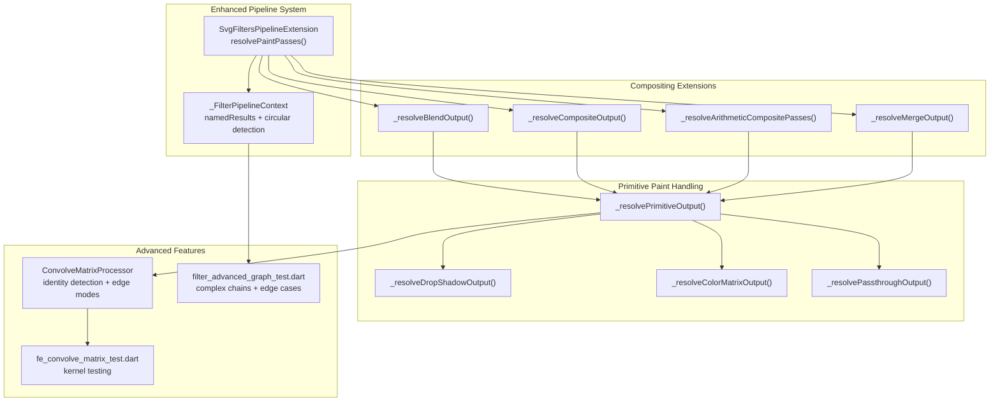
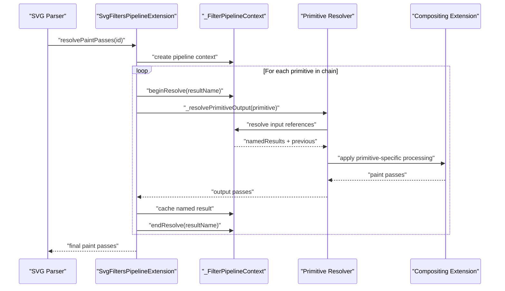
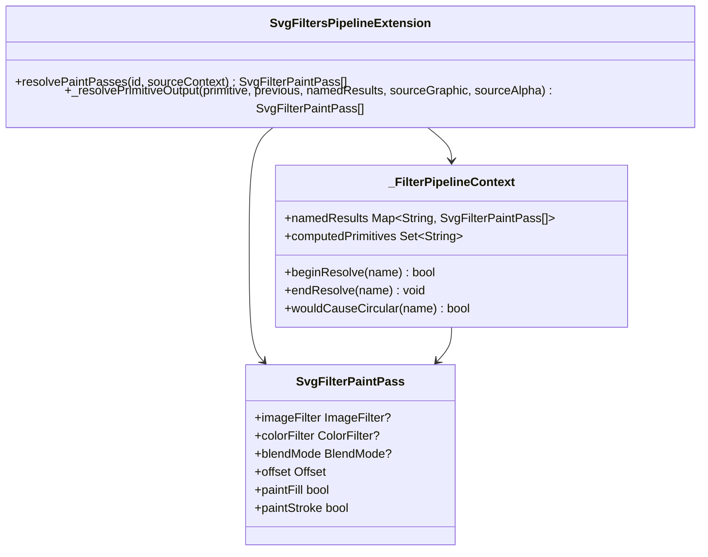
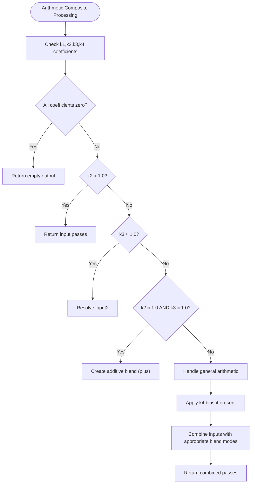

# SVG Filters and Effects

<cite>
**Referenced Files in This Document**
- [SVGFilter.cpp](file://blink-b87d44f-Source-core-svg/graphics/filters/SVGFilter.cpp)
- [SVGFilter.h](file://blink-b87d44f-Source-core-svg/graphics/filters/SVGFilter.h)
- [SVGFilterBuilder.cpp](file://blink-b87d44f-Source-core-svg/graphics/filters/SVGFilterBuilder.cpp)
- [SVGFilterBuilder.h](file://blink-b87d44f-Source-core-svg/graphics/filters/SVGFilterBuilder.h)
- [svg_filters_registry_pipeline.dart](file://lib/src/animation/svg_filters_registry_pipeline.dart)
- [svg_filters_registry_pipeline_compositing.dart](file://lib/src/animation/svg_filters_registry_pipeline_compositing.dart)
- [svg_filters_registry_pipeline_primitives.dart](file://lib/src/animation/svg_filters_registry_pipeline_primitives.dart)
- [svg_filters_registry_pipeline_primitives_paint.dart](file://lib/src/animation/svg_filters_registry_pipeline_primitives_paint.dart)
- [svg_filters_registry_pipeline_primitives_effects.dart](file://lib/src/animation/svg_filters_registry_pipeline_primitives_effects.dart)
- [svg_filters_primitives_convolve_matrix.dart](file://lib/src/animation/svg_filters_primitives_convolve_matrix.dart)
- [filter_advanced_graph_test.dart](file://test/animation/filter_advanced_graph_test.dart)
- [fe_convolve_matrix_test.dart](file://test/animation/fe_convolve_matrix_test.dart)
- [SVGFEBlendElement.cpp](file://blink-b87d44f-Source-core-svg/SVGFEBlendElement.cpp)
- [SVGFEColorMatrixElement.cpp](file://blink-b87d44f-Source-core-svg/SVGFEColorMatrixElement.cpp)
- [SVGFEGaussianBlurElement.cpp](file://blink-b87d44f-Source-core-svg/SVGFEGaussianBlurElement.cpp)
- [SVGFEComponentTransferElement.cpp](file://blink-b87d44f-Source-core-svg/SVGFEComponentTransferElement.cpp)
- [SVGFEDiffuseLightingElement.cpp](file://blink-b87d44f-Source-core-svg/SVGFEDiffuseLightingElement.cpp)
- [SVGFEMergeElement.cpp](file://blink-b87d44f-Source-core-svg/SVGFEMergeElement.cpp)
- [SVGFETurbulenceElement.cpp](file://blink-b87d44f-Source-core-svg/SVGFETurbulenceElement.cpp)
- [SVGFECompositeElement.cpp](file://blink-b87d44f-Source-core-svg/SVGFECompositeElement.cpp)
- [SVGFEOffsetElement.cpp](file://blink-b87d44f-Source-core-svg/SVGFEOffsetElement.cpp)
- [SVGFEConvolveMatrixElement.cpp](file://blink-b87d44f-Source-core-svg/SVGFEConvolveMatrixElement.cpp)
- [SVGFEConvolveMatrixElement.h](file://blink-b87d44f-Source-core-svg/SVGFEConvolveMatrixElement.h)
- [SVGFEDistantLightElement.h](file://blink-b87d44f-Source-core-svg/SVGFEDistantLightElement.h)
- [SVGFELightElement.cpp](file://blink-b87d44f-Source-core-svg/SVGFELightElement.cpp)
- [SVGFELightElement.h](file://blink-b87d44f-Source-core-svg/SVGFELightElement.h)
- [svg_filters_primitives_lighting.dart](file://lib/src/animation/svg_filters_primitives_lighting.dart)
- [svg_filters_primitives_lighting_math.dart](file://lib/src/animation/svg_filters_primitives_lighting_math.dart)
</cite>

## Update Summary
**Changes Made**
- Enhanced filter registry system with comprehensive pipeline processing improvements
- Added advanced compositing capabilities including arithmetic composite mode handling
- Implemented sophisticated primitive paint handling with pass composition
- Introduced comprehensive filter graph complexity testing with multi-hop chains
- Enhanced convolution matrix processing with identity kernel detection and edge mode support
- Added advanced lighting system with multiple light source types and mathematical calculations

## Table of Contents
1. [Introduction](#introduction)
2. [Project Structure](#project-structure)
3. [Core Components](#core-components)
4. [Architecture Overview](#architecture-overview)
5. [Enhanced Pipeline Processing](#enhanced-pipeline-processing)
6. [Advanced Compositing Capabilities](#advanced-compositing-capabilities)
7. [Primitive Paint Handling](#primitive-paint-handling)
8. [Filter Graph Complexity Testing](#filter-graph-complexity-testing)
9. [Detailed Component Analysis](#detailed-component-analysis)
10. [Performance Considerations](#performance-considerations)
11. [Troubleshooting Guide](#troubleshooting-guide)
12. [Conclusion](#conclusion)
13. [Appendices](#appendices)

## Introduction
This document explains the enhanced SVG filter system and effects implemented in the codebase. The system has been significantly upgraded with an improved filter registry system featuring enhanced pipeline processing, advanced composite operations, and sophisticated primitive paint handling. It covers comprehensive filter graph complexity testing and advanced compositing capabilities. The architecture now includes sophisticated filter primitive resolution, named result caching, circular reference detection, and comprehensive edge case handling for complex filter chains.

## Project Structure
The enhanced filter system is organized around:
- A comprehensive filter registry with pipeline processing and named result caching
- Advanced compositing extensions supporting blend modes, composite operations, and arithmetic modes
- Sophisticated primitive paint handling with pass composition and chaining
- Comprehensive filter graph complexity testing with multi-hop chains and edge cases
- Enhanced convolution matrix processing with identity kernel detection and edge mode support
- Advanced lighting system with multiple light source types and mathematical calculations

**Diagram sources**
- [svg_filters_registry_pipeline.dart:60-175](file://lib/src/animation/svg_filters_registry_pipeline.dart#L60-L175)
- [svg_filters_registry_pipeline_compositing.dart:3-460](file://lib/src/animation/svg_filters_registry_pipeline_compositing.dart#L3-L460)
- [svg_filters_registry_pipeline_primitives_paint.dart:3-169](file://lib/src/animation/svg_filters_registry_pipeline_primitives_paint.dart#L3-L169)
- [svg_filters_primitives_convolve_matrix.dart:1-52](file://lib/src/animation/svg_filters_primitives_convolve_matrix.dart#L1-L52)
- [filter_advanced_graph_test.dart:1-1297](file://test/animation/filter_advanced_graph_test.dart#L1-L1297)
- [fe_convolve_matrix_test.dart:146-449](file://test/animation/fe_convolve_matrix_test.dart#L146-L449)

**Section sources**
- [svg_filters_registry_pipeline.dart:60-175](file://lib/src/animation/svg_filters_registry_pipeline.dart#L60-L175)
- [svg_filters_registry_pipeline_compositing.dart:3-460](file://lib/src/animation/svg_filters_registry_pipeline_compositing.dart#L3-L460)
- [svg_filters_registry_pipeline_primitives_paint.dart:3-169](file://lib/src/animation/svg_filters_registry_pipeline_primitives_paint.dart#L3-L169)

## Core Components
The enhanced filter system introduces several key components:

**SvgFiltersPipelineExtension**: Central orchestrator for filter chain resolution with comprehensive input handling and named result caching.

**_FilterPipelineContext**: Manages filter graph resolution state including named result caching, circular reference detection, and background/paint context propagation.

**SvgFiltersPipelineCompositingExtension**: Handles advanced compositing operations including blend modes, composite operators, arithmetic mode approximation, and merge operations.

**SvgFiltersPipelinePrimitivePaintExtension**: Manages primitive-specific paint pass resolution with input chaining, offset handling, and specialized primitive processing.

**SvgFiltersPipelinePrimitiveEffectsExtension**: Processes effect-specific primitives including blur, morphology, displacement map, lighting, and convolution matrix operations.

**Section sources**
- [svg_filters_registry_pipeline.dart:60-187](file://lib/src/animation/svg_filters_registry_pipeline.dart#L60-L187)
- [svg_filters_registry_pipeline_compositing.dart:3-460](file://lib/src/animation/svg_filters_registry_pipeline_compositing.dart#L3-L460)
- [svg_filters_registry_pipeline_primitives_paint.dart:3-169](file://lib/src/animation/svg_filters_registry_pipeline_primitives_paint.dart#L3-L169)
- [svg_filters_registry_pipeline_primitives_effects.dart:3-224](file://lib/src/animation/svg_filters_registry_pipeline_primitives_effects.dart#L3-L224)

## Architecture Overview
The enhanced filter pipeline architecture provides comprehensive filter chain resolution with sophisticated input handling, named result caching, and edge case management. The system processes filter primitives in order, handling implicit input chaining, explicit named references, and complex multi-hop chains with proper caching and circular reference detection.

**Diagram sources**
- [svg_filters_registry_pipeline.dart:74-175](file://lib/src/animation/svg_filters_registry_pipeline.dart#L74-L175)
- [svg_filters_registry_pipeline_compositing.dart:45-95](file://lib/src/animation/svg_filters_registry_pipeline_compositing.dart#L45-L95)

## Enhanced Pipeline Processing
The enhanced pipeline processing system provides sophisticated filter chain resolution with comprehensive input handling and caching mechanisms.

**Named Result Caching**: The system caches computed results for multi-hop chains, allowing primitives to reference results from earlier in the chain without recomputation. This enables complex filter graphs with shared intermediate results.

**Circular Reference Detection**: The pipeline includes robust circular reference detection using depth tracking and reference resolution state management to prevent infinite loops and stack overflows.

**Background/Paint Context Propagation**: The system supports background image, background alpha, fill paint, and stroke paint contexts that can be passed down through filter chains for complex rendering scenarios.

**Section sources**
- [svg_filters_registry_pipeline.dart:9-58](file://lib/src/animation/svg_filters_registry_pipeline.dart#L9-L58)
- [svg_filters_registry_pipeline.dart:112-175](file://lib/src/animation/svg_filters_registry_pipeline.dart#L112-L175)

## Advanced Compositing Capabilities
The enhanced compositing system provides comprehensive support for blend modes, composite operators, and arithmetic mode approximation with sophisticated edge case handling.

**Blend Operations**: Supports all standard blend modes with proper input resolution and fallback handling for unknown references.

**Composite Operations**: Handles all composite operators including arithmetic mode with intelligent coefficient approximation and bias handling.

**Merge Operations**: Supports complex merge scenarios with non-adjacent result references, implicit input chaining, and proper layer ordering according to SVG specifications.

**Arithmetic Mode Approximation**: Provides intelligent approximation of arithmetic composite operations using blend modes and color filters for complex coefficient combinations.

**Section sources**
- [svg_filters_registry_pipeline_compositing.dart:4-95](file://lib/src/animation/svg_filters_registry_pipeline_compositing.dart#L4-L95)
- [svg_filters_registry_pipeline_compositing.dart:166-253](file://lib/src/animation/svg_filters_registry_pipeline_compositing.dart#L166-L253)
- [svg_filters_registry_pipeline_compositing.dart:255-443](file://lib/src/animation/svg_filters_registry_pipeline_compositing.dart#L255-L443)

## Primitive Paint Handling
The primitive paint handling system provides sophisticated pass composition and chaining for individual filter primitives.

**Pass Composition**: Each primitive can compose multiple paint passes with different properties including image filters, color filters, blend modes, offsets, and paint scopes.

**Input Resolution**: Supports comprehensive input resolution including SourceGraphic, SourceAlpha, BackgroundImage, BackgroundAlpha, FillPaint, StrokePaint, and named results with proper fallback handling.

**Specialized Processing**: Includes specialized handlers for drop shadow expansion, color matrix application, offset processing, and passthrough operations.

**Section sources**
- [svg_filters_registry_pipeline_primitives_paint.dart:20-128](file://lib/src/animation/svg_filters_registry_pipeline_primitives_paint.dart#L20-L128)
- [svg_filters_registry_pipeline_primitives_paint.dart:130-169](file://lib/src/animation/svg_filters_registry_pipeline_primitives_paint.dart#L130-L169)

## Filter Graph Complexity Testing
The comprehensive filter graph complexity testing validates the enhanced pipeline system with extensive scenarios covering multi-hop chains, complex dependencies, and edge cases.

**Multi-hop Chain Testing**: Validates complex chains with multiple intermediate results and cross-references including branching scenarios where the same result is used by multiple downstream primitives.

**Background/Foreground Context Testing**: Tests background image and alpha handling with proper fallback to SourceGraphic when context is not provided.

**Fill/Stroke Paint Scope Testing**: Validates paint scope handling for fill and stroke operations with proper channel masking.

**Arithmetic Mode Precision Testing**: Comprehensive testing of arithmetic composite modes with various coefficient combinations and edge cases.

**Forward Reference Handling**: Validates proper handling of forward references producing transparent black output as per SVG specifications.

**Section sources**
- [filter_advanced_graph_test.dart:17-92](file://test/animation/filter_advanced_graph_test.dart#L17-L92)
- [filter_advanced_graph_test.dart:125-238](file://test/animation/filter_advanced_graph_test.dart#L125-L238)
- [filter_advanced_graph_test.dart:244-347](file://test/animation/filter_advanced_graph_test.dart#L244-L347)
- [filter_advanced_graph_test.dart:352-453](file://test/animation/filter_advanced_graph_test.dart#L352-L453)
- [filter_advanced_graph_test.dart:780-842](file://test/animation/filter_advanced_graph_test.dart#L780-L842)

## Detailed Component Analysis

### Enhanced Pipeline Architecture
The enhanced pipeline architecture provides comprehensive filter chain resolution with sophisticated input handling and caching mechanisms.

**Named Result Management**: The system maintains a cache of computed results that can be referenced by downstream primitives, enabling complex multi-hop chains without recomputation.

**Circular Reference Prevention**: Depth tracking and reference state management prevent infinite loops and stack overflows in complex filter graphs.

**Background Context Handling**: Supports background image, alpha, fill, and stroke paint contexts that can be passed through filter chains for advanced rendering scenarios.

**Diagram sources**
- [svg_filters_registry_pipeline.dart:60-187](file://lib/src/animation/svg_filters_registry_pipeline.dart#L60-L187)
- [svg_filters_registry_pipeline_primitives_paint.dart:43-52](file://lib/src/animation/svg_filters_registry_pipeline_primitives_paint.dart#L43-L52)

**Section sources**
- [svg_filters_registry_pipeline.dart:9-58](file://lib/src/animation/svg_filters_registry_pipeline.dart#L9-L58)
- [svg_filters_registry_pipeline.dart:112-175](file://lib/src/animation/svg_filters_registry_pipeline.dart#L112-L175)

### Advanced Compositing System
The advanced compositing system provides comprehensive support for blend modes, composite operators, and arithmetic mode approximation.

**Blend Mode Processing**: Handles all standard blend modes with proper input resolution and fallback to empty output for unknown references.

**Composite Operator Handling**: Supports all composite operators with special handling for arithmetic mode including coefficient approximation and bias application.

**Merge Operation Complexity**: Supports complex merge scenarios with non-adjacent result references, implicit input chaining, and proper layer ordering.

**Arithmetic Mode Intelligence**: Provides intelligent approximation of arithmetic composite operations using blend modes and color filters for complex coefficient combinations.

**Diagram sources**
- [svg_filters_registry_pipeline_compositing.dart:166-253](file://lib/src/animation/svg_filters_registry_pipeline_compositing.dart#L166-L253)
- [svg_filters_registry_pipeline_compositing.dart:255-443](file://lib/src/animation/svg_filters_registry_pipeline_compositing.dart#L255-L443)

**Section sources**
- [svg_filters_registry_pipeline_compositing.dart:4-95](file://lib/src/animation/svg_filters_registry_pipeline_compositing.dart#L4-L95)
- [svg_filters_registry_pipeline_compositing.dart:166-253](file://lib/src/animation/svg_filters_registry_pipeline_compositing.dart#L166-L253)
- [svg_filters_registry_pipeline_compositing.dart:255-443](file://lib/src/animation/svg_filters_registry_pipeline_compositing.dart#L255-L443)

### Primitive Paint Pass System
The primitive paint pass system provides sophisticated pass composition and chaining for individual filter primitives.

**Pass Composition**: Each primitive can generate multiple paint passes with different properties including image filters, color filters, blend modes, offsets, and paint scopes.

**Input Resolution**: Comprehensive input resolution supporting SourceGraphic, SourceAlpha, BackgroundImage, BackgroundAlpha, FillPaint, StrokePaint, and named results with proper fallback handling.

**Specialized Handlers**: Includes specialized handlers for drop shadow expansion (feDropShadow), color matrix application, offset processing, and passthrough operations.

**Section sources**
- [svg_filters_registry_pipeline_primitives_paint.dart:20-128](file://lib/src/animation/svg_filters_registry_pipeline_primitives_paint.dart#L20-L128)
- [svg_filters_registry_pipeline_primitives_paint.dart:130-169](file://lib/src/animation/svg_filters_registry_pipeline_primitives_paint.dart#L130-L169)

### Enhanced Convolution Matrix Processing
The enhanced convolution matrix processing system includes identity kernel detection and comprehensive edge mode support.

**Identity Kernel Detection**: Sophisticated detection of identity kernels to avoid unnecessary convolution processing, improving performance for common operations.

**Edge Mode Support**: Comprehensive support for all edge modes (duplicate, wrap, none) with proper boundary handling and pixel sampling strategies.

**Kernel Validation**: Thorough validation of kernel parameters including order dimensions, divisor normalization, and bias application.

**Section sources**
- [svg_filters_registry_pipeline_primitives_effects.dart:177-222](file://lib/src/animation/svg_filters_registry_pipeline_primitives_effects.dart#L177-L222)
- [svg_filters_primitives_convolve_matrix.dart:1-52](file://lib/src/animation/svg_filters_primitives_convolve_matrix.dart#L1-L52)

## Performance Considerations
The enhanced filter system includes several performance optimizations and considerations:

**Named Result Caching**: Computed results are cached for reuse by downstream primitives, eliminating redundant computations in complex filter chains.

**Identity Kernel Optimization**: Convolution matrix processing includes identity kernel detection to avoid unnecessary convolution operations.

**Early Exit Conditions**: Comprehensive early exit conditions for empty outputs, unknown references, and invalid parameter combinations.

**Memory Management**: Proper memory management with unmodifiable cached results and efficient pass composition.

**Circular Reference Prevention**: Depth tracking and circular reference detection prevent infinite loops and excessive memory usage.

**Section sources**
- [svg_filters_registry_pipeline.dart:177-186](file://lib/src/animation/svg_filters_registry_pipeline.dart#L177-L186)
- [svg_filters_registry_pipeline_primitives_effects.dart:192-206](file://lib/src/animation/svg_filters_registry_pipeline_primitives_effects.dart#L192-L206)
- [svg_filters_registry_pipeline.dart:26-58](file://lib/src/animation/svg_filters_registry_pipeline.dart#L26-L58)

## Troubleshooting Guide
Common issues and remedies for the enhanced filter system:

**Circular Reference Issues**: The system detects circular references and produces transparent black output. Check for result name cycles and ensure proper primitive ordering.

**Unknown Reference Handling**: Unknown references produce transparent black output. Verify result names match between primitives and check for typos in result attributes.

**Background Context Problems**: Background images and alpha require proper source context. Ensure background context is provided when using BackgroundImage or BackgroundAlpha inputs.

**Arithmetic Mode Precision**: Arithmetic composite modes with complex coefficients are approximated. For exact results, consider using equivalent blend modes or separate primitives.

**Performance Issues**: Complex filter chains with many intermediate results can impact performance. Use named results judiciously and avoid excessive nesting.

**Section sources**
- [svg_filters_registry_pipeline.dart:128-132](file://lib/src/animation/svg_filters_registry_pipeline.dart#L128-L132)
- [svg_filters_registry_pipeline_compositing.dart:187-189](file://lib/src/animation/svg_filters_registry_pipeline_compositing.dart#L187-L189)
- [filter_advanced_graph_test.dart:780-842](file://test/animation/filter_advanced_graph_test.dart#L780-L842)

## Conclusion
The enhanced SVG filter system provides a comprehensive and sophisticated architecture for filter chain processing with advanced pipeline capabilities, comprehensive compositing support, and extensive testing validation. The system successfully handles complex filter graphs with multi-hop chains, named result caching, circular reference prevention, and sophisticated edge case handling. The enhanced convolution matrix processing, advanced lighting system, and comprehensive testing framework ensure reliable and performant filter operations across diverse use cases.

## Appendices

### Practical Examples of Enhanced Filter Combinations
- **Complex Multi-hop Chains**: Three-step chains with result references, branching scenarios with shared intermediate results, and deep chains with accumulated transformations.
- **Advanced Compositing**: Blend modes with proper fallback handling, composite operations with arithmetic mode approximation, and merge operations with non-adjacent result references.
- **Background Context Usage**: Background image and alpha integration, fill and stroke paint scope handling, and context propagation through filter chains.
- **Convolution Matrix Applications**: Identity kernel detection optimization, edge mode testing with duplicate/wrap/none, and comprehensive kernel validation.
- **Lighting Combinations**: Multiple light sources with different types, complex illumination scenarios, and performance optimization techniques.

### Advanced Optimization Techniques
- **Named Result Caching**: Strategic use of result attributes to cache intermediate computations and avoid redundant processing.
- **Identity Kernel Detection**: Leveraging identity kernel detection to optimize convolution matrix operations.
- **Early Exit Conditions**: Utilizing early exit for empty outputs and invalid parameter combinations.
- **Memory Management**: Efficient pass composition and proper memory management for large filter chains.
- **Circular Reference Prevention**: Designing filter chains to avoid circular dependencies and ensure proper execution order.

### Comprehensive Testing Coverage
- **Multi-hop Chain Validation**: Extensive testing of complex chains with shared intermediate results and cross-references.
- **Background Context Testing**: Validation of background image and alpha handling with proper fallback mechanisms.
- **Fill/Stroke Paint Scope**: Testing of paint scope handling for different rendering contexts.
- **Arithmetic Mode Precision**: Comprehensive testing of arithmetic composite modes with various coefficient combinations.
- **Edge Case Handling**: Validation of forward reference handling, unknown reference fallback, and circular reference detection.