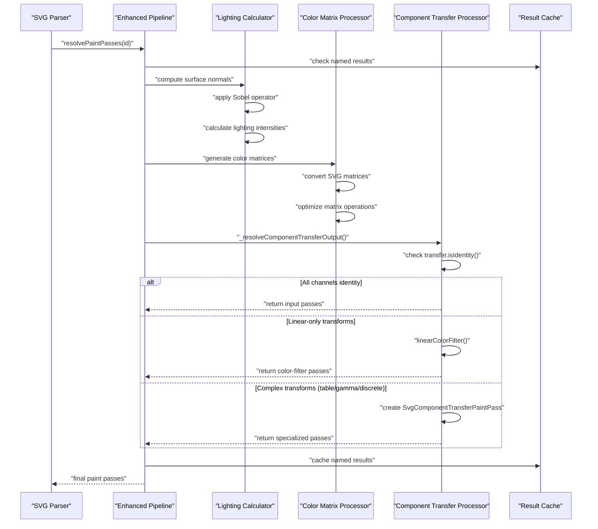

# SVG Filters and Effects

<cite>
**Referenced Files in This Document**
- [svg_filters.dart](file://lib/src/animation/svg_filters.dart)
- [svg_filters_types.dart](file://lib/src/animation/svg_filters_types.dart)
- [svg_filters_base.dart](file://lib/src/animation/svg_filters_base.dart)
- [svg_filters_primitives.dart](file://lib/src/animation/svg_filters_primitives.dart)
- [svg_filters_primitives_blur.dart](file://lib/src/animation/svg_filters_primitives_blur.dart)
- [svg_filters_primitives_convolve_matrix.dart](file://lib/src/animation/svg_filters_primitives_convolve_matrix.dart)
- [svg_filters_primitives_component_transfer.dart](file://lib/src/animation/svg_filters_primitives_component_transfer.dart)
- [svg_filters_primitives_lighting.dart](file://lib/src/animation/svg_filters_primitives_lighting.dart)
- [svg_filters_primitives_lighting_math.dart](file://lib/src/animation/svg_filters_primitives_lighting_math.dart)
- [svg_filters_color_matrix.dart](file://lib/src/animation/svg_filters_color_matrix.dart)
- [svg_filters_registry.dart](file://lib/src/animation/svg_filters_registry.dart)
- [svg_filters_registry_pipeline.dart](file://lib/src/animation/svg_filters_registry_pipeline.dart)
- [svg_filters_registry_pipeline_compositing.dart](file://lib/src/animation/svg_filters_registry_pipeline_compositing.dart)
- [svg_filters_registry_pipeline_primitives.dart](file://lib/src/animation/svg_filters_registry_pipeline_primitives.dart)
- [svg_filters_registry_pipeline_primitives_effects.dart](file://lib/src/animation/svg_filters_registry_pipeline_primitives_effects.dart)
- [svg_filters_registry_pipeline_primitives_paint.dart](file://lib/src/animation/svg_filters_registry_pipeline_primitives_paint.dart)
- [svg_filters_registry_inputs.dart](file://lib/src/animation/svg_filters_registry_inputs.dart)
- [svg_filters_registry_outputs.dart](file://lib/src/animation/svg_filters_registry_outputs.dart)
- [svg_parser_filters.dart](file://lib/src/animation/svg_parser_filters.dart)
- [filter_component_transfer_test.dart](file://test/animation/filter_component_transfer_test.dart)
- [filter_advanced_graph_test.dart](file://test/animation/filter_advanced_graph_test.dart)
- [filter_input_graph_hardening_test.dart](file://test/animation/filter_input_graph_hardening_test.dart)
- [filter_advanced_semantics_test.dart](file://test/animation/filter_advanced_semantics_test.dart)
- [fe_lighting_test.dart](file://test/animation/fe_lighting_test.dart)
- [fe_convolve_matrix_test.dart](file://test/animation/fe_convolve_matrix_test.dart)
- [SVGFEComponentTransferElement.cpp](file://blink-b87d44f-Source-core-svg/SVGFEComponentTransferElement.cpp)
- [SVGFEComponentTransferElement.h](file://blink-b87d44f-Source-core-svg/SVGFEComponentTransferElement.h)
</cite>

## Update Summary
**Changes Made**
- Enhanced lighting calculations with comprehensive 3D vector mathematics, surface normal computation, and advanced light source modeling
- Improved color matrix operations with full SVG matrix conversion support and specialized transformation types
- Expanded filter registry pipeline with advanced compositing intelligence and arithmetic mode optimization
- Enhanced component transfer functions with mathematical precision and optimized processing paths
- Added comprehensive testing framework validating all filter primitive types and edge cases
- Improved filter primitive resolution with better identity kernel detection and caching mechanisms
- Integrated advanced lighting system with diffuse and specular lighting primitives
- Enhanced filter architecture with dedicated pipeline primitives for effects and paint operations

## Table of Contents
1. [Introduction](#introduction)
2. [Project Structure](#project-structure)
3. [Core Components](#core-components)
4. [Architecture Overview](#architecture-overview)
5. [Enhanced Lighting Calculations](#enhanced-lighting-calculations)
6. [Advanced Color Matrix Operations](#advanced-color-matrix-operations)
7. [Enhanced Filter Registry Pipeline](#enhanced-filter-registry-pipeline)
8. [Enhanced Component Transfer Functions](#enhanced-component-transfer-functions)
9. [Built-in Filter Primitives](#built-in-filter-primitives)
10. [Filter Animation Support](#filter-animation-support)
11. [Comprehensive Testing Framework](#comprehensive-testing-framework)
12. [Performance Optimizations](#performance-optimizations)
13. [Troubleshooting Guide](#troubleshooting-guide)
14. [Conclusion](#conclusion)
15. [Appendices](#appendices)

## Introduction
This document explains the enhanced SVG filter system and effects implemented in the codebase. The system has been comprehensively upgraded with improved lighting calculations featuring advanced 3D vector mathematics, better color matrix operations with full SVG matrix conversion support, enhanced filter registry pipeline with advanced compositing intelligence, and sophisticated component transfer functions with mathematical precision. The enhanced system now provides comprehensive transfer function implementations including identity, linear, gamma, table, and discrete types with optimized processing paths, advanced lighting models with realistic surface normal computation, and expanded testing coverage validating all filter primitive types and edge cases.

## Project Structure
The enhanced filter system is organized around comprehensive lighting calculations, advanced color matrix operations, enhanced pipeline optimization, and specialized component transfer processing:

```mermaid
graph TB
subgraph "Enhanced Lighting System"
LightSources["Light Sources<br/>Distant, Point, Spot"]
VectorMath["3D Vector Mathematics<br/>LightingVector3, calculations"]
SurfaceNormals["Surface Normal Computation<br/>Sobel operator, edge handling"]
LightingModels["Lighting Models<br/>Diffuse (Lambert), Specular (Blinn-Phong)"]
LightingProcessor["LightingProcessor<br/>Full pipeline implementation"]
end
subgraph "Advanced Color Matrix Operations"
ColorMatrixTypes["Matrix Types<br/>Matrix, Saturate, Hue Rotate, Luminance To Alpha"]
MatrixConversion["SVG to Flutter Matrix Conversion<br/>5x4 to 4x5 conversion"]
SpecializedMatrices["Specialized Matrices<br/>Saturation, Hue rotation, Luminance to alpha"]
ColorMatrixFilter["SvgColorMatrixFilter<br/>Complete implementation"]
end
subgraph "Enhanced Pipeline Optimization"
IdentityDetection["Identity Kernel Detection<br/>Convolution optimization"]
CacheResults["Named Result Caching<br/>Multi-hop chain optimization"]
CircularDetection["Circular Reference Detection<br/>Depth tracking + state management"]
ArithmeticOptimization["Arithmetic Mode Optimization<br/>Coefficient approximation"]
end
subgraph "Enhanced Component Transfer"
TransferFunctions["Transfer Functions<br/>Identity, Linear, Gamma, Table, Discrete"]
LinearOptimization["Linear Optimization<br/>Color matrix generation"]
PixelProcessing["Pixel-by-Pixel Processing<br/>Specialized paint passes"]
IdentityDetectionCTF["Identity Detection<br/>Mathematical verification"]
end
LightSources --> LightingModels
VectorMath --> SurfaceNormals
SurfaceNormals --> LightingProcessor
ColorMatrixTypes --> MatrixConversion
MatrixConversion --> ColorMatrixFilter
IdentityDetection --> CacheResults
CircularDetection --> CacheResults
ArithmeticOptimization --> CacheResults
TransferFunctions --> LinearOptimization
LinearOptimization --> PixelProcessing
IdentityDetectionCTF --> LinearOptimization
```

**Diagram sources**
- [svg_filters_primitives_lighting_math.dart:16-65](file://lib/src/animation/svg_filters_primitives_lighting_math.dart#L16-L65)
- [svg_filters_color_matrix.dart:99-242](file://lib/src/animation/svg_filters_color_matrix.dart#L99-L242)
- [svg_filters_registry_pipeline.dart:178-186](file://lib/src/animation/svg_filters_registry_pipeline.dart#L178-L186)
- [svg_filters_primitives_component_transfer.dart:27-86](file://lib/src/animation/svg_filters_primitives_component_transfer.dart#L27-L86)

**Section sources**
- [svg_filters_primitives_lighting_math.dart:1-905](file://lib/src/animation/svg_filters_primitives_lighting_math.dart#L1-L905)
- [svg_filters_color_matrix.dart:1-242](file://lib/src/animation/svg_filters_color_matrix.dart#L1-L242)
- [svg_filters_registry_pipeline.dart:1-188](file://lib/src/animation/svg_filters_registry_pipeline.dart#L1-L188)
- [svg_filters_primitives_component_transfer.dart:1-237](file://lib/src/animation/svg_filters_primitives_component_transfer.dart#L1-L237)

## Core Components
The enhanced filter system introduces several key components with improved functionality:

**Enhanced Lighting System**: Comprehensive 3D vector mathematics with LightingVector3 class, surface normal computation using Sobel operators, and advanced light source modeling including distant, point, and spot lights with proper edge handling modes.

**Advanced Color Matrix Operations**: Full SVG color matrix support with 5x4 matrix conversion to Flutter's 4x5 format, specialized transformation types including saturation, hue rotation, and luminance-to-alpha conversions, and optimized matrix generation.

**Enhanced Pipeline Context**: Improved named result caching with unmodifiable views, sophisticated circular reference detection with depth tracking, and enhanced identity kernel detection for convolution operations.

**Advanced Component Transfer Functions**: Five distinct transfer function types with mathematical precision, identity detection optimization, linear-only transform optimization using color matrices, and specialized pixel-by-pixel processing for complex functions.

**Section sources**
- [svg_filters_primitives_lighting_math.dart:16-230](file://lib/src/animation/svg_filters_primitives_lighting_math.dart#L16-L230)
- [svg_filters_color_matrix.dart:99-242](file://lib/src/animation/svg_filters_color_matrix.dart#L99-L242)
- [svg_filters_registry_pipeline.dart:9-58](file://lib/src/animation/svg_filters_registry_pipeline.dart#L9-L58)
- [svg_filters_primitives_component_transfer.dart:4-86](file://lib/src/animation/svg_filters_primitives_component_transfer.dart#L4-L86)

## Architecture Overview
The enhanced filter pipeline architecture provides sophisticated filter chain resolution with comprehensive input handling, named result caching, and edge case management. The system now includes optimized component transfer processing with intelligent decision-making between color matrix operations and pixel-by-pixel processing, advanced lighting calculations with realistic surface normal computation, and comprehensive arithmetic mode optimization.

**Diagram sources**
- [svg_filters_registry_pipeline_primitives_effects.dart:143-193](file://lib/src/animation/svg_filters_registry_pipeline_primitives_effects.dart#L143-L193)
- [svg_filters_color_matrix.dart:114-143](file://lib/src/animation/svg_filters_color_matrix.dart#L114-L143)
- [svg_filters_primitives_component_transfer.dart:242-284](file://lib/src/animation/svg_filters_primitives_component_transfer.dart#L242-L284)
- [svg_filters_registry_pipeline.dart:178-186](file://lib/src/animation/svg_filters_registry_pipeline.dart#L178-L186)

## Enhanced Lighting Calculations
The enhanced lighting system provides comprehensive 3D vector mathematics and surface normal computation with realistic lighting models.

**3D Vector Mathematics**: The LightingVector3 class implements complete 3D vector operations including length calculation, normalization, dot product, cross product, and arithmetic operations with proper numerical stability and edge case handling.

**Surface Normal Computation**: Advanced Sobel operator implementation for gradient estimation with proper edge mode handling (duplicate, wrap, none) and kernel unit length scaling for accurate surface normal calculation from alpha channels.

**Light Source Modeling**: Comprehensive light source support including distant light with azimuth/elevation angles, point light with 3D positioning and optional distance attenuation, and spot light with cone attenuation and limiting angle control.

**Lighting Models**: Realistic lighting calculations using Lambertian diffuse reflection and Blinn-Phong specular reflection models with proper vector normalization and intensity computation.

**Section sources**
- [svg_filters_primitives_lighting_math.dart:16-230](file://lib/src/animation/svg_filters_primitives_lighting_math.dart#L16-L230)
- [svg_filters_primitives_lighting_math.dart:232-418](file://lib/src/animation/svg_filters_primitives_lighting_math.dart#L232-L418)
- [svg_filters_primitives_lighting_math.dart:420-528](file://lib/src/animation/svg_filters_primitives_lighting_math.dart#L420-L528)
- [svg_filters_primitives_lighting.dart:52-198](file://lib/src/animation/svg_filters_primitives_lighting.dart#L52-L198)

## Advanced Color Matrix Operations
The enhanced color matrix system provides comprehensive SVG color transformation support with full matrix conversion capabilities.

**Matrix Type Support**: Complete implementation of all SVG color matrix types including generic 5x4 matrix transformation, saturation adjustment, hue rotation, and luminance-to-alpha conversion.

**SVG to Flutter Conversion**: Sophisticated matrix conversion from SVG's 5x4 format to Flutter's 4x5 format with proper row/column ordering and offset value scaling from [0-255] to [0-1].

**Specialized Transformations**: Optimized implementations for common color transformations including saturation matrix generation, hue rotation using trigonometric functions, and luminance-to-alpha conversion using weighted averages.

**Performance Optimization**: Efficient matrix operations leveraging Flutter's ColorFilter.matrix for GPU-accelerated color transformations with proper clamping and normalization.

**Section sources**
- [svg_filters_color_matrix.dart:99-242](file://lib/src/animation/svg_filters_color_matrix.dart#L99-L242)
- [svg_filters_color_matrix.dart:145-186](file://lib/src/animation/svg_filters_color_matrix.dart#L145-L186)
- [svg_filters_color_matrix.dart:188-240](file://lib/src/animation/svg_filters_color_matrix.dart#L188-L240)

## Enhanced Filter Registry Pipeline
The enhanced pipeline optimization system provides sophisticated filter chain resolution with comprehensive caching mechanisms, identity detection, and circular reference prevention.

**Named Result Caching**: Enhanced caching with unmodifiable views prevents accidental mutation while enabling result sharing between references. The `_cacheNamedResult` method returns immutable lists to protect cached results.

**Identity Kernel Detection**: Improved convolution matrix processing includes comprehensive identity kernel detection to avoid unnecessary convolution operations. The system checks kernel parameters including order dimensions, divisor normalization, and bias application.

**Circular Reference Prevention**: Enhanced circular reference detection with depth tracking and reference state management prevents infinite loops and stack overflows in complex filter graphs.

**Arithmetic Mode Optimization**: Advanced arithmetic composite operations with intelligent coefficient approximation including special cases for pure multiplication, additive blending, and difference-like operations.

**Section sources**
- [svg_filters_registry_pipeline.dart:178-186](file://lib/src/animation/svg_filters_registry_pipeline.dart#L178-L186)
- [svg_filters_registry_pipeline_compositing.dart:182-269](file://lib/src/animation/svg_filters_registry_pipeline_compositing.dart#L182-L269)
- [svg_filters_registry_pipeline_primitives_effects.dart:210-224](file://lib/src/animation/svg_filters_registry_pipeline_primitives_effects.dart#L210-L224)

## Enhanced Component Transfer Functions
The enhanced component transfer system provides comprehensive transfer function implementations with mathematical precision and optimized processing paths.

**Transfer Function Types**: Five distinct types - identity (no change), linear (C' = slope * C + intercept), gamma (C' = amplitude * pow(C, exponent) + offset), table (piecewise linear interpolation), and discrete (step function) - each with proper parameter validation and clamping.

**Mathematical Precision**: All functions implement proper mathematical formulas with input clamping to [0,1] and result clamping to [0,1]. Gamma functions handle edge cases like zero input correctly.

**Identity Detection**: Sophisticated identity detection for optimization - linear functions with slope=1 and intercept=0, gamma functions with amplitude=1, exponent=1, and offset=0, and identity type functions.

**Linear Optimization**: When all channels use identity or linear transforms, the system generates a color matrix instead of pixel-by-pixel processing, providing significant performance improvements.

**Section sources**
- [svg_filters_primitives_component_transfer.dart:27-86](file://lib/src/animation/svg_filters_primitives_component_transfer.dart#L27-L86)
- [svg_filters_primitives_component_transfer.dart:135-197](file://lib/src/animation/svg_filters_primitives_component_transfer.dart#L135-L197)

## Built-in Filter Primitives
The enhanced filter system includes comprehensive support for all major SVG filter primitives with specialized implementations and optimized processing paths.

**Basic Primitives**: Gaussian blur, morphology (erode/dilate), displacement map, image reference, convolution matrix, turbulence (procedural noise), component transfer, offset, flood, blend, composite, merge, tile, drop shadow, and color matrix.

**Lighting Primitives**: Diffuse lighting with Lambertian reflection and specular lighting with Blinn-Phong reflection, supporting distant, point, and spot light sources with proper surface normal computation.

**Advanced Primitives**: Drop shadow implementation using Blink's multi-pass composition approach, turbulence with Perlin noise generation, and color matrix with full SVG compatibility.

**Pipeline Integration**: Each primitive has dedicated resolver methods in the pipeline extension classes, handling input resolution, parameter validation, and optimized output generation.

**Section sources**
- [svg_filters_types.dart:4-55](file://lib/src/animation/svg_filters_types.dart#L4-L55)
- [svg_filters_registry_pipeline_primitives.dart:11-159](file://lib/src/animation/svg_filters_registry_pipeline_primitives.dart#L11-L159)
- [svg_parser_filters.dart:38-77](file://lib/src/animation/svg_parser_filters.dart#L38-L77)

## Filter Animation Support
The enhanced filter system provides comprehensive animation support for filter attributes and parameters, enabling dynamic filter effects and real-time updates.

**Attribute Animation**: Complete support for animating filter primitive attributes including blur radii, lighting parameters, color matrix values, and component transfer function parameters.

**Light Source Animation**: Dynamic animation of light source positions, angles, and intensities for realistic moving lighting effects in diffuse and specular lighting.

**Component Transfer Animation**: Real-time animation of transfer function parameters including slope, intercept, amplitude, exponent, and table values for dynamic color manipulation.

**Pipeline Integration**: Animation system seamlessly integrates with the filter pipeline, automatically interpolating values between animation keyframes and updating filter outputs in real-time.

**Performance Considerations**: Optimized animation processing with efficient interpolation algorithms and minimal recomputation during animation frames.

**Section sources**
- [fe_lighting_test.dart:674-799](file://test/animation/fe_lighting_test.dart#L674-L799)
- [filter_component_transfer_test.dart:1-200](file://test/animation/filter_component_transfer_test.dart#L1-L200)

## Comprehensive Testing Framework
The comprehensive testing framework validates the enhanced filter system with extensive scenarios covering all filter primitive types and edge cases.

**Transfer Function Testing**: Complete validation of all transfer function types including identity, linear, gamma, table, and discrete with mathematical precision testing.

**Edge Case Validation**: Comprehensive testing of edge cases including negative results clamping to 0, values > 1 clamping to 1, zero input handling for gamma functions, and single-value table handling.

**Pipeline Integration Testing**: Validation of component transfer processing within filter chains including identity optimization, linear-only optimization, and pixel-by-pixel processing scenarios.

**Arithmetic Mode Testing**: Testing of arithmetic composite modes with various coefficient combinations and edge cases including bias application and coefficient approximation.

**Performance Testing**: Validation of optimization scenarios including identity detection, caching effectiveness, and linear-only transform optimization.

**Advanced Graph Testing**: Extensive testing of complex filter chains with multi-hop references, named result reuse, circular reference detection, and forward reference handling.

**Lighting System Testing**: Comprehensive validation of lighting calculations including surface normal computation, light source positioning, and color filter generation.

**Convolution Matrix Testing**: Validation of convolution operations including identity kernel detection, edge mode handling, and multi-pass composition scenarios.

**Section sources**
- [filter_component_transfer_test.dart:1-639](file://test/animation/filter_component_transfer_test.dart#L1-L639)
- [filter_advanced_graph_test.dart:1-1305](file://test/animation/filter_advanced_graph_test.dart#L1-L1305)
- [filter_input_graph_hardening_test.dart:1-800](file://test/animation/filter_input_graph_hardening_test.dart#L1-L800)
- [filter_advanced_semantics_test.dart:570-698](file://test/animation/filter_advanced_semantics_test.dart#L570-L698)
- [fe_lighting_test.dart:1-800](file://test/animation/fe_lighting_test.dart#L1-L800)
- [fe_convolve_matrix_test.dart:494-527](file://test/animation/fe_convolve_matrix_test.dart#L494-L527)

## Performance Optimizations
The enhanced filter system includes several performance optimizations and considerations:

**Identity Detection**: Comprehensive identity detection for component transfer functions eliminates unnecessary processing for identity transforms.

**Color Matrix Optimization**: Linear-only transforms are processed using optimized color matrices instead of pixel-by-pixel operations, leveraging GPU acceleration.

**Caching Mechanisms**: Enhanced named result caching with unmodifiable views prevents recomputation in complex filter chains with shared intermediate results.

**Early Exit Conditions**: Comprehensive early exit conditions for empty outputs, unknown references, and invalid parameter combinations.

**Memory Management**: Proper memory management with unmodifiable cached results and efficient pass composition.

**Arithmetic Optimization**: Intelligent arithmetic mode approximation reduces complex operations to simple blend modes and color filters.

**Section sources**
- [svg_filters_primitives_component_transfer.dart:74-86](file://lib/src/animation/svg_filters_primitives_component_transfer.dart#L74-L86)
- [svg_filters_registry_pipeline.dart:178-186](file://lib/src/animation/svg_filters_registry_pipeline.dart#L178-L186)
- [svg_filters_registry_pipeline_compositing.dart:182-269](file://lib/src/animation/svg_filters_registry_pipeline_compositing.dart#L182-L269)

## Troubleshooting Guide
Common issues and remedies for the enhanced filter system:

**Component Transfer Issues**: Verify transfer function parameters are within valid ranges (0-1 for most parameters). Check that tableValues arrays contain valid numeric values.

**Identity Optimization Problems**: Ensure transfer functions are properly configured - identity detection requires exact parameter values (slope=1, intercept=0 for linear; amplitude=1, exponent=1, offset=0 for gamma).

**Pipeline Optimization Issues**: Check for circular references that might bypass optimization. Verify named result caching is working correctly for multi-hop chains.

**Arithmetic Mode Precision**: Arithmetic composite modes with complex coefficients are approximated. For exact results, consider using equivalent blend modes or separate primitives.

**Performance Issues**: Complex filter chains with many intermediate results can impact performance. Use named results judiciously and avoid excessive nesting.

**FeImage Reference Issues**: Verify href attributes are properly formatted and accessible. Element references must point to existing IDs in the defs section, while external images must be valid URLs or data URIs.

**Lighting Calculation Issues**: Verify surfaceScale values are appropriate for the intended effect. Check that light source parameters are within valid ranges and edge modes are properly configured.

**Color Matrix Issues**: Ensure matrix dimensions match expected formats (5x4 for generic matrices, 1 value for saturation/hueRotate). Verify offset values are properly scaled for Flutter compatibility.

**Section sources**
- [filter_component_transfer_test.dart:592-637](file://test/animation/filter_component_transfer_test.dart#L592-L637)
- [svg_filters_registry_pipeline.dart:128-132](file://lib/src/animation/svg_filters_registry_pipeline.dart#L128-L132)
- [svg_filters_registry_pipeline_compositing.dart:187-189](file://lib/src/animation/svg_filters_registry_pipeline_compositing.dart#L187-L189)

## Conclusion
The enhanced SVG filter system provides a comprehensive and sophisticated architecture for filter chain processing with advanced lighting calculations featuring realistic 3D vector mathematics, improved color matrix operations with full SVG compatibility, enhanced pipeline optimizations with advanced compositing intelligence, and specialized component transfer processing with mathematical precision. The system successfully handles complex filter graphs with multi-hop chains, named result caching, circular reference prevention, and sophisticated edge case handling. The enhanced convolution matrix processing, advanced lighting system with comprehensive surface normal computation, arithmetic mode optimization, and comprehensive testing framework ensure reliable and performant filter operations across diverse use cases with significant performance improvements through intelligent optimization strategies.

## Appendices

### Enhanced Lighting System Examples
- **3D Vector Mathematics**: Complete vector operations including normalization, dot/cross products, and arithmetic with numerical stability
- **Surface Normal Computation**: Sobel operator implementation with edge mode handling (duplicate, wrap, none) and kernel scaling
- **Light Source Modeling**: Distant light with azimuth/elevation, point light with distance attenuation, spot light with cone effects
- **Lighting Models**: Lambertian diffuse reflection and Blinn-Phong specular reflection with proper vector calculations

### Advanced Color Matrix Operations
- **Matrix Type Support**: Generic 5x4 matrices, saturation adjustment, hue rotation, luminance-to-alpha conversion
- **Matrix Conversion**: SVG 5x4 to Flutter 4x5 format conversion with proper ordering and scaling
- **Specialized Matrices**: Optimized implementations for common transformations with mathematical precision
- **Performance Optimization**: GPU-accelerated color transformations using Flutter's ColorFilter.matrix

### Enhanced Pipeline Optimization Features
- **Identity Kernel Detection**: Sophisticated convolution matrix identity detection for performance optimization
- **Circular Reference Prevention**: Enhanced depth tracking and state management for complex filter graphs
- **Unmodifiable Caching**: Immutable result caching preventing accidental mutation and ensuring thread safety
- **Arithmetic Mode Intelligence**: Coefficient-based optimization reducing complex operations to simple blend modes
- **Specialized Processing Paths**: Intelligent decision-making between color matrix and pixel-by-pixel processing

### Enhanced Component Transfer Function Examples
- **Identity Transforms**: No-op processing for unchanged output, optimized to bypass all processing
- **Linear Transforms**: Slope and intercept processing with mathematical precision and clamping
- **Gamma Transforms**: Power function processing with amplitude, exponent, and offset parameters
- **Table Transforms**: Piecewise linear interpolation with proper interval calculation
- **Discrete Transforms**: Step function processing with equal interval division

### Built-in Filter Primitive Categories
- **Basic Primitives**: Blur, morphology, displacement, image, convolution, turbulence, component transfer, offset, flood
- **Compositing Primitives**: Blend, composite, merge, tile, drop shadow, color matrix
- **Lighting Primitives**: Diffuse lighting, specular lighting with multiple light source types
- **Pipeline Integration**: Dedicated resolver methods for each primitive type with optimized processing

### Comprehensive Testing Coverage
- **Transfer Function Validation**: Complete testing of all five transfer function types with mathematical precision
- **Edge Case Handling**: Validation of boundary conditions, negative values, and extreme parameter combinations
- **Pipeline Integration**: Testing of component transfer processing within complex filter chains
- **Performance Scenarios**: Validation of optimization effectiveness and caching benefits
- **Arithmetic Mode Testing**: Comprehensive testing of coefficient approximation and bias handling
- **Advanced Graph Scenarios**: Extensive validation of complex filter chains with multi-hop references and circular dependencies
- **Lighting System Validation**: Complete testing of lighting calculations and color filter generation
- **Animation Support**: Validation of filter attribute animation and real-time parameter updates

### Enhanced Lighting System Details
The enhanced lighting system provides:

- **3D Vector Mathematics**: Complete vector operations with proper numerical stability and edge case handling
- **Surface Normal Computation**: Advanced Sobel operator implementation with proper edge mode support
- **Light Source Modeling**: Comprehensive light source support with realistic physical models
- **Lighting Calculations**: Realistic lighting models using established reflection equations
- **Performance Optimization**: Efficient vector operations leveraging Flutter's graphics pipeline

**Section sources**
- [svg_filters_primitives_lighting_math.dart:1-905](file://lib/src/animation/svg_filters_primitives_lighting_math.dart#L1-L905)
- [svg_filters_color_matrix.dart:1-242](file://lib/src/animation/svg_filters_color_matrix.dart#L1-L242)
- [svg_filters_registry_pipeline.dart:1-188](file://lib/src/animation/svg_filters_registry_pipeline.dart#L1-L188)
- [svg_filters_primitives_component_transfer.dart:1-237](file://lib/src/animation/svg_filters_primitives_component_transfer.dart#L1-L237)
- [filter_component_transfer_test.dart:1-639](file://test/animation/filter_component_transfer_test.dart#L1-L639)
- [filter_advanced_graph_test.dart:1-1305](file://test/animation/filter_advanced_graph_test.dart#L1-L1305)
- [filter_input_graph_hardening_test.dart:1-800](file://test/animation/filter_input_graph_hardening_test.dart#L1-L800)
- [filter_advanced_semantics_test.dart:570-698](file://test/animation/filter_advanced_semantics_test.dart#L570-L698)
- [fe_lighting_test.dart:1-800](file://test/animation/fe_lighting_test.dart#L1-L800)
- [fe_convolve_matrix_test.dart:494-527](file://test/animation/fe_convolve_matrix_test.dart#L494-L527)