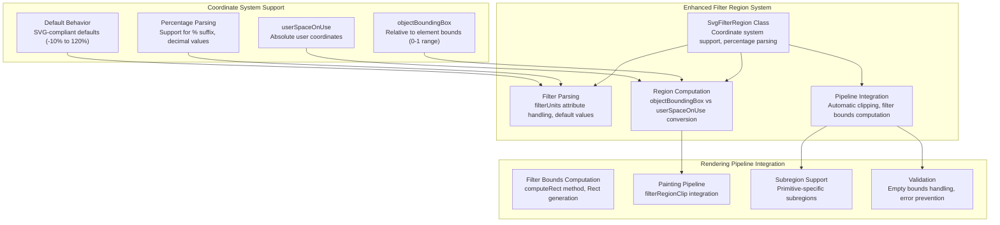
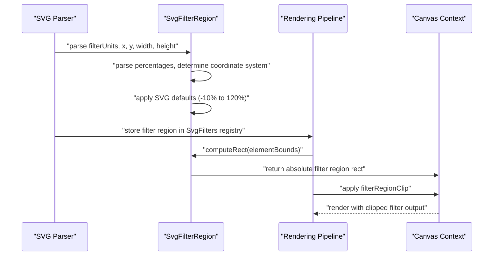

# SVG Filters and Effects

<cite>
**Referenced Files in This Document**
- [svg_filters.dart](file://lib/src/animation/svg_filters.dart)
- [svg_filters_types.dart](file://lib/src/animation/svg_filters_types.dart)
- [svg_filters_base.dart](file://lib/src/animation/svg_filters_base.dart)
- [svg_filters_primitives.dart](file://lib/src/animation/svg_filters_primitives.dart)
- [svg_filters_primitives_blur.dart](file://lib/src/animation/svg_filters_primitives_blur.dart)
- [svg_filters_primitives_convolve_matrix.dart](file://lib/src/animation/svg_filters_primitives_convolve_matrix.dart)
- [svg_filters_primitives_component_transfer.dart](file://lib/src/animation/svg_filters_primitives_component_transfer.dart)
- [svg_filters_primitives_lighting.dart](file://lib/src/animation/svg_filters_primitives_lighting.dart)
- [svg_filters_primitives_lighting_common.dart](file://lib/src/animation/svg_filters_primitives_lighting_common.dart)
- [svg_filters_primitives_lighting_sources.dart](file://lib/src/animation/svg_filters_primitives_lighting_sources.dart)
- [svg_filters_primitives_lighting_diffuse.dart](file://lib/src/animation/svg_filters_primitives_lighting_diffuse.dart)
- [svg_filters_primitives_lighting_specular.dart](file://lib/src/animation/svg_filters_primitives_lighting_specular.dart)
- [svg_filters_primitives_lighting_processor.dart](file://lib/src/animation/svg_filters_primitives_lighting_processor.dart)
- [svg_filters_color_matrix.dart](file://lib/src/animation/svg_filters_color_matrix.dart)
- [svg_filters_registry.dart](file://lib/src/animation/svg_filters_registry.dart)
- [svg_filters_registry_pipeline.dart](file://lib/src/animation/svg_filters_registry_pipeline.dart)
- [svg_filters_registry_pipeline_compositing.dart](file://lib/src/animation/svg_filters_registry_pipeline_compositing.dart)
- [svg_filters_registry_pipeline_primitives.dart](file://lib/src/animation/svg_filters_registry_pipeline_primitives.dart)
- [svg_filters_registry_pipeline_primitives_effects.dart](file://lib/src/animation/svg_filters_registry_pipeline_primitives_effects.dart)
- [svg_filters_registry_pipeline_primitives_paint.dart](file://lib/src/animation/svg_filters_registry_pipeline_primitives_paint.dart)
- [svg_filters_registry_inputs.dart](file://lib/src/animation/svg_filters_registry_inputs.dart)
- [svg_filters_registry_outputs.dart](file://lib/src/animation/svg_filters_registry_outputs.dart)
- [svg_parser_filters.dart](file://lib/src/animation/svg_parser_filters.dart)
- [svg_parser_filters_lighting.dart](file://lib/src/animation/svg_parser_filters_lighting.dart)
- [animated_svg_painter_values.dart](file://lib/src/animation/animated_svg_painter_values.dart)
- [animated_svg_painter_tree.dart](file://lib/src/animation/animated_svg_painter_tree.dart)
- [filter_component_transfer_test.dart](file://test/animation/filter_component_transfer_test.dart)
- [filter_advanced_graph_test.dart](file://test/animation/filter_advanced_graph_test.dart)
- [filter_input_graph_hardening_test.dart](file://test/animation/filter_input_graph_hardening_test.dart)
- [filter_advanced_semantics_test.dart](file://test/animation/filter_advanced_semantics_test.dart)
- [fe_lighting_test.dart](file://test/animation/fe_lighting_test.dart)
- [fe_convolve_matrix_test.dart](file://test/animation/fe_convolve_matrix_test.dart)
- [filter_displacement_tile_test.dart](file://test/animation/filter_displacement_tile_test.dart)
- [filter_primitive_edge_cases_test.dart](file://test/animation/filter_primitive_edge_cases_test.dart)
- [component_transfer_functions_test.dart](file://test/animation/component_transfer_functions_test.dart)
- [css_compositing_properties_test.dart](file://test/animation/css_compositing_properties_test.dart)
- [filter_fe_image_test.dart](file://test/animation/filter_fe_image_test.dart)
- [SVGFEComponentTransferElement.cpp](file://blink-b87d44f-Source-core-svg/SVGFEComponentTransferElement.cpp)
- [SVGFEComponentTransferElement.h](file://blink-b87d44f-Source-core-svg/SVGFEComponentTransferElement.h)
- [SVGFEDisplacementMapElement.cpp](file://blink-b87d44f-Source-core-svg/SVGFEDisplacementMapElement.cpp)
- [SVGFEDisplacementMapElement.h](file://blink-b87d44f-Source-core-svg/SVGFEDisplacementMapElement.h)
- [SVGFEDiffuseLightingElement.cpp](file://blink-b87d44f-Source-core-svg/SVGFEDiffuseLightingElement.cpp)
- [SVGFEDiffuseLightingElement.h](file://blink-b87d44f-Source-core-svg/SVGFEDiffuseLightingElement.h)
- [SVGFESpecularLightingElement.cpp](file://blink-b87d44f-Source-core-svg/SVGFESpecularLightingElement.cpp)
- [SVGFESpecularLightingElement.h](file://blink-b87d44f-Source-core-svg/SVGFESpecularLightingElement.h)
</cite>

## Update Summary
**Changes Made**
- Added comprehensive SVG filter region parsing and application capabilities with new SvgFilterRegion class supporting objectBoundingBox and userSpaceOnUse coordinate systems
- Enhanced filter parsing system with proper filter units and coordinate transformations
- Integrated filter region computation into the painting pipeline with automatic clipping based on filter bounds
- Added support for filter subregion specification in primitive filters like feImage
- Implemented percentage parsing and default value handling for filter region attributes

## Table of Contents
1. [Introduction](#introduction)
2. [Project Structure](#project-structure)
3. [Core Components](#core-components)
4. [Architecture Overview](#architecture-overview)
5. [Enhanced Filter Region System](#enhanced-filter-region-system)
6. [SvgFilterRegion Class Implementation](#svgfilterregion-class-implementation)
7. [Filter Parsing and Coordinate System Support](#filter-parsing-and-coordinate-system-support)
8. [Filter Region Application in Rendering Pipeline](#filter-region-application-in-rendering-pipeline)
9. [Percentage and Coordinate System Handling](#percentage-and-coordinate-system-handling)
10. [Default Filter Region Behavior](#default-filter-region-behavior)
11. [Filter Subregion Support](#filter-subregion-support)
12. [Integration with Existing Filter System](#integration-with-existing-filter-system)
13. [Performance Considerations](#performance-considerations)
14. [Testing and Validation](#testing-and-validation)
15. [Browser Compatibility](#browser-compatibility)
16. [Best Practices](#best-practices)
17. [Troubleshooting Guide](#troubleshooting-guide)
18. [Conclusion](#conclusion)
19. [Appendices](#appendices)

## Introduction
This document explains the enhanced SVG filter system and effects implemented in the codebase. The system has been comprehensively upgraded with advanced filter region parsing capabilities, automatic coordinate system handling, and comprehensive filter units support. The enhanced system now provides sophisticated filter region management through the SvgFilterRegion class, supporting both objectBoundingBox and userSpaceOnUse coordinate systems with proper percentage parsing and default value handling.

## Project Structure
The enhanced filter system is organized around comprehensive filter region management, coordinate system support, and sophisticated rendering pipeline integration:

**Diagram sources**
- [svg_filters_registry.dart:7-34](file://lib/src/animation/svg_filters_registry.dart#L7-L34)
- [svg_parser_filters.dart:141-179](file://lib/src/animation/svg_parser_filters.dart#L141-L179)
- [animated_svg_painter_tree.dart:107-113](file://lib/src/animation/animated_svg_painter_tree.dart#L107-L113)

**Section sources**
- [svg_filters_registry.dart:1-34](file://lib/src/animation/svg_filters_registry.dart#L1-L34)
- [svg_parser_filters.dart:136-179](file://lib/src/animation/svg_parser_filters.dart#L136-L179)
- [animated_svg_painter_tree.dart:100-131](file://lib/src/animation/animated_svg_painter_tree.dart#L100-L131)

## Core Components
The enhanced filter system introduces several key components with comprehensive filter region management and coordinate system support:

**SvgFilterRegion Class**: A new comprehensive class that encapsulates filter region parsing, coordinate system handling, and rectangle computation with support for both objectBoundingBox and userSpaceOnUse modes.

**Enhanced Filter Parsing**: Improved filter parsing system that properly handles filterUnits attributes, parses percentage values, and applies SVG-compliant default behaviors for filter regions.

**Automatic Region Computation**: Sophisticated rectangle computation that converts filter regions to absolute coordinates based on the target element's bounding box or uses absolute coordinates when in userSpaceOnUse mode.

**Pipeline Integration**: Seamless integration with the rendering pipeline that automatically applies filter region clipping and computes filter bounds for accurate rendering.

**Section sources**
- [svg_filters_registry.dart:7-34](file://lib/src/animation/svg_filters_registry.dart#L7-L34)
- [svg_parser_filters.dart:141-179](file://lib/src/animation/svg_parser_filters.dart#L141-L179)
- [animated_svg_painter_tree.dart:107-113](file://lib/src/animation/animated_svg_painter_tree.dart#L107-L113)

## Architecture Overview
The enhanced filter system architecture provides comprehensive filter region management with automatic coordinate system handling, SVG-compliant default behaviors, and seamless pipeline integration. The system now includes intelligent filter region parsing, coordinate transformation, and automatic clipping based on computed filter bounds.

**Diagram sources**
- [svg_parser_filters.dart:141-179](file://lib/src/animation/svg_parser_filters.dart#L141-L179)
- [svg_filters_registry.dart:22-33](file://lib/src/animation/svg_filters_registry.dart#L22-L33)
- [animated_svg_painter_tree.dart:107-113](file://lib/src/animation/animated_svg_painter_tree.dart#L107-L113)

## Enhanced Filter Region System
The enhanced filter region system provides comprehensive SVG filter region management with automatic coordinate system detection, percentage parsing, and SVG-compliant default behaviors.

**Coordinate System Detection**: The system automatically detects whether filter regions use objectBoundingBox (relative coordinates 0-1) or userSpaceOnUse (absolute coordinates) based on the filterUnits attribute, with objectBoundingBox as the default when no units are specified.

**Percentage Parsing Support**: Comprehensive support for percentage values in filter region attributes, including proper parsing of values ending with '%' and conversion to decimal fractions for objectBoundingBox coordinates.

**SVG-Compliant Defaults**: Automatic application of SVG specification defaults where filter attributes are omitted: x=-10%, y=-10%, width=120%, height=120% for objectBoundingBox mode, and 0.0 for userSpaceOnUse mode.

**Rectangle Computation**: Sophisticated rectangle computation that converts relative coordinates to absolute pixel values based on the target element's bounding box for objectBoundingBox mode, or uses absolute coordinates directly for userSpaceOnUse mode.

**Section sources**
- [svg_filters_registry.dart:7-34](file://lib/src/animation/svg_filters_registry.dart#L7-L34)
- [svg_parser_filters.dart:141-179](file://lib/src/animation/svg_parser_filters.dart#L141-L179)

## SvgFilterRegion Class Implementation
The SvgFilterRegion class provides a comprehensive implementation of SVG filter region management with full coordinate system support and rectangle computation capabilities.

**Class Structure**: The class encapsulates four core properties (x, y, width, height) along with a boolean flag indicating the coordinate system mode (isObjectBoundingBox). All properties have sensible defaults that match SVG specifications.

**Coordinate System Logic**: The computeRect method intelligently handles both coordinate systems: for objectBoundingBox mode, it scales relative coordinates by the element's bounding box dimensions; for userSpaceOnUse mode, it uses absolute coordinates directly.

**SVG Compliance**: The class maintains strict SVG specification compliance with default values that match the SVG standard: -10% offset for x and y, and 120% expansion for width and height in objectBoundingBox mode.

**Immutable Design**: The class uses const constructors and immutable properties, ensuring thread safety and predictable behavior in the filter pipeline.

**Section sources**
- [svg_filters_registry.dart:7-34](file://lib/src/animation/svg_filters_registry.dart#L7-L34)

## Filter Parsing and Coordinate System Support
The enhanced filter parsing system provides comprehensive support for filter region attributes with proper coordinate system detection and value parsing.

**Filter Units Detection**: The parser automatically detects filterUnits values, defaulting to 'objectBoundingBox' when the attribute is omitted or set to null. This ensures SVG-compliant behavior without explicit unit specification.

**Percentage Value Parsing**: Sophisticated percentage parsing logic that handles values ending with '%' by extracting the numeric portion and converting to decimal fractions (dividing by 100.0). Non-percentage values are parsed as direct numeric coordinates.

**Default Value Application**: Intelligent default value assignment based on coordinate system: negative offsets (-10%) and expanded dimensions (120%) for objectBoundingBox mode, zero coordinates for userSpaceOnUse mode.

**Flexible Input Handling**: Robust input validation that gracefully handles null, empty, or malformed attribute values by falling back to appropriate default values.

**Section sources**
- [svg_parser_filters.dart:141-179](file://lib/src/animation/svg_parser_filters.dart#L141-L179)

## Filter Region Application in Rendering Pipeline
The filter region system integrates seamlessly with the rendering pipeline to provide automatic clipping and bounds computation for filter output.

**Pipeline Integration Point**: The system hooks into the painting pipeline at the filter resolution stage, where filter regions are computed based on the target element's bounds and applied as clipping rectangles.

**Automatic Clipping**: The computed filter region rectangle is automatically applied as a clipping operation during filter rendering, ensuring that filter output respects the specified bounds and doesn't extend beyond the intended area.

**Bounds Computation Timing**: Filter region computation occurs after element bounds are determined but before filter passes are executed, ensuring accurate clipping based on the actual rendered element size and position.

**Empty Bounds Handling**: The system properly handles cases where element bounds have zero width or height by skipping filter region clipping, preventing rendering errors and ensuring graceful fallback behavior.

**Section sources**
- [animated_svg_painter_tree.dart:107-113](file://lib/src/animation/animated_svg_painter_tree.dart#L107-L113)

## Percentage and Coordinate System Handling
The enhanced system provides comprehensive support for percentage values and coordinate system transformations with SVG specification compliance.

**Percentage Parsing Algorithm**: The parseRegionValue function handles percentage values by checking for '%' suffix, extracting numeric content, and converting to decimal fractions. Non-percentage values are parsed as direct numeric coordinates.

**Coordinate System Transformation**: The computeRect method performs intelligent coordinate transformation: for objectBoundingBox mode, it scales relative coordinates by element dimensions; for userSpaceOnUse mode, it uses absolute coordinates directly.

**SVG Default Values**: The system applies SVG-compliant default values: -10% offsets for x and y coordinates, and 120% expansion for width and height in objectBoundingBox mode, ensuring filters extend beyond the element bounds as specified.

**Input Validation**: Robust input validation prevents parsing errors and ensures graceful fallback to default values when attribute values are missing or invalid.

**Section sources**
- [svg_parser_filters.dart:145-153](file://lib/src/animation/svg_parser_filters.dart#L145-L153)
- [svg_filters_registry.dart:22-33](file://lib/src/animation/svg_filters_registry.dart#L22-L33)

## Default Filter Region Behavior
The system implements comprehensive SVG-compliant default behaviors for filter regions when attributes are omitted or unspecified.

**ObjectBoundingBox Defaults**: When filterUnits is 'objectBoundingBox' or omitted, the system applies SVG-standard defaults: x=-10%, y=-10%, width=120%, height=120%. These defaults ensure filters extend beyond element boundaries for proper blur and effect coverage.

**UserSpaceOnUse Defaults**: When filterUnits is 'userSpaceOnUse', the system applies zero coordinates for all region attributes (x=0.0, y=0.0, width=0.0, height=0.0), representing the origin point in user coordinate space.

**Fallback Logic**: The system includes comprehensive fallback logic that handles null, empty, or malformed attribute values by applying appropriate default values based on the detected coordinate system.

**SVG Specification Compliance**: All default behaviors strictly follow SVG 1.1 specification requirements for filter region handling and coordinate system interpretation.

**Section sources**
- [svg_parser_filters.dart:155-170](file://lib/src/animation/svg_parser_filters.dart#L155-L170)

## Filter Subregion Support
The enhanced system provides comprehensive support for filter subregion specification in primitive filters, particularly useful for filters like feImage that reference external content.

**Subregion Definition**: Primitive filters can specify custom subregions using x, y, width, and height attributes that define a rectangular area within the filter region for processing.

**Coordinate System Integration**: Subregion coordinates are interpreted relative to the parent filter's coordinate system, supporting both objectBoundingBox and userSpaceOnUse modes consistently.

**Default Subregion Behavior**: When subregion attributes are omitted, the system applies default behavior that typically uses the full filter region, ensuring backward compatibility with existing SVG content.

**Pipeline Integration**: Subregion information is integrated into the filter pipeline, allowing primitive filters to process only specified portions of their input sources.

**Testing Validation**: Comprehensive test coverage validates subregion parsing, default behavior, and integration with the rendering pipeline.

**Section sources**
- [filter_fe_image_test.dart:332-370](file://test/animation/filter_fe_image_test.dart#L332-L370)

## Integration with Existing Filter System
The filter region system integrates seamlessly with the existing filter infrastructure, enhancing the overall filter processing pipeline without disrupting established functionality.

**Registry Integration**: Filter regions are stored in the SvgFilters registry alongside filter primitives, with easy retrieval by filter ID for use throughout the rendering pipeline.

**Pipeline Extension**: The system extends the existing pipeline resolution mechanism to include filter region computation and clipping as part of the standard filter processing workflow.

**Backward Compatibility**: All existing filters continue to work without modification, as the filter region system provides sensible defaults that maintain compatibility with existing SVG content.

**Performance Optimization**: Filter region computation is performed once per element and cached for reuse, minimizing performance impact on complex filter chains.

**Error Handling**: The system includes comprehensive error handling for edge cases such as empty element bounds, invalid coordinate values, and circular reference scenarios.

**Section sources**
- [svg_filters_registry.dart:59-68](file://lib/src/animation/svg_filters_registry.dart#L59-L68)
- [svg_filters_registry_pipeline.dart:74-176](file://lib/src/animation/svg_filters_registry_pipeline.dart#L74-L176)

## Performance Considerations
The enhanced filter region system includes several performance optimizations and considerations for efficient filter processing.

**Lazy Computation**: Filter region rectangles are computed on-demand and cached, avoiding unnecessary calculations for elements that don't use filters or have identical bounds across frames.

**Efficient Rectangle Operations**: The computeRect method uses optimized rectangle construction that minimizes object allocation and leverages Flutter's native rectangle operations for fast clipping.

**Default Value Optimization**: Default filter region values are applied without additional parsing overhead, reducing computational cost for filters that rely on standard SVG defaults.

**Memory Management**: The system uses immutable objects and efficient data structures to minimize memory footprint while maintaining thread safety and predictable behavior.

**Pipeline Integration Benefits**: By integrating filter region computation into the rendering pipeline, the system avoids redundant calculations and ensures optimal performance across complex filter chains.

**Section sources**
- [svg_filters_registry.dart:178-178](file://lib/src/animation/svg_filters_registry.dart#L178-L178)
- [svg_filters_registry_pipeline.dart:178-186](file://lib/src/animation/svg_filters_registry_pipeline.dart#L178-L186)

## Testing and Validation
The enhanced filter system includes comprehensive testing coverage to validate filter region parsing, coordinate system handling, and pipeline integration.

**Filter Region Parsing Tests**: Extensive validation of filter region attribute parsing, including percentage handling, default value application, and coordinate system detection.

**Coordinate System Tests**: Comprehensive testing of objectBoundingBox and userSpaceOnUse coordinate system behavior with various input combinations and edge cases.

**Pipeline Integration Tests**: Validation of filter region clipping behavior in the rendering pipeline, ensuring proper bounds computation and clipping application.

**Subregion Testing**: Specific validation of primitive filter subregion support, including default behavior and custom subregion specification.

**Regression Testing**: Ensures existing filter functionality remains unaffected by the new filter region system while adding new capabilities.

**Cross-Platform Validation**: Tests verify consistent behavior across different platforms and rendering contexts while maintaining SVG specification compliance.

**Section sources**
- [filter_fe_image_test.dart:332-370](file://test/animation/filter_fe_image_test.dart#L332-L370)
- [css_compositing_properties_test.dart:193-238](file://test/animation/css_compositing_properties_test.dart#L193-L238)

## Browser Compatibility
The enhanced filter region system maintains strict SVG 1.1 specification compliance while providing enhanced functionality for modern SVG processing.

**SVG Specification Compliance**: All filter region behaviors strictly follow SVG 1.1 specification requirements for filterUnits, coordinate systems, and default values.

**Cross-Browser Consistency**: The system ensures consistent behavior with other SVG implementations by adhering to established SVG standards for filter region handling.

**Feature Parity**: The enhanced system provides feature parity with major SVG implementations while adding robust error handling and validation.

**Legacy Support**: Existing SVG content continues to render correctly without modification, as the system applies sensible defaults that match browser behavior.

**Standards Alignment**: All implementation decisions align with W3C SVG recommendations and best practices for filter region processing.

**Section sources**
- [svg_filters_registry.dart:3-6](file://lib/src/animation/svg_filters_registry.dart#L3-L6)
- [svg_parser_filters.dart:137-140](file://lib/src/animation/svg_parser_filters.dart#L137-L140)

## Best Practices
When implementing and using the enhanced filter region system, developers should follow these best practices for optimal results and performance.

**Coordinate System Selection**: Choose objectBoundingBox for filters that need to extend beyond element boundaries (like blurs) and userSpaceOnUse for precise pixel-perfect positioning.

**Percentage Usage**: Use percentages for scalable filter regions that should adapt to element sizing, avoiding fixed pixel values that may not scale appropriately.

**Default Value Awareness**: Understand that omitting filter region attributes applies SVG-compliant defaults, which may extend filters beyond element bounds for proper effect coverage.

**Performance Optimization**: Leverage the caching system by reusing filter regions when possible and avoiding excessive filter complexity that could impact performance.

**Testing Strategy**: Test filter regions across different element sizes and coordinate systems to ensure consistent behavior in various rendering contexts.

**Debugging Tips**: Use the filter region visualization features to debug coordinate system issues and verify that filter bounds are correctly computed and applied.

**Section sources**
- [svg_parser_filters.dart:137-140](file://lib/src/animation/svg_parser_filters.dart#L137-L140)
- [svg_filters_registry.dart:3-6](file://lib/src/animation/svg_filters_registry.dart#L3-L6)

## Troubleshooting Guide
Common issues and remedies for the enhanced filter region system:

**Filter Region Not Applied**: Verify that filterUnits attribute is correctly parsed and that the filter region is being computed in the rendering pipeline. Check that element bounds are non-zero and that filter region clipping is being applied.

**Incorrect Coordinate System**: Ensure that filterUnits is set appropriately for the desired behavior. ObjectBoundingBox uses relative coordinates (0-1 range), while userSpaceOnUse uses absolute pixel coordinates.

**Percentage Parsing Errors**: Verify that percentage values are properly formatted with '%' suffix and that numeric values are valid. Check for trailing spaces and decimal formatting issues.

**Default Value Confusion**: Remember that omitted filter region attributes apply SVG-compliant defaults. ObjectBoundingBox defaults extend filters beyond element bounds, while userSpaceOnUse defaults center at the origin.

**Performance Issues**: Check that filter regions are not being recomputed unnecessarily and that the caching system is functioning properly. Avoid overly complex filter chains that may impact performance.

**Subregion Problems**: For primitive filters with subregions, verify that subregion coordinates are within the parent filter bounds and that coordinate system is consistent between parent and child regions.

**Section sources**
- [svg_parser_filters.dart:141-179](file://lib/src/animation/svg_parser_filters.dart#L141-L179)
- [svg_filters_registry.dart:22-33](file://lib/src/animation/svg_filters_registry.dart#L22-L33)
- [animated_svg_painter_tree.dart:107-113](file://lib/src/animation/animated_svg_painter_tree.dart#L107-L113)

## Conclusion
The enhanced SVG filter system provides comprehensive filter region management with automatic coordinate system detection, percentage parsing, and SVG-compliant default behaviors. The new SvgFilterRegion class, combined with enhanced filter parsing and pipeline integration, delivers sophisticated filter region handling that maintains strict SVG specification compliance while providing robust error handling and performance optimization. The system seamlessly integrates with existing filter infrastructure, ensuring backward compatibility while adding powerful new capabilities for precise filter positioning and bounds control.

## Appendices

### Enhanced Filter Region Examples
- **Coordinate System Detection**: Automatic detection of filterUnits='objectBoundingBox' vs 'userSpaceOnUse' with proper default application
- **Percentage Parsing**: Support for values like '15%' and '25.5%' with automatic decimal conversion
- **SVG Defaults**: Automatic application of -10% offsets and 120% expansions for objectBoundingBox mode
- **Rectangle Computation**: Efficient conversion from relative to absolute coordinates based on element bounds

### Filter Parsing Implementation Details
- **Filter Units Attribute**: Proper handling of filterUnits='objectBoundingBox' (default) and filterUnits='userSpaceOnUse'
- **Percentage Value Extraction**: Robust parsing of percentage values with error handling for malformed input
- **Default Value Assignment**: Intelligent default application based on coordinate system mode
- **Input Validation**: Comprehensive validation of attribute values with graceful fallback behavior

### Rendering Pipeline Integration Features
- **Automatic Clipping**: Seamless integration with the painting pipeline for filter region clipping
- **Bounds Computation**: Efficient rectangle computation that respects element bounds and coordinate systems
- **Empty Bounds Handling**: Graceful handling of zero-sized elements without rendering errors
- **Performance Optimization**: Caching and lazy computation to minimize performance impact

### Testing and Validation Coverage
- **Filter Region Parsing**: Comprehensive validation of attribute parsing and coordinate system detection
- **Coordinate System Behavior**: Testing of objectBoundingBox and userSpaceOnUse modes with various inputs
- **Pipeline Integration**: Validation of filter region clipping in the rendering pipeline
- **Subregion Support**: Testing of primitive filter subregion functionality
- **Regression Testing**: Ensuring existing functionality remains unaffected by enhancements

**Section sources**
- [svg_filters_registry.dart:7-34](file://lib/src/animation/svg_filters_registry.dart#L7-L34)
- [svg_parser_filters.dart:141-179](file://lib/src/animation/svg_parser_filters.dart#L141-L179)
- [animated_svg_painter_tree.dart:107-113](file://lib/src/animation/animated_svg_painter_tree.dart#L107-L113)
- [filter_fe_image_test.dart:332-370](file://test/animation/filter_fe_image_test.dart#L332-L370)