# SVG Filters and Effects

<cite>
**Referenced Files in This Document**
- [SVGFilter.cpp](file://blink-b87d44f-Source-core-svg/graphics/filters/SVGFilter.cpp)
- [SVGFilter.h](file://blink-b87d44f-Source-core-svg/graphics/filters/SVGFilter.h)
- [SVGFilterBuilder.cpp](file://blink-b87d44f-Source-core-svg/graphics/filters/SVGFilterBuilder.cpp)
- [SVGFilterBuilder.h](file://blink-b87d44f-Source-core-svg/graphics/filters/SVGFilterBuilder.h)
- [SVGFEBlendElement.cpp](file://blink-b87d44f-Source-core-svg/SVGFEBlendElement.cpp)
- [SVGFEColorMatrixElement.cpp](file://blink-b87d44f-Source-core-svg/SVGFEColorMatrixElement.cpp)
- [SVGFEGaussianBlurElement.cpp](file://blink-b87d44f-Source-core-svg/SVGFEGaussianBlurElement.cpp)
- [SVGFEComponentTransferElement.cpp](file://blink-b87d44f-Source-core-svg/SVGFEComponentTransferElement.cpp)
- [SVGFEDiffuseLightingElement.cpp](file://blink-b87d44f-Source-core-svg/SVGFEDiffuseLightingElement.cpp)
- [SVGFEMergeElement.cpp](file://blink-b87d44f-Source-core-svg/SVGFEMergeElement.cpp)
- [SVGFETurbulenceElement.cpp](file://blink-b87d44f-Source-core-svg/SVGFETurbulenceElement.cpp)
- [SVGFECompositeElement.cpp](file://blink-b87d44f-Source-core-svg/SVGFECompositeElement.cpp)
- [SVGFEOffsetElement.cpp](file://blink-b87d44f-Source-core-svg/SVGFEOffsetElement.cpp)
- [SVGFEConvolveMatrixElement.cpp](file://blink-b87d44f-Source-core-svg/SVGFEConvolveMatrixElement.cpp)
- [SVGFEConvolveMatrixElement.h](file://blink-b87d44f-Source-core-svg/SVGFEConvolveMatrixElement.h)
- [SVGFEDistantLightElement.h](file://blink-b87d44f-Source-core-svg/SVGFEDistantLightElement.h)
- [SVGFELightElement.cpp](file://blink-b87d44f-Source-core-svg/SVGFELightElement.cpp)
- [SVGFELightElement.h](file://blink-b87d44f-Source-core-svg/SVGFELightElement.h)
- [svg_filters_primitives_lighting.dart](file://lib/src/animation/svg_filters_primitives_lighting.dart)
- [svg_filters_primitives_lighting_math.dart](file://lib/src/animation/svg_filters_primitives_lighting_math.dart)
- [svg_filters_registry_pipeline_primitives_effects.dart](file://lib/src/animation/svg_filters_registry_pipeline_primitives_effects.dart)
- [fe_convolve_matrix_test.dart](file://test/animation/fe_convolve_matrix_test.dart)
</cite>

## Update Summary
**Changes Made**
- Added comprehensive documentation for new convolution matrix filter primitive with edge mode support
- Enhanced lighting system documentation with detailed coverage of diffuse and specular reflection calculations
- Added documentation for new light source types: distant, point, and spot lights
- Updated filter animation support section to include convolution matrix parameters
- Expanded performance considerations with convolution matrix optimization guidelines

## Table of Contents
1. [Introduction](#introduction)
2. [Project Structure](#project-structure)
3. [Core Components](#core-components)
4. [Architecture Overview](#architecture-overview)
5. [Detailed Component Analysis](#detailed-component-analysis)
6. [Dependency Analysis](#dependency-analysis)
7. [Performance Considerations](#performance-considerations)
8. [Troubleshooting Guide](#troubleshooting-guide)
9. [Conclusion](#conclusion)
10. [Appendices](#appendices)

## Introduction
This document explains the SVG filter system and effects implemented in the codebase. It covers the filter architecture, including the filter primitive registry, pipeline compositing, and input/output management. It documents built-in filter primitives such as blur, turbulence, lighting, color matrix transformations, and component transfer functions. The system now includes advanced convolution matrix filtering with edge mode support and comprehensive lighting calculations including diffuse and specular reflections with distant, point, and spot light sources. It also describes filter animation support, parameter interpolation, and real-time effect updates. Practical examples of filter combinations, performance optimization techniques, and debugging complex filter chains are included, along with limitations, browser compatibility considerations, and best practices for smooth animated effects.

## Project Structure
The filter system is organized around:
- A filter container and coordinate scaling logic
- A filter builder that manages named and builtin effects, input references, and real-time updates
- Individual filter primitive elements that parse attributes, expose animated properties, and construct filter effects
- Advanced convolution matrix processing with edge mode handling
- Comprehensive lighting system with multiple light source types

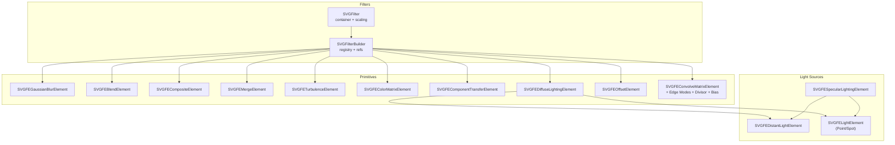

**Diagram sources**
- [SVGFilter.cpp:28-55](file://blink-b87d44f-Source-core-svg/graphics/filters/SVGFilter.cpp#L28-L55)
- [SVGFilterBuilder.cpp:31-91](file://blink-b87d44f-Source-core-svg/graphics/filters/SVGFilterBuilder.cpp#L31-L91)
- [SVGFEConvolveMatrixElement.cpp:283-344](file://blink-b87d44f-Source-core-svg/SVGFEConvolveMatrixElement.cpp#L283-L344)
- [SVGFEDiffuseLightingElement.cpp:35-64](file://blink-b87d44f-Source-core-svg/SVGFEDiffuseLightingElement.cpp#L35-L64)
- [SVGFEDistantLightElement.h:27-35](file://blink-b87d44f-Source-core-svg/SVGFEDistantLightElement.h#L27-L35)

**Section sources**
- [SVGFilter.cpp:28-55](file://blink-b87d44f-Source-core-svg/graphics/filters/SVGFilter.cpp#L28-L55)
- [SVGFilterBuilder.cpp:31-91](file://blink-b87d44f-Source-core-svg/graphics/filters/SVGFilterBuilder.cpp#L31-L91)

## Core Components
- SVGFilter: Encapsulates filter geometry, bounding boxes, and effect bounding box scaling behavior. Provides creation and scale application helpers used by filter primitives.
- SVGFilterBuilder: Maintains builtin effects (source graphic/alpha), named effects, and inter-effect references. Supports clearing, invalidation, and recursive result clearing.

Key responsibilities:
- Coordinate scaling based on effect bounding box mode
- Manage effect identity resolution and dependency graph
- Enable runtime attribute changes to trigger revalidation

**Section sources**
- [SVGFilter.h:35-51](file://blink-b87d44f-Source-core-svg/graphics/filters/SVGFilter.h#L35-L51)
- [SVGFilter.cpp:28-55](file://blink-b87d44f-Source-core-svg/graphics/filters/SVGFilter.cpp#L28-L55)
- [SVGFilterBuilder.h:35-79](file://blink-b87d44f-Source-core-svg/graphics/filters/SVGFilterBuilder.h#L35-L79)
- [SVGFilterBuilder.cpp:31-91](file://blink-b87d44f-Source-core-svg/graphics/filters/SVGFilterBuilder.cpp#L31-L91)

## Architecture Overview
The filter pipeline is constructed from SVG filter primitive elements. Each primitive parses attributes, registers animated properties, and builds a corresponding filter effect with inputs resolved via the builder. The builder maintains:
- Builtin effects (source graphic and source alpha)
- Named effects keyed by id
- Reverse references from inputs to dependents
- Renderer-to-effect mapping for live updates

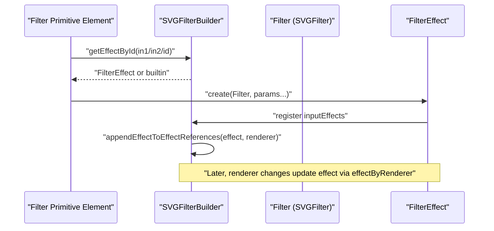

**Diagram sources**
- [SVGFilterBuilder.cpp:52-82](file://blink-b87d44f-Source-core-svg/graphics/filters/SVGFilterBuilder.cpp#L52-L82)
- [SVGFEBlendElement.cpp:128-142](file://blink-b87d44f-Source-core-svg/SVGFEBlendElement.cpp#L128-L142)
- [SVGFECompositeElement.cpp:173-187](file://blink-b87d44f-Source-core-svg/SVGFECompositeElement.cpp#L173-L187)

## Detailed Component Analysis

### SVGFilter
- Purpose: Container for filter region, target bounding box, and effect bounding box mode. Applies horizontal/vertical scaling when effect bbox mode is active.
- Creation: Factory method constructs with transform, source region, target bbox, filter region, and effect bbox flag.
- Scaling: Multiplies incoming values by target width/height when effect bbox mode is enabled.

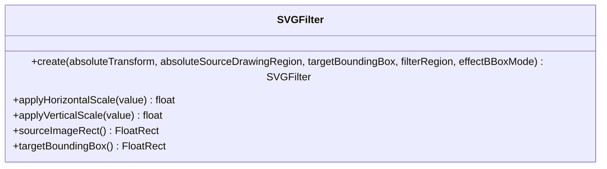

**Diagram sources**
- [SVGFilter.h:35-51](file://blink-b87d44f-Source-core-svg/graphics/filters/SVGFilter.h#L35-L51)
- [SVGFilter.cpp:28-55](file://blink-b87d44f-Source-core-svg/graphics/filters/SVGFilter.cpp#L28-L55)

**Section sources**
- [SVGFilter.h:35-51](file://blink-b87d44f-Source-core-svg/graphics/filters/SVGFilter.h#L35-L51)
- [SVGFilter.cpp:28-55](file://blink-b87d44f-Source-core-svg/graphics/filters/SVGFilter.cpp#L28-L55)

### SVGFilterBuilder
- Purpose: Central registry for named and builtin effects; tracks effect dependencies; supports clearing and recursive result clearing; maps renderers to effects for live updates.
- Builtin effects: SourceGraphic and SourceAlpha are registered automatically.
- Effect lookup: Empty id resolves to last effect or builtin source graphic; otherwise resolves named ids or builtin ids.
- References: For each effect input, records dependents to enable cascading invalidation.

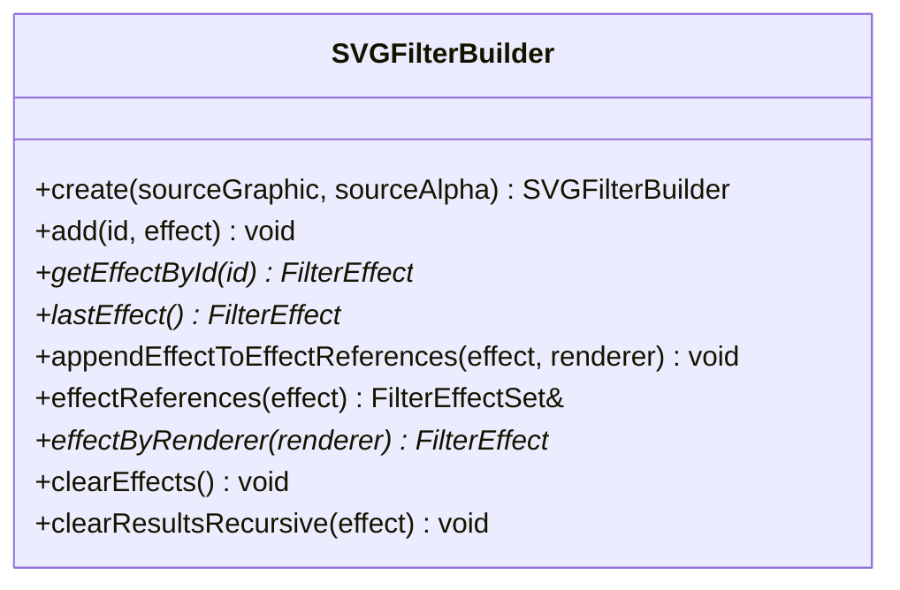

**Diagram sources**
- [SVGFilterBuilder.h:35-79](file://blink-b87d44f-Source-core-svg/graphics/filters/SVGFilterBuilder.h#L35-L79)

**Section sources**
- [SVGFilterBuilder.h:35-79](file://blink-b87d44f-Source-core-svg/graphics/filters/SVGFilterBuilder.h#L35-L79)
- [SVGFilterBuilder.cpp:31-91](file://blink-b87d44f-Source-core-svg/graphics/filters/SVGFilterBuilder.cpp#L31-L91)

### Built-in Filter Primitives

#### Gaussian Blur (SVGFEGaussianBlurElement)
- Inputs: in1 (default to last/builtin), stdDeviation x/y
- Validation: Negative deviations are rejected
- Build: Creates a blur effect with parsed parameters and attaches in1 as input

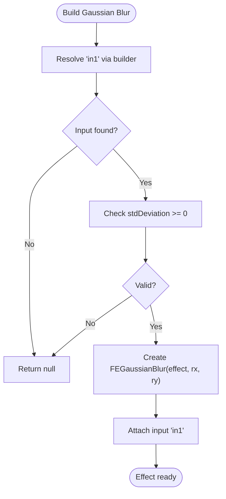

**Diagram sources**
- [SVGFEGaussianBlurElement.cpp:128-141](file://blink-b87d44f-Source-core-svg/SVGFEGaussianBlurElement.cpp#L128-L141)

**Section sources**
- [SVGFEGaussianBlurElement.cpp:128-141](file://blink-b87d44f-Source-core-svg/SVGFEGaussianBlurElement.cpp#L128-L141)

#### Blend (SVGFEBlendElement)
- Inputs: in1, in2; mode enumeration
- Build: Creates a blend effect with two inputs and sets blend mode

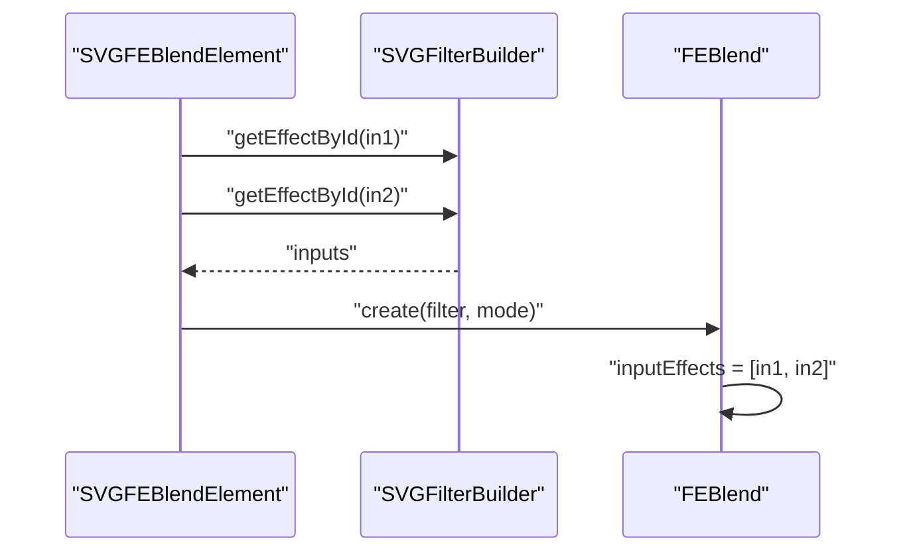

**Diagram sources**
- [SVGFEBlendElement.cpp:128-142](file://blink-b87d44f-Source-core-svg/SVGFEBlendElement.cpp#L128-L142)

**Section sources**
- [SVGFEBlendElement.cpp:128-142](file://blink-b87d44f-Source-core-svg/SVGFEBlendElement.cpp#L128-L142)

#### Composite (SVGFECompositeElement)
- Inputs: in1, in2; operator and k1..k4 constants
- Build: Creates a composite effect with operator and constant parameters

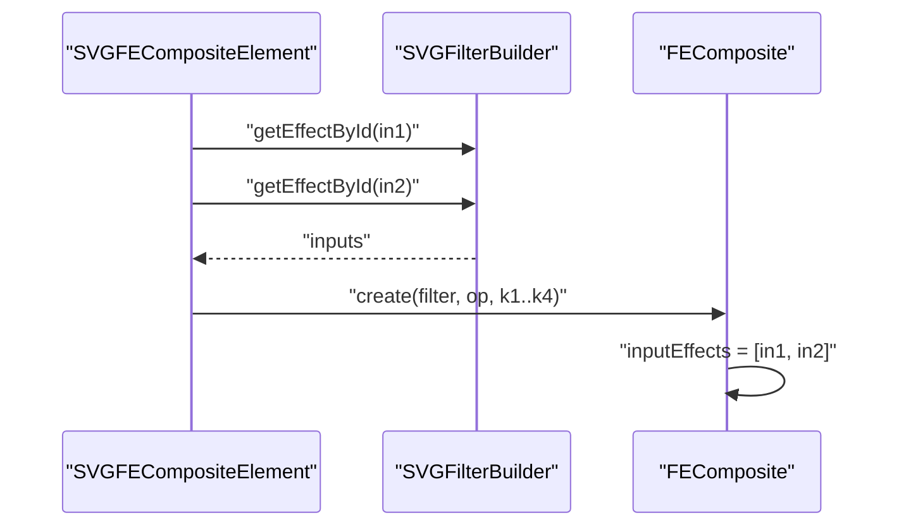

**Diagram sources**
- [SVGFECompositeElement.cpp:173-187](file://blink-b87d44f-Source-core-svg/SVGFECompositeElement.cpp#L173-L187)

**Section sources**
- [SVGFECompositeElement.cpp:173-187](file://blink-b87d44f-Source-core-svg/SVGFECompositeElement.cpp#L173-L187)

#### Merge (SVGFEMergeElement)
- Inputs: feMergeNode children; each node resolves via in1
- Build: Creates a merge effect and appends all valid merge inputs

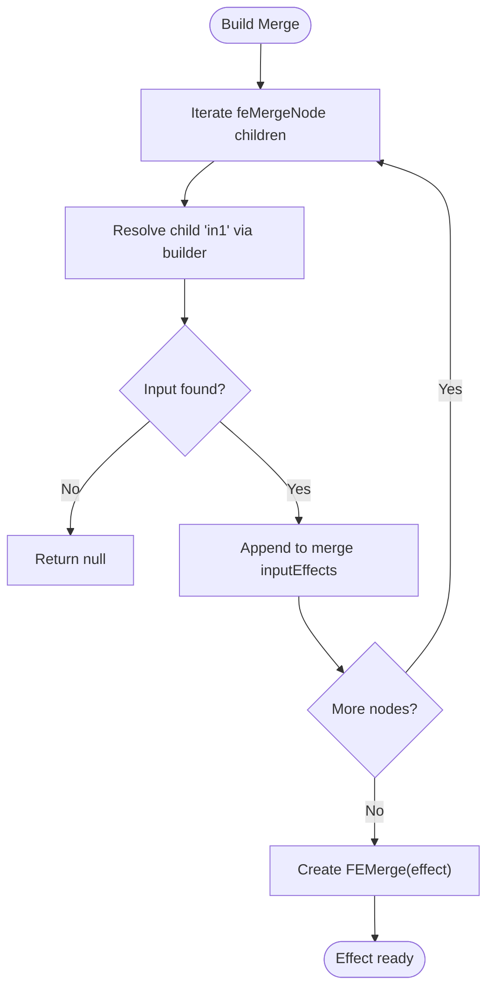

**Diagram sources**
- [SVGFEMergeElement.cpp:44-61](file://blink-b87d44f-Source-core-svg/SVGFEMergeElement.cpp#L44-L61)

**Section sources**
- [SVGFEMergeElement.cpp:44-61](file://blink-b87d44f-Source-core-svg/SVGFEMergeElement.cpp#L44-L61)

#### Turbulence (SVGFETurbulenceElement)
- Parameters: type, baseFrequency x/y, numOctaves, seed, stitchTiles
- Build: Creates a turbulence effect with validated parameters

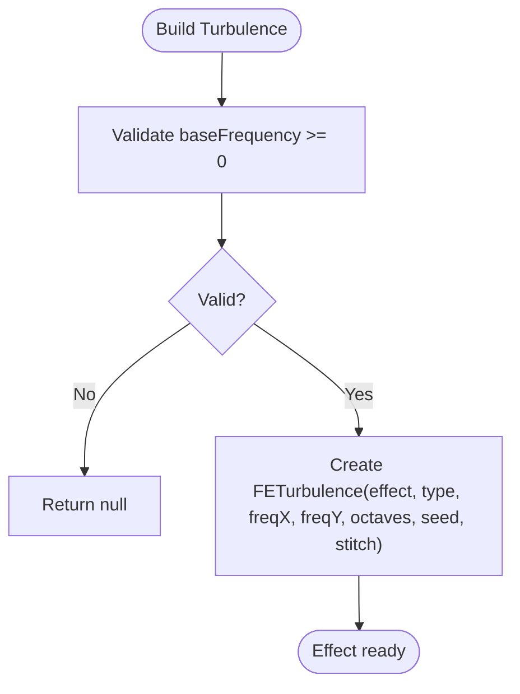

**Diagram sources**
- [SVGFETurbulenceElement.cpp:175-180](file://blink-b87d44f-Source-core-svg/SVGFETurbulenceElement.cpp#L175-L180)

**Section sources**
- [SVGFETurbulenceElement.cpp:175-180](file://blink-b87d44f-Source-core-svg/SVGFETurbulenceElement.cpp#L175-L180)

#### Color Matrix (SVGFEColorMatrixElement)
- Inputs: in1; type (matrix/saturate/hueRotate) and values
- Defaults: If values absent, defaults per type are applied
- Build: Creates a color matrix effect with type and values

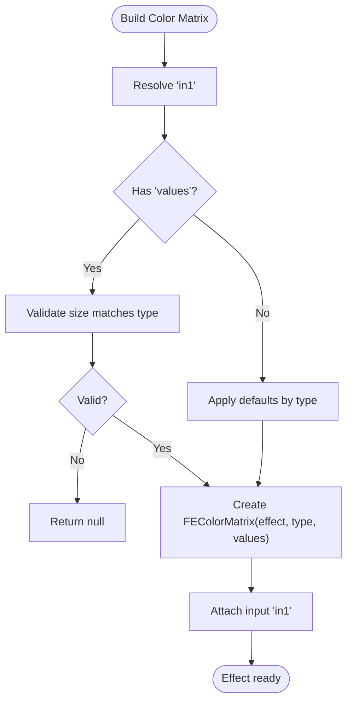

**Diagram sources**
- [SVGFEColorMatrixElement.cpp:133-174](file://blink-b87d44f-Source-core-svg/SVGFEColorMatrixElement.cpp#L133-L174)

**Section sources**
- [SVGFEColorMatrixElement.cpp:133-174](file://blink-b87d44f-Source-core-svg/SVGFEColorMatrixElement.cpp#L133-L174)

#### Component Transfer (SVGFEComponentTransferElement)
- Inputs: in1; children define R/G/B/A transfer functions
- Build: Collects per-channel transfer functions and creates a component transfer effect

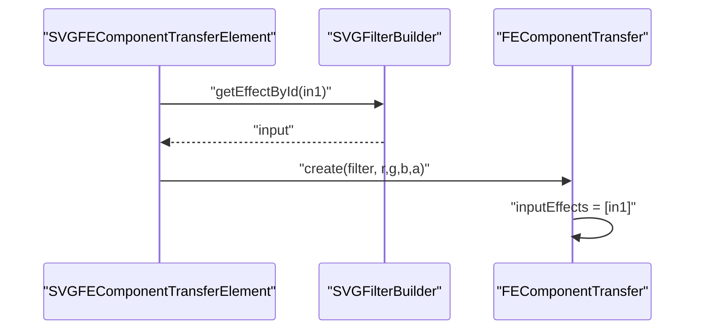

**Diagram sources**
- [SVGFEComponentTransferElement.cpp:79-105](file://blink-b87d44f-Source-core-svg/SVGFEComponentTransferElement.cpp#L79-L105)

**Section sources**
- [SVGFEComponentTransferElement.cpp:79-105](file://blink-b87d44f-Source-core-svg/SVGFEComponentTransferElement.cpp#L79-L105)

#### Lighting (SVGFEDiffuseLightingElement)
- Inputs: in1; lighting color from style, surface scale, diffuse constant, kernel unit length x/y
- Light source: Resolved from associated light element; attributes mapped to light source
- Build: Creates a diffuse lighting effect with light source and parameters

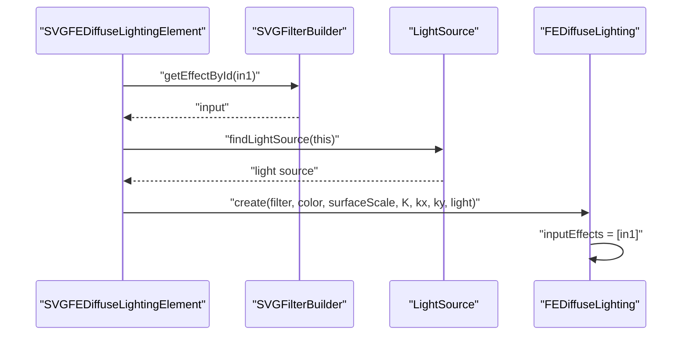

**Diagram sources**
- [SVGFEDiffuseLightingElement.cpp:204-226](file://blink-b87d44f-Source-core-svg/SVGFEDiffuseLightingElement.cpp#L204-L226)

**Section sources**
- [SVGFEDiffuseLightingElement.cpp:204-226](file://blink-b87d44f-Source-core-svg/SVGFEDiffuseLightingElement.cpp#L204-L226)

#### Convolution Matrix (SVGFEConvolveMatrixElement)
- **Updated** New comprehensive convolution matrix primitive with advanced edge mode support
- Inputs: in1; kernel matrix with configurable order (x/y dimensions)
- Edge modes: duplicate, wrap, none - controls boundary handling
- Mathematical parameters: divisor (normalization), bias (offset), target point (offset calculation)
- Kernel unit length: x/y scaling factors for kernel space
- Alpha preservation: optional flag to maintain original alpha channel
- Validation: Ensures order dimensions match kernel matrix size and valid parameter ranges

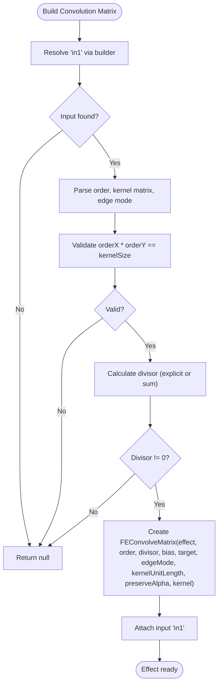

**Diagram sources**
- [SVGFEConvolveMatrixElement.cpp:283-344](file://blink-b87d44f-Source-core-svg/SVGFEConvolveMatrixElement.cpp#L283-L344)

**Section sources**
- [SVGFEConvolveMatrixElement.cpp:35-63](file://blink-b87d44f-Source-core-svg/SVGFEConvolveMatrixElement.cpp#L35-L63)
- [SVGFEConvolveMatrixElement.cpp:103-119](file://blink-b87d44f-Source-core-svg/SVGFEConvolveMatrixElement.cpp#L103-L119)
- [SVGFEConvolveMatrixElement.cpp:283-344](file://blink-b87d44f-Source-core-svg/SVGFEConvolveMatrixElement.cpp#L283-L344)

#### Offset (SVGFEOffsetElement)
- Inputs: in1; dx, dy offsets
- Build: Creates an offset effect and attaches in1

```mermaid
sequenceDiagram
participant Elem as "SVGFEOffsetElement"
participant Builder as "SVGFilterBuilder"
participant Off as "FEOffset"
Elem->>Builder : "getEffectById(in1)"
Builder-->>Elem : "input"
Elem->>Off : "create(filter, dx, dy)"
Off->>Off : "inputEffects = [in1]"
```

**Diagram sources**
- [SVGFEOffsetElement.cpp:110-120](file://blink-b87d44f-Source-core-svg/SVGFEOffsetElement.cpp#L110-L120)

**Section sources**
- [SVGFEOffsetElement.cpp:110-120](file://blink-b87d44f-Source-core-svg/SVGFEOffsetElement.cpp#L110-L120)

### Advanced Lighting System

#### Light Source Types
The system now supports three distinct light source types with comprehensive mathematical implementations:

**Distant Light (SVGFEDistantLightElement)**
- Directional lighting from infinity
- Parameters: azimuth (horizontal angle), elevation (vertical angle)
- Constant light direction across entire surface
- Mathematical model: converts spherical coordinates to Cartesian direction vector

**Point Light (SVGFELightElement)**
- Local lighting from specific 3D position
- Parameters: x, y, z coordinates
- Direction varies per pixel based on surface position
- Mathematical model: normalizes vector from light position to surface point

**Spot Light (SVGFELightElement)**
- Conical lighting with directional emphasis
- Parameters: x, y, z (position), pointsAtX, pointsAtY, pointsAtZ (target), specularExponent, limitingConeAngle
- Combines point light with conical attenuation
- Mathematical model: calculates both direction and angular attenuation

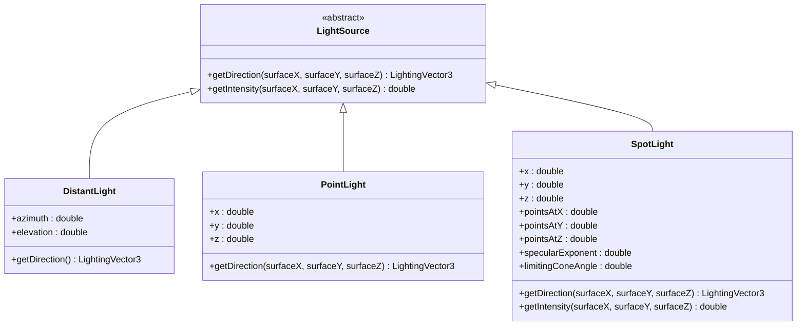

**Diagram sources**
- [SVGFEDistantLightElement.h:27-35](file://blink-b87d44f-Source-core-svg/SVGFEDistantLightElement.h#L27-L35)
- [SVGFELightElement.h:1-39](file://blink-b87d44f-Source-core-svg/SVGFELightElement.h#L1-L39)
- [svg_filters_primitives_lighting.dart:8-50](file://lib/src/animation/svg_filters_primitives_lighting.dart#L8-L50)

#### Diffuse and Specular Reflection Calculations

**Diffuse Lighting (Lambertian Reflectance)**
- Formula: result.rgb = diffuseConstant × max(0, N·L) × lightColor
- result.a = 1.0
- Uses Lambert's cosine law for uniform surface illumination
- Surface normal calculated from alpha channel gradients

**Specular Lighting (Blinn-Phong)**
- Formula: result.rgb = specularConstant × max(0, N·H)^specularExponent × lightColor
- result.a = max(result.r, result.g, result.b)
- Uses Blinn-Phong model with half-vector calculation
- Eye position assumed at infinity on z-axis

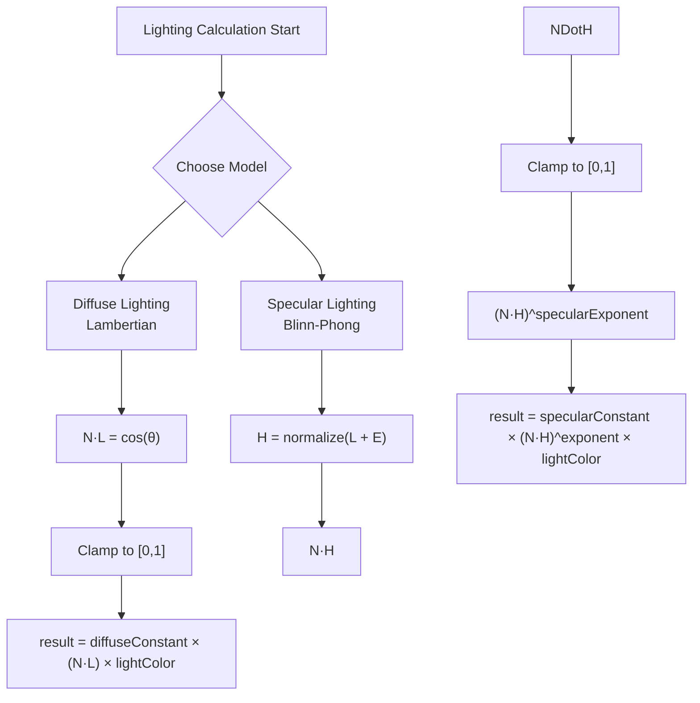

**Diagram sources**
- [svg_filters_primitives_lighting_math.dart:277-318](file://lib/src/animation/svg_filters_primitives_lighting_math.dart#L277-L318)
- [svg_filters_primitives_lighting_math.dart:326-381](file://lib/src/animation/svg_filters_primitives_lighting_math.dart#L326-L381)

**Section sources**
- [SVGFEDiffuseLightingElement.cpp:35-64](file://blink-b87d44f-Source-core-svg/SVGFEDiffuseLightingElement.cpp#L35-L64)
- [SVGFELightElement.cpp](file://blink-b87d44f-Source-core-svg/SVGFELightElement.cpp)
- [SVGFELightElement.h](file://blink-b87d44f-Source-core-svg/SVGFELightElement.h)
- [svg_filters_primitives_lighting.dart:52-198](file://lib/src/animation/svg_filters_primitives_lighting.dart#L52-L198)
- [svg_filters_primitives_lighting_math.dart:130-188](file://lib/src/animation/svg_filters_primitives_lighting_math.dart#L130-L188)

### Filter Animation Support and Real-time Updates
- Animated properties: Each primitive registers animated properties for its attributes (e.g., stdDeviation, mode, operator, k1..k4, offsets, convolution parameters).
- Attribute parsing: Attributes are parsed into base/current values; invalidation triggers rebuilds.
- Runtime updates: The builder maps renderers to effects, enabling live updates when attributes change.
- **Updated** Convolution matrix parameters now support real-time animation including edge mode, divisor, bias, and preserveAlpha flags.

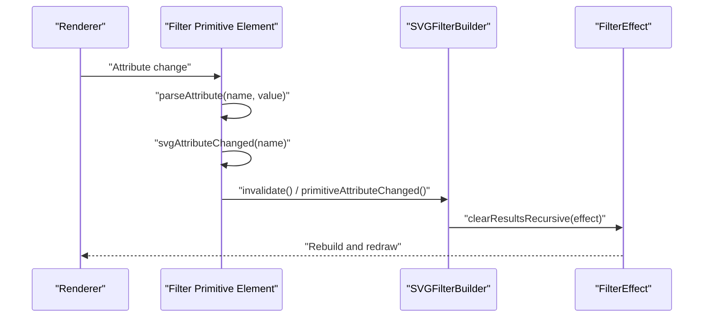

**Diagram sources**
- [SVGFECompositeElement.cpp:147-171](file://blink-b87d44f-Source-core-svg/SVGFECompositeElement.cpp#L147-L171)
- [SVGFEBlendElement.cpp:106-126](file://blink-b87d44f-Source-core-svg/SVGFEBlendElement.cpp#L106-L126)
- [SVGFEColorMatrixElement.cpp:111-131](file://blink-b87d44f-Source-core-svg/SVGFEColorMatrixElement.cpp#L111-L131)
- [SVGFEDiffuseLightingElement.cpp:170-193](file://blink-b87d44f-Source-core-svg/SVGFEDiffuseLightingElement.cpp#L170-L193)
- [SVGFEConvolveMatrixElement.cpp:253-281](file://blink-b87d44f-Source-core-svg/SVGFEConvolveMatrixElement.cpp#L253-L281)
- [SVGFilterBuilder.cpp:67-82](file://blink-b87d44f-Source-core-svg/graphics/filters/SVGFilterBuilder.cpp#L67-L82)

**Section sources**
- [SVGFECompositeElement.cpp:147-171](file://blink-b87d44f-Source-core-svg/SVGFECompositeElement.cpp#L147-L171)
- [SVGFEBlendElement.cpp:106-126](file://blink-b87d44f-Source-core-svg/SVGFEBlendElement.cpp#L106-L126)
- [SVGFEColorMatrixElement.cpp:111-131](file://blink-b87d44f-Source-core-svg/SVGFEColorMatrixElement.cpp#L111-L131)
- [SVGFEDiffuseLightingElement.cpp:170-193](file://blink-b87d44f-Source-core-svg/SVGFEDiffuseLightingElement.cpp#L170-L193)
- [SVGFEConvolveMatrixElement.cpp:253-281](file://blink-b87d44f-Source-core-svg/SVGFEConvolveMatrixElement.cpp#L253-L281)
- [SVGFilterBuilder.cpp:67-82](file://blink-b87d44f-Source-core-svg/graphics/filters/SVGFilterBuilder.cpp#L67-L82)

## Dependency Analysis
- SVGFilterBuilder depends on FilterEffect registry and maintains reverse references to support cascading invalidation.
- Filter primitives depend on the builder for input resolution and on Filter for effect construction.
- **Updated** Lighting primitives depend on associated light elements for light source parameters and mathematical calculations.
- **Updated** Convolution matrix primitive depends on edge mode enumeration and mathematical processing utilities.

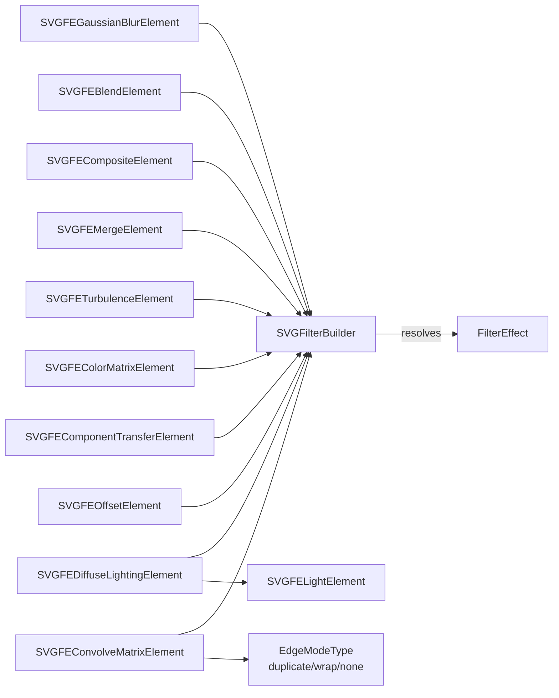

**Diagram sources**
- [SVGFilterBuilder.cpp:31-91](file://blink-b87d44f-Source-core-svg/graphics/filters/SVGFilterBuilder.cpp#L31-L91)
- [SVGFEDiffuseLightingElement.cpp:211-213](file://blink-b87d44f-Source-core-svg/SVGFEDiffuseLightingElement.cpp#L211-L213)
- [SVGFEConvolveMatrixElement.h:33-64](file://blink-b87d44f-Source-core-svg/SVGFEConvolveMatrixElement.h#L33-L64)

**Section sources**
- [SVGFilterBuilder.cpp:31-91](file://blink-b87d44f-Source-core-svg/graphics/filters/SVGFilterBuilder.cpp#L31-L91)
- [SVGFEDiffuseLightingElement.cpp:211-213](file://blink-b87d44f-Source-core-svg/SVGFEDiffuseLightingElement.cpp#L211-L213)
- [SVGFEConvolveMatrixElement.h:33-64](file://blink-b87d44f-Source-core-svg/SVGFEConvolveMatrixElement.h#L33-L64)

## Performance Considerations
- Prefer merging multiple operations into fewer passes when possible to reduce intermediate buffers.
- Use effect bounding box mode judiciously; it scales parameters by target dimensions and can increase computation.
- Limit the number of octaves and base frequency in turbulence to keep CPU/GPU costs reasonable.
- Avoid excessive negative std deviation checks and zero-size kernels; early validation prevents wasted work.
- **Updated** Convolution matrix performance optimization:
  - Use identity kernel detection to skip unnecessary processing
  - Choose appropriate edge modes (duplicate/wrap/none) based on desired visual effect
  - Set divisor appropriately to avoid numerical instability
  - Consider preserveAlpha flag impact on performance
  - Optimize kernel sizes (prefer odd dimensions) for better performance
- Reuse named effects via ids to minimize redundant computations across the pipeline.
- Keep component transfer function chains short; each channel incurs additional sampling cost.
- **Updated** Lighting calculations:
  - Diffuse lighting is computationally less expensive than specular
  - Spot lights with tight cones can be optimized with early termination
  - Surface scale and kernel unit length significantly impact performance

## Troubleshooting Guide
Common issues and remedies:
- Missing inputs: If an in1/in2 id does not resolve, the primitive returns null. Verify ids and ensure previous effects are declared before dependent ones.
- Invalid parameters: Negative std deviation or mismatched color matrix sizes cause rejection. Validate inputs before applying animations.
- **Updated** Convolution matrix issues:
  - Order dimensions must equal kernel matrix size (orderX × orderY = kernelSize)
  - Divisor cannot be zero; specify explicit divisor or ensure kernel sum is non-zero
  - Target coordinates must be within valid bounds (0 ≤ target < order)
  - Edge mode values must be valid enum values
  - Kernel unit length values must be positive
- **Updated** Lighting system issues:
  - Ensure light elements are properly associated with lighting primitives
  - Verify light source parameters are within valid ranges
  - Check surface scale and kernel unit length values
  - Validate specular exponent values for numerical stability
- Cascading invalidation: When changing attributes, rely on primitiveAttributeChanged and invalidate to propagate updates; avoid bypassing the builder's reference tracking.
- Recursive result clearing: Use clearResultsRecursive to reset downstream cached results after attribute changes.

**Section sources**
- [SVGFEGaussianBlurElement.cpp:135-137](file://blink-b87d44f-Source-core-svg/SVGFEGaussianBlurElement.cpp#L135-L137)
- [SVGFEColorMatrixElement.cpp:163-167](file://blink-b87d44f-Source-core-svg/SVGFEColorMatrixElement.cpp#L163-L167)
- [SVGFEConvolveMatrixElement.cpp:296-303](file://blink-b87d44f-Source-core-svg/SVGFEConvolveMatrixElement.cpp#L296-L303)
- [SVGFEDiffuseLightingElement.cpp:211-213](file://blink-b87d44f-Source-core-svg/SVGFEDiffuseLightingElement.cpp#L211-L213)
- [SVGFilterBuilder.cpp:93-104](file://blink-b87d44f-Source-core-svg/graphics/filters/SVGFilterBuilder.cpp#L93-L104)

## Conclusion
The filter system integrates a robust builder-based registry with individual filter primitives that expose animated properties and construct GPU-friendly effects. The enhanced system now includes advanced convolution matrix filtering with comprehensive edge mode support and a complete lighting system with diffuse and specular reflection calculations. By leveraging named effects, builtin sources, and precise invalidation, it supports dynamic, real-time updates. Following the best practices and troubleshooting tips herein will help achieve smooth, efficient animated effects while maintaining compatibility and performance.

## Appendices

### Practical Examples of Filter Combinations
- Blur + Offset + Merge: Apply blur to a source, offset it, then merge with original for glow-like effects.
- Turbulence + Displacement Map + Lighting: Use turbulence as a displacement field and combine with lighting for organic surface appearance.
- Color Matrix + Component Transfer: Adjust saturation/hue with color matrix, then fine-tune curves per channel via component transfer.
- **Updated** Convolution Matrix Applications:
  - Sharpening: `kernelMatrix="0 -1 0 -1 5 -1 0 -1 0"` with divisor=1
  - Edge Detection: `kernelMatrix="-1 -1 -1 -1 8 -1 -1 -1 -1"` with bias=0
  - Emboss: `kernelMatrix="2 0 0 0 -1 0 0 0 -1"` with bias=127
  - Blur: `kernelMatrix="1 2 1 2 4 2 1 2 1"` with divisor=16
- **Updated** Lighting Combinations:
  - Multiple light sources: Combine distant and point lights for complex illumination
  - Specular highlights: Add specular lighting over diffuse base for metallic surfaces
  - Spot lighting: Create focused illumination with adjustable cone angles

### Browser Compatibility and Limitations
- Some SVG filter features may vary across engines; validate rendering across targets.
- Certain parameter ranges or combinations may be disallowed by validation logic; adhere to documented constraints.
- Large filter regions and high octaves can impact performance; profile and tune accordingly.
- **Updated** Convolution matrix support varies by browser; test edge mode implementations carefully.
- **Updated** Lighting calculations may have slight variations in different SVG engines; validate results across targets.

### Advanced Optimization Techniques
- **Updated** Convolution Matrix Optimization:
  - Use identity kernel detection to avoid unnecessary processing
  - Implement early exit for zero kernels
  - Cache frequently used kernels
  - Consider separable kernels for 2D operations
- **Updated** Lighting Optimization:
  - Pre-compute light vectors when possible
  - Use appropriate surface scales for target resolutions
  - Consider approximations for real-time performance
  - Batch similar lighting operations