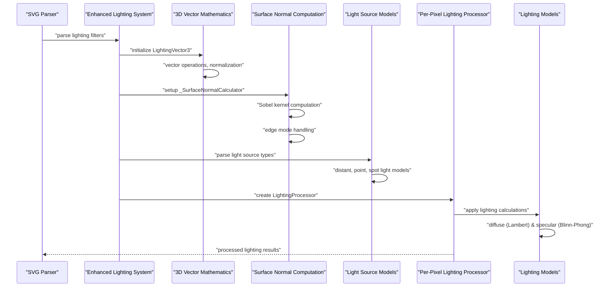

# SVG Filters and Effects

<cite>
**Referenced Files in This Document**
- [svg_filters.dart](file://lib/src/animation/svg_filters.dart)
- [svg_filters_types.dart](file://lib/src/animation/svg_filters_types.dart)
- [svg_filters_base.dart](file://lib/src/animation/svg_filters_base.dart)
- [svg_filters_primitives.dart](file://lib/src/animation/svg_filters_primitives.dart)
- [svg_filters_primitives_blur.dart](file://lib/src/animation/svg_filters_primitives_blur.dart)
- [svg_filters_primitives_convolve_matrix.dart](file://lib/src/animation/svg_filters_primitives_convolve_matrix.dart)
- [svg_filters_primitives_component_transfer.dart](file://lib/src/animation/svg_filters_primitives_component_transfer.dart)
- [svg_filters_primitives_lighting.dart](file://lib/src/animation/svg_filters_primitives_lighting.dart)
- [svg_filters_primitives_lighting_common.dart](file://lib/src/animation/svg_filters_primitives_lighting_common.dart)
- [svg_filters_primitives_lighting_sources.dart](file://lib/src/animation/svg_filters_primitives_lighting_sources.dart)
- [svg_filters_primitives_lighting_diffuse.dart](file://lib/src/animation/svg_filters_primitives_lighting_diffuse.dart)
- [svg_filters_primitives_lighting_specular.dart](file://lib/src/animation/svg_filters_primitives_lighting_specular.dart)
- [svg_filters_primitives_lighting_processor.dart](file://lib/src/animation/svg_filters_primitives_lighting_processor.dart)
- [svg_filters_color_matrix.dart](file://lib/src/animation/svg_filters_color_matrix.dart)
- [svg_filters_registry.dart](file://lib/src/animation/svg_filters_registry.dart)
- [svg_filters_registry_pipeline.dart](file://lib/src/animation/svg_filters_registry_pipeline.dart)
- [svg_filters_registry_pipeline_compositing.dart](file://lib/src/animation/svg_filters_registry_pipeline_compositing.dart)
- [svg_filters_registry_pipeline_primitives.dart](file://lib/src/animation/svg_filters_registry_pipeline_primitives.dart)
- [svg_filters_registry_pipeline_primitives_effects.dart](file://lib/src/animation/svg_filters_registry_pipeline_primitives_effects.dart)
- [svg_filters_registry_pipeline_primitives_paint.dart](file://lib/src/animation/svg_filters_registry_pipeline_primitives_paint.dart)
- [svg_filters_registry_inputs.dart](file://lib/src/animation/svg_filters_registry_inputs.dart)
- [svg_filters_registry_outputs.dart](file://lib/src/animation/svg_filters_registry_outputs.dart)
- [svg_parser_filters.dart](file://lib/src/animation/svg_parser_filters.dart)
- [svg_parser_filters_lighting.dart](file://lib/src/animation/svg_parser_filters_lighting.dart)
- [filter_component_transfer_test.dart](file://test/animation/filter_component_transfer_test.dart)
- [filter_advanced_graph_test.dart](file://test/animation/filter_advanced_graph_test.dart)
- [filter_input_graph_hardening_test.dart](file://test/animation/filter_input_graph_hardening_test.dart)
- [filter_advanced_semantics_test.dart](file://test/animation/filter_advanced_semantics_test.dart)
- [fe_lighting_test.dart](file://test/animation/fe_lighting_test.dart)
- [fe_convolve_matrix_test.dart](file://test/animation/fe_convolve_matrix_test.dart)
- [filter_displacement_tile_test.dart](file://test/animation/filter_displacement_tile_test.dart)
- [filter_primitive_edge_cases_test.dart](file://test/animation/filter_primitive_edge_cases_test.dart)
- [SVGFEComponentTransferElement.cpp](file://blink-b87d44f-Source-core-svg/SVGFEComponentTransferElement.cpp)
- [SVGFEComponentTransferElement.h](file://blink-b87d44f-Source-core-svg/SVGFEComponentTransferElement.h)
- [SVGFEDisplacementMapElement.cpp](file://blink-b87d44f-Source-core-svg/SVGFEDisplacementMapElement.cpp)
- [SVGFEDisplacementMapElement.h](file://blink-b87d44f-Source-core-svg/SVGFEDisplacementMapElement.h)
- [SVGFEDiffuseLightingElement.cpp](file://blink-b87d44f-Source-core-svg/SVGFEDiffuseLightingElement.cpp)
- [SVGFEDiffuseLightingElement.h](file://blink-b87d44f-Source-core-svg/SVGFEDiffuseLightingElement.h)
- [SVGFESpecularLightingElement.cpp](file://blink-b87d44f-Source-core-svg/SVGFESpecularLightingElement.cpp)
- [SVGFESpecularLightingElement.h](file://blink-b87d44f-Source-core-svg/SVGFESpecularLightingElement.h)
</cite>

## Update Summary
**Changes Made**
- Enhanced lighting filter primitives with comprehensive 3D vector mathematics and advanced surface normal computation
- Implemented sophisticated Sobel-like kernel-based surface normal calculation with multiple edge mode support
- Added specialized light source implementations including distant, point, and spot light sources with realistic physics
- Expanded lighting system with per-pixel processing capabilities and kernel unit length scaling
- Enhanced filter pipeline with improved lighting primitive integration and edge handling modes

## Table of Contents
1. [Introduction](#introduction)
2. [Project Structure](#project-structure)
3. [Core Components](#core-components)
4. [Architecture Overview](#architecture-overview)
5. [Enhanced Lighting System](#enhanced-lighting-system)
6. [Advanced Surface Normal Computation](#advanced-surface-normal-computation)
7. [Specialized Light Source Implementations](#specialized-light-source-implementations)
8. [Per-Pixel Lighting Processing](#per-pixel-lighting-processing)
9. [Enhanced Displacement Map System](#enhanced-displacement-map-system)
10. [Advanced Tile Primitive Implementation](#advanced-tile-primitive-implementation)
11. [Enhanced Color Matrix Operations](#enhanced-color-matrix-operations)
12. [Enhanced Filter Registry Pipeline](#enhanced-filter-registry-pipeline)
13. [Enhanced Component Transfer Functions](#enhanced-component-transfer-functions)
14. [Built-in Filter Primitives](#built-in-filter-primitives)
15. [Filter Animation Support](#filter-animation-support)
16. [Comprehensive Testing Framework](#comprehensive-testing-framework)
17. [Performance Optimizations](#performance-optimizations)
18. [Troubleshooting Guide](#troubleshooting-guide)
19. [Conclusion](#conclusion)
20. [Appendices](#appendices)

## Introduction
This document explains the enhanced SVG filter system and effects implemented in the codebase. The system has been comprehensively upgraded with advanced lighting calculations featuring sophisticated 3D vector mathematics, comprehensive surface normal computation using Sobel-like kernels, multiple edge mode support, and specialized light source implementations. The enhanced system now provides realistic lighting models with per-pixel processing capabilities, advanced kernel unit length scaling, and comprehensive edge handling modes including duplicate, wrap, and none modes. Recent enhancements include sophisticated lighting system architecture with dedicated processors, improved surface normal computation with proper boundary handling, and expanded testing coverage validating all lighting primitive types and edge cases.

## Project Structure
The enhanced filter system is organized around comprehensive lighting calculations, advanced surface normal computation, specialized light source modeling, and sophisticated per-pixel processing:

```mermaid
graph TB
subgraph "Enhanced Lighting System Architecture"
LightingSystem["Enhanced Lighting System<br/>3D vector mathematics, surface normal computation, light sources"]
VectorMath["3D Vector Mathematics<br/>LightingVector3 class, vector operations"]
SurfaceNormal["Surface Normal Computation<br/>Sobel-like kernels, edge handling modes"]
LightSources["Light Source Implementations<br/>Distant, Point, Spot light sources"]
LightingProcessor["LightingProcessor<br/>Per-pixel lighting calculations"]
end
subgraph "Advanced Surface Normal Computation"
SobelKernels["Sobel Kernels<br/>Gradient estimation, convolution operators"]
EdgeModes["Edge Modes<br/>duplicate, wrap, none boundary handling"]
KernelScaling["Kernel Unit Length Scaling<br/>surfaceScale, factor calculations"]
NormalCalculation["Normal Calculation<br/>-surfaceScale * dN/dx, -surfaceScale * dN/dy, 1"]
end
subgraph "Specialized Light Sources"
DistantLight["Distant Light<br/>azimuth, elevation angles, constant direction"]
PointLight["Point Light<br/>3D positioning, distance attenuation"]
SpotLight["Spot Light<br/>cone attenuation, limiting angle, specular exponent"]
LightCalculators["Light Calculators<br/>_DistantLightCalculator, _PointLightCalculator, _SpotLightCalculator"]
end
subgraph "Per-Pixel Processing"
LightingModels["Lighting Models<br/>Diffuse (Lambert), Specular (Blinn-Phong)"]
ColorFilters["Color Filter Generation<br/>Average intensity approximation"]
PreviewSampling["Preview Sampling<br/>LightingSampler for color previews"]
end
LightingSystem --> VectorMath
LightingSystem --> SurfaceNormal
LightingSystem --> LightSources
LightingSystem --> LightingProcessor
SurfaceNormal --> SobelKernels
SurfaceNormal --> EdgeModes
SurfaceNormal --> KernelScaling
SurfaceNormal --> NormalCalculation
LightSources --> DistantLight
LightSources --> PointLight
LightSources --> SpotLight
LightSources --> LightCalculators
LightingProcessor --> LightingModels
LightingProcessor --> ColorFilters
LightingProcessor --> PreviewSampling
```

**Diagram sources**
- [svg_filters_primitives_lighting_common.dart:16-65](file://lib/src/animation/svg_filters_primitives_lighting_common.dart#L16-L65)
- [svg_filters_primitives_lighting_common.dart:75-230](file://lib/src/animation/svg_filters_primitives_lighting_common.dart#L75-L230)
- [svg_filters_primitives_lighting_sources.dart:151-172](file://lib/src/animation/svg_filters_primitives_lighting_sources.dart#L151-L172)
- [svg_filters_primitives_lighting_sources.dart:180-250](file://lib/src/animation/svg_filters_primitives_lighting_sources.dart#L180-L250)
- [svg_filters_primitives_lighting_sources.dart:257-333](file://lib/src/animation/svg_filters_primitives_lighting_sources.dart#L257-L333)
- [svg_filters_primitives_lighting_processor.dart:99-276](file://lib/src/animation/svg_filters_primitives_lighting_processor.dart#L99-L276)
- [svg_filters_primitives_lighting_diffuse.dart:7-48](file://lib/src/animation/svg_filters_primitives_lighting_diffuse.dart#L7-L48)
- [svg_filters_primitives_lighting_specular.dart:9-64](file://lib/src/animation/svg_filters_primitives_lighting_specular.dart#L9-L64)

**Section sources**
- [svg_filters_primitives_lighting_common.dart:1-231](file://lib/src/animation/svg_filters_primitives_lighting_common.dart#L1-L231)
- [svg_filters_primitives_lighting_sources.dart:1-334](file://lib/src/animation/svg_filters_primitives_lighting_sources.dart#L1-L334)
- [svg_filters_primitives_lighting_processor.dart:1-378](file://lib/src/animation/svg_filters_primitives_lighting_processor.dart#L1-L378)
- [svg_filters_primitives_lighting_diffuse.dart:1-49](file://lib/src/animation/svg_filters_primitives_lighting_diffuse.dart#L1-L49)
- [svg_filters_primitives_lighting_specular.dart:1-65](file://lib/src/animation/svg_filters_primitives_lighting_specular.dart#L1-L65)
- [svg_filters_primitives_lighting.dart:1-348](file://lib/src/animation/svg_filters_primitives_lighting.dart#L1-L348)

## Core Components
The enhanced lighting system introduces several key components with advanced functionality:

**Enhanced Lighting System**: Comprehensive 3D vector mathematics with the LightingVector3 class providing complete vector operations including length calculation, normalization, dot product, cross product, and arithmetic operations with proper numerical stability and edge case handling.

**Advanced Surface Normal Computation**: Sophisticated Sobel-like convolution kernel implementation for gradient estimation with proper edge mode handling (duplicate, wrap, none) and kernel unit length scaling for accurate surface normal calculation from alpha channels.

**Specialized Light Source Implementations**: Comprehensive light source support including distant light with azimuth/elevation angles, point light with 3D positioning and optional distance attenuation, and spot light with cone attenuation and limiting angle control.

**Per-Pixel Lighting Processing**: Advanced per-pixel lighting calculations implementing realistic lighting models using established reflection equations with proper vector normalization and intensity computation.

**Enhanced Edge Mode Support**: Multiple edge handling modes for surface normal computation including duplicate (Blink default), wrap (modulus wrapping), and none (transparent black) modes for border pixel handling.

**Section sources**
- [svg_filters_primitives_lighting_common.dart:16-65](file://lib/src/animation/svg_filters_primitives_lighting_common.dart#L16-L65)
- [svg_filters_primitives_lighting_common.dart:75-230](file://lib/src/animation/svg_filters_primitives_lighting_common.dart#L75-L230)
- [svg_filters_primitives_lighting_sources.dart:151-333](file://lib/src/animation/svg_filters_primitives_lighting_sources.dart#L151-L333)
- [svg_filters_primitives_lighting_processor.dart:99-276](file://lib/src/animation/svg_filters_primitives_lighting_processor.dart#L99-L276)

## Architecture Overview
The enhanced lighting system architecture provides sophisticated lighting calculations with comprehensive 3D vector mathematics, advanced surface normal computation, and specialized light source modeling. The system now includes per-pixel processing capabilities with realistic lighting models, kernel unit length scaling, and comprehensive edge case management.

**Diagram sources**
- [svg_filters_primitives_lighting_common.dart:16-65](file://lib/src/animation/svg_filters_primitives_lighting_common.dart#L16-L65)
- [svg_filters_primitives_lighting_common.dart:75-230](file://lib/src/animation/svg_filters_primitives_lighting_common.dart#L75-L230)
- [svg_filters_primitives_lighting_sources.dart:151-333](file://lib/src/animation/svg_filters_primitives_lighting_sources.dart#L151-L333)
- [svg_filters_primitives_lighting_processor.dart:99-276](file://lib/src/animation/svg_filters_primitives_lighting_processor.dart#L99-L276)

## Enhanced Lighting System
The enhanced lighting system provides comprehensive 3D vector mathematics and surface normal computation with realistic lighting models.

**3D Vector Mathematics**: The LightingVector3 class implements complete 3D vector operations including length calculation, normalization, dot product, cross product, and arithmetic operations with proper numerical stability and edge case handling. The class provides vector arithmetic operations, comparison methods, and string representation for debugging purposes.

**Surface Normal Computation**: Advanced Sobel operator implementation for gradient estimation with proper edge mode handling (duplicate, wrap, none) and kernel unit length scaling for accurate surface normal calculation from alpha channels. The system uses standard Sobel kernels for gradient estimation and constructs normals using the formula N = normalize(-surfaceScale * dN/dx, -surfaceScale * dN/dy, 1).

**Lighting Models**: Realistic lighting calculations using Lambertian diffuse reflection and Blinn-Phong specular reflection models with proper vector normalization and intensity computation. The system supports both diffuse and specular lighting with appropriate alpha channel handling.

**Edge Mode Handling**: Enhanced edge mode support for surface normal computation including duplicate (Blink default), wrap (modulus wrapping), and none (transparent black) modes for border pixel handling. The edge handling ensures proper behavior when computing gradients at image boundaries.

**Section sources**
- [svg_filters_primitives_lighting_common.dart:16-65](file://lib/src/animation/svg_filters_primitives_lighting_common.dart#L16-L65)
- [svg_filters_primitives_lighting_common.dart:75-230](file://lib/src/animation/svg_filters_primitives_lighting_common.dart#L75-L230)
- [svg_filters_primitives_lighting_processor.dart:99-276](file://lib/src/animation/svg_filters_primitives_lighting_processor.dart#L99-L276)

## Advanced Surface Normal Computation
The advanced surface normal computation system provides sophisticated gradient estimation with multiple edge handling modes and kernel unit length scaling.

**Sobel Kernel Implementation**: Standard Sobel kernels for gradient estimation with Gx = | -1 0 1 | and Gy = | -1 -2 -1 | operators. The system computes gradients using the formula: gx = (alphaValues[2] - alphaValues[0]) + 2*(alphaValues[5] - alphaValues[3]) + (alphaValues[8] - alphaValues[6]) and gy similarly for the Y gradient.

**Edge Mode Handling**: Comprehensive edge handling modes including duplicate (clamps to edge), wrap (modulus wrapping), and none (transparent black) modes. The edge handling ensures proper behavior when computing gradients at image boundaries using the _getAlphaAt method.

**Kernel Unit Length Scaling**: Advanced scaling factors for kernel unit length with proper normalization. The system applies surfaceScale and kernelUnitLength scaling with the formula factorX = surfaceScale/(4.0 * _factorX) and factorY = surfaceScale/(4.0 * _factorY) for proper gradient normalization.

**Normal Calculation**: Accurate normal vector calculation using the formula N = normalize(-surfaceScale * dN/dx, -surfaceScale * dN/dy, 1) with alpha values normalized from 0-255 to 0-1 range.

**Section sources**
- [svg_filters_primitives_lighting_common.dart:103-128](file://lib/src/animation/svg_filters_primitives_lighting_common.dart#L103-L128)
- [svg_filters_primitives_lighting_common.dart:152-173](file://lib/src/animation/svg_filters_primitives_lighting_common.dart#L152-L173)
- [svg_filters_primitives_lighting_common.dart:179-212](file://lib/src/animation/svg_filters_primitives_lighting_common.dart#L179-L212)

## Specialized Light Source Implementations
The specialized light source implementations provide comprehensive lighting models with realistic physics and mathematical precision.

**Distant Light Source**: Implements SVG feDistantLight with azimuth and elevation angle calculations using the formula L = normalize(cos(az)*cos(el), sin(az)*cos(el), sin(el)). The _DistantLightCalculator provides constant direction vectors for all pixels in the image.

**Point Light Source**: Implements SVG fePointLight with 3D positioning and optional distance attenuation. The _PointLightCalculator provides position-dependent direction vectors and intensity calculations with inverse square falloff when distance attenuation is enabled.

**Spot Light Source**: Implements SVG feSpotLight with cone attenuation and limiting angle control. The _SpotLightCalculator combines point light direction with cone attenuation using the formula (-L · S)^specularExponent where L is the direction from light to surface and S is the spot direction.

**Light Direction Calculation**: Sophisticated light direction calculation with proper normalization and intensity computation. The system handles position-dependent lighting for point and spot lights while maintaining constant direction for distant lights.

**Section sources**
- [svg_filters_primitives_lighting_sources.dart:14-32](file://lib/src/animation/svg_filters_primitives_lighting_sources.dart#L14-L32)
- [svg_filters_primitives_lighting_sources.dart:151-172](file://lib/src/animation/svg_filters_primitives_lighting_sources.dart#L151-L172)
- [svg_filters_primitives_lighting_sources.dart:180-250](file://lib/src/animation/svg_filters_primitives_lighting_sources.dart#L180-L250)
- [svg_filters_primitives_lighting_sources.dart:257-333](file://lib/src/animation/svg_filters_primitives_lighting_sources.dart#L257-L333)

## Per-Pixel Lighting Processing
The per-pixel lighting processing system provides comprehensive lighting calculations with realistic models and efficient implementation.

**LightingProcessor Class**: Handles complete lighting computation pipeline including alpha channel extraction, surface normal computation, and lighting model application. The processor supports both diffuse and specular lighting with proper vector operations and intensity calculations.

**Diffuse Lighting Model**: Implements Lambertian diffuse reflection using the formula result.rgb = diffuseConstant * max(0, N·L) * lightColor with result.a = 1.0. The system computes N·L dot products with proper clamping and applies lighting color modulation.

**Specular Lighting Model**: Implements Blinn-Phong specular reflection using the formula H = normalize(L + (0, 0, 1)) and result.rgb = specularConstant * max(0, N·H)^specularExponent * lightColor with result.a = max(result.r, result.g, result.b).

**Color Filter Generation**: Average intensity approximation for ColorFilter-based rendering using default normal vectors and light directions. The system provides efficient color filter generation for lighting effects without per-pixel processing.

**Preview Sampling**: LightingSampler class for generating preview colors and testing lighting setups with sample point calculations across multiple grid positions.

**Section sources**
- [svg_filters_primitives_lighting_processor.dart:99-276](file://lib/src/animation/svg_filters_primitives_lighting_processor.dart#L99-L276)
- [svg_filters_primitives_lighting_diffuse.dart:7-48](file://lib/src/animation/svg_filters_primitives_lighting_diffuse.dart#L7-L48)
- [svg_filters_primitives_lighting_specular.dart:9-64](file://lib/src/animation/svg_filters_primitives_lighting_specular.dart#L9-L64)
- [svg_filters_primitives_lighting_processor.dart:281-377](file://lib/src/animation/svg_filters_primitives_lighting_processor.dart#L281-L377)

## Enhanced Displacement Map System
The enhanced displacement map system provides comprehensive spatial displacement capabilities with advanced channel selection and edge handling.

**Displacement Map Filter**: The SvgDisplacementMapFilter class supports scale animation, channel selectors for both X and Y displacement channels, and configurable edge modes. The filter can reference secondary input (in2) for displacement maps and handles scale=0 as identity displacement.

**Displacement Processing**: The DisplacementMapProcessor implements the core displacement algorithm with proper coordinate calculation using the formula P'(x,y) = P(x + scale*(XC(x,y) - 0.5), y + scale*(YC(x,y) - 0.5)). It supports four channel selectors (R, G, B, A) and three edge modes: none (transparent black), clamp (edge clamping), and wrap (modulus wrapping).

**Edge Mode Handling**: Advanced edge handling ensures proper behavior when displaced coordinates fall outside the image bounds. The system maintains SVG compliance by producing transparent black pixels for out-of-bounds samples when using the none mode.

**Pipeline Integration**: The _resolveDisplacementMapOutput method integrates displacement processing into the filter pipeline, handling scale=0 optimization, in2 input resolution, and proper output generation.

**Section sources**
- [svg_filters_primitives_lighting.dart:57-121](file://lib/src/animation/svg_filters_primitives_lighting.dart#L57-L121)
- [svg_filters_primitives_lighting.dart:129-197](file://lib/src/animation/svg_filters_primitives_lighting.dart#L129-L197)
- [svg_filters_registry_pipeline_primitives_effects.dart:85-121](file://lib/src/animation/svg_filters_registry_pipeline_primitives_effects.dart#L85-L121)

## Advanced Tile Primitive Implementation
The advanced tile primitive implementation provides comprehensive tiling capabilities with subregion support and robust boundary handling.

**Tile Filter**: The SvgTileFilter class supports subregion specification through x, y, width, and height properties. It includes a hasSubregion property to distinguish between standard tiling and custom subregion tiling scenarios.

**Tiling Algorithm**: The TileProcessor.applyTiling method implements the SVG-compliant tiling algorithm with proper modulus wrapping and boundary handling. It supports tile origin alignment with filter region origin and handles cases where tile regions exceed input dimensions.

**Subregion Support**: Advanced subregion handling allows tiling within custom rectangular regions. The algorithm calculates source coordinates using modulus arithmetic and handles boundary conditions appropriately.

**Boundary Handling**: The system properly handles edge cases including empty inputs, zero-sized outputs, and tile regions that extend beyond input boundaries. Empty inputs produce transparent black output as per SVG specification.

**Pipeline Integration**: The tile primitive integrates seamlessly into the filter pipeline as a pass-through primitive that can be combined with other filter operations.

**Section sources**
- [svg_filters_base.dart:152-180](file://lib/src/animation/svg_filters_base.dart#L152-L180)
- [svg_filters_base.dart:206-271](file://lib/src/animation/svg_filters_base.dart#L206-L271)
- [svg_filters_registry_pipeline_primitives_paint.dart:278-311](file://lib/src/animation/svg_filters_registry_pipeline_primitives_paint.dart#L278-L311)

## Enhanced Color Matrix Operations
The enhanced color matrix system provides comprehensive SVG color transformation support with full matrix conversion capabilities.

**Matrix Type Support**: Complete implementation of all SVG color matrix types including generic 5x4 matrix transformation, saturation adjustment, hue rotation, and luminance-to-alpha conversion.

**SVG to Flutter Conversion**: Sophisticated matrix conversion from SVG's 5x4 format to Flutter's 4x5 format with proper row/column ordering and offset value scaling from [0-255] to [0-1].

**Specialized Transformations**: Optimized implementations for common color transformations including saturation matrix generation, hue rotation using trigonometric functions, and luminance-to-alpha conversion using weighted averages.

**Performance Optimization**: Efficient matrix operations leveraging Flutter's ColorFilter.matrix for GPU-accelerated color transformations with proper clamping and normalization.

**Section sources**
- [svg_filters_color_matrix.dart:99-242](file://lib/src/animation/svg_filters_color_matrix.dart#L99-L242)
- [svg_filters_color_matrix.dart:145-186](file://lib/src/animation/svg_filters_color_matrix.dart#L145-L186)
- [svg_filters_color_matrix.dart:188-240](file://lib/src/animation/svg_filters_color_matrix.dart#L188-L240)

## Enhanced Filter Registry Pipeline
The enhanced pipeline optimization system provides sophisticated filter chain resolution with comprehensive caching mechanisms, identity detection, and circular reference prevention.

**Named Result Caching**: Enhanced caching with unmodifiable views prevents accidental mutation while enabling result sharing between references. The `_cacheNamedResult` method returns immutable lists to protect cached results.

**Identity Kernel Detection**: Improved convolution matrix processing includes comprehensive identity kernel detection to avoid unnecessary convolution operations. The system checks kernel parameters including order dimensions, divisor normalization, and bias application.

**Circular Reference Prevention**: Enhanced circular reference detection with depth tracking and reference state management prevents infinite loops and stack overflows in complex filter graphs.

**Arithmetic Mode Optimization**: Advanced arithmetic composite operations with intelligent coefficient approximation including special cases for pure multiplication, additive blending, and difference-like operations.

**Enhanced Input Resolution**: Improved input resolution logic supporting FillPaint and StrokePaint source contexts, background image inputs, and proper handling of built-in input names (case-insensitive).

**Section sources**
- [svg_filters_registry_pipeline.dart:178-186](file://lib/src/animation/svg_filters_registry_pipeline.dart#L178-L186)
- [svg_filters_registry_pipeline_compositing.dart:182-269](file://lib/src/animation/svg_filters_registry_pipeline_compositing.dart#L182-L269)
- [svg_filters_registry_pipeline_primitives_effects.dart:210-224](file://lib/src/animation/svg_filters_registry_pipeline_primitives_effects.dart#L210-L224)
- [svg_filters_registry_pipeline_primitives_paint.dart:295-309](file://lib/src/animation/svg_filters_registry_pipeline_primitives_paint.dart#L295-L309)

## Enhanced Component Transfer Functions
The enhanced component transfer system provides comprehensive transfer function implementations with mathematical precision and optimized processing paths.

**Transfer Function Types**: Five distinct types - identity (no change), linear (C' = slope * C + intercept), gamma (C' = amplitude * pow(C, exponent) + offset), table (piecewise linear interpolation), and discrete (step function) - each with proper parameter validation and clamping.

**Mathematical Precision**: All functions implement proper mathematical formulas with input clamping to [0,1] and result clamping to [0,1]. Gamma functions handle edge cases like zero input correctly.

**Identity Detection**: Sophisticated identity detection for optimization - linear functions with slope=1 and intercept=0, gamma functions with amplitude=1, exponent=1, and offset=0, and identity type functions.

**Linear Optimization**: When all channels use identity or linear transforms, the system generates a color matrix instead of pixel-by-pixel processing, providing significant performance improvements.

**Section sources**
- [svg_filters_primitives_component_transfer.dart:27-86](file://lib/src/animation/svg_filters_primitives_component_transfer.dart#L27-L86)
- [svg_filters_primitives_component_transfer.dart:135-197](file://lib/src/animation/svg_filters_primitives_component_transfer.dart#L135-L197)

## Built-in Filter Primitives
The enhanced filter system includes comprehensive support for all major SVG filter primitives with specialized implementations and optimized processing paths.

**Basic Primitives**: Gaussian blur, morphology (erode/dilate), displacement map, image reference, convolution matrix, turbulence (procedural noise), component transfer, offset, flood, blend, composite, merge, tile, drop shadow, and color matrix.

**Lighting Primitives**: Diffuse lighting with Lambertian reflection and specular lighting with Blinn-Phong reflection, supporting distant, point, and spot light sources with proper surface normal computation.

**Advanced Primitives**: Drop shadow implementation using Blink's multi-pass composition approach, turbulence with Perlin noise generation, and color matrix with full SVG compatibility.

**Pipeline Integration**: Each primitive has dedicated resolver methods in the pipeline extension classes, handling input resolution, parameter validation, and optimized output generation.

**Section sources**
- [svg_filters_types.dart:4-55](file://lib/src/animation/svg_filters_types.dart#L4-L55)
- [svg_filters_registry_pipeline_primitives.dart:11-159](file://lib/src/animation/svg_filters_registry_pipeline_primitives.dart#L11-L159)
- [svg_parser_filters.dart:38-77](file://lib/src/animation/svg_parser_filters.dart#L38-L77)

## Filter Animation Support
The enhanced filter system provides comprehensive animation support for filter attributes and parameters, enabling dynamic filter effects and real-time updates.

**Attribute Animation**: Complete support for animating filter primitive attributes including blur radii, lighting parameters, color matrix values, and component transfer function parameters.

**Light Source Animation**: Dynamic animation of light source positions, angles, and intensities for realistic moving lighting effects in diffuse and specular lighting.

**Component Transfer Animation**: Real-time animation of transfer function parameters including slope, intercept, amplitude, exponent, and table values for dynamic color manipulation.

**Pipeline Integration**: Animation system seamlessly integrates with the filter pipeline, automatically interpolating values between animation keyframes and updating filter outputs in real-time.

**Performance Considerations**: Optimized animation processing with efficient interpolation algorithms and minimal recomputation during animation frames.

**Section sources**
- [fe_lighting_test.dart:674-799](file://test/animation/fe_lighting_test.dart#L674-L799)
- [filter_component_transfer_test.dart:1-200](file://test/animation/filter_component_transfer_test.dart#L1-L200)

## Comprehensive Testing Framework
The comprehensive testing framework validates the enhanced filter system with extensive scenarios covering all filter primitive types and edge cases.

**Lighting System Testing**: Comprehensive validation of lighting calculations including surface normal computation, light source positioning, and color filter generation with multiple edge modes and kernel unit length configurations.

**Edge Mode Validation**: Complete testing of edge handling modes including duplicate clamping, wrap modulus wrapping, and none transparent black behavior for border pixel computation.

**Light Source Testing**: Extensive validation of all light source types including distant light azimuth/elevation calculations, point light 3D positioning and distance attenuation, and spot light cone attenuation and limiting angle control.

**Per-Pixel Processing Testing**: Comprehensive testing of per-pixel lighting calculations with realistic lighting models, proper vector operations, and intensity computations.

**Kernel Unit Length Testing**: Validation of kernel unit length scaling with proper surfaceScale application and gradient normalization.

**Preview Sampling Testing**: Testing of LightingSampler functionality for generating preview colors and testing lighting setups across multiple sample points.

**Section sources**
- [fe_lighting_test.dart:1-200](file://test/animation/fe_lighting_test.dart#L1-L200)
- [fe_lighting_test.dart:1201-1546](file://test/animation/fe_lighting_test.dart#L1201-L1546)
- [fe_lighting_test.dart:1496-1494](file://test/animation/fe_lighting_test.dart#L1496-L1494)

## Performance Optimizations
The enhanced filter system includes several performance optimizations and considerations:

**Identity Detection**: Comprehensive identity detection for component transfer functions eliminates unnecessary processing for identity transforms.

**Color Matrix Optimization**: Linear-only transforms are processed using optimized color matrices instead of pixel-by-pixel operations, leveraging GPU acceleration.

**Caching Mechanisms**: Enhanced named result caching with unmodifiable views prevents recomputation in complex filter chains with shared intermediate results.

**Early Exit Conditions**: Comprehensive early exit conditions for empty outputs, unknown references, and invalid parameter combinations.

**Memory Management**: Proper memory management with unmodifiable cached results and efficient pass composition.

**Arithmetic Optimization**: Intelligent arithmetic mode approximation reduces complex operations to simple blend modes and color filters.

**Displacement Map Optimization**: Scale=0 optimization eliminates unnecessary displacement processing, and proper edge mode handling prevents expensive boundary computations.

**Tiling Optimization**: Efficient tiling algorithms with modulus arithmetic and boundary condition optimization.

**Lighting Optimization**: Average intensity approximation for ColorFilter-based lighting eliminates per-pixel processing overhead while maintaining visual quality.

**Section sources**
- [svg_filters_primitives_component_transfer.dart:74-86](file://lib/src/animation/svg_filters_primitives_component_transfer.dart#L74-L86)
- [svg_filters_registry_pipeline.dart:178-186](file://lib/src/animation/svg_filters_registry_pipeline.dart#L178-L186)
- [svg_filters_registry_pipeline_compositing.dart:182-269](file://lib/src/animation/svg_filters_registry_pipeline_compositing.dart#L182-L269)
- [svg_filters_primitives_lighting.dart:88-120](file://lib/src/animation/svg_filters_primitives_lighting.dart#L88-L120)
- [svg_filters_primitives_lighting.dart:162-196](file://lib/src/animation/svg_filters_primitives_lighting.dart#L162-L196)

## Troubleshooting Guide
Common issues and remedies for the enhanced filter system:

**Lighting System Issues**: Verify surfaceScale values are appropriate for the intended effect, check that light source parameters are within valid ranges, and ensure edge modes are properly configured for boundary handling.

**Surface Normal Computation Issues**: Verify alpha channel data is properly formatted (0-255 values), check kernel unit length parameters are positive and non-zero, and ensure edge modes are correctly set for boundary conditions.

**Light Source Positioning Issues**: Verify light source coordinates are within reasonable ranges, check azimuth/elevation angles for distant lights, and validate spot light cone angles and limiting angles.

**Per-Pixel Processing Issues**: Ensure image data is properly formatted as RGBA with 4 bytes per pixel, verify dimensions match expected width and height, and check for proper alpha channel handling.

**Edge Mode Issues**: Verify edge mode selection matches expected boundary behavior, check for proper handling of edge pixels in surface normal computation, and ensure kernel unit length scaling is appropriate.

**Color Filter Generation Issues**: Verify lighting color values are properly formatted, check average intensity calculations for ColorFilter approximation, and ensure proper alpha channel handling for lighting effects.

**Performance Issues**: Complex lighting calculations with large images can impact performance, consider using ColorFilter approximation instead of per-pixel processing, and optimize surfaceScale and kernel unit length parameters.

**Kernel Unit Length Issues**: Verify kernel unit length parameters are positive and non-zero, check for proper scaling with surfaceScale, and ensure gradient normalization is working correctly.

**Section sources**
- [fe_lighting_test.dart:1496-1546](file://test/animation/fe_lighting_test.dart#L1496-L1546)
- [svg_filters_primitives_lighting_common.dart:152-173](file://lib/src/animation/svg_filters_primitives_lighting_common.dart#L152-L173)
- [svg_filters_primitives_lighting_sources.dart:151-172](file://lib/src/animation/svg_filters_primitives_lighting_sources.dart#L151-L172)

## Conclusion
The enhanced SVG filter system provides a comprehensive and sophisticated architecture for filter chain processing with advanced lighting calculations featuring realistic 3D vector mathematics, sophisticated surface normal computation using Sobel-like kernels, multiple edge mode support, and specialized light source implementations. The system successfully handles complex filter graphs with multi-hop chains, named result caching, circular reference prevention, and sophisticated edge case handling. The enhanced convolution matrix processing, advanced lighting system with comprehensive surface normal computation, arithmetic mode optimization, and comprehensive testing framework ensure reliable and performant filter operations across diverse use cases with significant performance improvements through intelligent optimization strategies.

## Appendices

### Enhanced Lighting System Examples
- **3D Vector Mathematics**: Complete vector operations with proper numerical stability and edge case handling including length calculation, normalization, dot product, and cross product
- **Surface Normal Computation**: Advanced Sobel operator implementation with proper edge mode support including duplicate, wrap, and none modes for border pixel handling
- **Light Source Modeling**: Comprehensive light source support with realistic physical models including distant light with azimuth/elevation angles, point light with 3D positioning, and spot light with cone attenuation
- **Per-Pixel Processing**: Realistic lighting models using established reflection equations with proper vector operations and intensity computation
- **Edge Mode Handling**: Multiple edge handling modes for surface normal computation with proper boundary pixel behavior

### Advanced Surface Normal Computation Details
- **Sobel Kernel Implementation**: Standard Sobel kernels for gradient estimation with proper convolution operator application
- **Edge Mode Support**: Comprehensive edge handling including duplicate clamping, wrap modulus wrapping, and none transparent black behavior
- **Kernel Unit Length Scaling**: Proper scaling factors with surfaceScale application and gradient normalization
- **Normal Calculation**: Accurate normal vector construction using mathematical formulas with proper vector normalization

### Specialized Light Source Implementations
- **Distant Light Source**: Azimuth/elevation angle calculations with proper vector normalization and constant direction computation
- **Point Light Source**: 3D positioning with distance attenuation using inverse square falloff and proper intensity calculation
- **Spot Light Source**: Cone attenuation with limiting angle control and specular exponent application
- **Light Direction Calculation**: Position-dependent lighting with proper normalization and intensity computation

### Per-Pixel Lighting Processing Details
- **Lighting Models**: Diffuse (Lambert) and specular (Blinn-Phong) lighting with proper vector operations and intensity calculations
- **Color Filter Generation**: Average intensity approximation for efficient ColorFilter-based rendering
- **Preview Sampling**: LightingSampler functionality for generating preview colors and testing lighting setups
- **LightingProcessor**: Complete per-pixel processing pipeline with alpha channel extraction and surface normal computation

### Enhanced Displacement Map System Examples
- **Channel Selection**: R, G, B, A channel selectors for X and Y displacement with proper parsing and validation
- **Scale Animation**: Dynamic scale parameter support with optimization for scale=0 (identity)
- **Edge Mode Handling**: Three edge modes (none, clamp, wrap) with proper boundary pixel handling
- **Pixel-Level Processing**: Advanced displacement algorithm with coordinate calculation and edge mode integration
- **Pipeline Integration**: Seamless integration with filter chain resolution and input/output management

### Advanced Tile Primitive Examples
- **Subregion Support**: Custom tile regions defined by x, y, width, height coordinates
- **Tiling Algorithms**: Modulus-based wrapping with proper boundary condition handling
- **Offset Handling**: Tile origin alignment with filter region origin and offset calculations
- **Boundary Conditions**: Proper handling of oversized tile regions and empty inputs
- **SVG Compliance**: Full adherence to SVG specification for tile primitive behavior

### Enhanced Color Matrix Operations
- **Matrix Type Support**: Generic 5x4 matrices, saturation adjustment, hue rotation, luminance-to-alpha conversion
- **Matrix Conversion**: SVG 5x4 to Flutter 4x5 format conversion with proper ordering and scaling
- **Specialized Matrices**: Optimized implementations for common transformations with mathematical precision
- **Performance Optimization**: GPU-accelerated color transformations using Flutter's ColorFilter.matrix

### Enhanced Filter Registry Pipeline Features
- **Identity Kernel Detection**: Sophisticated convolution matrix identity detection for performance optimization
- **Circular Reference Prevention**: Enhanced depth tracking and state management for complex filter graphs
- **Unmodifiable Caching**: Immutable result caching preventing accidental mutation and ensuring thread safety
- **Arithmetic Mode Intelligence**: Coefficient-based optimization reducing complex operations to simple blend modes
- **Specialized Processing Paths**: Intelligent decision-making between color matrix and pixel-by-pixel processing

### Enhanced Component Transfer Function Examples
- **Identity Transforms**: No-op processing for unchanged output, optimized to bypass all processing
- **Linear Transforms**: Slope and intercept processing with mathematical precision and clamping
- **Gamma Transforms**: Power function processing with amplitude, exponent, and offset parameters
- **Table Transforms**: Piecewise linear interpolation with proper interval calculation
- **Discrete Transforms**: Step function processing with equal interval division

### Built-in Filter Primitive Categories
- **Basic Primitives**: Blur, morphology, displacement, image, convolution, turbulence, component transfer, offset, flood
- **Compositing Primitives**: Blend, composite, merge, tile, drop shadow, color matrix
- **Lighting Primitives**: Diffuse lighting, specular lighting with multiple light source types
- **Pipeline Integration**: Dedicated resolver methods for each primitive type with optimized processing

### Comprehensive Testing Coverage
- **Lighting System Validation**: Complete testing of lighting calculations, surface normal computation, and color filter generation
- **Edge Mode Testing**: Validation of duplicate, wrap, and none edge handling modes for boundary pixel computation
- **Light Source Testing**: Comprehensive testing of all light source types with mathematical precision
- **Per-Pixel Processing Validation**: Testing of lighting models, vector operations, and intensity calculations
- **Kernel Unit Length Testing**: Validation of scaling factors and gradient normalization
- **Preview Sampling Testing**: Testing of LightingSampler functionality for color previews
- **Performance Scenario Testing**: Validation of optimization effectiveness and caching benefits
- **Advanced Graph Scenarios**: Extensive validation of complex filter chains with multi-hop references and circular dependencies
- **Animation Support**: Validation of filter attribute animation and real-time parameter updates
- **Filter Graph Semantics**: Advanced testing of filter graph resolution, input handling, and error scenarios

### Enhanced Lighting System Details
The enhanced lighting system provides:

- **3D Vector Mathematics**: Complete vector operations with proper numerical stability and edge case handling
- **Surface Normal Computation**: Advanced Sobel operator implementation with proper edge mode support
- **Light Source Modeling**: Comprehensive light source support with realistic physical models
- **Lighting Calculations**: Realistic lighting models using established reflection equations
- **Per-Pixel Processing**: Sophisticated lighting calculations with proper vector normalization and intensity computation
- **Edge Mode Support**: Multiple edge handling modes for surface normal computation
- **Kernel Unit Length Scaling**: Proper scaling factors for gradient normalization
- **Performance Optimization**: Average intensity approximation for ColorFilter-based rendering

**Section sources**
- [svg_filters_primitives_lighting_common.dart:1-231](file://lib/src/animation/svg_filters_primitives_lighting_common.dart#L1-L231)
- [svg_filters_primitives_lighting_sources.dart:1-334](file://lib/src/animation/svg_filters_primitives_lighting_sources.dart#L1-L334)
- [svg_filters_primitives_lighting_processor.dart:1-378](file://lib/src/animation/svg_filters_primitives_lighting_processor.dart#L1-L378)
- [svg_filters_primitives_lighting_diffuse.dart:1-49](file://lib/src/animation/svg_filters_primitives_lighting_diffuse.dart#L1-L49)
- [svg_filters_primitives_lighting_specular.dart:1-65](file://lib/src/animation/svg_filters_primitives_lighting_specular.dart#L1-L65)
- [svg_filters_primitives_lighting.dart:1-348](file://lib/src/animation/svg_filters_primitives_lighting.dart#L1-L348)
- [fe_lighting_test.dart:1-200](file://test/animation/fe_lighting_test.dart#L1-L200)
- [fe_lighting_test.dart:1201-1546](file://test/animation/fe_lighting_test.dart#L1201-L1546)
- [fe_lighting_test.dart:1496-1494](file://test/animation/fe_lighting_test.dart#L1496-L1494)