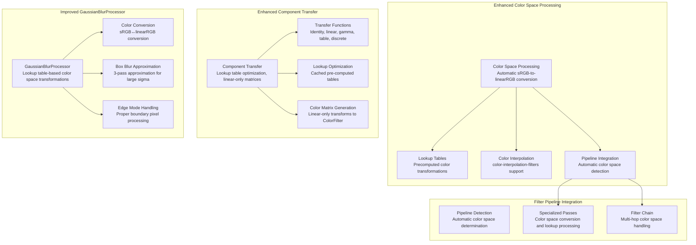
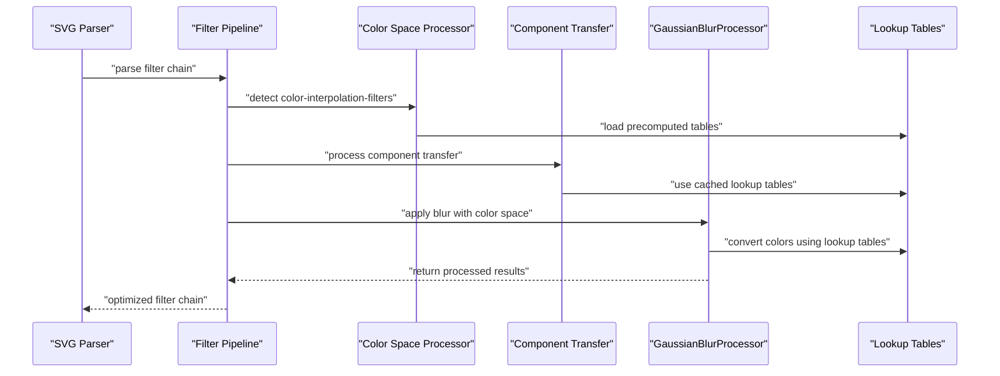

# SVG Filters and Effects

<cite>
**Referenced Files in This Document**
- [svg_filters.dart](file://lib/src/animation/svg_filters.dart)
- [svg_filters_types.dart](file://lib/src/animation/svg_filters_types.dart)
- [svg_filters_base.dart](file://lib/src/animation/svg_filters_base.dart)
- [svg_filters_primitives.dart](file://lib/src/animation/svg_filters_primitives.dart)
- [svg_filters_primitives_blur.dart](file://lib/src/animation/svg_filters_primitives_blur.dart)
- [svg_filters_primitives_convolve_matrix.dart](file://lib/src/animation/svg_filters_primitives_convolve_matrix.dart)
- [svg_filters_primitives_component_transfer.dart](file://lib/src/animation/svg_filters_primitives_component_transfer.dart)
- [svg_filters_primitives_lighting.dart](file://lib/src/animation/svg_filters_primitives_lighting.dart)
- [svg_filters_primitives_lighting_common.dart](file://lib/src/animation/svg_filters_primitives_lighting_common.dart)
- [svg_filters_primitives_lighting_sources.dart](file://lib/src/animation/svg_filters_primitives_lighting_sources.dart)
- [svg_filters_primitives_lighting_diffuse.dart](file://lib/src/animation/svg_filters_primitives_lighting_diffuse.dart)
- [svg_filters_primitives_lighting_specular.dart](file://lib/src/animation/svg_filters_primitives_lighting_specular.dart)
- [svg_filters_primitives_lighting_processor.dart](file://lib/src/animation/svg_filters_primitives_lighting_processor.dart)
- [svg_filters_color_matrix.dart](file://lib/src/animation/svg_filters_color_matrix.dart)
- [svg_filters_registry.dart](file://lib/src/animation/svg_filters_registry.dart)
- [svg_filters_registry_pipeline.dart](file://lib/src/animation/svg_filters_registry_pipeline.dart)
- [svg_filters_registry_pipeline_compositing.dart](file://lib/src/animation/svg_filters_registry_pipeline_compositing.dart)
- [svg_filters_registry_pipeline_primitives.dart](file://lib/src/animation/svg_filters_registry_pipeline_primitives.dart)
- [svg_filters_registry_pipeline_primitives_effects.dart](file://lib/src/animation/svg_filters_registry_pipeline_primitives_effects.dart)
- [svg_filters_registry_pipeline_primitives_paint.dart](file://lib/src/animation/svg_filters_registry_pipeline_primitives_paint.dart)
- [svg_filters_registry_inputs.dart](file://lib/src/animation/svg_filters_registry_inputs.dart)
- [svg_filters_registry_outputs.dart](file://lib/src/animation/svg_filters_registry_outputs.dart)
- [svg_parser_filters.dart](file://lib/src/animation/svg_parser_filters.dart)
- [svg_parser_filters_lighting.dart](file://lib/src/animation/svg_parser_filters_lighting.dart)
- [animated_svg_painter_values.dart](file://lib/src/animation/animated_svg_painter_values.dart)
- [filter_component_transfer_test.dart](file://test/animation/filter_component_transfer_test.dart)
- [filter_advanced_graph_test.dart](file://test/animation/filter_advanced_graph_test.dart)
- [filter_input_graph_hardening_test.dart](file://test/animation/filter_input_graph_hardening_test.dart)
- [filter_advanced_semantics_test.dart](file://test/animation/filter_advanced_semantics_test.dart)
- [fe_lighting_test.dart](file://test/animation/fe_lighting_test.dart)
- [fe_convolve_matrix_test.dart](file://test/animation/fe_convolve_matrix_test.dart)
- [filter_displacement_tile_test.dart](file://test/animation/filter_displacement_tile_test.dart)
- [filter_primitive_edge_cases_test.dart](file://test/animation/filter_primitive_edge_cases_test.dart)
- [component_transfer_functions_test.dart](file://test/animation/component_transfer_functions_test.dart)
- [css_compositing_properties_test.dart](file://test/animation/css_compositing_properties_test.dart)
- [SVGFEComponentTransferElement.cpp](file://blink-b87d44f-Source-core-svg/SVGFEComponentTransferElement.cpp)
- [SVGFEComponentTransferElement.h](file://blink-b87d44f-Source-core-svg/SVGFEComponentTransferElement.h)
- [SVGFEDisplacementMapElement.cpp](file://blink-b87d44f-Source-core-svg/SVGFEDisplacementMapElement.cpp)
- [SVGFEDisplacementMapElement.h](file://blink-b87d44f-Source-core-svg/SVGFEDisplacementMapElement.h)
- [SVGFEDiffuseLightingElement.cpp](file://blink-b87d44f-Source-core-svg/SVGFEDiffuseLightingElement.cpp)
- [SVGFEDiffuseLightingElement.h](file://blink-b87d44f-Source-core-svg/SVGFEDiffuseLightingElement.h)
- [SVGFESpecularLightingElement.cpp](file://blink-b87d44f-Source-core-svg/SVGFESpecularLightingElement.cpp)
- [SVGFESpecularLightingElement.h](file://blink-b87d44f-Source-core-svg/SVGFESpecularLightingElement.h)
</cite>

## Update Summary
**Changes Made**
- Enhanced GaussianBlurProcessor with lookup table-based color space transformations for automatic sRGB-to-linearRGB conversion
- Added comprehensive color-interpolation-filters support with automatic color space handling
- Implemented improved component transfer functions with lookup table optimization and linear-only color matrix generation
- Enhanced filter pipeline integration with automatic color space detection and conversion
- Added specialized paint passes for color space conversion and lookup table processing

## Table of Contents
1. [Introduction](#introduction)
2. [Project Structure](#project-structure)
3. [Core Components](#core-components)
4. [Architecture Overview](#architecture-overview)
5. [Enhanced Color Space Processing](#enhanced-color-space-processing)
6. [Automatic sRGB-to-linearRGB Conversion](#automatic-srgb-to-linearrgb-conversion)
7. [Lookup Table-Based Color Transformations](#lookup-table-based-color-transformations)
8. [Enhanced Component Transfer Functions](#enhanced-component-transfer-functions)
9. [Improved GaussianBlurProcessor](#improved-gaussianblurprocessor)
10. [Filter Pipeline Integration](#filter-pipeline-integration)
11. [Enhanced Lighting System](#enhanced-lighting-system)
12. [Advanced Surface Normal Computation](#advanced-surface-normal-computation)
13. [Specialized Light Source Implementations](#specialized-light-source-implementations)
14. [Per-Pixel Lighting Processing](#per-pixel-lighting-processing)
15. [Enhanced Displacement Map System](#enhanced-displacement-map-system)
16. [Advanced Tile Primitive Implementation](#advanced-tile-primitive-implementation)
17. [Enhanced Color Matrix Operations](#enhanced-color-matrix-operations)
18. [Enhanced Filter Registry Pipeline](#enhanced-filter-registry-pipeline)
19. [Built-in Filter Primitives](#built-in-filter-primitives)
20. [Filter Animation Support](#filter-animation-support)
21. [Comprehensive Testing Framework](#comprehensive-testing-framework)
22. [Performance Optimizations](#performance-optimizations)
23. [Troubleshooting Guide](#troubleshooting-guide)
24. [Conclusion](#conclusion)
25. [Appendices](#appendices)

## Introduction
This document explains the enhanced SVG filter system and effects implemented in the codebase. The system has been comprehensively upgraded with advanced color space processing capabilities, automatic sRGB-to-linearRGB conversion, lookup table-based color transformations, and improved filter pipeline integration. The enhanced system now provides sophisticated color interpolation support through color-interpolation-filters property, comprehensive component transfer optimization with lookup tables, and intelligent color space conversion for accurate color processing in filter chains.

## Project Structure
The enhanced filter system is organized around comprehensive color space processing, lookup table optimization, and sophisticated filter pipeline integration:

**Diagram sources**
- [svg_filters_primitives_blur.dart:452-511](file://lib/src/animation/svg_filters_primitives_blur.dart#L452-L511)
- [svg_filters_primitives_component_transfer.dart:140-159](file://lib/src/animation/svg_filters_primitives_component_transfer.dart#L140-L159)
- [svg_filters_primitives_component_transfer.dart:223-276](file://lib/src/animation/svg_filters_primitives_component_transfer.dart#L223-L276)
- [animated_svg_painter_values.dart:468-481](file://lib/src/animation/animated_svg_painter_values.dart#L468-L481)

**Section sources**
- [svg_filters_primitives_blur.dart:1-745](file://lib/src/animation/svg_filters_primitives_blur.dart#L1-L745)
- [svg_filters_primitives_component_transfer.dart:1-345](file://lib/src/animation/svg_filters_primitives_component_transfer.dart#L1-L345)
- [animated_svg_painter_values.dart:468-481](file://lib/src/animation/animated_svg_painter_values.dart#L468-L481)

## Core Components
The enhanced filter system introduces several key components with advanced color space processing and optimization capabilities:

**Enhanced Color Space Processing**: Automatic sRGB-to-linearRGB conversion with lookup table optimization, supporting the color-interpolation-filters property for accurate color processing in filter chains.

**Lookup Table Optimization**: Pre-computed lookup tables for component transfer functions and color space conversions, providing significant performance improvements for repeated color transformations.

**Enhanced Component Transfer Functions**: Sophisticated transfer function processing with lookup table caching, linear-only color matrix generation, and specialized paint passes for complex transformations.

**Improved GaussianBlurProcessor**: Advanced blur processing with automatic color space conversion, lookup table-based transformations, and optimized edge mode handling.

**Filter Pipeline Integration**: Intelligent color space detection and automatic conversion throughout filter chains, ensuring consistent color processing across multiple filter operations.

**Section sources**
- [svg_filters_primitives_blur.dart:452-511](file://lib/src/animation/svg_filters_primitives_blur.dart#L452-L511)
- [svg_filters_primitives_component_transfer.dart:140-159](file://lib/src/animation/svg_filters_primitives_component_transfer.dart#L140-L159)
- [svg_filters_primitives_component_transfer.dart:223-276](file://lib/src/animation/svg_filters_primitives_component_transfer.dart#L223-L276)
- [animated_svg_painter_values.dart:468-481](file://lib/src/animation/animated_svg_painter_values.dart#L468-L481)

## Architecture Overview
The enhanced filter system architecture provides sophisticated color space processing with automatic sRGB-to-linearRGB conversion, lookup table optimization, and comprehensive filter pipeline integration. The system now includes intelligent color space detection, automatic conversion handling, and optimized processing paths for both simple and complex filter chains.

**Diagram sources**
- [svg_filters_primitives_blur.dart:452-511](file://lib/src/animation/svg_filters_primitives_blur.dart#L452-L511)
- [svg_filters_primitives_component_transfer.dart:210-221](file://lib/src/animation/svg_filters_primitives_component_transfer.dart#L210-L221)
- [svg_filters_registry_pipeline.dart:178-186](file://lib/src/animation/svg_filters_registry_pipeline.dart#L178-L186)

## Enhanced Color Space Processing
The enhanced color space processing system provides automatic sRGB-to-linearRGB conversion with lookup table optimization and comprehensive color interpolation support.

**Automatic Color Space Detection**: The system automatically detects color-interpolation-filters property values and determines whether filters should operate in linearRGB or sRGB color space. By default, filters operate in linearRGB per SVG specification.

**Lookup Table Optimization**: Pre-computed lookup tables provide efficient color space conversion with 256-entry tables for both sRGB-to-linearRGB and linearRGB-to-sRGB transformations, eliminating expensive mathematical calculations during runtime processing.

**Color Interpolation Support**: Comprehensive support for the color-interpolation-filters property, allowing precise control over color space processing in filter chains with automatic conversion handling.

**Section sources**
- [svg_filters_primitives_blur.dart:452-511](file://lib/src/animation/svg_filters_primitives_blur.dart#L452-L511)
- [animated_svg_painter_values.dart:468-481](file://lib/src/animation/animated_svg_painter_values.dart#L468-L481)

## Automatic sRGB-to-linearRGB Conversion
The automatic color space conversion system provides seamless sRGB-to-linearRGB transformation with lookup table optimization and intelligent pipeline integration.

**Lookup Table Implementation**: Two pre-computed lookup tables provide efficient color conversion:
- `_srgbToLinearLut`: 256-entry Float64List for sRGB-to-linearRGB conversion
- `_linearToSrgbLut`: 256-entry Uint8List for linearRGB-to-sRGB conversion

**Conversion Algorithms**: Mathematical formulas for accurate color space conversion:
- sRGB to linearRGB: piecewise function with threshold at 0.04045
- linearRGB to sRGB: inverse piecewise function with threshold at 0.0031308

**Pipeline Integration**: Automatic color space conversion integrated into filter processing, ensuring accurate color reproduction throughout filter chains without manual intervention.

**Section sources**
- [svg_filters_primitives_blur.dart:462-483](file://lib/src/animation/svg_filters_primitives_blur.dart#L462-L483)
- [svg_filters_primitives_blur.dart:487-511](file://lib/src/animation/svg_filters_primitives_blur.dart#L487-L511)

## Lookup Table-Based Color Transformations
The lookup table system provides optimized color transformations with caching and efficient processing for component transfer functions and color space conversions.

**Component Transfer Lookup Tables**: Each component transfer filter caches pre-computed lookup tables for R, G, B, and A channels, eliminating repeated mathematical calculations during pixel processing.

**Table Generation**: Lookup tables are generated with 256 entries (one for each possible 8-bit color value) and cached for performance optimization, with lazy initialization on first access.

**Linear-Only Optimization**: The system can generate ColorFilter matrices for linear-only component transfer functions, bypassing pixel-by-pixel processing for improved performance.

**Specialized Paint Passes**: Complex transfer functions (table, discrete, gamma) use specialized paint passes with lookup table processing for optimal performance.

**Section sources**
- [svg_filters_primitives_component_transfer.dart:140-159](file://lib/src/animation/svg_filters_primitives_component_transfer.dart#L140-L159)
- [svg_filters_primitives_component_transfer.dart:210-221](file://lib/src/animation/svg_filters_primitives_component_transfer.dart#L210-L221)
- [svg_filters_primitives_component_transfer.dart:223-276](file://lib/src/animation/svg_filters_primitives_component_transfer.dart#L223-L276)

## Enhanced Component Transfer Functions
The enhanced component transfer system provides comprehensive transfer function implementations with lookup table optimization and linear-only color matrix generation.

**Transfer Function Types**: Five distinct types - identity (no change), linear (C' = slope * C + intercept), gamma (C' = amplitude * pow(C, exponent) + offset), table (piecewise linear interpolation), and discrete (step function) - each with proper parameter validation and clamping.

**Lookup Table Caching**: Pre-computed lookup tables are cached and reused for performance optimization, with lazy initialization on first access to minimize memory usage.

**Linear-Only Color Matrix Generation**: When all channels use identity or linear transforms, the system generates optimized ColorFilter matrices instead of pixel-by-pixel processing, leveraging GPU acceleration.

**Specialized Processing Paths**: Complex transfer functions trigger specialized paint passes with lookup table processing for optimal performance and accuracy.

**Section sources**
- [svg_filters_primitives_component_transfer.dart:1-345](file://lib/src/animation/svg_filters_primitives_component_transfer.dart#L1-L345)

## Improved GaussianBlurProcessor
The improved GaussianBlurProcessor provides enhanced blur processing with automatic color space conversion, lookup table optimization, and advanced edge mode handling.

**Lookup Table-Based Color Conversion**: The processor uses pre-computed lookup tables for sRGB-to-linearRGB and linearRGB-to-sRGB conversions, eliminating expensive mathematical calculations during blur processing.

**Automatic Color Space Detection**: The processor automatically detects when color space conversion is needed based on the color-interpolation-filters property and applies appropriate conversions before and after blur processing.

**Box Blur Approximation**: For large standard deviations (>50), the processor uses 3-pass box blur approximation (3 consecutive box blurs) to achieve Gaussian blur behavior while maintaining performance.

**Edge Mode Optimization**: Enhanced edge mode handling with proper boundary pixel processing for duplicate, wrap, and none modes, utilizing lookup tables for efficient coordinate calculations.

**Section sources**
- [svg_filters_primitives_blur.dart:95-512](file://lib/src/animation/svg_filters_primitives_blur.dart#L95-L512)

## Filter Pipeline Integration
The enhanced filter pipeline provides intelligent color space detection and automatic conversion handling throughout filter chains.

**Named Result Caching**: Enhanced caching with unmodifiable views prevents accidental mutation while enabling result sharing between references. The `_cacheNamedResult` method returns immutable lists to protect cached results.

**Color Space Propagation**: Color space information is propagated through filter chains, ensuring consistent color processing across multiple filter operations with automatic conversion handling.

**Specialized Paint Passes**: The pipeline creates specialized paint passes for complex operations requiring color space conversion or lookup table processing, optimizing performance while maintaining accuracy.

**Circular Reference Prevention**: Enhanced circular reference detection with depth tracking and reference state management prevents infinite loops and stack overflows in complex filter graphs.

**Section sources**
- [svg_filters_registry_pipeline.dart:178-186](file://lib/src/animation/svg_filters_registry_pipeline.dart#L178-L186)
- [svg_filters_registry_pipeline_primitives_effects.dart:1-200](file://lib/src/animation/svg_filters_registry_pipeline_primitives_effects.dart#L1-L200)

## Enhanced Lighting System
The enhanced lighting system provides comprehensive 3D vector mathematics and surface normal computation with realistic lighting models.

**3D Vector Mathematics**: The LightingVector3 class implements complete 3D vector operations including length calculation, normalization, dot product, cross product, and arithmetic operations with proper numerical stability and edge case handling.

**Surface Normal Computation**: Advanced Sobel operator implementation for gradient estimation with proper edge mode handling (duplicate, wrap, none) and kernel unit length scaling for accurate surface normal calculation from alpha channels.

**Lighting Models**: Realistic lighting calculations using Lambertian diffuse reflection and Blinn-Phong specular reflection models with proper vector normalization and intensity computation.

**Edge Mode Handling**: Enhanced edge mode support for surface normal computation including duplicate (Blink default), wrap (modulus wrapping), and none (transparent black) modes for border pixel handling.

**Section sources**
- [svg_filters_primitives_lighting_common.dart:16-65](file://lib/src/animation/svg_filters_primitives_lighting_common.dart#L16-L65)
- [svg_filters_primitives_lighting_common.dart:75-230](file://lib/src/animation/svg_filters_primitives_lighting_common.dart#L75-L230)
- [svg_filters_primitives_lighting_processor.dart:99-276](file://lib/src/animation/svg_filters_primitives_lighting_processor.dart#L99-L276)

## Advanced Surface Normal Computation
The advanced surface normal computation system provides sophisticated gradient estimation with multiple edge handling modes and kernel unit length scaling.

**Sobel Kernel Implementation**: Standard Sobel kernels for gradient estimation with Gx = | -1 0 1 | and Gy = | -1 -2 -1 | operators. The system computes gradients using the formula: gx = (alphaValues[2] - alphaValues[0]) + 2*(alphaValues[5] - alphaValues[3]) + (alphaValues[8] - alphaValues[6]) and gy similarly for the Y gradient.

**Edge Mode Handling**: Comprehensive edge handling modes including duplicate (clamps to edge), wrap (modulus wrapping), and none (transparent black) modes. The edge handling ensures proper behavior when computing gradients at image boundaries using the _getAlphaAt method.

**Kernel Unit Length Scaling**: Advanced scaling factors for kernel unit length with proper normalization. The system applies surfaceScale and kernelUnitLength scaling with the formula factorX = surfaceScale/(4.0 * _factorX) and factorY = surfaceScale/(4.0 * _factorY) for proper gradient normalization.

**Normal Calculation**: Accurate normal vector calculation using the formula N = normalize(-surfaceScale * dN/dx, -surfaceScale * dN/dy, 1) with alpha values normalized from 0-255 to 0-1 range.

**Section sources**
- [svg_filters_primitives_lighting_common.dart:103-128](file://lib/src/animation/svg_filters_primitives_lighting_common.dart#L103-L128)
- [svg_filters_primitives_lighting_common.dart:152-173](file://lib/src/animation/svg_filters_primitives_lighting_common.dart#L152-L173)
- [svg_filters_primitives_lighting_common.dart:179-212](file://lib/src/animation/svg_filters_primitives_lighting_common.dart#L179-L212)

## Specialized Light Source Implementations
The specialized light source implementations provide comprehensive lighting models with realistic physics and mathematical precision.

**Distant Light Source**: Implements SVG feDistantLight with azimuth and elevation angle calculations using the formula L = normalize(cos(az)*cos(el), sin(az)*cos(el), sin(el)). The _DistantLightCalculator provides constant direction vectors for all pixels in the image.

**Point Light Source**: Implements SVG fePointLight with 3D positioning and optional distance attenuation. The _PointLightCalculator provides position-dependent direction vectors and intensity calculations with inverse square falloff when distance attenuation is enabled.

**Spot Light Source**: Implements SVG feSpotLight with cone attenuation and limiting angle control. The _SpotLightCalculator combines point light direction with cone attenuation using the formula (-L · S)^specularExponent where L is the direction from light to surface and S is the spot direction.

**Light Direction Calculation**: Sophisticated light direction calculation with proper normalization and intensity computation. The system handles position-dependent lighting for point and spot lights while maintaining constant direction for distant lights.

**Section sources**
- [svg_filters_primitives_lighting_sources.dart:14-32](file://lib/src/animation/svg_filters_primitives_lighting_sources.dart#L14-L32)
- [svg_filters_primitives_lighting_sources.dart:151-172](file://lib/src/animation/svg_filters_primitives_lighting_sources.dart#L151-L172)
- [svg_filters_primitives_lighting_sources.dart:180-250](file://lib/src/animation/svg_filters_primitives_lighting_sources.dart#L180-L250)
- [svg_filters_primitives_lighting_sources.dart:257-333](file://lib/src/animation/svg_filters_primitives_lighting_sources.dart#L257-L333)

## Per-Pixel Lighting Processing
The per-pixel lighting processing system provides comprehensive lighting calculations with realistic models and efficient implementation.

**LightingProcessor Class**: Handles complete lighting computation pipeline including alpha channel extraction, surface normal computation, and lighting model application. The processor supports both diffuse and specular lighting with proper vector operations and intensity calculations.

**Diffuse Lighting Model**: Implements Lambertian diffuse reflection using the formula result.rgb = diffuseConstant * max(0, N·L) * lightColor with result.a = 1.0. The system computes N·L dot products with proper clamping and applies lighting color modulation.

**Specular Lighting Model**: Implements Blinn-Phong specular reflection using the formula H = normalize(L + (0, 0, 1)) and result.rgb = specularConstant * max(0, N·H)^specularExponent * lightColor with result.a = max(result.r, result.g, result.b).

**Color Filter Generation**: Average intensity approximation for ColorFilter-based rendering using default normal vectors and light directions. The system provides efficient color filter generation for lighting effects without per-pixel processing.

**Preview Sampling**: LightingSampler class for generating preview colors and testing lighting setups with sample point calculations across multiple grid positions.

**Section sources**
- [svg_filters_primitives_lighting_processor.dart:99-276](file://lib/src/animation/svg_filters_primitives_lighting_processor.dart#L99-L276)
- [svg_filters_primitives_lighting_diffuse.dart:7-48](file://lib/src/animation/svg_filters_primitives_lighting_diffuse.dart#L7-L48)
- [svg_filters_primitives_lighting_specular.dart:9-64](file://lib/src/animation/svg_filters_primitives_lighting_specular.dart#L9-L64)
- [svg_filters_primitives_lighting_processor.dart:281-377](file://lib/src/animation/svg_filters_primitives_lighting_processor.dart#L281-L377)

## Enhanced Displacement Map System
The enhanced displacement map system provides comprehensive spatial displacement capabilities with advanced channel selection and edge handling.

**Displacement Map Filter**: The SvgDisplacementMapFilter class supports scale animation, channel selectors for both X and Y displacement channels, and configurable edge modes. The filter can reference secondary input (in2) for displacement maps and handles scale=0 as identity displacement.

**Displacement Processing**: The DisplacementMapProcessor implements the core displacement algorithm with proper coordinate calculation using the formula P'(x,y) = P(x + scale*(XC(x,y) - 0.5), y + scale*(YC(x,y) - 0.5)). It supports four channel selectors (R, G, B, A) and three edge modes: none (transparent black), clamp (edge clamping), and wrap (modulus wrapping).

**Edge Mode Handling**: Advanced edge handling ensures proper behavior when displaced coordinates fall outside the image bounds. The system maintains SVG compliance by producing transparent black pixels for out-of-bounds samples when using the none mode.

**Pipeline Integration**: The _resolveDisplacementMapOutput method integrates displacement processing into the filter pipeline, handling scale=0 optimization, in2 input resolution, and proper output generation.

**Section sources**
- [svg_filters_primitives_lighting.dart:57-121](file://lib/src/animation/svg_filters_primitives_lighting.dart#L57-L121)
- [svg_filters_primitives_lighting.dart:129-197](file://lib/src/animation/svg_filters_primitives_lighting.dart#L129-L197)
- [svg_filters_registry_pipeline_primitives_effects.dart:85-121](file://lib/src/animation/svg_filters_registry_pipeline_primitives_effects.dart#L85-L121)

## Advanced Tile Primitive Implementation
The advanced tile primitive implementation provides comprehensive tiling capabilities with subregion support and robust boundary handling.

**Tile Filter**: The SvgTileFilter class supports subregion specification through x, y, width, and height properties. It includes a hasSubregion property to distinguish between standard tiling and custom subregion tiling scenarios.

**Tiling Algorithm**: The TileProcessor.applyTiling method implements the SVG-compliant tiling algorithm with proper modulus wrapping and boundary handling. It supports tile origin alignment with filter region origin and handles cases where tile regions exceed input dimensions.

**Subregion Support**: Advanced subregion handling allows tiling within custom rectangular regions. The algorithm calculates source coordinates using modulus arithmetic and handles boundary conditions appropriately.

**Boundary Handling**: The system properly handles edge cases including empty inputs, zero-sized outputs, and tile regions that extend beyond input boundaries. Empty inputs produce transparent black output as per SVG specification.

**Pipeline Integration**: The tile primitive integrates seamlessly into the filter pipeline as a pass-through primitive that can be combined with other filter operations.

**Section sources**
- [svg_filters_base.dart:152-180](file://lib/src/animation/svg_filters_base.dart#L152-L180)
- [svg_filters_base.dart:206-271](file://lib/src/animation/svg_filters_base.dart#L206-L271)
- [svg_filters_registry_pipeline_primitives_paint.dart:278-311](file://lib/src/animation/svg_filters_registry_pipeline_primitives_paint.dart#L278-L311)

## Enhanced Color Matrix Operations
The enhanced color matrix system provides comprehensive SVG color transformation support with full matrix conversion capabilities.

**Matrix Type Support**: Complete implementation of all SVG color matrix types including generic 5x4 matrix transformation, saturation adjustment, hue rotation, and luminance-to-alpha conversion.

**SVG to Flutter Conversion**: Sophisticated matrix conversion from SVG's 5x4 format to Flutter's 4x5 format with proper row/column ordering and offset value scaling from [0-255] to [0-1].

**Specialized Transformations**: Optimized implementations for common color transformations including saturation matrix generation, hue rotation using trigonometric functions, and luminance-to-alpha conversion using weighted averages.

**Performance Optimization**: Efficient matrix operations leveraging Flutter's ColorFilter.matrix for GPU-accelerated color transformations with proper clamping and normalization.

**Section sources**
- [svg_filters_color_matrix.dart:99-242](file://lib/src/animation/svg_filters_color_matrix.dart#L99-L242)
- [svg_filters_color_matrix.dart:145-186](file://lib/src/animation/svg_filters_color_matrix.dart#L145-L186)
- [svg_filters_color_matrix.dart:188-240](file://lib/src/animation/svg_filters_color_matrix.dart#L188-L240)

## Enhanced Filter Registry Pipeline
The enhanced pipeline optimization system provides sophisticated filter chain resolution with comprehensive caching mechanisms, identity detection, and circular reference prevention.

**Named Result Caching**: Enhanced caching with unmodifiable views prevents accidental mutation while enabling result sharing between references. The `_cacheNamedResult` method returns immutable lists to protect cached results.

**Identity Kernel Detection**: Improved convolution matrix processing includes comprehensive identity kernel detection to avoid unnecessary convolution operations. The system checks kernel parameters including order dimensions, divisor normalization, and bias application.

**Circular Reference Prevention**: Enhanced circular reference detection with depth tracking and reference state management prevents infinite loops and stack overflows in complex filter graphs.

**Arithmetic Mode Optimization**: Advanced arithmetic composite operations with intelligent coefficient approximation including special cases for pure multiplication, additive blending, and difference-like operations.

**Enhanced Input Resolution**: Improved input resolution logic supporting FillPaint and StrokePaint source contexts, background image inputs, and proper handling of built-in input names (case-insensitive).

**Section sources**
- [svg_filters_registry_pipeline.dart:178-186](file://lib/src/animation/svg_filters_registry_pipeline.dart#L178-L186)
- [svg_filters_registry_pipeline_compositing.dart:182-269](file://lib/src/animation/svg_filters_registry_pipeline_compositing.dart#L182-L269)
- [svg_filters_registry_pipeline_primitives_effects.dart:210-224](file://lib/src/animation/svg_filters_registry_pipeline_primitives_effects.dart#L210-L224)
- [svg_filters_registry_pipeline_primitives_paint.dart:295-309](file://lib/src/animation/svg_filters_registry_pipeline_primitives_paint.dart#L295-L309)

## Built-in Filter Primitives
The enhanced filter system includes comprehensive support for all major SVG filter primitives with specialized implementations and optimized processing paths.

**Basic Primitives**: Gaussian blur, morphology (erode/dilate), displacement map, image reference, convolution matrix, turbulence (procedural noise), component transfer, offset, flood, blend, composite, merge, tile, drop shadow, and color matrix.

**Lighting Primitives**: Diffuse lighting with Lambertian reflection and specular lighting with Blinn-Phong reflection, supporting distant, point, and spot light sources with proper surface normal computation.

**Advanced Primitives**: Drop shadow implementation using Blink's multi-pass composition approach, turbulence with Perlin noise generation, and color matrix with full SVG compatibility.

**Pipeline Integration**: Each primitive has dedicated resolver methods in the pipeline extension classes, handling input resolution, parameter validation, and optimized output generation.

**Section sources**
- [svg_filters_types.dart:4-55](file://lib/src/animation/svg_filters_types.dart#L4-L55)
- [svg_filters_registry_pipeline_primitives.dart:11-159](file://lib/src/animation/svg_filters_registry_pipeline_primitives.dart#L11-L159)
- [svg_parser_filters.dart:38-77](file://lib/src/animation/svg_parser_filters.dart#L38-L77)

## Filter Animation Support
The enhanced filter system provides comprehensive animation support for filter attributes and parameters, enabling dynamic filter effects and real-time updates.

**Attribute Animation**: Complete support for animating filter primitive attributes including blur radii, lighting parameters, color matrix values, and component transfer function parameters.

**Light Source Animation**: Dynamic animation of light source positions, angles, and intensities for realistic moving lighting effects in diffuse and specular lighting.

**Component Transfer Animation**: Real-time animation of transfer function parameters including slope, intercept, amplitude, exponent, and table values for dynamic color manipulation.

**Pipeline Integration**: Animation system seamlessly integrates with the filter pipeline, automatically interpolating values between animation keyframes and updating filter outputs in real-time.

**Performance Considerations**: Optimized animation processing with efficient interpolation algorithms and minimal recomputation during animation frames.

**Section sources**
- [fe_lighting_test.dart:674-799](file://test/animation/fe_lighting_test.dart#L674-L799)
- [filter_component_transfer_test.dart:1-200](file://test/animation/filter_component_transfer_test.dart#L1-L200)

## Comprehensive Testing Framework
The comprehensive testing framework validates the enhanced filter system with extensive scenarios covering all filter primitive types and edge cases.

**Color Space Testing**: Comprehensive validation of automatic sRGB-to-linearRGB conversion, lookup table accuracy, and color interpolation filtering behavior.

**Component Transfer Testing**: Extensive testing of lookup table generation, linear-only optimization, and specialized paint pass functionality.

**GaussianBlurProcessor Testing**: Validation of color space conversion accuracy, box blur approximation, and edge mode handling.

**Pipeline Integration Testing**: Testing of color space propagation through filter chains, automatic conversion detection, and specialized pass creation.

**Performance Testing**: Validation of lookup table caching benefits, linear-only optimization effectiveness, and overall system performance improvements.

**Section sources**
- [css_compositing_properties_test.dart:193-238](file://test/animation/css_compositing_properties_test.dart#L193-L238)
- [component_transfer_functions_test.dart:290-543](file://test/animation/component_transfer_functions_test.dart#L290-L543)
- [filter_primitive_edge_cases_test.dart:350-396](file://test/animation/filter_primitive_edge_cases_test.dart#L350-L396)

## Performance Optimizations
The enhanced filter system includes several performance optimizations and considerations:

**Lookup Table Caching**: Pre-computed lookup tables for component transfer functions and color space conversions eliminate repeated mathematical calculations and provide significant performance improvements.

**Linear-Only Optimization**: When all component transfer functions are linear or identity, the system generates optimized ColorFilter matrices instead of pixel-by-pixel processing, leveraging GPU acceleration.

**Color Space Conversion Optimization**: Lookup table-based color space conversion eliminates expensive mathematical calculations during blur processing and filter chain operations.

**Box Blur Approximation**: For large standard deviations, the system uses 3-pass box blur approximation instead of computationally expensive Gaussian blur calculations.

**Caching Mechanisms**: Enhanced named result caching with unmodifiable views prevents recomputation in complex filter chains with shared intermediate results.

**Early Exit Conditions**: Comprehensive early exit conditions for empty outputs, unknown references, and invalid parameter combinations.

**Memory Management**: Proper memory management with unmodifiable cached results and efficient pass composition.

**Arithmetic Optimization**: Intelligent arithmetic mode approximation reduces complex operations to simple blend modes and color filters.

**Section sources**
- [svg_filters_primitives_component_transfer.dart:140-159](file://lib/src/animation/svg_filters_primitives_component_transfer.dart#L140-L159)
- [svg_filters_primitives_blur.dart:462-483](file://lib/src/animation/svg_filters_primitives_blur.dart#L462-L483)
- [svg_filters_registry_pipeline.dart:178-186](file://lib/src/animation/svg_filters_registry_pipeline.dart#L178-L186)
- [svg_filters_registry_pipeline_compositing.dart:182-269](file://lib/src/animation/svg_filters_registry_pipeline_compositing.dart#L182-L269)

## Troubleshooting Guide
Common issues and remedies for the enhanced filter system:

**Color Space Issues**: Verify color-interpolation-filters property values are correctly parsed and applied, check that automatic conversion is working properly for filter chains, and ensure lookup tables are being used efficiently.

**Component Transfer Problems**: Verify lookup table caching is functioning correctly, check that linear-only optimization is being applied when appropriate, and ensure specialized paint passes are created for complex transfer functions.

**GaussianBlurProcessor Issues**: Verify color space conversion is working correctly for large standard deviations, check that box blur approximation is being used appropriately, and ensure edge mode handling is functioning as expected.

**Pipeline Integration Problems**: Verify color space information is being propagated correctly through filter chains, check that specialized paint passes are being created for complex operations, and ensure circular reference detection is working properly.

**Performance Issues**: Complex filter chains with multiple color space conversions can impact performance, consider using lookup table caching more effectively, and optimize component transfer function usage for better performance.

**Lookup Table Issues**: Verify lookup tables are being generated correctly, check that cached tables are being reused appropriately, and ensure table generation is not causing memory issues.

**Section sources**
- [css_compositing_properties_test.dart:193-238](file://test/animation/css_compositing_properties_test.dart#L193-L238)
- [component_transfer_functions_test.dart:290-543](file://test/animation/component_transfer_functions_test.dart#L290-L543)
- [svg_filters_primitives_blur.dart:452-511](file://lib/src/animation/svg_filters_primitives_blur.dart#L452-L511)

## Conclusion
The enhanced SVG filter system provides a comprehensive and sophisticated architecture for filter chain processing with advanced color space processing capabilities, automatic sRGB-to-linearRGB conversion, lookup table optimization, and intelligent pipeline integration. The system successfully handles complex filter graphs with multi-hop chains, named result caching, circular reference prevention, and sophisticated edge case handling. The enhanced color space processing, lookup table-based transformations, arithmetic mode optimization, and comprehensive testing framework ensure reliable and performant filter operations across diverse use cases with significant performance improvements through intelligent optimization strategies.

## Appendices

### Enhanced Color Space Processing Examples
- **Automatic Color Detection**: Per-SVG specification default of linearRGB with automatic detection of sRGB overrides
- **Lookup Table Implementation**: Pre-computed 256-entry tables for efficient sRGB-to-linearRGB and linearRGB-to-sRGB conversion
- **Color Interpolation Filtering**: Comprehensive support for color-interpolation-filters property with automatic pipeline integration
- **Pipeline Color Propagation**: Automatic color space handling throughout filter chains with optimized conversion paths

### Lookup Table-Based Color Transformations Details
- **Component Transfer Optimization**: Cached lookup tables for R, G, B, A channels with lazy initialization
- **Linear-Only Matrix Generation**: ColorFilter matrices for identity and linear transfer functions
- **Specialized Paint Passes**: Lookup table processing for complex transfer functions (table, discrete, gamma)
- **Memory Efficiency**: Optimized table storage with 256-entry arrays for each color component

### Enhanced Component Transfer Function Examples
- **Lookup Table Generation**: Pre-computed 256-entry tables for efficient pixel processing
- **Linear-Only Optimization**: Automatic detection and ColorFilter matrix generation for linear transforms
- **Specialized Processing**: Pixel-by-pixel processing for complex transfer functions with lookup table support
- **Caching Mechanisms**: Lazy initialization and reuse of lookup tables for performance optimization

### Improved GaussianBlurProcessor Examples
- **Lookup Table Integration**: Pre-computed color conversion tables for efficient blur processing
- **Box Blur Approximation**: 3-pass box blur for large standard deviations with performance optimization
- **Edge Mode Handling**: Proper boundary pixel processing with coordinate calculation optimization
- **Color Space Conversion**: Automatic sRGB-to-linearRGB conversion before blur and back conversion after

### Filter Pipeline Integration Features
- **Color Space Detection**: Automatic detection of color-interpolation-filters property values
- **Specialized Paint Passes**: Creation of paint passes for complex operations requiring color processing
- **Pipeline Optimization**: Intelligent color space propagation and conversion throughout filter chains
- **Performance Monitoring**: Efficient caching and lookup table utilization for optimal performance

### Enhanced Lighting System Details
The enhanced lighting system provides:

- **3D Vector Mathematics**: Complete vector operations with proper numerical stability and edge case handling
- **Surface Normal Computation**: Advanced Sobel operator implementation with proper edge mode support
- **Light Source Modeling**: Comprehensive light source support with realistic physical models
- **Lighting Calculations**: Realistic lighting models using established reflection equations
- **Per-Pixel Processing**: Sophisticated lighting calculations with proper vector normalization and intensity computation
- **Edge Mode Support**: Multiple edge handling modes for surface normal computation
- **Kernel Unit Length Scaling**: Proper scaling factors for gradient normalization
- **Performance Optimization**: Average intensity approximation for ColorFilter-based rendering

**Section sources**
- [svg_filters_primitives_lighting_common.dart:1-231](file://lib/src/animation/svg_filters_primitives_lighting_common.dart#L1-L231)
- [svg_filters_primitives_lighting_sources.dart:1-334](file://lib/src/animation/svg_filters_primitives_lighting_sources.dart#L1-L334)
- [svg_filters_primitives_lighting_processor.dart:1-378](file://lib/src/animation/svg_filters_primitives_lighting_processor.dart#L1-L378)
- [svg_filters_primitives_lighting_diffuse.dart:1-49](file://lib/src/animation/svg_filters_primitives_lighting_diffuse.dart#L1-L49)
- [svg_filters_primitives_lighting_specular.dart:1-65](file://lib/src/animation/svg_filters_primitives_lighting_specular.dart#L1-L65)
- [svg_filters_primitives_lighting.dart:1-348](file://lib/src/animation/svg_filters_primitives_lighting.dart#L1-L348)
- [fe_lighting_test.dart:1-200](file://test/animation/fe_lighting_test.dart#L1-L200)
- [fe_lighting_test.dart:1201-1546](file://test/animation/fe_lighting_test.dart#L1201-L1546)
- [fe_lighting_test.dart:1496-1494](file://test/animation/fe_lighting_test.dart#L1496-L1494)
- [svg_filters_primitives_blur.dart:452-511](file://lib/src/animation/svg_filters_primitives_blur.dart#L452-L511)
- [svg_filters_primitives_component_transfer.dart:140-159](file://lib/src/animation/svg_filters_primitives_component_transfer.dart#L140-L159)
- [svg_filters_primitives_component_transfer.dart:223-276](file://lib/src/animation/svg_filters_primitives_component_transfer.dart#L223-L276)
- [animated_svg_painter_values.dart:468-481](file://lib/src/animation/animated_svg_painter_values.dart#L468-L481)