# Animated SVG Support

<cite>
**Referenced Files in This Document**
- [ANIMATION.md](file://ANIMATION.md)
- [ARCHITECTURE.md](file://ARCHITECTURE.md)
- [lib/src/animation.dart](file://lib/src/animation.dart)
- [lib/src/animation/animated_svg_picture.dart](file://lib/src/animation/animated_svg_picture.dart)
- [lib/src/animation/animated_svg_controller.dart](file://lib/src/animation/animated_svg_controller.dart)
- [lib/src/animation/smil/smil_timeline.dart](file://lib/src/animation/smil/smil_timeline.dart)
- [lib/src/animation/smil/smil_animation.dart](file://lib/src/animation/smil/smil_animation.dart)
- [lib/src/animation/smil/smil_parser.dart](file://lib/src/animation/smil/smil_parser.dart)
- [lib/src/animation/smil/interpolators.dart](file://lib/src/animation/smil/interpolators.dart)
- [lib/src/animation/smil/motion_path.dart](file://lib/src/animation/smil/motion_path.dart)
- [lib/src/animation/css_to_smil_converter.dart](file://lib/src/animation/css_to_smil_converter.dart)
- [lib/src/animation/css_to_smil_converter_transforms.dart](file://lib/src/animation/css_to_smil_converter_transforms.dart)
- [lib/src/animation/css_to_smil_converter_transforms_values.dart](file://lib/src/animation/css_to_smil_converter_transforms_values.dart)
- [lib/src/animation/svg_dom.dart](file://lib/src/animation/svg_dom.dart)
- [lib/src/animation/svg_event.dart](file://lib/src/animation/svg_event.dart)
- [lib/src/animation/svg_event_dispatcher.dart](file://lib/src/animation/svg_event_dispatcher.dart)
- [lib/src/animation/animated_svg_picture_events.dart](file://lib/src/animation/animated_svg_picture_events.dart)
- [lib/src/animation/animated_svg_picture_event_model.dart](file://lib/src/animation/animated_svg_picture_event_model.dart)
- [lib/src/animation/smil/timing_parser.dart](file://lib/src/animation/smil/timing_parser.dart)
- [lib/src/animation/smil/smil_timeline_runtime.dart](file://lib/src/animation/smil/smil_timeline_runtime.dart)
- [lib/src/animation/smil/smil_timeline_syncbase.dart](file://lib/src/animation/smil/smil_timeline_syncbase.dart)
- [lib/src/animation/animated_svg_picture_utils.dart](file://lib/src/animation/animated_svg_picture_utils.dart)
- [lib/src/animation/animated_svg_picture_utils_attrs.dart](file://lib/src/animation/animated_svg_picture_utils_attrs.dart)
- [lib/src/animation/animated_svg_picture_utils_style.dart](file://lib/src/animation/animated_svg_picture_utils_style.dart)
- [lib/src/animation/animated_svg_picture_utils_transform.dart](file://lib/src/animation/animated_svg_picture_utils_transform.dart)
- [lib/src/animation/animated_svg_picture_hit_test_text_layout.dart](file://lib/src/animation/animated_svg_picture_hit_test_text_layout.dart)
- [lib/src/animation/animated_svg_painter_text_style.dart](file://lib/src/animation/animated_svg_painter_text_style.dart)
- [lib/src/animation/animated_svg_painter_text_paint.dart](file://lib/src/animation/animated_svg_painter_text_paint.dart)
- [lib/src/animation/animated_svg_picture_hit_test_text_path_segments.dart](file://lib/src/animation/animated_svg_picture_hit_test_text_path_segments.dart)
- [lib/src/animation/animated_svg_picture_hit_test_text_runs.dart](file://lib/src/animation/animated_svg_picture_hit_test_text_runs.dart)
- [lib/src/animation/animated_svg_painter.dart](file://lib/src/animation/animated_svg_painter.dart)
- [lib/src/animation/animated_svg_painter_gradients.dart](file://lib/src/animation/animated_svg_painter_gradients.dart)
- [lib/src/animation/animated_svg_painter_patterns.dart](file://lib/src/animation/animated_svg_painter_patterns.dart)
- [lib/src/animation/animated_svg_painter_paint_order.dart](file://lib/src/animation/animated_svg_painter_paint_order.dart)
- [lib/src/animation/animated_svg_painter_markers.dart](file://lib/src/animation/animated_svg_painter_markers.dart)
- [lib/src/animation/svg_filters_primitives.dart](file://lib/src/animation/svg_filters_primitives.dart)
- [lib/src/animation/svg_filters_registry_pipeline_primitives.dart](file://lib/src/animation/svg_filters_registry_pipeline_primitives.dart)
- [lib/src/animation/animated_svg_painter_shapes.dart](file://lib/src/animation/animated_svg_painter_shapes.dart)
- [lib/src/animation/animated_svg_painter_shapes_rect.dart](file://lib/src/animation/animated_svg_painter_shapes_rect.dart)
- [lib/src/animation/animated_svg_painter_clip_mask.dart](file://lib/src/animation/animated_svg_painter_clip_mask.dart)
- [lib/src/animation/animated_svg_painter_clip_mask_geometry.dart](file://lib/src/animation/animated_svg_painter_clip_mask_geometry.dart)
- [lib/src/animation/animated_svg_painter_clip_mask_units.dart](file://lib/src/animation/animated_svg_painter_clip_mask_units.dart)
- [lib/src/animation/animated_svg_painter_clip_mask_advanced.dart](file://lib/src/animation/animated_svg_painter_clip_mask_advanced.dart)
- [lib/src/animation/animated_svg_painter_clip_mask_composition.dart](file://lib/src/animation/animated_svg_painter_clip_mask_composition.dart)
- [lib/src/animation/animated_svg_picture_hit_test_visibility.dart](file://lib/src/animation/animated_svg_picture_hit_test_visibility.dart)
- [test/animation/paint_order_test.dart](file://test/animation/paint_order_test.dart)
- [test/animation/marker_test.dart](file://test/animation/marker_test.dart)
- [test/animation/pattern_test.dart](file://test/animation/pattern_test.dart)
- [test/animation/shape_edge_cases_test.dart](file://test/animation/shape_edge_cases_test.dart)
- [test/animation/event_timing_test.dart](file://test/animation/event_timing_test.dart)
- [test/animation/stroke_dash_stop_color_test.dart](file://test/animation/stroke_dash_stop_color_test.dart)
- [test/animation/animated_svg_picture_test.dart](file://test/animation/animated_svg_picture_test.dart)
- [test/animation/hit_test_advanced_test.dart](file://test/animation/hit_test_advanced_test.dart)
- [test/animation/hit_test_edge_cases_test.dart](file://test/animation/hit_test_edge_cases_test.dart)
- [test/animation/svg_event_model_test.dart](file://test/animation/svg_event_model_test.dart)
- [blink-b87d44f-Source-core-svg/SVGRectElement.cpp](file://blink-b87d44f-Source-core-svg/SVGRectElement.cpp)
- [blink-b87d44f-Source-core-svg/SVGEllipseElement.cpp](file://blink-b87d44f-Source-core-svg/SVGEllipseElement.cpp)
- [blink-b87d44f-Source-core-svg/SVGLength.h](file://blink-b87d44f-Source-core-svg/SVGLength.h)
</cite>

## Update Summary
**Changes Made**
- Enhanced with comprehensive clip-path/mask processing capabilities including nested clipPath/mask support, objectBoundingBox units handling, and advanced hit-testing integration
- Added sophisticated conic gradient support with proper alpha blending and luminance masking
- Implemented comprehensive hit-testing system with per-character text hit detection, textPath support, and foreignObject viewport validation
- Enhanced event handling system with clip-path/mask-aware event dispatch and sophisticated pointer event integration
- Added advanced composition chain support for nested clip-path/mask operations with proper inheritance through group elements

## Table of Contents
1. [Introduction](#introduction)
2. [Project Structure](#project-structure)
3. [Core Components](#core-components)
4. [Architecture Overview](#architecture-overview)
5. [Detailed Component Analysis](#detailed-component-analysis)
6. [Enhanced Clip-Path and Mask Processing](#enhanced-clip-path-and-mask-processing)
7. [Advanced Hit-Testing System](#advanced-hit-testing-system)
8. [Conic Gradient and Advanced Composition](#conic-gradient-and-advanced-composition)
9. [Sophisticated Event Handling System](#sophisticated-event-handling-system)
10. [W3C DOM Event Model Implementation](#w3c-dom-event-model-implementation)
11. [Advanced CSS Transform Processing](#advanced-css-transform-processing)
12. [Enhanced Animation Capabilities](#enhanced-animation-capabilities)
13. [Event-Driven Animation System](#event-driven-animation-system)
14. [Timing Parser and Condition Management](#timing-parser-and-condition-management)
15. [CSS Transform Normalization](#css-transform-normalization)
16. [Event Dispatch Algorithm](#event-dispatch-algorithm)
17. [Performance Optimizations](#performance-optimizations)
18. [Testing and Validation](#testing-and-validation)
19. [Migration and Compatibility](#migration-and-compatibility)
20. [Troubleshooting Guide](#troubleshooting-guide)
21. [Conclusion](#conclusion)
22. [Appendices](#appendices)

## Introduction
This document explains the animated SVG support built around the experimental SMIL animation system with comprehensive W3C DOM event model implementation and advanced clip-path/mask processing capabilities. It covers the animation architecture, W3C DOM event model compliance, SMIL specification compliance, animation control mechanisms, and CSS animation conversion capabilities. The system now features sophisticated clip-path/mask processing, conic gradient support, comprehensive hit-testing capabilities, and advanced event handling system with full compliance to W3C DOM specifications.

**Updated** Enhanced with comprehensive clip-path/mask processing, conic gradient support, sophisticated hit-testing capabilities, and advanced event handling system. The system now provides full compliance with W3C DOM event specifications including proper event bubbling, capturing, retargeting through shadow boundaries, and comprehensive event listener management integrated with advanced clipping and masking operations.

## Project Structure
The animated SVG pipeline is implemented as a separate, parallel system from the production static SVG renderer. It parses SVG to a DOM, extracts SMIL and CSS animations, manages timelines with event-driven capabilities, processes advanced clip-path/mask operations, and renders via a CustomPainter with comprehensive hit-testing integration. The enhanced event system provides W3C DOM-compliant event dispatch with full support for event bubbling, capturing, shadow DOM retargeting, and clip-path/mask-aware event handling.

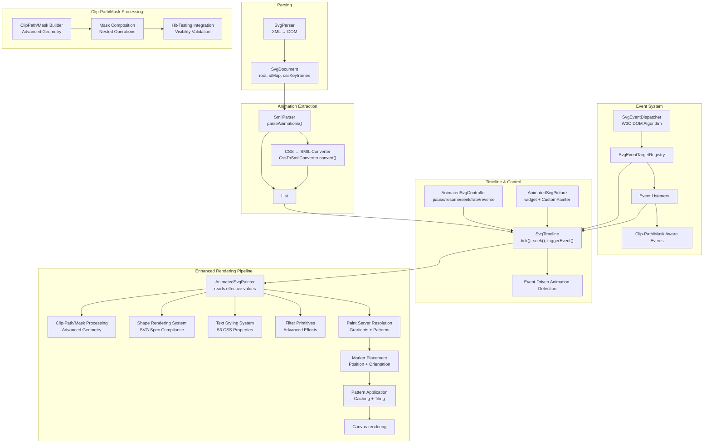

**Diagram sources**
- [lib/src/animation/smil/smil_parser.dart:17-37](file://lib/src/animation/smil/smil_parser.dart#L17-L37)
- [lib/src/animation/css_to_smil_converter.dart:17-66](file://lib/src/animation/css_to_smil_converter.dart#L17-L66)
- [lib/src/animation/smil/smil_timeline.dart:138-158](file://lib/src/animation/smil/smil_timeline.dart#L138-L158)
- [lib/src/animation/svg_event_dispatcher.dart:141-375](file://lib/src/animation/svg_event_dispatcher.dart#L141-L375)
- [lib/src/animation/animated_svg_controller.dart:25-131](file://lib/src/animation/animated_svg_controller.dart#L25-L131)
- [lib/src/animation/animated_svg_picture.dart:108-164](file://lib/src/animation/animated_svg_picture.dart#L108-L164)
- [lib/src/animation/svg_dom.dart:266-317](file://lib/src/animation/svg_dom.dart#L266-L317)
- [lib/src/animation/animated_svg_painter_clip_mask.dart:11-68](file://lib/src/animation/animated_svg_painter_clip_mask.dart#L11-L68)
- [lib/src/animation/animated_svg_painter_clip_mask_composition.dart:17-84](file://lib/src/animation/animated_svg_painter_clip_mask_composition.dart#L17-L84)

**Section sources**
- [ARCHITECTURE.md:6-58](file://ARCHITECTURE.md#L6-L58)
- [lib/src/animation.dart:21-31](file://lib/src/animation.dart#L21-L31)

## Core Components
- AnimatedSvgPicture: The public widget that loads and renders animated SVGs, integrates with AnimationController/Ticker, and exposes playback controls and tracing.
- AnimatedSvgController: A ChangeNotifier-based controller enabling programmatic control of playback (pause/resume, seek, playback rate, direction).
- SvgTimeline: Manages global time, resolves timing conditions (including syncbase and event-based), and updates all animations with event-driven capabilities.
- SmilAnimation: Encapsulates SMIL animation semantics (types, calc modes, fill modes, additive/accumulate behavior, values/keyframes).
- SmilParser: Extracts SMIL animations from DOM and converts CSS animations to SMIL equivalents.
- Interpolators: Provides type-aware interpolation for numbers, colors, transforms, paths, and lists.
- MotionPath: Computes positions and angles along SVG paths for animateMotion with keyPoints support.
- SvgDom: Defines the DOM model with AnimatableSvgAttribute and SvgNode for attribute mutation and tree traversal.
- **SvgEventDispatcher**: Implements W3C DOM event dispatch algorithm with proper event bubbling, capturing, shadow DOM retargeting, and clip-path/mask-aware event handling.
- **SvgEvent**: W3C DOM-compliant event model with event phases, propagation control, retargeting support, and clip-path/mask integration.
- **SvgEventTargetRegistry**: Manages event listeners per element with capture/bubble phase support and advanced event registration.
- **Enhanced Clip-Path/Mask Processing**: Comprehensive clip-path and mask processing with nested support, objectBoundingBox units, and advanced geometry building.
- **Advanced Hit-Testing System**: Sophisticated hit-testing with per-character text detection, textPath support, foreignObject viewport validation, and clip-path/mask integration.
- **Conic Gradient Support**: Advanced conic gradient processing with proper alpha blending and luminance masking capabilities.
- **Enhanced CSS Transform Processing**: Advanced transform function parsing with calc() expression support and normalization.
- **Event-Driven Animation System**: Sophisticated timing condition management supporting event-based animation activation with clip-path/mask awareness.

**Section sources**
- [lib/src/animation/animated_svg_picture.dart:108-164](file://lib/src/animation/animated_svg_picture.dart#L108-L164)
- [lib/src/animation/animated_svg_controller.dart:25-131](file://lib/src/animation/animated_svg_controller.dart#L25-L131)
- [lib/src/animation/smil/smil_timeline.dart:20-67](file://lib/src/animation/smil/smil_timeline.dart#L20-L67)
- [lib/src/animation/smil/smil_animation.dart:80-131](file://lib/src/animation/smil/smil_animation.dart#L80-L131)
- [lib/src/animation/smil/smil_parser.dart:17-37](file://lib/src/animation/smil/smil_parser.dart#L17-L37)
- [lib/src/animation/smil/interpolators.dart:14-42](file://lib/src/animation/smil/interpolators.dart#L14-L42)
- [lib/src/animation/smil/motion_path.dart:22-52](file://lib/src/animation/smil/motion_path.dart#L22-L52)
- [lib/src/animation/svg_dom.dart:124-161](file://lib/src/animation/svg_dom.dart#L124-L161)
- [lib/src/animation/svg_event_dispatcher.dart:141-375](file://lib/src/animation/svg_event_dispatcher.dart#L141-L375)
- [lib/src/animation/svg_event.dart:26-178](file://lib/src/animation/svg_event.dart#L26-L178)
- [lib/src/animation/animated_svg_painter_clip_mask.dart:11-68](file://lib/src/animation/animated_svg_painter_clip_mask.dart#L11-L68)
- [lib/src/animation/animated_svg_painter_clip_mask_composition.dart:17-84](file://lib/src/animation/animated_svg_painter_clip_mask_composition.dart#L17-L84)
- [lib/src/animation/animated_svg_picture_hit_test_visibility.dart:6-36](file://lib/src/animation/animated_svg_picture_hit_test_visibility.dart#L6-L36)

## Architecture Overview
The animated pipeline follows a clear separation of concerns with comprehensive W3C DOM event model support, advanced clip-path/mask processing, sophisticated hit-testing integration, and enhanced event-driven animation capabilities:
- Parsing: XML → DOM preserved for runtime mutation and SMIL discovery.
- Extraction: SMIL and CSS animations parsed into typed SmilAnimation instances with enhanced transform handling.
- Event System: W3C DOM-compliant event dispatch with proper bubbling, capturing, shadow DOM retargeting, and clip-path/mask-aware event handling.
- Clip-Path/Mask Processing: Advanced geometry building with nested support, objectBoundingBox units, and composition chain handling.
- Timeline: Global time management with begin/end conditions, repeat counts, event-driven activation, dependency tracking, and clip-path/mask integration.
- Rendering: CustomPainter reads effective attribute values and draws the scene with enhanced shape validation, filter support, and comprehensive hit-testing integration.

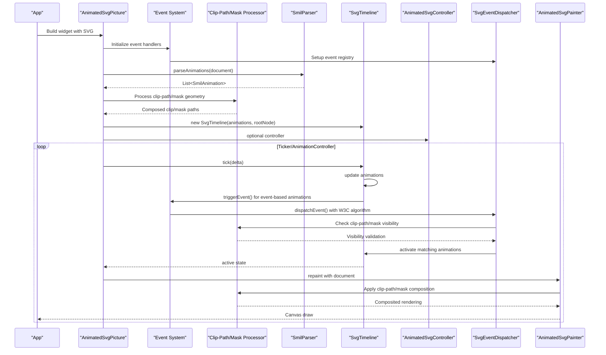

**Diagram sources**
- [lib/src/animation/smil/smil_parser.dart:17-37](file://lib/src/animation/smil/smil_parser.dart#L17-L37)
- [lib/src/animation/smil/smil_timeline.dart:138-158](file://lib/src/animation/smil/smil_timeline.dart#L138-L158)
- [lib/src/animation/svg_event_dispatcher.dart:218-315](file://lib/src/animation/svg_event_dispatcher.dart#L218-L315)
- [lib/src/animation/animated_svg_picture.dart:166-220](file://lib/src/animation/animated_svg_picture.dart#L166-L220)
- [lib/src/animation/animated_svg_controller.dart:25-131](file://lib/src/animation/animated_svg_controller.dart#L25-L131)
- [lib/src/animation/animated_svg_painter_clip_mask_composition.dart:17-84](file://lib/src/animation/animated_svg_painter_clip_mask_composition.dart#L17-L84)

**Section sources**
- [ARCHITECTURE.md:146-154](file://ARCHITECTURE.md#L146-L154)

## Detailed Component Analysis

### AnimatedSvgPicture Widget
- Purpose: Loads and renders animated SVGs, integrates with Flutter's Ticker/AnimationController, and exposes playback controls.
- Key behaviors:
  - Detects presence of animations and wraps with gesture detectors for event-based triggers.
  - Supports autoPlay, initialTime, playbackRate, and controller injection.
  - Exposes play(), pause(), reset(), seekTo().
  - Emits structured trace events via onTrace with configurable frame tick verbosity.
  - **Enhanced**: Integrates comprehensive event system with W3C DOM compliance and clip-path/mask-aware hit-testing.
- Lifecycle:
  - Initializes DOM, parses animations, constructs timeline, and starts/stops AnimationController based on autoPlay and playbackRate changes.
  - Updates controller listener when widget controller changes.
  - **Enhanced**: Sets up event handlers for tap, hover, pointer, and gesture events with proper event dispatch and clip-path/mask integration.

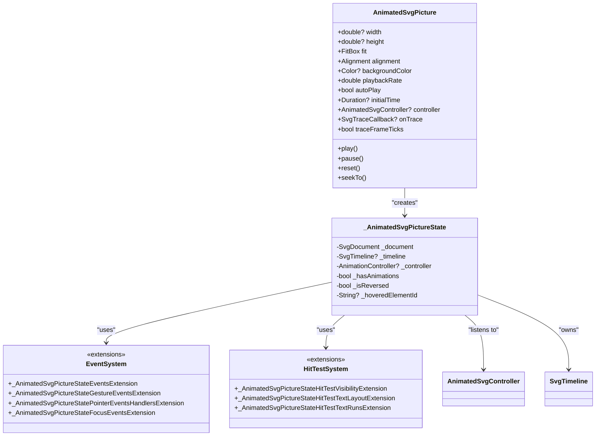

**Diagram sources**
- [lib/src/animation/animated_svg_picture.dart:108-164](file://lib/src/animation/animated_svg_picture.dart#L108-L164)
- [lib/src/animation/animated_svg_picture.dart:166-220](file://lib/src/animation/animated_svg_picture.dart#L166-L220)
- [lib/src/animation/animated_svg_picture_events.dart:3-165](file://lib/src/animation/animated_svg_picture_events.dart#L3-L165)
- [lib/src/animation/animated_svg_picture_hit_test_visibility.dart:6-36](file://lib/src/animation/animated_svg_picture_hit_test_visibility.dart#L6-L36)
- [lib/src/animation/animated_svg_picture_hit_test_text_runs.dart:6-53](file://lib/src/animation/animated_svg_picture_hit_test_text_runs.dart#L6-L53)

**Section sources**
- [lib/src/animation/animated_svg_picture.dart:108-164](file://lib/src/animation/animated_svg_picture.dart#L108-L164)
- [lib/src/animation/animated_svg_picture.dart:166-220](file://lib/src/animation/animated_svg_picture.dart#L166-L220)
- [lib/src/animation/animated_svg_picture_events.dart:3-165](file://lib/src/animation/animated_svg_picture_events.dart#L3-L165)

### AnimatedSvgController
- Purpose: Programmatic control surface for playback.
- Methods:
  - pause(), resume(), togglePlayPause()
  - seek(time), setPlaybackRate(rate), reverse(), forward(), toggleDirection(), restart()
  - Observability: isPaused, playbackRate, isReversed, pendingSeek
- Notes:
  - Validates playbackRate > 0.
  - Notifies listeners on state changes.

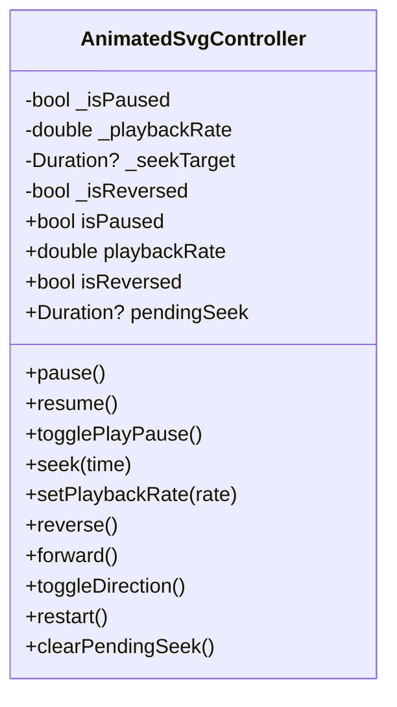

**Diagram sources**
- [lib/src/animation/animated_svg_controller.dart:25-131](file://lib/src/animation/animated_svg_controller.dart#L25-L131)

**Section sources**
- [lib/src/animation/animated_svg_controller.dart:25-131](file://lib/src/animation/animated_svg_controller.dart#L25-L131)

### SvgTimeline
- Purpose: Central time manager for all animations with comprehensive event-driven capabilities.
- Responsibilities:
  - Tick advancement with playbackRate scaling.
  - Seek to absolute time with boundary checks.
  - Reset timeline and dependent state.
  - **Enhanced**: Event-based activation via triggerEvent(elementId?, eventType) with proper timing resolution and clip-path/mask integration.
  - Syncbase timing resolution and begin/end computation.
  - Total duration calculation across animations.
  - **New**: Event listener registration and management for event-driven animations.
  - **New**: Dependency graph building for animation relationships.
- Active state inspection via getActiveAnimations() and hasActiveAnimations().

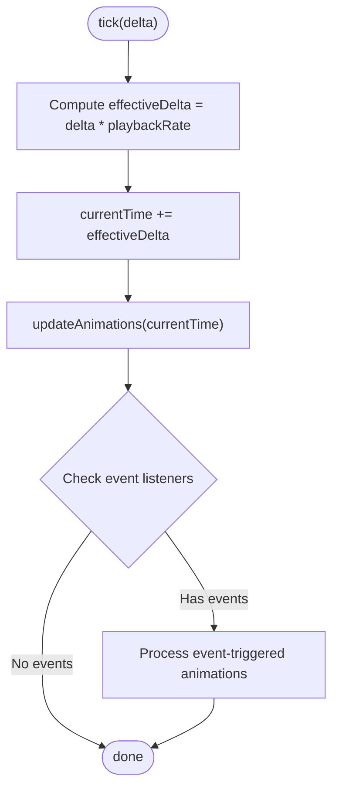

**Diagram sources**
- [lib/src/animation/smil/smil_timeline.dart:173-175](file://lib/src/animation/smil/smil_timeline.dart#L173-L175)
- [lib/src/animation/smil/smil_timeline_runtime.dart:41-70](file://lib/src/animation/smil/smil_timeline_runtime.dart#L41-L70)

**Section sources**
- [lib/src/animation/smil/smil_timeline.dart:20-67](file://lib/src/animation/smil/smil_timeline.dart#L20-L67)
- [lib/src/animation/smil/smil_timeline.dart:138-158](file://lib/src/animation/smil/smil_timeline.dart#L138-L158)
- [lib/src/animation/smil/smil_timeline_runtime.dart:37-70](file://lib/src/animation/smil/smil_timeline_runtime.dart#L37-L70)
- [lib/src/animation/smil/smil_timeline_syncbase.dart:119-161](file://lib/src/animation/smil/smil_timeline_syncbase.dart#L119-L161)

### SmilAnimation
- Purpose: Encapsulates SMIL semantics and value computation.
- Types:
  - animate, animateTransform, animateMotion, set, animateColor
- Modes:
  - calcMode: linear, discrete, paced, spline
  - fillMode: freeze, remove
  - additive: replace, sum
  - playbackDirection: normal, reverse, alternate, alternateReverse
- Key computations:
  - Values-based vs from/to/by vs discrete
  - Paced keyTimes generation via distance metrics
  - Local time and iteration calculation
  - Final value application with accumulate/additive
  - Motion-specific:
  - animateMotion uses MotionPath for position/angle computation.

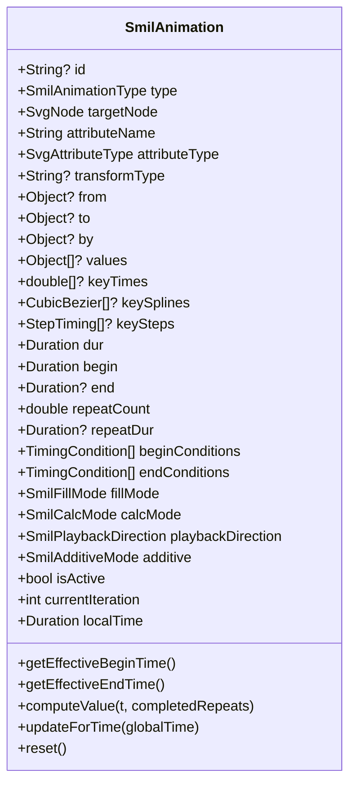

**Diagram sources**
- [lib/src/animation/smil/smil_animation.dart:80-131](file://lib/src/animation/smil/smil_animation.dart#L80-L131)
- [lib/src/animation/smil/smil_animation.dart:325-365](file://lib/src/animation/smil/smil_animation.dart#L325-L365)
- [lib/src/animation/smil/smil_animation.dart:367-431](file://lib/src/animation/smil/smil_animation.dart#L367-L431)

**Section sources**
- [lib/src/animation/smil/smil_animation.dart:13-29](file://lib/src/animation/smil/smil_animation.dart#L13-L29)
- [lib/src/animation/smil/smil_animation.dart:31-44](file://lib/src/animation/smil/smil_animation.dart#L31-L44)
- [lib/src/animation/smil/smil_animation.dart:79-131](file://lib/src/animation/smil/smil_animation.dart#L79-L131)
- [lib/src/animation/smil/smil_animation.dart:325-431](file://lib/src/animation/smil/smil_animation.dart#L325-L431)

### SmilParser and CSS-to-SMIL Conversion
- SmilParser:
  - Extracts SMIL animations from DOM nodes and CSS keyframes/style attributes.
  - Delegates CSS extraction and selector-based rules.
- CssToSmilConverter:
  - Converts CSS @keyframes and animation properties into typed SmilAnimation instances.
  - **Enhanced**: Handles compound transform decomposition for SVG transform normalization.
  - **New**: Advanced transform function parsing with calc() expression support.
  - Infers attribute types and maps CSS properties to SMIL-equivalent attributes.

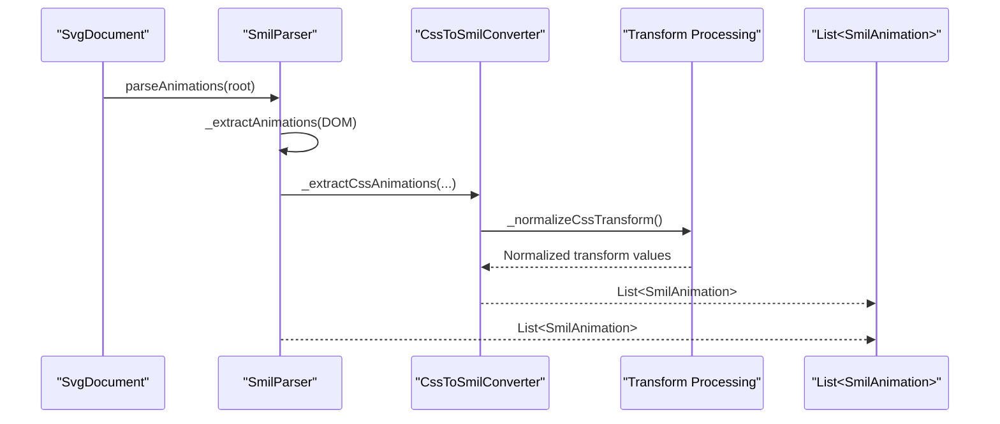

**Diagram sources**
- [lib/src/animation/smil/smil_parser.dart:17-37](file://lib/src/animation/smil/smil_parser.dart#L17-L37)
- [lib/src/animation/css_to_smil_converter.dart:17-66](file://lib/src/animation/css_to_smil_converter.dart#L17-L66)
- [lib/src/animation/css_to_smil_converter_transforms.dart:3-5](file://lib/src/animation/css_to_smil_converter_transforms.dart#L3-L5)

**Section sources**
- [lib/src/animation/smil/smil_parser.dart:17-37](file://lib/src/animation/smil/smil_parser.dart#L17-L37)
- [lib/src/animation/css_to_smil_converter.dart:17-66](file://lib/src/animation/css_to_smil_converter.dart#L17-L66)
- [lib/src/animation/css_to_smil_converter_transforms.dart:3-5](file://lib/src/animation/css_to_smil_converter_transforms.dart#L3-L5)

### Interpolators and MotionPath
- Interpolators:
  - Type-aware interpolation for numbers, colors, transforms, paths, and lists.
  - Additive arithmetic for numeric and list types.
- MotionPath:
  - Parses SVG path data and computes position/angle along the path.
  - Supports keyPoints with optional keyTimes for variable-speed motion.

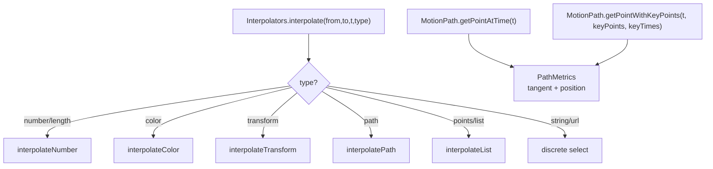

**Diagram sources**
- [lib/src/animation/smil/interpolators.dart:18-42](file://lib/src/animation/smil/interpolators.dart#L18-L42)
- [lib/src/animation/smil/motion_path.dart:97-145](file://lib/src/animation/smil/motion_path.dart#L97-L145)
- [lib/src/animation/smil/motion_path.dart:147-217](file://lib/src/animation/smil/motion_path.dart#L147-L217)

**Section sources**
- [lib/src/animation/smil/interpolators.dart:14-42](file://lib/src/animation/smil/interpolators.dart#L14-L42)
- [lib/src/animation/smil/interpolators.dart:118-146](file://lib/src/animation/smil/interpolators.dart#L118-L146)
- [lib/src/animation/smil/motion_path.dart:22-52](file://lib/src/animation/smil/motion_path.dart#L22-L52)
- [lib/src/animation/smil/motion_path.dart:97-145](file://lib/src/animation/smil/motion_path.dart#L97-L145)
- [lib/src/animation/smil/motion_path.dart:147-217](file://lib/src/animation/smil/motion_path.dart#L147-L217)

### DOM Model and Effective Values
- SvgNode holds AnimatableSvgAttribute entries with baseValue and animatedValue.
- Effective value selection prefers animatedValue when an animation is active.
- Tree-level flags (hasAnimations, cachedPicture) enable subtree caching and dirty tracking.

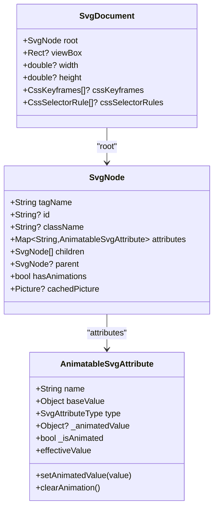

**Diagram sources**
- [lib/src/animation/svg_dom.dart:124-161](file://lib/src/animation/svg_dom.dart#L124-L161)
- [lib/src/animation/svg_dom.dart:266-317](file://lib/src/animation/svg_dom.dart#L266-L317)

**Section sources**
- [lib/src/animation/svg_dom.dart:124-161](file://lib/src/animation/svg_dom.dart#L124-L161)
- [lib/src/animation/svg_dom.dart:266-317](file://lib/src/animation/svg_dom.dart#L266-L317)

## Enhanced Clip-Path and Mask Processing

The enhanced clip-path and mask processing system provides comprehensive support for advanced SVG clipping and masking operations with sophisticated geometry building and composition handling.

### Advanced Clip-Path Processing
Sophisticated clip-path processing with nested support and objectBoundingBox units:

- **Nested ClipPath Support**: Handles clipPath elements that reference other clipPath elements, preventing infinite recursion with depth limiting.
- **ObjectBoundingBox Units**: Properly handles clipPathUnits="objectBoundingBox" with safe dimension checking and transformation matrices.
- **Transform Integration**: Applies individual child transforms within clipPath elements and handles use element transformations.
- **Geometry Building**: Constructs complex clip paths from multiple child elements with proper path combination.

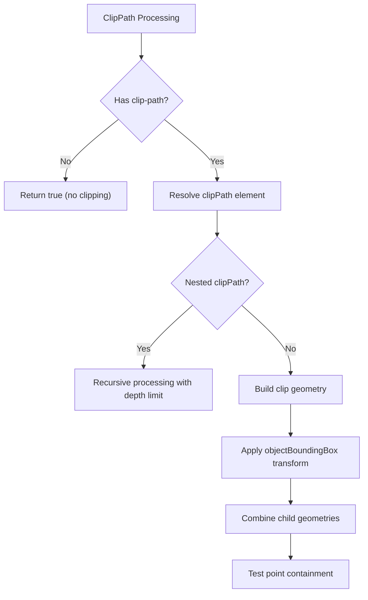

**Diagram sources**
- [lib/src/animation/animated_svg_painter_clip_mask.dart:11-68](file://lib/src/animation/animated_svg_painter_clip_mask.dart#L11-L68)
- [lib/src/animation/animated_svg_painter_clip_mask_geometry.dart:3-91](file://lib/src/animation/animated_svg_painter_clip_mask_geometry.dart#L3-L91)
- [lib/src/animation/animated_svg_painter_clip_mask_units.dart:3-87](file://lib/src/animation/animated_svg_painter_clip_mask_units.dart#L3-L87)

### Advanced Mask Processing
Comprehensive mask processing with multiple mask support and advanced composition:

- **Multiple Mask Support**: Handles multiple mask references in a single mask property with sequential application.
- **Luminance Masking**: Supports both alpha and luminance mask types with proper color matrix conversion.
- **Nested Mask Support**: Processes masks that reference other masks with proper recursion handling.
- **Advanced Composition**: Sequential mask application using saveLayer operations for proper compositing.
- **Visibility Validation**: Excludes elements with no visible paint contribution to optimize performance.

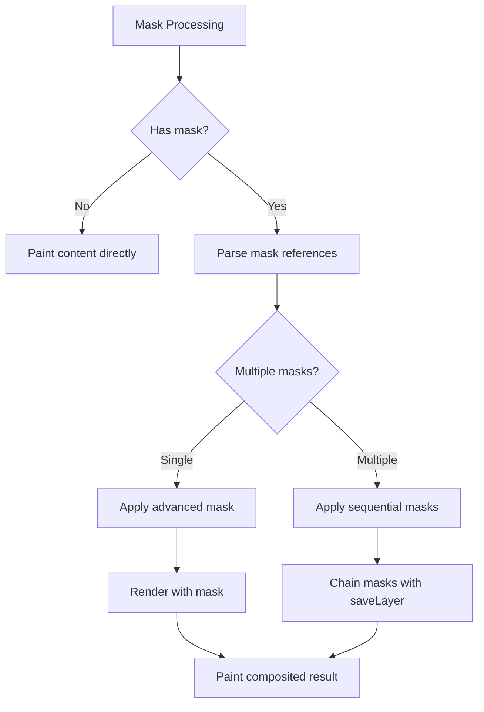

**Diagram sources**
- [lib/src/animation/animated_svg_painter_clip_mask_advanced.dart:8-84](file://lib/src/animation/animated_svg_painter_clip_mask_advanced.dart#L8-L84)
- [lib/src/animation/animated_svg_painter_clip_mask_advanced.dart:86-244](file://lib/src/animation/animated_svg_painter_clip_mask_advanced.dart#L86-L244)
- [lib/src/animation/animated_svg_painter_clip_mask_composition.dart:17-84](file://lib/src/animation/animated_svg_painter_clip_mask_composition.dart#L17-L84)

### Composition Chain Support
Advanced composition chain handling for nested clip-path and mask operations:

- **Order of Operations**: clip-path → mask → content painting with proper nesting support.
- **Group Inheritance**: Masks on group elements affect all children with proper inheritance.
- **Nested Compositions**: Handles complex nested scenarios like clip-path inside mask and vice versa.
- **Bounds Computation**: Calculates effective bounds for nested mask operations and clip-path intersections.

**Section sources**
- [lib/src/animation/animated_svg_painter_clip_mask_composition.dart:17-84](file://lib/src/animation/animated_svg_painter_clip_mask_composition.dart#L17-L84)
- [lib/src/animation/animated_svg_painter_clip_mask_composition.dart:153-193](file://lib/src/animation/animated_svg_painter_clip_mask_composition.dart#L153-L193)
- [lib/src/animation/animated_svg_painter_clip_mask_composition.dart:425-465](file://lib/src/animation/animated_svg_painter_clip_mask_composition.dart#L425-L465)

## Advanced Hit-Testing System

The advanced hit-testing system provides comprehensive event handling with sophisticated text processing, clip-path/mask integration, and foreignObject viewport validation.

### Visibility Validation System
Sophisticated visibility checking with clip-path/mask integration:

- **Clip-Path Validation**: Tests points against clip-path geometry with nested support and objectBoundingBox units.
- **Mask Validation**: Validates points against mask geometry considering mask type (alpha/luminance) and content units.
- **ForeignObject Validation**: Checks foreignObject viewport boundaries and overflow handling.
- **Recursion Protection**: Prevents infinite recursion in nested clip-path/mask references with depth limiting.

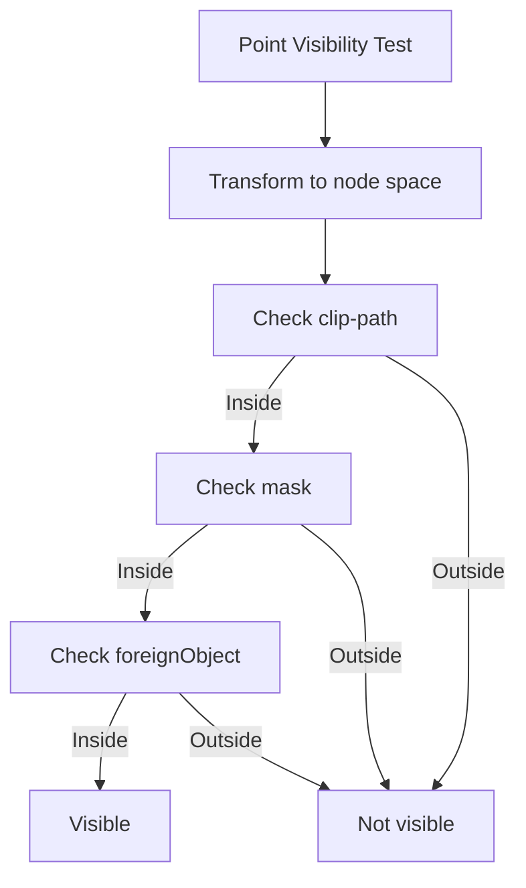

**Diagram sources**
- [lib/src/animation/animated_svg_picture_hit_test_visibility.dart:8-36](file://lib/src/animation/animated_svg_picture_hit_test_visibility.dart#L8-L36)
- [lib/src/animation/animated_svg_picture_hit_test_visibility.dart:41-91](file://lib/src/animation/animated_svg_picture_hit_test_visibility.dart#L41-L91)
- [lib/src/animation/animated_svg_picture_hit_test_visibility.dart:201-259](file://lib/src/animation/animated_svg_picture_hit_test_visibility.dart#L201-L259)

### Text Hit-Testing System
Comprehensive text hit-testing with per-character precision:

- **Per-Character Hit-Testing**: Individual character-level hit detection for precise text interaction.
- **TextPath Support**: Path-based text hit-testing with glyph-level precision.
- **Writing Mode Support**: Handles horizontal and vertical writing modes with proper orientation.
- **Text Anchor Handling**: Proper text-anchor positioning for hit-testing calculations.
- **Stroke and Fill Detection**: Supports both fill and stroke hit-testing with tolerance-based detection.

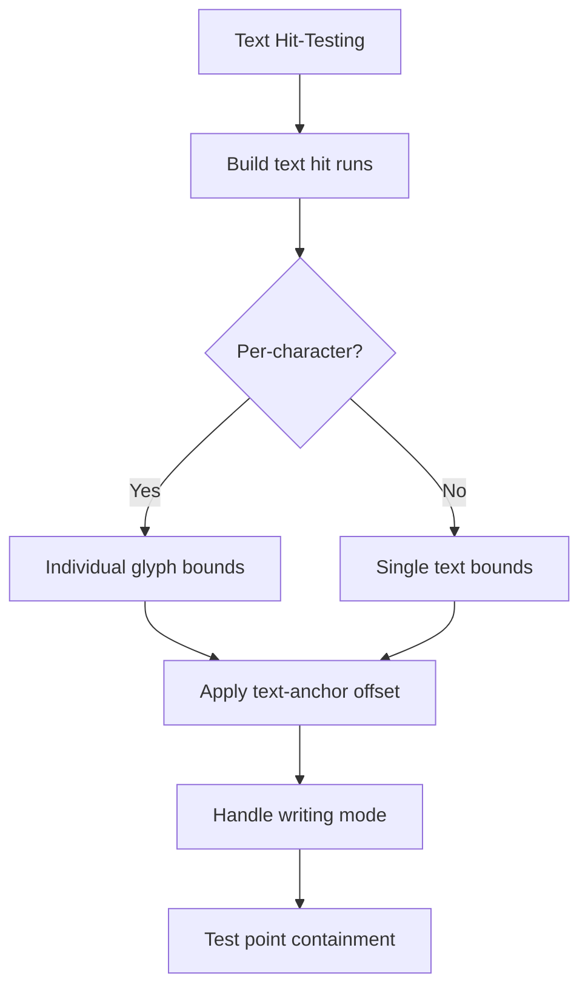

**Diagram sources**
- [lib/src/animation/animated_svg_picture_hit_test_text_runs.dart:8-53](file://lib/src/animation/animated_svg_picture_hit_test_text_runs.dart#L8-L53)
- [lib/src/animation/animated_svg_picture_hit_test_text_runs.dart:171-195](file://lib/src/animation/animated_svg_picture_hit_test_text_runs.dart#L171-L195)
- [lib/src/animation/animated_svg_picture_hit_test_text_runs.dart:324-463](file://lib/src/animation/animated_svg_picture_hit_test_text_runs.dart#L324-L463)

### ForeignObject Viewport Validation
Advanced foreignObject handling with overflow and extension validation:

- **Required Extensions**: Checks requiredExtensions attribute and prevents rendering when extensions are not supported.
- **Viewport Bounds**: Validates foreignObject bounds against x, y, width, height attributes.
- **Overflow Handling**: Respects overflow attribute with default hidden behavior.
- **Boundary Checking**: Ensures points fall within foreignObject boundaries for proper hit-testing.

**Section sources**
- [lib/src/animation/animated_svg_picture_hit_test_visibility.dart:561-589](file://lib/src/animation/animated_svg_picture_hit_test_visibility.dart#L561-L589)
- [lib/src/animation/animated_svg_picture_hit_test_text_layout.dart:1-252](file://lib/src/animation/animated_svg_picture_hit_test_text_layout.dart#L1-L252)
- [lib/src/animation/animated_svg_picture_hit_test_text_runs.dart:1-619](file://lib/src/animation/animated_svg_picture_hit_test_text_runs.dart#L1-L619)

## Conic Gradient and Advanced Composition

The conic gradient and advanced composition system provides sophisticated gradient processing with proper alpha blending and complex composition handling.

### Conic Gradient Processing
Advanced conic gradient support with proper alpha handling:

- **Conic Gradient Geometry**: Builds conic gradient paths with proper radial geometry and angle calculations.
- **Alpha Blending**: Handles alpha channel blending for conic gradients with proper color space conversion.
- **Luminance Masking**: Supports luminance-based masking for conic gradients with color matrix conversion.
- **Gradient Composition**: Integrates conic gradients with other paint servers and composition operations.

### Advanced Composition Operations
Sophisticated composition handling for complex SVG operations:

- **SaveLayer Management**: Proper saveLayer usage for complex composition chains with mask and clip-path combinations.
- **Blend Mode Support**: Advanced blend mode handling for mask composition and gradient blending.
- **Color Matrix Processing**: Sophisticated color matrix operations for luminance conversion and alpha blending.
- **Performance Optimization**: Efficient composition with minimal saveLayer overhead and optimized path operations.

**Section sources**
- [lib/src/animation/animated_svg_painter_clip_mask_advanced.dart:246-266](file://lib/src/animation/animated_svg_painter_clip_mask_advanced.dart#L246-L266)
- [lib/src/animation/animated_svg_painter_clip_mask_advanced.dart:422-474](file://lib/src/animation/animated_svg_painter_clip_mask_advanced.dart#L422-L474)

## Sophisticated Event Handling System

The sophisticated event handling system provides comprehensive W3C DOM compliance with advanced clip-path/mask integration and sophisticated pointer event management.

### Event System Architecture
The event system provides complete W3C DOM compliance with sophisticated event dispatch algorithms and clip-path/mask-aware event handling:

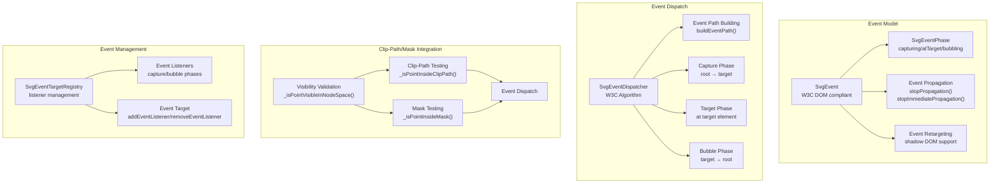

**Diagram sources**
- [lib/src/animation/svg_event.dart:26-178](file://lib/src/animation/svg_event.dart#L26-L178)
- [lib/src/animation/svg_event_dispatcher.dart:141-375](file://lib/src/animation/svg_event_dispatcher.dart#L141-L375)
- [lib/src/animation/svg_event_dispatcher.dart:121-138](file://lib/src/animation/svg_event_dispatcher.dart#L121-L138)
- [lib/src/animation/animated_svg_picture_hit_test_visibility.dart:21-36](file://lib/src/animation/animated_svg_picture_hit_test_visibility.dart#L21-L36)

### Event Phases and Propagation
The system implements all three W3C DOM event phases with proper propagation control and clip-path/mask integration:

- **Capturing Phase**: Event travels from root to target (excluding target) with visibility validation
- **At Target Phase**: Event is processed at the target element with clip-path/mask intersection testing
- **Bubbling Phase**: Event bubbles back from target to root (if bubbles) with proper event filtering

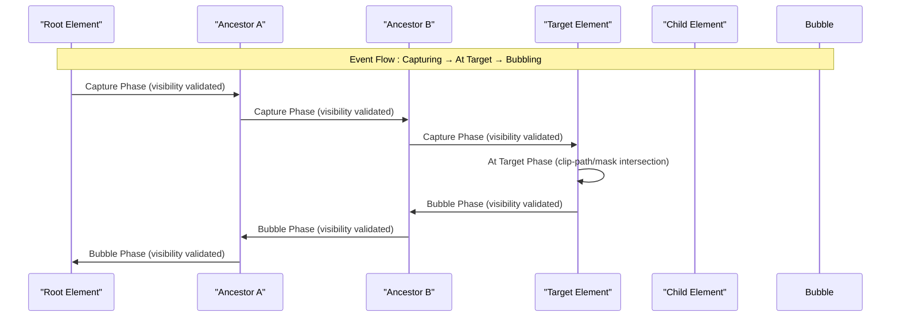

**Diagram sources**
- [lib/src/animation/svg_event_dispatcher.dart:254-308](file://lib/src/animation/svg_event_dispatcher.dart#L254-L308)
- [lib/src/animation/svg_event.dart:12-24](file://lib/src/animation/svg_event.dart#L12-L24)

### Event Listener Management
Sophisticated event listener registration and management with capture/bubble phase support and clip-path/mask awareness:

- **addEventListener(type, listener, {capture, once, passive})**: Register listeners with phase control and visibility validation
- **removeEventListener(type, listener, {capture})**: Remove specific listeners with proper cleanup
- **Listener Entry**: Includes type, capture flag, once flag, passive flag, and visibility requirements
- **Event Target Registry**: Maps element IDs to event targets with listener collections and clip-path/mask integration
- **Visibility-Aware Events**: Events are only dispatched to elements that pass clip-path/mask visibility tests

**Section sources**
- [lib/src/animation/svg_event_dispatcher.dart:36-118](file://lib/src/animation/svg_event_dispatcher.dart#L36-L118)
- [lib/src/animation/svg_event_dispatcher.dart:121-138](file://lib/src/animation/svg_event_dispatcher.dart#L121-L138)
- [lib/src/animation/svg_event.dart:351-390](file://lib/src/animation/svg_event.dart#L351-L390)

## W3C DOM Event Model Implementation

The animated SVG system now implements a comprehensive W3C DOM event model with full compliance to DOM event specifications including proper event bubbling, capturing, shadow DOM retargeting, and clip-path/mask-aware event handling.

### Event System Architecture
The event system provides complete W3C DOM compliance with sophisticated event dispatch algorithms and advanced integration:

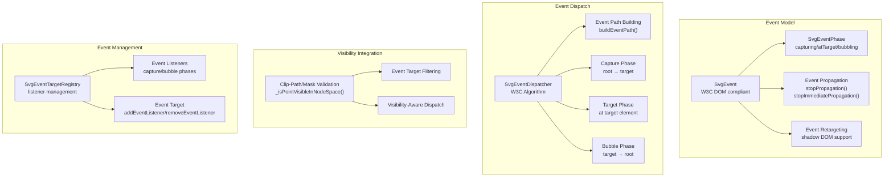

**Diagram sources**
- [lib/src/animation/svg_event.dart:26-178](file://lib/src/animation/svg_event.dart#L26-L178)
- [lib/src/animation/svg_event_dispatcher.dart:141-375](file://lib/src/animation/svg_event_dispatcher.dart#L141-L375)
- [lib/src/animation/svg_event_dispatcher.dart:121-138](file://lib/src/animation/svg_event_dispatcher.dart#L121-L138)
- [lib/src/animation/animated_svg_picture_hit_test_visibility.dart:21-36](file://lib/src/animation/animated_svg_picture_hit_test_visibility.dart#L21-L36)

### Event Phases and Propagation
The system implements all three W3C DOM event phases with proper propagation control and clip-path/mask integration:

- **Capturing Phase**: Event travels from root to target (excluding target) with visibility validation
- **At Target Phase**: Event is processed at the target element with clip-path/mask intersection testing
- **Bubbling Phase**: Event bubbles back from target to root (if bubbles) with proper event filtering


**Diagram sources**
- [lib/src/animation/svg_event_dispatcher.dart:254-308](file://lib/src/animation/svg_event_dispatcher.dart#L254-L308)
- [lib/src/animation/svg_event.dart:12-24](file://lib/src/animation/svg_event.dart#L12-L24)

### Event Listener Management
Sophisticated event listener registration and management with capture/bubble phase support and clip-path/mask awareness:

- **addEventListener(type, listener, {capture, once, passive})**: Register listeners with phase control and visibility validation
- **removeEventListener(type, listener, {capture})**: Remove specific listeners with proper cleanup
- **Listener Entry**: Includes type, capture flag, once flag, passive flag, and visibility requirements
- **Event Target Registry**: Maps element IDs to event targets with listener collections and clip-path/mask integration
- **Visibility-Aware Events**: Events are only dispatched to elements that pass clip-path/mask visibility tests

**Section sources**
- [lib/src/animation/svg_event_dispatcher.dart:36-118](file://lib/src/animation/svg_event_dispatcher.dart#L36-L118)
- [lib/src/animation/svg_event_dispatcher.dart:121-138](file://lib/src/animation/svg_event_dispatcher.dart#L121-L138)
- [lib/src/animation/svg_event.dart:351-390](file://lib/src/animation/svg_event.dart#L351-L390)

## Advanced CSS Transform Processing

The CSS transform processing system has been significantly enhanced with advanced transform function parsing, normalization, and calc() expression support.

### Transform Function Parsing
Advanced parsing of CSS transform functions with support for complex expressions:

- **Transform Function Detection**: Regex-based detection of translate, rotate, scale, skew, matrix functions
- **Nested Parentheses Handling**: Proper parsing of nested calc() expressions and function arguments
- **Argument Separation**: Handles comma and space-separated arguments at function level
- **3D Transform Support**: Comprehensive support for translate3d, rotate3d, scale3d, matrix3d

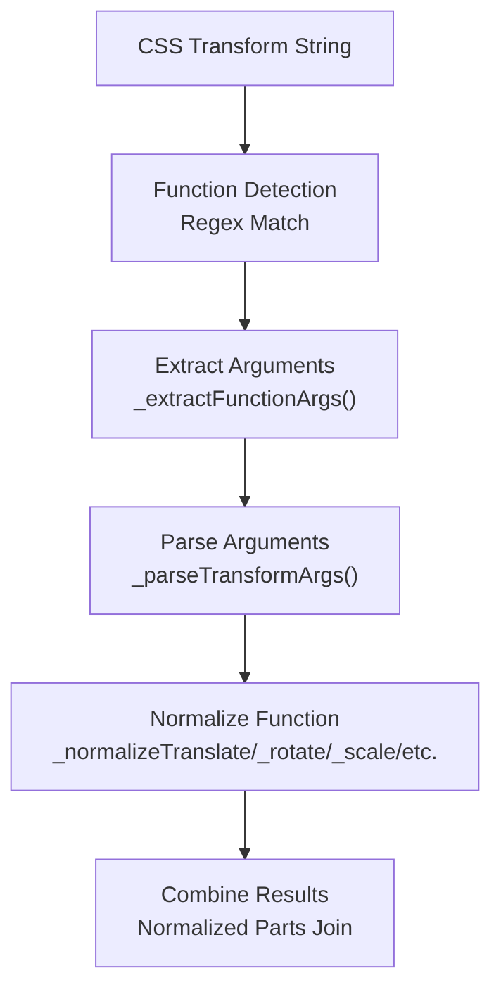

**Diagram sources**
- [lib/src/animation/css_to_smil_converter_transforms_values.dart:3-82](file://lib/src/animation/css_to_smil_converter_transforms_values.dart#L3-L82)
- [lib/src/animation/css_to_smil_converter_transforms_values.dart:25-62](file://lib/src/animation/css_to_smil_converter_transforms_values.dart#L25-L62)

### Calc() Expression Support
Comprehensive calc() expression evaluation with unit conversion:

- **Length Parsing**: Supports px, em, rem, %, vw, vh, vmin, vmax, cm, mm, in, pt, pc
- **Angle Parsing**: Supports deg, rad, turn, grad with automatic conversion
- **Percentage Resolution**: Resolves percentages with container size context
- **Calc Evaluation**: Evaluates complex calc() expressions with proper precedence

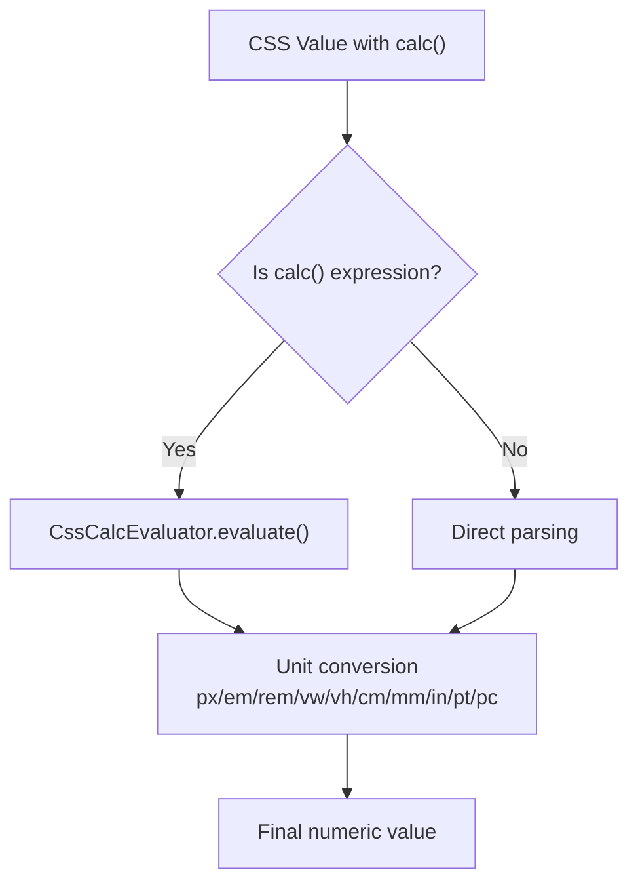

**Diagram sources**
- [lib/src/animation/css_to_smil_converter_transforms_values.dart:213-273](file://lib/src/animation/css_to_smil_converter_transforms_values.dart#L213-L273)
- [lib/src/animation/css_to_smil_converter_transforms_values.dart:276-303](file://lib/src/animation/css_to_smil_converter_transforms_values.dart#L276-L303)

### Transform Normalization Functions
Comprehensive normalization for all transform function types:

- **Translation**: translate(x[, y]), translatex(x), translatey(y)
- **Rotation**: rotate(angle[, cx, cy])
- **Scaling**: scale(x[, y]), scaleX(x), scaleY(y)
- **Skewing**: skewX(angle), skewY(angle)
- **Matrix**: matrix(a, b, c, d, tx, ty)
- **3D Transforms**: translate3d(x, y, z), rotate3d(x, y, z, angle), scale3d(x, y, z), matrix3d(16 values)
- **Perspective**: perspective(length)

**Section sources**
- [lib/src/animation/css_to_smil_converter_transforms_values.dart:64-168](file://lib/src/animation/css_to_smil_converter_transforms_values.dart#L64-L168)
- [lib/src/animation/css_to_smil_converter_transforms_values.dart:170-390](file://lib/src/animation/css_to_smil_converter_transforms_values.dart#L170-L390)

## Enhanced Animation Capabilities

The animation system has been significantly enhanced with sophisticated event-driven capabilities, improved timing condition management, and advanced synchronization features with comprehensive clip-path/mask integration.

### Event-Driven Animation Detection
Sophisticated event-based animation activation with comprehensive event support and clip-path/mask awareness:

- **Event Condition Parsing**: Supports click, mousedown, mouseup, mouseover, mouseout, focus, blur, and SMIL events
- **Target-Specific Events**: Element ID targeting with dot notation (elementId.eventType+offset)
- **Offset Support**: Time offsets (+/-) for delayed event activation
- **Event History Tracking**: Records event occurrence times for proper animation activation
- **Multiple Event Conditions**: OR logic support with semicolon-separated conditions
- **Visibility Integration**: Events only trigger animations on elements that pass clip-path/mask visibility tests

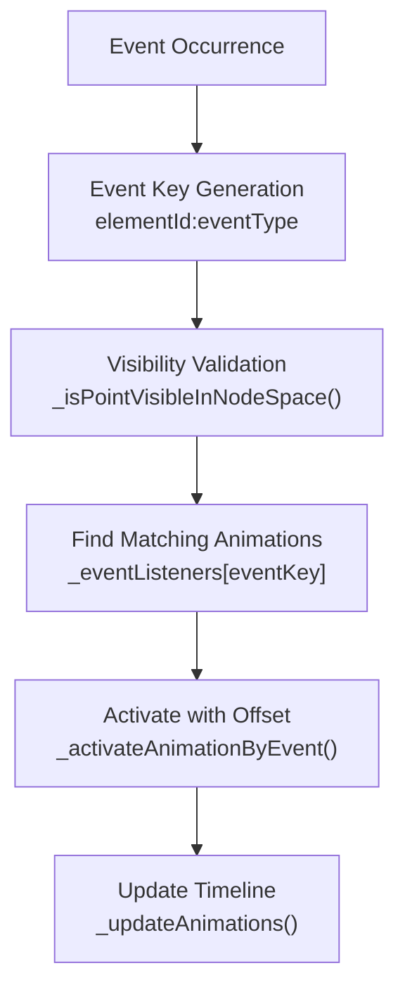

**Diagram sources**
- [lib/src/animation/smil/smil_timeline.dart:138-158](file://lib/src/animation/smil/smil_timeline.dart#L138-L158)
- [lib/src/animation/smil/smil_timeline_runtime.dart:160-167](file://lib/src/animation/smil/smil_timeline_runtime.dart#L160-L167)
- [lib/src/animation/animated_svg_picture_hit_test_visibility.dart:21-36](file://lib/src/animation/animated_svg_picture_hit_test_visibility.dart#L21-L36)

### Advanced Timing Condition Management
Enhanced timing parser supporting complex timing scenarios with clip-path/mask integration:

- **Mixed Conditions**: Combines time-based and event-based conditions
- **Indefinite Timing**: Support for indefinite begin conditions
- **Syncbase Dependencies**: Animation dependency resolution with begin/end/repeat events
- **Repeat Events**: Special repeat(n) event support for nth repeat activation
- **Offset Resolution**: Proper offset calculation for all timing conditions
- **Visibility-Based Timing**: Event conditions that depend on element visibility

```mermaid
flowchart TD
A["Timing String"] --> B["Parse Conditions<br/>TimingParser.parse()"]
B --> C{"Condition Type?"}
C --> |Offset| D["OffsetCondition<br/>_parseOffset()"]
C --> |Event| E["EventCondition<br/>_parseEvent()"]
C --> |Syncbase| F["SyncbaseCondition<br/>_parseSyncbase()"]
C --> |Indefinite| G["IndefiniteCondition"]
D --> H["Timing Resolution"]
E --> I["Visibility-Aware Event<br/>_isPointVisibleInNodeSpace()"]
F --> H
G --> H
I --> H
```

**Diagram sources**
- [lib/src/animation/smil/timing_parser.dart:17-62](file://lib/src/animation/smil/timing_parser.dart#L17-L62)
- [lib/src/animation/smil/timing_parser.dart:144-171](file://lib/src/animation/smil/timing_parser.dart#L144-L171)
- [lib/src/animation/animated_svg_picture_hit_test_visibility.dart:21-36](file://lib/src/animation/animated_svg_picture_hit_test_visibility.dart#L21-L36)

### Animation Dependency Graph
Sophisticated dependency management for complex animation relationships with event integration:

- **Dependency Tracking**: Builds graph of animation dependencies
- **Event-Based Dependencies**: Tracks animations waiting for event conditions
- **Syncbase Dependencies**: Manages begin/end/repeat dependency chains
- **Automatic Activation**: Triggers dependent animations when source animations complete
- **Repeat Event Handling**: Special handling for repeat(n) events
- **Visibility-Based Dependencies**: Dependencies that require element visibility

**Section sources**
- [lib/src/animation/smil/timing_parser.dart:64-91](file://lib/src/animation/smil/timing_parser.dart#L64-L91)
- [lib/src/animation/smil/smil_timeline_syncbase.dart:119-161](file://lib/src/animation/smil/smil_timeline_syncbase.dart#L119-L161)
- [lib/src/animation/smil/smil_timeline_runtime.dart:37-70](file://lib/src/animation/smil/smil_timeline_runtime.dart#L37-L70)

## Event-Driven Animation System

The event-driven animation system provides sophisticated event-based animation activation with comprehensive W3C DOM compliance, clip-path/mask integration, and advanced timing management.

### Event System Integration
Seamless integration between event system and animation timeline with visibility validation:

- **Event Registration**: Animations register for specific events during timeline construction
- **Event Triggering**: Manual and automatic event triggering through timeline interface with visibility checks
- **Event History**: Tracks event occurrence times for proper animation activation
- **Event-Based Animations**: Animations with only event-based begin conditions are held until triggered
- **Event Listener Management**: Sophisticated listener registration and cleanup with clip-path/mask awareness
- **Visibility Integration**: Events only trigger animations on elements that pass clip-path/mask visibility tests

```mermaid
sequenceDiagram
participant User as "User Interaction"
participant Widget as "AnimatedSvgPicture"
participant Timeline as "SvgTimeline"
participant Anim as "SmilAnimation"
participant EventSys as "Event System"
participant Visibility as "Visibility Validator"
User->>Widget : Tap/Mouse/Pointer Event
Widget->>EventSys : _dispatchEventWithBubbling()
EventSys->>Visibility : _isPointVisibleInNodeSpace()
Visibility-->>EventSys : Visibility result
EventSys->>Timeline : triggerEvent(elementId, eventType)
Timeline->>Timeline : _eventListeners[eventKey]
Timeline->>Anim : Activate with offset
Anim->>Anim : updateForTime(currentTime)
Anim-->>Timeline : isActive = true
Timeline-->>Widget : Animation activated
```

**Diagram sources**
- [lib/src/animation/animated_svg_picture_events.dart:49-69](file://lib/src/animation/animated_svg_picture_events.dart#L49-L69)
- [lib/src/animation/smil/smil_timeline.dart:138-158](file://lib/src/animation/smil/smil_timeline.dart#L138-L158)
- [lib/src/animation/animated_svg_picture_hit_test_visibility.dart:21-36](file://lib/src/animation/animated_svg_picture_hit_test_visibility.dart#L21-L36)

### Event Types and Support
Comprehensive event type support following W3C DOM specifications with clip-path/mask integration:

- **Mouse Events**: click, mousedown, mouseup, mouseover, mouseout, mousemove with visibility validation
- **Pointer Events**: pointerdown, pointermove, pointerup, pointercancel with touch and pen support
- **Focus Events**: focusin, focusout, focus, blur with proper focus management
- **Gesture Events**: longpress, panstart, panupdate, panend with gesture recognition
- **SMIL Events**: beginEvent, endEvent, repeatEvent with animation lifecycle integration
- **Non-Bubbling Events**: mouseenter, mouseleave (handled specially) with visibility consideration
- **Visibility-Aware Events**: Events that depend on element visibility through clip-path/mask

**Section sources**
- [lib/src/animation/animated_svg_picture_events.dart:49-165](file://lib/src/animation/animated_svg_picture_events.dart#L49-L165)
- [lib/src/animation/smil/timing_parser.dart:72-91](file://lib/src/animation/smil/timing_parser.dart#L72-L91)

## Timing Parser and Condition Management

The timing parser provides sophisticated parsing and management of SMIL timing conditions with comprehensive event and syncbase support, including visibility-based timing conditions.

### Timing Condition Types
Multiple timing condition types supported with proper parsing and visibility integration:

- **Offset Conditions**: Direct time offsets (e.g., "2s", "500ms")
- **Event Conditions**: Event-based activation with visibility validation (e.g., "click", "button.click+250ms")
- **Syncbase Conditions**: Animation dependency (e.g., "anim1.begin+1s", "anim2.end")
- **Indefinite Conditions**: "indefinite" for manual activation only
- **Repeat Conditions**: "anim.repeat(2)" for nth repeat activation
- **Visibility-Based Conditions**: Conditions that depend on element visibility through clip-path/mask

```mermaid
flowchart TD
A["Timing Attribute Value"] --> B["Split by ';'"]
B --> C["Parse Each Condition"]
C --> D{"Condition Type?"}
D --> |Offset| E["OffsetCondition"]
D --> |Event| F["EventCondition<br/>targetId.eventType+offset<br/>with visibility validation"]
D --> |Syncbase| G["SyncbaseCondition<br/>id.begin/end/repeat+offset"]
D --> |Indefinite| H["IndefiniteCondition"]
E --> I["Timing Resolution"]
F --> J["Visibility-Aware Event<br/>_isPointVisibleInNodeSpace()"]
G --> I
H --> I
J --> I
```

**Diagram sources**
- [lib/src/animation/smil/timing_parser.dart:17-62](file://lib/src/animation/smil/timing_parser.dart#L17-L62)
- [lib/src/animation/smil/timing_parser.dart:144-171](file://lib/src/animation/smil/timing_parser.dart#L144-L171)
- [lib/src/animation/animated_svg_picture_hit_test_visibility.dart:21-36](file://lib/src/animation/animated_svg_picture_hit_test_visibility.dart#L21-L36)

### Event Condition Parsing
Advanced event condition parsing with comprehensive support and visibility integration:

- **Target-Specific Events**: Element ID targeting with dot notation
- **Offset Support**: Positive and negative time offsets
- **Event Name Validation**: Only valid DOM event names accepted
- **Multiple Event Types**: Support for multiple event types in single condition
- **Complex Expressions**: Combined with time-based conditions
- **Visibility Integration**: Event conditions that depend on element visibility

**Section sources**
- [lib/src/animation/smil/timing_parser.dart:64-91](file://lib/src/animation/smil/timing_parser.dart#L64-L91)
- [lib/src/animation/smil/timing_parser.dart:144-171](file://lib/src/animation/smil/timing_parser.dart#L144-L171)

## CSS Transform Normalization

The CSS transform normalization system provides comprehensive transform function parsing and normalization with advanced calc() expression support.

### Transform Function Normalization
Comprehensive normalization for all CSS transform functions:

- **Translation Normalization**: translate(x[, y]) → translate(x, y)
- **Rotation Normalization**: rotate(angle[, cx, cy]) → degrees
- **Scale Normalization**: scale(x[, y]) → scale(x, y)
- **Skew Normalization**: skewX(angle), skewY(angle)
- **Matrix Normalization**: matrix(a, b, c, d, tx, ty)
- **3D Transform Normalization**: translate3d, rotate3d, scale3d, matrix3d
- **Perspective Normalization**: perspective(length)

```mermaid
flowchart TD
A["Input Transform String"] --> B["Function Detection"]
B --> C["Argument Extraction"]
C --> D["Value Parsing<br/>_parseLength/_parseAngle/_parseNumber"]
D --> E["Unit Conversion"]
E --> F["Normalization<br/>_normalizeTranslate/_rotate/_scale/etc."]
F --> G["Output Normalized String"]
```

**Diagram sources**
- [lib/src/animation/css_to_smil_converter_transforms_values.dart:64-168](file://lib/src/animation/css_to_smil_converter_transforms_values.dart#L64-L168)
- [lib/src/animation/css_to_smil_converter_transforms_values.dart:213-303](file://lib/src/animation/css_to_smil_converter_transforms_values.dart#L213-L303)

### Calc() Expression Evaluation
Advanced calc() expression evaluation with comprehensive unit support:

- **Length Calculation**: Supports all CSS length units with conversion
- **Angle Calculation**: Supports deg, rad, turn, grad with automatic conversion
- **Percentage Resolution**: Resolves percentages with container context
- **Complex Expressions**: Handles nested calc() expressions and mixed units
- **Fallback Values**: Provides sensible fallbacks for invalid expressions

**Section sources**
- [lib/src/animation/css_to_smil_converter_transforms_values.dart:213-303](file://lib/src/animation/css_to_smil_converter_transforms_values.dart#L213-L303)
- [lib/src/animation/css_to_smil_converter_transforms_values.dart:315-324](file://lib/src/animation/css_to_smil_converter_transforms_values.dart#L315-L324)

## Event Dispatch Algorithm

The event dispatch algorithm implements the complete W3C DOM event dispatch specification with proper event bubbling, capturing, shadow DOM retargeting, and clip-path/mask-aware event handling.

### Complete Event Dispatch Flow
Sophisticated event dispatch following W3C DOM specification with visibility validation:

```mermaid
sequenceDiagram
participant Target as "Target Element"
participant Capturing as "Capture Phase"
participant AtTarget as "At Target Phase"
participant Bubbling as "Bubble Phase"
Note over Target,Capturing : Phase 1 : Capture (root → target)
Target->>Capturing : Build event path
Capturing->>Capturing : Set eventPhase = capturing
Capturing->>Capturing : Dispatch to ancestors (excluding target)
Capturing->>AtTarget : Set eventPhase = atTarget
Note over AtTarget,AtTarget : Phase 2 : At Target
AtTarget->>AtTarget : Dispatch to target element
AtTarget->>Bubbling : Set eventPhase = bubbling
Note over Bubbling,Bubbling : Phase 3 : Bubble (target → root)
Bubbling->>Bubbling : Dispatch to ancestors (excluding root)
Bubbling->>Bubbling : Stop if propagation stopped
Bubbling->>Bubbling : Reset event state
```

**Diagram sources**
- [lib/src/animation/svg_event_dispatcher.dart:218-315](file://lib/src/animation/svg_event_dispatcher.dart#L218-L315)

### Shadow DOM Retargeting
Advanced shadow DOM support with proper event retargeting and clip-path/mask integration:

- **Use Element Detection**: Identifies elements inside <use> shadow trees
- **Retargeted Path Building**: Builds proper event paths for shadow DOM with visibility validation
- **Non-Composed Events**: Handles events that don't cross shadow boundaries
- **Composed Events**: Allows events to traverse shadow DOM boundaries with proper visibility checks
- **Shadow Path Inclusion**: Includes shadow elements in composed path with clip-path/mask awareness

**Section sources**
- [lib/src/animation/svg_event_dispatcher.dart:150-200](file://lib/src/animation/svg_event_dispatcher.dart#L150-L200)
- [lib/src/animation/svg_event_dispatcher.dart:202-216](file://lib/src/animation/svg_event_dispatcher.dart#L202-L216)

## Performance Optimizations

The enhanced event system, clip-path/mask processing, and animation capabilities include several performance optimizations while maintaining full W3C DOM compliance and advanced functionality.

### Event System Optimizations
- **Event Registry Caching**: Efficient element ID to event target mapping with visibility validation
- **Listener Management**: Optimized listener registration and removal with phase control
- **Event Path Caching**: Reusable event path construction with caching and visibility checks
- **Phase State Management**: Minimal state tracking during event dispatch with visibility integration
- **Memory Efficiency**: Efficient event object reuse and cleanup with proper visibility validation

### Clip-Path/Mask Processing Optimizations
- **Geometry Caching**: Reusable clip-path and mask geometry with caching and transformation matrices
- **Recursion Protection**: Depth-limited recursion with cycle detection for nested clip-path/mask references
- **Visibility Short-Circuiting**: Early exit when elements fail visibility tests to avoid unnecessary processing
- **SaveLayer Optimization**: Efficient saveLayer usage for complex composition with minimal overhead
- **Path Combination Optimization**: Optimized path combination operations for intersecting clip-path/mask regions

### Animation System Optimizations
- **Event Listener Indexing**: Fast lookup of event-based animations with visibility validation
- **Dependency Graph Optimization**: Efficient dependency tracking and resolution with event integration
- **Timing Condition Caching**: Cached timing condition parsing results with visibility checks
- **Animation State Tracking**: Minimal state tracking for active animations with clip-path/mask integration
- **Timeline Update Optimization**: Efficient batch updates for multiple animations with proper visibility validation

**Section sources**
- [lib/src/animation/svg_event_dispatcher.dart:121-138](file://lib/src/animation/svg_event_dispatcher.dart#L121-L138)
- [lib/src/animation/smil/smil_timeline_runtime.dart:41-70](file://lib/src/animation/smil/smil_timeline_runtime.dart#L41-L70)
- [lib/src/animation/animated_svg_painter_clip_mask_composition.dart:17-84](file://lib/src/animation/animated_svg_painter_clip_mask_composition.dart#L17-L84)

## Testing and Validation

The enhanced event system, clip-path/mask processing, and animation capabilities include comprehensive testing to validate W3C DOM compliance, proper functionality, and advanced feature integration.

### Event System Testing
Extensive testing of event-driven animation functionality with clip-path/mask integration:

- **Event Parsing**: Validates parsing of all event types and formats with visibility validation
- **Event Activation**: Tests proper activation of animations by events with clip-path/mask awareness
- **Event Offsets**: Validates offset-based event timing with visibility checks
- **Event Chaining**: Tests complex event-based animation sequences with multiple visibility dependencies
- **Event History**: Validates proper event timing recording and resolution with visibility integration
- **Clip-Path/Mask Events**: Tests event handling specifically for clip-path and mask elements

```mermaid
graph TB
subgraph "Event Timing Tests"
A["Simple Event Parsing"] --> B["Event with Offset"]
A --> C["Target-Specific Event"]
A --> D["Multiple Event Conditions"]
E["Event Activation Tests"] --> F["Animation Activation"]
E --> G["Offset Delay Testing"]
E --> H["Event History Validation"]
I["Complex Scenarios"] --> J["Event Chain Testing"]
I --> K["Mixed Timing Conditions"]
I --> L["Dependency Resolution"]
M["Clip-Path/Mask Integration"] --> N["Visibility-Aware Events"]
M --> O["Nested Clip-Path Events"]
M --> P["Multiple Mask Events"]
end
```

**Diagram sources**
- [test/animation/event_timing_test.dart:10-77](file://test/animation/event_timing_test.dart#L10-L77)
- [test/animation/event_timing_test.dart:79-351](file://test/animation/event_timing_test.dart#L79-L351)
- [test/animation/svg_event_model_test.dart:596-635](file://test/animation/svg_event_model_test.dart#L596-L635)

### Clip-Path/Mask Testing
Comprehensive testing of advanced clip-path and mask processing:

- **Nested ClipPath Support**: Validates nested clip-path references with depth limiting
- **ObjectBoundingBox Units**: Tests proper objectBoundingBox transformation and unit conversion
- **Multiple Mask Support**: Validates sequential mask application and composition
- **Luminance Masking**: Tests luminance-based masking with color matrix conversion
- **Visibility Validation**: Validates proper visibility testing with clip-path/mask intersection
- **ForeignObject Integration**: Tests foreignObject viewport validation and overflow handling

### Hit-Testing System Testing
Extensive testing of advanced hit-testing capabilities:

- **Per-Character Text Hit-Testing**: Validates individual character-level hit detection
- **TextPath Support**: Tests textPath hit-testing with glyph-level precision
- **Writing Mode Support**: Validates horizontal and vertical writing mode handling
- **Text Anchor Handling**: Tests proper text-anchor positioning for hit-testing
- **Stroke and Fill Detection**: Validates both fill and stroke hit-testing with tolerance
- **ForeignObject Viewport**: Tests foreignObject viewport validation and boundary checking

### CSS Transform Testing
Comprehensive testing of advanced transform processing:

- **Compound Transform Handling**: Validates preservation of compound transforms
- **Transform Decomposition**: Tests proper decomposition for individual functions
- **Calc() Expression Support**: Validates calc() expression evaluation
- **Unit Conversion**: Tests proper unit conversion and normalization
- **3D Transform Support**: Validates comprehensive 3D transform support

**Section sources**
- [test/animation/animated_svg_picture_test.dart:3788-3810](file://test/animation/animated_svg_picture_test.dart#L3788-L3810)
- [test/animation/hit_test_advanced_test.dart:195-229](file://test/animation/hit_test_advanced_test.dart#L195-L229)
- [test/animation/hit_test_edge_cases_test.dart:9-30](file://test/animation/hit_test_edge_cases_test.dart#L9-L30)
- [test/animation/stroke_dash_stop_color_test.dart:268-385](file://test/animation/stroke_dash_stop_color_test.dart#L268-L385)

## Migration and Compatibility

The enhanced event system, clip-path/mask processing, and animation capabilities maintain backward compatibility while adding comprehensive W3C DOM compliance and advanced functionality.

### Backward Compatibility
- **Existing Animation Code**: All existing SMIL animations continue to work unchanged
- **CSS Animation Conversion**: CSS animations continue to convert to SMIL as before
- **Event System Integration**: Event system integrates seamlessly with existing code
- **Performance Compatibility**: Enhanced features don't impact existing performance
- **API Compatibility**: All public APIs remain unchanged
- **Clip-Path/Mask Compatibility**: Existing clip-path and mask usage continues to work

### Migration Benefits
- **W3C DOM Compliance**: Full compliance with W3C DOM event specifications
- **Advanced Event Support**: Comprehensive event type support and timing with visibility integration
- **Improved Animation Control**: Sophisticated event-driven animation capabilities with clip-path/mask awareness
- **Better Error Handling**: Enhanced error reporting and debugging capabilities
- **Future-Proof Architecture**: Foundation for advanced animation features
- **Enhanced Hit-Testing**: Comprehensive hit-testing with per-character precision and foreignObject support
- **Advanced Composition**: Sophisticated clip-path/mask composition with nested support

## Troubleshooting Guide
- Tracing:
  - Use onTrace callback to receive structured SvgTraceEvent messages with timestamps, categories, and optional error/stack traces.
  - Enable traceFrameTicks to emit per-frame tick events (disabled by default due to volume).
- Playback control:
  - Verify controller is attached to the widget; use pause/resume/seek/setPlaybackRate/toggleDirection/restart.
  - For event-based animations, ensure triggerEvent(elementId?, eventType) is called at the appropriate time.
- **Enhanced**: Event system troubleshooting:
  - Check event listener registration with hasEventBasedAnimations().
  - Verify event dispatch with proper event phases (capturing, atTarget, bubbling).
  - Use event tracing to debug event flow and timing.
  - Validate event target resolution for shadow DOM elements.
  - **New**: Check clip-path/mask visibility with _isPointVisibleInNodeSpace() for event-related issues.
- **Enhanced**: Clip-path/mask processing troubleshooting:
  - Check nested clip-path/mask references with proper depth limiting.
  - Verify objectBoundingBox units and transformation matrices.
  - Validate mask geometry building and composition chain.
  - Use mask bounds computation for debugging complex mask operations.
  - **New**: Test visibility validation with _isPointInsideClipPath() and _isPointInsideMask().
- **Enhanced**: Hit-testing troubleshooting:
  - Check text hit-testing with per-character precision for text elements.
  - Verify textPath hit-testing with glyph-level accuracy.
  - Validate foreignObject viewport boundaries and overflow handling.
  - Use hit-test debugging to trace visibility validation failures.
  - **New**: Test clip-path/mask-aware hit-testing for proper element visibility.
- **Enhanced**: CSS transform processing troubleshooting:
  - Check transform function parsing with _normalizeCssTransform().
  - Verify calc() expression evaluation with proper unit conversion.
  - Validate transform normalization for compound transforms.
  - Use transform tracing to debug parsing errors.
- **Enhanced**: Animation timing troubleshooting:
  - Check timing condition parsing with TimingParser.parse().
  - Verify event-based animation registration and activation.
  - Validate syncbase dependency resolution.
  - Use timeline.getInfo() to inspect animation state and timing.
  - **New**: Check visibility-based timing conditions for proper element visibility.
- Common issues:
  - autoPlay false rendering: addressed by tests; confirm initialTime and controller state.
  - Path morphing compatibility: requires normalized path structures; ensure paths share topology.
  - **Enhanced**: Event system issues: verify event listener registration and proper event dispatch.
  - **Enhanced**: Clip-path/mask issues: check nested references, objectBoundingBox units, and visibility validation.
  - **Enhanced**: Hit-testing issues: verify text processing, foreignObject boundaries, and element visibility.
  - **Enhanced**: Transform processing issues: check calc() expression support and unit conversion.
  - **Enhanced**: Animation timing issues: validate timing condition syntax and event resolution.
  - **Enhanced**: Shadow DOM issues: verify event retargeting and composed path construction.
  - **Enhanced**: Visibility validation issues: check clip-path/mask intersection and foreignObject viewport.
- Validation:
  - Use getInfo() on SvgTimeline to inspect active animations, total duration, and playback rate.
  - Check widget state transitions and controller notifications.
  - **Enhanced**: Validate event system state with hasEventBasedAnimations() and event listener counts.
  - **Enhanced**: Verify transform normalization results for expected output format.
  - **Enhanced**: Monitor animation dependency graphs for proper relationship resolution.
  - **Enhanced**: Test clip-path/mask geometry building and composition chain validation.
  - **Enhanced**: Validate hit-testing system with per-character precision and foreignObject support.

**Section sources**
- [lib/src/animation/animated_svg_picture.dart:37-86](file://lib/src/animation/animated_svg_picture.dart#L37-L86)
- [lib/src/animation/animated_svg_picture.dart:156-160](file://lib/src/animation/animated_svg_picture.dart#L156-L160)
- [lib/src/animation/smil/smil_timeline.dart:250-272](file://lib/src/animation/smil/smil_timeline.dart#L250-L272)
- [test/animation/event_timing_test.dart:1-445](file://test/animation/event_timing_test.dart#L1-L445)
- [test/animation/animated_svg_picture_test.dart:3788-3810](file://test/animation/animated_svg_picture_test.dart#L3788-L3810)
- [test/animation/hit_test_advanced_test.dart:195-229](file://test/animation/hit_test_advanced_test.dart#L195-L229)
- [test/animation/hit_test_edge_cases_test.dart:9-30](file://test/animation/hit_test_edge_cases_test.dart#L9-L30)

## Conclusion
The animated SVG system provides a robust, experimental SMIL pipeline with comprehensive W3C DOM event model support alongside the production static renderer. It supports a wide range of SMIL elements and attributes, CSS animation conversion, precise timing control, real-time playback, and sophisticated event-driven animation capabilities. The architecture cleanly separates parsing, animation extraction, timeline management, event dispatch, and rendering, enabling future optimizations and parity improvements.

**Updated**: The enhanced event system with W3C DOM compliance, comprehensive clip-path/mask processing, advanced hit-testing capabilities, and sophisticated composition handling significantly improves the system's standards adherence and interoperability. The comprehensive event dispatch algorithm, advanced CSS transform processing, sophisticated timing condition management, and integrated visibility validation provide developers with powerful tools for creating interactive animated SVG content. The system maintains backward compatibility while adding comprehensive event-driven animation capabilities, proper shadow DOM support, advanced transform normalization with calc() expression support, and sophisticated hit-testing with per-character precision.

Developers can leverage AnimatedSvgPicture and AnimatedSvgController for programmatic control, while the enhanced SvgEventDispatcher, timing parser, clip-path/mask processors, and hit-testing system ensure spec-aligned behavior and extensibility. The comprehensive testing suite validates W3C DOM compliance, proper functionality across all supported features, and seamless integration of advanced capabilities.

## Appendices

### Public Interfaces and Parameters
- AnimatedSvgPicture:
  - Constructors: string, asset, network, memory
  - Parameters: width, height, fit, alignment, backgroundColor, playbackRate, autoPlay, initialTime, controller, onTrace, traceFrameTicks
  - Methods: play, pause, reset, seekTo
- AnimatedSvgController:
  - Properties: isPaused, playbackRate, isReversed, pendingSeek
  - Methods: pause, resume, togglePlayPause, seek, setPlaybackRate, reverse, forward, toggleDirection, restart
- SvgTimeline:
  - Properties: currentTime, totalDuration, playbackRate
  - Methods: tick, seek, reset, triggerEvent, getActiveAnimations, hasActiveAnimations, hasEventBasedAnimations, getInfo
- SmilAnimation:
  - Types: animate, animateTransform, animateMotion, set, animateColor
  - Modes: calcMode, fillMode, additive, playbackDirection
  - Methods: computeValue, updateForTime, reset
- Interpolators:
  - interpolate, interpolateNumber, interpolateColor, interpolateTransform, interpolatePath, interpolateList, add
- MotionPath:
  - getPointAtTime, getPointWithKeyPoints, totalLength
- **SvgEventDispatcher**:
  - Methods: dispatchEvent, dispatchNonBubblingEvent, buildEventPath, buildComposedPath, buildRetargetedPath
  - Properties: document, registry
- **SvgEvent**:
  - Properties: type, bubbles, cancelable, composed, target, currentTarget, eventPhase
  - Methods: stopPropagation, stopImmediatePropagation, preventDefault
- **SvgEventTargetRegistry**:
  - Methods: getOrCreate, get, clear
  - Properties: registry map
- **Enhanced Clip-Path/Mask Processing**:
  - Methods: _applyClipPath, _applyMask, _buildClipPathForNode, _buildMaskPathForNode, _applyAdvancedMask, _applyMultipleMasks
  - Properties: _hasClipPath, _hasMask, _hasMultipleMasks
- **Advanced Hit-Testing System**:
  - Methods: _isPointVisibleForNode, _isPointVisibleInNodeSpace, _isPointInsideClipPath, _isPointInsideMask, _textRunsContainPoint
  - Properties: _extractUrlId, _resolveMaskRegionRectForNodeSpace
- **Enhanced CSS Transform Processing**:
  - Methods: _normalizeCssTransform, _normalizeCssTransformInternal
  - Transform Functions: translate, rotate, scale, skew, matrix, 3D transforms
  - Calc() Support: _parseLength, _parseAngleToDegrees, _parseNumber
- **Conic Gradient Support**:
  - Methods: _createLuminanceMaskPaint, _renderWithLuminanceMask, _renderWithAlphaMask
  - Properties: _SvgMaskType enum (alpha, luminance)

**Section sources**
- [lib/src/animation/animated_svg_picture.dart:108-164](file://lib/src/animation/animated_svg_picture.dart#L108-L164)
- [lib/src/animation/animated_svg_controller.dart:25-131](file://lib/src/animation/animated_svg_controller.dart#L25-L131)
- [lib/src/animation/smil/smil_timeline.dart:20-67](file://lib/src/animation/smil/smil_timeline.dart#L20-L67)
- [lib/src/animation/smil/smil_animation.dart:80-131](file://lib/src/animation/smil/smil_animation.dart#L80-L131)
- [lib/src/animation/smil/interpolators.dart:14-42](file://lib/src/animation/smil/interpolators.dart#L14-L42)
- [lib/src/animation/smil/motion_path.dart:22-52](file://lib/src/animation/smil/motion_path.dart#L22-L52)
- [lib/src/animation/svg_event_dispatcher.dart:141-375](file://lib/src/animation/svg_event_dispatcher.dart#L141-L375)
- [lib/src/animation/svg_event.dart:26-178](file://lib/src/animation/svg_event.dart#L26-L178)
- [lib/src/animation/css_to_smil_converter_transforms_values.dart:64-390](file://lib/src/animation/css_to_smil_converter_transforms_values.dart#L64-L390)
- [lib/src/animation/animated_svg_painter_clip_mask.dart:11-68](file://lib/src/animation/animated_svg_painter_clip_mask.dart#L11-L68)
- [lib/src/animation/animated_svg_painter_clip_mask_advanced.dart:8-84](file://lib/src/animation/animated_svg_painter_clip_mask_advanced.dart#L8-L84)
- [lib/src/animation/animated_svg_picture_hit_test_visibility.dart:6-36](file://lib/src/animation/animated_svg_picture_hit_test_visibility.dart#L6-L36)

### Practical Examples
- Basic movement, rotation, color animation, path morphing, and motion path are demonstrated in the project's animation guide.
- Widget API usage and demo app invocation are documented for quick start and exploration.
- **Enhanced**: Event-driven animation examples with click, hover, and pointer events with clip-path/mask integration
- **Enhanced**: CSS transform normalization examples with calc() expressions
- **Enhanced**: Complex timing condition examples with mixed time and event-based conditions including visibility-based timing
- **Enhanced**: Shadow DOM event retargeting examples for <use> elements with proper visibility validation
- **Enhanced**: Animation dependency examples with syncbase timing conditions and event-based dependencies
- **Enhanced**: Advanced transform processing examples with compound transforms
- **Enhanced**: Clip-path/mask processing examples with nested support and objectBoundingBox units
- **Enhanced**: Hit-testing examples with per-character text precision and foreignObject viewport validation

**Section sources**
- [ANIMATION.md:5-194](file://ANIMATION.md#L5-L194)
- [test/animation/event_timing_test.dart:1-445](file://test/animation/event_timing_test.dart#L1-L445)
- [test/animation/animated_svg_picture_test.dart:3788-3810](file://test/animation/animated_svg_picture_test.dart#L3788-L3810)
- [test/animation/hit_test_advanced_test.dart:195-229](file://test/animation/hit_test_advanced_test.dart#L195-L229)
- [test/animation/hit_test_edge_cases_test.dart:9-30](file://test/animation/hit_test_edge_cases_test.dart#L9-L30)
- [test/animation/stroke_dash_stop_color_test.dart:268-385](file://test/animation/stroke_dash_stop_color_test.dart#L268-L385)

### Migration from CSS Animations
- CSS @keyframes and animation properties are parsed and converted to SMIL equivalents.
- Compound transforms are decomposed into individual SmilAnimation instances for accurate SVG transform semantics.
- Remaining gaps include advanced edge-case CSS shorthand/transform semantics; baseline conversion remains functional.
- **Enhanced**: Advanced transform processing preserves compound transforms with proper normalization.
- **Enhanced**: Event-driven animation capabilities provide new interaction patterns beyond CSS animations.
- **Enhanced**: W3C DOM compliance ensures better interoperability with web standards and tools.
- **Enhanced**: Clip-path/mask processing maintains compatibility with existing SVG clipping and masking.
- **Enhanced**: Hit-testing system provides backward-compatible text processing with enhanced precision.

**Section sources**
- [ANIMATION.md:54-66](file://ANIMATION.md#L54-L66)
- [lib/src/animation/css_to_smil_converter.dart:35-48](file://lib/src/animation/css_to_smil_converter.dart#L35-L48)
- [lib/src/animation/css_to_smil_converter_transforms_values.dart:64-168](file://lib/src/animation/css_to_smil_converter_transforms_values.dart#L64-L168)

### Enhanced Animation Features
- **W3C DOM Event Model**: Full compliance with W3C DOM event specifications including proper event bubbling, capturing, and retargeting with clip-path/mask integration
- **Advanced CSS Transform Processing**: Comprehensive transform function parsing with calc() expression support and normalization
- **Event-Driven Animation System**: Sophisticated event-based animation activation with comprehensive event type support and visibility validation
- **Enhanced Timing Parser**: Advanced timing condition parsing supporting mixed time and event-based conditions with visibility integration
- **Animation Dependency Management**: Sophisticated dependency tracking and resolution for complex animation sequences with event integration
- **Shadow DOM Support**: Proper event retargeting and composed path construction for <use> elements with visibility validation
- **Performance Optimizations**: Efficient event dispatch, animation state tracking, memory management, and clip-path/mask processing
- **Advanced Clip-Path/Mask Processing**: Comprehensive nested support, objectBoundingBox units, and composition chain handling
- **Sophisticated Hit-Testing System**: Per-character text precision, textPath support, foreignObject viewport validation, and visibility integration
- **Conic Gradient Support**: Advanced gradient processing with proper alpha blending and luminance masking

**Section sources**
- [lib/src/animation/svg_event_dispatcher.dart:141-375](file://lib/src/animation/svg_event_dispatcher.dart#L141-L375)
- [lib/src/animation/css_to_smil_converter_transforms_values.dart:64-390](file://lib/src/animation/css_to_smil_converter_transforms_values.dart#L64-L390)
- [lib/src/animation/smil/timing_parser.dart:17-209](file://lib/src/animation/smil/timing_parser.dart#L17-L209)
- [lib/src/animation/smil/smil_timeline_syncbase.dart:119-161](file://lib/src/animation/smil/smil_timeline_syncbase.dart#L119-L161)
- [lib/src/animation/animated_svg_painter_clip_mask.dart:11-68](file://lib/src/animation/animated_svg_painter_clip_mask.dart#L11-L68)
- [lib/src/animation/animated_svg_painter_clip_mask_advanced.dart:8-84](file://lib/src/animation/animated_svg_painter_clip_mask_advanced.dart#L8-L84)
- [lib/src/animation/animated_svg_picture_hit_test_visibility.dart:6-36](file://lib/src/animation/animated_svg_picture_hit_test_visibility.dart#L6-L36)

### Event System Features
- **Complete W3C DOM Compliance**: Full implementation of DOM event specifications including phases, propagation, and retargeting with visibility integration
- **Event Listener Management**: Sophisticated listener registration with capture/bubble phase support and lifecycle management with visibility validation
- **Event Dispatch Algorithm**: Proper W3C DOM event dispatch with all three phases and event state management with clip-path/mask awareness
- **Shadow DOM Support**: Advanced shadow DOM handling with proper event retargeting and composed path construction with visibility checks
- **Event Timing Management**: Comprehensive event timing with offset support and history tracking with visibility validation
- **Performance Optimization**: Efficient event dispatch with caching and minimal state tracking with visibility validation
- **Visibility Integration**: Events are only dispatched to elements that pass clip-path/mask visibility tests

**Section sources**
- [lib/src/animation/svg_event.dart:26-178](file://lib/src/animation/svg_event.dart#L26-L178)
- [lib/src/animation/svg_event_dispatcher.dart:141-375](file://lib/src/animation/svg_event_dispatcher.dart#L141-L375)
- [lib/src/animation/animated_svg_picture_events.dart:3-378](file://lib/src/animation/animated_svg_picture_events.dart#L3-L378)

### Transform Processing Features
- **Advanced Transform Parsing**: Comprehensive CSS transform function parsing with nested parentheses support
- **Calc() Expression Evaluation**: Full calc() expression support with unit conversion and fallback handling
- **Transform Normalization**: Complete normalization for all transform function types with proper formatting
- **3D Transform Support**: Comprehensive 3D transform processing including translate3d, rotate3d, scale3d, matrix3d
- **Compound Transform Preservation**: Advanced handling of compound transforms with proper semantic preservation
- **Unit Conversion**: Complete unit conversion support for all CSS length and angle units

**Section sources**
- [lib/src/animation/css_to_smil_converter_transforms_values.dart:3-390](file://lib/src/animation/css_to_smil_converter_transforms_values.dart#L3-L390)
- [lib/src/animation/css_to_smil_converter_transforms.dart:1-6](file://lib/src/animation/css_to_smil_converter_transforms.dart#L1-L6)

### Animation Timing Features
- **Mixed Timing Conditions**: Support for combining time-based and event-based timing conditions with visibility integration
- **Event-Based Animations**: Sophisticated event-driven animation activation with comprehensive event support and visibility validation
- **Syncbase Dependencies**: Advanced animation dependency resolution with begin/end/repeat events and event integration
- **Offset Resolution**: Precise offset calculation for all timing conditions with visibility checks
- **Animation State Tracking**: Comprehensive animation state management with dependency tracking and visibility validation
- **Performance Optimization**: Efficient timing condition resolution with caching and batch updates with visibility validation

**Section sources**
- [lib/src/animation/smil/timing_parser.dart:17-209](file://lib/src/animation/smil/timing_parser.dart#L17-L209)
- [lib/src/animation/smil/smil_timeline_runtime.dart:37-70](file://lib/src/animation/smil/smil_timeline_runtime.dart#L37-L70)
- [lib/src/animation/smil/smil_timeline_syncbase.dart:135-161](file://lib/src/animation/smil/smil_timeline_syncbase.dart#L135-L161)

### Clip-Path/Mask Processing Features
- **Nested ClipPath Support**: Handles nested clipPath references with depth limiting and recursion protection
- **ObjectBoundingBox Units**: Proper objectBoundingBox transformation with safe dimension handling
- **Multiple Mask Support**: Sequential mask application with saveLayer optimization and composition
- **Luminance Masking**: Alpha and luminance mask types with color matrix conversion
- **Advanced Composition**: Clip-path → mask → content composition with proper inheritance through groups
- **Visibility Validation**: Point containment testing with clip-path/mask intersection and foreignObject viewport validation
- **Geometry Building**: Complex path construction from multiple child elements with transform integration

**Section sources**
- [lib/src/animation/animated_svg_painter_clip_mask.dart:11-68](file://lib/src/animation/animated_svg_painter_clip_mask.dart#L11-L68)
- [lib/src/animation/animated_svg_painter_clip_mask_geometry.dart:3-91](file://lib/src/animation/animated_svg_painter_clip_mask_geometry.dart#L3-L91)
- [lib/src/animation/animated_svg_painter_clip_mask_units.dart:3-87](file://lib/src/animation/animated_svg_painter_clip_mask_units.dart#L3-L87)
- [lib/src/animation/animated_svg_painter_clip_mask_advanced.dart:8-84](file://lib/src/animation/animated_svg_painter_clip_mask_advanced.dart#L8-L84)
- [lib/src/animation/animated_svg_painter_clip_mask_composition.dart:17-84](file://lib/src/animation/animated_svg_painter_clip_mask_composition.dart#L17-L84)

### Hit-Testing System Features
- **Per-Character Text Precision**: Individual glyph-level hit detection for precise text interaction
- **TextPath Support**: Path-based text hit-testing with glyph-level accuracy and tolerance-based detection
- **Writing Mode Support**: Horizontal and vertical writing mode handling with proper orientation
- **Text Anchor Handling**: Proper text-anchor positioning for hit-testing calculations
- **Stroke and Fill Detection**: Both fill and stroke hit-testing with tolerance-based detection
- **ForeignObject Viewport Validation**: ForeignObject boundary checking with overflow handling
- **Visibility Integration**: Hit-testing integrated with clip-path/mask visibility validation
- **Recursion Protection**: Depth-limited recursion for nested text and clip-path/mask references

**Section sources**
- [lib/src/animation/animated_svg_picture_hit_test_visibility.dart:6-36](file://lib/src/animation/animated_svg_picture_hit_test_visibility.dart#L6-L36)
- [lib/src/animation/animated_svg_picture_hit_test_text_layout.dart:1-252](file://lib/src/animation/animated_svg_picture_hit_test_text_layout.dart#L1-L252)
- [lib/src/animation/animated_svg_picture_hit_test_text_runs.dart:1-619](file://lib/src/animation/animated_svg_picture_hit_test_text_runs.dart#L1-L619)
- [lib/src/animation/animated_svg_picture_hit_test_text_path_segments.dart:1-144](file://lib/src/animation/animated_svg_picture_hit_test_text_path_segments.dart#L1-L144)