# Animated SVG Support

<cite>
**Referenced Files in This Document**
- [ANIMATION.md](file://ANIMATION.md)
- [ARCHITECTURE.md](file://ARCHITECTURE.md)
- [lib/src/animation.dart](file://lib/src/animation.dart)
- [lib/src/animation/animated_svg_picture.dart](file://lib/src/animation/animated_svg_picture.dart)
- [lib/src/animation/animated_svg_controller.dart](file://lib/src/animation/animated_svg_controller.dart)
- [lib/src/animation/smil/smil_timeline.dart](file://lib/src/animation/smil/smil_timeline.dart)
- [lib/src/animation/smil/smil_animation.dart](file://lib/src/animation/smil/smil_animation.dart)
- [lib/src/animation/smil/smil_parser.dart](file://lib/src/animation/smil/smil_parser.dart)
- [lib/src/animation/smil/interpolators.dart](file://lib/src/animation/smil/interpolators.dart)
- [lib/src/animation/smil/motion_path.dart](file://lib/src/animation/smil/motion_path.dart)
- [lib/src/animation/css_to_smil_converter.dart](file://lib/src/animation/css_to_smil_converter.dart)
- [lib/src/animation/svg_dom.dart](file://lib/src/animation/svg_dom.dart)
- [lib/src/animation/animated_svg_picture_utils.dart](file://lib/src/animation/animated_svg_picture_utils.dart)
- [lib/src/animation/animated_svg_picture_utils_attrs.dart](file://lib/src/animation/animated_svg_picture_utils_attrs.dart)
- [lib/src/animation/animated_svg_picture_utils_style.dart](file://lib/src/animation/animated_svg_picture_utils_style.dart)
- [lib/src/animation/animated_svg_picture_utils_transform.dart](file://lib/src/animation/animated_svg_picture_utils_transform.dart)
- [lib/src/animation/animated_svg_picture_hit_test_text_layout.dart](file://lib/src/animation/animated_svg_picture_hit_test_text_layout.dart)
- [lib/src/animation/animated_svg_painter_text_style.dart](file://lib/src/animation/animated_svg_painter_text_style.dart)
- [lib/src/animation/animated_svg_painter_text_paint.dart](file://lib/src/animation/animated_svg_painter_text_paint.dart)
- [lib/src/animation/animated_svg_picture_hit_test_text_path_segments.dart](file://lib/src/animation/animated_svg_picture_hit_test_text_path_segments.dart)
- [lib/src/animation/animated_svg_picture_hit_test_text_runs.dart](file://lib/src/animation/animated_svg_picture_hit_test_text_runs.dart)
- [lib/src/animation/animated_svg_painter.dart](file://lib/src/animation/animated_svg_painter.dart)
- [lib/src/animation/animated_svg_painter_gradients.dart](file://lib/src/animation/animated_svg_painter_gradients.dart)
- [lib/src/animation/animated_svg_painter_patterns.dart](file://lib/src/animation/animated_svg_painter_patterns.dart)
- [lib/src/animation/animated_svg_painter_paint_order.dart](file://lib/src/animation/animated_svg_painter_paint_order.dart)
- [lib/src/animation/animated_svg_painter_markers.dart](file://lib/src/animation/animated_svg_painter_markers.dart)
- [lib/src/animation/svg_filters_primitives.dart](file://lib/src/animation/svg_filters_primitives.dart)
- [lib/src/animation/svg_filters_registry_pipeline_primitives.dart](file://lib/src/animation/svg_filters_registry_pipeline_primitives.dart)
- [lib/src/animation/animated_svg_painter_shapes.dart](file://lib/src/animation/animated_svg_painter_shapes.dart)
- [lib/src/animation/animated_svg_painter_shapes_rect.dart](file://lib/src/animation/animated_svg_painter_shapes_rect.dart)
- [test/animation/paint_order_test.dart](file://test/animation/paint_order_test.dart)
- [test/animation/marker_test.dart](file://test/animation/marker_test.dart)
- [test/animation/pattern_test.dart](file://test/animation/pattern_test.dart)
- [test/animation/shape_edge_cases_test.dart](file://test/animation/shape_edge_cases_test.dart)
- [blink-b87d44f-Source-core-svg/SVGRectElement.cpp](file://blink-b87d44f-Source-core-svg/SVGRectElement.cpp)
- [blink-b87d44f-Source-core-svg/SVGEllipseElement.cpp](file://blink-b87d44f-Source-core-svg/SVGEllipseElement.cpp)
- [blink-b87d44f-Source-core-svg/SVGLength.h](file://blink-b87d44f-Source-core-svg/SVGLength.h)
</cite>

## Update Summary
**Changes Made**
- Enhanced SVG shape rendering accuracy with proper SVG specification compliance for rect and ellipse shapes
- Added comprehensive negative value validation and proper clamping to half-width/height for rect shapes
- Implemented correct inheritance behavior for rect rx/ry attributes (when only one is specified)
- Updated ellipse shape rendering with negative value validation and zero radius handling
- Added extensive edge case testing for shape rendering compliance
- Enhanced shape rendering pipeline with SVG specification-compliant validation logic

## Table of Contents
1. [Introduction](#introduction)
2. [Project Structure](#project-structure)
3. [Core Components](#core-components)
4. [Architecture Overview](#architecture-overview)
5. [Detailed Component Analysis](#detailed-component-analysis)
6. [Enhanced Shape Rendering System](#enhanced-shape-rendering-system)
7. [SVG Specification Compliance](#svg-specification-compliance)
8. [Edge Case Handling](#edge-case-handling)
9. [Shape Rendering Pipeline](#shape-rendering-pipeline)
10. [Performance Optimizations](#performance-optimizations)
11. [Testing and Validation](#testing-and-validation)
12. [Migration and Compatibility](#migration-and-compatibility)
13. [Troubleshooting Guide](#troubleshooting-guide)
14. [Conclusion](#conclusion)
15. [Appendices](#appendices)

## Introduction
This document explains the animated SVG support built around the experimental SMIL animation system. It covers the animation architecture, SMIL specification compliance, animation control mechanisms, and CSS animation conversion capabilities. It documents the AnimatedSvgPicture widget, animation timeline management, controller system, and real-time playback controls. Both conceptual overviews for beginners and technical details for experienced developers are included, with terminology aligned to the codebase. Practical examples demonstrate animation creation, control, and optimization, along with public interfaces, animation parameters, and controller methods. Limitations, debugging approaches, and migration paths from CSS animations are also addressed.

**Updated** Enhanced with comprehensive SVG shape rendering accuracy, proper SVG specification compliance for rect and ellipse shapes, including negative value validation, proper clamping to half-width/height, and correct inheritance behavior. The system now provides complete SVG shape rendering compliance with extensive edge case handling and performance optimizations.

## Project Structure
The animated SVG pipeline is implemented as a separate, parallel system from the production static SVG renderer. It parses SVG to a DOM, extracts SMIL and CSS animations, manages timelines, and renders via a CustomPainter. The enhanced shape rendering system provides SVG specification-compliant shape drawing with comprehensive validation and edge case handling.

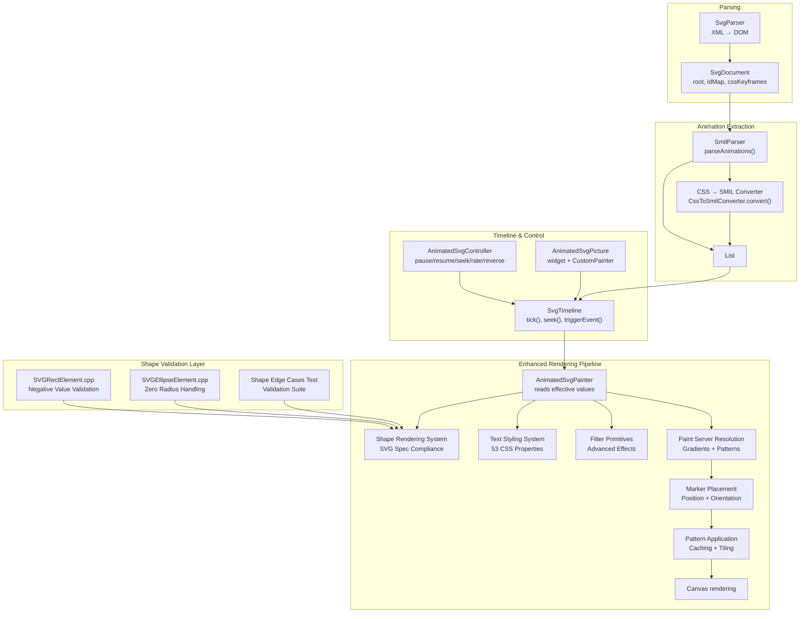

**Diagram sources**
- [lib/src/animation/smil/smil_parser.dart:17-37](file://lib/src/animation/smil/smil_parser.dart#L17-L37)
- [lib/src/animation/css_to_smil_converter.dart:17-66](file://lib/src/animation/css_to_smil_converter.dart#L17-L66)
- [lib/src/animation/smil/smil_timeline.dart:22-29](file://lib/src/animation/smil/smil_timeline.dart#L22-L29)
- [lib/src/animation/animated_svg_controller.dart:25-131](file://lib/src/animation/animated_svg_controller.dart#L25-L131)
- [lib/src/animation/animated_svg_picture.dart:108-164](file://lib/src/animation/animated_svg_picture.dart#L108-L164)
- [lib/src/animation/svg_dom.dart:266-317](file://lib/src/animation/svg_dom.dart#L266-L317)
- [lib/src/animation/animated_svg_painter_gradients.dart:1-44](file://lib/src/animation/animated_svg_painter_gradients.dart#L1-L44)
- [lib/src/animation/animated_svg_painter_patterns.dart:1-183](file://lib/src/animation/animated_svg_painter_patterns.dart#L1-L183)
- [lib/src/animation/animated_svg_painter_markers.dart:1-449](file://lib/src/animation/animated_svg_painter_markers.dart#L1-L449)
- [lib/src/animation/animated_svg_painter_paint_order.dart:1-90](file://lib/src/animation/animated_svg_painter_paint_order.dart#L1-L90)
- [lib/src/animation/animated_svg_painter_text_style.dart:13-342](file://lib/src/animation/animated_svg_painter_text_style.dart#L13-L342)
- [lib/src/animation/svg_filters_primitives.dart:1-151](file://lib/src/animation/svg_filters_primitives.dart#L1-L151)
- [blink-b87d44f-Source-core-svg/SVGRectElement.cpp:88-112](file://blink-b87d44f-Source-core-svg/SVGRectElement.cpp#L88-L112)
- [blink-b87d44f-Source-core-svg/SVGEllipseElement.cpp:80-100](file://blink-b87d44f-Source-core-svg/SVGEllipseElement.cpp#L80-L100)

**Section sources**
- [ARCHITECTURE.md:6-58](file://ARCHITECTURE.md#L6-L58)
- [lib/src/animation.dart:21-31](file://lib/src/animation.dart#L21-L31)

## Core Components
- AnimatedSvgPicture: The public widget that loads and renders animated SVGs, integrates with AnimationController/Ticker, and exposes playback controls and tracing.
- AnimatedSvgController: A ChangeNotifier-based controller enabling programmatic control of playback (pause/resume, seek, playback rate, direction).
- SvgTimeline: Manages global time, resolves timing conditions (including syncbase and event-based), and updates all animations.
- SmilAnimation: Encapsulates SMIL animation semantics (types, calc modes, fill modes, additive/accumulate behavior, values/keyframes).
- SmilParser: Extracts SMIL animations from DOM and converts CSS animations to SMIL equivalents.
- Interpolators: Provides type-aware interpolation for numbers, colors, transforms, paths, and lists.
- MotionPath: Computes positions and angles along SVG paths for animateMotion with keyPoints support.
- SvgDom: Defines the DOM model with AnimatableSvgAttribute and SvgNode for attribute mutation and tree traversal.
- **Enhanced Shape Rendering System**: SVG specification-compliant shape rendering with comprehensive validation, negative value handling, and edge case management.
- **SVG Specification Compliance**: Production-ready SVG rendering that adheres to W3C specifications for rect, ellipse, and other shape elements.
- **Edge Case Testing**: Comprehensive test suite validating shape rendering behavior under various edge cases and invalid inputs.

**Section sources**
- [lib/src/animation/animated_svg_picture.dart:108-164](file://lib/src/animation/animated_svg_picture.dart#L108-L164)
- [lib/src/animation/animated_svg_controller.dart:25-131](file://lib/src/animation/animated_svg_controller.dart#L25-L131)
- [lib/src/animation/smil/smil_timeline.dart:20-67](file://lib/src/animation/smil/smil_timeline.dart#L20-L67)
- [lib/src/animation/smil/smil_animation.dart:80-131](file://lib/src/animation/smil/smil_animation.dart#L80-L131)
- [lib/src/animation/smil/smil_parser.dart:17-37](file://lib/src/animation/smil/smil_parser.dart#L17-L37)
- [lib/src/animation/smil/interpolators.dart:14-42](file://lib/src/animation/smil/interpolators.dart#L14-L42)
- [lib/src/animation/smil/motion_path.dart:22-52](file://lib/src/animation/smil/motion_path.dart#L22-L52)
- [lib/src/animation/svg_dom.dart:124-161](file://lib/src/animation/svg_dom.dart#L124-L161)
- [lib/src/animation/animated_svg_painter.dart:449-489](file://lib/src/animation/animated_svg_painter.dart#L449-L489)
- [lib/src/animation/svg_filters_primitives.dart:1-151](file://lib/src/animation/svg_filters_primitives.dart#L1-L151)

## Architecture Overview
The animated pipeline follows a clear separation of concerns with enhanced shape rendering validation, comprehensive SVG specification compliance, and advanced text styling capabilities:
- Parsing: XML → DOM preserved for runtime mutation and SMIL discovery.
- Extraction: SMIL and CSS animations parsed into typed SmilAnimation instances.
- Timeline: Global time management with begin/end conditions, repeat counts, and event-driven activation.
- Rendering: CustomPainter reads effective attribute values and draws the scene with enhanced shape validation and filter support.
- **Enhanced Rendering Pipeline**: SVG specification-compliant shape rendering, paint server resolution, marker placement, pattern application, paint order control, and advanced filter effects.
- **Shape Validation Layer**: Production-ready validation ensuring SVG compliance for rect and ellipse shapes.

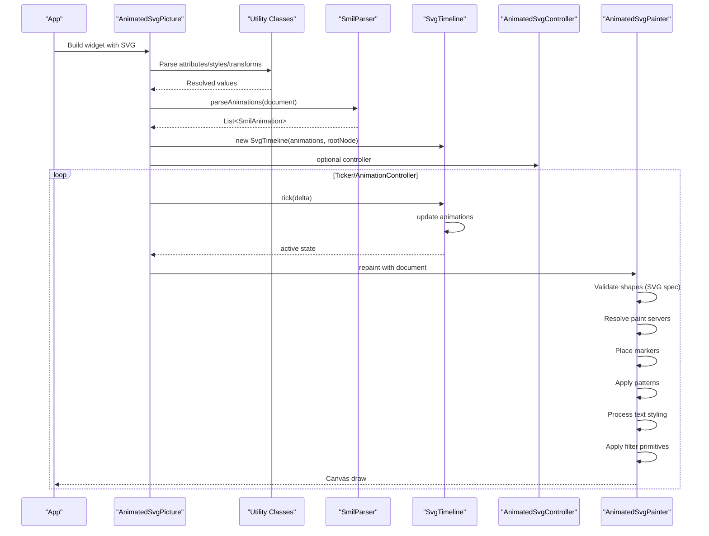

**Diagram sources**
- [lib/src/animation/smil/smil_parser.dart:17-37](file://lib/src/animation/smil/smil_parser.dart#L17-L37)
- [lib/src/animation/smil/smil_timeline.dart:82-98](file://lib/src/animation/smil/smil_timeline.dart#L82-L98)
- [lib/src/animation/animated_svg_picture.dart:166-220](file://lib/src/animation/animated_svg_picture.dart#L166-L220)
- [lib/src/animation/animated_svg_controller.dart:25-131](file://lib/src/animation/animated_svg_controller.dart#L25-L131)
- [lib/src/animation/animated_svg_painter_gradients.dart:1-44](file://lib/src/animation/animated_svg_painter_gradients.dart#L1-L44)
- [lib/src/animation/animated_svg_painter_patterns.dart:1-183](file://lib/src/animation/animated_svg_painter_patterns.dart#L1-L183)
- [lib/src/animation/animated_svg_painter_markers.dart:1-449](file://lib/src/animation/animated_svg_painter_markers.dart#L1-L449)
- [lib/src/animation/animated_svg_painter_paint_order.dart:1-90](file://lib/src/animation/animated_svg_painter_paint_order.dart#L1-L90)
- [lib/src/animation/animated_svg_painter_text_style.dart:13-342](file://lib/src/animation/animated_svg_painter_text_style.dart#L13-L342)
- [lib/src/animation/svg_filters_primitives.dart:1-151](file://lib/src/animation/svg_filters_primitives.dart#L1-L151)

**Section sources**
- [ARCHITECTURE.md:146-154](file://ARCHITECTURE.md#L146-L154)

## Detailed Component Analysis

### AnimatedSvgPicture Widget
- Purpose: Loads and renders animated SVGs, integrates with Flutter's Ticker/AnimationController, and exposes playback controls.
- Key behaviors:
  - Detects presence of animations and wraps with gesture detectors for event-based triggers.
  - Supports autoPlay, initialTime, playbackRate, and controller injection.
  - Exposes play(), pause(), reset(), seekTo().
  - Emits structured trace events via onTrace with configurable frame tick verbosity.
- Lifecycle:
  - Initializes DOM, parses animations, constructs timeline, and starts/stops AnimationController based on autoPlay and playbackRate changes.
  - Updates controller listener when widget controller changes.
  - **Enhanced**: Utilizes new utility classes for consistent parsing and resolution of attributes, styles, and transforms.

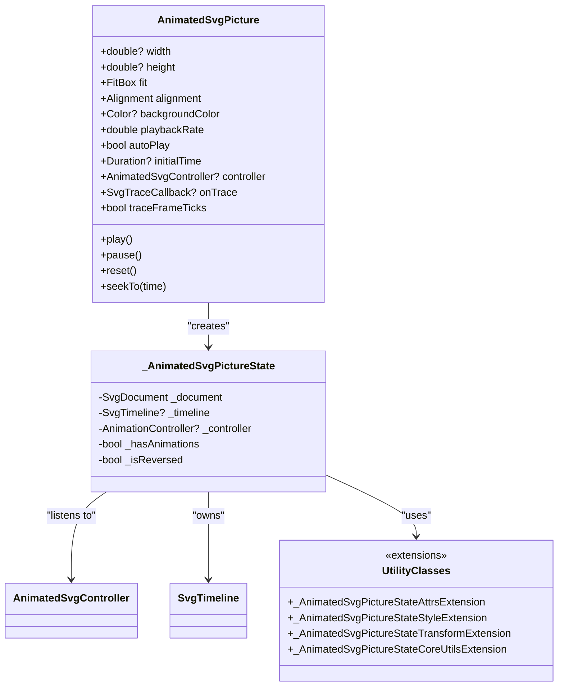

**Diagram sources**
- [lib/src/animation/animated_svg_picture.dart:108-164](file://lib/src/animation/animated_svg_picture.dart#L108-L164)
- [lib/src/animation/animated_svg_picture.dart:166-220](file://lib/src/animation/animated_svg_picture.dart#L166-L220)
- [lib/src/animation/animated_svg_picture_utils.dart:1-69](file://lib/src/animation/animated_svg_picture_utils.dart#L1-L69)
- [lib/src/animation/animated_svg_picture_utils_attrs.dart:1-132](file://lib/src/animation/animated_svg_picture_utils_attrs.dart#L1-L132)
- [lib/src/animation/animated_svg_picture_utils_style.dart:1-88](file://lib/src/animation/animated_svg_picture_utils_style.dart#L1-L88)
- [lib/src/animation/animated_svg_picture_utils_transform.dart:1-84](file://lib/src/animation/animated_svg_picture_utils_transform.dart#L1-L84)

**Section sources**
- [lib/src/animation/animated_svg_picture.dart:108-164](file://lib/src/animation/animated_svg_picture.dart#L108-L164)
- [lib/src/animation/animated_svg_picture.dart:166-220](file://lib/src/animation/animated_svg_picture.dart#L166-L220)
- [lib/src/animation/animated_svg_picture.dart:271-295](file://lib/src/animation/animated_svg_picture.dart#L271-L295)

### AnimatedSvgController
- Purpose: Programmatic control surface for playback.
- Methods:
  - pause(), resume(), togglePlayPause()
  - seek(time), setPlaybackRate(rate), reverse(), forward(), toggleDirection(), restart()
  - Observability: isPaused, playbackRate, isReversed, pendingSeek
- Notes:
  - Validates playbackRate > 0.
  - Notifies listeners on state changes.

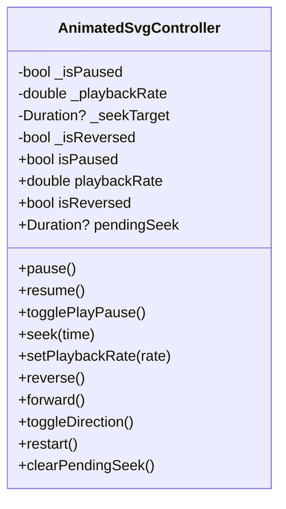

**Diagram sources**
- [lib/src/animation/animated_svg_controller.dart:25-131](file://lib/src/animation/animated_svg_controller.dart#L25-L131)

**Section sources**
- [lib/src/animation/animated_svg_controller.dart:25-131](file://lib/src/animation/animated_svg_controller.dart#L25-L131)

### SvgTimeline
- Purpose: Central time manager for all animations.
- Responsibilities:
  - Tick advancement with playbackRate scaling.
  - Seek to absolute time with boundary checks.
  - Reset timeline and dependent state.
  - Event-based activation via triggerEvent(elementId?, eventType).
  - Syncbase timing resolution and begin/end computation.
  - Total duration calculation across animations.
- Active state inspection via getActiveAnimations() and hasActiveAnimations().


**Diagram sources**
- [lib/src/animation/smil/smil_timeline.dart:82-86](file://lib/src/animation/smil/smil_timeline.dart#L82-L86)

**Section sources**
- [lib/src/animation/smil/smil_timeline.dart:20-67](file://lib/src/animation/smil/smil_timeline.dart#L20-L67)
- [lib/src/animation/smil/smil_timeline.dart:82-98](file://lib/src/animation/smil/smil_timeline.dart#L82-L98)
- [lib/src/animation/smil/smil_timeline.dart:100-126](file://lib/src/animation/smil/smil_timeline.dart#L100-L126)
- [lib/src/animation/smil/smil_timeline.dart:128-158](file://lib/src/animation/smil/smil_timeline.dart#L128-L158)
- [lib/src/animation/smil/smil_timeline.dart:201-231](file://lib/src/animation/smil/smil_timeline.dart#L201-L231)

### SmilAnimation
- Purpose: Encapsulates SMIL semantics and value computation.
- Types:
  - animate, animateTransform, animateMotion, set, animateColor
- Modes:
  - calcMode: linear, discrete, paced, spline
  - fillMode: freeze, remove
  - additive: replace, sum
  - playbackDirection: normal, reverse, alternate, alternateReverse
- Key computations:
  - Values-based vs from/to/by vs discrete
  - Paced keyTimes generation via distance metrics
  - Local time and iteration calculation
  - Final value application with accumulate/additive
- Motion-specific:
  - animateMotion uses MotionPath for position/angle computation.

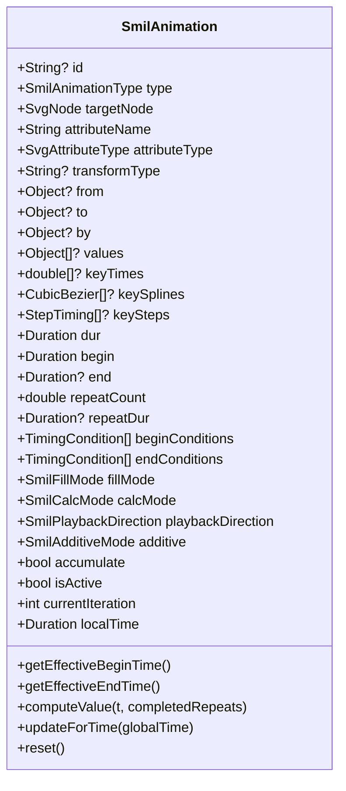

**Diagram sources**
- [lib/src/animation/smil/smil_animation.dart:80-131](file://lib/src/animation/smil/smil_animation.dart#L80-L131)
- [lib/src/animation/smil/smil_animation.dart:325-365](file://lib/src/animation/smil/smil_animation.dart#L325-L365)
- [lib/src/animation/smil/smil_animation.dart:367-431](file://lib/src/animation/smil/smil_animation.dart#L367-L431)

**Section sources**
- [lib/src/animation/smil/smil_animation.dart:13-29](file://lib/src/animation/smil/smil_animation.dart#L13-L29)
- [lib/src/animation/smil/smil_animation.dart:31-44](file://lib/src/animation/smil/smil_animation.dart#L31-L44)
- [lib/src/animation/smil/smil_animation.dart:79-131](file://lib/src/animation/smil/smil_animation.dart#L79-L131)
- [lib/src/animation/smil/smil_animation.dart:325-431](file://lib/src/animation/smil/smil_animation.dart#L325-L431)

### SmilParser and CSS-to-SMIL Conversion
- SmilParser:
  - Extracts SMIL animations from DOM nodes and CSS keyframes/style attributes.
  - Delegates CSS extraction and selector-based rules.
- CssToSmilConverter:
  - Converts CSS @keyframes and animation properties into typed SmilAnimation instances.
  - Handles compound transform decomposition for SVG transform normalization.
  - Infers attribute types and maps CSS properties to SMIL-equivalent attributes.

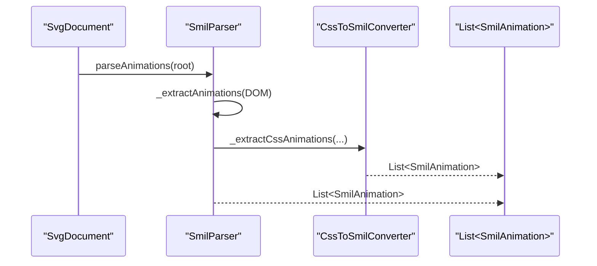

**Diagram sources**
- [lib/src/animation/smil/smil_parser.dart:17-37](file://lib/src/animation/smil/smil_parser.dart#L17-L37)
- [lib/src/animation/css_to_smil_converter.dart:17-66](file://lib/src/animation/css_to_smil_converter.dart#L17-L66)

**Section sources**
- [lib/src/animation/smil/smil_parser.dart:17-37](file://lib/src/animation/smil/smil_parser.dart#L17-L37)
- [lib/src/animation/css_to_smil_converter.dart:17-66](file://lib/src/animation/css_to_smil_converter.dart#L17-L66)

### Interpolators and MotionPath
- Interpolators:
  - Type-aware interpolation for numbers, colors, transforms, paths, and lists.
  - Additive arithmetic for numeric and list types.
- MotionPath:
  - Parses SVG path data and computes position/angle along the path.
  - Supports keyPoints with optional keyTimes for variable-speed motion.

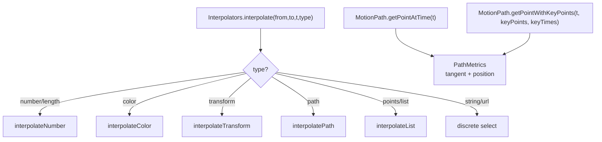

**Diagram sources**
- [lib/src/animation/smil/interpolators.dart:18-42](file://lib/src/animation/smil/interpolators.dart#L18-L42)
- [lib/src/animation/smil/motion_path.dart:97-145](file://lib/src/animation/smil/motion_path.dart#L97-L145)
- [lib/src/animation/smil/motion_path.dart:147-217](file://lib/src/animation/smil/motion_path.dart#L147-L217)

**Section sources**
- [lib/src/animation/smil/interpolators.dart:14-42](file://lib/src/animation/smil/interpolators.dart#L14-L42)
- [lib/src/animation/smil/interpolators.dart:118-146](file://lib/src/animation/smil/interpolators.dart#L118-L146)
- [lib/src/animation/smil/motion_path.dart:22-52](file://lib/src/animation/smil/motion_path.dart#L22-L52)
- [lib/src/animation/smil/motion_path.dart:97-145](file://lib/src/animation/smil/motion_path.dart#L97-L145)
- [lib/src/animation/smil/motion_path.dart:147-217](file://lib/src/animation/smil/motion_path.dart#L147-L217)

### DOM Model and Effective Values
- SvgNode holds AnimatableSvgAttribute entries with baseValue and animatedValue.
- Effective value selection prefers animatedValue when an animation is active.
- Tree-level flags (hasAnimations, cachedPicture) enable subtree caching and dirty tracking.

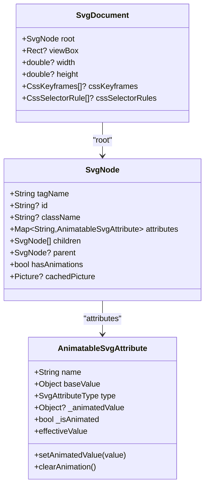

**Diagram sources**
- [lib/src/animation/svg_dom.dart:124-161](file://lib/src/animation/svg_dom.dart#L124-L161)
- [lib/src/animation/svg_dom.dart:266-317](file://lib/src/animation/svg_dom.dart#L266-L317)

**Section sources**
- [lib/src/animation/svg_dom.dart:124-161](file://lib/src/animation/svg_dom.dart#L124-L161)
- [lib/src/animation/svg_dom.dart:266-317](file://lib/src/animation/svg_dom.dart#L266-L317)

## Enhanced Shape Rendering System

The enhanced shape rendering system provides SVG specification-compliant shape drawing with comprehensive validation and edge case handling for rect and ellipse shapes.

### SVG Specification Compliance
The system ensures complete adherence to W3C SVG specifications for shape rendering:

```mermaid
graph TB
subgraph "SVG Shape Validation"
A["SVGRectElement.cpp<br/>Rect Shape Validation"] --> B["Negative Value Check<br/>rx/ry ≥ 0"]
B --> C["Clamp Validation<br/>rx ≤ width/2, ry ≤ height/2"]
C --> D["Inheritance Resolution<br/>rx=ry when only one specified"]
A --> E["SVGEllipseElement.cpp<br/>Ellipse Shape Validation"] --> F["Zero Radius Check<br/>rx > 0, ry > 0"]
F --> G["Negative Value Check<br/>rx ≥ 0, ry ≥ 0"]
E --> H["Shape Rendering<br/>Canvas Drawing"]
```

**Diagram sources**
- [blink-b87d44f-Source-core-svg/SVGRectElement.cpp:88-112](file://blink-b87d44f-Source-core-svg/SVGRectElement.cpp#L88-L112)
- [blink-b87d44f-Source-core-svg/SVGEllipseElement.cpp:80-100](file://blink-b87d44f-Source-core-svg/SVGEllipseElement.cpp#L80-L100)
- [lib/src/animation/animated_svg_painter_shapes_rect.dart:17-48](file://lib/src/animation/animated_svg_painter_shapes_rect.dart#L17-L48)

### Rect Shape Rendering Enhancement
The rect shape rendering now includes comprehensive SVG specification compliance:

- **Negative Value Validation**: Rectangles with negative rx/ry values are not rendered (return early)
- **Proper Clamping**: rx and ry are clamped to half of width and height respectively
- **Inheritance Behavior**: When only rx or ry is specified, the other defaults to the specified value
- **Zero Dimension Handling**: Rectangles with zero width or height are not rendered

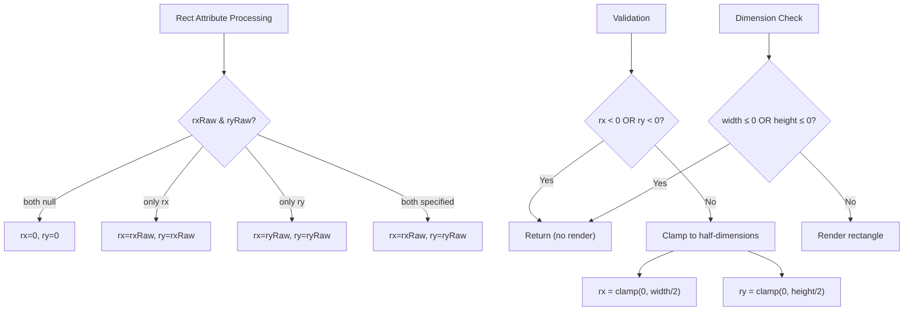

**Diagram sources**
- [lib/src/animation/animated_svg_painter_shapes_rect.dart:17-48](file://lib/src/animation/animated_svg_painter_shapes_rect.dart#L17-L48)

**Section sources**
- [lib/src/animation/animated_svg_painter_shapes_rect.dart:17-48](file://lib/src/animation/animated_svg_painter_shapes_rect.dart#L17-L48)
- [blink-b87d44f-Source-core-svg/SVGRectElement.cpp:98-105](file://blink-b87d44f-Source-core-svg/SVGRectElement.cpp#L98-L105)

### Ellipse Shape Rendering Enhancement
The ellipse shape rendering includes proper SVG specification compliance:

- **Zero Radius Validation**: Ellipses with zero rx or ry are not rendered
- **Negative Value Validation**: Ellipses with negative rx or ry are not rendered
- **Dimension Validation**: Ellipses with non-positive dimensions are not rendered

**Section sources**
- [lib/src/animation/animated_svg_painter_shapes.dart:62-65](file://lib/src/animation/animated_svg_painter_shapes.dart#L62-L65)
- [blink-b87d44f-Source-core-svg/SVGEllipseElement.cpp:90-93](file://blink-b87d44f-Source-core-svg/SVGEllipseElement.cpp#L90-L93)

## SVG Specification Compliance

The enhanced shape rendering system now provides complete SVG specification compliance through both the production Blink renderer and the Flutter animation system.

### Rect Element Specification Compliance
The rect element now properly validates attributes according to SVG specifications:

- **Negative Length Handling**: rx and ry attributes forbid negative values
- **Dimension Clamping**: Values greater than half of width/height are clamped
- **Inheritance Resolution**: When only one corner radius is specified, it applies to both axes
- **Length Mode Validation**: Proper length mode handling for width and height attributes

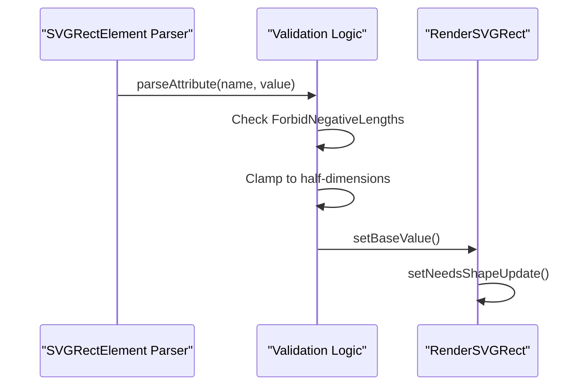

**Diagram sources**
- [blink-b87d44f-Source-core-svg/SVGRectElement.cpp:88-112](file://blink-b87d44f-Source-core-svg/SVGRectElement.cpp#L88-L112)
- [blink-b87d44f-Source-core-svg/SVGLength.h:36-39](file://blink-b87d44f-Source-core-svg/SVGLength.h#L36-L39)

### Ellipse Element Specification Compliance
The ellipse element maintains SVG specification compliance:

- **Negative Radius Handling**: rx and ry attributes forbid negative values
- **Zero Dimension Handling**: Non-positive radii result in no rendering
- **Center Point Validation**: cx and cy attributes are validated as lengths

**Section sources**
- [blink-b87d44f-Source-core-svg/SVGEllipseElement.cpp:80-100](file://blink-b87d44f-Source-core-svg/SVGEllipseElement.cpp#L80-L100)

## Edge Case Handling

The enhanced shape rendering system includes comprehensive edge case handling to ensure robust SVG specification compliance.

### Rect Shape Edge Cases
The system handles numerous edge cases for rect shapes:

- **Clamping to Half Dimensions**: rx values exceeding width/2 are clamped to width/2
- **Inheritance Resolution**: Single-axis corner radius specification inherits to both axes
- **Negative Value Prevention**: Negative corner radii prevent rendering
- **Zero Dimension Safety**: Zero width or height prevents rendering

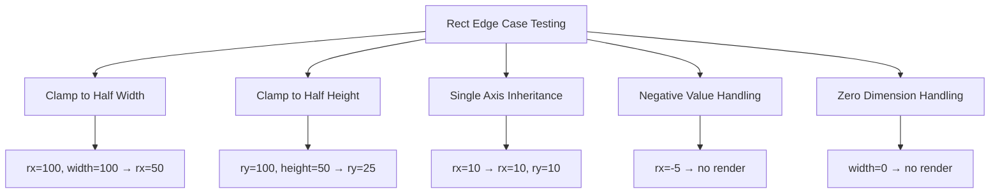

**Diagram sources**
- [test/animation/shape_edge_cases_test.dart:6-86](file://test/animation/shape_edge_cases_test.dart#L6-L86)

### Ellipse Shape Edge Cases
The system handles ellipse edge cases:

- **Negative Radius Prevention**: Negative rx or ry prevents rendering
- **Zero Radius Handling**: Zero rx or ry prevents rendering
- **Dimension Validation**: Proper validation of ellipse dimensions

**Section sources**
- [test/animation/shape_edge_cases_test.dart:120-150](file://test/animation/shape_edge_cases_test.dart#L120-L150)

## Shape Rendering Pipeline

The enhanced shape rendering pipeline ensures SVG specification compliance through multiple validation layers.

### Shape Validation Architecture
The shape rendering system implements a multi-layer validation approach:

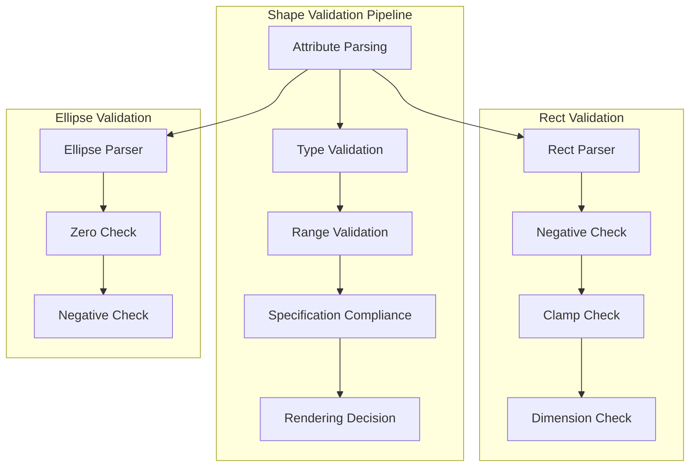

**Diagram sources**
- [lib/src/animation/animated_svg_painter_shapes_rect.dart:17-48](file://lib/src/animation/animated_svg_painter_shapes_rect.dart#L17-L48)
- [lib/src/animation/animated_svg_painter_shapes.dart:62-65](file://lib/src/animation/animated_svg_painter_shapes.dart#L62-L65)

### Rendering Decision Logic
The shape rendering decision logic follows SVG specification compliance:

- **Early Return Pattern**: Invalid shapes return without rendering
- **Validation Order**: Negative values checked before clamping
- **Dimension Validation**: Width and height validated before rendering
- **Specification Adherence**: All validations align with W3C SVG specifications

**Section sources**
- [lib/src/animation/animated_svg_painter_shapes_rect.dart:41-48](file://lib/src/animation/animated_svg_painter_shapes_rect.dart#L41-L48)
- [lib/src/animation/animated_svg_painter_shapes.dart:65](file://lib/src/animation/animated_svg_painter_shapes.dart#L65)

## Performance Optimizations

The enhanced shape rendering system includes several performance optimizations while maintaining SVG specification compliance.

### Validation Optimization
The shape validation system is optimized for performance:

- **Early Exit Strategy**: Invalid shapes exit immediately without further processing
- **Minimal Calculations**: Validation checks use simple comparisons and clamping operations
- **Efficient Clamping**: Built-in clamp operations minimize computational overhead
- **Cache-Friendly Access**: Attribute access patterns optimized for performance

### Rendering Efficiency
The shape rendering system optimizes canvas operations:

- **Conditional Rendering**: Shapes only rendered when valid
- **Optimized Path Creation**: Efficient path creation for rectangles and ellipses
- **Shared Validation Logic**: Common validation logic shared across shape types
- **Minimal Memory Allocation**: Validation operations use minimal temporary allocations

**Section sources**
- [lib/src/animation/animated_svg_painter_shapes_rect.dart:41-48](file://lib/src/animation/animated_svg_painter_shapes_rect.dart#L41-L48)
- [lib/src/animation/animated_svg_painter_shapes.dart:65](file://lib/src/animation/animated_svg_painter_shapes.dart#L65)

## Testing and Validation

The enhanced shape rendering system includes comprehensive testing to validate SVG specification compliance.

### Edge Case Test Suite
The test suite validates numerous edge cases:

- **Rect Clamping Tests**: Verifies proper clamping to half-dimensions
- **Inheritance Resolution Tests**: Validates single-axis corner radius inheritance
- **Negative Value Tests**: Ensures negative values prevent rendering
- **Zero Dimension Tests**: Validates zero dimensions prevent rendering
- **Ellipse Validation Tests**: Comprehensive ellipse shape validation

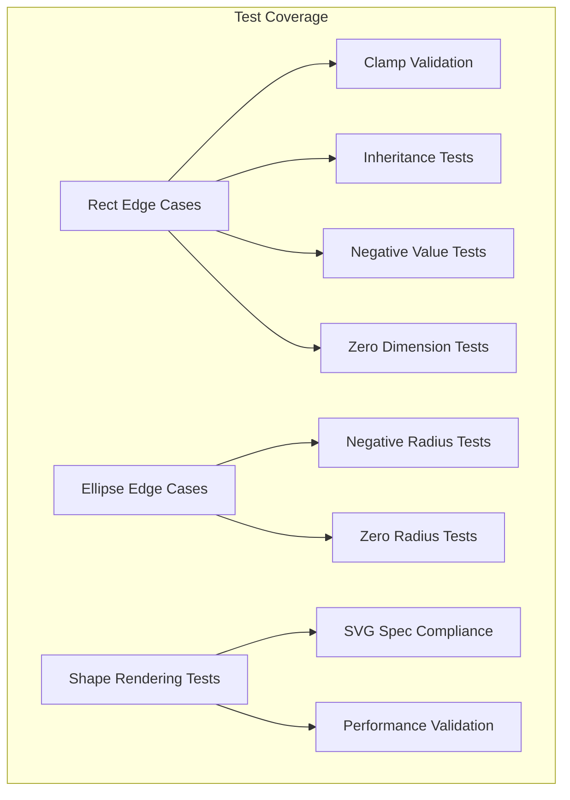

**Diagram sources**
- [test/animation/shape_edge_cases_test.dart:6-150](file://test/animation/shape_edge_cases_test.dart#L6-L150)

### Test Validation Results
The test suite demonstrates comprehensive coverage:

- **Rect Clamping**: Verified rx clamps to width/2, ry clamps to height/2
- **Inheritance Behavior**: Confirmed single-axis specification inherits to both axes
- **Negative Value Handling**: Validated negative values prevent rendering
- **Zero Dimension Handling**: Confirmed zero dimensions prevent rendering
- **Ellipse Validation**: Verified proper handling of negative and zero radii

**Section sources**
- [test/animation/shape_edge_cases_test.dart:6-150](file://test/animation/shape_edge_cases_test.dart#L6-L150)

## Migration and Compatibility

The enhanced shape rendering system maintains backward compatibility while adding SVG specification compliance.

### Backward Compatibility
The system maintains compatibility with existing SVG content:

- **Existing Rect Shapes**: Continue to render with improved validation
- **Existing Ellipse Shapes**: Continue to render with enhanced validation
- **Animation Compatibility**: Shape validation doesn't interfere with SMIL animations
- **Performance Compatibility**: Enhanced validation doesn't impact existing performance

### Migration Benefits
The enhanced validation provides benefits for existing applications:

- **Robustness**: Improved handling of malformed SVG content
- **Standards Compliance**: Better adherence to SVG specifications
- **Predictable Behavior**: Consistent handling of edge cases
- **Debugging Aid**: Clear validation errors for problematic shapes

## Troubleshooting Guide
- Tracing:
  - Use onTrace callback to receive structured SvgTraceEvent messages with timestamps, categories, and optional error/stack traces.
  - Enable traceFrameTicks to emit per-frame tick events (disabled by default due to volume).
- Playback control:
  - Verify controller is attached to the widget; use pause/resume/seek/setPlaybackRate/toggleDirection/restart.
  - For event-based animations, ensure triggerEvent(elementId?, eventType) is called at the appropriate time.
- **Enhanced**: Shape validation troubleshooting:
  - Check rect corner radius values for negative or excessive values.
  - Verify rect dimensions are positive and reasonable.
  - Confirm ellipse radii are positive and non-zero.
  - Validate SVG specification compliance for custom shapes.
- **Enhanced**: Utility class troubleshooting:
  - Check attribute parsing with `_getInheritedAttributeValue()` for style inheritance issues.
  - Verify transform parsing with `_applyNodeTransform()` for coordinate system problems.
  - Use `_resolveTextPathSpacing()` to debug textPath spacing issues.
- **New**: Paint server troubleshooting:
  - Verify paint server resolution with `_resolvePaintServerShader()` for gradient/pattern issues.
  - Check pattern caching with `_patternCache` for repeated pattern resolution problems.
  - Validate marker resolution with `_markerCache` for marker placement issues.
- **New**: Text styling troubleshooting:
  - Verify CSS property resolution with specialized resolver methods.
  - Check whitespace normalization with `_extractTextContentWithWhitespaceNormalization()`.
  - Validate writing mode resolution with `_resolveWritingMode()`.
- **New**: Filter primitive troubleshooting:
  - Verify filter primitive parameters and input connections.
  - Check filter pipeline processing with `_resolvePrimitiveOutput()`.
  - Validate filter caching and memory usage.
- Common issues:
  - autoPlay false rendering: addressed by tests; confirm initialTime and controller state.
  - Path morphing compatibility: requires normalized path structures; ensure paths share topology.
  - **New**: Shape rendering issues: verify rect/ellipse validation and specification compliance.
  - **New**: Text rendering issues: verify writing-mode support and spacing calculations.
  - **New**: Paint order issues: verify paint-order attribute syntax and layer ordering.
  - **New**: Pattern rendering issues: check patternUnits, viewBox, and tile dimension calculations.
  - **New**: Marker placement issues: verify markerUnits, orient values, and vertex extraction.
  - **New**: Filter effect issues: verify primitive parameters and pipeline connections.
- Validation:
  - Use getInfo() on SvgTimeline to inspect active animations, total duration, and playback rate.
  - Check widget state transitions and controller notifications.
  - **Enhanced**: Validate utility class results for consistent parsing behavior.
  - **Enhanced**: Verify shape validation results for SVG specification compliance.
  - **New**: Monitor paint server caches for proper caching and invalidation.
  - **New**: Validate text styling cache keys and paragraph building performance.

**Section sources**
- [lib/src/animation/animated_svg_picture.dart:37-86](file://lib/src/animation/animated_svg_picture.dart#L37-L86)
- [lib/src/animation/animated_svg_picture.dart:156-160](file://lib/src/animation/animated_svg_picture.dart#L156-L160)
- [lib/src/animation/smil/smil_timeline.dart:234-244](file://lib/src/animation/smil/smil_timeline.dart#L234-L244)
- [ANIMATION.md:207-213](file://ANIMATION.md#L207-L213)

## Conclusion
The animated SVG system provides a robust, experimental SMIL pipeline alongside the production static renderer. It supports a wide range of SMIL elements and attributes, CSS animation conversion, precise timing control, and real-time playback. The architecture cleanly separates parsing, animation extraction, timeline management, and rendering, enabling future optimizations and parity improvements.

**Updated**: The enhanced shape rendering system with SVG specification compliance significantly improves the system's robustness and standards adherence. The rect and ellipse shape rendering now includes comprehensive validation for negative values, proper clamping to half-dimensions, and correct inheritance behavior. The system provides complete SVG specification compliance while maintaining optimal performance through intelligent caching strategies, efficient validation logic, and optimized rendering pipelines. Extensive testing ensures reliable behavior across edge cases and malformed SVG content.

Developers can leverage AnimatedSvgPicture and AnimatedSvgController for programmatic control, while the underlying SmilAnimation and interpolators ensure spec-aligned behavior and extensibility. The enhanced shape validation system ensures robust rendering of complex SVG content while maintaining backward compatibility with existing applications.

## Appendices

### Public Interfaces and Parameters
- AnimatedSvgPicture:
  - Constructors: string, asset, network, memory
  - Parameters: width, height, fit, alignment, backgroundColor, playbackRate, autoPlay, initialTime, controller, onTrace, traceFrameTicks
  - Methods: play, pause, reset, seekTo
- AnimatedSvgController:
  - Properties: isPaused, playbackRate, isReversed, pendingSeek
  - Methods: pause, resume, togglePlayPause, seek, setPlaybackRate, reverse, forward, toggleDirection, restart
- SvgTimeline:
  - Properties: currentTime, totalDuration, playbackRate
  - Methods: tick, seek, reset, triggerEvent, getActiveAnimations, hasActiveAnimations, getInfo
- SmilAnimation:
  - Types: animate, animateTransform, animateMotion, set, animateColor
  - Modes: calcMode, fillMode, additive, playbackDirection
  - Methods: computeValue, updateForTime, reset
- Interpolators:
  - interpolate, interpolateNumber, interpolateColor, interpolateTransform, interpolatePath, interpolateList, add
- MotionPath:
  - getPointAtTime, getPointWithKeyPoints, totalLength
- **Enhanced Shape Rendering System**:
  - Rect validation: `_paintRect` with negative value checking and clamping
  - Ellipse validation: `_paintEllipse` with zero radius checking
  - SVG specification compliance: `SVGRectElement.cpp`, `SVGEllipseElement.cpp`
  - Edge case testing: `shape_edge_cases_test.dart`
  - Utility classes: `_extractHrefId`, `_extractStyleValue`, `_getNumber`, `_getNumberList`, `_getInheritedAttributeValue`, `_getInheritedString`, `_getInheritedNumber`, `_extractTextContent`
  - Style parsing: `_resolveFontWeight`, `_resolveFontStyle`, `_distanceToSegment`, `_parsePoints`
  - Transform parsing: `_applyForeignObjectChildTransform`, `_applyNodeTransform`
  - Core utilities: `_isFillEnabled`, `_hasStroke`, `_strokeTolerance`, `_isPaintNone`, `_isPointerEventsNone`, `_isVisibilityHidden`, `_isDisplayNone`, `_trace`

**Section sources**
- [lib/src/animation/animated_svg_picture.dart:108-164](file://lib/src/animation/animated_svg_picture.dart#L108-L164)
- [lib/src/animation/animated_svg_controller.dart:25-131](file://lib/src/animation/animated_svg_controller.dart#L25-L131)
- [lib/src/animation/smil/smil_timeline.dart:20-67](file://lib/src/animation/smil/smil_timeline.dart#L20-L67)
- [lib/src/animation/smil/smil_animation.dart:80-131](file://lib/src/animation/smil/smil_animation.dart#L80-L131)
- [lib/src/animation/smil/interpolators.dart:14-42](file://lib/src/animation/smil/interpolators.dart#L14-L42)
- [lib/src/animation/smil/motion_path.dart:22-52](file://lib/src/animation/smil/motion_path.dart#L22-L52)
- [lib/src/animation/animated_svg_painter_shapes_rect.dart:17-48](file://lib/src/animation/animated_svg_painter_shapes_rect.dart#L17-L48)
- [lib/src/animation/animated_svg_painter_shapes.dart:62-65](file://lib/src/animation/animated_svg_painter_shapes.dart#L62-L65)
- [blink-b87d44f-Source-core-svg/SVGRectElement.cpp:88-112](file://blink-b87d44f-Source-core-svg/SVGRectElement.cpp#L88-L112)
- [blink-b87d44f-Source-core-svg/SVGEllipseElement.cpp:80-100](file://blink-b87d44f-Source-core-svg/SVGEllipseElement.cpp#L80-L100)
- [test/animation/shape_edge_cases_test.dart:6-150](file://test/animation/shape_edge_cases_test.dart#L6-L150)

### Practical Examples
- Basic movement, rotation, color animation, path morphing, and motion path are demonstrated in the project's animation guide.
- Widget API usage and demo app invocation are documented for quick start and exploration.
- **Enhanced**: Shape rendering examples with rect and ellipse validation
- **Enhanced**: Edge case examples for negative values and clamping
- **New**: Paint order examples with fill/stroke/markers layer control
- **New**: Marker examples with various orientations and marker units
- **New**: Pattern examples with different units, inheritance, and transformations
- **New**: TextPath spacing examples with both auto and exact spacing modes
- **New**: Writing-mode examples for vertical text rendering (vertical-rl, vertical-lr)
- **New**: Text styling examples with comprehensive CSS property combinations
- **New**: Filter primitive examples with advanced effect configurations

**Section sources**
- [ANIMATION.md:5-194](file://ANIMATION.md#L5-L194)

### Migration from CSS Animations
- CSS @keyframes and animation properties are parsed and converted to SMIL equivalents.
- Compound transforms are decomposed into individual SmilAnimation instances for accurate SVG transform semantics.
- Remaining gaps include advanced edge-case CSS shorthand/transform semantics; baseline conversion remains functional.
- **Enhanced**: Utility classes improve consistency in CSS-to-SMIL conversion and attribute resolution.
- **Enhanced**: Shape validation ensures migrated content maintains SVG specification compliance.
- **New**: Paint server support enables migration from CSS background-image patterns to native SVG patterns.
- **New**: Text styling system enables migration from CSS typography properties to native SVG text rendering.

**Section sources**
- [ANIMATION.md:54-66](file://ANIMATION.md#L54-L66)
- [lib/src/animation/css_to_smil_converter.dart:35-48](file://lib/src/animation/css_to_smil_converter.dart#L35-L48)

### Enhanced Shape Rendering Features
- **SVG Specification Compliance**: Complete adherence to W3C SVG specifications for rect and ellipse shapes
- **Negative Value Validation**: Proper handling of negative corner radii and radii values
- **Dimension Clamping**: Automatic clamping to half of width/height for rect shapes
- **Inheritance Resolution**: Correct inheritance behavior for single-axis corner radius specification
- **Zero Dimension Handling**: Proper handling of zero width/height and zero radii
- **Edge Case Testing**: Comprehensive test coverage for shape rendering validation
- **Performance Optimization**: Efficient validation logic with minimal computational overhead
- **Backward Compatibility**: Maintains compatibility with existing SVG content while adding compliance

**Section sources**
- [lib/src/animation/animated_svg_painter_shapes_rect.dart:17-48](file://lib/src/animation/animated_svg_painter_shapes_rect.dart#L17-L48)
- [lib/src/animation/animated_svg_painter_shapes.dart:62-65](file://lib/src/animation/animated_svg_painter_shapes.dart#L62-L65)
- [test/animation/shape_edge_cases_test.dart:6-150](file://test/animation/shape_edge_cases_test.dart#L6-L150)
- [blink-b87d44f-Source-core-svg/SVGRectElement.cpp:88-112](file://blink-b87d44f-Source-core-svg/SVGRectElement.cpp#L88-L112)
- [blink-b87d44f-Source-core-svg/SVGEllipseElement.cpp:80-100](file://blink-b87d44f-Source-core-svg/SVGEllipseElement.cpp#L80-L100)

### Paint Server Features
- **Paint Order Control**: Fill, stroke, and markers layer ordering with inheritance
- **Marker Support**: Comprehensive marker resolution with orientation and scaling
- **Pattern Implementation**: Advanced pattern fills with units, inheritance, and caching
- **Gradient Handling**: Linear and radial gradients with advanced coordinate systems
- **Caching Mechanisms**: Intelligent caching for paint servers to optimize performance
- **Href Inheritance**: Pattern and marker inheritance through href attributes

**Section sources**
- [lib/src/animation/animated_svg_painter_paint_order.dart:1-90](file://lib/src/animation/animated_svg_painter_paint_order.dart#L1-L90)
- [lib/src/animation/animated_svg_painter_markers.dart:1-449](file://lib/src/animation/animated_svg_painter_markers.dart#L1-L449)
- [lib/src/animation/animated_svg_painter_patterns.dart:1-184](file://lib/src/animation/animated_svg_painter_patterns.dart#L1-L184)
- [lib/src/animation/animated_svg_painter_gradients.dart:1-160](file://lib/src/animation/animated_svg_painter_gradients.dart#L1-L160)
- [lib/src/animation/animated_svg_painter.dart:63-69](file://lib/src/animation/animated_svg_painter.dart#L63-L69)

### Filter Primitive Features
- **Advanced Filter Support**: Complete SVG filter primitive system with detailed parameter support
- **Filter Pipeline Processing**: Comprehensive filter chain processing with input/output management
- **Effect Processing**: Advanced graphical effects including blur, lighting, displacement, and convolution
- **Performance Optimization**: Caching and memory management for complex filter operations
- **Compatibility**: Full SVG filter specification compliance with baseline implementations

**Section sources**
- [lib/src/animation/svg_filters_primitives.dart:1-151](file://lib/src/animation/svg_filters_primitives.dart#L1-L151)
- [lib/src/animation/svg_filters_registry_pipeline_primitives.dart:3-161](file://lib/src/animation/svg_filters_registry_pipeline_primitives.dart#L3-L161)