# Animated SVG Support

<cite>
**Referenced Files in This Document**
- [ANIMATION.md](file://ANIMATION.md)
- [ARCHITECTURE.md](file://ARCHITECTURE.md)
- [lib/src/animation.dart](file://lib/src/animation.dart)
- [lib/src/animation/animated_svg_picture.dart](file://lib/src/animation/animated_svg_picture.dart)
- [lib/src/animation/animated_svg_controller.dart](file://lib/src/animation/animated_svg_controller.dart)
- [lib/src/animation/smil/smil_timeline.dart](file://lib/src/animation/smil/smil_timeline.dart)
- [lib/src/animation/smil/smil_animation.dart](file://lib/src/animation/smil/smil_animation.dart)
- [lib/src/animation/smil/smil_parser.dart](file://lib/src/animation/smil/smil_parser.dart)
- [lib/src/animation/smil/interpolators.dart](file://lib/src/animation/smil/interpolators.dart)
- [lib/src/animation/smil/motion_path.dart](file://lib/src/animation/smil/motion_path.dart)
- [lib/src/animation/css_to_smil_converter.dart](file://lib/src/animation/css_to_smil_converter.dart)
- [lib/src/animation/svg_dom.dart](file://lib/src/animation/svg_dom.dart)
- [lib/src/animation/animated_svg_picture_utils.dart](file://lib/src/animation/animated_svg_picture_utils.dart)
- [lib/src/animation/animated_svg_picture_utils_attrs.dart](file://lib/src/animation/animated_svg_picture_utils_attrs.dart)
- [lib/src/animation/animated_svg_picture_utils_style.dart](file://lib/src/animation/animated_svg_picture_utils_style.dart)
- [lib/src/animation/animated_svg_picture_utils_transform.dart](file://lib/src/animation/animated_svg_picture_utils_transform.dart)
- [lib/src/animation/animated_svg_picture_hit_test_text_layout.dart](file://lib/src/animation/animated_svg_picture_hit_test_text_layout.dart)
- [lib/src/animation/animated_svg_painter_text_style.dart](file://lib/src/animation/animated_svg_painter_text_style.dart)
- [lib/src/animation/animated_svg_painter_text_paint.dart](file://lib/src/animation/animated_svg_painter_text_paint.dart)
- [lib/src/animation/animated_svg_picture_hit_test_text_path_segments.dart](file://lib/src/animation/animated_svg_picture_hit_test_text_path_segments.dart)
- [lib/src/animation/animated_svg_picture_hit_test_text_runs.dart](file://lib/src/animation/animated_svg_picture_hit_test_text_runs.dart)
- [lib/src/animation/animated_svg_painter.dart](file://lib/src/animation/animated_svg_painter.dart)
- [lib/src/animation/animated_svg_painter_gradients.dart](file://lib/src/animation/animated_svg_painter_gradients.dart)
- [lib/src/animation/animated_svg_painter_patterns.dart](file://lib/src/animation/animated_svg_painter_patterns.dart)
- [lib/src/animation/animated_svg_painter_paint_order.dart](file://lib/src/animation/animated_svg_painter_paint_order.dart)
- [lib/src/animation/animated_svg_painter_markers.dart](file://lib/src/animation/animated_svg_painter_markers.dart)
- [lib/src/animation/svg_filters_primitives.dart](file://lib/src/animation/svg_filters_primitives.dart)
- [lib/src/animation/svg_filters_registry_pipeline_primitives.dart](file://lib/src/animation/svg_filters_registry_pipeline_primitives.dart)
- [test/animation/paint_order_test.dart](file://test/animation/paint_order_test.dart)
- [test/animation/marker_test.dart](file://test/animation/marker_test.dart)
- [test/animation/pattern_test.dart](file://test/animation/pattern_test.dart)
</cite>

## Update Summary
**Changes Made**
- Enhanced text styling system documentation with comprehensive coverage of 53 CSS properties across specialized modules
- Added detailed documentation for vertical writing modes support (horizontal-tb, vertical-rl, vertical-lr)
- Documented XML whitespace normalization improvements for multi-tspan text flow
- Enhanced text path rendering documentation with closed path wrapping behavior
- Added comprehensive filter primitive capabilities documentation
- Updated paint order system documentation with new paint server features
- Enhanced marker support documentation with improved orientation handling
- Added pattern implementation documentation with advanced tiling and caching

## Table of Contents
1. [Introduction](#introduction)
2. [Project Structure](#project-structure)
3. [Core Components](#core-components)
4. [Architecture Overview](#architecture-overview)
5. [Detailed Component Analysis](#detailed-component-analysis)
6. [Enhanced Text Styling System](#enhanced-text-styling-system)
7. [Vertical Writing Modes Support](#vertical-writing-modes-support)
8. [XML Whitespace Normalization](#xml-whitespace-normalization)
9. [Text Path Rendering Improvements](#text-path-rendering-improvements)
10. [Comprehensive Filter Primitive Capabilities](#comprehensive-filter-primitive-capabilities)
11. [Enhanced Paint Order System](#enhanced-paint-order-system)
12. [Advanced Marker Support](#advanced-marker-support)
13. [Enhanced Pattern Implementation](#enhanced-pattern-implementation)
14. [Utility Classes and Parsing Mechanisms](#utility-classes-and-parsing-mechanisms)
15. [Dependency Analysis](#dependency-analysis)
16. [Performance Considerations](#performance-considerations)
17. [Troubleshooting Guide](#troubleshooting-guide)
18. [Conclusion](#conclusion)
19. [Appendices](#appendices)

## Introduction
This document explains the animated SVG support built around the experimental SMIL animation system. It covers the animation architecture, SMIL specification compliance, animation control mechanisms, and CSS animation conversion capabilities. It documents the AnimatedSvgPicture widget, animation timeline management, controller system, and real-time playback controls. Both conceptual overviews for beginners and technical details for experienced developers are included, with terminology aligned to the codebase. Practical examples demonstrate animation creation, control, and optimization, along with public interfaces, animation parameters, and controller methods. Limitations, debugging approaches, and migration paths from CSS animations are also addressed.

**Updated** Enhanced with comprehensive text styling system supporting 53 CSS properties, vertical writing modes, XML whitespace normalization, and advanced filter primitive capabilities. The system now provides complete SVG paint server support with caching mechanisms and improved text rendering performance.

## Project Structure
The animated SVG pipeline is implemented as a separate, parallel system from the production static SVG renderer. It parses SVG to a DOM, extracts SMIL and CSS animations, manages timelines, and renders via a CustomPainter. The enhanced text styling system provides comprehensive CSS property support through specialized modules, while the filter system supports advanced graphical effects.

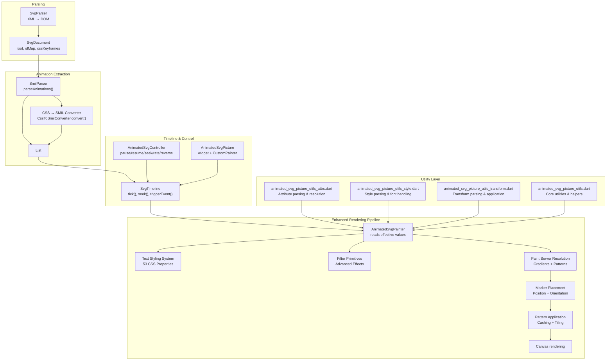
```mermaid
graph TB
subgraph "Parsing"
A["SvgParser<br/>XML → DOM"] --> B["SvgDocument<br/>root, idMap, cssKeyframes"]
end
subgraph "Animation Extraction"
B --> C["SmilParser<br/>parseAnimations()"]
C --> D["List<SmilAnimation>"]
C --> E["CSS → SMIL Converter<br/>CssToSmilConverter.convert()"]
E --> D
end
subgraph "Timeline & Control"
D --> F["SvgTimeline<br/>tick(), seek(), triggerEvent()"]
G["AnimatedSvgController<br/>pause/resume/seek/rate/reverse"] --> F
H["AnimatedSvgPicture<br/>widget + CustomPainter"] --> F
end
subgraph "Enhanced Rendering Pipeline"
F --> I["AnimatedSvgPainter<br/>reads effective values"]
I --> J["Text Styling System<br/>53 CSS Properties"]
I --> K["Filter Primitives<br/>Advanced Effects"]
I --> L["Paint Server Resolution<br/>Gradients + Patterns"]
L --> M["Marker Placement<br/>Position + Orientation"]
M --> N["Pattern Application<br/>Caching + Tiling"]
N --> O["Canvas rendering"]
end
subgraph "Utility Layer"
P["animated_svg_picture_utils_attrs.dart<br/>Attribute parsing & resolution"] --> I
Q["animated_svg_picture_utils_style.dart<br/>Style parsing & font handling"] --> I
R["animated_svg_picture_utils_transform.dart<br/>Transform parsing & application"] --> I
S["animated_svg_picture_utils.dart<br/>Core utilities & helpers"] --> I
end
```

**Diagram sources**
- [lib/src/animation/smil/smil_parser.dart:17-37](file://lib/src/animation/smil/smil_parser.dart#L17-L37)
- [lib/src/animation/css_to_smil_converter.dart:17-66](file://lib/src/animation/css_to_smil_converter.dart#L17-L66)
- [lib/src/animation/smil/smil_timeline.dart:22-29](file://lib/src/animation/smil/smil_timeline.dart#L22-L29)
- [lib/src/animation/animated_svg_controller.dart:25-131](file://lib/src/animation/animated_svg_controller.dart#L25-L131)
- [lib/src/animation/animated_svg_picture.dart:108-164](file://lib/src/animation/animated_svg_picture.dart#L108-L164)
- [lib/src/animation/svg_dom.dart:266-317](file://lib/src/animation/svg_dom.dart#L266-L317)
- [lib/src/animation/animated_svg_painter_gradients.dart:1-44](file://lib/src/animation/animated_svg_painter_gradients.dart#L1-L44)
- [lib/src/animation/animated_svg_painter_patterns.dart:1-183](file://lib/src/animation/animated_svg_painter_patterns.dart#L1-L183)
- [lib/src/animation/animated_svg_painter_markers.dart:1-449](file://lib/src/animation/animated_svg_painter_markers.dart#L1-L449)
- [lib/src/animation/animated_svg_painter_paint_order.dart:1-90](file://lib/src/animation/animated_svg_painter_paint_order.dart#L1-L90)
- [lib/src/animation/animated_svg_painter_text_style.dart:13-342](file://lib/src/animation/animated_svg_painter_text_style.dart#L13-L342)
- [lib/src/animation/svg_filters_primitives.dart:1-151](file://lib/src/animation/svg_filters_primitives.dart#L1-L151)

**Section sources**
- [ARCHITECTURE.md:6-58](file://ARCHITECTURE.md#L6-L58)
- [lib/src/animation.dart:21-31](file://lib/src/animation.dart#L21-L31)

## Core Components
- AnimatedSvgPicture: The public widget that loads and renders animated SVGs, integrates with AnimationController/Ticker, and exposes playback controls and tracing.
- AnimatedSvgController: A ChangeNotifier-based controller enabling programmatic control of playback (pause/resume, seek, playback rate, direction).
- SvgTimeline: Manages global time, resolves timing conditions (including syncbase and event-based), and updates all animations.
- SmilAnimation: Encapsulates SMIL animation semantics (types, calc modes, fill modes, additive/accumulate behavior, values/keyframes).
- SmilParser: Extracts SMIL animations from DOM and converts CSS animations to SMIL equivalents.
- Interpolators: Provides type-aware interpolation for numbers, colors, transforms, paths, and lists.
- MotionPath: Computes positions and angles along SVG paths for animateMotion with keyPoints support.
- SvgDom: Defines the DOM model with AnimatableSvgAttribute and SvgNode for attribute mutation and tree traversal.
- **Enhanced Text Styling System**: Comprehensive CSS property support through specialized modules (font, decoration, layout, positioning, rendering).
- **Advanced Filter Primitives**: Complete support for SVG filter primitives including blur, morphology, displacement map, convolution matrix, turbulence, and lighting effects.
- **Enhanced Rendering System**: AnimatedSvgPainter with comprehensive paint server support, marker placement, pattern application, and paint order control.
- **New Utility Classes**: Centralized parsing and resolution mechanisms for consistent attribute, style, and transform handling.

**Section sources**
- [lib/src/animation/animated_svg_picture.dart:108-164](file://lib/src/animation/animated_svg_picture.dart#L108-L164)
- [lib/src/animation/animated_svg_controller.dart:25-131](file://lib/src/animation/animated_svg_controller.dart#L25-L131)
- [lib/src/animation/smil/smil_timeline.dart:20-67](file://lib/src/animation/smil/smil_timeline.dart#L20-L67)
- [lib/src/animation/smil/smil_animation.dart:80-131](file://lib/src/animation/smil/smil_animation.dart#L80-L131)
- [lib/src/animation/smil/smil_parser.dart:17-37](file://lib/src/animation/smil/smil_parser.dart#L17-L37)
- [lib/src/animation/smil/interpolators.dart:14-42](file://lib/src/animation/smil/interpolators.dart#L14-L42)
- [lib/src/animation/smil/motion_path.dart:22-52](file://lib/src/animation/smil/motion_path.dart#L22-L52)
- [lib/src/animation/svg_dom.dart:124-161](file://lib/src/animation/svg_dom.dart#L124-L161)
- [lib/src/animation/animated_svg_painter.dart:449-489](file://lib/src/animation/animated_svg_painter.dart#L449-L489)
- [lib/src/animation/svg_filters_primitives.dart:1-151](file://lib/src/animation/svg_filters_primitives.dart#L1-L151)

## Architecture Overview
The animated pipeline follows a clear separation of concerns with enhanced utility layer, comprehensive paint server support, and advanced text styling capabilities:
- Parsing: XML → DOM preserved for runtime mutation and SMIL discovery.
- Extraction: SMIL and CSS animations parsed into typed SmilAnimation instances.
- Timeline: Global time management with begin/end conditions, repeat counts, and event-driven activation.
- Rendering: CustomPainter reads effective attribute values and draws the scene with enhanced text styling and filter support.
- **Enhanced Rendering Pipeline**: Paint server resolution, marker placement, pattern application, paint order control, and advanced filter effects.
- **Utility Layer**: Centralized parsing and resolution mechanisms for consistent attribute, style, and transform handling.

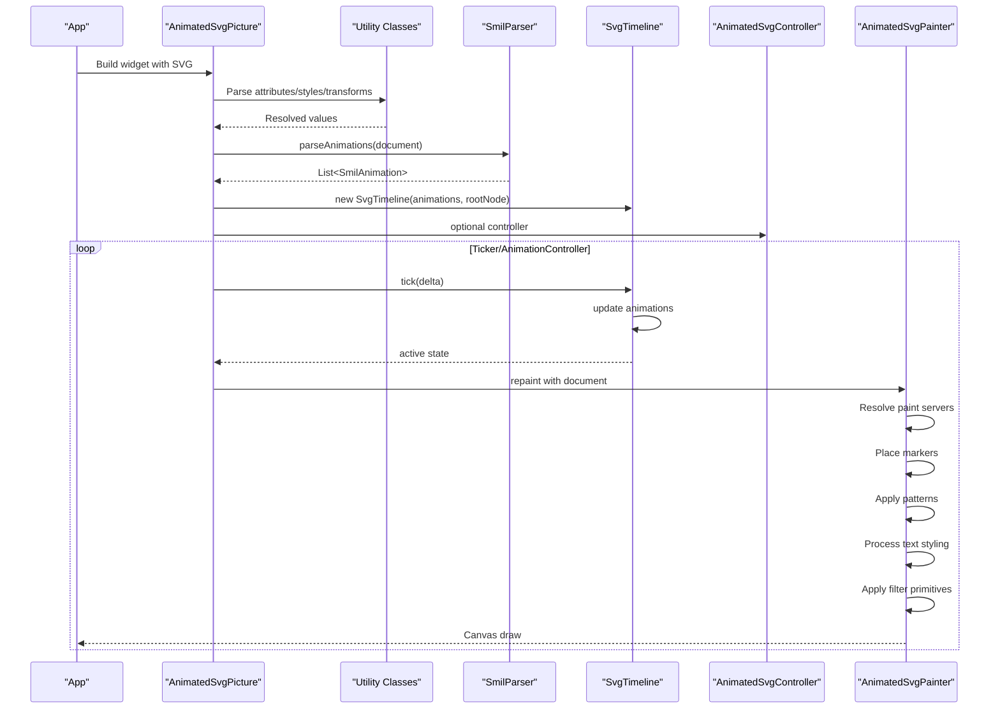
```mermaid
sequenceDiagram
participant App as "App"
participant Widget as "AnimatedSvgPicture"
participant Utils as "Utility Classes"
participant Parser as "SmilParser"
participant Timeline as "SvgTimeline"
participant Controller as "AnimatedSvgController"
participant Painter as "AnimatedSvgPainter"
App->>Widget : Build widget with SVG
Widget->>Utils : Parse attributes/styles/transforms
Utils-->>Widget : Resolved values
Widget->>Parser : parseAnimations(document)
Parser-->>Widget : List<SmilAnimation>
Widget->>Timeline : new SvgTimeline(animations, rootNode)
Widget->>Controller : optional controller
loop Ticker/AnimationController
Widget->>Timeline : tick(delta)
Timeline->>Timeline : update animations
Timeline-->>Widget : active state
Widget->>Painter : repaint with document
Painter->>Painter : Resolve paint servers
Painter->>Painter : Place markers
Painter->>Painter : Apply patterns
Painter->>Painter : Process text styling
Painter->>Painter : Apply filter primitives
Painter-->>App : Canvas draw
end
```

**Diagram sources**
- [lib/src/animation/smil/smil_parser.dart:17-37](file://lib/src/animation/smil/smil_parser.dart#L17-L37)
- [lib/src/animation/smil/smil_timeline.dart:82-98](file://lib/src/animation/smil/smil_timeline.dart#L82-L98)
- [lib/src/animation/animated_svg_picture.dart:166-220](file://lib/src/animation/animated_svg_picture.dart#L166-L220)
- [lib/src/animation/animated_svg_controller.dart:25-131](file://lib/src/animation/animated_svg_controller.dart#L25-L131)
- [lib/src/animation/animated_svg_painter_gradients.dart:1-44](file://lib/src/animation/animated_svg_painter_gradients.dart#L1-L44)
- [lib/src/animation/animated_svg_painter_patterns.dart:1-183](file://lib/src/animation/animated_svg_painter_patterns.dart#L1-L183)
- [lib/src/animation/animated_svg_painter_markers.dart:1-449](file://lib/src/animation/animated_svg_painter_markers.dart#L1-L449)
- [lib/src/animation/animated_svg_painter_paint_order.dart:1-90](file://lib/src/animation/animated_svg_painter_paint_order.dart#L1-L90)
- [lib/src/animation/animated_svg_painter_text_style.dart:13-342](file://lib/src/animation/animated_svg_painter_text_style.dart#L13-L342)
- [lib/src/animation/svg_filters_primitives.dart:1-151](file://lib/src/animation/svg_filters_primitives.dart#L1-L151)

**Section sources**
- [ARCHITECTURE.md:146-154](file://ARCHITECTURE.md#L146-L154)

## Detailed Component Analysis

### AnimatedSvgPicture Widget
- Purpose: Loads and renders animated SVGs, integrates with Flutter's Ticker/AnimationController, and exposes playback controls.
- Key behaviors:
  - Detects presence of animations and wraps with gesture detectors for event-based triggers.
  - Supports autoPlay, initialTime, playbackRate, and controller injection.
  - Exposes play(), pause(), reset(), seekTo().
  - Emits structured trace events via onTrace with configurable frame tick verbosity.
- Lifecycle:
  - Initializes DOM, parses animations, constructs timeline, and starts/stops AnimationController based on autoPlay and playbackRate changes.
  - Updates controller listener when widget controller changes.
  - **Enhanced**: Utilizes new utility classes for consistent parsing and resolution of attributes, styles, and transforms.

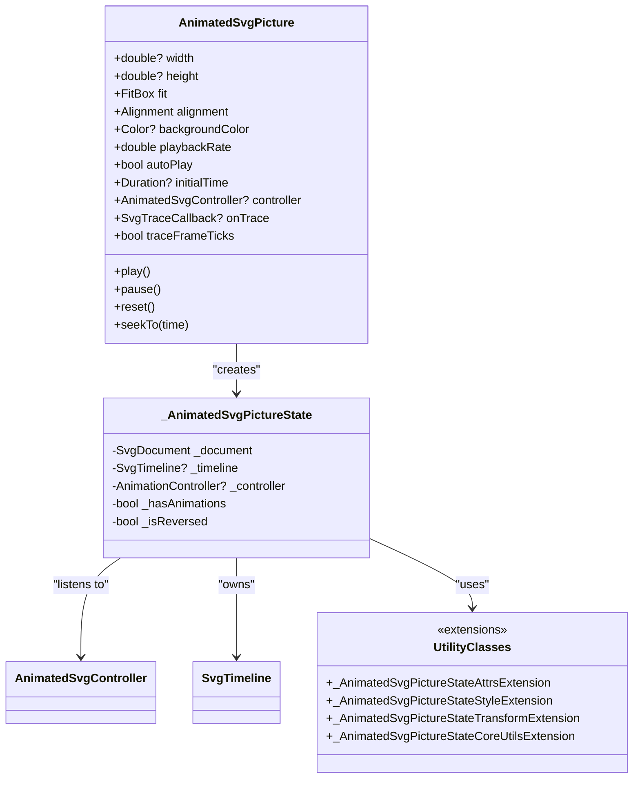
```mermaid
classDiagram
class AnimatedSvgPicture {
+double? width
+double? height
+FitBox fit
+Alignment alignment
+Color? backgroundColor
+double playbackRate
+bool autoPlay
+Duration? initialTime
+AnimatedSvgController? controller
+SvgTraceCallback? onTrace
+bool traceFrameTicks
+play()
+pause()
+reset()
+seekTo(time)
}
class _AnimatedSvgPictureState {
-SvgDocument _document
-SvgTimeline? _timeline
-AnimationController? _controller
-bool _hasAnimations
-bool _isReversed
}
class UtilityClasses {
<<extensions>>
+_AnimatedSvgPictureStateAttrsExtension
+_AnimatedSvgPictureStateStyleExtension
+_AnimatedSvgPictureStateTransformExtension
+_AnimatedSvgPictureStateCoreUtilsExtension
}
AnimatedSvgPicture --> _AnimatedSvgPictureState : "creates"
_AnimatedSvgPictureState --> AnimatedSvgController : "listens to"
_AnimatedSvgPictureState --> SvgTimeline : "owns"
_AnimatedSvgPictureState --> UtilityClasses : "uses"
```

**Diagram sources**
- [lib/src/animation/animated_svg_picture.dart:108-164](file://lib/src/animation/animated_svg_picture.dart#L108-L164)
- [lib/src/animation/animated_svg_picture.dart:166-220](file://lib/src/animation/animated_svg_picture.dart#L166-L220)
- [lib/src/animation/animated_svg_picture_utils.dart:1-69](file://lib/src/animation/animated_svg_picture_utils.dart#L1-L69)
- [lib/src/animation/animated_svg_picture_utils_attrs.dart:1-132](file://lib/src/animation/animated_svg_picture_utils_attrs.dart#L1-L132)
- [lib/src/animation/animated_svg_picture_utils_style.dart:1-88](file://lib/src/animation/animated_svg_picture_utils_style.dart#L1-L88)
- [lib/src/animation/animated_svg_picture_utils_transform.dart:1-84](file://lib/src/animation/animated_svg_picture_utils_transform.dart#L1-L84)

**Section sources**
- [lib/src/animation/animated_svg_picture.dart:108-164](file://lib/src/animation/animated_svg_picture.dart#L108-L164)
- [lib/src/animation/animated_svg_picture.dart:166-220](file://lib/src/animation/animated_svg_picture.dart#L166-L220)
- [lib/src/animation/animated_svg_picture.dart:271-295](file://lib/src/animation/animated_svg_picture.dart#L271-L295)

### AnimatedSvgController
- Purpose: Programmatic control surface for playback.
- Methods:
  - pause(), resume(), togglePlayPause()
  - seek(time), setPlaybackRate(rate), reverse(), forward(), toggleDirection(), restart()
  - Observability: isPaused, playbackRate, isReversed, pendingSeek
- Notes:
  - Validates playbackRate > 0.
  - Notifies listeners on state changes.

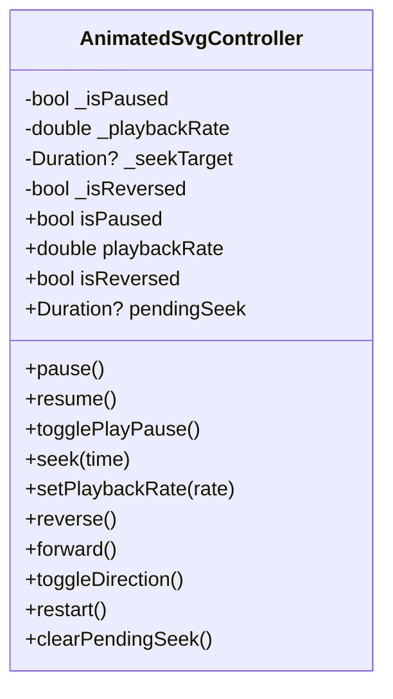
```mermaid
classDiagram
class AnimatedSvgController {
-bool _isPaused
-double _playbackRate
-Duration? _seekTarget
-bool _isReversed
+bool isPaused
+double playbackRate
+bool isReversed
+Duration? pendingSeek
+pause()
+resume()
+togglePlayPause()
+seek(time)
+setPlaybackRate(rate)
+reverse()
+forward()
+toggleDirection()
+restart()
+clearPendingSeek()
}
```

**Diagram sources**
- [lib/src/animation/animated_svg_controller.dart:25-131](file://lib/src/animation/animated_svg_controller.dart#L25-L131)

**Section sources**
- [lib/src/animation/animated_svg_controller.dart:25-131](file://lib/src/animation/animated_svg_controller.dart#L25-L131)

### SvgTimeline
- Purpose: Central time manager for all animations.
- Responsibilities:
  - Tick advancement with playbackRate scaling.
  - Seek to absolute time with boundary checks.
  - Reset timeline and dependent state.
  - Event-based activation via triggerEvent(elementId?, eventType).
  - Syncbase timing resolution and begin/end computation.
  - Total duration calculation across animations.
- Active state inspection via getActiveAnimations() and hasActiveAnimations().

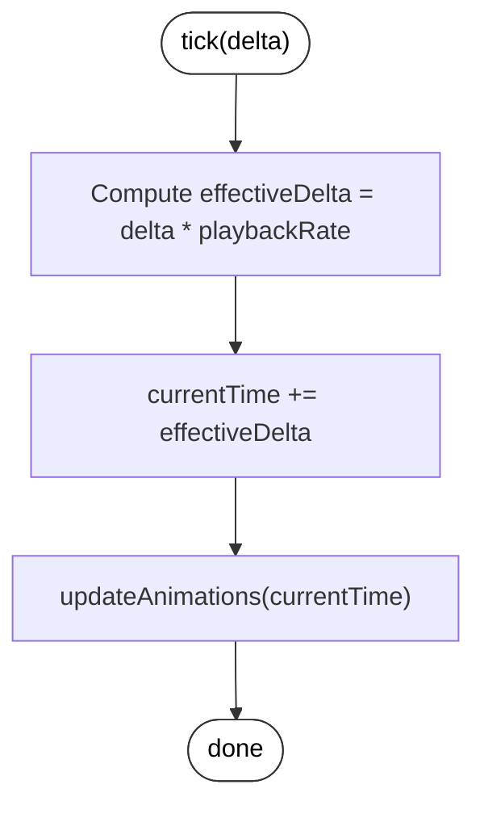
```mermaid
flowchart TD
Start(["tick(delta)"]) --> Scale["Compute effectiveDelta = delta * playbackRate"]
Scale --> AddTime["currentTime += effectiveDelta"]
AddTime --> Update["updateAnimations(currentTime)"]
Update --> End(["done"])
style Start fill:#fff,stroke:#333,color:#000
style End fill:#fff,stroke:#333,color:#000
```

**Diagram sources**
- [lib/src/animation/smil/smil_timeline.dart:82-86](file://lib/src/animation/smil/smil_timeline.dart#L82-L86)

**Section sources**
- [lib/src/animation/smil/smil_timeline.dart:20-67](file://lib/src/animation/smil/smil_timeline.dart#L20-L67)
- [lib/src/animation/smil/smil_timeline.dart:82-98](file://lib/src/animation/smil/smil_timeline.dart#L82-L98)
- [lib/src/animation/smil/smil_timeline.dart:100-126](file://lib/src/animation/smil/smil_timeline.dart#L100-L126)
- [lib/src/animation/smil/smil_timeline.dart:128-158](file://lib/src/animation/smil/smil_timeline.dart#L128-L158)
- [lib/src/animation/smil/smil_timeline.dart:201-231](file://lib/src/animation/smil/smil_timeline.dart#L201-L231)

### SmilAnimation
- Purpose: Encapsulates SMIL semantics and value computation.
- Types:
  - animate, animateTransform, animateMotion, set, animateColor
- Modes:
  - calcMode: linear, discrete, paced, spline
  - fillMode: freeze, remove
  - additive: replace, sum
  - playbackDirection: normal, reverse, alternate, alternateReverse
- Key computations:
  - Values-based vs from/to/by vs discrete
  - Paced keyTimes generation via distance metrics
  - Local time and iteration calculation
  - Final value application with accumulate/additive
- Motion-specific:
  - animateMotion uses MotionPath for position/angle computation.

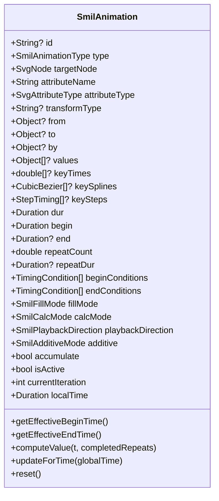
```mermaid
classDiagram
class SmilAnimation {
+String? id
+SmilAnimationType type
+SvgNode targetNode
+String attributeName
+SvgAttributeType attributeType
+String? transformType
+Object? from
+Object? to
+Object? by
+Object[]? values
+double[]? keyTimes
+CubicBezier[]? keySplines
+StepTiming[]? keySteps
+Duration dur
+Duration begin
+Duration? end
+double repeatCount
+Duration? repeatDur
+TimingCondition[] beginConditions
+TimingCondition[] endConditions
+SmilFillMode fillMode
+SmilCalcMode calcMode
+SmilPlaybackDirection playbackDirection
+SmilAdditiveMode additive
+bool accumulate
+bool isActive
+int currentIteration
+Duration localTime
+getEffectiveBeginTime()
+getEffectiveEndTime()
+computeValue(t, completedRepeats)
+updateForTime(globalTime)
+reset()
}
```

**Diagram sources**
- [lib/src/animation/smil/smil_animation.dart:80-131](file://lib/src/animation/smil/smil_animation.dart#L80-L131)
- [lib/src/animation/smil/smil_animation.dart:325-365](file://lib/src/animation/smil/smil_animation.dart#L325-L365)
- [lib/src/animation/smil/smil_animation.dart:367-431](file://lib/src/animation/smil/smil_animation.dart#L367-L431)

**Section sources**
- [lib/src/animation/smil/smil_animation.dart:13-29](file://lib/src/animation/smil/smil_animation.dart#L13-L29)
- [lib/src/animation/smil/smil_animation.dart:31-44](file://lib/src/animation/smil/smil_animation.dart#L31-L44)
- [lib/src/animation/smil/smil_animation.dart:79-131](file://lib/src/animation/smil/smil_animation.dart#L79-L131)
- [lib/src/animation/smil/smil_animation.dart:325-431](file://lib/src/animation/smil/smil_animation.dart#L325-L431)

### SmilParser and CSS-to-SMIL Conversion
- SmilParser:
  - Extracts SMIL animations from DOM nodes and CSS keyframes/style attributes.
  - Delegates CSS extraction and selector-based rules.
- CssToSmilConverter:
  - Converts CSS @keyframes and animation properties into typed SmilAnimation instances.
  - Handles compound transform decomposition for SVG transform normalization.
  - Infers attribute types and maps CSS properties to SMIL-equivalent attributes.

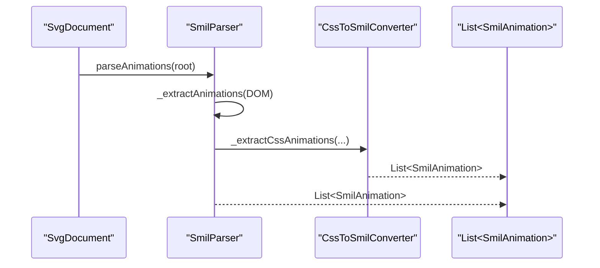
```mermaid
sequenceDiagram
participant Doc as "SvgDocument"
participant Parser as "SmilParser"
participant CSS as "CssToSmilConverter"
participant Out as "List<SmilAnimation>"
Doc->>Parser : parseAnimations(root)
Parser->>Parser : _extractAnimations(DOM)
Parser->>CSS : _extractCssAnimations(...)
CSS-->>Out : List<SmilAnimation>
Parser-->>Out : List<SmilAnimation>
```

**Diagram sources**
- [lib/src/animation/smil/smil_parser.dart:17-37](file://lib/src/animation/smil/smil_parser.dart#L17-L37)
- [lib/src/animation/css_to_smil_converter.dart:17-66](file://lib/src/animation/css_to_smil_converter.dart#L17-L66)

**Section sources**
- [lib/src/animation/smil/smil_parser.dart:17-37](file://lib/src/animation/smil/smil_parser.dart#L17-L37)
- [lib/src/animation/css_to_smil_converter.dart:17-66](file://lib/src/animation/css_to_smil_converter.dart#L17-L66)

### Interpolators and MotionPath
- Interpolators:
  - Type-aware interpolation for numbers, colors, transforms, paths, and lists.
  - Additive arithmetic for numeric and list types.
- MotionPath:
  - Parses SVG path data and computes position/angle along the path.
  - Supports keyPoints with optional keyTimes for variable-speed motion.

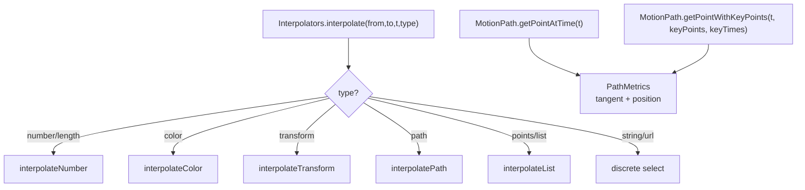
```mermaid
flowchart TD
A["Interpolators.interpolate(from,to,t,type)"] --> B{"type?"}
B --> |number/length| N["interpolateNumber"]
B --> |color| C["interpolateColor"]
B --> |transform| T["interpolateTransform"]
B --> |path| P["interpolatePath"]
B --> |points/list| L["interpolateList"]
B --> |string/url| D["discrete select"]
M["MotionPath.getPointAtTime(t)"] --> R["PathMetrics<br/>tangent + position"]
K["MotionPath.getPointWithKeyPoints(t, keyPoints, keyTimes)"] --> R
```

**Diagram sources**
- [lib/src/animation/smil/interpolators.dart:18-42](file://lib/src/animation/smil/interpolators.dart#L18-L42)
- [lib/src/animation/smil/motion_path.dart:97-145](file://lib/src/animation/smil/motion_path.dart#L97-L145)
- [lib/src/animation/smil/motion_path.dart:147-217](file://lib/src/animation/smil/motion_path.dart#L147-L217)

**Section sources**
- [lib/src/animation/smil/interpolators.dart:14-42](file://lib/src/animation/smil/interpolators.dart#L14-L42)
- [lib/src/animation/smil/interpolators.dart:118-146](file://lib/src/animation/smil/interpolators.dart#L118-L146)
- [lib/src/animation/smil/motion_path.dart:22-52](file://lib/src/animation/smil/motion_path.dart#L22-L52)
- [lib/src/animation/smil/motion_path.dart:97-145](file://lib/src/animation/smil/motion_path.dart#L97-L145)
- [lib/src/animation/smil/motion_path.dart:147-217](file://lib/src/animation/smil/motion_path.dart#L147-L217)

### DOM Model and Effective Values
- SvgNode holds AnimatableSvgAttribute entries with baseValue and animatedValue.
- Effective value selection prefers animatedValue when an animation is active.
- Tree-level flags (hasAnimations, cachedPicture) enable subtree caching and dirty tracking.

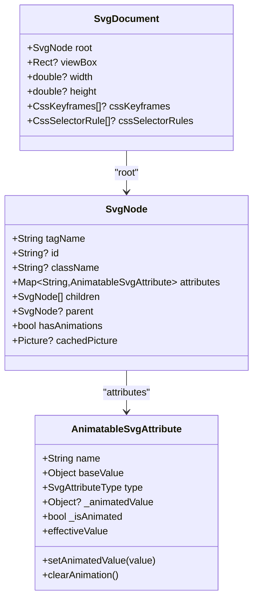
```mermaid
classDiagram
class SvgDocument {
+SvgNode root
+Rect? viewBox
+double? width
+double? height
+CssKeyframes[]? cssKeyframes
+CssSelectorRule[]? cssSelectorRules
}
class SvgNode {
+String tagName
+String? id
+String? className
+Map~String,AnimatableSvgAttribute~ attributes
+SvgNode[] children
+SvgNode? parent
+bool hasAnimations
+Picture? cachedPicture
}
class AnimatableSvgAttribute {
+String name
+Object baseValue
+SvgAttributeType type
+Object? _animatedValue
+bool _isAnimated
+effectiveValue
+setAnimatedValue(value)
+clearAnimation()
}
SvgDocument --> SvgNode : "root"
SvgNode --> AnimatableSvgAttribute : "attributes"
```

**Diagram sources**
- [lib/src/animation/svg_dom.dart:124-161](file://lib/src/animation/svg_dom.dart#L124-L161)
- [lib/src/animation/svg_dom.dart:266-317](file://lib/src/animation/svg_dom.dart#L266-L317)

**Section sources**
- [lib/src/animation/svg_dom.dart:124-161](file://lib/src/animation/svg_dom.dart#L124-L161)
- [lib/src/animation/svg_dom.dart:266-317](file://lib/src/animation/svg_dom.dart#L266-L317)

## Enhanced Text Styling System

The enhanced text styling system provides comprehensive support for 53 CSS properties organized across specialized modules, enabling precise control over text rendering and typography.

### Text Styling Architecture
The system is organized into five specialized modules that handle different aspects of text styling:

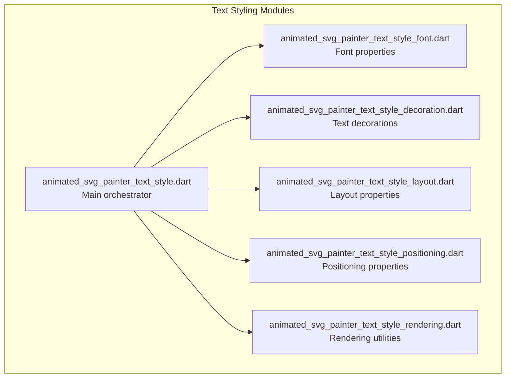
```mermaid
graph TB
subgraph "Text Styling Modules"
A["animated_svg_painter_text_style.dart<br/>Main orchestrator"]
B["animated_svg_painter_text_style_font.dart<br/>Font properties"]
C["animated_svg_painter_text_style_decoration.dart<br/>Text decorations"]
D["animated_svg_painter_text_style_layout.dart<br/>Layout properties"]
E["animated_svg_painter_text_style_positioning.dart<br/>Positioning properties"]
F["animated_svg_painter_text_style_rendering.dart<br/>Rendering utilities"]
end
A --> B
A --> C
A --> D
A --> E
A --> F
```

**Diagram sources**
- [lib/src/animation/animated_svg_painter_text_style.dart:13-342](file://lib/src/animation/animated_svg_painter_text_style.dart#L13-L342)
- [lib/src/animation/animated_svg_painter_text_style_font.dart:12-362](file://lib/src/animation/animated_svg_painter_text_style_font.dart#L12-L362)
- [lib/src/animation/animated_svg_painter_text_style_decoration.dart:10-315](file://lib/src/animation/animated_svg_painter_text_style_decoration.dart#L10-L315)
- [lib/src/animation/animated_svg_painter_text_style_layout.dart:10-451](file://lib/src/animation/animated_svg_painter_text_style_layout.dart#L10-L451)
- [lib/src/animation/animated_svg_painter_text_style_positioning.dart:13-335](file://lib/src/animation/animated_svg_painter_text_style_positioning.dart#L13-L335)
- [lib/src/animation/animated_svg_painter_text_style_rendering.dart:10-546](file://lib/src/animation/animated_svg_painter_text_style_rendering.dart#L10-L546)

### Font Property Resolution
The font module handles comprehensive font-related CSS properties including font variants, stretching, kerning, and synthesis:

- **Font Variants**: Small-caps, petiste-caps, unicase, titling-caps, oldstyle-nums, lining-nums, tabular-nums, proportional-nums
- **Font Stretch**: Percentage values (50-200%) with keyword support (ultra-condensed to ultra-expanded)
- **Font Kerning**: Auto, normal, none control
- **Font Variant Numeric**: Control over numeric glyph variants
- **Font Variant Ligatures**: Common, discretionary, historical ligatures with contextual support
- **Font Variant Caps**: Small-caps variants with all-small-caps combinations
- **Font Optical Sizing**: Auto or none control
- **Font Synthesis**: Weight, style, small-caps synthesis control
- **Font Variant Position**: Subscript/superscript glyph variants
- **Font Variant East Asian**: JIS standards, simplified/traditional variants, ruby support
- **Font Language Override**: OpenType language system control
- **Font Variant Alternates**: Stylistic alternates support
- **Font Palette**: Color font palettes (light, dark, custom)
- **Font Variation Settings**: Variable font axes control

**Section sources**
- [lib/src/animation/animated_svg_painter_text_style_font.dart:12-362](file://lib/src/animation/animated_svg_painter_text_style_font.dart#L12-L362)

### Text Decoration Resolution
The decoration module provides comprehensive text decoration support:

- **Text Decoration**: Underline, overline, line-through with inheritance
- **Text Decoration Line**: Individual line control (underline, overline, line-through, blink)
- **Text Decoration Style**: Solid, double, dotted, dashed, wavy styles
- **Text Decoration Color**: Color control with currentColor support
- **Text Decoration Thickness**: Thickness control in user units, em, px, percentage
- **Text Underline Position**: Under, left, right, from-font positioning
- **Text Underline Offset**: Offset control with em, px, auto values
- **Text Decoration Skip**: Objects, spaces, edges, box-decoration skipping
- **Text Decoration Skip Ink**: Automatic ink skipping control
- **Text Shadow**: Multi-layer shadow support
- **Text Emphasis**: Emphasis marks with style and color control
- **Text Emphasis Position**: Over/under, right/left positioning
- **Text Emphasis Style**: Various emphasis mark styles (filled, open, dot, circle, triangle, sesame)

**Section sources**
- [lib/src/animation/animated_svg_painter_text_style_decoration.dart:10-315](file://lib/src/animation/animated_svg_painter_text_style_decoration.dart#L10-L315)

### Layout Property Resolution
The layout module handles text layout and whitespace control:

- **Tab Size**: Tab character expansion control (1-32 spaces)
- **Text Indent**: Indentation control with percentages, em, px
- **White Space**: Normal, nowrap, pre, pre-wrap, pre-line, break-spaces handling
- **Text Overflow**: Clip, ellipsis, or custom overflow representation
- **Word Break**: Normal, break-all, keep-all, break-word control
- **Overflow Wrap**: Normal, break-word, anywhere control
- **Text Transform**: None, capitalize, uppercase, lowercase, full-width, full-size-kana
- **Hyphens**: None, manual, auto hyphenation control
- **Hyphenate Character**: Custom hyphenation character control
- **Line Break**: Auto, loose, normal, strict, anywhere control
- **Line Height**: Normal, number multipliers, length, percentage values
- **Vertical Align**: Baseline, sub, super, text-top, text-bottom, middle, top, bottom control
- **Hanging Punctuation**: First, last, force-end, allow-end control
- **Text Justify**: Auto, none, inter-word, inter-character control
- **Text Align Last**: Auto, start, end, left, right, center, justify control
- **Quotes**: Auto, none, or custom quote strings
- **Initial Letter**: Drop cap control
- **Text Spacing**: Normal, none, auto control for CJK punctuation
- **Text Wrap**: Wrap, nowrap, balance, pretty, stable control

**Section sources**
- [lib/src/animation/animated_svg_painter_text_style_layout.dart:10-451](file://lib/src/animation/animated_svg_painter_text_style_layout.dart#L10-L451)

### Positioning Property Resolution
The positioning module handles text positioning and writing modes:

- **Writing Mode**: Horizontal-tb, vertical-rl, vertical-lr with legacy SVG 1.1 support
- **Direction**: LTR/RTL text direction control
- **Text Orientation**: Mixed, upright, sideways control
- **Dominant Baseline**: Alphabetic, central, middle, text-before-edge, text-after-edge, hanging, mathematical, ideographic
- **Baseline Shift**: Baseline, sub, super, percentage, em, ex, length values
- **Glyph Orientation Vertical**: Vertical glyph rotation angles
- **Unicode Bidi**: Embed, isolate, override, plaintext control
- **Text Combine Upright**: None, all, digits with count control
- **Paint Order**: Fill, stroke, markers layer ordering
- **Ruby Align**: Space-around, start, center, space-between control
- **Ruby Position**: Over, under, inter-character, alternate control

**Section sources**
- [lib/src/animation/animated_svg_painter_text_style_positioning.dart:13-335](file://lib/src/animation/animated_svg_painter_text_style_positioning.dart#L13-L335)

### Rendering Utilities
The rendering module provides text building and processing utilities:

- **Paragraph Building**: Font feature and variation support with caching
- **Unicode Bidi Processing**: Full Unicode directional control character support
- **Text Path Geometry**: Path resolution with transform support
- **Whitespace Normalization**: XML and CSS whitespace handling with preservation options
- **Text Length Adjustment**: Text length scaling with spacing and glyph adjustment
- **Baseline Reference Calculation**: Accurate baseline positioning for different writing modes
- **Content Visibility**: Rendering optimization control
- **Will Change**: Performance hinting for expected changes
- **Mixed Blend Mode**: Advanced blending mode support
- **Forced Color Adjust**: Forced colors mode control
- **Print Color Adjust**: Printing color adjustment control

**Section sources**
- [lib/src/animation/animated_svg_painter_text_style_rendering.dart:10-546](file://lib/src/animation/animated_svg_painter_text_style_rendering.dart#L10-L546)

## Vertical Writing Modes Support

The system provides comprehensive support for vertical text rendering through writing-mode attributes, enabling proper text flow in different writing directions.

### Writing Mode Resolution
The writing mode system supports three primary modes:

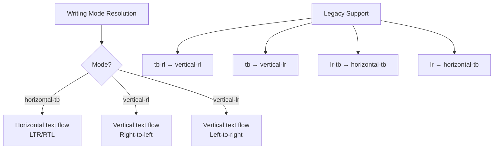
```mermaid
flowchart TD
A["Writing Mode Resolution"] --> B{"Mode?"}
B --> |horizontal-tb| C["Horizontal text flow<br/>LTR/RTL"]
B --> |vertical-rl| D["Vertical text flow<br/>Right-to-left"]
B --> |vertical-lr| E["Vertical text flow<br/>Left-to-right"]
F["Legacy Support"] --> G["tb-rl → vertical-rl"]
F --> H["tb → vertical-lr"]
F --> I["lr-tb → horizontal-tb"]
F --> J["lr → horizontal-tb"]
```

**Diagram sources**
- [lib/src/animation/animated_svg_painter_text_style_positioning.dart:15-33](file://lib/src/animation/animated_svg_painter_text_style_positioning.dart#L15-L33)

### Vertical Text Rendering Implementation
The vertical text rendering system handles glyph positioning and rotation:

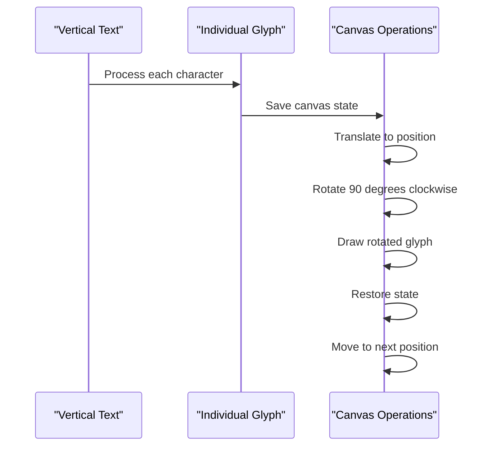
```mermaid
sequenceDiagram
participant Text as "Vertical Text"
participant Glyph as "Individual Glyph"
participant Canvas as "Canvas Operations"
Text->>Glyph : Process each character
Glyph->>Canvas : Save canvas state
Canvas->>Canvas : Translate to position
Canvas->>Canvas : Rotate 90 degrees clockwise
Canvas->>Canvas : Draw rotated glyph
Canvas->>Canvas : Restore state
Canvas->>Canvas : Move to next position
```

**Diagram sources**
- [lib/src/animation/animated_svg_painter_text_paint.dart:475-526](file://lib/src/animation/animated_svg_painter_text_paint.dart#L475-L526)

### Baseline and Alignment Handling
Vertical writing modes require special baseline calculations:

- **Central Baseline**: Most common for vertical text (half of text height)
- **Text Before/After Edge**: Top/bottom alignment for vertical text
- **Hanging Baseline**: Special handling for Indic scripts
- **Mathematical Baseline**: Centered for mathematical operators
- **Ideographic Baseline**: Bottom alignment for ideographic characters

**Section sources**
- [lib/src/animation/animated_svg_painter_text_style_positioning.dart:209-259](file://lib/src/animation/animated_svg_painter_text_style_positioning.dart#L209-L259)
- [lib/src/animation/animated_svg_painter_text_paint.dart:475-526](file://lib/src/animation/animated_svg_painter_text_paint.dart#L475-L526)

## XML Whitespace Normalization

The enhanced whitespace normalization system provides comprehensive control over text content processing according to both XML and CSS specifications.

### Whitespace Processing Logic
The system handles multiple whitespace handling modes:

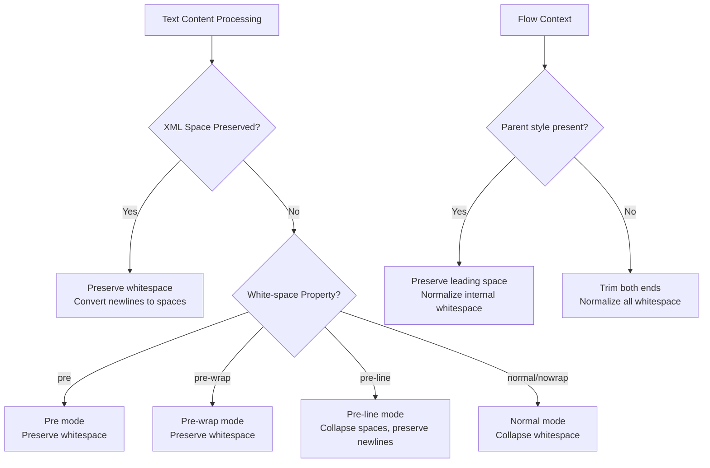
```mermaid
flowchart TD
A["Text Content Processing"] --> B{"XML Space Preserved?"}
B --> |Yes| C["Preserve whitespace<br/>Convert newlines to spaces"]
B --> |No| D{"White-space Property?"}
D --> |pre| E["Pre mode<br/>Preserve whitespace"]
D --> |pre-wrap| F["Pre-wrap mode<br/>Preserve whitespace"]
D --> |pre-line| G["Pre-line mode<br/>Collapse spaces, preserve newlines"]
D --> |normal/nowrap| H["Normal mode<br/>Collapse whitespace"]
I["Flow Context"] --> J{"Parent style present?"}
J --> |Yes| K["Preserve leading space<br/>Normalize internal whitespace"]
J --> |No| L["Trim both ends<br/>Normalize all whitespace"]
```

**Diagram sources**
- [lib/src/animation/animated_svg_painter_text_style_rendering.dart:303-397](file://lib/src/animation/animated_svg_painter_text_style_rendering.dart#L303-L397)

### Multi-Tspan Flow Handling
The system provides special handling for text flow between tspans:

- **Leading Whitespace Preservation**: Preserves leading space in tspans for proper text flow
- **Internal Whitespace Normalization**: Collapses multiple spaces to single space within tspans
- **Trailing Whitespace Handling**: Removes trailing whitespace except when text consists only of whitespace
- **Empty Tspan Handling**: Treats pure whitespace tspans as single space for flow continuity

**Section sources**
- [lib/src/animation/animated_svg_painter_text_style_rendering.dart:346-397](file://lib/src/animation/animated_svg_painter_text_style_rendering.dart#L346-L397)

## Text Path Rendering Improvements

The enhanced text path rendering system provides improved support for text along paths with closed path wrapping behavior and advanced spacing control.

### Closed Path Wrapping Behavior
The system now supports wrapping text around closed paths:

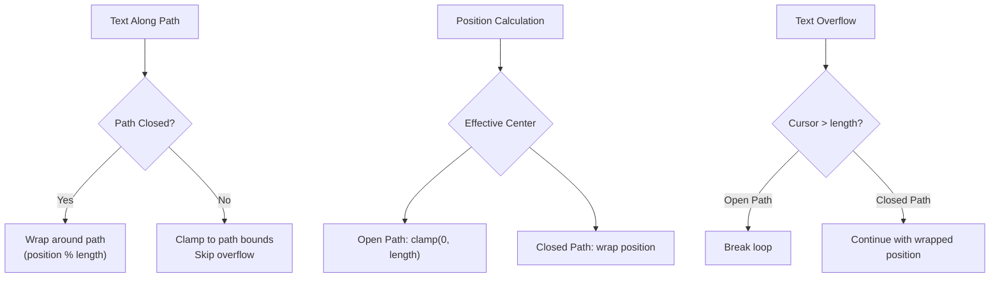
```mermaid
flowchart TD
A["Text Along Path"] --> B{"Path Closed?"}
B --> |Yes| C["Wrap around path<br/>(position % length)"]
B --> |No| D["Clamp to path bounds<br/>Skip overflow"]
E["Position Calculation"] --> F{"Effective Center"}
F --> G["Open Path: clamp(0, length)"]
F --> H["Closed Path: wrap position"]
I["Text Overflow"] --> J{"Cursor > length?"}
J --> |Open Path| K["Break loop"]
J --> |Closed Path| L["Continue with wrapped position"]
```

**Diagram sources**
- [lib/src/animation/animated_svg_painter_text_paint.dart:647-663](file://lib/src/animation/animated_svg_painter_text_paint.dart#L647-L663)

### Advanced Spacing Control
The text path system now supports two spacing modes:

- **Auto Mode**: Applies CSS letter-spacing and word-spacing inherited from style attributes
- **Exact Mode**: Ignores CSS spacing and uses exact glyph spacing for precise text fitting

### Method and Scaling Support
The system provides enhanced text path methods:

- **Align Method**: Default method with spacing control
- **Stretch Method**: Uniform scaling to fit available path length
- **Text Length Priority**: textLength takes precedence over method="stretch"

**Section sources**
- [lib/src/animation/animated_svg_painter_text_paint.dart:528-696](file://lib/src/animation/animated_svg_painter_text_paint.dart#L528-L696)
- [lib/src/animation/animated_svg_picture_hit_test_text_path_segments.dart:1-144](file://lib/src/animation/animated_svg_picture_hit_test_text_path_segments.dart#L1-L144)

## Comprehensive Filter Primitive Capabilities

The enhanced filter system provides comprehensive support for SVG filter primitives with advanced capabilities for effects processing.

### Filter Primitive Categories
The system supports multiple categories of filter primitives:

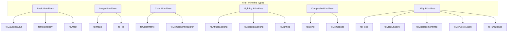
```mermaid
graph TB
subgraph "Filter Primitive Types"
A["Basic Primitives"]
B["Image Primitives"]
C["Color Primitives"]
D["Lighting Primitives"]
E["Composite Primitives"]
F["Utility Primitives"]
end
A --> A1["feGaussianBlur"]
A --> A2["feMorphology"]
A --> A3["feOffset"]
B --> B1["feImage"]
B --> B2["feTile"]
C --> C1["feColorMatrix"]
C --> C2["feComponentTransfer"]
D --> D1["feDiffuseLighting"]
D --> D2["feSpecularLighting"]
D --> D3["feLighting"]
E --> E1["feBlend"]
E --> E2["feComposite"]
F --> F1["feFlood"]
F --> F2["feDropShadow"]
F --> F3["feDisplacementMap"]
F --> F4["feConvolveMatrix"]
F --> F5["feTurbulence"]
```

**Diagram sources**
- [lib/src/animation/svg_filters_primitives.dart:1-151](file://lib/src/animation/svg_filters_primitives.dart#L1-L151)
- [lib/src/animation/svg_filters_registry_pipeline_primitives.dart:3-161](file://lib/src/animation/svg_filters_registry_pipeline_primitives.dart#L3-L161)

### Advanced Filter Implementations
The system provides detailed parameter support for each filter type:

- **feGaussianBlur**: Standard deviation, edge handling, kernel size limits
- **feMorphology**: Operator selection (erosion/dilation), radius control
- **feDisplacementMap**: Scale factors, channel selectors (RGBA), input handling
- **feConvolveMatrix**: Kernel matrices, divisor/bias, edge modes, preserve alpha
- **feTurbulence**: Base frequency, octaves, seed, stitch tiles, noise types
- **feLighting**: Light source types, surface scales, specular/exponential factors
- **feColorMatrix**: 5x4 matrix coefficients for color transformations
- **feComponentTransfer**: Transfer functions for RGB channels
- **feImage**: External image sources, preserveAspectRatio, sub-rectangle geometry

**Section sources**
- [lib/src/animation/svg_filters_primitives.dart:1-151](file://lib/src/animation/svg_filters_primitives.dart#L1-L151)

### Filter Pipeline Processing
The filter system processes primitives through a comprehensive pipeline:

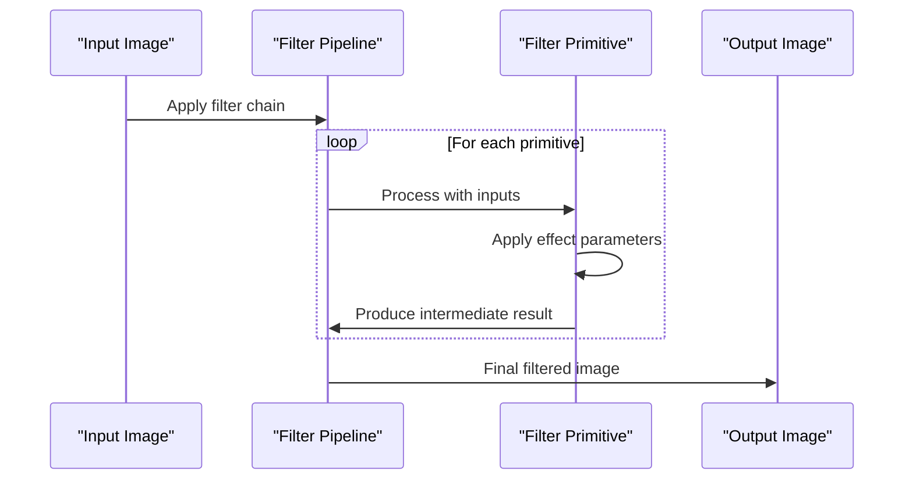
```mermaid
sequenceDiagram
participant Input as "Input Image"
participant Pipeline as "Filter Pipeline"
participant Primitive as "Filter Primitive"
participant Output as "Output Image"
Input->>Pipeline : Apply filter chain
loop For each primitive
Pipeline->>Primitive : Process with inputs
Primitive->>Primitive : Apply effect parameters
Primitive->>Pipeline : Produce intermediate result
end
Pipeline->>Output : Final filtered image
```

**Diagram sources**
- [lib/src/animation/svg_filters_registry_pipeline_primitives.dart:3-161](file://lib/src/animation/svg_filters_registry_pipeline_primitives.dart#L3-L161)

**Section sources**
- [lib/src/animation/svg_filters_registry_pipeline_primitives.dart:3-161](file://lib/src/animation/svg_filters_registry_pipeline_primitives.dart#L3-L161)

## Enhanced Paint Order System

The paint order system provides comprehensive control over the rendering order of different paint layers in SVG shapes. It allows precise control over whether fill, stroke, and markers are drawn in specific orders.

### Paint Order Layers
The system defines three paint layers with specific rendering priorities:
- **fill**: Primary fill area of shapes
- **stroke**: Outline/border of shapes  
- **markers**: Arrowheads and decorative markers placed along paths

### Paint Order Parsing and Resolution
The paint order system parses the `paint-order` attribute and determines the rendering sequence:

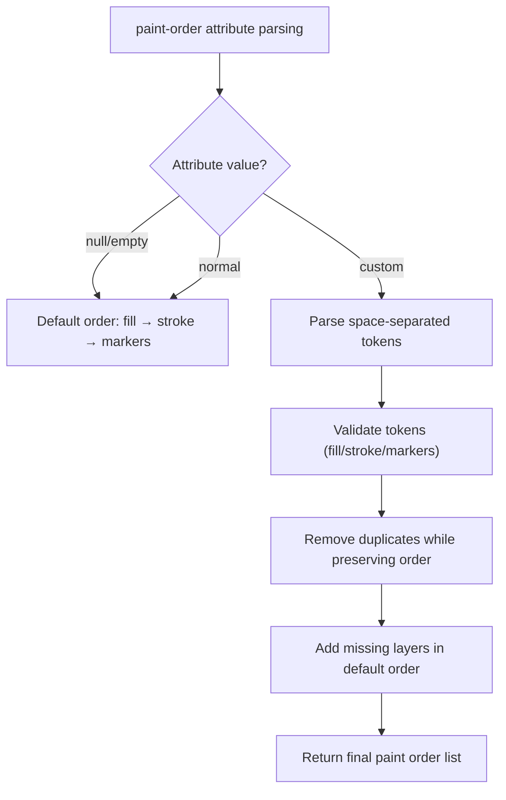
```mermaid
flowchart TD
A["paint-order attribute parsing"] --> B{"Attribute value?"}
B --> |null/empty| C["Default order: fill → stroke → markers"]
B --> |"normal"| C
B --> |custom| D["Parse space-separated tokens"]
D --> E["Validate tokens (fill/stroke/markers)"]
E --> F["Remove duplicates while preserving order"]
F --> G["Add missing layers in default order"]
G --> H["Return final paint order list"]
```

**Diagram sources**
- [lib/src/animation/animated_svg_painter_paint_order.dart:9-64](file://lib/src/animation/animated_svg_painter_paint_order.dart#L9-L64)

### Paint Order Implementation
The `_paintWithOrder` method executes the paint order sequence:

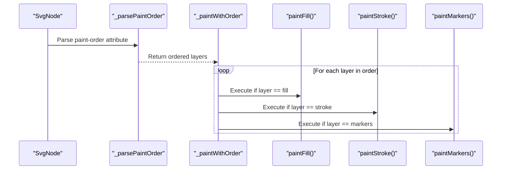
```mermaid
sequenceDiagram
participant Node as "SvgNode"
participant Order as "_parsePaintOrder"
participant Renderer as "_paintWithOrder"
participant Fill as "paintFill()"
participant Stroke as "paintStroke()"
participant Markers as "paintMarkers()"
Node->>Order : Parse paint-order attribute
Order-->>Renderer : Return ordered layers
loop For each layer in order
Renderer->>Fill : Execute if layer == fill
Renderer->>Stroke : Execute if layer == stroke
Renderer->>Markers : Execute if layer == markers
end
```

**Diagram sources**
- [lib/src/animation/animated_svg_painter_paint_order.dart:69-89](file://lib/src/animation/animated_svg_painter_paint_order.dart#L69-L89)

**Section sources**
- [lib/src/animation/animated_svg_painter_paint_order.dart:1-90](file://lib/src/animation/animated_svg_painter_paint_order.dart#L1-L90)
- [test/animation/paint_order_test.dart:1-232](file://test/animation/paint_order_test.dart#L1-L232)

## Advanced Marker Support

The marker system provides comprehensive support for arrowheads and decorative markers along SVG paths. It handles marker resolution, positioning, orientation, and scaling.

### Marker Definition Resolution
Markers are resolved from the SVG DOM using their IDs and support inheritance through the `href` attribute:

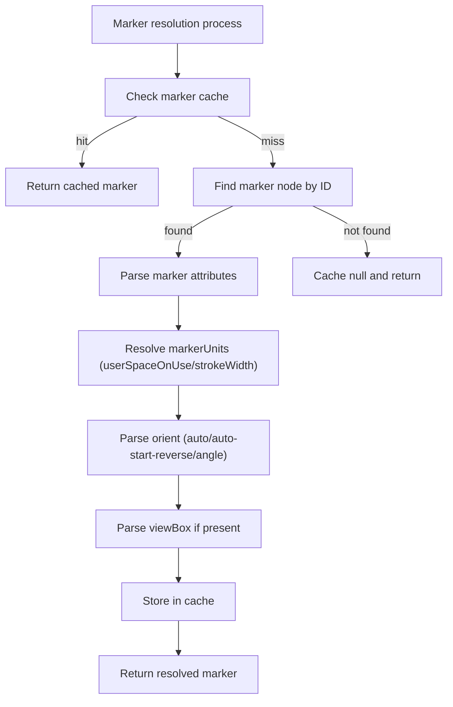
```mermaid
flowchart TD
A["Marker resolution process"] --> B["Check marker cache"]
B --> |hit| C["Return cached marker"]
B --> |miss| D["Find marker node by ID"]
D --> |found| E["Parse marker attributes"]
D --> |not found| F["Cache null and return"]
E --> G["Resolve markerUnits (userSpaceOnUse/strokeWidth)"]
G --> H["Parse orient (auto/auto-start-reverse/angle)"]
H --> I["Parse viewBox if present"]
I --> J["Store in cache"]
J --> K["Return resolved marker"]
```

**Diagram sources**
- [lib/src/animation/animated_svg_painter_markers.dart:5-69](file://lib/src/animation/animated_svg_painter_markers.dart#L5-L69)

### Marker Placement and Orientation
The system calculates marker positions along paths and applies appropriate rotations:

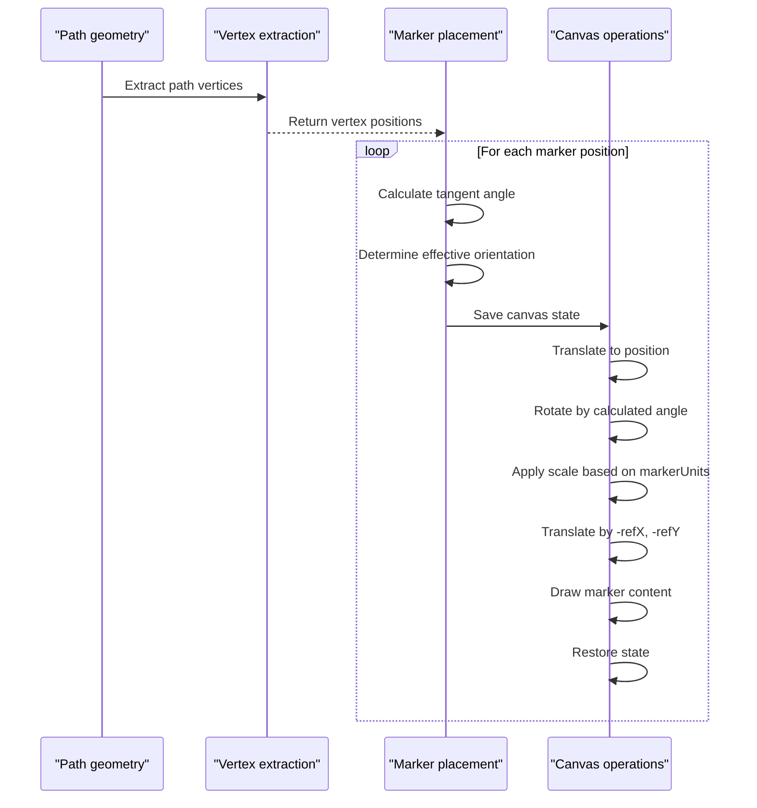
```mermaid
sequenceDiagram
participant Path as "Path geometry"
participant Vertices as "Vertex extraction"
participant Marker as "Marker placement"
participant Canvas as "Canvas operations"
Path->>Vertices : Extract path vertices
Vertices-->>Marker : Return vertex positions
loop For each marker position
Marker->>Marker : Calculate tangent angle
Marker->>Marker : Determine effective orientation
Marker->>Canvas : Save canvas state
Canvas->>Canvas : Translate to position
Canvas->>Canvas : Rotate by calculated angle
Canvas->>Canvas : Apply scale based on markerUnits
Canvas->>Canvas : Translate by -refX, -refY
Canvas->>Canvas : Draw marker content
Canvas->>Canvas : Restore state
end
```

**Diagram sources**
- [lib/src/animation/animated_svg_painter_markers.dart:139-217](file://lib/src/animation/animated_svg_painter_markers.dart#L139-L217)
- [lib/src/animation/animated_svg_painter_markers.dart:236-286](file://lib/src/animation/animated_svg_painter_markers.dart#L236-L286)

### Marker Attributes and Units
The marker system supports comprehensive SVG marker attributes:
- **refX/refY**: Reference point for marker positioning
- **markerWidth/markerHeight**: Size specifications
- **markerUnits**: `userSpaceOnUse` or `strokeWidth` scaling
- **orient**: `auto`, `auto-start-reverse`, or fixed angle
- **viewBox**: Custom coordinate system for marker content

**Section sources**
- [lib/src/animation/animated_svg_painter_markers.dart:1-449](file://lib/src/animation/animated_svg_painter_markers.dart#L1-L449)
- [test/animation/marker_test.dart:1-223](file://test/animation/marker_test.dart#L1-L223)

## Enhanced Pattern Implementation

The pattern system provides complete SVG pattern support with advanced features including pattern units, inheritance, and caching mechanisms.

### Pattern Definition Resolution
Patterns are resolved with comprehensive inheritance support and caching:

```mermaid
flowchart TD
A["Pattern resolution process"] --> B["Check pattern cache"]
B --> |hit| C["Return cached pattern"]
B --> |miss| D["Find pattern node by ID"]
D --> |found| E["Check for href inheritance"]
E --> |inherit| F["Resolve inherited pattern"]
E --> |direct| G["Parse pattern attributes"]
F --> H["Merge attributes with inheritance"]
G --> H
H --> I["Parse patternUnits (userSpaceOnUse/objectBoundingBox)"]
I --> J["Parse patternContentUnits"]
J --> K["Parse viewBox if present"]
K --> L["Parse patternTransform"]
L --> M["Store in cache"]
M --> N["Return resolved pattern"]
```

**Diagram sources**
- [lib/src/animation/animated_svg_painter_patterns.dart:5-103](file://lib/src/animation/animated_svg_painter_patterns.dart#L5-L103)

### Pattern Application and Tiling
The system generates ImageShaders for pattern fills with sophisticated tiling logic:

```mermaid
sequenceDiagram
participant Pattern as "Pattern definition"
participant Shader as "Pattern shader"
participant Canvas as "Canvas operations"
Pattern->>Shader : Create pattern shader
Shader->>Shader : Calculate tile dimensions
alt patternUnits = objectBoundingBox
Shader->>Shader : Apply percentage of target bounds
else patternUnits = userSpaceOnUse
Shader->>Shader : Use absolute coordinates
end
Shader->>Shader : Render pattern content to Picture
Shader->>Shader : Convert to Image (toImageSync)
Shader->>Shader : Create ImageShader with TileMode
Shader->>Canvas : Apply shader to fill/stroke
```

**Diagram sources**
- [lib/src/animation/animated_svg_painter_patterns.dart:106-183](file://lib/src/animation/animated_svg_painter_patterns.dart#L106-L183)

### Pattern Attributes and Units
The pattern system supports comprehensive SVG pattern attributes:
- **x/y/width/height**: Position and size specifications
- **patternUnits**: `userSpaceOnUse` or `objectBoundingBox` coordinate system
- **patternContentUnits**: `userSpaceOnUse` or `objectBoundingBox` for content
- **patternTransform**: Matrix transformations for pattern orientation
- **viewBox**: Custom coordinate system for pattern content

**Section sources**
- [lib/src/animation/animated_svg_painter_patterns.dart:1-184](file://lib/src/animation/animated_svg_painter_patterns.dart#L1-L184)
- [test/animation/pattern_test.dart:1-189](file://test/animation/pattern_test.dart#L1-L189)

## Dependency Analysis
- Module boundaries:
  - Core animation exports define the public API surface.
  - SMIL engine depends on DOM and interpolators.
  - CSS converter depends on CSS parsing and SMIL types.
  - Widget depends on timeline and controller.
  - **Enhanced**: Utility classes provide centralized parsing mechanisms with low coupling to core systems.
  - **New**: Paint server extensions extend the rendering pipeline with comprehensive paint support.
  - **New**: Text styling modules provide specialized CSS property resolution.
  - **New**: Filter primitive system supports advanced graphical effects.
- Coupling:
  - Low coupling between parsing, timeline, and rendering via typed SmilAnimation and DOM attribute mutation.
  - Controlled coupling via ChangeNotifier and Ticker integration.
  - **Enhanced**: Utility classes reduce code duplication and provide consistent parsing across the entire system.
  - **New**: Text styling modules maintain clean separation while providing comprehensive CSS property support.
  - **New**: Filter primitive system extends functionality through specialized classes.

```mermaid
graph LR
Export["lib/src/animation.dart"] --> Widget["animated_svg_picture.dart"]
Export --> Controller["animated_svg_controller.dart"]
Export --> Timeline["smil_timeline.dart"]
Export --> Animation["smil_animation.dart"]
Export --> Parser["smil_parser.dart"]
Export --> Interp["interpolators.dart"]
Export --> Motion["motion_path.dart"]
Export --> Dom["svg_dom.dart"]
Export --> CssConv["css_to_smil_converter.dart"]
Export --> Utils["Utility Classes"]
Export --> PaintServers["Paint Server Extensions"]
Export --> TextStyles["Text Styling Modules"]
Export --> Filters["Filter Primitives"]
PaintServers --> Gradients["animated_svg_painter_gradients.dart"]
PaintServers --> Patterns["animated_svg_painter_patterns.dart"]
PaintServers --> Markers["animated_svg_painter_markers.dart"]
PaintServers --> PaintOrder["animated_svg_painter_paint_order.dart"]
Utils --> Attrs["animated_svg_picture_utils_attrs.dart"]
Utils --> Style["animated_svg_picture_utils_style.dart"]
Utils --> Transform["animated_svg_picture_utils_transform.dart"]
Utils --> Core["animated_svg_picture_utils.dart"]
TextStyles --> MainStyle["animated_svg_painter_text_style.dart"]
TextStyles --> Font["animated_svg_painter_text_style_font.dart"]
TextStyles --> Decoration["animated_svg_painter_text_style_decoration.dart"]
TextStyles --> Layout["animated_svg_painter_text_style_layout.dart"]
TextStyles --> Positioning["animated_svg_painter_text_style_positioning.dart"]
TextStyles --> Rendering["animated_svg_painter_text_style_rendering.dart"]
Filters --> Primitives["svg_filters_primitives.dart"]
Filters --> Pipeline["svg_filters_registry_pipeline_primitives.dart"]
```

**Diagram sources**
- [lib/src/animation.dart:21-31](file://lib/src/animation.dart#L21-L31)

**Section sources**
- [lib/src/animation.dart:21-31](file://lib/src/animation.dart#L21-L31)

## Performance Considerations
- Static subtrees: If a node has no animations, cache rendered output as Picture and reuse to avoid re-traversals.
- Dirty tracking: Mark nodes dirty when animated values change; only re-render dirty subtrees.
- Path optimization: Normalize paths once during parsing; reuse Path objects and reset rather than recreate.
- **Enhanced**: Utility classes provide cached parsing results to reduce redundant computations.
- **New**: Paint server caching reduces repeated pattern and gradient resolution overhead.
- **New**: Pattern tile caching prevents expensive toImageSync operations for identical patterns.
- **New**: Marker caching prevents repeated marker resolution and vertex extraction.
- **New**: Text styling caching with comprehensive property key generation.
- **New**: Filter primitive caching for complex effects processing.
- **Future optimizations (stage goals)**: layer caching for independent animations, GPU-accelerated path morphing, reduced allocations in hot paths, improved text rendering performance.
- Baseline performance targets are documented in the project's animation guide.

**Section sources**
- [ARCHITECTURE.md:174-193](file://ARCHITECTURE.md#L174-L193)
- [ANIMATION.md:172-178](file://ANIMATION.md#L172-L178)
- [lib/src/animation/animated_svg_painter_patterns.dart:10-14](file://lib/src/animation/animated_svg_painter_patterns.dart#L10-L14)
- [lib/src/animation/animated_svg_painter_markers.dart:6-9](file://lib/src/animation/animated_svg_painter_markers.dart#L6-L9)
- [lib/src/animation/animated_svg_painter_text_style_rendering.dart:41-92](file://lib/src/animation/animated_svg_painter_text_style_rendering.dart#L41-L92)

## Troubleshooting Guide
- Tracing:
  - Use onTrace callback to receive structured SvgTraceEvent messages with timestamps, categories, and optional error/stack traces.
  - Enable traceFrameTicks to emit per-frame tick events (disabled by default due to volume).
- Playback control:
  - Verify controller is attached to the widget; use pause/resume/seek/setPlaybackRate/toggleDirection/restart.
  - For event-based animations, ensure triggerEvent(elementId?, eventType) is called at the appropriate time.
- **Enhanced**: Utility class troubleshooting:
  - Check attribute parsing with `_getInheritedAttributeValue()` for style inheritance issues.
  - Verify transform parsing with `_applyNodeTransform()` for coordinate system problems.
  - Use `_resolveTextPathSpacing()` to debug textPath spacing issues.
- **New**: Paint server troubleshooting:
  - Verify paint server resolution with `_resolvePaintServerShader()` for gradient/pattern issues.
  - Check pattern caching with `_patternCache` for repeated pattern resolution problems.
  - Validate marker resolution with `_markerCache` for marker placement issues.
- **New**: Text styling troubleshooting:
  - Verify CSS property resolution with specialized resolver methods.
  - Check whitespace normalization with `_extractTextContentWithWhitespaceNormalization()`.
  - Validate writing mode resolution with `_resolveWritingMode()`.
- **New**: Filter primitive troubleshooting:
  - Verify filter primitive parameters and input connections.
  - Check filter pipeline processing with `_resolvePrimitiveOutput()`.
  - Validate filter caching and memory usage.
- Common issues:
  - autoPlay false rendering: addressed by tests; confirm initialTime and controller state.
  - Path morphing compatibility: requires normalized path structures; ensure paths share topology.
  - **New**: Text rendering issues: verify writing-mode support and spacing calculations.
  - **New**: Paint order issues: verify paint-order attribute syntax and layer ordering.
  - **New**: Pattern rendering issues: check patternUnits, viewBox, and tile dimension calculations.
  - **New**: Marker placement issues: verify markerUnits, orient values, and vertex extraction.
  - **New**: Filter effect issues: verify primitive parameters and pipeline connections.
- Validation:
  - Use getInfo() on SvgTimeline to inspect active animations, total duration, and playback rate.
  - Check widget state transitions and controller notifications.
  - **Enhanced**: Validate utility class results for consistent parsing behavior.
  - **New**: Monitor paint server caches for proper caching and invalidation.
  - **New**: Validate text styling cache keys and paragraph building performance.

**Section sources**
- [lib/src/animation/animated_svg_picture.dart:37-86](file://lib/src/animation/animated_svg_picture.dart#L37-L86)
- [lib/src/animation/animated_svg_picture.dart:156-160](file://lib/src/animation/animated_svg_picture.dart#L156-L160)
- [lib/src/animation/smil/smil_timeline.dart:234-244](file://lib/src/animation/smil/smil_timeline.dart#L234-L244)
- [ANIMATION.md:207-213](file://ANIMATION.md#L207-L213)

## Conclusion
The animated SVG system provides a robust, experimental SMIL pipeline alongside the production static renderer. It supports a wide range of SMIL elements and attributes, CSS animation conversion, precise timing control, and real-time playback. The architecture cleanly separates parsing, animation extraction, timeline management, and rendering, enabling future optimizations and parity improvements.

**Updated**: The enhanced text styling system with 53 CSS properties, vertical writing modes support, XML whitespace normalization, and comprehensive filter primitive capabilities significantly expands the system's functionality. The system now provides complete SVG text rendering support with advanced typography control, comprehensive paint server functionality including fill/stroke ordering control, marker placement along paths, pattern fills with advanced tiling, sophisticated gradient rendering, and advanced filter effects processing. These additions provide complete SVG specification compliance while maintaining optimal performance through intelligent caching strategies and efficient rendering pipelines.

Developers can leverage AnimatedSvgPicture and AnimatedSvgController for programmatic control, while the underlying SmilAnimation and interpolators ensure spec-aligned behavior and extensibility. The utility classes streamline attribute, style, and transform parsing, reducing code duplication and improving reliability. The new specialized text styling modules enable precise typography control, while the enhanced filter system supports advanced graphical effects processing.

## Appendices

### Public Interfaces and Parameters
- AnimatedSvgPicture:
  - Constructors: string, asset, network, memory
  - Parameters: width, height, fit, alignment, backgroundColor, playbackRate, autoPlay, initialTime, controller, onTrace, traceFrameTicks
  - Methods: play, pause, reset, seekTo
- AnimatedSvgController:
  - Properties: isPaused, playbackRate, isReversed, pendingSeek
  - Methods: pause, resume, togglePlayPause, seek, setPlaybackRate, reverse, forward, toggleDirection, restart
- SvgTimeline:
  - Properties: currentTime, totalDuration, playbackRate
  - Methods: tick, seek, reset, triggerEvent, getActiveAnimations, hasActiveAnimations, getInfo
- SmilAnimation:
  - Types: animate, animateTransform, animateMotion, set, animateColor
  - Modes: calcMode, fillMode, additive, playbackDirection
  - Methods: computeValue, updateForTime, reset
- Interpolators:
  - interpolate, interpolateNumber, interpolateColor, interpolateTransform, interpolatePath, interpolateList, add
- MotionPath:
  - getPointAtTime, getPointWithKeyPoints, totalLength
- **Enhanced Rendering System**:
  - Paint server resolution: `_resolvePaintServerShader`, `_createGradientShader`, `_createPatternShader`
  - Paint order control: `_parsePaintOrder`, `_paintWithOrder`
  - Marker support: `_resolveMarkerDefinition`, `_paintMarkers`, `_paintMarker`
  - Pattern implementation: `_resolvePatternDefinition`, `_createPatternShader`
  - Text styling system: `_resolveTextStyle`, comprehensive CSS property resolvers
  - Filter primitives: `_resolvePrimitiveOutput`, filter parameter processing
  - Utility classes: `_extractHrefId`, `_extractStyleValue`, `_getNumber`, `_getNumberList`, `_getInheritedAttributeValue`, `_getInheritedString`, `_getInheritedNumber`, `_extractTextContent`
  - Style parsing: `_resolveFontWeight`, `_resolveFontStyle`, `_distanceToSegment`, `_parsePoints`
  - Transform parsing: `_applyForeignObjectChildTransform`, `_applyNodeTransform`
  - Core utilities: `_isFillEnabled`, `_hasStroke`, `_strokeTolerance`, `_isPaintNone`, `_isPointerEventsNone`, `_isVisibilityHidden`, `_isDisplayNone`, `_trace`

**Section sources**
- [lib/src/animation/animated_svg_picture.dart:108-164](file://lib/src/animation/animated_svg_picture.dart#L108-L164)
- [lib/src/animation/animated_svg_controller.dart:25-131](file://lib/src/animation/animated_svg_controller.dart#L25-L131)
- [lib/src/animation/smil/smil_timeline.dart:20-67](file://lib/src/animation/smil/smil_timeline.dart#L20-L67)
- [lib/src/animation/smil/smil_animation.dart:80-131](file://lib/src/animation/smil/smil_animation.dart#L80-L131)
- [lib/src/animation/smil/interpolators.dart:14-42](file://lib/src/animation/smil/interpolators.dart#L14-L42)
- [lib/src/animation/smil/motion_path.dart:22-52](file://lib/src/animation/smil/motion_path.dart#L22-L52)
- [lib/src/animation/animated_svg_painter_gradients.dart:4-29](file://lib/src/animation/animated_svg_painter_gradients.dart#L4-L29)
- [lib/src/animation/animated_svg_painter_paint_order.dart:9-64](file://lib/src/animation/animated_svg_painter_paint_order.dart#L9-L64)
- [lib/src/animation/animated_svg_painter_markers.dart:5-69](file://lib/src/animation/animated_svg_painter_markers.dart#L5-L69)
- [lib/src/animation/animated_svg_painter_patterns.dart:5-103](file://lib/src/animation/animated_svg_painter_patterns.dart#L5-L103)
- [lib/src/animation/animated_svg_painter_text_style.dart:13-342](file://lib/src/animation/animated_svg_painter_text_style.dart#L13-L342)
- [lib/src/animation/svg_filters_primitives.dart:1-151](file://lib/src/animation/svg_filters_primitives.dart#L1-L151)
- [lib/src/animation/animated_svg_picture_utils_attrs.dart:1-132](file://lib/src/animation/animated_svg_picture_utils_attrs.dart#L1-L132)
- [lib/src/animation/animated_svg_picture_utils_style.dart:1-88](file://lib/src/animation/animated_svg_picture_utils_style.dart#L1-L88)
- [lib/src/animation/animated_svg_picture_utils_transform.dart:1-84](file://lib/src/animation/animated_svg_picture_utils_transform.dart#L1-L84)
- [lib/src/animation/animated_svg_picture_utils.dart:1-69](file://lib/src/animation/animated_svg_picture_utils.dart#L1-L69)

### Practical Examples
- Basic movement, rotation, color animation, path morphing, and motion path are demonstrated in the project's animation guide.
- Widget API usage and demo app invocation are documented for quick start and exploration.
- **New**: Paint order examples with fill/stroke/markers layer control
- **New**: Marker examples with various orientations and marker units
- **New**: Pattern examples with different units, inheritance, and transformations
- **New**: TextPath spacing examples with both auto and exact spacing modes
- **New**: Writing-mode examples for vertical text rendering (vertical-rl, vertical-lr)
- **New**: Text styling examples with comprehensive CSS property combinations
- **New**: Filter primitive examples with advanced effect configurations

**Section sources**
- [ANIMATION.md:5-194](file://ANIMATION.md#L5-L194)

### Migration from CSS Animations
- CSS @keyframes and animation properties are parsed and converted to SMIL equivalents.
- Compound transforms are decomposed into individual SmilAnimation instances for accurate SVG transform semantics.
- Remaining gaps include advanced edge-case CSS shorthand/transform semantics; baseline conversion remains functional.
- **Enhanced**: Utility classes improve consistency in CSS-to-SMIL conversion and attribute resolution.
- **New**: Paint server support enables migration from CSS background-image patterns to native SVG patterns.
- **New**: Text styling system enables migration from CSS typography properties to native SVG text rendering.

**Section sources**
- [ANIMATION.md:54-66](file://ANIMATION.md#L54-L66)
- [lib/src/animation/css_to_smil_converter.dart:35-48](file://lib/src/animation/css_to_smil_converter.dart#L35-L48)

### Enhanced Text Rendering Features
- **Comprehensive CSS Property Support**: 53 CSS properties across specialized modules for precise typography control
- **Vertical Writing Modes**: Complete support for horizontal-tb, vertical-rl, vertical-lr with legacy SVG 1.1 compatibility
- **Advanced Whitespace Handling**: XML and CSS whitespace normalization with flow context awareness
- **Improved Text Path Rendering**: Closed path wrapping behavior and advanced spacing control
- **Text Styling Caching**: Intelligent caching for paragraph building and property resolution
- **Unicode Bidi Support**: Full Unicode directional control character processing

**Section sources**
- [lib/src/animation/animated_svg_painter_text_style_font.dart:12-362](file://lib/src/animation/animated_svg_painter_text_style_font.dart#L12-L362)
- [lib/src/animation/animated_svg_painter_text_style_decoration.dart:10-315](file://lib/src/animation/animated_svg_painter_text_style_decoration.dart#L10-L315)
- [lib/src/animation/animated_svg_painter_text_style_layout.dart:10-451](file://lib/src/animation/animated_svg_painter_text_style_layout.dart#L10-L451)
- [lib/src/animation/animated_svg_painter_text_style_positioning.dart:13-335](file://lib/src/animation/animated_svg_painter_text_style_positioning.dart#L13-L335)
- [lib/src/animation/animated_svg_painter_text_style_rendering.dart:10-546](file://lib/src/animation/animated_svg_painter_text_style_rendering.dart#L10-L546)

### Paint Server Features
- **Paint Order Control**: Fill, stroke, and markers layer ordering with inheritance
- **Marker Support**: Comprehensive marker resolution with orientation and scaling
- **Pattern Implementation**: Advanced pattern fills with units, inheritance, and caching
- **Gradient Handling**: Linear and radial gradients with advanced coordinate systems
- **Caching Mechanisms**: Intelligent caching for paint servers to optimize performance
- **Href Inheritance**: Pattern and marker inheritance through href attributes

**Section sources**
- [lib/src/animation/animated_svg_painter_paint_order.dart:1-90](file://lib/src/animation/animated_svg_painter_paint_order.dart#L1-L90)
- [lib/src/animation/animated_svg_painter_markers.dart:1-449](file://lib/src/animation/animated_svg_painter_markers.dart#L1-L449)
- [lib/src/animation/animated_svg_painter_patterns.dart:1-184](file://lib/src/animation/animated_svg_painter_patterns.dart#L1-L184)
- [lib/src/animation/animated_svg_painter_gradients.dart:1-160](file://lib/src/animation/animated_svg_painter_gradients.dart#L1-L160)
- [lib/src/animation/animated_svg_painter.dart:63-69](file://lib/src/animation/animated_svg_painter.dart#L63-L69)

### Filter Primitive Features
- **Advanced Filter Support**: Complete SVG filter primitive system with detailed parameter support
- **Filter Pipeline Processing**: Comprehensive filter chain processing with input/output management
- **Effect Processing**: Advanced graphical effects including blur, lighting, displacement, and convolution
- **Performance Optimization**: Caching and memory management for complex filter operations
- **Compatibility**: Full SVG filter specification compliance with baseline implementations

**Section sources**
- [lib/src/animation/svg_filters_primitives.dart:1-151](file://lib/src/animation/svg_filters_primitives.dart#L1-L151)
- [lib/src/animation/svg_filters_registry_pipeline_primitives.dart:3-161](file://lib/src/animation/svg_filters_registry_pipeline_primitives.dart#L3-L161)