# Animated SVG Support

<cite>
**Referenced Files in This Document**
- [ANIMATION.md](file://ANIMATION.md)
- [ARCHITECTURE.md](file://ARCHITECTURE.md)
- [lib/src/animation.dart](file://lib/src/animation.dart)
- [lib/src/animation/animated_svg_picture.dart](file://lib/src/animation/animated_svg_picture.dart)
- [lib/src/animation/animated_svg_controller.dart](file://lib/src/animation/animated_svg_controller.dart)
- [lib/src/animation/smil/smil_timeline.dart](file://lib/src/animation/smil/smil_timeline.dart)
- [lib/src/animation/smil/smil_animation.dart](file://lib/src/animation/smil/smil_animation.dart)
- [lib/src/animation/smil/smil_parser.dart](file://lib/src/animation/smil/smil_parser.dart)
- [lib/src/animation/smil/interpolators.dart](file://lib/src/animation/smil/interpolators.dart)
- [lib/src/animation/smil/motion_path.dart](file://lib/src/animation/smil/motion_path.dart)
- [lib/src/animation/css_to_smil_converter.dart](file://lib/src/animation/css_to_smil_converter.dart)
- [lib/src/animation/svg_dom.dart](file://lib/src/animation/svg_dom.dart)
- [lib/src/animation/animated_svg_picture_utils.dart](file://lib/src/animation/animated_svg_picture_utils.dart)
- [lib/src/animation/animated_svg_picture_utils_attrs.dart](file://lib/src/animation/animated_svg_picture_utils_attrs.dart)
- [lib/src/animation/animated_svg_picture_utils_style.dart](file://lib/src/animation/animated_svg_picture_utils_style.dart)
- [lib/src/animation/animated_svg_picture_utils_transform.dart](file://lib/src/animation/animated_svg_picture_utils_transform.dart)
- [lib/src/animation/animated_svg_picture_hit_test_text_layout.dart](file://lib/src/animation/animated_svg_picture_hit_test_text_layout.dart)
- [lib/src/animation/animated_svg_painter_text_style.dart](file://lib/src/animation/animated_svg_painter_text_style.dart)
- [lib/src/animation/animated_svg_painter_text_paint.dart](file://lib/src/animation/animated_svg_painter_text_paint.dart)
- [lib/src/animation/animated_svg_picture_hit_test_text_path_segments.dart](file://lib/src/animation/animated_svg_picture_hit_test_text_path_segments.dart)
- [lib/src/animation/animated_svg_picture_hit_test_text_runs.dart](file://lib/src/animation/animated_svg_picture_hit_test_text_runs.dart)
</cite>

## Update Summary
**Changes Made**
- Added documentation for new utility classes that provide consistent parsing and resolution mechanisms
- Enhanced textPath spacing functionality documentation with new spacing modes
- Added writing-mode support documentation for vertical text rendering
- Integrated utility class architecture into core components documentation
- Updated text rendering and hit-testing sections with new spacing and writing-mode features

## Table of Contents
1. [Introduction](#introduction)
2. [Project Structure](#project-structure)
3. [Core Components](#core-components)
4. [Architecture Overview](#architecture-overview)
5. [Detailed Component Analysis](#detailed-component-analysis)
6. [Utility Classes and Parsing Mechanisms](#utility-classes-and-parsing-mechanisms)
7. [Enhanced Text Rendering and Hit-Testing](#enhanced-text-rendering-and-hit-testing)
8. [Dependency Analysis](#dependency-analysis)
9. [Performance Considerations](#performance-considerations)
10. [Troubleshooting Guide](#troubleshooting-guide)
11. [Conclusion](#conclusion)
12. [Appendices](#appendices)

## Introduction
This document explains the animated SVG support built around the experimental SMIL animation system. It covers the animation architecture, SMIL specification compliance, animation control mechanisms, and CSS animation conversion capabilities. It documents the AnimatedSvgPicture widget, animation timeline management, controller system, and real-time playback controls. Both conceptual overviews for beginners and technical details for experienced developers are included, with terminology aligned to the codebase. Practical examples demonstrate animation creation, control, and optimization, along with public interfaces, animation parameters, and controller methods. Limitations, debugging approaches, and migration paths from CSS animations are also addressed.

**Updated** Added comprehensive documentation for new utility classes that provide consistent parsing and resolution mechanisms across the animation system, along with enhanced textPath spacing functionality and writing-mode support.

## Project Structure
The animated SVG pipeline is implemented as a separate, parallel system from the production static SVG renderer. It parses SVG to a DOM, extracts SMIL and CSS animations, manages timelines, and renders via a CustomPainter. The new utility classes provide centralized parsing and resolution mechanisms for attributes, styles, and transforms.

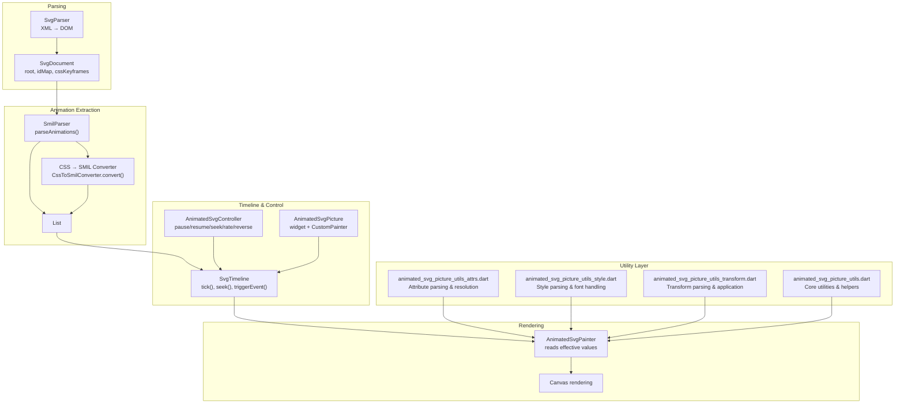

**Diagram sources**
- [lib/src/animation/smil/smil_parser.dart:17-37](file://lib/src/animation/smil/smil_parser.dart#L17-L37)
- [lib/src/animation/css_to_smil_converter.dart:17-66](file://lib/src/animation/css_to_smil_converter.dart#L17-L66)
- [lib/src/animation/smil/smil_timeline.dart:22-29](file://lib/src/animation/smil/smil_timeline.dart#L22-L29)
- [lib/src/animation/animated_svg_controller.dart:25-131](file://lib/src/animation/animated_svg_controller.dart#L25-L131)
- [lib/src/animation/animated_svg_picture.dart:108-164](file://lib/src/animation/animated_svg_picture.dart#L108-L164)
- [lib/src/animation/svg_dom.dart:266-317](file://lib/src/animation/svg_dom.dart#L266-L317)
- [lib/src/animation/animated_svg_picture_utils_attrs.dart:1-132](file://lib/src/animation/animated_svg_picture_utils_attrs.dart#L1-L132)
- [lib/src/animation/animated_svg_picture_utils_style.dart:1-88](file://lib/src/animation/animated_svg_picture_utils_style.dart#L1-L88)
- [lib/src/animation/animated_svg_picture_utils_transform.dart:1-84](file://lib/src/animation/animated_svg_picture_utils_transform.dart#L1-L84)
- [lib/src/animation/animated_svg_picture_utils.dart:1-69](file://lib/src/animation/animated_svg_picture_utils.dart#L1-L69)

**Section sources**
- [ARCHITECTURE.md:6-58](file://ARCHITECTURE.md#L6-L58)
- [lib/src/animation.dart:21-31](file://lib/src/animation.dart#L21-L31)

## Core Components
- AnimatedSvgPicture: The public widget that loads and renders animated SVGs, integrates with AnimationController/Ticker, and exposes playback controls and tracing.
- AnimatedSvgController: A ChangeNotifier-based controller enabling programmatic control of playback (pause/resume, seek, playback rate, direction).
- SvgTimeline: Manages global time, resolves timing conditions (including syncbase and event-based), and updates all animations.
- SmilAnimation: Encapsulates SMIL animation semantics (types, calc modes, fill modes, additive/accumulate behavior, values/keyframes).
- SmilParser: Extracts SMIL animations from DOM and converts CSS animations to SMIL equivalents.
- Interpolators: Provides type-aware interpolation for numbers, colors, transforms, paths, and lists.
- MotionPath: Computes positions and angles along SVG paths for animateMotion with keyPoints support.
- SvgDom: Defines the DOM model with AnimatableSvgAttribute and SvgNode for attribute mutation and tree traversal.
- **New Utility Classes**: Centralized parsing and resolution mechanisms for consistent attribute, style, and transform handling.

**Section sources**
- [lib/src/animation/animated_svg_picture.dart:108-164](file://lib/src/animation/animated_svg_picture.dart#L108-L164)
- [lib/src/animation/animated_svg_controller.dart:25-131](file://lib/src/animation/animated_svg_controller.dart#L25-L131)
- [lib/src/animation/smil/smil_timeline.dart:20-67](file://lib/src/animation/smil/smil_timeline.dart#L20-L67)
- [lib/src/animation/smil/smil_animation.dart:80-131](file://lib/src/animation/smil/smil_animation.dart#L80-L131)
- [lib/src/animation/smil/smil_parser.dart:17-37](file://lib/src/animation/smil/smil_parser.dart#L17-L37)
- [lib/src/animation/smil/interpolators.dart:14-42](file://lib/src/animation/smil/interpolators.dart#L14-L42)
- [lib/src/animation/smil/motion_path.dart:22-52](file://lib/src/animation/smil/motion_path.dart#L22-L52)
- [lib/src/animation/svg_dom.dart:124-161](file://lib/src/animation/svg_dom.dart#L124-L161)

## Architecture Overview
The animated pipeline follows a clear separation of concerns with enhanced utility layer:
- Parsing: XML → DOM preserved for runtime mutation and SMIL discovery.
- Extraction: SMIL and CSS animations parsed into typed SmilAnimation instances.
- Timeline: Global time management with begin/end conditions, repeat counts, and event-driven activation.
- Rendering: CustomPainter reads effective attribute values and draws the scene.
- **Utility Layer**: Centralized parsing and resolution mechanisms for consistent attribute, style, and transform handling.

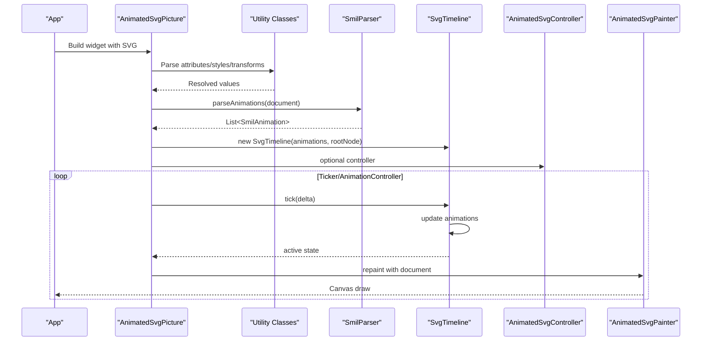

**Diagram sources**
- [lib/src/animation/smil/smil_parser.dart:17-37](file://lib/src/animation/smil/smil_parser.dart#L17-L37)
- [lib/src/animation/smil/smil_timeline.dart:82-98](file://lib/src/animation/smil/smil_timeline.dart#L82-L98)
- [lib/src/animation/animated_svg_picture.dart:166-220](file://lib/src/animation/animated_svg_picture.dart#L166-L220)
- [lib/src/animation/animated_svg_controller.dart:25-131](file://lib/src/animation/animated_svg_controller.dart#L25-L131)
- [lib/src/animation/animated_svg_picture_utils_attrs.dart:1-132](file://lib/src/animation/animated_svg_picture_utils_attrs.dart#L1-L132)
- [lib/src/animation/animated_svg_picture_utils_style.dart:1-88](file://lib/src/animation/animated_svg_picture_utils_style.dart#L1-L88)
- [lib/src/animation/animated_svg_picture_utils_transform.dart:1-84](file://lib/src/animation/animated_svg_picture_utils_transform.dart#L1-L84)

**Section sources**
- [ARCHITECTURE.md:146-154](file://ARCHITECTURE.md#L146-L154)

## Detailed Component Analysis

### AnimatedSvgPicture Widget
- Purpose: Loads and renders animated SVGs, integrates with Flutter's Ticker/AnimationController, and exposes playback controls.
- Key behaviors:
  - Detects presence of animations and wraps with gesture detectors for event-based triggers.
  - Supports autoPlay, initialTime, playbackRate, and controller injection.
  - Exposes play(), pause(), reset(), seekTo().
  - Emits structured trace events via onTrace with configurable frame tick verbosity.
- Lifecycle:
  - Initializes DOM, parses animations, constructs timeline, and starts/stops AnimationController based on autoPlay and playbackRate changes.
  - Updates controller listener when widget controller changes.
  - **Enhanced**: Utilizes new utility classes for consistent parsing and resolution of attributes, styles, and transforms.

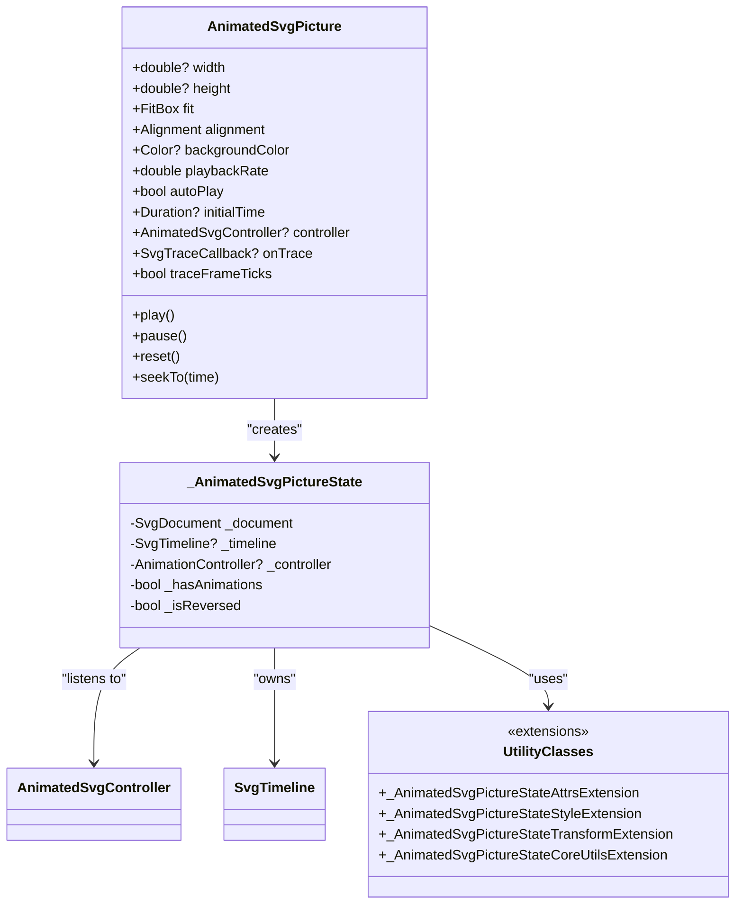

**Diagram sources**
- [lib/src/animation/animated_svg_picture.dart:108-164](file://lib/src/animation/animated_svg_picture.dart#L108-L164)
- [lib/src/animation/animated_svg_picture.dart:166-220](file://lib/src/animation/animated_svg_picture.dart#L166-L220)
- [lib/src/animation/animated_svg_picture_utils.dart:1-69](file://lib/src/animation/animated_svg_picture_utils.dart#L1-L69)
- [lib/src/animation/animated_svg_picture_utils_attrs.dart:1-132](file://lib/src/animation/animated_svg_picture_utils_attrs.dart#L1-L132)
- [lib/src/animation/animated_svg_picture_utils_style.dart:1-88](file://lib/src/animation/animated_svg_picture_utils_style.dart#L1-L88)
- [lib/src/animation/animated_svg_picture_utils_transform.dart:1-84](file://lib/src/animation/animated_svg_picture_utils_transform.dart#L1-L84)

**Section sources**
- [lib/src/animation/animated_svg_picture.dart:108-164](file://lib/src/animation/animated_svg_picture.dart#L108-L164)
- [lib/src/animation/animated_svg_picture.dart:166-220](file://lib/src/animation/animated_svg_picture.dart#L166-L220)
- [lib/src/animation/animated_svg_picture.dart:271-295](file://lib/src/animation/animated_svg_picture.dart#L271-L295)

### AnimatedSvgController
- Purpose: Programmatic control surface for playback.
- Methods:
  - pause(), resume(), togglePlayPause()
  - seek(time), setPlaybackRate(rate), reverse(), forward(), toggleDirection(), restart()
  - Observability: isPaused, playbackRate, isReversed, pendingSeek
- Notes:
  - Validates playbackRate > 0.
  - Notifies listeners on state changes.

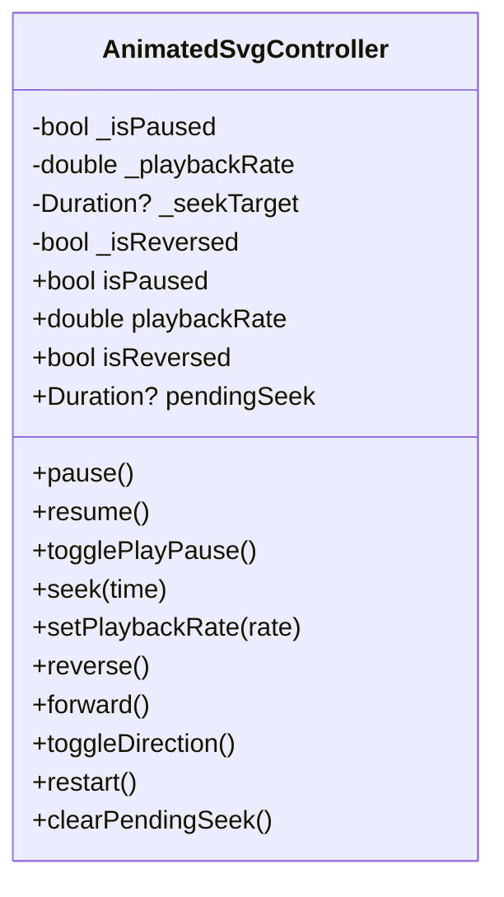

**Diagram sources**
- [lib/src/animation/animated_svg_controller.dart:25-131](file://lib/src/animation/animated_svg_controller.dart#L25-L131)

**Section sources**
- [lib/src/animation/animated_svg_controller.dart:25-131](file://lib/src/animation/animated_svg_controller.dart#L25-L131)

### SvgTimeline
- Purpose: Central time manager for all animations.
- Responsibilities:
  - Tick advancement with playbackRate scaling.
  - Seek to absolute time with boundary checks.
  - Reset timeline and dependent state.
  - Event-based activation via triggerEvent(elementId?, eventType).
  - Syncbase timing resolution and begin/end computation.
  - Total duration calculation across animations.
- Active state inspection via getActiveAnimations() and hasActiveAnimations().

**Diagram sources**
- [lib/src/animation/smil/smil_timeline.dart:82-86](file://lib/src/animation/smil/smil_timeline.dart#L82-L86)

**Section sources**
- [lib/src/animation/smil/smil_timeline.dart:20-67](file://lib/src/animation/smil/smil_timeline.dart#L20-L67)
- [lib/src/animation/smil/smil_timeline.dart:82-98](file://lib/src/animation/smil/smil_timeline.dart#L82-L98)
- [lib/src/animation/smil/smil_timeline.dart:100-126](file://lib/src/animation/smil/smil_timeline.dart#L100-L126)
- [lib/src/animation/smil/smil_timeline.dart:128-158](file://lib/src/animation/smil/smil_timeline.dart#L128-L158)
- [lib/src/animation/smil/smil_timeline.dart:201-231](file://lib/src/animation/smil/smil_timeline.dart#L201-L231)

### SmilAnimation
- Purpose: Encapsulates SMIL semantics and value computation.
- Types:
  - animate, animateTransform, animateMotion, set, animateColor
- Modes:
  - calcMode: linear, discrete, paced, spline
  - fillMode: freeze, remove
  - additive: replace, sum
  - playbackDirection: normal, reverse, alternate, alternateReverse
- Key computations:
  - Values-based vs from/to/by vs discrete
  - Paced keyTimes generation via distance metrics
  - Local time and iteration calculation
  - Final value application with accumulate/additive
- Motion-specific:
  - animateMotion uses MotionPath for position/angle computation.

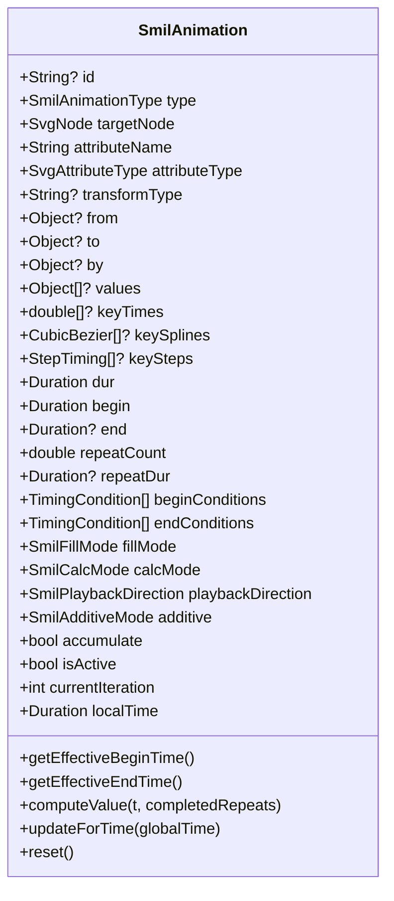

**Diagram sources**
- [lib/src/animation/smil/smil_animation.dart:80-131](file://lib/src/animation/smil/smil_animation.dart#L80-L131)
- [lib/src/animation/smil/smil_animation.dart:325-365](file://lib/src/animation/smil/smil_animation.dart#L325-L365)
- [lib/src/animation/smil/smil_animation.dart:367-431](file://lib/src/animation/smil/smil_animation.dart#L367-L431)

**Section sources**
- [lib/src/animation/smil/smil_animation.dart:13-29](file://lib/src/animation/smil/smil_animation.dart#L13-L29)
- [lib/src/animation/smil/smil_animation.dart:31-44](file://lib/src/animation/smil/smil_animation.dart#L31-L44)
- [lib/src/animation/smil/smil_animation.dart:79-131](file://lib/src/animation/smil/smil_animation.dart#L79-L131)
- [lib/src/animation/smil/smil_animation.dart:325-431](file://lib/src/animation/smil/smil_animation.dart#L325-L431)

### SmilParser and CSS-to-SMIL Conversion
- SmilParser:
  - Extracts SMIL animations from DOM nodes and CSS keyframes/style attributes.
  - Delegates CSS extraction and selector-based rules.
- CssToSmilConverter:
  - Converts CSS @keyframes and animation properties into typed SmilAnimation instances.
  - Handles compound transform decomposition for SVG transform normalization.
  - Infers attribute types and maps CSS properties to SMIL-equivalent attributes.

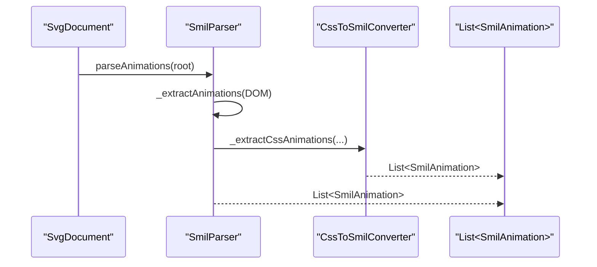

**Diagram sources**
- [lib/src/animation/smil/smil_parser.dart:17-37](file://lib/src/animation/smil/smil_parser.dart#L17-L37)
- [lib/src/animation/css_to_smil_converter.dart:17-66](file://lib/src/animation/css_to_smil_converter.dart#L17-L66)

**Section sources**
- [lib/src/animation/smil/smil_parser.dart:17-37](file://lib/src/animation/smil/smil_parser.dart#L17-L37)
- [lib/src/animation/css_to_smil_converter.dart:17-66](file://lib/src/animation/css_to_smil_converter.dart#L17-L66)

### Interpolators and MotionPath
- Interpolators:
  - Type-aware interpolation for numbers, colors, transforms, paths, and lists.
  - Additive arithmetic for numeric and list types.
- MotionPath:
  - Parses SVG path data and computes position/angle along the path.
  - Supports keyPoints with optional keyTimes for variable-speed motion.

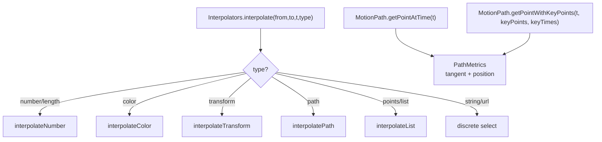

**Diagram sources**
- [lib/src/animation/smil/interpolators.dart:18-42](file://lib/src/animation/smil/interpolators.dart#L18-L42)
- [lib/src/animation/smil/motion_path.dart:97-145](file://lib/src/animation/smil/motion_path.dart#L97-L145)
- [lib/src/animation/smil/motion_path.dart:147-217](file://lib/src/animation/smil/motion_path.dart#L147-L217)

**Section sources**
- [lib/src/animation/smil/interpolators.dart:14-42](file://lib/src/animation/smil/interpolators.dart#L14-L42)
- [lib/src/animation/smil/interpolators.dart:118-146](file://lib/src/animation/smil/interpolators.dart#L118-L146)
- [lib/src/animation/smil/motion_path.dart:22-52](file://lib/src/animation/smil/motion_path.dart#L22-L52)
- [lib/src/animation/smil/motion_path.dart:97-145](file://lib/src/animation/smil/motion_path.dart#L97-L145)
- [lib/src/animation/smil/motion_path.dart:147-217](file://lib/src/animation/smil/motion_path.dart#L147-L217)

### DOM Model and Effective Values
- SvgNode holds AnimatableSvgAttribute entries with baseValue and animatedValue.
- Effective value selection prefers animatedValue when an animation is active.
- Tree-level flags (hasAnimations, cachedPicture) enable subtree caching and dirty tracking.

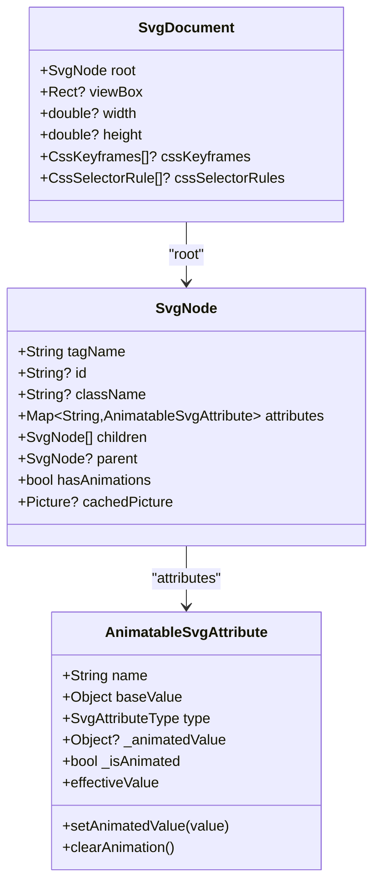

**Diagram sources**
- [lib/src/animation/svg_dom.dart:124-161](file://lib/src/animation/svg_dom.dart#L124-L161)
- [lib/src/animation/svg_dom.dart:266-317](file://lib/src/animation/svg_dom.dart#L266-L317)

**Section sources**
- [lib/src/animation/svg_dom.dart:124-161](file://lib/src/animation/svg_dom.dart#L124-L161)
- [lib/src/animation/svg_dom.dart:266-317](file://lib/src/animation/svg_dom.dart#L266-L317)

## Utility Classes and Parsing Mechanisms

### Core Utility Extensions
The new utility classes provide centralized parsing and resolution mechanisms for consistent attribute handling across the animation system:

#### Attribute Resolution Utilities
- `_AnimatedSvgPictureStateAttrsExtension`: Handles attribute extraction, parsing, and inheritance resolution
- Supports href ID extraction, style attribute parsing, number parsing with unit cleanup, and inherited value resolution
- Provides consistent parsing for numbers, number lists, and text content extraction

#### Style and Font Utilities  
- `_AnimatedSvgPictureStateStyleExtension`: Manages font weight/size parsing, style resolution, and geometric calculations
- Includes comprehensive font weight mapping (100-900 range), font style resolution, and point parsing for polygons/polylines
- Provides distance calculations for hit-testing and geometric operations

#### Transform Utilities
- `_AnimatedSvgPictureStateTransformExtension`: Handles SVG transform parsing and matrix application
- Supports translate, scale, rotate (with center point), skewX/Y, and custom matrix transformations
- Includes foreignObject child transform handling for proper coordinate system management

#### Core Utilities
- `_AnimatedSvgPictureStateCoreUtilsExtension`: Provides fundamental utility functions for visibility, pointer events, painting, and tracing
- Handles display/visibility checking, stroke tolerance calculations, paint value validation, and structured tracing

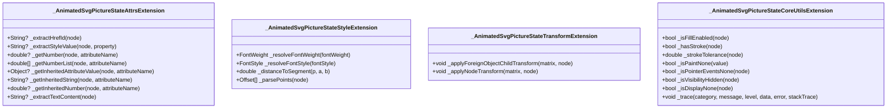

**Diagram sources**
- [lib/src/animation/animated_svg_picture_utils_attrs.dart:1-132](file://lib/src/animation/animated_svg_picture_utils_attrs.dart#L1-L132)
- [lib/src/animation/animated_svg_picture_utils_style.dart:1-88](file://lib/src/animation/animated_svg_picture_utils_style.dart#L1-L88)
- [lib/src/animation/animated_svg_picture_utils_transform.dart:1-84](file://lib/src/animation/animated_svg_picture_utils_transform.dart#L1-L84)
- [lib/src/animation/animated_svg_picture_utils.dart:1-69](file://lib/src/animation/animated_svg_picture_utils.dart#L1-L69)

**Section sources**
- [lib/src/animation/animated_svg_picture_utils_attrs.dart:1-132](file://lib/src/animation/animated_svg_picture_utils_attrs.dart#L1-L132)
- [lib/src/animation/animated_svg_picture_utils_style.dart:1-88](file://lib/src/animation/animated_svg_picture_utils_style.dart#L1-L88)
- [lib/src/animation/animated_svg_picture_utils_transform.dart:1-84](file://lib/src/animation/animated_svg_picture_utils_transform.dart#L1-L84)
- [lib/src/animation/animated_svg_picture_utils.dart:1-69](file://lib/src/animation/animated_svg_picture_utils.dart#L1-L69)

## Enhanced Text Rendering and Hit-Testing

### TextPath Spacing Functionality
The text rendering system now supports enhanced spacing control for textPath elements with two distinct modes:

#### Spacing Modes
- **auto mode**: Applies CSS letter-spacing and word-spacing inherited from style attributes
- **exact mode**: Ignores CSS spacing and uses exact glyph spacing for precise text fitting

#### Implementation Details
- Spacing resolution respects the `spacing` attribute on textPath elements
- Letter and word spacing are applied conditionally based on spacing mode
- Text length adjustment supports both spacing-only and spacing+glyphs modes
- Hit-testing maintains separate spacing calculations for accurate text selection

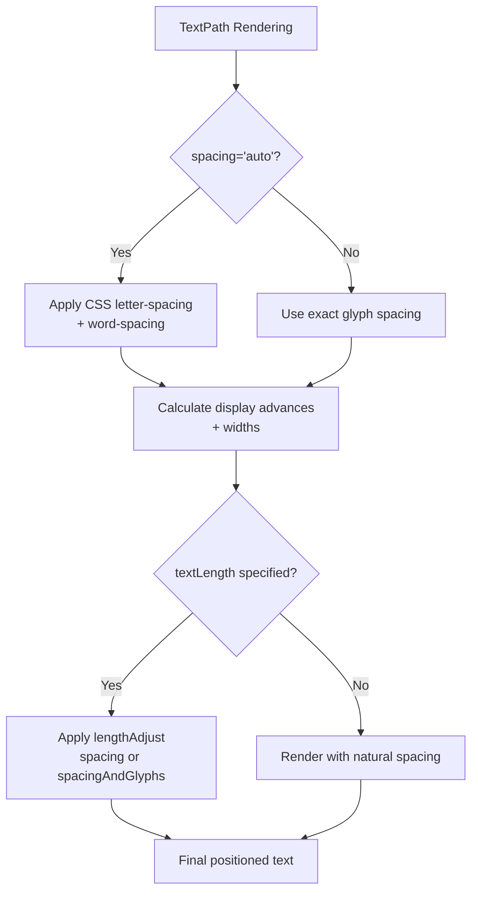

**Diagram sources**
- [lib/src/animation/animated_svg_picture_hit_test_text_layout.dart:86-96](file://lib/src/animation/animated_svg_picture_hit_test_text_layout.dart#L86-L96)
- [lib/src/animation/animated_svg_painter_text_style.dart:192-205](file://lib/src/animation/animated_svg_painter_text_style.dart#L192-L205)
- [lib/src/animation/animated_svg_picture_hit_test_text_path_segments.dart:27-40](file://lib/src/animation/animated_svg_picture_hit_test_text_path_segments.dart#L27-L40)

### Writing-Mode Support
The system now supports comprehensive vertical text rendering through writing-mode attributes:

#### Writing Modes
- **horizontal-tb** (default): Traditional horizontal text rendering
- **vertical-rl**: Vertical text flowing right-to-left
- **vertical-lr**: Vertical text flowing left-to-right
- **Legacy support**: Backward compatibility with SVG 1.1 writing modes

#### Implementation Features
- Comprehensive writing-mode resolution with fallback to horizontal-tb
- Proper baseline calculation for vertical text rendering
- Support for vertical text decoration and spacing adjustments
- Consistent behavior across textPath and regular text elements

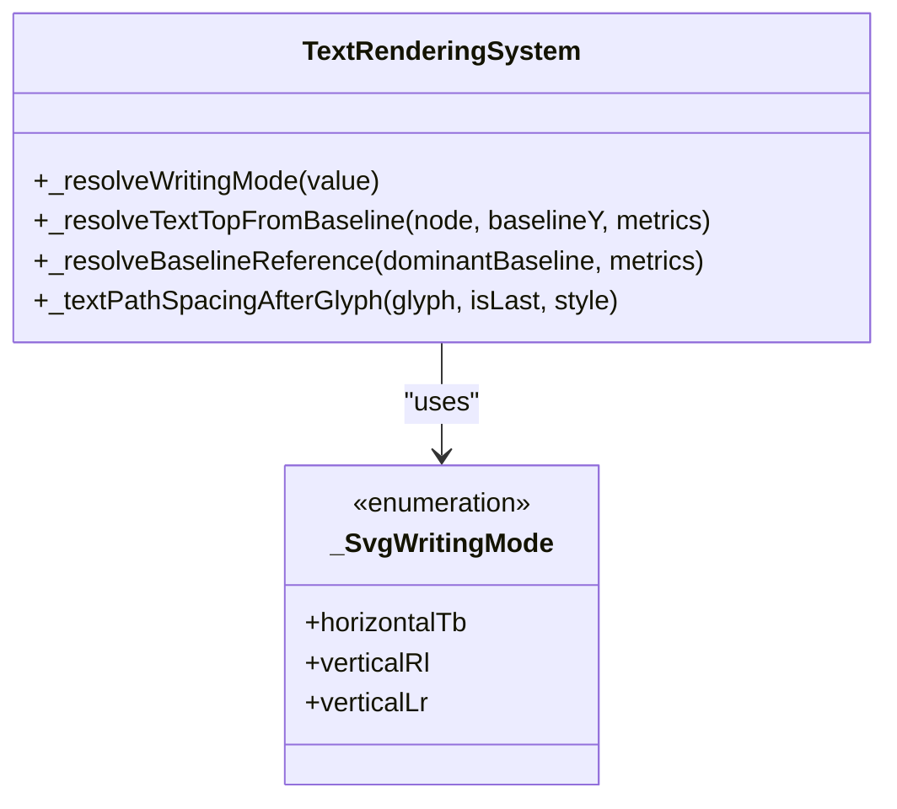

**Diagram sources**
- [lib/src/animation/animated_svg_painter_text_style.dart:70-87](file://lib/src/animation/animated_svg_painter_text_style.dart#L70-L87)
- [lib/src/animation/animated_svg_painter_text_style.dart:207-230](file://lib/src/animation/animated_svg_painter_text_style.dart#L207-L230)
- [lib/src/animation/animated_svg_picture_hit_test_text_layout.dart:138-167](file://lib/src/animation/animated_svg_picture_hit_test_text_layout.dart#L138-L167)

**Section sources**
- [lib/src/animation/animated_svg_picture_hit_test_text_layout.dart:86-96](file://lib/src/animation/animated_svg_picture_hit_test_text_layout.dart#L86-L96)
- [lib/src/animation/animated_svg_painter_text_style.dart:70-87](file://lib/src/animation/animated_svg_painter_text_style.dart#L70-L87)
- [lib/src/animation/animated_svg_painter_text_style.dart:192-205](file://lib/src/animation/animated_svg_painter_text_style.dart#L192-L205)
- [lib/src/animation/animated_svg_picture_hit_test_text_path_segments.dart:27-40](file://lib/src/animation/animated_svg_picture_hit_test_text_path_segments.dart#L27-L40)

### Text Decoration and Baseline Support
Enhanced text rendering includes comprehensive support for text decorations and baseline positioning:

#### Text Decorations
- Underline, overline, and line-through support
- Inheritance from parent text elements
- Color customization for decorations
- Combined decoration effects

#### Baseline Management
- Dominant baseline support (alphabetic, central, text-before-edge, text-after-edge)
- Baseline shift calculations with percentage and numeric values
- Proper vertical alignment for mixed text orientations
- Compatibility with writing-mode changes

**Section sources**
- [lib/src/animation/animated_svg_painter_text_style.dart:89-126](file://lib/src/animation/animated_svg_painter_text_style.dart#L89-L126)
- [lib/src/animation/animated_svg_painter_text_style.dart:232-277](file://lib/src/animation/animated_svg_painter_text_style.dart#L232-L277)
- [lib/src/animation/animated_svg_picture_hit_test_text_layout.dart:138-195](file://lib/src/animation/animated_svg_picture_hit_test_text_layout.dart#L138-L195)

## Dependency Analysis
- Module boundaries:
  - Core animation exports define the public API surface.
  - SMIL engine depends on DOM and interpolators.
  - CSS converter depends on CSS parsing and SMIL types.
  - Widget depends on timeline and controller.
  - **New**: Utility classes provide centralized parsing mechanisms with low coupling to core systems.
- Coupling:
  - Low coupling between parsing, timeline, and rendering via typed SmilAnimation and DOM attribute mutation.
  - Controlled coupling via ChangeNotifier and Ticker integration.
  - **Enhanced**: Utility classes reduce code duplication and provide consistent parsing across the entire system.

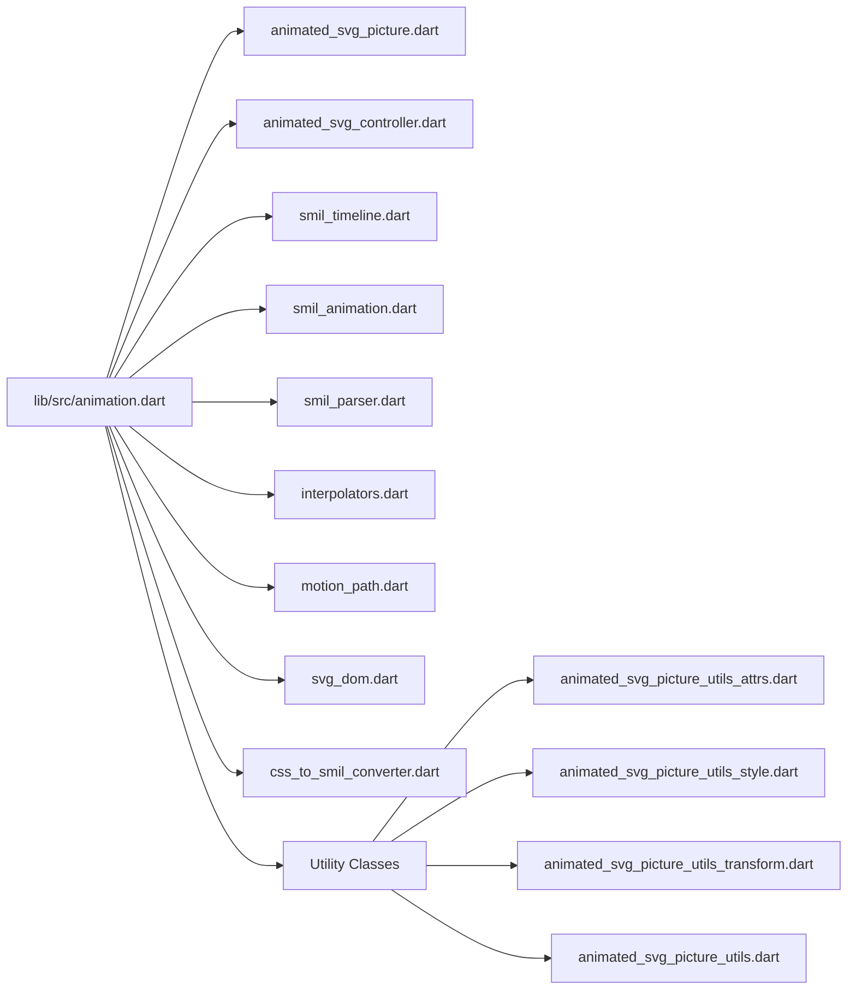

**Diagram sources**
- [lib/src/animation.dart:21-31](file://lib/src/animation.dart#L21-L31)

**Section sources**
- [lib/src/animation.dart:21-31](file://lib/src/animation.dart#L21-L31)

## Performance Considerations
- Static subtrees: If a node has no animations, cache rendered output as Picture and reuse to avoid re-traversals.
- Dirty tracking: Mark nodes dirty when animated values change; only re-render dirty subtrees.
- Path optimization: Normalize paths once during parsing; reuse Path objects and reset rather than recreate.
- **Enhanced**: Utility classes provide cached parsing results to reduce redundant computations.
- **Future optimizations (stage goals)**: layer caching for independent animations, GPU-accelerated path morphing, reduced allocations in hot paths, improved text rendering performance.
- Baseline performance targets are documented in the project's animation guide.

**Section sources**
- [ARCHITECTURE.md:174-193](file://ARCHITECTURE.md#L174-L193)
- [ANIMATION.md:172-178](file://ANIMATION.md#L172-L178)

## Troubleshooting Guide
- Tracing:
  - Use onTrace callback to receive structured SvgTraceEvent messages with timestamps, categories, and optional error/stack traces.
  - Enable traceFrameTicks to emit per-frame tick events (disabled by default due to volume).
- Playback control:
  - Verify controller is attached to the widget; use pause/resume/seek/setPlaybackRate/toggleDirection/restart.
  - For event-based animations, ensure triggerEvent(elementId?, eventType) is called at the appropriate time.
- **Enhanced**: Utility class troubleshooting:
  - Check attribute parsing with `_getInheritedAttributeValue()` for style inheritance issues.
  - Verify transform parsing with `_applyNodeTransform()` for coordinate system problems.
  - Use `_resolveTextPathSpacing()` to debug textPath spacing issues.
- Common issues:
  - autoPlay false rendering: addressed by tests; confirm initialTime and controller state.
  - Path morphing compatibility: requires normalized path structures; ensure paths share topology.
  - **New**: Text rendering issues: verify writing-mode support and spacing calculations.
- Validation:
  - Use getInfo() on SvgTimeline to inspect active animations, total duration, and playback rate.
  - Check widget state transitions and controller notifications.
  - **Enhanced**: Validate utility class results for consistent parsing behavior.

**Section sources**
- [lib/src/animation/animated_svg_picture.dart:37-86](file://lib/src/animation/animated_svg_picture.dart#L37-L86)
- [lib/src/animation/animated_svg_picture.dart:156-160](file://lib/src/animation/animated_svg_picture.dart#L156-L160)
- [lib/src/animation/smil/smil_timeline.dart:234-244](file://lib/src/animation/smil/smil_timeline.dart#L234-L244)
- [ANIMATION.md:207-213](file://ANIMATION.md#L207-L213)

## Conclusion
The animated SVG system provides a robust, experimental SMIL pipeline alongside the production static renderer. It supports a wide range of SMIL elements and attributes, CSS animation conversion, precise timing control, and real-time playback. The architecture cleanly separates parsing, animation extraction, timeline management, and rendering, enabling future optimizations and parity improvements. 

**Updated**: The new utility classes provide centralized parsing and resolution mechanisms that enhance consistency and maintainability across the animation system. Enhanced textPath spacing functionality and writing-mode support expand the system's text rendering capabilities, supporting both horizontal and vertical text layouts with precise spacing control.

Developers can leverage AnimatedSvgPicture and AnimatedSvgController for programmatic control, while the underlying SmilAnimation and interpolators ensure spec-aligned behavior and extensibility. The utility classes streamline attribute, style, and transform parsing, reducing code duplication and improving reliability.

## Appendices

### Public Interfaces and Parameters
- AnimatedSvgPicture:
  - Constructors: string, asset, network, memory
  - Parameters: width, height, fit, alignment, backgroundColor, playbackRate, autoPlay, initialTime, controller, onTrace, traceFrameTicks
  - Methods: play, pause, reset, seekTo
- AnimatedSvgController:
  - Properties: isPaused, playbackRate, isReversed, pendingSeek
  - Methods: pause, resume, togglePlayPause, seek, setPlaybackRate, reverse, forward, toggleDirection, restart
- SvgTimeline:
  - Properties: currentTime, totalDuration, playbackRate
  - Methods: tick, seek, reset, triggerEvent, getActiveAnimations, hasActiveAnimations, getInfo
- SmilAnimation:
  - Types: animate, animateTransform, animateMotion, set, animateColor
  - Modes: calcMode, fillMode, additive, playbackDirection
  - Methods: computeValue, updateForTime, reset
- Interpolators:
  - interpolate, interpolateNumber, interpolateColor, interpolateTransform, interpolatePath, interpolateList, add
- MotionPath:
  - getPointAtTime, getPointWithKeyPoints, totalLength
- **New Utility Classes**:
  - Attribute parsing: `_extractHrefId`, `_extractStyleValue`, `_getNumber`, `_getNumberList`, `_getInheritedAttributeValue`, `_getInheritedString`, `_getInheritedNumber`, `_extractTextContent`
  - Style parsing: `_resolveFontWeight`, `_resolveFontStyle`, `_distanceToSegment`, `_parsePoints`
  - Transform parsing: `_applyForeignObjectChildTransform`, `_applyNodeTransform`
  - Core utilities: `_isFillEnabled`, `_hasStroke`, `_strokeTolerance`, `_isPaintNone`, `_isPointerEventsNone`, `_isVisibilityHidden`, `_isDisplayNone`, `_trace`

**Section sources**
- [lib/src/animation/animated_svg_picture.dart:108-164](file://lib/src/animation/animated_svg_picture.dart#L108-L164)
- [lib/src/animation/animated_svg_controller.dart:25-131](file://lib/src/animation/animated_svg_controller.dart#L25-L131)
- [lib/src/animation/smil/smil_timeline.dart:20-67](file://lib/src/animation/smil/smil_timeline.dart#L20-L67)
- [lib/src/animation/smil/smil_animation.dart:80-131](file://lib/src/animation/smil/smil_animation.dart#L80-L131)
- [lib/src/animation/smil/interpolators.dart:14-42](file://lib/src/animation/smil/interpolators.dart#L14-L42)
- [lib/src/animation/smil/motion_path.dart:22-52](file://lib/src/animation/smil/motion_path.dart#L22-L52)
- [lib/src/animation/animated_svg_picture_utils_attrs.dart:1-132](file://lib/src/animation/animated_svg_picture_utils_attrs.dart#L1-L132)
- [lib/src/animation/animated_svg_picture_utils_style.dart:1-88](file://lib/src/animation/animated_svg_picture_utils_style.dart#L1-L88)
- [lib/src/animation/animated_svg_picture_utils_transform.dart:1-84](file://lib/src/animation/animated_svg_picture_utils_transform.dart#L1-L84)
- [lib/src/animation/animated_svg_picture_utils.dart:1-69](file://lib/src/animation/animated_svg_picture_utils.dart#L1-L69)

### Practical Examples
- Basic movement, rotation, color animation, path morphing, and motion path are demonstrated in the project's animation guide.
- Widget API usage and demo app invocation are documented for quick start and exploration.
- **New**: TextPath spacing examples with both auto and exact spacing modes
- **New**: Writing-mode examples for vertical text rendering (vertical-rl, vertical-lr)

**Section sources**
- [ANIMATION.md:5-194](file://ANIMATION.md#L5-L194)

### Migration from CSS Animations
- CSS @keyframes and animation properties are parsed and converted to SMIL equivalents.
- Compound transforms are decomposed into individual SmilAnimation instances for accurate SVG transform semantics.
- Remaining gaps include advanced edge-case CSS shorthand/transform semantics; baseline conversion remains functional.
- **Enhanced**: Utility classes improve consistency in CSS-to-SMIL conversion and attribute resolution.

**Section sources**
- [ANIMATION.md:54-66](file://ANIMATION.md#L54-L66)
- [lib/src/animation/css_to_smil_converter.dart:35-48](file://lib/src/animation/css_to_smil_converter.dart#L35-L48)

### Text Rendering Enhancements
- **TextPath Spacing**: Two modes (auto/exact) with CSS spacing support in auto mode
- **Writing Mode**: Complete support for horizontal-tb, vertical-rl, vertical-lr with legacy SVG 1.1 compatibility
- **Text Decorations**: Underline, overline, line-through with inheritance and color support
- **Baseline Management**: Comprehensive dominant-baseline and baseline-shift calculations
- **Hit-Testing**: Enhanced accuracy for textPath segments with proper spacing calculations

**Section sources**
- [lib/src/animation/animated_svg_painter_text_style.dart:70-87](file://lib/src/animation/animated_svg_painter_text_style.dart#L70-L87)
- [lib/src/animation/animated_svg_painter_text_style.dart:89-126](file://lib/src/animation/animated_svg_painter_text_style.dart#L89-L126)
- [lib/src/animation/animated_svg_picture_hit_test_text_layout.dart:86-96](file://lib/src/animation/animated_svg_picture_hit_test_text_layout.dart#L86-L96)
- [lib/src/animation/animated_svg_picture_hit_test_text_path_segments.dart:27-40](file://lib/src/animation/animated_svg_picture_hit_test_text_path_segments.dart#L27-L40)