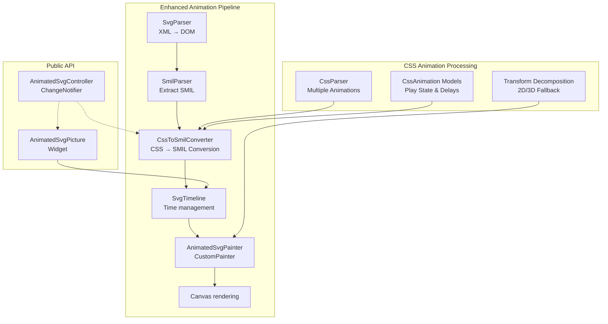
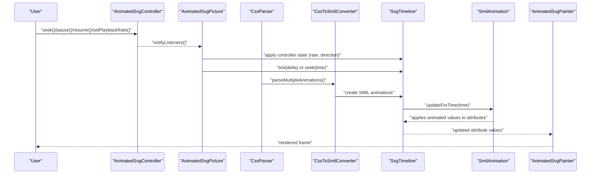
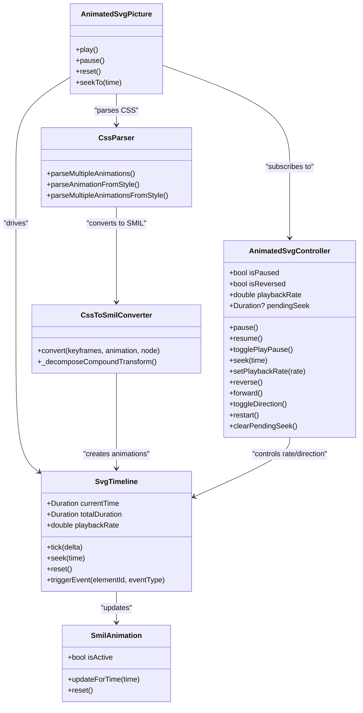

# Animation Control and Playback

<cite>
**Referenced Files in This Document**
- [ANIMATION.md](file://ANIMATION.md)
- [ARCHITECTURE.md](file://ARCHITECTURE.md)
- [lib/src/animation.dart](file://lib/src/animation.dart)
- [lib/src/animation/animated_svg_controller.dart](file://lib/src/animation/animated_svg_controller.dart)
- [lib/src/animation/animated_svg_picture.dart](file://lib/src/animation/animated_svg_picture.dart)
- [lib/src/animation/smil/smil_animation.dart](file://lib/src/animation/smil/smil_animation.dart)
- [lib/src/animation/smil/smil_timeline.dart](file://lib/src/animation/smil/smil_timeline.dart)
- [lib/src/animation/smil/smil_animation_runtime.dart](file://lib/src/animation/smil/smil_animation_runtime.dart)
- [lib/src/animation/smil/smil_timeline_runtime.dart](file://lib/src/animation/smil/smil_timeline_runtime.dart)
- [lib/src/animation/smil/smil_timeline_syncbase.dart](file://lib/src/animation/smil/smil_timeline_syncbase.dart)
- [lib/src/animation/css_animations.dart](file://lib/src/animation/css_animations.dart)
- [lib/src/animation/css_animations_models.dart](file://lib/src/animation/css_animations_models.dart)
- [lib/src/animation/css_animations_parser.dart](file://lib/src/animation/css_animations_parser.dart)
- [lib/src/animation/css_to_smil_converter.dart](file://lib/src/animation/css_to_smil_converter.dart)
- [lib/src/animation/css_to_smil_converter_core.dart](file://lib/src/animation/css_to_smil_converter_core.dart)
- [lib/src/animation/transform_3d.dart](file://lib/src/animation/transform_3d.dart)
- [lib/src/animation/animated_svg_painter_matrix.dart](file://lib/src/animation/animated_svg_painter_matrix.dart)
- [test/animation/controller_test.dart](file://test/animation/controller_test.dart)
- [test/animation/css_animation_edge_cases_test.dart](file://test/animation/css_animation_edge_cases_test.dart)
- [test/animation/css_3d_transforms_test.dart](file://test/animation/css_3d_transforms_test.dart)
- [example/lib/pages/controller_demo_page.dart](file://example/lib/pages/controller_demo_page.dart)
</cite>

## Update Summary
**Changes Made**
- Enhanced CSS animation edge case support documentation including multiple animations per element
- Added animation-play-state control documentation with paused state handling
- Documented negative animation delay support and implementation details
- Expanded 3D transform support documentation with automatic 2D/3D fallback
- Updated CSS animation parsing capabilities and cascade handling
- Added comprehensive transform decomposition and conversion documentation

## Table of Contents
1. [Introduction](#introduction)
2. [Project Structure](#project-structure)
3. [Core Components](#core-components)
4. [Architecture Overview](#architecture-overview)
5. [Detailed Component Analysis](#detailed-component-analysis)
6. [Enhanced CSS Animation System](#enhanced-css-animation-system)
7. [3D Transform Support](#3d-transform-support)
8. [Dependency Analysis](#dependency-analysis)
9. [Performance Considerations](#performance-considerations)
10. [Troubleshooting Guide](#troubleshooting-guide)
11. [Conclusion](#conclusion)
12. [Appendices](#appendices)

## Introduction
This document explains the animation control and playback mechanisms for animated SVGs in the project. It focuses on the AnimatedSvgController API, programmatic animation control, playback rate adjustment, and timeline manipulation. The system now includes enhanced CSS animation support with improved edge case handling, including multiple animations per element, animation-play-state control, negative animation delays, and comprehensive 3D transform support with automatic 2D/3D fallback. It also covers controller methods for play, pause, stop, reset, and seek operations, along with examples of manual animation control, animation synchronization, state management, lifecycle handling, and performance considerations. Guidance is provided for integrating animations with user interactions and application state.

## Project Structure
The animated SVG pipeline is implemented as a separate rendering path from the static SVG pipeline. The animated pipeline parses SVG into a DOM, extracts SMIL animations, manages time via a timeline, and renders via a CustomPainter. The enhanced system now includes comprehensive CSS animation parsing and conversion capabilities.

**Diagram sources**
- [ARCHITECTURE.md:34-48](file://ARCHITECTURE.md#L34-L48)
- [lib/src/animation/css_animations_parser.dart:28-43](file://lib/src/animation/css_animations_parser.dart#L28-L43)
- [lib/src/animation/css_to_smil_converter.dart:14-67](file://lib/src/animation/css_to_smil_converter.dart#L14-L67)
- [lib/src/animation/animated_svg_picture.dart:236-269](file://lib/src/animation/animated_svg_picture.dart#L236-L269)
- [lib/src/animation/animated_svg_controller.dart:25](file://lib/src/animation/animated_svg_controller.dart#L25)

**Section sources**
- [ARCHITECTURE.md:6-58](file://ARCHITECTURE.md#L6-L58)
- [ANIMATION.md:150-171](file://ANIMATION.md#L150-L171)

## Core Components
- AnimatedSvgController: Provides programmatic control of playback (pause/resume, reverse/forward, seek, setPlaybackRate, restart) and notifies listeners of state changes.
- AnimatedSvgPicture: The public widget that hosts the animated SVG, integrates with the controller, and drives the render loop.
- SmilAnimation: Describes individual SMIL animations (types, timing, interpolation modes, and runtime state).
- SvgTimeline: Manages global time, playback rate, seeks, resets, and event-driven activation; resolves syncbase timing and triggers dependent animations.
- AnimatedSvgPainter: Renders the DOM tree using effective attribute values computed by the timeline.
- CssParser: Enhanced CSS animation parser supporting multiple animations, play state control, and negative delays.
- CssToSmilConverter: Converts CSS animations to SMIL format with comprehensive transform handling.
- Transform3DContext: Manages 3D transform contexts with perspective, backface visibility, and transform-style support.

Key capabilities:
- Programmatic control via AnimatedSvgController
- Playback rate adjustment and direction control
- Timeline seeking and resetting
- Event-driven animation activation and syncbase chaining
- Enhanced CSS animation parsing with multiple animation support
- Animation-play-state control (paused/running)
- Negative animation delay handling
- Comprehensive 3D transform support with automatic 2D/3D fallback
- Freeze vs remove fill behavior

**Section sources**
- [lib/src/animation/animated_svg_controller.dart:25-131](file://lib/src/animation/animated_svg_controller.dart#L25-L131)
- [lib/src/animation/animated_svg_picture.dart:108-295](file://lib/src/animation/animated_svg_picture.dart#L108-L295)
- [lib/src/animation/smil/smil_animation.dart:80-453](file://lib/src/animation/smil/smil_animation.dart#L80-L453)
- [lib/src/animation/smil/smil_timeline.dart:20-256](file://lib/src/animation/smil/smil_timeline.dart#L20-L256)
- [lib/src/animation/css_animations_parser.dart:28-43](file://lib/src/animation/css_animations_parser.dart#L28-L43)
- [lib/src/animation/css_to_smil_converter_core.dart:27-147](file://lib/src/animation/css_to_smil_converter_core.dart#L27-L147)
- [lib/src/animation/transform_3d.dart:333-373](file://lib/src/animation/transform_3d.dart#L333-L373)

## Architecture Overview
The enhanced animated pipeline separates concerns across parsing, CSS-to-SMIL conversion, timeline management, and rendering with comprehensive 3D transform support:

**Diagram sources**
- [lib/src/animation/animated_svg_controller.dart:25-131](file://lib/src/animation/animated_svg_controller.dart#L25-L131)
- [lib/src/animation/animated_svg_picture.dart:166-220](file://lib/src/animation/animated_svg_picture.dart#L166-L220)
- [lib/src/animation/css_animations_parser.dart:28-43](file://lib/src/animation/css_animations_parser.dart#L28-L43)
- [lib/src/animation/css_to_smil_converter_core.dart:27-147](file://lib/src/animation/css_to_smil_converter_core.dart#L27-L147)
- [lib/src/animation/smil/smil_timeline.dart:82-98](file://lib/src/animation/smil/smil_timeline.dart#L82-L98)
- [lib/src/animation/smil/smil_animation_runtime.dart:3-25](file://lib/src/animation/smil/smil_animation_runtime.dart#L3-L25)
- [lib/src/animation/animated_svg_picture.dart:236-269](file://lib/src/animation/animated_svg_picture.dart#L236-L269)

## Detailed Component Analysis

### AnimatedSvgController API
Programmatic control surface:
- Playback control: pause(), resume(), togglePlayPause(), restart()
- Direction control: reverse(), forward(), toggleDirection()
- Seeking: seek(Duration), pendingSeek getter, clearPendingSeek()
- Rate control: setPlaybackRate(double), playbackRate getter
- State: isPaused, isReversed
- Notifications: ChangeNotifier-based listener notifications

Behavior highlights:
- Seeking defers to the widget; the controller stores a pending seek until the widget processes it.
- Playback rate must be positive; setting zero or negative throws an argument error.
- Restart clears pending seek and resumes playback.

Integration:
- AnimatedSvgPicture subscribes to controller changes and applies state to the underlying AnimationController and timeline.

**Section sources**
- [lib/src/animation/animated_svg_controller.dart:25-131](file://lib/src/animation/animated_svg_controller.dart#L25-L131)
- [lib/src/animation/animated_svg_picture.dart:178-220](file://lib/src/animation/animated_svg_picture.dart#L178-L220)
- [test/animation/controller_test.dart:26-140](file://test/animation/controller_test.dart#L26-L140)

### Programmatic Animation Control
- Manual control: Create an AnimatedSvgController, pass it to AnimatedSvgPicture, and call controller methods from UI actions.
- Example integration page demonstrates seek slider, playback rate controls, and restart.

Operational flow:
- Controller changes trigger Picture to update AnimationController and timeline.
- The render loop advances the timeline and redraws frames.

**Section sources**
- [example/lib/pages/controller_demo_page.dart:18-36](file://example/lib/pages/controller_demo_page.dart#L18-L36)
- [test/animation/controller_test.dart:142-193](file://test/animation/controller_test.dart#L142-L193)

### Playback Rate Adjustment
- AnimatedSvgPicture exposes a playbackRate parameter; when changed, the widget updates the timeline's playback rate.
- The controller's setPlaybackRate validates positivity and notifies listeners.
- Timeline tick applies the rate to effective delta time.

Effects:
- Speed up or slow down playback while preserving direction and syncbase behavior.

**Section sources**
- [lib/src/animation/animated_svg_picture.dart:200-219](file://lib/src/animation/animated_svg_picture.dart#L200-L219)
- [lib/src/animation/animated_svg_controller.dart:83-91](file://lib/src/animation/animated_svg_controller.dart#L83-L91)
- [lib/src/animation/smil/smil_timeline.dart:82-86](file://lib/src/animation/smil/smil_timeline.dart#L82-L86)

### Timeline Manipulation
- Seek: AnimatedSvgPicture.seekTo converts absolute time to progress and updates the AnimationController value; timeline updates attributes accordingly.
- Reset: Clears controller and timeline state; timeline resets resolved begin times and animation states.
- Tick: Advances global time by delta multiplied by playback rate; updates all animations and triggers syncbase transitions.

Event-driven activation:
- triggerEvent(elementId?, eventType) activates animations listening for event conditions and resolves begin times with offsets.
- Syncbase chaining: When a source animation begins/ends/repeats, dependent animations receive resolved begin times.

**Section sources**
- [lib/src/animation/animated_svg_picture.dart:287-295](file://lib/src/animation/animated_svg_picture.dart#L287-L295)
- [lib/src/animation/smil/smil_timeline.dart:88-126](file://lib/src/animation/smil/smil_timeline.dart#L88-L126)
- [lib/src/animation/smil/smil_timeline_runtime.dart:41-68](file://lib/src/animation/smil/smil_timeline_runtime.dart#L41-L68)
- [lib/src/animation/smil/smil_timeline_syncbase.dart:3-44](file://lib/src/animation/smil/smil_timeline_syncbase.dart#L3-L44)

### Controller Methods: Play, Pause, Stop, Reset, Seek
- Play: AnimatedSvgPicture.play forwards the AnimationController.
- Pause: AnimatedSvgPicture.pause stops the AnimationController.
- Stop: Not exposed as a dedicated method; pause combined with seek to a specific time achieves stopping at a given position.
- Reset: AnimatedSvgPicture.reset resets the AnimationController and timeline.
- Seek: AnimatedSvgPicture.seekTo maps absolute time to normalized progress and updates the controller.

Note: The controller itself does not expose a dedicated stop method; stop is achieved by pausing and seeking.

**Section sources**
- [lib/src/animation/animated_svg_picture.dart:271-295](file://lib/src/animation/animated_svg_picture.dart#L271-L295)
- [lib/src/animation/animated_svg_controller.dart:43-122](file://lib/src/animation/animated_svg_controller.dart#L43-L122)

### Animation Synchronization and State Management
- Syncbase timing: Dependent animations can start on begin/end/repeat of a source animation with optional offsets; resolved times propagate immediately.
- Event-based animations: Animations with only event-based begin conditions start "at infinity" and activate upon triggerEvent.
- Fill mode: freeze retains the last value after completion; remove restores the base value.
- Direction and accumulation: Playback direction affects progression within iterations; accumulate and additive modes influence repeated values.

**Section sources**
- [lib/src/animation/smil/smil_timeline_syncbase.dart:102-128](file://lib/src/animation/smil/smil_timeline_syncbase.dart#L102-L128)
- [lib/src/animation/smil/smil_timeline.dart:128-158](file://lib/src/animation/smil/smil_timeline.dart#L128-L158)
- [lib/src/animation/smil/smil_animation.dart:47-131](file://lib/src/animation/smil/smil_animation.dart#L47-L131)
- [lib/src/animation/smil/smil_animation_runtime.dart:27-81](file://lib/src/animation/smil/smil_animation_runtime.dart#L27-L81)

### Animation Lifecycle and Event Handling
Lifecycle:
- Initialization: AnimatedSvgPicture initializes DOM, parses SMIL, builds timeline, and optionally creates an AnimationController.
- Running: Timeline tick updates attributes; widget rebuilds with CustomPainter.
- Paused: AnimationController is stopped; timeline continues updating attributes but widget does not advance time.
- Seeking: Pending seek is applied; widget updates progress and timeline.
- Reset: Resets time, clears event times, and resets animation states.

Events:
- Gesture-based: AnimatedSvgPicture wraps the painter with GestureDetector/MouseRegion to enable hover/click interactions.
- Programmatic: triggerEvent(elementId?, eventType) activates event-listening animations and resolves dependent syncbase conditions.

**Section sources**
- [lib/src/animation/animated_svg_picture.dart:166-220](file://lib/src/animation/animated_svg_picture.dart#L166-L220)
- [lib/src/animation/animated_svg_picture.dart:246-257](file://lib/src/animation/animated_svg_picture.dart#L246-L257)
- [lib/src/animation/smil/smil_timeline.dart:128-158](file://lib/src/animation/smil/smil_timeline.dart#L128-L158)

### Integration with User Interactions and Application State
- UI controls: Slider for seek, buttons for pause/resume/reverse, and dropdowns for playback rate.
- State binding: Controller state changes notify listeners; widget rebuilds to reflect new state.
- Example demo page shows practical integration of controller with UI.

**Section sources**
- [example/lib/pages/controller_demo_page.dart:18-36](file://example/lib/pages/controller_demo_page.dart#L18-L36)
- [test/animation/controller_test.dart:142-193](file://test/animation/controller_test.dart#L142-L193)

## Enhanced CSS Animation System

### Multiple Animations Per Element
The enhanced CSS animation system now supports multiple animations applied to a single element through comma-separated animation shorthand:

- **Comma-separated parsing**: `animation: fadeIn 1s, slideUp 2s 0.5s ease-out` creates two separate animations
- **Individual property support**: Both shorthand `animation` and individual `animation-*` properties are supported
- **Cascade handling**: Multiple animations on the same element are processed independently and combined
- **Priority resolution**: Later animations in the cascade can override earlier ones for the same property

Implementation details:
- `CssParser.parseMultipleAnimations()` handles comma-separated values
- `CssParser.parseMultipleAnimationsFromStyle()` processes inline style attributes
- Each animation generates its own SMIL animation instance
- Transform animations are decomposed into component parts for proper 2D/3D handling

**Section sources**
- [lib/src/animation/css_animations_parser.dart:28-43](file://lib/src/animation/css_animations_parser.dart#L28-L43)
- [test/animation/css_animation_edge_cases_test.dart:10-76](file://test/animation/css_animation_edge_cases_test.dart#L10-L76)

### Animation Play State Control
The system now fully supports CSS `animation-play-state` property for controlling animation execution:

- **Paused state**: `animation-play-state: paused` prevents animation updates
- **Running state**: `animation-play-state: running` allows normal animation execution
- **Default behavior**: Animations default to running state
- **Runtime control**: Paused animations do not update their target attributes

Behavior verification:
- Paused animations maintain their initial values during the delay period
- Resuming animations continues from their last computed state
- Play state affects all animated properties of the target element
- Multiple animations on the same element can have different play states

**Section sources**
- [lib/src/animation/css_animations_models.dart:50-52](file://lib/src/animation/css_animations_models.dart#L50-L52)
- [test/animation/css_animation_edge_cases_test.dart:106-158](file://test/animation/css_animation_edge_cases_test.dart#L106-L158)

### Negative Animation Delay Support
The enhanced system supports negative animation delays for advanced timing control:

- **Negative delay parsing**: `animation-delay: -0.5s` starts animation partway through
- **Delay calculation**: Negative delays are applied as offsets from the animation start time
- **Timing precision**: Delays are handled with millisecond precision
- **Visual effects**: Negative delays create immediate animation progress at t=0

Implementation specifics:
- Delay values are stored as Duration objects with negative support
- At t=0, animations compute their progress based on the negative offset
- Forward fill mode applies the initial value during the delay period
- Combined with iteration count for complex timing scenarios

**Section sources**
- [test/animation/css_animation_edge_cases_test.dart:160-203](file://test/animation/css_animation_edge_cases_test.dart#L160-L203)

### CSS Animation Parsing and Cascade Handling
The CSS animation system includes comprehensive parsing and cascade support:

- **Selector rule parsing**: Supports ID, class, and element selectors with animation declarations
- **Media query support**: `@media` rules with `prefers-color-scheme`, `min-width`, `max-width` features
- **Shorthand expansion**: Automatic expansion of CSS shorthand properties
- **Property precedence**: Longhand properties override expanded values
- **Whitespace handling**: Robust parsing with flexible whitespace tolerance

Advanced features:
- Media condition evaluation with viewport context
- Complex selector combinations and specificity handling
- Transition property parsing alongside animation properties
- Comprehensive error handling for malformed CSS

**Section sources**
- [lib/src/animation/css_animations_models.dart:54-103](file://lib/src/animation/css_animations_models.dart#L54-L103)
- [test/animation/css_animation_edge_cases_test.dart:334-457](file://test/animation/css_animation_edge_cases_test.dart#L334-L457)

## 3D Transform Support

### Comprehensive 3D Transform Implementation
The system now provides full 3D transform support with automatic 2D/3D fallback:

- **3D transform types**: `translate3d`, `translateZ`, `scale3d`, `scaleZ`, `rotateX`, `rotateY`, `rotate3d`, `perspective`, `matrix3d`
- **Automatic projection**: 3D transforms are automatically projected to 2D for rendering
- **Perspective support**: Full CSS perspective property implementation with origin control
- **Backface visibility**: Proper handling of element orientation and visibility
- **Transform style**: Support for `flat` and `preserve-3d` transform contexts

Matrix operations:
- **4x4 matrix implementation**: Complete 3D matrix mathematics with column-major storage
- **Transform composition**: Proper matrix multiplication and transformation chaining
- **Projection extraction**: Automatic extraction of 2D affine matrices from 3D transformations
- **Backface detection**: Matrix-based determination of element orientation

**Section sources**
- [lib/src/animation/transform_3d.dart:22-327](file://lib/src/animation/transform_3d.dart#L22-L327)
- [test/animation/css_3d_transforms_test.dart:196-317](file://test/animation/css_3d_transforms_test.dart#L196-L317)

### Transform Decomposition and Conversion
Advanced transform processing ensures compatibility across 2D and 3D contexts:

- **Compound transform decomposition**: `translate(10,20) rotateX(45deg) scale(2)` becomes three separate animations
- **3D to 2D projection**: X and Y rotations produce perspective effects through 2D matrix extraction
- **Z-axis handling**: Z-only transformations are appropriately ignored or handled for 2D rendering
- **Matrix normalization**: CSS matrix functions are properly converted to internal matrix representations

Implementation details:
- `TransformDecomposition.fromTransforms()` processes complex transform chains
- `Matrix4x4.extract2DMatrix()` converts 3D matrices to 2D affine transformations
- `SvgTransform.parse()` handles both 2D and 3D transform syntax
- Automatic fallback ensures 2D compatibility for all 3D operations

**Section sources**
- [test/animation/css_3d_transforms_test.dart:319-384](file://test/animation/css_3d_transforms_test.dart#L319-L384)
- [lib/src/animation/animated_svg_painter_matrix.dart:83-185](file://lib/src/animation/animated_svg_painter_matrix.dart#L83-L185)

### CSS to SMIL Conversion Enhancements
The CSS-to-SMIL conversion system has been enhanced to handle complex 3D transforms:

- **Transform type inference**: Automatic detection of transform operation types from CSS values
- **Compound transform handling**: Decomposition of complex transform strings into component animations
- **3D context preservation**: Maintaining 3D semantics during conversion to SMIL format
- **Timing function propagation**: Proper handling of per-keyframe timing functions in complex transforms

Conversion process:
- `CssToSmilConverter.convert()` processes CSS keyframes and animations
- `_decomposeCompoundTransform()` handles multi-function transform animations
- `_normalizeCssTransform()` ensures consistent transform value formats
- Automatic SMIL animation creation for each transform component

**Section sources**
- [lib/src/animation/css_to_smil_converter_core.dart:27-147](file://lib/src/animation/css_to_smil_converter_core.dart#L27-L147)
- [lib/src/animation/css_to_smil_converter_transforms.dart:3-22](file://lib/src/animation/css_to_smil_converter_transforms.dart#L3-L22)

## Dependency Analysis
High-level dependencies among core components with enhanced CSS animation support:

**Diagram sources**
- [lib/src/animation/animated_svg_controller.dart:25-131](file://lib/src/animation/animated_svg_controller.dart#L25-L131)
- [lib/src/animation/animated_svg_picture.dart:108-295](file://lib/src/animation/animated_svg_picture.dart#L108-L295)
- [lib/src/animation/smil/smil_timeline.dart:20-256](file://lib/src/animation/smil/smil_timeline.dart#L20-L256)
- [lib/src/animation/smil/smil_animation.dart:80-453](file://lib/src/animation/smil/smil_animation.dart#L80-L453)
- [lib/src/animation/css_animations_parser.dart:28-43](file://lib/src/animation/css_animations_parser.dart#L28-L43)
- [lib/src/animation/css_to_smil_converter_core.dart:27-147](file://lib/src/animation/css_to_smil_converter_core.dart#L27-L147)

**Section sources**
- [lib/src/animation.dart:21-31](file://lib/src/animation.dart#L21-L31)
- [lib/src/animation/animated_svg_picture.dart:166-220](file://lib/src/animation/animated_svg_picture.dart#L166-L220)

## Performance Considerations
- Static subtree caching: Nodes without animations can cache rendered output to avoid re-rendering.
- Dirty tracking: Only re-render subtrees whose animated values change.
- Path optimization: Paths are normalized once and reused; prefer incremental updates.
- Allocation reduction: Reuse Path objects and reset them rather than recreating.
- Frame pacing: Timeline tick aligns with the Flutter engine's frame budget; keep complex animations minimal for 60 FPS.
- **Enhanced**: Multiple animation processing optimizes memory usage by sharing common animation resources.
- **Enhanced**: CSS animation parsing caches parsed results to avoid redundant processing.
- **Enhanced**: 3D transform decomposition pre-computes matrix operations for better performance.
- **Enhanced**: Automatic 2D/3D fallback reduces computational overhead for simple transforms.

## Troubleshooting Guide
Common issues and remedies:
- Invalid playback rate: Setting zero or negative playbackRate throws an argument error. Ensure positive values.
- Seeking behavior: The controller stores a pending seek; ensure the widget processes it (e.g., pump after seek).
- Pausing vs stopping: There is no dedicated stop method; pause combined with seek achieves stopping at a position.
- Direction changes: Use reverse()/forward() or toggleDirection(); verify fill mode behavior (freeze vs remove).
- Event-based animations: Ensure triggerEvent keys match element IDs and event types; confirm animations are listening for the correct events.
- **Enhanced**: Multiple animations: Verify comma separation syntax and ensure animations target the correct properties.
- **Enhanced**: Play state issues: Check that `animation-play-state: paused` is properly parsed and applied.
- **Enhanced**: Negative delays: Ensure delay values are correctly calculated and don't exceed animation duration.
- **Enhanced**: 3D transform problems: Verify perspective values are positive and transform matrices are properly formed.

**Section sources**
- [lib/src/animation/animated_svg_controller.dart:83-91](file://lib/src/animation/animated_svg_controller.dart#L83-L91)
- [lib/src/animation/animated_svg_picture.dart:287-295](file://lib/src/animation/animated_svg_picture.dart#L287-L295)
- [lib/src/animation/smil/smil_timeline.dart:128-158](file://lib/src/animation/smil/smil_timeline.dart#L128-L158)
- [test/animation/css_animation_edge_cases_test.dart:459-499](file://test/animation/css_animation_edge_cases_test.dart#L459-L499)

## Conclusion
The enhanced animated SVG system provides robust programmatic control via AnimatedSvgController, precise timeline manipulation through SvgTimeline, and comprehensive CSS animation support with improved edge case handling. The system now supports multiple animations per element, animation-play-state control, negative animation delays, and full 3D transform capabilities with automatic 2D/3D fallback. Developers can integrate animations with user interactions, manage playback rates and directions, synchronize animations using event and syncbase mechanisms, and leverage the enhanced CSS parsing capabilities for complex animation scenarios. The architecture cleanly separates parsing, CSS-to-SMIL conversion, timing, and rendering, enabling maintainability, extensibility, and optimal performance across diverse animation requirements.

## Appendices

### API Reference Summary
- AnimatedSvgController
  - Playback: pause(), resume(), togglePlayPause(), restart()
  - Direction: reverse(), forward(), toggleDirection()
  - Seeking: seek(Duration), pendingSeek, clearPendingSeek()
  - Rate: setPlaybackRate(double), playbackRate
  - State: isPaused, isReversed
- AnimatedSvgPicture
  - Playback: play(), pause(), reset(), seekTo(Duration)
  - Properties: playbackRate, autoPlay, controller, initialTime
- SvgTimeline
  - Time: currentTime, totalDuration
  - Controls: tick(Duration), seek(Duration), reset()
  - Events: triggerEvent(String?, String)
  - Rate: playbackRate getter/setter
- SmilAnimation
  - State: isActive, updateForTime(Duration), reset()
- **Enhanced** CssParser
  - Multiple animations: parseMultipleAnimations(), parseMultipleAnimationsFromStyle()
  - Play state: parseAnimationFromStyle() with animation-play-state support
  - Transitions: parseTransitionsFromStyle(), parseTransition()
- **Enhanced** CssToSmilConverter
  - Convert: convert(CssKeyframes, CssAnimation, SvgNode)
  - Transform handling: _decomposeCompoundTransform(), _normalizeCssTransform()
- **Enhanced** Transform3DContext
  - 3D support: perspective, transformStyle, backfaceVisibility
  - Matrix operations: createPerspectiveMatrix(), isBackfacing()

**Section sources**
- [lib/src/animation/animated_svg_controller.dart:25-131](file://lib/src/animation/animated_svg_controller.dart#L25-L131)
- [lib/src/animation/animated_svg_picture.dart:108-295](file://lib/src/animation/animated_svg_picture.dart#L108-L295)
- [lib/src/animation/smil/smil_timeline.dart:20-256](file://lib/src/animation/smil/smil_timeline.dart#L20-L256)
- [lib/src/animation/smil/smil_animation.dart:80-453](file://lib/src/animation/smil/smil_animation.dart#L80-L453)
- [lib/src/animation/css_animations_parser.dart:28-43](file://lib/src/animation/css_animations_parser.dart#L28-L43)
- [lib/src/animation/css_to_smil_converter_core.dart:27-147](file://lib/src/animation/css_to_smil_converter_core.dart#L27-L147)
- [lib/src/animation/transform_3d.dart:333-373](file://lib/src/animation/transform_3d.dart#L333-L373)