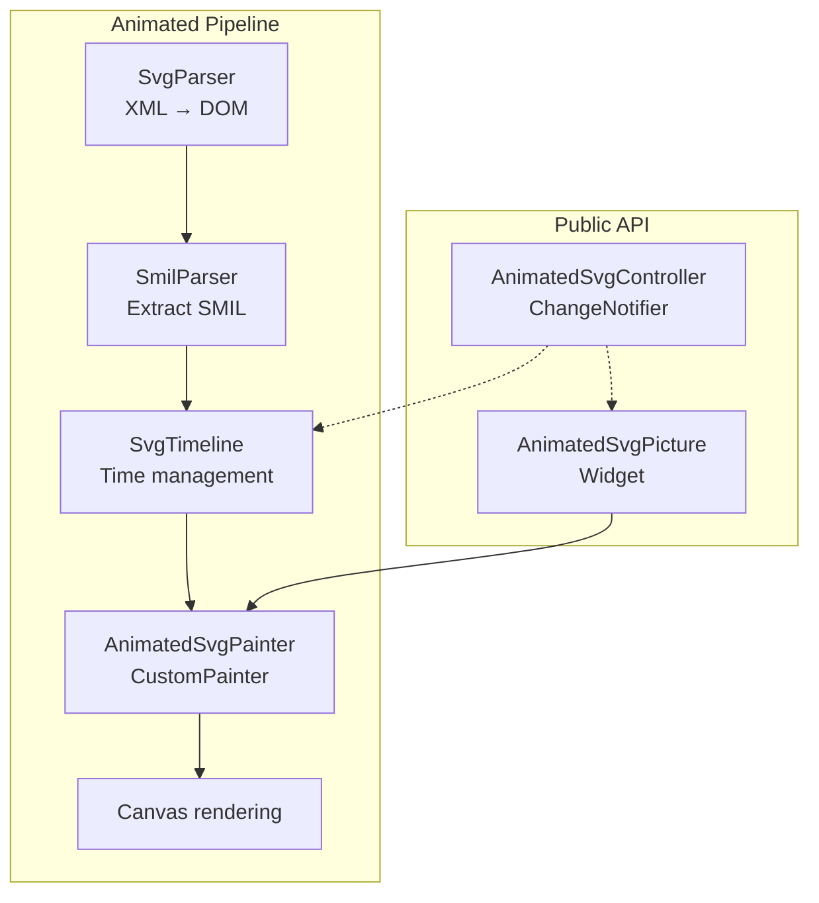
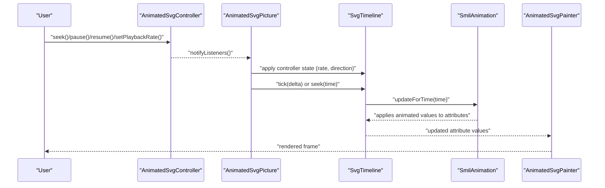
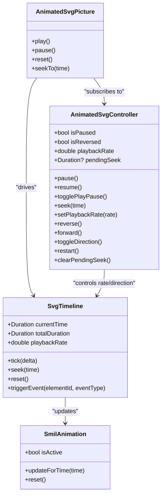

# Animation Control and Playback

<cite>
**Referenced Files in This Document**
- [ANIMATION.md](file://ANIMATION.md)
- [ARCHITECTURE.md](file://ARCHITECTURE.md)
- [lib/src/animation.dart](file://lib/src/animation.dart)
- [lib/src/animation/animated_svg_controller.dart](file://lib/src/animation/animated_svg_controller.dart)
- [lib/src/animation/animated_svg_picture.dart](file://lib/src/animation/animated_svg_picture.dart)
- [lib/src/animation/smil/smil_animation.dart](file://lib/src/animation/smil/smil_animation.dart)
- [lib/src/animation/smil/smil_timeline.dart](file://lib/src/animation/smil/smil_timeline.dart)
- [lib/src/animation/smil/smil_animation_runtime.dart](file://lib/src/animation/smil/smil_animation_runtime.dart)
- [lib/src/animation/smil/smil_timeline_runtime.dart](file://lib/src/animation/smil/smil_timeline_runtime.dart)
- [lib/src/animation/smil/smil_timeline_syncbase.dart](file://lib/src/animation/smil/smil_timeline_syncbase.dart)
- [test/animation/controller_test.dart](file://test/animation/controller_test.dart)
- [example/lib/pages/controller_demo_page.dart](file://example/lib/pages/controller_demo_page.dart)
</cite>

## Table of Contents
1. [Introduction](#introduction)
2. [Project Structure](#project-structure)
3. [Core Components](#core-components)
4. [Architecture Overview](#architecture-overview)
5. [Detailed Component Analysis](#detailed-component-analysis)
6. [Dependency Analysis](#dependency-analysis)
7. [Performance Considerations](#performance-considerations)
8. [Troubleshooting Guide](#troubleshooting-guide)
9. [Conclusion](#conclusion)
10. [Appendices](#appendices)

## Introduction
This document explains the animation control and playback mechanisms for animated SVGs in the project. It focuses on the AnimatedSvgController API, programmatic animation control, playback rate adjustment, and timeline manipulation. It also covers controller methods for play, pause, stop, reset, and seek operations, along with examples of manual animation control, animation synchronization, state management, lifecycle handling, event-driven triggers, and performance considerations. Guidance is provided for integrating animations with user interactions and application state.

## Project Structure
The animated SVG pipeline is implemented as a separate rendering path from the static SVG pipeline. The animated pipeline parses SVG into a DOM, extracts SMIL animations, manages time via a timeline, and renders via a CustomPainter.

**Diagram sources**
- [ARCHITECTURE.md:34-48](file://ARCHITECTURE.md#L34-L48)
- [lib/src/animation/animated_svg_picture.dart:236-269](file://lib/src/animation/animated_svg_picture.dart#L236-L269)
- [lib/src/animation/animated_svg_controller.dart:25](file://lib/src/animation/animated_svg_controller.dart#L25)

**Section sources**
- [ARCHITECTURE.md:6-58](file://ARCHITECTURE.md#L6-L58)
- [ANIMATION.md:150-171](file://ANIMATION.md#L150-L171)

## Core Components
- AnimatedSvgController: Provides programmatic control of playback (pause/resume, reverse/forward, seek, setPlaybackRate, restart) and notifies listeners of state changes.
- AnimatedSvgPicture: The public widget that hosts the animated SVG, integrates with the controller, and drives the render loop.
- SmilAnimation: Describes individual SMIL animations (types, timing, interpolation modes, and runtime state).
- SvgTimeline: Manages global time, playback rate, seeks, resets, and event-driven activation; resolves syncbase timing and triggers dependent animations.
- AnimatedSvgPainter: Renders the DOM tree using effective attribute values computed by the timeline.

Key capabilities:
- Programmatic control via AnimatedSvgController
- Playback rate adjustment and direction control
- Timeline seeking and resetting
- Event-driven animation activation and syncbase chaining
- Freeze vs remove fill behavior

**Section sources**
- [lib/src/animation/animated_svg_controller.dart:25-131](file://lib/src/animation/animated_svg_controller.dart#L25-L131)
- [lib/src/animation/animated_svg_picture.dart:108-295](file://lib/src/animation/animated_svg_picture.dart#L108-L295)
- [lib/src/animation/smil/smil_animation.dart:80-453](file://lib/src/animation/smil/smil_animation.dart#L80-L453)
- [lib/src/animation/smil/smil_timeline.dart:20-256](file://lib/src/animation/smil/smil_timeline.dart#L20-L256)
- [lib/src/animation/animated_svg_picture.dart:236-269](file://lib/src/animation/animated_svg_picture.dart#L236-L269)

## Architecture Overview
The animated pipeline separates concerns across parsing, timeline management, and rendering:

**Diagram sources**
- [lib/src/animation/animated_svg_controller.dart:25-131](file://lib/src/animation/animated_svg_controller.dart#L25-L131)
- [lib/src/animation/animated_svg_picture.dart:166-220](file://lib/src/animation/animated_svg_picture.dart#L166-L220)
- [lib/src/animation/smil/smil_timeline.dart:82-98](file://lib/src/animation/smil/smil_timeline.dart#L82-L98)
- [lib/src/animation/smil/smil_animation_runtime.dart:3-25](file://lib/src/animation/smil/smil_animation_runtime.dart#L3-L25)
- [lib/src/animation/animated_svg_picture.dart:236-269](file://lib/src/animation/animated_svg_picture.dart#L236-L269)

## Detailed Component Analysis

### AnimatedSvgController API
Programmatic control surface:
- Playback control: pause(), resume(), togglePlayPause(), restart()
- Direction control: reverse(), forward(), toggleDirection()
- Seeking: seek(Duration), pendingSeek getter, clearPendingSeek()
- Rate control: setPlaybackRate(double), playbackRate getter
- State: isPaused, isReversed
- Notifications: ChangeNotifier-based listener notifications

Behavior highlights:
- Seeking defers to the widget; the controller stores a pending seek until the widget processes it.
- Playback rate must be positive; setting zero or negative throws an argument error.
- Restart clears pending seek and resumes playback.

Integration:
- AnimatedSvgPicture subscribes to controller changes and applies state to the underlying AnimationController and timeline.

**Section sources**
- [lib/src/animation/animated_svg_controller.dart:25-131](file://lib/src/animation/animated_svg_controller.dart#L25-L131)
- [lib/src/animation/animated_svg_picture.dart:178-220](file://lib/src/animation/animated_svg_picture.dart#L178-L220)
- [test/animation/controller_test.dart:26-140](file://test/animation/controller_test.dart#L26-L140)

### Programmatic Animation Control
- Manual control: Create an AnimatedSvgController, pass it to AnimatedSvgPicture, and call controller methods from UI actions.
- Example integration page demonstrates seek slider, playback rate controls, and restart.

Operational flow:
- Controller changes trigger Picture to update AnimationController and timeline.
- The render loop advances the timeline and redraws frames.

**Section sources**
- [example/lib/pages/controller_demo_page.dart:18-36](file://example/lib/pages/controller_demo_page.dart#L18-L36)
- [test/animation/controller_test.dart:142-193](file://test/animation/controller_test.dart#L142-L193)

### Playback Rate Adjustment
- AnimatedSvgPicture exposes a playbackRate parameter; when changed, the widget updates the timeline’s playback rate.
- The controller’s setPlaybackRate validates positivity and notifies listeners.
- Timeline tick applies the rate to effective delta time.

Effects:
- Speed up or slow down playback while preserving direction and syncbase behavior.

**Section sources**
- [lib/src/animation/animated_svg_picture.dart:200-219](file://lib/src/animation/animated_svg_picture.dart#L200-L219)
- [lib/src/animation/animated_svg_controller.dart:83-91](file://lib/src/animation/animated_svg_controller.dart#L83-L91)
- [lib/src/animation/smil/smil_timeline.dart:82-86](file://lib/src/animation/smil/smil_timeline.dart#L82-L86)

### Timeline Manipulation
- Seek: AnimatedSvgPicture.seekTo converts absolute time to progress and updates the AnimationController value; timeline updates attributes accordingly.
- Reset: Clears controller and timeline state; timeline resets resolved begin times and animation states.
- Tick: Advances global time by delta multiplied by playback rate; updates all animations and triggers syncbase transitions.

Event-driven activation:
- triggerEvent(elementId?, eventType) activates animations listening for event conditions and resolves begin times with offsets.
- Syncbase chaining: When a source animation begins/ends/repeats, dependent animations receive resolved begin times.

**Section sources**
- [lib/src/animation/animated_svg_picture.dart:287-295](file://lib/src/animation/animated_svg_picture.dart#L287-L295)
- [lib/src/animation/smil/smil_timeline.dart:88-126](file://lib/src/animation/smil/smil_timeline.dart#L88-L126)
- [lib/src/animation/smil/smil_timeline_runtime.dart:41-68](file://lib/src/animation/smil/smil_timeline_runtime.dart#L41-L68)
- [lib/src/animation/smil/smil_timeline_syncbase.dart:3-44](file://lib/src/animation/smil/smil_timeline_syncbase.dart#L3-L44)

### Controller Methods: Play, Pause, Stop, Reset, Seek
- Play: AnimatedSvgPicture.play forwards the AnimationController.
- Pause: AnimatedSvgPicture.pause stops the AnimationController.
- Stop: Not exposed as a dedicated method; pause combined with seek to a specific time achieves stopping at a given position.
- Reset: AnimatedSvgPicture.reset resets the AnimationController and timeline.
- Seek: AnimatedSvgPicture.seekTo maps absolute time to normalized progress and updates the controller.

Note: The controller itself does not expose a dedicated stop method; stop is achieved by pausing and seeking.

**Section sources**
- [lib/src/animation/animated_svg_picture.dart:271-295](file://lib/src/animation/animated_svg_picture.dart#L271-L295)
- [lib/src/animation/animated_svg_controller.dart:43-122](file://lib/src/animation/animated_svg_controller.dart#L43-L122)

### Animation Synchronization and State Management
- Syncbase timing: Dependent animations can start on begin/end/repeat of a source animation with optional offsets; resolved times propagate immediately.
- Event-based animations: Animations with only event-based begin conditions start “at infinity” and activate upon triggerEvent.
- Fill mode: freeze retains the last value after completion; remove restores the base value.
- Direction and accumulation: Playback direction affects progression within iterations; accumulate and additive modes influence repeated values.

**Section sources**
- [lib/src/animation/smil/smil_timeline_syncbase.dart:102-128](file://lib/src/animation/smil/smil_timeline_syncbase.dart#L102-L128)
- [lib/src/animation/smil/smil_timeline.dart:128-158](file://lib/src/animation/smil/smil_timeline.dart#L128-L158)
- [lib/src/animation/smil/smil_animation.dart:47-131](file://lib/src/animation/smil/smil_animation.dart#L47-L131)
- [lib/src/animation/smil/smil_animation_runtime.dart:27-81](file://lib/src/animation/smil/smil_animation_runtime.dart#L27-L81)

### Animation Lifecycle and Event Handling
Lifecycle:
- Initialization: AnimatedSvgPicture initializes DOM, parses SMIL, builds timeline, and optionally creates an AnimationController.
- Running: Timeline tick updates attributes; widget rebuilds with CustomPainter.
- Paused: AnimationController is stopped; timeline continues updating attributes but widget does not advance time.
- Seeking: Pending seek is applied; widget updates progress and timeline.
- Reset: Resets time, clears event times, and resets animation states.

Events:
- Gesture-based: AnimatedSvgPicture wraps the painter with GestureDetector/MouseRegion to enable hover/click interactions.
- Programmatic: triggerEvent(elementId?, eventType) activates event-listening animations and resolves dependent syncbase conditions.

**Section sources**
- [lib/src/animation/animated_svg_picture.dart:166-220](file://lib/src/animation/animated_svg_picture.dart#L166-L220)
- [lib/src/animation/animated_svg_picture.dart:246-257](file://lib/src/animation/animated_svg_picture.dart#L246-L257)
- [lib/src/animation/smil/smil_timeline.dart:128-158](file://lib/src/animation/smil/smil_timeline.dart#L128-L158)

### Integration with User Interactions and Application State
- UI controls: Slider for seek, buttons for pause/resume/reverse, and dropdowns for playback rate.
- State binding: Controller state changes notify listeners; widget rebuilds to reflect new state.
- Example demo page shows practical integration of controller with UI.

**Section sources**
- [example/lib/pages/controller_demo_page.dart:18-36](file://example/lib/pages/controller_demo_page.dart#L18-L36)
- [test/animation/controller_test.dart:142-193](file://test/animation/controller_test.dart#L142-L193)

## Dependency Analysis
High-level dependencies among core components:

**Diagram sources**
- [lib/src/animation/animated_svg_controller.dart:25-131](file://lib/src/animation/animated_svg_controller.dart#L25-L131)
- [lib/src/animation/animated_svg_picture.dart:108-295](file://lib/src/animation/animated_svg_picture.dart#L108-L295)
- [lib/src/animation/smil/smil_timeline.dart:20-256](file://lib/src/animation/smil/smil_timeline.dart#L20-L256)
- [lib/src/animation/smil/smil_animation.dart:80-453](file://lib/src/animation/smil/smil_animation.dart#L80-L453)

**Section sources**
- [lib/src/animation.dart:21-31](file://lib/src/animation.dart#L21-L31)
- [lib/src/animation/animated_svg_picture.dart:166-220](file://lib/src/animation/animated_svg_picture.dart#L166-L220)

## Performance Considerations
- Static subtree caching: Nodes without animations can cache rendered output to avoid re-rendering.
- Dirty tracking: Only re-render subtrees whose animated values change.
- Path optimization: Paths are normalized once and reused; prefer incremental updates.
- Allocation reduction: Reuse Path objects and reset them rather than recreating.
- Frame pacing: Timeline tick aligns with the Flutter engine’s frame budget; keep complex animations minimal for 60 FPS.

[No sources needed since this section provides general guidance]

## Troubleshooting Guide
Common issues and remedies:
- Invalid playback rate: Setting zero or negative playbackRate throws an argument error. Ensure positive values.
- Seeking behavior: The controller stores a pending seek; ensure the widget processes it (e.g., pump after seek).
- Pausing vs stopping: There is no dedicated stop method; pause combined with seek achieves stopping at a position.
- Direction changes: Use reverse()/forward() or toggleDirection(); verify fill mode behavior (freeze vs remove).
- Event-based animations: Ensure triggerEvent keys match element IDs and event types; confirm animations are listening for the correct events.

**Section sources**
- [lib/src/animation/animated_svg_controller.dart:83-91](file://lib/src/animation/animated_svg_controller.dart#L83-L91)
- [lib/src/animation/animated_svg_picture.dart:287-295](file://lib/src/animation/animated_svg_picture.dart#L287-L295)
- [lib/src/animation/smil/smil_timeline.dart:128-158](file://lib/src/animation/smil/smil_timeline.dart#L128-L158)

## Conclusion
The animated SVG system provides robust programmatic control via AnimatedSvgController, precise timeline manipulation through SvgTimeline, and flexible SMIL animation support. Developers can integrate animations with user interactions, manage playback rates and directions, synchronize animations using event and syncbase mechanisms, and optimize performance with caching and dirty tracking. The architecture cleanly separates parsing, timing, and rendering, enabling maintainability and extensibility.

[No sources needed since this section summarizes without analyzing specific files]

## Appendices

### API Reference Summary
- AnimatedSvgController
  - Playback: pause(), resume(), togglePlayPause(), restart()
  - Direction: reverse(), forward(), toggleDirection()
  - Seeking: seek(Duration), pendingSeek, clearPendingSeek()
  - Rate: setPlaybackRate(double), playbackRate
  - State: isPaused, isReversed
- AnimatedSvgPicture
  - Playback: play(), pause(), reset(), seekTo(Duration)
  - Properties: playbackRate, autoPlay, controller, initialTime
- SvgTimeline
  - Time: currentTime, totalDuration
  - Controls: tick(Duration), seek(Duration), reset()
  - Events: triggerEvent(String?, String)
  - Rate: playbackRate getter/setter
- SmilAnimation
  - State: isActive, updateForTime(Duration), reset()

**Section sources**
- [lib/src/animation/animated_svg_controller.dart:25-131](file://lib/src/animation/animated_svg_controller.dart#L25-L131)
- [lib/src/animation/animated_svg_picture.dart:108-295](file://lib/src/animation/animated_svg_picture.dart#L108-L295)
- [lib/src/animation/smil/smil_timeline.dart:20-256](file://lib/src/animation/smil/smil_timeline.dart#L20-L256)
- [lib/src/animation/smil/smil_animation.dart:80-453](file://lib/src/animation/smil/smil_animation.dart#L80-L453)