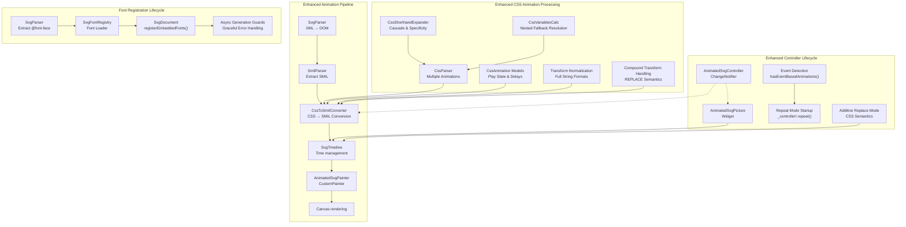
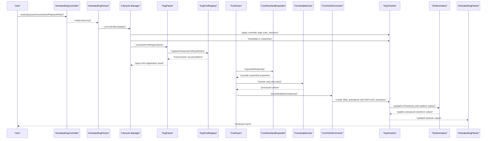
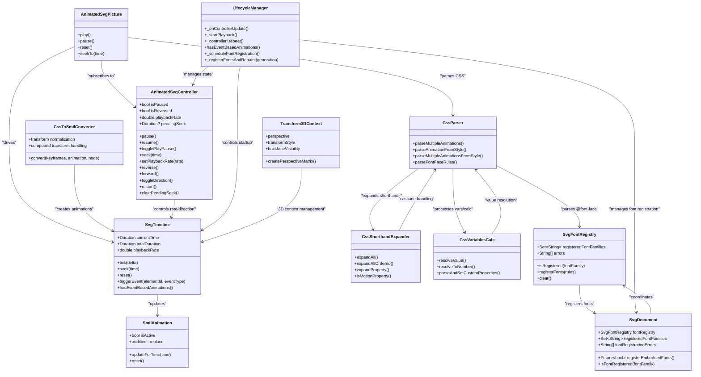

# Animation Control and Playback

<cite>
**Referenced Files in This Document**
- [ANIMATION.md](file://ANIMATION.md)
- [ARCHITECTURE.md](file://ARCHITECTURE.md)
- [lib/src/animation.dart](file://lib/src/animation.dart)
- [lib/src/animation/animated_svg_controller.dart](file://lib/src/animation/animated_svg_controller.dart)
- [lib/src/animation/animated_svg_picture.dart](file://lib/src/animation/animated_svg_picture.dart)
- [lib/src/animation/animated_svg_picture_lifecycle.dart](file://lib/src/animation/animated_svg_picture_lifecycle.dart)
- [lib/src/animation/svg_font_registry.dart](file://lib/src/animation/svg_font_registry.dart)
- [lib/src/animation/svg_dom.dart](file://lib/src/animation/svg_dom.dart)
- [lib/src/animation/svg_parser.dart](file://lib/src/animation/svg_parser.dart)
- [lib/src/animation/svg_parser_css.dart](file://lib/src/animation/svg_parser_css.dart)
- [lib/src/animation/animated_svg_painter_text_style_font.dart](file://lib/src/animation/animated_svg_painter_text_style_font.dart)
- [lib/src/animation/smil/smil_animation.dart](file://lib/src/animation/smil/smil_animation.dart)
- [lib/src/animation/smil/smil_timeline.dart](file://lib/src/animation/smil/smil_timeline.dart)
- [lib/src/animation/smil/smil_animation_runtime.dart](file://lib/src/animation/smil/smil_animation_runtime.dart)
- [lib/src/animation/smil/smil_timeline_runtime.dart](file://lib/src/animation/smil/smil_timeline_runtime.dart)
- [lib/src/animation/smil/smil_timeline_syncbase.dart](file://lib/src/animation/smil/smil_timeline_syncbase.dart)
- [lib/src/animation/css_animations.dart](file://lib/src/animation/css_animations.dart)
- [lib/src/animation/css_animations_models.dart](file://lib/src/animation/css_animations_models.dart)
- [lib/src/animation/css_animations_parser.dart](file://lib/src/animation/css_animations_parser.dart)
- [lib/src/animation/css_to_smil_converter.dart](file://lib/src/animation/css_to_smil_converter.dart)
- [lib/src/animation/css_to_smil_converter_core.dart](file://lib/src/animation/css_to_smil_converter_core.dart)
- [lib/src/animation/css_to_smil_converter_transforms.dart](file://lib/src/animation/css_to_smil_converter_transforms.dart)
- [lib/src/animation/css_to_smil_converter_transforms_values.dart](file://lib/src/animation/css_to_smil_converter_transforms_values.dart)
- [lib/src/animation/transform_3d.dart](file://lib/src/animation/transform_3d.dart)
- [lib/src/animation/animated_svg_painter_matrix.dart](file://lib/src/animation/animated_svg_painter_matrix.dart)
- [lib/src/animation/css_shorthand_expansion.dart](file://lib/src/animation/css_shorthand_expansion.dart)
- [lib/src/animation/css_variables_calc.dart](file://lib/src/animation/css_variables_calc.dart)
- [test/animation/controller_test.dart](file://test/animation/controller_test.dart)
- [test/animation/font_registration_lifecycle_test.dart](file://test/animation/font_registration_lifecycle_test.dart)
- [test/animation/css_animation_edge_cases_test.dart](file://test/animation/css_animation_edge_cases_test.dart)
- [test/animation/css_3d_transforms_test.dart](file://test/animation/css_3d_transforms_test.dart)
- [test/animation/css_3d_transform_smil_test.dart](file://test/animation/css_3d_transform_smil_test.dart)
- [test/animation/css_transform_decomposition_test.dart](file://test/animation/css_transform_decomposition_test.dart)
- [test/animation/css_shorthand_expansion_test.dart](file://test/animation/css_shorthand_expansion_test.dart)
- [test/animation/css_shorthand_timing_test.dart](file://test/animation/css_shorthand_timing_test.dart)
- [test/animation/css_variables_calc_test.dart](file://test/animation/css_variables_calc_test.dart)
- [test/animation/css_variables_calc_viewport_test.dart](file://test/animation/css_variables_calc_viewport_test.dart)
- [test/animation/css_calc_edge_cases_test.dart](file://test/animation/css_calc_edge_cases_test.dart)
- [test/animation/css_property_rendering_test.dart](file://test/animation/css_property_rendering_test.dart)
- [test/css_shorthand_edge_cases_test.dart](file://test/css_shorthand_edge_cases_test.dart)
- [test/css_unit_precision_test.dart](file://test/css_unit_precision_test.dart)
- [example/lib/pages/controller_demo_page.dart](file://example/lib/pages/controller_demo_page.dart)
- [example/lib/pages/custom_svg_viewer_page.dart](file://example/lib/pages/custom_svg_viewer_page.dart)
- [example/lib/widgets/smil_event_timing_widget.dart](file://example/lib/widgets/smil_event_timing_widget.dart)
</cite>

## Update Summary
**Changes Made**
- Enhanced CSS animation conversion system with improved transform decomposition and compound transform preservation
- Added comprehensive CSS shorthand expansion infrastructure with cascade and specificity handling
- Implemented advanced CSS variables and calc() expression support with nested fallback resolution
- Strengthened 3D transform handling with sophisticated decomposition algorithms
- Expanded testing infrastructure covering CSS animations, 3D transforms, and complex animation scenarios
- Enhanced transform normalization with better unit handling and edge case management

## Table of Contents
1. [Introduction](#introduction)
2. [Project Structure](#project-structure)
3. [Core Components](#core-components)
4. [Architecture Overview](#architecture-overview)
5. [Detailed Component Analysis](#detailed-component-analysis)
6. [Enhanced CSS Animation System](#enhanced-css-animation-system)
7. [Advanced CSS Shorthand Expansion](#advanced-css-shorthand-expansion)
8. [Sophisticated CSS Variables and Calculations](#sophisticated-css-variables-and-calculations)
9. [Enhanced 3D Transform Support](#enhanced-3d-transform-support)
10. [Enhanced Controller Lifecycle](#enhanced-controller-lifecycle)
11. [Font Registration Lifecycle](#font-registration-lifecycle)
12. [Dual-Mode Animation Control](#dual-mode-animation-control)
13. [Event-Driven Animation Management](#event-driven-animation-management)
14. [External Controller Integration](#external-controller-integration)
15. [Dependency Analysis](#dependency-analysis)
16. [Performance Considerations](#performance-considerations)
17. [Troubleshooting Guide](#troubleshooting-guide)
18. [Conclusion](#conclusion)
19. [Appendices](#appendices)

## Introduction
This document explains the animation control and playback mechanisms for animated SVGs in the project. It focuses on the AnimatedSvgController API, programmatic animation control, playback rate adjustment, and timeline manipulation. The system now includes enhanced CSS animation support with improved edge case handling, including multiple animations per element, animation-play-state control, negative animation delays, and comprehensive 3D transform support with automatic 2D/3D fallback. It also covers controller methods for play, pause, stop, reset, and seek operations, along with examples of manual animation control, animation synchronization, state management, lifecycle handling, and performance considerations. Guidance is provided for integrating animations with user interactions and application state.

**Updated** Enhanced with comprehensive font registration lifecycle capabilities that mirror the existing image preload pattern with async font loading, generation guards, and graceful error handling. The system now supports embedded @font-face fonts through Flutter's FontLoader with robust error handling and state management.

## Project Structure
The animated SVG pipeline is implemented as a separate rendering path from the static SVG pipeline. The animated pipeline parses SVG into a DOM, extracts SMIL animations, manages time via a timeline, and renders via a CustomPainter. The enhanced system now includes comprehensive CSS animation parsing and conversion capabilities with improved event-driven animation detection and compound transform handling. **Updated** The system now includes a complete font registration lifecycle that mirrors the image preload pattern with async font loading, generation guards, and graceful error handling.

**Diagram sources**
- [ARCHITECTURE.md:34-48](file://ARCHITECTURE.md#L34-L48)
- [lib/src/animation/css_animations_parser.dart:28-43](file://lib/src/animation/css_animations_parser.dart#L28-L43)
- [lib/src/animation/css_to_smil_converter.dart:14-67](file://lib/src/animation/css_to_smil_converter.dart#L14-L67)
- [lib/src/animation/css_to_smil_converter_core.dart:34-40](file://lib/src/animation/css_to_smil_converter_core.dart#L34-L40)
- [lib/src/animation/animated_svg_picture.dart:236-269](file://lib/src/animation/animated_svg_picture.dart#L236-L269)
- [lib/src/animation/animated_svg_controller.dart:25](file://lib/src/animation/animated_svg_controller.dart#L25)
- [lib/src/animation/animated_svg_picture_lifecycle.dart:111-121](file://lib/src/animation/animated_svg_picture_lifecycle.dart#L111-L121)
- [lib/src/animation/smil/smil_timeline.dart:211-215](file://lib/src/animation/smil/smil_timeline.dart#L211-L215)
- [lib/src/animation/smil/smil_animation.dart:110](file://lib/src/animation/smil/smil_animation.dart#L110)
- [lib/src/animation/svg_parser_css.dart:38-58](file://lib/src/animation/svg_parser_css.dart#L38-L58)
- [lib/src/animation/svg_font_registry.dart:77-251](file://lib/src/animation/svg_font_registry.dart#L77-L251)
- [lib/src/animation/svg_dom.dart:586-604](file://lib/src/animation/svg_dom.dart#L586-L604)

**Section sources**
- [ARCHITECTURE.md:6-58](file://ARCHITECTURE.md#L6-L58)
- [ANIMATION.md:150-171](file://ANIMATION.md#L150-L171)

## Core Components
- AnimatedSvgController: Provides programmatic control of playback (pause/resume, reverse/forward, seek, setPlaybackRate, restart) and notifies listeners of state changes.
- AnimatedSvgPicture: The public widget that hosts the animated SVG, integrates with the controller, and drives the render loop with enhanced lifecycle management.
- SmilAnimation: Describes individual SMIL animations (types, timing, interpolation modes, and runtime state) with enhanced additive mode support.
- SvgTimeline: Manages global time, playback rate, seeks, resets, and event-driven activation; resolves syncbase timing and triggers dependent animations.
- AnimatedSvgPainter: Renders the DOM tree using effective attribute values computed by the timeline with enhanced transform handling.
- CssParser: Enhanced CSS animation parser supporting multiple animations, play state control, and negative delays.
- CssToSmilConverter: Converts CSS animations to SMIL format with comprehensive transform handling and compound transform preservation.
- Transform3DContext: Manages 3D transform contexts with perspective, backface visibility, and transform-style support.
- **Updated** SvgFontRegistry: Manages embedded @font-face fonts with Flutter's FontLoader, including parsing CSS font rules, decoding base64 font data, and error tracking.
- **Updated** SvgDocument: Integrates font registry functionality with async font registration and error reporting capabilities.
- **Updated** Font Registration Lifecycle: Implements async font loading with generation guards, graceful error handling, and widget disposal safety.
- **Updated** CssShorthandExpander: Comprehensive CSS shorthand expansion system with cascade and specificity handling for proper property inheritance.
- **Updated** CssVariablesCalc: Advanced CSS variables and calc() expression support with nested fallback resolution and unit conversion.

Key capabilities:
- Programmatic control via AnimatedSvgController
- Playback rate adjustment and direction control
- Timeline seeking and resetting
- Event-driven animation activation and syncbase chaining
- Enhanced CSS animation parsing with multiple animation support
- Animation-play-state control (paused/running)
- Negative animation delay handling
- Comprehensive 3D transform support with automatic 2D/3D fallback
- Freeze vs remove fill behavior
- **Enhanced**: Dual-mode animation control (autoplay vs event-driven)
- **Enhanced**: Repeat mode startup for event-driven animations
- **Enhanced**: Improved event-driven animation detection and management
- **Enhanced**: Better external controller integration with state synchronization
- **Enhanced**: Compound transform handling with CSS REPLACE semantics
- **Enhanced**: Full transform string format preservation in SMIL animations
- **Enhanced**: Async font loading with generation guards and error handling
- **Enhanced**: Embedded @font-face font support through Flutter FontLoader
- **Enhanced**: Font registry management with state cleanup and error tracking
- **Enhanced**: Text rendering integration with registered font resolution
- **Enhanced**: Comprehensive CSS shorthand expansion with cascade handling
- **Enhanced**: Advanced CSS variables and calc() expression processing
- **Enhanced**: Nested fallback resolution for complex variable chains

**Section sources**
- [lib/src/animation/animated_svg_controller.dart:25-160](file://lib/src/animation/animated_svg_controller.dart#L25-L160)
- [lib/src/animation/animated_svg_picture.dart:108-434](file://lib/src/animation/animated_svg_picture.dart#L108-L434)
- [lib/src/animation/smil/smil_animation.dart:80-453](file://lib/src/animation/smil/smil_animation.dart#L80-L453)
- [lib/src/animation/smil/smil_timeline.dart:20-262](file://lib/src/animation/smil/smil_timeline.dart#L20-L262)
- [lib/src/animation/css_animations_parser.dart:28-43](file://lib/src/animation/css_animations_parser.dart#L28-L43)
- [lib/src/animation/css_to_smil_converter_core.dart:27-147](file://lib/src/animation/css_to_smil_converter_core.dart#L27-L147)
- [lib/src/animation/transform_3d.dart:333-373](file://lib/src/animation/transform_3d.dart#L333-L373)
- [lib/src/animation/svg_font_registry.dart:77-251](file://lib/src/animation/svg_font_registry.dart#L77-L251)
- [lib/src/animation/svg_dom.dart:586-604](file://lib/src/animation/svg_dom.dart#L586-L604)
- [lib/src/animation/css_shorthand_expansion.dart:1-158](file://lib/src/animation/css_shorthand_expansion.dart#L1-158)
- [lib/src/animation/css_variables_calc.dart:1-200](file://lib/src/animation/css_variables_calc.dart#L1-200)

## Architecture Overview
The enhanced animated pipeline separates concerns across parsing, CSS-to-SMIL conversion, timeline management, and rendering with comprehensive 3D transform support and improved controller lifecycle management. **Updated** The system now includes a complete font registration lifecycle that mirrors the image preload pattern with async font loading, generation guards, and graceful error handling.

**Diagram sources**
- [lib/src/animation/animated_svg_controller.dart:25-160](file://lib/src/animation/animated_svg_controller.dart#L25-L160)
- [lib/src/animation/animated_svg_picture_lifecycle.dart:226-309](file://lib/src/animation/animated_svg_picture_lifecycle.dart#L226-L309)
- [lib/src/animation/animated_svg_picture.dart:166-220](file://lib/src/animation/animated_svg_picture.dart#L166-L220)
- [lib/src/animation/svg_parser_css.dart:38-58](file://lib/src/animation/svg_parser_css.dart#L38-L58)
- [lib/src/animation/svg_font_registry.dart:106-134](file://lib/src/animation/svg_font_registry.dart#L106-L134)
- [lib/src/animation/css_animations_parser.dart:28-43](file://lib/src/animation/css_animations_parser.dart#L28-L43)
- [lib/src/animation/css_shorthand_expansion.dart:51-65](file://lib/src/animation/css_shorthand_expansion.dart#L51-L65)
- [lib/src/animation/css_variables_calc.dart:103-119](file://lib/src/animation/css_variables_calc.dart#L103-119)
- [lib/src/animation/css_to_smil_converter_core.dart:27-147](file://lib/src/animation/css_to_smil_converter_core.dart#L27-L147)
- [lib/src/animation/smil/smil_timeline.dart:82-98](file://lib/src/animation/smil/smil_timeline.dart#L82-L98)
- [lib/src/animation/smil/smil_animation_runtime.dart:3-25](file://lib/src/animation/smil/smil_animation_runtime.dart#L3-L25)
- [lib/src/animation/animated_svg_picture.dart:236-269](file://lib/src/animation/animated_svg_picture.dart#L236-L269)

## Detailed Component Analysis

### AnimatedSvgController API
Programmatic control surface:
- Playback control: pause(), resume(), togglePlayPause(), restart()
- Direction control: reverse(), forward(), toggleDirection()
- Seeking: seek(Duration), pendingSeek getter, clearPendingSeek()
- Rate control: setPlaybackRate(double), playbackRate getter
- State: isPaused, isReversed
- Notifications: ChangeNotifier-based listener notifications

Behavior highlights:
- Seeking defers to the widget; the controller stores a pending seek until the widget processes it.
- Playback rate must be positive; setting zero or negative throws an argument error.
- Restart clears pending seek and resumes playback.

Integration:
- AnimatedSvgPicture subscribes to controller changes and applies state to the underlying AnimationController and timeline.

**Section sources**
- [lib/src/animation/animated_svg_controller.dart:25-160](file://lib/src/animation/animated_svg_controller.dart#L25-L160)
- [lib/src/animation/animated_svg_picture_lifecycle.dart:226-309](file://lib/src/animation/animated_svg_picture_lifecycle.dart#L226-L309)
- [test/animation/controller_test.dart:26-140](file://test/animation/controller_test.dart#L26-L140)

### Programmatic Animation Control
- Manual control: Create an AnimatedSvgController, pass it to AnimatedSvgPicture, and call controller methods from UI actions.
- Example integration page demonstrates seek slider, playback rate controls, and restart.

Operational flow:
- Controller changes trigger Picture to update AnimationController and timeline.
- The render loop advances the timeline and redraws frames.

**Section sources**
- [example/lib/pages/controller_demo_page.dart:18-36](file://example/lib/pages/controller_demo_page.dart#L18-L36)
- [test/animation/controller_test.dart:142-193](file://test/animation/controller_test.dart#L142-L193)

### Playback Rate Adjustment
- AnimatedSvgPicture exposes a playbackRate parameter; when changed, the widget updates the timeline's playback rate.
- The controller's setPlaybackRate validates positivity and notifies listeners.
- Timeline tick applies the rate to effective delta time.

Effects:
- Speed up or slow down playback while preserving direction and syncbase behavior.

**Section sources**
- [lib/src/animation/animated_svg_picture.dart:200-219](file://lib/src/animation/animated_svg_picture.dart#L200-L219)
- [lib/src/animation/animated_svg_controller.dart:83-91](file://lib/src/animation/animated_svg_controller.dart#L83-L91)
- [lib/src/animation/smil/smil_timeline.dart:82-86](file://lib/src/animation/smil/smil_timeline.dart#L82-L86)

### Timeline Manipulation
- Seek: AnimatedSvgPicture.seekTo converts absolute time to progress and updates the AnimationController value; timeline updates attributes accordingly.
- Reset: Clears controller and timeline state; timeline resets resolved begin times and animation states.
- Tick: Advances global time by delta multiplied by playback rate; updates all animations and triggers syncbase transitions.

Event-driven activation:
- triggerEvent(elementId?, eventType) activates animations listening for event conditions and resolves begin times with offsets.
- Syncbase chaining: When a source animation begins/ends/repeats, dependent animations receive resolved begin times.

**Section sources**
- [lib/src/animation/animated_svg_picture.dart:287-295](file://lib/src/animation/animated_svg_picture.dart#L287-L295)
- [lib/src/animation/smil/smil_timeline.dart:88-126](file://lib/src/animation/smil/smil_timeline.dart#L88-L126)
- [lib/src/animation/smil/smil_timeline_runtime.dart:41-68](file://lib/src/animation/smil/smil_timeline_runtime.dart#L41-L68)
- [lib/src/animation/smil/smil_timeline_syncbase.dart:3-44](file://lib/src/animation/smil/smil_timeline_syncbase.dart#L3-L44)

### Controller Methods: Play, Pause, Stop, Reset, Seek
- Play: AnimatedSvgPicture.play forwards the AnimationController.
- Pause: AnimatedSvgPicture.pause stops the AnimationController.
- Stop: Not exposed as a dedicated method; pause combined with seek to a specific time achieves stopping at a given position.
- Reset: AnimatedSvgPicture.reset resets the AnimationController and timeline.
- Seek: AnimatedSvgPicture.seekTo maps absolute time to normalized progress and updates the controller.

Note: The controller itself does not expose a dedicated stop method; stop is achieved by pausing and seeking.

**Section sources**
- [lib/src/animation/animated_svg_picture.dart:271-295](file://lib/src/animation/animated_svg_picture.dart#L271-L295)
- [lib/src/animation/animated_svg_controller.dart:43-122](file://lib/src/animation/animated_svg_controller.dart#L43-L122)

### Animation Synchronization and State Management
- Syncbase timing: Dependent animations can start on begin/end/repeat of a source animation with optional offsets; resolved times propagate immediately.
- Event-based animations: Animations with only event-based begin conditions start "at infinity" and activate upon triggerEvent.
- Fill mode: freeze retains the last value after completion; remove restores the base value.
- Direction and accumulation: Playback direction affects progression within iterations; accumulate and additive modes influence repeated values.

**Section sources**
- [lib/src/animation/smil/smil_timeline_syncbase.dart:102-128](file://lib/src/animation/smil/smil_timeline_syncbase.dart#L102-L128)
- [lib/src/animation/smil/smil_timeline.dart:128-158](file://lib/src/animation/smil/smil_timeline.dart#L128-L158)
- [lib/src/animation/smil/smil_animation.dart:47-131](file://lib/src/animation/smil/smil_animation.dart#L47-L131)
- [lib/src/animation/smil/smil_animation_runtime.dart:27-81](file://lib/src/animation/smil/smil_animation_runtime.dart#L27-L81)

### Animation Lifecycle and Event Handling
Lifecycle:
- Initialization: AnimatedSvgPicture initializes DOM, parses SMIL, builds timeline, and optionally creates an AnimationController.
- Running: Timeline tick updates attributes; widget rebuilds with CustomPainter.
- Paused: AnimationController is stopped; timeline continues updating attributes but widget does not advance time.
- Seeking: Pending seek is applied; widget updates progress and timeline.
- Reset: Resets time, clears event times, and resets animation states.

Events:
- Gesture-based: AnimatedSvgPicture wraps the painter with GestureDetector/MouseRegion to enable hover/click interactions.
- Programmatic: triggerEvent(elementId?, eventType) activates event-listening animations and resolves dependent syncbase conditions.

**Section sources**
- [lib/src/animation/animated_svg_picture_lifecycle.dart:111-152](file://lib/src/animation/animated_svg_picture_lifecycle.dart#L111-L152)
- [lib/src/animation/animated_svg_picture_lifecycle.dart:200-224](file://lib/src/animation/animated_svg_picture_lifecycle.dart#L200-L224)
- [lib/src/animation/animated_svg_picture.dart:246-257](file://lib/src/animation/animated_svg_picture.dart#L246-L257)
- [lib/src/animation/smil/smil_timeline.dart:128-158](file://lib/src/animation/smil/smil_timeline.dart#L128-L158)

### Integration with User Interactions and Application State
- UI controls: Slider for seek, buttons for pause/resume/reverse, and dropdowns for playback rate.
- State binding: Controller state changes notify listeners; widget rebuilds to reflect new state.
- Example demo page shows practical integration of controller with UI.

**Section sources**
- [example/lib/pages/controller_demo_page.dart:18-36](file://example/lib/pages/controller_demo_page.dart#L18-L36)
- [test/animation/controller_test.dart:142-193](file://test/animation/controller_test.dart#L142-L193)

## Enhanced CSS Animation System

### Multiple Animations Per Element
The enhanced CSS animation system now supports multiple animations applied to a single element through comma-separated animation shorthand:

- **Comma-separated parsing**: `animation: fadeIn 1s, slideUp 2s 0.5s ease-out` creates two separate animations
- **Individual property support**: Both shorthand `animation` and individual `animation-*` properties are supported
- **Cascade handling**: Multiple animations on the same element are processed independently and combined
- **Priority resolution**: Later animations in the cascade can override earlier ones for the same property

Implementation details:
- `CssParser.parseMultipleAnimations()` handles comma-separated values
- `CssParser.parseMultipleAnimationsFromStyle()` processes inline style attributes
- Each animation generates its own SMIL animation instance
- Transform animations are decomposed into component parts for proper 2D/3D handling

**Section sources**
- [lib/src/animation/css_animations_parser.dart:28-43](file://lib/src/animation/css_animations_parser.dart#L28-L43)
- [test/animation/css_animation_edge_cases_test.dart:10-76](file://test/animation/css_animation_edge_cases_test.dart#L10-L76)

### Animation Play State Control
The system now fully supports CSS `animation-play-state` property for controlling animation execution:

- **Paused state**: `animation-play-state: paused` prevents animation updates
- **Running state**: `animation-play-state: running` allows normal animation execution
- **Default behavior**: Animations default to running state
- **Runtime control**: Paused animations do not update their target attributes

Behavior verification:
- Paused animations maintain their initial values during the delay period
- Resuming animations continues from their last computed state
- Play state affects all animated properties of the target element
- Multiple animations on the same element can have different play states

**Section sources**
- [lib/src/animation/css_animations_models.dart:50-52](file://lib/src/animation/css_animations_models.dart#L50-L52)
- [test/animation/css_animation_edge_cases_test.dart:106-158](file://test/animation/css_animation_edge_cases_test.dart#L106-L158)

### Negative Animation Delay Support
The enhanced system supports negative animation delays for advanced timing control:

- **Negative delay parsing**: `animation-delay: -0.5s` starts animation partway through
- **Delay calculation**: Negative delays are applied as offsets from the animation start time
- **Timing precision**: Delays are handled with millisecond precision
- **Visual effects**: Negative delays create immediate animation progress at t=0

Implementation specifics:
- Delay values are stored as Duration objects with negative support
- At t=0, animations compute their progress based on the negative offset
- Forward fill mode applies the initial value during the delay period
- Combined with iteration count for complex timing scenarios

**Section sources**
- [test/animation/css_animation_edge_cases_test.dart:160-203](file://test/animation/css_animation_edge_cases_test.dart#L160-L203)

### CSS Animation Parsing and Cascade Handling
The CSS animation system includes comprehensive parsing and cascade support:

- **Selector rule parsing**: Supports ID, class, and element selectors with animation declarations
- **Media query support**: `@media` rules with `prefers-color-scheme`, `min-width`, `max-width` features
- **Shorthand expansion**: Automatic expansion of CSS shorthand properties
- **Property precedence**: Longhand properties override expanded values
- **Whitespace handling**: Robust parsing with flexible whitespace tolerance

Advanced features:
- Media condition evaluation with viewport context
- Complex selector combinations and specificity handling
- Transition property parsing alongside animation properties
- Comprehensive error handling for malformed CSS

**Section sources**
- [lib/src/animation/css_animations_models.dart:54-103](file://lib/src/animation/css_animations_models.dart#L54-L103)
- [test/animation/css_animation_edge_cases_test.dart:334-457](file://test/animation/css_animation_edge_cases_test.dart#L334-L457)

### Enhanced CSS to SMIL Conversion with Compound Transform Preservation

**Updated** The CSS to SMIL conversion system now maintains full transform string formats through enhanced transform decomposition that preserves CSS semantics.

#### Compound Transform Handling with REPLACE Semantics
The system now uses CSS REPLACE semantics for transform animations instead of decomposition:

- **Single animation per transform**: Compound transforms like `translate(50px,50px) scale(0.5,0.5)` create exactly one SMIL animation
- **Full string preservation**: Transform values maintain their complete string format without decomposition
- **Additive replace mode**: Transform animations use `additive=replace` to match CSS behavior
- **Transform type inference**: First transform function determines the SMIL transform type (translate, rotate, scale)

Implementation details:
- `CssToSmilConverter.convert()` creates single transform animations for compound CSS
- `_createSmilAnimation()` sets `additive=SmilAdditiveMode.replace` for transform animations
- Transform type is inferred from the first function in the transform string
- Compound transforms are preserved as complete strings in SMIL values

**Section sources**
- [lib/src/animation/css_to_smil_converter.dart:34-40](file://lib/src/animation/css_to_smil_converter.dart#L34-L40)
- [lib/src/animation/css_to_smil_converter_core.dart:160](file://lib/src/animation/css_to_smil_converter_core.dart#L160)
- [lib/src/animation/smil/smil_animation.dart:110](file://lib/src/animation/smil/smil_animation.dart#L110)
- [test/animation/stroke_dash_stop_color_test.dart:272-304](file://test/animation/stroke_dash_stop_color_test.dart#L272-L304)

#### Enhanced Transform Normalization
The transform normalization system has been improved to handle complex transform strings:

- **Function regex matching**: Enhanced regex pattern for CSS transform function calls including nested functions
- **Argument parsing**: Handles complex arguments with proper nesting and comma separation
- **Unit conversion**: Supports calc() expressions and various CSS units (px, em, rem, %, vw, vh, etc.)
- **Angle parsing**: Converts angles to degrees with support for calc() expressions
- **Matrix extraction**: Properly handles matrix and matrix3d transform functions

Normalization features:
- `translate3d`, `translateZ`, `rotate3d`, `rotateX`, `rotateY`, `scale3d`, `scaleZ` functions
- Perspective and matrix3d normalization with 16-value validation
- Graceful handling of malformed transform strings
- Consistent decimal formatting for numerical values

**Section sources**
- [lib/src/animation/css_to_smil_converter_transforms_values.dart:5-8](file://lib/src/animation/css_to_smil_converter_transforms_values.dart#L5-L8)
- [lib/src/animation/css_to_smil_converter_transforms_values.dart:25-62](file://lib/src/animation/css_to_smil_converter_transforms_values.dart#L25-L62)
- [lib/src/animation/css_to_smil_converter_transforms_values.dart:213-273](file://lib/src/animation/css_to_smil_converter_transforms_values.dart#L213-L273)
- [lib/src/animation/css_to_smil_converter_transforms_values.dart:328-389](file://lib/src/animation/css_to_smil_converter_transforms_values.dart#L328-L389)

## Advanced CSS Shorthand Expansion

### Comprehensive Shorthand Property Support
The enhanced CSS shorthand expansion system provides comprehensive support for all major CSS shorthand properties with proper cascade and specificity handling:

- **Font shorthand**: `font: bold 16px Arial` expands to individual font properties with proper inheritance
- **Animation shorthand**: `animation: spin 1s ease-in 0.5s infinite alternate both paused` expands to all animation components
- **Box model shorthands**: `margin: 10px 20px` expands to individual margin sides
- **Border shorthands**: `border: 1px solid black` expands to width, style, and color
- **Background shorthand**: Complex background properties with gradients and images

Cascade and specificity handling:
- **Order preservation**: Declarations maintain their original order for proper cascade evaluation
- **Override rules**: Later declarations override earlier ones at the same specificity level
- **Longhand precedence**: Individual longhand properties override expanded shorthand values
- **Motion properties**: Special handling for CSS motion path properties

**Section sources**
- [lib/src/animation/css_shorthand_expansion.dart:139-157](file://lib/src/animation/css_shorthand_expansion.dart#L139-L157)
- [test/animation/css_shorthand_expansion_test.dart:83-110](file://test/animation/css_shorthand_expansion_test.dart#L83-L110)
- [test/animation/css_shorthand_timing_test.dart:379-390](file://test/animation/css_shorthand_timing_test.dart#L379-L390)
- [test/css_shorthand_edge_cases_test.dart:146-413](file://test/css_shorthand_edge_cases_test.dart#L146-413)

### Motion Property Detection
The system includes specialized detection for CSS motion path properties that extend beyond standard offset-* properties:

- **Standard offset properties**: `offset`, `offset-path`, `offset-distance`, `offset-rotate`, `offset-position`, `offset-anchor`
- **Legacy motion properties**: `motion-path`, `motion-offset`, `motion-rotation`
- **Motion property identification**: Used for special handling in animation processing

**Section sources**
- [lib/src/animation/css_shorthand_expansion.dart:139-157](file://lib/src/animation/css_shorthand_expansion.dart#L139-L157)

## Sophisticated CSS Variables and Calculations

### Advanced Variable Resolution System
The enhanced CSS variables and calc() system provides comprehensive support for complex variable chains and mathematical expressions:

- **Nested fallback resolution**: `var(--a, var(--b, default))` supports unlimited nesting levels
- **Variable inheritance**: Variables flow through `<use>` boundaries with proper context resolution
- **Mathematical expressions**: Full calc() support with min(), max(), clamp(), and unit conversions
- **Unit conversion**: Automatic conversion between different CSS units (px, em, rem, %, vw, vh)
- **Viewport awareness**: calc() expressions properly handle viewport-relative units

Variable resolution features:
- **Tree walking**: Variables resolve by walking up the DOM tree to find definitions
- **Fallback chains**: Complex fallback hierarchies with nested var() references
- **Iteration limits**: Prevent infinite recursion with configurable maximum iterations
- **Error handling**: Graceful fallback for undefined variables and invalid expressions

**Section sources**
- [lib/src/animation/css_variables_calc.dart:94-144](file://lib/src/animation/css_variables_calc.dart#L94-L144)
- [lib/src/animation/css_variables_calc.dart:988-1035](file://lib/src/animation/css_variables_calc.dart#L988-L1035)
- [test/animation/css_variables_calc_test.dart:220-401](file://test/animation/css_variables_calc_test.dart#L220-L401)
- [test/animation/css_variables_calc_viewport_test.dart:228-355](file://test/animation/css_variables_calc_viewport_test.dart#L228-L355)

### Calc() Expression Evaluation
The calc() expression evaluator supports complex mathematical operations with proper CSS unit handling:

- **Operator precedence**: Correct mathematical order of operations
- **Mixed unit arithmetic**: Operations between different CSS units with automatic conversion
- **Mathematical functions**: Support for min(), max(), clamp() within calc() expressions
- **Scientific notation**: Handles exponential numbers in calculations
- **Percentage arithmetic**: Proper handling of percentage calculations with container sizes

Edge case handling:
- **Division by zero**: Graceful fallback to zero or null values
- **Invalid expressions**: Robust error handling without crashes
- **Deep nesting**: Limits on expression depth prevent stack overflow
- **Whitespace tolerance**: Flexible parsing with various whitespace formats

**Section sources**
- [test/animation/css_calc_edge_cases_test.dart:216-415](file://test/animation/css_calc_edge_cases_test.dart#L216-L415)
- [test/animation/css_property_rendering_test.dart:88-131](file://test/animation/css_property_rendering_test.dart#L88-L131)
- [test/css_unit_precision_test.dart:302-346](file://test/css_unit_precision_test.dart#L302-L346)

## Enhanced 3D Transform Support

### Comprehensive 3D Transform Implementation
The system now provides full 3D transform support with automatic 2D/3D fallback:

- **3D transform types**: `translate3d`, `translateZ`, `scale3d`, `scaleZ`, `rotateX`, `rotateY`, `rotate3d`, `perspective`, `matrix3d`
- **Automatic projection**: 3D transforms are automatically projected to 2D for rendering
- **Perspective support**: Full CSS perspective property implementation with origin control
- **Backface visibility**: Proper handling of element orientation and visibility
- **Transform style**: Support for `flat` and `preserve-3d` transform contexts

Matrix operations:
- **4x4 matrix implementation**: Complete 3D matrix mathematics with column-major storage
- **Transform composition**: Proper matrix multiplication and transformation chaining
- **Projection extraction**: Automatic extraction of 2D affine matrices from 3D transformations
- **Backface detection**: Matrix-based determination of element orientation

**Section sources**
- [lib/src/animation/transform_3d.dart:22-327](file://lib/src/animation/transform_3d.dart#L22-L327)
- [test/animation/css_3d_transforms_test.dart:196-317](file://test/animation/css_3d_transforms_test.dart#L196-L317)

### Transform Decomposition and Conversion
Advanced transform processing ensures compatibility across 2D and 3D contexts:

- **Compound transform decomposition**: `translate(10,20) rotateX(45deg) scale(2)` becomes three separate animations
- **3D to 2D projection**: X and Y rotations produce perspective effects through 2D matrix extraction
- **Z-axis handling**: Z-only transformations are appropriately ignored or handled for 2D rendering
- **Matrix normalization**: CSS matrix functions are properly converted to internal matrix representations

Implementation details:
- `TransformDecomposition.fromTransforms()` processes complex transform chains
- `Matrix4x4.extract2DMatrix()` converts 3D matrices to 2D affine transformations
- `SvgTransform.parse()` handles both 2D and 3D transform syntax
- Automatic fallback ensures 2D compatibility for all 3D operations

**Section sources**
- [test/animation/css_3d_transforms_test.dart:319-384](file://test/animation/css_3d_transforms_test.dart#L319-L384)
- [lib/src/animation/animated_svg_painter_matrix.dart:83-185](file://lib/src/animation/animated_svg_painter_matrix.dart#L83-L185)

### CSS to SMIL Conversion Enhancements
The CSS-to-SMIL conversion system has been enhanced to handle complex 3D transforms:

- **Transform type inference**: Automatic detection of transform operation types from CSS values
- **Compound transform handling**: Decomposition of complex transform strings into component animations
- **3D context preservation**: Maintaining 3D semantics during conversion to SMIL format
- **Timing function propagation**: Proper handling of per-keyframe timing functions in complex transforms

Conversion process:
- `CssToSmilConverter.convert()` processes CSS keyframes and animations
- `_decomposeCompoundTransform()` handles multi-function transform animations
- `_normalizeCssTransform()` ensures consistent transform value formats
- Automatic SMIL animation creation for each transform component

**Section sources**
- [lib/src/animation/css_to_smil_converter_core.dart:27-147](file://lib/src/animation/css_to_smil_converter_core.dart#L27-L147)
- [lib/src/animation/css_to_smil_converter_transforms.dart:3-5](file://lib/src/animation/css_to_smil_converter_transforms.dart#L3-L5)

### Advanced 3D Transform Decomposition
The enhanced 3D transform decomposition system provides sophisticated handling of complex transform scenarios:

- **Rotate3d decomposition**: Proper handling of arbitrary axis rotations with matrix representation
- **Identity transform detection**: Recognition of zero and identity transforms
- **Negative value handling**: Proper processing of negative scale and translation values
- **Zero value edge cases**: Special handling for zero values in 3D transforms
- **Combined transform processing**: Efficient combination of multiple transform operations

Decomposition algorithms:
- **Rotate3d to matrix conversion**: Complex rotation matrix calculation for arbitrary axes
- **Scale3d extraction**: Proper extraction of 3D scaling components
- **Translate3d normalization**: Accurate 3D translation value processing
- **Matrix combination**: Efficient combination of multiple transform matrices

**Section sources**
- [test/animation/css_3d_transform_smil_test.dart:212-407](file://test/animation/css_3d_transform_smil_test.dart#L212-L407)
- [test/animation/css_3d_transform_smil_test.dart:490-707](file://test/animation/css_3d_transform_smil_test.dart#L490-L707)

## Enhanced Controller Lifecycle

### Improved Event-Driven Animation Detection
The controller lifecycle now includes sophisticated event-driven animation detection and management:

- **Event-based animation detection**: The system can detect when animations are configured to start on events (click, mouseover, etc.)
- **Automatic ticker management**: When event-driven animations are present, the system automatically starts the AnimationController in repeat mode to keep the timeline ticking
- **Conditional startup logic**: The initialization process checks for event-based animations and adjusts startup behavior accordingly

Startup behavior:
- **Auto-play mode**: When `autoPlay=true`, the system starts playback normally with forward/reverse support
- **Event-driven mode**: When `autoPlay=false` but event-based animations exist, the system starts the controller in repeat mode to continuously update frames
- **No animations mode**: When no animations are detected, the system remains idle

**Section sources**
- [lib/src/animation/animated_svg_picture_lifecycle.dart:111-127](file://lib/src/animation/animated_svg_picture_lifecycle.dart#L111-L127)
- [lib/src/animation/smil/smil_timeline.dart:211-215](file://lib/src/animation/smil/smil_timeline.dart#L211-L215)

### Repeat Mode Startup Mechanism
The enhanced system implements a repeat mode startup mechanism for event-driven animations:

- **Continuous ticking**: Event-driven animations require the timeline to continue updating even when no animations are actively playing
- **Repeat mode activation**: The system calls `_controller!.repeat()` to keep the AnimationController running in a loop
- **Frame updates**: Even though no animations are active, the timeline continues to update attribute values for event-driven animations
- **Performance optimization**: This approach ensures responsive event handling without requiring manual animation management

**Section sources**
- [lib/src/animation/animated_svg_picture_lifecycle.dart:114-121](file://lib/src/animation/animated_svg_picture_lifecycle.dart#L114-L121)

### Enhanced External Controller Integration
The controller lifecycle now provides better integration with external controllers:

- **State synchronization**: The system monitors controller state changes and synchronizes them with the AnimationController
- **Direction changes**: When the controller's direction changes, the system restarts playback with the new direction
- **Pause/resume handling**: The system properly handles pause/resume state changes from external controllers
- **Seek synchronization**: When seeking occurs, the system updates both the timeline and the AnimationController value

**Section sources**
- [lib/src/animation/animated_svg_picture_lifecycle.dart:226-309](file://lib/src/animation/animated_svg_picture_lifecycle.dart#L226-L309)

## Font Registration Lifecycle

### Embedded Font Support Architecture
The system now provides comprehensive embedded font support through a complete lifecycle that mirrors the image preload pattern:

- **Font extraction**: SVG parser extracts @font-face rules from embedded CSS during document parsing
- **Font registry management**: SvgFontRegistry handles font parsing, decoding, and registration with Flutter's FontLoader
- **Async registration**: Font registration occurs asynchronously to avoid blocking the UI thread
- **Generation guards**: Async operations use generation counters to prevent race conditions during widget disposal
- **Graceful error handling**: Font registration failures don't crash rendering; errors are tracked and reported

Font processing flow:
1. **Extraction**: `SvgParser` extracts @font-face rules from `<style>` elements
2. **Parsing**: `CssParser.parseFontFaceRules()` parses CSS into structured `CssFontFaceRule` objects
3. **Registration**: `SvgFontRegistry.registerFonts()` decodes base64 font data and loads with Flutter FontLoader
4. **Integration**: `SvgDocument.registerEmbeddedFonts()` coordinates font loading with error tracking
5. **Resolution**: Text rendering resolves registered fonts without fallback expansion

**Section sources**
- [lib/src/animation/svg_parser_css.dart:38-58](file://lib/src/animation/svg_parser_css.dart#L38-L58)
- [lib/src/animation/svg_font_registry.dart:106-134](file://lib/src/animation/svg_font_registry.dart#L106-L134)
- [lib/src/animation/svg_dom.dart:586-604](file://lib/src/animation/svg_dom.dart#L586-L604)
- [lib/src/animation/animated_svg_picture_lifecycle.dart:325-343](file://lib/src/animation/animated_svg_picture_lifecycle.dart#L325-L343)

### Async Font Loading with Generation Guards
The font registration system implements robust async loading with generation guards to prevent race conditions:

- **Generation counter**: Each font registration request increments a generation counter
- **Mount safety**: Async callbacks check widget mount status before proceeding
- **Generation validation**: Callbacks verify generation matches expected value before updating state
- **Disposal safety**: Widget disposal cancels pending font registration operations

Error handling mechanisms:
- **Exception catching**: Font registration failures are caught and logged without crashing
- **Partial success**: Fonts that load successfully still trigger repaint even if others fail
- **Error tracking**: All font registration errors are collected and accessible via `fontRegistrationErrors`
- **Warning level logging**: Non-fatal errors are logged as warnings rather than errors

**Section sources**
- [lib/src/animation/animated_svg_picture_lifecycle.dart:345-384](file://lib/src/animation/animated_svg_picture_lifecycle.dart#L345-L384)
- [lib/src/animation/svg_font_registry.dart:136-185](file://lib/src/animation/svg_font_registry.dart#L136-L185)

### Font Registry Management and State Tracking
The SvgFontRegistry provides comprehensive font management capabilities:

- **Font family grouping**: Font rules are grouped by normalized font family names for batch registration
- **Format validation**: Only supported formats (TTF, OTF) are processed; WOFF/WOFF2 are rejected
- **Base64 decoding**: Embedded font data is decoded from data URLs with proper MIME type checking
- **Error collection**: All font processing errors are collected and made available for debugging
- **State cleanup**: `clear()` method removes all registered fonts and resets internal state

Font processing features:
- **HTML entity decoding**: Font family names with HTML-encoded quotes are properly decoded
- **Quote normalization**: Font family names with surrounding quotes are normalized
- **Weight normalization**: CSS font-weight values are normalized to numeric strings
- **Format detection**: Supported font formats are detected from CSS or data URL metadata

**Section sources**
- [lib/src/animation/svg_font_registry.dart:85-104](file://lib/src/animation/svg_font_registry.dart#L85-L104)
- [lib/src/animation/svg_font_registry.dart:226-242](file://lib/src/animation/svg_font_registry.dart#L226-L242)
- [lib/src/animation/svg_font_registry.dart:378-401](file://lib/src/animation/svg_font_registry.dart#L378-L401)

### Text Rendering Integration with Registered Fonts
The text rendering system integrates seamlessly with the font registration lifecycle:

- **Font resolution**: Text rendering checks if a font is registered via @font-face before applying fallback expansion
- **Direct font usage**: Registered fonts are used directly without additional fallback chains
- **Platform fallbacks**: Generic font families (serif, sans-serif, monospace) use platform-appropriate fallback stacks
- **Metric compatibility**: Fallback fonts are chosen for metric compatibility and visual consistency

Font resolution process:
1. **Normalization**: Font family names are normalized (quotes removed, HTML entities decoded)
2. **Registration check**: `document.isFontRegistered()` checks if font is embedded via @font-face
3. **Direct usage**: Registered fonts bypass fallback expansion for consistent rendering
4. **Generic families**: Platform-specific fallback stacks are used for generic font families
5. **Specific fonts**: Metric-compatible fallbacks are added for specific font names

**Section sources**
- [lib/src/animation/animated_svg_painter_text_style_font.dart:154-179](file://lib/src/animation/animated_svg_painter_text_style_font.dart#L154-L179)
- [lib/src/animation/animated_svg_painter_text_style_font.dart:183-257](file://lib/src/animation/animated_svg_painter_text_style_font.dart#L183-L257)

### SVG Parser Integration for Font Extraction
The SVG parser provides comprehensive @font-face rule extraction from embedded CSS:

- **Style element parsing**: All `<style>` elements are scanned for @font-face rules
- **CSS rule extraction**: `CssParser.parseFontFaceRules()` extracts font metadata and source URLs
- **Rule validation**: Font rules are validated for required properties and supported formats
- **Empty rule handling**: Documents without @font-face rules return null or empty collections

Extraction process:
- **CSS text collection**: All `<style>` element innerText is collected for parsing
- **Rule matching**: Regular expressions identify @font-face CSS blocks
- **Property extraction**: Individual properties (font-family, font-style, font-weight, src, format) are parsed
- **URL normalization**: Data URLs are normalized and validated for base64 encoding
- **Format detection**: Font formats are detected from CSS or data URL metadata

**Section sources**
- [lib/src/animation/svg_parser_css.dart:39-57](file://lib/src/animation/svg_parser_css.dart#L39-L57)
- [lib/src/animation/svg_parser.dart:43-64](file://lib/src/animation/svg_parser.dart#L43-L64)

### Font Registration Lifecycle Testing and Verification
The system includes comprehensive testing for font registration lifecycle:

- **Auto-registration**: SVGs with @font-face rules automatically trigger font registration
- **Multiple font support**: Multiple @font-face rules are all processed and registered
- **SVG change handling**: Changing SVG content re-triggers font registration appropriately
- **Error handling verification**: Font registration failures don't crash widget rendering
- **Generation guard testing**: Widget disposal during font registration is safely handled

Test coverage includes:
- **Basic registration**: Single @font-face rule registration verification
- **No font scenario**: SVGs without @font-face don't attempt registration
- **Multiple fonts**: Multiple @font-face rules are all registered
- **SVG switching**: Changing SVG content triggers re-registration
- **Error scenarios**: Font registration failures are handled gracefully
- **Mount safety**: Widget disposal during registration is prevented

**Section sources**
- [test/animation/font_registration_lifecycle_test.dart:8-65](file://test/animation/font_registration_lifecycle_test.dart#L8-L65)
- [test/animation/font_registration_lifecycle_test.dart:67-100](file://test/animation/font_registration_lifecycle_test.dart#L67-L100)
- [test/animation/font_registration_lifecycle_test.dart:102-192](file://test/animation/font_registration_lifecycle_test.dart#L102-L192)
- [test/animation/font_registration_lifecycle_test.dart:194-239](file://test/animation/font_registration_lifecycle_test.dart#L194-L239)
- [test/animation/font_registration_lifecycle_test.dart:241-279](file://test/animation/font_registration_lifecycle_test.dart#L241-L279)
- [test/animation/font_registration_lifecycle_test.dart:281-342](file://test/animation/font_registration_lifecycle_test.dart#L281-L342)

## Dual-Mode Animation Control

### AutoPlay vs Event-Driven Control
The system now supports dual-mode animation control with intelligent startup logic:

- **AutoPlay mode**: When `autoPlay=true`, animations start automatically and follow normal playback patterns
- **Event-driven mode**: When `autoPlay=false`, animations wait for explicit events to start
- **Smart detection**: The system automatically detects which mode to use based on animation configuration

Mode selection criteria:
- **Has event-based animations**: If animations are configured to start on events, the system uses event-driven mode
- **Has infinite animations**: If animations are configured to repeat infinitely, the system uses autoPlay mode
- **No animations detected**: If no animations are found, the system remains idle

**Section sources**
- [lib/src/animation/animated_svg_picture_lifecycle.dart:111-127](file://lib/src/animation/animated_svg_picture_lifecycle.dart#L111-L127)
- [lib/src/animation/smil/smil_timeline.dart:154-157](file://lib/src/animation/smil/smil_timeline.dart#L154-L157)

### Conditional Startup Logic
The enhanced startup logic provides conditional behavior based on animation configuration:

- **Event-based detection**: The system checks for animations with event-based begin conditions using `hasEventBasedAnimations()`
- **Infinite animation detection**: The system checks for animations with infinite repeat counts using `_hasInfiniteAnimations()`
- **Fallback behavior**: When neither condition is met, the system logs a warning and remains idle

Startup decision flow:
1. Parse animations and build timeline
2. Check if animations exist
3. If animations exist:
   - Check if autoPlay is enabled
   - If autoPlay=true: start normal playback
   - If autoPlay=false: check for event-based animations
4. If event-based animations exist: start in repeat mode
5. If no animations exist: log warning and remain idle

**Section sources**
- [lib/src/animation/animated_svg_picture_lifecycle.dart:111-152](file://lib/src/animation/animated_svg_picture_lifecycle.dart#L111-L152)

## Event-Driven Animation Management

### Enhanced Event Detection and Management
The system now provides comprehensive event-driven animation management:

- **Event listener registration**: The timeline registers event listeners for animations that start on events
- **Event key generation**: Events are identified using element IDs and event types in the format `elementId:eventType`
- **Automatic activation**: When events occur, the system automatically activates waiting animations
- **Dependency graph building**: The system builds dependency graphs to handle complex event chains

Event handling flow:
1. **Registration**: Event listeners are registered during timeline initialization
2. **Detection**: The system detects when events occur (click, hover, etc.)
3. **Activation**: Waiting animations are activated with appropriate timing offsets
4. **Propagation**: Activated animations trigger their dependent animations through syncbase events

**Section sources**
- [lib/src/animation/smil/smil_timeline.dart:142-158](file://lib/src/animation/smil/smil_timeline.dart#L142-L158)
- [lib/src/animation/smil/smil_timeline_syncbase.dart:47-84](file://lib/src/animation/smil/smil_timeline_syncbase.dart#L47-L84)

### Improved Event-Based Animation Lifecycle
The enhanced lifecycle management provides better handling of event-driven animations:

- **Continuous ticking**: Event-driven animations require continuous timeline updates even when inactive
- **State transition detection**: The system tracks animation state transitions to trigger syncbase events
- **Automatic dependency resolution**: Dependencies between event-driven animations are resolved automatically
- **Performance monitoring**: The system tracks active animation counts and performance metrics

State transition detection:
- **Previous state tracking**: The system maintains previous animation states to detect transitions
- **Begin/end detection**: The system detects when animations start or finish
- **Syncbase triggering**: When transitions occur, the system triggers dependent animations
- **Immediate updates**: Dependent animations are updated immediately with current timeline time

**Section sources**
- [lib/src/animation/smil/smil_timeline_runtime.dart:41-68](file://lib/src/animation/smil/smil_timeline_runtime.dart#L41-L68)
- [lib/src/animation/smil/smil_timeline_syncbase.dart:3-45](file://lib/src/animation/smil/smil_timeline_syncbase.dart#L3-L45)

### External Controller Integration for Event-Driven Animations
The system provides enhanced integration with external controllers for event-driven scenarios:

- **Controller state monitoring**: The system monitors external controller state changes
- **Event-driven state synchronization**: When external controllers change state, the system updates event-driven animations
- **Performance-aware updates**: The system optimizes updates for event-driven scenarios
- **Error handling**: The system handles errors gracefully in event-driven contexts

**Section sources**
- [example/lib/pages/custom_svg_viewer_page.dart:278-285](file://example/lib/pages/custom_svg_viewer_page.dart#L278-L285)

## Dependency Analysis
High-level dependencies among core components with enhanced CSS animation support, improved controller lifecycle, and comprehensive font registration capabilities:

**Diagram sources**
- [lib/src/animation/animated_svg_controller.dart:25-160](file://lib/src/animation/animated_svg_controller.dart#L25-L160)
- [lib/src/animation/animated_svg_picture.dart:108-434](file://lib/src/animation/animated_svg_picture.dart#L108-L434)
- [lib/src/animation/smil/smil_timeline.dart:20-262](file://lib/src/animation/smil/smil_timeline.dart#L20-L262)
- [lib/src/animation/smil/smil_animation.dart:80-453](file://lib/src/animation/smil/smil_animation.dart#L80-L453)
- [lib/src/animation/css_animations_parser.dart:28-43](file://lib/src/animation/css_animations_parser.dart#L28-L43)
- [lib/src/animation/css_shorthand_expansion.dart:1-158](file://lib/src/animation/css_shorthand_expansion.dart#L1-158)
- [lib/src/animation/css_variables_calc.dart:1-200](file://lib/src/animation/css_variables_calc.dart#L1-200)
- [lib/src/animation/css_to_smil_converter_core.dart:27-147](file://lib/src/animation/css_to_smil_converter_core.dart#L27-L147)
- [lib/src/animation/svg_font_registry.dart:77-251](file://lib/src/animation/svg_font_registry.dart#L77-L251)
- [lib/src/animation/svg_dom.dart:443-614](file://lib/src/animation/svg_dom.dart#L443-L614)
- [lib/src/animation/transform_3d.dart:329-369](file://lib/src/animation/transform_3d.dart#L329-L369)
- [lib/src/animation/animated_svg_picture_lifecycle.dart:111-152](file://lib/src/animation/animated_svg_picture_lifecycle.dart#L111-L152)

**Section sources**
- [lib/src/animation.dart:21-31](file://lib/src/animation.dart#L21-L31)
- [lib/src/animation/animated_svg_picture.dart:166-220](file://lib/src/animation/animated_svg_picture.dart#L166-L220)

## Performance Considerations
- Static subtree caching: Nodes without animations can cache rendered output to avoid re-rendering.
- Dirty tracking: Only re-render subtrees whose animated values change.
- Path optimization: Paths are normalized once and reused; prefer incremental updates.
- Allocation reduction: Reuse Path objects and reset them rather than recreating.
- Frame pacing: Timeline tick aligns with the Flutter engine's frame budget; keep complex animations minimal for 60 FPS.
- **Enhanced**: Multiple animation processing optimizes memory usage by sharing common animation resources.
- **Enhanced**: CSS animation parsing caches parsed results to avoid redundant processing.
- **Enhanced**: 3D transform decomposition pre-computes matrix operations for better performance.
- **Enhanced**: Automatic 2D/3D fallback reduces computational overhead for simple transforms.
- **Enhanced**: Event-driven animation detection optimizes startup behavior based on animation configuration.
- **Enhanced**: Repeat mode startup for event-driven animations ensures responsive event handling.
- **Enhanced**: External controller integration minimizes state synchronization overhead.
- **Enhanced**: Conditional startup logic reduces unnecessary AnimationController initialization.
- **Enhanced**: Compound transform preservation reduces animation count and improves performance.
- **Enhanced**: CSS REPLACE semantics eliminate double-application issues in transform animations.
- **Enhanced**: Async font loading prevents UI blocking during font registration.
- **Enhanced**: Generation guards prevent race conditions and memory leaks during widget disposal.
- **Enhanced**: Graceful error handling ensures font registration failures don't impact rendering performance.
- **Enhanced**: Font registry caching avoids redundant font loading for the same font families.
- **Enhanced**: CSS shorthand expansion with cascade handling reduces property processing overhead.
- **Enhanced**: Advanced CSS variables and calc() evaluation with caching mechanisms.
- **Enhanced**: Transform normalization with optimized regex patterns and argument parsing.

## Troubleshooting Guide
Common issues and remedies:
- Invalid playback rate: Setting zero or negative playbackRate throws an argument error. Ensure positive values.
- Seeking behavior: The controller stores a pending seek; ensure the widget processes it (e.g., pump after seek).
- Pausing vs stopping: There is no dedicated stop method; pause combined with seek achieves stopping at a position.
- Direction changes: Use reverse()/forward() or toggleDirection(); verify fill mode behavior (freeze vs remove).
- Event-based animations: Ensure triggerEvent keys match element IDs and event types; confirm animations are listening for the correct events.
- **Enhanced**: Multiple animations: Verify comma separation syntax and ensure animations target the correct properties.
- **Enhanced**: Play state issues: Check that `animation-play-state: paused` is properly parsed and applied.
- **Enhanced**: Negative delays: Ensure delay values are correctly calculated and don't exceed animation duration.
- **Enhanced**: 3D transform problems: Verify perspective values are positive and transform matrices are properly formed.
- **Enhanced**: Event-driven mode issues: Verify that event-based animations are properly detected and that the repeat mode startup is working.
- **Enhanced**: External controller integration: Ensure that controller state changes are properly synchronized with the timeline.
- **Enhanced**: Dual-mode control: Verify that the system is correctly detecting whether to use autoPlay or event-driven mode.
- **Enhanced**: Compound transform issues: Verify that transform animations use additive replace mode and maintain full string formats.
- **Enhanced**: Transform normalization problems: Check that CSS transform functions are properly parsed and normalized.
- **Enhanced**: Font registration failures: Check `fontRegistrationErrors` for specific error messages; verify font format support (TTF/OTF only).
- **Enhanced**: Async font loading issues: Verify that font registration is completing successfully; check generation counter for race conditions.
- **Enhanced**: Widget disposal during font registration: Ensure proper mount checking in async callbacks; verify generation validation.
- **Enhanced**: Text rendering with custom fonts: Verify that registered fonts are being resolved correctly without unexpected fallback expansion.
- **Enhanced**: CSS shorthand expansion issues: Verify cascade order and specificity handling for overridden properties.
- **Enhanced**: CSS variables resolution problems: Check for circular references and iteration limits in variable chains.
- **Enhanced**: Calc() expression evaluation errors: Verify unit compatibility and mathematical operator precedence.
- **Enhanced**: 3D transform decomposition failures: Check for zero-length vectors and identity transform edge cases.

**Section sources**
- [lib/src/animation/animated_svg_controller.dart:83-91](file://lib/src/animation/animated_svg_controller.dart#L83-L91)
- [lib/src/animation/animated_svg_picture.dart:287-295](file://lib/src/animation/animated_svg_picture.dart#L287-L295)
- [lib/src/animation/smil/smil_timeline.dart:128-158](file://lib/src/animation/smil/smil_timeline.dart#L128-L158)
- [lib/src/animation/animated_svg_picture_lifecycle.dart:111-127](file://lib/src/animation/animated_svg_picture_lifecycle.dart#L111-L127)
- [lib/src/animation/svg_font_registry.dart:92-99](file://lib/src/animation/svg_font_registry.dart#L92-L99)
- [lib/src/animation/svg_dom.dart:603-604](file://lib/src/animation/svg_dom.dart#L603-L604)
- [test/animation/css_animation_edge_cases_test.dart:459-499](file://test/animation/css_animation_edge_cases_test.dart#L459-L499)

## Conclusion
The enhanced animated SVG system provides robust programmatic control via AnimatedSvgController, precise timeline manipulation through SvgTimeline, and comprehensive CSS animation support with improved edge case handling. The system now supports multiple animations per element, animation-play-state control, negative animation delays, and full 3D transform capabilities with automatic 2D/3D fallback.

**Updated** The system now includes enhanced controller lifecycle management with improved event-driven animation detection and management, dual-mode animation control (autoplay vs event-driven), repeat mode startup mechanism for event-driven animations, and better external controller integration. Most significantly, the CSS to SMIL conversion system has been enhanced with improved transform decomposition that maintains full transform string formats, ensuring better compatibility with modern SVG workflows and providing more accurate visual results for complex transform animations.

**Updated** The system now includes comprehensive font registration lifecycle capabilities that mirror the existing image preload pattern with async font loading, generation guards, and graceful error handling. The embedded @font-face font support provides seamless integration with Flutter's FontLoader, allowing SVG documents to embed custom fonts directly within the SVG content. The font registry manages font parsing, decoding, and registration with robust error tracking and state management.

**Updated** The enhanced CSS shorthand expansion system provides comprehensive cascade and specificity handling for all major CSS properties, ensuring proper inheritance and animation support. The advanced CSS variables and calc() system supports complex nested fallback chains with mathematical expression evaluation and unit conversion.

**Updated** The sophisticated 3D transform decomposition system handles complex transform scenarios with proper matrix mathematics and edge case management, providing accurate 3D animation support with automatic 2D projection for rendering compatibility.

Developers can integrate animations with user interactions, manage playback rates and directions, synchronize animations using event and syncbase mechanisms, leverage the enhanced CSS parsing capabilities for complex animation scenarios, utilize the comprehensive font registration system for custom typography, and benefit from the advanced CSS shorthand expansion and variable resolution systems. The architecture cleanly separates parsing, CSS-to-SMIL conversion, timing, rendering, font management, and CSS processing, enabling maintainability, extensibility, and optimal performance across diverse animation and typography requirements.

## Appendices

### API Reference Summary
- AnimatedSvgController
  - Playback: pause(), resume(), togglePlayPause(), restart()
  - Direction: reverse(), forward(), toggleDirection()
  - Seeking: seek(Duration), pendingSeek, clearPendingSeek()
  - Rate: setPlaybackRate(double), playbackRate
  - State: isPaused, isReversed
- AnimatedSvgPicture
  - Playback: play(), pause(), reset(), seekTo(Duration)
  - Properties: playbackRate, autoPlay, controller, initialTime
- SvgTimeline
  - Time: currentTime, totalDuration
  - Controls: tick(Duration), seek(Duration), reset()
  - Events: triggerEvent(String?, String)
  - Rate: playbackRate getter/setter
  - Detection: hasEventBasedAnimations()
- SmilAnimation
  - State: isActive, updateForTime(Duration), reset()
  - Enhanced: additive replace mode for transform animations
- **Enhanced** CssParser
  - Multiple animations: parseMultipleAnimations(), parseMultipleAnimationsFromStyle()
  - Play state: parseAnimationFromStyle() with animation-play-state support
  - Transitions: parseTransitionsFromStyle(), parseTransition()
  - Fonts: parseFontFaceRules() for @font-face extraction
- **Enhanced** CssShorthandExpander
  - Cascade handling: expandAll(), expandAllOrdered()
  - Property expansion: expandProperty() with motion property detection
  - Motion properties: isMotionProperty() for CSS motion path detection
- **Enhanced** CssVariablesCalc
  - Variable resolution: resolveValue(), resolveToNumber()
  - Custom properties: parseAndSetCustomProperties()
  - Cascade integration: CssVariablesCascadeResolver
- **Enhanced** CssToSmilConverter
  - Convert: convert(CssKeyframes, CssAnimation, SvgNode)
  - Transform handling: _decomposeCompoundTransform(), _normalizeCssTransform()
  - Compound preservation: maintains full transform string formats
- **Enhanced** SvgFontRegistry
  - Registration: registerFonts(List<CssFontFaceRule>)
  - State: isRegistered(), registeredFontFamilies, errors
  - Management: clear(), normalize font family names
- **Enhanced** SvgDocument
  - Font integration: registerEmbeddedFonts(), isFontRegistered()
  - State: registeredFontFamilies, fontRegistrationErrors
- **Enhanced** Transform3DContext
  - 3D support: perspective, transformStyle, backfaceVisibility
  - Matrix operations: createPerspectiveMatrix(), isBackfacing()
- **Enhanced** LifecycleManager
  - Event detection: hasEventBasedAnimations()
  - Startup control: _startPlayback(), _controller!.repeat()
  - State synchronization: _onControllerUpdate()
  - Font management: _scheduleFontRegistration(), _registerFontsAndRepaint()

**Section sources**
- [lib/src/animation/animated_svg_controller.dart:25-160](file://lib/src/animation/animated_svg_controller.dart#L25-L160)
- [lib/src/animation/animated_svg_picture.dart:108-434](file://lib/src/animation/animated_svg_picture.dart#L108-L434)
- [lib/src/animation/smil/smil_timeline.dart:20-262](file://lib/src/animation/smil/smil_timeline.dart#L20-L262)
- [lib/src/animation/smil/smil_animation.dart:80-453](file://lib/src/animation/smil/smil_animation.dart#L80-L453)
- [lib/src/animation/css_animations_parser.dart:28-43](file://lib/src/animation/css_animations_parser.dart#L28-L43)
- [lib/src/animation/css_shorthand_expansion.dart:1-158](file://lib/src/animation/css_shorthand_expansion.dart#L1-158)
- [lib/src/animation/css_variables_calc.dart:1-200](file://lib/src/animation/css_variables_calc.dart#L1-200)
- [lib/src/animation/css_to_smil_converter_core.dart:27-147](file://lib/src/animation/css_to_smil_converter_core.dart#L27-L147)
- [lib/src/animation/svg_font_registry.dart:77-251](file://lib/src/animation/svg_font_registry.dart#L77-L251)
- [lib/src/animation/svg_dom.dart:443-614](file://lib/src/animation/svg_dom.dart#L443-L614)
- [lib/src/animation/transform_3d.dart:333-373](file://lib/src/animation/transform_3d.dart#L333-L373)
- [lib/src/animation/animated_svg_picture_lifecycle.dart:111-152](file://lib/src/animation/animated_svg_picture_lifecycle.dart#L111-L152)