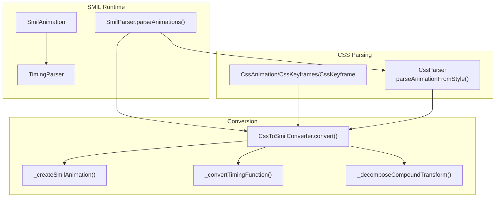
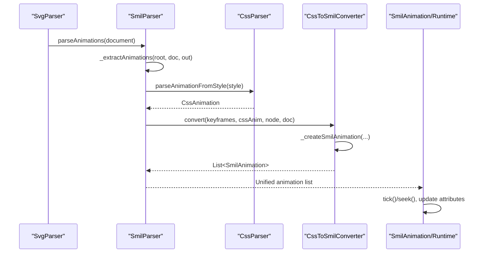
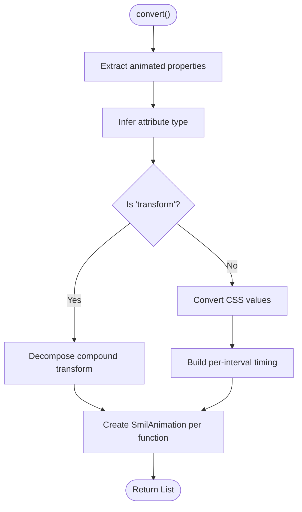
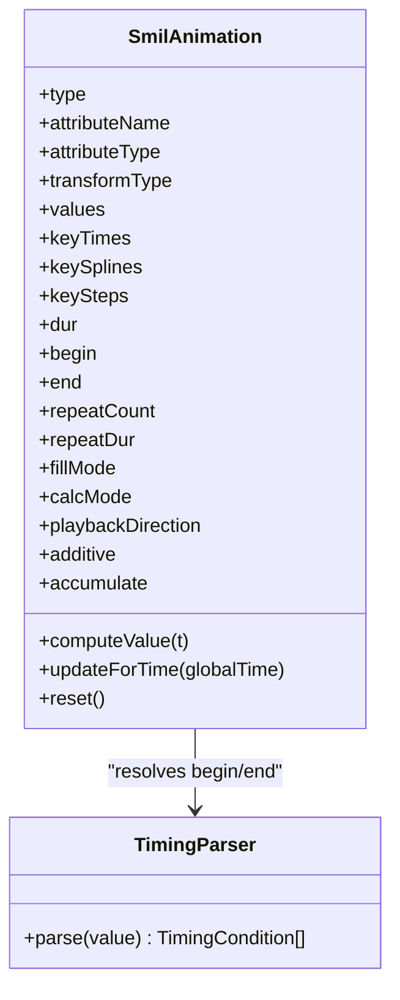
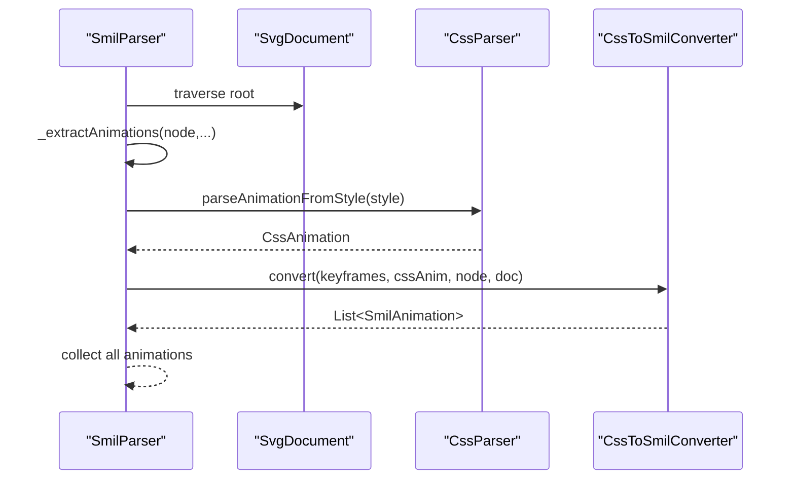
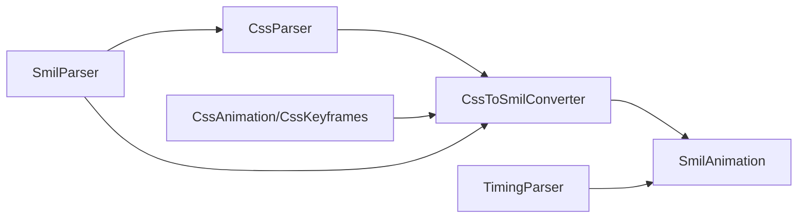

# CSS Animation Conversion

<cite>
**Referenced Files in This Document**
- [ANIMATION.md](file://ANIMATION.md)
- [ARCHITECTURE.md](file://ARCHITECTURE.md)
- [css_to_smil_converter.dart](file://lib/src/animation/css_to_smil_converter.dart)
- [css_to_smil_converter_core.dart](file://lib/src/animation/css_to_smil_converter_core.dart)
- [css_to_smil_converter_timing.dart](file://lib/src/animation/css_to_smil_converter_timing.dart)
- [css_to_smil_converter_transforms_decompose.dart](file://lib/src/animation/css_to_smil_converter_transforms_decompose.dart)
- [css_to_smil_converter_transforms_decompose_timing.dart](file://lib/src/animation/css_to_smil_converter_transforms_decompose_timing.dart)
- [css_animations_parser.dart](file://lib/src/animation/css_animations_parser.dart)
- [css_animations_models.dart](file://lib/src/animation/css_animations_models.dart)
- [smil_parser.dart](file://lib/src/animation/smil/smil_parser.dart)
- [smil_parser_css_extraction.dart](file://lib/src/animation/smil/smil_parser_css_extraction.dart)
- [smil_animation.dart](file://lib/src/animation/smil/smil_animation.dart)
- [timing_parser.dart](file://lib/src/animation/smil/timing_parser.dart)
- [css_animations_test.dart](file://test/animation/css_animations_test.dart)
- [stroke_dash_stop_color_test.dart](file://test/animation/stroke_dash_stop_color_test.dart)
</cite>

## Table of Contents
1. [Introduction](#introduction)
2. [Project Structure](#project-structure)
3. [Core Components](#core-components)
4. [Architecture Overview](#architecture-overview)
5. [Detailed Component Analysis](#detailed-component-analysis)
6. [Dependency Analysis](#dependency-analysis)
7. [Performance Considerations](#performance-considerations)
8. [Troubleshooting Guide](#troubleshooting-guide)
9. [Conclusion](#conclusion)
10. [Appendices](#appendices)

## Introduction
This document explains the CSS animation to SMIL conversion system implemented in the project. It covers how CSS @keyframes and animation properties are parsed, converted into SMIL animation objects, and integrated into the runtime timeline. It also documents supported CSS animation properties, timing functions, conversion limitations, examples of successful conversions, manual SMIL fallbacks, debugging tips, and performance implications.

## Project Structure
The CSS-to-SMIL conversion sits within the animated SVG pipeline alongside the SMIL parser and runtime. The relevant modules are organized under lib/src/animation/, with dedicated parts for CSS parsing, conversion, and SMIL runtime.

**Diagram sources**
- [css_animations_parser.dart:4-32](file://lib/src/animation/css_animations_parser.dart#L4-L32)
- [css_animations_models.dart:3-79](file://lib/src/animation/css_animations_models.dart#L3-L79)
- [css_to_smil_converter.dart:14-67](file://lib/src/animation/css_to_smil_converter.dart#L14-L67)
- [css_to_smil_converter_core.dart:27-146](file://lib/src/animation/css_to_smil_converter_core.dart#L27-L146)
- [css_to_smil_converter_timing.dart:3-43](file://lib/src/animation/css_to_smil_converter_timing.dart#L3-L43)
- [css_to_smil_converter_transforms_decompose.dart:3-34](file://lib/src/animation/css_to_smil_converter_transforms_decompose.dart#L3-L34)
- [smil_parser.dart:12-38](file://lib/src/animation/smil/smil_parser.dart#L12-L38)
- [smil_animation.dart:80-453](file://lib/src/animation/smil/smil_animation.dart#L80-L453)
- [timing_parser.dart:10-36](file://lib/src/animation/smil/timing_parser.dart#L10-L36)

**Section sources**
- [ARCHITECTURE.md:236-282](file://ARCHITECTURE.md#L236-L282)

## Core Components
- CSS Parser: Parses inline style animation properties and @keyframes blocks into structured models.
- CSS to SMIL Converter: Converts parsed CSS keyframes and animation properties into SMIL animation objects, handling timing, direction, fill mode, and transform decomposition.
- SMIL Parser: Extracts native SMIL elements and CSS-derived animations from the DOM and builds a unified animation list.
- SMIL Runtime: Manages timelines, applies values to attributes, and supports syncbase timing and playback controls.

**Section sources**
- [css_animations_parser.dart:4-32](file://lib/src/animation/css_animations_parser.dart#L4-L32)
- [css_animations_models.dart:3-79](file://lib/src/animation/css_animations_models.dart#L3-L79)
- [css_to_smil_converter.dart:14-67](file://lib/src/animation/css_to_smil_converter.dart#L14-L67)
- [smil_parser.dart:12-38](file://lib/src/animation/smil/smil_parser.dart#L12-L38)
- [smil_animation.dart:80-453](file://lib/src/animation/smil/smil_animation.dart#L80-L453)

## Architecture Overview
The conversion pipeline integrates CSS parsing and SMIL extraction into a single animation list consumed by the SMIL runtime.

**Diagram sources**
- [smil_parser.dart:16-37](file://lib/src/animation/smil/smil_parser.dart#L16-L37)
- [smil_parser_css_extraction.dart:3-41](file://lib/src/animation/smil/smil_parser_css_extraction.dart#L3-L41)
- [css_animations_parser.dart:22-31](file://lib/src/animation/css_animations_parser.dart#L22-L31)
- [css_to_smil_converter.dart:17-22](file://lib/src/animation/css_to_smil_converter.dart#L17-L22)
- [css_to_smil_converter_core.dart:27-146](file://lib/src/animation/css_to_smil_converter_core.dart#L27-L146)
- [smil_animation.dart:367-431](file://lib/src/animation/smil/smil_animation.dart#L367-L431)

## Detailed Component Analysis

### CSS Parsing
- Inline style parsing: Extracts animation shorthand and individual properties from style attributes.
- Selector rule parsing: Supports id, class, and element selectors; ignores complex descendant selectors.
- @keyframes parsing: Collects keyframe offsets and property values per frame.

Key capabilities:
- animation-name, animation-duration, animation-timing-function, animation-delay, animation-iteration-count, animation-direction, animation-fill-mode.
- @keyframes with per-keyframe timing overrides.

**Section sources**
- [css_animations_parser.dart:4-32](file://lib/src/animation/css_animations_parser.dart#L4-L32)
- [css_animations_models.dart:19-47](file://lib/src/animation/css_animations_models.dart#L19-L47)
- [ANIMATION.md:54-66](file://ANIMATION.md#L54-L66)

### CSS to SMIL Conversion
Conversion entry point:
- convert(keyframes, animation, targetNode, document) orchestrates property extraction, attribute type inference, transform decomposition, and SMIL animation creation.

Core conversion logic:
- Property extraction: Aggregates all animated properties across keyframes and sorts by offset to produce ordered value lists.
- Attribute type inference: Maps CSS properties to SMIL attribute types (number, color, transform, string).
- Timing conversion: Maps CSS timing functions (linear, ease, ease-in, ease-out, ease-in-out, cubic-bezier, steps) to SMIL calcMode and keySplines/keySteps.
- Direction and fill mode: Converts CSS animation-direction and animation-fill-mode to SMIL playbackDirection and fillMode.
- Transform decomposition: Detects compound transforms (e.g., translate + rotate) and splits into separate SmilAnimation instances for animateTransform.

**Diagram sources**
- [css_to_smil_converter.dart:17-66](file://lib/src/animation/css_to_smil_converter.dart#L17-L66)
- [css_to_smil_converter_core.dart:3-25](file://lib/src/animation/css_to_smil_converter_core.dart#L3-L25)
- [css_to_smil_converter_core.dart:206-247](file://lib/src/animation/css_to_smil_converter_core.dart#L206-L247)
- [css_to_smil_converter_timing.dart:3-43](file://lib/src/animation/css_to_smil_converter_timing.dart#L3-L43)
- [css_to_smil_converter_transforms_decompose.dart:3-34](file://lib/src/animation/css_to_smil_converter_transforms_decompose.dart#L3-L34)

**Section sources**
- [css_to_smil_converter.dart:14-67](file://lib/src/animation/css_to_smil_converter.dart#L14-L67)
- [css_to_smil_converter_core.dart:27-146](file://lib/src/animation/css_to_smil_converter_core.dart#L27-L146)
- [css_to_smil_converter_timing.dart:3-109](file://lib/src/animation/css_to_smil_converter_timing.dart#L3-L109)
- [css_to_smil_converter_transforms_decompose.dart:3-34](file://lib/src/animation/css_to_smil_converter_transforms_decompose.dart#L3-L34)
- [css_to_smil_converter_transforms_decompose_timing.dart:50-79](file://lib/src/animation/css_to_smil_converter_transforms_decompose_timing.dart#L50-L79)

### SMIL Runtime and Timing
- SmilAnimation encapsulates animation metadata, value computation, and runtime state.
- TimingParser resolves begin/end conditions including offsets, syncbase (id.begin/id.end/id.repeat(N)), and events.
- Paced calcMode generates keyTimes based on value distances when explicit keyTimes are absent.

**Diagram sources**
- [smil_animation.dart:80-453](file://lib/src/animation/smil/smil_animation.dart#L80-L453)
- [timing_parser.dart:10-36](file://lib/src/animation/smil/timing_parser.dart#L10-L36)

**Section sources**
- [smil_animation.dart:31-131](file://lib/src/animation/smil/smil_animation.dart#L31-L131)
- [timing_parser.dart:10-209](file://lib/src/animation/smil/timing_parser.dart#L10-L209)

### SMIL Parser Integration
- SmilParser.parseAnimations extracts both native SMIL elements and CSS-derived animations.
- CSS extraction walks the DOM to match style attributes and selector rules to nodes, then converts matched animations.

**Diagram sources**
- [smil_parser.dart:16-37](file://lib/src/animation/smil/smil_parser.dart#L16-L37)
- [smil_parser_css_extraction.dart:3-101](file://lib/src/animation/smil/smil_parser_css_extraction.dart#L3-L101)

**Section sources**
- [smil_parser.dart:12-38](file://lib/src/animation/smil/smil_parser.dart#L12-L38)
- [smil_parser_css_extraction.dart:3-101](file://lib/src/animation/smil/smil_parser_css_extraction.dart#L3-L101)

## Dependency Analysis
- CssToSmilConverter depends on:
  - CssParser for animation property extraction.
  - CssAnimation/CssKeyframes models for structure.
  - SmilAnimation for runtime representation.
  - Timing conversion utilities for calcMode and keySplines/keySteps.
  - Transform decomposition utilities for compound transforms.
- SmilParser depends on:
  - CssParser and CssToSmilConverter to integrate CSS animations.
  - TimingParser to resolve begin/end conditions.

**Diagram sources**
- [css_animations_parser.dart:4-32](file://lib/src/animation/css_animations_parser.dart#L4-L32)
- [css_animations_models.dart:3-79](file://lib/src/animation/css_animations_models.dart#L3-L79)
- [css_to_smil_converter.dart:14-12](file://lib/src/animation/css_to_smil_converter.dart#L14-L12)
- [smil_parser.dart:12-38](file://lib/src/animation/smil/smil_parser.dart#L12-L38)
- [smil_animation.dart:80-453](file://lib/src/animation/smil/smil_animation.dart#L80-L453)
- [timing_parser.dart:10-36](file://lib/src/animation/smil/timing_parser.dart#L10-L36)

**Section sources**
- [css_to_smil_converter.dart:14-12](file://lib/src/animation/css_to_smil_converter.dart#L14-L12)
- [smil_parser.dart:12-38](file://lib/src/animation/smil/smil_parser.dart#L12-L38)

## Performance Considerations
- Conversion overhead occurs during initial parse and conversion; runtime cost is dominated by SmilAnimation.updateForTime and value computation.
- Path morphing and transform interpolation are optimized via pre-normalization and reuse of intermediate structures.
- The system targets sub-millisecond path interpolation and smooth motion updates suitable for real-time rendering.

**Section sources**
- [ANIMATION.md:172-178](file://ANIMATION.md#L172-L178)

## Troubleshooting Guide
Common issues and debugging strategies:
- CSS animation not applied:
  - Verify @keyframes name matches animation-name and that the keyframes are present in the document’s CSS keyframes collection.
  - Confirm the selector matches the target node (id/class/tag).
- Compound transform not splitting:
  - Ensure the transform value contains multiple functions (e.g., translate + rotate). The converter splits these into separate animateTransform animations.
- Timing mismatch:
  - Check per-keyframe timing overrides; if any interval uses spline, the whole animation becomes spline mode.
- Direction and fill behavior:
  - animation-direction maps to playbackDirection; animation-fill-mode maps to fillMode (freeze vs remove).
- Manual SMIL fallback:
  - For unsupported CSS constructs, author native SMIL elements (<animate>, <animateTransform>, <animateMotion>) directly in the SVG.

Validation references:
- Tests demonstrate successful conversion of transform and opacity animations, selector-based targeting, and compound transform decomposition.

**Section sources**
- [css_animations_test.dart:204-339](file://test/animation/css_animations_test.dart#L204-L339)
- [stroke_dash_stop_color_test.dart:300-329](file://test/animation/stroke_dash_stop_color_test.dart#L300-L329)

## Conclusion
The CSS-to-SMIL conversion system provides robust support for translating CSS @keyframes and animation properties into SMIL animations. It handles timing functions, direction, fill modes, and transform decomposition, integrating seamlessly with the SMIL runtime. While advanced CSS shorthand edge cases remain, the current implementation covers baseline CSS animation interoperability and offers clear fallback paths to manual SMIL authoring.

## Appendices

### Supported CSS Animation Properties and Timing Functions
- Properties: x, y, cx, cy, r, rx, ry, width, height, opacity, fill-opacity, stroke-opacity, stroke-width, stroke-dashoffset, stop-opacity, font-size, letter-spacing, word-spacing, fill, stroke, stop-color, transform.
- Timing functions: linear, ease, ease-in, ease-out, ease-in-out, cubic-bezier(), steps().
- Direction: normal, reverse, alternate, alternate-reverse.
- Fill mode: none, forwards, backwards, both.

**Section sources**
- [css_to_smil_converter_core.dart:206-247](file://lib/src/animation/css_to_smil_converter_core.dart#L206-L247)
- [css_to_smil_converter_timing.dart:14-42](file://lib/src/animation/css_to_smil_converter_timing.dart#L14-L42)
- [ANIMATION.md:54-66](file://ANIMATION.md#L54-L66)

### Examples of Successful CSS-to-SMIL Conversions
- Transform animations (rotate) converted to animateTransform.
- Opacity animations converted to animate with numeric type and easing.
- Selector-based targeting (#id, .class) triggers animations on matching nodes.

**Section sources**
- [css_animations_test.dart:217-311](file://test/animation/css_animations_test.dart#L217-L311)
- [stroke_dash_stop_color_test.dart:300-329](file://test/animation/stroke_dash_stop_color_test.dart#L300-L329)

### Conversion Limitations
- Advanced CSS shorthand/transform edge semantics remain a work in progress.
- Complex descendant selectors and multi-part selectors are intentionally ignored in selector rule parsing.

**Section sources**
- [ANIMATION.md:64-66](file://ANIMATION.md#L64-L66)
- [css_animations_parser.dart:10-20](file://lib/src/animation/css_animations_parser.dart#L10-L20)