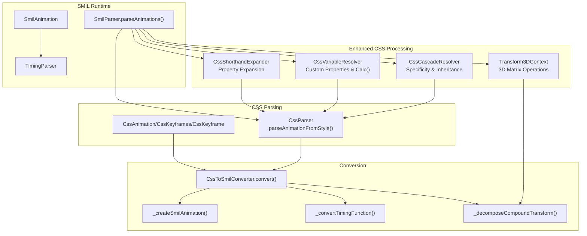
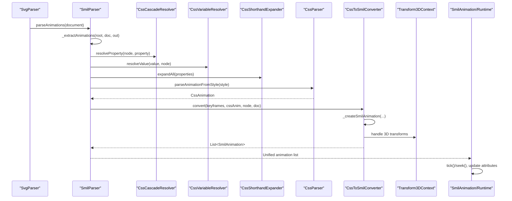
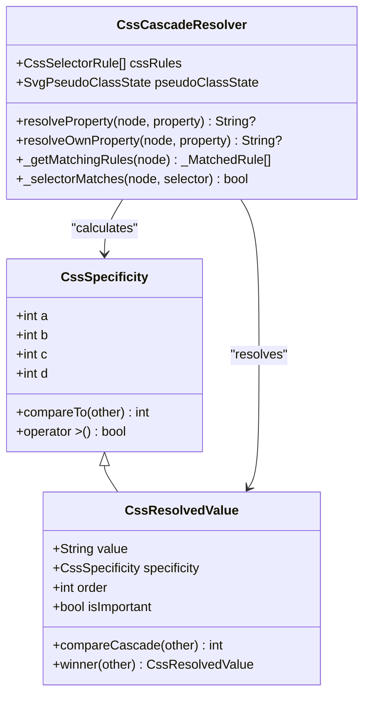
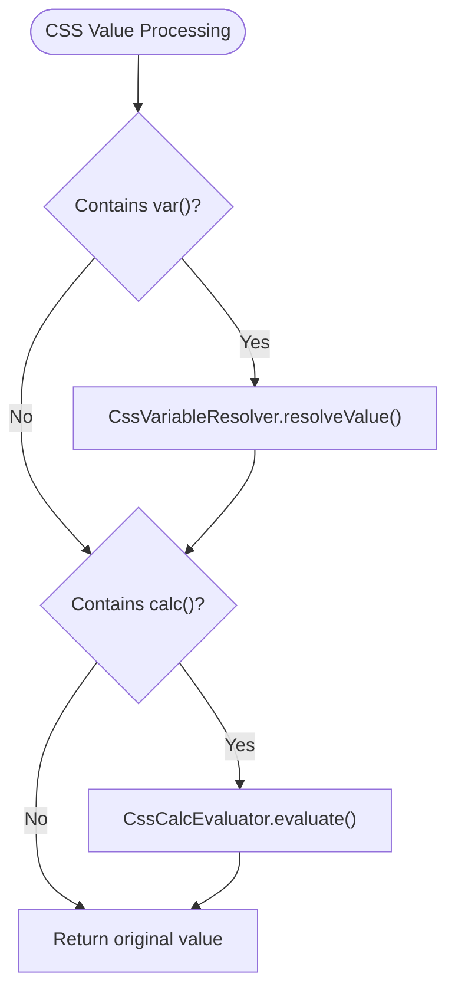
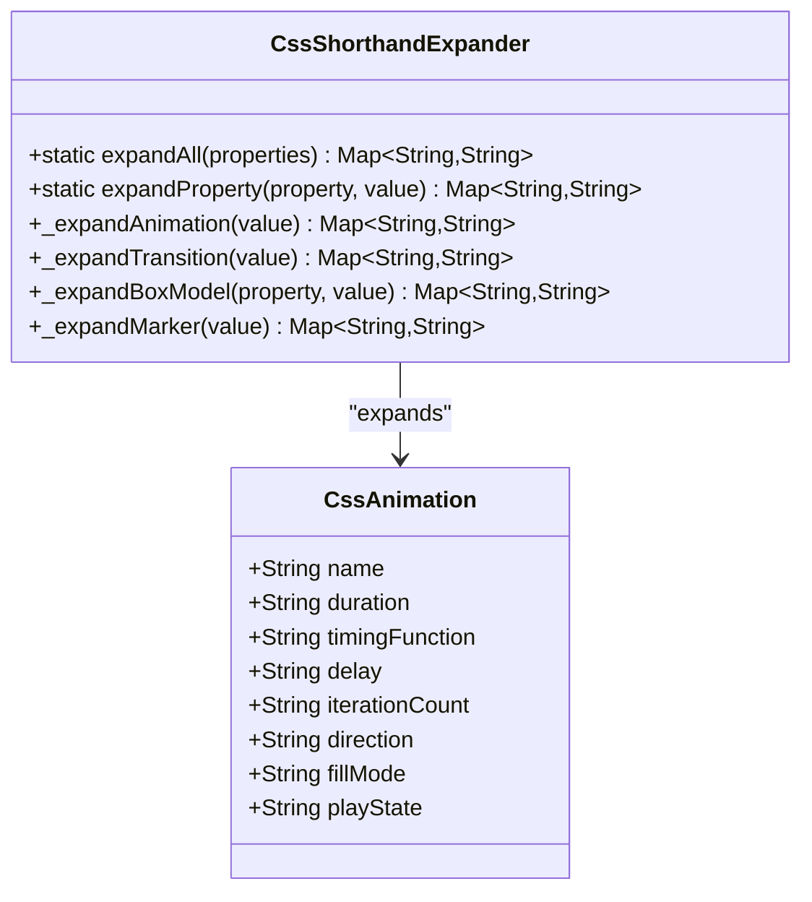
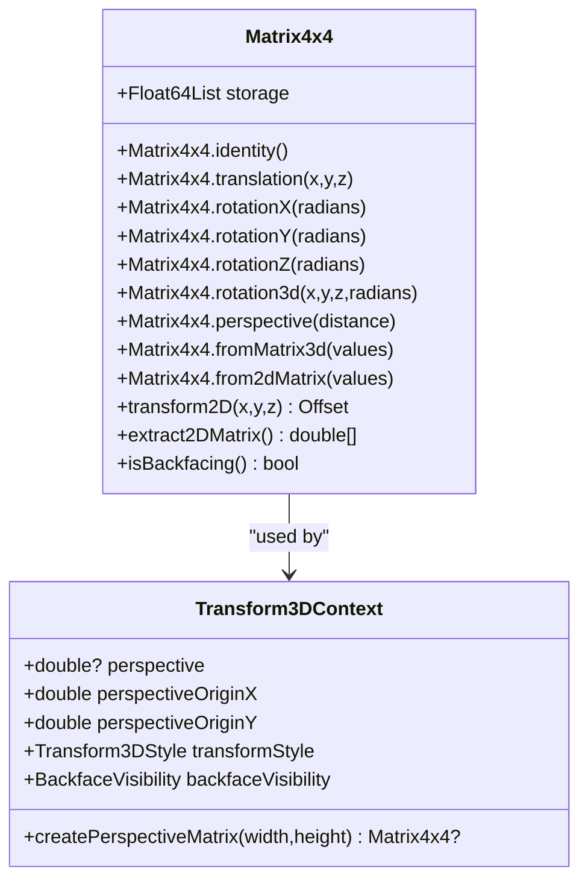
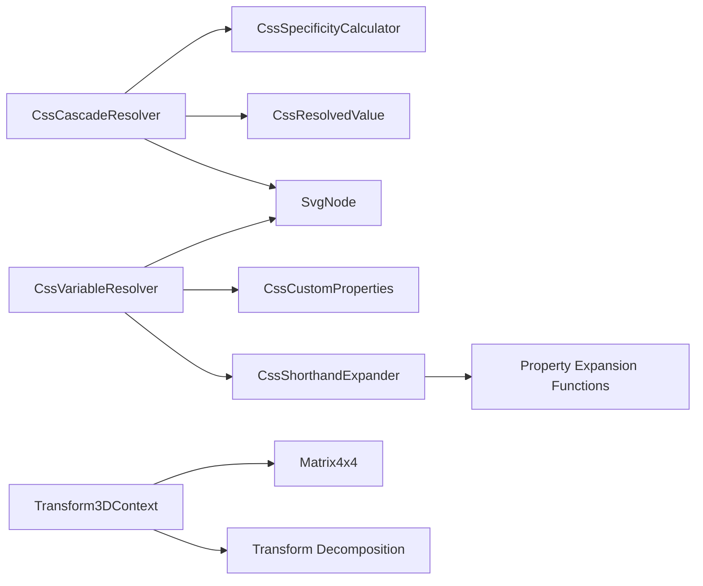

# CSS Animation Conversion

<cite>
**Referenced Files in This Document**
- [ANIMATION.md](file://ANIMATION.md)
- [ARCHITECTURE.md](file://ARCHITECTURE.md)
- [css_animations_parser.dart](file://lib/src/animation/css_animations_parser.dart)
- [css_animations_models.dart](file://lib/src/animation/css_animations_models.dart)
- [css_cascade.dart](file://lib/src/animation/css_cascade.dart)
- [css_variables_calc.dart](file://lib/src/animation/css_variables_calc.dart)
- [css_shorthand_expansion.dart](file://lib/src/animation/css_shorthand_expansion.dart)
- [transform_3d.dart](file://lib/src/animation/transform_3d.dart)
- [css_to_smil_converter.dart](file://lib/src/animation/css_to_smil_converter.dart)
- [css_to_smil_converter_core.dart](file://lib/src/animation/css_to_smil_converter_core.dart)
- [css_to_smil_converter_timing.dart](file://lib/src/animation/css_to_smil_converter_timing.dart)
- [css_to_smil_converter_transforms_decompose.dart](file://lib/src/animation/css_to_smil_converter_transforms_decompose.dart)
- [css_to_smil_converter_transforms_decompose_timing.dart](file://lib/src/animation/css_to_smil_converter_transforms_decompose_timing.dart)
- [smil_parser.dart](file://lib/src/animation/smil/smil_parser.dart)
- [smil_parser_css_extraction.dart](file://lib/src/animation/smil/smil_parser_css_extraction.dart)
- [smil_animation.dart](file://lib/src/animation/smil/smil_animation.dart)
- [timing_parser.dart](file://lib/src/animation/smil/timing_parser.dart)
- [css_cascade_specificity_test.dart](file://test/animation/css_cascade_specificity_test.dart)
- [css_variables_calc_test.dart](file://test/animation/css_variables_calc_test.dart)
- [css_3d_transforms_test.dart](file://test/animation/css_3d_transforms_test.dart)
- [css_shorthand_expansion_test.dart](file://test/animation/css_shorthand_expansion_test.dart)
- [css_animations_test.dart](file://test/animation/css_animations_test.dart)
- [stroke_dash_stop_color_test.dart](file://test/animation/stroke_dash_stop_color_test.dart)
</cite>

## Update Summary
**Changes Made**
- Enhanced CSS cascade support with comprehensive specificity resolution and inheritance
- Added CSS custom properties (variables) and calc() expression support
- Implemented CSS shorthand property expansion for animation, transition, and box model properties
- Integrated 3D transform capabilities with matrix operations and perspective projection
- Expanded selector parsing to support advanced combinators and attribute selectors
- Added media query support within SVG style blocks

## Table of Contents
1. [Introduction](#introduction)
2. [Project Structure](#project-structure)
3. [Core Components](#core-components)
4. [Architecture Overview](#architecture-overview)
5. [Detailed Component Analysis](#detailed-component-analysis)
6. [Enhanced CSS Features](#enhanced-css-features)
7. [Dependency Analysis](#dependency-analysis)
8. [Performance Considerations](#performance-considerations)
9. [Troubleshooting Guide](#troubleshooting-guide)
10. [Conclusion](#conclusion)
11. [Appendices](#appendices)

## Introduction
This document explains the enhanced CSS animation to SMIL conversion system implemented in the project. The system now includes comprehensive CSS cascade support, selector parsing, shorthand expansion, variable substitution, and 3D transform capabilities. It covers how CSS @keyframes and animation properties are parsed, converted into SMIL animation objects, and integrated into the runtime timeline. The enhanced system supports advanced CSS features including custom properties, calc() expressions, 3D transforms, and sophisticated selector matching.

## Project Structure
The CSS-to-SMIL conversion system now includes enhanced CSS processing capabilities alongside the core animation pipeline. The architecture integrates cascade resolution, variable substitution, shorthand expansion, and 3D transform handling into the conversion workflow.

**Diagram sources**
- [css_cascade.dart:277-396](file://lib/src/animation/css_cascade.dart#L277-L396)
- [css_variables_calc.dart:92-154](file://lib/src/animation/css_variables_calc.dart#L92-L154)
- [css_shorthand_expansion.dart:7-31](file://lib/src/animation/css_shorthand_expansion.dart#L7-L31)
- [transform_3d.dart:329-373](file://lib/src/animation/transform_3d.dart#L329-L373)
- [css_animations_parser.dart:4-96](file://lib/src/animation/css_animations_parser.dart#L4-L96)
- [css_to_smil_converter.dart:15-67](file://lib/src/animation/css_to_smil_converter.dart#L15-L67)
- [smil_parser.dart:12-38](file://lib/src/animation/smil/smil_parser.dart#L12-L38)

**Section sources**
- [ARCHITECTURE.md:236-282](file://ARCHITECTURE.md#L236-L282)

## Core Components
- **Enhanced CSS Cascade Resolver**: Handles CSS specificity calculation, inheritance, and !important rules for proper property resolution.
- **CSS Variable Resolver**: Processes custom properties with var() references and calc() expressions, supporting inheritance and fallback values.
- **CSS Shorthand Expander**: Expands CSS shorthand properties (font, animation, transition, margin, padding, border) into longhand equivalents.
- **3D Transform System**: Provides comprehensive 3D transform support including matrix operations, perspective projection, and backface visibility.
- **CSS Parser**: Parses inline style animation properties and @keyframes blocks with enhanced selector support.
- **CSS to SMIL Converter**: Converts parsed CSS keyframes and animation properties into SMIL animation objects with full 3D transform support.
- **SMIL Parser**: Extracts native SMIL elements and CSS-derived animations from the DOM and builds a unified animation list.
- **SMIL Runtime**: Manages timelines, applies values to attributes, and supports syncbase timing and playback controls.

**Section sources**
- [css_cascade.dart:277-396](file://lib/src/animation/css_cascade.dart#L277-L396)
- [css_variables_calc.dart:92-154](file://lib/src/animation/css_variables_calc.dart#L92-L154)
- [css_shorthand_expansion.dart:7-31](file://lib/src/animation/css_shorthand_expansion.dart#L7-L31)
- [transform_3d.dart:22-327](file://lib/src/animation/transform_3d.dart#L22-L327)
- [css_animations_parser.dart:4-96](file://lib/src/animation/css_animations_parser.dart#L4-L96)
- [css_to_smil_converter.dart:15-67](file://lib/src/animation/css_to_smil_converter.dart#L15-L67)
- [smil_parser.dart:12-38](file://lib/src/animation/smil/smil_parser.dart#L12-L38)

## Architecture Overview
The enhanced conversion pipeline integrates comprehensive CSS processing capabilities alongside the traditional CSS-to-SMIL conversion workflow.

**Diagram sources**
- [smil_parser.dart:16-37](file://lib/src/animation/smil/smil_parser.dart#L16-L37)
- [smil_parser_css_extraction.dart:3-41](file://lib/src/animation/smil/smil_parser_css_extraction.dart#L3-L41)
- [css_cascade.dart:295-396](file://lib/src/animation/css_cascade.dart#L295-L396)
- [css_variables_calc.dart:96-154](file://lib/src/animation/css_variables_calc.dart#L96-L154)
- [css_shorthand_expansion.dart:12-31](file://lib/src/animation/css_shorthand_expansion.dart#L12-L31)
- [css_animations_parser.dart:22-43](file://lib/src/animation/css_animations_parser.dart#L22-L43)
- [css_to_smil_converter.dart:17-22](file://lib/src/animation/css_to_smil_converter.dart#L17-L22)
- [transform_3d.dart:329-373](file://lib/src/animation/transform_3d.dart#L329-L373)

## Detailed Component Analysis

### Enhanced CSS Cascade System
The CSS cascade resolver implements comprehensive specificity calculation and inheritance resolution:

- **Specificity Calculation**: Supports ID selectors (#id), class selectors (.class), attribute selectors ([attr]), pseudo-classes (:hover, :active), element types, and pseudo-elements (::before).
- **Inheritance Control**: Handles inheritable properties (fill, stroke, font-family, color, visibility) and non-inheritable properties (opacity, width).
- **Priority Resolution**: Implements proper cascade order with !important override rules and source order fallback.
- **Dynamic State**: Supports pseudo-class states (hover, active, focus) for selector matching.

**Diagram sources**
- [css_cascade.dart:18-107](file://lib/src/animation/css_cascade.dart#L18-L107)
- [css_cascade.dart:277-396](file://lib/src/animation/css_cascade.dart#L277-L396)

**Section sources**
- [css_cascade.dart:18-107](file://lib/src/animation/css_cascade.dart#L18-L107)
- [css_cascade.dart:180-275](file://lib/src/animation/css_cascade.dart#L180-L275)
- [css_cascade.dart:277-396](file://lib/src/animation/css_cascade.dart#L277-L396)

### CSS Variables and Calc() Support
The variable resolver provides comprehensive support for CSS custom properties and mathematical expressions:

- **Custom Properties**: Stores variables in element attributes with inheritance through the DOM tree.
- **Variable Resolution**: Walks up the element tree to resolve var() references with fallback support.
- **Calc() Evaluation**: Parses and evaluates mathematical expressions with unit conversion (px, em, rem, pt, %).
- **Nested Expressions**: Supports nested calc() and var() combinations with recursion limits.

**Diagram sources**
- [css_variables_calc.dart:96-154](file://lib/src/animation/css_variables_calc.dart#L96-L154)
- [css_variables_calc.dart:164-193](file://lib/src/animation/css_variables_calc.dart#L164-L193)

**Section sources**
- [css_variables_calc.dart:92-154](file://lib/src/animation/css_variables_calc.dart#L92-L154)
- [css_variables_calc.dart:156-206](file://lib/src/animation/css_variables_calc.dart#L156-L206)
- [css_variables_calc.dart:220-277](file://lib/src/animation/css_variables_calc.dart#L220-L277)

### CSS Shorthand Property Expansion
The shorthand expander converts CSS shorthand properties into their longhand equivalents:

- **Animation Shorthand**: Supports multiple animations with comma separation and full property expansion.
- **Transition Shorthand**: Expands transition properties into individual transition-property, duration, timing-function, and delay.
- **Box Model Properties**: Handles margin, padding, border, and border-radius with 1-4 value expansion.
- **SVG-Specific Properties**: Includes marker shorthand for SVG elements.

**Diagram sources**
- [css_shorthand_expansion.dart:7-31](file://lib/src/animation/css_shorthand_expansion.dart#L7-L31)
- [css_shorthand_expansion.dart:293-337](file://lib/src/animation/css_shorthand_expansion.dart#L293-L337)

**Section sources**
- [css_shorthand_expansion.dart:7-31](file://lib/src/animation/css_shorthand_expansion.dart#L7-L31)
- [css_shorthand_expansion.dart:293-337](file://lib/src/animation/css_shorthand_expansion.dart#L293-L337)
- [css_shorthand_expansion.dart:487-517](file://lib/src/animation/css_shorthand_expansion.dart#L487-L517)
- [css_shorthand_expansion.dart:583-629](file://lib/src/animation/css_shorthand_expansion.dart#L583-L629)

### 3D Transform System
The 3D transform system provides comprehensive support for CSS 3D transformations:

- **Matrix Operations**: Full 4x4 matrix support with translation, rotation, scale, and perspective operations.
- **3D Transform Functions**: Supports translate3d, rotateX, rotateY, rotateZ, rotate3d, scale3d, perspective, and matrix3d.
- **Projection System**: Converts 3D matrices to 2D transforms for SMIL compatibility with perspective projection.
- **Backface Detection**: Determines visibility of rotated surfaces for proper rendering.

**Diagram sources**
- [transform_3d.dart:22-327](file://lib/src/animation/transform_3d.dart#L22-L327)
- [transform_3d.dart:329-373](file://lib/src/animation/transform_3d.dart#L329-L373)

**Section sources**
- [transform_3d.dart:22-327](file://lib/src/animation/transform_3d.dart#L22-L327)
- [transform_3d.dart:329-373](file://lib/src/animation/transform_3d.dart#L329-L373)

### Enhanced CSS Parsing
The CSS parser now supports advanced selectors and properties:

- **Advanced Selectors**: Supports ID, class, element selectors with compound combinations and attribute selectors.
- **Selector Combinators**: Handles descendant (space), child (>), adjacent sibling (+), and general sibling (~) combinators.
- **Multiple Animations**: Parses comma-separated animation properties into multiple animation objects.
- **Transition Support**: Parses transition shorthand and individual transition properties.

**Section sources**
- [css_animations_parser.dart:10-96](file://lib/src/animation/css_animations_parser.dart#L10-L96)

### CSS to SMIL Conversion Enhancement
The conversion system now handles enhanced CSS features:

- **Variable Substitution**: Resolves CSS variables and calc() expressions before SMIL generation.
- **Shorthand Expansion**: Expands CSS shorthand properties into SMIL-compatible formats.
- **3D Transform Handling**: Processes 3D transforms with proper matrix decomposition and 2D projection.
- **Cascade Integration**: Incorporates CSS cascade resolution into property application.

**Section sources**
- [css_to_smil_converter.dart:15-67](file://lib/src/animation/css_to_smil_converter.dart#L15-L67)
- [css_to_smil_converter_core.dart:27-146](file://lib/src/animation/css_to_smil_converter_core.dart#L27-L146)

## Enhanced CSS Features

### CSS Cascade and Specificity Resolution
The system now implements comprehensive CSS cascade rules:

- **Specificity Calculation**: Proper calculation of (a,b,c,d) specificity values for selectors
- **Inheritance Control**: Automatic inheritance for inheritable properties
- **!important Handling**: Correct override behavior for important declarations
- **Dynamic States**: Support for hover, active, focus pseudo-classes

**Section sources**
- [css_cascade.dart:18-107](file://lib/src/animation/css_cascade.dart#L18-L107)
- [css_cascade_specificity_test.dart:8-45](file://test/animation/css_cascade_specificity_test.dart#L8-L45)

### CSS Custom Properties and Calc() Support
Full support for modern CSS features:

- **Variable Declaration**: Custom properties with --prefix syntax
- **Variable Resolution**: Tree-walking resolution with fallback values
- **Calc() Evaluation**: Mathematical expressions with unit conversion
- **Nested Expressions**: Complex variable and calc() combinations

**Section sources**
- [css_variables_calc.dart:92-154](file://lib/src/animation/css_variables_calc.dart#L92-L154)
- [css_variables_calc_test.dart:8-37](file://test/animation/css_variables_calc_test.dart#L8-L37)

### CSS Shorthand Property Expansion
Comprehensive shorthand property support:

- **Animation Shorthand**: Multiple animations with full property expansion
- **Transition Shorthand**: Individual transition property expansion
- **Box Model Properties**: Margin, padding, border, border-radius expansion
- **SVG Properties**: Marker shorthand for SVG elements

**Section sources**
- [css_shorthand_expansion.dart:293-337](file://lib/src/animation/css_shorthand_expansion.dart#L293-L337)
- [css_shorthand_expansion_test.dart:83-195](file://test/animation/css_shorthand_expansion_test.dart#L83-L195)

### 3D Transform Capabilities
Complete 3D transform support:

- **3D Transform Functions**: translate3d, rotateX, rotateY, rotateZ, rotate3d, scale3d, perspective, matrix3d
- **Matrix Operations**: Full 4x4 matrix support with proper multiplication
- **Perspective Projection**: 3D to 2D projection with perspective divide
- **Backface Visibility**: Proper detection and handling of rotated surfaces

**Section sources**
- [transform_3d.dart:22-327](file://lib/src/animation/transform_3d.dart#L22-L327)
- [css_3d_transforms_test.dart:196-317](file://test/animation/css_3d_transforms_test.dart#L196-L317)

## Dependency Analysis
The enhanced system introduces new dependencies while maintaining backward compatibility:

- **CssCascadeResolver** depends on:
  - CssSpecificityCalculator for specificity calculation
  - CssResolvedValue for cascade resolution results
  - SvgNode hierarchy for inheritance traversal
- **CssVariableResolver** depends on:
  - CssCustomProperties for variable storage
  - CssCalcEvaluator for expression evaluation
  - SvgNode tree traversal for inheritance
- **CssShorthandExpander** depends on:
  - Property-specific expansion functions
  - Regular expression parsing for CSS syntax
- **Transform3DContext** depends on:
  - Matrix4x4 for 3D operations
  - Transform decomposition utilities

**Diagram sources**
- [css_cascade.dart:277-396](file://lib/src/animation/css_cascade.dart#L277-L396)
- [css_variables_calc.dart:92-154](file://lib/src/animation/css_variables_calc.dart#L92-L154)
- [css_shorthand_expansion.dart:7-31](file://lib/src/animation/css_shorthand_expansion.dart#L7-L31)
- [transform_3d.dart:329-373](file://lib/src/animation/transform_3d.dart#L329-L373)

**Section sources**
- [css_cascade.dart:277-396](file://lib/src/animation/css_cascade.dart#L277-L396)
- [css_variables_calc.dart:92-154](file://lib/src/animation/css_variables_calc.dart#L92-L154)
- [css_shorthand_expansion.dart:7-31](file://lib/src/animation/css_shorthand_expansion.dart#L7-L31)
- [transform_3d.dart:329-373](file://lib/src/animation/transform_3d.dart#L329-L373)

## Performance Considerations
The enhanced system maintains performance through strategic optimizations:

- **Cascade Resolution Caching**: CssCascadeResolver caches matching rules to avoid repeated selector matching
- **Variable Resolution Limits**: Maximum iteration limits prevent infinite loops in variable resolution
- **3D Transform Optimization**: Matrix operations are optimized for common transform sequences
- **Memory Management**: Proper cleanup of temporary objects during conversion processes
- **Lazy Evaluation**: CSS variable and calc() evaluation occurs only when needed

**Section sources**
- [css_cascade.dart:291-293](file://lib/src/animation/css_cascade.dart#L291-L293)
- [css_variables_calc.dart:102-109](file://lib/src/animation/css_variables_calc.dart#L102-L109)

## Troubleshooting Guide
Enhanced troubleshooting for new CSS features:

### CSS Cascade Issues
- **Property not applying**: Check specificity calculation and !important declarations
- **Inheritance problems**: Verify inheritable property lists and parent-child relationships
- **Dynamic state not working**: Ensure pseudo-class state tracking is enabled

### CSS Variables and Calc() Problems
- **Variable not resolving**: Check variable declaration scope and inheritance chain
- **Calc() evaluation errors**: Verify mathematical syntax and unit compatibility
- **Fallback not working**: Ensure fallback syntax is correct (var(--name, fallback))

### Shorthand Expansion Issues
- **Shorthand not expanding**: Verify shorthand syntax and property names
- **Conflicting properties**: Check for explicit longhand properties overriding expansions
- **Multiple animations**: Ensure comma separation is correct for animation shorthand

### 3D Transform Problems
- **3D transforms not rendering**: Check matrix validity and perspective settings
- **Backface visibility issues**: Verify transform-style and backface-visibility properties
- **Performance degradation**: Optimize complex 3D transform chains

**Section sources**
- [css_cascade_specificity_test.dart:195-496](file://test/animation/css_cascade_specificity_test.dart#L195-L496)
- [css_variables_calc_test.dart:39-124](file://test/animation/css_variables_calc_test.dart#L39-124)
- [css_3d_transforms_test.dart:196-317](file://test/animation/css_3d_transforms_test.dart#L196-L317)

## Conclusion
The enhanced CSS-to-SMIL conversion system now provides comprehensive support for modern CSS features including cascade resolution, custom properties, shorthand expansion, and 3D transforms. The system maintains robust performance while extending compatibility with advanced CSS specifications. The integration of these features enables more sophisticated animation authoring and better interoperability with contemporary web standards.

## Appendices

### Enhanced CSS Animation Properties and Timing Functions
- **Properties**: Extended to include all CSS properties with cascade resolution support
- **Timing Functions**: Enhanced with improved calc() evaluation for timing values
- **Direction**: Normal, reverse, alternate, alternate-reverse with proper SMIL mapping
- **Fill Mode**: None, forwards, backwards, both with cascade-aware application

**Section sources**
- [css_to_smil_converter_core.dart:180-207](file://lib/src/animation/css_to_smil_converter_core.dart#L180-L207)
- [css_to_smil_converter_timing.dart:14-42](file://lib/src/animation/css_to_smil_converter_timing.dart#L14-L42)

### Enhanced Examples of CSS-to-SMIL Conversions
- **Variable Substitution**: CSS variables resolved before SMIL generation
- **Shorthand Expansion**: Complex shorthand properties expanded into SMIL-compatible formats
- **3D Transforms**: 3D transform matrices properly decomposed for 2D SMIL animation
- **Cascade Resolution**: Proper specificity and inheritance applied to final animation values

**Section sources**
- [css_variables_calc_test.dart:220-257](file://test/animation/css_variables_calc_test.dart#L220-L257)
- [css_shorthand_expansion_test.dart:183-195](file://test/animation/css_shorthand_expansion_test.dart#L183-L195)
- [css_3d_transforms_test.dart:319-384](file://test/animation/css_3d_transforms_test.dart#L319-L384)

### Enhanced Conversion Limitations
- **Complex CSS Edge Cases**: Some advanced CSS edge cases may require manual SMIL implementation
- **Performance Considerations**: Complex variable resolution and calc() evaluation may impact performance
- **3D Transform Complexity**: Very complex 3D transform chains may require optimization

**Section sources**
- [css_cascade.dart:404-437](file://lib/src/animation/css_cascade.dart#L404-L437)
- [css_variables_calc.dart:102-109](file://lib/src/animation/css_variables_calc.dart#L102-L109)