# Event System Documentation

<cite>
**Referenced Files in This Document**
- [svg_event.dart](file://lib/src/animation/svg_event.dart)
- [svg_event_dispatcher.dart](file://lib/src/animation/svg_event_dispatcher.dart)
- [animated_svg_picture_events.dart](file://lib/src/animation/animated_svg_picture_events.dart)
- [animated_svg_picture_event_model.dart](file://lib/src/animation/animated_svg_picture_event_model.dart)
- [animated_svg_picture_pointer_events.dart](file://lib/src/animation/animated_svg_picture_pointer_events.dart)
- [animated_svg_picture_utils.dart](file://lib/src/animation/animated_svg_picture_utils.dart)
- [animated_svg_picture.dart](file://lib/src/animation/animated_svg_picture.dart)
- [event_system_test.dart](file://test/animation/event_system_test.dart)
</cite>

## Update Summary
**Changes Made**
- Enhanced pointer event support with comprehensive W3C DOM pointer event model compliance
- Added gesture recognition system with longpress, panstart, panupdate, panend events
- Unified SvgPointerEvent and SvgGestureEvent classes for comprehensive event handling
- Implemented full event capturing/bubbling/retargeting support with W3C DOM specification compliance
- Added comprehensive event tracing system for debugging and monitoring
- Expanded event model implementation with enhanced use element shadow DOM support

## Table of Contents
1. [Introduction](#introduction)
2. [Event System Architecture](#event-system-architecture)
3. [Core Event Classes](#core-event-classes)
4. [Event Dispatch Pipeline](#event-dispatch-pipeline)
5. [Event Model Implementation](#event-model-implementation)
6. [Enhanced Pointer Event Handling](#enhanced-pointer-event-handling)
7. [Gesture Recognition System](#gesture-recognition-system)
8. [Event Tracing and Debugging](#event-tracing-and-debugging)
9. [Focus and State Management](#focus-and-state-management)
10. [Event Timing and Animation Integration](#event-timing-and-animation-integration)
11. [Testing and Validation](#testing-and-validation)
12. [Performance Considerations](#performance-considerations)
13. [Troubleshooting Guide](#troubleshooting-guide)
14. [Conclusion](#conclusion)

## Introduction

The Event System in Flutter SVG represents a comprehensive implementation of the W3C DOM Event model specifically designed for SVG graphics. This system provides full event bubbling, capturing, and retargeting capabilities, enabling developers to create interactive SVG experiences with native-like event handling.

**Updated** The system now features enhanced W3C DOM event model compliance with comprehensive pointer event support, gesture recognition capabilities, unified event classes, and a complete event tracing system for debugging and monitoring.

The system integrates seamlessly with Flutter's gesture detection while maintaining strict adherence to web standards for event propagation, timing, and behavior. It supports all major SVG event types including mouse events, pointer events, keyboard events, focus events, gesture events, and custom events.

## Event System Architecture

The event system is built around several core components that work together to provide robust event handling with comprehensive W3C DOM compliance:

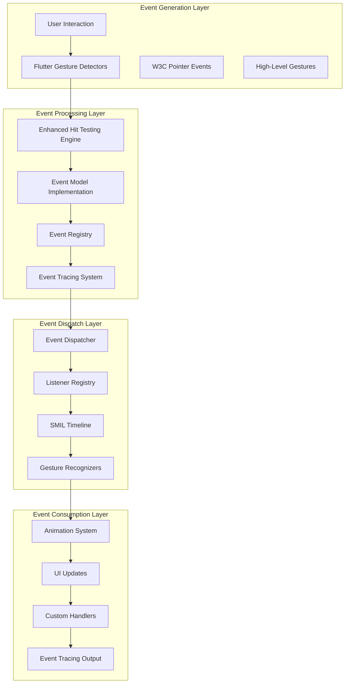

**Diagram sources**
- [animated_svg_picture_events.dart:490-564](file://lib/src/animation/animated_svg_picture_events.dart#L490-L564)
- [svg_event_dispatcher.dart:141-315](file://lib/src/animation/svg_event_dispatcher.dart#L141-L315)
- [svg_event.dart:226-323](file://lib/src/animation/svg_event.dart#L226-L323)

**Section sources**
- [svg_event_dispatcher.dart:1-375](file://lib/src/animation/svg_event_dispatcher.dart#L1-L375)
- [svg_event.dart:1-451](file://lib/src/animation/svg_event.dart#L1-L451)

## Core Event Classes

The event system defines a comprehensive hierarchy of event classes that mirror the W3C DOM specification with enhanced pointer and gesture support:

### Enhanced Event Class Hierarchy

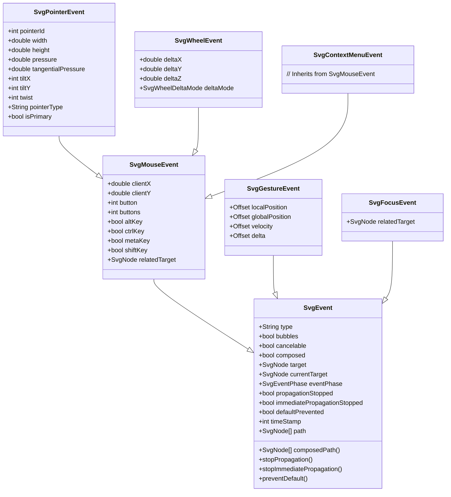

**Diagram sources**
- [svg_event.dart:226-384](file://lib/src/animation/svg_event.dart#L226-L384)

### Enhanced Event Listener Management

The system provides sophisticated listener management through the `SvgEventListenerEntry` class with expanded capabilities:

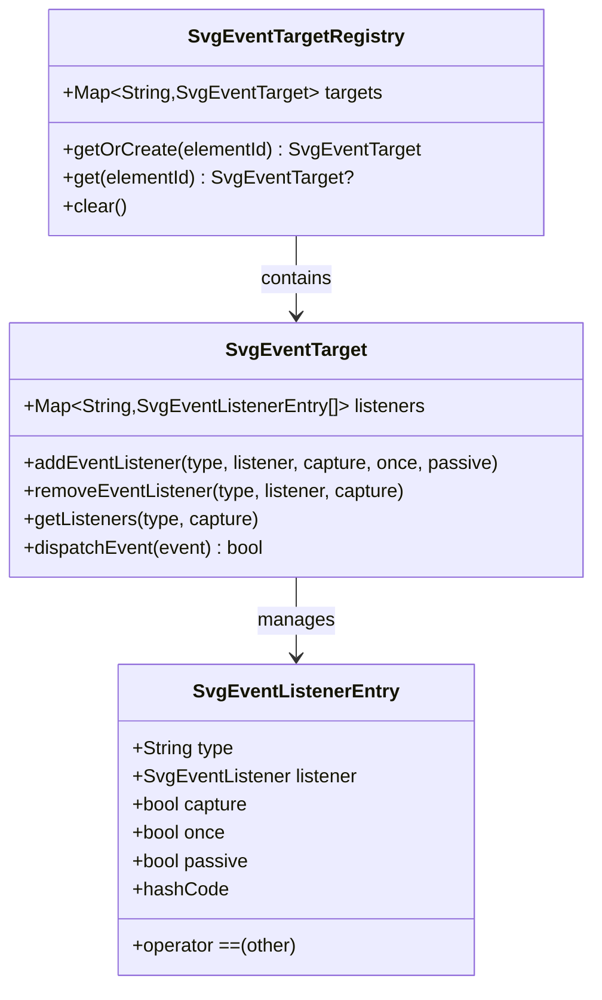

**Diagram sources**
- [svg_event.dart:414-450](file://lib/src/animation/svg_event.dart#L414-L450)
- [svg_event_dispatcher.dart:36-138](file://lib/src/animation/svg_event_dispatcher.dart#L36-L138)

**Section sources**
- [svg_event.dart:11-451](file://lib/src/animation/svg_event.dart#L11-L451)
- [svg_event_dispatcher.dart:35-138](file://lib/src/animation/svg_event_dispatcher.dart#L35-L138)

## Event Dispatch Pipeline

The event dispatch pipeline follows the W3C DOM specification with three distinct phases and enhanced pointer event support:

### Enhanced Event Phases

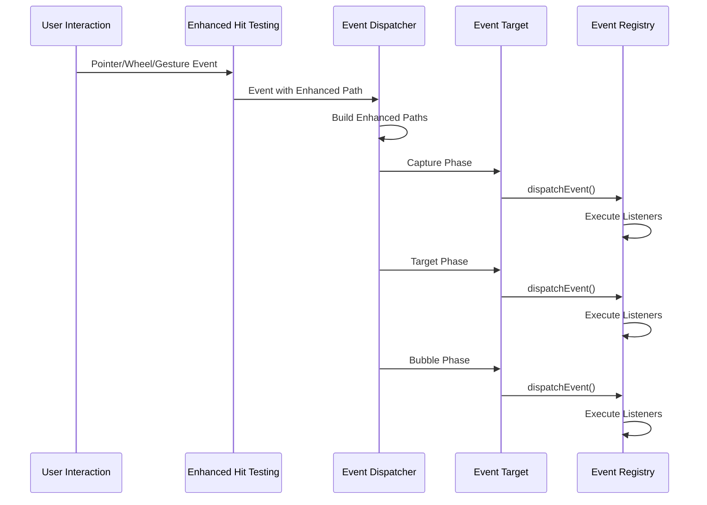

**Diagram sources**
- [svg_event_dispatcher.dart:218-315](file://lib/src/animation/svg_event_dispatcher.dart#L218-L315)

### Enhanced Path Construction

The system constructs event paths with comprehensive shadow DOM support and pointer event context:

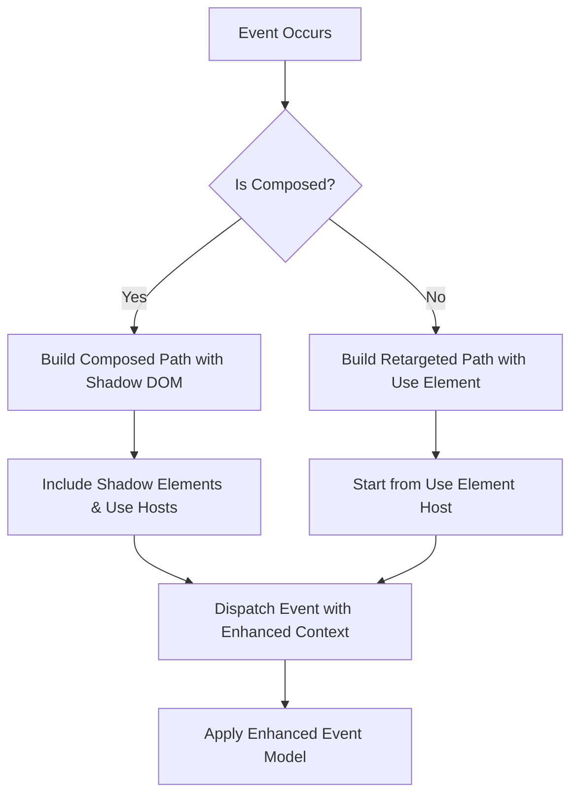

**Diagram sources**
- [svg_event_dispatcher.dart:150-216](file://lib/src/animation/svg_event_dispatcher.dart#L150-L216)

**Section sources**
- [svg_event_dispatcher.dart:140-375](file://lib/src/animation/svg_event_dispatcher.dart#L140-L375)

## Event Model Implementation

The event model implementation provides comprehensive support for SVG-specific features with enhanced W3C DOM compliance:

### Enhanced Use Element Shadow DOM Support

The system implements proper event retargeting for `<use>` elements with comprehensive shadow DOM support:

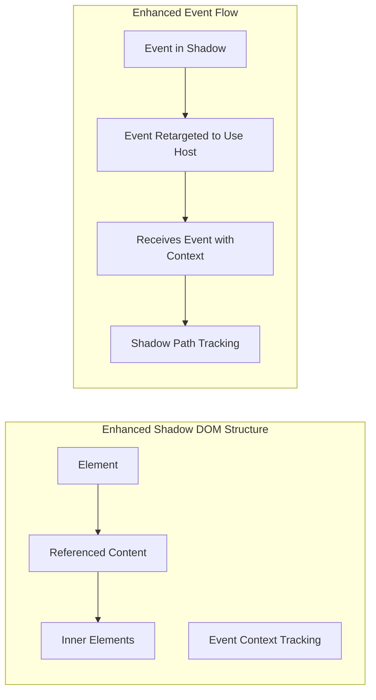

**Diagram sources**
- [animated_svg_picture_event_model.dart:36-49](file://lib/src/animation/animated_svg_picture_event_model.dart#L36-L49)

### Enhanced Anchor Element Integration

The system provides seamless integration with SVG anchor elements with comprehensive link information:

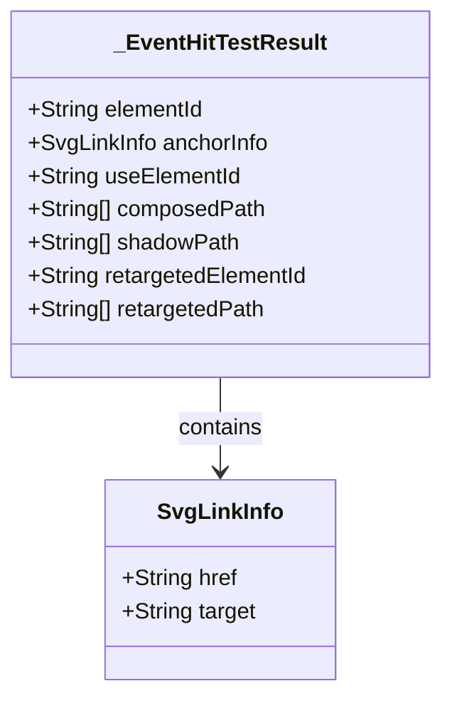

**Diagram sources**
- [animated_svg_picture_event_model.dart:4-49](file://lib/src/animation/animated_svg_picture_event_model.dart#L4-L49)

**Section sources**
- [animated_svg_picture_event_model.dart:1-379](file://lib/src/animation/animated_svg_picture_event_model.dart#L1-L379)

## Enhanced Pointer Event Handling

The system provides comprehensive pointer event support with full W3C DOM specification compliance and enhanced context management:

### Comprehensive Pointer Events Resolution

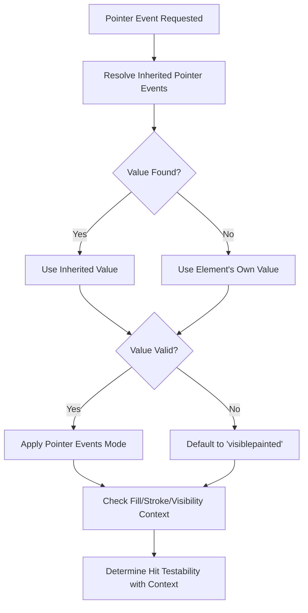

**Diagram sources**
- [animated_svg_picture_pointer_events.dart:5-27](file://lib/src/animation/animated_svg_picture_pointer_events.dart#L5-L27)

### Enhanced Pointer Event Modes

The system supports all SVG pointer-events modes with comprehensive context awareness:

| Mode | Description | Behavior | Context Awareness |
|------|-------------|----------|-------------------|
| `none` | No pointer events | Completely ignores interactions | Full context check |
| `visiblepainted` | Visible and painted | Requires visibility AND fill/stroke | Visibility + paint context |
| `visiblefill` | Visible fill only | Requires visibility AND fill | Visibility + fill context |
| `visiblestroke` | Visible stroke only | Requires visibility AND stroke | Visibility + stroke context |
| `visible` | Visible only | Requires element to be visible | Visibility only |
| `painted` | Painted elements | Requires fill or stroke | Paint context |
| `fill` | Fill elements | Allows fill-based hit testing | Fill context |
| `stroke` | Stroke elements | Allows stroke-based hit testing | Stroke context |
| `all` | All elements | Enables all interactions | Full context |
| `bounding-box` | Bounding box only | Uses bounding box for hit testing | Bounding box context |

**Section sources**
- [animated_svg_picture_pointer_events.dart:1-208](file://lib/src/animation/animated_svg_picture_pointer_events.dart#L1-L208)

## Gesture Recognition System

The system provides comprehensive gesture recognition with unified event handling for high-level interactions:

### Gesture Event Types and Handling

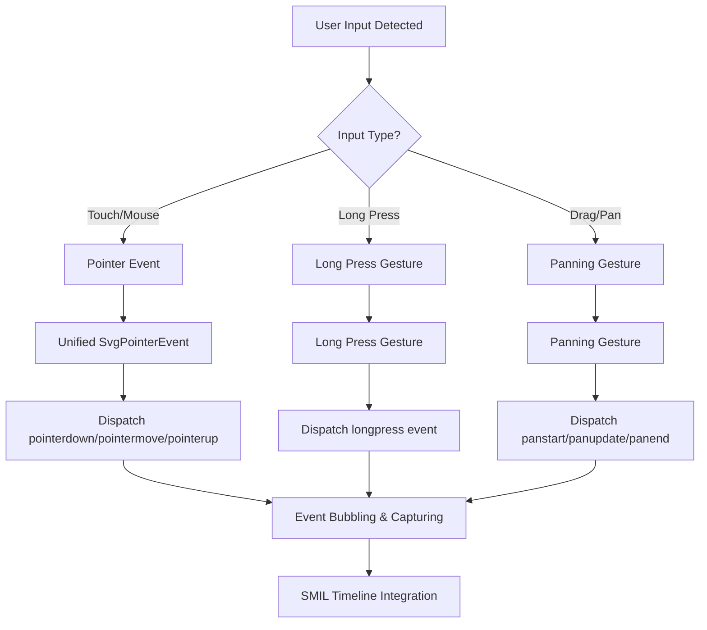

**Diagram sources**
- [animated_svg_picture_events.dart:402-486](file://lib/src/animation/animated_svg_picture_events.dart#L402-L486)

### Gesture Event Lifecycle

The system handles comprehensive gesture recognition with proper event sequencing:

| Gesture Phase | Event Type | Trigger Conditions | Event Properties |
|---------------|------------|-------------------|------------------|
| Initial Contact | `pointerdown` | First contact with surface | `pointerId`, `width`, `height`, `pressure` |
| Movement | `pointermove` | Pointer moved while contacting | `deltaX`, `deltaY`, `velocity` |
| Release | `pointerup` | Pointer released from surface | `pointerId`, `globalPosition` |
| Cancellation | `pointercancel` | Interaction cancelled | `pointerId` |
| Long Press | `longpress` | Hold beyond threshold | `duration`, `position` |
| Pan Start | `panstart` | Significant movement detected | `velocity`, `globalPosition` |
| Pan Update | `panupdate` | Continuous movement | `delta`, `velocity` |
| Pan End | `panend` | Movement ended | `velocity`, `displacement` |

**Section sources**
- [animated_svg_picture_events.dart:402-564](file://lib/src/animation/animated_svg_picture_events.dart#L402-L564)

## Event Tracing and Debugging

The system provides comprehensive event tracing capabilities for debugging and monitoring event flow:

### Event Tracing Architecture

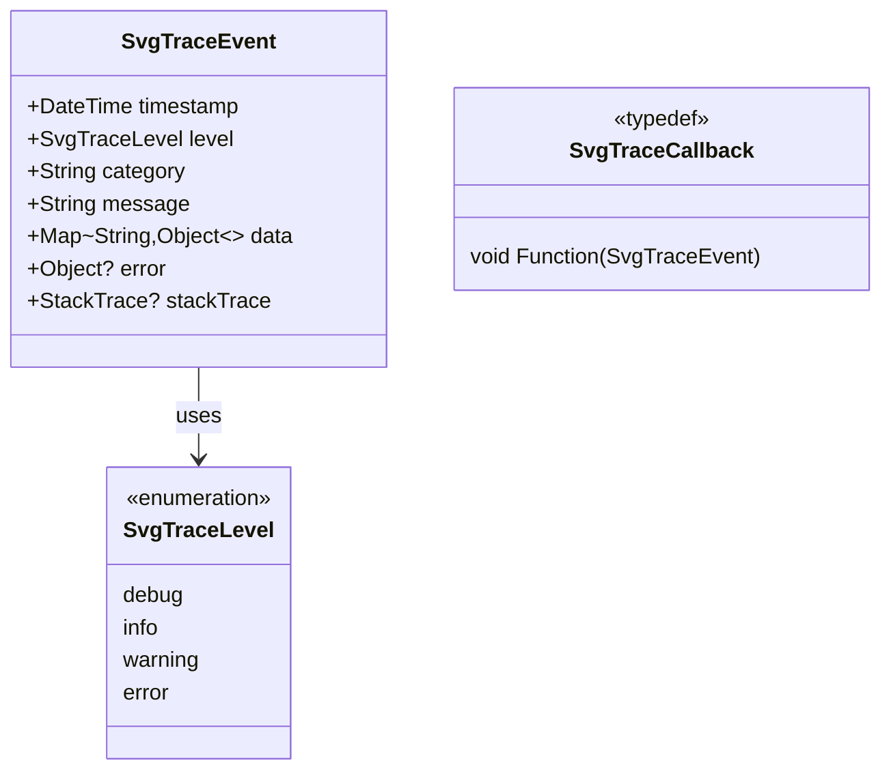

**Diagram sources**
- [animated_svg_picture.dart:44-96](file://lib/src/animation/animated_svg_picture.dart#L44-L96)

### Trace Categories and Levels

The system categorizes events for comprehensive monitoring:

| Category | Purpose | Severity Level | Typical Events |
|----------|---------|----------------|----------------|
| `init` | Initialization | info | Widget creation, parser setup |
| `event` | Event processing | info | Pointer, gesture, focus events |
| `tick` | Animation frames | debug | Timeline updates, frame rendering |
| `hit` | Hit testing | debug | Element detection, path building |
| `error` | Error conditions | error | Parsing errors, invalid states |
| `warning` | Warning conditions | warning | Performance issues, deprecated usage |

**Section sources**
- [animated_svg_picture.dart:44-96](file://lib/src/animation/animated_svg_picture.dart#L44-L96)
- [animated_svg_picture_utils.dart:61-85](file://lib/src/animation/animated_svg_picture_utils.dart#L61-L85)

## Focus and State Management

The system maintains comprehensive state management for focus, hover, and active states with enhanced W3C DOM compliance:

### Enhanced Pseudo-Class State Management

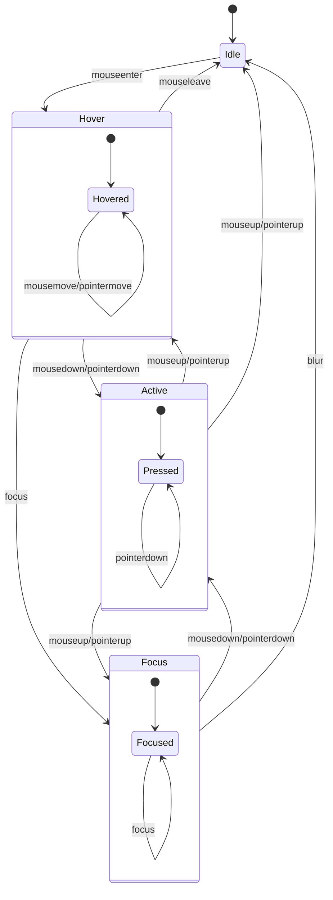

### Enhanced Focusable Element Detection

The system identifies focusable elements based on comprehensive SVG specifications:

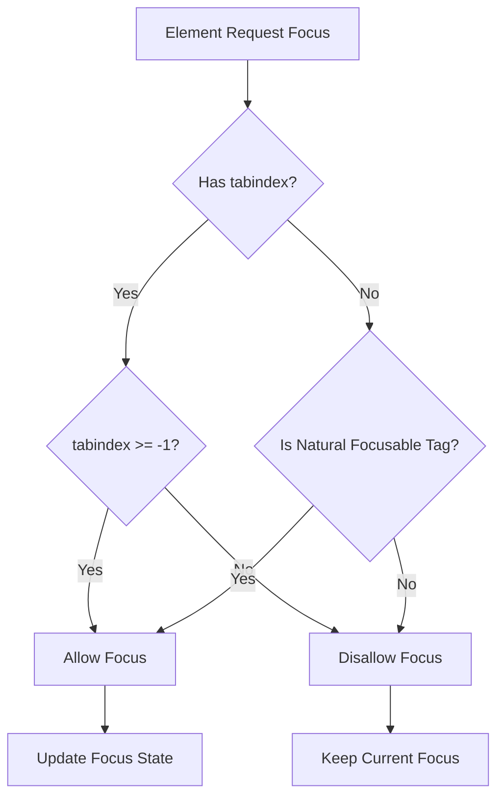

**Diagram sources**
- [svg_dom.dart:401-419](file://lib/src/animation/svg_dom.dart#L401-L419)

**Section sources**
- [svg_dom.dart:299-419](file://lib/src/animation/svg_dom.dart#L299-L419)

## Event Timing and Animation Integration

The event system integrates tightly with the SMIL animation timeline with comprehensive gesture support:

### Enhanced Event-Based Animation Activation

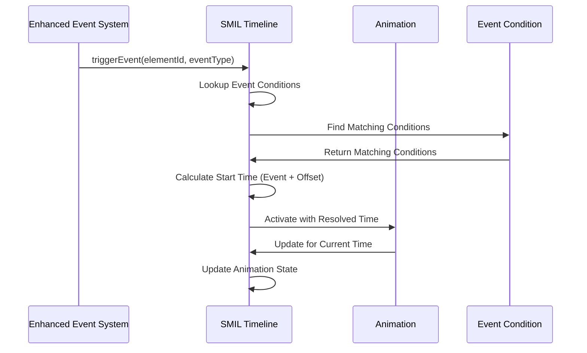

**Diagram sources**
- [animated_svg_picture_events.dart:68-102](file://lib/src/animation/animated_svg_picture_events.dart#L68-L102)

### Enhanced Event Timing Scenarios

The system supports various event timing patterns with comprehensive gesture support:

| Event Pattern | Description | Behavior | Examples |
|---------------|-------------|----------|----------|
| `click` | Direct event trigger | Starts immediately at event time | `click` |
| `click+1s` | Delayed event | Starts 1 second after event | `click+1s` |
| `click-500ms` | Early event | Starts 500ms before event | `click-500ms` |
| `click; 2s` | Multiple conditions | Starts when either event occurs or 2s elapses | `click; 2s` |
| `anim.end` | Animation-based timing | Starts when referenced animation ends | `anim.end` |
| `pointerdown` | Pointer event timing | Starts on pointer down | `pointerdown` |
| `longpress` | Gesture timing | Starts on long press | `longpress` |
| `panstart` | Pan gesture timing | Starts on pan begin | `panstart` |
| `panend` | Pan end timing | Starts on pan end | `panend` |

**Section sources**
- [animated_svg_picture_events.dart:61-102](file://lib/src/animation/animated_svg_picture_events.dart#L61-L102)

## Testing and Validation

The event system includes comprehensive test coverage validating all aspects of the enhanced implementation:

### Enhanced Event Flow Testing

The test suite validates the complete event flow through all phases with comprehensive gesture support:

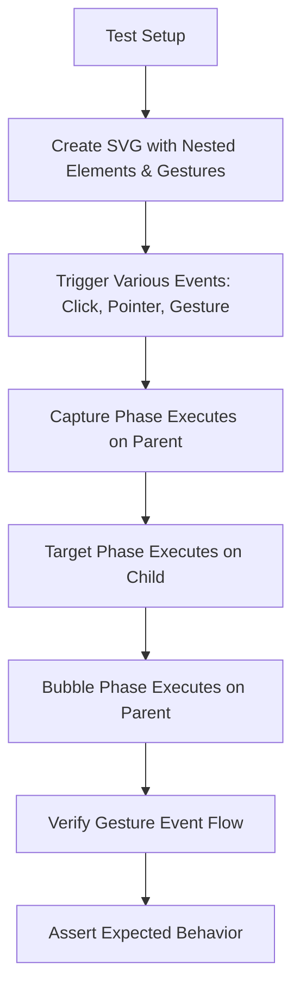

**Diagram sources**
- [event_system_test.dart:13-128](file://test/animation/event_system_test.dart#L13-L128)

### Comprehensive Event Model Validation

The system includes extensive validation of enhanced event model compliance:

| Test Category | Coverage | Validation Method |
|---------------|----------|-------------------|
| Event Phases | Capture, Target, Bubble | Visual verification through animation |
| Event Propagation | stopPropagation, stopImmediatePropagation | Direct assertion of handler execution |
| Event Prevention | preventDefault | Verification of default action suppression |
| Event Retargeting | `<use>` shadow DOM | Validation of event target modification |
| Pointer Events | All SVG modes | Hit testing validation across pointer modes |
| Gesture Events | All gesture types | Gesture recognition and event flow validation |
| Event Tracing | All categories | Trace event emission and categorization |
| Focus Management | :hover, :active, :focus | State verification through pseudo-class checks |

**Section sources**
- [event_system_test.dart:1-732](file://test/animation/event_system_test.dart#L1-L732)

## Performance Considerations

The event system is optimized for performance through several mechanisms with enhanced pointer and gesture support:

### Enhanced Event Path Caching

The system caches event paths to avoid repeated computation during event dispatch, particularly beneficial for complex SVG documents with deep hierarchies and shadow DOM structures.

### Optimized Listener Management

Event listeners are organized by type and phase with enhanced pointer event filtering, allowing for efficient dispatch and minimizing unnecessary listener invocations.

### Advanced Memory Management

The system properly manages event object lifecycle, resetting internal state after each event dispatch to prevent memory leaks, with specialized cleanup for gesture events.

### Enhanced Hit Testing Efficiency

The hit testing engine uses spatial indexing, early termination, and shadow DOM-aware algorithms to minimize the number of elements that need detailed geometric testing.

### Gesture Recognition Optimization

The gesture recognition system uses efficient algorithms for pointer tracking and gesture detection, with optimized event dispatch for gesture sequences.

## Troubleshooting Guide

### Common Issues and Solutions

**Issue: Events not firing on expected elements**
- Verify element has proper ID attribute for event targeting
- Check pointer-events property is not set to 'none'
- Ensure element is not hidden or clipped
- Verify element is not disabled by gesture recognition logic

**Issue: Event propagation not working correctly**
- Confirm event bubbles property matches expected behavior
- Verify stopPropagation is not being called unintentionally
- Check event capture vs bubble phase listener registration
- Validate W3C DOM event flow compliance

**Issue: `<use>` shadow DOM events not retargeting properly**
- Ensure referenced element has proper ID for retargeting
- Verify use element has ID for shadow host identification
- Check nested `<use>` element recursion depth limits
- Validate shadow DOM path construction

**Issue: Gesture events not triggering**
- Verify gesture recognition thresholds are appropriate
- Check pointer event compatibility with gesture recognition
- Ensure element has proper pointer-events configuration
- Validate gesture event timing and sequencing

**Issue: Animation timing not responding to events**
- Verify event condition syntax in animation begin attribute
- Check event type matches animation's expected event
- Ensure element ID in event condition matches actual element ID
- Validate gesture event type compatibility with SMIL

**Issue: Event tracing not working**
- Verify onTrace callback is properly configured
- Check trace level settings for desired verbosity
- Ensure trace categories are properly categorized
- Validate trace data payload formatting

**Section sources**
- [svg_event_dispatcher.dart:334-375](file://lib/src/animation/svg_event_dispatcher.dart#L334-L375)
- [animated_svg_picture_pointer_events.dart:1-208](file://lib/src/animation/animated_svg_picture_pointer_events.dart#L1-L208)

## Conclusion

The Flutter SVG Event System provides a comprehensive, standards-compliant implementation of the W3C DOM Event model tailored specifically for SVG graphics. The system successfully bridges the gap between Flutter's gesture detection and web standards for event handling, enabling developers to create rich, interactive SVG experiences.

**Updated** Key enhancements include comprehensive W3C DOM pointer event model compliance, gesture recognition system with unified event handling, enhanced event tracing capabilities, and full shadow DOM support with proper event retargeting.

The system's integration with the SMIL animation timeline enables sophisticated event-driven animation control, making it possible to create complex interactive SVG experiences that respond naturally to user input while maintaining predictable behavior and performance characteristics.

**Key Strengths:**
- **Standards Compliance**: Full adherence to W3C DOM Event specification with enhanced pointer support
- **Comprehensive Gesture Support**: Unified gesture recognition with longpress, pan, and pointer events
- **Enhanced Shadow DOM Handling**: Proper event retargeting with comprehensive context tracking
- **Advanced Debugging**: Complete event tracing system with categorized logging
- **Performance Optimization**: Efficient event dispatch with caching and gesture optimization
- **Robust Testing**: Extensive test suite validating all aspects of the enhanced implementation

The system continues to evolve with comprehensive support for modern web standards while maintaining backward compatibility and performance characteristics essential for production SVG applications.