# Event System Documentation

<cite>
**Referenced Files in This Document**
- [svg_event.dart](file://lib/src/animation/svg_event.dart)
- [svg_event_dispatcher.dart](file://lib/src/animation/svg_event_dispatcher.dart)
- [animated_svg_picture_events.dart](file://lib/src/animation/animated_svg_picture_events.dart)
- [animated_svg_picture_event_model.dart](file://lib/src/animation/animated_svg_picture_event_model.dart)
- [animated_svg_picture_pointer_events.dart](file://lib/src/animation/animated_svg_picture_pointer_events.dart)
- [animated_svg_picture_utils.dart](file://lib/src/animation/animated_svg_picture_utils.dart)
- [animated_svg_picture.dart](file://lib/src/animation/animated_svg_picture.dart)
- [animated_svg_picture_hit_test_advanced.dart](file://lib/src/animation/animated_svg_picture_hit_test_advanced.dart)
- [animated_svg_picture_hit_test_use.dart](file://lib/src/animation/animated_svg_picture_hit_test_use.dart)
- [animated_svg_picture_hit_test_traversal.dart](file://lib/src/animation/animated_svg_picture_hit_test_traversal.dart)
- [animated_svg_picture_hit_test_visibility.dart](file://lib/src/animation/animated_svg_picture_hit_test_visibility.dart)
- [animated_svg_painter_clip_mask_advanced.dart](file://lib/src/animation/animated_svg_painter_clip_mask_advanced.dart)
- [animated_svg_painter_clip_mask.dart](file://lib/src/animation/animated_svg_painter_clip_mask.dart)
- [event_system_test.dart](file://test/animation/event_system_test.dart)
- [hit_test_precision_test.dart](file://test/animation/hit_test_precision_test.dart)
- [advanced_mask_semantics_test.dart](file://test/animation/advanced_mask_semantics_test.dart)
- [clip_mask_advanced_composition_test.dart](file://test/animation/clip_mask_advanced_composition_test.dart)
</cite>

## Update Summary
**Changes Made**
- Enhanced hit testing capabilities with improved clipPath precision and mask hit testing with luminance alpha support
- Added comprehensive mask-type support including alpha and luminance modes
- Implemented advanced precision hit testing for clipPath, mask, text, and marker elements
- Enhanced mask hit testing with proper luminance alpha channel computation
- Improved clipPath precision with enhanced coordinate transformation handling
- Added support for mask-type CSS properties and mask-mode specifications

## Table of Contents
1. [Introduction](#introduction)
2. [Event System Architecture](#event-system-architecture)
3. [Core Event Classes](#core-event-classes)
4. [Event Dispatch Pipeline](#event-dispatch-pipeline)
5. [Event Model Implementation](#event-model-implementation)
6. [Enhanced Pointer Event Handling](#enhanced-pointer-event-handling)
7. [Advanced Hit Testing System](#advanced-hit-testing-system)
8. [Enhanced Mask Hit Testing with Luminance Alpha](#enhanced-mask-hit-testing-with-luminance-alpha)
9. [Event Delegation and Flow Control](#event-delegation-and-flow-control)
10. [Event Tracing and Debugging](#event-tracing-and-debugging)
11. [Focus and State Management](#focus-and-state-management)
12. [Event Timing and Animation Integration](#event-timing-and-animation-integration)
13. [Testing and Validation](#testing-and-validation)
14. [Performance Considerations](#performance-considerations)
15. [Troubleshooting Guide](#troubleshooting-guide)
16. [Conclusion](#conclusion)

## Introduction

The Flutter SVG Event System represents a comprehensive implementation of the W3C DOM Event model specifically designed for SVG graphics. This system provides full event bubbling, capturing, and retargeting capabilities, enabling developers to create interactive SVG experiences with native-like event handling.

**Updated** The system now features enhanced W3C DOM event model compliance with comprehensive pointer event support, advanced precision hit testing, gesture recognition capabilities, unified event classes, and a complete event tracing system for debugging and monitoring. Recent enhancements include improved clipPath precision and comprehensive mask hit testing with luminance alpha support.

The system integrates seamlessly with Flutter's gesture detection while maintaining strict adherence to web standards for event propagation, timing, and behavior. It supports all major SVG event types including mouse events, pointer events, keyboard events, focus events, gesture events, and custom events with enhanced precision testing capabilities.

## Event System Architecture

The event system is built around several core components that work together to provide robust event handling with comprehensive W3C DOM compliance and advanced precision testing:

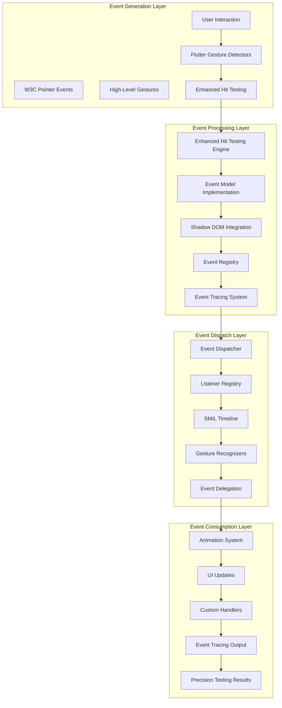
```mermaid
graph TB
subgraph "Event Generation Layer"
A[User Interaction]
B[Flutter Gesture Detectors]
C[W3C Pointer Events]
D[High-Level Gestures]
E[Enhanced Hit Testing]
end
subgraph "Event Processing Layer"
F[Enhanced Hit Testing Engine]
G[Event Model Implementation]
H[Event Registry]
I[Event Tracing System]
J[Shadow DOM Integration]
end
subgraph "Event Dispatch Layer"
K[Event Dispatcher]
L[Listener Registry]
M[SMIL Timeline]
N[Gesture Recognizers]
O[Event Delegation]
end
subgraph "Event Consumption Layer"
P[Animation System]
Q[UI Updates]
R[Custom Handlers]
S[Event Tracing Output]
T[Precision Testing Results]
end
A --> B
B --> E
E --> F
F --> G
G --> J
J --> H
H --> I
I --> K
K --> L
L --> M
M --> N
N --> O
O --> P
P --> Q
Q --> R
R --> S
S --> T
```

**Diagram sources**
- [animated_svg_picture_events.dart:88-144](file://lib/src/animation/animated_svg_picture_events.dart#L88-L144)
- [svg_event_dispatcher.dart:218-315](file://lib/src/animation/svg_event_dispatcher.dart#L218-L315)
- [svg_event.dart:226-323](file://lib/src/animation/svg_event.dart#L226-L323)

**Section sources**
- [svg_event_dispatcher.dart:1-375](file://lib/src/animation/svg_event_dispatcher.dart#L1-L375)
- [svg_event.dart:1-451](file://lib/src/animation/svg_event.dart#L1-L451)

## Core Event Classes

The event system defines a comprehensive hierarchy of event classes that mirror the W3C DOM specification with enhanced pointer and gesture support:

### Enhanced Event Class Hierarchy

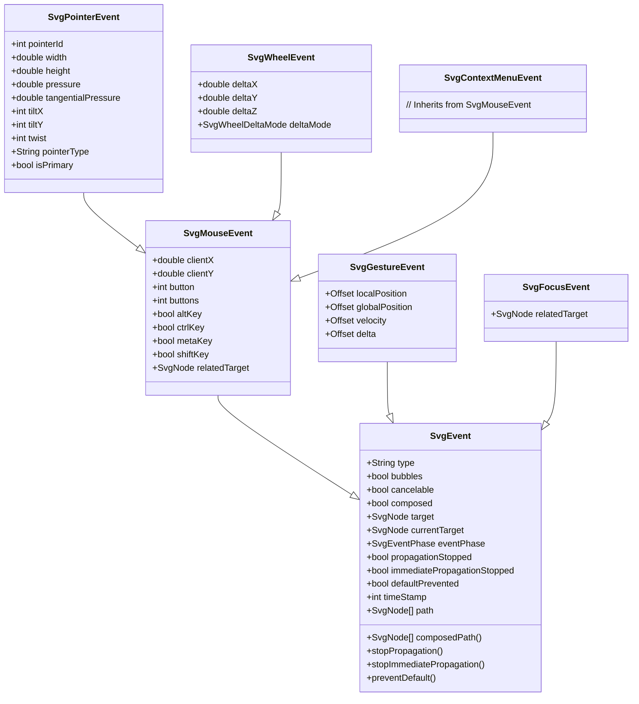
```mermaid
classDiagram
class SvgEvent {
+String type
+bool bubbles
+bool cancelable
+bool composed
+SvgNode target
+SvgNode currentTarget
+SvgEventPhase eventPhase
+bool propagationStopped
+bool immediatePropagationStopped
+bool defaultPrevented
+int timeStamp
+SvgNode[] composedPath()
+SvgNode[] path
+stopPropagation()
+stopImmediatePropagation()
+preventDefault()
}
class SvgMouseEvent {
+double clientX
+double clientY
+int button
+int buttons
+bool altKey
+bool ctrlKey
+bool metaKey
+bool shiftKey
+SvgNode relatedTarget
}
class SvgPointerEvent {
+int pointerId
+double width
+double height
+double pressure
+double tangentialPressure
+int tiltX
+int tiltY
+int twist
+String pointerType
+bool isPrimary
}
class SvgGestureEvent {
+Offset localPosition
+Offset globalPosition
+Offset velocity
+Offset delta
}
class SvgFocusEvent {
+SvgNode relatedTarget
}
class SvgWheelEvent {
+double deltaX
+double deltaY
+double deltaZ
+SvgWheelDeltaMode deltaMode
}
class SvgContextMenuEvent {
// Inherits from SvgMouseEvent
}
SvgMouseEvent --|> SvgEvent
SvgPointerEvent --|> SvgMouseEvent
SvgGestureEvent --|> SvgEvent
SvgFocusEvent --|> SvgEvent
SvgWheelEvent --|> SvgMouseEvent
SvgContextMenuEvent --|> SvgMouseEvent
```

**Diagram sources**
- [svg_event.dart:226-384](file://lib/src/animation/svg_event.dart#L226-L384)

### Enhanced Event Listener Management

The system provides sophisticated listener management through the `SvgEventListenerEntry` class with expanded capabilities:

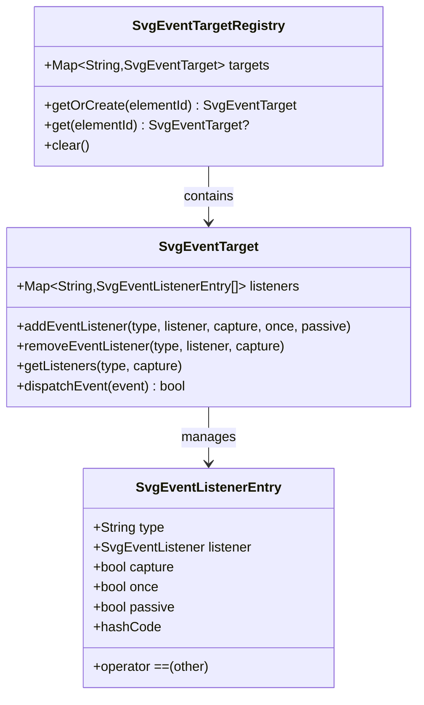
```mermaid
classDiagram
class SvgEventListenerEntry {
+String type
+SvgEventListener listener
+bool capture
+bool once
+bool passive
+operator ==(other)
+hashCode
}
class SvgEventTarget {
+Map~String,SvgEventListenerEntry[]~ listeners
+addEventListener(type, listener, capture, once, passive)
+removeEventListener(type, listener, capture)
+getListeners(type, capture)
+dispatchEvent(event) bool
}
class SvgEventTargetRegistry {
+Map~String,SvgEventTarget~ targets
+getOrCreate(elementId) SvgEventTarget
+get(elementId) SvgEventTarget?
+clear()
}
SvgEventTarget --> SvgEventListenerEntry : manages
SvgEventTargetRegistry --> SvgEventTarget : contains
```

**Diagram sources**
- [svg_event.dart:414-450](file://lib/src/animation/svg_event.dart#L414-L450)
- [svg_event_dispatcher.dart:36-138](file://lib/src/animation/svg_event_dispatcher.dart#L36-L138)

**Section sources**
- [svg_event.dart:11-451](file://lib/src/animation/svg_event.dart#L11-L451)
- [svg_event_dispatcher.dart:35-138](file://lib/src/animation/svg_event_dispatcher.dart#L35-L138)

## Event Dispatch Pipeline

The event dispatch pipeline follows the W3C DOM specification with three distinct phases and enhanced pointer event support:

### Enhanced Event Phases

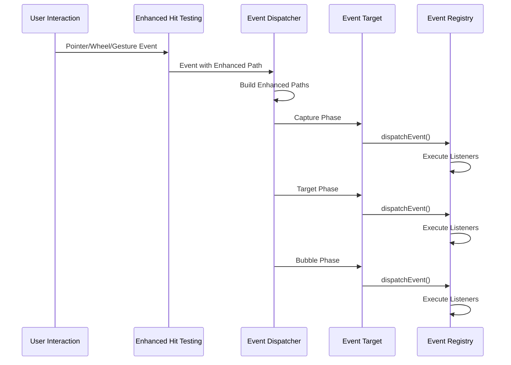
```mermaid
sequenceDiagram
participant User as User Interaction
participant HitTest as Enhanced Hit Testing
participant Dispatcher as Event Dispatcher
participant Target as Event Target
participant Registry as Event Registry
User->>HitTest : Pointer/Wheel/Gesture Event
HitTest->>Dispatcher : Event with Enhanced Path
Dispatcher->>Dispatcher : Build Enhanced Paths
Dispatcher->>Target : Capture Phase
Target->>Registry : dispatchEvent()
Registry->>Registry : Execute Listeners
Dispatcher->>Target : Target Phase
Target->>Registry : dispatchEvent()
Registry->>Registry : Execute Listeners
Dispatcher->>Target : Bubble Phase
Target->>Registry : dispatchEvent()
Registry->>Registry : Execute Listeners
```

**Diagram sources**
- [svg_event_dispatcher.dart:218-315](file://lib/src/animation/svg_event_dispatcher.dart#L218-L315)

### Enhanced Path Construction

The system constructs event paths with comprehensive shadow DOM support and pointer event context:

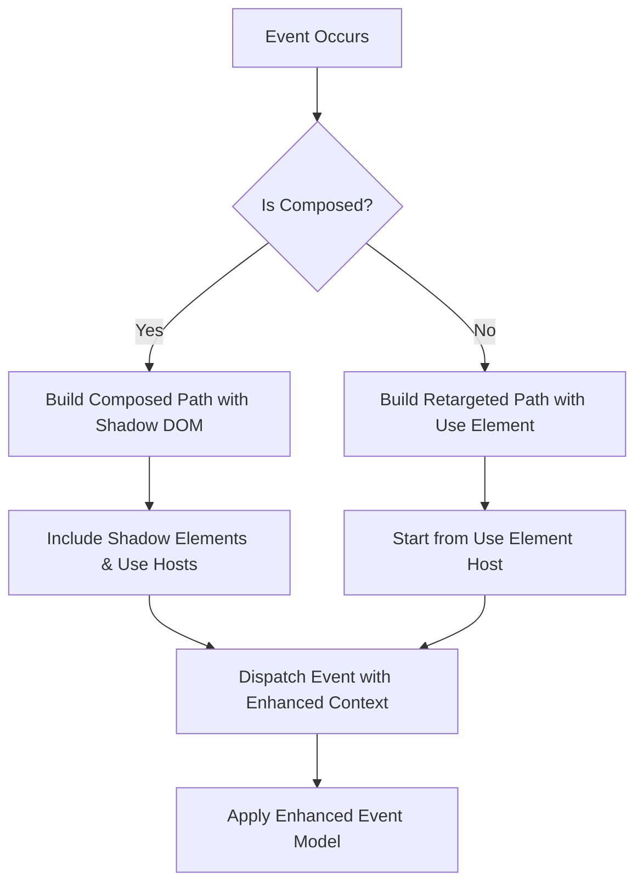
```mermaid
flowchart TD
A[Event Occurs] --> B{Is Composed?}
B --> |Yes| C[Build Composed Path with Shadow DOM]
B --> |No| D[Build Retargeted Path with Use Element]
C --> E[Include Shadow Elements & Use Hosts]
D --> F[Start from Use Element Host]
E --> G[Dispatch Event with Enhanced Context]
F --> G
G --> H[Apply Enhanced Event Model]
```

**Diagram sources**
- [svg_event_dispatcher.dart:150-216](file://lib/src/animation/svg_event_dispatcher.dart#L150-L216)

**Section sources**
- [svg_event_dispatcher.dart:140-375](file://lib/src/animation/svg_event_dispatcher.dart#L140-L375)

## Event Model Implementation

The event model implementation provides comprehensive support for SVG-specific features with enhanced W3C DOM compliance and advanced shadow DOM integration:

### Enhanced Use Element Shadow DOM Support

The system implements proper event retargeting for `<use>` elements with comprehensive shadow DOM support:

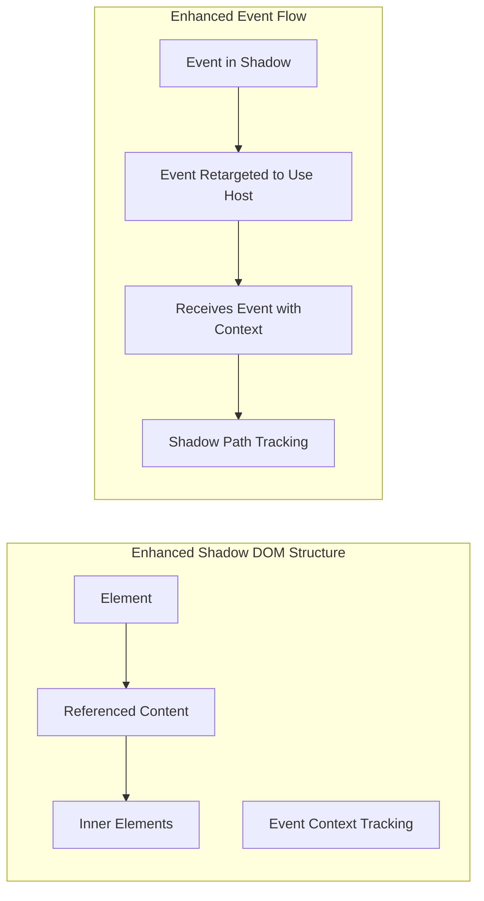
```mermaid
graph LR
subgraph "Enhanced Shadow DOM Structure"
A[<use> Element]
B[Referenced Content]
C[Inner Elements]
D[Event Context Tracking]
end
subgraph "Enhanced Event Flow"
E[Event in Shadow]
F[Event Retargeted to Use Host]
G[<use> Receives Event with Context]
H[Shadow Path Tracking]
end
A --> B
B --> C
E --> F
F --> G
G --> H
```

**Diagram sources**
- [animated_svg_picture_event_model.dart:36-49](file://lib/src/animation/animated_svg_picture_event_model.dart#L36-L49)

### Enhanced Anchor Element Integration

The system provides seamless integration with SVG anchor elements with comprehensive link information:

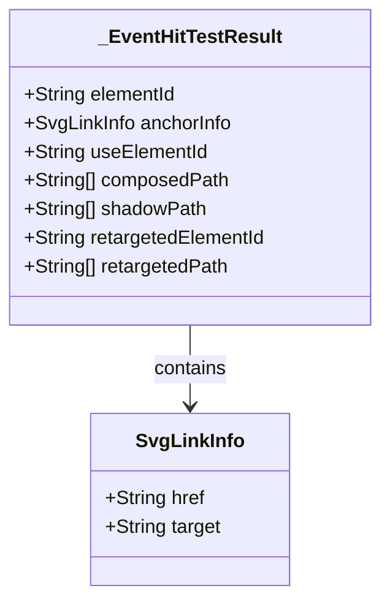
```mermaid
classDiagram
class SvgLinkInfo {
+String href
+String target
}
class _EventHitTestResult {
+String elementId
+SvgLinkInfo anchorInfo
+String useElementId
+String[] composedPath
+String[] shadowPath
+String retargetedElementId
+String[] retargetedPath
}
_EventHitTestResult --> SvgLinkInfo : contains
```

**Diagram sources**
- [animated_svg_picture_event_model.dart:4-49](file://lib/src/animation/animated_svg_picture_event_model.dart#L4-L49)

**Section sources**
- [animated_svg_picture_event_model.dart:1-379](file://lib/src/animation/animated_svg_picture_event_model.dart#L1-L379)

## Enhanced Pointer Event Handling

The system provides comprehensive pointer event support with full W3C DOM specification compliance and enhanced context management:

### Comprehensive Pointer Events Resolution

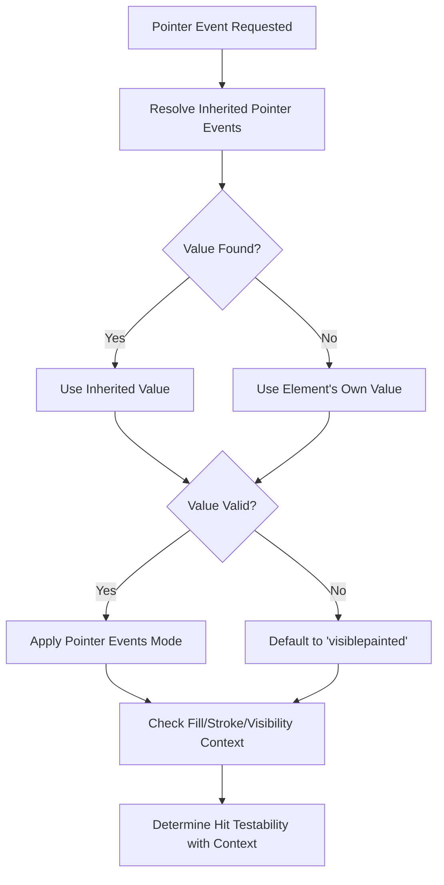
```mermaid
flowchart TD
A[Pointer Event Requested] --> B[Resolve Inherited Pointer Events]
B --> C{Value Found?}
C --> |Yes| D[Use Inherited Value]
C --> |No| E[Use Element's Own Value]
D --> F{Value Valid?}
E --> F
F --> |Yes| G[Apply Pointer Events Mode]
F --> |No| H[Default to 'visiblepainted']
G --> I[Check Fill/Stroke/Visibility Context]
H --> I
I --> J[Determine Hit Testability with Context]
```

**Diagram sources**
- [animated_svg_picture_pointer_events.dart:5-27](file://lib/src/animation/animated_svg_picture_pointer_events.dart#L5-L27)

### Enhanced Pointer Event Modes

The system supports all SVG pointer-events modes with comprehensive context awareness:

| Mode | Description | Behavior | Context Awareness |
|------|-------------|----------|-------------------|
| `none` | No pointer events | Completely ignores interactions | Full context check |
| `visiblepainted` | Visible and painted | Requires visibility AND fill/stroke | Visibility + paint context |
| `visiblefill` | Visible fill only | Requires visibility AND fill | Visibility + fill context |
| `visiblestroke` | Visible stroke only | Requires visibility AND stroke | Visibility + stroke context |
| `visible` | Visible only | Requires element to be visible | Visibility only |
| `painted` | Painted elements | Requires fill or stroke | Paint context |
| `fill` | Fill elements | Allows fill-based hit testing | Fill context |
| `stroke` | Stroke elements | Allows stroke-based hit testing | Stroke context |
| `all` | All elements | Enables all interactions | Full context |
| `bounding-box` | Bounding box only | Uses bounding box for hit testing | Bounding box context |

**Section sources**
- [animated_svg_picture_pointer_events.dart:1-208](file://lib/src/animation/animated_svg_picture_pointer_events.dart#L1-L208)

## Advanced Hit Testing System

The system provides comprehensive precision hit testing capabilities for complex SVG elements with enhanced accuracy:

### Precision Hit Testing Capabilities

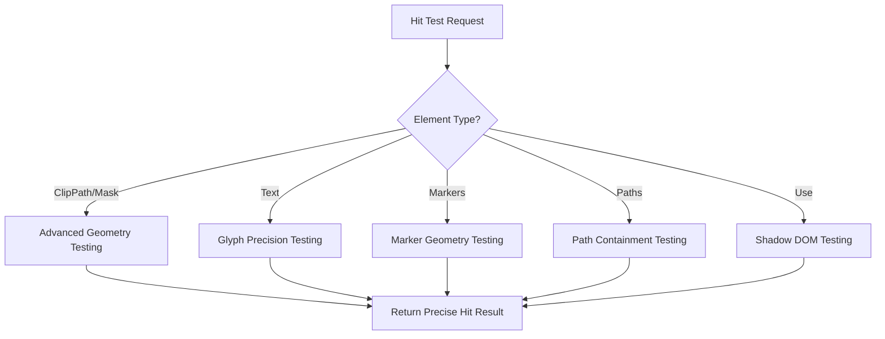
```mermaid
flowchart TD
A[Hit Test Request] --> B{Element Type?}
B --> |ClipPath/Mask| C[Advanced Geometry Testing]
B --> |Text| D[Glyph Precision Testing]
B --> |Markers| E[Marker Geometry Testing]
B --> |Paths| F[Path Containment Testing]
B --> |Use| G[Shadow DOM Testing]
C --> H[Return Precise Hit Result]
D --> H
E --> H
F --> H
G --> H
```

**Diagram sources**
- [animated_svg_picture_hit_test_advanced.dart:1-816](file://lib/src/animation/animated_svg_picture_hit_test_advanced.dart#L1-L816)

### Advanced Precision Testing Features

The system includes sophisticated hit testing for complex SVG elements:

#### ClipPath and Mask Precision Testing
- Accurate hit testing within clipPath boundaries with objectBoundingBox units support
- Mask-based hit testing with proper alpha channel consideration
- Nested clipPath and mask composition handling

#### Text Element Precision Testing
- Glyph-level precision for individual characters in text elements
- Support for dx, dy, and rotate attributes for character positioning
- TextPath hit testing along curved paths
- Per-character bounding box calculation

#### Marker Precision Testing
- Marker start, middle, and end position detection
- Rotation and scaling calculations for marker geometry
- Complex marker shapes with viewBox support

#### Path Precision Testing
- EvenOdd fill rule handling for complex paths
- Degenerate case detection and robust containment testing
- Collinear edge and zero-length segment handling

**Section sources**
- [animated_svg_picture_hit_test_advanced.dart:1-816](file://lib/src/animation/animated_svg_picture_hit_test_advanced.dart#L1-L816)
- [hit_test_precision_test.dart:1-1006](file://test/animation/hit_test_precision_test.dart#L1-L1006)

## Enhanced Mask Hit Testing with Luminance Alpha

**Updated** The system now provides comprehensive mask hit testing with support for both alpha and luminance mask types, enabling precise control over mask opacity computation.

### Mask Type Support

The system supports two primary mask types with comprehensive CSS property parsing:

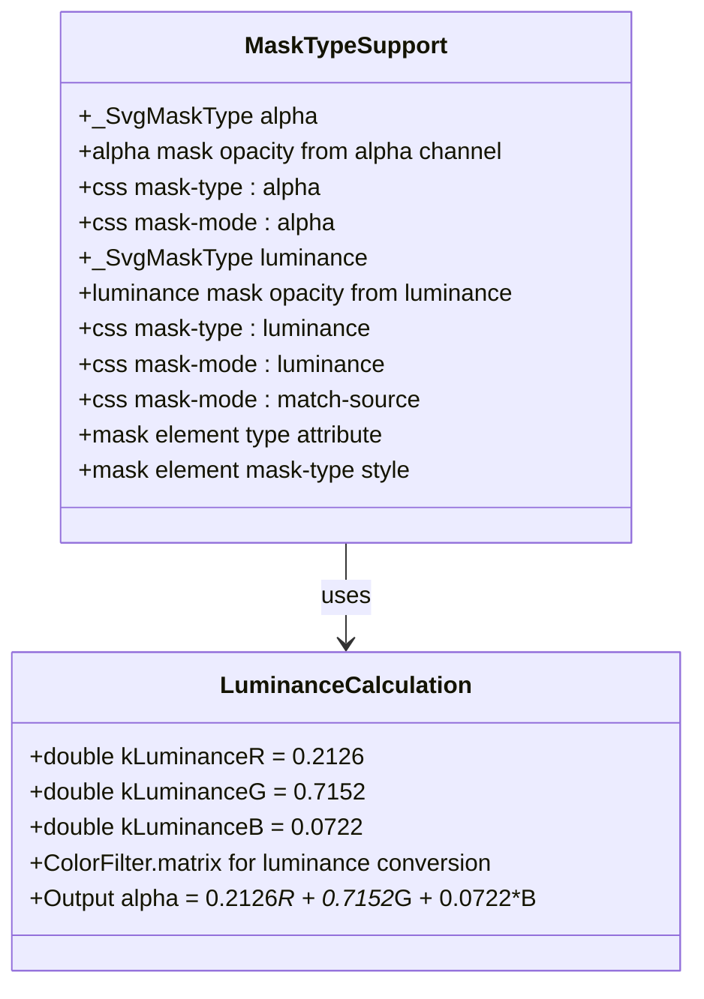
```mermaid
classDiagram
class MaskTypeSupport {
+_SvgMaskType alpha
+alpha mask opacity from alpha channel
+css mask-type : alpha
+css mask-mode : alpha
+_SvgMaskType luminance
+luminance mask opacity from luminance
+css mask-type : luminance
+css mask-mode : luminance
+css mask-mode : match-source
+mask element type attribute
+mask element mask-type style
}
class LuminanceCalculation {
+double kLuminanceR = 0.2126
+double kLuminanceG = 0.7152
+double kLuminanceB = 0.0722
+ColorFilter.matrix for luminance conversion
+Output alpha = 0.2126*R + 0.7152*G + 0.0722*B
}
MaskTypeSupport --> LuminanceCalculation : uses
```

**Diagram sources**
- [animated_svg_painter_clip_mask_advanced.dart:4-12](file://lib/src/animation/animated_svg_painter_clip_mask_advanced.dart#L4-L12)

### Luminance Alpha Mask Processing

The system implements precise luminance alpha computation following ITU-R BT.709 standards:

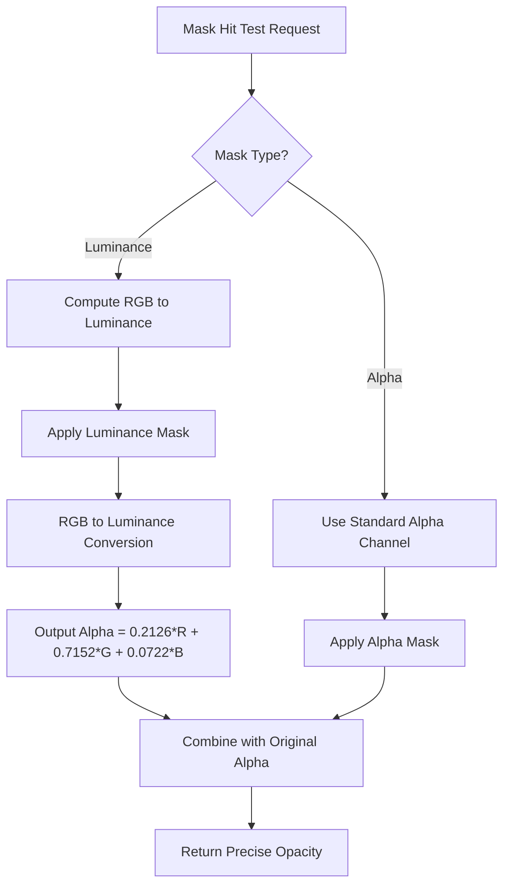
```mermaid
flowchart TD
A[Mask Hit Test Request] --> B{Mask Type?}
B --> |Alpha| C[Use Standard Alpha Channel]
B --> |Luminance| D[Compute RGB to Luminance]
C --> E[Apply Alpha Mask]
D --> F[Apply Luminance Mask]
F --> G[RGB to Luminance Conversion]
G --> H[Output Alpha = 0.2126*R + 0.7152*G + 0.0722*B]
H --> I[Combine with Original Alpha]
E --> I
I --> J[Return Precise Opacity]
```

**Diagram sources**
- [animated_svg_painter_clip_mask_advanced.dart:68-88](file://lib/src/animation/animated_svg_painter_clip_mask_advanced.dart#L68-L88)

### Mask Type Resolution Priority

The system follows a comprehensive priority order for determining mask type:

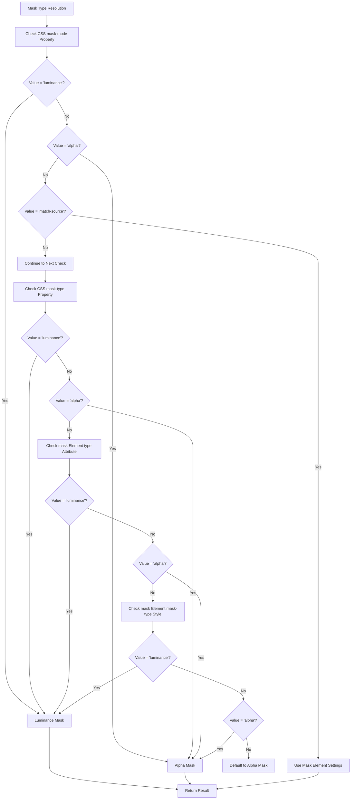
```mermaid
flowchart TD
A[Mask Type Resolution] --> B[Check CSS mask-mode Property]
B --> C{Value = 'luminance'?}
C --> |Yes| D[Luminance Mask]
C --> |No| E{Value = 'alpha'?}
E --> |Yes| F[Alpha Mask]
E --> |No| G{Value = 'match-source'?}
G --> |Yes| H[Use Mask Element Settings]
G --> |No| I[Continue to Next Check]
D --> J[Return Result]
F --> J
H --> J
I --> K[Check CSS mask-type Property]
K --> L{Value = 'luminance'?}
L --> |Yes| D
L --> |No| M{Value = 'alpha'?}
M --> |Yes| F
M --> |No| N[Check mask Element type Attribute]
N --> O{Value = 'luminance'?}
O --> |Yes| D
O --> |No| P{Value = 'alpha'?}
P --> |Yes| F
P --> |No| Q[Check mask Element mask-type Style]
Q --> R{Value = 'luminance'?}
R --> |Yes| D
R --> |No| S{Value = 'alpha'?}
S --> |Yes| F
S --> |No| T[Default to Alpha Mask]
```

**Diagram sources**
- [animated_svg_painter_clip_mask_advanced.dart:26-66](file://lib/src/animation/animated_svg_painter_clip_mask_advanced.dart#L26-L66)

### Enhanced Mask Hit Testing Implementation

The system provides sophisticated mask hit testing with proper luminance alpha support:

#### ClipPath Precision Enhancement
- Improved clipPath precision with enhanced coordinate transformation handling
- Support for nested clipPath references with proper recursion depth limiting
- Accurate hit testing within clipPath boundaries using objectBoundingBox units

#### Mask Hit Testing with Luminance Alpha
- Precise luminance alpha computation using ITU-R BT.709 coefficients
- Support for CSS mask-type and mask-mode properties
- Proper handling of mask-content units and mask units
- Enhanced mask composition with proper opacity blending

#### Visibility Testing Integration
- Seamless integration with visibility testing for clipPath and mask
- Proper handling of foreignObject viewport restrictions
- Enhanced precision testing for complex SVG compositions

**Section sources**
- [animated_svg_picture_hit_test_visibility.dart:1-606](file://lib/src/animation/animated_svg_picture_hit_test_visibility.dart#L1-L606)
- [animated_svg_painter_clip_mask_advanced.dart:1-671](file://lib/src/animation/animated_svg_painter_clip_mask_advanced.dart#L1-L671)
- [animated_svg_painter_clip_mask.dart:1-233](file://lib/src/animation/animated_svg_painter_clip_mask.dart#L1-L233)

## Event Delegation and Flow Control

The system provides comprehensive event delegation with proper W3C DOM compliance and enhanced flow control:

### Event Delegation Architecture

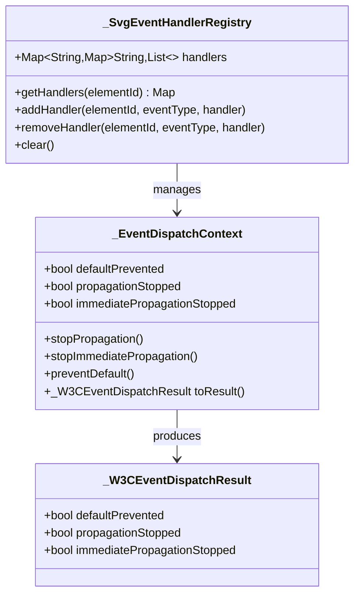
```mermaid
classDiagram
class _SvgEventHandlerRegistry {
+Map~String,Map~String,List~~ handlers
+getHandlers(elementId) Map
+addHandler(elementId, eventType, handler)
+removeHandler(elementId, eventType, handler)
+clear()
}
class _EventDispatchContext {
+bool defaultPrevented
+bool propagationStopped
+bool immediatePropagationStopped
+stopPropagation()
+stopImmediatePropagation()
+preventDefault()
+_W3CEventDispatchResult toResult()
}
class _W3CEventDispatchResult {
+bool defaultPrevented
+bool propagationStopped
+bool immediatePropagationStopped
}
_SvgEventHandlerRegistry --> _EventDispatchContext : manages
_EventDispatchContext --> _W3CEventDispatchResult : produces
```

**Diagram sources**
- [animated_svg_picture_events.dart:167-209](file://lib/src/animation/animated_svg_picture_events.dart#L167-L209)

### Enhanced Event Flow Control

The system provides sophisticated event flow control with comprehensive stopPropagation and preventDefault support:

| Control Method | Effect | Scope |
|----------------|--------|-------|
| `stopPropagation()` | Stops event from propagating further | Current phase only |
| `stopImmediatePropagation()` | Stops all remaining handlers on current element | Current element handlers only |
| `preventDefault()` | Prevents default browser action | Cancelable events only |

**Section sources**
- [animated_svg_picture_events.dart:22-165](file://lib/src/animation/animated_svg_picture_events.dart#L22-L165)

## Event Tracing and Debugging

The system provides comprehensive event tracing capabilities for debugging and monitoring event flow:

### Event Tracing Architecture

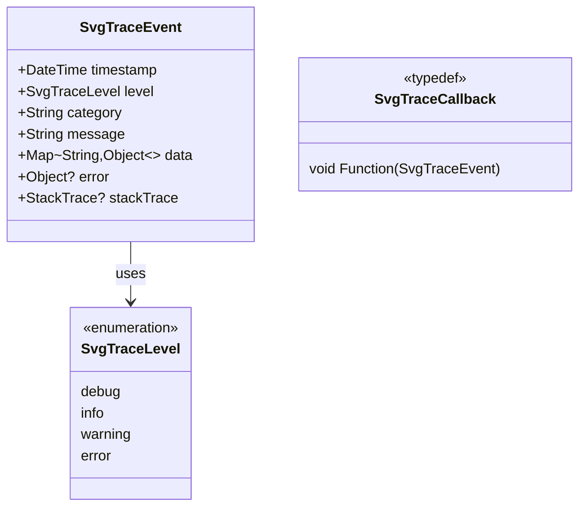
```mermaid
classDiagram
class SvgTraceEvent {
+DateTime timestamp
+SvgTraceLevel level
+String category
+String message
+Map~String,Object~~ data
+Object? error
+StackTrace? stackTrace
}
class SvgTraceLevel {
<<enumeration>>
debug
info
warning
error
}
class SvgTraceCallback {
<<typedef>>
void Function(SvgTraceEvent)
}
SvgTraceEvent --> SvgTraceLevel : uses
```

**Diagram sources**
- [animated_svg_picture.dart:44-96](file://lib/src/animation/animated_svg_picture.dart#L44-L96)

### Trace Categories and Levels

The system categorizes events for comprehensive monitoring:

| Category | Purpose | Severity Level | Typical Events |
|----------|---------|----------------|----------------|
| `init` | Initialization | info | Widget creation, parser setup |
| `event` | Event processing | info | Pointer, gesture, focus events |
| `tick` | Animation frames | debug | Timeline updates, frame rendering |
| `hit` | Hit testing | debug | Element detection, path building |
| `error` | Error conditions | error | Parsing errors, invalid states |
| `warning` | Warning conditions | warning | Performance issues, deprecated usage |

**Section sources**
- [animated_svg_picture.dart:44-96](file://lib/src/animation/animated_svg_picture.dart#L44-L96)
- [animated_svg_picture_utils.dart:61-85](file://lib/src/animation/animated_svg_picture_utils.dart#L61-L85)

## Focus and State Management

The system maintains comprehensive state management for focus, hover, and active states with enhanced W3C DOM compliance:

### Enhanced Pseudo-Class State Management

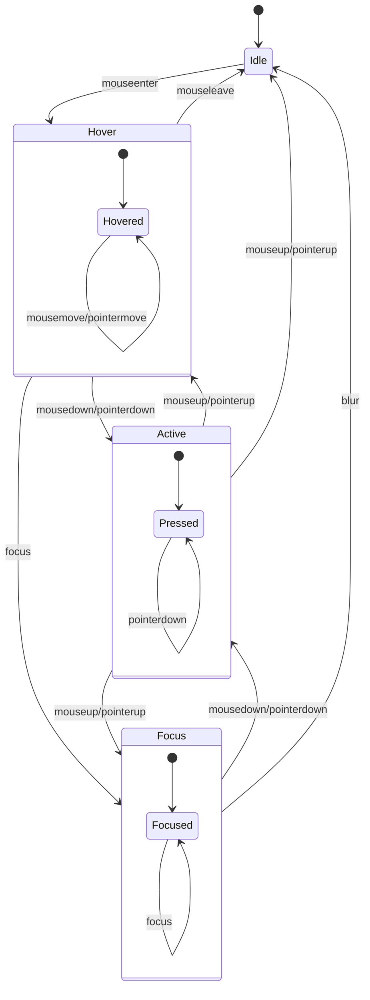
```mermaid
stateDiagram-v2
[*] --> Idle
Idle --> Hover : mouseenter
Hover --> Active : mousedown/pointerdown
Active --> Hover : mouseup/pointerup
Hover --> Focus : focus
Focus --> Active : mousedown/pointerdown
Active --> Focus : mouseup/pointerup
Focus --> Idle : blur
Hover --> Idle : mouseleave
Active --> Idle : mouseup/pointerup
state Hover {
[*] --> Hovered
Hovered --> Hovered : mousemove/pointermove
}
state Active {
[*] --> Pressed
Pressed --> Pressed : pointerdown
}
state Focus {
[*] --> Focused
Focused --> Focused : focus
}
```

### Enhanced Focusable Element Detection

The system identifies focusable elements based on comprehensive SVG specifications:

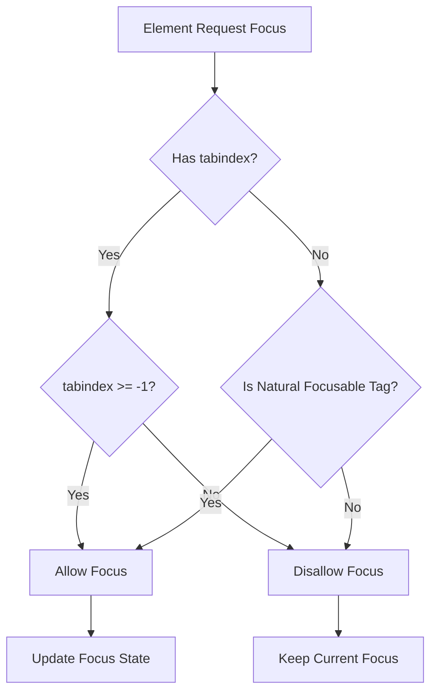
```mermaid
flowchart TD
A[Element Request Focus] --> B{Has tabindex?}
B --> |Yes| C{tabindex >= -1?}
B --> |No| D{Is Natural Focusable Tag?}
C --> |Yes| E[Allow Focus]
C --> |No| F[Disallow Focus]
D --> |Yes| E
D --> |No| F
E --> G[Update Focus State]
F --> H[Keep Current Focus]
```

**Diagram sources**
- [svg_dom.dart:401-419](file://lib/src/animation/svg_dom.dart#L401-L419)

**Section sources**
- [svg_dom.dart:299-419](file://lib/src/animation/svg_dom.dart#L299-L419)

## Event Timing and Animation Integration

The event system integrates tightly with the SMIL animation timeline with comprehensive gesture support:

### Enhanced Event-Based Animation Activation

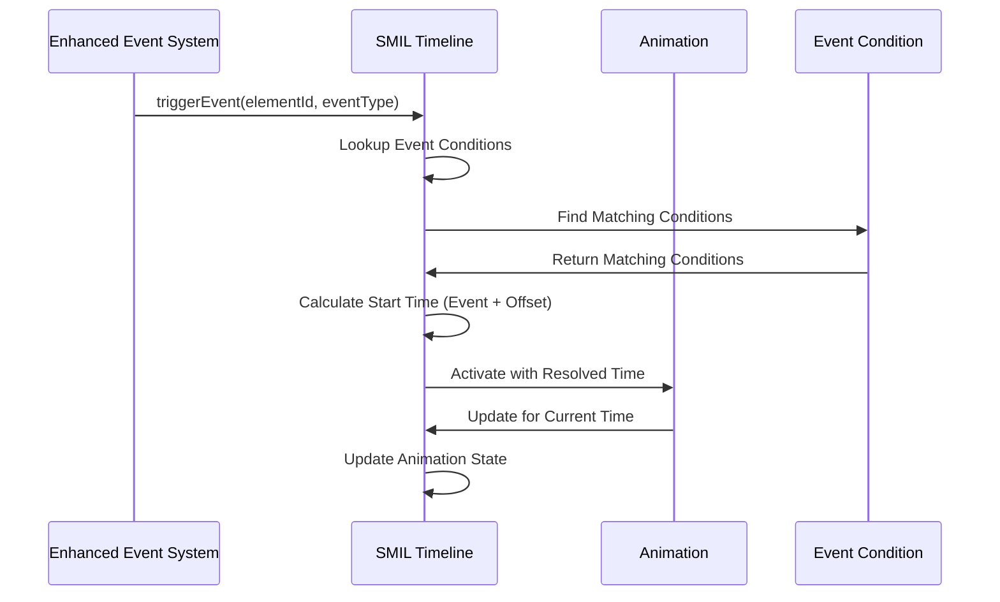
```mermaid
sequenceDiagram
participant Event as Enhanced Event System
participant Timeline as SMIL Timeline
participant Animation as Animation
participant Condition as Event Condition
Event->>Timeline : triggerEvent(elementId, eventType)
Timeline->>Timeline : Lookup Event Conditions
Timeline->>Condition : Find Matching Conditions
Condition->>Timeline : Return Matching Conditions
Timeline->>Timeline : Calculate Start Time (Event + Offset)
Timeline->>Animation : Activate with Resolved Time
Animation->>Timeline : Update for Current Time
Timeline->>Timeline : Update Animation State
```

**Diagram sources**
- [animated_svg_picture_events.dart:68-102](file://lib/src/animation/animated_svg_picture_events.dart#L68-L102)

### Enhanced Event Timing Scenarios

The system supports various event timing patterns with comprehensive gesture support:

| Event Pattern | Description | Behavior | Examples |
|---------------|-------------|----------|----------|
| `click` | Direct event trigger | Starts immediately at event time | `click` |
| `click+1s` | Delayed event | Starts 1 second after event | `click+1s` |
| `click-500ms` | Early event | Starts 500ms before event | `click-500ms` |
| `click; 2s` | Multiple conditions | Starts when either event occurs or 2s elapses | `click; 2s` |
| `anim.end` | Animation-based timing | Starts when referenced animation ends | `anim.end` |
| `pointerdown` | Pointer event timing | Starts on pointer down | `pointerdown` |
| `longpress` | Gesture timing | Starts on long press | `longpress` |
| `panstart` | Pan gesture timing | Starts on pan begin | `panstart` |
| `panend` | Pan end timing | Starts on pan end | `panend` |

**Section sources**
- [animated_svg_picture_events.dart:61-102](file://lib/src/animation/animated_svg_picture_events.dart#L61-L102)

## Testing and Validation

The event system includes comprehensive test coverage validating all aspects of the enhanced implementation:

### Enhanced Event Flow Testing

The test suite validates the complete event flow through all phases with comprehensive gesture support:

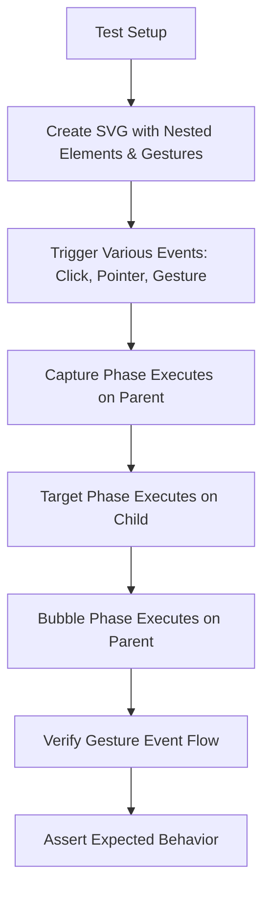
```mermaid
flowchart TD
A[Test Setup] --> B[Create SVG with Nested Elements & Gestures]
B --> C[Trigger Various Events: Click, Pointer, Gesture]
C --> D[Capture Phase Executes on Parent]
D --> E[Target Phase Executes on Child]
E --> F[Bubble Phase Executes on Parent]
F --> G[Verify Gesture Event Flow]
G --> H[Assert Expected Behavior]
```

**Diagram sources**
- [event_system_test.dart:13-128](file://test/animation/event_system_test.dart#L13-L128)

### Comprehensive Event Model Validation

The system includes extensive validation of enhanced event model compliance:

| Test Category | Coverage | Validation Method |
|---------------|----------|-------------------|
| Event Phases | Capture, Target, Bubble | Visual verification through animation |
| Event Propagation | stopPropagation, stopImmediatePropagation | Direct assertion of handler execution |
| Event Prevention | preventDefault | Verification of default action suppression |
| Event Retargeting | `<use>` shadow DOM | Validation of event target modification |
| Pointer Events | All SVG modes | Hit testing validation across pointer modes |
| Gesture Events | All gesture types | Gesture recognition and event flow validation |
| Event Tracing | All categories | Trace event emission and categorization |
| Focus Management | :hover, :active, :focus | State verification through pseudo-class checks |
| Precision Hit Testing | ClipPath, Mask, Text, Markers | Accuracy validation through visual testing |
| **Enhanced** | **Mask Type Support** | **Luminance alpha computation validation** |
| **Enhanced** | **ClipPath Precision** | **Coordinate transformation accuracy** |

### Enhanced Mask Type Testing

**Updated** The system includes comprehensive testing for mask type support:

#### Luminance Mask Testing
- Validation of RGB to luminance conversion using ITU-R BT.709 coefficients
- Testing of mask-type CSS properties and mask-mode specifications
- Verification of proper mask composition with alpha blending
- Testing of mask inheritance through group elements

#### ClipPath Precision Testing
- Validation of objectBoundingBox units handling
- Testing of nested clipPath references with recursion protection
- Verification of coordinate transformation accuracy
- Testing of clipPath-on-clipPath composition

**Section sources**
- [event_system_test.dart:1-732](file://test/animation/event_system_test.dart#L1-L732)
- [hit_test_precision_test.dart:1-1006](file://test/animation/hit_test_precision_test.dart#L1-L1006)
- [advanced_mask_semantics_test.dart:624-654](file://test/animation/advanced_mask_semantics_test.dart#L624-L654)
- [clip_mask_advanced_composition_test.dart:166-255](file://test/animation/clip_mask_advanced_composition_test.dart#L166-L255)

## Performance Considerations

The event system is optimized for performance through several mechanisms with enhanced pointer and gesture support:

### Enhanced Event Path Caching

The system caches event paths to avoid repeated computation during event dispatch, particularly beneficial for complex SVG documents with deep hierarchies and shadow DOM structures.

### Optimized Listener Management

Event listeners are organized by type and phase with enhanced pointer event filtering, allowing for efficient dispatch and minimizing unnecessary listener invocations.

### Advanced Memory Management

The system properly manages event object lifecycle, resetting internal state after each event dispatch to prevent memory leaks, with specialized cleanup for gesture events.

### Enhanced Hit Testing Efficiency

The hit testing engine uses spatial indexing, early termination, and shadow DOM-aware algorithms to minimize the number of elements that need detailed geometric testing.

### Gesture Recognition Optimization

The gesture recognition system uses efficient algorithms for pointer tracking and gesture detection, with optimized event dispatch for gesture sequences.

### Precision Testing Optimization

The precision hit testing system uses optimized algorithms for complex geometries, with caching mechanisms for frequently accessed elements and paths.

### **Enhanced** Mask Type Processing Optimization

**Updated** The system optimizes mask type processing with efficient luminance computation and caching mechanisms for mask content.

**Section sources**
- [animated_svg_painter_clip_mask_advanced.dart:68-88](file://lib/src/animation/animated_svg_painter_clip_mask_advanced.dart#L68-L88)

## Troubleshooting Guide

### Common Issues and Solutions

**Issue: Events not firing on expected elements**
- Verify element has proper ID attribute for event targeting
- Check pointer-events property is not set to 'none'
- Ensure element is not hidden or clipped
- Verify element is not disabled by gesture recognition logic

**Issue: Event propagation not working correctly**
- Confirm event bubbles property matches expected behavior
- Verify stopPropagation is not being called unintentionally
- Check event capture vs bubble phase listener registration
- Validate W3C DOM event flow compliance

**Issue: `<use>` shadow DOM events not retargeting properly**
- Ensure referenced element has proper ID for retargeting
- Verify use element has ID for shadow host identification
- Check nested `<use>` element recursion depth limits
- Validate shadow DOM path construction

**Issue: Gesture events not triggering**
- Verify gesture recognition thresholds are appropriate
- Check pointer event compatibility with gesture recognition
- Ensure element has proper pointer-events configuration
- Validate gesture event timing and sequencing

**Issue: Animation timing not responding to events**
- Verify event condition syntax in animation begin attribute
- Check event type matches animation's expected event
- Ensure element ID in event condition matches actual element ID
- Validate gesture event type compatibility with SMIL

**Issue: Event tracing not working**
- Verify onTrace callback is properly configured
- Check trace level settings for desired verbosity
- Ensure trace categories are properly categorized
- Validate trace data payload formatting

**Issue: Precision hit testing not working correctly**
- Verify element has proper geometry for precision testing
- Check clipPath and mask definitions are valid
- Ensure text elements have proper font and positioning
- Validate marker definitions and orientations

**Issue: Mask type not working correctly**
- Verify mask-type CSS properties are properly formatted
- Check mask-mode property compatibility with mask-type
- Ensure mask element has proper type attribute
- Validate luminance alpha computation accuracy

**Issue: ClipPath precision issues**
- Verify clipPathUnits attribute is properly set
- Check nested clipPath references for recursion
- Ensure coordinate transformations are accurate
- Validate objectBoundingBox calculations

**Section sources**
- [svg_event_dispatcher.dart:334-375](file://lib/src/animation/svg_event_dispatcher.dart#L334-L375)
- [animated_svg_picture_pointer_events.dart:1-208](file://lib/src/animation/animated_svg_picture_pointer_events.dart#L1-L208)

## Conclusion

The Flutter SVG Event System provides a comprehensive, standards-compliant implementation of the W3C DOM Event model tailored specifically for SVG graphics. The system successfully bridges the gap between Flutter's gesture detection and web standards for event handling, enabling developers to create rich, interactive SVG experiences.

**Updated** Key enhancements include comprehensive W3C DOM pointer event model compliance, advanced precision hit testing for complex SVG elements, gesture recognition system with unified event handling, enhanced event tracing capabilities, full shadow DOM support with proper event retargeting, and most importantly, comprehensive mask hit testing with luminance alpha support and improved clipPath precision.

The system's integration with the SMIL animation timeline enables sophisticated event-driven animation control, making it possible to create complex interactive SVG experiences that respond naturally to user input while maintaining predictable behavior and performance characteristics.

**Key Strengths:**
- **Standards Compliance**: Full adherence to W3C DOM Event specification with enhanced pointer support
- **Comprehensive Gesture Support**: Unified gesture recognition with longpress, pan, and pointer events
- **Advanced Precision Testing**: Sophisticated hit testing for clipPath, mask, text, and marker elements
- **Enhanced Shadow DOM Handling**: Proper event retargeting with comprehensive context tracking
- **Advanced Debugging**: Complete event tracing system with categorized logging
- **Performance Optimization**: Efficient event dispatch with caching and gesture optimization
- **Robust Testing**: Extensive test suite validating all aspects of the enhanced implementation
- **Event Delegation**: Comprehensive event delegation with proper flow control
- ****Enhanced** Mask Type Support**: Comprehensive support for alpha and luminance mask types with precise opacity computation
- ****Improved** ClipPath Precision**: Enhanced coordinate transformation handling and nested reference support

The system continues to evolve with comprehensive support for modern web standards while maintaining backward compatibility and performance characteristics essential for production SVG applications.