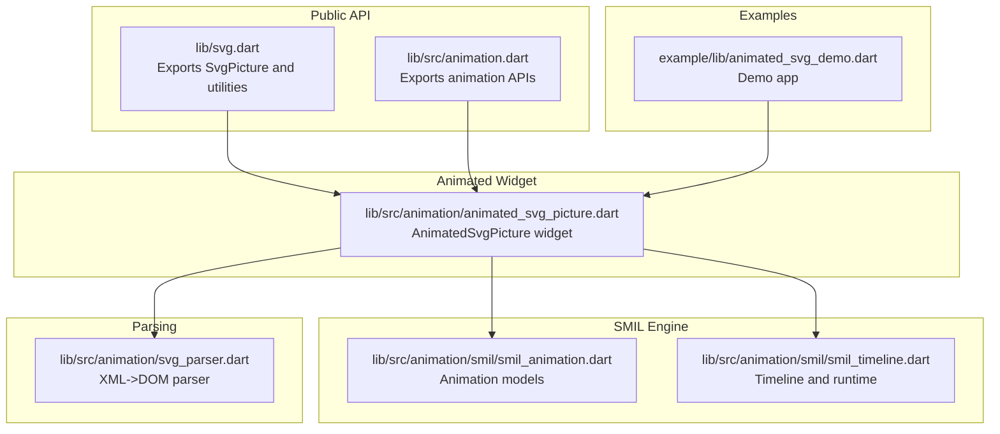
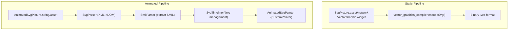
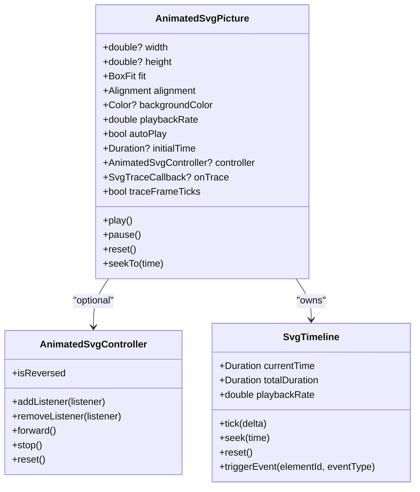
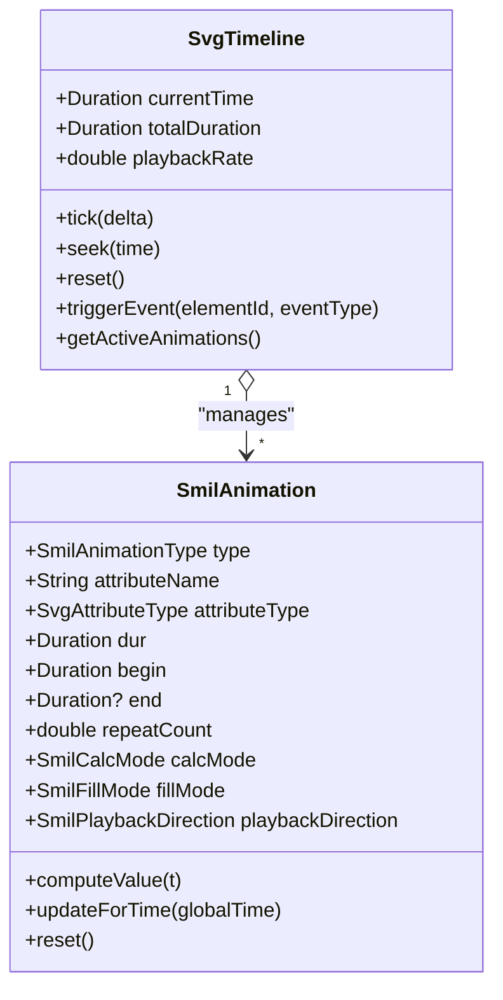
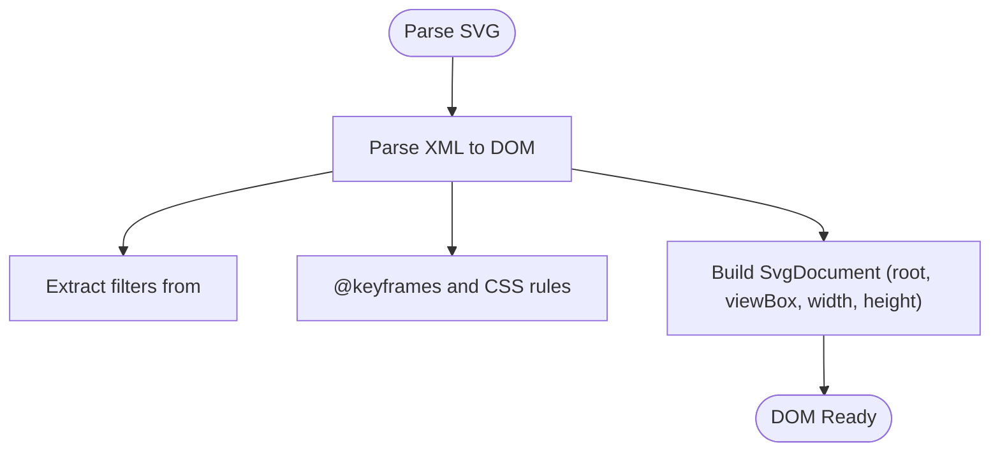
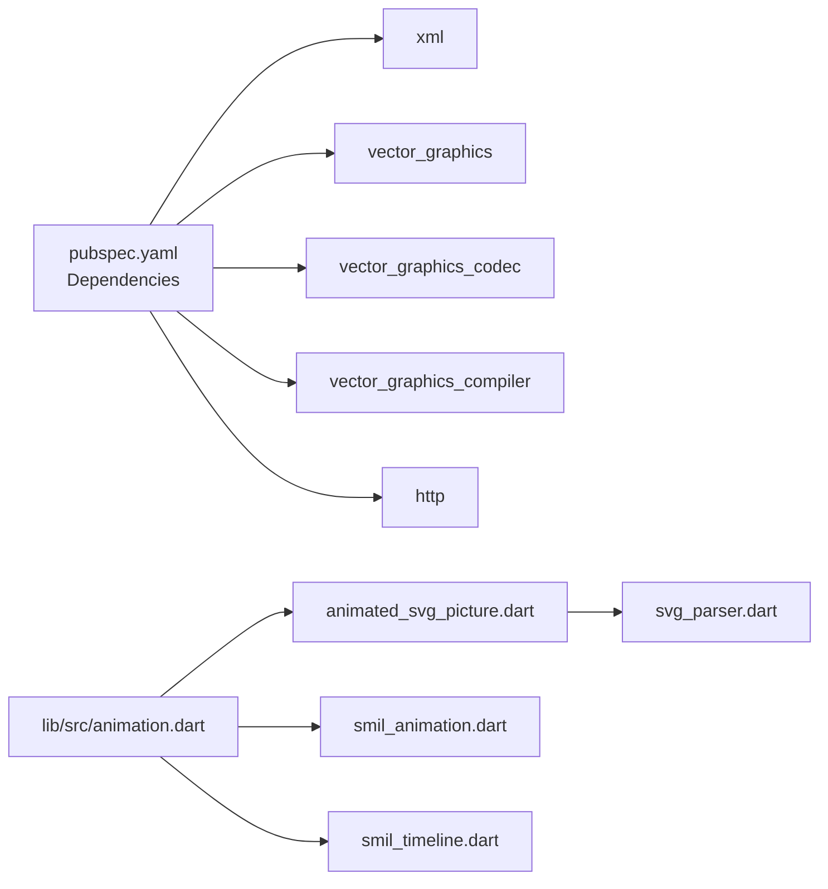

# Getting Started with Animated SVG

<cite>
**Referenced Files in This Document**
- [README.md](file://README.md)
- [pubspec.yaml](file://pubspec.yaml)
- [lib/svg.dart](file://lib/svg.dart)
- [lib/src/animation.dart](file://lib/src/animation.dart)
- [lib/src/animation/animated_svg_picture.dart](file://lib/src/animation/animated_svg_picture.dart)
- [lib/src/animation/smil/smil_animation.dart](file://lib/src/animation/smil/smil_animation.dart)
- [lib/src/animation/smil/smil_timeline.dart](file://lib/src/animation/smil/smil_timeline.dart)
- [lib/src/animation/svg_parser.dart](file://lib/src/animation/svg_parser.dart)
- [ANIMATION.md](file://ANIMATION.md)
- [ARCHITECTURE.md](file://ARCHITECTURE.md)
- [example/lib/animated_svg_demo.dart](file://example/lib/animated_svg_demo.dart)
</cite>

## Table of Contents
1. [Introduction](#introduction)
2. [Project Structure](#project-structure)
3. [Core Components](#core-components)
4. [Architecture Overview](#architecture-overview)
5. [Detailed Component Analysis](#detailed-component-analysis)
6. [Dependency Analysis](#dependency-analysis)
7. [Performance Considerations](#performance-considerations)
8. [Troubleshooting Guide](#troubleshooting-guide)
9. [Conclusion](#conclusion)
10. [Appendices](#appendices)

## Introduction
This guide helps you get started with animated SVG support in Flutter using the experimental SMIL animation pipeline. You will learn the fundamentals of SMIL animations, how AnimatedSvgPicture works, and how to create and control basic animations. You will also find step-by-step tutorials for loading animated SVGs from different sources and practical examples for movement, scaling, rotation, and color changes.

## Project Structure
The animated SVG feature lives in the animation module and integrates with the broader SVG rendering ecosystem. Key areas:
- Public exports and entry points for animation features
- AnimatedSvgPicture widget and its state machine
- SMIL engine: animation models, timelines, and timing
- DOM parser for preserving SVG structure and extracting animations
- Example app showcasing common animation patterns

**Diagram sources**
- [lib/svg.dart:1-627](file://lib/svg.dart#L1-L627)
- [lib/src/animation.dart:1-31](file://lib/src/animation.dart#L1-L31)
- [lib/src/animation/animated_svg_picture.dart:1-359](file://lib/src/animation/animated_svg_picture.dart#L1-L359)
- [lib/src/animation/smil/smil_animation.dart:1-453](file://lib/src/animation/smil/smil_animation.dart#L1-L453)
- [lib/src/animation/smil/smil_timeline.dart:1-256](file://lib/src/animation/smil/smil_timeline.dart#L1-L256)
- [lib/src/animation/svg_parser.dart:1-65](file://lib/src/animation/svg_parser.dart#L1-L65)
- [example/lib/animated_svg_demo.dart:1-294](file://example/lib/animated_svg_demo.dart#L1-L294)

**Section sources**
- [README.md:1-227](file://README.md#L1-L227)
- [pubspec.yaml:1-28](file://pubspec.yaml#L1-L28)
- [lib/svg.dart:1-627](file://lib/svg.dart#L1-L627)
- [lib/src/animation.dart:1-31](file://lib/src/animation.dart#L1-L31)
- [lib/src/animation/animated_svg_picture.dart:1-359](file://lib/src/animation/animated_svg_picture.dart#L1-L359)
- [lib/src/animation/smil/smil_animation.dart:1-453](file://lib/src/animation/smil/smil_animation.dart#L1-L453)
- [lib/src/animation/smil/smil_timeline.dart:1-256](file://lib/src/animation/smil/smil_timeline.dart#L1-L256)
- [lib/src/animation/svg_parser.dart:1-65](file://lib/src/animation/svg_parser.dart#L1-L65)
- [ANIMATION.md:1-229](file://ANIMATION.md#L1-L229)
- [ARCHITECTURE.md:1-297](file://ARCHITECTURE.md#L1-L297)
- [example/lib/animated_svg_demo.dart:1-294](file://example/lib/animated_svg_demo.dart#L1-L294)

## Core Components
- AnimatedSvgPicture: A StatefulWidget that parses an SVG string or asset, detects SMIL animations, builds a DOM, initializes a timeline, and renders via a CustomPainter. It exposes playback controls (play, pause, reset, seek) and supports programmatic control via AnimatedSvgController.
- SMIL Animation Model: Defines animation types (animate, animateTransform, animateMotion, set, animateColor), timing (duration, begin, end, repeatCount, repeatDur), interpolation modes (linear, discrete, spline, paced), and behaviors (fill, additive, accumulate).
- Timeline: Manages global time, playback rate, event-based triggers, and resolves syncbase timing dependencies. It updates active animations and applies computed values to DOM attributes.
- Parser: Converts SVG XML into a DOM tree, preserving element identity and structure needed for animation, and extracts CSS keyframes and selectors.

Typical usage patterns:
- Load from string, asset, network, file, or bytes
- Control playback rate, autoPlay, initialTime
- Programmatic control via AnimatedSvgController
- Event-driven animations (e.g., click, hover)

**Section sources**
- [lib/src/animation/animated_svg_picture.dart:108-295](file://lib/src/animation/animated_svg_picture.dart#L108-L295)
- [lib/src/animation/smil/smil_animation.dart:80-453](file://lib/src/animation/smil/smil_animation.dart#L80-L453)
- [lib/src/animation/smil/smil_timeline.dart:20-256](file://lib/src/animation/smil/smil_timeline.dart#L20-L256)
- [lib/src/animation/svg_parser.dart:27-65](file://lib/src/animation/svg_parser.dart#L27-L65)

## Architecture Overview
Animated SVG uses a dual-pipeline design:
- Static pipeline: vector_graphics-based, optimized binary format, fast rendering, no animations.
- Animated pipeline: DOM-based, preserves structure and SMIL elements, supports runtime animation control.

**Diagram sources**
- [ARCHITECTURE.md:6-74](file://ARCHITECTURE.md#L6-L74)
- [ARCHITECTURE.md:32-58](file://ARCHITECTURE.md#L32-L58)

**Section sources**
- [ARCHITECTURE.md:6-74](file://ARCHITECTURE.md#L6-L74)
- [ARCHITECTURE.md:32-58](file://ARCHITECTURE.md#L32-L58)

## Detailed Component Analysis

### AnimatedSvgPicture Widget
AnimatedSvgPicture is the primary entry point for animated SVGs. It:
- Parses the SVG into a DOM
- Detects SMIL animations and constructs a timeline
- Uses an AnimationController (when autoPlay is enabled) or accepts a user-provided AnimatedSvgController
- Renders via AnimatedSvgPainter
- Supports gesture-based event triggering and hit testing for interactive animations

**Diagram sources**
- [lib/src/animation/animated_svg_picture.dart:108-295](file://lib/src/animation/animated_svg_picture.dart#L108-L295)
- [lib/src/animation/smil/smil_timeline.dart:20-256](file://lib/src/animation/smil/smil_timeline.dart#L20-L256)

**Section sources**
- [lib/src/animation/animated_svg_picture.dart:108-295](file://lib/src/animation/animated_svg_picture.dart#L108-L295)

### SMIL Animation Model and Timeline
The SMIL engine defines animation types, timing, interpolation, and runtime behavior. The timeline advances time, resolves dependencies (including event-based and syncbase timing), and applies values to DOM attributes.

**Diagram sources**
- [lib/src/animation/smil/smil_animation.dart:80-453](file://lib/src/animation/smil/smil_animation.dart#L80-L453)
- [lib/src/animation/smil/smil_timeline.dart:20-256](file://lib/src/animation/smil/smil_timeline.dart#L20-L256)

**Section sources**
- [lib/src/animation/smil/smil_animation.dart:80-453](file://lib/src/animation/smil/smil_animation.dart#L80-L453)
- [lib/src/animation/smil/smil_timeline.dart:20-256](file://lib/src/animation/smil/smil_timeline.dart#L20-L256)

### Parsing and DOM Preservation
The parser converts SVG XML into a DOM tree, preserving element identity and structure. It also extracts CSS keyframes and selector rules, enabling CSS animation interoperability.

**Diagram sources**
- [lib/src/animation/svg_parser.dart:27-65](file://lib/src/animation/svg_parser.dart#L27-L65)

**Section sources**
- [lib/src/animation/svg_parser.dart:27-65](file://lib/src/animation/svg_parser.dart#L27-L65)

### Basic Animation Creation Patterns
- Movement: Animate numeric attributes like x, y, cx, cy, width, height.
- Scaling: Animate transform scale or numeric attributes width/height.
- Rotation: Use animateTransform with type="rotate".
- Color changes: Animate fill, stroke, or related color attributes with values/keyTimes for keyframe sequences.
- Path morphing: Animate the d attribute between compatible path data.

Practical examples are available in the demo app and the animation guide.

**Section sources**
- [ANIMATION.md:67-148](file://ANIMATION.md#L67-L148)
- [example/lib/animated_svg_demo.dart:38-251](file://example/lib/animated_svg_demo.dart#L38-L251)

## Dependency Analysis
- External dependencies: xml (for parsing), vector_graphics and related codec/compiler packages (for static pipeline), http (for network loading).
- Internal dependencies: animation module exports, parser, SMIL models, and timeline.

**Diagram sources**
- [pubspec.yaml:12-20](file://pubspec.yaml#L12-L20)
- [lib/src/animation.dart:21-31](file://lib/src/animation.dart#L21-L31)

**Section sources**
- [pubspec.yaml:12-20](file://pubspec.yaml#L12-L20)
- [lib/src/animation.dart:21-31](file://lib/src/animation.dart#L21-L31)

## Performance Considerations
- The animated pipeline is slower than the static pipeline due to DOM parsing and runtime animation evaluation.
- Performance strategies include caching static subtrees, dirty tracking, and path normalization.
- Baseline metrics indicate sub-millisecond path interpolation and frequent motion updates within acceptable thresholds.

**Section sources**
- [ARCHITECTURE.md:174-193](file://ARCHITECTURE.md#L174-L193)
- [ANIMATION.md:172-178](file://ANIMATION.md#L172-L178)

## Troubleshooting Guide
Common setup and usage issues:
- Missing or invalid SVG: Ensure the SVG string or asset path is valid. The widget gracefully handles missing assets and logs errors in debug mode.
- Layout instability: Specify width and height or constrain the widget to avoid layout shifts during load.
- Network permissions: For network assets, ensure appropriate permissions and headers if required.
- AutoPlay behavior: When autoPlay is false, no AnimationController is created; use controller methods to start playback.
- CSS animations: CSS animation interoperability is implemented at baseline; advanced edge cases may differ from browsers.

**Section sources**
- [README.md:80-106](file://README.md#L80-L106)
- [lib/src/animation/animated_svg_picture.dart:178-220](file://lib/src/animation/animated_svg_picture.dart#L178-L220)
- [ANIMATION.md:207-214](file://ANIMATION.md#L207-L214)

## Conclusion
You now have the essentials to start animating SVGs in Flutter using SMIL. Use AnimatedSvgPicture to load animated SVGs from strings, assets, networks, files, or bytes. Explore the demo app and animation guide for practical examples, and leverage the SMIL model and timeline for precise control over timing, interpolation, and playback.

## Appendices

### Step-by-Step Tutorial: Create Your First Animated SVG
- Prepare an SVG with a SMIL animation element (e.g., animate or animateTransform).
- Import the animation module and use AnimatedSvgPicture.string with width and height.
- Optionally set backgroundColor, playbackRate, autoPlay, or provide an AnimatedSvgController.
- Run the example app to see interactive demos and FPS monitoring.

**Section sources**
- [ANIMATION.md:5-20](file://ANIMATION.md#L5-L20)
- [example/lib/animated_svg_demo.dart:11-294](file://example/lib/animated_svg_demo.dart#L11-L294)

### Loading Animated SVGs from Different Sources
- From string: AnimatedSvgPicture.string(svgString, width, height)
- From asset: AnimatedSvgPicture.asset(assetName, width, height)
- From network: AnimatedSvgPicture.network(url, width, height)
- From file: AnimatedSvgPicture.file(file, width, height)
- From bytes: AnimatedSvgPicture.memory(bytes, width, height)

**Section sources**
- [lib/src/animation/animated_svg_picture.dart:110-447](file://lib/src/animation/animated_svg_picture.dart#L110-L447)

### Basic Animation Controls
- Playback: play(), pause(), reset(), seekTo(time)
- Programmatic control: Provide AnimatedSvgController and listen for updates
- Event-driven: Use timeline.triggerEvent(elementId, eventType) for click/hover animations

**Section sources**
- [lib/src/animation/animated_svg_picture.dart:271-295](file://lib/src/animation/animated_svg_picture.dart#L271-L295)
- [lib/src/animation/smil/smil_timeline.dart:128-158](file://lib/src/animation/smil/smil_timeline.dart#L128-L158)

### Practical Animation Scenarios
- Movement: Animate x/y or cx/cy
- Scaling: Animate width/height or use transform scale
- Rotation: animateTransform type="rotate"
- Color changes: Animate fill/stroke with values/keyTimes
- Path morphing: Animate d attribute between compatible paths

**Section sources**
- [ANIMATION.md:69-148](file://ANIMATION.md#L69-L148)
- [example/lib/animated_svg_demo.dart:38-251](file://example/lib/animated_svg_demo.dart#L38-L251)