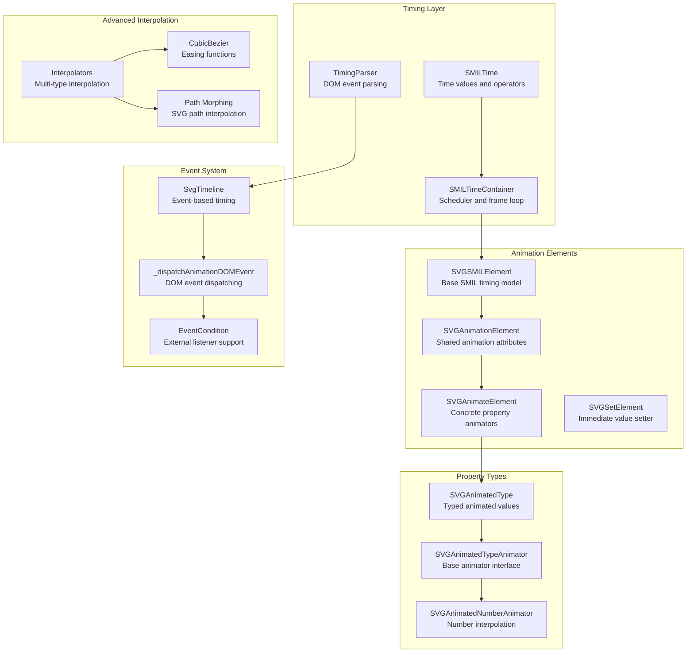
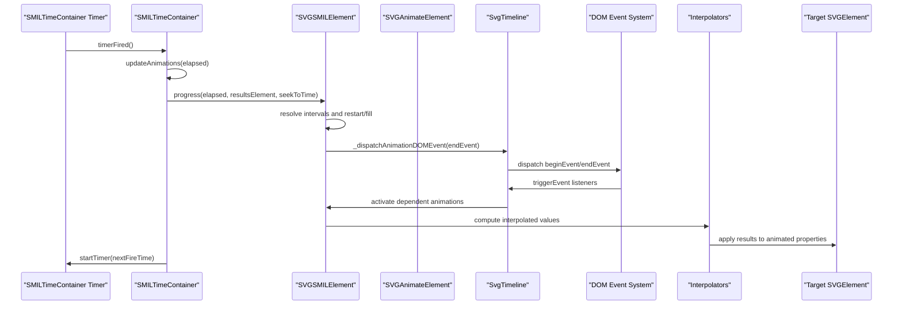
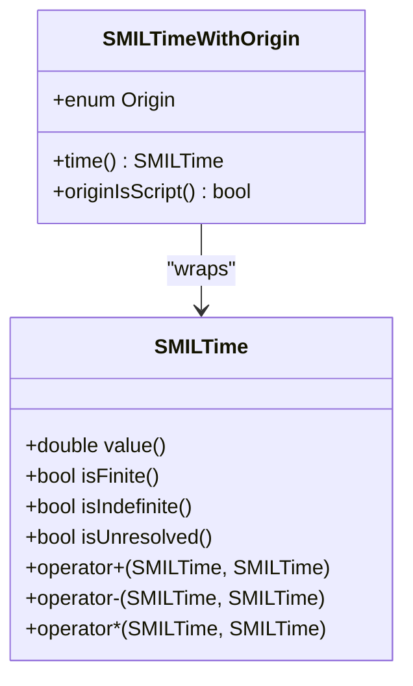
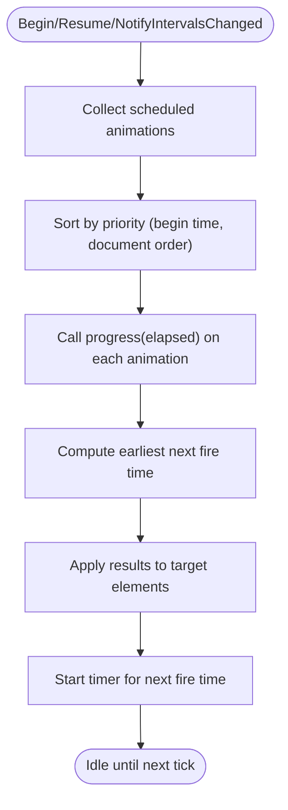
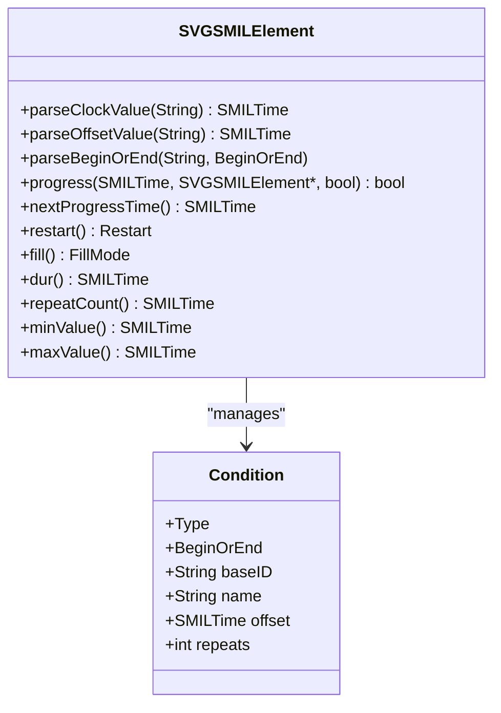
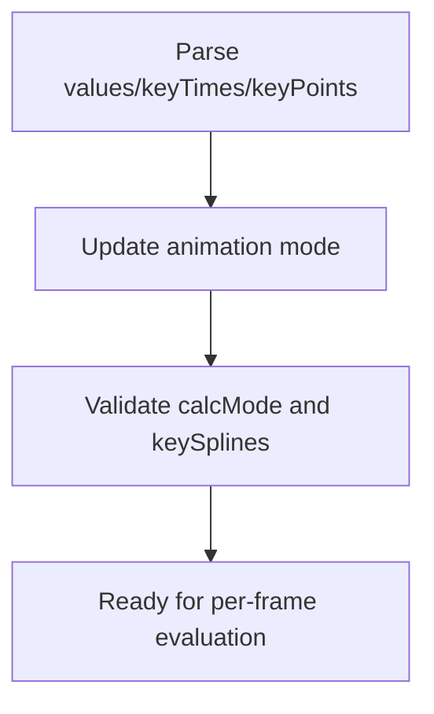
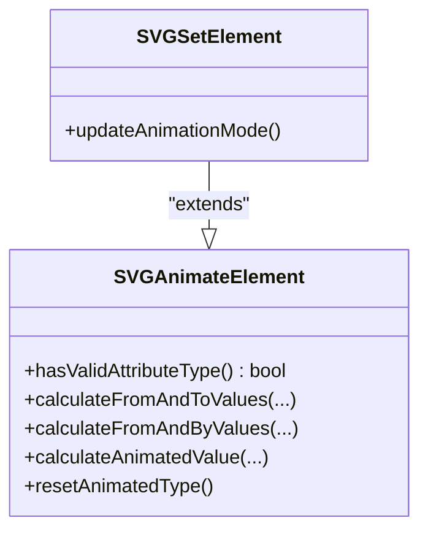
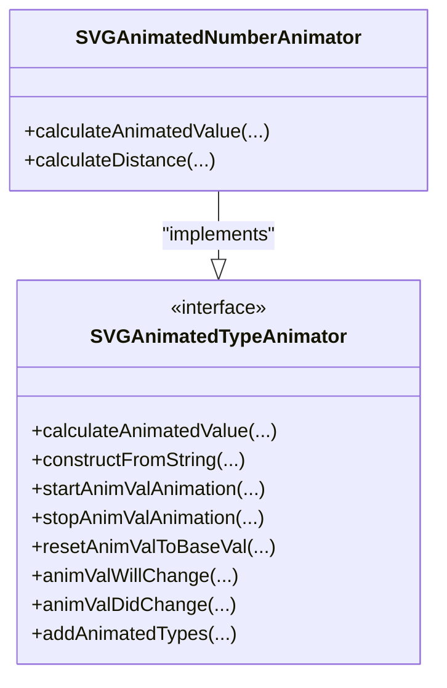
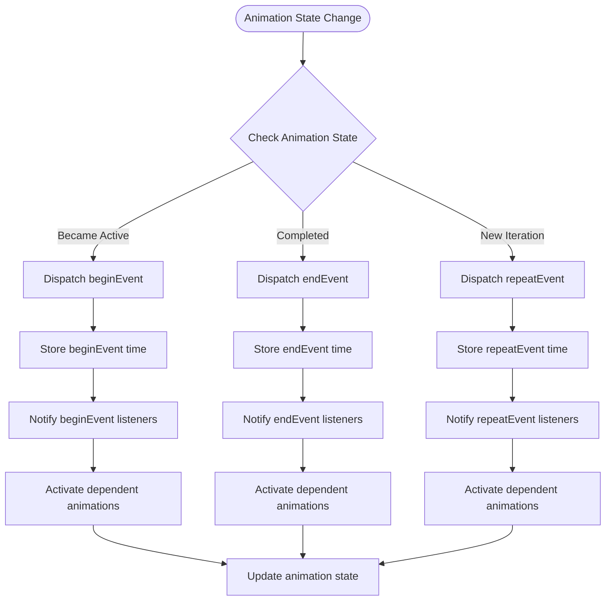
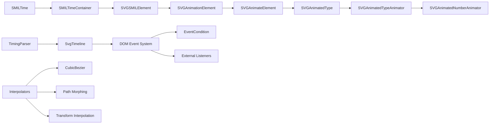

# Improved SMIL Animation Runtime

<cite>
**Referenced Files in This Document**
- [SMILTime.cpp](file://blink-b87d44f-Source-core-svg/animation/SMILTime.cpp)
- [SMILTime.h](file://blink-b87d44f-Source-core-svg/animation/SMILTime.h)
- [SMILTimeContainer.cpp](file://blink-b87d44f-Source-core-svg/animation/SMILTimeContainer.cpp)
- [SMILTimeContainer.h](file://blink-b87d44f-Source-core-svg/animation/SMILTimeContainer.h)
- [SVGSMILElement.cpp](file://blink-b87d44f-Source-core-svg/animation/SVGSMILElement.cpp)
- [SVGSMILElement.h](file://blink-b87d44f-Source-core-svg/animation/SVGSMILElement.h)
- [SVGAnimationElement.cpp](file://blink-b87d44f-Source-core-svg/SVGAnimationElement.cpp)
- [SVGAnimateElement.cpp](file://blink-b87d44f-Source-core-svg/SVGAnimateElement.cpp)
- [SVGSetElement.cpp](file://blink-b87d44f-Source-core-svg/SVGSetElement.cpp)
- [SVGAnimatedNumber.cpp](file://blink-b87d44f-Source-core-svg/SVGAnimatedNumber.cpp)
- [smil_test.dart](file://test/animation/smil_test.dart)
- [smil_timeline.dart](file://lib/src/animation/smil/smil_timeline.dart)
- [smil_timeline_runtime.dart](file://lib/src/animation/smil/smil_timeline_runtime.dart)
- [timing_parser.dart](file://lib/src/animation/smil/timing_parser.dart)
- [timing_condition.dart](file://lib/src/animation/smil/timing_condition.dart)
- [smil_animation.dart](file://lib/src/animation/smil/smil_animation.dart)
- [smil_animation_value_computation.dart](file://lib/src/animation/smil/smil_animation_value_computation.dart)
- [smil_animation_curves.dart](file://lib/src/animation/smil/smil_animation_curves.dart)
- [interpolators.dart](file://lib/src/animation/smil/interpolators.dart)
</cite>

## Update Summary
**Changes Made**
- Enhanced SMIL animation runtime with improved timeline synchronization and DOM event dispatching
- Added comprehensive event model handling with beginEvent, endEvent, and repeatEvent support
- Implemented advanced animation value computation for complex interpolations including path morphing and transform interpolation
- Integrated enhanced timing parser with DOM event form support (beginEvent, endEvent, repeatEvent)
- Added sophisticated animation sandwich model for priority resolution and additive composition

## Table of Contents
1. [Introduction](#introduction)
2. [Project Structure](#project-structure)
3. [Core Components](#core-components)
4. [Architecture Overview](#architecture-overview)
5. [Enhanced Event System](#enhanced-event-system)
6. [Advanced Animation Value Computation](#advanced-animation-value-computation)
7. [Detailed Component Analysis](#detailed-component-analysis)
8. [DOM Event Dispatching](#dom-event-dispatching)
9. [Dependency Analysis](#dependency-analysis)
10. [Performance Considerations](#performance-considerations)
11. [Troubleshooting Guide](#troubleshooting-guide)
12. [Conclusion](#conclusion)

## Introduction
This document describes the significantly enhanced SMIL (Synchronized Multimedia Integration Language) animation runtime implemented in the Blink engine core and integrated with the Flutter SVG package. The runtime provides precise timing control, flexible begin/end conditions, repeat semantics, and **comprehensive DOM event dispatching capabilities** including beginEvent, endEvent, and repeatEvent triggering for external listeners and event-driven animations. It supports multiple animation elements (<animate>, <set>, <animateMotion>, <animateTransform>, <animateColor>) and integrates with the broader SVG rendering pipeline. The enhanced runtime now features advanced animation value computation for complex interpolations, improved timeline synchronization, and sophisticated event model handling.

## Project Structure
The SMIL animation runtime spans several core modules with enhanced event handling and advanced interpolation capabilities:
- Timing primitives and containers: SMILTime, SMILTimeContainer
- Animation element base and concrete implementations: SVGSMILElement, SVGAnimationElement, SVGAnimateElement, SVGSetElement
- **Enhanced timing system**: Event-based conditions, DOM event dispatching, external listener support
- **Advanced property animation infrastructure**: SVGAnimatedType, SVGAnimatedTypeAnimator, specific animators (e.g., SVGAnimatedNumberAnimator)
- **Complex interpolation system**: Path morphing, transform interpolation, color interpolation, and advanced easing functions
- **Test coverage**: Dart-based tests for interpolators, SMIL animation logic, event-driven scenarios, and edge cases

**Diagram sources**
- [SMILTime.h:34-55](file://blink-b87d44f-Source-core-svg/animation/SMILTime.h#L34-L55)
- [SMILTimeContainer.h:45-98](file://blink-b87d44f-Source-core-svg/animation/SMILTimeContainer.h#L45-L98)
- [SVGSMILElement.h:38-131](file://blink-b87d44f-Source-core-svg/animation/SVGSMILElement.h#L38-L131)
- [SVGAnimationElement.cpp:50-64](file://blink-b87d44f-Source-core-svg/SVGAnimationElement.cpp#L50-L64)
- [SVGAnimateElement.cpp:38-44](file://blink-b87d44f-Source-core-svg/SVGAnimateElement.cpp#L38-L44)
- [SVGSetElement.cpp:27-33](file://blink-b87d44f-Source-core-svg/SVGSetElement.cpp#L27-L33)
- [SVGAnimatedNumber.cpp:31-34](file://blink-b87d44f-Source-core-svg/SVGAnimatedNumber.cpp#L31-L34)
- [timing_parser.dart:96-147](file://lib/src/animation/smil/timing_parser.dart#L96-L147)
- [smil_timeline.dart:55-61](file://lib/src/animation/smil/smil_timeline.dart#L55-L61)
- [smil_timeline_runtime.dart:41-69](file://lib/src/animation/smil/smil_timeline_runtime.dart#L41-L69)
- [timing_condition.dart:126-161](file://lib/src/animation/smil/timing_condition.dart#L126-L161)
- [interpolators.dart:18-42](file://lib/src/animation/smil/interpolators.dart#L18-L42)
- [smil_animation_curves.dart:24-44](file://lib/src/animation/smil/smil_animation_curves.dart#L24-44)
- [smil_animation_value_computation.dart:80-100](file://lib/src/animation/smil/smil_animation_value_computation.dart#L80-L100)

**Section sources**
- [SMILTime.cpp:34-66](file://blink-b87d44f-Source-core-svg/animation/SMILTime.cpp#L34-L66)
- [SMILTimeContainer.cpp:40-53](file://blink-b87d44f-Source-core-svg/animation/SMILTimeContainer.cpp#L40-L53)
- [SVGSMILElement.cpp:109-131](file://blink-b87d44f-Source-core-svg/animation/SVGSMILElement.cpp#L109-L131)
- [SVGAnimationElement.cpp:50-64](file://blink-b87d44f-Source-core-svg/SVGAnimationElement.cpp#L50-L64)
- [SVGAnimateElement.cpp:38-44](file://blink-b87d44f-Source-core-svg/SVGAnimateElement.cpp#L38-L44)
- [SVGSetElement.cpp:27-33](file://blink-b87d44f-Source-core-svg/SVGSetElement.cpp#L27-L33)
- [SVGAnimatedNumber.cpp:31-34](file://blink-b87d44f-Source-core-svg/SVGAnimatedNumber.cpp#L31-L34)
- [timing_parser.dart:96-147](file://lib/src/animation/smil/timing_parser.dart#L96-L147)
- [smil_timeline.dart:55-61](file://lib/src/animation/smil/smil_timeline.dart#L55-L61)
- [smil_timeline_runtime.dart:41-69](file://lib/src/animation/smil/smil_timeline_runtime.dart#L41-L69)
- [timing_condition.dart:126-161](file://lib/src/animation/smil/timing_condition.dart#L126-L161)

## Core Components
- SMILTime: Encapsulates time values with special sentinel values for unresolved/indefinite, plus arithmetic operators for addition, subtraction, and multiplication (used for duration × repeatCount).
- SMILTimeContainer: Central scheduler managing active animations, priority sorting, and frame scheduling via a timer. Handles begin/pause/resume/setElapsed lifecycle.
- SVGSMILElement: Implements the SMIL interval timing model, parsing begin/end lists, resolving intervals, restart/fill semantics, and driving per-frame progress.
- SVGAnimationElement: Shared logic for animation attributes (values, keyTimes, keyPoints, keySplines, calcMode, from/to/by), and animation mode determination.
- SVGAnimateElement: Concrete element that selects and drives property animators for specific attribute types (numbers, colors, transforms, etc.).
- SVGSetElement: Specialization that sets target values immediately without interpolation.
- **Enhanced Timing System**: Event-based conditions, DOM event parsing, external listener registration, and event-driven animation activation.
- **Advanced Property Animators**: Typed animators (e.g., SVGAnimatedNumberAnimator) compute interpolated values and handle additive composition.
- **Complex Interpolation System**: Multi-type interpolators for numbers, colors, transforms, paths, and lists with advanced easing functions and path morphing capabilities.

**Section sources**
- [SMILTime.h:34-55](file://blink-b87d44f-Source-core-svg/animation/SMILTime.h#L34-L55)
- [SMILTimeContainer.h:45-98](file://blink-b87d44f-Source-core-svg/animation/SMILTimeContainer.h#L45-L98)
- [SVGSMILElement.h:38-131](file://blink-b87d44f-Source-core-svg/animation/SVGSMILElement.h#L38-L131)
- [SVGAnimationElement.cpp:151-168](file://blink-b87d44f-Source-core-svg/SVGAnimationElement.cpp#L151-L168)
- [SVGAnimateElement.cpp:55-62](file://blink-b87d44f-Source-core-svg/SVGAnimateElement.cpp#L55-L62)
- [SVGSetElement.cpp:27-33](file://blink-b87d44f-Source-core-svg/SVGSetElement.cpp#L27-L33)
- [SVGAnimatedNumber.cpp:31-34](file://blink-b87d44f-Source-core-svg/SVGAnimatedNumber.cpp#L31-L34)
- [timing_parser.dart:96-147](file://lib/src/animation/smil/timing_parser.dart#L96-L147)
- [smil_timeline.dart:55-61](file://lib/src/animation/smil/smil_timeline.dart#L55-L61)
- [smil_timeline_runtime.dart:41-69](file://lib/src/animation/smil/smil_timeline_runtime.dart#L41-L69)
- [timing_condition.dart:126-161](file://lib/src/animation/smil/timing_condition.dart#L126-L161)

## Architecture Overview
The runtime follows a layered design with enhanced event-driven capabilities and advanced interpolation systems:
- Timing layer: SMILTime and SMILTimeContainer manage absolute/relative time and scheduling.
- Element layer: SVGSMILElement encapsulates SMIL timing semantics and interval resolution.
- Property layer: SVGAnimationElement and SVGAnimateElement coordinate typed animated values and animators.
- **Event layer**: Enhanced timing system with DOM event dispatching and external listener support.
- **Interpolation layer**: Advanced interpolators handle complex value transformations including path morphing and transform interpolation.
- Application layer: Flutter integration consumes SMIL timing and applies computed values to render nodes.

**Diagram sources**
- [SMILTimeContainer.cpp:221-226](file://blink-b87d44f-Source-core-svg/animation/SMILTimeContainer.cpp#L221-L226)
- [SMILTimeContainer.cpp:262-329](file://blink-b87d44f-Source-core-svg/animation/SMILTimeContainer.cpp#L262-L329)
- [SVGSMILElement.cpp:91-93](file://blink-b87d44f-Source-core-svg/animation/SVGSMILElement.cpp#L91-L93)
- [SVGAnimateElement.cpp:96-137](file://blink-b87d44f-Source-core-svg/SVGAnimateElement.cpp#L96-L137)
- [smil_timeline_runtime.dart:41-69](file://lib/src/animation/smil/smil_timeline_runtime.dart#L41-L69)
- [smil_timeline.dart:128-158](file://lib/src/animation/smil/smil_timeline.dart#L128-L158)

## Enhanced Event System
The enhanced SMIL animation runtime now includes comprehensive DOM event dispatching capabilities:

### DOM Event Dispatching
- **beginEvent**: Dispatched when an animation becomes active
- **endEvent**: Dispatched when an animation completes and becomes inactive
- **repeatEvent**: Dispatched when an animation enters a new iteration
- **External listeners**: Other animations can listen for these events using syncbase conditions

### Event-Based Animation Activation
- Event conditions support DOM event forms: `id.beginEvent`, `id.endEvent`, `id.repeatEvent`
- External listeners can register for animation events using event keys
- Automatic activation of dependent animations when source animations trigger events

### Enhanced Timing Parser
- Supports DOM event forms in syncbase conditions
- Normalizes `beginEvent`/`endEvent`/`repeatEvent` to standard `begin`/`end`/`repeat` types
- Maintains backward compatibility with existing syncbase syntax

**Section sources**
- [smil_timeline_runtime.dart:41-69](file://lib/src/animation/smil/smil_timeline_runtime.dart#L41-L69)
- [smil_timeline_runtime.dart:71-121](file://lib/src/animation/smil/smil_timeline_runtime.dart#L71-L121)
- [smil_timeline.dart:128-158](file://lib/src/animation/smil/smil_timeline.dart#L128-L158)
- [timing_parser.dart:96-147](file://lib/src/animation/smil/timing_parser.dart#L96-L147)
- [timing_condition.dart:126-161](file://lib/src/animation/smil/timing_condition.dart#L126-L161)

## Advanced Animation Value Computation
The runtime now features sophisticated animation value computation for complex interpolations:

### Multi-Type Interpolation System
- **Numbers and Lengths**: Linear interpolation with proper unit handling
- **Colors**: RGB color space interpolation with alpha channel support
- **Transforms**: Matrix decomposition and recomposition for smooth transform animations
- **Paths**: Complex path morphing with command normalization and curve interpolation
- **Lists**: Point and dash array interpolation for complex SVG attributes

### Advanced Easing Functions
- **Cubic Bezier Curves**: Precise timing control with Newton-Raphson solving
- **Step Functions**: CSS-like step timing for discrete animations
- **KeySplines Integration**: Per-segment easing for complex animations

### Path Morphing Capabilities
- Automatic path command normalization for different path structures
- Curve interpolation preserving path topology
- Graceful fallback for invalid or mismatched path data

### Accumulate and Additive Composition
- **Accumulate="sum"**: Repeated value addition across animation cycles
- **Additive="sum"**: Multiple animation stacking with sandwich model priority
- Nested additive animation support with proper ordering

**Section sources**
- [smil_animation_value_computation.dart:26-77](file://lib/src/animation/smil/smil_animation_value_computation.dart#L26-L77)
- [smil_animation_value_computation.dart:102-173](file://lib/src/animation/smil/smil_animation_value_computation.dart#L102-L173)
- [smil_animation_value_computation.dart:220-270](file://lib/src/animation/smil/smil_animation_value_computation.dart#L220-L270)
- [smil_animation_curves.dart:24-44](file://lib/src/animation/smil/smil_animation_curves.dart#L24-L44)
- [interpolators.dart:18-42](file://lib/src/animation/smil/interpolators.dart#L18-L42)

## Detailed Component Analysis

### SMILTime and SMILTimeWithOrigin
SMILTime provides a compact representation of time values with three states:
- Finite time values
- Unresolved sentinel (no valid time)
- Indefinite sentinel (infinite duration)

Operators support basic arithmetic for combining durations and repeat counts. SMILTimeWithOrigin tracks whether a time was parsed from markup or injected programmatically, enabling selective clearing of dynamic origins.

**Diagram sources**
- [SMILTime.h:34-55](file://blink-b87d44f-Source-core-svg/animation/SMILTime.h#L34-L55)
- [SMILTime.h:57-81](file://blink-b87d44f-Source-core-svg/animation/SMILTime.h#L57-L81)

**Section sources**
- [SMILTime.cpp:34-66](file://blink-b87d44f-Source-core-svg/animation/SMILTime.cpp#L34-L66)
- [SMILTime.h:34-55](file://blink-b87d44f-Source-core-svg/animation/SMILTime.h#L34-L55)
- [SMILTime.h:57-81](file://blink-b87d44f-Source-core-svg/animation/SMILTime.h#L57-L81)

### SMILTimeContainer: Scheduling and Frame Loop
SMILTimeContainer manages:
- Scheduled animations grouped by target element and attribute
- Priority sorting based on begin time and document order
- Timer-driven frame updates
- Lifecycle operations: begin, pause, resume, setElapsed

Key behaviors:
- Asynchronous notification of interval changes to coalesce updates
- Sorting by priority to resolve timing conflicts
- Applying results to targets and rescheduling based on next fire time

**Diagram sources**
- [SMILTimeContainer.cpp:255-260](file://blink-b87d44f-Source-core-svg/animation/SMILTimeContainer.cpp#L255-L260)
- [SMILTimeContainer.cpp:262-329](file://blink-b87d44f-Source-core-svg/animation/SMILTimeContainer.cpp#L262-L329)

**Section sources**
- [SMILTimeContainer.cpp:40-53](file://blink-b87d44f-Source-core-svg/animation/SMILTimeContainer.cpp#L40-L53)
- [SMILTimeContainer.cpp:100-105](file://blink-b87d44f-Source-core-svg/animation/SMILTimeContainer.cpp#L100-L105)
- [SMILTimeContainer.cpp:133-148](file://blink-b87d44f-Source-core-svg/animation/SMILTimeContainer.cpp#L133-L148)
- [SMILTimeContainer.cpp:150-169](file://blink-b87d44f-Source-core-svg/animation/SMILTimeContainer.cpp#L150-L169)
- [SMILTimeContainer.cpp:171-207](file://blink-b87d44f-Source-core-svg/animation/SMILTimeContainer.cpp#L171-L207)
- [SMILTimeContainer.cpp:209-219](file://blink-b87d44f-Source-core-svg/animation/SMILTimeContainer.cpp#L209-L219)
- [SMILTimeContainer.cpp:221-226](file://blink-b87d44f-Source-core-svg/animation/SMILTimeContainer.cpp#L221-L226)
- [SMILTimeContainer.cpp:228-236](file://blink-b87d44f-Source-core-svg/animation/SMILTimeContainer.cpp#L228-L236)
- [SMILTimeContainer.cpp:255-260](file://blink-b87d44f-Source-core-svg/animation/SMILTimeContainer.cpp#L255-L260)
- [SMILTimeContainer.cpp:262-329](file://blink-b87d44f-Source-core-svg/animation/SMILTimeContainer.cpp#L262-L329)

### SVGSMILElement: SMIL Interval Timing Model
SVGSMILElement implements:
- Parsing begin/end lists supporting offsets, clocks, and conditions
- Condition resolution for event-base and syncbase timing
- Interval computation (begin/end, active duration, min/max clamping)
- Restart and fill semantics
- Progress calculation and next progress time estimation

**Diagram sources**
- [SVGSMILElement.h:38-131](file://blink-b87d44f-Source-core-svg/animation/SVGSMILElement.h#L38-L131)
- [SVGSMILElement.h:147-166](file://blink-b87d44f-Source-core-svg/animation/SVGSMILElement.h#L147-L166)
- [SVGSMILElement.cpp:283-337](file://blink-b87d44f-Source-core-svg/animation/SVGSMILElement.cpp#L283-L337)
- [SVGSMILElement.cpp:419-437](file://blink-b87d44f-Source-core-svg/animation/SVGSMILElement.cpp#L419-L437)
- [SVGSMILElement.cpp:626-643](file://blink-b87d44f-Source-core-svg/animation/SVGSMILElement.cpp#L626-L643)
- [SVGSMILElement.cpp:645-697](file://blink-b87d44f-Source-core-svg/animation/SVGSMILElement.cpp#L645-L697)
- [SVGSMILElement.cpp:704-718](file://blink-b87d44f-Source-core-svg/animation/SVGSMILElement.cpp#L704-L718)
- [SVGSMILElement.cpp:725-765](file://blink-b87d44f-Source-core-svg/animation/SVGSMILElement.cpp#L725-L765)
- [SVGSMILElement.cpp:767-778](file://blink-b87d44f-Source-core-svg/animation/SVGSMILElement.cpp#L767-L778)
- [SVGSMILElement.cpp:780-800](file://blink-b87d44f-Source-core-svg/animation/SVGSMILElement.cpp#L780-L800)

**Section sources**
- [SVGSMILElement.cpp:99-107](file://blink-b87d44f-Source-core-svg/animation/SVGSMILElement.cpp#L99-L107)
- [SVGSMILElement.cpp:109-131](file://blink-b87d44f-Source-core-svg/animation/SVGSMILElement.cpp#L109-L131)
- [SVGSMILElement.cpp:283-337](file://blink-b87d44f-Source-core-svg/animation/SVGSMILElement.cpp#L283-L337)
- [SVGSMILElement.cpp:419-437](file://blink-b87d44f-Source-core-svg/animation/SVGSMILElement.cpp#L419-L437)
- [SVGSMILElement.cpp:626-643](file://blink-b87d44f-Source-core-svg/animation/SVGSMILElement.cpp#L626-L643)
- [SVGSMILElement.cpp:645-697](file://blink-b87d44f-Source-core-svg/animation/SVGSMILElement.cpp#L645-L697)
- [SVGSMILElement.cpp:704-718](file://blink-b87d44f-Source-core-svg/animation/SVGSMILElement.cpp#L704-L718)
- [SVGSMILElement.cpp:725-765](file://blink-b87d44f-Source-core-svg/animation/SVGSMILElement.cpp#L725-L765)
- [SVGSMILElement.cpp:767-778](file://blink-b87d44f-Source-core-svg/animation/SVGSMILElement.cpp#L767-L778)
- [SVGSMILElement.cpp:780-800](file://blink-b87d44f-Source-core-svg/animation/SVGSMILElement.cpp#L780-L800)

### SVGAnimationElement: Shared Animation Attributes
Provides shared parsing and validation for animation attributes:
- values, keyTimes, keyPoints, keySplines
- calcMode (linear, discrete, paced, spline)
- from/to/by attribute handling
- animation mode detection (To/By/Add)

**Diagram sources**
- [SVGAnimationElement.cpp:170-200](file://blink-b87d44f-Source-core-svg/SVGAnimationElement.cpp#L170-L200)
- [SVGAnimationElement.cpp:66-89](file://blink-b87d44f-Source-core-svg/SVGAnimationElement.cpp#L66-L89)
- [SVGAnimationElement.cpp:140-149](file://blink-b87d44f-Source-core-svg/SVGAnimationElement.cpp#L140-L149)

**Section sources**
- [SVGAnimationElement.cpp:151-168](file://blink-b87d44f-Source-core-svg/SVGAnimationElement.cpp#L151-L168)
- [SVGAnimationElement.cpp:170-200](file://blink-b87d44f-Source-core-svg/SVGAnimationElement.cpp#L170-L200)
- [SVGAnimationElement.cpp:66-89](file://blink-b87d44f-Source-core-svg/SVGAnimationElement.cpp#L66-L89)
- [SVGAnimationElement.cpp:140-149](file://blink-b87d44f-Source-core-svg/SVGAnimationElement.cpp#L140-L149)

### SVGAnimateElement and SVGSetElement
- SVGAnimateElement: Determines animated property type for the target, ensures appropriate animator, computes animated values per frame, and supports additive composition.
- SVGSetElement: Forces ToAnimation mode and sets target values immediately without interpolation.

**Diagram sources**
- [SVGAnimateElement.cpp:55-62](file://blink-b87d44f-Source-core-svg/SVGAnimateElement.cpp#L55-L62)
- [SVGAnimateElement.cpp:96-137](file://blink-b87d44f-Source-core-svg/SVGAnimateElement.cpp#L96-L137)
- [SVGAnimateElement.cpp:147-174](file://blink-b87d44f-Source-core-svg/SVGAnimateElement.cpp#L147-L174)
- [SVGAnimateElement.cpp:195-200](file://blink-b87d44f-Source-core-svg/SVGAnimateElement.cpp#L195-L200)
- [SVGSetElement.cpp:27-33](file://blink-b87d44f-Source-core-svg/SVGSetElement.cpp#L27-L33)
- [SVGSetElement.cpp:40-44](file://blink-b87d44f-Source-core-svg/SVGSetElement.cpp#L40-L44)

**Section sources**
- [SVGAnimateElement.cpp:55-62](file://blink-b87d44f-Source-core-svg/SVGAnimateElement.cpp#L55-L62)
- [SVGAnimateElement.cpp:96-137](file://blink-b87d44f-Source-core-svg/SVGAnimateElement.cpp#L96-L137)
- [SVGAnimateElement.cpp:147-174](file://blink-b87d44f-Source-core-svg/SVGAnimateElement.cpp#L147-L174)
- [SVGAnimateElement.cpp:195-200](file://blink-b87d44f-Source-core-svg/SVGAnimateElement.cpp#L195-L200)
- [SVGSetElement.cpp:27-33](file://blink-b87d44f-Source-core-svg/SVGSetElement.cpp#L27-L33)
- [SVGSetElement.cpp:40-44](file://blink-b87d44f-Source-core-svg/SVGSetElement.cpp#L40-L44)

### Property Animators: SVGAnimatedNumberAnimator
Handles numeric interpolation and additive composition:
- Construct animated types from strings
- Compute distances for path morphing
- Apply CSS inheritance adjustments
- Support additive animation modes

**Diagram sources**
- [SVGAnimatedNumber.cpp:31-34](file://blink-b87d44f-Source-core-svg/SVGAnimatedNumber.cpp#L31-L34)
- [SVGAnimatedNumber.cpp:85-100](file://blink-b87d44f-Source-core-svg/SVGAnimatedNumber.cpp#L85-L100)
- [SVGAnimatedNumber.cpp:102-110](file://blink-b87d44f-Source-core-svg/SVGAnimatedNumber.cpp#L102-L110)

**Section sources**
- [SVGAnimatedNumber.cpp:31-34](file://blink-b87d44f-Source-core-svg/SVGAnimatedNumber.cpp#L31-L34)
- [SVGAnimatedNumber.cpp:85-100](file://blink-b87d44f-Source-core-svg/SVGAnimatedNumber.cpp#L85-L100)
- [SVGAnimatedNumber.cpp:102-110](file://blink-b87d44f-Source-core-svg/SVGAnimatedNumber.cpp#L102-L110)

## DOM Event Dispatching

### Event Dispatch System
The enhanced SMIL animation runtime includes a comprehensive DOM event dispatching system:

#### Event Types
- **beginEvent**: Fired when an animation becomes active
- **endEvent**: Fired when an animation completes and becomes inactive  
- **repeatEvent**: Fired when an animation enters a new iteration

#### Event Registration and Activation
- Event listeners are registered using event keys in the format `"elementId:eventType"`
- External animations can listen for animation events using syncbase conditions
- Automatic activation of dependent animations when source animations trigger events

#### Implementation Details
- `_dispatchAnimationDOMEvent`: Core function for dispatching DOM animation events
- Event times are tracked and stored for future reference
- External listeners are notified and activated automatically

**Diagram sources**
- [smil_timeline_runtime.dart:41-69](file://lib/src/animation/smil/smil_timeline_runtime.dart#L41-L69)
- [smil_timeline_runtime.dart:71-121](file://lib/src/animation/smil/smil_timeline_runtime.dart#L71-L121)
- [smil_timeline.dart:128-158](file://lib/src/animation/smil/smil_timeline.dart#L128-L158)

**Section sources**
- [smil_timeline_runtime.dart:41-69](file://lib/src/animation/smil/smil_timeline_runtime.dart#L41-L69)
- [smil_timeline_runtime.dart:71-121](file://lib/src/animation/smil/smil_timeline_runtime.dart#L71-L121)
- [smil_timeline.dart:128-158](file://lib/src/animation/smil/smil_timeline.dart#L128-L158)
- [timing_parser.dart:96-147](file://lib/src/animation/smil/timing_parser.dart#L96-L147)
- [timing_condition.dart:126-161](file://lib/src/animation/smil/timing_condition.dart#L126-L161)

## Dependency Analysis
The following diagram shows key dependencies among core components with enhanced event handling and advanced interpolation:

**Diagram sources**
- [SMILTime.h:34-55](file://blink-b87d44f-Source-core-svg/animation/SMILTime.h#L34-L55)
- [SMILTimeContainer.h:45-98](file://blink-b87d44f-Source-core-svg/animation/SMILTimeContainer.h#L45-L98)
- [SVGSMILElement.h:38-131](file://blink-b87d44f-Source-core-svg/animation/SVGSMILElement.h#L38-L131)
- [SVGAnimationElement.cpp:50-64](file://blink-b87d44f-Source-core-svg/SVGAnimationElement.cpp#L50-L64)
- [SVGAnimateElement.cpp:38-44](file://blink-b87d44f-Source-core-svg/SVGAnimateElement.cpp#L38-L44)
- [SVGAnimatedNumber.cpp:31-34](file://blink-b87d44f-Source-core-svg/SVGAnimatedNumber.cpp#L31-L34)
- [timing_parser.dart:96-147](file://lib/src/animation/smil/timing_parser.dart#L96-L147)
- [smil_timeline.dart:55-61](file://lib/src/animation/smil/smil_timeline.dart#L55-L61)
- [timing_condition.dart:126-161](file://lib/src/animation/smil/timing_condition.dart#L126-L161)
- [interpolators.dart:18-42](file://lib/src/animation/smil/interpolators.dart#L18-L42)
- [smil_animation_curves.dart:24-44](file://lib/src/animation/smil/smil_animation_curves.dart#L24-L44)

**Section sources**
- [SMILTimeContainer.h:45-98](file://blink-b87d44f-Source-core-svg/animation/SMILTimeContainer.h#L45-L98)
- [SVGSMILElement.h:38-131](file://blink-b87d44f-Source-core-svg/animation/SVGSMILElement.h#L38-L131)
- [SVGAnimationElement.cpp:50-64](file://blink-b87d44f-Source-core-svg/SVGAnimationElement.cpp#L50-L64)
- [SVGAnimateElement.cpp:38-44](file://blink-b87d44f-Source-core-svg/SVGAnimateElement.cpp#L38-L44)
- [SVGAnimatedNumber.cpp:31-34](file://blink-b87d44f-Source-core-svg/SVGAnimatedNumber.cpp#L31-L34)
- [timing_parser.dart:96-147](file://lib/src/animation/smil/timing_parser.dart#L96-L147)
- [smil_timeline.dart:55-61](file://lib/src/animation/smil/smil_timeline.dart#L55-L61)
- [timing_condition.dart:126-161](file://lib/src/animation/smil/timing_condition.dart#L126-L161)

## Performance Considerations
- Coalesced updates: SMILTimeContainer defers expensive updates by aggregating interval changes and scheduling a single asynchronous update per frame.
- Priority sorting: Animations are sorted by begin time and document order to minimize contention and ensure deterministic evaluation order.
- Cached durations: SVGSMILElement caches parsed durations and repeat values to avoid repeated parsing and recalculation.
- Efficient timers: Uses a one-shot timer with minimum delays to reduce CPU wake-ups and frame jitter.
- Additive composition: Property animators support additive composition to avoid recomputing base values each frame.
- **Event optimization**: DOM event dispatching uses efficient event key lookup and minimal memory allocation for event tracking.
- **Advanced interpolation caching**: Complex interpolations (paths, transforms) are computed efficiently with proper caching strategies.
- **Animation sandwich model**: Priority resolution prevents redundant computations by applying animations in document order.

## Troubleshooting Guide
Common issues and diagnostics:
- Unresolved begin/end times: If parsing fails or conditions are not met, SMILTime resolves to unresolved/indefinite sentinel values. Verify attribute syntax and condition references.
- Pause/resume anomalies: Ensure begin() is called before pause()/resume(). Check accumulated active time and last resume time calculations.
- Target element changes: Changing target elements clears animated types and unschedules animations; re-scheduling occurs automatically when the element is re-inserted.
- Condition listeners: Event-based conditions require valid event bases and names; ensure event listeners are connected/disconnected properly.
- **DOM event issues**: Verify that animation IDs are properly set and that event listeners are registered correctly for beginEvent, endEvent, and repeatEvent dispatching.
- **Interpolation errors**: Complex path morphing requires compatible path structures; check for invalid SVG path data and ensure proper path normalization.
- **Easing function issues**: Cubic bezier curves require valid control points; verify keySplines format and range constraints.
- **Memory leaks**: Ensure proper cleanup of event listeners and animation references when elements are removed from the DOM.

**Section sources**
- [SVGSMILElement.cpp:141-146](file://blink-b87d44f-Source-core-svg/animation/SVGSMILElement.cpp#L141-L146)
- [SVGSMILElement.cpp:517-542](file://blink-b87d44f-Source-core-svg/animation/SVGSMILElement.cpp#L517-L542)
- [SVGSMILElement.cpp:544-571](file://blink-b87d44f-Source-core-svg/animation/SVGSMILElement.cpp#L544-L571)
- [SMILTimeContainer.cpp:150-169](file://blink-b87d44f-Source-core-svg/animation/SMILTimeContainer.cpp#L150-L169)
- [SMILTimeContainer.cpp:171-207](file://blink-b87d44f-Source-core-svg/animation/SMILTimeContainer.cpp#L171-L207)
- [smil_timeline_runtime.dart:41-69](file://lib/src/animation/smil/smil_timeline_runtime.dart#L41-L69)
- [timing_parser.dart:96-147](file://lib/src/animation/smil/timing_parser.dart#L96-L147)

## Conclusion
The significantly enhanced SMIL animation runtime delivers robust timing semantics, flexible begin/end conditions, and **comprehensive DOM event dispatching capabilities** including beginEvent, endEvent, and repeatEvent triggering for external listeners and event-driven animations. Its modular design enables extensibility for new animation elements and property types while maintaining high performance through coalesced updates, priority sorting, and cached computations. The enhanced event system allows for sophisticated animation choreography and external listener integration, making it suitable for complex interactive SVG applications. The advanced interpolation system provides sophisticated value computation for complex animations including path morphing, transform interpolation, and multi-type easing functions. Integration with Flutter's SVG package allows precise control over animated attributes and seamless rendering updates with full support for DOM event-driven animation workflows and sophisticated animation sandwich model priority resolution.