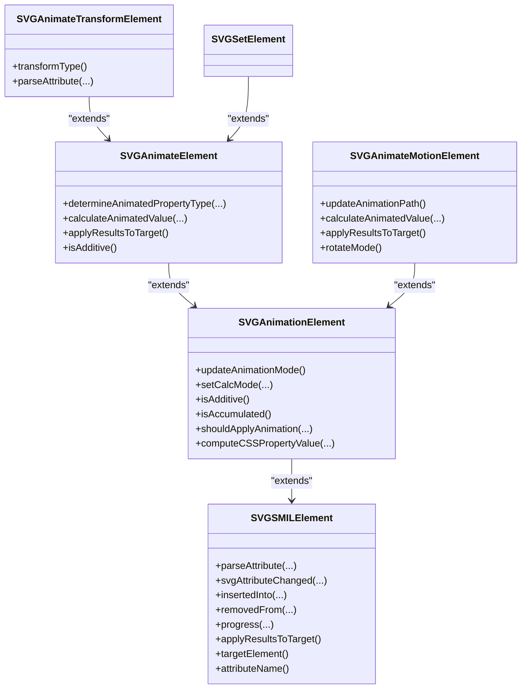
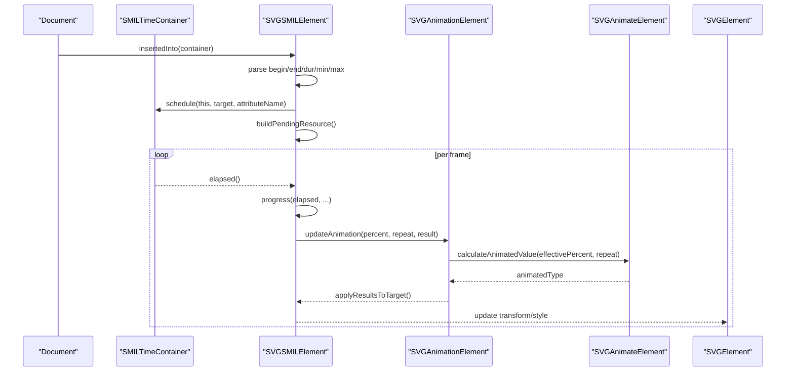
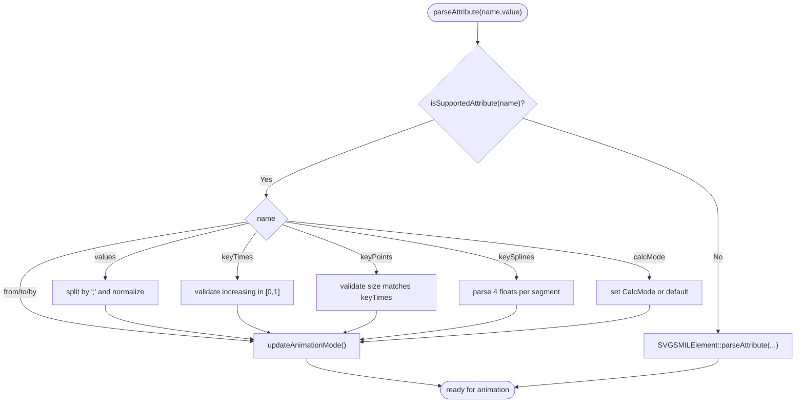
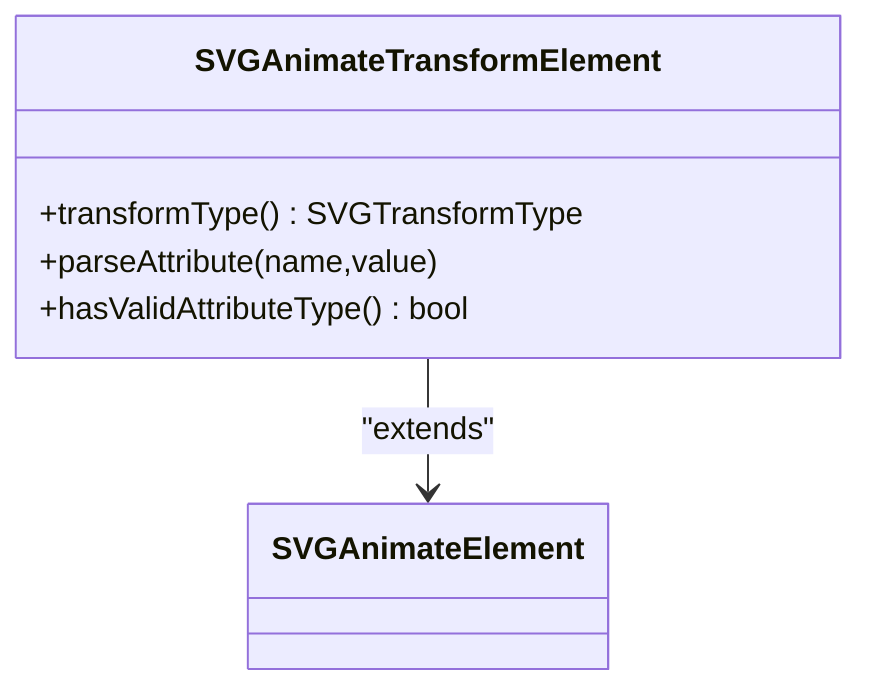
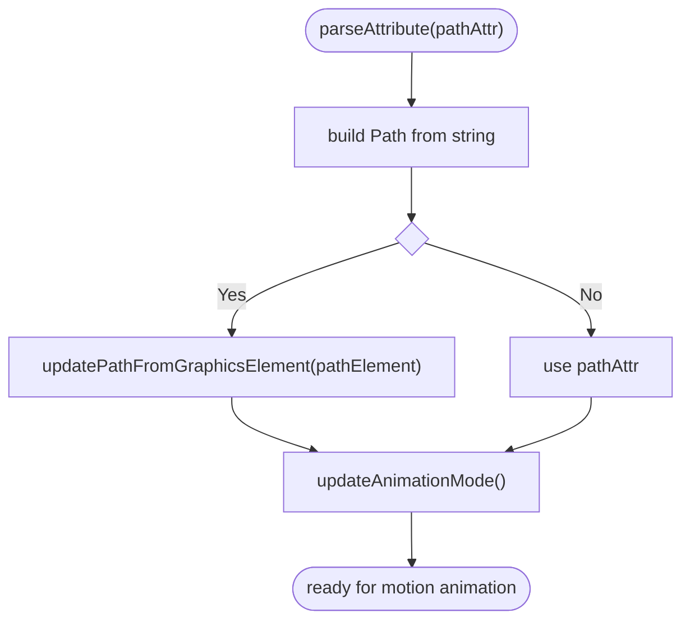
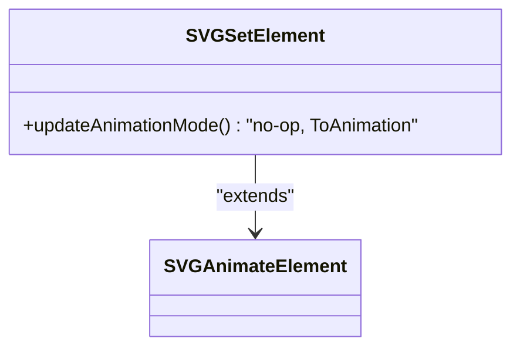
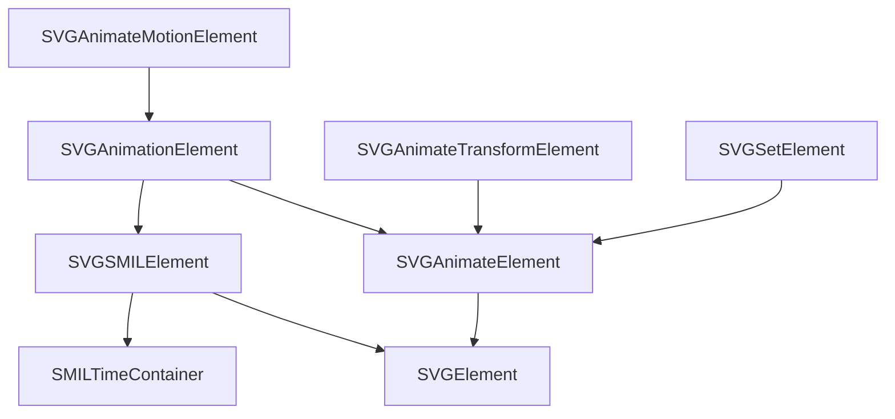

# SMIL Animation Elements

<cite>
**Referenced Files in This Document**
- [SVGSMILElement.h](file://blink-b87d44f-Source-core-svg/animation/SVGSMILElement.h)
- [SVGSMILElement.cpp](file://blink-b87d44f-Source-core-svg/animation/SVGSMILElement.cpp)
- [SVGAnimationElement.h](file://blink-b87d44f-Source-core-svg/SVGAnimationElement.h)
- [SVGAnimationElement.cpp](file://blink-b87d44f-Source-core-svg/SVGAnimationElement.cpp)
- [SVGAnimateElement.h](file://blink-b87d44f-Source-core-svg/SVGAnimateElement.h)
- [SVGAnimateElement.cpp](file://blink-b87d44f-Source-core-svg/SVGAnimateElement.cpp)
- [SVGAnimateTransformElement.h](file://blink-b87d44f-Source-core-svg/SVGAnimateTransformElement.h)
- [SVGAnimateTransformElement.cpp](file://blink-b87d44f-Source-core-svg/SVGAnimateTransformElement.cpp)
- [SVGAnimateMotionElement.h](file://blink-b87d44f-Source-core-svg/SVGAnimateMotionElement.h)
- [SVGAnimateMotionElement.cpp](file://blink-b87d44f-Source-core-svg/SVGAnimateMotionElement.cpp)
- [SVGSetElement.h](file://blink-b87d44f-Source-core-svg/SVGSetElement.h)
- [SVGSetElement.cpp](file://blink-b87d44f-Source-core-svg/SVGSetElement.cpp)
</cite>

## Table of Contents
1. [Introduction](#introduction)
2. [Project Structure](#project-structure)
3. [Core Components](#core-components)
4. [Architecture Overview](#architecture-overview)
5. [Detailed Component Analysis](#detailed-component-analysis)
6. [Dependency Analysis](#dependency-analysis)
7. [Performance Considerations](#performance-considerations)
8. [Troubleshooting Guide](#troubleshooting-guide)
9. [Conclusion](#conclusion)

## Introduction
This document explains the implementation of SMIL animation elements in the SVG rendering engine, focusing on animate, animateTransform, animateMotion, and set. It covers supported attributes, parsing logic, animation target selection, lifecycle, DOM traversal for element discovery, animation attachment, validation, error handling, and unsupported attribute fallbacks. The goal is to provide a comprehensive yet accessible guide for developers integrating or extending SMIL-based animations.

## Project Structure
The SMIL animation system is implemented across several core classes:
- SVGSMILElement: Base SMIL timing and scheduling logic for animation elements.
- SVGAnimationElement: Shared animation logic for animate-like elements (animate, animateColor, animateTransform, set).
- SVGAnimateElement: Value computation and application for attribute animations.
- SVGAnimateTransformElement: Transform-specific animation with type validation.
- SVGAnimateMotionElement: Motion animation along a path or coordinates.
- SVGSetElement: Constant-value animation (equivalent to “to” animation with fixed progress).

**Diagram sources**
- [SVGSMILElement.h:39-246](file://blink-b87d44f-Source-core-svg/animation/SVGSMILElement.h#L39-L246)
- [SVGAnimationElement.h:65-251](file://blink-b87d44f-Source-core-svg/SVGAnimationElement.h#L65-L251)
- [SVGAnimateElement.h:36-75](file://blink-b87d44f-Source-core-svg/SVGAnimateElement.h#L36-L75)
- [SVGAnimateTransformElement.h:33-48](file://blink-b87d44f-Source-core-svg/SVGAnimateTransformElement.h#L33-L48)
- [SVGAnimateMotionElement.h:31-72](file://blink-b87d44f-Source-core-svg/SVGAnimateMotionElement.h#L31-L72)
- [SVGSetElement.h:29-36](file://blink-b87d44f-Source-core-svg/SVGSetElement.h#L29-L36)

**Section sources**
- [SVGSMILElement.h:39-246](file://blink-b87d44f-Source-core-svg/animation/SVGSMILElement.h#L39-L246)
- [SVGAnimationElement.h:65-251](file://blink-b87d44f-Source-core-svg/SVGAnimationElement.h#L65-L251)
- [SVGAnimateElement.h:36-75](file://blink-b87d44f-Source-core-svg/SVGAnimateElement.h#L36-L75)
- [SVGAnimateTransformElement.h:33-48](file://blink-b87d44f-Source-core-svg/SVGAnimateTransformElement.h#L33-L48)
- [SVGAnimateMotionElement.h:31-72](file://blink-b87d44f-Source-core-svg/SVGAnimateMotionElement.h#L31-L72)
- [SVGSetElement.h:29-36](file://blink-b87d44f-Source-core-svg/SVGSetElement.h#L29-L36)

## Core Components
- SVGSMILElement: Implements SMIL timing, begin/end conditions, interval resolution, restart/fill semantics, and schedules/un-schedules animations with the time container. It parses timing attributes (begin, end, dur, repeatDur, repeatCount, min, max), supports event/syncbase conditions, and manages target element and attribute name binding.
- SVGAnimationElement: Provides shared animation mechanics: animation mode detection (from/to/by/values/path), calcMode handling (discrete/linear/paced/spline), keyTimes/keyPoints/keySplines processing, additive/accumulated behavior, and CSS vs XML attribute application decisions.
- SVGAnimateElement: Computes animated values via an animator factory, applies results to target (either via CSS property updates or SVG DOM animated values), and determines the animated property type for the target attribute.
- SVGAnimateTransformElement: Validates transform type and restricts supported transforms for animateTransform.
- SVGAnimateMotionElement: Supports coordinate-based translation and path-based motion, with rotation handling and mpath integration.
- SVGSetElement: Forces a constant “to” animation mode with no intermediate interpolation.

**Section sources**
- [SVGSMILElement.cpp:109-139](file://blink-b87d44f-Source-core-svg/animation/SVGSMILElement.cpp#L109-L139)
- [SVGAnimationElement.cpp:50-64](file://blink-b87d44f-Source-core-svg/SVGAnimationElement.cpp#L50-L64)
- [SVGAnimateElement.cpp:38-53](file://blink-b87d44f-Source-core-svg/SVGAnimateElement.cpp#L38-L53)
- [SVGAnimateTransformElement.cpp:32-43](file://blink-b87d44f-Source-core-svg/SVGAnimateTransformElement.cpp#L32-L43)
- [SVGAnimateMotionElement.cpp:43-54](file://blink-b87d44f-Source-core-svg/SVGAnimateMotionElement.cpp#L43-L54)
- [SVGSetElement.cpp:27-33](file://blink-b87d44f-Source-core-svg/SVGSetElement.cpp#L27-L33)

## Architecture Overview
The animation pipeline integrates timing, value computation, and result application:
- Timing: SVGSMILElement resolves intervals, handles begin/end conditions, restart/fill, and schedules updates with the time container.
- Value computation: SVGAnimationElement orchestrates animation mode and calcMode, computes effective percentages, and delegates value calculation to SVGAnimateElement or specialized motion handlers.
- Application: Results are applied either as CSS properties on targets and their instances or as SVG DOM animated values, with notifications to renderers.

**Diagram sources**
- [SVGSMILElement.cpp:231-276](file://blink-b87d44f-Source-core-svg/animation/SVGSMILElement.cpp#L231-L276)
- [SVGAnimationElement.cpp:609-638](file://blink-b87d44f-Source-core-svg/SVGAnimationElement.cpp#L609-L638)
- [SVGAnimateElement.cpp:96-137](file://blink-b87d44f-Source-core-svg/SVGAnimateElement.cpp#L96-L137)

## Detailed Component Analysis

### animate Element
- Purpose: Animates attribute values using from/to/by/values with configurable calcMode and key timing.
- Supported attributes (shared):
  - values, keyTimes, keyPoints, keySplines, attributeType, calcMode, from, to, by, additive, accumulate, and SMIL timing attributes (begin, end, dur, repeatDur, repeatCount, min, max, fill, restart).
- Parsing and validation:
  - Values are split by semicolons and normalized; keyTimes and keyPoints validated for order and bounds; keySplines parsed into cubic bezier curves.
  - Animation mode inferred from presence of values/from/to/by.
  - calcMode defaults to paced for animateMotion, otherwise linear.
- Target selection:
  - Resolved via href or parent element; validated against target element’s animated property type; CSS vs XML application determined by attributeType and whether the attribute is animatable.
- Lifecycle:
  - On insertion, registers with the time container and builds pending resource references; on removal, clears references and unschedules.
- Interpolation:
  - Effective percent computed considering keyTimes/keyPoints/keySplines and calcMode; discrete fallback for incompatible types; additive/accumulated behavior controlled by attributes.
- Examples:
  - Linear numeric interpolation between two numbers.
  - Discrete toggling between predefined values.
  - Paced interpolation along a distance metric for lists.
  - Spline interpolation using control points.

**Diagram sources**
- [SVGAnimationElement.cpp:170-229](file://blink-b87d44f-Source-core-svg/SVGAnimationElement.cpp#L170-L229)

**Section sources**
- [SVGAnimationElement.h:36-92](file://blink-b87d44f-Source-core-svg/SVGAnimationElement.h#L36-L92)
- [SVGAnimationElement.cpp:151-229](file://blink-b87d44f-Source-core-svg/SVGAnimationElement.cpp#L151-L229)
- [SVGAnimateElement.cpp:96-137](file://blink-b87d44f-Source-core-svg/SVGAnimateElement.cpp#L96-L137)

### animateTransform Element
- Purpose: Animates transform lists; only valid for transform attributes.
- Supported attributes:
  - type: transform type (translate, rotate, scale, skewX, skewY).
- Validation:
  - Only accepts AnimatedTransformList on the target; matrix transforms are rejected.
- Parsing:
  - Parses type attribute and validates against supported transform types.
- Examples:
  - Rotation around a center point.
  - Scaling uniformly or non-uniformly.
  - Translation along X/Y axes.

**Diagram sources**
- [SVGAnimateTransformElement.h:33-48](file://blink-b87d44f-Source-core-svg/SVGAnimateTransformElement.h#L33-L48)
- [SVGAnimateTransformElement.cpp:45-77](file://blink-b87d44f-Source-core-svg/SVGAnimateTransformElement.cpp#L45-L77)

**Section sources**
- [SVGAnimateTransformElement.cpp:45-77](file://blink-b87d44f-Source-core-svg/SVGAnimateTransformElement.cpp#L45-L77)

### animateMotion Element
- Purpose: Moves an element along a path or straight-line coordinates; supports rotation relative to path tangent.
- Supported attributes:
  - path: SVG path data string defining the motion path.
  - rotate: angle or auto/auto-reverse for orientation.
- Parsing and path handling:
  - Builds internal Path from pathAttr; supports mpath child element to source path from a referenced path element.
  - Defaults calcMode to paced for path-based motion.
- Coordinate-based motion:
  - from/to points define start/end positions; additive accumulation extends motion across repeats.
- Rotation:
  - Applies rotation based on path tangent; auto-reverse flips the angle.
- Examples:
  - Smooth motion along a curved path with auto rotation.
  - Straight-line motion with fixed angle rotation.
  - Accumulated motion across repeated cycles.

**Diagram sources**
- [SVGAnimateMotionElement.cpp:104-154](file://blink-b87d44f-Source-core-svg/SVGAnimateMotionElement.cpp#L104-L154)

**Section sources**
- [SVGAnimateMotionElement.h:31-72](file://blink-b87d44f-Source-core-svg/SVGAnimateMotionElement.h#L31-L72)
- [SVGAnimateMotionElement.cpp:104-154](file://blink-b87d44f-Source-core-svg/SVGAnimateMotionElement.cpp#L104-L154)
- [SVGAnimateMotionElement.cpp:243-297](file://blink-b87d44f-Source-core-svg/SVGAnimateMotionElement.cpp#L243-L297)

### set Element
- Purpose: Sets the target attribute to a constant value instantly at the end of the animation interval.
- Behavior:
  - Forces animation mode to ToAnimation with no intermediate interpolation.
  - Percentage is fixed at 1 during calculation.
- Examples:
  - Instantly switching a property to a new value upon animation start or end.

**Diagram sources**
- [SVGSetElement.h:29-36](file://blink-b87d44f-Source-core-svg/SVGSetElement.h#L29-L36)
- [SVGSetElement.cpp:40-44](file://blink-b87d44f-Source-core-svg/SVGSetElement.cpp#L40-L44)

**Section sources**
- [SVGSetElement.cpp:27-44](file://blink-b87d44f-Source-core-svg/SVGSetElement.cpp#L27-L44)

## Dependency Analysis
- SVGSMILElement depends on SMILTimeContainer for scheduling and timing resolution; connects/disconnects conditions; manages target element and attribute name.
- SVGAnimationElement depends on SVGAnimateElement for value computation and on SVGElement for property type determination; coordinates CSS vs XML application.
- Specialized elements override behavior:
  - SVGAnimateTransformElement restricts to transform lists.
  - SVGAnimateMotionElement computes motion along paths and rotations.
  - SVGSetElement fixes animation mode to ToAnimation.

**Diagram sources**
- [SVGSMILElement.h:39-246](file://blink-b87d44f-Source-core-svg/animation/SVGSMILElement.h#L39-L246)
- [SVGAnimationElement.h:65-251](file://blink-b87d44f-Source-core-svg/SVGAnimationElement.h#L65-L251)
- [SVGAnimateElement.h:36-75](file://blink-b87d44f-Source-core-svg/SVGAnimateElement.h#L36-L75)
- [SVGAnimateTransformElement.h:33-48](file://blink-b87d44f-Source-core-svg/SVGAnimateTransformElement.h#L33-L48)
- [SVGAnimateMotionElement.h:31-72](file://blink-b87d44f-Source-core-svg/SVGAnimateMotionElement.h#L31-L72)
- [SVGSetElement.h:29-36](file://blink-b87d44f-Source-core-svg/SVGSetElement.h#L29-L36)

**Section sources**
- [SVGSMILElement.cpp:589-609](file://blink-b87d44f-Source-core-svg/animation/SVGSMILElement.cpp#L589-L609)
- [SVGAnimationElement.cpp:686-696](file://blink-b87d44f-Source-core-svg/SVGAnimationElement.cpp#L686-L696)

## Performance Considerations
- Minimize redundant attribute parsing: caching of parsed durations and repeat values reduces repeated computations.
- Efficient path sampling: motion animation caches path geometry and uses geometric sampling; avoid excessive path recomputation.
- Additive/accumulated motion: accumulation adds vector arithmetic per repeat; keep repeat counts reasonable.
- CSS vs DOM updates: applying CSS properties avoids DOM list churn; however, ensure batched updates to reduce layout invalidations.

## Troubleshooting Guide
- Unsupported attribute type:
  - If attributeType is CSS but the target attribute is not animatable, the animation is ignored.
- Invalid timing values:
  - Unparsable begin/end times or mismatched keyTimes/keyPoints lead to unresolved intervals or skipped animation.
- Transform type restrictions:
  - animateTransform rejects matrix transforms; ensure type is one of translate/rotate/scale/skewX/skewY.
- Motion path issues:
  - Missing or empty pathAttr and no mpath child disables path-based motion; ensure path data is valid.
- Event/syncbase conditions:
  - Conditions failing to resolve leave the animation inactive until conditions become valid.

Common validation checks and fallbacks:
- Duration/repeat values are clamped to valid ranges; invalid values are treated as unresolved.
- calcMode spline requires matching keySplines count; otherwise falls back to linear or discrete.
- Values animation with paced calcMode computes keyTimes from distances; malformed values abort pacing.

**Section sources**
- [SVGAnimationElement.cpp:698-701](file://blink-b87d44f-Source-core-svg/SVGAnimationElement.cpp#L698-L701)
- [SVGAnimateTransformElement.cpp:45-52](file://blink-b87d44f-Source-core-svg/SVGAnimateTransformElement.cpp#L45-L52)
- [SVGAnimateMotionElement.cpp:104-119](file://blink-b87d44f-Source-core-svg/SVGAnimateMotionElement.cpp#L104-L119)
- [SVGSMILElement.cpp:419-478](file://blink-b87d44f-Source-core-svg/animation/SVGSMILElement.cpp#L419-L478)

## Conclusion
The SMIL animation implementation provides a robust, extensible framework for SVG animations. The separation of concerns across timing (SVGSMILElement), shared animation logic (SVGAnimationElement), and specialized value computation (SVGAnimateElement variants) enables precise control over interpolation, target selection, and result application. By adhering to supported attributes, validation rules, and lifecycle hooks, developers can implement reliable animate, animateTransform, animateMotion, and set animations with predictable behavior and strong fallbacks.