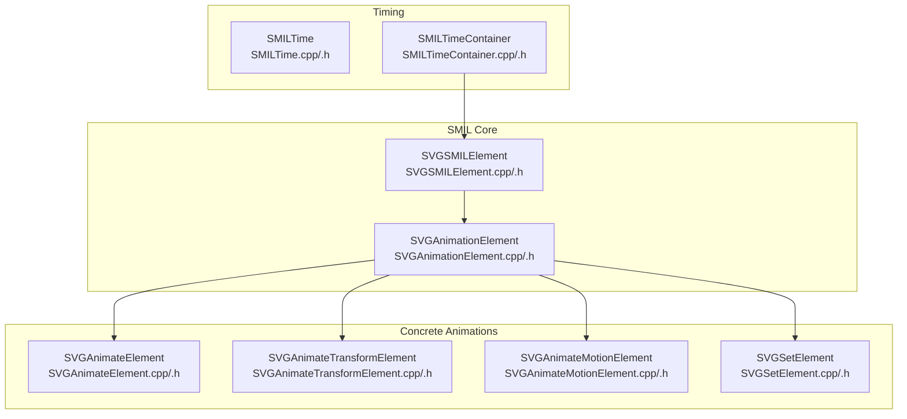
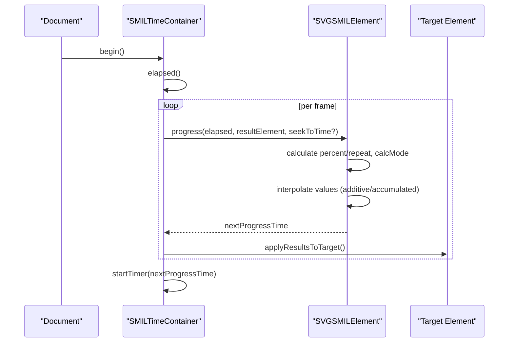
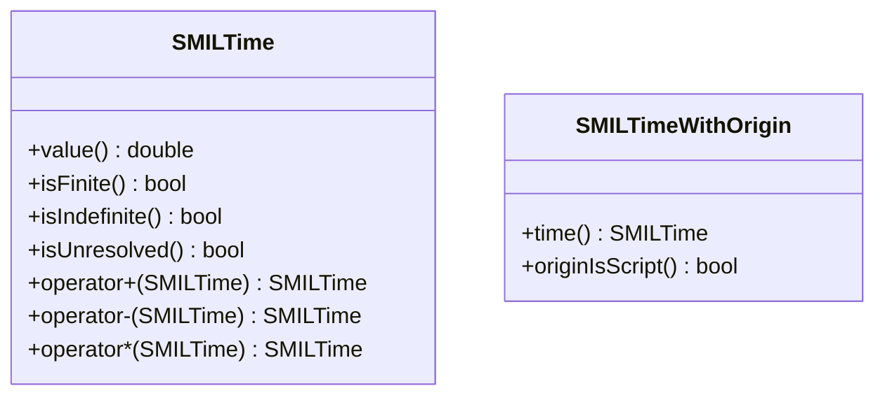
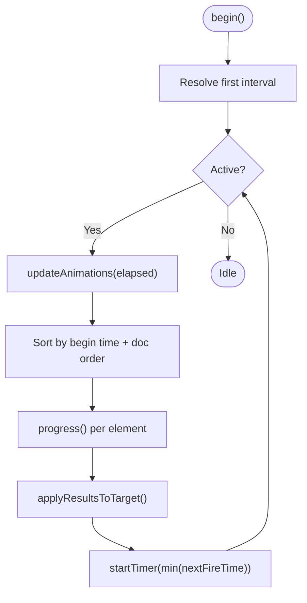
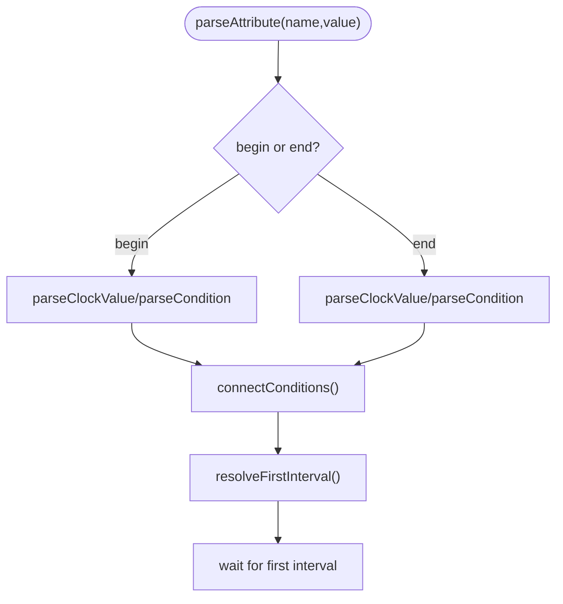
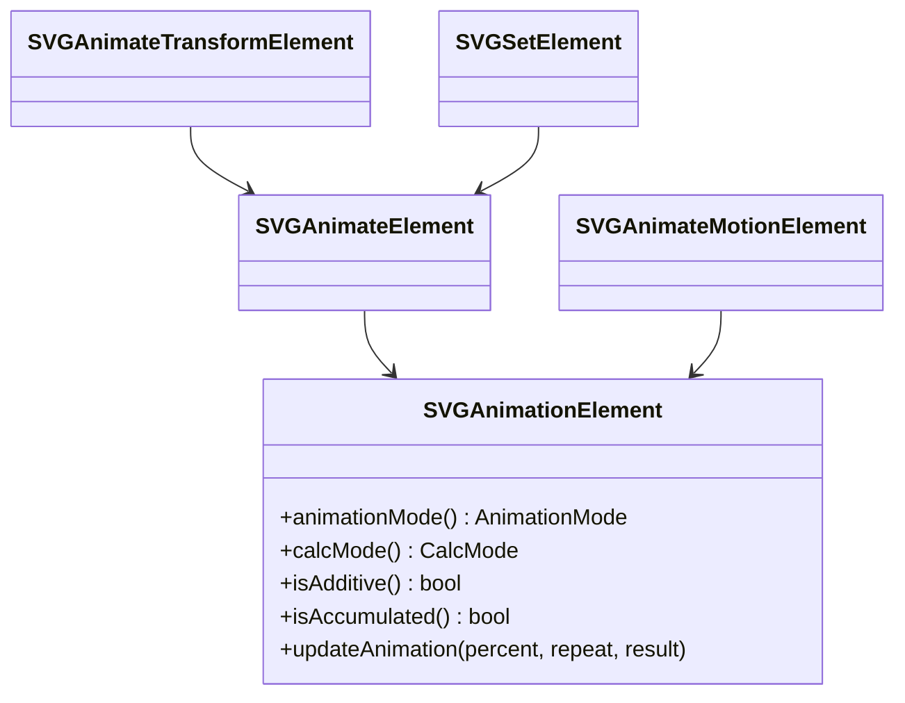
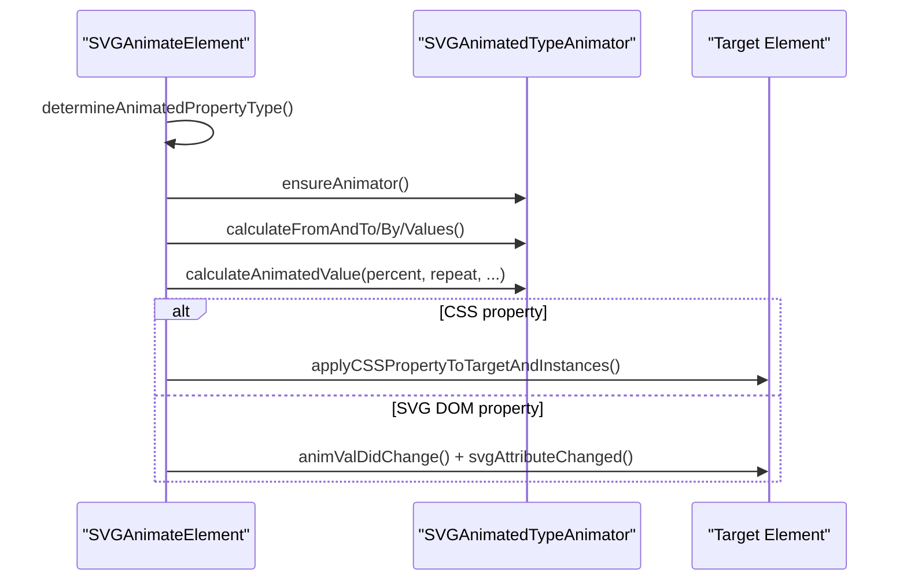
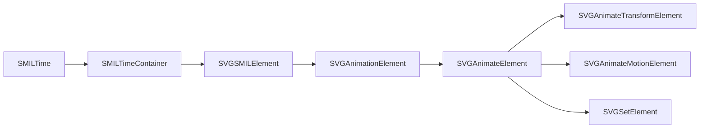

# SMIL Animation Specification

<cite>
**Referenced Files in This Document**
- [SMILTime.h](file://blink-b87d44f-Source-core-svg/animation/SMILTime.h)
- [SMILTime.cpp](file://blink-b87d44f-Source-core-svg/animation/SMILTime.cpp)
- [SMILTimeContainer.h](file://blink-b87d44f-Source-core-svg/animation/SMILTimeContainer.h)
- [SMILTimeContainer.cpp](file://blink-b87d44f-Source-core-svg/animation/SMILTimeContainer.cpp)
- [SVGSMILElement.h](file://blink-b87d44f-Source-core-svg/animation/SVGSMILElement.h)
- [SVGSMILElement.cpp](file://blink-b87d44f-Source-core-svg/animation/SVGSMILElement.cpp)
- [SVGAnimationElement.h](file://blink-b87d44f-Source-core-svg/SVGAnimationElement.h)
- [SVGAnimationElement.cpp](file://blink-b87d44f-Source-core-svg/SVGAnimationElement.cpp)
- [SVGAnimateElement.h](file://blink-b87d44f-Source-core-svg/SVGAnimateElement.h)
- [SVGAnimateElement.cpp](file://blink-b87d44f-Source-core-svg/SVGAnimateElement.cpp)
- [SVGAnimateTransformElement.h](file://blink-b87d44f-Source-core-svg/SVGAnimateTransformElement.h)
- [SVGAnimateTransformElement.cpp](file://blink-b87d44f-Source-core-svg/SVGAnimateTransformElement.cpp)
- [SVGAnimateMotionElement.h](file://blink-b87d44f-Source-core-svg/SVGAnimateMotionElement.h)
- [SVGAnimateMotionElement.cpp](file://blink-b87d44f-Source-core-svg/SVGAnimateMotionElement.cpp)
- [SVGSetElement.h](file://blink-b87d44f-Source-core-svg/SVGSetElement.h)
- [SVGSetElement.cpp](file://blink-b87d44f-Source-core-svg/SVGSetElement.cpp)
</cite>

## Table of Contents
1. [Introduction](#introduction)
2. [Project Structure](#project-structure)
3. [Core Components](#core-components)
4. [Architecture Overview](#architecture-overview)
5. [Detailed Component Analysis](#detailed-component-analysis)
6. [Dependency Analysis](#dependency-analysis)
7. [Performance Considerations](#performance-considerations)
8. [Troubleshooting Guide](#troubleshooting-guide)
9. [Conclusion](#conclusion)
10. [Appendices](#appendices)

## Introduction
This document explains the SMIL (Synchronized Multimedia Integration Language) animation implementation in the SVG engine. It covers supported animation elements, timing semantics, interpolation modes, parser architecture, timeline management, and element processing. It also provides guidance on SMIL-to-CSS conversion, debugging parsing issues, and compliance considerations.

## Project Structure
The SMIL animation stack is organized around a core timing model and a family of animation elements:
- Timing primitives and containers define time semantics and scheduling
- A base SMIL element class coordinates begin/end timing, restart/fill policies, and per-frame progression
- Concrete animation elements implement attribute/path/value animations and apply results to targets

**Diagram sources**
- [SMILTime.h:34-55](file://blink-b87d44f-Source-core-svg/animation/SMILTime.h#L34-L55)
- [SMILTime.cpp:34-65](file://blink-b87d44f-Source-core-svg/animation/SMILTime.cpp#L34-L65)
- [SMILTimeContainer.h:45-98](file://blink-b87d44f-Source-core-svg/animation/SMILTimeContainer.h#L45-L98)
- [SMILTimeContainer.cpp:40-53](file://blink-b87d44f-Source-core-svg/animation/SMILTimeContainer.cpp#L40-L53)
- [SVGSMILElement.h:39-130](file://blink-b87d44f-Source-core-svg/animation/SVGSMILElement.h#L39-L130)
- [SVGAnimationElement.h:65-100](file://blink-b87d44f-Source-core-svg/SVGAnimationElement.h#L65-L100)
- [SVGAnimateElement.h:36-75](file://blink-b87d44f-Source-core-svg/SVGAnimateElement.h#L36-L75)
- [SVGAnimateTransformElement.h:33-48](file://blink-b87d44f-Source-core-svg/SVGAnimateTransformElement.h#L33-L48)
- [SVGAnimateMotionElement.h:31-72](file://blink-b87d44f-Source-core-svg/SVGAnimateMotionElement.h#L31-L72)
- [SVGSetElement.h:29-36](file://blink-b87d44f-Source-core-svg/SVGSetElement.h#L29-L36)

**Section sources**
- [SMILTime.h:34-55](file://blink-b87d44f-Source-core-svg/animation/SMILTime.h#L34-L55)
- [SMILTimeContainer.h:45-98](file://blink-b87d44f-Source-core-svg/animation/SMILTimeContainer.h#L45-L98)
- [SVGSMILElement.h:39-130](file://blink-b87d44f-Source-core-svg/animation/SVGSMILElement.h#L39-L130)
- [SVGAnimationElement.h:65-100](file://blink-b87d44f-Source-core-svg/SVGAnimationElement.h#L65-L100)

## Core Components
- SMILTime: Encodes absolute and special time values (finite, indefinite, unresolved) and supports arithmetic for durations and repeat counts.
- SMILTimeContainer: Central scheduler that manages active animations, sorts by begin time and document order, and applies results per frame.
- SVGSMILElement: Base for SMIL animation elements; parses begin/end lists, resolves intervals, computes progress, and integrates with the container.
- SVGAnimationElement: Adds animation modes (from/to/by/values/path), calcMode (discrete/linear/paced/spline), and interpolation utilities.
- Concrete elements:
  - SVGAnimateElement: Attribute animations supporting additive accumulation and CSS vs XML property application
  - SVGAnimateTransformElement: Transform list animations with transform type validation
  - SVGAnimateMotionElement: Motion along a path or coordinate pairs with rotate handling
  - SVGSetElement: Constant-value setter equivalent to to-animation

**Section sources**
- [SMILTime.cpp:34-65](file://blink-b87d44f-Source-core-svg/animation/SMILTime.cpp#L34-L65)
- [SMILTimeContainer.cpp:262-329](file://blink-b87d44f-Source-core-svg/animation/SMILTimeContainer.cpp#L262-L329)
- [SVGSMILElement.cpp:411-417](file://blink-b87d44f-Source-core-svg/animation/SVGSMILElement.cpp#L411-L417)
- [SVGAnimationElement.h:36-59](file://blink-b87d44f-Source-core-svg/SVGAnimationElement.h#L36-L59)
- [SVGAnimateElement.cpp:370-387](file://blink-b87d44f-Source-core-svg/SVGAnimateElement.cpp#L370-L387)
- [SVGAnimateTransformElement.cpp:45-52](file://blink-b87d44f-Source-core-svg/SVGAnimateTransformElement.cpp#L45-L52)
- [SVGAnimateMotionElement.cpp:121-131](file://blink-b87d44f-Source-core-svg/SVGAnimateMotionElement.cpp#L121-L131)
- [SVGSetElement.cpp:40-44](file://blink-b87d44f-Source-core-svg/SVGSetElement.cpp#L40-L44)

## Architecture Overview
The SMIL pipeline:
- Parse begin/end lists and conditions; resolve instance times
- Compute active intervals and next progress time
- Advance per-frame, interpolate values, accumulate/add
- Apply results to target (CSS properties or SVG DOM animated values)
- Reschedule next tick based on nearest future event

**Diagram sources**
- [SMILTimeContainer.cpp:133-148](file://blink-b87d44f-Source-core-svg/animation/SMILTimeContainer.cpp#L133-L148)
- [SMILTimeContainer.cpp:262-329](file://blink-b87d44f-Source-core-svg/animation/SMILTimeContainer.cpp#L262-L329)
- [SVGSMILElement.h:92-93](file://blink-b87d44f-Source-core-svg/animation/SVGSMILElement.h#L92-L93)
- [SVGAnimateElement.cpp:346-368](file://blink-b87d44f-Source-core-svg/SVGAnimateElement.cpp#L346-L368)

## Detailed Component Analysis

### SMIL Timing Model
- Time values:
  - Finite: regular seconds
  - Indefinite: sentinel for unbounded durations
  - Unresolved: indicates parse errors or invalid expressions
- Arithmetic:
  - Addition/subtraction supported between finite/indefinite/unresolved
  - Multiplication for duration × repeatCount semantics
- Origins:
  - Parser-origin vs script-origin times distinguish dynamic begin/end updates

**Diagram sources**
- [SMILTime.h:34-55](file://blink-b87d44f-Source-core-svg/animation/SMILTime.h#L34-L55)
- [SMILTime.h:57-81](file://blink-b87d44f-Source-core-svg/animation/SMILTime.h#L57-L81)
- [SMILTime.cpp:38-65](file://blink-b87d44f-Source-core-svg/animation/SMILTime.cpp#L38-L65)

**Section sources**
- [SMILTime.h:34-55](file://blink-b87d44f-Source-core-svg/animation/SMILTime.h#L34-L55)
- [SMILTime.cpp:34-65](file://blink-b87d44f-Source-core-svg/animation/SMILTime.cpp#L34-L65)

### Timeline Management
- Scheduling:
  - Elements register per-target/attribute groups
  - Sorted by begin time and document order
- Execution:
  - One-shot timer fires at next event
  - Applies accumulated results to targets
- Controls:
  - begin/pause/resume/setElapsed
  - Tracks begin/pause/resume times and accumulated active time

**Diagram sources**
- [SMILTimeContainer.cpp:133-148](file://blink-b87d44f-Source-core-svg/animation/SMILTimeContainer.cpp#L133-L148)
- [SMILTimeContainer.cpp:262-329](file://blink-b87d44f-Source-core-svg/animation/SMILTimeContainer.cpp#L262-L329)
- [SMILTimeContainer.h:70-76](file://blink-b87d44f-Source-core-svg/animation/SMILTimeContainer.h#L70-L76)

**Section sources**
- [SMILTimeContainer.h:45-98](file://blink-b87d44f-Source-core-svg/animation/SMILTimeContainer.h#L45-L98)
- [SMILTimeContainer.cpp:228-260](file://blink-b87d44f-Source-core-svg/animation/SMILTimeContainer.cpp#L228-L260)

### SMIL Element Lifecycle and Timing Parsing
- Attribute parsing:
  - begin/end lists accept clock values and conditions (syncbase/event/accesskey)
  - Conditions parsed into typed entries with offsets and repeat counts
- Interval resolution:
  - First interval computed at insertion
  - Begin/end list changes trigger re-resolution
- Restart/fill:
  - restart policy (always/whenNotActive/never)
  - fill policy (remove/freeze)
- Progress:
  - percent and repeat calculation
  - next progress time computation

**Diagram sources**
- [SVGSMILElement.cpp:456-478](file://blink-b87d44f-Source-core-svg/animation/SVGSMILElement.cpp#L456-L478)
- [SVGSMILElement.cpp:419-437](file://blink-b87d44f-Source-core-svg/animation/SVGSMILElement.cpp#L419-L437)
- [SVGSMILElement.cpp:517-542](file://blink-b87d44f-Source-core-svg/animation/SVGSMILElement.cpp#L517-L542)

**Section sources**
- [SVGSMILElement.h:147-186](file://blink-b87d44f-Source-core-svg/animation/SVGSMILElement.h#L147-L186)
- [SVGSMILElement.cpp:283-337](file://blink-b87d44f-Source-core-svg/animation/SVGSMILElement.cpp#L283-L337)
- [SVGSMILElement.cpp:419-437](file://blink-b87d44f-Source-core-svg/animation/SVGSMILElement.cpp#L419-L437)

### Animation Modes and Interpolation
- Animation modes:
  - FromTo/FromBy/To/By/Values/Path
- Calc modes:
  - Discrete, Linear, Paced, Spline
- Additive/accumulated:
  - Additive applies delta; Accumulated sums across repeats
- Values animation:
  - Supports keyTimes/keyPoints/keySplines for pacing

**Diagram sources**
- [SVGAnimationElement.h:36-59](file://blink-b87d44f-Source-core-svg/SVGAnimationElement.h#L36-L59)
- [SVGAnimationElement.h:188-199](file://blink-b87d44f-Source-core-svg/SVGAnimationElement.h#L188-L199)
- [SVGAnimateElement.h:36-75](file://blink-b87d44f-Source-core-svg/SVGAnimateElement.h#L36-L75)
- [SVGAnimateTransformElement.h:33-48](file://blink-b87d44f-Source-core-svg/SVGAnimateTransformElement.h#L33-L48)
- [SVGAnimateMotionElement.h:31-72](file://blink-b87d44f-Source-core-svg/SVGAnimateMotionElement.h#L31-L72)
- [SVGSetElement.h:29-36](file://blink-b87d44f-Source-core-svg/SVGSetElement.h#L29-L36)

**Section sources**
- [SVGAnimationElement.h:36-59](file://blink-b87d44f-Source-core-svg/SVGAnimationElement.h#L36-L59)
- [SVGAnimationElement.cpp:170-200](file://blink-b87d44f-Source-core-svg/SVGAnimationElement.cpp#L170-L200)
- [SVGAnimateElement.cpp:96-137](file://blink-b87d44f-Source-core-svg/SVGAnimateElement.cpp#L96-L137)

### Attribute Animations (animate, set)
- Property type detection:
  - Determines AnimatedPropertyType for target attribute
  - Validates against element type (e.g., transform lists require animateTransform)
- Value computation:
  - From/To/By/Values with distance calculation
  - calcMode affects sampling; discrete forces step values
- Application:
  - CSS property path writes to animated style properties
  - SVG DOM path updates animated values and triggers change notifications

**Diagram sources**
- [SVGAnimateElement.cpp:64-94](file://blink-b87d44f-Source-core-svg/SVGAnimateElement.cpp#L64-L94)
- [SVGAnimateElement.cpp:147-174](file://blink-b87d44f-Source-core-svg/SVGAnimateElement.cpp#L147-L174)
- [SVGAnimateElement.cpp:346-368](file://blink-b87d44f-Source-core-svg/SVGAnimateElement.cpp#L346-L368)

**Section sources**
- [SVGAnimateElement.h:41-56](file://blink-b87d44f-Source-core-svg/SVGAnimateElement.h#L41-L56)
- [SVGAnimateElement.cpp:96-137](file://blink-b87d44f-Source-core-svg/SVGAnimateElement.cpp#L96-L137)
- [SVGAnimateElement.cpp:346-368](file://blink-b87d44f-Source-core-svg/SVGAnimateElement.cpp#L346-L368)

### Transform Animations (animateTransform)
- Validates target supports transform list
- Parses transform type (skips matrix)
- Applies transform updates to target’s transform list

**Section sources**
- [SVGAnimateTransformElement.cpp:45-52](file://blink-b87d44f-Source-core-svg/SVGAnimateTransformElement.cpp#L45-L52)
- [SVGAnimateTransformElement.cpp:62-77](file://blink-b87d44f-Source-core-svg/SVGAnimateTransformElement.cpp#L62-L77)

### Motion Animations (animateMotion)
- Path-based or coordinate-based motion
- Supports rotate modes: angle/auto/auto-reverse
- Uses path geometry to compute position and normal for rotation
- Supports accumulation across repeats

**Section sources**
- [SVGAnimateMotionElement.h:54-72](file://blink-b87d44f-Source-core-svg/SVGAnimateMotionElement.h#L54-L72)
- [SVGAnimateMotionElement.cpp:243-297](file://blink-b87d44f-Source-core-svg/SVGAnimateMotionElement.cpp#L243-L297)
- [SVGAnimateMotionElement.cpp:329-340](file://blink-b87d44f-Source-core-svg/SVGAnimateMotionElement.cpp#L329-L340)

### Set Animations (set)
- Fixed-value animation equivalent to to-animation
- Mode is constant and cannot be overridden

**Section sources**
- [SVGSetElement.cpp:40-44](file://blink-b87d44f-Source-core-svg/SVGSetElement.cpp#L40-L44)

## Dependency Analysis
- SVGSMILElement depends on:
  - SMILTime/SMILTimeContainer for timing
  - SVGAnimationElement for animation semantics
  - Concrete elements for specialized behaviors
- SVGAnimationElement depends on:
  - Animated property types and animators
  - CSS property mapping for CSS-application path
- Concrete elements specialize:
  - Value parsing and interpolation
  - Result application to target transforms or style

**Diagram sources**
- [SMILTimeContainer.h:41-43](file://blink-b87d44f-Source-core-svg/animation/SMILTimeContainer.h#L41-L43)
- [SVGSMILElement.h:39-42](file://blink-b87d44f-Source-core-svg/animation/SVGSMILElement.h#L39-L42)
- [SVGAnimationElement.h:65-67](file://blink-b87d44f-Source-core-svg/SVGAnimationElement.h#L65-L67)
- [SVGAnimateElement.h:36-38](file://blink-b87d44f-Source-core-svg/SVGAnimateElement.h#L36-L38)

**Section sources**
- [SVGSMILElement.h:39-42](file://blink-b87d44f-Source-core-svg/animation/SVGSMILElement.h#L39-L42)
- [SVGAnimationElement.h:65-67](file://blink-b87d44f-Source-core-svg/SVGAnimationElement.h#L65-L67)

## Performance Considerations
- Frame scheduling:
  - One-shot timers minimize overhead; minimum delay bounds keep frames reasonable
- Sorting:
  - Priority sorting by begin time and document order ensures deterministic evaluation
- Accumulation:
  - Additive/accumulated modes avoid recomputing base values each frame
- CSS vs DOM application:
  - CSS path avoids DOM churn; DOM path notifies renderers and instances

[No sources needed since this section provides general guidance]

## Troubleshooting Guide
Common issues and diagnostics:
- Invalid begin/end values:
  - Unresolved times indicate parse failures; verify time formats and condition syntax
- Conditions not firing:
  - Ensure eventBase exists and condition names match; reconnect conditions on attribute changes
- Transform animations not applied:
  - Verify target supports transform list and element type matches (animate vs animateTransform)
- Motion path not followed:
  - Confirm pathAttr/mpath availability and path validity; check rotate mode expectations
- CSS property not updating:
  - Validate attributeType and CSS property mapping; ensure target is in document and instances updated

**Section sources**
- [SVGSMILElement.cpp:303-337](file://blink-b87d44f-Source-core-svg/animation/SVGSMILElement.cpp#L303-L337)
- [SVGSMILElement.cpp:517-571](file://blink-b87d44f-Source-core-svg/animation/SVGSMILElement.cpp#L517-L571)
- [SVGAnimateTransformElement.cpp:45-52](file://blink-b87d44f-Source-core-svg/SVGAnimateTransformElement.cpp#L45-L52)
- [SVGAnimateMotionElement.cpp:133-154](file://blink-b87d44f-Source-core-svg/SVGAnimateMotionElement.cpp#L133-L154)
- [SVGAnimateElement.cpp:237-293](file://blink-b87d44f-Source-core-svg/SVGAnimateElement.cpp#L237-L293)

## Conclusion
The implementation provides a robust SMIL timing model with comprehensive support for attribute, transform, motion, and set animations. It integrates seamlessly with both CSS and SVG DOM property systems, offering flexible interpolation and accumulation semantics. The scheduler efficiently manages multiple concurrent animations and applies results deterministically.

[No sources needed since this section summarizes without analyzing specific files]

## Appendices

### Supported SMIL Elements and Attributes
- animate, animateTransform, animateMotion, set
- Timing attributes: begin, end, dur, repeatDur, repeatCount, min, max, fill, restart
- Animation attributes: attributeType, attributeName, calcMode, values, keyTimes, keyPoints, keySplines, from, to, by
- animateMotion-specific: path, rotate

**Section sources**
- [SVGSMILElement.h:44-44](file://blink-b87d44f-Source-core-svg/animation/SVGSMILElement.h#L44-L44)
- [SVGSMILElement.cpp:439-454](file://blink-b87d44f-Source-core-svg/animation/SVGSMILElement.cpp#L439-L454)
- [SVGAnimateMotionElement.h:96-102](file://blink-b87d44f-Source-core-svg/SVGAnimateMotionElement.h#L96-L102)

### Interpolation Methods
- calcMode:
  - discrete: step at midpoint
  - linear: linear blend
  - paced: uniform speed along path/list
  - spline: bezier curves via keySplines
- additive/accumulate:
  - additive: adds delta per frame
  - accumulate: sums across repeats

**Section sources**
- [SVGAnimationElement.h:54-59](file://blink-b87d44f-Source-core-svg/SVGAnimationElement.h#L54-L59)
- [SVGAnimationElement.cpp:147-162](file://blink-b87d44f-Source-core-svg/SVGAnimationElement.cpp#L147-L162)
- [SVGAnimateElement.cpp:370-387](file://blink-b87d44f-Source-core-svg/SVGAnimateElement.cpp#L370-L387)

### SMIL-to-CSS Conversion Guidance
- When applying to CSS properties:
  - Use animated style properties on target and instances
  - Ensure attributeType and CSS property mapping are valid
- When applying to SVG DOM properties:
  - Update animated values and notify via change hooks

**Section sources**
- [SVGAnimateElement.cpp:237-293](file://blink-b87d44f-Source-core-svg/SVGAnimateElement.cpp#L237-L293)
- [SVGAnimateElement.cpp:346-368](file://blink-b87d44f-Source-core-svg/SVGAnimateElement.cpp#L346-L368)

### Examples Index
- Attribute animation: animate with from/to and calcMode
- Transform animation: animateTransform with type
- Motion animation: animateMotion with path or from/to coordinates and rotate
- Set animation: set to a fixed value

[No sources needed since this section indexes examples conceptually]