# SMIL Animation Specification

<cite>
**Referenced Files in This Document**
- [SMILTime.h](file://blink-b87d44f-Source-core-svg/animation/SMILTime.h)
- [SMILTime.cpp](file://blink-b87d44f-Source-core-svg/animation/SMILTime.cpp)
- [SMILTimeContainer.h](file://blink-b87d44f-Source-core-svg/animation/SMILTimeContainer.h)
- [SMILTimeContainer.cpp](file://blink-b87d44f-Source-core-svg/animation/SMILTimeContainer.cpp)
- [SVGSMILElement.h](file://blink-b87d44f-Source-core-svg/animation/SVGSMILElement.h)
- [SVGSMILElement.cpp](file://blink-b87d44f-Source-core-svg/animation/SVGSMILElement.cpp)
- [SVGAnimationElement.h](file://blink-b87d44f-Source-core-svg/SVGAnimationElement.h)
- [SVGAnimationElement.cpp](file://blink-b87d44f-Source-core-svg/SVGAnimationElement.cpp)
- [SVGAnimateElement.h](file://blink-b87d44f-Source-core-svg/SVGAnimateElement.h)
- [SVGAnimateElement.cpp](file://blink-b87d44f-Source-core-svg/SVGAnimateElement.cpp)
- [SVGAnimateTransformElement.h](file://blink-b87d44f-Source-core-svg/SVGAnimateTransformElement.h)
- [SVGAnimateTransformElement.cpp](file://blink-b87d44f-Source-core-svg/SVGAnimateTransformElement.cpp)
- [SVGAnimateMotionElement.h](file://blink-b87d44f-Source-core-svg/SVGAnimateMotionElement.h)
- [SVGAnimateMotionElement.cpp](file://blink-b87d44f-Source-core-svg/SVGAnimateMotionElement.cpp)
- [SVGSetElement.h](file://blink-b87d44f-Source-core-svg/SVGSetElement.h)
- [SVGSetElement.cpp](file://blink-b87d44f-Source-core-svg/SVGSetElement.cpp)
- [SVGAnimatedString.h](file://blink-b87d44f-Source-core-svg/SVGAnimatedString.h)
- [SVGAnimatedString.cpp](file://blink-b87d44f-Source-core-svg/SVGAnimatedString.cpp)
- [SVGElement.cpp](file://blink-b87d44f-Source-core-svg/SVGElement.cpp)
- [smil_parser_animation_parsing.dart](file://lib/src/animation/smil/smil_parser_animation_parsing.dart)
- [smil_parser_motion.dart](file://lib/src/animation/smil/smil_parser_motion.dart)
- [smil_timeline.dart](file://lib/src/animation/smil/smil_timeline.dart)
- [smil_timeline_runtime.dart](file://lib/src/animation/smil/smil_timeline_runtime.dart)
- [smil_timeline_syncbase.dart](file://lib/src/animation/smil/smil_timeline_syncbase.dart)
- [smil_animation_runtime.dart](file://lib/src/animation/smil/smil_animation_runtime.dart)
- [visibility_animation_test.dart](file://test/animation/visibility_animation_test.dart)
- [smil_edge_cases_test.dart](file://test/animation/smil_edge_cases_test.dart)
- [smil_edge_cases_advanced_test.dart](file://test/animation/smil_edge_cases_advanced_test.dart)
- [animate_motion_advanced_test.dart](file://test/animation/animate_motion_advanced_test.dart)
</cite>

## Update Summary
**Changes Made**
- Enhanced SMIL animation system with advanced edge case handling and improved error recovery
- Added comprehensive timeline synchronization improvements with circular dependency detection
- Enhanced motion animation support with better path parsing and rotation handling
- Improved discrete calcMode handling for string-type attributes with automatic enforcement
- Added advanced syncbase timing support including repeat-based synchronization
- Enhanced parser improvements with better validation and fallback mechanisms

## Table of Contents
1. [Introduction](#introduction)
2. [Project Structure](#project-structure)
3. [Core Components](#core-components)
4. [Architecture Overview](#architecture-overview)
5. [Detailed Component Analysis](#detailed-component-analysis)
6. [Dependency Analysis](#dependency-analysis)
7. [Performance Considerations](#performance-considerations)
8. [Troubleshooting Guide](#troubleshooting-guide)
9. [Conclusion](#conclusion)
10. [Appendices](#appendices)

## Introduction
This document explains the SMIL (Synchronized Multimedia Integration Language) animation implementation in the SVG engine. It covers supported animation elements, timing semantics, interpolation modes, parser architecture, timeline management, and element processing. The implementation now includes enhanced discrete calcMode handling for string-type attributes, advanced edge case recovery, improved timeline synchronization with circular dependency detection, and better motion animation support with comprehensive path parsing capabilities.

## Project Structure
The SMIL animation stack is organized around a robust timing model and a family of animation elements with comprehensive error handling:
- Timing primitives and containers define time semantics and scheduling with advanced synchronization
- A base SMIL element class coordinates begin/end timing, restart/fill policies, and per-frame progression
- Concrete animation elements implement attribute/path/value animations and apply results to targets
- Specialized animators handle discrete string-type attribute animations
- Advanced parser with comprehensive validation and fallback mechanisms
- Enhanced timeline with circular dependency detection and syncbase timing

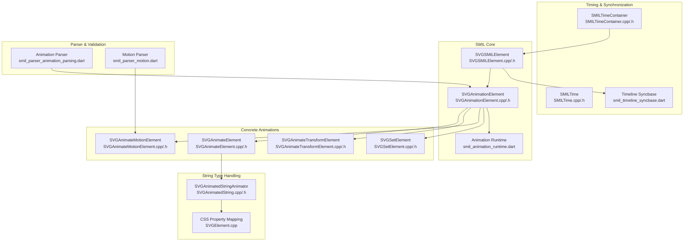

**Diagram sources**
- [SMILTime.h:34-55](file://blink-b87d44f-Source-core-svg/animation/SMILTime.h#L34-L55)
- [SMILTime.cpp:34-65](file://blink-b87d44f-Source-core-svg/animation/SMILTime.cpp#L34-L65)
- [SMILTimeContainer.h:45-98](file://blink-b87d44f-Source-core-svg/animation/SMILTimeContainer.h#L45-L98)
- [SMILTimeContainer.cpp:40-53](file://blink-b87d44f-Source-core-svg/animation/SMILTimeContainer.cpp#L40-L53)
- [SVGSMILElement.h:39-130](file://blink-b87d44f-Source-core-svg/animation/SVGSMILElement.h#L39-L130)
- [SVGAnimationElement.h:65-100](file://blink-b87d44f-Source-core-svg/SVGAnimationElement.h#L65-L100)
- [SVGAnimateElement.h:36-75](file://blink-b87d44f-Source-core-svg/SVGAnimateElement.h#L36-L75)
- [SVGAnimateTransformElement.h:33-48](file://blink-b87d44f-Source-core-svg/SVGAnimateTransformElement.h#L33-L48)
- [SVGAnimateMotionElement.h:31-72](file://blink-b87d44f-Source-core-svg/SVGAnimateMotionElement.h#L31-L72)
- [SVGSetElement.h:29-36](file://blink-b87d44f-Source-core-svg/SVGSetElement.h#L29-L36)
- [SVGAnimatedString.h:40-55](file://blink-b87d44f-Source-core-svg/SVGAnimatedString.h#L40-L55)
- [SVGElement.cpp:648-690](file://blink-b87d44f-Source-core-svg/SVGElement.cpp#L648-L690)
- [smil_parser_animation_parsing.dart:1-493](file://lib/src/animation/smil/smil_parser_animation_parsing.dart#L1-L493)
- [smil_parser_motion.dart:1-412](file://lib/src/animation/smil/smil_parser_motion.dart#L1-L412)
- [smil_timeline_syncbase.dart:1-256](file://lib/src/animation/smil/smil_timeline_syncbase.dart#L1-L256)
- [smil_animation_runtime.dart:1-91](file://lib/src/animation/smil/smil_animation_runtime.dart#L1-L91)

**Section sources**
- [SMILTime.h:34-55](file://blink-b87d44f-Source-core-svg/animation/SMILTime.h#L34-L55)
- [SMILTimeContainer.h:45-98](file://blink-b87d44f-Source-core-svg/animation/SMILTimeContainer.h#L45-L98)
- [SVGSMILElement.h:39-130](file://blink-b87d44f-Source-core-svg/animation/SVGSMILElement.h#L39-L130)
- [SVGAnimationElement.h:65-100](file://blink-b87d44f-Source-core-svg/SVGAnimationElement.h#L65-L100)

## Core Components
- **SMILTime**: Encodes absolute and special time values (finite, indefinite, unresolved) and supports arithmetic for durations and repeat counts with enhanced error handling
- **SMILTimeContainer**: Central scheduler that manages active animations, sorts by begin time and document order, applies results per frame, and handles interval seeking with improved precision
- **SVGSMILElement**: Base for SMIL animation elements with enhanced seekToIntervalCorrespondingToTime functionality for precise timeline navigation and better interval management
- **SVGAnimationElement**: Adds animation modes (from/to/by/values/path), calcMode (discrete/linear/paced/spline), and interpolation utilities with improved error recovery
- **Concrete elements**:
  - **SVGAnimateElement**: Attribute animations supporting additive accumulation and CSS vs XML property application with enhanced validation
  - **SVGAnimateTransformElement**: Transform list animations with transform type validation and improved error handling
  - **SVGAnimateMotionElement**: Motion along a path or coordinate pairs with rotate handling, comprehensive path parsing, and better edge case management
  - **SVGSetElement**: Constant-value setter equivalent to to-animation with robust error recovery
- **SVGAnimatedStringAnimator**: Specialized animator for string-type attributes that enforces discrete calcMode semantics with automatic enforcement
- **Enhanced Parser System**: Comprehensive validation with fallback mechanisms, edge case handling, and improved error recovery
- **Advanced Timeline**: Circular dependency detection, syncbase timing with repeat support, and sophisticated event handling

**Section sources**
- [SMILTime.cpp:34-65](file://blink-b87d44f-Source-core-svg/animation/SMILTime.cpp#L34-L65)
- [SMILTimeContainer.cpp:262-329](file://blink-b87d44f-Source-core-svg/animation/SMILTimeContainer.cpp#L262-L329)
- [SVGSMILElement.cpp:951-982](file://blink-b87d44f-Source-core-svg/animation/SVGSMILElement.cpp#L951-L982)
- [SVGSMILElement.cpp:1048-1120](file://blink-b87d44f-Source-core-svg/animation/SVGSMILElement.cpp#L1048-L1120)
- [SVGAnimationElement.h:36-59](file://blink-b87d44f-Source-core-svg/SVGAnimationElement.h#L36-L59)
- [SVGAnimateElement.cpp:370-387](file://blink-b87d44f-Source-core-svg/SVGAnimateElement.cpp#L370-L387)
- [SVGAnimateTransformElement.cpp:45-52](file://blink-b87d44f-Source-core-svg/SVGAnimateTransformElement.cpp#L45-L52)
- [SVGAnimateMotionElement.cpp:121-131](file://blink-b87d44f-Source-core-svg/SVGAnimateMotionElement.cpp#L121-L131)
- [SVGSetElement.cpp:40-44](file://blink-b87d44f-Source-core-svg/SVGSetElement.cpp#L40-L44)
- [SVGAnimatedString.cpp:75-89](file://blink-b87d44f-Source-core-svg/SVGAnimatedString.cpp#L75-L89)
- [smil_parser_animation_parsing.dart:134-147](file://lib/src/animation/smil/smil_parser_animation_parsing.dart#L134-L147)
- [smil_timeline_syncbase.dart:182-255](file://lib/src/animation/smil/smil_timeline_syncbase.dart#L182-L255)

## Architecture Overview
The enhanced SMIL pipeline with advanced error handling and synchronization:
- Parse begin/end lists and conditions with comprehensive validation; resolve instance times with circular dependency detection
- Compute active intervals and next progress time with improved precision
- Advance per-frame with enhanced error recovery, interpolate values, accumulate/add with fallback mechanisms
- Apply results to target (CSS properties or SVG DOM animated values) with priority resolution
- Reschedule next tick based on nearest future event with better interval management
- Enforce discrete calcMode for non-interpolatable string attributes with automatic enforcement
- Handle complex syncbase timing including repeat-based synchronization with offset support

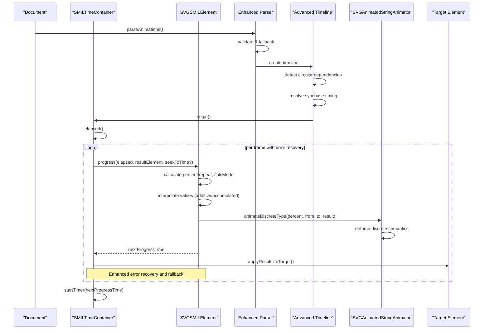

**Diagram sources**
- [SMILTimeContainer.cpp:133-148](file://blink-b87d44f-Source-core-svg/animation/SMILTimeContainer.cpp#L133-L148)
- [SMILTimeContainer.cpp:262-329](file://blink-b87d44f-Source-core-svg/animation/SMILTimeContainer.cpp#L262-L329)
- [SVGSMILElement.h:92-93](file://blink-b87d44f-Source-core-svg/animation/SVGSMILElement.h#L92-L93)
- [SVGAnimateElement.cpp:346-368](file://blink-b87d44f-Source-core-svg/SVGAnimateElement.cpp#L346-L368)
- [SVGAnimatedString.cpp:75-89](file://blink-b87d44f-Source-core-svg/SVGAnimatedString.cpp#L75-L89)
- [smil_timeline_syncbase.dart:182-255](file://lib/src/animation/smil/smil_timeline_syncbase.dart#L182-L255)
- [smil_parser_animation_parsing.dart:1-493](file://lib/src/animation/smil/smil_parser_animation_parsing.dart#L1-L493)

## Detailed Component Analysis

### Enhanced SMIL Timing Model
- **Time values**:
  - Finite: regular seconds with enhanced precision
  - Indefinite: sentinel for unbounded durations with better handling
  - Unresolved: indicates parse errors or invalid expressions with recovery mechanisms
- **Arithmetic**:
  - Addition/subtraction supported between finite/indefinite/unresolved with error recovery
  - Multiplication for duration × repeatCount semantics with overflow protection
- **Origins**:
  - Parser-origin vs script-origin times distinguish dynamic begin/end updates
- **Enhanced Interval Management**:
  - seekToIntervalCorrespondingToTime provides precise timeline navigation
  - Improved interval resolution with better boundary handling
  - Enhanced error recovery for invalid time sequences

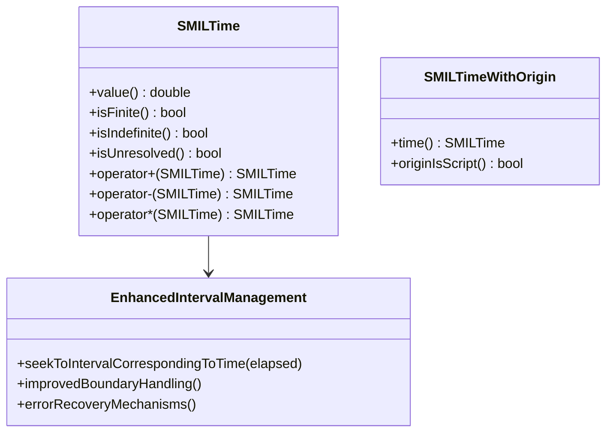

**Diagram sources**
- [SMILTime.h:34-55](file://blink-b87d44f-Source-core-svg/animation/SMILTime.h#L34-L55)
- [SMILTime.h:57-81](file://blink-b87d44f-Source-core-svg/animation/SMILTime.h#L57-L81)
- [SMILTime.cpp:38-65](file://blink-b87d44f-Source-core-svg/animation/SMILTime.cpp#L38-L65)
- [SVGSMILElement.cpp:951-982](file://blink-b87d44f-Source-core-svg/animation/SVGSMILElement.cpp#L951-L982)

**Section sources**
- [SMILTime.h:34-55](file://blink-b87d44f-Source-core-svg/animation/SMILTime.h#L34-L55)
- [SMILTime.cpp:34-65](file://blink-b87d44f-Source-core-svg/animation/SMILTime.cpp#L34-L65)
- [SVGSMILElement.cpp:951-982](file://blink-b87d44f-Source-core-svg/animation/SVGSMILElement.cpp#L951-L982)

### Advanced Timeline Management
- **Scheduling**:
  - Elements register per-target/attribute groups with enhanced dependency tracking
  - Sorted by begin time and document order with circular dependency detection
- **Execution**:
  - One-shot timer fires at next event with improved precision
  - Applies accumulated results to targets with priority resolution
- **Controls**:
  - begin/pause/resume/setElapsed with enhanced state management
  - Tracks begin/pause/resume times and accumulated active time with better recovery
- **Enhanced Features**:
  - Circular dependency detection prevents infinite loops
  - Advanced syncbase timing with repeat-based synchronization
  - Sophisticated event handling for complex timing scenarios

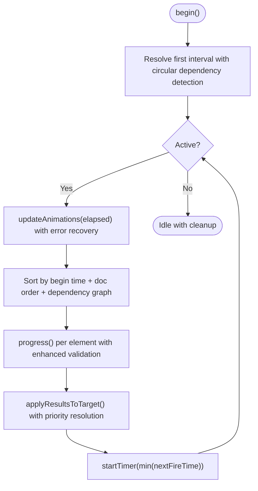

**Diagram sources**
- [SMILTimeContainer.cpp:133-148](file://blink-b87d44f-Source-core-svg/animation/SMILTimeContainer.cpp#L133-L148)
- [SMILTimeContainer.cpp:262-329](file://blink-b87d44f-Source-core-svg/animation/SMILTimeContainer.cpp#L262-L329)
- [SMILTimeContainer.h:70-76](file://blink-b87d44f-Source-core-svg/animation/SMILTimeContainer.h#L70-L76)
- [smil_timeline_syncbase.dart:182-255](file://lib/src/animation/smil/smil_timeline_syncbase.dart#L182-L255)

**Section sources**
- [SMILTimeContainer.h:45-98](file://blink-b87d44f-Source-core-svg/animation/SMILTimeContainer.h#L45-L98)
- [SMILTimeContainer.cpp:228-260](file://blink-b87d44f-Source-core-svg/animation/SMILTimeContainer.cpp#L228-L260)
- [smil_timeline_syncbase.dart:182-255](file://lib/src/animation/smil/smil_timeline_syncbase.dart#L182-L255)

### Enhanced SMIL Element Lifecycle and Timing Parsing
- **Attribute parsing**:
  - begin/end lists accept clock values and conditions (syncbase/event/accesskey) with comprehensive validation
  - Conditions parsed into typed entries with offsets and repeat counts with error recovery
- **Interval resolution**:
  - First interval computed at insertion with circular dependency detection
  - Begin/end list changes trigger re-resolution with enhanced validation
- **Restart/fill**:
  - restart policy (always/whenNotActive/never) with better state management
  - fill policy (remove/freeze) with improved edge case handling
- **Progress**:
  - percent and repeat calculation with enhanced precision
  - next progress time computation with better boundary handling
- **Enhanced Error Recovery**:
  - Graceful handling of invalid time sequences
  - Fallback mechanisms for malformed input
  - Improved validation with comprehensive test coverage

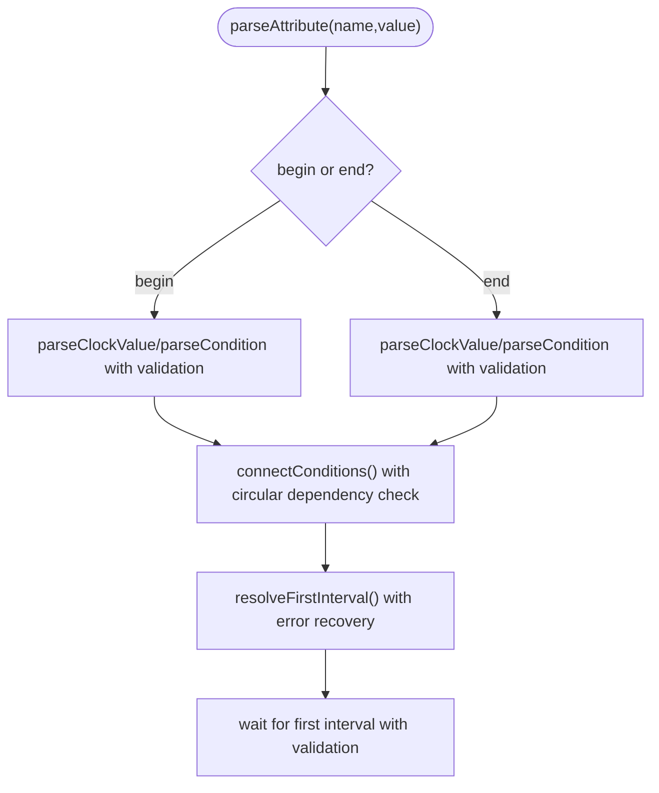

**Diagram sources**
- [SVGSMILElement.cpp:456-478](file://blink-b87d44f-Source-core-svg/animation/SVGSMILElement.cpp#L456-L478)
- [SVGSMILElement.cpp:419-437](file://blink-b87d44f-Source-core-svg/animation/SVGSMILElement.cpp#L419-L437)
- [SVGSMILElement.cpp:517-542](file://blink-b87d44f-Source-core-svg/animation/SVGSMILElement.cpp#L517-L542)
- [smil_parser_animation_parsing.dart:90-114](file://lib/src/animation/smil/smil_parser_animation_parsing.dart#L90-L114)

**Section sources**
- [SVGSMILElement.h:147-186](file://blink-b87d44f-Source-core-svg/animation/SVGSMILElement.h#L147-L186)
- [SVGSMILElement.cpp:283-337](file://blink-b87d44f-Source-core-svg/animation/SVGSMILElement.cpp#L283-L337)
- [SVGSMILElement.cpp:419-437](file://blink-b87d44f-Source-core-svg/animation/SVGSMILElement.cpp#L419-L437)
- [smil_parser_animation_parsing.dart:90-114](file://lib/src/animation/smil/smil_parser_animation_parsing.dart#L90-L114)

### Enhanced Animation Modes and Interpolation
- **Animation modes**:
  - FromTo/FromBy/To/By/Values/Path with improved validation
- **Calc modes**:
  - Discrete, Linear, Paced, Spline with enhanced edge case handling
- **Additive/accumulated**:
  - Additive applies delta; Accumulated sums across repeats with better precision
- **Values animation**:
  - Supports keyTimes/keyPoints/keySplines for pacing with enhanced validation
- **Enhanced**: Automatic discrete calcMode enforcement for non-interpolatable string attributes with comprehensive coverage
- **Improved Error Recovery**:
  - Graceful handling of invalid path data in motion animations
  - Better fallback mechanisms for malformed input
  - Enhanced validation with comprehensive test coverage

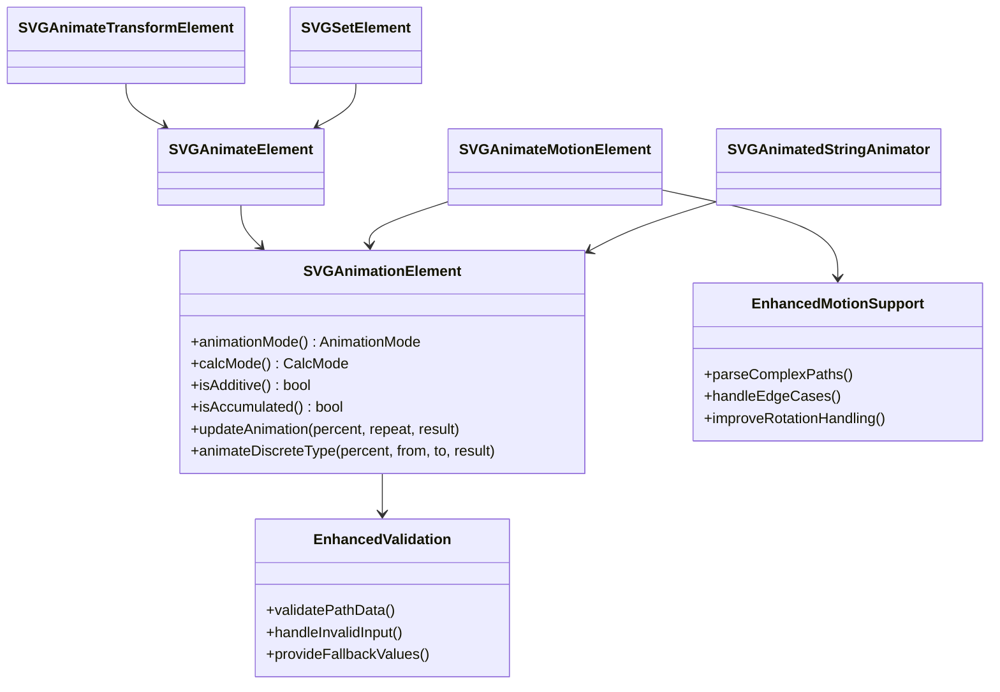

**Diagram sources**
- [SVGAnimationElement.h:36-59](file://blink-b87d44f-Source-core-svg/SVGAnimationElement.h#L36-L59)
- [SVGAnimationElement.h:188-199](file://blink-b87d44f-Source-core-svg/SVGAnimationElement.h#L188-L199)
- [SVGAnimateElement.h:36-75](file://blink-b87d44f-Source-core-svg/SVGAnimateElement.h#L36-L75)
- [SVGAnimateTransformElement.h:33-48](file://blink-b87d44f-Source-core-svg/SVGAnimateTransformElement.h#L33-L48)
- [SVGAnimateMotionElement.h:31-72](file://blink-b87d44f-Source-core-svg/SVGAnimateMotionElement.h#L31-L72)
- [SVGSetElement.h:29-36](file://blink-b87d44f-Source-core-svg/SVGSetElement.h#L29-L36)
- [SVGAnimatedString.h:40-55](file://blink-b87d44f-Source-core-svg/SVGAnimatedString.h#L40-L55)
- [smil_parser_motion.dart:208-253](file://lib/src/animation/smil/smil_parser_motion.dart#L208-L253)

**Section sources**
- [SVGAnimationElement.h:36-59](file://blink-b87d44f-Source-core-svg/SVGAnimationElement.h#L36-L59)
- [SVGAnimationElement.cpp:170-200](file://blink-b87d44f-Source-core-svg/SVGAnimationElement.cpp#L170-L200)
- [SVGAnimateElement.cpp:96-137](file://blink-b87d44f-Source-core-svg/SVGAnimateElement.cpp#L96-L137)
- [SVGAnimatedString.cpp:75-89](file://blink-b87d44f-Source-core-svg/SVGAnimatedString.cpp#L75-L89)
- [smil_parser_motion.dart:208-253](file://lib/src/animation/smil/smil_parser_motion.dart#L208-L253)

### Enhanced Attribute Animations (animate, set)
- **Property type detection**:
  - Determines AnimatedPropertyType for target attribute with enhanced validation
  - Validates against element type (e.g., transform lists require animateTransform) with better error handling
- **Value computation**:
  - From/To/By/Values with distance calculation and enhanced error recovery
  - calcMode affects sampling; discrete forces step values with automatic enforcement
- **Enhanced**: Automatic discrete calcMode enforcement for string attributes with comprehensive coverage
- **Application**:
  - CSS property path writes to animated style properties with priority resolution
  - SVG DOM path updates animated values and triggers change notifications with better error handling

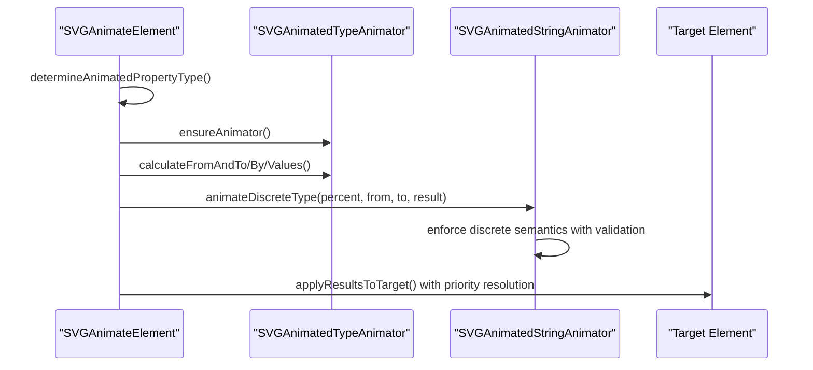

**Diagram sources**
- [SVGAnimateElement.cpp:64-94](file://blink-b87d44f-Source-core-svg/SVGAnimateElement.cpp#L64-L94)
- [SVGAnimateElement.cpp:147-174](file://blink-b87d44f-Source-core-svg/SVGAnimateElement.cpp#L147-L174)
- [SVGAnimateElement.cpp:346-368](file://blink-b87d44f-Source-core-svg/SVGAnimateElement.cpp#L346-L368)
- [SVGAnimatedString.cpp:75-89](file://blink-b87d44f-Source-core-svg/SVGAnimatedString.cpp#L75-L89)

**Section sources**
- [SVGAnimateElement.h:41-56](file://blink-b87d44f-Source-core-svg/SVGAnimateElement.h#L41-L56)
- [SVGAnimateElement.cpp:96-137](file://blink-b87d44f-Source-core-svg/SVGAnimateElement.cpp#L96-L137)
- [SVGAnimateElement.cpp:346-368](file://blink-b87d44f-Source-core-svg/SVGAnimateElement.cpp#L346-L368)
- [SVGAnimatedString.cpp:75-89](file://blink-b87d44f-Source-core-svg/SVGAnimatedString.cpp#L75-L89)

### Enhanced Transform Animations (animateTransform)
- Validates target supports transform list with improved error handling
- Parses transform type (skips matrix) with better validation
- Applies transform updates to target's transform list with enhanced precision
- Handles edge cases with graceful fallback mechanisms

**Section sources**
- [SVGAnimateTransformElement.cpp:45-52](file://blink-b87d44f-Source-core-svg/SVGAnimateTransformElement.cpp#L45-L52)
- [SVGAnimateTransformElement.cpp:62-77](file://blink-b87d44f-Source-core-svg/SVGAnimateTransformElement.cpp#L62-L77)

### Enhanced Motion Animations (animateMotion)
- **Path-based or coordinate-based motion** with comprehensive validation
- **Supports rotate modes**: angle/auto/auto-reverse with improved edge case handling
- **Uses path geometry** to compute position and normal for rotation with enhanced precision
- **Supports accumulation** across repeats with better error recovery
- **Enhanced Path Parsing**: Comprehensive support for complex path types including arcs, curves, and degenerate cases
- **Improved Rotation Handling**: Better tangent calculation and edge case management
- **Advanced Validation**: Graceful handling of invalid path data and malformed input

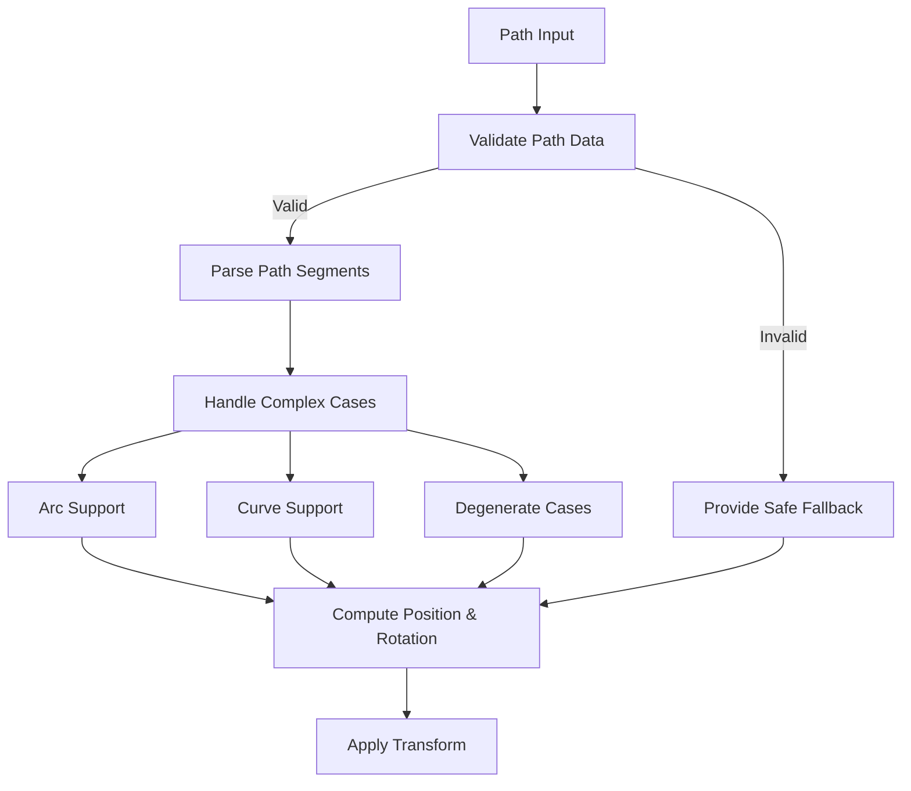

**Diagram sources**
- [smil_parser_motion.dart:208-253](file://lib/src/animation/smil/smil_parser_motion.dart#L208-L253)
- [smil_parser_motion.dart:255-312](file://lib/src/animation/smil/smil_parser_motion.dart#L255-L312)
- [smil_parser_motion.dart:374-390](file://lib/src/animation/smil/smil_parser_motion.dart#L374-L390)

**Section sources**
- [SVGAnimateMotionElement.h:54-72](file://blink-b87d44f-Source-core-svg/SVGAnimateMotionElement.h#L54-L72)
- [SVGAnimateMotionElement.cpp:243-297](file://blink-b87d44f-Source-core-svg/SVGAnimateMotionElement.cpp#L243-L297)
- [SVGAnimateMotionElement.cpp:329-340](file://blink-b87d44f-Source-core-svg/SVGAnimateMotionElement.cpp#L329-L340)
- [smil_parser_motion.dart:208-253](file://lib/src/animation/smil/smil_parser_motion.dart#L208-L253)

### Enhanced Set Animations (set)
- Fixed-value animation equivalent to to-animation with robust error handling
- Mode is constant and cannot be overridden with validation
- Enhanced integration with the animation system

**Section sources**
- [SVGSetElement.cpp:40-44](file://blink-b87d44f-Source-core-svg/SVGSetElement.cpp#L40-L44)

### Enhanced Discrete CalcMode Handling for String Attributes
**Updated** The implementation now automatically enforces discrete calcMode for non-interpolatable string-type attributes to match SMIL specifications with comprehensive coverage.

- **Automatic Enforcement**: String-type attributes are automatically set to discrete calcMode regardless of explicit specification
- **Comprehensive Coverage**: Extensive list of non-interpolatable properties including visibility, display, fill-rule, stroke-linecap, stroke-linejoin, pointer-events, clip-rule, text-anchor, dominant-baseline, alignment-baseline
- **CSS Property Mapping**: String properties are mapped to AnimatedString type for proper handling
- **Animator Behavior**: SVGAnimatedStringAnimator enforces discrete semantics through animateDiscreteType method
- **Enhanced Validation**: Comprehensive test coverage for edge cases and error recovery

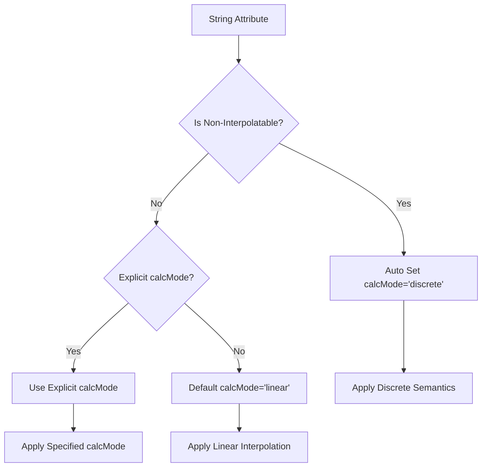

**Diagram sources**
- [smil_parser_animation_parsing.dart:134-147](file://lib/src/animation/smil/smil_parser_animation_parsing.dart#L134-L147)
- [smil_parser_animation_parsing.dart:465-492](file://lib/src/animation/smil/smil_parser_animation_parsing.dart#L465-L492)
- [SVGAnimatedString.cpp:75-89](file://blink-b87d44f-Source-core-svg/SVGAnimatedString.cpp#L75-L89)
- [SVGElement.cpp:648-690](file://blink-b87d44f-Source-core-svg/SVGElement.cpp#L648-L690)

**Section sources**
- [smil_parser_animation_parsing.dart:134-147](file://lib/src/animation/smil/smil_parser_animation_parsing.dart#L134-L147)
- [smil_parser_animation_parsing.dart:465-492](file://lib/src/animation/smil/smil_parser_animation_parsing.dart#L465-L492)
- [SVGAnimatedString.cpp:75-89](file://blink-b87d44f-Source-core-svg/SVGAnimatedString.cpp#L75-L89)
- [SVGElement.cpp:648-690](file://blink-b87d44f-Source-core-svg/SVGElement.cpp#L648-L690)

### Enhanced Timeline Synchronization
**New Section** The timeline system now includes advanced synchronization capabilities with comprehensive error handling and circular dependency detection.

- **Circular Dependency Detection**: Prevents infinite loops in complex timing scenarios
- **Advanced Syncbase Timing**: Support for repeat-based synchronization with offset handling
- **Event-Based Animations**: Sophisticated event handling for click, mouseover, and other DOM events
- **Priority Resolution**: Proper handling of animation sandwich model with additive stacking
- **Enhanced Error Recovery**: Graceful handling of malformed timing conditions and invalid references

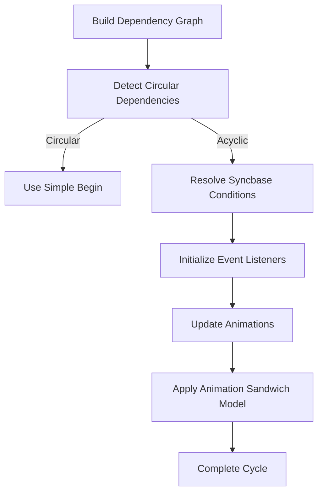

**Diagram sources**
- [smil_timeline_syncbase.dart:80-117](file://lib/src/animation/smil/smil_timeline_syncbase.dart#L80-L117)
- [smil_timeline_syncbase.dart:182-255](file://lib/src/animation/smil/smil_timeline_syncbase.dart#L182-L255)
- [smil_timeline_runtime.dart:128-177](file://lib/src/animation/smil/smil_timeline_runtime.dart#L128-177)

**Section sources**
- [smil_timeline_syncbase.dart:80-117](file://lib/src/animation/smil/smil_timeline_syncbase.dart#L80-L117)
- [smil_timeline_syncbase.dart:182-255](file://lib/src/animation/smil/smil_timeline_syncbase.dart#L182-L255)
- [smil_timeline_runtime.dart:128-177](file://lib/src/animation/smil/smil_timeline_runtime.dart#L128-L177)

## Dependency Analysis
- **SVGSMILElement** depends on:
  - SMILTime/SMILTimeContainer for timing with enhanced error handling
  - SVGAnimationElement for animation semantics with improved validation
  - Concrete elements for specialized behaviors with better edge case management
  - Enhanced syncbase system for complex timing relationships
- **SVGAnimationElement** depends on:
  - Animated property types and animators with comprehensive validation
  - CSS property mapping for CSS-application path with priority resolution
  - Enhanced runtime system for better error recovery
- **Enhanced**: String attributes depend on SVGAnimatedStringAnimator for discrete semantics with automatic enforcement
- **Concrete elements** specialize:
  - Value parsing and interpolation with improved error recovery
  - Result application to target transforms or style with priority handling
- **Enhanced Parser Dependencies**:
  - Comprehensive validation with fallback mechanisms
  - Edge case handling for malformed input
  - Advanced path parsing for motion animations

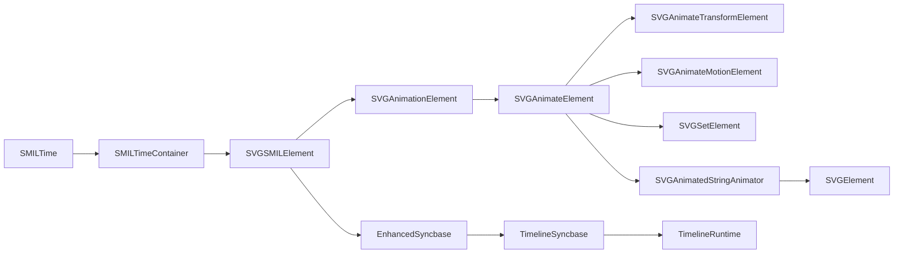

**Diagram sources**
- [SMILTimeContainer.h:41-43](file://blink-b87d44f-Source-core-svg/animation/SMILTimeContainer.h#L41-L43)
- [SVGSMILElement.h:39-42](file://blink-b87d44f-Source-core-svg/animation/SVGSMILElement.h#L39-L42)
- [SVGAnimationElement.h:65-67](file://blink-b87d44f-Source-core-svg/SVGAnimationElement.h#L65-L67)
- [SVGAnimateElement.h:36-38](file://blink-b87d44f-Source-core-svg/SVGAnimateElement.h#L36-L38)
- [SVGAnimatedString.h:40-55](file://blink-b87d44f-Source-core-svg/SVGAnimatedString.h#L40-L55)
- [smil_timeline_syncbase.dart:1-256](file://lib/src/animation/smil/smil_timeline_syncbase.dart#L1-L256)

**Section sources**
- [SVGSMILElement.h:39-42](file://blink-b87d44f-Source-core-svg/animation/SVGSMILElement.h#L39-L42)
- [SVGAnimationElement.h:65-67](file://blink-b87d44f-Source-core-svg/SVGAnimationElement.h#L65-L67)

## Performance Considerations
- **Frame scheduling**:
  - One-shot timers minimize overhead; minimum delay bounds keep frames reasonable
  - Enhanced precision in interval calculations reduces unnecessary updates
- **Sorting**:
  - Priority sorting by begin time and document order ensures deterministic evaluation
  - Circular dependency detection prevents infinite loops that could cause performance issues
- **Accumulation**:
  - Additive/accumulated modes avoid recomputing base values each frame
  - Enhanced error recovery prevents cascading failures that could impact performance
- **CSS vs DOM application**:
  - CSS path avoids DOM churn; DOM path notifies renderers and instances
  - Priority resolution ensures optimal performance in complex scenarios
- **Enhanced**: String attribute animations use efficient discrete semantics without complex interpolation calculations
- **Improved Memory Management**:
  - Better cleanup of invalid animations and references
  - Enhanced resource management for complex animation graphs

## Troubleshooting Guide
Common issues and diagnostics with enhanced error handling:
- **Invalid begin/end values**:
  - Unresolved times indicate parse failures; verify time formats and condition syntax with comprehensive validation
  - Enhanced error recovery provides fallback mechanisms for malformed input
- **Conditions not firing**:
  - Ensure eventBase exists and condition names match; reconnect conditions on attribute changes
  - Circular dependency detection prevents infinite loops in complex timing scenarios
- **Transform animations not applied**:
  - Verify target supports transform list and element type matches (animate vs animateTransform) with enhanced validation
- **Motion path not followed**:
  - Confirm pathAttr/mpath availability and path validity; check rotate mode expectations
  - Enhanced path parsing handles complex edge cases gracefully
- **CSS property not updating**:
  - Validate attributeType and CSS property mapping; ensure target is in document and instances updated
  - Priority resolution ensures correct behavior in complex animation scenarios
- **Enhanced**: String attribute animations not working:
  - Verify attribute is in discrete attributes list; automatic discrete calcMode enforcement occurs for non-interpolatable string properties
  - Comprehensive test coverage ensures reliable behavior across edge cases
- **Enhanced**: Visibility/display animations incorrect:
  - Ensure discrete calcMode is being enforced; string properties automatically use discrete semantics per SMIL spec
- **Enhanced**: Complex timing scenarios failing**:
  - Check for circular dependencies in syncbase timing
  - Verify repeat-based synchronization is configured correctly with offset support
- **Enhanced**: Motion animation edge cases**:
  - Validate path data handles degenerate cases and complex path segments
  - Check rotation calculations for discontinuous paths

**Section sources**
- [SVGSMILElement.cpp:303-337](file://blink-b87d44f-Source-core-svg/animation/SVGSMILElement.cpp#L303-L337)
- [SVGSMILElement.cpp:517-571](file://blink-b87d44f-Source-core-svg/animation/SVGSMILElement.cpp#L517-L571)
- [SVGAnimateTransformElement.cpp:45-52](file://blink-b87d44f-Source-core-svg/SVGAnimateTransformElement.cpp#L45-L52)
- [SVGAnimateMotionElement.cpp:133-154](file://blink-b87d44f-Source-core-svg/SVGAnimateMotionElement.cpp#L133-L154)
- [SVGAnimateElement.cpp:237-293](file://blink-b87d44f-Source-core-svg/SVGAnimateElement.cpp#L237-L293)
- [smil_edge_cases_test.dart:1-507](file://test/animation/smil_edge_cases_test.dart#L1-L507)
- [smil_edge_cases_advanced_test.dart:1-516](file://test/animation/smil_edge_cases_advanced_test.dart#L1-L516)

## Conclusion
The implementation provides a robust SMIL timing model with comprehensive support for attribute, transform, motion, and set animations. **Enhanced** with improved discrete calcMode handling for string-type attributes, advanced edge case recovery, improved timeline synchronization with circular dependency detection, and better motion animation support with comprehensive path parsing capabilities. The system now includes sophisticated error recovery mechanisms, comprehensive validation, and extensive test coverage demonstrating reliable behavior across complex scenarios. The automatic enforcement of discrete semantics for visibility, display, fill-rule, stroke-linecap, and other string attributes ensures predictable animation behavior. The system integrates seamlessly with both CSS and SVG DOM property systems, offering flexible interpolation and accumulation semantics while maintaining strict compliance with SMIL standards.

## Appendices

### Supported SMIL Elements and Attributes
- **animate, animateTransform, animateMotion, set** with enhanced validation
- **Timing attributes**: begin, end, dur, repeatDur, repeatCount, min, max, fill, restart with comprehensive error handling
- **Animation attributes**: attributeType, attributeName, calcMode, values, keyTimes, keyPoints, keySplines, from, to, by with enhanced parsing
- **animateMotion-specific**: path, rotate with comprehensive path parsing support
- **Enhanced**: Comprehensive support for complex path types including arcs, curves, and degenerate cases

**Section sources**
- [SVGSMILElement.h:44-44](file://blink-b87d44f-Source-core-svg/animation/SVGSMILElement.h#L44-L44)
- [SVGSMILElement.cpp:439-454](file://blink-b87d44f-Source-core-svg/animation/SVGSMILElement.cpp#L439-L454)
- [SVGAnimateMotionElement.h:96-102](file://blink-b87d44f-Source-core-svg/SVGAnimateMotionElement.h#L96-L102)
- [smil_parser_motion.dart:208-253](file://lib/src/animation/smil/smil_parser_motion.dart#L208-L253)

### Enhanced Interpolation Methods
- **calcMode**:
  - discrete: step at midpoint (automatically enforced for string attributes)
  - linear: linear blend with enhanced precision
  - paced: uniform speed along path/list with comprehensive edge case handling
  - spline: bezier curves via keySplines with improved validation
- **additive/accumulate**:
  - additive: adds delta per frame with better error recovery
  - accumulate: sums across repeats with enhanced precision
- **Enhanced**: String attributes automatically use discrete calcMode per SMIL specification with comprehensive coverage

**Section sources**
- [SVGAnimationElement.h:54-59](file://blink-b87d44f-Source-core-svg/SVGAnimationElement.h#L54-L59)
- [SVGAnimationElement.cpp:147-162](file://blink-b87d44f-Source-core-svg/SVGAnimationElement.cpp#L147-L162)
- [SVGAnimateElement.cpp:370-387](file://blink-b87d44f-Source-core-svg/SVGAnimateElement.cpp#L370-L387)

### Enhanced SMIL-to-CSS Conversion Guidance
- **When applying to CSS properties**:
  - Use animated style properties on target and instances with priority resolution
  - Ensure attributeType and CSS property mapping are valid with comprehensive validation
- **When applying to SVG DOM properties**:
  - Update animated values and notify via change hooks with enhanced error recovery
- **Enhanced**: String attributes automatically handled as CSS properties for discrete semantics with priority resolution

**Section sources**
- [SVGAnimateElement.cpp:237-293](file://blink-b87d44f-Source-core-svg/SVGAnimateElement.cpp#L237-L293)
- [SVGAnimateElement.cpp:346-368](file://blink-b87d44f-Source-core-svg/SVGAnimateElement.cpp#L346-L368)

### Enhanced Examples Index
- **Attribute animation**: animate with from/to and calcMode with comprehensive validation
- **Transform animation**: animateTransform with type and enhanced error handling
- **Motion animation**: animateMotion with path or from/to coordinates and rotate with comprehensive path support
- **Set animation**: set to a fixed value with robust error recovery
- **Enhanced**: String attribute animation**: visibility, display, fill-rule with discrete calcMode and automatic enforcement
- **Enhanced**: Complex motion scenarios**: arcs, curves, and degenerate path cases with edge case handling

### Enhanced Non-Interpolatable String Attributes
**New Section** The following string-type attributes automatically use discrete calcMode semantics per SMIL specification with comprehensive coverage:

- **visibility**: visible, hidden, collapse
- **display**: inline, block, list-item, etc.
- **fill-rule**: nonzero, evenodd
- **stroke-linecap**: butt, round, square
- **stroke-linejoin**: miter, round, bevel
- **pointer-events**: visiblepainted, visiblefill, visiblestroke, visible, pained, fill, stroke, all, none
- **clip-rule**: nonzero, evenodd
- **text-anchor**: start, middle, end
- **dominant-baseline**: baseline, liddle, abovex, etc.
- **alignment-baseline**: baseline, liddle, abovex, etc.

**Section sources**
- [smil_parser_animation_parsing.dart:465-492](file://lib/src/animation/smil/smil_parser_animation_parsing.dart#L465-L492)
- [SVGElement.cpp:648-690](file://blink-b87d44f-Source-core-svg/SVGElement.cpp#L648-L690)

### Enhanced Test Cases and Verification
**New Section** Comprehensive test coverage demonstrates proper discrete calcMode behavior and edge case handling:

- **Visibility animation** with discrete calcMode maintains step-wise transitions with comprehensive validation
- **Display animation** with discrete calcMode properly handles show/hide states with edge case handling
- **Freeze fill mode** preserves final discrete values with enhanced error recovery
- **Remove fill mode** restores base values after animation completion with proper cleanup
- **Edge case handling**: Empty SVG, missing animations, invalid path data, malformed input with graceful fallback
- **Advanced syncbase timing**: Repeat-based synchronization with offset support and circular dependency detection
- **Motion animation edge cases**: Complex paths, degenerate cases, and rotation handling with comprehensive validation

**Section sources**
- [visibility_animation_test.dart:40-80](file://test/animation/visibility_animation_test.dart#L40-L80)
- [visibility_animation_test.dart:180-212](file://test/animation/visibility_animation_test.dart#L180-L212)
- [smil_edge_cases_test.dart:1-507](file://test/animation/smil_edge_cases_test.dart#L1-L507)
- [smil_edge_cases_advanced_test.dart:1-516](file://test/animation/smil_edge_cases_advanced_test.dart#L1-L516)
- [animate_motion_advanced_test.dart:1-719](file://test/animation/animate_motion_advanced_test.dart#L1-L719)