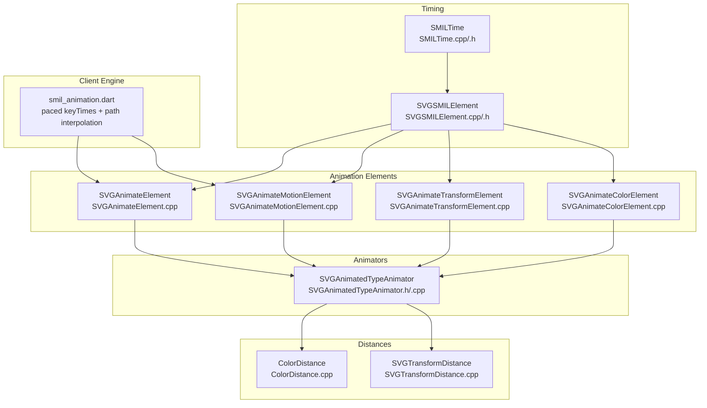
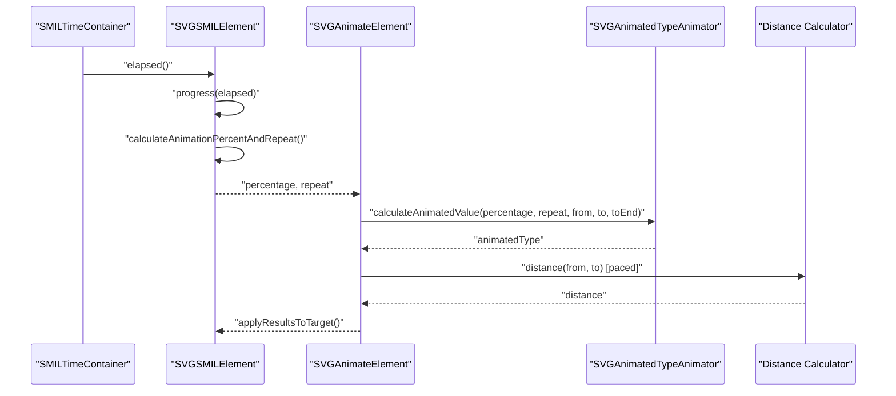
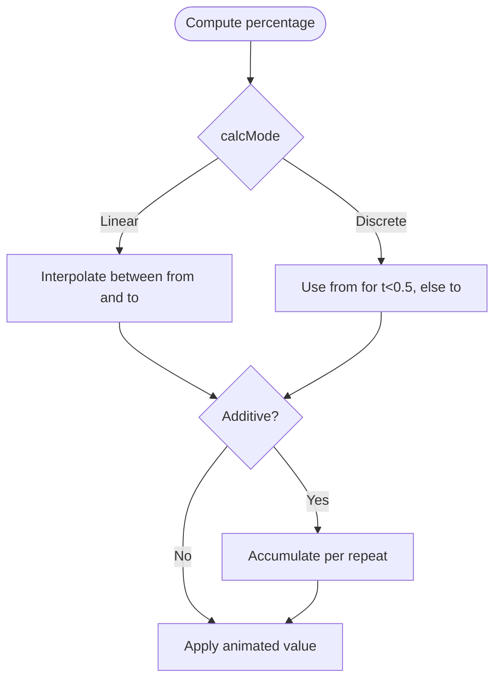
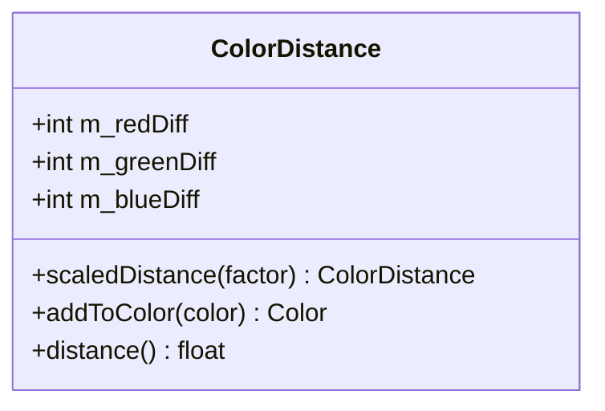
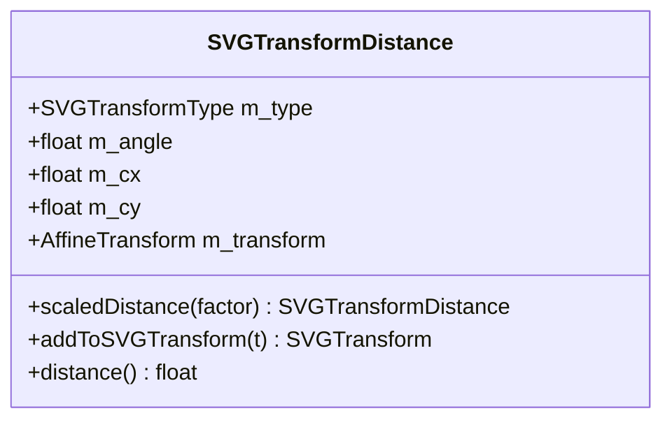
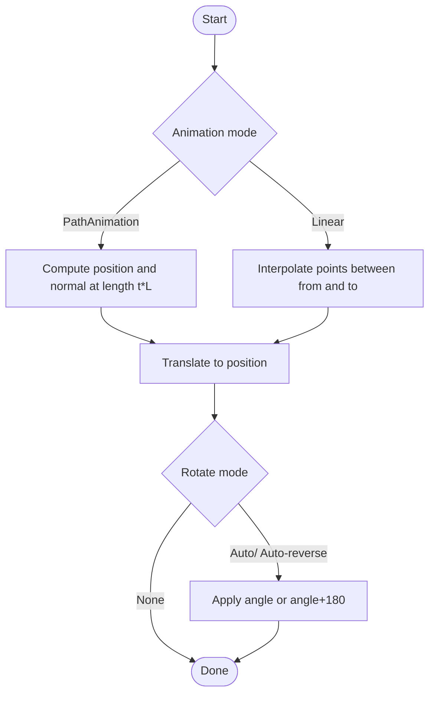
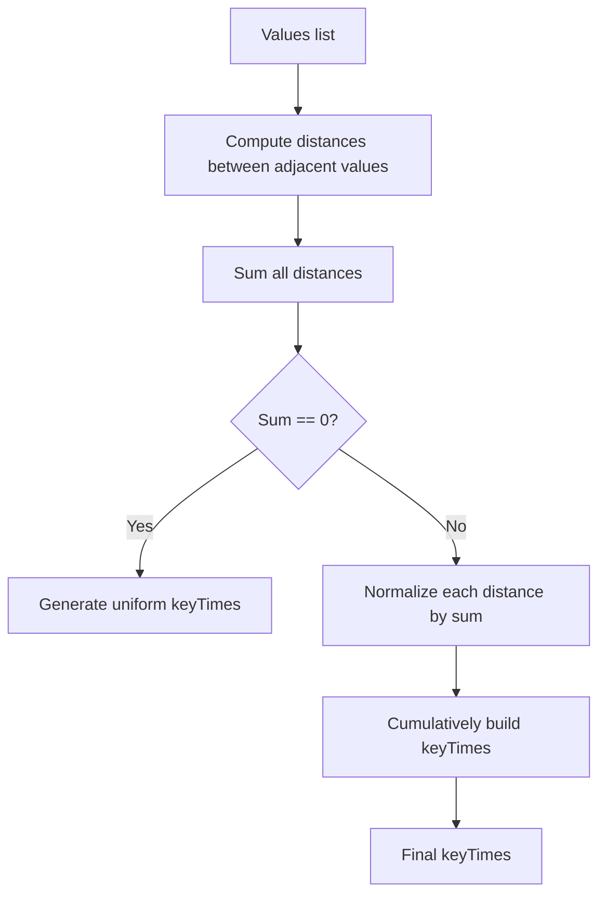
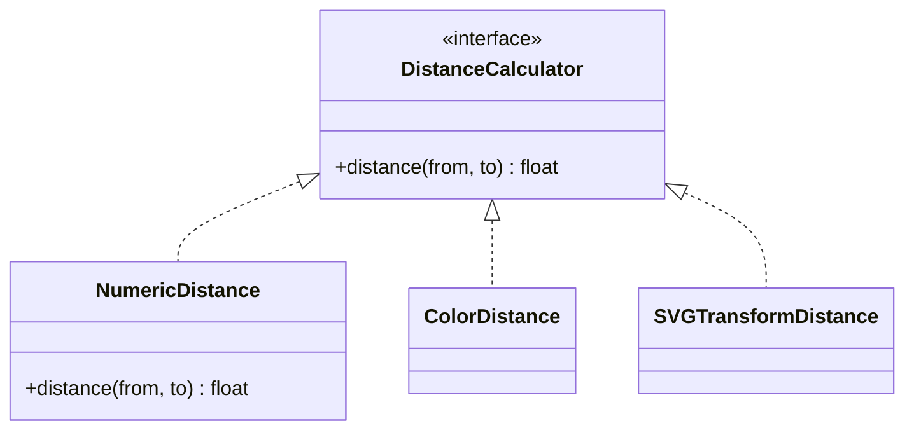
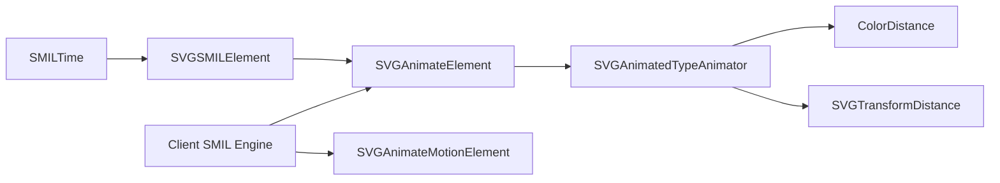

# SMIL Interpolation Methods

<cite>
**Referenced Files in This Document**
- [SMILTime.cpp](file://blink-b87d44f-Source-core-svg/animation/SMILTime.cpp)
- [SMILTime.h](file://blink-b87d44f-Source-core-svg/animation/SMILTime.h)
- [SVGSMILElement.cpp](file://blink-b87d44f-Source-core-svg/animation/SVGSMILElement.cpp)
- [SVGSMILElement.h](file://blink-b87d44f-Source-core-svg/animation/SVGSMILElement.h)
- [SVGAnimateElement.cpp](file://blink-b87d44f-Source-core-svg/SVGAnimateElement.cpp)
- [SVGAnimateColorElement.cpp](file://blink-b87d44f-Source-core-svg/SVGAnimateColorElement.cpp)
- [SVGAnimateTransformElement.cpp](file://blink-b87d44f-Source-core-svg/SVGAnimateTransformElement.cpp)
- [SVGAnimateMotionElement.cpp](file://blink-b87d44f-Source-core-svg/SVGAnimateMotionElement.cpp)
- [SVGAnimatedTypeAnimator.h](file://blink-b87d44f-Source-core-svg/SVGAnimatedTypeAnimator.h)
- [SVGAnimatedTypeAnimator.cpp](file://blink-b87d44f-Source-core-svg/SVGAnimatedTypeAnimator.cpp)
- [ColorDistance.cpp](file://blink-b87d44f-Source-core-svg/ColorDistance.cpp)
- [SVGTransformDistance.cpp](file://blink-b87d44f-Source-core-svg/SVGTransformDistance.cpp)
- [smil_animation.dart](file://lib/src/animation/smil/smil_animation.dart)
- [paced_calcmode_test.dart](file://test/animation/paced_calcmode_test.dart)
- [smil_path_interpolation_test.dart](file://test/animation/smil_path_interpolation_test.dart)
</cite>

## Table of Contents
1. [Introduction](#introduction)
2. [Project Structure](#project-structure)
3. [Core Components](#core-components)
4. [Architecture Overview](#architecture-overview)
5. [Detailed Component Analysis](#detailed-component-analysis)
6. [Dependency Analysis](#dependency-analysis)
7. [Performance Considerations](#performance-considerations)
8. [Troubleshooting Guide](#troubleshooting-guide)
9. [Conclusion](#conclusion)

## Introduction
This document explains SMIL interpolation methods and mathematical calculations implemented in the Blink SVG animation subsystem. It covers:
- Numeric interpolation (including additive accumulation)
- Color interpolation (with distance metrics)
- Transform interpolation (translate, scale, rotate, skew)
- Path data morphing (SVG path interpolation)
- Pacing functions (linear, discrete, paced)
- calcMode behaviors and keyTimes/keySplines specifications
- Edge cases, precision handling, and performance optimization
- Custom interpolator implementation patterns

## Project Structure
The SMIL interpolation pipeline spans several layers:
- Timing and intervals: SMIL time parsing, begin/end lists, active duration computation
- Animation elements: animate, animateMotion, animateTransform, animateColor
- Type-specific animators: numeric, color, transform, path
- Distance calculators: color and transform distances
- Client-side SMIL engine: paced keyTimes generation and path interpolation

**Diagram sources**
- [SMILTime.cpp:34-66](file://blink-b87d44f-Source-core-svg/animation/SMILTime.cpp#L34-L66)
- [SMILTime.h:34-55](file://blink-b87d44f-Source-core-svg/animation/SMILTime.h#L34-L55)
- [SVGSMILElement.cpp:645-800](file://blink-b87d44f-Source-core-svg/animation/SVGSMILElement.cpp#L645-L800)
- [SVGAnimateElement.cpp:96-137](file://blink-b87d44f-Source-core-svg/SVGAnimateElement.cpp#L96-L137)
- [SVGAnimateMotionElement.cpp:243-297](file://blink-b87d44f-Source-core-svg/SVGAnimateMotionElement.cpp#L243-L297)
- [SVGAnimateTransformElement.cpp:45-80](file://blink-b87d44f-Source-core-svg/SVGAnimateTransformElement.cpp#L45-L80)
- [SVGAnimateColorElement.cpp:47-54](file://blink-b87d44f-Source-core-svg/SVGAnimateColorElement.cpp#L47-L54)
- [SVGAnimatedTypeAnimator.h:43-109](file://blink-b87d44f-Source-core-svg/SVGAnimatedTypeAnimator.h#L43-L109)
- [ColorDistance.cpp:28-92](file://blink-b87d44f-Source-core-svg/ColorDistance.cpp#L28-L92)
- [SVGTransformDistance.cpp:32-219](file://blink-b87d44f-Source-core-svg/SVGTransformDistance.cpp#L32-L219)
- [smil_animation.dart:122-178](file://lib/src/animation/smil/smil_animation.dart#L122-L178)

**Section sources**
- [SVGSMILElement.cpp:645-800](file://blink-b87d44f-Source-core-svg/animation/SVGSMILElement.cpp#L645-L800)
- [SVGAnimateElement.cpp:96-137](file://blink-b87d44f-Source-core-svg/SVGAnimateElement.cpp#L96-L137)
- [SVGAnimateMotionElement.cpp:243-297](file://blink-b87d44f-Source-core-svg/SVGAnimateMotionElement.cpp#L243-L297)
- [SVGAnimateTransformElement.cpp:45-80](file://blink-b87d44f-Source-core-svg/SVGAnimateTransformElement.cpp#L45-L80)
- [SVGAnimateColorElement.cpp:47-54](file://blink-b87d44f-Source-core-svg/SVGAnimateColorElement.cpp#L47-L54)
- [SVGAnimatedTypeAnimator.h:43-109](file://blink-b87d44f-Source-core-svg/SVGAnimatedTypeAnimator.h#L43-L109)
- [ColorDistance.cpp:28-92](file://blink-b87d44f-Source-core-svg/ColorDistance.cpp#L28-L92)
- [SVGTransformDistance.cpp:32-219](file://blink-b87d44f-Source-core-svg/SVGTransformDistance.cpp#L32-L219)
- [smil_animation.dart:122-178](file://lib/src/animation/smil/smil_animation.dart#L122-L178)

## Core Components
- SMILTime: Represents time values with unresolved/indefinite semantics and arithmetic operators.
- SVGSMILElement: Implements SMIL interval timing, begin/end lists, active duration, and interval progression.
- SVGAnimateElement: Orchestrates numeric/color interpolation, additive/accumulative modes, and calcMode handling.
- SVGAnimateMotionElement: Handles motion along a path or linearly, with rotation modes and additive accumulation.
- SVGAnimateTransformElement: Restricts to transform-list animations and transform type selection.
- SVGAnimatedTypeAnimator: Abstract interface for constructing values, calculating animated values, and computing distances.
- ColorDistance: Computes color differences and distances for interpolation.
- SVGTransformDistance: Computes transform deltas and distances for interpolation.
- Client SMIL engine (Dart): Generates paced keyTimes and performs path interpolation.

**Section sources**
- [SMILTime.h:34-55](file://blink-b87d44f-Source-core-svg/animation/SMILTime.h#L34-L55)
- [SVGSMILElement.h:38-110](file://blink-b87d44f-Source-core-svg/animation/SVGSMILElement.h#L38-L110)
- [SVGAnimateElement.cpp:96-137](file://blink-b87d44f-Source-core-svg/SVGAnimateElement.cpp#L96-L137)
- [SVGAnimateMotionElement.cpp:243-297](file://blink-b87d44f-Source-core-svg/SVGAnimateMotionElement.cpp#L243-L297)
- [SVGAnimateTransformElement.cpp:45-80](file://blink-b87d44f-Source-core-svg/SVGAnimateTransformElement.cpp#L45-L80)
- [SVGAnimatedTypeAnimator.h:43-109](file://blink-b87d44f-Source-core-svg/SVGAnimatedTypeAnimator.h#L43-L109)
- [ColorDistance.cpp:28-92](file://blink-b87d44f-Source-core-svg/ColorDistance.cpp#L28-L92)
- [SVGTransformDistance.cpp:32-219](file://blink-b87d44f-Source-core-svg/SVGTransformDistance.cpp#L32-L219)
- [smil_animation.dart:122-178](file://lib/src/animation/smil/smil_animation.dart#L122-L178)

## Architecture Overview
The SMIL interpolation pipeline proceeds as follows:
- Timing resolves begin/end lists, computes active duration, and determines the current interval and progress percentage.
- Animation elements compute the normalized progress (0..1) and choose calcMode behavior (linear/discrete/paced).
- Animators convert from/to values to typed animated types and compute interpolated results.
- Distances are used for paced calcMode and transform/color interpolation.
- Results are applied to target attributes or transforms.

**Diagram sources**
- [SVGSMILElement.cpp:195-229](file://blink-b87d44f-Source-core-svg/animation/SVGSMILElement.cpp#L195-L229)
- [SVGAnimateElement.cpp:96-137](file://blink-b87d44f-Source-core-svg/SVGAnimateElement.cpp#L96-L137)
- [SVGAnimatedTypeAnimator.h:56-57](file://blink-b87d44f-Source-core-svg/SVGAnimatedTypeAnimator.h#L56-L57)
- [ColorDistance.cpp:85-89](file://blink-b87d44f-Source-core-svg/ColorDistance.cpp#L85-L89)
- [SVGTransformDistance.cpp:197-216](file://blink-b87d44f-Source-core-svg/SVGTransformDistance.cpp#L197-L216)

## Detailed Component Analysis

### Numeric Interpolation (animate/set)
Numeric interpolation supports:
- Linear interpolation between from and to values.
- Discrete calcMode (snap to from or to at midpoint).
- Additive and accumulated modes for repeated animations.
- Set element behavior (constant value for entire duration).

Implementation highlights:
- Percentage handling and calcMode selection occur in the animation element.
- Animator receives from/to and computes the animated value for the current percentage.
- Additive mode adds delta per repeat; accumulation extends to end-of-duration value.

**Diagram sources**
- [SVGAnimateElement.cpp:96-137](file://blink-b87d44f-Source-core-svg/SVGAnimateElement.cpp#L96-L137)

**Section sources**
- [SVGAnimateElement.cpp:96-137](file://blink-b87d44f-Source-core-svg/SVGAnimateElement.cpp#L96-L137)

### Color Interpolation (animateColor)
Color interpolation uses:
- ColorDistance to compute differences in RGB channels.
- Distance-based interpolation for paced calcMode.
- Special handling for currentColor keyword.

Key behaviors:
- Differences are computed per channel and scaled by percentage.
- Clamp to valid color ranges.
- Distance metric is Euclidean-like across RGB.

**Diagram sources**
- [ColorDistance.cpp:28-92](file://blink-b87d44f-Source-core-svg/ColorDistance.cpp#L28-L92)

**Section sources**
- [SVGAnimateColorElement.cpp:47-54](file://blink-b87d44f-Source-core-svg/SVGAnimateColorElement.cpp#L47-L54)
- [ColorDistance.cpp:28-92](file://blink-b87d44f-Source-core-svg/ColorDistance.cpp#L28-L92)

### Transform Interpolation (animateTransform)
Transform interpolation supports:
- Translate, scale, rotate, skewX, skewY.
- TransformDistance computes deltas per transform type.
- Additive accumulation sums transform deltas across repeats.

Important constraints:
- animateTransform operates on transform lists; single transform type is selected via the type attribute.
- Matrix transforms are not supported as a type.

**Diagram sources**
- [SVGTransformDistance.cpp:32-219](file://blink-b87d44f-Source-core-svg/SVGTransformDistance.cpp#L32-L219)
- [SVGAnimateTransformElement.cpp:45-80](file://blink-b87d44f-Source-core-svg/SVGAnimateTransformElement.cpp#L45-L80)

**Section sources**
- [SVGTransformDistance.cpp:32-219](file://blink-b87d44f-Source-core-svg/SVGTransformDistance.cpp#L32-L219)
- [SVGAnimateTransformElement.cpp:45-80](file://blink-b87d44f-Source-core-svg/SVGAnimateTransformElement.cpp#L45-L80)

### Path Data Morphing (animateMotion)
Path interpolation for animateMotion supports:
- PathAnimation mode using a path string or mpath element.
- Position and normal extraction along the path for translation and rotation.
- Rotation modes: none, auto, auto-reverse.
- Additive accumulation translates by total path length times repeat count.

**Diagram sources**
- [SVGAnimateMotionElement.cpp:243-297](file://blink-b87d44f-Source-core-svg/SVGAnimateMotionElement.cpp#L243-L297)

**Section sources**
- [SVGAnimateMotionElement.cpp:243-297](file://blink-b87d44f-Source-core-svg/SVGAnimateMotionElement.cpp#L243-L297)

### Pacing Functions and calcMode Behaviors
Pacing and timing:
- calcMode: linear, discrete, paced
- keyTimes: explicit override for pacing
- keySplines: cubic-bezier pacing (not shown in referenced files; see client engine below)

Client engine (Dart) behavior:
- For paced calcMode without explicit keyTimes, generates keyTimes based on normalized distances between values.
- Uses a distance calculator factory to compute segment distances.
- If total distance is zero, distributes keyTimes uniformly.
- Otherwise, normalizes cumulative distances by total to produce keyTimes.

**Diagram sources**
- [smil_animation.dart:133-178](file://lib/src/animation/smil/smil_animation.dart#L133-L178)

**Section sources**
- [smil_animation.dart:122-178](file://lib/src/animation/smil/smil_animation.dart#L122-L178)
- [paced_calcmode_test.dart:121-153](file://test/animation/paced_calcmode_test.dart#L121-L153)

### Mathematical Formulas and Step-by-Step Examples
- Linear interpolation between two numeric values:
  - Value(t) = from + (to - from) × t
- Discrete interpolation:
  - Value(t) = from if t < 0.5 else to
- Color interpolation:
  - Diff = to - from (per channel)
  - Result = clamp(from + Diff × t)
  - Distance = sqrt(sum of squared diffs)
- Transform interpolation:
  - For translate/scale/rotate/skew, compute delta per type and add scaled delta to current transform
  - Distance = norm of transform parameters (angle, translation offsets, scale factors)
- Path interpolation:
  - Extract point and normal at length t×L on the path
  - Translate to point; optionally rotate by angle or angle+180 for auto-reverse

Note: These formulas are derived from the referenced implementations and tests.

**Section sources**
- [SVGAnimateElement.cpp:96-137](file://blink-b87d44f-Source-core-svg/SVGAnimateElement.cpp#L96-L137)
- [ColorDistance.cpp:85-89](file://blink-b87d44f-Source-core-svg/ColorDistance.cpp#L85-L89)
- [SVGTransformDistance.cpp:197-216](file://blink-b87d44f-Source-core-svg/SVGTransformDistance.cpp#L197-L216)
- [SVGAnimateMotionElement.cpp:275-296](file://blink-b87d44f-Source-core-svg/SVGAnimateMotionElement.cpp#L275-L296)
- [smil_animation.dart:133-178](file://lib/src/animation/smil/smil_animation.dart#L133-L178)

### Performance Considerations
- Minimize repeated parsing: cache parsed begin/end times and durations.
- Use additive accumulation judiciously; repeated transform additions can be expensive.
- For paced calcMode, precompute distances to avoid recomputation per frame.
- Clamp t to [0, 1] early to prevent unnecessary computations.
- Prefer uniform keyTimes when all distances are equal to avoid floating-point overhead.

[No sources needed since this section provides general guidance]

### Troubleshooting Guide
Common issues and resolutions:
- Unresolved or indefinite times: Ensure begin/end lists and durations are valid; check for “indefinite” semantics.
- calcMode mismatch: Verify that paced calcMode has computable distances; otherwise, fallback to uniform keyTimes.
- Transform type mismatch: animateTransform requires a supported transform type; matrix is not allowed.
- Additive vs. replace: Confirm whether additive mode is intended; additive can compound values across repeats.
- Path animation errors: Ensure the path string or mpath element is valid and produces a point-and-normal at the requested length.

**Section sources**
- [SVGSMILElement.cpp:645-800](file://blink-b87d44f-Source-core-svg/animation/SVGSMILElement.cpp#L645-L800)
- [SVGAnimateMotionElement.cpp:243-297](file://blink-b87d44f-Source-core-svg/SVGAnimateMotionElement.cpp#L243-L297)
- [SVGAnimateTransformElement.cpp:45-80](file://blink-b87d44f-Source-core-svg/SVGAnimateTransformElement.cpp#L45-L80)
- [smil_animation.dart:133-178](file://lib/src/animation/smil/smil_animation.dart#L133-L178)

### Custom Interpolator Implementation Patterns
Patterns observed in the codebase:
- Implement a distance calculator with a distance(from, to) method returning a scalar.
- Provide a scaledDistance(factor) and addToType/addToTransform helpers.
- In calcMode=paced, compute distances between consecutive values, normalize by total, and build keyTimes.
- For additive animations, compute deltas per repeat and accumulate.

**Diagram sources**
- [ColorDistance.cpp:28-92](file://blink-b87d44f-Source-core-svg/ColorDistance.cpp#L28-L92)
- [SVGTransformDistance.cpp:32-219](file://blink-b87d44f-Source-core-svg/SVGTransformDistance.cpp#L32-L219)
- [smil_animation.dart:133-178](file://lib/src/animation/smil/smil_animation.dart#L133-L178)

**Section sources**
- [SVGAnimatedTypeAnimator.h:47-57](file://blink-b87d44f-Source-core-svg/SVGAnimatedTypeAnimator.h#L47-L57)
- [ColorDistance.cpp:28-92](file://blink-b87d44f-Source-core-svg/ColorDistance.cpp#L28-L92)
- [SVGTransformDistance.cpp:32-219](file://blink-b87d44f-Source-core-svg/SVGTransformDistance.cpp#L32-L219)
- [smil_animation.dart:133-178](file://lib/src/animation/smil/smil_animation.dart#L133-L178)

## Dependency Analysis
Key dependencies:
- SVGSMILElement depends on SMILTime for time arithmetic and interval resolution.
- SVGAnimateElement depends on SVGAnimatedTypeAnimator for typed interpolation.
- Color and transform interpolation depend on dedicated distance calculators.
- Client engine depends on distance calculators and path utilities.

**Diagram sources**
- [SMILTime.h:34-55](file://blink-b87d44f-Source-core-svg/animation/SMILTime.h#L34-L55)
- [SVGSMILElement.h:38-110](file://blink-b87d44f-Source-core-svg/animation/SVGSMILElement.h#L38-L110)
- [SVGAnimateElement.cpp:96-137](file://blink-b87d44f-Source-core-svg/SVGAnimateElement.cpp#L96-L137)
- [SVGAnimatedTypeAnimator.h:43-109](file://blink-b87d44f-Source-core-svg/SVGAnimatedTypeAnimator.h#L43-L109)
- [ColorDistance.cpp:28-92](file://blink-b87d44f-Source-core-svg/ColorDistance.cpp#L28-L92)
- [SVGTransformDistance.cpp:32-219](file://blink-b87d44f-Source-core-svg/SVGTransformDistance.cpp#L32-L219)
- [smil_animation.dart:122-178](file://lib/src/animation/smil/smil_animation.dart#L122-L178)

**Section sources**
- [SVGSMILElement.cpp:645-800](file://blink-b87d44f-Source-core-svg/animation/SVGSMILElement.cpp#L645-L800)
- [SVGAnimateElement.cpp:96-137](file://blink-b87d44f-Source-core-svg/SVGAnimateElement.cpp#L96-L137)
- [SVGAnimatedTypeAnimator.h:43-109](file://blink-b87d44f-Source-core-svg/SVGAnimatedTypeAnimator.h#L43-L109)
- [ColorDistance.cpp:28-92](file://blink-b87d44f-Source-core-svg/ColorDistance.cpp#L28-L92)
- [SVGTransformDistance.cpp:32-219](file://blink-b87d44f-Source-core-svg/SVGTransformDistance.cpp#L32-L219)
- [smil_animation.dart:122-178](file://lib/src/animation/smil/smil_animation.dart#L122-L178)

## Performance Considerations
- Cache parsed durations and begin/end times to avoid repeated parsing.
- For paced calcMode, reuse distance computations and avoid redundant normalization.
- Clamp t early to reduce downstream branching.
- Prefer additive accumulation only when necessary; excessive accumulation can degrade performance.
- For path interpolation, precompute path lengths and normals when possible.

[No sources needed since this section provides general guidance]

## Troubleshooting Guide
- If animations do not start, verify begin/end lists and ensure times are finite.
- If paced calcMode appears uneven, confirm distances are computable and non-negative.
- If transform animations fail, ensure the transform type is supported and not matrix.
- If path animation fails, validate the path string and confirm point-and-normal extraction succeeds.

**Section sources**
- [SVGSMILElement.cpp:645-800](file://blink-b87d44f-Source-core-svg/animation/SVGSMILElement.cpp#L645-L800)
- [SVGAnimateMotionElement.cpp:243-297](file://blink-b87d44f-Source-core-svg/SVGAnimateMotionElement.cpp#L243-L297)
- [SVGAnimateTransformElement.cpp:45-80](file://blink-b87d44f-Source-core-svg/SVGAnimateTransformElement.cpp#L45-L80)
- [smil_animation.dart:133-178](file://lib/src/animation/smil/smil_animation.dart#L133-L178)

## Conclusion
The Blink SVG animation subsystem provides robust SMIL interpolation across numeric, color, transform, and path domains. Timing is handled by SMILTime and SVGSMILElement, while animators encapsulate type-specific interpolation logic. Paced calcMode relies on distance metrics, and the client SMIL engine augments behavior with paced keyTimes generation and path interpolation. Following the patterns and guidelines above ensures correct, performant, and maintainable SMIL animations.