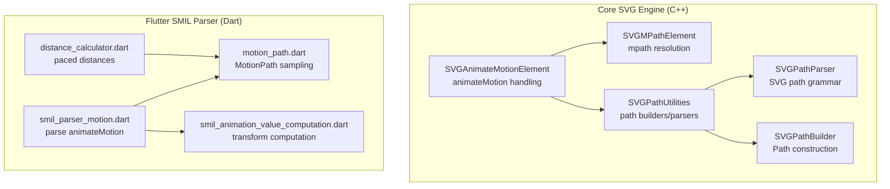
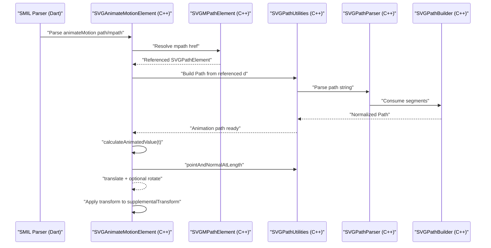
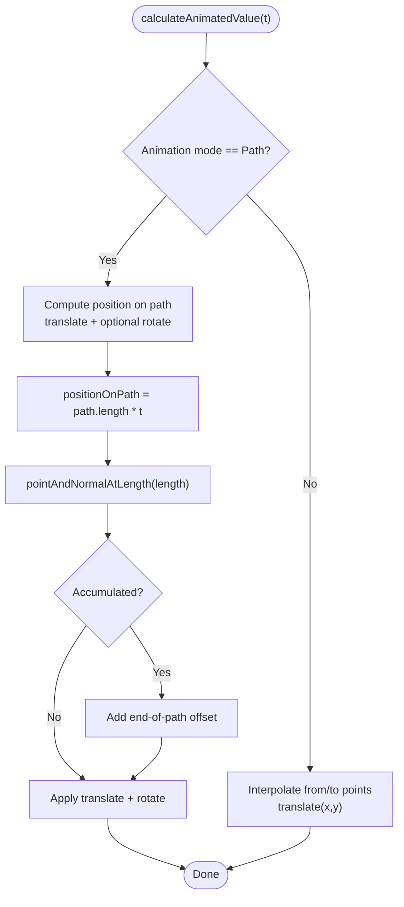
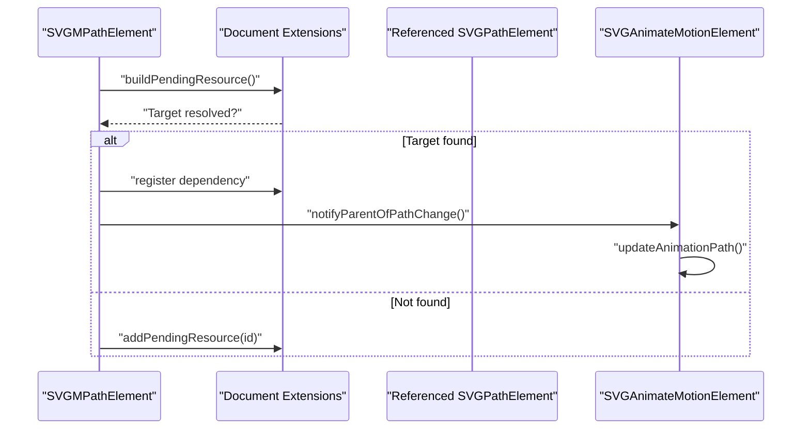
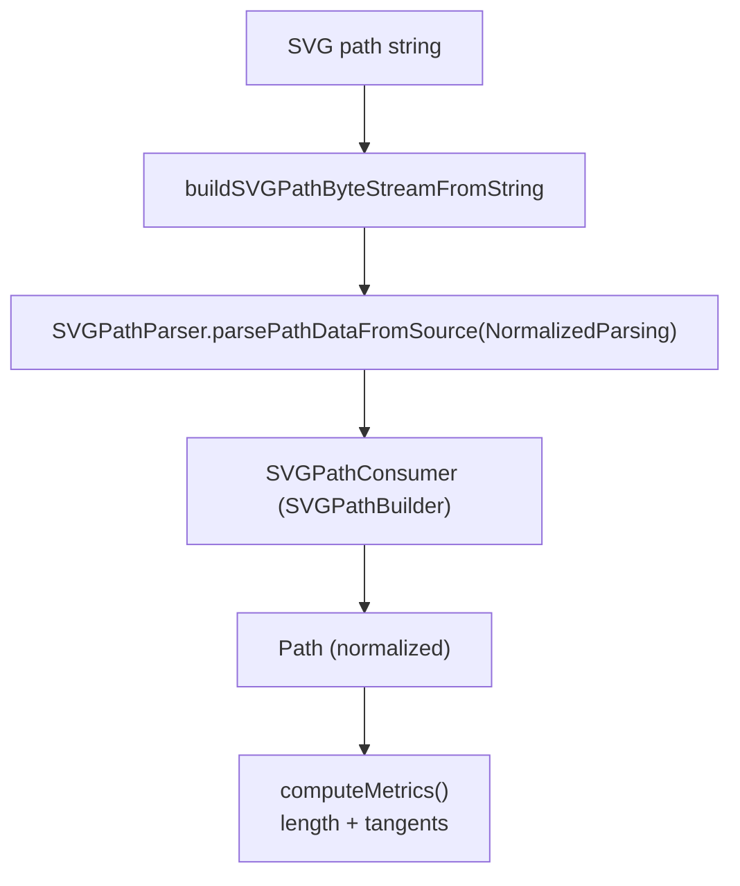
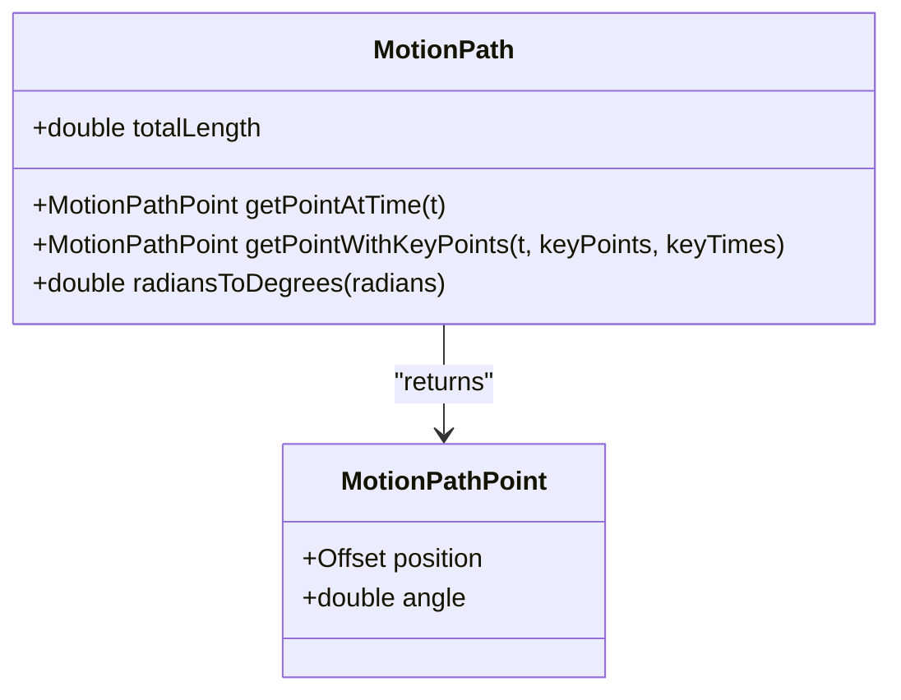
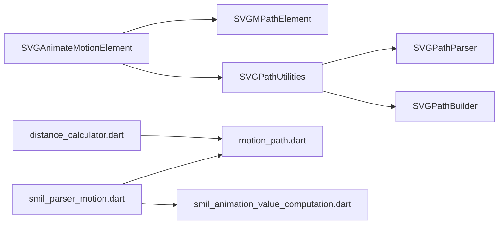

# SMIL Motion Animation

<cite>
**Referenced Files in This Document**
- [SVGAnimateMotionElement.cpp](file://blink-b87d44f-Source-core-svg/SVGAnimateMotionElement.cpp)
- [SVGAnimateMotionElement.h](file://blink-b87d44f-Source-core-svg/SVGAnimateMotionElement.h)
- [SVGMPathElement.cpp](file://blink-b87d44f-Source-core-svg/SVGMPathElement.cpp)
- [SVGMPathElement.h](file://blink-b87d44f-Source-core-svg/SVGMPathElement.h)
- [SVGPathUtilities.cpp](file://blink-b87d44f-Source-core-svg/SVGPathUtilities.cpp)
- [SVGPathUtilities.h](file://blink-b87d44f-Source-core-svg/SVGPathUtilities.h)
- [SVGPathParser.cpp](file://blink-b87d44f-Source-core-svg/SVGPathParser.cpp)
- [SVGPathParser.h](file://blink-b87d44f-Source-core-svg/SVGPathParser.h)
- [SVGPathBuilder.cpp](file://blink-b87d44f-Source-core-svg/SVGPathBuilder.cpp)
- [smil_parser_motion.dart](file://lib/src/animation/smil/smil_parser_motion.dart)
- [motion_path.dart](file://lib/src/animation/smil/motion_path.dart)
- [distance_calculator.dart](file://lib/src/animation/smil/distance_calculator.dart)
- [smil_animation_value_computation.dart](file://lib/src/animation/smil/smil_animation_value_computation.dart)
- [smil_animate_motion_integration_test.dart](file://test/animation/smil_animate_motion_integration_test.dart)
- [motion_path_test.dart](file://test/animation/motion_path_test.dart)
</cite>

## Update Summary
**Changes Made**
- Updated animateMotion element section to reflect the change from using 'motion' to 'transform' as attributeName for better renderer compatibility
- Added new section explaining the attributeName change and its impact on renderer recognition
- Updated architecture overview to show how transform attribute is now processed
- Enhanced troubleshooting guide with renderer compatibility considerations

## Table of Contents
1. [Introduction](#introduction)
2. [Project Structure](#project-structure)
3. [Core Components](#core-components)
4. [Architecture Overview](#architecture-overview)
5. [Detailed Component Analysis](#detailed-component-analysis)
6. [Dependency Analysis](#dependency-analysis)
7. [Performance Considerations](#performance-considerations)
8. [Troubleshooting Guide](#troubleshooting-guide)
9. [Conclusion](#conclusion)
10. [Appendices](#appendices)

## Introduction
This document explains the SMIL motion animation implementation with a focus on the animateMotion element, path-based movement, and motion path parsing. It covers:
- How motion paths are parsed from inline path attributes or referenced paths via mpath
- Orientation settings (auto, auto-reverse, fixed angle)
- Offset calculations along paths and rotation computation
- Examples of complex paths, circular arcs, and custom animations
- Path normalization, coordinate system handling, and validation
- Builder utilities and debugging techniques for motion animation issues
- **Updated**: Enhanced renderer compatibility through transform attribute processing

## Project Structure
The motion animation implementation spans two layers:
- Core SVG engine (C++): animateMotion element, mpath resolution, path parsing and normalization, and transform application
- Flutter SMIL parser and motion utilities (Dart): path parsing, motion path sampling, distance calculation, and integration tests

**Diagram sources**
- [SVGAnimateMotionElement.cpp:104-154](file://blink-b87d44f-Source-core-svg/SVGAnimateMotionElement.cpp#L104-L154)
- [SVGMPathElement.cpp:153-170](file://blink-b87d44f-Source-core-svg/SVGMPathElement.cpp#L153-L170)
- [SVGPathUtilities.cpp:110-122](file://blink-b87d44f-Source-core-svg/SVGPathUtilities.cpp#L110-L122)
- [SVGPathParser.cpp:284-397](file://blink-b87d44f-Source-core-svg/SVGPathParser.cpp#L284-L397)
- [SVGPathBuilder.cpp:36-62](file://blink-b87d44f-Source-core-svg/SVGPathBuilder.cpp#L36-L62)
- [smil_parser_motion.dart:121-156](file://lib/src/animation/smil/smil_parser_motion.dart#L121-L156)
- [motion_path.dart:23-52](file://lib/src/animation/smil/motion_path.dart#L23-L52)
- [distance_calculator.dart:117-146](file://lib/src/animation/smil/distance_calculator.dart#L117-L146)
- [smil_animation_value_computation.dart:102-173](file://lib/src/animation/smil/smil_animation_value_computation.dart#L102-L173)

**Section sources**
- [SVGAnimateMotionElement.cpp:104-154](file://blink-b87d44f-Source-core-svg/SVGAnimateMotionElement.cpp#L104-L154)
- [SVGMPathElement.cpp:153-170](file://blink-b87d44f-Source-core-svg/SVGMPathElement.cpp#L153-L170)
- [SVGPathUtilities.cpp:110-122](file://blink-b87d44f-Source-core-svg/SVGPathUtilities.cpp#L110-L122)
- [SVGPathParser.cpp:284-397](file://blink-b87d44f-Source-core-svg/SVGPathParser.cpp#L284-L397)
- [SVGPathBuilder.cpp:36-62](file://blink-b87d44f-Source-core-svg/SVGPathBuilder.cpp#L36-L62)
- [smil_parser_motion.dart:121-156](file://lib/src/animation/smil/smil_parser_motion.dart#L121-L156)
- [motion_path.dart:23-52](file://lib/src/animation/smil/motion_path.dart#L23-L52)
- [distance_calculator.dart:117-146](file://lib/src/animation/smil/distance_calculator.dart#L117-L146)
- [smil_animation_value_computation.dart:102-173](file://lib/src/animation/smil/smil_animation_value_computation.dart#L102-L173)

## Core Components
- animateMotion element: validates targets, parses path attribute, resolves mpath, computes per-frame transforms, and applies rotation modes
- mpath element: resolves referenced path elements and notifies parents when referenced paths change
- Path utilities: convert SVG path strings to normalized Path objects, compute lengths and tangents, and support path traversal
- Path parser: normalize SVG path grammar (absolute/relative coordinates) and decompose arcs into cubics
- Path builder: construct Path objects from parsed segments
- Flutter SMIL parser: extract path data from inline or referenced sources and feed into motion utilities
- Motion path sampling: compute position and rotation angle at time t, support keyPoints/keyTimes pacing
- Distance calculator: provide paced distances between paths for timing
- **Updated**: Transform computation: generates transform strings for renderer compatibility

**Section sources**
- [SVGAnimateMotionElement.cpp:121-131](file://blink-b87d44f-Source-core-svg/SVGAnimateMotionElement.cpp#L121-L131)
- [SVGAnimateMotionElement.cpp:243-297](file://blink-b87d44f-Source-core-svg/SVGAnimateMotionElement.cpp#L243-L297)
- [SVGMPathElement.cpp:153-170](file://blink-b87d44f-Source-core-svg/SVGMPathElement.cpp#L153-L170)
- [SVGPathUtilities.cpp:110-122](file://blink-b87d44f-Source-core-svg/SVGPathUtilities.cpp#L110-L122)
- [SVGPathParser.cpp:284-397](file://blink-b87d44f-Source-core-svg/SVGPathParser.cpp#L284-L397)
- [SVGPathBuilder.cpp:36-62](file://blink-b87d44f-Source-core-svg/SVGPathBuilder.cpp#L36-L62)
- [smil_parser_motion.dart:121-156](file://lib/src/animation/smil/smil_parser_motion.dart#L121-L156)
- [motion_path.dart:97-145](file://lib/src/animation/smil/motion_path.dart#L97-L145)
- [distance_calculator.dart:117-146](file://lib/src/animation/smil/distance_calculator.dart#L117-L146)
- [smil_animation_value_computation.dart:102-173](file://lib/src/animation/smil/smil_animation_value_computation.dart#L102-L173)

## Architecture Overview
The motion animation pipeline integrates parsing, path normalization, and per-frame transform computation with enhanced renderer compatibility through transform attribute processing.

**Diagram sources**
- [smil_parser_motion.dart:121-156](file://lib/src/animation/smil/smil_parser_motion.dart#L121-L156)
- [SVGAnimateMotionElement.cpp:133-154](file://blink-b87d44f-Source-core-svg/SVGAnimateMotionElement.cpp#L133-L154)
- [SVGMPathElement.cpp:153-170](file://blink-b87d44f-Source-core-svg/SVGMPathElement.cpp#L153-L170)
- [SVGPathUtilities.cpp:110-122](file://blink-b87d44f-Source-core-svg/SVGPathUtilities.cpp#L110-L122)
- [SVGPathParser.cpp:284-397](file://blink-b87d44f-Source-core-svg/SVGPathParser.cpp#L284-L397)
- [SVGPathBuilder.cpp:36-62](file://blink-b87d44f-Source-core-svg/SVGPathBuilder.cpp#L36-L62)

## Detailed Component Analysis

### animateMotion Element
Responsibilities:
- Attribute parsing: supports path attribute; resolves mpath children
- Target validation: restricts to supported SVG graphics elements
- Mode selection: path-based vs. point-based animation
- Per-frame computation: translate to position, optional rotate based on orientation
- Accumulation and repeat handling: accumulate to end-of-duration position when enabled

Key behaviors:
- Orientation modes: auto, auto-reverse, fixed angle
- Path resolution order: mpath child overrides path attribute
- Transform composition: translation plus rotation applied to supplemental transform

**Diagram sources**
- [SVGAnimateMotionElement.cpp:243-297](file://blink-b87d44f-Source-core-svg/SVGAnimateMotionElement.cpp#L243-L297)

**Section sources**
- [SVGAnimateMotionElement.cpp:57-88](file://blink-b87d44f-Source-core-svg/SVGAnimateMotionElement.cpp#L57-L88)
- [SVGAnimateMotionElement.cpp:104-119](file://blink-b87d44f-Source-core-svg/SVGAnimateMotionElement.cpp#L104-L119)
- [SVGAnimateMotionElement.cpp:121-131](file://blink-b87d44f-Source-core-svg/SVGAnimateMotionElement.cpp#L121-L131)
- [SVGAnimateMotionElement.cpp:133-154](file://blink-b87d44f-Source-core-svg/SVGAnimateMotionElement.cpp#L133-L154)
- [SVGAnimateMotionElement.cpp:243-297](file://blink-b87d44f-Source-core-svg/SVGAnimateMotionElement.cpp#L243-L297)
- [SVGAnimateMotionElement.cpp:342-348](file://blink-b87d44f-Source-core-svg/SVGAnimateMotionElement.cpp#L342-L348)

### mpath Element
Responsibilities:
- Resolve referenced path via href or xlink:href
- Track resource dependencies and rebuild when referenced path changes
- Notify parent animateMotion to refresh animation path

**Diagram sources**
- [SVGMPathElement.cpp:60-84](file://blink-b87d44f-Source-core-svg/SVGMPathElement.cpp#L60-L84)
- [SVGMPathElement.cpp:161-170](file://blink-b87d44f-Source-core-svg/SVGMPathElement.cpp#L161-L170)

**Section sources**
- [SVGMPathElement.cpp:108-131](file://blink-b87d44f-Source-core-svg/SVGMPathElement.cpp#L108-L131)
- [SVGMPathElement.cpp:153-170](file://blink-b87d44f-Source-core-svg/SVGMPathElement.cpp#L153-L170)

### Path Parsing and Normalization
The path pipeline converts SVG path strings into normalized Path objects suitable for motion sampling:
- String-to-byte-stream-to-segment-list-to-string conversions
- Decompose arcs into cubic Beziers
- Compute total length and sample points/tangents

**Diagram sources**
- [SVGPathUtilities.cpp:224-238](file://blink-b87d44f-Source-core-svg/SVGPathUtilities.cpp#L224-L238)
- [SVGPathParser.cpp:284-397](file://blink-b87d44f-Source-core-svg/SVGPathParser.cpp#L284-L397)
- [SVGPathBuilder.cpp:36-62](file://blink-b87d44f-Source-core-svg/SVGPathBuilder.cpp#L36-L62)

**Section sources**
- [SVGPathUtilities.cpp:110-122](file://blink-b87d44f-Source-core-svg/SVGPathUtilities.cpp#L110-L122)
- [SVGPathUtilities.cpp:281-330](file://blink-b87d44f-Source-core-svg/SVGPathUtilities.cpp#L281-L330)
- [SVGPathParser.cpp:237-282](file://blink-b87d44f-Source-core-svg/SVGPathParser.cpp#L237-L282)
- [SVGPathParser.cpp:409-493](file://blink-b87d44f-Source-core-svg/SVGPathParser.cpp#L409-L493)

### Flutter Motion Path Sampling
The Dart-side MotionPath mirrors the engine's sampling:
- Parse path string into commands and build a Flutter Path
- Precompute cumulative segment lengths for O(1) lookup
- Interpolate position and tangent angle at time t
- Support keyPoints/keyTimes pacing

**Diagram sources**
- [motion_path.dart:22-227](file://lib/src/animation/smil/motion_path.dart#L22-L227)

**Section sources**
- [motion_path.dart:23-52](file://lib/src/animation/smil/motion_path.dart#L23-L52)
- [motion_path.dart:77-95](file://lib/src/animation/smil/motion_path.dart#L77-L95)
- [motion_path.dart:97-145](file://lib/src/animation/smil/motion_path.dart#L97-L145)
- [motion_path.dart:147-217](file://lib/src/animation/smil/motion_path.dart#L147-L217)

### Transform Attribute Processing
**Updated**: The animateMotion element now uses 'transform' as the attributeName to improve renderer compatibility. This change ensures that motion animations are properly recognized and processed by the renderer.

Key aspects:
- attributeName is set to 'transform' in the SMIL parser
- The motion value computation generates transform strings (translate + optional rotate)
- Renderer receives transform values that can be properly applied to SVG elements
- This approach aligns with how other SVG transforms are handled by the renderer

**Section sources**
- [smil_parser_motion.dart:183-185](file://lib/src/animation/smil/smil_parser_motion.dart#L183-L185)
- [smil_animation_value_computation.dart:148-173](file://lib/src/animation/smil/smil_animation_value_computation.dart#L148-L173)

### Path Attribute Handling and Validation
- Inline path: path attribute on animateMotion
- Referenced path: mpath child with href/xlink:href pointing to a path element
- Validation: referenced path must exist and carry a non-empty d attribute

**Section sources**
- [SVGAnimateMotionElement.cpp:104-119](file://blink-b87d44f-Source-core-svg/SVGAnimateMotionElement.cpp#L104-L119)
- [SVGMPathElement.cpp:153-159](file://blink-b87d44f-Source-core-svg/SVGMPathElement.cpp#L153-L159)
- [smil_parser_motion.dart:121-156](file://lib/src/animation/smil/smil_parser_motion.dart#L121-L156)

### Orientation Settings (auto, auto-reverse, fixed angle)
- auto: rotate by tangent angle at position
- auto-reverse: rotate by tangent angle + 180°
- fixed angle: constant rotation regardless of path tangent

**Section sources**
- [SVGAnimateMotionElement.cpp:121-131](file://blink-b87d44f-Source-core-svg/SVGAnimateMotionElement.cpp#L121-L131)
- [SVGAnimateMotionElement.cpp:291-296](file://blink-b87d44f-Source-core-svg/SVGAnimateMotionElement.cpp#L291-L296)

### Offset Calculations and Pacing
- Linear pacing: t mapped directly to path position
- Paced keyTimes: use keyPoints/keyTimes to vary speed along the path
- Distance metric for paced timing: combine total length difference and average chordal distance across samples

**Section sources**
- [motion_path.dart:147-217](file://lib/src/animation/smil/motion_path.dart#L147-L217)
- [distance_calculator.dart:117-146](file://lib/src/animation/smil/distance_calculator.dart#L117-L146)

### Examples and Use Cases
- Linear path: animateMotion with path="M0,0 L100,100"
- Curved path: animateMotion with path="M50,10 C90,10 90,50 50,50 C10,50 10,10 50,10"
- Circular arc: animateMotion with path="M100,0 A100,100 0 1,1 100,200 A100,100 0 1,1 100,0"
- Complex polygonal path: animateMotion with path="M50,10 L61,35 L90,35 L67,52 L77,77 L50,60 L23,77 L33,52 L10,35 L39,35 Z"
- Auto rotation: rotate="auto" or rotate="auto-reverse"
- Fixed rotation: rotate="45"

Validation and integration tests demonstrate these scenarios end-to-end.

**Section sources**
- [smil_animate_motion_integration_test.dart:9-26](file://test/animation/smil_animate_motion_integration_test.dart#L9-L26)
- [smil_animate_motion_integration_test.dart:72-123](file://test/animation/smil_animate_motion_integration_test.dart#L72-L123)
- [smil_animate_motion_integration_test.dart:124-176](file://test/animation/smil_animate_motion_integration_test.dart#L124-L176)
- [smil_animate_motion_integration_test.dart:177-242](file://test/animation/smil_animate_motion_integration_test.dart#L177-L242)
- [smil_animate_motion_integration_test.dart:244-276](file://test/animation/smil_animate_motion_integration_test.dart#L244-L276)
- [smil_animate_motion_integration_test.dart:278-302](file://test/animation/smil_animate_motion_integration_test.dart#L278-L302)

## Dependency Analysis
High-level dependencies:
- animateMotion depends on mpath resolution and path utilities
- Path utilities depend on path parser and builder
- Flutter SMIL parser depends on motion path sampling and transform computation
- Distance calculator depends on MotionPath

**Diagram sources**
- [SVGAnimateMotionElement.cpp:133-154](file://blink-b87d44f-Source-core-svg/SVGAnimateMotionElement.cpp#L133-L154)
- [SVGMPathElement.cpp:153-170](file://blink-b87d44f-Source-core-svg/SVGMPathElement.cpp#L153-L170)
- [SVGPathUtilities.cpp:110-122](file://blink-b87d44f-Source-core-svg/SVGPathUtilities.cpp#L110-L122)
- [SVGPathParser.cpp:284-397](file://blink-b87d44f-Source-core-svg/SVGPathParser.cpp#L284-L397)
- [SVGPathBuilder.cpp:36-62](file://blink-b87d44f-Source-core-svg/SVGPathBuilder.cpp#L36-L62)
- [smil_parser_motion.dart:121-156](file://lib/src/animation/smil/smil_parser_motion.dart#L121-L156)
- [motion_path.dart:23-52](file://lib/src/animation/smil/motion_path.dart#L23-L52)
- [distance_calculator.dart:117-146](file://lib/src/animation/smil/distance_calculator.dart#L117-L146)
- [smil_animation_value_computation.dart:102-173](file://lib/src/animation/smil/smil_animation_value_computation.dart#L102-L173)

**Section sources**
- [SVGAnimateMotionElement.cpp:133-154](file://blink-b87d44f-Source-core-svg/SVGAnimateMotionElement.cpp#L133-L154)
- [SVGMPathElement.cpp:153-170](file://blink-b87d44f-Source-core-svg/SVGMPathElement.cpp#L153-L170)
- [SVGPathUtilities.cpp:110-122](file://blink-b87d44f-Source-core-svg/SVGPathUtilities.cpp#L110-L122)
- [SVGPathParser.cpp:284-397](file://blink-b87d44f-Source-core-svg/SVGPathParser.cpp#L284-L397)
- [SVGPathBuilder.cpp:36-62](file://blink-b87d44f-Source-core-svg/SVGPathBuilder.cpp#L36-L62)
- [smil_parser_motion.dart:121-156](file://lib/src/animation/smil/smil_parser_motion.dart#L121-L156)
- [motion_path.dart:23-52](file://lib/src/animation/smil/motion_path.dart#L23-L52)
- [distance_calculator.dart:117-146](file://lib/src/animation/smil/distance_calculator.dart#L117-L146)
- [smil_animation_value_computation.dart:102-173](file://lib/src/animation/smil/smil_animation_value_computation.dart#L102-L173)

## Performance Considerations
- Path normalization: parsing and arc decomposition occur once during initialization; reuse normalized Path for repeated sampling
- Segment precomputation: cumulative lengths enable O(1) segment lookup for motion sampling
- Paced timing: distance sampling across many points is bounded; keep sample count reasonable for smoothness vs. cost
- Rendering updates: transforms are applied incrementally; avoid unnecessary recomputation by caching path metrics
- **Updated**: Transform attribute processing: using 'transform' as attributeName allows for better renderer optimization and caching

## Troubleshooting Guide
Common issues and remedies:
- No motion occurs
  - Verify path attribute or mpath href resolves to a non-empty path
  - Ensure target element is a supported SVG graphics element
- Incorrect rotation
  - Confirm rotate attribute value: auto, auto-reverse, or fixed angle
  - For auto-reverse, expect 180° offset in rotation
- Paced timing feels uneven
  - Provide keyPoints/keyTimes to control speed distribution
  - Use distance calculator feedback to tune pacing
- Arcs appear as straight lines
  - Ensure arcs are properly decomposed into cubics during parsing
- Zero-length paths
  - Empty or invalid path data results in zero-length path; validate input and handle gracefully
- **Updated**: Renderer compatibility issues
  - Ensure animateMotion uses 'transform' as attributeName for proper renderer recognition
  - Verify transform values are being applied to the element's transform property
  - Check that the renderer properly processes transform strings generated by motion animation

**Section sources**
- [SVGAnimateMotionElement.cpp:57-88](file://blink-b87d44f-Source-core-svg/SVGAnimateMotionElement.cpp#L57-L88)
- [SVGAnimateMotionElement.cpp:121-131](file://blink-b87d44f-Source-core-svg/SVGAnimateMotionElement.cpp#L121-L131)
- [SVGPathParser.cpp:237-282](file://blink-b87d44f-Source-core-svg/SVGPathParser.cpp#L237-L282)
- [motion_path_test.dart:174-187](file://test/animation/motion_path_test.dart#L174-L187)
- [smil_parser_motion.dart:183-185](file://lib/src/animation/smil/smil_parser_motion.dart#L183-L185)

## Conclusion
The SMIL motion animation implementation combines robust path parsing and normalization with efficient per-frame sampling and rotation logic. It supports inline and referenced paths, orientation modes, and paced timing via keyPoints/keyTimes. The architecture cleanly separates concerns between the core engine and Flutter utilities, enabling reliable and performant motion animations across diverse SVG paths. **Updated**: The recent enhancement of using 'transform' as the attributeName significantly improves renderer compatibility and ensures proper processing of motion animations by the underlying graphics system.

## Appendices

### Coordinate System and Path Normalization
- Absolute vs. relative coordinates are normalized during parsing
- Arcs are decomposed into cubic Beziers for consistent sampling
- Path metrics provide total length and tangents for accurate motion

**Section sources**
- [SVGPathParser.cpp:284-397](file://blink-b87d44f-Source-core-svg/SVGPathParser.cpp#L284-L397)
- [SVGPathParser.cpp:409-493](file://blink-b87d44f-Source-core-svg/SVGPathParser.cpp#L409-L493)
- [SVGPathUtilities.cpp:298-330](file://blink-b87d44f-Source-core-svg/SVGPathUtilities.cpp#L298-L330)

### Motion Path Builder Utilities
- Convert SVG path strings to normalized Path objects
- Compute total length and segment-wise cumulative lengths
- Sample position and tangent angle at arbitrary time t

**Section sources**
- [SVGPathUtilities.cpp:110-122](file://blink-b87d44f-Source-core-svg/SVGPathUtilities.cpp#L110-L122)
- [SVGPathUtilities.cpp:298-330](file://blink-b87d44f-Source-core-svg/SVGPathUtilities.cpp#L298-L330)
- [motion_path.dart:77-95](file://lib/src/animation/smil/motion_path.dart#L77-L95)
- [motion_path.dart:97-145](file://lib/src/animation/smil/motion_path.dart#L97-L145)

### Transform Computation and Renderer Compatibility
**Updated**: The transform computation process generates renderer-ready transform strings:
- Motion values are computed as transform strings (translate + optional rotate)
- The 'transform' attribute name ensures proper renderer recognition
- Transform strings are applied to the element's supplementalTransform
- This approach maintains compatibility with existing SVG transform processing

**Section sources**
- [smil_animation_value_computation.dart:102-173](file://lib/src/animation/smil/smil_animation_value_computation.dart#L102-L173)
- [smil_parser_motion.dart:183-185](file://lib/src/animation/smil/smil_parser_motion.dart#L183-L185)

### Debugging Techniques
- Visual testing: capture frames at key timepoints and compare expected geometry
- Pixel analysis: verify transform effects and rendering outcomes
- Deterministic timelines: use controlled initial times and explicit pump durations
- Golden tests: complement with pixel-level checks for accuracy
- **Updated**: Renderer compatibility testing: verify that transform attribute values are properly recognized and applied by the renderer

**Section sources**
- [smil_animate_motion_integration_test.dart:278-302](file://test/animation/smil_animate_motion_integration_test.dart#L278-L302)
- [smil_parser_motion.dart:183-185](file://lib/src/animation/smil/smil_parser_motion.dart#L183-L185)