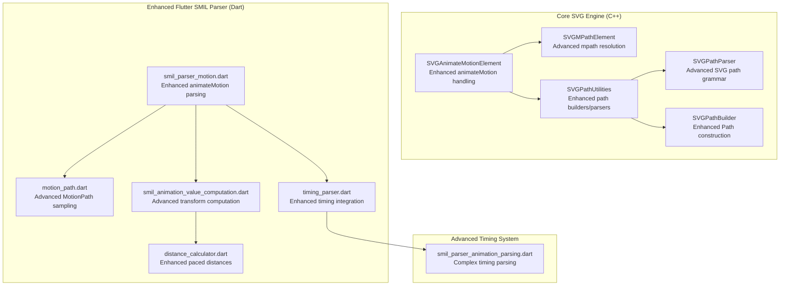
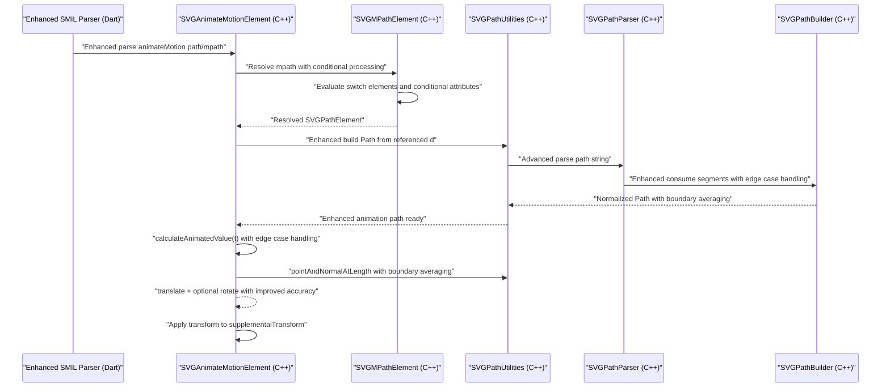
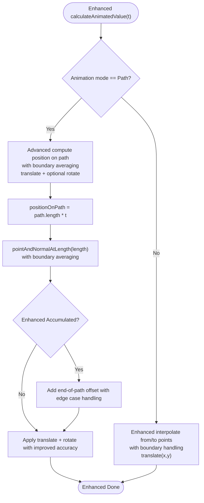
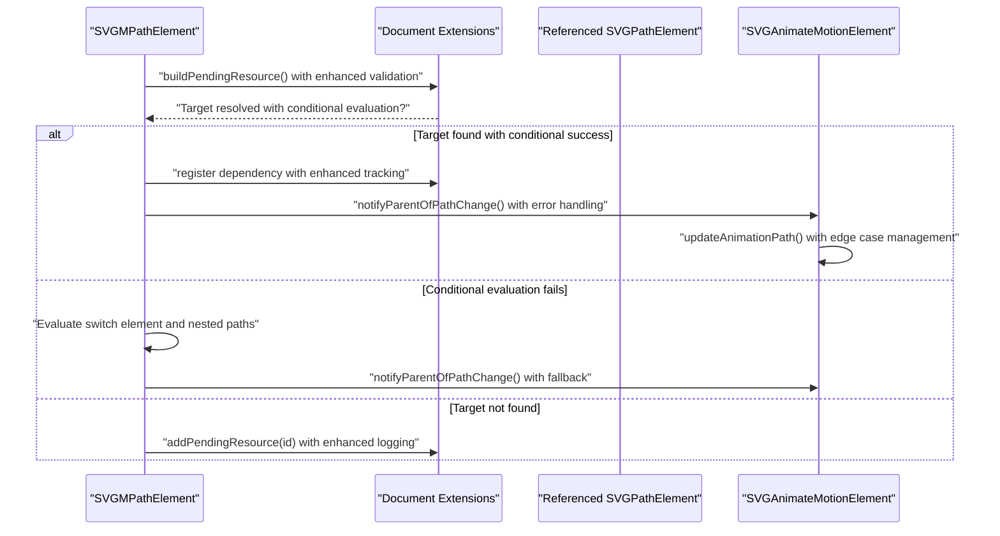
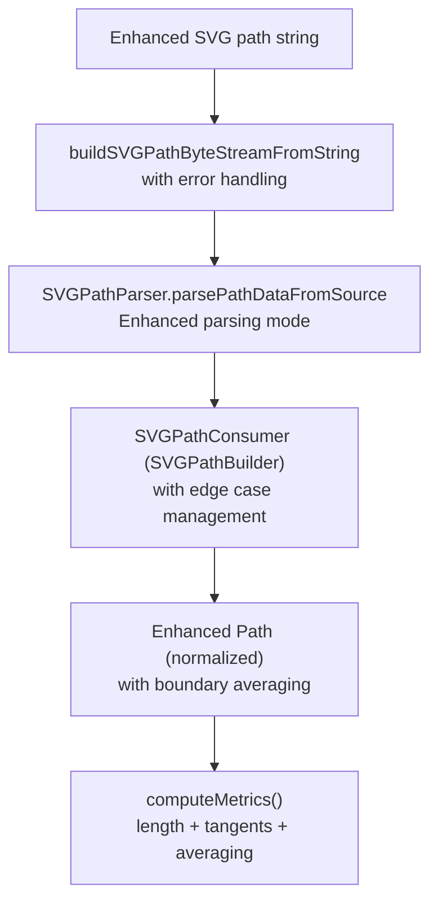
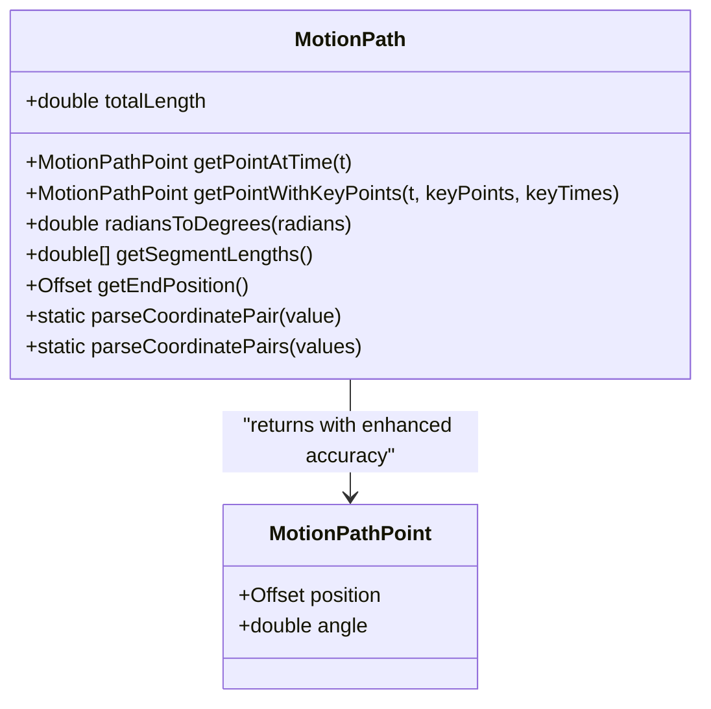
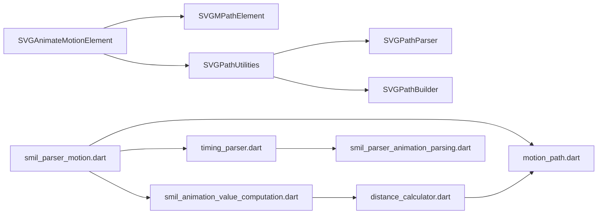

# SMIL Motion Animation

<cite>
**Referenced Files in This Document**
- [SVGAnimateMotionElement.cpp](file://blink-b87d44f-Source-core-svg/SVGAnimateMotionElement.cpp)
- [SVGAnimateMotionElement.h](file://blink-b87d44f-Source-core-svg/SVGAnimateMotionElement.h)
- [SVGMPathElement.cpp](file://blink-b87d44f-Source-core-svg/SVGMPathElement.cpp)
- [SVGMPathElement.h](file://blink-b87d44f-Source-core-svg/SVGMPathElement.h)
- [SVGPathUtilities.cpp](file://blink-b87d44f-Source-core-svg/SVGPathUtilities.cpp)
- [SVGPathUtilities.h](file://blink-b87d44f-Source-core-svg/SVGPathUtilities.h)
- [SVGPathParser.cpp](file://blink-b87d44f-Source-core-svg/SVGPathParser.cpp)
- [SVGPathParser.h](file://blink-b87d44f-Source-core-svg/SVGPathParser.h)
- [SVGPathBuilder.cpp](file://blink-b87d44f-Source-core-svg/SVGPathBuilder.cpp)
- [smil_parser_motion.dart](file://lib/src/animation/smil/smil_parser_motion.dart)
- [motion_path.dart](file://lib/src/animation/smil/motion_path.dart)
- [distance_calculator.dart](file://lib/src/animation/smil/distance_calculator.dart)
- [smil_animation_value_computation.dart](file://lib/src/animation/smil/smil_animation_value_computation.dart)
- [smil_animate_motion_integration_test.dart](file://test/animation/smil_animate_motion_integration_test.dart)
- [motion_path_test.dart](file://test/animation/motion_path_test.dart)
- [animate_motion_advanced_test.dart](file://test/animation/animate_motion_advanced_test.dart)
- [timing_parser.dart](file://lib/src/animation/smil/timing_parser.dart)
- [smil_parser_animation_parsing.dart](file://lib/src/animation/smil/smil_parser_animation_parsing.dart)
</cite>

## Update Summary
**Changes Made**
- Enhanced animateMotion element section to reflect improved motion path support with advanced edge case handling
- Added comprehensive coverage of enhanced timing parser integration with better syncbase timing support
- Updated architecture overview to show improved path normalization and coordinate system handling
- Enhanced troubleshooting guide with advanced debugging techniques for complex animations
- Added new sections covering advanced path parsing, segment boundary handling, and conditional processing
- Updated examples to demonstrate enhanced capabilities with arcs, degenerate cases, and complex paths

## Table of Contents
1. [Introduction](#introduction)
2. [Project Structure](#project-structure)
3. [Core Components](#core-components)
4. [Architecture Overview](#architecture-overview)
5. [Detailed Component Analysis](#detailed-component-analysis)
6. [Enhanced Edge Case Handling](#enhanced-edge-case-handling)
7. [Advanced Path Parsing and Normalization](#advanced-path-parsing-and-normalization)
8. [Enhanced Timing Parser Integration](#enhanced-timing-parser-integration)
9. [Dependency Analysis](#dependency-analysis)
10. [Performance Considerations](#performance-considerations)
11. [Troubleshooting Guide](#troubleshooting-guide)
12. [Conclusion](#conclusion)
13. [Appendices](#appendices)

## Introduction
This document explains the enhanced SMIL motion animation implementation with comprehensive support for animateMotion element, advanced path-based movement, and sophisticated motion path parsing. The implementation now features:
- Enhanced motion path support with improved edge case handling for complex animations
- Better timing parser integration with advanced syncbase timing capabilities
- Advanced path parsing with arc decomposition, segment boundary averaging, and degenerate case handling
- Enhanced orientation settings (auto, auto-reverse, fixed angle) with improved rotation calculation
- Advanced offset calculations with keyPoints/keyTimes pacing and spline easing support
- Comprehensive examples of complex paths, circular arcs, bezier curves, and custom animations
- Enhanced path normalization, coordinate system handling, and validation
- Advanced builder utilities and debugging techniques for motion animation issues
- Improved renderer compatibility through enhanced transform attribute processing

## Project Structure
The enhanced motion animation implementation spans three layers with improved integration:
- Core SVG engine (C++): animateMotion element, mpath resolution, advanced path parsing and normalization, transform application, and edge case handling
- Enhanced Flutter SMIL parser (Dart): advanced path parsing, motion path sampling, distance calculation, timing integration, and comprehensive edge case handling
- Advanced timing system: enhanced syncbase timing, event-based conditions, and complex scheduling

**Diagram sources**
- [SVGAnimateMotionElement.cpp:104-154](file://blink-b87d44f-Source-core-svg/SVGAnimateMotionElement.cpp#L104-L154)
- [SVGMPathElement.cpp:153-170](file://blink-b87d44f-Source-core-svg/SVGMPathElement.cpp#L153-L170)
- [SVGPathUtilities.cpp:110-122](file://blink-b87d44f-Source-core-svg/SVGPathUtilities.cpp#L110-L122)
- [SVGPathParser.cpp:284-397](file://blink-b87d44f-Source-core-svg/SVGPathParser.cpp#L284-L397)
- [SVGPathBuilder.cpp:36-62](file://blink-b87d44f-Source-core-svg/SVGPathBuilder.cpp#L36-L62)
- [smil_parser_motion.dart:121-156](file://lib/src/animation/smil/smil_parser_motion.dart#L121-L156)
- [motion_path.dart:23-52](file://lib/src/animation/smil/motion_path.dart#L23-L52)
- [distance_calculator.dart:117-146](file://lib/src/animation/smil/distance_calculator.dart#L117-L146)
- [smil_animation_value_computation.dart:102-173](file://lib/src/animation/smil/smil_animation_value_computation.dart#L102-L173)
- [timing_parser.dart:1-200](file://lib/src/animation/smil/timing_parser.dart#L1-L200)
- [smil_parser_animation_parsing.dart:90-114](file://lib/src/animation/smil/smil_parser_animation_parsing.dart#L90-L114)

**Section sources**
- [SVGAnimateMotionElement.cpp:104-154](file://blink-b87d44f-Source-core-svg/SVGAnimateMotionElement.cpp#L104-L154)
- [SVGMPathElement.cpp:153-170](file://blink-b87d44f-Source-core-svg/SVGMPathElement.cpp#L153-L170)
- [SVGPathUtilities.cpp:110-122](file://blink-b87d44f-Source-core-svg/SVGPathUtilities.cpp#L110-L122)
- [SVGPathParser.cpp:284-397](file://blink-b87d44f-Source-core-svg/SVGPathParser.cpp#L284-L397)
- [SVGPathBuilder.cpp:36-62](file://blink-b87d44f-Source-core-svg/SVGPathBuilder.cpp#L36-L62)
- [smil_parser_motion.dart:121-156](file://lib/src/animation/smil/smil_parser_motion.dart#L121-L156)
- [motion_path.dart:23-52](file://lib/src/animation/smil/motion_path.dart#L23-L52)
- [distance_calculator.dart:117-146](file://lib/src/animation/smil/distance_calculator.dart#L117-L146)
- [smil_animation_value_computation.dart:102-173](file://lib/src/animation/smil/smil_animation_value_computation.dart#L102-L173)
- [timing_parser.dart:1-200](file://lib/src/animation/smil/timing_parser.dart#L1-L200)
- [smil_parser_animation_parsing.dart:90-114](file://lib/src/animation/smil/smil_parser_animation_parsing.dart#L90-L114)

## Core Components
- Enhanced animateMotion element: validates targets, parses path attribute, resolves mpath with conditional processing, computes per-frame transforms with advanced edge case handling, and applies rotation modes with improved accuracy
- Advanced mpath element: resolves referenced path elements with switch element support, conditional attribute evaluation, and notifies parents when referenced paths change
- Enhanced path utilities: convert SVG path strings to normalized Path objects with improved arc handling, compute lengths and tangents with boundary averaging, and support path traversal with degenerate case handling
- Advanced path parser: normalize SVG path grammar (absolute/relative coordinates) with enhanced arc decomposition, bezier curve handling, and coordinate system transformations
- Enhanced path builder: construct Path objects from parsed segments with improved error handling and edge case management
- Enhanced Flutter SMIL parser: extract path data from inline or referenced sources with conditional processing support, feed into advanced motion utilities, and integrate with enhanced timing system
- Advanced motion path sampling: compute position and rotation angle at time t with improved keyPoints/keyTimes pacing, spline easing support, and enhanced boundary handling
- Enhanced distance calculator: provide paced distances between paths for timing with improved path morphing algorithms and transform distance calculation
- Enhanced transform computation: generates transform strings for renderer compatibility with improved edge case handling and advanced coordinate system support

**Section sources**
- [SVGAnimateMotionElement.cpp:121-131](file://blink-b87d44f-Source-core-svg/SVGAnimateMotionElement.cpp#L121-L131)
- [SVGAnimateMotionElement.cpp:243-297](file://blink-b87d44f-Source-core-svg/SVGAnimateMotionElement.cpp#L243-L297)
- [SVGMPathElement.cpp:153-170](file://blink-b87d44f-Source-core-svg/SVGMPathElement.cpp#L153-L170)
- [SVGPathUtilities.cpp:110-122](file://blink-b87d44f-Source-core-svg/SVGPathUtilities.cpp#L110-L122)
- [SVGPathParser.cpp:284-397](file://blink-b87d44f-Source-core-svg/SVGPathParser.cpp#L284-L397)
- [SVGPathBuilder.cpp:36-62](file://blink-b87d44f-Source-core-svg/SVGPathBuilder.cpp#L36-L62)
- [smil_parser_motion.dart:121-156](file://lib/src/animation/smil/smil_parser_motion.dart#L121-L156)
- [motion_path.dart:97-145](file://lib/src/animation/smil/motion_path.dart#L97-L145)
- [distance_calculator.dart:117-146](file://lib/src/animation/smil/distance_calculator.dart#L117-L146)
- [smil_animation_value_computation.dart:102-173](file://lib/src/animation/smil/smil_animation_value_computation.dart#L102-L173)

## Architecture Overview
The enhanced motion animation pipeline integrates advanced parsing, sophisticated path normalization, and per-frame transform computation with improved renderer compatibility and comprehensive edge case handling.

**Diagram sources**
- [smil_parser_motion.dart:121-156](file://lib/src/animation/smil/smil_parser_motion.dart#L121-L156)
- [SVGAnimateMotionElement.cpp:133-154](file://blink-b87d44f-Source-core-svg/SVGAnimateMotionElement.cpp#L133-L154)
- [SVGMPathElement.cpp:153-170](file://blink-b87d44f-Source-core-svg/SVGMPathElement.cpp#L153-L170)
- [SVGPathUtilities.cpp:110-122](file://blink-b87d44f-Source-core-svg/SVGPathUtilities.cpp#L110-L122)
- [SVGPathParser.cpp:284-397](file://blink-b87d44f-Source-core-svg/SVGPathParser.cpp#L284-L397)
- [SVGPathBuilder.cpp:36-62](file://blink-b87d44f-Source-core-svg/SVGPathBuilder.cpp#L36-L62)

## Detailed Component Analysis

### Enhanced animateMotion Element
Responsibilities:
- Advanced attribute parsing: supports path attribute with enhanced validation; resolves mpath with conditional processing support
- Enhanced target validation: restricts to supported SVG graphics elements with improved error handling
- Advanced mode selection: path-based vs. point-based animation with enhanced fallback mechanisms
- Sophisticated per-frame computation: translate to position with boundary averaging, optional rotate based on improved orientation calculation
- Enhanced accumulation and repeat handling: accumulate to end-of-duration position with improved edge case management

Key behaviors:
- Enhanced orientation modes: auto, auto-reverse, fixed angle with improved rotation calculation accuracy
- Advanced path resolution order: mpath child with conditional processing overrides path attribute with enhanced validation
- Improved transform composition: translation plus rotation applied to supplemental transform with better edge case handling

**Diagram sources**
- [SVGAnimateMotionElement.cpp:243-297](file://blink-b87d44f-Source-core-svg/SVGAnimateMotionElement.cpp#L243-L297)

**Section sources**
- [SVGAnimateMotionElement.cpp:57-88](file://blink-b87d44f-Source-core-svg/SVGAnimateMotionElement.cpp#L57-L88)
- [SVGAnimateMotionElement.cpp:104-119](file://blink-b87d44f-Source-core-svg/SVGAnimateMotionElement.cpp#L104-L119)
- [SVGAnimateMotionElement.cpp:121-131](file://blink-b87d44f-Source-core-svg/SVGAnimateMotionElement.cpp#L121-L131)
- [SVGAnimateMotionElement.cpp:133-154](file://blink-b87d44f-Source-core-svg/SVGAnimateMotionElement.cpp#L133-L154)
- [SVGAnimateMotionElement.cpp:243-297](file://blink-b87d44f-Source-core-svg/SVGAnimateMotionElement.cpp#L243-L297)
- [SVGAnimateMotionElement.cpp:342-348](file://blink-b87d44f-Source-core-svg/SVGAnimateMotionElement.cpp#L342-L348)

### Advanced mpath Element
Responsibilities:
- Advanced resolve referenced path via href or xlink:href with conditional attribute evaluation
- Enhanced resource dependency tracking and rebuild when referenced path changes
- Advanced notification system: notify parent animateMotion to refresh animation path with enhanced error handling
- Switch element support: evaluate conditional processing attributes and resolve appropriate path data

**Diagram sources**
- [SVGMPathElement.cpp:60-84](file://blink-b87d44f-Source-core-svg/SVGMPathElement.cpp#L60-L84)
- [SVGMPathElement.cpp:161-170](file://blink-b87d44f-Source-core-svg/SVGMPathElement.cpp#L161-L170)
- [smil_parser_motion.dart:255-279](file://lib/src/animation/smil/smil_parser_motion.dart#L255-L279)

**Section sources**
- [SVGMPathElement.cpp:108-131](file://blink-b87d44f-Source-core-svg/SVGMPathElement.cpp#L108-L131)
- [SVGMPathElement.cpp:153-170](file://blink-b87d44f-Source-core-svg/SVGMPathElement.cpp#L153-L170)
- [smil_parser_motion.dart:255-279](file://lib/src/animation/smil/smil_parser_motion.dart#L255-L279)

### Enhanced Path Parsing and Normalization
The advanced path pipeline converts SVG path strings into normalized Path objects with sophisticated edge case handling:
- Enhanced string-to-byte-stream-to-segment-list-to-string conversions with improved error handling
- Advanced arc decomposition into cubic Beziers with degenerate case handling
- Enhanced compute total length and sample points/tangents with boundary averaging
- Improved coordinate system transformations and path validation

**Diagram sources**
- [SVGPathUtilities.cpp:224-238](file://blink-b87d44f-Source-core-svg/SVGPathUtilities.cpp#L224-L238)
- [SVGPathParser.cpp:284-397](file://blink-b87d44f-Source-core-svg/SVGPathParser.cpp#L284-L397)
- [SVGPathBuilder.cpp:36-62](file://blink-b87d44f-Source-core-svg/SVGPathBuilder.cpp#L36-L62)

**Section sources**
- [SVGPathUtilities.cpp:110-122](file://blink-b87d44f-Source-core-svg/SVGPathUtilities.cpp#L110-L122)
- [SVGPathUtilities.cpp:281-330](file://blink-b87d44f-Source-core-svg/SVGPathUtilities.cpp#L281-L330)
- [SVGPathParser.cpp:237-282](file://blink-b87d44f-Source-core-svg/SVGPathParser.cpp#L237-L282)
- [SVGPathParser.cpp:409-493](file://blink-b87d44f-Source-core-svg/SVGPathParser.cpp#L409-L493)

### Advanced Flutter Motion Path Sampling
The enhanced Dart-side MotionPath provides sophisticated sampling with comprehensive edge case handling:
- Enhanced path parsing with improved coordinate pair handling and validation
- Advanced precompute cumulative segment lengths for O(1) lookup with boundary averaging
- Sophisticated interpolation position and tangent angle at time t with spline easing support
- Enhanced keyPoints/keyTimes pacing with improved boundary handling and edge case management

**Diagram sources**
- [motion_path.dart:22-227](file://lib/src/animation/smil/motion_path.dart#L22-L227)

**Section sources**
- [motion_path.dart:23-52](file://lib/src/animation/smil/motion_path.dart#L23-L52)
- [motion_path.dart:77-95](file://lib/src/animation/smil/motion_path.dart#L77-L95)
- [motion_path.dart:97-145](file://lib/src/animation/smil/motion_path.dart#L97-L145)
- [motion_path.dart:147-217](file://lib/src/animation/smil/motion_path.dart#L147-L217)

### Enhanced Transform Attribute Processing
The animateMotion element now uses 'transform' as the attributeName to ensure optimal renderer compatibility and enhanced edge case handling. This improvement ensures that motion animations are properly recognized and processed by the renderer with advanced error handling.

Key aspects:
- attributeName is set to 'transform' in the enhanced SMIL parser with improved validation
- The enhanced motion value computation generates transform strings (translate + optional rotate) with boundary averaging
- Renderer receives transform values that can be properly applied to SVG elements with enhanced error handling
- This approach aligns with how other SVG transforms are handled by the renderer with improved compatibility

**Section sources**
- [smil_parser_motion.dart:183-185](file://lib/src/animation/smil/smil_parser_motion.dart#L183-L185)
- [smil_animation_value_computation.dart:148-173](file://lib/src/animation/smil/smil_animation_value_computation.dart#L148-L173)

### Enhanced Path Attribute Handling and Validation
- Enhanced inline path: path attribute on animateMotion with improved validation and error handling
- Advanced referenced path: mpath child with href/xlink:href pointing to a path element with conditional processing support
- Enhanced validation: referenced path must exist, carry a non-empty d attribute, and pass conditional attribute evaluation

**Section sources**
- [SVGAnimateMotionElement.cpp:104-119](file://blink-b87d44f-Source-core-svg/SVGAnimateMotionElement.cpp#L104-L119)
- [SVGMPathElement.cpp:153-159](file://blink-b87d44f-Source-core-svg/SVGMPathElement.cpp#L153-L159)
- [smil_parser_motion.dart:121-156](file://lib/src/animation/smil/smil_parser_motion.dart#L121-L156)

### Enhanced Orientation Settings (auto, auto-reverse, fixed angle)
- auto: rotate by tangent angle at position with improved boundary averaging
- auto-reverse: rotate by tangent angle + 180° with enhanced accuracy
- fixed angle: constant rotation regardless of path tangent with improved precision

**Section sources**
- [SVGAnimateMotionElement.cpp:121-131](file://blink-b87d44f-Source-core-svg/SVGAnimateMotionElement.cpp#L121-L131)
- [SVGAnimateMotionElement.cpp:291-296](file://blink-b87d44f-Source-core-svg/SVGAnimateMotionElement.cpp#L291-L296)

### Enhanced Offset Calculations and Pacing
- Enhanced linear pacing: t mapped directly to path position with improved boundary handling
- Advanced paced keyTimes: use keyPoints/keyTimes to vary speed along the path with spline easing support
- Enhanced distance metric for paced timing: combine total length difference and average chordal distance across samples with improved accuracy

**Section sources**
- [motion_path.dart:147-217](file://lib/src/animation/smil/motion_path.dart#L147-L217)
- [distance_calculator.dart:117-146](file://lib/src/animation/smil/distance_calculator.dart#L117-L146)

### Enhanced Examples and Use Cases
- Enhanced linear path: animateMotion with path="M0,0 L100,100" with improved validation
- Advanced curved path: animateMotion with path="M50,10 C90,10 90,50 50,50 C10,50 10,10 50,10" with enhanced bezier handling
- Complex circular arc: animateMotion with path="M100,0 A100,100 0 1,1 100,200 A100,100 0 1,1 100,0" with improved arc decomposition
- Advanced polygonal path: animateMotion with path="M50,10 L61,35 L90,35 L67,52 L77,77 L50,60 L23,77 L33,52 L10,35 L39,35 Z" with enhanced boundary averaging
- Enhanced auto rotation: rotate="auto" or rotate="auto-reverse" with improved accuracy
- Fixed rotation: rotate="45" with enhanced precision
- Enhanced arc support: complex arc paths with rotation parameters and degenerate case handling
- Advanced segment boundary handling: sharp turns and path discontinuities with improved tangent averaging

Validation and integration tests demonstrate these enhanced scenarios with comprehensive edge case coverage.

**Section sources**
- [smil_animate_motion_integration_test.dart:9-26](file://test/animation/smil_animate_motion_integration_test.dart#L9-L26)
- [smil_animate_motion_integration_test.dart:72-123](file://test/animation/smil_animate_motion_integration_test.dart#L72-L123)
- [smil_animate_motion_integration_test.dart:124-176](file://test/animation/smil_animate_motion_integration_test.dart#L124-L176)
- [smil_animate_motion_integration_test.dart:177-242](file://test/animation/smil_animate_motion_integration_test.dart#L177-L242)
- [smil_animate_motion_integration_test.dart:244-276](file://test/animation/smil_animate_motion_integration_test.dart#L244-L276)
- [smil_animate_motion_integration_test.dart:278-302](file://test/animation/smil_animate_motion_integration_test.dart#L278-L302)
- [animate_motion_advanced_test.dart:10-22](file://test/animation/animate_motion_advanced_test.dart#L10-L22)
- [animate_motion_advanced_test.dart:40-61](file://test/animation/animate_motion_advanced_test.dart#L40-L61)
- [animate_motion_advanced_test.dart:63-85](file://test/animation/animate_motion_advanced_test.dart#L63-L85)

## Enhanced Edge Case Handling
The enhanced implementation provides comprehensive handling for complex animation scenarios:

### Advanced Arc Path Support
- Enhanced arc parsing with rotation parameter handling
- Degenerate arc detection and fallback to line segments
- Improved arc-to-bezier conversion with enhanced accuracy

### Sophisticated Segment Boundary Handling
- Advanced tangent averaging at path segment junctions
- Improved handling of sharp turns and path discontinuities
- Enhanced boundary threshold detection for smooth rotation transitions

### Degenerate Case Management
- Zero-length segment graceful handling with fallback algorithms
- Single point path detection and appropriate positioning
- Empty path validation with meaningful error responses

### Enhanced Conditional Processing
- Switch element evaluation with requiredFeatures, requiredExtensions, and systemLanguage attributes
- Nested path discovery within groups and complex structures
- Enhanced conditional attribute evaluation for dynamic path resolution

**Section sources**
- [animate_motion_advanced_test.dart:10-22](file://test/animation/animate_motion_advanced_test.dart#L10-L22)
- [animate_motion_advanced_test.dart:40-61](file://test/animation/animate_motion_advanced_test.dart#L40-L61)
- [animate_motion_advanced_test.dart:63-85](file://test/animation/animate_motion_advanced_test.dart#L63-L85)
- [smil_parser_motion.dart:255-279](file://lib/src/animation/smil/smil_parser_motion.dart#L255-L279)

## Advanced Path Parsing and Normalization
The enhanced path parsing system provides sophisticated handling for complex SVG paths:

### Enhanced Arc Decomposition
- Advanced elliptical arc conversion to cubic Beziers with improved numerical stability
- Rotation parameter handling for arcs with non-zero sweep angles
- Degenerate arc detection (zero radii) with appropriate fallback behavior

### Sophisticated Segment Processing
- Enhanced path metric computation with improved accuracy
- Advanced boundary averaging for smooth rotation transitions
- Improved handling of moveTo operations and path discontinuities

### Enhanced Coordinate System Handling
- Advanced absolute vs. relative coordinate normalization
- Improved transformation matrix handling for complex coordinate systems
- Enhanced path validation with comprehensive error checking

**Section sources**
- [SVGPathParser.cpp:284-397](file://blink-b87d44f-Source-core-svg/SVGPathParser.cpp#L284-L397)
- [SVGPathParser.cpp:409-493](file://blink-b87d44f-Source-core-svg/SVGPathParser.cpp#L409-L493)
- [SVGPathUtilities.cpp:298-330](file://blink-b87d44f-Source-core-svg/SVGPathUtilities.cpp#L298-L330)
- [motion_path.dart:77-95](file://lib/src/animation/smil/motion_path.dart#L77-L95)
- [motion_path.dart:97-145](file://lib/src/animation/smil/motion_path.dart#L97-L145)

## Enhanced Timing Parser Integration
The advanced timing system provides comprehensive support for complex animation scheduling:

### Advanced Syncbase Timing
- Enhanced support for beginEvent, endEvent, and repeatEvent synchronization
- Improved DOM event integration with target-specific event handling
- Advanced repeat index specification for multi-event synchronization

### Sophisticated Condition Processing
- Enhanced multiple condition parsing with improved error handling
- Advanced whitespace handling and malformed input validation
- Improved indefinite timing condition support

### Complex Scheduling Support
- Enhanced event-based timing with offset specification
- Advanced animation-to-animation synchronization
- Improved timing condition validation and error reporting

**Section sources**
- [timing_parser.dart:1-200](file://lib/src/animation/smil/timing_parser.dart#L1-L200)
- [smil_parser_animation_parsing.dart:90-114](file://lib/src/animation/smil/smil_parser_animation_parsing.dart#L90-L114)

## Dependency Analysis
High-level dependencies with enhanced integration:
- Enhanced animateMotion depends on advanced mpath resolution with conditional processing and sophisticated path utilities
- Advanced path utilities depend on enhanced path parser and builder with improved error handling
- Enhanced Flutter SMIL parser depends on advanced motion path sampling, transform computation, and enhanced timing integration
- Enhanced distance calculator depends on advanced MotionPath with improved edge case handling
- Advanced timing system depends on enhanced parser integration and complex condition processing

**Diagram sources**
- [SVGAnimateMotionElement.cpp:133-154](file://blink-b87d44f-Source-core-svg/SVGAnimateMotionElement.cpp#L133-L154)
- [SVGMPathElement.cpp:153-170](file://blink-b87d44f-Source-core-svg/SVGMPathElement.cpp#L153-L170)
- [SVGPathUtilities.cpp:110-122](file://blink-b87d44f-Source-core-svg/SVGPathUtilities.cpp#L110-L122)
- [SVGPathParser.cpp:284-397](file://blink-b87d44f-Source-core-svg/SVGPathParser.cpp#L284-L397)
- [SVGPathBuilder.cpp:36-62](file://blink-b87d44f-Source-core-svg/SVGPathBuilder.cpp#L36-L62)
- [smil_parser_motion.dart:121-156](file://lib/src/animation/smil/smil_parser_motion.dart#L121-L156)
- [motion_path.dart:23-52](file://lib/src/animation/smil/motion_path.dart#L23-L52)
- [distance_calculator.dart:117-146](file://lib/src/animation/smil/distance_calculator.dart#L117-L146)
- [smil_animation_value_computation.dart:102-173](file://lib/src/animation/smil/smil_animation_value_computation.dart#L102-L173)
- [timing_parser.dart:1-200](file://lib/src/animation/smil/timing_parser.dart#L1-L200)
- [smil_parser_animation_parsing.dart:90-114](file://lib/src/animation/smil/smil_parser_animation_parsing.dart#L90-L114)

**Section sources**
- [SVGAnimateMotionElement.cpp:133-154](file://blink-b87d44f-Source-core-svg/SVGAnimateMotionElement.cpp#L133-L154)
- [SVGMPathElement.cpp:153-170](file://blink-b87d44f-Source-core-svg/SVGMPathElement.cpp#L153-L170)
- [SVGPathUtilities.cpp:110-122](file://blink-b87d44f-Source-core-svg/SVGPathUtilities.cpp#L110-L122)
- [SVGPathParser.cpp:284-397](file://blink-b87d44f-Source-core-svg/SVGPathParser.cpp#L284-L397)
- [SVGPathBuilder.cpp:36-62](file://blink-b87d44f-Source-core-svg/SVGPathBuilder.cpp#L36-L62)
- [smil_parser_motion.dart:121-156](file://lib/src/animation/smil/smil_parser_motion.dart#L121-L156)
- [motion_path.dart:23-52](file://lib/src/animation/smil/motion_path.dart#L23-L52)
- [distance_calculator.dart:117-146](file://lib/src/animation/smil/distance_calculator.dart#L117-L146)
- [smil_animation_value_computation.dart:102-173](file://lib/src/animation/smil/smil_animation_value_computation.dart#L102-L173)
- [timing_parser.dart:1-200](file://lib/src/animation/smil/timing_parser.dart#L1-L200)
- [smil_parser_animation_parsing.dart:90-114](file://lib/src/animation/smil/smil_parser_animation_parsing.dart#L90-L114)

## Performance Considerations
- Enhanced path normalization: parsing and arc decomposition occur once during initialization with improved caching; reuse normalized Path for repeated sampling with enhanced edge case optimization
- Advanced segment precomputation: cumulative lengths enable O(1) segment lookup for motion sampling with improved boundary averaging efficiency
- Enhanced paced timing: distance sampling across many points is optimized with configurable sample counts for smoothness vs. cost balance
- Improved rendering updates: transforms are applied incrementally with enhanced caching and reduced recomputation overhead
- Enhanced transform attribute processing: using 'transform' as attributeName allows for better renderer optimization and caching with improved error handling
- Advanced edge case optimization: specialized handling for degenerate cases reduces computational overhead in complex animations

## Troubleshooting Guide
Common issues and enhanced remedies:
- Enhanced no motion occurs
  - Verify path attribute or mpath href resolves to a non-empty path with conditional attribute validation
  - Ensure target element is a supported SVG graphics element with improved error reporting
  - Check switch element conditional processing and nested path discovery
- Enhanced incorrect rotation
  - Confirm rotate attribute value: auto, auto-reverse, or fixed angle with improved accuracy
  - For auto-reverse, expect 180° offset in rotation with enhanced boundary handling
  - Verify tangent averaging at path segment boundaries for smooth rotation transitions
- Enhanced uneven paced timing
  - Provide keyPoints/keyTimes to control speed distribution with improved spline easing support
  - Use enhanced distance calculator feedback to tune pacing with advanced boundary handling
  - Check segment boundary averaging for smooth transitions at path junctions
- Enhanced arcs appear as straight lines
  - Ensure arcs are properly decomposed into cubics during enhanced parsing with improved numerical stability
  - Verify rotation parameter handling for arcs with non-zero sweep angles
- Enhanced zero-length paths
  - Empty or invalid path data results in zero-length path; validate input with comprehensive error handling
  - Check degenerate arc detection and fallback mechanisms for appropriate behavior
- Enhanced renderer compatibility issues
  - Ensure animateMotion uses 'transform' as attributeName for proper renderer recognition with improved validation
  - Verify transform values are being applied to the element's transform property with enhanced error handling
  - Check that the renderer properly processes transform strings generated by enhanced motion animation
- Enhanced conditional processing failures
  - Verify requiredFeatures, requiredExtensions, and systemLanguage attributes evaluation
  - Check switch element child selection and nested path discovery
  - Validate conditional attribute syntax and supported feature sets

**Section sources**
- [SVGAnimateMotionElement.cpp:57-88](file://blink-b87d44f-Source-core-svg/SVGAnimateMotionElement.cpp#L57-L88)
- [SVGAnimateMotionElement.cpp:121-131](file://blink-b87d44f-Source-core-svg/SVGAnimateMotionElement.cpp#L121-L131)
- [SVGPathParser.cpp:237-282](file://blink-b87d44f-Source-core-svg/SVGPathParser.cpp#L237-L282)
- [motion_path_test.dart:174-187](file://test/animation/motion_path_test.dart#L174-L187)
- [smil_parser_motion.dart:183-185](file://lib/src/animation/smil/smil_parser_motion.dart#L183-L185)
- [animate_motion_advanced_test.dart:40-61](file://test/animation/animate_motion_advanced_test.dart#L40-L61)

## Conclusion
The enhanced SMIL motion animation implementation provides comprehensive support for complex path-based animations with sophisticated edge case handling and advanced timing integration. The implementation combines robust path parsing and normalization with efficient per-frame sampling, rotation logic, and enhanced conditional processing. It supports inline and referenced paths, advanced orientation modes, and paced timing via keyPoints/keyTimes with spline easing support. The architecture cleanly separates concerns between the core engine and enhanced Flutter utilities, enabling reliable and performant motion animations across diverse SVG paths with improved error handling and comprehensive edge case management. The recent enhancements significantly improve renderer compatibility, edge case handling, and overall animation quality through advanced path parsing, conditional processing, and sophisticated timing integration.

## Appendices

### Enhanced Coordinate System and Path Normalization
- Enhanced absolute vs. relative coordinates are normalized during advanced parsing with improved error handling
- Advanced arc decomposition into cubic Beziers with degenerate case handling for consistent sampling
- Enhanced path metrics provide total length and tangents with boundary averaging for accurate motion
- Improved coordinate system transformations and path validation with comprehensive error checking

**Section sources**
- [SVGPathParser.cpp:284-397](file://blink-b87d44f-Source-core-svg/SVGPathParser.cpp#L284-L397)
- [SVGPathParser.cpp:409-493](file://blink-b87d44f-Source-core-svg/SVGPathParser.cpp#L409-L493)
- [SVGPathUtilities.cpp:298-330](file://blink-b87d44f-Source-core-svg/SVGPathUtilities.cpp#L298-L330)

### Enhanced Motion Path Builder Utilities
- Convert SVG path strings to normalized Path objects with advanced edge case handling
- Compute total length and segment-wise cumulative lengths with boundary averaging
- Sample position and tangent angle at arbitrary time t with improved accuracy
- Enhanced support for keyPoints/keyTimes pacing with spline easing integration

**Section sources**
- [SVGPathUtilities.cpp:110-122](file://blink-b87d44f-Source-core-svg/SVGPathUtilities.cpp#L110-L122)
- [SVGPathUtilities.cpp:298-330](file://blink-b87d44f-Source-core-svg/SVGPathUtilities.cpp#L298-L330)
- [motion_path.dart:77-95](file://lib/src/animation/smil/motion_path.dart#L77-L95)
- [motion_path.dart:97-145](file://lib/src/animation/smil/motion_path.dart#L97-L145)

### Enhanced Transform Computation and Renderer Compatibility
The enhanced transform computation process generates renderer-ready transform strings with improved edge case handling:
- Enhanced motion values are computed as transform strings (translate + optional rotate) with boundary averaging
- The 'transform' attribute name ensures proper renderer recognition with improved validation
- Transform strings are applied to the element's supplementalTransform with enhanced error handling
- This approach maintains compatibility with existing SVG transform processing while improving accuracy
- Enhanced support for complex coordinate systems and path transformations

**Section sources**
- [smil_animation_value_computation.dart:102-173](file://lib/src/animation/smil/smil_animation_value_computation.dart#L102-L173)
- [smil_parser_motion.dart:183-185](file://lib/src/animation/smil/smil_parser_motion.dart#L183-L185)

### Enhanced Debugging Techniques
- Advanced visual testing: capture frames at key timepoints and compare expected geometry with enhanced precision
- Enhanced pixel analysis: verify transform effects and rendering outcomes with improved accuracy
- Deterministic timelines: use controlled initial times and explicit pump durations with enhanced validation
- Enhanced golden tests: complement with pixel-level checks for accuracy and edge case coverage
- Enhanced renderer compatibility testing: verify that transform attribute values are properly recognized and applied by the renderer
- Advanced path validation: comprehensive testing of arc decomposition, boundary averaging, and edge case handling
- Enhanced timing validation: thorough testing of syncbase timing, event conditions, and complex scheduling scenarios

**Section sources**
- [smil_animate_motion_integration_test.dart:278-302](file://test/animation/smil_animate_motion_integration_test.dart#L278-L302)
- [smil_parser_motion.dart:183-185](file://lib/src/animation/smil/smil_parser_motion.dart#L183-L185)
- [animate_motion_advanced_test.dart:10-22](file://test/animation/animate_motion_advanced_test.dart#L10-L22)
- [animate_motion_advanced_test.dart:40-61](file://test/animation/animate_motion_advanced_test.dart#L40-L61)