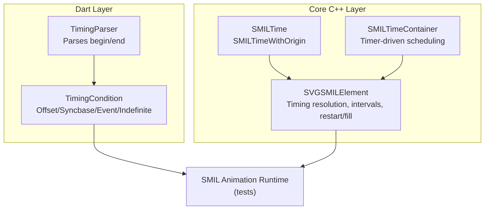
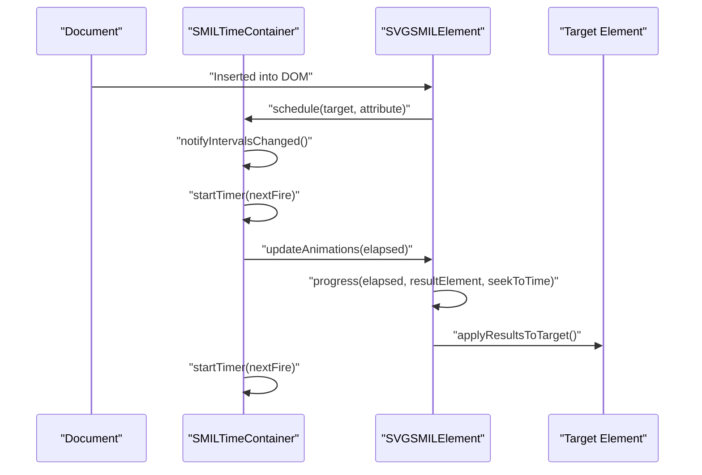
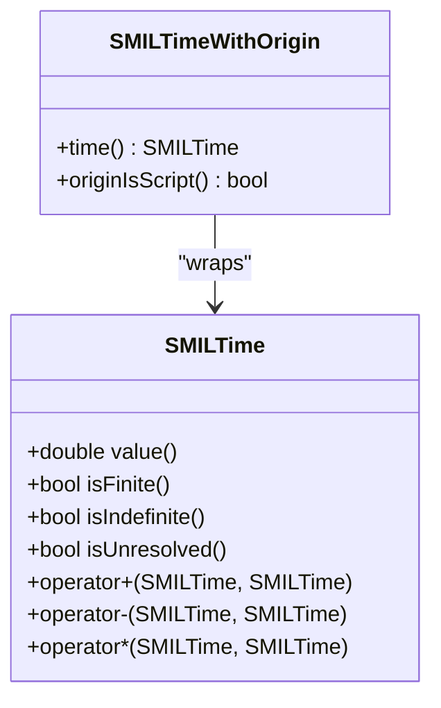
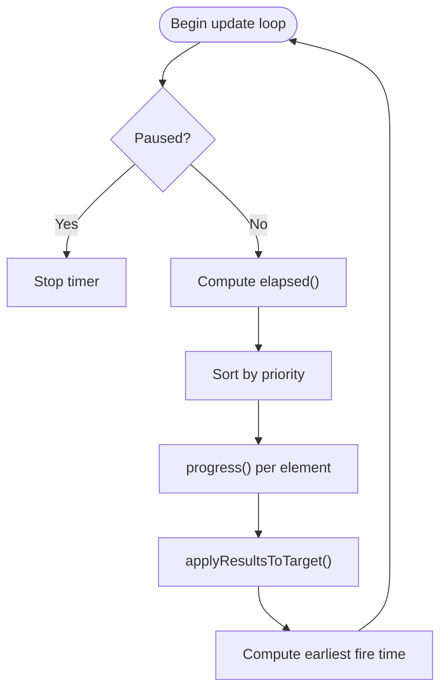
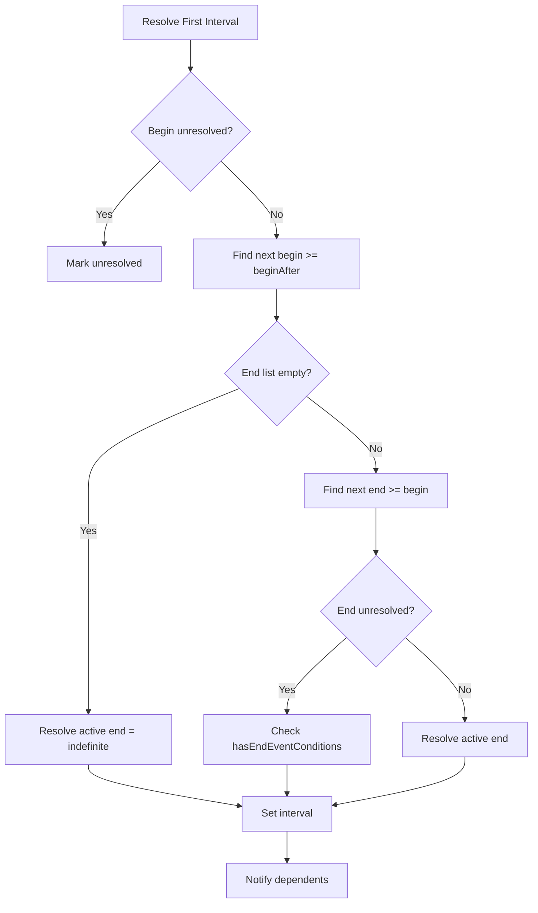
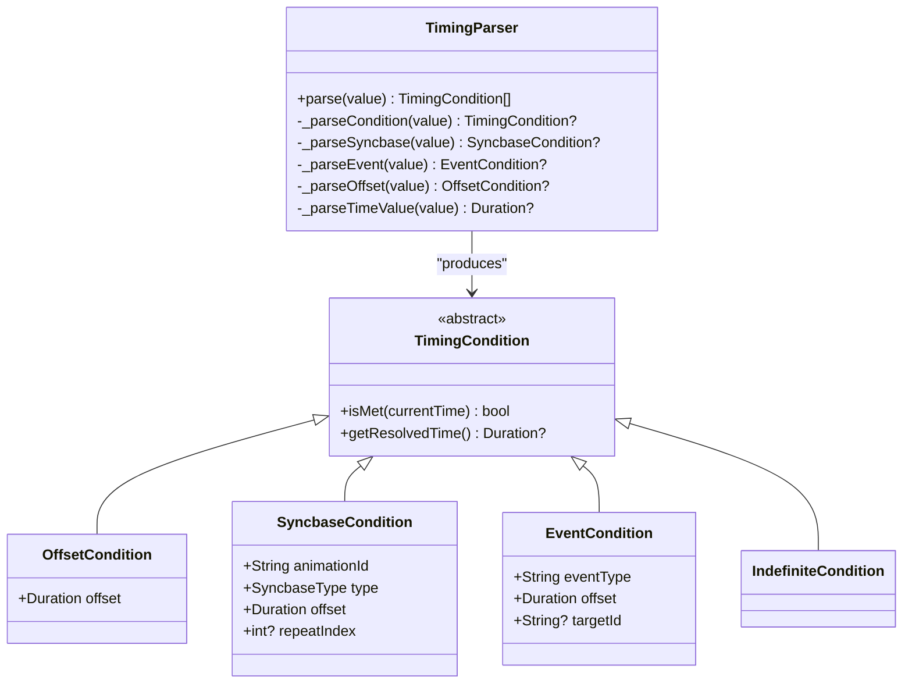
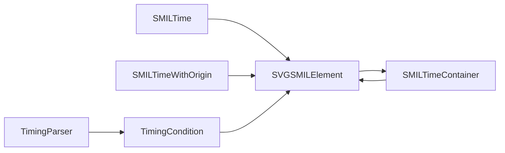

# SMIL Timing System

<cite>
**Referenced Files in This Document**
- [SMILTime.h](file://blink-b87d44f-Source-core-svg/animation/SMILTime.h)
- [SMILTime.cpp](file://blink-b87d44f-Source-core-svg/animation/SMILTime.cpp)
- [SMILTimeContainer.h](file://blink-b87d44f-Source-core-svg/animation/SMILTimeContainer.h)
- [SMILTimeContainer.cpp](file://blink-b87d44f-Source-core-svg/animation/SMILTimeContainer.cpp)
- [SVGSMILElement.h](file://blink-b87d44f-Source-core-svg/animation/SVGSMILElement.h)
- [SVGSMILElement.cpp](file://blink-b87d44f-Source-core-svg/animation/SVGSMILElement.cpp)
- [timing_parser.dart](file://lib/src/animation/smil/timing_parser.dart)
- [timing_condition.dart](file://lib/src/animation/smil/timing_condition.dart)
- [timing_parser_test.dart](file://test/animation/timing_parser_test.dart)
- [smil_test.dart](file://test/animation/smil_test.dart)
</cite>

## Table of Contents
1. [Introduction](#introduction)
2. [Project Structure](#project-structure)
3. [Core Components](#core-components)
4. [Architecture Overview](#architecture-overview)
5. [Detailed Component Analysis](#detailed-component-analysis)
6. [Dependency Analysis](#dependency-analysis)
7. [Performance Considerations](#performance-considerations)
8. [Troubleshooting Guide](#troubleshooting-guide)
9. [Conclusion](#conclusion)

## Introduction
This document explains the SMIL timing system used in the SVG animation stack. It covers timing attributes (begin, dur, repeatDur, end, repeat, fill), timing functions, time containers, timing calculation algorithms, event-based timing, and interactive timing conditions. It also documents the timing parser implementation, time container hierarchy, complex timing scenarios, inheritance, synchronization patterns, edge cases, infinite loops, and performance considerations.

## Project Structure
The SMIL timing system spans two layers:
- Core C++ implementation under blink-b87d44f-Source-core-svg/animation/, providing the low-level timing primitives, interval resolution, and scheduling.
- Dart implementation under lib/src/animation/smil/, providing a user-facing parser and condition model for begin/end attributes.

**Diagram sources**
- [SMILTime.h:34-96](file://blink-b87d44f-Source-core-svg/animation/SMILTime.h#L34-L96)
- [SMILTimeContainer.h:45-98](file://blink-b87d44f-Source-core-svg/animation/SMILTimeContainer.h#L45-L98)
- [SVGSMILElement.h:39-236](file://blink-b87d44f-Source-core-svg/animation/SVGSMILElement.h#L39-L236)
- [timing_parser.dart:10-36](file://lib/src/animation/smil/timing_parser.dart#L10-L36)
- [timing_condition.dart:12-182](file://lib/src/animation/smil/timing_condition.dart#L12-L182)

**Section sources**
- [SMILTime.h:34-96](file://blink-b87d44f-Source-core-svg/animation/SMILTime.h#L34-L96)
- [SMILTimeContainer.h:45-98](file://blink-b87d44f-Source-core-svg/animation/SMILTimeContainer.h#L45-L98)
- [SVGSMILElement.h:39-236](file://blink-b87d44f-Source-core-svg/animation/SVGSMILElement.h#L39-L236)
- [timing_parser.dart:10-36](file://lib/src/animation/smil/timing_parser.dart#L10-L36)
- [timing_condition.dart:12-182](file://lib/src/animation/smil/timing_condition.dart#L12-L182)

## Core Components
- SMILTime and SMILTimeWithOrigin: Encapsulate time values, unresolved/indefinite markers, and origin (parser vs script).
- SMILTimeContainer: Central scheduler that drives animation updates via a timer, manages active/paused state, and sorts animations by priority.
- SVGSMILElement: Implements the SMIL interval model, parses begin/end/dur/repeat/min/max, resolves intervals, handles restart/fill semantics, and computes next progress times.
- TimingParser and TimingCondition (Dart): Parse begin/end attribute values into structured conditions (offset, syncbase, event, indefinite) for the Dart runtime.

**Section sources**
- [SMILTime.h:34-96](file://blink-b87d44f-Source-core-svg/animation/SMILTime.h#L34-L96)
- [SMILTime.cpp:34-66](file://blink-b87d44f-Source-core-svg/animation/SMILTime.cpp#L34-L66)
- [SMILTimeContainer.h:45-98](file://blink-b87d44f-Source-core-svg/animation/SMILTimeContainer.h#L45-L98)
- [SMILTimeContainer.cpp:40-332](file://blink-b87d44f-Source-core-svg/animation/SMILTimeContainer.cpp#L40-L332)
- [SVGSMILElement.h:39-236](file://blink-b87d44f-Source-core-svg/animation/SVGSMILElement.h#L39-L236)
- [SVGSMILElement.cpp:109-131](file://blink-b87d44f-Source-core-svg/animation/SVGSMILElement.cpp#L109-L131)
- [timing_parser.dart:10-62](file://lib/src/animation/smil/timing_parser.dart#L10-L62)
- [timing_condition.dart:12-182](file://lib/src/animation/smil/timing_condition.dart#L12-L182)

## Architecture Overview
The timing system operates on a layered model:
- Time primitives define finite, unresolved, and indefinite states.
- Time container maintains global elapsed time, active state, and schedules per-element/attribute groups.
- Each animation element tracks its own begin/end lists, current interval, and contributes results to the target element.
- Parser converts textual begin/end into conditions; runtime evaluates whether conditions are satisfied and triggers dynamic begin/end times.

**Diagram sources**
- [SMILTimeContainer.cpp:62-82](file://blink-b87d44f-Source-core-svg/animation/SMILTimeContainer.cpp#L62-L82)
- [SMILTimeContainer.cpp:262-329](file://blink-b87d44f-Source-core-svg/animation/SMILTimeContainer.cpp#L262-L329)
- [SVGSMILElement.cpp:1048-1120](file://blink-b87d44f-Source-core-svg/animation/SVGSMILElement.cpp#L1048-L1120)

## Detailed Component Analysis

### SMILTime and SMILTimeWithOrigin
- Purpose: Represent time values with three states: finite, unresolved (no value yet), and indefinite (no end).
- Operators: Addition, subtraction, multiplication treat unresolved/indefinite specially to propagate semantics.
- Origin tracking: Distinguishes parser-originated times from script-originated times for proper clearing.

**Diagram sources**
- [SMILTime.h:34-96](file://blink-b87d44f-Source-core-svg/animation/SMILTime.h#L34-L96)
- [SMILTime.cpp:34-66](file://blink-b87d44f-Source-core-svg/animation/SMILTime.cpp#L34-L66)

**Section sources**
- [SMILTime.h:34-96](file://blink-b87d44f-Source-core-svg/animation/SMILTime.h#L34-L96)
- [SMILTime.cpp:34-66](file://blink-b87d44f-Source-core-svg/animation/SMILTime.cpp#L34-L66)

### SMILTimeContainer
- Responsibilities:
  - Track begin/pause/resume/accumulated active time.
  - Schedule and unschedule animations grouped by target element and attribute.
  - Compute elapsed time, decide active/paused state, and drive periodic updates.
  - Sort animations by priority and notify dependents of interval changes.
- Timer behavior: Uses a fixed frame delay and starts timers based on next progress time.

**Diagram sources**
- [SMILTimeContainer.cpp:107-116](file://blink-b87d44f-Source-core-svg/animation/SMILTimeContainer.cpp#L107-L116)
- [SMILTimeContainer.cpp:255-260](file://blink-b87d44f-Source-core-svg/animation/SMILTimeContainer.cpp#L255-L260)
- [SMILTimeContainer.cpp:262-329](file://blink-b87d44f-Source-core-svg/animation/SMILTimeContainer.cpp#L262-L329)

**Section sources**
- [SMILTimeContainer.h:45-98](file://blink-b87d44f-Source-core-svg/animation/SMILTimeContainer.h#L45-L98)
- [SMILTimeContainer.cpp:40-332](file://blink-b87d44f-Source-core-svg/animation/SMILTimeContainer.cpp#L40-L332)

### SVGSMILElement
- Timing attributes:
  - dur, repeatDur, repeatCount, min, max, fill, restart.
  - begin/end lists support offsets, syncbase, and event-based conditions.
- Interval resolution:
  - Computes first and subsequent intervals using begin/end lists and resolves active durations considering min/max.
- Progress engine:
  - Determines active state (Active/Frozen/Inactive), calculates percent and repeat, handles restart semantics, and computes next progress time.
- Syncbase and event conditions:
  - Connect/disconnect conditions; create instance times from syncbase; handle event-based triggers.

**Diagram sources**
- [SVGSMILElement.cpp:803-837](file://blink-b87d44f-Source-core-svg/animation/SVGSMILElement.cpp#L803-L837)

**Section sources**
- [SVGSMILElement.h:63-111](file://blink-b87d44f-Source-core-svg/animation/SVGSMILElement.h#L63-L111)
- [SVGSMILElement.h:147-186](file://blink-b87d44f-Source-core-svg/animation/SVGSMILElement.h#L147-L186)
- [SVGSMILElement.cpp:645-697](file://blink-b87d44f-Source-core-svg/animation/SVGSMILElement.cpp#L645-L697)
- [SVGSMILElement.cpp:767-801](file://blink-b87d44f-Source-core-svg/animation/SVGSMILElement.cpp#L767-L801)
- [SVGSMILElement.cpp:803-837](file://blink-b87d44f-Source-core-svg/animation/SVGSMILElement.cpp#L803-L837)
- [SVGSMILElement.cpp:1048-1120](file://blink-b87d44f-Source-core-svg/animation/SVGSMILElement.cpp#L1048-L1120)

### Timing Parser (Dart)
- Parses begin/end attribute values into structured conditions:
  - OffsetCondition: absolute offsets (supports s/ms/min/h).
  - SyncbaseCondition: references to another animation’s begin/end/repeat with optional offset and repeat index.
  - EventCondition: future support for DOM events.
  - IndefiniteCondition: external trigger required.
- Validation and normalization: trims whitespace, splits by semicolon, ignores empty segments.

**Diagram sources**
- [timing_parser.dart:10-62](file://lib/src/animation/smil/timing_parser.dart#L10-L62)
- [timing_condition.dart:12-182](file://lib/src/animation/smil/timing_condition.dart#L12-L182)

**Section sources**
- [timing_parser.dart:10-62](file://lib/src/animation/smil/timing_parser.dart#L10-L62)
- [timing_parser.dart:93-142](file://lib/src/animation/smil/timing_parser.dart#L93-L142)
- [timing_parser.dart:144-171](file://lib/src/animation/smil/timing_parser.dart#L144-L171)
- [timing_parser.dart:173-207](file://lib/src/animation/smil/timing_parser.dart#L173-L207)
- [timing_condition.dart:24-45](file://lib/src/animation/smil/timing_condition.dart#L24-L45)
- [timing_condition.dart:52-112](file://lib/src/animation/smil/timing_condition.dart#L52-L112)
- [timing_condition.dart:128-161](file://lib/src/animation/smil/timing_condition.dart#L128-L161)
- [timing_condition.dart:165-182](file://lib/src/animation/smil/timing_condition.dart#L165-L182)

### Timing Attributes and Functions
- begin: One or more semicolon-separated conditions (offset, syncbase, event, indefinite). Defaults to 0 if absent.
- dur: Duration of a single cycle; supports seconds, milliseconds, minutes, hours, and indefinite.
- repeatDur: Total duration across repetitions.
- repeatCount: Number of repetitions; supports finite numbers and indefinite.
- end: Optional end time derived from begin plus active duration or explicit end conditions.
- min/max: Lower and upper bounds for active duration.
- fill: Behavior after end (remove or freeze).
- restart: Behavior on restart (always, whenNotActive, never).

**Section sources**
- [SVGSMILElement.h:63-83](file://blink-b87d44f-Source-core-svg/animation/SVGSMILElement.h#L63-L83)
- [SVGSMILElement.cpp:283-337](file://blink-b87d44f-Source-core-svg/animation/SVGSMILElement.cpp#L283-L337)
- [SVGSMILElement.cpp:645-697](file://blink-b87d44f-Source-core-svg/animation/SVGSMILElement.cpp#L645-L697)
- [SVGSMILElement.cpp:767-801](file://blink-b87d44f-Source-core-svg/animation/SVGSMILElement.cpp#L767-L801)

### Event-Based Timing and Interactive Conditions
- Event-based conditions are represented by EventCondition and handled via DOM events.
- The C++ side connects/removes listeners and translates events into dynamic begin/end times.
- The Dart side provides a typed model for future integration.

**Section sources**
- [SVGSMILElement.h:147-166](file://blink-b87d44f-Source-core-svg/animation/SVGSMILElement.h#L147-L166)
- [SVGSMILElement.cpp:517-571](file://blink-b87d44f-Source-core-svg/animation/SVGSMILElement.cpp#L517-L571)
- [SVGSMILElement.cpp:1173-1180](file://blink-b87d44f-Source-core-svg/animation/SVGSMILElement.cpp#L1173-L1180)
- [timing_condition.dart:128-161](file://lib/src/animation/smil/timing_condition.dart#L128-L161)

### Time Containers and Hierarchy
- Each SVG element owns a SMILTimeContainer.
- Animations are scheduled per target element and attribute to enable accumulation of contributions.
- Priority sorting considers begin times and document order; frozen elements prioritize previous interval.

**Section sources**
- [SMILTimeContainer.h:45-98](file://blink-b87d44f-Source-core-svg/animation/SMILTimeContainer.h#L45-L98)
- [SMILTimeContainer.cpp:228-260](file://blink-b87d44f-Source-core-svg/animation/SMILTimeContainer.cpp#L228-L260)
- [SVGSMILElement.cpp:231-276](file://blink-b87d44f-Source-core-svg/animation/SVGSMILElement.cpp#L231-L276)

### Timing Calculation Algorithms
- Repeating duration: min(dur * repeatCount, repeatDur, indefinite).
- Active end: min(minValue, max(maxValue, begin + min(repeatDur, end - begin) or indefinite)).
- Percent and repeat computation: activeTime / simpleDuration with modulo arithmetic and repeating duration checks.
- Next progress time: either next interval boundary or small step for continuous updates.

**Section sources**
- [SVGSMILElement.cpp:767-801](file://blink-b87d44f-Source-core-svg/animation/SVGSMILElement.cpp#L767-L801)
- [SVGSMILElement.cpp:984-1014](file://blink-b87d44f-Source-core-svg/animation/SVGSMILElement.cpp#L984-L1014)
- [SVGSMILElement.cpp:1016-1032](file://blink-b87d44f-Source-core-svg/animation/SVGSMILElement.cpp#L1016-L1032)

### Complex Timing Scenarios and Examples
- Multiple begin offsets: "2s; 5s; 7s".
- Syncbase with offset: "anim1.end+2s".
- Event plus syncbase: "click; anim1.repeat(2)".
- Indefinite begin/end: "indefinite".

These are validated by parser tests and expected to produce the corresponding condition types.

**Section sources**
- [timing_parser_test.dart:7-56](file://test/animation/timing_parser_test.dart#L7-L56)
- [timing_parser_test.dart:58-133](file://test/animation/timing_parser_test.dart#L58-L133)
- [timing_parser_test.dart:135-174](file://test/animation/timing_parser_test.dart#L135-L174)
- [timing_parser_test.dart:176-183](file://test/animation/timing_parser_test.dart#L176-L183)
- [timing_parser_test.dart:185-214](file://test/animation/timing_parser_test.dart#L185-L214)
- [timing_parser_test.dart:216-236](file://test/animation/timing_parser_test.dart#L216-L236)
- [timing_parser_test.dart:238-270](file://test/animation/timing_parser_test.dart#L238-L270)

### Timing Inheritance and Synchronization Patterns
- Inheritance: begin defaults to 0 when unspecified; animations inherit container timing.
- Syncbase: createInstanceTimesFromSyncbase propagates begin/end/repeat events with offsets.
- Dependent notifications: notifyDependentsIntervalChanged ensures downstream animations update their instance times.

**Section sources**
- [SVGSMILElement.cpp:249-257](file://blink-b87d44f-Source-core-svg/animation/SVGSMILElement.cpp#L249-L257)
- [SVGSMILElement.cpp:1122-1136](file://blink-b87d44f-Source-core-svg/animation/SVGSMILElement.cpp#L1122-L1136)
- [SVGSMILElement.cpp:1138-1159](file://blink-b87d44f-Source-core-svg/animation/SVGSMILElement.cpp#L1138-L1159)

### Edge Cases and Infinite Loops
- Unresolved begin/end: guarded by unresolved/indefinite checks; prevents invalid computations.
- Min/max sanity: if min > max, both are ignored.
- Restart semantics: never disables restart; whenNotActive defers restart until outside active period.
- Infinite durations: dur=indefinite freezes at repeating end or at interval end; no further progress ticks occur.

**Section sources**
- [SVGSMILElement.cpp:742-744](file://blink-b87d44f-Source-core-svg/animation/SVGSMILElement.cpp#L742-L744)
- [SVGSMILElement.cpp:794-799](file://blink-b87d44f-Source-core-svg/animation/SVGSMILElement.cpp#L794-L799)
- [SVGSMILElement.cpp:928-949](file://blink-b87d44f-Source-core-svg/animation/SVGSMILElement.cpp#L928-L949)
- [SVGSMILElement.cpp:1018-1029](file://blink-b87d44f-Source-core-svg/animation/SVGSMILElement.cpp#L1018-L1029)

### Performance Considerations
- Fixed frame delay: animationFrameDelay controls minimum update granularity.
- Sorting overhead: PriorityCompare sorts by begin time and document order; keep begin/end lists minimal.
- Timers: startTimer schedules only when finite; avoids unnecessary wake-ups.
- Accumulation: Only the first contributing animation writes results to the target to reduce redundant updates.

**Section sources**
- [SMILTimeContainer.cpp:38-38](file://blink-b87d44f-Source-core-svg/animation/SMILTimeContainer.cpp#L38-L38)
- [SMILTimeContainer.cpp:255-260](file://blink-b87d44f-Source-core-svg/animation/SMILTimeContainer.cpp#L255-L260)
- [SMILTimeContainer.cpp:316-318](file://blink-b87d44f-Source-core-svg/animation/SMILTimeContainer.cpp#L316-L318)

## Dependency Analysis
- SMILTime depends on math constants for unresolved/indefinite values.
- SVGSMILElement depends on SMILTime and SMILTimeContainer for scheduling and interval computation.
- SMILTimeContainer depends on SVGSMILElement for per-element progress and results application.
- Dart TimingParser/TimingCondition feed into the runtime and tests.

**Diagram sources**
- [SMILTime.h:34-96](file://blink-b87d44f-Source-core-svg/animation/SMILTime.h#L34-L96)
- [SVGSMILElement.h:39-236](file://blink-b87d44f-Source-core-svg/animation/SVGSMILElement.h#L39-L236)
- [SMILTimeContainer.h:45-98](file://blink-b87d44f-Source-core-svg/animation/SMILTimeContainer.h#L45-L98)
- [timing_parser.dart:10-36](file://lib/src/animation/smil/timing_parser.dart#L10-L36)
- [timing_condition.dart:12-182](file://lib/src/animation/smil/timing_condition.dart#L12-L182)

**Section sources**
- [SMILTime.h:34-96](file://blink-b87d44f-Source-core-svg/animation/SMILTime.h#L34-L96)
- [SVGSMILElement.h:39-236](file://blink-b87d44f-Source-core-svg/animation/SVGSMILElement.h#L39-L236)
- [SMILTimeContainer.h:45-98](file://blink-b87d44f-Source-core-svg/animation/SMILTimeContainer.h#L45-L98)
- [timing_parser.dart:10-36](file://lib/src/animation/smil/timing_parser.dart#L10-L36)
- [timing_condition.dart:12-182](file://lib/src/animation/smil/timing_condition.dart#L12-L182)

## Performance Considerations
- Prefer concise begin/end lists to minimize interval resolution cost.
- Avoid excessive use of event-based conditions; they incur listener overhead.
- Use repeatCount or repeatDur judiciously to bound total runtime.
- Keep document order stable to reduce sorting churn.

## Troubleshooting Guide
- No animation starts:
  - Check begin list resolution and unresolved/indefinite states.
  - Verify target element and attribute name validity.
- Animation runs indefinitely:
  - Confirm dur is finite or fill is set appropriately.
  - Review repeatCount/repeatDur interactions.
- Events not triggering:
  - Ensure event listeners are connected and conditions are parsed correctly.
  - Validate event names against supported sets.

**Section sources**
- [SVGSMILElement.cpp:278-281](file://blink-b87d44f-Source-core-svg/animation/SVGSMILElement.cpp#L278-L281)
- [SVGSMILElement.cpp:517-571](file://blink-b87d44f-Source-core-svg/animation/SVGSMILElement.cpp#L517-L571)
- [timing_parser_test.dart:227-236](file://test/animation/timing_parser_test.dart#L227-L236)

## Conclusion
The SMIL timing system combines robust C++ primitives with a flexible Dart parser to support complex animation timing. It provides precise interval resolution, syncbase and event-based conditions, restart/fill semantics, and efficient scheduling via a time container. By understanding the algorithms and patterns documented here, developers can craft reliable and performant animations while avoiding common pitfalls like unresolved times, infinite loops, and excessive event overhead.