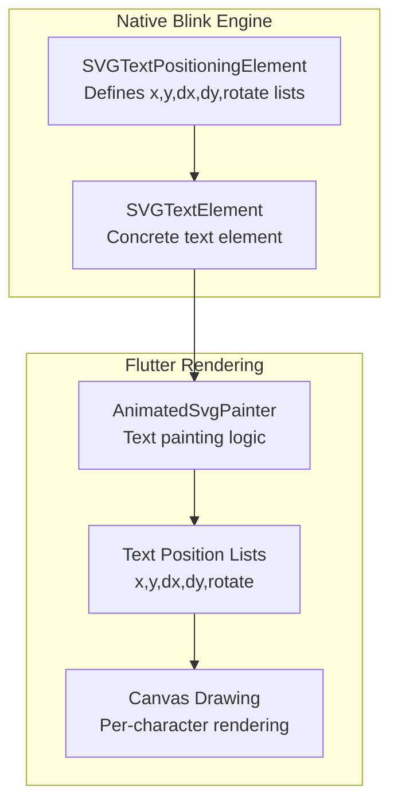
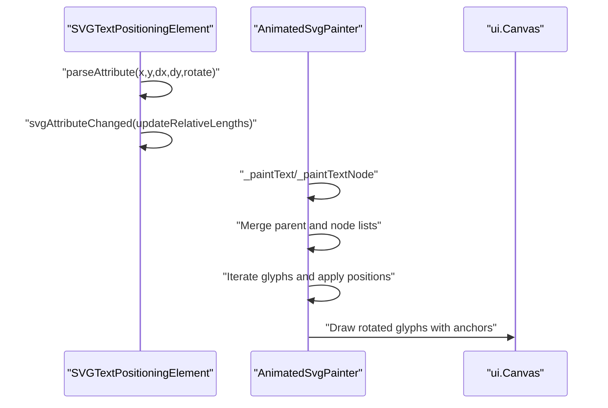
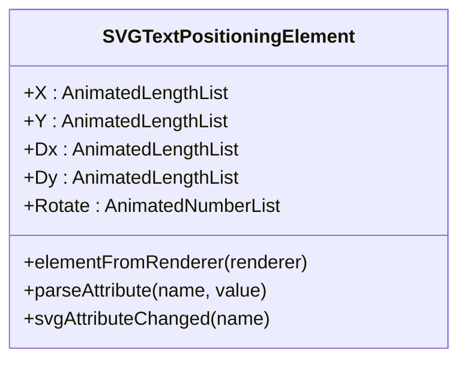
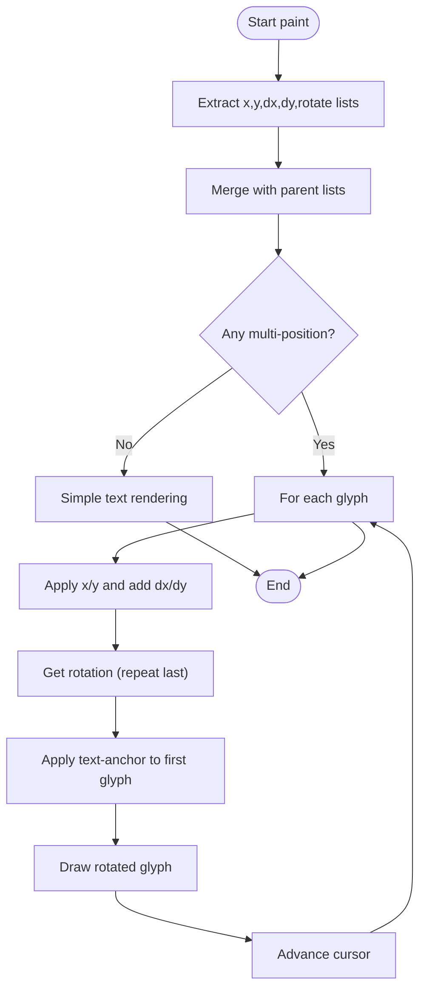
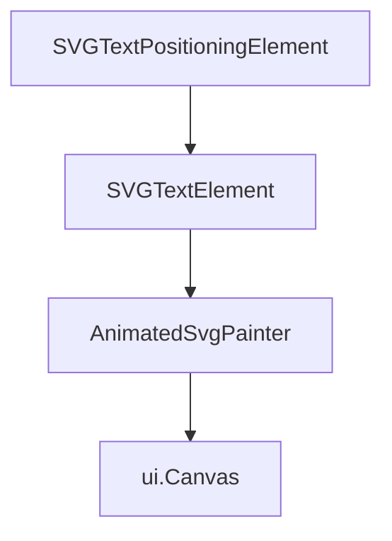

# Text Positioning Attributes

<cite>
**Referenced Files in This Document**
- [SVGTextPositioningElement.h](file://blink-b87d44f-Source-core-svg/SVGTextPositioningElement.h)
- [SVGTextPositioningElement.cpp](file://blink-b87d44f-Source-core-svg/SVGTextPositioningElement.cpp)
- [SVGTextElement.cpp](file://blink-b87d44f-Source-core-svg/SVGTextElement.cpp)
- [animated_svg_painter_text_paint.dart](file://lib/src/animation/animated_svg_painter_text_paint.dart)
- [text_position_list_test.dart](file://test/animation/text_position_list_test.dart)
</cite>

## Table of Contents
1. [Introduction](#introduction)
2. [Project Structure](#project-structure)
3. [Core Components](#core-components)
4. [Architecture Overview](#architecture-overview)
5. [Detailed Component Analysis](#detailed-component-analysis)
6. [Dependency Analysis](#dependency-analysis)
7. [Performance Considerations](#performance-considerations)
8. [Troubleshooting Guide](#troubleshooting-guide)
9. [Conclusion](#conclusion)

## Introduction
This document explains how SVG text positioning attributes are implemented and processed in the Flutter SVG library. It focuses on the x, y, dx, dy, and rotate attributes that enable precise per-character placement and orientation of text along SVG paths and in regular text contexts. The documentation covers both the native Blink-based parsing and the Flutter rendering pipeline, showing how attribute lists are parsed, merged, and applied during text drawing.

## Project Structure
The text positioning functionality spans three main areas:
- Native Blink SVG engine: Defines and parses the text positioning attributes on SVG elements.
- SVG text element hierarchy: Extends the base text positioning capabilities to concrete SVG elements like `<text>` and `<tspan>`.
- Flutter rendering pipeline: Consumes parsed attribute lists and renders text with per-character positioning and rotation.

**Diagram sources**
- [SVGTextPositioningElement.h:30-48](file://blink-b87d44f-Source-core-svg/SVGTextPositioningElement.h#L30-L48)
- [SVGTextElement.cpp:33-37](file://blink-b87d44f-Source-core-svg/SVGTextElement.cpp#L33-L37)
- [animated_svg_painter_text_paint.dart:25-115](file://lib/src/animation/animated_svg_painter_text_paint.dart#L25-L115)

**Section sources**
- [SVGTextPositioningElement.h:21-53](file://blink-b87d44f-Source-core-svg/SVGTextPositioningElement.h#L21-L53)
- [SVGTextElement.cpp:33-43](file://blink-b87d44f-Source-core-svg/SVGTextElement.cpp#L33-L43)
- [animated_svg_painter_text_paint.dart:1-594](file://lib/src/animation/animated_svg_painter_text_paint.dart#L1-L594)

## Core Components
This section outlines the primary components involved in text positioning:

- SVGTextPositioningElement: The base class that defines animated length lists for x, y, dx, dy and a number list for rotate. It also handles attribute parsing and change notifications.
- SVGTextElement: A concrete SVG element that inherits positioning capabilities and creates the appropriate renderer for text.
- AnimatedSvgPainter text painting extension: Parses and merges position lists from nodes and children, applies per-character adjustments, and draws rotated glyphs on the canvas.

Key responsibilities:
- Attribute parsing: Converts comma/space-separated strings into typed lists for x, y, dx, dy, and rotate.
- List merging: Child nodes inherit and override parent positioning lists.
- Rendering: Iterates through characters, applying positions and rotations, and measuring text for anchoring.

**Section sources**
- [SVGTextPositioningElement.h:30-48](file://blink-b87d44f-Source-core-svg/SVGTextPositioningElement.h#L30-L48)
- [SVGTextPositioningElement.cpp:34-118](file://blink-b87d44f-Source-core-svg/SVGTextPositioningElement.cpp#L34-L118)
- [SVGTextElement.cpp:33-37](file://blink-b87d44f-Source-core-svg/SVGTextElement.cpp#L33-L37)
- [animated_svg_painter_text_paint.dart:25-115](file://lib/src/animation/animated_svg_painter_text_paint.dart#L25-L115)

## Architecture Overview
The text positioning pipeline follows a predictable flow from attribute parsing to canvas drawing:

**Diagram sources**
- [SVGTextPositioningElement.cpp:70-149](file://blink-b87d44f-Source-core-svg/SVGTextPositioningElement.cpp#L70-L149)
- [animated_svg_painter_text_paint.dart:25-115](file://lib/src/animation/animated_svg_painter_text_paint.dart#L25-L115)

## Detailed Component Analysis

### SVGTextPositioningElement
This class defines the core text positioning attributes and their animated list properties. It supports:
- x: horizontal offsets for each character.
- y: vertical offsets for each character.
- dx: horizontal deltas added to the base x.
- dy: vertical deltas added to the base y.
- rotate: rotation angles per character.

Behavior highlights:
- Attribute validation ensures only supported attributes are processed.
- Parsing converts strings into typed lists (SVGLengthList for x/y, SVGLengthList for dx/dy, SVGNumberList for rotate).
- Change handling updates relative lengths and marks the renderer for layout/resource invalidation.

**Diagram sources**
- [SVGTextPositioningElement.h:30-48](file://blink-b87d44f-Source-core-svg/SVGTextPositioningElement.h#L30-L48)
- [SVGTextPositioningElement.cpp:34-48](file://blink-b87d44f-Source-core-svg/SVGTextPositioningElement.cpp#L34-L48)

**Section sources**
- [SVGTextPositioningElement.h:24-48](file://blink-b87d44f-Source-core-svg/SVGTextPositioningElement.h#L24-L48)
- [SVGTextPositioningElement.cpp:57-149](file://blink-b87d44f-Source-core-svg/SVGTextPositioningElement.cpp#L57-L149)

### SVGTextElement
SVGTextElement inherits from SVGTextPositioningElement, establishing the concrete element that participates in the positioning model. It also creates the specialized renderer for text content.

Key points:
- Inherits animated properties for positioning.
- Creates a renderer suitable for text layout and painting.

**Section sources**
- [SVGTextElement.cpp:33-37](file://blink-b87d44f-Source-core-svg/SVGTextElement.cpp#L33-L37)

### AnimatedSvgPainter Text Painting Extension
The Flutter side consumes parsed lists and renders text with per-character precision:

- List extraction: Reads x, y, dx, dy, and rotate lists from the current node and merges with inherited lists from parents.
- Single vs multi-position: If any multi-position list has more than one value, per-character rendering is used; otherwise, simple rendering is applied.
- Per-character loop: Applies base x/y and adds dx/dy deltas for each character. Rotation values are applied around the character's baseline.
- Anchoring: Text-anchor affects the first character's placement relative to the total text width.
- Path rendering: For text-on-path scenarios, characters are placed along a path with rotation aligned to the path tangent.

**Diagram sources**
- [animated_svg_painter_text_paint.dart:25-115](file://lib/src/animation/animated_svg_painter_text_paint.dart#L25-L115)
- [animated_svg_painter_text_paint.dart:192-310](file://lib/src/animation/animated_svg_painter_text_paint.dart#L192-L310)

**Section sources**
- [animated_svg_painter_text_paint.dart:25-115](file://lib/src/animation/animated_svg_painter_text_paint.dart#L25-L115)
- [animated_svg_painter_text_paint.dart:192-310](file://lib/src/animation/animated_svg_painter_text_paint.dart#L192-L310)

## Dependency Analysis
The text positioning system exhibits clear separation of concerns:

- Native layer: SVGTextPositioningElement depends on SVG attribute parsing utilities and maintains animated property wrappers.
- Element layer: SVGTextElement extends the positioning behavior for concrete text elements.
- Rendering layer: AnimatedSvgPainter reads parsed lists and performs drawing operations.

**Diagram sources**
- [SVGTextPositioningElement.h:30-35](file://blink-b87d44f-Source-core-svg/SVGTextPositioningElement.h#L30-L35)
- [SVGTextElement.cpp:33-37](file://blink-b87d44f-Source-core-svg/SVGTextElement.cpp#L33-L37)
- [animated_svg_painter_text_paint.dart:4-23](file://lib/src/animation/animated_svg_painter_text_paint.dart#L4-L23)

**Section sources**
- [SVGTextPositioningElement.h:30-35](file://blink-b87d44f-Source-core-svg/SVGTextPositioningElement.h#L30-L35)
- [SVGTextElement.cpp:33-37](file://blink-b87d44f-Source-core-svg/SVGTextElement.cpp#L33-L37)
- [animated_svg_painter_text_paint.dart:4-23](file://lib/src/animation/animated_svg_painter_text_paint.dart#L4-L23)

## Performance Considerations
- List merging: Merging parent and node lists occurs per node traversal; keep list sizes minimal to reduce overhead.
- Per-character rendering: Multi-position lists trigger per-glyph loops, which can be expensive for long texts. Prefer single-value lists when possible.
- Rotation operations: Applying rotation involves save/restore operations on the canvas; batch operations and avoid unnecessary rotations.
- Relative length updates: Attribute changes mark the renderer for invalidation; frequent updates can cause repeated layout passes.

## Troubleshooting Guide
Common issues and resolutions:

- Unexpected character placement:
  - Verify that x/y lists match the number of characters; dx/dy deltas are applied after base positions.
  - Check that rotate values are specified in degrees and that the last value repeats for remaining characters.

- Incorrect anchoring:
  - Text-anchor applies to the first character's bounding box; ensure the first character's position reflects the intended alignment.

- No effect from positioning attributes:
  - Confirm that the attributes are present on the correct elements and that the renderer is active.
  - Ensure that multi-position lists are properly formatted and parsed.

- Rotation not applied:
  - Verify that rotate list values exist and that the canvas rotation is applied around the correct baseline coordinates.

**Section sources**
- [SVGTextPositioningElement.cpp:70-149](file://blink-b87d44f-Source-core-svg/SVGTextPositioningElement.cpp#L70-L149)
- [animated_svg_painter_text_paint.dart:235-310](file://lib/src/animation/animated_svg_painter_text_paint.dart#L235-L310)
- [text_position_list_test.dart](file://test/animation/text_position_list_test.dart)

## Conclusion
The text positioning attributes (x, y, dx, dy, rotate) provide fine-grained control over character placement and orientation in SVG text rendering. The Blink engine parses and validates these attributes, while the Flutter rendering pipeline applies them during drawing, supporting both simple and complex layouts. Understanding the list merging, per-character iteration, and anchoring behavior helps achieve predictable and performant text positioning results.