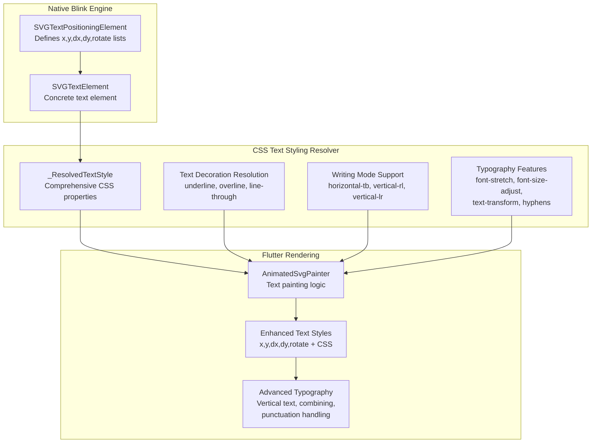
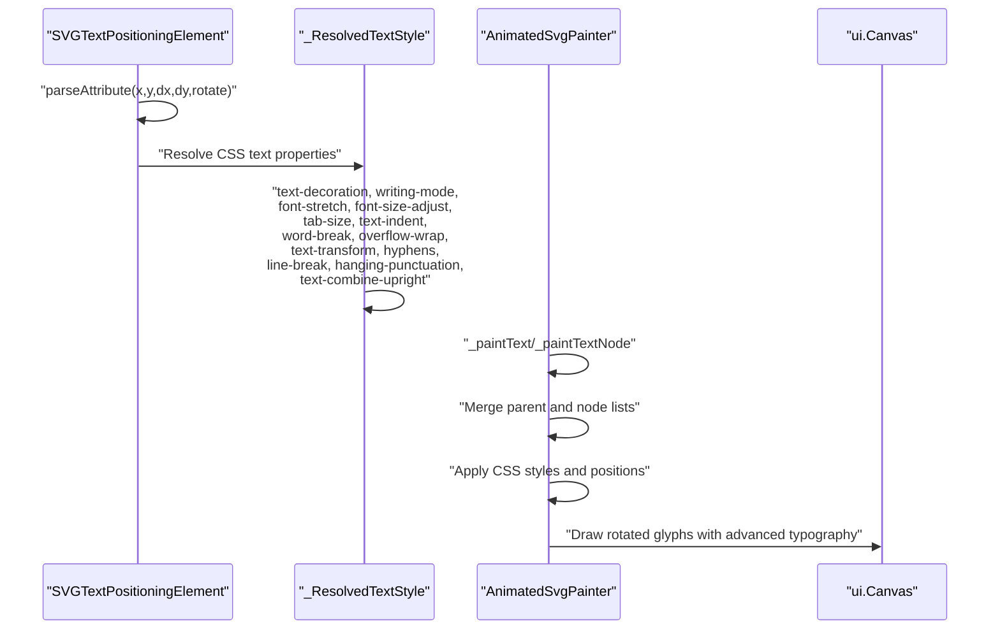
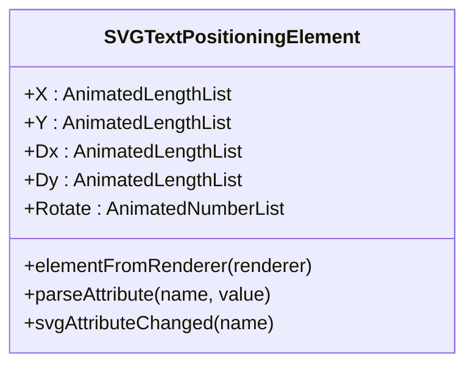
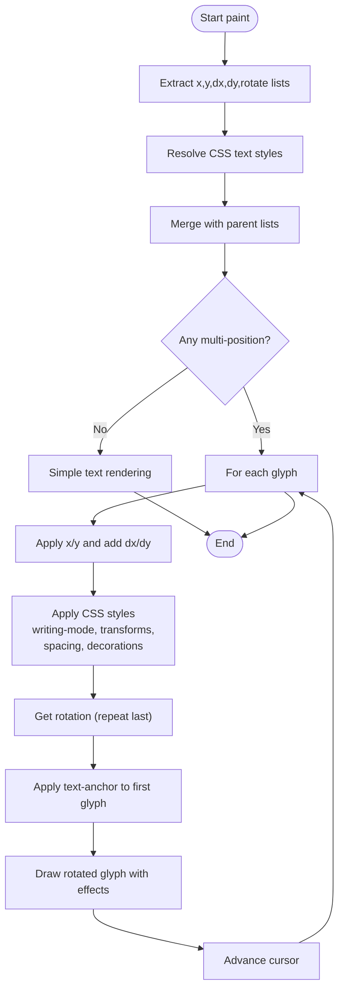
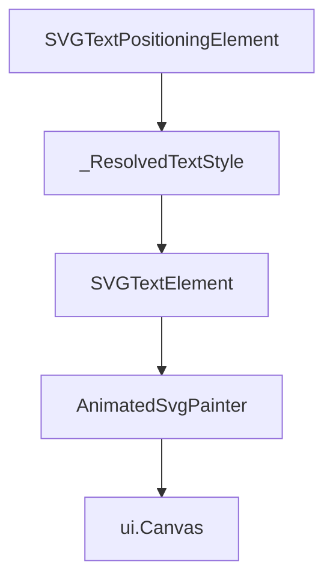

# Text Positioning Attributes

<cite>
**Referenced Files in This Document**
- [SVGTextPositioningElement.h](file://blink-b87d44f-Source-core-svg/SVGTextPositioningElement.h)
- [SVGTextPositioningElement.cpp](file://blink-b87d44f-Source-core-svg/SVGTextPositioningElement.cpp)
- [SVGTextElement.cpp](file://blink-b87d44f-Source-core-svg/SVGTextElement.cpp)
- [animated_svg_painter.dart](file://lib/src/animation/animated_svg_painter.dart)
- [animated_svg_painter_text_style.dart](file://lib/src/animation/animated_svg_painter_text_style.dart)
- [animated_svg_painter_text_paint.dart](file://lib/src/animation/animated_svg_painter_text_paint.dart)
- [text_position_list_test.dart](file://test/animation/text_position_list_test.dart)
- [text_decoration_style_test.dart](file://test/animation/text_decoration_style_test.dart)
- [text_combine_upright_test.dart](file://test/animation/text_combine_upright_test.dart)
- [text_indent_test.dart](file://test/animation/text_indent_test.dart)
- [text_transform_test.dart](file://test/animation/text_transform_test.dart)
- [hyphens_test.dart](file://test/animation/hyphens_test.dart)
</cite>

## Update Summary
**Changes Made**
- Added comprehensive CSS text styling capabilities documentation
- Expanded text positioning system to include new CSS properties
- Updated architecture diagrams to reflect enhanced text rendering pipeline
- Added new sections covering text decoration, writing mode, and advanced typography features
- Enhanced troubleshooting guide with CSS property-specific guidance

## Table of Contents
1. [Introduction](#introduction)
2. [Project Structure](#project-structure)
3. [Core Components](#core-components)
4. [Architecture Overview](#architecture-overview)
5. [Detailed Component Analysis](#detailed-component-analysis)
6. [CSS Text Styling Capabilities](#css-text-styling-capabilities)
7. [Advanced Typography Features](#advanced-typography-features)
8. [Dependency Analysis](#dependency-analysis)
9. [Performance Considerations](#performance-considerations)
10. [Troubleshooting Guide](#troubleshooting-guide)
11. [Conclusion](#conclusion)

## Introduction
This document explains how SVG text positioning attributes and CSS text styling capabilities are implemented and processed in the Flutter SVG library. It focuses on the x, y, dx, dy, and rotate attributes for precise per-character placement, alongside comprehensive CSS text styling support including text-decoration, writing-mode, font-feature-settings, glyph-orientation-vertical, unicode-bidi, font-stretch, font-size-adjust, tab-size, text-indent, word-break, overflow-wrap, text-transform, hyphens, line-break, hanging-punctuation, and text-combine-upright. The documentation covers both the native Blink-based parsing and the Flutter rendering pipeline, showing how attribute lists and CSS properties are parsed, merged, and applied during text drawing.

## Project Structure
The text positioning and styling functionality spans four main areas:
- Native Blink SVG engine: Defines and parses the text positioning attributes on SVG elements.
- CSS text styling resolver: Processes comprehensive CSS text styling properties and converts them to Flutter-compatible formats.
- SVG text element hierarchy: Extends the base text positioning capabilities to concrete SVG elements like `<text>` and `<tspan>`.
- Flutter rendering pipeline: Consumes parsed attribute lists and CSS styles, rendering text with per-character positioning, rotation, and advanced typography features.

**Diagram sources**
- [SVGTextPositioningElement.h:30-48](file://blink-b87d44f-Source-core-svg/SVGTextPositioningElement.h#L30-L48)
- [SVGTextElement.cpp:33-37](file://blink-b87d44f-Source-core-svg/SVGTextElement.cpp#L33-L37)
- [animated_svg_painter.dart:258-477](file://lib/src/animation/animated_svg_painter.dart#L258-L477)
- [animated_svg_painter_text_style.dart:4-184](file://lib/src/animation/animated_svg_painter_text_style.dart#L4-L184)
- [animated_svg_painter_text_paint.dart:25-115](file://lib/src/animation/animated_svg_painter_text_paint.dart#L25-L115)

**Section sources**
- [SVGTextPositioningElement.h:21-53](file://blink-b87d44f-Source-core-svg/SVGTextPositioningElement.h#L21-L53)
- [SVGTextElement.cpp:33-43](file://blink-b87d44f-Source-core-svg/SVGTextElement.cpp#L33-L43)
- [animated_svg_painter.dart:258-477](file://lib/src/animation/animated_svg_painter.dart#L258-L477)
- [animated_svg_painter_text_style.dart:4-184](file://lib/src/animation/animated_svg_painter_text_style.dart#L4-L184)
- [animated_svg_painter_text_paint.dart:1-594](file://lib/src/animation/animated_svg_painter_text_paint.dart#L1-L594)

## Core Components
This section outlines the primary components involved in text positioning and CSS styling:

- **SVGTextPositioningElement**: The base class that defines animated length lists for x, y, dx, dy and a number list for rotate. It handles attribute parsing and change notifications for positioning attributes.
- **_ResolvedTextStyle**: Comprehensive text style container that includes all CSS text styling properties including text-decoration, writing-mode, font-stretch, font-size-adjust, tab-size, text-indent, word-break, overflow-wrap, text-transform, hyphens, line-break, hanging-punctuation, and text-combine-upright.
- **SVGTextElement**: A concrete SVG element that inherits positioning capabilities and creates the appropriate renderer for text.
- **AnimatedSvgPainter text painting extension**: Parses and merges position lists from nodes and children, applies per-character adjustments, resolves CSS styles, and draws rotated glyphs on the canvas.

Key responsibilities:
- **Attribute parsing**: Converts comma/space-separated strings into typed lists for x, y, dx, dy, and rotate.
- **CSS property resolution**: Processes comprehensive CSS text styling properties and converts them to Flutter-compatible formats.
- **List merging**: Child nodes inherit and override parent positioning lists.
- **Rendering**: Iterates through characters, applying positions and rotations, resolving CSS styles, and measuring text for anchoring.

**Section sources**
- [SVGTextPositioningElement.h:30-48](file://blink-b87d44f-Source-core-svg/SVGTextPositioningElement.h#L30-L48)
- [SVGTextPositioningElement.cpp:34-118](file://blink-b87d44f-Source-core-svg/SVGTextPositioningElement.cpp#L34-L118)
- [SVGTextElement.cpp:33-37](file://blink-b87d44f-Source-core-svg/SVGTextElement.cpp#L33-L37)
- [animated_svg_painter.dart:258-477](file://lib/src/animation/animated_svg_painter.dart#L258-L477)
- [animated_svg_painter_text_style.dart:4-184](file://lib/src/animation/animated_svg_painter_text_style.dart#L4-L184)
- [animated_svg_painter_text_paint.dart:25-115](file://lib/src/animation/animated_svg_painter_text_paint.dart#L25-L115)

## Architecture Overview
The enhanced text positioning and styling pipeline follows a comprehensive flow from attribute parsing to advanced CSS property resolution and canvas drawing:

**Diagram sources**
- [SVGTextPositioningElement.cpp:70-149](file://blink-b87d44f-Source-core-svg/SVGTextPositioningElement.cpp#L70-L149)
- [animated_svg_painter.dart:258-477](file://lib/src/animation/animated_svg_painter.dart#L258-L477)
- [animated_svg_painter_text_style.dart:4-184](file://lib/src/animation/animated_svg_painter_text_style.dart#L4-L184)
- [animated_svg_painter_text_paint.dart:25-115](file://lib/src/animation/animated_svg_painter_text_paint.dart#L25-L115)

## Detailed Component Analysis

### SVGTextPositioningElement
This class defines the core text positioning attributes and their animated list properties. It supports:
- **x**: horizontal offsets for each character.
- **y**: vertical offsets for each character.
- **dx**: horizontal deltas added to the base x.
- **dy**: vertical deltas added to the base y.
- **rotate**: rotation angles per character.

Behavior highlights:
- Attribute validation ensures only supported attributes are processed.
- Parsing converts strings into typed lists (SVGLengthList for x/y, SVGLengthList for dx/dy, SVGNumberList for rotate).
- Change handling updates relative lengths and marks the renderer for layout/resource invalidation.

**Diagram sources**
- [SVGTextPositioningElement.h:30-48](file://blink-b87d44f-Source-core-svg/SVGTextPositioningElement.h#L30-L48)
- [SVGTextPositioningElement.cpp:34-48](file://blink-b87d44f-Source-core-svg/SVGTextPositioningElement.cpp#L34-L48)

**Section sources**
- [SVGTextPositioningElement.h:24-48](file://blink-b87d44f-Source-core-svg/SVGTextPositioningElement.h#L24-L48)
- [SVGTextPositioningElement.cpp:57-149](file://blink-b87d44f-Source-core-svg/SVGTextPositioningElement.cpp#L57-L149)

### _ResolvedTextStyle - Enhanced CSS Properties
The `_ResolvedTextStyle` class now encompasses comprehensive CSS text styling capabilities:

**Text Decoration Properties:**
- `decorations`: Set of active text decorations (underline, overline, line-through)
- `decorationColor`: Optional decoration color (defaults to text color)
- `textDecorationStyle`: Style (solid, double, dotted, dashed, wavy)
- `textDecorationThickness`: Thickness in user units or auto/from-font
- `textDecorationSkip`: What elements decorations skip over
- `textDecorationSkipInk`: How underlines/overlines interact with glyphs

**Writing Mode and Direction:**
- `writingMode`: horizontal-tb, vertical-rl, vertical-lr
- `textDirection`: LTR/RTL support
- `glyphOrientationVertical`: Angle for vertical text glyph rotation
- `unicodeBidi`: Bidirectional text handling modes

**Typography and Spacing:**
- `fontStretch`: Width percentage (50-200%, keywords)
- `fontSizeAdjust`: Aspect ratio for cross-font consistency
- `tabSize`: Number of spaces tab equals (default 8)
- `textIndent`: Indentation in user units
- `wordBreak`: Normal, break-all, keep-all, break-word
- `overflowWrap`: Normal, break-word, anywhere
- `textTransform`: None, capitalize, uppercase, lowercase, full-width, full-size-kana
- `hyphens`: None, manual, auto
- `lineBreak`: Auto, loose, normal, strict, anywhere
- `hangingPunctuation`: None, first, last, force-end, allow-end
- `textCombineUpright`: None, all, digits with optional count
- `textOrientation`: Mixed, upright, sideways

**Layout and Effects:**
- `textUnderlinePosition`: Underline position (auto, under, left, right)
- `textUnderlineOffset`: Offset in user units or auto
- `textShadow`: Shadow CSS value
- `whiteSpace`: Normal, nowrap, pre, pre-wrap, pre-line, break-spaces
- `textOverflow`: Clip, ellipsis, or custom string

**Section sources**
- [animated_svg_painter.dart:258-477](file://lib/src/animation/animated_svg_painter.dart#L258-L477)
- [animated_svg_painter_text_style.dart:4-184](file://lib/src/animation/animated_svg_painter_text_style.dart#L4-L184)

### SVGTextElement
SVGTextElement inherits from SVGTextPositioningElement, establishing the concrete element that participates in the positioning and styling model. It also creates the specialized renderer for text content with enhanced CSS property support.

Key points:
- Inherits animated properties for positioning.
- Creates a renderer suitable for text layout and painting with comprehensive CSS styling.

**Section sources**
- [SVGTextElement.cpp:33-37](file://blink-b87d44f-Source-core-svg/SVGTextElement.cpp#L33-L37)

### AnimatedSvgPainter Text Painting Extension
The Flutter side consumes parsed lists and CSS styles, rendering text with per-character precision and advanced typography:

- **List extraction**: Reads x, y, dx, dy, and rotate lists from the current node and merges with inherited lists from parents.
- **CSS style resolution**: Resolves comprehensive CSS text styling properties from node attributes and inherited styles.
- **Single vs multi-position**: If any multi-position list has more than one value, per-character rendering is used; otherwise, simple rendering is applied.
- **Per-character loop**: Applies base x/y and adds dx/dy deltas for each character. Rotation values are applied around the character's baseline.
- **Advanced typography**: Integrates CSS properties like writing-mode, text-transform, hyphens, and text-combine-upright.
- **Anchoring**: Text-anchor affects the first character's placement relative to the total text width.
- **Path rendering**: For text-on-path scenarios, characters are placed along a path with rotation aligned to the path tangent.

**Diagram sources**
- [animated_svg_painter_text_paint.dart:25-115](file://lib/src/animation/animated_svg_painter_text_paint.dart#L25-L115)
- [animated_svg_painter_text_paint.dart:192-310](file://lib/src/animation/animated_svg_painter_text_paint.dart#L192-L310)
- [animated_svg_painter_text_style.dart:4-184](file://lib/src/animation/animated_svg_painter_text_style.dart#L4-L184)

**Section sources**
- [animated_svg_painter_text_paint.dart:25-115](file://lib/src/animation/animated_svg_painter_text_paint.dart#L25-L115)
- [animated_svg_painter_text_paint.dart:192-310](file://lib/src/animation/animated_svg_painter_text_paint.dart#L192-L310)
- [animated_svg_painter_text_style.dart:4-184](file://lib/src/animation/animated_svg_painter_text_style.dart#L4-L184)

## CSS Text Styling Capabilities
The enhanced text styling system provides comprehensive CSS text property support:

### Text Decoration System
- **Multiple decorations**: Supports underline, overline, and line-through simultaneously
- **Decoration customization**: Color, style (solid, double, dotted, dashed, wavy), thickness, skip behavior, and skip-ink options
- **Inheritance**: CSS properties inherit through the SVG DOM hierarchy

### Writing Mode Support
- **Horizontal writing**: `horizontal-tb` (default)
- **Vertical writing**: `vertical-rl`, `vertical-lr` with proper glyph rotation
- **Legacy compatibility**: Supports SVG 1.1 writing-mode values (`tb-rl`, `tb`, `lr-tb`, `lr`)

### Advanced Typography Features
- **Font stretching**: Percentage values (50-200%) and keyword equivalents (ultra-condensed to ultra-expanded)
- **Font sizing**: `font-size-adjust` for maintaining consistent x-height across fonts
- **Text transformation**: Full CSS text-transform support including full-width and kana variants
- **Hyphenation**: Automatic and manual hyphenation with soft hyphen support
- **Line breaking**: Strictness control from loose to strict with anywhere option

### Layout and Spacing Control
- **Text indentation**: Supports px, em, and percentage values
- **Tab sizing**: Configurable tab stops with inheritance
- **Word wrapping**: Break-all, keep-all, and break-word strategies
- **Overflow handling**: Ellipsis and custom overflow strings

**Section sources**
- [animated_svg_painter.dart:258-477](file://lib/src/animation/animated_svg_painter.dart#L258-L477)
- [animated_svg_painter_text_style.dart:4-184](file://lib/src/animation/animated_svg_painter_text_style.dart#L4-L184)

## Advanced Typography Features
The system implements sophisticated typographic behaviors:

### Vertical Text Rendering
- **Character rotation**: 90-degree clockwise rotation for vertical glyphs
- **Stacking behavior**: Proper vertical stacking with letter-spacing consideration
- **Writing mode integration**: Seamless switching between horizontal and vertical layouts

### Text Combination Upright
- **Digit combination**: Combining consecutive digits in vertical text
- **Count specification**: Configurable digit limits (default 2)
- **Mixed content**: Handling of alphabetic and numeric characters together

### Hanging Punctuation
- **First/last punctuation**: Proper hanging of quotation marks and parentheses
- **Force/end options**: Control over punctuation hanging behavior
- **Multi-value support**: Combining multiple hanging punctuation modes

### Complex Text Layout
- **Bidirectional text**: Unicode bidi support with embed and isolate modes
- **Text shadows**: CSS shadow effects with multiple color support
- **White space handling**: Pre-formatted text with break-spaces option

**Section sources**
- [animated_svg_painter_text_paint.dart:400-594](file://lib/src/animation/animated_svg_painter_text_paint.dart#L400-L594)
- [animated_svg_painter_text_style.dart:286-301](file://lib/src/animation/animated_svg_painter_text_style.dart#L286-L301)
- [animated_svg_painter_text_style.dart:523-542](file://lib/src/animation/animated_svg_painter_text_style.dart#L523-L542)

## Dependency Analysis
The enhanced text positioning and styling system exhibits clear separation of concerns:

- **Native layer**: SVGTextPositioningElement depends on SVG attribute parsing utilities and maintains animated property wrappers.
- **CSS resolver layer**: _ResolvedTextStyle processes comprehensive CSS properties and converts them to Flutter-compatible formats.
- **Element layer**: SVGTextElement extends the positioning and styling behavior for concrete text elements.
- **Rendering layer**: AnimatedSvgPainter reads parsed lists, resolved CSS styles, and performs drawing operations.

**Diagram sources**
- [SVGTextPositioningElement.h:30-35](file://blink-b87d44f-Source-core-svg/SVGTextPositioningElement.h#L30-L35)
- [animated_svg_painter.dart:258-358](file://lib/src/animation/animated_svg_painter.dart#L258-L358)
- [SVGTextElement.cpp:33-37](file://blink-b87d44f-Source-core-svg/SVGTextElement.cpp#L33-L37)
- [animated_svg_painter_text_paint.dart:4-23](file://lib/src/animation/animated_svg_painter_text_paint.dart#L4-L23)

**Section sources**
- [SVGTextPositioningElement.h:30-35](file://blink-b87d44f-Source-core-svg/SVGTextPositioningElement.h#L30-L35)
- [animated_svg_painter.dart:258-358](file://lib/src/animation/animated_svg_painter.dart#L258-L358)
- [SVGTextElement.cpp:33-37](file://blink-b87d44f-Source-core-svg/SVGTextElement.cpp#L33-L37)
- [animated_svg_painter_text_paint.dart:4-23](file://lib/src/animation/animated_svg_painter_text_paint.dart#L4-L23)

## Performance Considerations
- **List merging**: Merging parent and node lists occurs per node traversal; keep list sizes minimal to reduce overhead.
- **Per-character rendering**: Multi-position lists trigger per-glyph loops, which can be expensive for long texts. Prefer single-value lists when possible.
- **CSS property resolution**: Comprehensive CSS property resolution adds computational overhead; cache resolved styles when possible.
- **Rotation operations**: Applying rotation involves save/restore operations on the canvas; batch operations and avoid unnecessary rotations.
- **Advanced typography**: Features like text-combine-upright and complex text transformations can impact performance with large texts.
- **Relative length updates**: Attribute changes mark the renderer for invalidation; frequent updates can cause repeated layout passes.

## Troubleshooting Guide
Common issues and resolutions:

### Positioning Issues
- **Unexpected character placement**:
  - Verify that x/y lists match the number of characters; dx/dy deltas are applied after base positions.
  - Check that rotate values are specified in degrees and that the last value repeats for remaining characters.

### CSS Property Issues
- **Text decoration not appearing**:
  - Ensure text-decoration property includes the specific line type (underline, overline, line-through).
  - Verify text-decoration-color is properly specified and not transparent.
  - Check that text-decoration-style matches the expected visual appearance.

- **Writing mode not working**:
  - Confirm writing-mode is set to vertical-rl or vertical-lr for vertical text.
  - Ensure glyph-orientation-vertical is appropriate for the desired glyph rotation.
  - Verify text-combine-upright is configured correctly for digit combinations.

- **Text transformation not applied**:
  - Check text-transform property values (none, uppercase, lowercase, capitalize, full-width).
  - Verify inheritance from parent elements if using group styling.

- **Hyphenation not working**:
  - Ensure hyphens property is set to 'auto' or 'manual'.
  - Use proper soft hyphen characters (&#173;) for manual hyphenation points.
  - Check that the text contains appropriate hyphenation opportunities.

### Layout and Spacing Issues
- **Incorrect anchoring**:
  - Text-anchor applies to the first character's bounding box; ensure the first character's position reflects the intended alignment.
  - Consider text-indent effects on overall text positioning.

- **No effect from positioning attributes**:
  - Confirm that the attributes are present on the correct elements and that the renderer is active.
  - Ensure that multi-position lists are properly formatted and parsed.

- **Rotation not applied**:
  - Verify that rotate list values exist and that the canvas rotation is applied around the correct baseline coordinates.

### Advanced Typography Issues
- **Vertical text rendering problems**:
  - Check writing-mode compatibility with the text content.
  - Verify glyph-orientation-vertical values for proper glyph rotation.
  - Ensure text-combine-upright is configured appropriately for mixed content.

- **Text overflow handling**:
  - Confirm text-overflow property is set to 'ellipsis' or a custom string.
  - Check white-space property for pre-formatted text behavior.
  - Verify container dimensions for proper overflow detection.

**Section sources**
- [SVGTextPositioningElement.cpp:70-149](file://blink-b87d44f-Source-core-svg/SVGTextPositioningElement.cpp#L70-L149)
- [animated_svg_painter_text_paint.dart:235-310](file://lib/src/animation/animated_svg_painter_text_paint.dart#L235-L310)
- [animated_svg_painter_text_style.dart:4-184](file://lib/src/animation/animated_svg_painter_text_style.dart#L4-L184)
- [text_position_list_test.dart](file://test/animation/text_position_list_test.dart)
- [text_decoration_style_test.dart](file://test/animation/text_decoration_style_test.dart)
- [text_combine_upright_test.dart](file://test/animation/text_combine_upright_test.dart)
- [text_indent_test.dart](file://test/animation/text_indent_test.dart)
- [text_transform_test.dart](file://test/animation/text_transform_test.dart)
- [hyphens_test.dart](file://test/animation/hyphens_test.dart)

## Conclusion
The enhanced text positioning and CSS styling system provides comprehensive control over character placement, orientation, and typography in SVG text rendering. The system now supports the full spectrum of CSS text styling properties alongside traditional positioning attributes, enabling sophisticated text layouts with advanced typographic features. The Blink engine parses and validates positioning attributes, while the Flutter rendering pipeline resolves CSS properties and applies them during drawing, supporting both simple and complex layouts. Understanding the list merging, per-character iteration, CSS property resolution, and advanced typography behavior helps achieve predictable and performant text positioning and styling results.