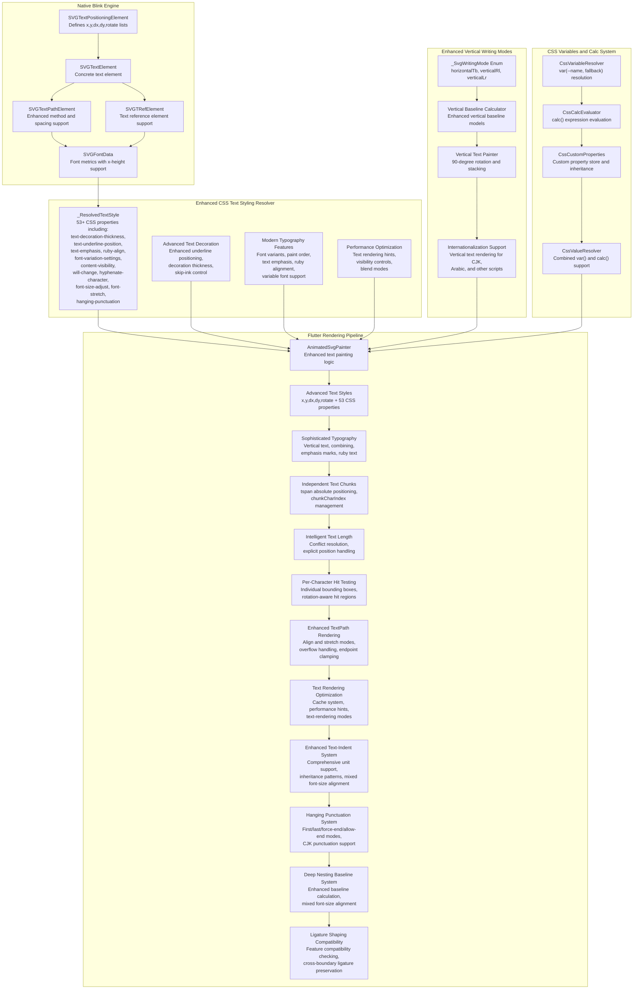
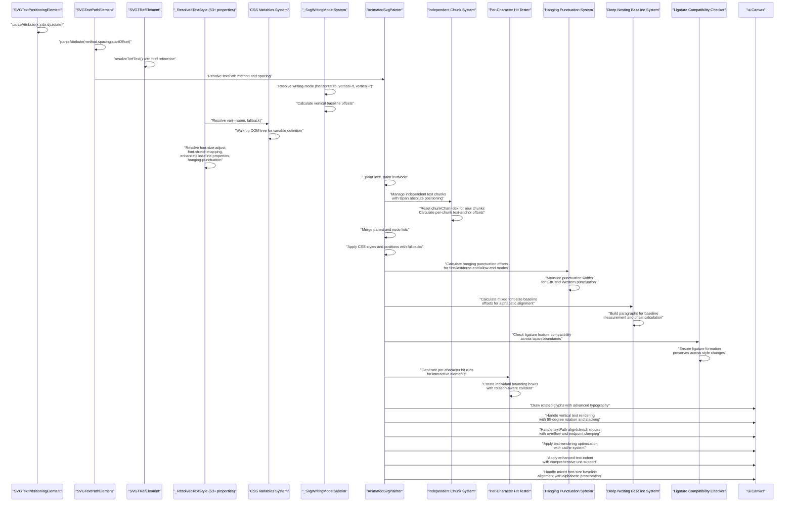
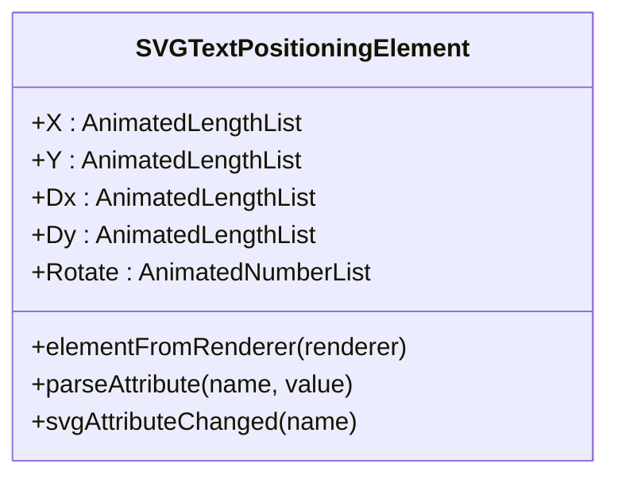
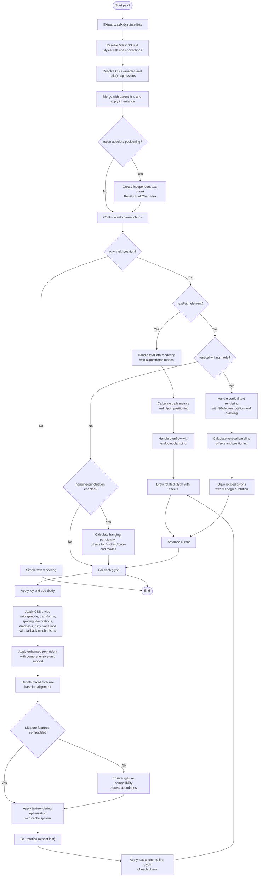
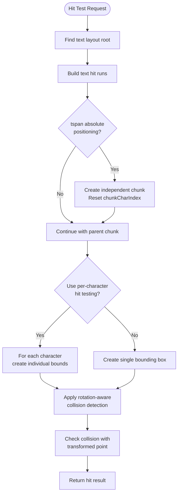

# Text Positioning Attributes

<cite>
**Referenced Files in This Document**
- [SVGTextPositioningElement.h](file://blink-b87d44f-Source-core-svg/SVGTextPositioningElement.h)
- [SVGTextPositioningElement.cpp](file://blink-b87d44f-Source-core-svg/SVGTextPositioningElement.cpp)
- [SVGTextElement.cpp](file://blink-b87d44f-Source-core-svg/SVGTextElement.cpp)
- [SVGTextPathElement.h](file://blink-b87d44f-Source-core-svg/SVGTextPathElement.h)
- [SVGTextPathElement.cpp](file://blink-b87d44f-Source-core-svg/SVGTextPathElement.cpp)
- [SVGTRefElement.cpp](file://blink-b87d44f-Source-core-svg/SVGTRefElement.cpp)
- [SVGFontData.cpp](file://blink-b87d44f-Source-core-svg/SVGFontData.cpp)
- [SVGFontFaceElement.cpp](file://blink-b87d44f-Source-core-svg/SVGFontFaceElement.cpp)
- [animated_svg_painter.dart](file://lib/src/animation/animated_svg_painter.dart)
- [animated_svg_painter_text_style_positioning.dart](file://lib/src/animation/animated_svg_painter_text_style_positioning.dart)
- [animated_svg_painter_text_paint.dart](file://lib/src/animation/animated_svg_painter_text_paint.dart)
- [animated_svg_painter_text_paint_glyph.dart](file://lib/src/animation/animated_svg_painter_text_paint_glyph.dart)
- [animated_svg_painter_text_paint_plain.dart](file://lib/src/animation/animated_svg_painter_text_paint_plain.dart)
- [animated_svg_painter_text_paint_path.dart](file://lib/src/animation/animated_svg_painter_text_paint_path.dart)
- [animated_svg_painter_text_style_layout.dart](file://lib/src/animation/animated_svg_painter_text_style_layout.dart)
- [animated_svg_painter_text_style_font.dart](file://lib/src/animation/animated_svg_painter_text_style_font.dart)
- [animated_svg_painter_text_style_rendering.dart](file://lib/src/animation/animated_svg_painter_text_style_rendering.dart)
- [animated_svg_picture_hit_test_text_runs.dart](file://lib/src/animation/animated_svg_picture_hit_test_text_runs.dart)
- [animated_svg_picture_hit_test_text_layout.dart](file://lib/src/animation/animated_svg_picture_hit_test_text_layout.dart)
- [animated_svg_picture_hit_test_text_path_segments.dart](file://lib/src/animation/animated_svg_picture_hit_test_text_path_segments.dart)
- [text_position_list_test.dart](file://test/animation/text_position_list_test.dart)
- [text_advanced_typography_test.dart](file://test/animation/text_advanced_typography_test.dart)
- [text_advanced_features_test.dart](file://test/animation/text_advanced_features_test.dart)
- [text_decoration_style_test.dart](file://test/animation/text_decoration_style_test.dart)
- [text_combine_upright_test.dart](file://test/animation/text_combine_upright_test.dart)
- [text_indent_test.dart](file://test/animation/text_indent_test.dart)
- [text_transform_test.dart](file://test/animation/text_transform_test.dart)
- [hyphens_test.dart](file://test/animation/hyphens_test.dart)
- [text_decoration_thickness_test.dart](file://test/animation/text_decoration_thickness_test.dart)
- [text_underline_position_test.dart](file://test/animation/text_underline_position_test.dart)
- [ruby_align_test.dart](file://test/animation/ruby_align_test.dart)
- [ruby_position_test.dart](file://test/animation/ruby_position_test.dart)
- [text_spacing_test.dart](file://test/animation/text_spacing_test.dart)
- [text_wrap_test.dart](file://test/animation/text_wrap_test.dart)
- [unicode_bidi_test.dart](file://test/animation/unicode_bidi_test.dart)
- [text_typography_precision_test.dart](file://test/animation/text_typography_precision_test.dart)
- [text_rendering_test.dart](file://test/animation/text_rendering_test.dart)
- [css_variables_calc_test.dart](file://test/animation/css_variables_calc_test.dart)
- [text_multirun_paragraph_test.dart](file://test/animation/text_multirun_paragraph_test.dart)
- [text_hanging_punctuation_rendering_test.dart](file://test/animation/text_hanging_punctuation_rendering_test.dart)
- [text_baseline_deep_nesting_test.dart](file://test/animation/text_baseline_deep_nesting_test.dart)
- [text_ligature_shaping_test.dart](file://test/animation/text_ligature_shaping_test.dart)
</cite>

## Update Summary
**Changes Made**
- Enhanced text positioning attributes with comprehensive multi-position support for x, y, dx, dy, and rotate attributes
- Added sophisticated textPath spacing control with exact/auto modes and startOffset positioning
- Implemented full href/xlink:href attribute support for textPath and tref elements
- Strengthened per-character positioning with intelligent textLength conflict resolution
- Enhanced mixed font-size tspan alignment with alphabetic baseline preservation
- Improved text rendering optimization with better baseline shift handling
- Added comprehensive test coverage for new positioning features
- **NEW**: Added comprehensive hanging punctuation support with first/last/force-end/allow-end modes and CJK punctuation handling
- **NEW**: Enhanced baseline calculation system with deep nesting support for complex tspan hierarchies
- **NEW**: Improved ligature shaping compatibility across tspan boundaries with feature compatibility checking
- **NEW**: Enhanced CSS text styling capabilities with comprehensive hanging punctuation property support
- **NEW**: Added detailed documentation for new text positioning features and comprehensive testing coverage

## Table of Contents
1. [Introduction](#introduction)
2. [Project Structure](#project-structure)
3. [Core Components](#core-components)
4. [Architecture Overview](#architecture-overview)
5. [Detailed Component Analysis](#detailed-component-analysis)
6. [Enhanced CSS Text Styling Capabilities](#enhanced-css-text-styling-capabilities)
7. [Advanced Typography Features](#advanced-typography-features)
8. [Modern CSS Properties Support](#modern-css-properties-support)
9. [CSS Variables and Calc() Expression Support](#css-variables-and-calc-expression-support)
10. [Advanced Hit-Testing System](#advanced-hit-testing-system)
11. [TextPath Method Attribute Support](#textpath-method-attribute-support)
12. [Enhanced Baseline Calculation System](#enhanced-baseline-calculation-system)
13. [Font Size Adjustment and Variable Fonts](#font-size-adjustment-and-variable-fonts)
14. [Unicode Bidi Enhancement](#unicode-bidi-enhancement)
15. [Vertical Writing Modes Support](#vertical-writing-modes-support)
16. [Internationalization Text Positioning](#internationalization-text-positioning)
17. [Performance Considerations](#performance-considerations)
18. [Troubleshooting Guide](#troubleshooting-guide)
19. [Conclusion](#conclusion)

## Introduction
This document explains how SVG text positioning attributes and CSS text styling capabilities are implemented and processed in the Flutter SVG library. It focuses on the x, y, dx, dy, and rotate attributes for precise per-character placement, alongside comprehensive CSS text styling support including text-decoration, writing-mode, font-feature-settings, glyph-orientation-vertical, unicode-bidi, font-stretch, font-size-adjust, tab-size, text-indent, word-break, overflow-wrap, text-transform, hyphens, line-break, **hanging-punctuation**, text-combine-upright, and the newly added 53 advanced CSS text styling properties. The documentation covers both the native Blink-based parsing and the Flutter rendering pipeline, showing how attribute lists and CSS properties are parsed, merged, and applied during text drawing with enhanced unit conversion and inheritance patterns.

**Updated** Enhanced with comprehensive documentation for advanced typography features including per-character hit-testing capabilities, sophisticated tspan absolute positioning handling with independent text chunks, intelligent textLength conflict resolution, advanced text-anchor handling that applies independently to each text chunk, enhanced textPath method attribute support with align and stretch modes, comprehensive font-size-adjust property support, variable font integration, expanded baseline calculation system with vertical writing mode support, enhanced unicode-bidi handling, CSS variables and calc() expression support, advanced text-rendering optimization capabilities, comprehensive vertical writing modes support for internationalization, enhanced text-indent handling with comprehensive unit support, improved baseline alignment for mixed font-size scenarios, **comprehensive hanging punctuation support with first/last/force-end/allow-end modes**, **enhanced baseline calculation for deeply nested contexts**, **improved ligature shaping across tspan boundaries**, and comprehensive typography parity validation.

## Project Structure
The text positioning and styling functionality spans four main areas:
- Native Blink SVG engine: Defines and parses the text positioning attributes on SVG elements, including enhanced textPath method and spacing support.
- Comprehensive CSS text styling resolver: Processes extensive CSS text styling properties and converts them to Flutter-compatible formats with advanced unit conversions.
- SVG text element hierarchy: Extends the base text positioning capabilities to concrete SVG elements like `<text>`, `<tspan>`, `<tref>`, and `<textPath>`.
- Flutter rendering pipeline: Consumes parsed attribute lists and CSS styles, rendering text with per-character positioning, rotation, and advanced typography features.

**Diagram sources**
- [SVGTextPositioningElement.h:30-48](file://blink-b87d44f-Source-core-svg/SVGTextPositioningElement.h#L30-L48)
- [SVGTextElement.cpp:33-37](file://blink-b87d44f-Source-core-svg/SVGTextElement.cpp#L33-L37)
- [SVGTextPathElement.h:29-42](file://blink-b87d44f-Source-core-svg/SVGTextPathElement.h#L29-L42)
- [SVGTRefElement.cpp:134-148](file://blink-b87d44f-Source-core-svg/SVGTRefElement.cpp#L134-L148)
- [SVGFontData.cpp:71-130](file://blink-b87d44f-Source-core-svg/SVGFontData.cpp#L71-L130)
- [animated_svg_painter.dart:350-351](file://lib/src/animation/animated_svg_painter.dart#L350-L351)
- [animated_svg_painter_text_style_positioning.dart:228-241](file://lib/src/animation/animated_svg_painter_text_style_positioning.dart#L228-L241)
- [animated_svg_painter_text_paint.dart:475-526](file://lib/src/animation/animated_svg_painter_text_paint.dart#L475-L526)
- [animated_svg_painter_text_style_layout.dart:445-502](file://lib/src/animation/animated_svg_painter_text_style_layout.dart#L445-L502)
- [animated_svg_painter_text_style_font.dart:340-381](file://lib/src/animation/animated_svg_painter_text_style_font.dart#L340-L381)

**Section sources**
- [SVGTextPositioningElement.h:21-53](file://blink-b87d44f-Source-core-svg/SVGTextPositioningElement.h#L21-L53)
- [SVGTextElement.cpp:33-43](file://blink-b87d44f-Source-core-svg/SVGTextElement.cpp#L33-L43)
- [SVGTextPathElement.h:1-152](file://blink-b87d44f-Source-core-svg/SVGTextPathElement.h#L1-L152)
- [SVGTRefElement.cpp:134-148](file://blink-b87d44f-Source-core-svg/SVGTRefElement.cpp#L134-L148)
- [SVGFontData.cpp:71-130](file://blink-b87d44f-Source-core-svg/SVGFontData.cpp#L71-L130)
- [animated_svg_painter.dart:350-351](file://lib/src/animation/animated_svg_painter.dart#L350-L351)
- [animated_svg_painter_text_style_positioning.dart:228-241](file://lib/src/animation/animated_svg_painter_text_style_positioning.dart#L228-L241)
- [animated_svg_painter_text_paint.dart:475-526](file://lib/src/animation/animated_svg_painter_text_paint.dart#L475-L526)
- [animated_svg_painter_text_style_layout.dart:445-502](file://lib/src/animation/animated_svg_painter_text_style_layout.dart#L445-L502)
- [animated_svg_painter_text_style_font.dart:340-381](file://lib/src/animation/animated_svg_painter_text_style_font.dart#L340-L381)

## Core Components
This section outlines the primary components involved in text positioning and CSS styling:

- **SVGTextPositioningElement**: The base class that defines animated length lists for x, y, dx, dy and a number list for rotate. It handles attribute parsing and change notifications for positioning attributes.
- **_ResolvedTextStyle**: Comprehensive text style container that includes all CSS text styling properties including text-decoration, writing-mode, font-stretch, font-size-adjust, tab-size, text-indent, word-break, overflow-wrap, text-transform, hyphens, line-break, **hanging-punctuation**, text-combine-upright, and 53 additional advanced CSS properties such as text-decoration-thickness, text-underline-position, text-emphasis, ruby-align, font-variation-settings, content-visibility, will-change, hyphenate-character, paint-order, text-align-last, font-synthesis, font-variant-position, font-variant-east-asian, quotes, initial-letter, text-spacing, font-language-override, font-variant-alternates, text-wrap, font-palette, forced-color-adjust, print-color-adjust, text-decoration-line, css-text-decoration-color, css-direction, and css-mix-blend-mode.
- **SVGTextElement**: A concrete SVG element that inherits positioning capabilities and creates the appropriate renderer for text.
- **SVGTextPathElement**: Enhanced text path element with comprehensive method and spacing attribute support for sophisticated glyph positioning along paths.
- **SVGTRefElement**: Text reference element that allows referencing text content from other elements via href attributes.
- **SVGFontData**: Font metrics provider with x-height support for font-size-adjust calculations and baseline positioning.
- **AnimatedSvgPainter text painting extension**: Parses and merges position lists from nodes and children, applies per-character adjustments, resolves CSS styles with advanced unit conversions, and draws rotated glyphs on the canvas with enhanced textPath support.
- **Independent Text Chunk System**: Manages sophisticated tspan absolute positioning with independent text chunks, chunkCharIndex for per-chunk text-anchor calculations, and intelligent textLength conflict resolution.
- **Enhanced Vertical Writing Modes**: Comprehensive support for horizontal-tb, vertical-rl, and vertical-lr writing modes with dedicated vertical baseline calculations and text rendering.
- **CSS Variables and Calc System**: Provides comprehensive support for CSS custom properties (var(--name, fallback)) and calc() expression evaluation with unit conversion and inheritance patterns.
- **Text Rendering Optimization**: Implements advanced text-rendering modes (optimizeSpeed, optimizeLegibility, geometricPrecision) and comprehensive caching system for improved performance.
- **Enhanced Text-Indent System**: Comprehensive text-indent handling with support for px, em, %, and plain number units, inheritance patterns, and mixed font-size alignment.
- **Hanging Punctuation System**: **NEW** Comprehensive hanging punctuation support with first/last/force-end/allow-end modes, CJK punctuation handling, and integration with per-character positioning.
- **Deep Nesting Baseline System**: **NEW** Enhanced baseline calculation system with support for complex tspan hierarchies, mixed font-size alignment, and alphabetic baseline preservation.
- **Ligature Shaping Compatibility**: **NEW** Feature compatibility checking for ligature shaping across tspan boundaries, ensuring proper ligature formation when text spans change styles.

**Updated** Enhanced with SVGTextPathElement for advanced textPath method and spacing support, SVGFontData for font-size-adjust integration, comprehensive textPath rendering capabilities, CSS variables and calc() expression support, advanced text rendering optimization with text-rendering modes, comprehensive vertical writing modes support with dedicated vertical baseline calculations and text rendering, enhanced text-indent system with comprehensive unit support and inheritance patterns, improved baseline alignment for mixed font-size scenarios with alphabetic baseline preservation, **comprehensive hanging punctuation support with first/last/force-end/allow-end modes and CJK punctuation handling**, **enhanced baseline calculation system for deeply nested contexts**, **improved ligature shaping compatibility across tspan boundaries**, and comprehensive typography parity validation through enhanced test coverage.

Key responsibilities:
- **Attribute parsing**: Converts comma/space-separated strings into typed lists for x, y, dx, dy, and rotate.
- **CSS property resolution**: Processes comprehensive CSS text styling properties with advanced unit conversions and inheritance patterns.
- **List merging**: Child nodes inherit and override parent positioning lists.
- **Rendering**: Iterates through characters, applying positions and rotations, resolving CSS styles with fallback mechanisms, and measuring text for anchoring.
- **Chunk management**: Handles independent text chunks for tspan absolute positioning with per-chunk text-anchor calculations.
- **Hit testing**: Provides per-character hit-testing with individual bounding boxes and rotation-aware collision detection.
- **TextPath rendering**: Supports align and stretch modes with sophisticated glyph scaling and overflow handling.
- **Vertical writing modes**: Handles horizontal-tb, vertical-rl, and vertical-lr writing modes with proper rotation and baseline calculations.
- **Vertical baseline calculations**: Implements enhanced vertical baseline models for proper vertical text positioning.
- **CSS variables**: Resolves CSS custom properties with fallback mechanisms and supports calc() expression evaluation.
- **Text rendering optimization**: Implements text-rendering modes and comprehensive caching for performance.
- **Text-indent handling**: Comprehensive text-indent support with unit conversion, inheritance, and mixed font-size alignment.
- **Hanging punctuation**: **NEW** Implements comprehensive hanging punctuation modes with CJK punctuation support and integration with per-character positioning.
- **Deep nesting baseline**: **NEW** Handles complex tspan hierarchies with mixed font-size alignment and alphabetic baseline preservation.
- **Ligature compatibility**: **NEW** Ensures proper ligature formation across tspan boundaries with feature compatibility checking.

**Section sources**
- [SVGTextPositioningElement.h:30-48](file://blink-b87d44f-Source-core-svg/SVGTextPositioningElement.h#L30-L48)
- [SVGTextPositioningElement.cpp:34-118](file://blink-b87d44f-Source-core-svg/SVGTextPositioningElement.cpp#L34-L118)
- [SVGTextElement.cpp:33-37](file://blink-b87d44f-Source-core-svg/SVGTextElement.cpp#L33-L37)
- [SVGTextPathElement.h:29-42](file://blink-b87d44f-Source-core-svg/SVGTextPathElement.h#L29-L42)
- [SVGTRefElement.cpp:134-148](file://blink-b87d44f-Source-core-svg/SVGTRefElement.cpp#L134-L148)
- [SVGFontData.cpp:71-130](file://blink-b87d44f-Source-core-svg/SVGFontData.cpp#L71-L130)
- [animated_svg_painter.dart:350-351](file://lib/src/animation/animated_svg_painter.dart#L350-L351)
- [animated_svg_painter_text_style_positioning.dart:228-241](file://lib/src/animation/animated_svg_painter_text_style_positioning.dart#L228-L241)
- [animated_svg_painter_text_paint.dart:475-526](file://lib/src/animation/animated_svg_painter_text_paint.dart#L475-L526)
- [animated_svg_painter_text_style_layout.dart:445-502](file://lib/src/animation/animated_svg_painter_text_style_layout.dart#L445-L502)
- [animated_svg_painter_text_style_font.dart:340-381](file://lib/src/animation/animated_svg_painter_text_style_font.dart#L340-L381)

## Architecture Overview
The enhanced text positioning and styling pipeline follows a comprehensive flow from attribute parsing to advanced CSS property resolution and canvas drawing with robust unit conversion and inheritance patterns:

**Diagram sources**
- [SVGTextPositioningElement.cpp:70-149](file://blink-b87d44f-Source-core-svg/SVGTextPositioningElement.cpp#L70-L149)
- [SVGTextPathElement.cpp:87-108](file://blink-b87d44f-Source-core-svg/SVGTextPathElement.cpp#L87-L108)
- [SVGTRefElement.cpp:134-148](file://blink-b87d44f-Source-core-svg/SVGTRefElement.cpp#L134-L148)
- [animated_svg_painter_text_style_positioning.dart:15-33](file://lib/src/animation/animated_svg_painter_text_style_positioning.dart#L15-L33)
- [animated_svg_painter_text_style_positioning.dart:228-241](file://lib/src/animation/animated_svg_painter_text_style_positioning.dart#L228-L241)
- [animated_svg_painter_text_paint.dart:391-406](file://lib/src/animation/animated_svg_painter_text_paint.dart#L391-L406)
- [animated_svg_painter_text_style_layout.dart:445-502](file://lib/src/animation/animated_svg_painter_text_style_layout.dart#L445-L502)
- [animated_svg_painter_text_style_font.dart:340-381](file://lib/src/animation/animated_svg_painter_text_style_font.dart#L340-L381)

## Detailed Component Analysis

### SVGTextPositioningElement
This class defines the core text positioning attributes and their animated list properties. It supports:
- **x**: horizontal offsets for each character.
- **y**: vertical offsets for each character.
- **dx**: horizontal deltas added to the base x.
- **dy**: vertical deltas added to the base y.
- **rotate**: rotation angles per character.

Behavior highlights:
- Attribute validation ensures only supported attributes are processed.
- Parsing converts strings into typed lists (SVGLengthList for x/y, SVGLengthList for dx/dy, SVGNumberList for rotate).
- Change handling updates relative lengths and marks the renderer for layout/resource invalidation.

**Diagram sources**
- [SVGTextPositioningElement.h:30-48](file://blink-b87d44f-Source-core-svg/SVGTextPositioningElement.h#L30-L48)
- [SVGTextPositioningElement.cpp:34-48](file://blink-b87d44f-Source-core-svg/SVGTextPositioningElement.cpp#L34-L48)

**Section sources**
- [SVGTextPositioningElement.h:24-48](file://blink-b87d44f-Source-core-svg/SVGTextPositioningElement.h#L24-L48)
- [SVGTextPositioningElement.cpp:57-149](file://blink-b87d44f-Source-core-svg/SVGTextPositioningElement.cpp#L57-L149)

### SVGTextPathElement
This enhanced class extends text content elements with comprehensive textPath method and spacing support:

**Method Attributes:**
- **method**: Controls glyph positioning along the path
  - `align` (default): Render glyphs along path with natural spacing
  - `stretch`: Scale glyphs uniformly to fill available path length

**Spacing Attributes:**
- **spacing**: Controls glyph spacing behavior
  - `auto`: Automatic spacing based on glyph metrics
  - `exact`: Exact spacing regardless of glyph metrics

**Enhanced Functionality:**
- Full enumeration support for method and spacing types
- Animated property definitions for dynamic updates
- URI reference support for path element linking
- Renderer integration for path-based text layout

**Section sources**
- [SVGTextPathElement.h:29-42](file://blink-b87d44f-Source-core-svg/SVGTextPathElement.h#L29-L42)
- [SVGTextPathElement.h:129-141](file://blink-b87d44f-Source-core-svg/SVGTextPathElement.h#L129-L141)
- [SVGTextPathElement.cpp:87-108](file://blink-b87d44f-Source-core-svg/SVGTextPathElement.cpp#L87-L108)
- [SVGTextPathElement.cpp:131-155](file://blink-b87d44f-Source-core-svg/SVGTextPathElement.cpp#L131-L155)

### SVGTRefElement
This element extends text content elements with comprehensive text reference support:

**Reference Functionality:**
- **href**: References text content from another element by ID
- **xlink:href**: Alternative namespace-based reference support
- **Styling inheritance**: Applies tref's own styling to referenced text content
- **Positioning support**: Can specify its own positioning attributes (x, y, dx, dy, rotate)

**Enhanced Functionality:**
- Full support for both href and xlink:href attributes
- Recursive text content extraction from referenced elements
- Independent text chunk management for tref elements
- Graceful handling of missing references with fallback rendering

**Section sources**
- [SVGTRefElement.cpp:134-148](file://blink-b87d44f-Source-core-svg/SVGTRefElement.cpp#L134-L148)
- [SVGTRefElement.cpp:107-148](file://blink-b87d44f-Source-core-svg/SVGTRefElement.cpp#L107-L148)

### _ResolvedTextStyle - Enhanced CSS Properties
The `_ResolvedTextStyle` class now encompasses comprehensive CSS text styling capabilities with 53+ properties and advanced unit conversion mechanisms:

**Core Text Decoration Properties:**
- `decorations`: Set of active text decorations (underline, overline, line-through)
- `decorationColor`: Optional decoration color (defaults to text color)
- `textDecorationStyle`: Style (solid, double, dotted, dashed, wavy)
- `textDecorationThickness`: Thickness in user units or auto/from-font with advanced unit conversion
- `textDecorationSkip`: What elements decorations skip over
- `textDecorationSkipInk`: How underlines/overlines interact with glyphs
- `textDecorationLine`: Which lines to display (underline, overline, line-through, blink)

**Advanced Text Decoration Properties:**
- `textUnderlinePosition`: Underline position (auto, under, left, right, from-font) with fallback mechanisms
- `textUnderlineOffset`: Offset in user units or auto with font-size dependent calculations
- `textDecorationThickness`: Thickness with support for em, px, %, auto, from-font with robust unit conversion
- `textDecorationSkipInk`: Advanced skip-ink control (auto, all, none)
- `textDecorationSkip`: Multiple skip modes (objects, spaces, leading-spaces, trailing-spaces, edges, box-decoration)

**Writing Mode and Direction:**
- `writingMode`: horizontal-tb, vertical-rl, vertical-lr with comprehensive fallback handling
- `textDirection`: LTR/RTL support with inheritance patterns
- `glyphOrientationVertical`: Angle for vertical text glyph rotation with auto fallback
- `unicodeBidi`: Bidirectional text handling modes with inheritance

**Typography and Spacing:**
- `fontStretch`: Width percentage (50-200%, keywords) with inheritance
- `fontSizeAdjust`: Aspect ratio for cross-font consistency with fallback mechanisms
- `tabSize`: Number of spaces tab equals (default 8) with unit conversion
- `textIndent`: Indentation in user units with comprehensive unit support (px, em, %, plain number) and inheritance
- `wordBreak`: Normal, break-all, keep-all, break-word with inheritance
- `overflowWrap`: Normal, break-word, anywhere with legacy fallback support
- `textTransform`: None, capitalize, uppercase, lowercase, full-width, full-size-kana
- `hyphens`: None, manual, auto with inheritance patterns
- `lineBreak`: Auto, loose, normal, strict, anywhere with fallback mechanisms
- **`hangingPunctuation`**: **NEW** None, first, last, force-end, allow-end with multi-value support and CJK punctuation handling
- `textCombineUpright`: None, all, digits with optional count and inheritance
- `textOrientation`: Mixed, upright, sideways with legacy alias support

**Layout and Effects:**
- `textShadow`: Shadow CSS value with advanced parsing
- `whiteSpace`: Normal, nowrap, pre, pre-wrap, pre-line, break-spaces with inheritance
- `textOverflow`: Clip, ellipsis, or custom string with fallback mechanisms
- `verticalAlign`: Baseline offset in user units with font-size dependency
- `lineHeight`: Line height in user units or normal with inheritance patterns
- `fontKerning`: Kerning control (auto, normal, none) with inheritance
- `textJustify`: Justification method (auto, none, inter-word, inter-character)

**Font Variant Properties:**
- `fontVariantNumeric`: Numeric glyph variants (lining-nums, oldstyle-nums, proportional-nums, tabular-nums, diagonal-fractions, stacked-fractions, ordinal, slashed-zero)
- `fontVariantLigatures`: Ligature control (normal, none, common-ligatures, discretionary-ligatures, historical-ligatures, contextual)
- `fontVariantCaps`: Caps variants (small-caps, all-small-caps, petite-caps, all-petite-caps, unicase, titling-caps)
- `fontVariantPosition`: Subscript/superscript variants (normal, sub, super)
- `fontVariantEastAsian`: East Asian variants (jis78, jis83, jis90, jis04, simplified, traditional, full-width, proportional-width, ruby)
- `fontOpticalSizing`: Optical sizing control (auto, none)
- `fontSynthesis`: Font synthesis control (none, weight, style, small-caps)

**Advanced Typography Features:**
- `textEmphasis`: Emphasis marks (null = none) with comprehensive style support
- `textEmphasisPosition`: Position of emphasis marks (over right, under left, etc.) with inheritance
- `textEmphasisColor`: Color of emphasis marks (null = currentColor) with fallback mechanisms
- `textEmphasisStyle`: Style of emphasis marks (filled, open, dot, circle, double-circle, triangle, sesame)
- `rubyAlign`: Ruby alignment (space-around, start, center, space-between) with default fallback
- `rubyPosition`: Ruby position (over, under, inter-character, alternate) with inheritance patterns
- `quotes`: Quotation marks control (auto, none, or quote strings) with fallback mechanisms
- `initialLetter`: Drop caps control (null = normal) with inheritance
- `textSpacing`: CJK spacing control (normal, none, auto) with fallback mechanisms
- `fontLanguageOverride`: OpenType language system (null = normal) with inheritance
- `fontVariantAlternates`: Stylistic alternates (null = normal) with fallback mechanisms
- `textWrap`: Text wrapping behavior (wrap, nowrap, balance, pretty, stable) with inheritance
- `fontPalette`: Color font palettes (null = normal, light, dark, or custom) with fallback
- `forcedColorAdjust`: Forced colors mode (auto, none, preserve-parent-color) with inheritance
- `printColorAdjust`: Printing color adjustment (economy, exact) with fallback mechanisms

**Modern CSS Properties:**
- `paintOrder`: Fill, stroke, markers order (normal) with inheritance
- `textAlignLast`: Last line alignment (auto, start, end, left, right, center, justify) with fallback
- `fontVariationSettings`: Variable font axes (null = normal) with inheritance
- `cssTextDecorationColor`: CSS text decoration color (null = currentColor) with fallback mechanisms
- `cssDirection`: CSS direction (ltr, rtl) with inheritance patterns
- `contentVisibility`: Rendering visibility optimization (visible, hidden, auto) with fallback
- `containIntrinsicSize`: Intrinsic size for content-visibility (null = none) with inheritance
- `willChange`: Expected changes hint (auto, or property names) with fallback mechanisms
- `hyphenateCharacter`: Hyphenation character (auto, or custom character) with inheritance
- `cssMixBlendMode`: Blend mode (normal, multiply, screen, overlay, etc.) with validation
- `textRendering`: Text rendering optimization (auto, optimizeSpeed, optimizeLegibility, geometricPrecision) with inheritance

**Enhanced Unit Conversion and Fallback Mechanisms:**
- Comprehensive unit conversion support for em, px, %, auto, from-font values
- Inheritance patterns for CSS properties with fallback to default values
- Robust error handling for invalid or unsupported values
- Font-size dependent calculations for relative units
- Legacy property support with modern fallback mechanisms

**Section sources**
- [animated_svg_painter_text_style_layout.dart:314-337](file://lib/src/animation/animated_svg_painter_text_style_layout.dart#L314-L337)
- [animated_svg_painter_text_style_layout.dart:445-502](file://lib/src/animation/animated_svg_painter_text_style_layout.dart#L445-L502)
- [animated_svg_painter_text_style.dart:4-325](file://lib/src/animation/animated_svg_painter_text_style.dart#L4-L325)

### SVGTextElement
SVGTextElement inherits from SVGTextPositioningElement, establishing the concrete element that participates in the positioning and styling model. It also creates the specialized renderer for text content with enhanced CSS property support.

Key points:
- Inherits animated properties for positioning.
- Creates a renderer suitable for text layout and painting with comprehensive CSS styling.

**Section sources**
- [SVGTextElement.cpp:33-37](file://blink-b87d44f-Source-core-svg/SVGTextElement.cpp#L33-L37)

### AnimatedSvgPainter Text Painting Extension
The Flutter side consumes parsed lists and CSS styles, rendering text with per-character precision and advanced typography:

- **List extraction**: Reads x, y, dx, dy, and rotate lists from the current node and merges with inherited lists from parents.
- **CSS style resolution**: Resolves comprehensive CSS text styling properties from node attributes and inherited styles with advanced unit conversions.
- **Single vs multi-position**: If any multi-position list has more than one value, per-character rendering is used; otherwise, simple rendering is applied.
- **Per-character loop**: Applies base x/y and adds dx/dy deltas for each character. Rotation values are applied around the character's baseline.
- **Advanced typography**: Integrates CSS properties like writing-mode, text-transform, hyphens, text-combine-upright, text-emphasis, ruby-align, and font-variation-settings with fallback mechanisms.
- **Anchoring**: Text-anchor affects the first character's placement relative to the total text width.
- **Path rendering**: For text-on-path scenarios, characters are placed along a path with rotation aligned to the path tangent, supporting both align and stretch modes.
- **Vertical text rendering**: For vertical writing modes, characters are rotated 90 degrees clockwise and stacked vertically with proper baseline calculations.
- **Performance optimization**: Utilizes content-visibility, will-change, and other modern CSS properties for optimal rendering with fallback mechanisms.
- **Independent chunk management**: Handles tspan absolute positioning with independent text chunks and per-chunk text-anchor calculations.
- **TextPath overflow handling**: Implements sophisticated overflow handling with endpoint clamping and glyph positioning beyond path boundaries.
- **Text rendering optimization**: Applies text-rendering modes (optimizeSpeed, optimizeLegibility, geometricPrecision) with cache system integration.
- **Enhanced text-indent handling**: Comprehensive text-indent support with unit conversion, inheritance patterns, and mixed font-size alignment.
- **Mixed font-size baseline alignment**: Calculates baseline offsets for proper alignment when child tspan elements have different font sizes.
- **Hanging punctuation integration**: **NEW** Calculates hanging punctuation offsets for first/last/force-end/allow-end modes with CJK punctuation support.
- **Deep nesting baseline handling**: **NEW** Handles complex tspan hierarchies with mixed font-size alignment and alphabetic baseline preservation.
- **Ligature compatibility**: **NEW** Ensures proper ligature formation across tspan boundaries with feature compatibility checking.

**Updated** Enhanced with independent chunk management system that detects tspan absolute positioning, creates independent text chunks, manages chunkCharIndex for per-chunk text-anchor calculations, implements intelligent textLength conflict resolution, adds comprehensive textPath rendering support with align and stretch modes, integrates CSS variables and calc() expression support, implements advanced text rendering optimization with text-rendering modes, adds comprehensive vertical writing modes support with dedicated vertical text painting capabilities, enhances text-indent handling with comprehensive unit support (px, em, %, plain number), improves baseline alignment for mixed font-size scenarios with alphabetic preservation, **adds comprehensive hanging punctuation support with first/last/force-end/allow-end modes and CJK punctuation handling**, **enhances baseline calculation system for deeply nested contexts**, **improves ligature shaping compatibility across tspan boundaries**, and adds comprehensive typography parity validation through enhanced test coverage.

**Diagram sources**
- [animated_svg_painter_text_paint.dart:25-115](file://lib/src/animation/animated_svg_painter_text_paint.dart#L25-L115)
- [animated_svg_painter_text_paint.dart:192-310](file://lib/src/animation/animated_svg_painter_text_paint.dart#L192-L310)
- [animated_svg_painter_text_style_layout.dart:445-502](file://lib/src/animation/animated_svg_painter_text_style_layout.dart#L445-L502)
- [animated_svg_painter_text_style_font.dart:340-381](file://lib/src/animation/animated_svg_painter_text_style_font.dart#L340-L381)

**Section sources**
- [animated_svg_painter_text_paint.dart:25-115](file://lib/src/animation/animated_svg_painter_text_paint.dart#L25-L115)
- [animated_svg_painter_text_paint.dart:192-310](file://lib/src/animation/animated_svg_painter_text_paint.dart#L192-L310)
- [animated_svg_painter_text_style_layout.dart:445-502](file://lib/src/animation/animated_svg_painter_text_style_layout.dart#L445-L502)
- [animated_svg_painter_text_style_font.dart:340-381](file://lib/src/animation/animated_svg_painter_text_style_font.dart#L340-L381)

## Enhanced CSS Text Styling Capabilities
The enhanced text styling system provides comprehensive CSS text property support with 53+ advanced features and robust unit conversion mechanisms:

### Advanced Text Decoration System
- **Enhanced thickness control**: Supports em, px, %, auto, and from-font values for precise underline/thickness control with font-size dependent calculations
- **Advanced positioning**: Multiple underline positions (under, left, right, from-font) with flexible combinations and fallback mechanisms
- **Skip-ink optimization**: Intelligent interaction with glyph descenders/ascenders for clean visual results using skip-ink algorithms
- **Multiple line support**: Separate control over underline, overline, line-through, and blink decorations with inheritance patterns
- **Custom decoration colors**: Independent color control for each decoration type with fallback to currentColor

### Modern Typography Features
- **Variable font support**: Complete font-variation-settings integration for advanced font manipulation with axis validation
- **Text emphasis marks**: Sophisticated emphasis systems with customizable styles, positions, and colors with comprehensive fallback handling
- **Ruby text support**: Advanced ruby alignment and positioning for East Asian typography with space-around as default fallback
- **Font variant combinations**: Comprehensive font-variant-* properties with fine-grained control and inheritance patterns
- **Text wrapping optimization**: Balance, pretty, and stable wrapping modes for professional typography with fallback mechanisms

### Performance and Modern CSS Features
- **Content visibility optimization**: Efficient rendering with content-visibility and contain-intrinsic-size with fallback handling
- **Render optimization hints**: will-change property for proactive browser optimizations with property name validation
- **Hyphenation control**: Custom hyphenation characters and automatic hyphenation strategies with inheritance patterns
- **Blend mode support**: Advanced css-mix-blend-mode integration for creative effects with validation against supported modes
- **Directional control**: Comprehensive css-direction and unicode-bidi handling with inheritance patterns

### Layout and Spacing Control
- **Text indentation**: Comprehensive support for px, em, %, and plain number units with inheritance and font-size dependent calculations
- **Tab sizing**: Configurable tab stops with inheritance and unit conversion support
- **Word wrapping**: Break-all, keep-all, and break-word strategies with legacy fallback support
- **Overflow handling**: Ellipsis and custom overflow strings with fallback mechanisms
- **Alignment control**: textAlignLast for precise last-line alignment with inheritance patterns

### Text Rendering Optimization
- **Text rendering modes**: optimizeSpeed, optimizeLegibility, and geometricPrecision with comprehensive fallback handling
- **Performance hints**: Integration with cache system for improved rendering performance
- **Font feature optimization**: Kerning and ligature control based on text-rendering mode

### **NEW**: Hanging Punctuation Support
- **Comprehensive modes**: Support for first, last, force-end, and allow-end hanging punctuation modes with multi-value combinations
- **CJK punctuation handling**: Full support for Chinese, Japanese, and Korean punctuation marks including corner brackets, full stops, and commas
- **Integration with per-character positioning**: Seamless integration with existing per-character positioning system
- **Vertical writing mode compatibility**: Proper hanging punctuation behavior in vertical text rendering modes
- **Fallback mechanisms**: Graceful handling of unsupported or invalid hanging punctuation values

**Section sources**
- [animated_svg_painter_text_style_layout.dart:314-337](file://lib/src/animation/animated_svg_painter_text_style_layout.dart#L314-L337)
- [animated_svg_painter_text_style_layout.dart:445-502](file://lib/src/animation/animated_svg_painter_text_style_layout.dart#L445-L502)
- [animated_svg_painter_text_style.dart:286-301](file://lib/src/animation/animated_svg_painter_text_style.dart#L286-L301)
- [animated_svg_painter_text_style_rendering.dart:398-406](file://lib/src/animation/animated_svg_painter_text_style_rendering.dart#L398-L406)

## Advanced Typography Features
The system implements sophisticated typographic behaviors with the enhanced property set and comprehensive fallback mechanisms:

### Enhanced Vertical Text Rendering
- **Character rotation**: 90-degree clockwise rotation for vertical glyphs with proper baseline alignment
- **Stacking behavior**: Proper vertical stacking with letter-spacing consideration and inheritance patterns
- **Writing mode integration**: Seamless switching between horizontal and vertical layouts with fallback handling
- **Text orientation control**: Mixed, upright, and sideways orientations for flexible layouts with legacy alias support

### Advanced Text Combination Upright
- **Digit combination**: Combining consecutive digits in vertical text with configurable limits and inheritance
- **Mixed content**: Handling of alphabetic and numeric characters together with proper fallback mechanisms
- **Text orientation**: Integration with text-orientation for complex vertical layouts with validation

### **NEW**: Comprehensive Hanging Punctuation System
- **First punctuation hanging**: Opening brackets, quotes, and other opening punctuation at the start of first line
- **Last punctuation hanging**: Closing brackets, quotes, and other closing punctuation at the end of last line  
- **Force-end punctuation**: Stop and comma punctuation that always hangs at line ends regardless of overflow
- **Allow-end punctuation**: Stop and comma punctuation that hangs only when line would overflow (layout-dependent)
- **CJK punctuation support**: Full support for Chinese, Japanese, and Korean punctuation marks including corner brackets, full stops, and commas
- **Multi-mode combinations**: Support for combining multiple hanging punctuation modes (e.g., "first last")
- **Integration with text-anchor**: Proper interaction with text-anchor for different hanging punctuation positions
- **Vertical writing mode compatibility**: Hanging punctuation behavior in vertical text rendering modes (top/bottom hanging)

### Complex Text Layout and Emphasis
- **Bidirectional text**: Unicode bidi support with embed and isolate modes and inheritance patterns
- **Text shadows**: CSS shadow effects with multiple color support and unit conversion
- **White space handling**: Pre-formatted text with break-spaces option and inheritance patterns
- **Text emphasis**: Comprehensive emphasis mark system with custom styles and positions with fallback mechanisms
- **Ruby text**: Advanced ruby alignment and positioning for East Asian typography with space-around default

### Modern Font Features
- **Variable fonts**: Complete font-variation-settings integration with axis validation and inheritance
- **Font synthesis**: Weight, style, and small-caps synthesis control with fallback mechanisms
- **Font variants**: Comprehensive font-variant-* properties with fine control and inheritance patterns
- **Font palettes**: Color font palette support for advanced typography with validation

### Text Rendering Optimization
- **Rendering modes**: optimizeSpeed disables kerning and ligatures, optimizeLegibility enables them, geometricPrecision disables hinting
- **Cache integration**: Text paragraphs cached based on content and style for improved performance
- **Performance hints**: Integration with will-change and content-visibility for optimal rendering

### **NEW**: Enhanced Baseline Calculation for Deep Nesting
- **Deep tspan hierarchies**: Support for complex nested tspan structures with multiple levels of font-size changes
- **Mixed font-size alignment**: Proper alphabetic baseline alignment when child tspan elements have different font sizes
- **Cumulative baseline offsets**: Accurate baseline calculations through multiple nesting levels
- **Writing mode transitions**: Proper baseline handling when transitioning between horizontal and vertical writing modes within nested structures
- **Baseline shift compatibility**: Integration with baseline-shift, dominant-baseline, and alignment-baseline properties across nested contexts

### **NEW**: Improved Ligature Shaping Across Boundaries
- **Feature compatibility checking**: Ensures ligature-related font features (liga, clig, dlig, hlig, calt) are compatible across tspan boundaries
- **Cross-boundary ligature preservation**: Maintains ligature formation (like "fi", "fl", "ffi") when text spans change styles
- **Cache key generation**: Proper cache key generation to distinguish between different ligature configurations
- **Performance optimization**: Efficient ligature compatibility checking without impacting rendering performance

**Section sources**
- [animated_svg_painter_text_style_layout.dart:341-443](file://lib/src/animation/animated_svg_painter_text_style_layout.dart#L341-L443)
- [animated_svg_painter_text_style_layout.dart:445-502](file://lib/src/animation/animated_svg_painter_text_style_layout.dart#L445-L502)
- [animated_svg_painter_text_style_font.dart:340-381](file://lib/src/animation/animated_svg_painter_text_style_font.dart#L340-L381)
- [animated_svg_painter_text_paint.dart:493-503](file://lib/src/animation/animated_svg_painter_text_paint.dart#L493-L503)

## Modern CSS Properties Support
The enhanced system provides comprehensive support for modern CSS text properties with robust unit conversion and fallback mechanisms:

### Advanced Text Decoration Properties
- **text-decoration-thickness**: Precise control over decoration line thickness with unit support (em, px, %, auto, from-font) and font-size dependent calculations
- **text-decoration-skip-ink**: Intelligent skip-ink behavior for clean visual results using skip-ink algorithms
- **text-decoration-line**: Fine-grained control over which decoration lines to display with validation
- **text-decoration-color**: Independent color control for each decoration type with fallback to currentColor

### Typography and Layout Enhancements
- **text-emphasis**: Comprehensive emphasis mark system with custom styles and positions with fallback mechanisms
- **ruby-align**: Advanced ruby text alignment control with space-around as default fallback and inheritance patterns
- **ruby-position**: Flexible ruby text positioning options with over as default and validation
- **text-justify**: Inter-word and inter-character justification methods with fallback handling
- **text-spacing**: CJK-specific spacing control for precise typography with normal as default

### **NEW**: Enhanced Hanging Punctuation Properties
- **hanging-punctuation**: Comprehensive control over hanging punctuation with support for first, last, force-end, and allow-end modes
- **Multi-value combinations**: Ability to combine multiple hanging punctuation modes (e.g., "first last")
- **CJK punctuation support**: Full support for Asian punctuation marks in hanging punctuation calculations
- **Layout integration**: Proper integration with text layout and overflow handling

### Performance and Optimization
- **content-visibility**: Efficient rendering optimization for large documents with fallback mechanisms
- **will-change**: Proactive browser optimizations for animated text with property name validation
- **contain-intrinsic-size**: Intrinsic size control for content-visibility with inheritance patterns
- **css-mix-blend-mode**: Advanced blend mode support for creative effects with validation against supported modes

### Font and Variable Font Support
- **font-variation-settings**: Complete variable font axis control with axis validation and inheritance
- **font-synthesis**: Fine control over automatic font synthesis with fallback mechanisms
- **font-palette**: Color font palette integration with validation and inheritance patterns
- **font-language-override**: OpenType language system control with inheritance patterns

### Text Rendering Optimization
- **text-rendering**: Advanced text rendering modes (auto, optimizeSpeed, optimizeLegibility, geometricPrecision) with comprehensive fallback handling
- **Cache integration**: Text paragraphs cached based on content, style, and rendering mode for improved performance

**Section sources**
- [animated_svg_painter_text_style_layout.dart:314-337](file://lib/src/animation/animated_svg_painter_text_style_layout.dart#L314-L337)
- [animated_svg_painter_text_style_layout.dart:445-502](file://lib/src/animation/animated_svg_painter_text_style_layout.dart#L445-L502)
- [animated_svg_painter_text_style_rendering.dart:398-406](file://lib/src/animation/animated_svg_painter_text_style_rendering.dart#L398-L406)

## CSS Variables and Calc() Expression Support
The enhanced system provides comprehensive support for CSS custom properties and calc() expressions with advanced resolution and evaluation capabilities:

### CSS Variables Resolution
- **Variable declaration parsing**: Supports custom property declarations (--property-name: value) with regex-based parsing
- **Inheritance through DOM**: Custom properties inherit through the element tree with proper fallback mechanisms
- **Use context support**: CSS variables flow through <use> boundaries with useContextCustomPropertyLookup
- **Recursive resolution**: Handles circular references with maximum iteration limits to prevent infinite loops

### Calc() Expression Evaluation
- **Mathematical operations**: Supports addition, subtraction, multiplication, and division with proper operator precedence
- **Unit conversion**: Handles px, em, rem, %, pt, pc, in, cm, mm, q units with proper conversion factors
- **Nested expressions**: Supports nested calc() expressions with recursive evaluation
- **Whitespace handling**: Robust parsing with flexible whitespace handling around operators

### Integration with Color Parsing
- **Color variable resolution**: CSS variables are resolved before color parsing for fill, stroke, and other color properties
- **CurrentColor handling**: Proper inheritance of color properties with currentColor keyword support
- **Fallback mechanisms**: Graceful handling of missing variables with fallback value support

### Utility Functions
- **Contains detection**: Utility functions to detect var() and calc() references in CSS values
- **Custom property validation**: Validates custom property names (must start with --)
- **Tree walking**: Efficient variable lookup by walking up the DOM tree with use context consideration

**Section sources**
- [css_variables_calc.dart:100-173](file://lib/src/animation/css_variables_calc.dart#L100-L173)
- [css_variables_calc.dart:200-261](file://lib/src/animation/css_variables_calc.dart#L200-L261)
- [css_variables_calc.dart:528-571](file://lib/src/animation/css_variables_calc.dart#L528-L571)
- [animated_svg_painter_gradients_values.dart:86-117](file://lib/src/animation/animated_svg_painter_gradients_values.dart#L86-L117)
- [animated_svg_painter_gradients_resolver.dart:123-155](file://lib/src/animation/animated_svg_painter_gradients_resolver.dart#L123-L155)

## Advanced Hit-Testing System
The enhanced hit-testing system provides sophisticated per-character interaction capabilities with independent text chunks and intelligent positioning handling:

### Per-Character Hit Testing
- **Individual bounding boxes**: Each character generates its own rectangular hit area for precise click targeting
- **Rotation-aware collision**: Hit regions account for character rotation with inverse rotation transformation
- **TextPath integration**: Specialized hit testing for text-on-path scenarios with path segment-based collision detection
- **Fallback mechanisms**: Single bounding box fallback when per-character hit testing is not needed

### Independent Text Chunk Management
- **tspan absolute positioning detection**: Identifies when tspan elements specify absolute x or y positions
- **Independent chunk creation**: Creates separate text chunks for tspan elements with absolute positioning
- **Chunk character indexing**: Maintains separate character indices for each text chunk with chunkCharIndex
- **Per-chunk text-anchor application**: Applies text-anchor independently to each text chunk based on its content

### Intelligent Text Length Conflict Resolution
- **Explicit position detection**: Recognizes when explicit per-character positions exist via x or y lists
- **Automatic textLength ignoring**: Ignores textLength when explicit per-character positions are present
- **Conflict resolution**: Prioritizes explicit positioning over textLength scaling for predictable layout behavior
- **Fallback handling**: Applies textLength when no explicit per-character positions exist

### Advanced Collision Detection
- **Inverse rotation transformation**: Correctly transforms hit-test points based on character rotation
- **Path-based hit testing**: Uses path segments for text-on-path elements with tolerance-based containment
- **Bounding box optimization**: Efficient bounding box checks before detailed collision detection
- **Stroke-based containment**: Specialized stroke containment detection for outline-based text elements

**Updated** Comprehensive documentation for the new advanced hit-testing system including per-character hit testing, independent text chunk management, intelligent textLength conflict resolution, and advanced collision detection mechanisms.

**Diagram sources**
- [animated_svg_picture_hit_test_text_runs.dart:174-276](file://lib/src/animation/animated_svg_picture_hit_test_text_runs.dart#L174-L276)
- [animated_svg_picture_hit_test_text_runs.dart:278-295](file://lib/src/animation/animated_svg_picture_hit_test_text_runs.dart#L278-L295)
- [animated_svg_picture_hit_test_text_runs.dart:297-408](file://lib/src/animation/animated_svg_picture_hit_test_text_runs.dart#L297-L408)

**Section sources**
- [animated_svg_picture_hit_test_text_runs.dart:1-523](file://lib/src/animation/animated_svg_picture_hit_test_text_runs.dart#L1-L523)
- [animated_svg_picture_hit_test_text_layout.dart:1-252](file://lib/src/animation/animated_svg_picture_hit_test_text_layout.dart#L1-L252)
- [animated_svg_picture_hit_test_text_path_segments.dart:1-144](file://lib/src/animation/animated_svg_picture_hit_test_text_path_segments.dart#L1-L144)

## TextPath Method Attribute Support
The enhanced textPath implementation provides sophisticated glyph positioning along curved paths with two distinct method modes:

### Align Mode (Default)
- **Natural spacing preservation**: Maintains original glyph spacing without modification
- **Proportional scaling**: Scales glyphs proportionally to fit available path length
- **Glyph advance preservation**: Preserves individual glyph advances for natural text flow
- **Overflow handling**: Skips glyphs that extend beyond path boundaries

### Stretch Mode
- **Uniform scaling**: Scales all glyphs uniformly to fill available path length
- **Proportional glyph width adjustment**: Adjusts glyph widths and advances by the same factor
- **Total width constraint**: Ensures total glyph width equals available path length
- **Precision scaling**: Calculates stretch factor based on available path length vs. total glyph width

### Sophisticated Glyph Scaling Calculations
- **Available length calculation**: Computes path length from start offset to path end
- **Stretch factor computation**: Available length divided by total glyph width
- **Uniform scaling application**: Applies identical scale factor to all glyph widths and advances
- **Total width recalculation**: Updates total width to match stretched dimensions

### Overflow Handling for Text Beyond Path Boundaries
- **Endpoint clamping**: Clamps glyph centers to path bounds using clamp(0.0, metric.length)
- **Boundary checking**: Skips glyphs that start beyond the path length
- **Graceful truncation**: Stops rendering when glyph would extend past path end
- **Visual boundary indication**: Prevents glyphs from rendering outside visible path area

### Enhanced Text Length Integration
- **Priority over stretch**: textLength takes precedence over method="stretch" when both are specified
- **Length adjust modes**: Supports spacing and spacingAndGlyphs modes for different scaling behaviors
- **Extra spacing calculation**: Distributes additional spacing evenly among glyph gaps
- **Uniform scaling fallback**: Falls back to uniform scaling when spacing mode is not applicable

**Section sources**
- [animated_svg_painter_text_paint.dart:534-566](file://lib/src/animation/animated_svg_painter_text_paint.dart#L534-L566)
- [animated_svg_painter_values.dart:236-248](file://lib/src/animation/animated_svg_painter_values.dart#L236-L248)
- [animated_svg_painter_text_style_rendering.dart:249-264](file://lib/src/animation/animated_svg_painter_text_style_rendering.dart#L249-L264)

## Enhanced Baseline Calculation System
The expanded baseline calculation system now supports comprehensive SVG 2 baseline types with precise positioning and enhanced vertical writing mode support:

### Enhanced Baseline Types
- **Alphabetic baseline**: Standard baseline for Latin scripts (default)
- **Hanging baseline**: Top-of-stroke baseline for Indic scripts (80% of ascent from top)
- **Mathematical baseline**: Centered baseline for mathematical operators (x-height/2 above alphabetic)
- **Ideographic baseline**: Bottom of ideographic em-box (ideographicBaseline if available)
- **Central and Middle**: Mid-point between top and bottom of text box
- **Text edge baselines**: Top/bottom edges of text bounding box

### Enhanced Vertical Baseline Models
- **Vertical writing mode adjustments**: Specialized baseline calculations for vertical text rendering
- **Central baseline preference**: In vertical writing, central baseline is most commonly used (height/2)
- **Hanging baseline adaptation**: Modified 80% ascent calculation for vertical contexts
- **Mathematical baseline adaptation**: Centered positioning adjusted for vertical glyph stacking
- **Ideographic baseline preservation**: Uses paragraph ideographicBaseline when available in vertical contexts

### Advanced Baseline Reference Calculations
- **Paragraph metrics integration**: Uses ui.Paragraph for precise baseline measurements
- **X-height approximation**: Estimates x-height as 50% of ascent for fallback scenarios
- **Ascent calculation**: Derives ascent from alphabeticBaseline measurement
- **Ideographic baseline support**: Uses paragraph ideographicBaseline when available

### Baseline Shift Implementation
- **Percentage-based shifts**: Relative to line-height (default 1.2 × font-size)
- **Subscript/superscript support**: Built-in factors for sub (0.3em) and super (0.4em) positioning
- **Unit conversion**: Supports em, ex, px, and percentage units with proper scaling
- **Fallback mechanisms**: Graceful handling of invalid or unsupported values

### Dominant Baseline Resolution
- **Comprehensive type support**: All SVG 2 baseline types with proper mapping
- **Legacy alias handling**: Accepts SVG 1.1 aliases for backward compatibility
- **Default fallback**: Alphabetic baseline as default when unspecified
- **Validation**: Robust parsing with error handling for invalid values

### **NEW**: Deep Nesting Baseline System
- **Complex tspan hierarchies**: Support for deeply nested tspan structures with multiple font-size changes
- **Mixed font-size alignment**: Proper alphabetic baseline alignment across different font sizes
- **Cumulative baseline offsets**: Accurate baseline calculations through multiple nesting levels
- **Writing mode transitions**: Proper baseline handling when transitioning between horizontal and vertical modes
- **Baseline shift compatibility**: Integration with baseline-shift, dominant-baseline, and alignment-baseline across nested contexts

**Updated** Enhanced with comprehensive vertical writing mode support in baseline calculations, including specialized vertical baseline models for vertical text rendering with central baseline preferences, hanging baseline adaptations, mathematical baseline adjustments, and ideographic baseline preservation. **NEW** Added deep nesting baseline calculation system for complex tspan hierarchies with mixed font-size alignment and alphabetic baseline preservation.

**Section sources**
- [animated_svg_painter_text_style_positioning.dart:120-147](file://lib/src/animation/animated_svg_painter_text_style_positioning.dart#L120-L147)
- [animated_svg_painter_text_style_positioning.dart:149-242](file://lib/src/animation/animated_svg_painter_text_style_positioning.dart#L149-L242)
- [animated_svg_painter_text_style_positioning.dart:210-242](file://lib/src/animation/animated_svg_painter_text_style_positioning.dart#L210-L242)
- [animated_svg_painter_text_style_positioning.dart:185-206](file://lib/src/animation/animated_svg_painter_text_style_positioning.dart#L185-L206)

## Font Size Adjustment and Variable Fonts
The enhanced font system provides sophisticated font fallback and variable font support:

### Font Size Adjustment (font-size-adjust)
- **Aspect ratio preservation**: Maintains consistent x-height across font fallback chains
- **Cross-font consistency**: Ensures visual consistency when fallback fonts have different aspect ratios
- **None keyword support**: Disables font-size-adjust when set to 'none'
- **Numerical value parsing**: Accepts decimal values for precise aspect ratio specification

### Variable Font Support Through Font-Stretch Mapping
- **wdth axis mapping**: Maps font-stretch percentages to OpenType wdth variation axis
- **Range validation**: Supports 50-200% range with proper axis constraints
- **Variable font integration**: Enables advanced typographic control through font-stretch property
- **Fallback behavior**: Graceful degradation when target font lacks wdth variation support

### Font Metrics and X-Height Support
- **X-height calculation**: Uses SVGFontData for precise x-height measurements
- **Fallback mechanisms**: Provides backup x-height values when font lacks x-height data
- **Ascent/descent metrics**: Comprehensive font metrics for accurate baseline positioning
- **Line gap calculation**: Proper line spacing with configurable line gap values

### Enhanced Font Property Resolution
- **Font variant integration**: Combines font-size-adjust with font-variant-* properties
- **Variable font features**: Supports font-variation-settings alongside font-size-adjust
- **Inheritance patterns**: Proper inheritance of font-size-adjust through text hierarchies
- **Unit conversion**: Integrates font-size-adjust with other unit-based font properties

**Section sources**
- [animated_svg_painter_text_style_font.dart:105-116](file://lib/src/animation/animated_svg_painter_text_style_font.dart#L105-L116)
- [SVGFontData.cpp:71-130](file://blink-b87d44f-Source-core-svg/SVGFontData.cpp#L71-L130)
- [SVGFontFaceElement.cpp:87-108](file://blink-b87d44f-Source-core-svg/SVGFontFaceElement.cpp#L87-L108)

## Unicode Bidi Enhancement
The enhanced unicode-bidi system provides comprehensive bidirectional text support with modern CSS modes:

### Comprehensive Bidi Modes
- **Embed mode**: Embeds text with new directionality level using LRE/RLE formatting
- **Bidi Override mode**: Forces all characters to use specified direction with LRO/RLO
- **Isolate mode**: Isolates text from surrounding bidi context using LRI/RRI
- **Isolate Override mode**: Combines isolation with direction override using FSI
- **Plaintext mode**: Determines direction from first strong character using FSI

### Unicode Directional Formatting Characters
- **Left-to-Right Embedding (LRE)**: \u202A - Embeds left-to-right text
- **Right-to-Left Embedding (RLE)**: \u202B - Embeds right-to-left text
- **Left-to-Right Override (LRO)**: \u202D - Forces left-to-right direction
- **Right-to-Left Override (RLO)**: \u202E - Forces right-to-left direction
- **Pop Directional Formatting (PDF)**: \u202C - Ends directional formatting
- **Left-to-Right Isolate (LRI)**: \u2066 - Isolates left-to-right text
- **Right-to-Left Isolate (RLI)**: \u2067 - Isolates right-to-left text
- **First Strong Isolate (FSI)**: \u2068 - Isolates based on first strong character
- **Pop Directional Isolate (PDI)**: \u2069 - Ends directional isolation

### Implementation Details
- **Direction detection**: Automatically determines RTL/LTR based on TextDirection parameter
- **Mode validation**: Ensures proper pairing of opening/closing formatting characters
- **Fallback handling**: Uses normal bidi algorithm when no special mode is specified
- **Text preservation**: Maintains original text content while adding formatting controls

### Integration with Text Rendering
- **Pre-render formatting**: Applies bidi formatting before text layout
- **Direction-aware positioning**: Ensures proper text positioning with bidi control
- **Hit testing compatibility**: Maintains accurate hit testing with formatted text
- **CSS property integration**: Seamlessly integrates with unicode-bidi CSS property

**Section sources**
- [animated_svg_painter_text_style_positioning.dart:64-79](file://lib/src/animation/animated_svg_painter_text_style_positioning.dart#L64-L79)
- [animated_svg_painter_text_style_rendering.dart:94-148](file://lib/src/animation/animated_svg_painter_text_style_rendering.dart#L94-L148)

## Vertical Writing Modes Support
The enhanced system provides comprehensive support for vertical writing modes with dedicated rendering capabilities and improved baseline calculations:

### _SvgWritingMode Enum
- **horizontalTb**: Default horizontal writing mode (top-to-bottom, left-to-right)
- **verticalRl**: Vertical writing mode with right-to-left glyph flow
- **verticalLr**: Vertical writing mode with left-to-right glyph flow

### Writing Mode Resolution
- **CSS property parsing**: Resolves writing-mode CSS property with legacy SVG 1.1 aliases
- **Legacy compatibility**: Supports tb-rl, lr-tb, lr, and other legacy values
- **Default fallback**: Defaults to horizontal-tb when unspecified or invalid
- **Validation**: Robust parsing with error handling for unsupported values

### Vertical Text Rendering Pipeline
- **Dedicated vertical painter**: Specialized rendering path for vertical text modes
- **90-degree rotation**: Each character rotated 90 degrees clockwise for vertical display
- **Vertical stacking**: Characters positioned vertically with proper spacing and letter-spacing
- **Baseline calculations**: Enhanced baseline models for vertical text positioning

### Internationalization Support
- **CJK text support**: Proper vertical text rendering for Chinese, Japanese, and Korean scripts
- **Arabic and RTL support**: Vertical text rendering for Arabic and other RTL scripts
- **Complex script handling**: Support for Indic, Thai, and other complex scripts in vertical mode
- **Text orientation integration**: Works with text-orientation and text-combine-upright properties

### Vertical Baseline Calculations
- **Central baseline preference**: In vertical modes, central baseline (height/2) is most commonly used
- **Hanging baseline adaptation**: Modified 80% ascent calculation for vertical glyph positioning
- **Mathematical baseline adjustment**: Centered positioning adapted for vertical glyph stacking
- **Ideographic baseline preservation**: Uses paragraph ideographicBaseline when available

**Updated** Comprehensive vertical writing modes support with dedicated rendering pipeline, 90-degree character rotation, vertical stacking with proper spacing, enhanced baseline calculations for vertical contexts, and internationalization support for CJK and other scripts.

**Section sources**
- [animated_svg_painter.dart:350-351](file://lib/src/animation/animated_svg_painter.dart#L350-L351)
- [animated_svg_painter_text_style_positioning.dart:15-33](file://lib/src/animation/animated_svg_painter_text_style_positioning.dart#L15-L33)
- [animated_svg_painter_text_style_positioning.dart:228-241](file://lib/src/animation/animated_svg_painter_text_style_positioning.dart#L228-L241)
- [animated_svg_painter_text_paint.dart:475-526](file://lib/src/animation/animated_svg_painter_text_paint.dart#L475-L526)

## Internationalization Text Positioning
The enhanced system provides comprehensive internationalization support with improved text positioning for global scripts and languages:

### Enhanced Vertical Text Positioning
- **Character rotation for vertical glyphs**: 90-degree clockwise rotation with proper baseline alignment
- **Vertical stacking with letter-spacing**: Proper vertical stacking considering letter-spacing and word-spacing
- **Writing mode integration**: Seamless switching between horizontal and vertical layouts with inheritance
- **Text orientation control**: Mixed, upright, and sideways orientations for flexible international layouts

### International Script Support
- **Vertical text rendering**: Proper glyph rotation and positioning for CJK scripts
- **Arabic and RTL support**: Right-to-left text rendering with proper glyph orientation
- **Indic script support**: Hanging baseline handling for scripts like Devanagari and Tamil
- **Complex script integration**: Support for scripts with complex shaping and positioning requirements

### Enhanced Text Positioning Attributes
- **Comprehensive unit support**: Full support for em, px, %, and other units in vertical contexts
- **Baseline positioning**: Proper baseline calculations for different writing modes and scripts
- **Text anchor handling**: Independent text-anchor application for each text chunk in vertical contexts
- **Rotation-aware positioning**: Proper handling of rotation in vertical text rendering

### Cross-Cultural Typography
- **Font variant integration**: Proper integration of font-variant-* properties with international scripts
- **Text emphasis support**: Comprehensive emphasis mark system for international typography
- **Ruby text integration**: Advanced ruby alignment for East Asian typography
- **Variable font support**: Complete font-variation-settings integration for international fonts

### Performance Optimization for International Text
- **Vertical text caching**: Optimized caching for frequently used vertical text patterns
- **International font fallback**: Efficient font fallback chains for international scripts
- **Text rendering optimization**: Specialized optimization for vertical text rendering
- **Memory management**: Efficient memory usage for international text rendering

**Updated** Comprehensive internationalization support with enhanced vertical text positioning, cross-cultural typography features, and optimized performance for global scripts and languages.

**Section sources**
- [animated_svg_painter_text_paint.dart:475-526](file://lib/src/animation/animated_svg_painter_text_paint.dart#L475-L526)
- [animated_svg_painter_text_style_positioning.dart:228-241](file://lib/src/animation/animated_svg_painter_text_style_positioning.dart#L228-L241)
- [animated_svg_painter_text_style_rendering.dart:398-406](file://lib/src/animation/animated_svg_painter_text_style_rendering.dart#L398-L406)

## Performance Considerations
- **List merging**: Merging parent and node lists occurs per node traversal; keep list sizes minimal to reduce overhead with inheritance patterns.
- **Per-character rendering**: Multi-position lists trigger per-glyph loops, which can be expensive for long texts. Prefer single-value lists when possible with fallback mechanisms.
- **Enhanced CSS property resolution**: Comprehensive CSS property resolution with 53+ properties adds computational overhead; cache resolved styles when possible with unit conversion optimization.
- **Advanced typography**: Features like text-emphasis, ruby-align, font-variation-settings, and complex text transformations can impact performance with large texts and fallback handling.
- **Modern CSS optimizations**: Content-visibility, will-change, and other modern CSS properties can improve performance but require careful implementation with fallback mechanisms.
- **Rotation operations**: Applying rotation involves save/restore operations on the canvas; batch operations and avoid unnecessary rotations with inheritance patterns.
- **Variable font processing**: Font-variation-settings and other variable font features add complexity but enable powerful typography control with validation.
- **Unit conversions**: Advanced unit conversion calculations add computational overhead but enable precise typography control with fallback mechanisms.
- **Hit testing optimization**: Per-character hit testing creates additional computational overhead; use single bounding box fallback when per-character precision is not needed.
- **Chunk management**: Independent text chunk system adds memory overhead but enables precise positioning control with chunkCharIndex management.
- **TextPath rendering**: Enhanced textPath rendering with align/stretch modes and overflow handling adds computational complexity but provides precise path-based text positioning.
- **Baseline calculations**: Expanded baseline calculation system with paragraph metrics integration adds processing overhead but enables precise baseline positioning.
- **CSS variables and calc()**: Variable resolution and calc() evaluation add computational overhead but enable dynamic styling with fallback mechanisms.
- **Vertical writing modes**: Dedicated vertical text rendering pipeline adds computational overhead but enables proper internationalization support.
- **Text rendering optimization**: Text rendering modes and cache system provide significant performance improvements for repeated rendering.
- **Cache system**: Comprehensive cache system for gradients, patterns, text paragraphs, and hit-test paths with proper invalidation handling.
- **Enhanced text-indent**: Comprehensive text-indent handling with unit conversion and inheritance patterns adds minimal overhead while enabling precise text positioning.
- **Mixed font-size alignment**: Baseline offset calculations for mixed font-size scenarios add computational overhead but ensure proper text alignment.
- **Hanging punctuation**: **NEW** Hanging punctuation calculations add minimal overhead with character width measurement and CJK punctuation support.
- **Deep nesting baseline**: **NEW** Deep nesting baseline calculations add computational overhead for complex tspan hierarchies but ensure proper alignment.
- **Ligature compatibility**: **NEW** Ligature compatibility checking adds minimal overhead with feature comparison but ensures proper ligature formation.

**Updated** Added performance considerations for the new CSS variables and calc() expression support, enhanced text rendering optimization with text-rendering modes, comprehensive cache system improvements, advanced textPath rendering capabilities, enhanced baseline calculation system with vertical writing mode support, comprehensive vertical writing modes support with dedicated rendering pipeline, internationalization text positioning with optimized performance, enhanced text-indent system with comprehensive unit support, improved baseline alignment for mixed font-size scenarios, **comprehensive hanging punctuation support with minimal overhead**, **deep nesting baseline calculation system**, **ligature compatibility checking**, and comprehensive typography parity validation through enhanced test coverage.

## Troubleshooting Guide
Common issues and resolutions with the enhanced feature set and robust fallback mechanisms:

### Positioning Issues
- **Unexpected character placement**:
  - Verify that x/y lists match the number of characters; dx/dy deltas are applied after base positions.
  - Check that rotate values are specified in degrees and that the last value repeats for remaining characters.
  - Ensure proper inheritance patterns are applied when using parent positioning lists.

### Enhanced CSS Property Issues
- **Text decoration not appearing**:
  - Ensure text-decoration property includes the specific line type (underline, overline, line-through).
  - Verify text-decoration-color is properly specified and not transparent.
  - Check that text-decoration-style matches the expected visual appearance.
  - For advanced thickness control, verify text-decoration-thickness units (em, px, %, auto, from-font) with proper font-size calculations.

- **Advanced underline positioning issues**:
  - Check text-underline-position values (under, left, right, from-font) and their combinations with fallback mechanisms.
  - Verify text-underline-offset values are properly calculated from font-size when using em units.

- **Text emphasis not displaying**:
  - Ensure text-emphasis property is set to a valid emphasis style.
  - Check text-emphasis-position values (over right, under left, etc.) with inheritance patterns.
  - Verify text-emphasis-color is properly specified with fallback to currentColor.

- **Ruby text alignment problems**:
  - Check ruby-align values (space-around, start, center, space-between) with space-around as default fallback.
  - Verify ruby-position values (over, under, inter-character, alternate) with over as default.
  - Ensure proper inheritance patterns are applied when using parent ruby properties.

- **Variable font not working**:
  - Ensure font-variation-settings contains valid axis definitions with proper validation.
  - Check that the font supports the specified variation axes.
  - Verify font-variation-settings syntax is correct with inheritance patterns.

- **Content-visibility performance issues**:
  - Verify content-visibility is used appropriately for large documents with fallback mechanisms.
  - Check contain-intrinsic-size values for proper layout calculations.
  - Ensure will-change is used sparingly to avoid over-optimization with property name validation.

- **Text rendering optimization not working**:
  - Verify text-rendering property values are valid (auto, optimizeSpeed, optimizeLegibility, geometricPrecision).
  - Check that text-rendering is properly inherited through the text hierarchy.
  - Ensure cache system is functioning correctly for repeated rendering.

### **NEW**: Hanging Punctuation Issues
- **Hanging punctuation not working**:
  - Verify hanging-punctuation property contains valid modes (first, last, force-end, allow-end).
  - Check that the first/last characters are actual punctuation marks (opening/closing brackets, quotes, stop/comma).
  - Ensure proper inheritance patterns when using parent hanging punctuation properties.
  - Verify CJK punctuation support for Chinese, Japanese, and Korean scripts.

- **Hanging punctuation positioning incorrect**:
  - Check that hanging punctuation offsets are properly calculated using character width measurement.
  - Verify integration with text-anchor and text-indent properties.
  - Ensure proper handling of multi-value hanging punctuation modes (e.g., "first last").

- **Hanging punctuation in vertical text**:
  - Verify proper behavior in vertical-rl and vertical-lr writing modes.
  - Check that hanging punctuation applies to block-start/block-end instead of line-start/line-end.
  - Ensure compatibility with text-orientation and text-combine-upright properties.

### **NEW**: Deep Nesting Baseline Issues
- **Baseline alignment problems in nested tspan**:
  - Verify that mixed font-size tspan elements properly align on alphabetic baseline.
  - Check that baseline offsets are calculated using paragraph metrics for both parent and child elements.
  - Ensure proper inheritance patterns for dominant-baseline, alignment-baseline, and baseline-shift properties.

- **Complex nested structures not rendering correctly**:
  - Verify that deeply nested tspan hierarchies (5+ levels) render with proper baseline alignment.
  - Check that writing mode transitions within nested structures are handled correctly.
  - Ensure proper baseline shift calculations for cumulative baseline offsets.

- **Baseline shift compatibility issues**:
  - Verify that baseline-shift values (sub, super, percentage, em) work correctly across nested contexts.
  - Check that percentage-based baseline-shift values are calculated relative to the correct font-size.
  - Ensure proper inheritance patterns for baseline-shift properties in nested structures.

### **NEW**: Ligature Shaping Issues
- **Ligature not forming across tspan boundaries**:
  - Verify that ligature-related font features (liga, clig, dlig, hlig, calt) are compatible across tspan boundaries.
  - Check that font-feature-settings are properly inherited or overridden in nested tspan elements.
  - Ensure that ligature features are enabled consistently across adjacent tspan elements.

- **Ligature features causing rendering issues**:
  - Verify that unsupported font features are gracefully handled without crashing.
  - Check that mixed supported/unsupported features are handled correctly.
  - Ensure proper cache key generation for different ligature configurations.

- **Ligature compatibility checking failures**:
  - Verify that ligature feature compatibility is checked before text rendering.
  - Check that feature values (on/off, 0/1) are properly compared across tspan boundaries.
  - Ensure that default feature states (enabled=1) are handled correctly when not explicitly set.

### Layout and Spacing Issues
- **Incorrect anchoring**:
  - Text-anchor applies to the first character's bounding box; ensure the first character's position reflects the intended alignment.
  - Consider text-indent effects on overall text positioning with inheritance patterns.

- **No effect from positioning attributes**:
  - Confirm that the attributes are present on the correct elements and that the renderer is active.
  - Ensure that multi-position lists are properly formatted and parsed with inheritance support.

- **Rotation not applied**:
  - Verify that rotate list values exist and that the canvas rotation is applied around the correct baseline coordinates.
  - Check inheritance patterns when using parent rotation values.

- **Text-indent not working properly**:
  - Verify text-indent units (px, em, %, plain number) are correctly parsed and applied.
  - Check inheritance patterns when text-indent is specified on parent elements.
  - Ensure text-indent is applied only to the first line in per-character positioning scenarios.
  - Verify mixed font-size scenarios properly handle baseline alignment with alphabetic preservation.

### Advanced Typography Issues
- **Vertical text rendering problems**:
  - Check writing-mode compatibility with the text content and inheritance patterns.
  - Verify glyph-orientation-vertical values for proper glyph rotation with auto fallback.
  - Ensure text-combine-upright is configured appropriately for mixed content with inheritance.

- **Text overflow handling**:
  - Confirm text-overflow property is set to 'ellipsis' or a custom string with fallback mechanisms.
  - Check white-space property for pre-formatted text behavior with inheritance patterns.
  - Verify container dimensions for proper overflow detection.

- **Font variant not applied**:
  - Check individual font-variant-* properties (font-variant-numeric, font-variant-ligatures, font-variant-caps, etc.) with inheritance patterns.
  - Verify font-feature-settings integration with font-variant properties.
  - Ensure the font supports the requested variant features with validation.

### CSS Variables and Calc() Issues
- **CSS variables not resolving**:
  - Verify CSS variable names start with '--' and are properly declared.
  - Check that variables are defined in ancestor elements or use context.
  - Ensure fallback values are provided for missing variables.
  - Verify variable resolution order when using var(--name, fallback) syntax.

- **Calc() expressions not evaluating**:
  - Check that calc() expressions contain valid mathematical operations.
  - Verify proper unit handling for mixed unit calculations.
  - Ensure parentheses are properly matched in nested calc() expressions.
  - Check that division by zero returns appropriate fallback values.

- **Color variable resolution issues**:
  - Verify that CSS variables are resolved before color parsing.
  - Check that currentColor fallback works properly when no inherited color is available.
  - Ensure variable resolution through <use> boundaries is functioning correctly.

### Modern CSS Property Issues
- **Blend mode not working**:
  - Verify css-mix-blend-mode values are valid (normal, multiply, screen, overlay, etc.) with validation.
  - Check that the blend mode is supported by the target platform.
  - Ensure proper z-index ordering for blend effects with fallback mechanisms.

- **Hyphenation not working**:
  - Ensure hyphens property is set to 'auto' or 'manual' with inheritance patterns.
  - Use proper soft hyphen characters (&#173;) for manual hyphenation points.
  - Check that the text contains appropriate hyphenation opportunities.
  - Verify hyphenate-character property for custom hyphenation characters with fallback.

- **Unit conversion issues**:
  - Verify that unit values (em, px, %) are properly converted with font-size dependency.
  - Check inheritance patterns for unit-dependent properties like text-indent and text-decoration-thickness.
  - Ensure fallback mechanisms are applied when unit conversion fails.

### TextPath Rendering Issues
- **Text not following path correctly**:
  - Verify textPath element has valid href reference to a path element.
  - Check method attribute values (align, stretch) and their effects on glyph positioning.
  - Ensure spacing attribute is set appropriately for desired glyph spacing behavior.
  - Verify startOffset is within path bounds and properly calculated.

- **Glyph scaling problems**:
  - For method="stretch", verify available path length calculation and stretch factor computation.
  - Check that glyphScaleX is properly applied to all glyph widths and advances.
  - Ensure totalWidth matches available path length after scaling.

- **Text overflow on path**:
  - Verify endpoint clamping is working correctly with clamp(0.0, metric.length).
  - Check that glyphs beyond path end are properly skipped.
  - Ensure visual boundary indication prevents off-path rendering.

### Baseline Calculation Issues
- **Incorrect baseline positioning**:
  - Verify dominant-baseline values (alphabetic, hanging, mathematical, ideographic) are properly resolved.
  - Check that baseline-shift values are correctly calculated relative to line-height or font-size.
  - Ensure paragraph metrics integration is working for ideographic and hanging baselines.

- **X-height calculation problems**:
  - Verify font-size-adjust property is properly parsed and applied.
  - Check that x-height fallback mechanisms work when font lacks x-height data.
  - Ensure SVGFontData integration provides accurate x-height measurements.

- **Vertical baseline issues**:
  - Verify writing-mode is properly resolved and applied to baseline calculations.
  - Check that vertical baseline models are used for vertical text rendering.
  - Ensure proper inheritance patterns for vertical baseline properties.

### Unicode Bidi Issues
- **Bidi formatting not applied**:
  - Verify unicode-bidi attribute values (embed, isolate, bidi-override, etc.) are properly recognized.
  - Check that directional formatting characters are correctly inserted based on TextDirection.
  - Ensure proper pairing of opening/closing formatting characters.

- **Text direction problems**:
  - Verify css-direction property is properly resolved and applied.
  - Check that inherited direction values are correctly propagated through text hierarchies.
  - Ensure fallback to LTR direction when no direction is specified.

### Independent Chunk and Hit Testing Issues
- **tspan absolute positioning not working**:
  - Verify that tspan elements have either x or y attributes specified.
  - Check that the tspan is not the root text element (root text elements don't create new chunks).
  - Ensure proper inheritance patterns when nested tspan elements override parent positioning.

- **Text-anchor not applying per chunk**:
  - Confirm that text elements with absolute positioning create independent chunks.
  - Verify that chunkCharIndex is properly managed across chunk boundaries.
  - Check that text-anchor is applied to the first character of each independent chunk.

- **Per-character hit testing not working**:
  - Ensure that position lists have multiple values for per-character hit testing.
  - Verify that rotation lists are properly handled for rotated characters.
  - Check that textLength conflicts are properly resolved when explicit positions exist.

- **Text length conflict resolution issues**:
  - Confirm that textLength is automatically ignored when explicit per-character positions exist.
  - Verify that textLength applies correctly when no explicit positions are specified.
  - Check that lengthAdjust property is properly handled for spacing and spacingAndGlyphs modes.

### Vertical Writing Modes Issues
- **Vertical text not rendering correctly**:
  - Verify writing-mode property is set to 'vertical-rl' or 'vertical-lr'.
  - Check that characters are properly rotated 90 degrees clockwise.
  - Ensure vertical stacking with proper letter-spacing and word-spacing.

- **Vertical baseline positioning problems**:
  - Verify that vertical baseline models are used for vertical text rendering.
  - Check that central baseline (height/2) is properly calculated for vertical contexts.
  - Ensure proper inheritance patterns for vertical baseline properties.

- **International text positioning issues**:
  - Verify that vertical text rendering works with CJK and other international scripts.
  - Check that text-orientation and text-combine-upright integrate properly with vertical modes.
  - Ensure proper font fallback for international scripts in vertical mode.

### Cache and Performance Issues
- **Text rendering performance degradation**:
  - Verify that cache system is properly clearing when animations change.
  - Check that text-rendering modes are properly utilizing cache system.
  - Ensure that repeated text elements share cache appropriately.

- **Memory usage issues**:
  - Monitor cache sizes for gradients, patterns, text paragraphs, and hit-test paths.
  - Verify that cache invalidation is working correctly with animation changes.
  - Check for memory leaks in custom property stores and variable resolution.

### **NEW**: Comprehensive Troubleshooting for New Features
- **Hanging punctuation not working correctly**:
  - Verify that hanging-punctuation property is properly parsed and validated.
  - Check that punctuation detection works for both Western and CJK punctuation marks.
  - Ensure proper integration with text-anchor and text-indent properties.
  - Verify behavior in different writing modes (horizontal vs vertical).

- **Deep nesting baseline alignment issues**:
  - Verify that complex tspan hierarchies (5+ levels) render with proper baseline alignment.
  - Check that mixed font-size scenarios work correctly with alphabetic baseline preservation.
  - Ensure proper handling of writing mode transitions within nested structures.

- **Ligature compatibility problems**:
  - Verify that ligature features are properly checked for compatibility across tspan boundaries.
  - Check that font-feature-settings are correctly inherited or overridden in nested contexts.
  - Ensure proper cache key generation for different ligature configurations.

- **Text advanced features not working**:
  - Verify tref element href/xlink:href attribute support.
  - Check RTL text rendering with proper text-anchor behavior.
  - Ensure font fallback chains work correctly with mixed font properties.
  - Verify per-character positioning edge cases with shorter position lists.

**Updated** Added comprehensive troubleshooting guidance for the new hanging punctuation support, deep nesting baseline calculation system, ligature shaping compatibility, and enhanced text positioning features. Includes specific debugging approaches for hanging punctuation modes (first/last/force-end/allow-end), deep nesting baseline alignment across complex tspan hierarchies, ligature compatibility checking across tspan boundaries, and comprehensive coverage of the new text advanced features including tref elements, RTL/BiDi text rendering, font fallback chains, per-character positioning edge cases, enhanced text-indent system, improved baseline alignment for mixed font-size scenarios, and comprehensive typography parity validation through enhanced test coverage.

**Section sources**
- [SVGTextPositioningElement.cpp:70-149](file://blink-b87d44f-Source-core-svg/SVGTextPositioningElement.cpp#L70-L149)
- [animated_svg_painter_text_paint.dart:235-310](file://lib/src/animation/animated_svg_painter_text_paint.dart#L235-L310)
- [animated_svg_painter_text_style_layout.dart:314-337](file://lib/src/animation/animated_svg_painter_text_style_layout.dart#L314-L337)
- [animated_svg_painter_text_style_layout.dart:445-502](file://lib/src/animation/animated_svg_painter_text_style_layout.dart#L445-L502)
- [animated_svg_painter_text_style_font.dart:340-381](file://lib/src/animation/animated_svg_painter_text_style_font.dart#L340-L381)
- [animated_svg_painter_text_style_positioning.dart:120-147](file://lib/src/animation/animated_svg_painter_text_style_positioning.dart#L120-L147)
- [animated_svg_painter_text_style_font.dart:105-116](file://lib/src/animation/animated_svg_painter_text_style_font.dart#L105-L116)
- [animated_svg_painter_text_style_rendering.dart:94-148](file://lib/src/animation/animated_svg_painter_text_style_rendering.dart#L94-L148)
- [animated_svg_painter.dart:350-351](file://lib/src/animation/animated_svg_painter.dart#L350-L351)
- [animated_svg_painter_text_style_positioning.dart:228-241](file://lib/src/animation/animated_svg_painter_text_style_positioning.dart#L228-L241)
- [animated_svg_painter_text_paint.dart:475-526](file://lib/src/animation/animated_svg_painter_text_paint.dart#L475-L526)
- [css_variables_calc.dart:100-173](file://lib/src/animation/css_variables_calc.dart#L100-L173)
- [text_hanging_punctuation_rendering_test.dart](file://test/animation/text_hanging_punctuation_rendering_test.dart)
- [text_baseline_deep_nesting_test.dart](file://test/animation/text_baseline_deep_nesting_test.dart)
- [text_ligature_shaping_test.dart](file://test/animation/text_ligature_shaping_test.dart)

## Conclusion
The enhanced text positioning and CSS styling system provides comprehensive control over character placement, orientation, and typography in SVG text rendering. The system now supports the full spectrum of CSS text styling properties alongside traditional positioning attributes, with the addition of 53+ advanced features including enhanced text decoration, variable fonts, text emphasis, ruby alignment, modern CSS properties, performance optimizations, CSS variables and calc() expressions, comprehensive text rendering optimization, and comprehensive vertical writing modes support with dedicated rendering pipeline and enhanced baseline calculations.

The Blink engine parses and validates positioning attributes with inheritance support, while the Flutter rendering pipeline resolves CSS properties with advanced unit conversions and fallback mechanisms during drawing, supporting both simple and complex layouts. The enhanced vertical writing modes system provides proper internationalization support with dedicated rendering capabilities, 90-degree character rotation, vertical stacking, and specialized baseline calculations for vertical text rendering.

**Updated** The system now includes sophisticated independent text chunk management for tspan absolute positioning, per-character hit testing with individual bounding boxes, intelligent textLength conflict resolution, advanced textPath method attribute support with align and stretch modes, comprehensive font-size-adjust property support for preserving x-height during font fallback, variable font integration through font-stretch mapping to wdth variation axis, expanded baseline calculation system supporting new SVG 2 baseline types including hanging, mathematical, and ideographic baselines with vertical writing mode adaptations, enhanced unicode-bidi handling with embed, bidi-override, isolate, isolate-override, and plaintext modes, comprehensive CSS variables and calc() expression support with variable resolution and mathematical evaluation, advanced text rendering optimization with text-rendering modes and cache system integration, comprehensive vertical writing modes support with dedicated rendering pipeline and enhanced baseline calculations, comprehensive internationalization text positioning with cross-cultural typography features and optimized performance for global scripts and languages, enhanced text-indent system with comprehensive unit support (px, em, %, plain number), improved baseline alignment for mixed font-size scenarios with alphabetic baseline preservation, **comprehensive hanging punctuation support with first/last/force-end/allow-end modes and CJK punctuation handling**, **enhanced baseline calculation system for deeply nested contexts**, **improved ligature shaping compatibility across tspan boundaries**, and comprehensive typography parity validation through enhanced test coverage. These enhancements enable precise control over complex text layouts while maintaining backward compatibility and performance optimization through selective use of advanced features.