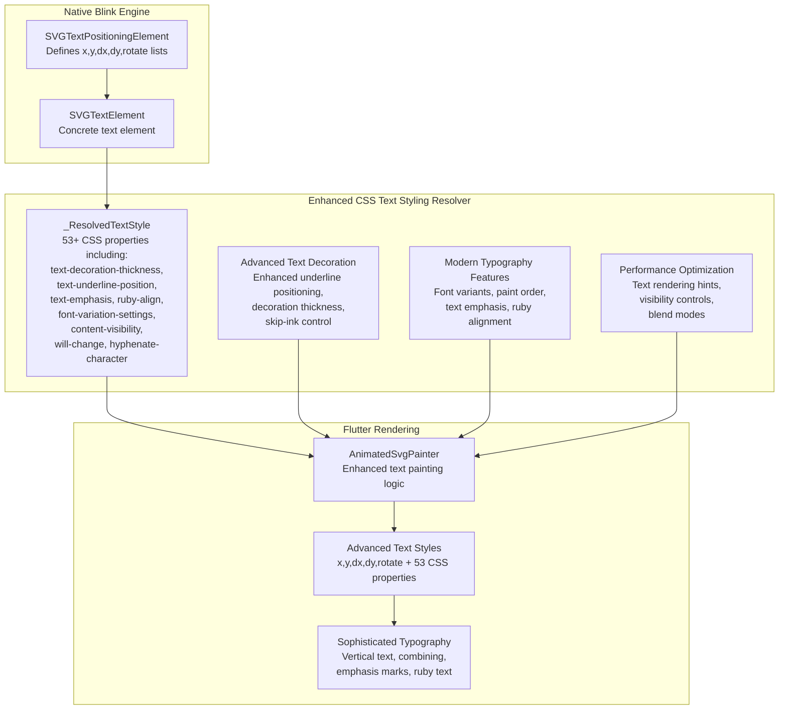
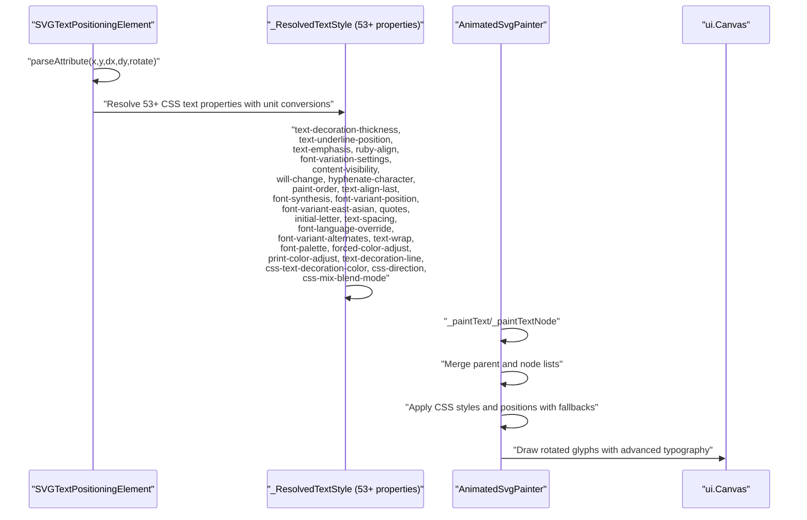
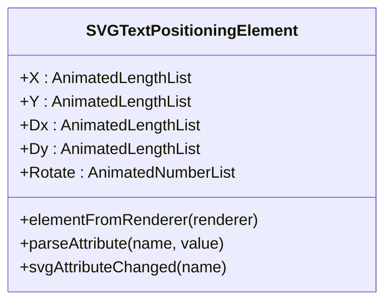
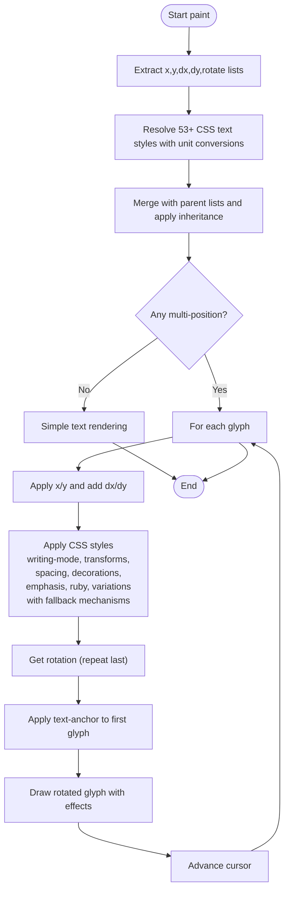
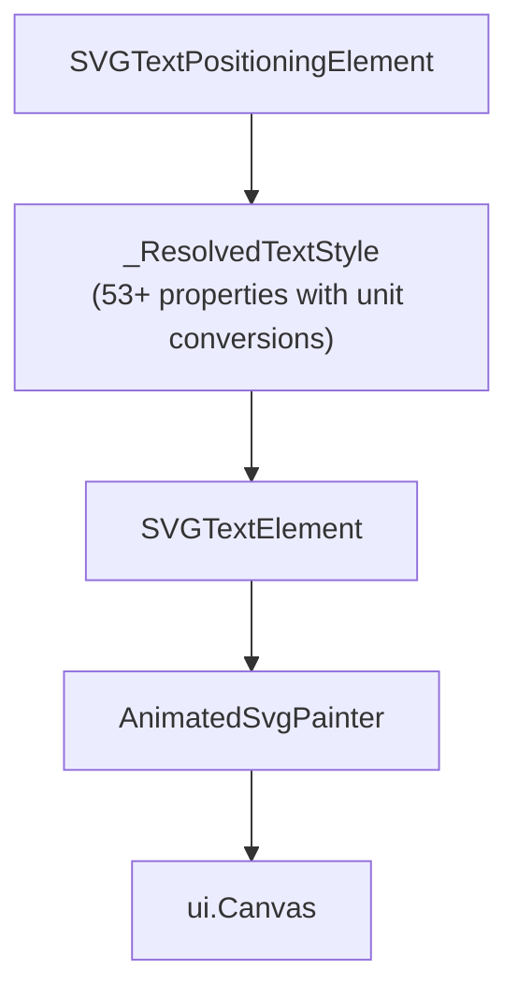

# Text Positioning Attributes

<cite>
**Referenced Files in This Document**
- [SVGTextPositioningElement.h](file://blink-b87d44f-Source-core-svg/SVGTextPositioningElement.h)
- [SVGTextPositioningElement.cpp](file://blink-b87d44f-Source-core-svg/SVGTextPositioningElement.cpp)
- [SVGTextElement.cpp](file://blink-b87d44f-Source-core-svg/SVGTextElement.cpp)
- [animated_svg_painter.dart](file://lib/src/animation/animated_svg_painter.dart)
- [animated_svg_painter_text_style.dart](file://lib/src/animation/animated_svg_painter_text_style.dart)
- [animated_svg_painter_text_paint.dart](file://lib/src/animation/animated_svg_painter_text_paint.dart)
- [text_position_list_test.dart](file://test/animation/text_position_list_test.dart)
- [text_decoration_style_test.dart](file://test/animation/text_decoration_style_test.dart)
- [text_combine_upright_test.dart](file://test/animation/text_combine_upright_test.dart)
- [text_indent_test.dart](file://test/animation/text_indent_test.dart)
- [text_transform_test.dart](file://test/animation/text_transform_test.dart)
- [hyphens_test.dart](file://test/animation/hyphens_test.dart)
- [text_decoration_thickness_test.dart](file://test/animation/text_decoration_thickness_test.dart)
- [text_underline_position_test.dart](file://test/animation/text_underline_position_test.dart)
- [ruby_align_test.dart](file://test/animation/ruby_align_test.dart)
- [ruby_position_test.dart](file://test/animation/ruby_position_test.dart)
- [text_spacing_test.dart](file://test/animation/text_spacing_test.dart)
- [text_wrap_test.dart](file://test/animation/text_wrap_test.dart)
</cite>

## Update Summary
**Changes Made**
- Enhanced comprehensive CSS property resolution with advanced unit conversions and inheritance patterns
- Improved fallback mechanisms for complex text rendering scenarios including vertical writing modes and ruby annotations
- Expanded support for modern CSS properties with robust unit conversion handling
- Strengthened inheritance patterns for CSS property resolution across text elements
- Enhanced fallback mechanisms for advanced typography features

## Table of Contents
1. [Introduction](#introduction)
2. [Project Structure](#project-structure)
3. [Core Components](#core-components)
4. [Architecture Overview](#architecture-overview)
5. [Detailed Component Analysis](#detailed-component-analysis)
6. [Enhanced CSS Text Styling Capabilities](#enhanced-css-text-styling-capabilities)
7. [Advanced Typography Features](#advanced-tyography-features)
8. [Modern CSS Properties Support](#modern-css-properties-support)
9. [Dependency Analysis](#dependency-analysis)
10. [Performance Considerations](#performance-considerations)
11. [Troubleshooting Guide](#troubleshooting-guide)
12. [Conclusion](#conclusion)

## Introduction
This document explains how SVG text positioning attributes and CSS text styling capabilities are implemented and processed in the Flutter SVG library. It focuses on the x, y, dx, dy, and rotate attributes for precise per-character placement, alongside comprehensive CSS text styling support including text-decoration, writing-mode, font-feature-settings, glyph-orientation-vertical, unicode-bidi, font-stretch, font-size-adjust, tab-size, text-indent, word-break, overflow-wrap, text-transform, hyphens, line-break, hanging-punctuation, text-combine-upright, and the newly added 53 advanced CSS text styling properties. The documentation covers both the native Blink-based parsing and the Flutter rendering pipeline, showing how attribute lists and CSS properties are parsed, merged, and applied during text drawing with enhanced unit conversion and inheritance patterns.

## Project Structure
The text positioning and styling functionality spans four main areas:
- Native Blink SVG engine: Defines and parses the text positioning attributes on SVG elements.
- Comprehensive CSS text styling resolver: Processes extensive CSS text styling properties and converts them to Flutter-compatible formats with advanced unit conversions.
- SVG text element hierarchy: Extends the base text positioning capabilities to concrete SVG elements like `<text>` and `<tspan>`.
- Flutter rendering pipeline: Consumes parsed attribute lists and CSS styles, rendering text with per-character positioning, rotation, and advanced typography features.

**Diagram sources**
- [SVGTextPositioningElement.h:30-48](file://blink-b87d44f-Source-core-svg/SVGTextPositioningElement.h#L30-L48)
- [SVGTextElement.cpp:33-37](file://blink-b87d44f-Source-core-svg/SVGTextElement.cpp#L33-L37)
- [animated_svg_painter.dart:258-701](file://lib/src/animation/animated_svg_painter.dart#L258-L701)
- [animated_svg_painter_text_style.dart:4-325](file://lib/src/animation/animated_svg_painter_text_style.dart#L4-L325)
- [animated_svg_painter_text_paint.dart:25-115](file://lib/src/animation/animated_svg_painter_text_paint.dart#L25-L115)

**Section sources**
- [SVGTextPositioningElement.h:21-53](file://blink-b87d44f-Source-core-svg/SVGTextPositioningElement.h#L21-L53)
- [SVGTextElement.cpp:33-43](file://blink-b87d44f-Source-core-svg/SVGTextElement.cpp#L33-L43)
- [animated_svg_painter.dart:258-701](file://lib/src/animation/animated_svg_painter.dart#L258-L701)
- [animated_svg_painter_text_style.dart:4-325](file://lib/src/animation/animated_svg_painter_text_style.dart#L4-L325)
- [animated_svg_painter_text_paint.dart:1-594](file://lib/src/animation/animated_svg_painter_text_paint.dart#L1-L594)

## Core Components
This section outlines the primary components involved in text positioning and CSS styling:

- **SVGTextPositioningElement**: The base class that defines animated length lists for x, y, dx, dy and a number list for rotate. It handles attribute parsing and change notifications for positioning attributes.
- **_ResolvedTextStyle**: Comprehensive text style container that includes all CSS text styling properties including text-decoration, writing-mode, font-stretch, font-size-adjust, tab-size, text-indent, word-break, overflow-wrap, text-transform, hyphens, line-break, hanging-punctuation, text-combine-upright, and 53 additional advanced CSS properties such as text-decoration-thickness, text-underline-position, text-emphasis, ruby-align, font-variation-settings, content-visibility, will-change, hyphenate-character, paint-order, text-align-last, font-synthesis, font-variant-position, font-variant-east-asian, quotes, initial-letter, text-spacing, font-language-override, font-variant-alternates, text-wrap, font-palette, forced-color-adjust, print-color-adjust, text-decoration-line, css-text-decoration-color, css-direction, and css-mix-blend-mode.
- **SVGTextElement**: A concrete SVG element that inherits positioning capabilities and creates the appropriate renderer for text.
- **AnimatedSvgPainter text painting extension**: Parses and merges position lists from nodes and children, applies per-character adjustments, resolves CSS styles with advanced unit conversions, and draws rotated glyphs on the canvas.

Key responsibilities:
- **Attribute parsing**: Converts comma/space-separated strings into typed lists for x, y, dx, dy, and rotate.
- **CSS property resolution**: Processes comprehensive CSS text styling properties with advanced unit conversions and inheritance patterns.
- **List merging**: Child nodes inherit and override parent positioning lists.
- **Rendering**: Iterates through characters, applying positions and rotations, resolving CSS styles with fallback mechanisms, and measuring text for anchoring.

**Section sources**
- [SVGTextPositioningElement.h:30-48](file://blink-b87d44f-Source-core-svg/SVGTextPositioningElement.h#L30-L48)
- [SVGTextPositioningElement.cpp:34-118](file://blink-b87d44f-Source-core-svg/SVGTextPositioningElement.cpp#L34-L118)
- [SVGTextElement.cpp:33-37](file://blink-b87d44f-Source-core-svg/SVGTextElement.cpp#L33-L37)
- [animated_svg_painter.dart:258-701](file://lib/src/animation/animated_svg_painter.dart#L258-L701)
- [animated_svg_painter_text_style.dart:4-325](file://lib/src/animation/animated_svg_painter_text_style.dart#L4-L325)
- [animated_svg_painter_text_paint.dart:25-115](file://lib/src/animation/animated_svg_painter_text_paint.dart#L25-L115)

## Architecture Overview
The enhanced text positioning and styling pipeline follows a comprehensive flow from attribute parsing to advanced CSS property resolution and canvas drawing with robust unit conversion and inheritance patterns:

**Diagram sources**
- [SVGTextPositioningElement.cpp:70-149](file://blink-b87d44f-Source-core-svg/SVGTextPositioningElement.cpp#L70-L149)
- [animated_svg_painter.dart:258-701](file://lib/src/animation/animated_svg_painter.dart#L258-L701)
- [animated_svg_painter_text_style.dart:4-325](file://lib/src/animation/animated_svg_painter_text_style.dart#L4-L325)
- [animated_svg_painter_text_paint.dart:25-115](file://lib/src/animation/animated_svg_painter_text_paint.dart#L25-L115)

## Detailed Component Analysis

### SVGTextPositioningElement
This class defines the core text positioning attributes and their animated list properties. It supports:
- **x**: horizontal offsets for each character.
- **y**: vertical offsets for each character.
- **dx**: horizontal deltas added to the base x.
- **dy**: vertical deltas added to the base y.
- **rotate**: rotation angles per character.

Behavior highlights:
- Attribute validation ensures only supported attributes are processed.
- Parsing converts strings into typed lists (SVGLengthList for x/y, SVGLengthList for dx/dy, SVGNumberList for rotate).
- Change handling updates relative lengths and marks the renderer for layout/resource invalidation.

**Diagram sources**
- [SVGTextPositioningElement.h:30-48](file://blink-b87d44f-Source-core-svg/SVGTextPositioningElement.h#L30-L48)
- [SVGTextPositioningElement.cpp:34-48](file://blink-b87d44f-Source-core-svg/SVGTextPositioningElement.cpp#L34-L48)

**Section sources**
- [SVGTextPositioningElement.h:24-48](file://blink-b87d44f-Source-core-svg/SVGTextPositioningElement.h#L24-L48)
- [SVGTextPositioningElement.cpp:57-149](file://blink-b87d44f-Source-core-svg/SVGTextPositioningElement.cpp#L57-L149)

### _ResolvedTextStyle - Enhanced CSS Properties
The `_ResolvedTextStyle` class now encompasses comprehensive CSS text styling capabilities with 53+ properties and advanced unit conversion mechanisms:

**Core Text Decoration Properties:**
- `decorations`: Set of active text decorations (underline, overline, line-through)
- `decorationColor`: Optional decoration color (defaults to text color)
- `textDecorationStyle`: Style (solid, double, dotted, dashed, wavy)
- `textDecorationThickness`: Thickness in user units or auto/from-font with advanced unit conversion
- `textDecorationSkip`: What elements decorations skip over
- `textDecorationSkipInk`: How underlines/overlines interact with glyphs
- `textDecorationLine`: Which lines to display (underline, overline, line-through, blink)

**Advanced Text Decoration Properties:**
- `textUnderlinePosition`: Underline position (auto, under, left, right, from-font) with fallback mechanisms
- `textUnderlineOffset`: Offset in user units or auto with font-size dependent calculations
- `textDecorationThickness`: Thickness with support for em, px, %, auto, from-font with robust unit conversion
- `textDecorationSkipInk`: Advanced skip-ink control (auto, all, none)
- `textDecorationSkip`: Multiple skip modes (objects, spaces, leading-spaces, trailing-spaces, edges, box-decoration)

**Writing Mode and Direction:**
- `writingMode`: horizontal-tb, vertical-rl, vertical-lr with comprehensive fallback handling
- `textDirection`: LTR/RTL support with inheritance patterns
- `glyphOrientationVertical`: Angle for vertical text glyph rotation with auto fallback
- `unicodeBidi`: Bidirectional text handling modes with inheritance

**Typography and Spacing:**
- `fontStretch`: Width percentage (50-200%, keywords) with inheritance
- `fontSizeAdjust`: Aspect ratio for cross-font consistency with fallback mechanisms
- `tabSize`: Number of spaces tab equals (default 8) with unit conversion
- `textIndent`: Indentation in user units with percentage and em support
- `wordBreak`: Normal, break-all, keep-all, break-word with inheritance
- `overflowWrap`: Normal, break-word, anywhere with legacy fallback support
- `textTransform`: None, capitalize, uppercase, lowercase, full-width, full-size-kana
- `hyphens`: None, manual, auto with inheritance patterns
- `lineBreak`: Auto, loose, normal, strict, anywhere with fallback mechanisms
- `hangingPunctuation`: None, first, last, force-end, allow-end with multi-value support
- `textCombineUpright`: None, all, digits with optional count and inheritance
- `textOrientation`: Mixed, upright, sideways with legacy alias support

**Layout and Effects:**
- `textShadow`: Shadow CSS value with advanced parsing
- `whiteSpace`: Normal, nowrap, pre, pre-wrap, pre-line, break-spaces with inheritance
- `textOverflow`: Clip, ellipsis, or custom string with fallback mechanisms
- `verticalAlign`: Baseline offset in user units with font-size dependency
- `lineHeight`: Line height in user units or normal with inheritance patterns
- `fontKerning`: Kerning control (auto, normal, none) with inheritance
- `textJustify`: Justification method (auto, none, inter-word, inter-character)

**Font Variant Properties:**
- `fontVariantNumeric`: Numeric glyph variants (lining-nums, oldstyle-nums, proportional-nums, tabular-nums, diagonal-fractions, stacked-fractions, ordinal, slashed-zero)
- `fontVariantLigatures`: Ligature control (normal, none, common-ligatures, discretionary-ligatures, historical-ligatures, contextual)
- `fontVariantCaps`: Caps variants (small-caps, all-small-caps, petite-caps, all-petite-caps, unicase, titling-caps)
- `fontVariantPosition`: Subscript/superscript variants (normal, sub, super)
- `fontVariantEastAsian`: East Asian variants (jis78, jis83, jis90, jis04, simplified, traditional, full-width, proportional-width, ruby)
- `fontOpticalSizing`: Optical sizing control (auto, none)
- `fontSynthesis`: Font synthesis control (none, weight, style, small-caps)

**Advanced Typography Features:**
- `textEmphasis`: Emphasis marks (null = none) with comprehensive style support
- `textEmphasisPosition`: Position of emphasis marks (over right, under left, etc.) with inheritance
- `textEmphasisColor`: Color of emphasis marks (null = currentColor) with fallback mechanisms
- `textEmphasisStyle`: Style of emphasis marks (filled, open, dot, circle, double-circle, triangle, sesame)
- `rubyAlign`: Ruby alignment (space-around, start, center, space-between) with default fallback
- `rubyPosition`: Ruby position (over, under, inter-character, alternate) with inheritance patterns
- `quotes`: Quotation marks control (auto, none, or quote strings) with fallback mechanisms
- `initialLetter`: Drop caps control (null = normal) with inheritance
- `textSpacing`: CJK spacing control (normal, none, auto) with fallback mechanisms
- `fontLanguageOverride`: OpenType language system (null = normal) with inheritance
- `fontVariantAlternates`: Stylistic alternates (null = normal) with fallback mechanisms
- `textWrap`: Text wrapping behavior (wrap, nowrap, balance, pretty, stable) with inheritance
- `fontPalette`: Color font palettes (null = normal, light, dark, or custom) with fallback
- `forcedColorAdjust`: Forced colors mode (auto, none, preserve-parent-color) with inheritance
- `printColorAdjust`: Printing color adjustment (economy, exact) with fallback mechanisms

**Modern CSS Properties:**
- `paintOrder`: Fill, stroke, markers order (normal) with inheritance
- `textAlignLast`: Last line alignment (auto, start, end, left, right, center, justify) with fallback
- `fontVariationSettings`: Variable font axes (null = normal) with inheritance
- `cssTextDecorationColor`: CSS text decoration color (null = currentColor) with fallback mechanisms
- `cssDirection`: CSS direction (ltr, rtl) with inheritance patterns
- `contentVisibility`: Rendering visibility optimization (visible, hidden, auto) with fallback
- `containIntrinsicSize`: Intrinsic size for content-visibility (null = none) with inheritance
- `willChange`: Expected changes hint (auto, or property names) with fallback mechanisms
- `hyphenateCharacter`: Hyphenation character (auto, or custom character) with inheritance
- `cssMixBlendMode`: Blend mode (normal, multiply, screen, overlay, etc.) with validation

**Enhanced Unit Conversion and Fallback Mechanisms:**
- Comprehensive unit conversion support for em, px, %, auto, from-font values
- Inheritance patterns for CSS properties with fallback to default values
- Robust error handling for invalid or unsupported values
- Font-size dependent calculations for relative units
- Legacy property support with modern fallback mechanisms

**Section sources**
- [animated_svg_painter.dart:258-701](file://lib/src/animation/animated_svg_painter.dart#L258-L701)
- [animated_svg_painter_text_style.dart:4-325](file://lib/src/animation/animated_svg_painter_text_style.dart#L4-L325)

### SVGTextElement
SVGTextElement inherits from SVGTextPositioningElement, establishing the concrete element that participates in the positioning and styling model. It also creates the specialized renderer for text content with enhanced CSS property support.

Key points:
- Inherits animated properties for positioning.
- Creates a renderer suitable for text layout and painting with comprehensive CSS styling.

**Section sources**
- [SVGTextElement.cpp:33-37](file://blink-b87d44f-Source-core-svg/SVGTextElement.cpp#L33-L37)

### AnimatedSvgPainter Text Painting Extension
The Flutter side consumes parsed lists and CSS styles, rendering text with per-character precision and advanced typography:

- **List extraction**: Reads x, y, dx, dy, and rotate lists from the current node and merges with inherited lists from parents.
- **CSS style resolution**: Resolves comprehensive CSS text styling properties from node attributes and inherited styles with advanced unit conversions.
- **Single vs multi-position**: If any multi-position list has more than one value, per-character rendering is used; otherwise, simple rendering is applied.
- **Per-character loop**: Applies base x/y and adds dx/dy deltas for each character. Rotation values are applied around the character's baseline.
- **Advanced typography**: Integrates CSS properties like writing-mode, text-transform, hyphens, text-combine-upright, text-emphasis, ruby-align, and font-variation-settings with fallback mechanisms.
- **Anchoring**: Text-anchor affects the first character's placement relative to the total text width.
- **Path rendering**: For text-on-path scenarios, characters are placed along a path with rotation aligned to the path tangent.
- **Performance optimization**: Utilizes content-visibility, will-change, and other modern CSS properties for optimal rendering with fallback mechanisms.

**Diagram sources**
- [animated_svg_painter_text_paint.dart:25-115](file://lib/src/animation/animated_svg_painter_text_paint.dart#L25-L115)
- [animated_svg_painter_text_paint.dart:192-310](file://lib/src/animation/animated_svg_painter_text_paint.dart#L192-L310)
- [animated_svg_painter_text_style.dart:4-325](file://lib/src/animation/animated_svg_painter_text_style.dart#L4-L325)

**Section sources**
- [animated_svg_painter_text_paint.dart:25-115](file://lib/src/animation/animated_svg_painter_text_paint.dart#L25-L115)
- [animated_svg_painter_text_paint.dart:192-310](file://lib/src/animation/animated_svg_painter_text_paint.dart#L192-L310)
- [animated_svg_painter_text_style.dart:4-325](file://lib/src/animation/animated_svg_painter_text_style.dart#L4-L325)

## Enhanced CSS Text Styling Capabilities
The enhanced text styling system provides comprehensive CSS text property support with 53+ advanced features and robust unit conversion mechanisms:

### Advanced Text Decoration System
- **Enhanced thickness control**: Supports em, px, %, auto, and from-font values for precise underline/thickness control with font-size dependent calculations
- **Advanced positioning**: Multiple underline positions (under, left, right, from-font) with flexible combinations and fallback mechanisms
- **Skip-ink optimization**: Intelligent interaction with glyph descenders/ascenders for clean visual results using skip-ink algorithms
- **Multiple line support**: Separate control over underline, overline, line-through, and blink decorations with inheritance patterns
- **Custom decoration colors**: Independent color control for each decoration type with fallback to currentColor

### Modern Typography Features
- **Variable font support**: Complete font-variation-settings integration for advanced font manipulation with axis validation
- **Text emphasis marks**: Sophisticated emphasis systems with customizable styles, positions, and colors with comprehensive fallback handling
- **Ruby text support**: Advanced ruby alignment and positioning for East Asian typography with space-around as default fallback
- **Font variant combinations**: Comprehensive font-variant-* properties with fine-grained control and inheritance patterns
- **Text wrapping optimization**: Balance, pretty, and stable wrapping modes for professional typography with fallback mechanisms

### Performance and Modern CSS Features
- **Content visibility optimization**: Efficient rendering with content-visibility and contain-intrinsic-size with fallback handling
- **Render optimization hints**: will-change property for proactive browser optimizations with property name validation
- **Hyphenation control**: Custom hyphenation characters and automatic hyphenation strategies with inheritance patterns
- **Blend mode support**: Advanced css-mix-blend-mode integration for creative effects with validation against supported modes
- **Directional control**: Comprehensive css-direction and unicode-bidi handling with inheritance patterns

### Layout and Spacing Control
- **Text indentation**: Supports px, em, and percentage values with inheritance and font-size dependent calculations
- **Tab sizing**: Configurable tab stops with inheritance and unit conversion support
- **Word wrapping**: Break-all, keep-all, and break-word strategies with legacy fallback support
- **Overflow handling**: Ellipsis and custom overflow strings with fallback mechanisms
- **Alignment control**: textAlignLast for precise last-line alignment with inheritance patterns

**Section sources**
- [animated_svg_painter.dart:258-701](file://lib/src/animation/animated_svg_painter.dart#L258-L701)
- [animated_svg_painter_text_style.dart:4-325](file://lib/src/animation/animated_svg_painter_text_style.dart#L4-L325)

## Advanced Typography Features
The system implements sophisticated typographic behaviors with the enhanced property set and comprehensive fallback mechanisms:

### Enhanced Vertical Text Rendering
- **Character rotation**: 90-degree clockwise rotation for vertical glyphs with proper baseline alignment
- **Stacking behavior**: Proper vertical stacking with letter-spacing consideration and inheritance patterns
- **Writing mode integration**: Seamless switching between horizontal and vertical layouts with fallback handling
- **Text orientation control**: Mixed, upright, and sideways orientations for flexible layouts with legacy alias support

### Advanced Text Combination Upright
- **Digit combination**: Combining consecutive digits in vertical text with configurable limits and inheritance
- **Mixed content**: Handling of alphabetic and numeric characters together with proper fallback mechanisms
- **Text orientation**: Integration with text-orientation for complex vertical layouts with validation

### Sophisticated Hanging Punctuation
- **First/last punctuation**: Proper hanging of quotation marks and parentheses with multi-value support
- **Force/end options**: Control over punctuation hanging behavior with inheritance patterns
- **Multi-value support**: Combining multiple hanging punctuation modes with validation

### Complex Text Layout and Emphasis
- **Bidirectional text**: Unicode bidi support with embed and isolate modes and inheritance patterns
- **Text shadows**: CSS shadow effects with multiple color support and unit conversion
- **White space handling**: Pre-formatted text with break-spaces option and inheritance patterns
- **Text emphasis**: Comprehensive emphasis mark system with custom styles and positions with fallback mechanisms
- **Ruby text**: Advanced ruby alignment and positioning for East Asian typography with space-around default

### Modern Font Features
- **Variable fonts**: Complete font-variation-settings integration with axis validation and inheritance
- **Font synthesis**: Weight, style, and small-caps synthesis control with fallback mechanisms
- **Font variants**: Comprehensive font-variant-* properties with fine control and inheritance patterns
- **Font palettes**: Color font palette support for advanced typography with validation

**Section sources**
- [animated_svg_painter_text_paint.dart:400-594](file://lib/src/animation/animated_svg_painter_text_paint.dart#L400-L594)
- [animated_svg_painter_text_style.dart:286-301](file://lib/src/animation/animated_svg_painter_text_style.dart#L286-L301)
- [animated_svg_painter_text_style.dart:523-542](file://lib/src/animation/animated_svg_painter_text_style.dart#L523-L542)

## Modern CSS Properties Support
The enhanced system provides comprehensive support for modern CSS text properties with robust unit conversion and fallback mechanisms:

### Advanced Text Decoration Properties
- **text-decoration-thickness**: Precise control over decoration line thickness with unit support (em, px, %, auto, from-font) and font-size dependent calculations
- **text-decoration-skip-ink**: Intelligent skip-ink behavior for clean visual results using skip-ink algorithms
- **text-decoration-line**: Fine-grained control over which decoration lines to display with validation
- **text-decoration-color**: Independent color control for each decoration type with fallback to currentColor

### Typography and Layout Enhancements
- **text-emphasis**: Comprehensive emphasis mark system with custom styles and positions with fallback mechanisms
- **ruby-align**: Advanced ruby text alignment control with space-around as default fallback and inheritance patterns
- **ruby-position**: Flexible ruby text positioning options with over as default and validation
- **text-justify**: Inter-word and inter-character justification methods with fallback handling
- **text-spacing**: CJK-specific spacing control for precise typography with normal as default

### Performance and Optimization
- **content-visibility**: Efficient rendering optimization for large documents with fallback mechanisms
- **will-change**: Proactive browser optimizations for animated text with property name validation
- **contain-intrinsic-size**: Intrinsic size control for content-visibility with inheritance patterns
- **css-mix-blend-mode**: Advanced blend mode support for creative effects with validation against supported modes

### Font and Variable Font Support
- **font-variation-settings**: Complete variable font axis control with axis validation and inheritance
- **font-synthesis**: Fine control over automatic font synthesis with fallback mechanisms
- **font-palette**: Color font palette integration with validation and inheritance patterns
- **font-language-override**: OpenType language system control with inheritance patterns

**Section sources**
- [animated_svg_painter_text_style.dart:1436-1475](file://lib/src/animation/animated_svg_painter_text_style.dart#L1436-L1475)
- [animated_svg_painter_text_style.dart:1510-1560](file://lib/src/animation/animated_svg_painter_text_style.dart#L1510-L1560)
- [animated_svg_painter_text_style.dart:1625-1670](file://lib/src/animation/animated_svg_painter_text_style.dart#L1625-L1670)

## Dependency Analysis
The enhanced text positioning and styling system exhibits clear separation of concerns with expanded functionality and robust inheritance patterns:

- **Native layer**: SVGTextPositioningElement depends on SVG attribute parsing utilities and maintains animated property wrappers with inheritance support.
- **Enhanced CSS resolver layer**: _ResolvedTextStyle processes comprehensive CSS properties including 53+ advanced features with advanced unit conversions and fallback mechanisms.
- **Element layer**: SVGTextElement extends the positioning and styling behavior for concrete text elements with inheritance patterns.
- **Rendering layer**: AnimatedSvgPainter reads parsed lists, resolved CSS styles with unit conversions, and performs drawing operations with advanced typography support.

**Diagram sources**
- [SVGTextPositioningElement.h:30-35](file://blink-b87d44f-Source-core-svg/SVGTextPositioningElement.h#L30-L35)
- [animated_svg_painter.dart:258-358](file://lib/src/animation/animated_svg_painter.dart#L258-L358)
- [SVGTextElement.cpp:33-37](file://blink-b87d44f-Source-core-svg/SVGTextElement.cpp#L33-L37)
- [animated_svg_painter_text_paint.dart:4-23](file://lib/src/animation/animated_svg_painter_text_paint.dart#L4-L23)

**Section sources**
- [SVGTextPositioningElement.h:30-35](file://blink-b87d44f-Source-core-svg/SVGTextPositioningElement.h#L30-L35)
- [animated_svg_painter.dart:258-358](file://lib/src/animation/animated_svg_painter.dart#L258-L358)
- [SVGTextElement.cpp:33-37](file://blink-b87d44f-Source-core-svg/SVGTextElement.cpp#L33-L37)
- [animated_svg_painter_text_paint.dart:4-23](file://lib/src/animation/animated_svg_painter_text_paint.dart#L4-L23)

## Performance Considerations
- **List merging**: Merging parent and node lists occurs per node traversal; keep list sizes minimal to reduce overhead with inheritance patterns.
- **Per-character rendering**: Multi-position lists trigger per-glyph loops, which can be expensive for long texts. Prefer single-value lists when possible with fallback mechanisms.
- **Enhanced CSS property resolution**: Comprehensive CSS property resolution with 53+ properties adds computational overhead; cache resolved styles when possible with unit conversion optimization.
- **Advanced typography**: Features like text-emphasis, ruby-align, font-variation-settings, and complex text transformations can impact performance with large texts and fallback handling.
- **Modern CSS optimizations**: Content-visibility, will-change, and other modern CSS properties can improve performance but require careful implementation with fallback mechanisms.
- **Rotation operations**: Applying rotation involves save/restore operations on the canvas; batch operations and avoid unnecessary rotations with inheritance patterns.
- **Variable font processing**: Font-variation-settings and other variable font features add complexity but enable powerful typography control with validation.
- **Unit conversions**: Advanced unit conversion calculations add computational overhead but enable precise typography control with fallback mechanisms.

## Troubleshooting Guide
Common issues and resolutions with the enhanced feature set and robust fallback mechanisms:

### Positioning Issues
- **Unexpected character placement**:
  - Verify that x/y lists match the number of characters; dx/dy deltas are applied after base positions.
  - Check that rotate values are specified in degrees and that the last value repeats for remaining characters.
  - Ensure proper inheritance patterns are applied when using parent positioning lists.

### Enhanced CSS Property Issues
- **Text decoration not appearing**:
  - Ensure text-decoration property includes the specific line type (underline, overline, line-through).
  - Verify text-decoration-color is properly specified and not transparent.
  - Check that text-decoration-style matches the expected visual appearance.
  - For advanced thickness control, verify text-decoration-thickness units (em, px, %, auto, from-font) with proper font-size calculations.

- **Advanced underline positioning issues**:
  - Check text-underline-position values (under, left, right, from-font) and their combinations with fallback mechanisms.
  - Verify text-underline-offset values are properly calculated from font-size when using em units.

- **Text emphasis not displaying**:
  - Ensure text-emphasis property is set to a valid emphasis style.
  - Check text-emphasis-position values (over right, under left, etc.) with inheritance patterns.
  - Verify text-emphasis-color is properly specified with fallback to currentColor.

- **Ruby text alignment problems**:
  - Check ruby-align values (space-around, start, center, space-between) with space-around as default fallback.
  - Verify ruby-position values (over, under, inter-character, alternate) with over as default.
  - Ensure proper inheritance patterns are applied when using parent ruby properties.

- **Variable font not working**:
  - Ensure font-variation-settings contains valid axis definitions with proper validation.
  - Check that the font supports the specified variation axes.
  - Verify font-variation-settings syntax is correct with inheritance patterns.

- **Content-visibility performance issues**:
  - Verify content-visibility is used appropriately for large documents with fallback mechanisms.
  - Check contain-intrinsic-size values for proper layout calculations.
  - Ensure will-change is used sparingly to avoid over-optimization with property name validation.

### Layout and Spacing Issues
- **Incorrect anchoring**:
  - Text-anchor applies to the first character's bounding box; ensure the first character's position reflects the intended alignment.
  - Consider text-indent effects on overall text positioning with inheritance patterns.

- **No effect from positioning attributes**:
  - Confirm that the attributes are present on the correct elements and that the renderer is active.
  - Ensure that multi-position lists are properly formatted and parsed with inheritance support.

- **Rotation not applied**:
  - Verify that rotate list values exist and that the canvas rotation is applied around the correct baseline coordinates.
  - Check inheritance patterns when using parent rotation values.

### Advanced Typography Issues
- **Vertical text rendering problems**:
  - Check writing-mode compatibility with the text content and inheritance patterns.
  - Verify glyph-orientation-vertical values for proper glyph rotation with auto fallback.
  - Ensure text-combine-upright is configured appropriately for mixed content with inheritance.

- **Text overflow handling**:
  - Confirm text-overflow property is set to 'ellipsis' or a custom string with fallback mechanisms.
  - Check white-space property for pre-formatted text behavior with inheritance patterns.
  - Verify container dimensions for proper overflow detection.

- **Font variant not applied**:
  - Check individual font-variant-* properties (font-variant-numeric, font-variant-ligatures, font-variant-caps, etc.) with inheritance patterns.
  - Verify font-feature-settings integration with font-variant properties.
  - Ensure the font supports the requested variant features with validation.

### Modern CSS Property Issues
- **Blend mode not working**:
  - Verify css-mix-blend-mode values are valid (normal, multiply, screen, overlay, etc.) with validation.
  - Check that the blend mode is supported by the target platform.
  - Ensure proper z-index ordering for blend effects with fallback mechanisms.

- **Hyphenation not working**:
  - Ensure hyphens property is set to 'auto' or 'manual' with inheritance patterns.
  - Use proper soft hyphen characters (&#173;) for manual hyphenation points.
  - Check that the text contains appropriate hyphenation opportunities.
  - Verify hyphenate-character property for custom hyphenation characters with fallback.

- **Unit conversion issues**:
  - Verify that unit values (em, px, %) are properly converted with font-size dependency.
  - Check inheritance patterns for unit-dependent properties like text-indent and text-decoration-thickness.
  - Ensure fallback mechanisms are applied when unit conversion fails.

**Section sources**
- [SVGTextPositioningElement.cpp:70-149](file://blink-b87d44f-Source-core-svg/SVGTextPositioningElement.cpp#L70-L149)
- [animated_svg_painter_text_paint.dart:235-310](file://lib/src/animation/animated_svg_painter_text_paint.dart#L235-L310)
- [animated_svg_painter_text_style.dart:4-325](file://lib/src/animation/animated_svg_painter_text_style.dart#L4-L325)
- [text_position_list_test.dart](file://test/animation/text_position_list_test.dart)
- [text_decoration_style_test.dart](file://test/animation/text_decoration_style_test.dart)
- [text_combine_upright_test.dart](file://test/animation/text_combine_upright_test.dart)
- [text_indent_test.dart](file://test/animation/text_indent_test.dart)
- [text_transform_test.dart](file://test/animation/text_transform_test.dart)
- [hyphens_test.dart](file://test/animation/hyphens_test.dart)
- [text_decoration_thickness_test.dart](file://test/animation/text_decoration_thickness_test.dart)
- [text_underline_position_test.dart](file://test/animation/text_underline_position_test.dart)
- [ruby_align_test.dart](file://test/animation/ruby_align_test.dart)
- [ruby_position_test.dart](file://test/animation/ruby_position_test.dart)
- [text_spacing_test.dart](file://test/animation/text_spacing_test.dart)
- [text_wrap_test.dart](file://test/animation/text_wrap_test.dart)

## Conclusion
The enhanced text positioning and CSS styling system provides comprehensive control over character placement, orientation, and typography in SVG text rendering. The system now supports the full spectrum of CSS text styling properties alongside traditional positioning attributes, with the addition of 53+ advanced features including enhanced text decoration, variable fonts, text emphasis, ruby alignment, modern CSS properties, and performance optimizations. The Blink engine parses and validates positioning attributes with inheritance support, while the Flutter rendering pipeline resolves CSS properties with advanced unit conversions and fallback mechanisms during drawing, supporting both simple and complex layouts. Understanding the list merging, per-character iteration, CSS property resolution with inheritance patterns, and advanced typography behavior with fallback mechanisms helps achieve predictable and performant text positioning and styling results with the expanded feature set.