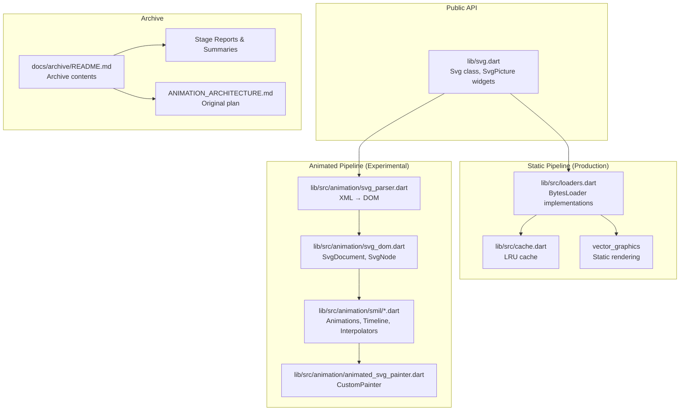
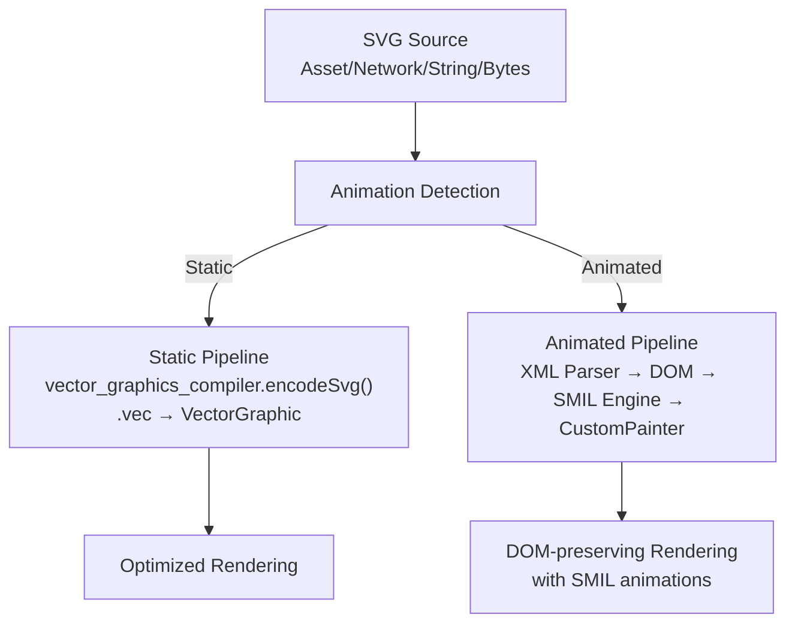
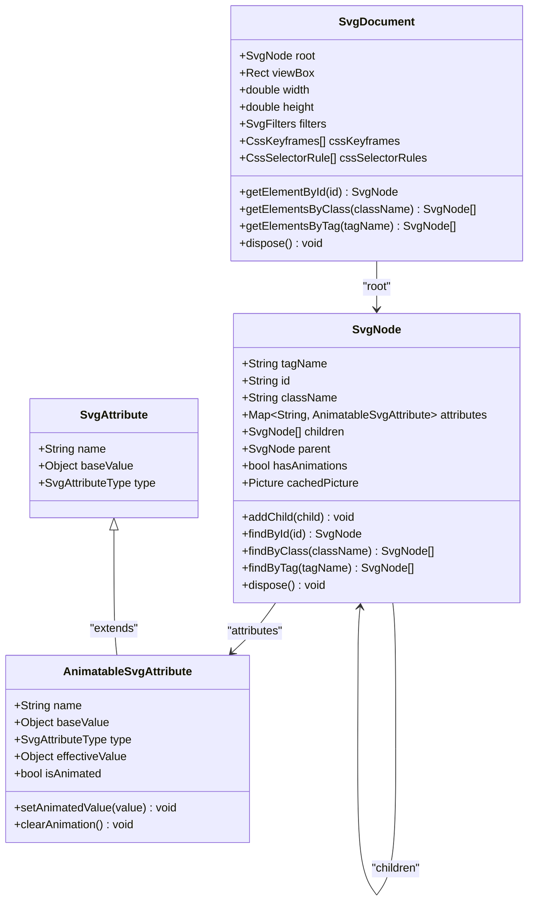
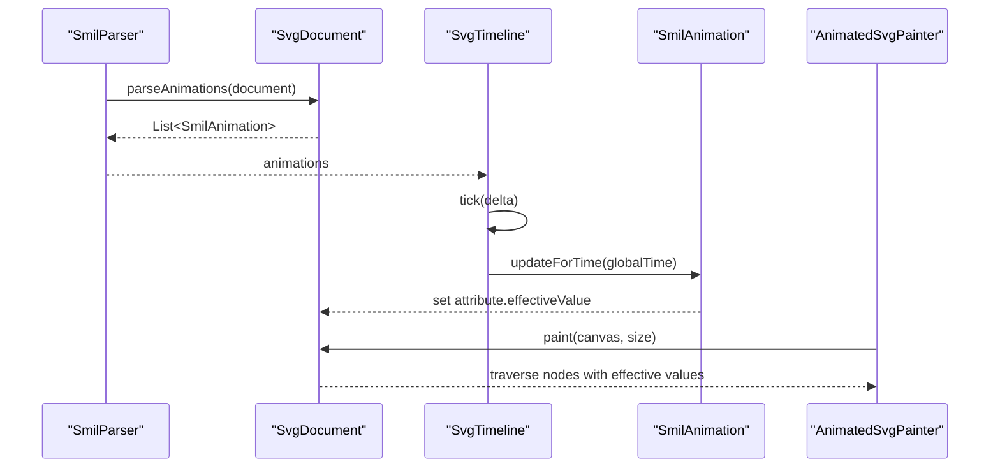
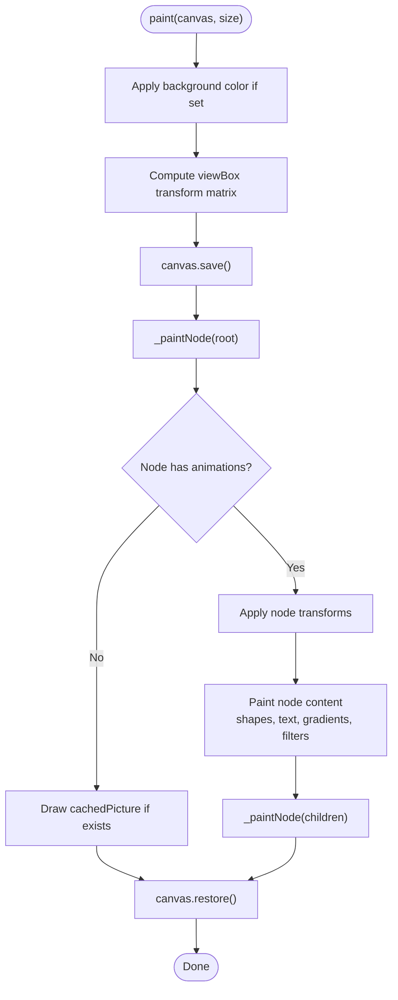
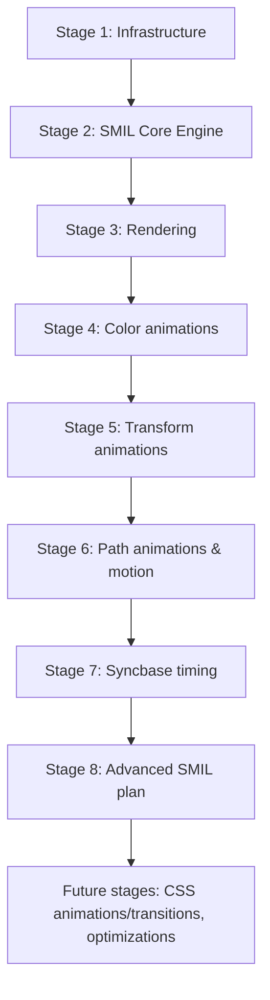
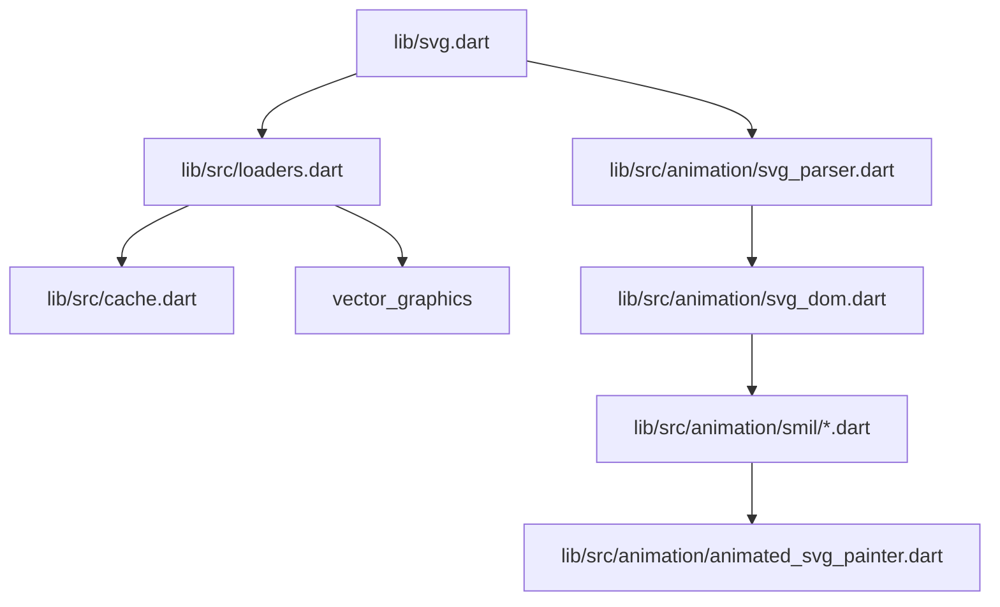

# Archive System

<cite>
**Referenced Files in This Document**
- [README.md](file://README.md)
- [ARCHITECTURE.md](file://ARCHITECTURE.md)
- [docs/archive/README.md](file://docs/archive/README.md)
- [docs/archive/IMPLEMENTATION_SUMMARY.md](file://docs/archive/IMPLEMENTATION_SUMMARY.md)
- [docs/archive/ANIMATION_ARCHITECTURE.md](file://docs/archive/ANIMATION_ARCHITECTURE.md)
- [docs/archive/STAGE_5_COMPLETE.md](file://docs/archive/STAGE_5_COMPLETE.md)
- [docs/archive/STAGE_6_SUMMARY.md](file://docs/archive/STAGE_6_SUMMARY.md)
- [docs/DEVELOPMENT.md](file://docs/DEVELOPMENT.md)
- [lib/svg.dart](file://lib/svg.dart)
- [lib/src/cache.dart](file://lib/src/cache.dart)
- [lib/src/loaders.dart](file://lib/src/loaders.dart)
- [lib/src/animation/svg_dom.dart](file://lib/src/animation/svg_dom.dart)
- [lib/src/animation/smil/smil_animation.dart](file://lib/src/animation/smil/smil_animation.dart)
- [lib/src/animation/smil/smil_parser.dart](file://lib/src/animation/smil/smil_parser.dart)
- [lib/src/animation/animated_svg_painter.dart](file://lib/src/animation/animated_svg_painter.dart)
</cite>

## Table of Contents
1. [Introduction](#introduction)
2. [Project Structure](#project-structure)
3. [Core Components](#core-components)
4. [Architecture Overview](#architecture-overview)
5. [Detailed Component Analysis](#detailed-component-analysis)
6. [Dependency Analysis](#dependency-analysis)
7. [Performance Considerations](#performance-considerations)
8. [Troubleshooting Guide](#troubleshooting-guide)
9. [Conclusion](#conclusion)
10. [Appendices](#appendices)

## Introduction
This document describes the Archive System for the flutter_svg project, focusing on the historical implementation of the animated SVG rendering pipeline and the comprehensive archive of development stages, reports, and architectural decisions. The archive documents provide detailed insights into the dual-pipeline architecture, SMIL animation engine, path morphing, animateMotion, and the development workflow used to deliver production-grade animated SVG support in Flutter.

## Project Structure
The repository organizes the animated SVG implementation under a dedicated animation subsystem with modular components for parsing, animation modeling, timeline management, and rendering. The archive directory preserves historical stage reports, implementation summaries, and architectural plans that guided the evolution of the system.

**Diagram sources**
- [lib/svg.dart:57-627](file://lib/svg.dart#L57-L627)
- [lib/src/loaders.dart:118-467](file://lib/src/loaders.dart#L118-L467)
- [lib/src/cache.dart:5-111](file://lib/src/cache.dart#L5-L111)
- [lib/src/animation/svg_dom.dart:123-318](file://lib/src/animation/svg_dom.dart#L123-L318)
- [lib/src/animation/smil/smil_animation.dart:79-453](file://lib/src/animation/smil/smil_animation.dart#L79-L453)
- [lib/src/animation/animated_svg_painter.dart:35-227](file://lib/src/animation/animated_svg_painter.dart#L35-L227)
- [docs/archive/README.md:1-44](file://docs/archive/README.md#L1-L44)
- [docs/archive/ANIMATION_ARCHITECTURE.md:81-104](file://docs/archive/ANIMATION_ARCHITECTURE.md#L81-L104)

**Section sources**
- [docs/archive/README.md:1-44](file://docs/archive/README.md#L1-L44)
- [docs/archive/ANIMATION_ARCHITECTURE.md:81-104](file://docs/archive/ANIMATION_ARCHITECTURE.md#L81-L104)
- [ARCHITECTURE.md:6-58](file://ARCHITECTURE.md#L6-L58)

## Core Components
The animated SVG system centers on a dual-pipeline architecture:
- Static pipeline: vector_graphics-based compilation for fast, production-ready rendering without DOM or animation.
- Animated pipeline: XML parsing to a DOM, SMIL animation extraction and timeline management, and CustomPainter-based rendering with real-time attribute interpolation.

Key components include:
- DOM model: SvgDocument, SvgNode, AnimatableSvgAttribute for preserving structure and enabling runtime attribute mutation.
- SMIL engine: SmilAnimation, SmilParser, and SvgTimeline for parsing, scheduling, and interpolating animations.
- Renderer: AnimatedSvgPainter implementing CustomPainter to traverse the DOM tree and draw elements with effective attribute values.

**Section sources**
- [ARCHITECTURE.md:75-144](file://ARCHITECTURE.md#L75-L144)
- [lib/src/animation/svg_dom.dart:123-318](file://lib/src/animation/svg_dom.dart#L123-L318)
- [lib/src/animation/smil/smil_animation.dart:79-453](file://lib/src/animation/smil/smil_animation.dart#L79-L453)
- [lib/src/animation/animated_svg_painter.dart:35-227](file://lib/src/animation/animated_svg_painter.dart#L35-L227)

## Architecture Overview
The dual-pipeline design balances performance and capability:
- Static pipeline: SVG → vector_graphics_compiler.encodeSvg() → .vec binary → VectorGraphic widget → optimized rendering.
- Animated pipeline: SVG → Xml parser → DOM tree (SvgDocument) → SmilParser → SvgTimeline → AnimatedSvgPainter → Canvas rendering.

**Diagram sources**
- [ARCHITECTURE.md:6-58](file://ARCHITECTURE.md#L6-L58)
- [docs/archive/ANIMATION_ARCHITECTURE.md:50-78](file://docs/archive/ANIMATION_ARCHITECTURE.md#L50-L78)

**Section sources**
- [ARCHITECTURE.md:6-58](file://ARCHITECTURE.md#L6-L58)
- [docs/archive/ANIMATION_ARCHITECTURE.md:50-78](file://docs/archive/ANIMATION_ARCHITECTURE.md#L50-L78)

## Detailed Component Analysis

### DOM Model and Animation Data Structures
The DOM model preserves SVG structure and enables runtime attribute mutation crucial for animations:
- SvgDocument: root node, viewBox, width, height, filters, CSS keyframes, and selectors.
- SvgNode: tag name, id, class, attributes map, children, parent, hasAnimations flag, cachedPicture.
- AnimatableSvgAttribute: baseValue, animatedValue, isAnimated, and effectiveValue accessor.

**Diagram sources**
- [lib/src/animation/svg_dom.dart:123-318](file://lib/src/animation/svg_dom.dart#L123-L318)

**Section sources**
- [lib/src/animation/svg_dom.dart:123-318](file://lib/src/animation/svg_dom.dart#L123-L318)

### SMIL Animation Engine
The SMIL engine manages animation parsing, scheduling, and interpolation:
- SmilAnimation: animation type, target node, attribute name/type, timing (begin, dur, repeatCount, repeatDur, end), fill mode, calc mode, additive/accumulate, runtime state.
- SmilParser: extracts SMIL and CSS animations from DOM and CSS rules.
- Timeline management: compute effective begin/end times, resolve syncbase conditions, update per-frame values.

**Diagram sources**
- [lib/src/animation/smil/smil_parser.dart:12-39](file://lib/src/animation/smil/smil_parser.dart#L12-L39)
- [lib/src/animation/smil/smil_animation.dart:367-431](file://lib/src/animation/smil/smil_animation.dart#L367-L431)
- [lib/src/animation/animated_svg_painter.dart:64-126](file://lib/src/animation/animated_svg_painter.dart#L64-L126)

**Section sources**
- [lib/src/animation/smil/smil_parser.dart:12-39](file://lib/src/animation/smil/smil_parser.dart#L12-L39)
- [lib/src/animation/smil/smil_animation.dart:79-453](file://lib/src/animation/smil/smil_animation.dart#L79-L453)

### Rendering Pipeline
AnimatedSvgPainter implements CustomPainter to render the DOM with effective attribute values:
- Computes viewBox transform to fit the widget size.
- Traverses SvgNode tree, applies transforms, paints shapes, text, gradients, filters, and clip/mask regions.
- Uses cachedPicture for static subtrees to optimize performance.

**Diagram sources**
- [lib/src/animation/animated_svg_painter.dart:64-126](file://lib/src/animation/animated_svg_painter.dart#L64-L126)

**Section sources**
- [lib/src/animation/animated_svg_painter.dart:35-227](file://lib/src/animation/animated_svg_painter.dart#L35-L227)

### Archive Reports and Implementation Milestones
The archive documents chronicle the implementation journey:
- Stage 5: Transform animations complete with comprehensive tests and visual verification framework.
- Stage 6: Path animations with path morphing and animateMotion, plus unified examples system.
- Implementation Summary: Complete SMIL animation engine with 61 tests and demo applications.
- Original Plan: Detailed 11-stage roadmap for SMIL/CSS animation parity.

**Diagram sources**
- [docs/archive/IMPLEMENTATION_SUMMARY.md:129-136](file://docs/archive/IMPLEMENTATION_SUMMARY.md#L129-L136)
- [docs/archive/ANIMATION_ARCHITECTURE.md:604-779](file://docs/archive/ANIMATION_ARCHITECTURE.md#L604-L779)

**Section sources**
- [docs/archive/STAGE_5_COMPLETE.md:1-173](file://docs/archive/STAGE_5_COMPLETE.md#L1-L173)
- [docs/archive/STAGE_6_SUMMARY.md:1-397](file://docs/archive/STAGE_6_SUMMARY.md#L1-L397)
- [docs/archive/IMPLEMENTATION_SUMMARY.md:1-189](file://docs/archive/IMPLEMENTATION_SUMMARY.md#L1-L189)
- [docs/archive/ANIMATION_ARCHITECTURE.md:604-779](file://docs/archive/ANIMATION_ARCHITECTURE.md#L604-L779)

## Dependency Analysis
The animated pipeline depends on:
- XML parsing for DOM construction.
- SMIL parsing and interpolation for animation values.
- CustomPainter for efficient canvas drawing.
- Cache and loaders for static pipeline integration.

**Diagram sources**
- [lib/src/loaders.dart:118-467](file://lib/src/loaders.dart#L118-L467)
- [lib/src/cache.dart:5-111](file://lib/src/cache.dart#L5-L111)
- [lib/svg.dart:57-627](file://lib/svg.dart#L57-L627)
- [lib/src/animation/svg_dom.dart:123-318](file://lib/src/animation/svg_dom.dart#L123-L318)
- [lib/src/animation/smil/smil_animation.dart:79-453](file://lib/src/animation/smil/smil_animation.dart#L79-L453)
- [lib/src/animation/animated_svg_painter.dart:35-227](file://lib/src/animation/animated_svg_painter.dart#L35-L227)

**Section sources**
- [lib/src/loaders.dart:118-467](file://lib/src/loaders.dart#L118-L467)
- [lib/src/cache.dart:5-111](file://lib/src/cache.dart#L5-L111)
- [lib/svg.dart:57-627](file://lib/svg.dart#L57-L627)

## Performance Considerations
- Static subtree caching: reuse cached Picture instances for nodes without animations.
- Dirty tracking: mark nodes dirty when animations change values to limit redraw scope.
- Path optimization: normalize paths once during parsing and reuse Path objects.
- Isolate-based compilation: vector_graphics_compiler.encodeSvg runs in isolates to avoid blocking the UI thread.
- LRU cache: configurable maximum size with eviction policy.

**Section sources**
- [ARCHITECTURE.md:174-193](file://ARCHITECTURE.md#L174-L193)
- [lib/src/cache.dart:5-111](file://lib/src/cache.dart#L5-L111)
- [docs/DEVELOPMENT.md:186-193](file://docs/DEVELOPMENT.md#L186-L193)

## Troubleshooting Guide
Common issues and debugging tips:
- Animation not working: verify AnimationDetector.hasAnimations(), confirm SmilParser.parseAnimations(), ensure SvgTimeline.tick(), and check AnimatedSvgPainter.paint().
- Visual testing hangs: wrap toImage() capture in tester.runAsync() and always dispose images.
- Memory leaks in tests: ensure ui.Image disposal after capture.
- Pipeline mixing: remember SvgPicture cannot render SMIL; use AnimatedSvgPicture for animated SVGs.

**Section sources**
- [docs/DEVELOPMENT.md:167-185](file://docs/DEVELOPMENT.md#L167-L185)
- [docs/DEVELOPMENT.md:127-131](file://docs/DEVELOPMENT.md#L127-L131)

## Conclusion
The Archive System preserves the complete history and technical depth of the animated SVG implementation in flutter_svg. Through the dual-pipeline architecture, robust SMIL engine, and comprehensive testing framework, the project delivers production-grade static rendering alongside experimental animated capabilities. The archive documents serve as a definitive reference for developers extending or maintaining the system.

## Appendices

### Archive Contents Overview
- Stage Reports: Stage 5 (Transform animations), Stage 6 (Path animations & motion), Stage 7 (Syncbase timing), Stage 8 (Advanced SMIL plan).
- Session Logs: Development session notes.
- Architecture & Design: Original 11-stage plan, bug fixes, implementation milestones.
- Example App: Unified examples system and UI/UX design.

**Section sources**
- [docs/archive/README.md:7-44](file://docs/archive/README.md#L7-L44)