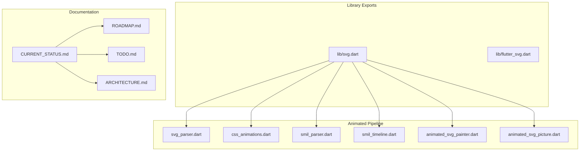
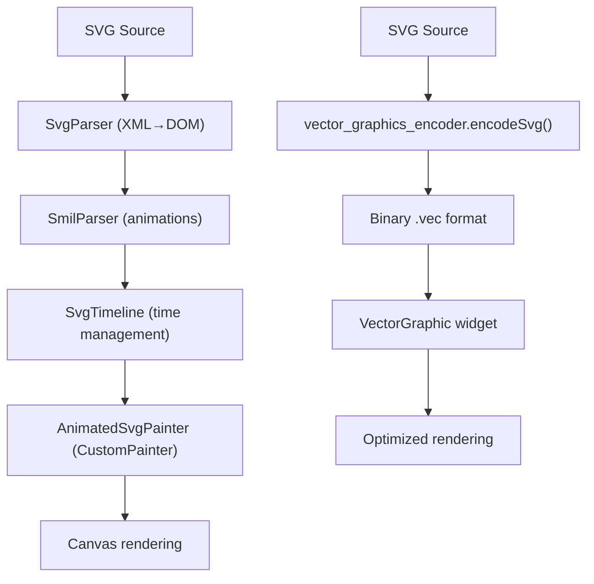
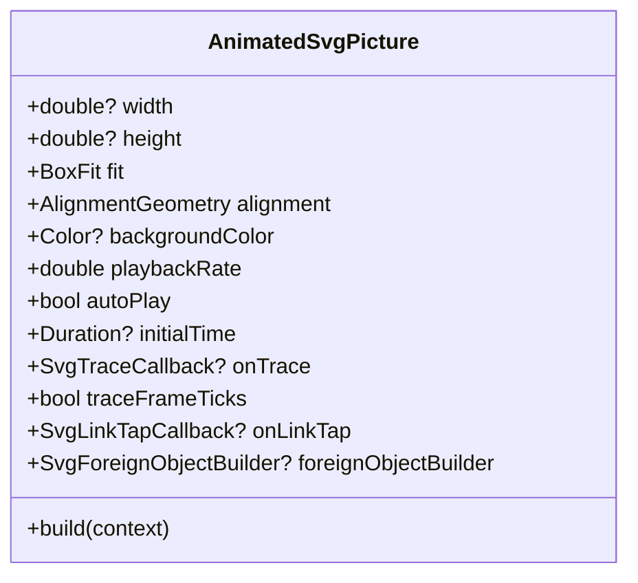
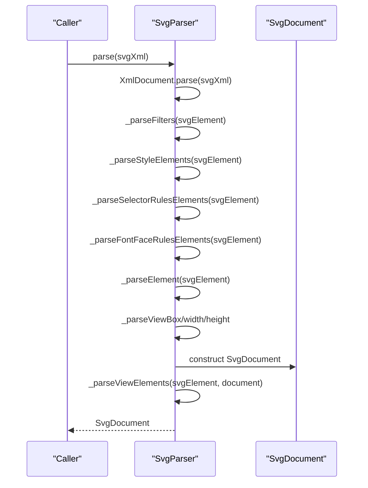
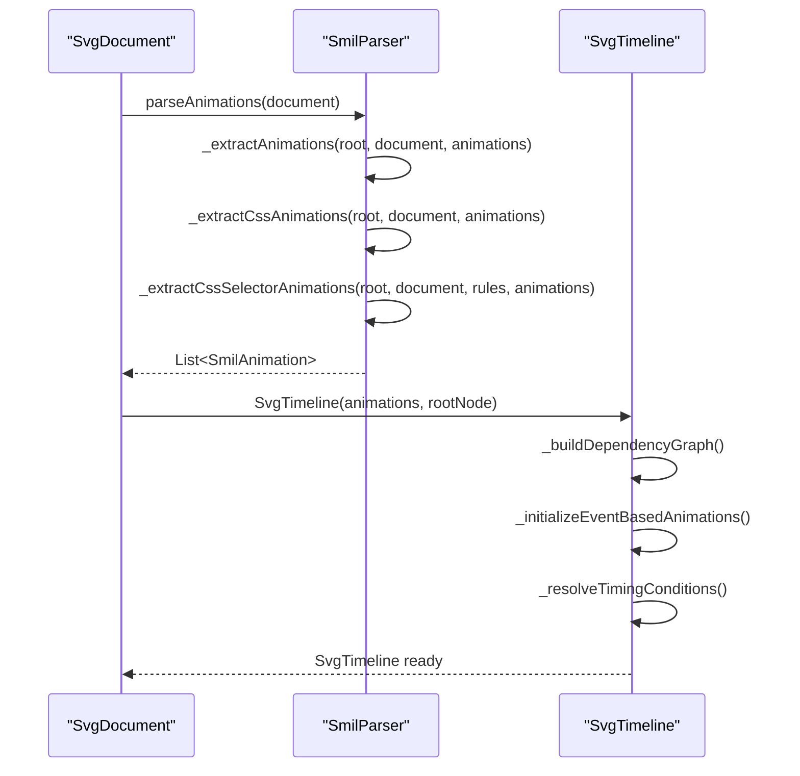
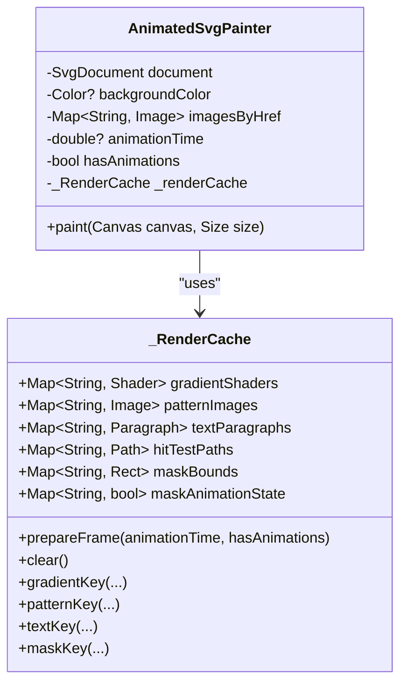
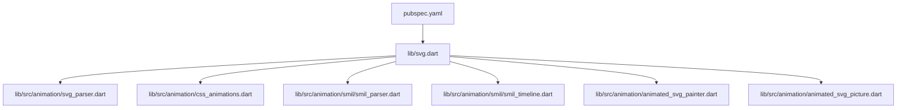

# CURRENT_STATUS.md

<cite>
**Referenced Files in This Document**
- [CURRENT_STATUS.md](file://CURRENT_STATUS.md)
- [README.md](file://README.md)
- [ROADMAP.md](file://ROADMAP.md)
- [ARCHITECTURE.md](file://ARCHITECTURE.md)
- [TODO.md](file://TODO.md)
- [lib/svg.dart](file://lib/svg.dart)
- [lib/src/animation/animated_svg_picture.dart](file://lib/src/animation/animated_svg_picture.dart)
- [lib/src/animation/svg_parser.dart](file://lib/src/animation/svg_parser.dart)
- [lib/src/animation/css_animations.dart](file://lib/src/animation/css_animations.dart)
- [lib/src/animation/smil/smil_parser.dart](file://lib/src/animation/smil/smil_parser.dart)
- [lib/src/animation/smil/smil_timeline.dart](file://lib/src/animation/smil/smil_timeline.dart)
- [lib/src/animation/animated_svg_painter.dart](file://lib/src/animation/animated_svg_painter.dart)
- [pubspec.yaml](file://pubspec.yaml)
</cite>

## Update Summary
**Changes Made**
- Updated SMIL animation parity from ~88% to ~95% based on recent advanced animateMotion completion
- Added comprehensive test coverage information (60+ tests for animateMotion)
- Updated parity snapshot to reflect current progress
- Enhanced animateMotion advanced semantics documentation
- Updated execution plan to reflect recent closures

## Table of Contents
1. [Introduction](#introduction)
2. [Project Structure](#project-structure)
3. [Core Components](#core-components)
4. [Architecture Overview](#architecture-overview)
5. [Detailed Component Analysis](#detailed-component-analysis)
6. [Dependency Analysis](#dependency-analysis)
7. [Performance Considerations](#performance-considerations)
8. [Troubleshooting Guide](#troubleshooting-guide)
9. [Conclusion](#conclusion)
10. [Appendices](#appendices)

## Introduction
This document presents the current development status of the Flutter SVG rendering library, focusing on the dual-pipeline architecture, recent parity achievements, ongoing work, and future execution plan. The project maintains a single source of truth for current state in CURRENT_STATUS.md and tracks planned milestones and active work items in ROADMAP.md, TODO.md, and NEXT_STEPS.md.

Key highlights:
- **~95% Blink SVG parity** (advancing from ~88%)
- 3,563+ tests passing with zero analyzer warnings
- Dual pipelines: static vector_graphics for production and animated pipeline for SMIL/CSS interop, filters, and interactivity
- Major parity closures in animateMotion, light sources, masking, clipping, filter graph, component transfer, and text typography

## Project Structure
The repository organizes code into:
- Core library exports and widgets (lib/svg.dart, lib/flutter_svg.dart)
- Animated pipeline implementation under lib/src/animation/ (parsers, SMIL engine, timeline, painter)
- Documentation and planning artifacts (CURRENT_STATUS.md, ROADMAP.md, TODO.md, ARCHITECTURE.md)
- Example app and tests under example/ and test/

**Diagram sources**
- [lib/svg.dart:1-627](file://lib/svg.dart#L1-L627)
- [lib/src/animation/svg_parser.dart:1-118](file://lib/src/animation/svg_parser.dart#L1-L118)
- [lib/src/animation/css_animations.dart:1-15](file://lib/src/animation/css_animations.dart#L1-L15)
- [lib/src/animation/smil/smil_parser.dart:1-43](file://lib/src/animation/smil/smil_parser.dart#L1-L43)
- [lib/src/animation/smil/smil_timeline.dart:1-200](file://lib/src/animation/smil/smil_timeline.dart#L1-L200)
- [lib/src/animation/animated_svg_painter.dart:1-200](file://lib/src/animation/animated_svg_painter.dart#L1-L200)
- [lib/src/animation/animated_svg_picture.dart:1-200](file://lib/src/animation/animated_svg_picture.dart#L1-L200)
- [CURRENT_STATUS.md:1-362](file://CURRENT_STATUS.md#L1-L362)
- [ROADMAP.md:1-87](file://ROADMAP.md#L1-L87)
- [TODO.md:1-225](file://TODO.md#L1-L225)
- [ARCHITECTURE.md:1-298](file://ARCHITECTURE.md#L1-L298)

**Section sources**
- [CURRENT_STATUS.md:6-362](file://CURRENT_STATUS.md#L6-L362)
- [README.md:1-303](file://README.md#L1-L303)
- [ROADMAP.md:1-87](file://ROADMAP.md#L1-L87)
- [ARCHITECTURE.md:1-298](file://ARCHITECTURE.md#L1-L298)
- [TODO.md:1-225](file://TODO.md#L1-L225)

## Core Components
- AnimatedSvgPicture: Public widget for animated SVG rendering with SMIL/CSS interop, hit-testing, and accessibility.
- SvgParser: XML-to-DOM conversion preserving full SVG structure and animations.
- SmilParser: Extracts SMIL animations from DOM and CSS rules.
- SvgTimeline: Time management, syncbase/event timing, and animation activation.
- AnimatedSvgPainter: CustomPainter orchestrating rendering, filters, gradients, and caching.
- Performance cache: Gradient shaders, pattern images, text paragraphs, hit-test geometry, and mask bounds with smart invalidation.

**Section sources**
- [lib/src/animation/animated_svg_picture.dart:169-200](file://lib/src/animation/animated_svg_picture.dart#L169-L200)
- [lib/src/animation/svg_parser.dart:27-70](file://lib/src/animation/svg_parser.dart#L27-L70)
- [lib/src/animation/smil/smil_parser.dart:17-42](file://lib/src/animation/smil/smil_parser.dart#L17-L42)
- [lib/src/animation/smil/smil_timeline.dart:20-126](file://lib/src/animation/smil/smil_timeline.dart#L20-L126)
- [lib/src/animation/animated_svg_painter.dart:50-178](file://lib/src/animation/animated_svg_painter.dart#L50-L178)

## Architecture Overview
The library employs two distinct rendering pipelines:
- Static pipeline: vector_graphics_encoder.encodeSvg() to binary .vec format for fast production rendering (no DOM, IDs, or animations).
- Animated pipeline: XML parsing to DOM, SMIL extraction, timeline management, and CustomPainter rendering with full DOM preservation, SMIL/CSS interop, filters, hit-testing, and accessibility.

**Diagram sources**
- [ARCHITECTURE.md:12-58](file://ARCHITECTURE.md#L12-L58)
- [lib/src/animation/svg_parser.dart:30-70](file://lib/src/animation/svg_parser.dart#L30-L70)
- [lib/src/animation/smil/smil_parser.dart:21-41](file://lib/src/animation/smil/smil_parser.dart#L21-L41)
- [lib/src/animation/smil/smil_timeline.dart:21-29](file://lib/src/animation/smil/smil_timeline.dart#L21-L29)
- [lib/src/animation/animated_svg_painter.dart:187-196](file://lib/src/animation/animated_svg_painter.dart#L187-L196)

**Section sources**
- [ARCHITECTURE.md:6-58](file://ARCHITECTURE.md#L6-L58)

## Detailed Component Analysis

### Animated SVG Picture (Public Widget)
- Provides AnimatedSvgPicture.widget variants for string, asset, network, file, and memory sources.
- Integrates with trace callbacks, link tap handling, and foreignObject builders.
- Supports playback control (playbackRate, autoPlay, initialTime) and view switching via controller.

**Diagram sources**
- [lib/src/animation/animated_svg_picture.dart:169-200](file://lib/src/animation/animated_svg_picture.dart#L169-L200)

**Section sources**
- [lib/src/animation/animated_svg_picture.dart:169-200](file://lib/src/animation/animated_svg_picture.dart#L169-L200)

### SVG Parser (XML to DOM)
- Parses SVG XML into SvgDocument with root node, viewBox, width, height, filters, CSS keyframes, and selector rules.
- Registers <view> elements for programmatic switching.

**Diagram sources**
- [lib/src/animation/svg_parser.dart:30-70](file://lib/src/animation/svg_parser.dart#L30-L70)
- [lib/src/animation/svg_parser.dart:72-116](file://lib/src/animation/svg_parser.dart#L72-L116)

**Section sources**
- [lib/src/animation/svg_parser.dart:27-70](file://lib/src/animation/svg_parser.dart#L27-L70)
- [lib/src/animation/svg_parser.dart:72-116](file://lib/src/animation/svg_parser.dart#L72-L116)

### SMIL Parser and Timeline
- Extracts SMIL animations from DOM and CSS rules, including CSS->SMIL conversion.
- Manages timing conditions (offset, syncbase, event-based), dependency graphs, and event triggers.

**Diagram sources**
- [lib/src/animation/smil/smil_parser.dart:21-41](file://lib/src/animation/smil/smil_parser.dart#L21-L41)
- [lib/src/animation/smil/smil_timeline.dart:21-29](file://lib/src/animation/smil/smil_timeline.dart#L21-L29)

**Section sources**
- [lib/src/animation/smil/smil_parser.dart:17-42](file://lib/src/animation/smil/smil_parser.dart#L17-L42)
- [lib/src/animation/smil/smil_timeline.dart:20-126](file://lib/src/animation/smil/smil_timeline.dart#L20-L126)

### Animated SVG Painter (Rendering Orchestrator)
- Implements CustomPainter with render cache for gradients, patterns, text, hit-test paths, and mask bounds.
- Handles transforms, paint servers (gradients, patterns, markers), filters, clipping, masking, and text rendering.

**Diagram sources**
- [lib/src/animation/animated_svg_painter.dart:187-196](file://lib/src/animation/animated_svg_painter.dart#L187-L196)
- [lib/src/animation/animated_svg_painter.dart:50-178](file://lib/src/animation/animated_svg_painter.dart#L50-L178)

**Section sources**
- [lib/src/animation/animated_svg_painter.dart:180-196](file://lib/src/animation/animated_svg_painter.dart#L180-L196)
- [lib/src/animation/animated_svg_painter.dart:50-178](file://lib/src/animation/animated_svg_painter.dart#L50-L178)

### CSS Animations and Interop
- Parses @keyframes and animation properties, converts CSS transforms to SMIL equivalents, and manages cascade/specifity.
- Supports 3D transforms, media queries in SVG style blocks, custom properties, and calc() expressions.

**Section sources**
- [lib/src/animation/css_animations.dart:1-15](file://lib/src/animation/css_animations.dart#L1-L15)

## Dependency Analysis
The animated pipeline depends on:
- xml for XML parsing
- vector_graphics for rendering strategy integration
- http for network loading
- Internal modules for parsing, SMIL, CSS, filters, and painting

**Diagram sources**
- [lib/svg.dart:1-627](file://lib/svg.dart#L1-L627)
- [lib/src/animation/svg_parser.dart:1-118](file://lib/src/animation/svg_parser.dart#L1-L118)
- [lib/src/animation/css_animations.dart:1-15](file://lib/src/animation/css_animations.dart#L1-L15)
- [lib/src/animation/smil/smil_parser.dart:1-43](file://lib/src/animation/smil/smil_parser.dart#L1-L43)
- [lib/src/animation/smil/smil_timeline.dart:1-200](file://lib/src/animation/smil/smil_timeline.dart#L1-L200)
- [lib/src/animation/animated_svg_painter.dart:1-200](file://lib/src/animation/animated_svg_painter.dart#L1-L200)
- [lib/src/animation/animated_svg_picture.dart:1-200](file://lib/src/animation/animated_svg_picture.dart#L1-L200)
- [pubspec.yaml:12-19](file://pubspec.yaml#L12-L19)

**Section sources**
- [pubspec.yaml:12-19](file://pubspec.yaml#L12-L19)
- [lib/svg.dart:1-627](file://lib/svg.dart#L1-L627)

## Performance Considerations
- Render-time caching: gradient shaders, pattern images, text paragraphs, hit-test paths, and mask bounds with smart invalidation on animation time changes.
- Static subtree caching: Picture reuse for non-animated subtrees.
- Dirty tracking: mark nodes dirty when animations change values to minimize re-rendering.
- Path optimization: normalize paths once and reuse Path objects.

**Section sources**
- [CURRENT_STATUS.md:160-167](file://CURRENT_STATUS.md#L160-L167)
- [lib/src/animation/animated_svg_painter.dart:50-178](file://lib/src/animation/animated_svg_painter.dart#L50-L178)

## Troubleshooting Guide
- Use AnimatedSvgPicture.onTrace to capture structured trace events (debug/info/warning/error) for diagnostics.
- Enable traceFrameTicks for per-frame tick logging in the playground.
- Validate SVG compatibility using vector_graphics_compiler locally to catch parsing errors early.
- For network images, ensure proper headers and consider custom http.Client configuration.

**Section sources**
- [lib/src/animation/animated_svg_picture.dart:44-96](file://lib/src/animation/animated_svg_picture.dart#L44-L96)
- [README.md:214-243](file://README.md#L214-L243)

## Conclusion
The Flutter SVG library has achieved substantial parity with Blink (~95%) and continues advancing toward higher fidelity through focused milestones. The dual-pipeline architecture balances production performance with rich animated capabilities. Recent closures in animateMotion, light sources, masking, clipping, filter graph, component transfer, and text typography demonstrate strong engineering progress. The completion of advanced animateMotion semantics with comprehensive test coverage (60+ tests) represents a significant milestone in SMIL animation parity. Ongoing work emphasizes CSS/SMIL edge cases, external content semantics, and modularization to sustain velocity.

## Appendices

### Execution Plan Snapshot (as of March 28, 2026)
- Expand hit-testing parity for complex use/text regions
- Continue CSS/SMIL edge-case parity with regression fixtures
- Modular refactor of remaining large files with full regression checks

**Section sources**
- [CURRENT_STATUS.md:357-362](file://CURRENT_STATUS.md#L357-L362)

### Advanced AnimateMotion Semantics (Completed)
The animateMotion implementation now provides comprehensive Blink-level semantics with 60+ comprehensive tests covering:

**Animation Modes:**
- ✅ **to-only animation mode**: Animate from base value to specified 'to' value with proper distance calculation
- ✅ **by-only animation mode**: Animate from base value by specified 'by' delta offset
- ✅ **from-only animation mode**: Animate from specified 'from' value to base value (reverse semantic)
- ✅ **from-by animation mode**: Animate from 'from' value with 'by' delta offset

**Advanced Features:**
- ✅ **keyTimes→keyPoints implicit generation**: Automatic keyPoints generation with proper pacing semantics when keyTimes specified without keyPoints
- ✅ **Discrete calcMode + keyPoints**: Waypoint jumping at exact keyTime boundaries without interpolation
- ✅ **Closed path detection**: Float epsilon comparison (1e-6) for path closure detection
- ✅ **Zero-length path segment handling**: Graceful handling of degenerate path segments
- ✅ **Arc path support**: Proper elliptical arc interpolation with rotation parameter
- ✅ **Segment boundary tangent averaging**: Smooth transitions at path segment boundaries
- ✅ **Values attribute with coordinate pairs**: Direct coordinate specification for motion paths
- ✅ **MPath references**: Support for `<mpath>` element references

**Test Coverage:**
- ✅ **60 comprehensive tests** covering all animation modes, keyPoints semantics, calcMode edge cases, path closure detection, and error handling
- ✅ **Advanced edge cases**: Zero-length paths, single-point paths, empty paths, arc handling, tangent averaging
- ✅ **Integration testing**: End-to-end validation of animateMotion within the SMIL animation system

**Parity Achievement:**
- SMIL Animation parity: **~88% → ~95%**
- Advanced animateMotion semantics now match Blink behavior across all supported modes and edge cases

**Section sources**
- [CURRENT_STATUS.md:50-61](file://CURRENT_STATUS.md#L50-L61)
- [test/animation/animate_motion_advanced_test.dart:1-200](file://test/animation/animate_motion_advanced_test.dart#L1-L200)