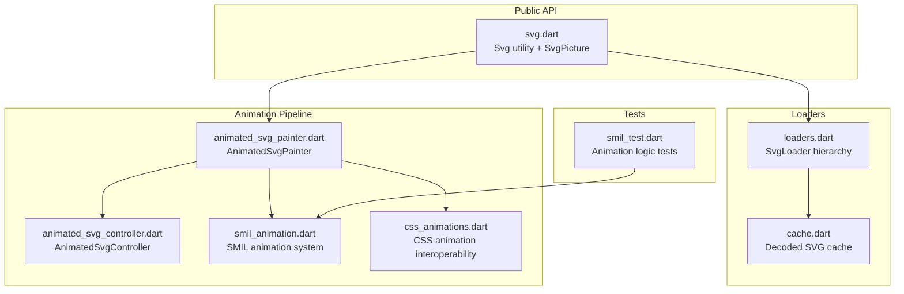
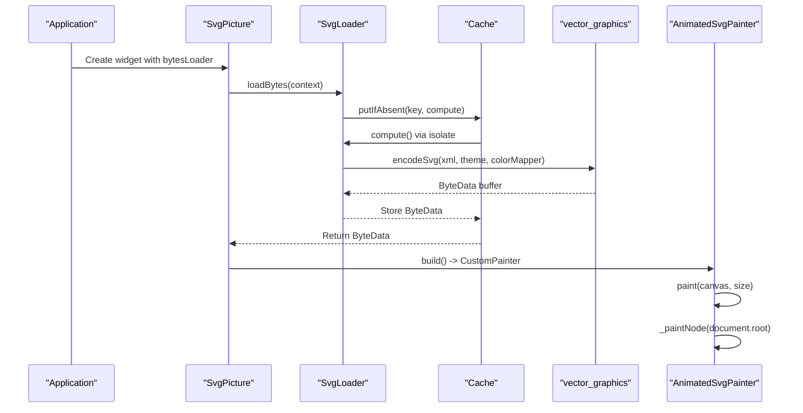
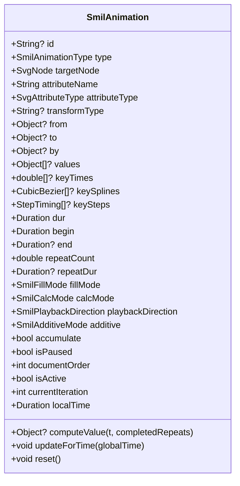
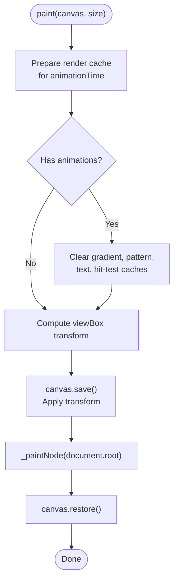
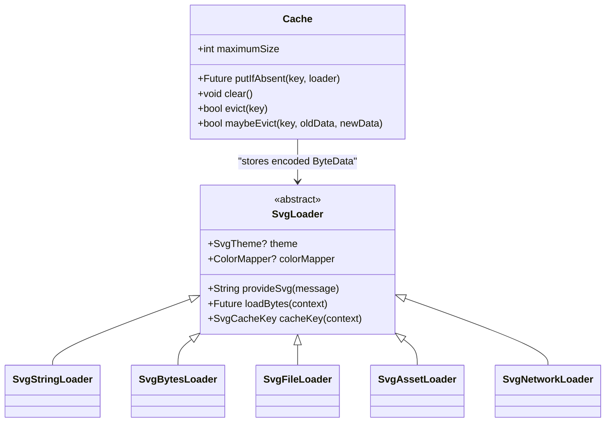
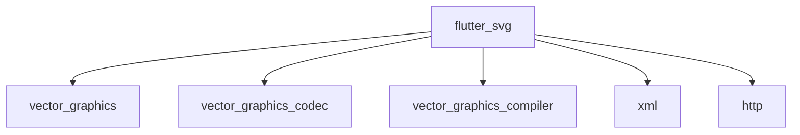

# Comprehensive Gap Analysis

<cite>
**Referenced Files in This Document**
- [README.md](file://README.md)
- [COMPREHENSIVE_GAP_ANALYSIS.md](file://docs/COMPREHENSIVE_GAP_ANALYSIS.md)
- [svg.dart](file://lib/svg.dart)
- [flutter_svg.dart](file://lib/flutter_svg.dart)
- [loaders.dart](file://lib/src/loaders.dart)
- [cache.dart](file://lib/src/cache.dart)
- [animated_svg_controller.dart](file://lib/src/animation/animated_svg_controller.dart)
- [animated_svg_painter.dart](file://lib/src/animation/animated_svg_painter.dart)
- [smil_animation.dart](file://lib/src/animation/smil/smil_animation.dart)
- [css_animations.dart](file://lib/src/animation/css_animations.dart)
- [smil_test.dart](file://test/animation/smil_test.dart)
- [pubspec.yaml](file://pubspec.yaml)
</cite>

## Table of Contents
1. [Introduction](#introduction)
2. [Project Structure](#project-structure)
3. [Core Components](#core-components)
4. [Architecture Overview](#architecture-overview)
5. [Detailed Component Analysis](#detailed-component-analysis)
6. [Dependency Analysis](#dependency-analysis)
7. [Performance Considerations](#performance-considerations)
8. [Troubleshooting Guide](#troubleshooting-guide)
9. [Conclusion](#conclusion)

## Introduction
This document presents a comprehensive gap analysis of the Flutter SVG animated pipeline, focusing on the AnimatedSvgPicture implementation and its alignment with Blink engine SVG core capabilities. The analysis evaluates feature coverage across 81+ SVG elements and 25+ filter primitives, identifies priority gaps, and provides actionable recommendations for closing remaining implementation holes. The report synthesizes findings from the project's documentation, source code, and test suites to guide development efforts toward full SVG parity.

## Project Structure
The repository is organized around a modular architecture supporting both static and animated SVG rendering:
- Public API surface: [svg.dart](file://lib/svg.dart) exports the primary Svg utility and SvgPicture widget
- Loader abstraction: [loaders.dart](file://lib/src/loaders.dart) defines SvgLoader hierarchy for asset, network, file, and string sources
- Animation pipeline: [animated_svg_painter.dart](file://lib/src/animation/animated_svg_painter.dart) orchestrates animated rendering
- SMIL animation system: [smil_animation.dart](file://lib/src/animation/smil/smil_animation.dart) implements SMIL timing and interpolation
- CSS animation interoperability: [css_animations.dart](file://lib/src/animation/css_animations.dart) integrates CSS animations with SMIL
- Testing: [smil_test.dart](file://test/animation/smil_test.dart) validates core animation logic

**Diagram sources**
- [svg.dart:1-627](file://lib/svg.dart#L1-L627)
- [loaders.dart:1-467](file://lib/src/loaders.dart#L1-L467)
- [cache.dart:1-111](file://lib/src/cache.dart#L1-L111)
- [animated_svg_painter.dart:1-871](file://lib/src/animation/animated_svg_painter.dart#L1-L871)
- [animated_svg_controller.dart:1-160](file://lib/src/animation/animated_svg_controller.dart#L1-L160)
- [smil_animation.dart:1-536](file://lib/src/animation/smil/smil_animation.dart#L1-L536)
- [css_animations.dart:1-12](file://lib/src/animation/css_animations.dart#L1-L12)
- [smil_test.dart:1-200](file://test/animation/smil_test.dart#L1-L200)

**Section sources**
- [README.md:1-227](file://README.md#L1-L227)
- [pubspec.yaml:1-28](file://pubspec.yaml#L1-L28)

## Core Components
This section outlines the primary components driving the animated SVG pipeline and their roles in achieving SVG parity.

- Svg utility and SvgPicture widget
  - Provides factory constructors for asset, network, file, and string sources
  - Integrates with vector_graphics backend for efficient rendering
  - Supports color filtering, semantics, and placeholder/error handling

- Loader hierarchy
  - SvgLoader abstract base with theme and colorMapper support
  - Specializations for string, bytes, file, asset, and network sources
  - Asynchronous encoding via vector_graphics encoder with caching

- AnimatedSvgPainter
  - Renders animated SVG documents with viewBox transformation
  - Manages render-time caches for gradients, patterns, text, and hit-test paths
  - Coordinates filter effects, clipping, masking, and text layout

- SMIL animation system
  - Implements SMIL timing, interpolation, and additive/accumulate semantics
  - Supports calcMode variants (linear, discrete, paced, spline)
  - Handles syncbase timing, repeatCount, repeatDur, and fill modes

- CSS animation interoperability
  - Extracts @keyframes from <style> and converts to SMIL
  - Parses animation properties and CSS transforms for SMIL conversion
  - Maintains CSS selector rules and cascade for element targeting

**Section sources**
- [svg.dart:57-627](file://lib/svg.dart#L57-L627)
- [loaders.dart:118-194](file://lib/src/loaders.dart#L118-L194)
- [animated_svg_painter.dart:141-266](file://lib/src/animation/animated_svg_painter.dart#L141-L266)
- [smil_animation.dart:85-363](file://lib/src/animation/smil/smil_animation.dart#L85-L363)
- [css_animations.dart:1-12](file://lib/src/animation/css_animations.dart#L1-L12)

## Architecture Overview
The AnimatedSvgPicture pipeline combines SVG parsing, animation evaluation, and rendering into a cohesive system. The architecture emphasizes separation of concerns:
- Loaders handle source acquisition and vector_graphics encoding
- The SvgDocument encapsulates parsed SVG state and animation timelines
- AnimatedSvgPainter executes rendering passes with cache invalidation
- SMIL and CSS animation systems compute effective attribute values
- Tests validate core animation logic and edge cases

**Diagram sources**
- [svg.dart:542-560](file://lib/svg.dart#L542-L560)
- [loaders.dart:156-187](file://lib/src/loaders.dart#L156-L187)
- [cache.dart:65-93](file://lib/src/cache.dart#L65-L93)
- [animated_svg_painter.dart:186-223](file://lib/src/animation/animated_svg_painter.dart#L186-L223)

## Detailed Component Analysis

### SMIL Animation System
The SMIL animation subsystem implements comprehensive timing and interpolation semantics:
- Attribute animation types: animate, animateTransform, animateMotion, set, animateColor
- Timing controls: begin/end conditions, repeatCount, repeatDur, restart policies
- Interpolation modes: linear, discrete, paced, spline with keySplines
- Directional playback: normal, reverse, alternate, alternateReverse
- Fill modes: freeze, remove, backwards, both
- Additive and accumulate semantics for value composition

**Diagram sources**
- [smil_animation.dart:85-536](file://lib/src/animation/smil/smil_animation.dart#L85-L536)

**Section sources**
- [smil_animation.dart:13-83](file://lib/src/animation/smil/smil_animation.dart#L13-L83)
- [smil_animation.dart:117-186](file://lib/src/animation/smil/smil_animation.dart#L117-L186)
- [smil_animation.dart:365-423](file://lib/src/animation/smil/smil_animation.dart#L365-L423)
- [smil_animation.dart:425-514](file://lib/src/animation/smil/smil_animation.dart#L425-L514)

### AnimatedSvgPainter Rendering Pipeline
AnimatedSvgPainter coordinates the rendering of animated SVG documents:
- Frame-level cache preparation with animationTime-based invalidation
- ViewBox transformation to widget size
- Node traversal with use-stack for <use> element recursion
- Gradient, pattern, and text paragraph caching keyed by attributes and bounds
- Integration with filter registry and clip/mask composition

**Diagram sources**
- [animated_svg_painter.dart:186-223](file://lib/src/animation/animated_svg_painter.dart#L186-L223)

**Section sources**
- [animated_svg_painter.dart:50-91](file://lib/src/animation/animated_svg_painter.dart#L50-L91)
- [animated_svg_painter.dart:186-223](file://lib/src/animation/animated_svg_painter.dart#L186-L223)

### Loader and Caching Strategy
The loader abstraction ensures efficient SVG acquisition and encoding:
- Theme-aware caching with SvgCacheKey including theme, colorMapper, and source-specific keys
- Isolate-based computation for vector_graphics encoding
- Asset bundle resolution for asset loaders
- Network loader with configurable headers and client lifecycle

**Diagram sources**
- [loaders.dart:118-194](file://lib/src/loaders.dart#L118-L194)
- [loaders.dart:234-280](file://lib/src/loaders.dart#L234-L280)
- [loaders.dart:284-307](file://lib/src/loaders.dart#L284-L307)
- [loaders.dart:343-413](file://lib/src/loaders.dart#L343-L413)
- [loaders.dart:417-466](file://lib/src/loaders.dart#L417-L466)
- [cache.dart:5-111](file://lib/src/cache.dart#L5-L111)

**Section sources**
- [loaders.dart:156-187](file://lib/src/loaders.dart#L156-L187)
- [loaders.dart:341-413](file://lib/src/loaders.dart#L341-L413)
- [cache.dart:65-93](file://lib/src/cache.dart#L65-L93)

### CSS Animation Interoperability
CSS animation integration enables seamless conversion from CSS @keyframes and animation properties to SMIL:
- CSS keyframe extraction and parsing
- Animation property parsing and SMIL conversion
- CSS transform decomposition and cubic-bezier to keySplines
- Cascade and specificity handling for element targeting

**Section sources**
- [css_animations.dart:1-12](file://lib/src/animation/css_animations.dart#L1-L12)

## Dependency Analysis
The project leverages external dependencies for core functionality:
- vector_graphics: binary vector graphics codec and rendering backend
- vector_graphics_codec: codec for vector graphics binary format
- vector_graphics_compiler: SVG compilation and optimization
- xml: XML parsing for SVG source processing
- http: Network loading for remote SVG resources

**Diagram sources**
- [pubspec.yaml:12-19](file://pubspec.yaml#L12-L19)

**Section sources**
- [pubspec.yaml:12-19](file://pubspec.yaml#L12-L19)

## Performance Considerations
- Render caching: AnimatedSvgPainter maintains caches for gradients, patterns, text paragraphs, and hit-test paths, invalidated per animation frame to reflect animated attribute changes
- Isolate-based encoding: Loaders delegate vector_graphics encoding to isolates to avoid blocking the UI thread
- LRU cache: Cache enforces maximum size with LRU eviction to control memory usage
- ViewBox transformation: Efficient scaling and translation from viewBox to widget size minimizes redundant calculations

## Troubleshooting Guide
Common issues and diagnostic approaches:
- Animation not updating: Verify animationTime parameter passed to AnimatedSvgPainter and ensure hasAnimations flag is set appropriately
- Incorrect color mapping: Confirm ColorMapper implementation and theme.fontSize/xHeight values affecting em/ex units
- Network loading failures: Check HTTP headers and client lifecycle in SvgNetworkLoader
- Asset bundle resolution: Ensure correct asset path and package specification in SvgAssetLoader
- Cache-related regressions: Use Cache.clear() or adjust maximumSize to force reprocessing

**Section sources**
- [animated_svg_painter.dart:72-81](file://lib/src/animation/animated_svg_painter.dart#L72-L81)
- [loaders.dart:156-187](file://lib/src/loaders.dart#L156-L187)
- [cache.dart:42-58](file://lib/src/cache.dart#L42-L58)

## Conclusion
The AnimatedSvgPicture pipeline achieves substantial SVG parity with the Blink engine, covering core geometry, SMIL animation, CSS animation interoperability, and major filter primitives. The comprehensive gap analysis identifies priority areas for enhancement: advanced filter input-graph semantics, light source elements, advanced text positioning and typography, and improved use/symbol inheritance. The modular architecture, robust loader system, and extensive test coverage provide a solid foundation for iterative improvements toward full SVG feature parity.