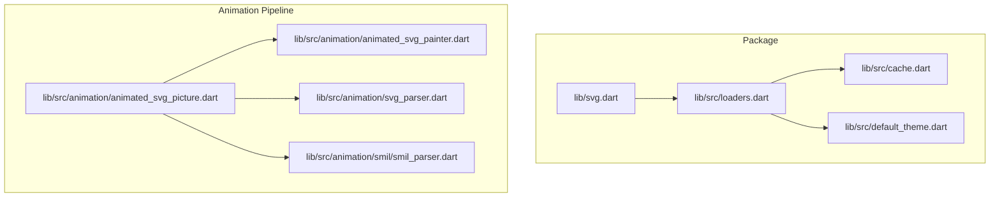
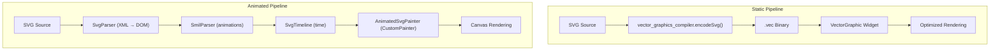
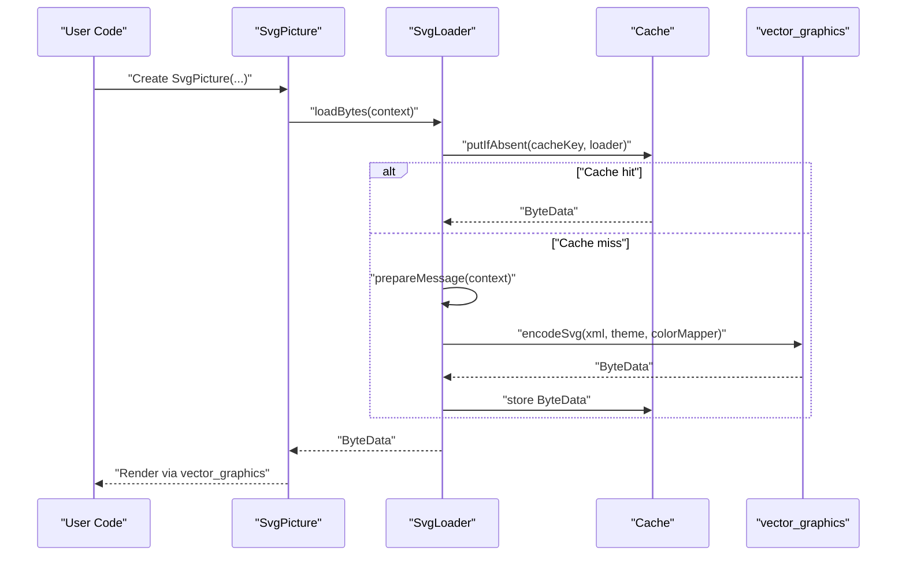
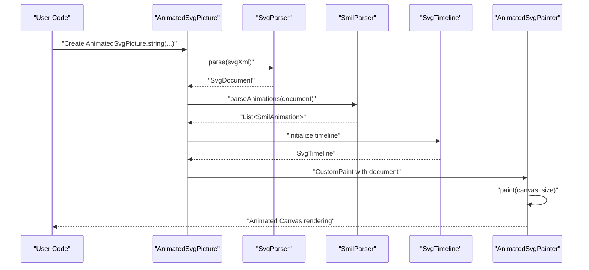
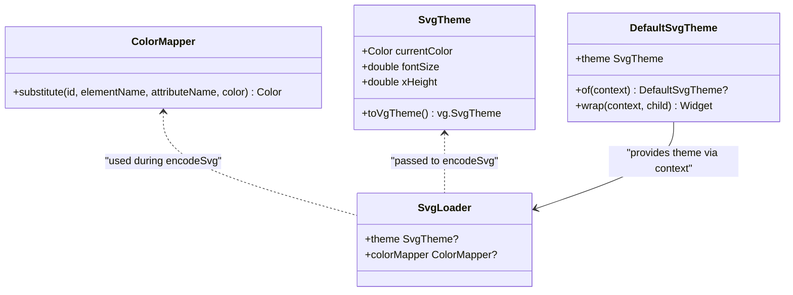
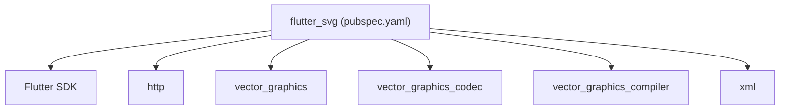

# Copilot Instructions

<cite>
**Referenced Files in This Document**
- [README.md](file://README.md)
- [pubspec.yaml](file://pubspec.yaml)
- [ARCHITECTURE.md](file://ARCHITECTURE.md)
- [ANIMATION.md](file://ANIMATION.md)
- [svg.dart](file://lib/svg.dart)
- [loaders.dart](file://lib/src/loaders.dart)
- [cache.dart](file://lib/src/cache.dart)
- [default_theme.dart](file://lib/src/default_theme.dart)
- [animated_svg_picture.dart](file://lib/src/animation/animated_svg_picture.dart)
- [animated_svg_painter.dart](file://lib/src/animation/animated_svg_painter.dart)
- [svg_parser.dart](file://lib/src/animation/svg_parser.dart)
- [smil_parser.dart](file://lib/src/animation/smil/smil_parser.dart)
</cite>

## Table of Contents
1. [Introduction](#introduction)
2. [Project Structure](#project-structure)
3. [Core Components](#core-components)
4. [Architecture Overview](#architecture-overview)
5. [Detailed Component Analysis](#detailed-component-analysis)
6. [Dependency Analysis](#dependency-analysis)
7. [Performance Considerations](#performance-considerations)
8. [Troubleshooting Guide](#troubleshooting-guide)
9. [Conclusion](#conclusion)

## Introduction
This document describes the Copilot instructions for the Flutter SVG support project. It explains how to configure Copilot to assist with development tasks related to rendering SVGs in Flutter, including static vector graphics and experimental animated SVGs. The instructions focus on the dual-pipeline architecture, key components, and recommended workflows for both production and experimental animation features.

## Project Structure
The repository provides:
- A production-grade static SVG pipeline using vector_graphics and vector_graphics_compiler
- An experimental animated SVG pipeline with DOM parsing, SMIL/CSS animation extraction, and CustomPainter-based rendering
- Example assets and an example app demonstrating usage
- Comprehensive documentation and development guidelines

**Diagram sources**
- [svg.dart:1-627](file://lib/svg.dart#L1-L627)
- [loaders.dart:1-467](file://lib/src/loaders.dart#L1-L467)
- [cache.dart:1-111](file://lib/src/cache.dart#L1-L111)
- [default_theme.dart:1-36](file://lib/src/default_theme.dart#L1-L36)
- [animated_svg_picture.dart:1-359](file://lib/src/animation/animated_svg_picture.dart#L1-L359)
- [animated_svg_painter.dart:1-227](file://lib/src/animation/animated_svg_painter.dart#L1-L227)
- [svg_parser.dart:1-65](file://lib/src/animation/svg_parser.dart#L1-L65)
- [smil_parser.dart:1-39](file://lib/src/animation/smil/smil_parser.dart#L1-L39)

**Section sources**
- [README.md:1-227](file://README.md#L1-L227)
- [pubspec.yaml:1-28](file://pubspec.yaml#L1-L28)

## Core Components
- Svg class and Svg.svg utility: Provides access to the global cache and exposes vector_graphics utilities.
- SvgPicture widget: Renders SVGs via vector_graphics for production use, supporting multiple sources (asset, network, file, memory, string) and rendering strategies.
- Loader hierarchy: SvgLoader and concrete loaders (SvgAssetLoader, SvgNetworkLoader, SvgFileLoader, SvgBytesLoader, SvgStringLoader) encapsulate data acquisition and vector_graphics encoding.
- Cache: LRU cache keyed by SvgCacheKey to reuse encoded vector_graphics binaries.
- DefaultSvgTheme: Supplies inherited theme values (currentColor, fontSize, xHeight) to loaders.
- AnimatedSvgPicture: Experimental widget for DOM-based animation with SMIL and CSS animation support.
- AnimatedSvgPainter: CustomPainter that traverses the DOM and draws elements with current animation state.
- SvgParser and SmilParser: Parse XML to DOM and extract SMIL/CSS animations.

**Section sources**
- [svg.dart:24-627](file://lib/svg.dart#L24-L627)
- [loaders.dart:15-467](file://lib/src/loaders.dart#L15-L467)
- [cache.dart:1-111](file://lib/src/cache.dart#L1-L111)
- [default_theme.dart:1-36](file://lib/src/default_theme.dart#L1-L36)
- [animated_svg_picture.dart:108-359](file://lib/src/animation/animated_svg_picture.dart#L108-L359)
- [animated_svg_painter.dart:35-227](file://lib/src/animation/animated_svg_painter.dart#L35-L227)
- [svg_parser.dart:22-65](file://lib/src/animation/svg_parser.dart#L22-L65)
- [smil_parser.dart:12-39](file://lib/src/animation/smil/smil_parser.dart#L12-L39)

## Architecture Overview
The project maintains two distinct rendering pipelines:
- Static pipeline: Parses SVG XML, compiles to vector_graphics binary (.vec), caches, and renders via vector_graphics widgets. Fast and production-ready, but no DOM or animation support.
- Animated pipeline: Parses XML to a DOM, extracts SMIL and CSS animations, manages timelines, and renders via CustomPainter. Preserves DOM and supports SMIL/CSS animations, but is slower and experimental.

**Diagram sources**
- [ARCHITECTURE.md:6-74](file://ARCHITECTURE.md#L6-L74)
- [ARCHITECTURE.md:32-57](file://ARCHITECTURE.md#L32-L57)

**Section sources**
- [ARCHITECTURE.md:1-297](file://ARCHITECTURE.md#L1-L297)

## Detailed Component Analysis

### Static Pipeline: SvgPicture and Loaders
- SvgPicture delegates rendering to vector_graphics widgets via createCompatVectorGraphic with configurable rendering strategy.
- SvgLoader subclasses implement prepareMessage and provideSvg to encode SVG XML into vector_graphics binary in an isolate, applying theme and optional colorMapper.
- Cache stores ByteData keyed by SvgCacheKey, ensuring theme and colorMapper variations are cached separately.

**Diagram sources**
- [svg.dart:542-560](file://lib/svg.dart#L542-L560)
- [loaders.dart:156-187](file://lib/src/loaders.dart#L156-L187)
- [cache.dart:65-93](file://lib/src/cache.dart#L65-L93)

**Section sources**
- [svg.dart:56-627](file://lib/svg.dart#L56-L627)
- [loaders.dart:118-194](file://lib/src/loaders.dart#L118-L194)
- [cache.dart:1-111](file://lib/src/cache.dart#L1-L111)

### Animated Pipeline: DOM, SMIL, and Rendering
- SvgParser converts XML to SvgDocument with root node, viewBox, width, height, filters, CSS keyframes, and selector rules.
- SmilParser extracts SMIL animations from DOM and CSS, normalizing to SmilAnimation objects.
- AnimatedSvgPicture initializes DOM, builds timelines, and drives animation via AnimationController and Ticker.
- AnimatedSvgPainter traverses the DOM, applies transforms and styles, resolves gradients and filters, and paints to Canvas.

**Diagram sources**
- [animated_svg_picture.dart:166-269](file://lib/src/animation/animated_svg_picture.dart#L166-L269)
- [svg_parser.dart:30-63](file://lib/src/animation/svg_parser.dart#L30-L63)
- [smil_parser.dart:16-37](file://lib/src/animation/smil/smil_parser.dart#L16-L37)
- [animated_svg_painter.dart:64-126](file://lib/src/animation/animated_svg_painter.dart#L64-L126)

**Section sources**
- [animated_svg_picture.dart:108-359](file://lib/src/animation/animated_svg_picture.dart#L108-L359)
- [svg_parser.dart:22-65](file://lib/src/animation/svg_parser.dart#L22-L65)
- [smil_parser.dart:12-39](file://lib/src/animation/smil/smil_parser.dart#L12-L39)
- [animated_svg_painter.dart:35-227](file://lib/src/animation/animated_svg_painter.dart#L35-L227)

### Color Mapping and Theming
- ColorMapper enables per-SVG color substitution during parsing, delegating to vector_graphics-compatible color mapping.
- SvgTheme supplies currentColor, fontSize, and xHeight; DefaultSvgTheme provides inherited values to descendant widgets.

**Diagram sources**
- [loaders.dart:76-154](file://lib/src/loaders.dart#L76-L154)
- [default_theme.dart:7-35](file://lib/src/default_theme.dart#L7-L35)

**Section sources**
- [loaders.dart:76-154](file://lib/src/loaders.dart#L76-L154)
- [default_theme.dart:1-36](file://lib/src/default_theme.dart#L1-L36)

## Dependency Analysis
- Package dependencies include Flutter SDK, http, vector_graphics, vector_graphics_codec, vector_graphics_compiler, and xml.
- The static pipeline relies on vector_graphics for rendering and vector_graphics_compiler for precompilation.
- The animated pipeline depends on xml for parsing and integrates CSS animation parsing and SMIL extraction.

**Diagram sources**
- [pubspec.yaml:12-20](file://pubspec.yaml#L12-L20)

**Section sources**
- [pubspec.yaml:1-28](file://pubspec.yaml#L1-L28)

## Performance Considerations
- Static pipeline advantages: fast rendering, optimized binary format, production-ready.
- Animated pipeline trade-offs: slower than static pipeline, experimental status, requires DOM preservation and animation runtime.
- Recommendations:
  - Prefer SvgPicture for production use-cases requiring speed and stability.
  - Use AnimatedSvgPicture for experimental animations needing DOM-level control.
  - Consider precompiling SVGs with vector_graphics_compiler to reduce parsing overhead.
  - Tune rendering strategy and leverage caching to minimize recomputation.

[No sources needed since this section provides general guidance]

## Troubleshooting Guide
- Static pipeline issues:
  - Verify asset paths and bundle configuration for asset-based loading.
  - Ensure network requests include appropriate headers and handle timeouts.
  - Confirm vector_graphics compatibility and consider precompiled .vec assets.
- Animated pipeline issues:
  - Validate SVG contains supported SMIL/CSS animation constructs.
  - Check viewBox and sizing constraints for proper layout and clipping.
  - Review logs and traces for parsing or animation initialization errors.
- General:
  - Use placeholders and error builders to improve UX during loading.
  - Leverage DefaultSvgTheme to standardize currentColor and font metrics across widgets.

**Section sources**
- [README.md:80-128](file://README.md#L80-L128)
- [ANIMATION.md:172-229](file://ANIMATION.md#L172-L229)

## Conclusion
The project balances performance and fidelity by offering two complementary pipelines: a fast static vector_graphics pipeline for production and a DOM-based animated pipeline for experimental animation support. Copilot can assist by guiding code generation, explaining architecture decisions, and suggesting optimizations aligned with the documented design principles and performance strategies.