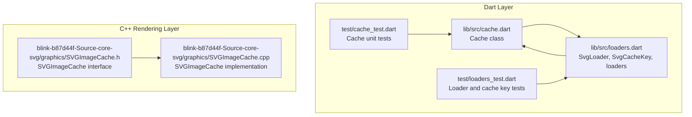
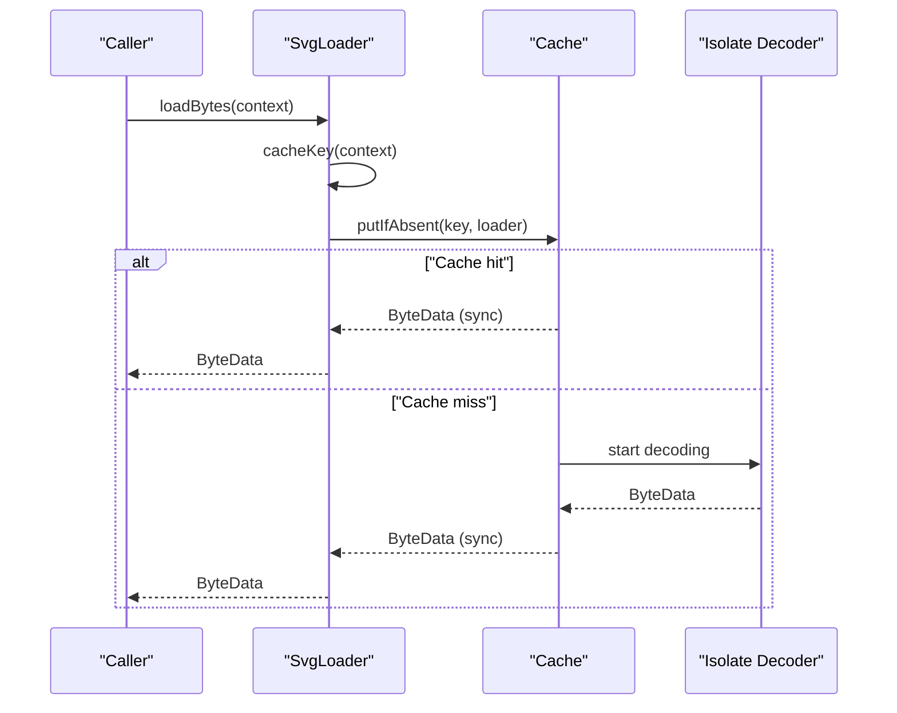
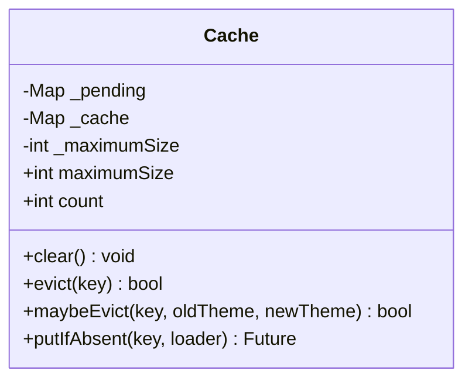
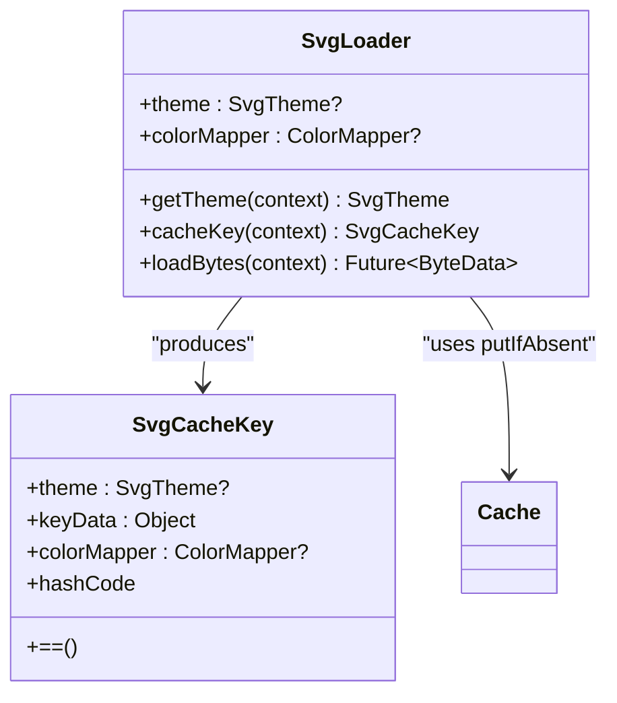
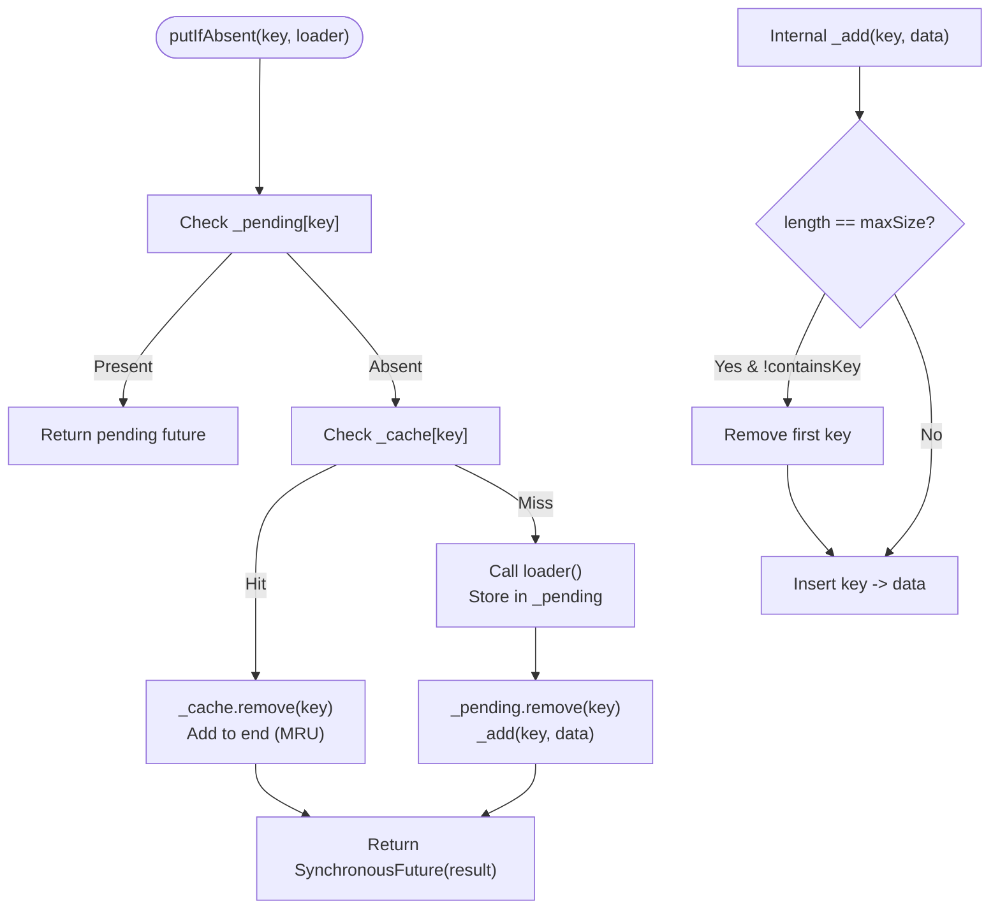
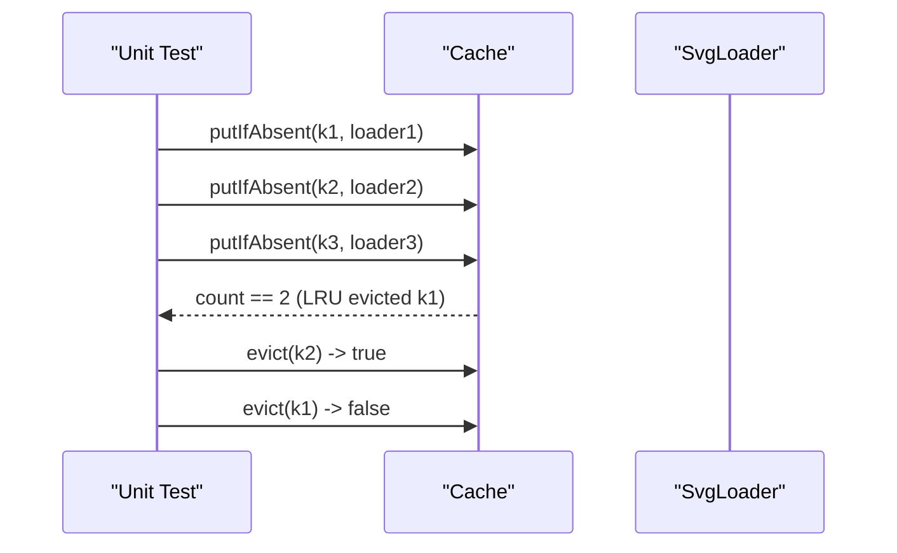

# Caching System

<cite>
**Referenced Files in This Document**
- [cache.dart](file://lib/src/cache.dart)
- [loaders.dart](file://lib/src/loaders.dart)
- [cache_test.dart](file://test/cache_test.dart)
- [loaders_test.dart](file://test/loaders_test.dart)
- [SVGImageCache.h](file://blink-b87d44f-Source-core-svg/graphics/SVGImageCache.h)
- [SVGImageCache.cpp](file://blink-b87d44f-Source-core-svg/graphics/SVGImageCache.cpp)
</cite>

## Table of Contents
1. [Introduction](#introduction)
2. [Project Structure](#project-structure)
3. [Core Components](#core-components)
4. [Architecture Overview](#architecture-overview)
5. [Detailed Component Analysis](#detailed-component-analysis)
6. [Dependency Analysis](#dependency-analysis)
7. [Performance Considerations](#performance-considerations)
8. [Troubleshooting Guide](#troubleshooting-guide)
9. [Conclusion](#conclusion)
10. [Appendices](#appendices)

## Introduction
This document explains the caching system used for decoded SVGs in the project. It covers the thread-safe LRU cache implementation, cache key generation, memory management strategies, cache lifecycle, eviction policies, size limitations, loading strategies, invalidation mechanisms, manual cache control via the Cache API, configuration and tuning, monitoring, and best practices for resource-constrained environments. It also outlines how cache size relates to memory usage and rendering performance, and describes approaches for cache warming and persistence across app sessions.

## Project Structure
The caching system spans a small set of Dart files implementing the cache and loader integration, plus Blink-based SVG rendering support in C++.



**Diagram sources**
- [cache.dart:1-111](file://lib/src/cache.dart#L1-L111)
- [loaders.dart:1-467](file://lib/src/loaders.dart#L1-L467)
- [cache_test.dart:1-132](file://test/cache_test.dart#L1-L132)
- [loaders_test.dart:1-185](file://test/loaders_test.dart#L1-L185)
- [SVGImageCache.h:1-68](file://blink-b87d44f-Source-core-svg/graphics/SVGImageCache.h#L1-L68)
- [SVGImageCache.cpp:1-98](file://blink-b87d44f-Source-core-svg/graphics/SVGImageCache.cpp#L1-L98)

**Section sources**
- [cache.dart:1-111](file://lib/src/cache.dart#L1-L111)
- [loaders.dart:1-467](file://lib/src/loaders.dart#L1-L467)
- [cache_test.dart:1-132](file://test/cache_test.dart#L1-L132)
- [loaders_test.dart:1-185](file://test/loaders_test.dart#L1-L185)
- [SVGImageCache.h:1-68](file://blink-b87d44f-Source-core-svg/graphics/SVGImageCache.h#L1-L68)
- [SVGImageCache.cpp:1-98](file://blink-b87d44f-Source-core-svg/graphics/SVGImageCache.cpp#L1-L98)

## Core Components
- Cache: Thread-safe LRU cache for decoded SVG byte data keyed by SvgCacheKey. Supports maximum size, eviction, and bulk clearing.
- SvgLoader and SvgCacheKey: Define cache keys that incorporate theme, color mapper, and loader-specific data to ensure correctness across dynamic contexts.
- Loader integration: Loaders delegate to the cache via putIfAbsent to avoid redundant work and to reuse decoded results.

Key responsibilities:
- Cache: enforce size limits, maintain LRU order, handle concurrent loads, expose eviction hooks.
- SvgLoader: produce deterministic cache keys and orchestrate decoding in isolates.
- Tests: validate LRU behavior, size limits, and theme/color mapper effects on cache keys.

**Section sources**
- [cache.dart:1-111](file://lib/src/cache.dart#L1-L111)
- [loaders.dart:121-230](file://lib/src/loaders.dart#L121-L230)
- [cache_test.dart:1-132](file://test/cache_test.dart#L1-L132)
- [loaders_test.dart:16-36](file://test/loaders_test.dart#L16-L36)

## Architecture Overview
The cache sits between loaders and rendering. Loaders compute a cache key and call Cache.putIfAbsent. If present, the cached ByteData is returned synchronously; if absent, the loader starts a decoding task, stores the pending future, and upon completion stores the result and returns it.



**Diagram sources**
- [loaders.dart:184-194](file://lib/src/loaders.dart#L184-L194)
- [cache.dart:65-93](file://lib/src/cache.dart#L65-L93)

**Section sources**
- [loaders.dart:121-230](file://lib/src/loaders.dart#L121-L230)
- [cache.dart:1-111](file://lib/src/cache.dart#L1-L111)

## Detailed Component Analysis

### Cache Implementation (Thread-Safe LRU)
The Cache class maintains:
- An in-memory map of keys to decoded ByteData.
- A pending map to avoid duplicate loads for the same key.
- A maximumSize property controlling eviction policy.
- Methods for clear, evict, maybeEvict, and putIfAbsent.

LRU behavior:
- On access/update, existing entries are removed and reinserted to mark them as most recently used.
- When capacity is reached, the least recently used entry is evicted (first key in the internal map).

Concurrency:
- Pending futures prevent duplicate decoding tasks for the same key.
- Access to maps is not guarded by locks; the implementation relies on single-threaded event loop semantics and Futures to serialize completion.

Eviction hooks:
- maybeEvict allows theme-based invalidation when SvgTheme changes.



**Diagram sources**
- [cache.dart:5-110](file://lib/src/cache.dart#L5-L110)

**Section sources**
- [cache.dart:1-111](file://lib/src/cache.dart#L1-L111)

### Cache Key Generation and Loading Strategies
SvgCacheKey combines:
- theme: SvgTheme including currentColor, fontSize, xHeight.
- colorMapper: immutable ColorMapper used during decoding.
- keyData: loader-specific data (e.g., asset name, file path, or loader instance).

SvgLoader integrates with the cache by:
- Computing cacheKey(context) from the effective theme and optional color mapper.
- Calling svg.cache.putIfAbsent with a loader function that performs decoding in an isolate.



**Diagram sources**
- [loaders.dart:196-230](file://lib/src/loaders.dart#L196-L230)
- [loaders.dart:121-194](file://lib/src/loaders.dart#L121-L194)
- [cache.dart:65-93](file://lib/src/cache.dart#L65-L93)

**Section sources**
- [loaders.dart:15-74](file://lib/src/loaders.dart#L15-L74)
- [loaders.dart:196-230](file://lib/src/loaders.dart#L196-L230)
- [loaders.dart:121-194](file://lib/src/loaders.dart#L121-L194)

### Cache Entry Lifecycle and Eviction Policy
Lifecycle:
- putIfAbsent checks pending map; if absent, checks cache; if still absent, starts loader and registers a pending future.
- On completion, removes pending entry, adds to cache, and returns the result.
- Access moves the entry to MRU position.

Eviction:
- When maximumSize is exceeded, the first entry in the internal map is evicted.
- Setting maximumSize to 0 clears the cache immediately.
- Manual eviction via evict(key) and maybeEvict(key, oldTheme, newTheme).



**Diagram sources**
- [cache.dart:65-106](file://lib/src/cache.dart#L65-L106)

**Section sources**
- [cache.dart:65-106](file://lib/src/cache.dart#L65-L106)

### Memory Management and Size Limitations
- maximumSize controls the number of entries; setting it to 0 clears the cache.
- When capacity is exceeded, the least recently used entry is evicted.
- The cache holds decoded ByteData; memory usage scales with the number of cached items and their sizes.
- Pending futures are held until completion to avoid duplicate work.

Best practices:
- Tune maximumSize based on device capabilities and typical workload.
- Monitor count to detect unexpected growth.
- Use maybeEvict to invalidate entries when themes or color mappers change.

**Section sources**
- [cache.dart:9-36](file://lib/src/cache.dart#L9-L36)
- [cache.dart:95-106](file://lib/src/cache.dart#L95-L106)

### Cache Invalidation Mechanisms
- maybeEvict(key, oldTheme, newTheme): Evicts entries when theme changes cause incompatibility.
- clear(): Bulk eviction for scenarios like asset bundle updates.
- evict(key): Single-key eviction.

These hooks ensure correctness when dynamic parameters (theme, color mapper) change.

**Section sources**
- [cache.dart:42-58](file://lib/src/cache.dart#L42-L58)
- [loaders.dart:196-230](file://lib/src/loaders.dart#L196-L230)

### Manual Cache Control via the Cache API
Programmatic control:
- Access svg.cache.maximumSize to configure capacity.
- Call svg.cache.clear() to reset.
- Call svg.cache.evict(key) to remove a specific entry.
- Use svg.cache.maybeEvict(key, oldTheme, newTheme) to invalidate on theme changes.

**Section sources**
- [cache.dart:13-44](file://lib/src/cache.dart#L13-L44)
- [cache.dart:46-58](file://lib/src/cache.dart#L46-L58)

### Relationship Between Cache Size, Memory Usage, and Rendering Performance
- Larger maximumSize reduces cache misses and improves hit rates but increases memory usage.
- Smaller maximumSize conserves memory but risks higher miss rates and repeated decoding overhead.
- Optimal balance depends on the variety of SVGs, themes, and color mappers in use.
- Monitoring count helps assess utilization; consider measuring cache hit rate externally if needed.

[No sources needed since this section provides general guidance]

### Cache Persistence Across App Sessions
- The in-memory Cache does not persist across app restarts.
- To achieve persistence-like behavior across sessions, pre-warm the cache after app startup by loading frequently used assets with loaders; this leverages the cache for subsequent accesses.

[No sources needed since this section provides general guidance]

### Cache Warming Strategies
- Preload commonly used assets during app initialization by invoking loadBytes on representative SvgLoader instances.
- Warm both base assets and themed variants to capture different cache keys.
- Combine with asset bundling to minimize network overhead.

[No sources needed since this section provides general guidance]

### Best Practices for Managing Cache Memory in Resource-Constrained Environments
- Reduce maximumSize on low-memory devices.
- Prefer lighter assets or fewer distinct themes/color mappers.
- Periodically clear the cache when entering background states if appropriate.
- Monitor count and adjust maximumSize dynamically if feasible.

[No sources needed since this section provides general guidance]

### Cache Debugging Techniques and Monitoring
- Unit tests validate LRU behavior and size limits.
- Tests demonstrate theme and color mapper effects on cache keys.
- Use tracing/logging to observe cache hits, misses, and evictions during development.



**Diagram sources**
- [cache_test.dart:32-72](file://test/cache_test.dart#L32-L72)

**Section sources**
- [cache_test.dart:1-132](file://test/cache_test.dart#L1-L132)
- [loaders_test.dart:16-36](file://test/loaders_test.dart#L16-L36)

## Dependency Analysis
The cache interacts with loaders and the vector graphics compiler. The C++ SVG rendering layer provides image containers keyed by renderer and container size, separate from the decoded SVG cache.

```mermaid
graph LR
Cache["Cache<br/>lib/src/cache.dart"] <- --> Loader["SvgLoader<br/>lib/src/loaders.dart"]
Loader --> Compiler["vector_graphics_compiler<br/>(external)"]
Renderer["SVGImageCache<br/>blink SVG rendering"] -.-> RendererMap["ImageForContainerMap<br/>C++"]
```

**Diagram sources**
- [cache.dart:1-111](file://lib/src/cache.dart#L1-L111)
- [loaders.dart:1-467](file://lib/src/loaders.dart#L1-L467)
- [SVGImageCache.h:39-63](file://blink-b87d44f-Source-core-svg/graphics/SVGImageCache.h#L39-L63)
- [SVGImageCache.cpp:35-95](file://blink-b87d44f-Source-core-svg/graphics/SVGImageCache.cpp#L35-L95)

**Section sources**
- [cache.dart:1-111](file://lib/src/cache.dart#L1-L111)
- [loaders.dart:1-467](file://lib/src/loaders.dart#L1-L467)
- [SVGImageCache.h:1-68](file://blink-b87d44f-Source-core-svg/graphics/SVGImageCache.h#L1-L68)
- [SVGImageCache.cpp:1-98](file://blink-b87d44f-Source-core-svg/graphics/SVGImageCache.cpp#L1-L98)

## Performance Considerations
- Isolate decoding offloads CPU work; combine with caching to amortize cost.
- LRU minimizes stale data retention; tune maximumSize to balance hit rate vs. memory.
- Pending futures avoid duplicate work for concurrent requests to the same key.
- For heavy assets, consider reducing maximumSize or preloading selectively.

[No sources needed since this section provides general guidance]

## Troubleshooting Guide
Common issues and remedies:
- Unexpected cache misses: verify cache keys include theme and color mapper; confirm SvgCacheKey equality and hashing.
- Memory spikes: lower maximumSize or clear cache periodically; monitor count.
- Stale visuals after theme changes: call maybeEvict or clear to force recomputation.

Validation references:
- LRU eviction and size enforcement are covered by unit tests.
- Theme and color mapper effects on cache keys are validated by loader tests.

**Section sources**
- [cache_test.dart:32-103](file://test/cache_test.dart#L32-L103)
- [loaders_test.dart:16-36](file://test/loaders_test.dart#L16-L36)

## Conclusion
The caching system provides a thread-safe, LRU-backed store for decoded SVG ByteData, integrated tightly with loader-generated cache keys that reflect theme and color mapper variations. By tuning maximumSize, leveraging maybeEvict for theme changes, and warming the cache for frequent assets, applications can achieve strong hit rates while controlling memory usage and maintaining responsive rendering.

## Appendices

### Cache API Reference
- Access and configure: svg.cache.maximumSize
- Inspect size: svg.cache.count
- Clear all: svg.cache.clear()
- Evict single: svg.cache.evict(key)
- Conditional eviction: svg.cache.maybeEvict(key, oldTheme, newTheme)

**Section sources**
- [cache.dart:13-58](file://lib/src/cache.dart#L13-L58)

### Example Configuration and Tuning
- Increase capacity for complex UIs with many unique assets and themes.
- Reduce capacity on constrained devices.
- Periodically clear cache when switching asset bundles or themes.

[No sources needed since this section provides general guidance]