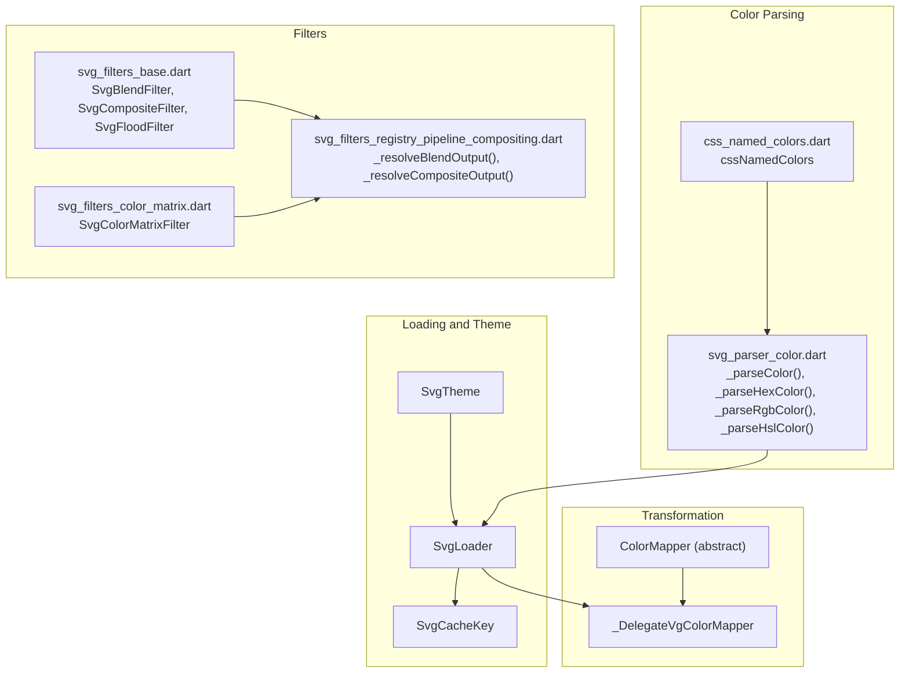
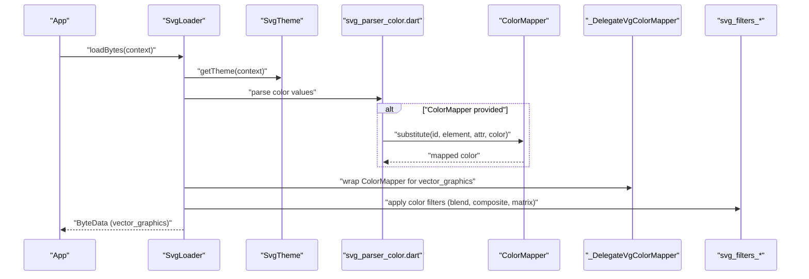
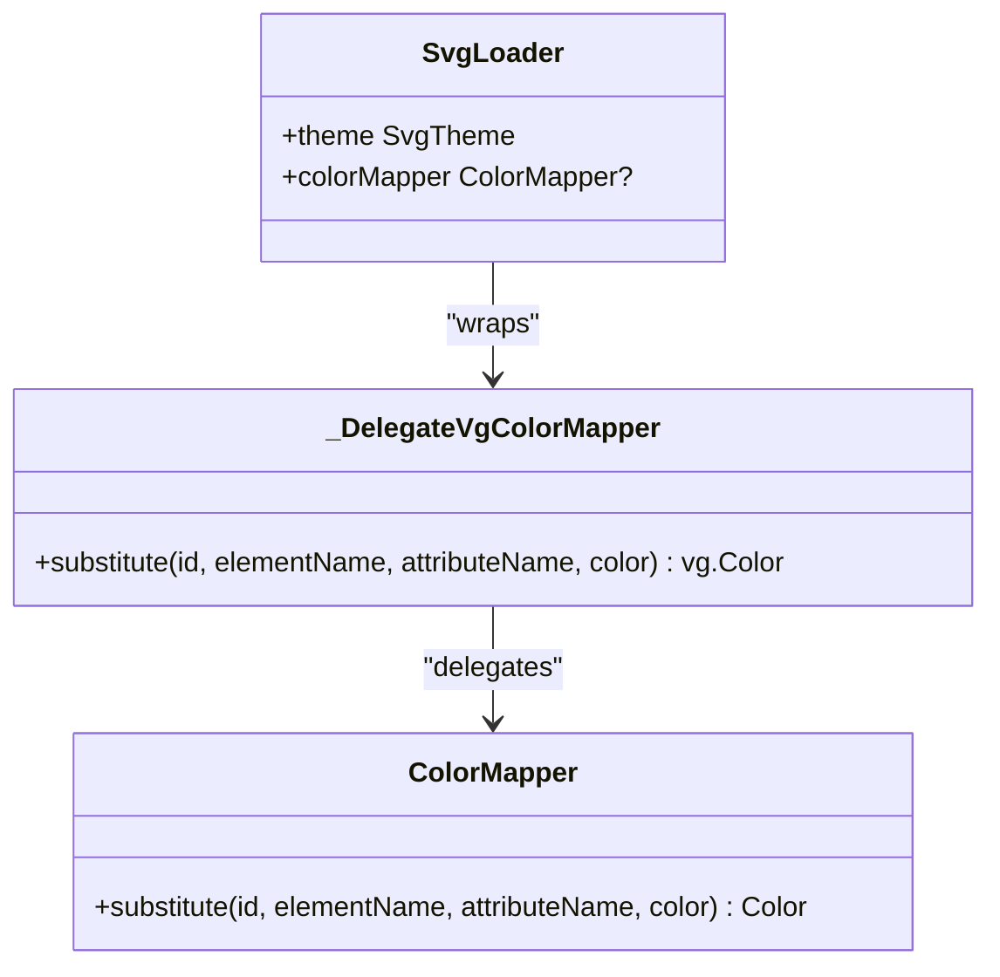
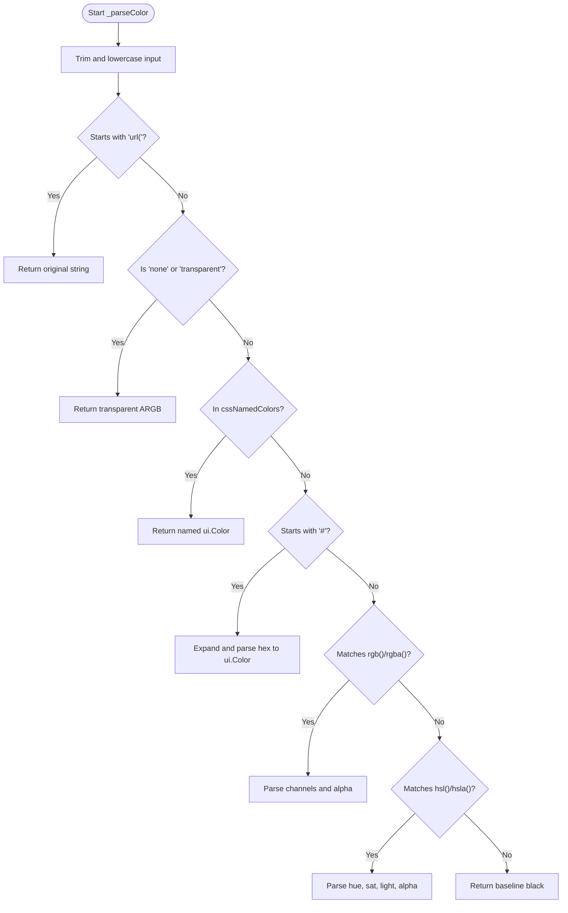
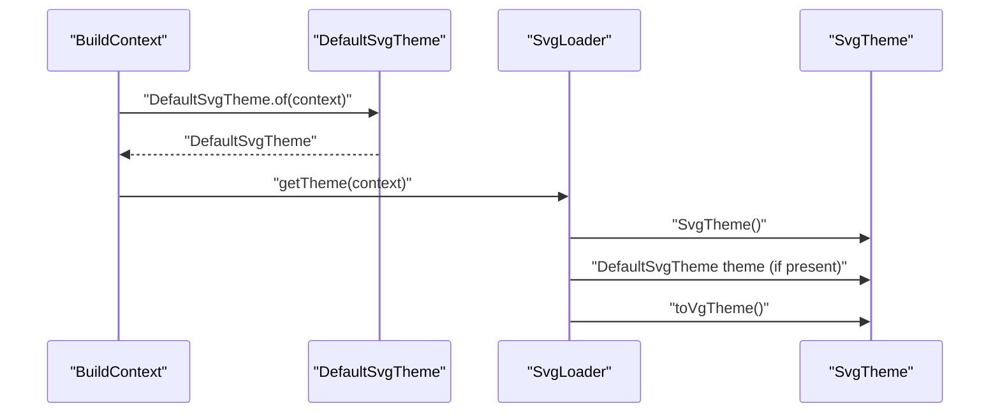
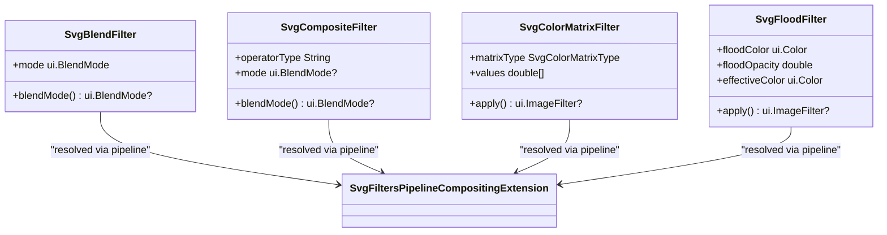
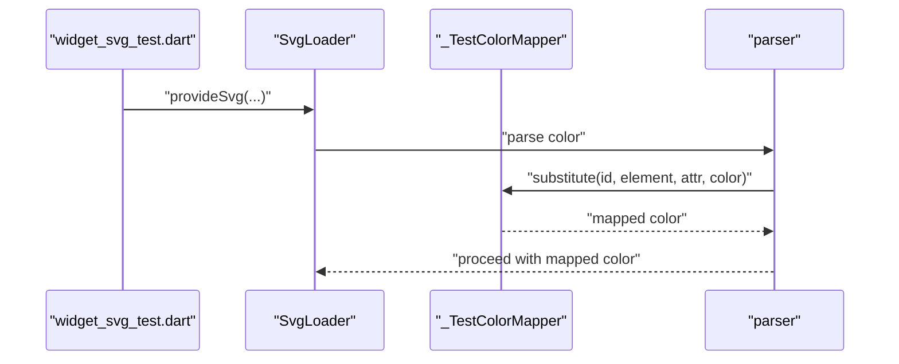
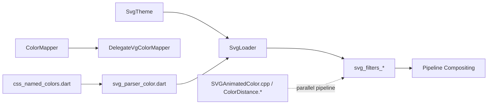

# Color Management

<cite>
**Referenced Files in This Document**
- [loaders.dart](file://lib/src/loaders.dart)
- [default_theme.dart](file://lib/src/default_theme.dart)
- [svg_parser_color.dart](file://lib/src/animation/svg_parser_color.dart)
- [css_named_colors.dart](file://lib/src/animation/css_named_colors.dart)
- [svg_filters_base.dart](file://lib/src/animation/svg_filters_base.dart)
- [svg_filters_color_matrix.dart](file://lib/src/animation/svg_filters_color_matrix.dart)
- [svg_filters_registry_pipeline_compositing.dart](file://lib/src/animation/svg_filters_registry_pipeline_compositing.dart)
- [widget_svg_test.dart](file://test/widget_svg_test.dart)
- [SVGAnimatedColor.cpp](file://blink-b87d44f-Source-core-svg/SVGAnimatedColor.cpp)
- [ColorDistance.h](file://blink-b87d44f-Source-core-svg/ColorDistance.h)
- [ColorDistance.cpp](file://blink-b87d44f-Source-core-svg/ColorDistance.cpp)
</cite>

## Table of Contents
1. [Introduction](#introduction)
2. [Project Structure](#project-structure)
3. [Core Components](#core-components)
4. [Architecture Overview](#architecture-overview)
5. [Detailed Component Analysis](#detailed-component-analysis)
6. [Dependency Analysis](#dependency-analysis)
7. [Performance Considerations](#performance-considerations)
8. [Troubleshooting Guide](#troubleshooting-guide)
9. [Conclusion](#conclusion)

## Introduction
This document explains the color management system in the project, focusing on how SVG colors are parsed and transformed, how themes influence rendering, and how color transformations are integrated with Flutter’s color system. It covers the ColorMapper interface, built-in color parsing strategies, SVG filter-based color effects, and practical guidance for dynamic color switching, theme-based mapping, and runtime modifications. It also addresses performance and memory considerations for color transformations.

## Project Structure
The color management system spans several modules:
- Loader and theme integration: SvgTheme, SvgLoader, and cache keys
- Color parsing and normalization: SVG/CSS color parsing and named color support
- Color transformation: ColorMapper abstraction and delegate bridging
- Filter-based color effects: Blend, Composite, ColorMatrix, and related primitives
- Animation and distance metrics: Animated color interpolation and color distance calculations

**Diagram sources**
- [loaders.dart:15-74](file://lib/src/loaders.dart#L15-L74)
- [loaders.dart:118-194](file://lib/src/loaders.dart#L118-L194)
- [svg_parser_color.dart:3-42](file://lib/src/animation/svg_parser_color.dart#L3-L42)
- [css_named_colors.dart:3-154](file://lib/src/animation/css_named_colors.dart#L3-L154)
- [svg_filters_base.dart:4-37](file://lib/src/animation/svg_filters_base.dart#L4-L37)
- [svg_filters_color_matrix.dart:56-103](file://lib/src/animation/svg_filters_color_matrix.dart#L56-L103)
- [svg_filters_registry_pipeline_compositing.dart:3-43](file://lib/src/animation/svg_filters_registry_pipeline_compositing.dart#L3-L43)

**Section sources**
- [loaders.dart:15-74](file://lib/src/loaders.dart#L15-L74)
- [svg_parser_color.dart:3-42](file://lib/src/animation/svg_parser_color.dart#L3-L42)
- [css_named_colors.dart:3-154](file://lib/src/animation/css_named_colors.dart#L3-L154)
- [svg_filters_base.dart:4-37](file://lib/src/animation/svg_filters_base.dart#L4-L37)
- [svg_filters_color_matrix.dart:56-103](file://lib/src/animation/svg_filters_color_matrix.dart#L56-L103)
- [svg_filters_registry_pipeline_compositing.dart:3-43](file://lib/src/animation/svg_filters_registry_pipeline_compositing.dart#L3-L43)

## Core Components
- SvgTheme: Encapsulates currentColor, fontSize, and xHeight used during SVG decoding and parsing. Provides conversion to the vector_graphics theme type.
- ColorMapper: An abstract, immutable interface for transforming colors during SVG parsing. Implementations receive element and attribute context plus the original color and return a replacement color.
- Color parsing: Supports named colors, hex (#RGB, #RGBA, #RRGGBB, #RRGGBBAA), rgb()/rgba(), and hsl()/hsla() with robust parsing and normalization.
- Filters: Provide color-related transformations including blend modes, compositing operators, color matrix transforms (saturate, hue rotate, luminance to alpha), and flood color overlays.

**Section sources**
- [loaders.dart:15-74](file://lib/src/loaders.dart#L15-L74)
- [loaders.dart:81-94](file://lib/src/loaders.dart#L81-L94)
- [svg_parser_color.dart:3-42](file://lib/src/animation/svg_parser_color.dart#L3-L42)
- [svg_filters_base.dart:72-124](file://lib/src/animation/svg_filters_base.dart#L72-L124)
- [svg_filters_color_matrix.dart:56-103](file://lib/src/animation/svg_filters_color_matrix.dart#L56-L103)

## Architecture Overview
The color pipeline integrates theme-aware loading, color parsing, optional runtime color mapping, and filter-driven color effects.

**Diagram sources**
- [loaders.dart:140-194](file://lib/src/loaders.dart#L140-L194)
- [svg_parser_color.dart:3-42](file://lib/src/animation/svg_parser_color.dart#L3-L42)
- [svg_filters_base.dart:72-124](file://lib/src/animation/svg_filters_base.dart#L72-L124)
- [svg_filters_color_matrix.dart:56-103](file://lib/src/animation/svg_filters_color_matrix.dart#L56-L103)

## Detailed Component Analysis

### ColorMapper Interface and Delegate
- ColorMapper is an immutable abstraction with a single method to transform colors during parsing. It receives contextual metadata (id, element name, attribute name) and the original color, returning a replacement color.
- A delegate bridges the Dart ColorMapper to the vector_graphics ColorMapper used internally by the loader.

**Diagram sources**
- [loaders.dart:81-94](file://lib/src/loaders.dart#L81-L94)
- [loaders.dart:96-116](file://lib/src/loaders.dart#L96-L116)
- [loaders.dart:121-194](file://lib/src/loaders.dart#L121-L194)

**Section sources**
- [loaders.dart:81-94](file://lib/src/loaders.dart#L81-L94)
- [loaders.dart:96-116](file://lib/src/loaders.dart#L96-L116)
- [loaders.dart:121-194](file://lib/src/loaders.dart#L121-L194)

### Built-in Color Parsing Strategies
- Named colors: A comprehensive map of CSS/SVG named colors is provided for quick lookup.
- Hex colors: Supports short forms (#RGB/#RGBA) and expands them to full form, then parses ARGB values.
- rgb()/rgba(): Parses numeric and percentage channels, with optional alpha and forward-slash syntax.
- hsl()/hsla(): Parses hue units (degrees, radians, turns, gradians), saturation and lightness fractions, and alpha.
- Fallback: Unknown or invalid formats fall back to a baseline color.

**Diagram sources**
- [svg_parser_color.dart:3-42](file://lib/src/animation/svg_parser_color.dart#L3-L42)
- [svg_parser_color.dart:44-79](file://lib/src/animation/svg_parser_color.dart#L44-L79)
- [svg_parser_color.dart:81-119](file://lib/src/animation/svg_parser_color.dart#L81-L119)
- [svg_parser_color.dart:121-156](file://lib/src/animation/svg_parser_color.dart#L121-L156)
- [css_named_colors.dart:3-154](file://lib/src/animation/css_named_colors.dart#L3-L154)

**Section sources**
- [svg_parser_color.dart:3-42](file://lib/src/animation/svg_parser_color.dart#L3-L42)
- [svg_parser_color.dart:44-79](file://lib/src/animation/svg_parser_color.dart#L44-L79)
- [svg_parser_color.dart:81-119](file://lib/src/animation/svg_parser_color.dart#L81-L119)
- [svg_parser_color.dart:121-156](file://lib/src/animation/svg_parser_color.dart#L121-L156)
- [css_named_colors.dart:3-154](file://lib/src/animation/css_named_colors.dart#L3-L154)

### Theme Integration and Runtime Color Modifications
- SvgTheme carries currentColor, fontSize, and xHeight. It converts to the vector_graphics theme type for decoding.
- DefaultSvgTheme is an inherited widget that supplies a default theme to descendant SvgPicture widgets when none is explicitly set.
- ColorMapper enables dynamic color substitution at load time, allowing runtime color modifications per element/attribute.

**Diagram sources**
- [default_theme.dart:15-29](file://lib/src/default_theme.dart#L15-L29)
- [loaders.dart:140-154](file://lib/src/loaders.dart#L140-L154)
- [loaders.dart:47-54](file://lib/src/loaders.dart#L47-L54)

**Section sources**
- [default_theme.dart:15-29](file://lib/src/default_theme.dart#L15-L29)
- [loaders.dart:140-154](file://lib/src/loaders.dart#L140-L154)
- [loaders.dart:47-54](file://lib/src/loaders.dart#L47-L54)

### Color Transformation Capabilities
- Blend and Composite: Map SVG blend modes and composite operators to Flutter BlendMode where possible. Some operators (e.g., arithmetic) are not precisely supported and return null to indicate passthrough.
- ColorMatrix: Converts SVG color matrix formats to Flutter ColorFilter.matrix, supporting saturation, hue rotation, and luminance-to-alpha conversions.
- Flood: Applies a solid color overlay with effective alpha derived from floodOpacity.

**Diagram sources**
- [svg_filters_base.dart:72-124](file://lib/src/animation/svg_filters_base.dart#L72-L124)
- [svg_filters_color_matrix.dart:56-103](file://lib/src/animation/svg_filters_color_matrix.dart#L56-L103)
- [svg_filters_base.dart:39-70](file://lib/src/animation/svg_filters_base.dart#L39-L70)
- [svg_filters_registry_pipeline_compositing.dart:3-43](file://lib/src/animation/svg_filters_registry_pipeline_compositing.dart#L3-L43)

**Section sources**
- [svg_filters_base.dart:72-124](file://lib/src/animation/svg_filters_base.dart#L72-L124)
- [svg_filters_color_matrix.dart:56-103](file://lib/src/animation/svg_filters_color_matrix.dart#L56-L103)
- [svg_filters_base.dart:39-70](file://lib/src/animation/svg_filters_base.dart#L39-L70)
- [svg_filters_registry_pipeline_compositing.dart:3-43](file://lib/src/animation/svg_filters_registry_pipeline_compositing.dart#L3-L43)

### Relationship Between CSS Colors and Flutter Color Systems
- CSS/SVG named colors are represented as ui.Color instances and used directly in parsing and filters.
- Color parsing normalizes inputs to ui.Color, ensuring consistent handling across the pipeline.
- Filters operate on ui.Color and ui.BlendMode, aligning with Flutter’s color model.

**Section sources**
- [css_named_colors.dart:3-154](file://lib/src/animation/css_named_colors.dart#L3-L154)
- [svg_parser_color.dart:3-42](file://lib/src/animation/svg_parser_color.dart#L3-L42)
- [svg_filters_base.dart:39-70](file://lib/src/animation/svg_filters_base.dart#L39-L70)

### Dynamic Color Switching and Theme-Based Mapping
- Dynamic color switching is achieved by supplying a ColorMapper implementation to SvgLoader. The substitute method can alter colors based on element/attribute context.
- Theme-based mapping leverages SvgTheme.currentColor and font-size metrics to influence color resolution and unit calculations.

**Diagram sources**
- [widget_svg_test.dart:44-69](file://test/widget_svg_test.dart#L44-L69)
- [loaders.dart:156-180](file://lib/src/loaders.dart#L156-L180)
- [svg_parser_color.dart:3-42](file://lib/src/animation/svg_parser_color.dart#L3-L42)

**Section sources**
- [widget_svg_test.dart:44-69](file://test/widget_svg_test.dart#L44-L69)
- [loaders.dart:156-180](file://lib/src/loaders.dart#L156-L180)

### Color Blending Modes and Opacity Handling
- Blend modes: SVG blend modes are mapped to Flutter BlendMode where available.
- Composite operators: Over, in, out, atop, xor, lighter are supported; arithmetic is not precisely mapped and returns null.
- Opacity: Handled via alpha channels in parsed colors and via dedicated opacity parameters in filters (e.g., floodOpacity).

**Section sources**
- [svg_filters_base.dart:159-196](file://lib/src/animation/svg_filters_base.dart#L159-L196)
- [svg_filters_base.dart:198-220](file://lib/src/animation/svg_filters_base.dart#L198-L220)
- [svg_filters_base.dart:40-70](file://lib/src/animation/svg_filters_base.dart#L40-L70)

### Integration with Flutter’s Color System
- The loader converts SvgTheme to the vector_graphics theme type, ensuring consistent color and unit handling.
- ColorMapper implementations integrate with the loader via a delegate wrapper, preserving immutability and enabling caching.

**Section sources**
- [loaders.dart:47-54](file://lib/src/loaders.dart#L47-L54)
- [loaders.dart:96-116](file://lib/src/loaders.dart#L96-L116)

## Dependency Analysis
The color pipeline exhibits clear separation of concerns:
- Loading depends on theme and optional color mapping.
- Parsing depends on named color maps and robust parsing helpers.
- Filters depend on parsed color values and convert them to Flutter primitives.
- Animation code in Blink demonstrates color interpolation and distance metrics, complementing the Dart-side pipeline.

**Diagram sources**
- [loaders.dart:15-74](file://lib/src/loaders.dart#L15-L74)
- [loaders.dart:81-116](file://lib/src/loaders.dart#L81-L116)
- [svg_parser_color.dart:3-42](file://lib/src/animation/svg_parser_color.dart#L3-L42)
- [css_named_colors.dart:3-154](file://lib/src/animation/css_named_colors.dart#L3-L154)
- [svg_filters_registry_pipeline_compositing.dart:3-43](file://lib/src/animation/svg_filters_registry_pipeline_compositing.dart#L3-L43)
- [SVGAnimatedColor.cpp:70-112](file://blink-b87d44f-Source-core-svg/SVGAnimatedColor.cpp#L70-L112)
- [ColorDistance.h:27-47](file://blink-b87d44f-Source-core-svg/ColorDistance.h#L27-L47)
- [ColorDistance.cpp:49-91](file://blink-b87d44f-Source-core-svg/ColorDistance.cpp#L49-L91)

**Section sources**
- [loaders.dart:15-74](file://lib/src/loaders.dart#L15-L74)
- [loaders.dart:81-116](file://lib/src/loaders.dart#L81-L116)
- [svg_parser_color.dart:3-42](file://lib/src/animation/svg_parser_color.dart#L3-L42)
- [css_named_colors.dart:3-154](file://lib/src/animation/css_named_colors.dart#L3-L154)
- [svg_filters_registry_pipeline_compositing.dart:3-43](file://lib/src/animation/svg_filters_registry_pipeline_compositing.dart#L3-L43)
- [SVGAnimatedColor.cpp:70-112](file://blink-b87d44f-Source-core-svg/SVGAnimatedColor.cpp#L70-L112)
- [ColorDistance.h:27-47](file://blink-b87d44f-Source-core-svg/ColorDistance.h#L27-L47)
- [ColorDistance.cpp:49-91](file://blink-b87d44f-Source-core-svg/ColorDistance.cpp#L49-L91)

## Performance Considerations
- Immutability: ColorMapper is annotated immutable to support safe caching in the loader cache.
- Theme-aware caching: SvgCacheKey includes theme and colorMapper to prevent incorrect reuse across different contexts.
- Parsing efficiency: Named color lookup is O(1) via a constant map; hex and function-based parsing use straightforward numeric conversions.
- Filter application: ColorFilter.matrix and ImageFilter operations are efficient; avoid excessive chained filters when possible.
- Distance metrics: ColorDistance in Blink provides fast Euclidean-like distance calculations for animations.

Best practices:
- Keep ColorMapper implementations pure and deterministic.
- Prefer named colors for frequently reused values.
- Minimize redundant filter chains; consolidate where feasible.
- Use theme.currentColor judiciously to reduce per-element overrides.

[No sources needed since this section provides general guidance]

## Troubleshooting Guide
Common issues and resolutions:
- Unexpected color appearance: Verify the ColorMapper substitute logic and ensure it handles the target element/attribute context.
- Incorrect opacity: Confirm alpha parsing for rgb()/hsl() and filter-specific opacity parameters.
- Blend/composite mismatch: Some SVG operators (e.g., arithmetic) are not precisely supported; expect passthrough behavior.
- Animation artifacts: Review color interpolation and distance metrics; ensure color values remain within valid ranges.

**Section sources**
- [svg_parser_color.dart:188-198](file://lib/src/animation/svg_parser_color.dart#L188-L198)
- [svg_filters_base.dart:198-220](file://lib/src/animation/svg_filters_base.dart#L198-L220)
- [SVGAnimatedColor.cpp:70-112](file://blink-b87d44f-Source-core-svg/SVGAnimatedColor.cpp#L70-L112)
- [ColorDistance.cpp:85-89](file://blink-b87d44f-Source-core-svg/ColorDistance.cpp#L85-L89)

## Conclusion
The color management system combines theme-aware loading, robust color parsing, and flexible color mapping with filter-based transformations. By leveraging SvgTheme, ColorMapper, and Flutter’s BlendMode/ColorFilter primitives, applications can achieve dynamic, theme-aware, and performant color rendering for SVG content. For advanced scenarios, the animation and distance metrics in Blink further inform interpolation and quality.