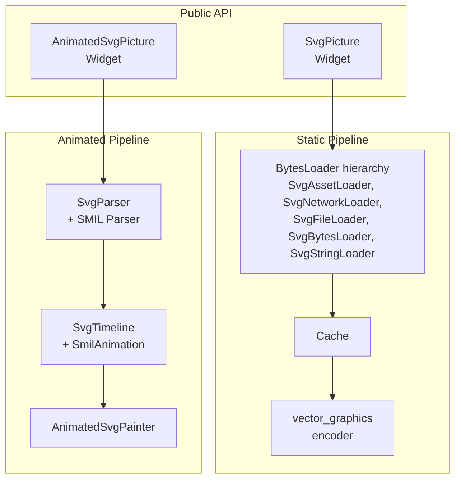
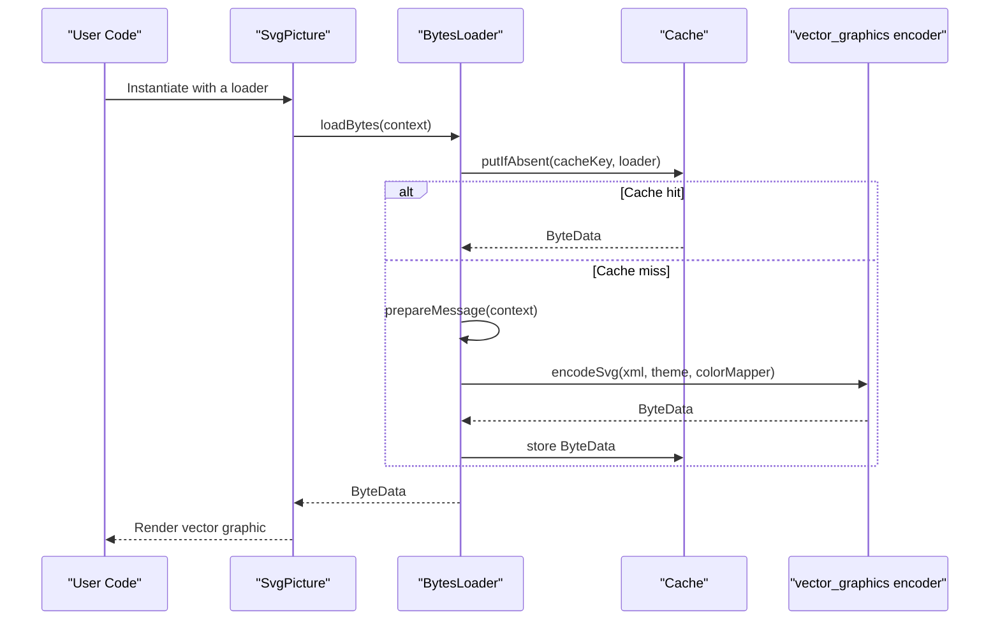
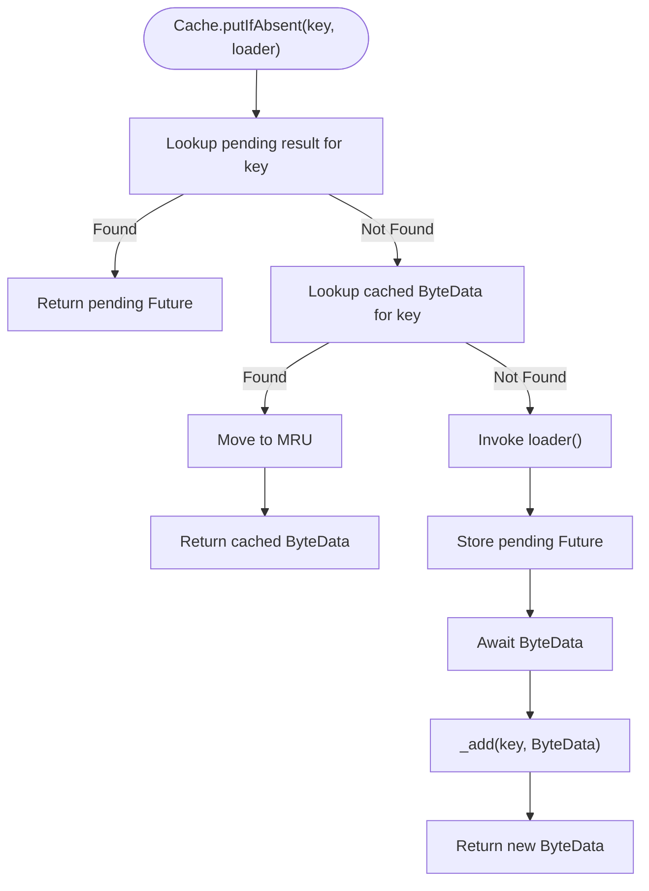
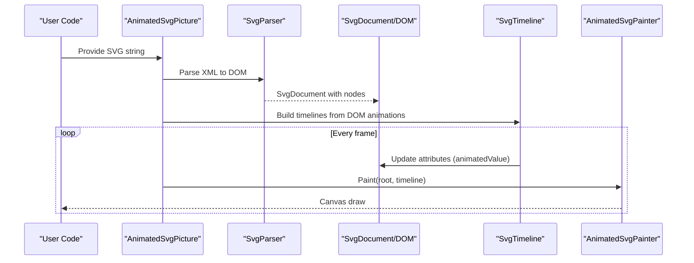
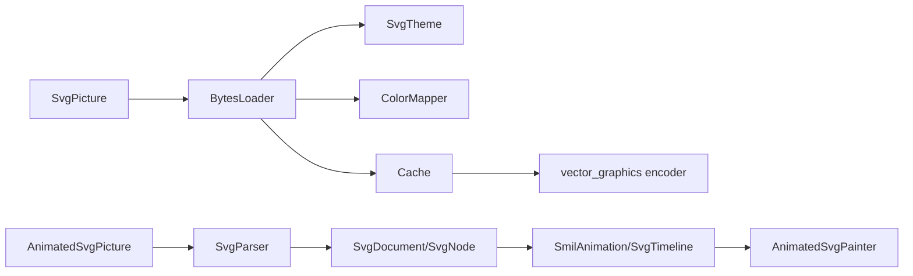

# Core Concepts

<cite>
**Referenced Files in This Document**
- [svg.dart](file://lib/svg.dart)
- [loaders.dart](file://lib/src/loaders.dart)
- [cache.dart](file://lib/src/cache.dart)
- [default_theme.dart](file://lib/src/default_theme.dart)
- [animated_svg_picture.dart](file://lib/src/animation/animated_svg_picture.dart)
- [svg_dom.dart](file://lib/src/animation/svg_dom.dart)
- [smil_animation.dart](file://lib/src/animation/smil/smil_animation.dart)
- [ARCHITECTURE.md](file://ARCHITECTURE.md)
- [ANIMATION.md](file://ANIMATION.md)
</cite>

## Table of Contents
1. [Introduction](#introduction)
2. [Project Structure](#project-structure)
3. [Core Components](#core-components)
4. [Architecture Overview](#architecture-overview)
5. [Detailed Component Analysis](#detailed-component-analysis)
6. [Dependency Analysis](#dependency-analysis)
7. [Performance Considerations](#performance-considerations)
8. [Troubleshooting Guide](#troubleshooting-guide)
9. [Conclusion](#conclusion)

## Introduction
This document explains the core concepts behind integrating SVG with Flutter, focusing on the dual-pipeline architecture, loader hierarchy, cache system, and color mapping framework. It also covers how SvgPicture widgets are created, how loading and caching work, and how color transformations are applied. The content is designed to be accessible to beginners while providing sufficient technical depth for advanced implementations.

## Project Structure
At a high level, the package exposes:
- A production-ready static vector pipeline via SvgPicture and related loaders
- An experimental animated SMIL pipeline via AnimatedSvgPicture and supporting animation infrastructure

**Diagram sources**
- [svg.dart:56-627](file://lib/svg.dart#L56-L627)
- [loaders.dart:118-194](file://lib/src/loaders.dart#L118-L194)
- [cache.dart:4-111](file://lib/src/cache.dart#L4-L111)
- [animated_svg_picture.dart:108-164](file://lib/src/animation/animated_svg_picture.dart#L108-L164)
- [ARCHITECTURE.md:6-58](file://ARCHITECTURE.md#L6-L58)

**Section sources**
- [ARCHITECTURE.md:6-58](file://ARCHITECTURE.md#L6-L58)
- [svg.dart:56-627](file://lib/svg.dart#L56-L627)

## Core Components
- SvgPicture: The primary widget for rendering SVGs. It supports multiple sources (asset, network, file, memory, string) and integrates with the static vector pipeline.
- Loader hierarchy: A family of BytesLoader subclasses that fetch and prepare SVG data, then encode it to vector_graphics binary via an isolate.
- Cache: A keyed cache that stores encoded ByteData to avoid repeated encoding and I/O.
- Theme and color mapping: SvgTheme defines currentColor and font-size used for unit calculations; ColorMapper allows runtime color substitution during parsing.
- AnimatedSvgPicture: A widget for SMIL-enabled animations, building a DOM-like structure and driving a timeline.

**Section sources**
- [svg.dart:56-627](file://lib/svg.dart#L56-L627)
- [loaders.dart:15-230](file://lib/src/loaders.dart#L15-L230)
- [cache.dart:4-111](file://lib/src/cache.dart#L4-L111)
- [default_theme.dart:5-36](file://lib/src/default_theme.dart#L5-L36)
- [animated_svg_picture.dart:108-164](file://lib/src/animation/animated_svg_picture.dart#L108-L164)

## Architecture Overview
The system uses two distinct rendering pipelines:

- Static vector pipeline (production)
  - Input: raw SVG XML
  - Processing: parsed and encoded to vector_graphics binary in an isolate
  - Output: a Picture-backed rendering path optimized for performance
  - Used by SvgPicture.asset, SvgPicture.network, and related constructors

- Animated SMIL pipeline (experimental)
  - Input: raw SVG XML
  - Processing: parsed into a DOM-like structure; SMIL animations extracted and scheduled
  - Output: CustomPainter-driven rendering with per-frame timeline updates
  - Used by AnimatedSvgPicture.string and related constructors

**Diagram sources**
- [svg.dart:542-560](file://lib/svg.dart#L542-L560)
- [loaders.dart:184-194](file://lib/src/loaders.dart#L184-L194)
- [cache.dart:65-93](file://lib/src/cache.dart#L65-L93)

**Section sources**
- [ARCHITECTURE.md:6-58](file://ARCHITECTURE.md#L6-L58)
- [svg.dart:542-560](file://lib/svg.dart#L542-L560)
- [loaders.dart:118-194](file://lib/src/loaders.dart#L118-L194)
- [cache.dart:4-111](file://lib/src/cache.dart#L4-L111)

## Detailed Component Analysis

### Static Vector Pipeline: SvgPicture and Loader Hierarchy
SvgPicture delegates rendering to a BytesLoader, which resolves the SVG data and returns ByteData. The loader uses an isolate to run vector_graphics encoding, ensuring UI thread responsiveness. The Cache stores ByteData keyed by a composite key that includes the loader, theme, and optional color mapper.

Key responsibilities:
- SvgPicture: configures rendering (size, fit, alignment, semantics, clipping, placeholders, error handling), then delegates to the vector_graphics rendering path.
- BytesLoader subclasses: implement source-specific acquisition (asset, network, file, memory, string), prepare messages, and provide the XML string to the encoder.
- Cache: manages concurrency, eviction, and LRU behavior; ensures theme-aware keys.

```mermaid
classDiagram
class SvgPicture {
+double? width
+double? height
+BoxFit fit
+AlignmentGeometry alignment
+bool matchTextDirection
+bool allowDrawingOutsideViewBox
+ColorFilter? colorFilter
+WidgetBuilder? placeholderBuilder
+SvgErrorWidgetBuilder? errorBuilder
+RenderingStrategy renderingStrategy
+build(context)
}
class BytesLoader {
<<abstract>>
+loadBytes(context) Future~ByteData~
+cacheKey(context) Object
}
class SvgLoader {
<<abstract>>
+theme : SvgTheme?
+colorMapper : ColorMapper?
+provideSvg(message) String
+prepareMessage(context) Future
+loadBytes(context)
+cacheKey(context)
}
class SvgAssetLoader
class SvgNetworkLoader
class SvgFileLoader
class SvgBytesLoader
class SvgStringLoader
class Cache {
+maximumSize : int
+putIfAbsent(key, loader) Future~ByteData~
+clear()
+evict(key) bool
+maybeEvict(key, old, new) bool
+count : int
}
SvgPicture --> BytesLoader : "uses"
BytesLoader <|-- SvgLoader
SvgLoader <|-- SvgAssetLoader
SvgLoader <|-- SvgNetworkLoader
SvgLoader <|-- SvgFileLoader
SvgLoader <|-- SvgBytesLoader
SvgLoader <|-- SvgStringLoader
SvgLoader --> Cache : "stores ByteData"
```

**Diagram sources**
- [svg.dart:56-627](file://lib/svg.dart#L56-L627)
- [loaders.dart:118-467](file://lib/src/loaders.dart#L118-L467)
- [cache.dart:4-111](file://lib/src/cache.dart#L4-L111)

**Section sources**
- [svg.dart:56-627](file://lib/svg.dart#L56-L627)
- [loaders.dart:118-194](file://lib/src/loaders.dart#L118-L194)
- [cache.dart:4-111](file://lib/src/cache.dart#L4-L111)

### Cache System Mechanics
The Cache stores encoded ByteData keyed by a composite key that includes:
- The loader’s identity (keyData)
- The effective theme (SvgTheme)
- The optional color mapper

Behavior highlights:
- Concurrency-safe: tracks pending futures to avoid duplicate work
- LRU eviction when capacity is exceeded
- Clear and targeted eviction helpers
- Immediate invalidation when themes change

**Diagram sources**
- [cache.dart:65-93](file://lib/src/cache.dart#L65-L93)

**Section sources**
- [cache.dart:4-111](file://lib/src/cache.dart#L4-L111)
- [loaders.dart:196-230](file://lib/src/loaders.dart#L196-L230)

### Color Mapping Framework
ColorMapper enables runtime color substitution during SVG parsing. The framework:
- Defines an immutable ColorMapper contract
- Wraps user-defined mappers into a delegate compatible with vector_graphics
- Includes SvgTheme to supply currentColor and font-size for unit calculations

Usage:
- Pass a ColorMapper to any of the loader constructors
- The loader forwards it to the vector_graphics encoder, which applies substitutions during encoding

**Section sources**
- [loaders.dart:76-116](file://lib/src/loaders.dart#L76-L116)
- [loaders.dart:15-74](file://lib/src/loaders.dart#L15-L74)

### Animated SMIL Pipeline: DOM, Timeline, and Rendering
AnimatedSvgPicture builds a DOM-like structure and drives SMIL animations:
- DOM model: SvgDocument, SvgNode, AnimatableSvgAttribute capture base and animated values
- Timeline: SmilAnimation instances track durations, repeats, and interpolation modes
- Rendering: AnimatedSvgPainter traverses the DOM and paints with effective values

**Diagram sources**
- [animated_svg_picture.dart:166-295](file://lib/src/animation/animated_svg_picture.dart#L166-L295)
- [svg_dom.dart:123-263](file://lib/src/animation/svg_dom.dart#L123-L263)
- [smil_animation.dart:80-453](file://lib/src/animation/smil/smil_animation.dart#L80-L453)

**Section sources**
- [animated_svg_picture.dart:108-295](file://lib/src/animation/animated_svg_picture.dart#L108-L295)
- [svg_dom.dart:123-318](file://lib/src/animation/svg_dom.dart#L123-L318)
- [smil_animation.dart:80-453](file://lib/src/animation/smil/smil_animation.dart#L80-L453)
- [ANIMATION.md:1-229](file://ANIMATION.md#L1-L229)

### Coordinate Systems, viewBox, and Flutter Integration
- SVG coordinate system: The viewBox defines the normalized coordinate space of the SVG. When rendering, the widget can scale and align the viewBox to the layout constraints using BoxFit and Alignment.
- Flutter integration: SvgPicture integrates with Flutter’s layout and painting pipeline. It can optionally clip to the viewBox bounds or allow drawing outside when configured.
- Semantics: The widget supports accessibility labels and exclusion flags to integrate with screen readers.

Practical tips:
- Specify width and height or tight layout constraints to avoid layout shifts during loading.
- Use allowDrawingOutsideViewBox carefully; it can increase memory usage and undefined drawing beyond intended bounds.
- For RTL layouts, matchTextDirection flips the picture horizontally in right-to-left contexts.

**Section sources**
- [svg.dart:56-627](file://lib/svg.dart#L56-L627)

## Dependency Analysis
Relationships among core components:

**Diagram sources**
- [svg.dart:56-627](file://lib/svg.dart#L56-L627)
- [loaders.dart:15-230](file://lib/src/loaders.dart#L15-L230)
- [cache.dart:4-111](file://lib/src/cache.dart#L4-L111)
- [animated_svg_picture.dart:108-164](file://lib/src/animation/animated_svg_picture.dart#L108-L164)
- [svg_dom.dart:123-318](file://lib/src/animation/svg_dom.dart#L123-L318)
- [smil_animation.dart:80-453](file://lib/src/animation/smil/smil_animation.dart#L80-L453)

**Section sources**
- [svg.dart:56-627](file://lib/svg.dart#L56-L627)
- [loaders.dart:15-230](file://lib/src/loaders.dart#L15-L230)
- [cache.dart:4-111](file://lib/src/cache.dart#L4-L111)
- [animated_svg_picture.dart:108-164](file://lib/src/animation/animated_svg_picture.dart#L108-L164)
- [svg_dom.dart:123-318](file://lib/src/animation/svg_dom.dart#L123-L318)
- [smil_animation.dart:80-453](file://lib/src/animation/smil/smil_animation.dart#L80-L453)

## Performance Considerations
- Static pipeline advantages:
  - Binary vector_graphics format yields fast rendering
  - Discards DOM structure and animations for maximum throughput
- Animated pipeline trade-offs:
  - Full DOM and SMIL support enable rich animations but incur parsing and per-frame computation costs
- Optimization strategies:
  - Cache reuse: Composite keys include theme and color mapper to prevent incorrect sharing
  - LRU eviction: Tune maximumSize to balance memory and hit rate
  - Static subtree caching: Nodes without animations can cache Picture objects
  - Dirty tracking: Only re-render subtrees whose attributes changed

**Section sources**
- [cache.dart:4-111](file://lib/src/cache.dart#L4-L111)
- [ARCHITECTURE.md:174-193](file://ARCHITECTURE.md#L174-L193)

## Troubleshooting Guide
Common issues and remedies:
- Layout shifts during loading:
  - Provide explicit width and height or rely on tight layout constraints
- Excessive memory usage:
  - Avoid allowDrawingOutsideViewBox unless necessary
  - Reduce Cache maximumSize if memory pressure occurs
- Incorrect colors or inherited color behavior:
  - Configure SvgTheme.currentColor and font-size appropriately
  - Use ColorMapper to override specific colors during parsing
- Animation not playing:
  - Verify autoPlay and playbackRate settings
  - Ensure the SVG contains SMIL elements (<animate>, <animateTransform>, <animateMotion>)
- Network failures:
  - Use errorBuilder to present fallback UI
  - Confirm headers and URL correctness

**Section sources**
- [svg.dart:56-627](file://lib/svg.dart#L56-L627)
- [cache.dart:4-111](file://lib/src/cache.dart#L4-L111)
- [animated_svg_picture.dart:108-295](file://lib/src/animation/animated_svg_picture.dart#L108-L295)
- [ANIMATION.md:1-229](file://ANIMATION.md#L1-L229)

## Conclusion
The dual-pipeline architecture balances performance and expressiveness: the static vector pipeline accelerates production rendering, while the animated SMIL pipeline preserves DOM and enables rich animations. Understanding the loader hierarchy, cache mechanics, and color mapping framework helps you choose the right pipeline for your needs and optimize performance and correctness.