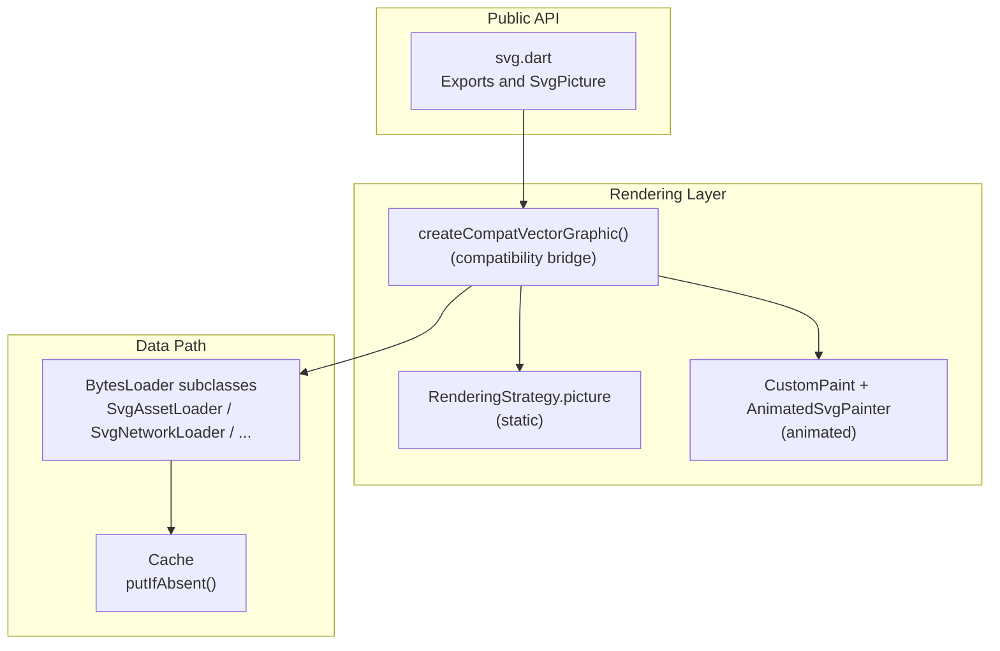
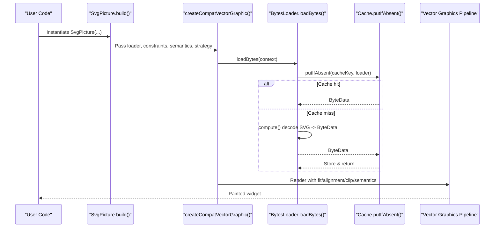
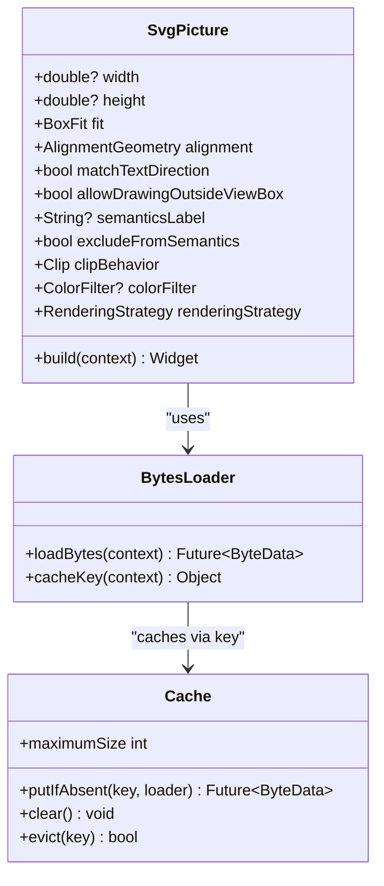
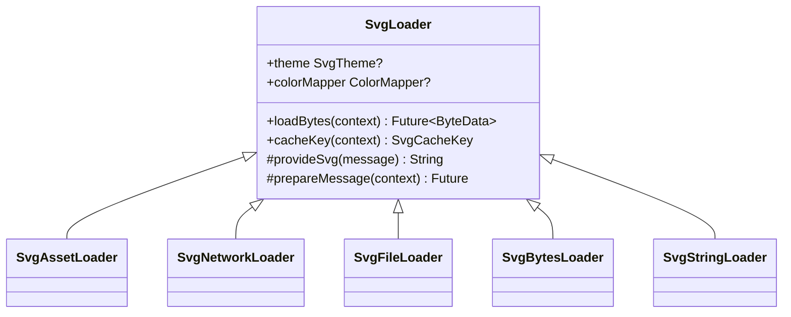
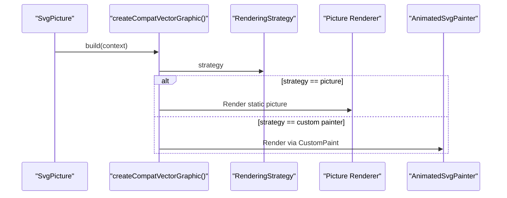
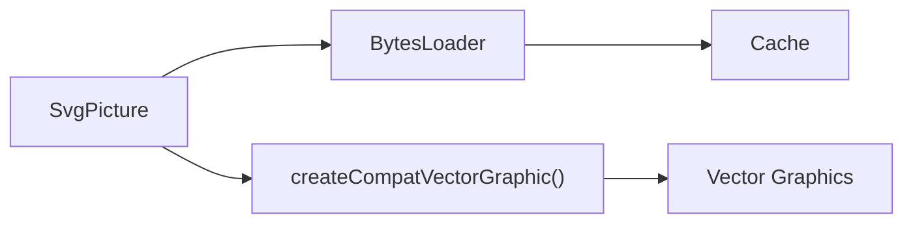

# Flutter Integration

<cite>
**Referenced Files in This Document**
- [svg.dart](file://lib/svg.dart)
- [flutter_svg.dart](file://lib/flutter_svg.dart)
- [loaders.dart](file://lib/src/loaders.dart)
- [cache.dart](file://lib/src/cache.dart)
- [file.dart](file://lib/src/utilities/file.dart)
- [animated_svg_picture.dart](file://lib/src/animation/animated_svg_picture.dart)
- [animation.dart](file://lib/src/animation.dart)
- [main.dart](file://example/lib/main.dart)
</cite>

## Table of Contents
1. [Introduction](#introduction)
2. [Project Structure](#project-structure)
3. [Core Components](#core-components)
4. [Architecture Overview](#architecture-overview)
5. [Detailed Component Analysis](#detailed-component-analysis)
6. [Dependency Analysis](#dependency-analysis)
7. [Performance Considerations](#performance-considerations)
8. [Troubleshooting Guide](#troubleshooting-guide)
9. [Conclusion](#conclusion)
10. [Appendices](#appendices)

## Introduction
This document explains how the SvgPicture widget integrates with Flutter’s widget system, rendering pipeline, and lifecycle management. It covers how constraints are handled during layout, how SvgPicture participates in the build process, and the dual rendering strategies supported by the library. It also documents performance trade-offs, accessibility via semantics, and practical patterns for integrating SVGs in lists, grids, and responsive layouts.

## Project Structure
The library exposes a concise public API centered around SvgPicture and related utilities. SvgPicture delegates rendering to a compatibility layer that supports two strategies:
- Picture-based rendering for static SVGs
- CustomPainter-based rendering for animated SVGs

Key modules:
- Public API surface: svg.dart
- Loader implementations: src/loaders.dart
- Caching: src/cache.dart
- Utilities: src/utilities/file.dart
- Animation support: src/animation/animated_svg_picture.dart and src/animation.dart

**Diagram sources**
- [svg.dart:542-560](file://lib/svg.dart#L542-L560)
- [loaders.dart:118-194](file://lib/src/loaders.dart#L118-L194)
- [cache.dart:65-93](file://lib/src/cache.dart#L65-L93)

**Section sources**
- [svg.dart:1-627](file://lib/svg.dart#L1-L627)
- [flutter_svg.dart:1-2](file://lib/flutter_svg.dart#L1-L2)

## Core Components
- SvgPicture: A StatelessWidget that encapsulates SVG loading, decoding, caching, and rendering. It accepts multiple constructors for assets, network, files, memory, and strings, and forwards parameters like fit, alignment, semantics, clipping, and color filtering to the rendering layer.
- BytesLoader hierarchy: Encapsulates loading and decoding SVG data from various sources into a vector-graphics binary format in an isolates, enabling efficient caching and reuse.
- Cache: LRU-style cache keyed by loader identity, theme, and optional color mapper to avoid repeated decoding work.
- Rendering strategies: SvgPicture supports a strategy parameter that selects between picture-based rendering (for static SVGs) and a custom painter path (for animated SVGs).

Key responsibilities:
- Constraint handling: SvgPicture honors explicit width/height or tight layout constraints to prevent layout shifts during load.
- Semantics: SvgPicture exposes semanticsLabel and excludeFromSemantics to integrate with Flutter’s semantics tree.
- Accessibility: Screen readers can read the semanticsLabel when provided.
- Text direction: matchTextDirection controls horizontal mirroring in RTL contexts.

**Section sources**
- [svg.dart:56-627](file://lib/svg.dart#L56-L627)
- [loaders.dart:118-194](file://lib/src/loaders.dart#L118-L194)
- [cache.dart:1-111](file://lib/src/cache.dart#L1-L111)

## Architecture Overview
SvgPicture delegates to a compatibility bridge that chooses the appropriate rendering strategy based on the provided strategy parameter. The bridge coordinates:
- BytesLoader to fetch and decode SVG data
- Cache to reuse decoded data
- Semantics and clipping options
- Fit and alignment during painting

**Diagram sources**
- [svg.dart:542-560](file://lib/svg.dart#L542-L560)
- [loaders.dart:185-194](file://lib/src/loaders.dart#L185-L194)
- [cache.dart:65-93](file://lib/src/cache.dart#L65-L93)

## Detailed Component Analysis

### SvgPicture: Widget integration and lifecycle
SvgPicture is a StatelessWidget whose build method delegates to a compatibility bridge. It:
- Accepts multiple constructors for different data sources (asset, network, file, memory, string)
- Exposes parameters for fit, alignment, semantics, clipping, placeholder/error builders, color filtering, and rendering strategy
- Honors explicit width/height or tight constraints to avoid layout shifts
- Supports RTL mirroring via matchTextDirection

**Diagram sources**
- [svg.dart:56-627](file://lib/svg.dart#L56-L627)
- [loaders.dart:118-194](file://lib/src/loaders.dart#L118-L194)
- [cache.dart:1-111](file://lib/src/cache.dart#L1-L111)

**Section sources**
- [svg.dart:56-627](file://lib/svg.dart#L56-L627)

### BytesLoader hierarchy and caching
The library defines a generic SvgLoader base class that:
- Resolves an SvgTheme from constructor/theme/context/default theme
- Computes a cache key including theme and optional color mapper
- Performs decoding in a background compute task and returns a ByteData buffer
- Uses the shared Cache to avoid redundant work

**Diagram sources**
- [loaders.dart:118-194](file://lib/src/loaders.dart#L118-L194)
- [loaders.dart:234-466](file://lib/src/loaders.dart#L234-L466)

**Section sources**
- [loaders.dart:118-194](file://lib/src/loaders.dart#L118-L194)
- [cache.dart:65-93](file://lib/src/cache.dart#L65-L93)

### Rendering strategies: picture vs custom painter
SvgPicture supports a renderingStrategy parameter. The compatibility bridge routes to:
- Picture-based rendering for static SVGs (strategy defaults to picture)
- CustomPaint + AnimatedSvgPainter for animated SVGs

AnimatedSvgPicture demonstrates the custom painter approach, including:
- Parsing SVG DOM and timelines
- Managing AnimationController lifecycle
- Handling pointer and hover events
- Rendering via AnimatedSvgPainter

**Diagram sources**
- [svg.dart:534-560](file://lib/svg.dart#L534-L560)
- [animated_svg_picture.dart:108-295](file://lib/src/animation/animated_svg_picture.dart#L108-L295)

**Section sources**
- [svg.dart:534-560](file://lib/svg.dart#L534-L560)
- [animated_svg_picture.dart:108-295](file://lib/src/animation/animated_svg_picture.dart#L108-L295)

### Layout, constraints, and build participation
- SvgPicture participates in Flutter’s layout by honoring explicit width/height or tight constraints to avoid layout shifts during load.
- The compatibility bridge receives constraints and applies fit/alignment during rendering.
- Placeholder and error builders allow graceful handling of slow loads.

Practical guidance:
- Always specify width/height or wrap in a constrained container to prevent layout thrashing.
- Use placeholderBuilder to improve perceived performance for network assets.

**Section sources**
- [svg.dart:56-102](file://lib/svg.dart#L56-L102)
- [svg.dart:542-560](file://lib/svg.dart#L542-L560)

### Semantics and accessibility
- SvgPicture exposes semanticsLabel and excludeFromSemantics to integrate with Flutter’s semantics tree.
- Screen readers will announce the semanticsLabel when provided and the widget is not excluded from semantics.
- For animated SVGs, ensure semantics are meaningful and reflect the purpose of the animation.

**Section sources**
- [svg.dart:508-518](file://lib/svg.dart#L508-L518)
- [svg.dart:542-560](file://lib/svg.dart#L542-L560)

### State management integration and rebuild efficiency
- SvgPicture is a StatelessWidget; changes to the widget trigger rebuilds. Keep the widget immutable and pass only necessary parameters.
- Use keys to force rebuilds when underlying data changes (e.g., theme, color mapper).
- Leverage the Cache to minimize rebuild costs when the same asset/theme is reused.

Example pattern:
- Wrap SvgPicture in a stateful parent when toggling theme or color mapper; pass a key to force replacement when parameters change.

**Section sources**
- [svg.dart:56-627](file://lib/svg.dart#L56-L627)
- [cache.dart:65-93](file://lib/src/cache.dart#L65-L93)

### Integration patterns: lists, grids, and responsive layouts
Common patterns:
- Lists and grids: Use fixed width/height or shrink-wrapping containers to avoid layout instability. Consider placeholders for network-backed SVGs.
- Responsive layouts: Prefer aspect-ratio-preserving fit modes (e.g., BoxFit.contain) and wrap in Flexible/Expanded as needed.
- RTL-aware icons: Enable matchTextDirection for icons that should mirror in RTL contexts.

**Section sources**
- [svg.dart:56-102](file://lib/svg.dart#L56-L102)
- [svg.dart:542-560](file://lib/svg.dart#L542-L560)

## Dependency Analysis
SvgPicture depends on:
- BytesLoader implementations for data acquisition
- Cache for decoding reuse
- Compatibility bridge for rendering strategy selection
- Vector graphics pipeline for final rendering

**Diagram sources**
- [svg.dart:542-560](file://lib/svg.dart#L542-L560)
- [loaders.dart:118-194](file://lib/src/loaders.dart#L118-L194)
- [cache.dart:1-111](file://lib/src/cache.dart#L1-L111)

**Section sources**
- [svg.dart:542-560](file://lib/svg.dart#L542-L560)
- [loaders.dart:118-194](file://lib/src/loaders.dart#L118-L194)
- [cache.dart:1-111](file://lib/src/cache.dart#L1-L111)

## Performance Considerations
- Static vs animated trade-offs:
  - picture strategy: optimized for static SVGs, leverages vector graphics pipeline
  - custom painter strategy: flexible for animations but incurs additional overhead
- Caching:
  - Cache.maximumSize controls LRU eviction; tune based on memory budget and reuse patterns
  - Cache.evict and Cache.clear allow manual invalidation when themes or color mappers change
- Background decoding:
  - BytesLoader uses compute to decode SVGs off the UI thread; reduces jank
- Constraints:
  - Specify width/height or tight constraints to avoid relayout thrash during load

Recommendations:
- Prefer picture strategy for static assets
- Use custom painter only when animations are required
- Monitor memory usage and adjust Cache.maximumSize accordingly

**Section sources**
- [cache.dart:9-44](file://lib/src/cache.dart#L9-L44)
- [loaders.dart:156-187](file://lib/src/loaders.dart#L156-L187)
- [svg.dart:534-560](file://lib/svg.dart#L534-L560)

## Troubleshooting Guide
- Layout shifts during load:
  - Ensure width/height are specified or the parent provides tight constraints
- Poor performance with many animated SVGs:
  - Switch to picture strategy for static assets; limit concurrent animated instances
- Incorrect colors or theme:
  - Verify SvgTheme and color mapper settings; invalidate cache if needed
- Semantics not announced:
  - Confirm semanticsLabel is set and excludeFromSemantics is false
- Network SVGs not caching:
  - Network assets are cached by default; check headers and loader configuration

**Section sources**
- [svg.dart:56-102](file://lib/svg.dart#L56-L102)
- [cache.dart:42-58](file://lib/src/cache.dart#L42-L58)
- [loaders.dart:417-466](file://lib/src/loaders.dart#L417-L466)

## Conclusion
SvgPicture integrates tightly with Flutter’s widget system, leveraging constraints, semantics, and caching to deliver robust SVG rendering. By choosing the appropriate rendering strategy—picture for static assets and custom painter for animations—you can balance flexibility and performance. Proper constraint handling, thoughtful caching, and accessibility configuration ensure smooth user experiences across lists, grids, and responsive layouts.

## Appendices

### Example app integration
The example app demonstrates global theming and state management patterns that can guide integration of SVGs in real applications.

**Section sources**
- [main.dart:1-56](file://example/lib/main.dart#L1-L56)