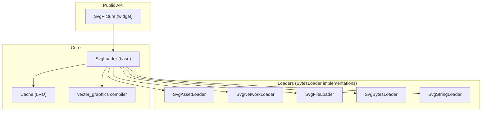
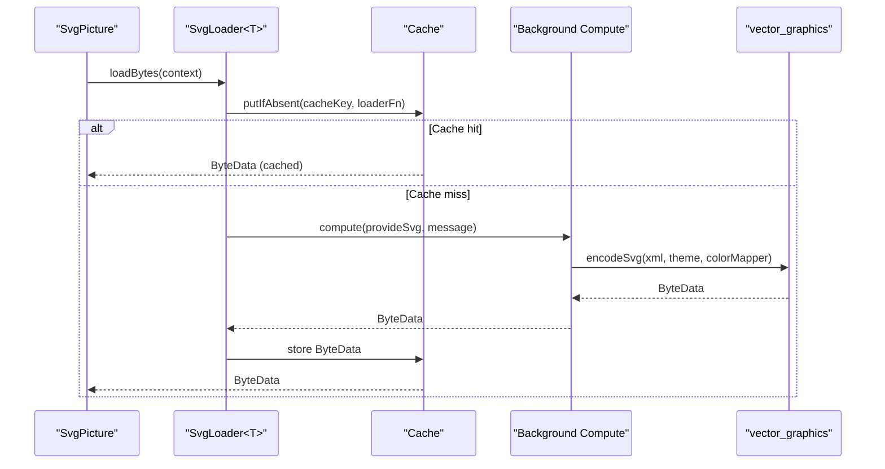
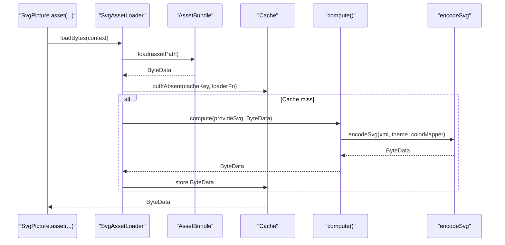
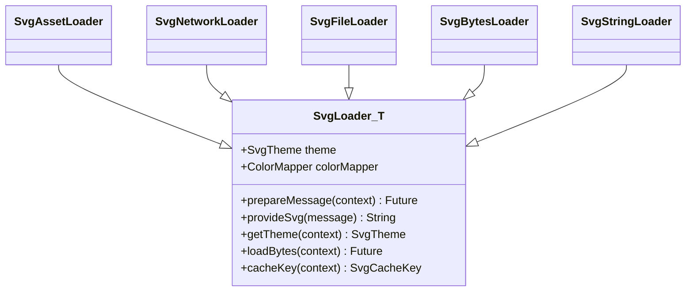
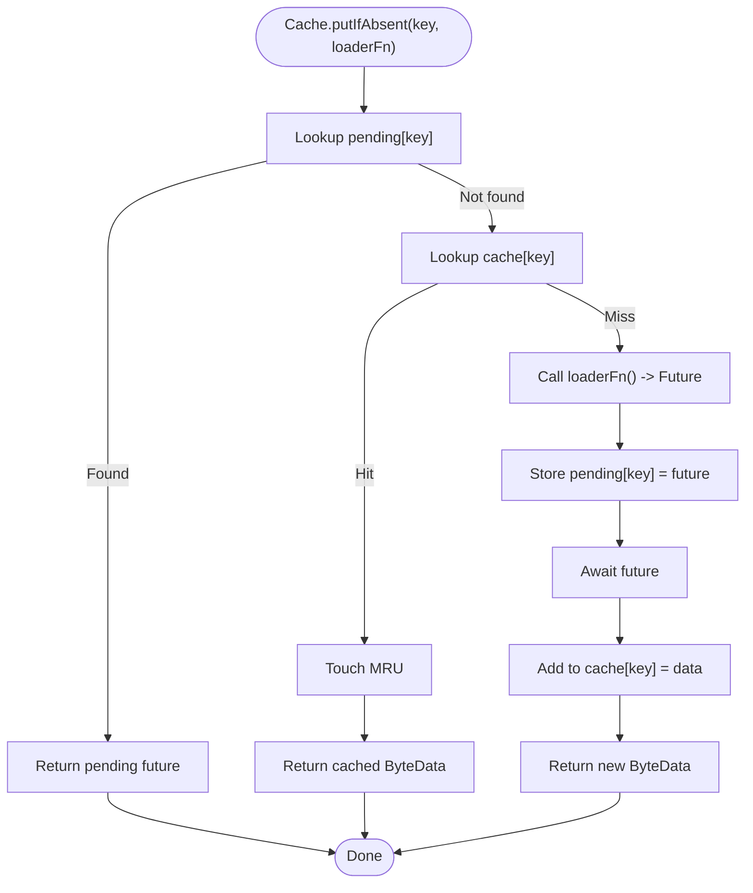
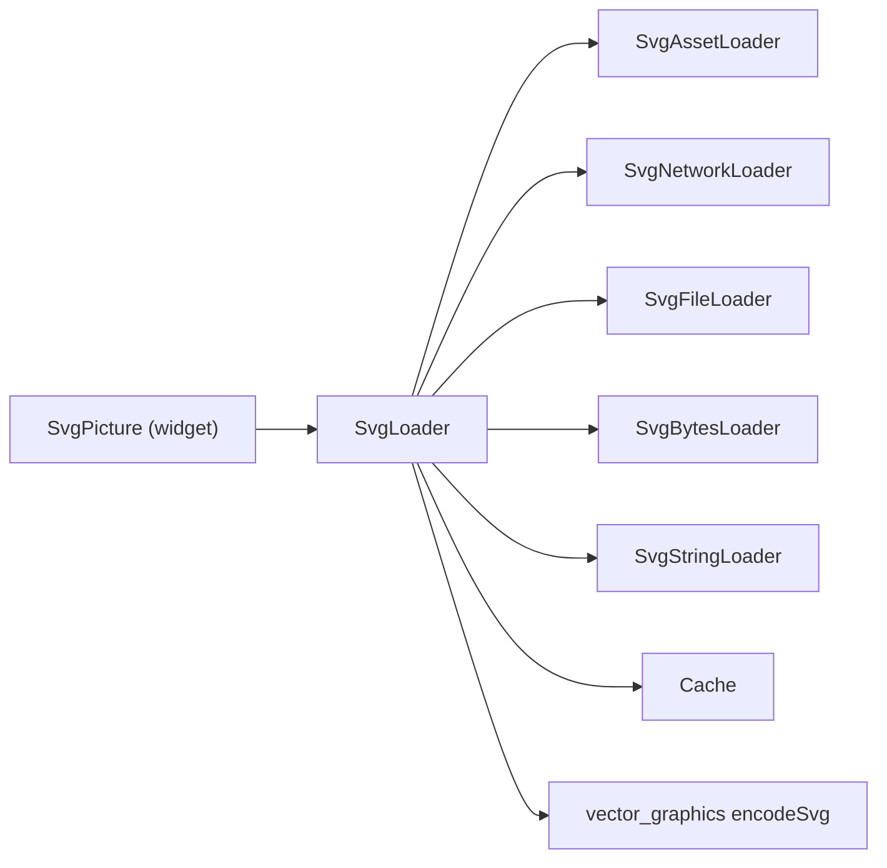

# Loading Strategies

<cite>
**Referenced Files in This Document**
- [svg.dart](file://lib/svg.dart)
- [loaders.dart](file://lib/src/loaders.dart)
- [cache.dart](file://lib/src/cache.dart)
- [file.dart](file://lib/src/utilities/file.dart)
- [_file_io.dart](file://lib/src/utilities/_file_io.dart)
- [_file_none.dart](file://lib/src/utilities/_file_none.dart)
- [home_page.dart](file://example/lib/pages/home_page.dart)
- [readme_excerpts.dart](file://example/lib/readme_excerpts.dart)
- [widget_svg_test.dart](file://test/widget_svg_test.dart)
- [loaders_test.dart](file://test/loaders_test.dart)
</cite>

## Table of Contents
1. [Introduction](#introduction)
2. [Project Structure](#project-structure)
3. [Core Components](#core-components)
4. [Architecture Overview](#architecture-overview)
5. [Detailed Component Analysis](#detailed-component-analysis)
6. [Dependency Analysis](#dependency-analysis)
7. [Performance Considerations](#performance-considerations)
8. [Troubleshooting Guide](#troubleshooting-guide)
9. [Conclusion](#conclusion)
10. [Appendices](#appendices)

## Introduction
This document explains the loading strategies and factory pattern implementation used by the SvgPicture widget to support multiple sources of SVG content. It covers five distinct loading strategies:
- Asset loading for bundled resources
- Network loading for remote SVG files
- File loading for local storage access
- Memory loading for pre-loaded byte data
- String loading for inline SVG content

It documents the underlying loader architecture, the cache system integration, threading model for asynchronous operations, error handling, security considerations, and performance and memory management best practices.

## Project Structure
The loading system centers around the SvgPicture widget and a family of loader classes that implement BytesLoader. Each loader encapsulates a specific acquisition strategy and defers the heavy work of parsing and encoding to a background isolate via vector_graphics compilation.

**Diagram sources**
- [svg.dart:57-447](file://lib/svg.dart#L57-L447)
- [loaders.dart:121-194](file://lib/src/loaders.dart#L121-L194)
- [cache.dart:5-110](file://lib/src/cache.dart#L5-L110)

**Section sources**
- [svg.dart:57-447](file://lib/svg.dart#L57-L447)
- [loaders.dart:121-194](file://lib/src/loaders.dart#L121-L194)

## Core Components
- SvgPicture: The public widget that delegates rendering to a BytesLoader. It exposes convenience constructors for each loading strategy and forwards placeholder/error builders and rendering strategy to the underlying rendering pipeline.
- SvgLoader<T>: An abstract base class extending BytesLoader that encapsulates theme/color mapping, background computation, and cache integration. It defines the template method provideSvg and integrates with the Cache via loadBytes and cacheKey.
- Loader implementations:
  - SvgAssetLoader: Loads from AssetBundle, resolves bundle per context, decodes UTF-8 bytes, and participates in cache with a composite key including bundle identity.
  - SvgNetworkLoader: Fetches via http.Client, decodes UTF-8 bytes, and caches the compiled vector_graphics binary.
  - SvgFileLoader: Reads File bytes synchronously and decodes UTF-8.
  - SvgBytesLoader: Accepts pre-decoded Uint8List and decodes UTF-8.
  - SvgStringLoader: Accepts inline String and passes it directly.
- Cache: A thread-safe LRU cache keyed by SvgCacheKey, which includes theme and optional color mapper to prevent incorrect sharing across different visual configurations.

**Section sources**
- [svg.dart:57-447](file://lib/svg.dart#L57-L447)
- [loaders.dart:121-194](file://lib/src/loaders.dart#L121-L194)
- [loaders.dart:234-255](file://lib/src/loaders.dart#L234-L255)
- [loaders.dart:260-280](file://lib/src/loaders.dart#L260-L280)
- [loaders.dart:284-307](file://lib/src/loaders.dart#L284-L307)
- [loaders.dart:343-413](file://lib/src/loaders.dart#L343-L413)
- [loaders.dart:417-466](file://lib/src/loaders.dart#L417-L466)
- [cache.dart:5-110](file://lib/src/cache.dart#L5-L110)

## Architecture Overview
The loader architecture follows a factory-like pattern via SvgPicture’s constructors, each instantiating a specific loader. Internally, SvgLoader orchestrates:
- Theme resolution (SvgTheme) with fallbacks
- Optional color mapping (ColorMapper)
- Background computation using compute() to encode SVG to vector_graphics binary
- Cache lookup/update via Cache.putIfAbsent keyed by SvgCacheKey

**Diagram sources**
- [svg.dart:543-560](file://lib/svg.dart#L543-L560)
- [loaders.dart:156-187](file://lib/src/loaders.dart#L156-L187)
- [cache.dart:65-93](file://lib/src/cache.dart#L65-L93)

## Detailed Component Analysis

### Factory Pattern and SvgPicture Constructors
SvgPicture exposes five constructors that act as factories for different BytesLoader implementations:
- asset(String assetName, {AssetBundle?, String? package})
- network(String url, {Map<String, String>? headers, http.Client? httpClient})
- file(File file)
- memory(Uint8List bytes)
- string(String string)

Each constructor initializes bytesLoader with the appropriate Svg*Loader subclass and applies color filtering if provided.

Usage examples appear in:
- Inline string usage in the example app
- Color mapping usage in the example app

**Section sources**
- [svg.dart:180-211](file://lib/svg.dart#L180-L211)
- [svg.dart:245-276](file://lib/svg.dart#L245-L276)
- [svg.dart:308-334](file://lib/svg.dart#L308-L334)
- [svg.dart:364-391](file://lib/svg.dart#L364-L391)
- [svg.dart:420-447](file://lib/svg.dart#L420-L447)
- [home_page.dart:55-59](file://example/lib/pages/home_page.dart#L55-L59)
- [readme_excerpts.dart:127-141](file://example/lib/readme_excerpts.dart#L127-L141)

### Asset Loading Strategy (SvgAssetLoader)
- Acquisition: Resolves AssetBundle (default or provided), loads ByteData for the asset path (supports package:// scheme).
- Decoding: Converts ByteData to UTF-8 string.
- Threading: Background compute for encoding to vector_graphics binary.
- Caching: Uses SvgCacheKey with a composite key including asset name, package, and resolved AssetBundle to ensure correctness across bundles.

**Diagram sources**
- [loaders.dart:343-413](file://lib/src/loaders.dart#L343-L413)
- [loaders.dart:372-381](file://lib/src/loaders.dart#L372-L381)
- [loaders.dart:156-187](file://lib/src/loaders.dart#L156-L187)

**Section sources**
- [loaders.dart:343-413](file://lib/src/loaders.dart#L343-L413)
- [loaders_test.dart:55-91](file://test/loaders_test.dart#L55-L91)

### Network Loading Strategy (SvgNetworkLoader)
- Acquisition: Uses http.Client to GET the URL with optional headers; closes client if created internally.
- Decoding: Converts response bytes to UTF-8 string.
- Threading: Background compute for encoding to vector_graphics binary.
- Caching: Stores compiled ByteData in Cache; all network images are cached regardless of HTTP headers.

Security considerations:
- Validate URLs and restrict domains where applicable.
- Prefer HTTPS endpoints.
- Consider rate limiting and timeouts via a shared http.Client instance.

**Section sources**
- [loaders.dart:417-466](file://lib/src/loaders.dart#L417-L466)
- [loaders_test.dart:93-124](file://test/loaders_test.dart#L93-L124)

### File Loading Strategy (SvgFileLoader)
- Acquisition: Reads File bytes synchronously.
- Decoding: Converts bytes to UTF-8 string.
- Threading: Background compute for encoding to vector_graphics binary.
- Permissions (mobile): Requires appropriate platform permissions for external storage access on Android.

**Section sources**
- [loaders.dart:284-307](file://lib/src/loaders.dart#L284-L307)
- [file.dart:1-2](file://lib/src/utilities/file.dart#L1-L2)
- [file.dart:1-2](file://lib/src/utilities/_file_io.dart#L1-L2)
- [file.dart:1-17](file://lib/src/utilities/_file_none.dart#L1-L17)

### Memory Loading Strategy (SvgBytesLoader)
- Acquisition: Accepts pre-fetched Uint8List.
- Decoding: Decodes bytes to UTF-8 string.
- Threading: Background compute for encoding to vector_graphics binary.
- Use cases: When bytes are already in memory from other sources (e.g., after network fetch).

**Section sources**
- [loaders.dart:260-280](file://lib/src/loaders.dart#L260-L280)

### String Loading Strategy (SvgStringLoader)
- Acquisition: Accepts inline SVG string.
- Decoding: Passes string directly to encoder.
- Threading: Background compute for encoding to vector_graphics binary.
- Use cases: Inline SVG content in code or small embedded assets.

**Section sources**
- [loaders.dart:234-255](file://lib/src/loaders.dart#L234-L255)

### Loader Hierarchy and Template Methods
SvgLoader<T> defines the common flow:
- prepareMessage(context): Asks loaders to obtain raw bytes or messages needed for provideSvg.
- provideSvg(message): Produces the XML string to encode.
- getTheme(context): Resolves SvgTheme with fallbacks.
- loadBytes(context): Integrates with Cache and compute.
- cacheKey(context): Builds SvgCacheKey including theme and optional color mapper.

**Diagram sources**
- [loaders.dart:121-194](file://lib/src/loaders.dart#L121-L194)
- [loaders.dart:234-255](file://lib/src/loaders.dart#L234-L255)
- [loaders.dart:260-280](file://lib/src/loaders.dart#L260-L280)
- [loaders.dart:284-307](file://lib/src/loaders.dart#L284-L307)
- [loaders.dart:343-413](file://lib/src/loaders.dart#L343-L413)
- [loaders.dart:417-466](file://lib/src/loaders.dart#L417-L466)

**Section sources**
- [loaders.dart:121-194](file://lib/src/loaders.dart#L121-L194)

### Cache System Integration
- Keying: SvgCacheKey includes theme and optional color mapper to ensure separate cache entries for different visual configurations.
- LRU eviction: Cache maintains a maximum size and evicts least-recently-used entries when capacity is exceeded.
- Concurrency: Pending futures are tracked to avoid duplicate work; once computed, results are stored and reused.

**Diagram sources**
- [cache.dart:65-93](file://lib/src/cache.dart#L65-L93)

**Section sources**
- [cache.dart:5-110](file://lib/src/cache.dart#L5-L110)
- [loaders.dart:190-193](file://lib/src/loaders.dart#L190-L193)
- [loaders_test.dart:16-36](file://test/loaders_test.dart#L16-L36)

### Threading Model and Asynchronous Operations
- Background computation: All loaders delegate encoding to a background isolate via compute, keeping the UI responsive.
- Error handling: SvgPicture supports errorBuilder to render a custom widget when decoding fails.
- Placeholder support: placeholderBuilder allows showing a temporary widget while decoding or fetching.

**Section sources**
- [loaders.dart:156-187](file://lib/src/loaders.dart#L156-L187)
- [widget_svg_test.dart:985-1074](file://test/widget_svg_test.dart#L985-L1074)
- [svg.dart:543-560](file://lib/svg.dart#L543-L560)

### Security Considerations
- Network loading: Validate and sanitize URLs, prefer HTTPS, and consider restricting domains. Use a shared http.Client to manage timeouts and keep-alive behavior.
- File system access: On Android, ensure READ_EXTERNAL_STORAGE permission is declared and granted. On web, File is a facade; avoid relying on native file semantics.
- Content integrity: Consider signature verification or content-type checks for network sources.

**Section sources**
- [svg.dart:244-244](file://lib/svg.dart#L244-L244)
- [loaders.dart:417-466](file://lib/src/loaders.dart#L417-L466)
- [file.dart:1-2](file://lib/src/utilities/file.dart#L1-L2)
- [file.dart:1-2](file://lib/src/utilities/_file_io.dart#L1-L2)
- [file.dart:1-17](file://lib/src/utilities/_file_none.dart#L1-L17)

### Error Handling Approaches
- Use errorBuilder to display a user-friendly message or retry mechanism when decoding fails.
- For network errors, propagate exceptions from http.Client and handle them in errorBuilder.
- For file errors, catch exceptions from file reads and present feedback to the user.

**Section sources**
- [widget_svg_test.dart:985-1074](file://test/widget_svg_test.dart#L985-L1074)
- [svg.dart:528-529](file://lib/svg.dart#L528-L529)

### Performance and Memory Management
- Prefer asset loading for bundled resources to leverage Flutter’s optimized asset pipeline.
- Use memory loading (Uint8List) when bytes are already in memory to avoid redundant IO.
- Enable placeholders for network-heavy assets to improve perceived performance.
- Tune Cache.maximumSize to balance memory usage and hit rate.
- Avoid allowDrawingOutsideViewBox unless necessary to prevent overdraw and memory overhead.
- Use ColorMapper and SvgTheme judiciously; they participate in cache keys and can increase cache fragmentation.

**Section sources**
- [cache.dart:9-36](file://lib/src/cache.dart#L9-L36)
- [svg.dart:504-506](file://lib/svg.dart#L504-L506)
- [loaders.dart:190-193](file://lib/src/loaders.dart#L190-L193)

## Dependency Analysis
The following diagram shows the primary dependencies among components involved in loading and rendering:

**Diagram sources**
- [svg.dart:57-447](file://lib/svg.dart#L57-L447)
- [loaders.dart:121-194](file://lib/src/loaders.dart#L121-L194)
- [cache.dart:5-110](file://lib/src/cache.dart#L5-L110)

**Section sources**
- [svg.dart:57-447](file://lib/svg.dart#L57-L447)
- [loaders.dart:121-194](file://lib/src/loaders.dart#L121-L194)
- [cache.dart:5-110](file://lib/src/cache.dart#L5-L110)

## Performance Considerations
- Background encoding: All loaders use compute to offload work; ensure not to block the UI thread.
- Cache effectiveness: Tune maximumSize and reuse loaders with identical parameters to maximize hits.
- Network efficiency: Reuse http.Client instances, set reasonable timeouts, and consider compression-aware clients.
- File IO: On mobile, minimize repeated file reads; cache decoded ByteData when feasible.
- Rendering strategy: Choose RenderingStrategy appropriately; picture strategy balances flexibility and performance.

[No sources needed since this section provides general guidance]

## Troubleshooting Guide
Common issues and remedies:
- Empty or missing cache: Set Cache.maximumSize to a positive value and clear when necessary.
- Incorrect asset selection across packages: Ensure package name and asset path are correct; tests demonstrate package:// resolution.
- Network client lifecycle: Internal clients are closed automatically; pass a shared client to avoid closing externally managed clients.
- File access failures: Verify platform permissions and file existence; handle exceptions in errorBuilder.
- Theme or color mapper changes: Different SvgTheme or ColorMapper values result in separate cache entries; expect cache misses when changing these parameters.

**Section sources**
- [cache.dart:22-36](file://lib/src/cache.dart#L22-L36)
- [loaders_test.dart:55-91](file://test/loaders_test.dart#L55-L91)
- [loaders_test.dart:93-124](file://test/loaders_test.dart#L93-L124)
- [widget_svg_test.dart:1055-1074](file://test/widget_svg_test.dart#L1055-L1074)

## Conclusion
The loading subsystem cleanly separates concerns across five strategies, unified under a common BytesLoader interface and background-computing pipeline. Cache integration ensures efficient reuse, while placeholders and error builders improve UX. By following the recommended patterns—using asset loading for bundled resources, validating and securing network requests, managing file permissions, and tuning cache and rendering strategies—you can achieve robust, performant SVG rendering across diverse environments.

[No sources needed since this section summarizes without analyzing specific files]

## Appendices

### Concrete Usage Patterns
- Inline string: Render an inline SVG string using SvgPicture.string.
- Color mapping: Apply a ColorMapper to transform colors during decoding.
- Network with headers: Use SvgPicture.network with custom headers and optional http.Client.
- File-based SVG: Load from a File using SvgPicture.file.
- Preloaded bytes: Use SvgPicture.memory with a Uint8List.
- Asset-based SVG: Use SvgPicture.asset with optional AssetBundle and package name.

**Section sources**
- [home_page.dart:55-59](file://example/lib/pages/home_page.dart#L55-L59)
- [readme_excerpts.dart:127-141](file://example/lib/readme_excerpts.dart#L127-L141)
- [svg.dart:245-276](file://lib/svg.dart#L245-L276)
- [svg.dart:308-334](file://lib/svg.dart#L308-L334)
- [svg.dart:364-391](file://lib/svg.dart#L364-L391)
- [svg.dart:180-211](file://lib/svg.dart#L180-L211)