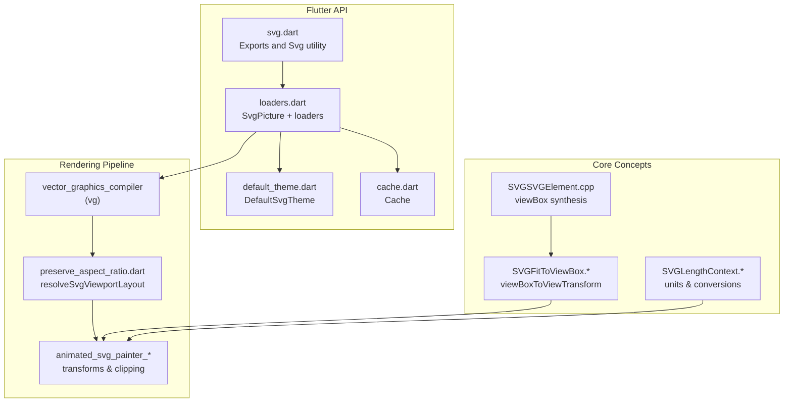
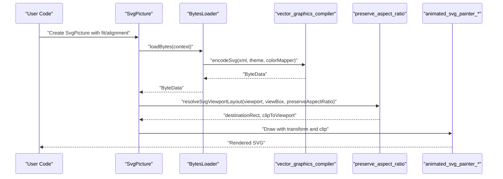
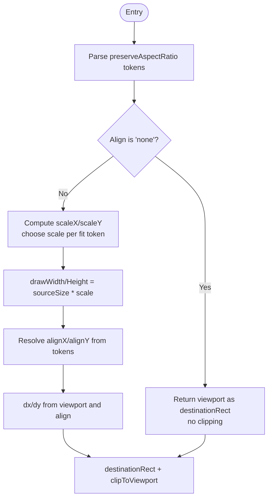
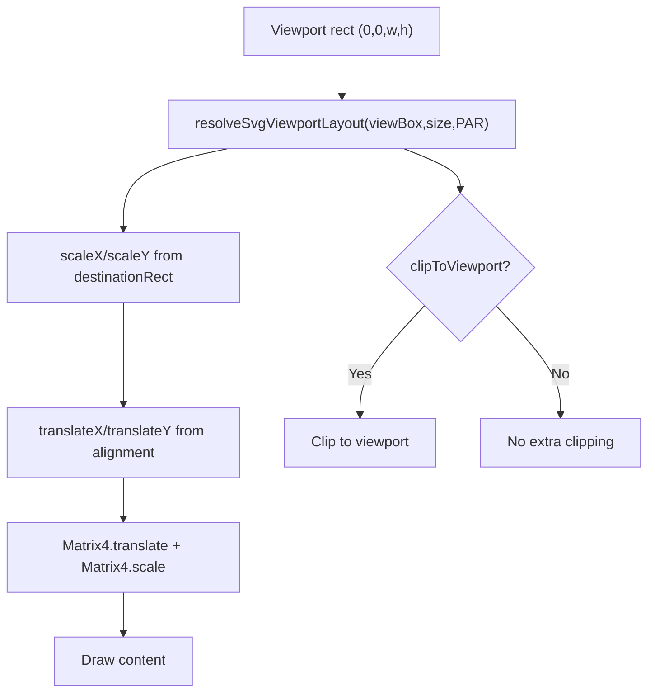
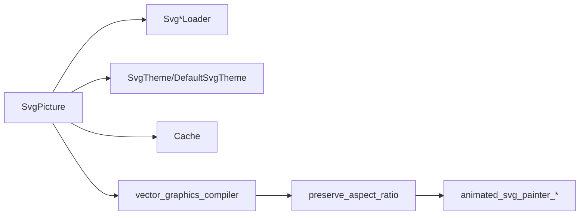

# SVG Fundamentals

<cite>
**Referenced Files in This Document**
- [svg.dart](file://lib/svg.dart)
- [loaders.dart](file://lib/src/loaders.dart)
- [cache.dart](file://lib/src/cache.dart)
- [default_theme.dart](file://lib/src/default_theme.dart)
- [preserve_aspect_ratio.dart](file://lib/src/animation/preserve_aspect_ratio.dart)
- [animated_svg_painter_clip_mask_geometry.dart](file://lib/src/animation/animated_svg_painter_clip_mask_geometry.dart)
- [animated_svg_picture_hit_test_use.dart](file://lib/src/animation/animated_svg_picture_hit_test_use.dart)
- [SVGSVGElement.cpp](file://blink-b87d44f-Source-core-svg/SVGSVGElement.cpp)
- [SVGFitToViewBox.cpp](file://blink-b87d44f-Source-core-svg/SVGFitToViewBox.cpp)
- [SVGFitToViewBox.h](file://blink-b87d44f-Source-core-svg/SVGFitToViewBox.h)
- [SVGLengthContext.cpp](file://blink-b87d44f-Source-core-svg/SVGLengthContext.cpp)
- [SVGLengthContext.h](file://blink-b87d44f-Source-core-svg/SVGLengthContext.h)
- [SVGLength.cpp](file://blink-b87d44f-Source-core-svg/SVGLength.cpp)
- [examples_page.dart](file://example/lib/pages/examples_page.dart)
</cite>

## Table of Contents
1. [Introduction](#introduction)
2. [Project Structure](#project-structure)
3. [Core Components](#core-components)
4. [Architecture Overview](#architecture-overview)
5. [Detailed Component Analysis](#detailed-component-analysis)
6. [Dependency Analysis](#dependency-analysis)
7. [Performance Considerations](#performance-considerations)
8. [Troubleshooting Guide](#troubleshooting-guide)
9. [Conclusion](#conclusion)

## Introduction
This document explains SVG fundamentals as implemented in this Flutter project, focusing on coordinate systems, viewBox concepts, and scaling behavior. It connects Flutter’s SvgPicture widget and its rendering pipeline to the underlying vector graphics compiler and preserveAspectRatio resolution logic. You will learn how SVG elements are structured, how viewport and viewBox relate, how Flutter’s BoxFit integrates with SVG rendering, and how to apply responsive sizing strategies. Practical examples demonstrate coordinate transformations, aspect ratio preservation, and performance considerations for large SVGs.

## Project Structure
At a high level, the project exposes a Flutter-friendly API for loading and rendering SVGs, backed by a vector graphics compiler. The key pieces are:
- Public API and widget: lib/svg.dart and lib/src/loaders.dart
- Caching and themes: lib/src/cache.dart and lib/src/default_theme.dart
- PreserveAspectRatio and coordinate transformation logic: lib/src/animation/preserve_aspect_ratio.dart and related animation files
- Core SVG engine concepts (used by the compiler): blink-b87d44f-Source-core-svg/* (viewBox synthesis, length units, fit-to-viewBox)

**Diagram sources**
- [svg.dart:1-627](file://lib/svg.dart#L1-L627)
- [loaders.dart:1-467](file://lib/src/loaders.dart#L1-L467)
- [cache.dart:1-111](file://lib/src/cache.dart#L1-L111)
- [default_theme.dart:1-36](file://lib/src/default_theme.dart#L1-L36)
- [preserve_aspect_ratio.dart:1-70](file://lib/src/animation/preserve_aspect_ratio.dart#L1-L70)
- [animated_svg_painter_clip_mask_geometry.dart:139-170](file://lib/src/animation/animated_svg_painter_clip_mask_geometry.dart#L139-L170)
- [SVGSVGElement.cpp:553-584](file://blink-b87d44f-Source-core-svg/SVGSVGElement.cpp#L553-L584)
- [SVGFitToViewBox.cpp:107-121](file://blink-b87d44f-Source-core-svg/SVGFitToViewBox.cpp#L107-L121)
- [SVGFitToViewBox.h:1-37](file://blink-b87d44f-Source-core-svg/SVGFitToViewBox.h#L1-L37)
- [SVGLengthContext.cpp:90-268](file://blink-b87d44f-Source-core-svg/SVGLengthContext.cpp#L90-L268)
- [SVGLengthContext.h:69-89](file://blink-b87d44f-Source-core-svg/SVGLengthContext.h#L69-L89)
- [SVGLength.cpp:96-392](file://blink-b87d44f-Source-core-svg/SVGLength.cpp#L96-L392)

**Section sources**
- [svg.dart:1-627](file://lib/svg.dart#L1-L627)
- [loaders.dart:1-467](file://lib/src/loaders.dart#L1-L467)
- [cache.dart:1-111](file://lib/src/cache.dart#L1-L111)
- [default_theme.dart:1-36](file://lib/src/default_theme.dart#L1-L36)
- [preserve_aspect_ratio.dart:1-70](file://lib/src/animation/preserve_aspect_ratio.dart#L1-L70)
- [animated_svg_painter_clip_mask_geometry.dart:139-170](file://lib/src/animation/animated_svg_painter_clip_mask_geometry.dart#L139-L170)
- [SVGSVGElement.cpp:553-584](file://blink-b87d44f-Source-core-svg/SVGSVGElement.cpp#L553-L584)
- [SVGFitToViewBox.cpp:107-121](file://blink-b87d44f-Source-core-svg/SVGFitToViewBox.cpp#L107-L121)
- [SVGFitToViewBox.h:1-37](file://blink-b87d44f-Source-core-svg/SVGFitToViewBox.h#L1-L37)
- [SVGLengthContext.cpp:90-268](file://blink-b87d44f-Source-core-svg/SVGLengthContext.cpp#L90-L268)
- [SVGLengthContext.h:69-89](file://blink-b87d44f-Source-core-svg/SVGLengthContext.h#L69-L89)
- [SVGLength.cpp:96-392](file://blink-b87d44f-Source-core-svg/SVGLength.cpp#L96-L392)

## Core Components
- SvgPicture: The primary Flutter widget to render SVGs from assets, network, files, or raw data. It accepts width, height, BoxFit, alignment, and other rendering options. It delegates to a BytesLoader and uses vector_graphics for rendering.
- BytesLoader hierarchy: SvgStringLoader, SvgBytesLoader, SvgFileLoader, SvgAssetLoader, SvgNetworkLoader encapsulate data acquisition and pass XML to the vector graphics compiler.
- SvgTheme and DefaultSvgTheme: Control currentColor and font-size used for em/ex units and defaults.
- Cache: LRU cache keyed by loader/theme/colorMapper to avoid repeated decoding.
- PreserveAspectRatio resolver: Computes destination rectangle and clipping based on preserveAspectRatio and viewBox.

Key responsibilities:
- Coordinate system and units: Resolved via length context and unit conversions.
- viewBox and viewport mapping: Computed using preserveAspectRatio rules and transformed to a matrix.
- Scaling and alignment: Controlled by BoxFit and alignment, then mapped to preserveAspectRatio semantics.

**Section sources**
- [svg.dart:56-627](file://lib/svg.dart#L56-L627)
- [loaders.dart:15-467](file://lib/src/loaders.dart#L15-L467)
- [cache.dart:1-111](file://lib/src/cache.dart#L1-L111)
- [default_theme.dart:1-36](file://lib/src/default_theme.dart#L1-L36)
- [preserve_aspect_ratio.dart:1-70](file://lib/src/animation/preserve_aspect_ratio.dart#L1-L70)

## Architecture Overview
The rendering pipeline converts SVG XML into a vector_graphics binary, resolves preserveAspectRatio and viewBox-to-view transforms, and draws into Flutter’s canvas with optional clipping.

**Diagram sources**
- [svg.dart:542-560](file://lib/svg.dart#L542-L560)
- [loaders.dart:156-187](file://lib/src/loaders.dart#L156-L187)
- [preserve_aspect_ratio.dart:20-70](file://lib/src/animation/preserve_aspect_ratio.dart#L20-L70)
- [animated_svg_painter_clip_mask_geometry.dart:139-170](file://lib/src/animation/animated_svg_painter_clip_mask_geometry.dart#L139-L170)

## Detailed Component Analysis

### Coordinate Systems and Units
- Absolute vs relative units:
  - Absolute units (px, mm, cm, in, pt, pc) convert to pixels using a fixed DPI.
  - Relative units (em, ex) depend on font metrics; em relates to font-size, ex to x-height.
  - Percentages (%) depend on the current viewport (width/height/average) depending on mode.
- Unit conversion:
  - Length parsing recognizes unit suffixes and maps them to internal types.
  - LengthContext resolves percentages/em/ex against the current viewport or font metrics.
- SVG viewBox fallback:
  - If no viewBox is present but width/height are fixed, the engine synthesizes a viewBox equal to the fixed size.

Practical implications:
- When using em/ex, ensure a stable font-size via SvgTheme to keep sizing predictable.
- Percentage positions and sizes adapt to the widget’s layout constraints.

**Section sources**
- [SVGLength.cpp:96-392](file://blink-b87d44f-Source-core-svg/SVGLength.cpp#L96-L392)
- [SVGLengthContext.cpp:90-268](file://blink-b87d44f-Source-core-svg/SVGLengthContext.cpp#L90-L268)
- [SVGLengthContext.h:69-89](file://blink-b87d44f-Source-core-svg/SVGLengthContext.h#L69-L89)
- [SVGSVGElement.cpp:553-584](file://blink-b87d44f-Source-core-svg/SVGSVGElement.cpp#L553-L584)

### viewBox, viewport, and preserveAspectRatio
- Viewport: The layout bounds of the widget (width/height).
- viewBox: Defines the coordinate system of the SVG content. If absent, it may be synthesized from fixed width/height.
- preserveAspectRatio:
  - Align token: xMin/yMin | xMid/yMid | xMax/yMax.
  - Fit token: meet (letterboxing) | slice (cropping).
  - none disables uniform scaling and clips to viewport.

Resolution logic:
- Compute scaleX/scaleY from viewport/sourceSize.
- Choose scale based on fit token (min for meet, max for slice).
- Compute destinationRect using alignment and scale.
- Optionally clip to viewport when slice is used.

**Diagram sources**
- [preserve_aspect_ratio.dart:20-70](file://lib/src/animation/preserve_aspect_ratio.dart#L20-L70)

**Section sources**
- [preserve_aspect_ratio.dart:1-70](file://lib/src/animation/preserve_aspect_ratio.dart#L1-L70)
- [SVGSVGElement.cpp:553-584](file://blink-b87d44f-Source-core-svg/SVGSVGElement.cpp#L553-L584)
- [SVGFitToViewBox.cpp:107-121](file://blink-b87d44f-Source-core-svg/SVGFitToViewBox.cpp#L107-L121)
- [SVGFitToViewBox.h:1-37](file://blink-b87d44f-Source-core-svg/SVGFitToViewBox.h#L1-L37)

### Flutter BoxFit and SVG Rendering
- BoxFit controls how the SVG fits into the allocated space:
  - BoxFit.contain: meet semantics (letterbox).
  - BoxFit.cover: slice semantics (crop to fill).
  - Other BoxFit modes are mapped to equivalent preserveAspectRatio rules in the resolver.
- Alignment determines anchor points for positioning within the destination rectangle.

Integration:
- SvgPicture passes fit/alignment to the rendering pipeline.
- The pipeline computes a transform and optional clipping rectangle based on preserveAspectRatio and viewBox.

**Section sources**
- [svg.dart:56-627](file://lib/svg.dart#L56-L627)
- [preserve_aspect_ratio.dart:20-70](file://lib/src/animation/preserve_aspect_ratio.dart#L20-L70)

### Practical Sizing Strategies and Examples
- Responsive icons:
  - Set a fixed logical size and rely on BoxFit.contain to maintain aspect ratio.
  - Use DefaultSvgTheme to standardize em/ex units across icons.
- Scalable graphics:
  - Prefer vector shapes with relative units and viewBox-defined coordinate spaces.
  - Avoid hardcoding pixel sizes; use em/ex for scalable typography and strokes.
- Layout integration:
  - Place SvgPicture inside sized containers or use tight layout constraints to prevent layout shifts during load.
  - Use allowDrawingOutsideViewBox cautiously; it can increase overdraw and memory usage.

These patterns are demonstrated in the example app’s main page and example selection UI.

**Section sources**
- [examples_page.dart:1-473](file://example/lib/pages/examples_page.dart#L1-L473)
- [svg.dart:56-627](file://lib/svg.dart#L56-L627)

### Coordinate Transformations and Clipping
- The painter computes a matrix combining translation and scale from viewBox to destinationRect.
- Clipping is applied when preserveAspectRatio uses slice to avoid overflow.

**Diagram sources**
- [animated_svg_painter_clip_mask_geometry.dart:139-170](file://lib/src/animation/animated_svg_painter_clip_mask_geometry.dart#L139-L170)
- [animated_svg_picture_hit_test_use.dart:132-179](file://lib/src/animation/animated_svg_picture_hit_test_use.dart#L132-L179)

**Section sources**
- [animated_svg_painter_clip_mask_geometry.dart:139-170](file://lib/src/animation/animated_svg_painter_clip_mask_geometry.dart#L139-L170)
- [animated_svg_picture_hit_test_use.dart:132-179](file://lib/src/animation/animated_svg_picture_hit_test_use.dart#L132-L179)

## Dependency Analysis
- SvgPicture depends on:
  - BytesLoader implementations for data acquisition.
  - vector_graphics compiler for binary encoding.
  - PreserveAspectRatio resolver for layout decisions.
  - DefaultSvgTheme and SvgTheme for unit resolution.
  - Cache for decoding reuse.
- Animation painter components depend on the resolved layout and viewBox-to-view transform.

**Diagram sources**
- [svg.dart:56-627](file://lib/svg.dart#L56-L627)
- [loaders.dart:15-467](file://lib/src/loaders.dart#L15-L467)
- [cache.dart:1-111](file://lib/src/cache.dart#L1-L111)
- [default_theme.dart:1-36](file://lib/src/default_theme.dart#L1-L36)
- [preserve_aspect_ratio.dart:1-70](file://lib/src/animation/preserve_aspect_ratio.dart#L1-L70)

**Section sources**
- [svg.dart:56-627](file://lib/svg.dart#L56-L627)
- [loaders.dart:15-467](file://lib/src/loaders.dart#L15-L467)
- [cache.dart:1-111](file://lib/src/cache.dart#L1-L111)
- [default_theme.dart:1-36](file://lib/src/default_theme.dart#L1-L36)
- [preserve_aspect_ratio.dart:1-70](file://lib/src/animation/preserve_aspect_ratio.dart#L1-L70)

## Performance Considerations
- Caching:
  - Use the built-in Cache keyed by loader/theme/colorMapper to avoid re-decoding.
  - Tune maximumSize to balance memory and speed.
- Isolate decoding:
  - BytesLoader.compute performs XML parsing in isolates to keep UI responsive.
- PreserveAspectRatio optimizations:
  - meet (contain) often reduces overdraw compared to slice (cover).
  - Avoid allowDrawingOutsideViewBox unless necessary.
- Large SVGs:
  - Prefer simpler geometry and fewer nested groups.
  - Use filters and masks judiciously; they can increase rendering cost.
- Network assets:
  - All network images are cached; consider preloading frequently used assets.

**Section sources**
- [cache.dart:1-111](file://lib/src/cache.dart#L1-L111)
- [loaders.dart:156-187](file://lib/src/loaders.dart#L156-L187)
- [svg.dart:56-627](file://lib/svg.dart#L56-L627)

## Troubleshooting Guide
- Unexpected layout shifts:
  - Always specify width/height or constrain the parent to avoid reflow during load.
- Cropped or stretched content:
  - Verify preserveAspectRatio and viewBox; adjust fit to meet or slice as needed.
- Wrong colors or missing theming:
  - Ensure SvgTheme is set appropriately; colorMapper can substitute colors during parsing.
- Overdraw and memory spikes:
  - Disable allowDrawingOutsideViewBox and prefer meet over slice when possible.
  - Reduce complexity and cache aggressively.

**Section sources**
- [svg.dart:56-627](file://lib/svg.dart#L56-L627)
- [loaders.dart:15-467](file://lib/src/loaders.dart#L15-L467)
- [cache.dart:1-111](file://lib/src/cache.dart#L1-L111)

## Conclusion
This project provides a robust foundation for SVG rendering in Flutter, integrating vector_graphics compilation with precise preserveAspectRatio handling and a flexible loader system. Understanding viewBox, viewport, and preserveAspectRatio enables predictable, responsive layouts. By leveraging caching, isolate decoding, and thoughtful use of BoxFit, you can achieve high-quality, performant SVG rendering across diverse screen sizes and use cases.