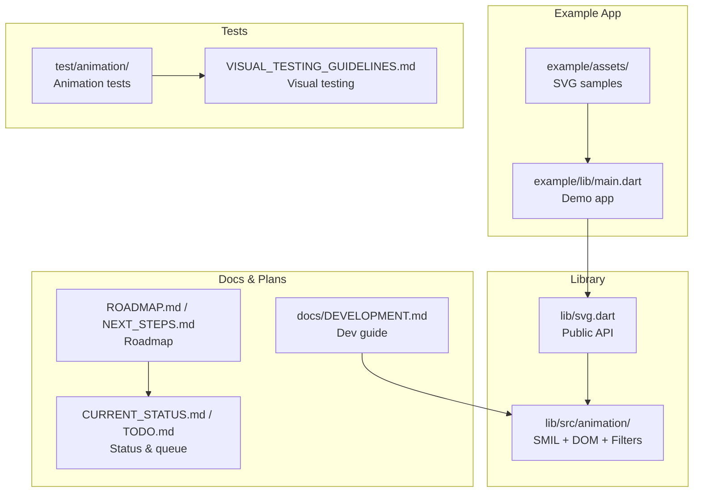
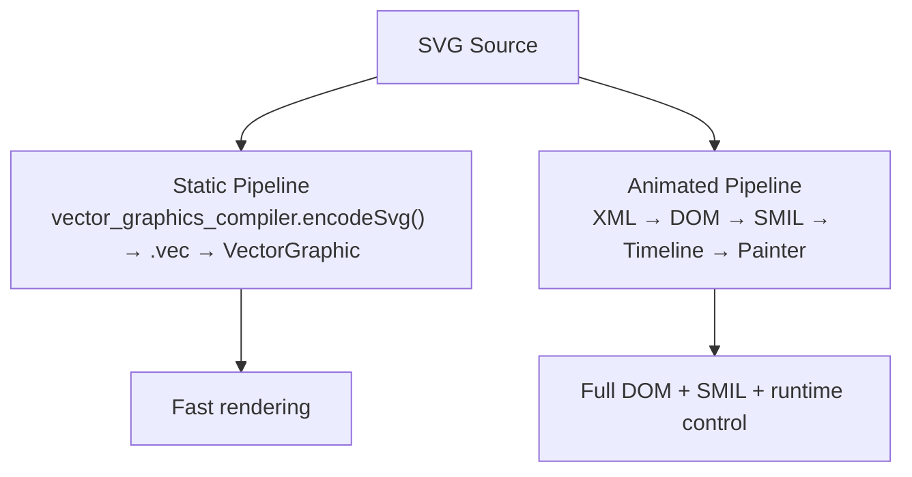
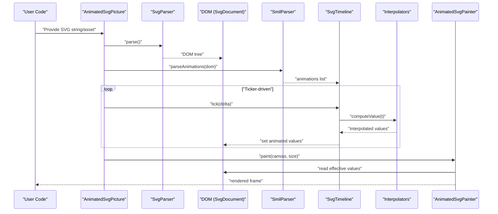
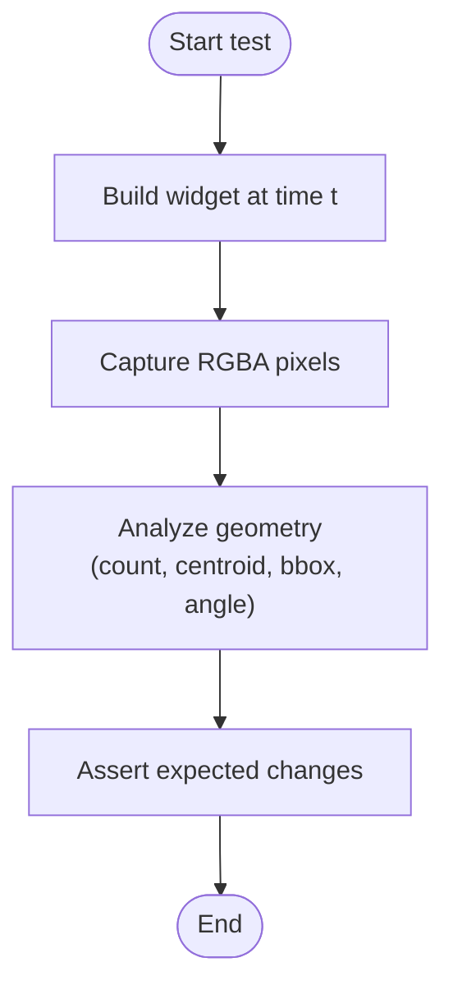
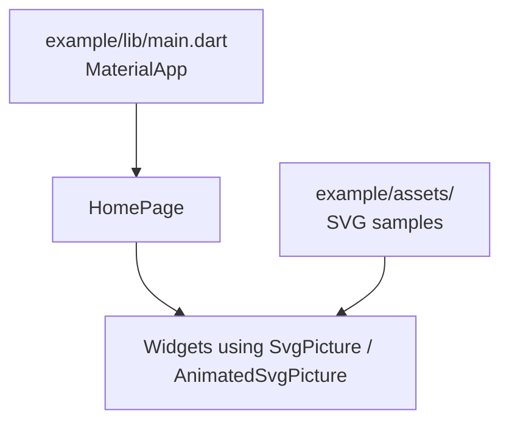
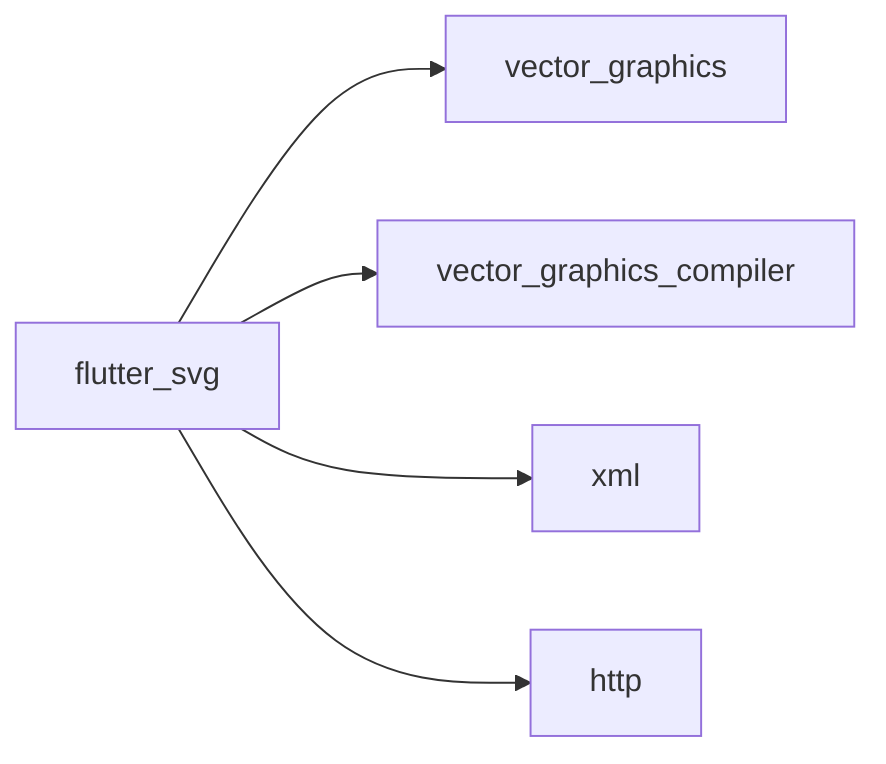
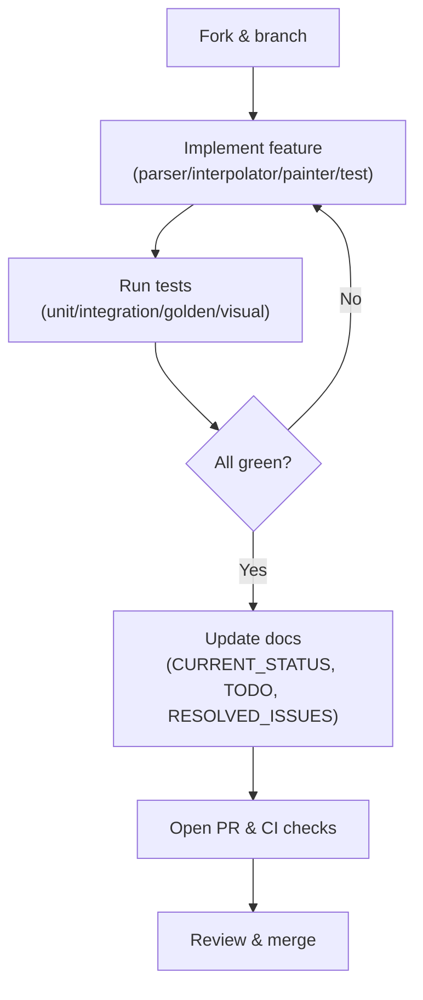

# Development and Contributing

<cite>
**Referenced Files in This Document**
- [README.md](file://README.md)
- [ROADMAP.md](file://ROADMAP.md)
- [NEXT_STEPS.md](file://NEXT_STEPS.md)
- [CURRENT_STATUS.md](file://CURRENT_STATUS.md)
- [TODO.md](file://TODO.md)
- [docs/DEVELOPMENT.md](file://docs/DEVELOPMENT.md)
- [ARCHITECTURE.md](file://ARCHITECTURE.md)
- [ANIMATION.md](file://ANIMATION.md)
- [VISUAL_TESTING_GUIDELINES.md](file://VISUAL_TESTING_GUIDELINES.md)
- [pubspec.yaml](file://pubspec.yaml)
- [example/pubspec.yaml](file://example/pubspec.yaml)
- [example/lib/main.dart](file://example/lib/main.dart)
- [lib/svg.dart](file://lib/svg.dart)
</cite>

## Table of Contents
1. [Introduction](#introduction)
2. [Project Structure](#project-structure)
3. [Core Components](#core-components)
4. [Architecture Overview](#architecture-overview)
5. [Detailed Component Analysis](#detailed-component-analysis)
6. [Dependency Analysis](#dependency-analysis)
7. [Performance Considerations](#performance-considerations)
8. [Troubleshooting Guide](#troubleshooting-guide)
9. [Contribution Workflow](#contribution-workflow)
10. [Roadmap and Community Engagement](#roadmap-and-community-engagement)
11. [Conclusion](#conclusion)

## Introduction
This document provides a comprehensive guide for developing and contributing to the flutter_svg project. It covers the development environment setup, build processes, architectural decisions, contribution workflow, code review expectations, testing requirements, and practical examples for local development, debugging, and feature development. It also outlines the roadmap, future plans, and community engagement guidelines, with terminology consistent with the codebase.

## Project Structure
The repository is organized into:
- Core library: public API and widgets in lib/
- Animation subsystem: experimental SMIL pipeline under lib/src/animation/
- Example application: example/ demonstrating features and usage
- Documentation: docs/, ROADMAP.md, NEXT_STEPS.md, CURRENT_STATUS.md, TODO.md
- Tests: test/ with animation tests and visual testing utilities
- Tooling and configuration: pubspec.yaml, dart_test.yaml, .fvm configuration

**Diagram sources**
- [lib/svg.dart](file://lib/svg.dart)
- [docs/DEVELOPMENT.md](file://docs/DEVELOPMENT.md)
- [ROADMAP.md](file://ROADMAP.md)
- [NEXT_STEPS.md](file://NEXT_STEPS.md)
- [CURRENT_STATUS.md](file://CURRENT_STATUS.md)
- [TODO.md](file://TODO.md)
- [VISUAL_TESTING_GUIDELINES.md](file://VISUAL_TESTING_GUIDELINES.md)
- [example/lib/main.dart](file://example/lib/main.dart)

**Section sources**
- [README.md](file://README.md)
- [pubspec.yaml](file://pubspec.yaml)
- [example/pubspec.yaml](file://example/pubspec.yaml)

## Core Components
- Public API surface: Svg, SvgPicture, and related loaders are exposed from lib/svg.dart.
- Widgets: SvgPicture supports asset, network, file, memory, and string sources, plus rendering strategy selection.
- Animation subsystem: AnimatedSvgPicture and supporting modules implement DOM parsing, SMIL extraction, timeline management, interpolators, and CustomPainter-based rendering.
- Example app: Demonstrates usage patterns and showcases features.

Key responsibilities:
- SvgPicture: decoding, caching, and rendering via vector_graphics backend.
- AnimatedSvgPicture: DOM parsing, SMIL engine, timeline, and painter orchestration.
- Tests and visual testing utilities: ensure correctness and regressions for animations.

**Section sources**
- [lib/svg.dart](file://lib/svg.dart)
- [ANIMATION.md](file://ANIMATION.md)
- [docs/DEVELOPMENT.md](file://docs/DEVELOPMENT.md)

## Architecture Overview
The project maintains two rendering pipelines:
- Static SVG pipeline: vector_graphics_compiler-based binary (.vec) for fast production rendering.
- Animated SVG pipeline: XML parsing to DOM, SMIL extraction, timeline-driven animation, and CustomPainter rendering.

**Diagram sources**
- [ARCHITECTURE.md](file://ARCHITECTURE.md)
- [docs/DEVELOPMENT.md](file://docs/DEVELOPMENT.md)

**Section sources**
- [ARCHITECTURE.md](file://ARCHITECTURE.md)
- [docs/DEVELOPMENT.md](file://docs/DEVELOPMENT.md)

## Detailed Component Analysis

### Animation Engine Flow
The animation pipeline parses SVG to a DOM, extracts SMIL animations, manages time, interpolates values, and renders via CustomPainter.

**Diagram sources**
- [docs/DEVELOPMENT.md](file://docs/DEVELOPMENT.md)
- [ARCHITECTURE.md](file://ARCHITECTURE.md)

**Section sources**
- [docs/DEVELOPMENT.md](file://docs/DEVELOPMENT.md)
- [ARCHITECTURE.md](file://ARCHITECTURE.md)

### Visual Testing Pattern
Visual testing validates actual pixel output for animations, complementing unit tests.

**Diagram sources**
- [VISUAL_TESTING_GUIDELINES.md](file://VISUAL_TESTING_GUIDELINES.md)

**Section sources**
- [VISUAL_TESTING_GUIDELINES.md](file://VISUAL_TESTING_GUIDELINES.md)

### Example Application
The example app demonstrates usage patterns and showcases features.

**Diagram sources**
- [example/lib/main.dart](file://example/lib/main.dart)
- [example/pubspec.yaml](file://example/pubspec.yaml)

**Section sources**
- [example/lib/main.dart](file://example/lib/main.dart)
- [example/pubspec.yaml](file://example/pubspec.yaml)

## Dependency Analysis
Primary dependencies:
- vector_graphics: Static rendering backend
- vector_graphics_compiler: Precompilation to .vec
- xml: XML parsing for animated pipeline
- http: Network loading for SvgPicture.network

**Diagram sources**
- [pubspec.yaml](file://pubspec.yaml)

**Section sources**
- [pubspec.yaml](file://pubspec.yaml)

## Performance Considerations
- Static pipeline: optimized binary format yields fast rendering.
- Animated pipeline: DOM preservation enables SMIL but adds overhead.
- Hot-path optimizations: path normalization, dirty tracking, subtree caching, and reusable Path objects.
- Performance targets: path interpolation under 1ms, animate motion updates within 100ms for 60 updates, aiming for 60 FPS for simple animations and 30+ FPS for complex ones.

**Section sources**
- [ARCHITECTURE.md](file://ARCHITECTURE.md)
- [docs/DEVELOPMENT.md](file://docs/DEVELOPMENT.md)

## Troubleshooting Guide
Common pitfalls and debugging tips:
- Pipeline mixing: SvgPicture cannot render SMIL; use AnimatedSvgPicture for animations.
- Path morphing: requires normalized path structures.
- RepaintBoundary captures full screen (800x600), not widget size.
- Memory leaks: always dispose images in tests.
- Deterministic timelines: prefer autoPlay=false + initialTime or explicit pump durations.
- Use structured traces and playground diagnostics for runtime insights.

**Section sources**
- [docs/DEVELOPMENT.md](file://docs/DEVELOPMENT.md)
- [VISUAL_TESTING_GUIDELINES.md](file://VISUAL_TESTING_GUIDELINES.md)
- [CURRENT_STATUS.md](file://CURRENT_STATUS.md)

## Contribution Workflow
- Development quick start: run example app and animation tests locally.
- Code organization: follow lib/src/animation/ structure for animation features.
- Adding a new SMIL animation type: parse XML, interpolate values, render via painter, and add comprehensive tests.
- Adding examples: create widget, add tab, asset, and update info panel.
- Testing strategy: unit, integration, golden, and visual tests; use visual testing guidelines for animations.
- Debugging: enable logging, use trace callbacks, and leverage playground diagnostics.
- Validation gate: behavior + tests + analyze + docs updates.

**Section sources**
- [docs/DEVELOPMENT.md](file://docs/DEVELOPMENT.md)
- [ROADMAP.md](file://ROADMAP.md)
- [NEXT_STEPS.md](file://NEXT_STEPS.md)
- [CURRENT_STATUS.md](file://CURRENT_STATUS.md)
- [TODO.md](file://TODO.md)

## Roadmap and Community Engagement
- Roadmap items are prioritized and validated with behavior, tests, analyze passes, and documentation updates.
- Current priorities focus on parity foundations (filters, hit-testing, use/symbol inheritance), core feature expansion (text, foreignObject, animateMotion), CSS/timing fidelity, and quality/stability.
- Community engagement: use issue tracker for the package, refer to roadmap and status documents for authoritative state, and follow validation gate requirements before considering items complete.

**Section sources**
- [ROADMAP.md](file://ROADMAP.md)
- [NEXT_STEPS.md](file://NEXT_STEPS.md)
- [CURRENT_STATUS.md](file://CURRENT_STATUS.md)
- [TODO.md](file://TODO.md)
- [README.md](file://README.md)

## Conclusion
This guide consolidates development practices, architecture, testing, and contribution workflows for flutter_svg. Contributors should align with the dual-pipeline design, follow the validation gate, prioritize visual testing for animations, and engage with the roadmap and status documents for current priorities and expectations.