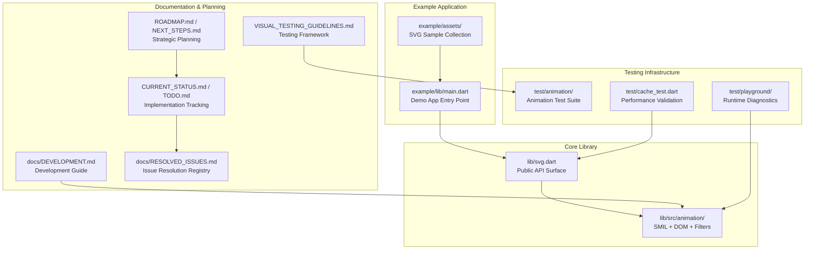

# Development and Contributing

<cite>
**Referenced Files in This Document**
- [README.md](file://README.md)
- [ROADMAP.md](file://ROADMAP.md)
- [NEXT_STEPS.md](file://NEXT_STEPS.md)
- [CURRENT_STATUS.md](file://CURRENT_STATUS.md)
- [TODO.md](file://TODO.md)
- [docs/DEVELOPMENT.md](file://docs/DEVELOPMENT.md)
- [ARCHITECTURE.md](file://ARCHITECTURE.md)
- [ANIMATION.md](file://ANIMATION.md)
- [VISUAL_TESTING_GUIDELINES.md](file://VISUAL_TESTING_GUIDELINES.md)
- [pubspec.yaml](file://pubspec.yaml)
- [example/pubspec.yaml](file://example/pubspec.yaml)
- [example/lib/main.dart](file://example/lib/main.dart)
- [lib/svg.dart](file://lib/svg.dart)
- [docs/RESOLVED_ISSUES.md](file://docs/RESOLVED_ISSUES.md)
</cite>

## Update Summary
**Changes Made**
- Enhanced development workflow documentation with comprehensive overhaul reflecting current documentation standards
- Updated section organization for improved clarity and navigation with detailed workflow documentation
- Expanded testing strategy documentation with visual testing guidelines and pixel analysis frameworks
- Improved contribution workflow with validation gates, quality assurance requirements, and modular refactoring processes
- Enhanced troubleshooting guide with debugging techniques, common pitfalls, and comprehensive developer onboarding materials
- Updated dependency management and development environment setup instructions with current tooling requirements
- Integrated comprehensive status tracking, roadmap execution, and issue resolution documentation systems

## Table of Contents
1. [Introduction](#introduction)
2. [Project Structure](#project-structure)
3. [Core Components](#core-components)
4. [Architecture Overview](#architecture-overview)
5. [Development Environment Setup](#development-environment-setup)
6. [Testing Strategy](#testing-strategy)
7. [Contribution Workflow](#contribution-workflow)
8. [Performance Considerations](#performance-considerations)
9. [Troubleshooting Guide](#troubleshooting-guide)
10. [Roadmap and Community Engagement](#roadmap-and-community-engagement)
11. [Conclusion](#conclusion)

## Introduction
This document provides a comprehensive guide for developing and contributing to the flutter_svg project, representing a complete documentation overhaul that establishes standardized development practices and contributor onboarding procedures. The document covers the development environment setup, build processes, architectural decisions, contribution workflow, code review expectations, testing requirements, and practical examples for local development, debugging, and feature development. The project emphasizes a dual-pipeline architecture supporting both static SVG rendering and experimental animated SVG capabilities, with a focus on maintaining high-quality standards through comprehensive testing and validation.

## Project Structure
The repository is organized into distinct components supporting both production-ready static SVG rendering and experimental animated SVG features, with comprehensive documentation and status tracking systems:

- **Core Library**: Public API and widgets in lib/ with SvgPicture and related loaders
- **Animation Subsystem**: Experimental SMIL pipeline under lib/src/animation/ with DOM parsing, SMIL extraction, timeline management, and CustomPainter-based rendering
- **Example Application**: example/ demonstrating features and usage patterns with comprehensive demo capabilities
- **Documentation**: docs/ directory with development guides, roadmap, status tracking, and archived materials
- **Tests**: test/ directory with animation tests, visual testing utilities, and playground implementations
- **Tooling**: pubspec.yaml, dart_test.yaml, and .fvm configuration for development environment
- **Status Management**: CURRENT_STATUS.md, TODO.md, ROADMAP.md, and RESOLVED_ISSUES.md for project governance



**Diagram sources**
- [lib/svg.dart](file://lib/svg.dart)
- [docs/DEVELOPMENT.md](file://docs/DEVELOPMENT.md)
- [ROADMAP.md](file://ROADMAP.md)
- [NEXT_STEPS.md](file://NEXT_STEPS.md)
- [CURRENT_STATUS.md](file://CURRENT_STATUS.md)
- [TODO.md](file://TODO.md)
- [VISUAL_TESTING_GUIDELINES.md](file://VISUAL_TESTING_GUIDELINES.md)
- [example/lib/main.dart](file://example/lib/main.dart)
- [docs/RESOLVED_ISSUES.md](file://docs/RESOLVED_ISSUES.md)

**Section sources**
- [README.md](file://README.md)
- [pubspec.yaml](file://pubspec.yaml)
- [example/pubspec.yaml](file://example/pubspec.yaml)

## Core Components
The flutter_svg package provides two distinct rendering pipelines designed for different use cases and performance requirements, with comprehensive status tracking and validation systems:

### Static SVG Pipeline (Production)
- **Path**: SVG Source → `vector_graphics_compiler.encodeSvg()` → Binary `.vec` format → `VectorGraphic` widget
- **Characteristics**: Fast, optimized binary format with production-ready performance
- **Use Cases**: `SvgPicture.asset()`, `SvgPicture.network()` for static SVG rendering
- **Limitations**: Loses DOM structure, IDs, and animation support for optimal performance

### Animated SVG Pipeline (Experimental)
- **Path**: SVG Source → XML parsing → DOM tree → SMIL animation extraction → `AnimatedSvgPicture` widget
- **Characteristics**: Full DOM preservation with SMIL animation support and runtime control
- **Use Cases**: `AnimatedSvgPicture.string()`, `AnimatedSvgPicture.asset()` for animated SVG content
- **Capabilities**: Runtime control (seek, playback rate), comprehensive SMIL support, and advanced animation features

**Section sources**
- [ARCHITECTURE.md](file://ARCHITECTURE.md)
- [docs/DEVELOPMENT.md](file://docs/DEVELOPMENT.md)
- [lib/svg.dart](file://lib/svg.dart)

## Architecture Overview
The dual-pipeline design addresses the fundamental trade-off between performance and functionality. The vector_graphics compiler optimizes SVG by converting to drawing commands, discarding element structure, removing IDs and animations, and pre-computing transforms. This results in fast rendering but eliminates animation capabilities.

**Section sources**
- [ARCHITECTURE.md](file://ARCHITECTURE.md)
- [docs/DEVELOPMENT.md](file://docs/DEVELOPMENT.md)

## Development Environment Setup
Setting up a proper development environment is crucial for contributing to flutter_svg effectively, with comprehensive tooling and validation requirements:

### Prerequisites
- Flutter SDK 3.32.0 or higher
- Dart SDK 3.8.0 or higher  
- FVM (Flutter Version Management) configured for consistent development environments
- Android Studio or VS Code with Flutter/Dart plugins

### Local Development Commands
```bash
# Run animation-specific tests
./.fvm/flutter_sdk/bin/flutter test test/animation/

# Run the complete example application
cd example && ../.fvm/flutter_sdk/bin/flutter run

# Execute all package tests
./.fvm/flutter_sdk/bin/flutter test

# Run tests with verbose output for debugging
./.fvm/flutter_sdk/bin/flutter test test/animation/ --reporter expanded

# Skip golden tests in CI environments
./.fvm/flutter_sdk/bin/flutter test test/animation/ --exclude-tags golden

# Analyze code for quality assurance
./.fvm/flutter_sdk/bin/flutter analyze

# Validate full test suite health
./.fvm/flutter_sdk/bin/flutter test && ./.fvm/flutter_sdk/bin/flutter analyze
```

### Development Workflow Integration
The development environment supports comprehensive testing strategies including unit tests, integration tests, golden tests, and visual pixel analysis tests. The example application serves as both a demonstration platform and a testing ground for new features, with integrated playground diagnostics and runtime tracing capabilities.

**Section sources**
- [docs/DEVELOPMENT.md](file://docs/DEVELOPMENT.md)
- [pubspec.yaml](file://pubspec.yaml)
- [example/pubspec.yaml](file://example/pubspec.yaml)

## Testing Strategy
The flutter_svg project employs a multi-layered testing approach ensuring comprehensive coverage across different aspects of functionality, with specialized visual testing frameworks and pixel analysis capabilities:

### Test Categories and Coverage
1. **Unit Tests**: Logic verification for parsers, interpolators, and core algorithms
2. **Integration Tests**: End-to-end animation flows and pipeline interactions
3. **Golden Tests**: Visual regression testing with baseline image comparisons
4. **Visual Tests**: Pixel-level analysis for geometric transformations and animation validation

### Visual Testing Framework
The visual testing approach analyzes actual pixel data rather than relying solely on golden file comparisons, providing more reliable validation for animated content with comprehensive geometric analysis:

```dart
testWidgets('Animation renders correctly', (tester) async {
  await tester.pumpWidget(AnimatedSvgPicture.string(svgData));
  await tester.pump(); // Build phase
  await tester.pump(); // Initialization
  
  // Capture pixels using runAsync to prevent hangs
  final pixels = await tester.runAsync(() async {
    final boundary = find.byType(RepaintBoundary).first;
    final image = await boundary.toImage(pixelRatio: 1.0);
    final byteData = await image.toByteData(format: ui.ImageByteFormat.rawRgba);
    image.dispose();
    return byteData!.buffer.asUint8List();
  });
  
  // Analyze geometry with comprehensive metrics
  final analysis = VisualTestUtils.analyzeRedPixels(pixels, 800, 600);
  expect(analysis.pixelCount, greaterThan(0));
  expect(analysis.centroid.dx, closeTo(400, 5));
  
  // Verify geometric transformations
  expect(analysis.estimatedRotationAngle, closeTo(45.0, 2.0));
  expect(analysis.objectWidth, closeTo(20.0, 2.0));
});
```

### Testing Best Practices
- **Deterministic Testing**: Use `autoPlay: false` with `initialTime` for predictable frame assertions
- **Memory Management**: Always dispose of images captured during tests
- **Infinite Animation Handling**: Never use `pumpAndSettle()` with animations that repeat indefinitely
- **Cross-Platform Validation**: Visual testing provides platform-independent geometry validation
- **Pixel Analysis**: Comprehensive geometric verification through centroid, bounding box, and rotation analysis

**Section sources**
- [VISUAL_TESTING_GUIDELINES.md](file://VISUAL_TESTING_GUIDELINES.md)
- [docs/DEVELOPMENT.md](file://docs/DEVELOPMENT.md)

## Contribution Workflow
The contribution process follows a structured approach ensuring quality, maintainability, and alignment with project goals, with comprehensive validation gates and status tracking:

### Development Process
1. **Fork and Branch**: Create feature branches from the latest `main` branch
2. **Feature Implementation**: Follow the established code organization patterns with modular refactoring
3. **Testing Requirements**: Implement comprehensive tests including unit, integration, and visual tests
4. **Documentation Updates**: Update relevant documentation files and status trackers
5. **Validation**: Ensure all tests pass and analyzer reports clean

### Adding New SMIL Animation Types
The process for implementing new SMIL animation support involves multiple components with comprehensive validation:

```dart
// 1. Parse XML in smil/smil_parser.dart
if (element.name.local == 'animateNewType') {
  return _parseAnimateNewType(element, targetNode);
}

// 2. Interpolate values in smil/smil_animation.dart
dynamic computeValue(double t) {
  return Interpolators.interpolateNewType(from, to, t);
}

// 3. Render via painter in animated_svg_painter.dart
void _applyAnimations(Canvas canvas, SvgNode node) {
  final value = animation.computeValue(time);
  // Apply to canvas
}

// 4. Test with visual validation
testWidgets('New animation type works', (tester) async {
  // Comprehensive visual test with pixel analysis
  await _visualTestValidation(tester, svgData);
});
```

### Modular Refactoring Process
The project maintains extensive modular refactoring with comprehensive validation after each split:

```dart
// Example: Split large files into focused modules
// Before: smil_animation.dart (1000+ lines)
// After: 
// - smil_animation_value_computation.dart
// - smil_animation_runtime.dart  
// - smil_animation_curves.dart
// - smil_animation_api.dart

// Validation after refactoring:
// - Full regression test suite passes
// - API compatibility maintained
// - Performance benchmarks unchanged
```

### Example Integration Process
Adding new animated examples follows a systematic approach with comprehensive validation:
1. Create widget implementation in `example/lib/widgets/`
2. Add tab navigation in `example/lib/pages/unified_examples_page.dart`
3. Include SVG assets in `example/assets/`
4. Update information panels with feature descriptions
5. Add playground integration and diagnostic capabilities

### Validation Gates
Each contribution must satisfy the following validation criteria:
- **Behavior Implementation**: Complete functional implementation meeting specifications
- **Test Coverage**: Comprehensive test suite including unit, integration, and visual tests
- **Quality Assurance**: Full analyzer pass with no warnings or errors
- **Documentation Updates**: Update `CURRENT_STATUS.md`, `TODO.md`, and `RESOLVED_ISSUES.md`
- **Modular Refactoring**: API stability maintained, performance validated

**Section sources**
- [docs/DEVELOPMENT.md](file://docs/DEVELOPMENT.md)
- [ROADMAP.md](file://ROADMAP.md)
- [NEXT_STEPS.md](file://NEXT_STEPS.md)
- [CURRENT_STATUS.md](file://CURRENT_STATUS.md)
- [TODO.md](file://TODO.md)
- [docs/RESOLVED_ISSUES.md](file://docs/RESOLVED_ISSUES.md)

## Performance Considerations
The dual-pipeline architecture enables different performance characteristics optimized for specific use cases, with comprehensive performance validation and optimization strategies:

### Static Pipeline Performance Targets
- **Path interpolation**: Under 1ms for typical path operations
- **AnimateMotion**: 60 position updates in less than 100ms
- **Target FPS**: 60 FPS for simple animations, 30+ FPS for complex animations

### Performance Optimization Strategies
1. **Static Subtree Caching**: Cache rendering to `Picture` for nodes without animations
2. **Dirty Tracking**: Mark nodes as dirty when animation values change to minimize re-rendering
3. **Path Optimization**: Normalize paths once during parsing and reuse `Path` objects
4. **Allocation Reduction**: Use `Path.reset()` instead of creating new path objects

### Hot Path Optimizations
- Path normalization during parsing
- Dirty tracking for efficient subtree updates
- Reusable `Path` objects for morphing operations
- Picture caching for static content
- Modular refactoring for maintainable performance

**Section sources**
- [ARCHITECTURE.md](file://ARCHITECTURE.md)
- [docs/DEVELOPMENT.md](file://docs/DEVELOPMENT.md)

## Troubleshooting Guide
Comprehensive troubleshooting guide with common development challenges and their solutions, including debugging techniques and validation procedures:

### Animation Development Issues
1. **Pipeline Mixing**: `SvgPicture` cannot render SMIL animations - use `AnimatedSvgPicture` for animated content
2. **Path Morphing**: Requires normalized path structures for successful morphing operations
3. **RepaintBoundary Behavior**: Captures full 800x600 screen, not widget dimensions
4. **Memory Leaks**: Always dispose of images captured during testing
5. **Infinite Animation Hangs**: Never use `pumpAndSettle()` with animations that repeat indefinitely

### Debugging Techniques
1. **Animation Flow Verification**: Check `AnimationDetector.hasAnimations()` returns true
2. **Timeline Progression**: Verify animations progress through `SvgTimeline.tick()`
3. **Value Computation**: Confirm interpolators compute expected values
4. **Painter Application**: Ensure animations are applied during `AnimatedSvgPainter.paint()`
5. **Visual Validation**: Use pixel analysis for geometric transformation verification

### Deterministic Testing Setup
- Use `autoPlay: false` with explicit `initialTime` for predictable frame assertions
- Prefer `autoPlay: true` with explicit `pump(Duration(...))` for progressive testing
- Avoid `pumpAndSettle()` with infinite animations to prevent test hangs
- Implement comprehensive visual validation with pixel analysis

### Status Tracking and Validation
- Monitor `CURRENT_STATUS.md` for current implementation state
- Check `TODO.md` for active work queue and priorities
- Validate against `RESOLVED_ISSUES.md` for closed bugs and milestones
- Use `NEXT_STEPS.md` for immediate execution priorities

**Section sources**
- [docs/DEVELOPMENT.md](file://docs/DEVELOPMENT.md)
- [VISUAL_TESTING_GUIDELINES.md](file://VISUAL_TESTING_GUIDELINES.md)
- [CURRENT_STATUS.md](file://CURRENT_STATUS.md)

## Roadmap and Community Engagement
The project maintains a comprehensive roadmap with clear priorities, validation criteria, and community engagement processes:

### Current Priority Areas
1. **P0 - Parity Foundations**: Advanced filter semantics, hit-testing parity, and `<use>`/`<symbol>` inheritance
2. **P1 - Core Feature Expansion**: Advanced text support, `foreignObject` semantics, and `animateMotion` parity
3. **P2 - CSS/Timing Fidelity**: CSS transform/timing edge cases and comprehensive regression coverage
4. **P3 - Quality and Stability**: Maintaining regression-free state and documentation synchronization

### Validation Requirements
A roadmap item is considered complete only when:
1. **Behavior Implementation**: Complete functional specification fulfillment
2. **Test Coverage**: Comprehensive test suite with focused test additions
3. **Quality Assurance**: Full test and analyzer pass on current `main` branch
4. **Documentation Updates**: Updates to `CURRENT_STATUS.md`, `TODO.md`, and `RESOLVED_ISSUES.md`

### Community Guidelines
- Use the issue tracker for package-related discussions and bug reports
- Reference authoritative status documents for current implementation state
- Follow validation gate requirements before considering items complete
- Engage with the community through GitHub discussions and pull requests
- Participate in modular refactoring efforts for improved code maintainability

### Status Management
- **CURRENT_STATUS.md**: Single source of truth for project state and implementation details
- **TODO.md**: Active work queue with priority assignments and completion tracking
- **ROADMAP.md**: Strategic planning with validation gates and milestone definitions
- **RESOLVED_ISSUES.md**: Closed bugs registry preventing re-opening of completed work

**Section sources**
- [ROADMAP.md](file://ROADMAP.md)
- [NEXT_STEPS.md](file://NEXT_STEPS.md)
- [CURRENT_STATUS.md](file://CURRENT_STATUS.md)
- [TODO.md](file://TODO.md)
- [README.md](file://README.md)

## Conclusion
The flutter_svg development and contributing guide establishes a comprehensive framework for both new and experienced contributors, representing a complete documentation overhaul that enhances developer onboarding and project governance. The dual-pipeline architecture provides optimal performance for static content while enabling experimental animated features through comprehensive visual testing and validation.

Contributors should align with the established development workflow, prioritize visual testing for animation features, engage with the current roadmap and status documents for guidance on priorities and completion criteria, and participate in the modular refactoring efforts that maintain code quality and performance. The combination of thorough documentation, comprehensive testing, validation requirements, and status tracking creates an environment conducive to sustainable, high-quality development of SVG rendering capabilities in Flutter applications.

The project's commitment to comprehensive documentation, validation gates, and community engagement ensures that contributions maintain high standards while advancing the state-of-the-art in Flutter SVG animation support.