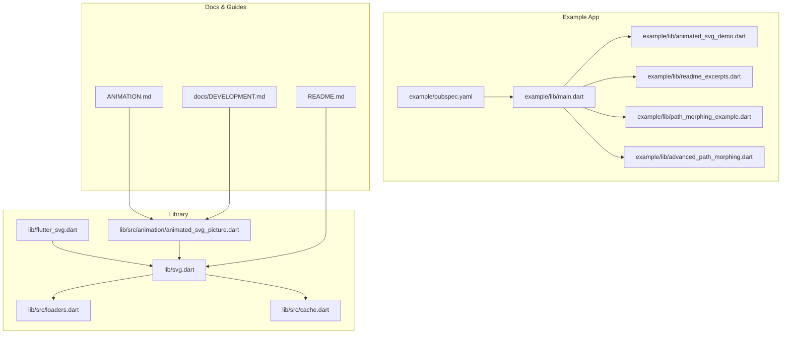
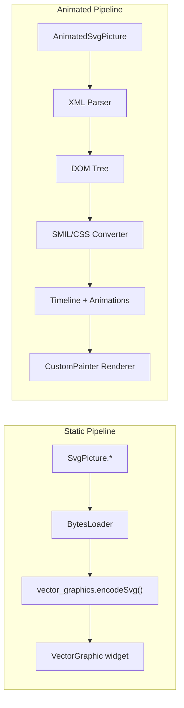
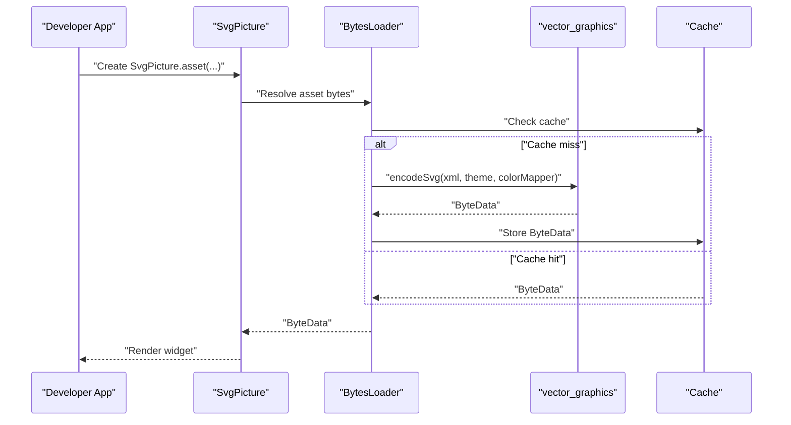
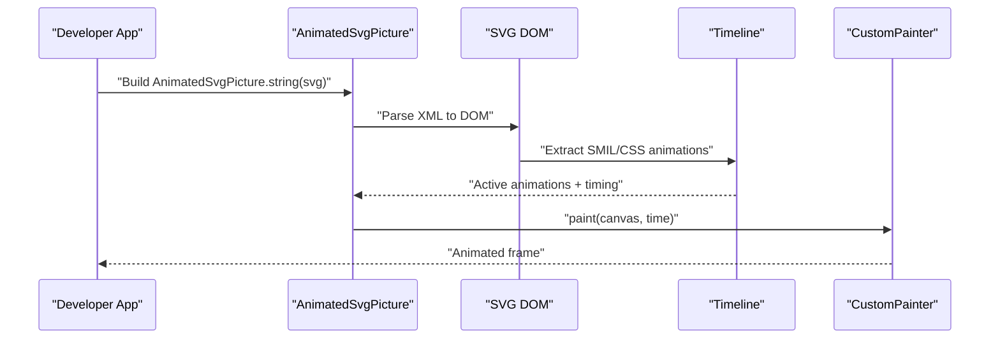
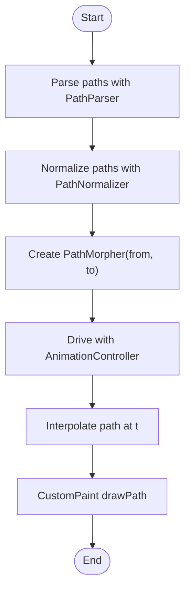
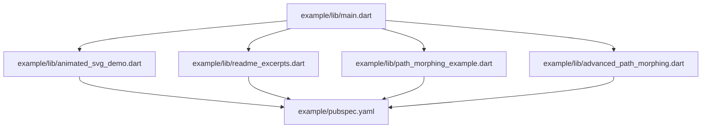
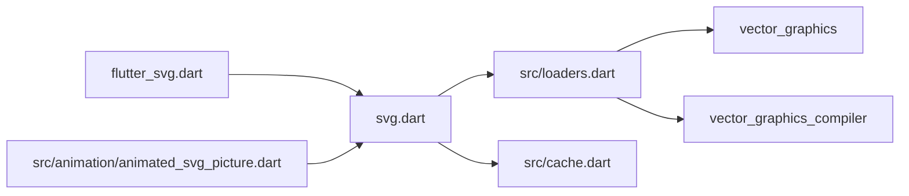

# Examples and Tutorials

<cite>
**Referenced Files in This Document**
- [README.md](file://README.md)
- [lib/svg.dart](file://lib/svg.dart)
- [lib/flutter_svg.dart](file://lib/flutter_svg.dart)
- [lib/src/loaders.dart](file://lib/src/loaders.dart)
- [lib/src/cache.dart](file://lib/src/cache.dart)
- [lib/src/animation/animated_svg_picture.dart](file://lib/src/animation/animated_svg_picture.dart)
- [ANIMATION.md](file://ANIMATION.md)
- [docs/DEVELOPMENT.md](file://docs/DEVELOPMENT.md)
- [example/lib/main.dart](file://example/lib/main.dart)
- [example/lib/animated_svg_demo.dart](file://example/lib/animated_svg_demo.dart)
- [example/lib/readme_excerpts.dart](file://example/lib/readme_excerpts.dart)
- [example/lib/path_morphing_example.dart](file://example/lib/path_morphing_example.dart)
- [example/lib/advanced_path_morphing.dart](file://example/lib/advanced_path_morphing.dart)
- [example/pubspec.yaml](file://example/pubspec.yaml)
</cite>

## Table of Contents
1. [Introduction](#introduction)
2. [Project Structure](#project-structure)
3. [Core Components](#core-components)
4. [Architecture Overview](#architecture-overview)
5. [Detailed Component Analysis](#detailed-component-analysis)
6. [Dependency Analysis](#dependency-analysis)
7. [Performance Considerations](#performance-considerations)
8. [Troubleshooting Guide](#troubleshooting-guide)
9. [Conclusion](#conclusion)
10. [Appendices](#appendices)

## Introduction
This document provides practical, step-by-step examples and tutorials for integrating and animating SVGs in Flutter using the flutter_svg package. It covers:
- Basic asset loading and color manipulation
- Animation implementation with SMIL and CSS animations
- Path morphing and advanced animation patterns
- Performance optimization and platform-specific considerations
- Testing strategies and deployment tips
- Real-world example applications across multiple platforms

The goal is to help developers at all skill levels—from beginners learning how to render SVGs—to experts implementing advanced animation and performance-critical scenarios.

## Project Structure
The repository is organized into:
- Core library: public APIs and rendering utilities
- Animation subsystem: experimental SMIL/CSS animation support
- Example apps: runnable demos across platforms (Android, iOS, Web, macOS, Windows/Linux)
- Tests and docs: development, testing, and architecture guidance

**Diagram sources**
- [lib/svg.dart:1-627](file://lib/svg.dart#L1-L627)
- [lib/src/loaders.dart:1-467](file://lib/src/loaders.dart#L1-L467)
- [lib/src/cache.dart:1-111](file://lib/src/cache.dart#L1-L111)
- [lib/src/animation/animated_svg_picture.dart:1-359](file://lib/src/animation/animated_svg_picture.dart#L1-L359)
- [example/lib/main.dart:1-56](file://example/lib/main.dart#L1-L56)
- [example/lib/animated_svg_demo.dart:1-294](file://example/lib/animated_svg_demo.dart#L1-L294)
- [example/lib/readme_excerpts.dart:1-142](file://example/lib/readme_excerpts.dart#L1-L142)
- [example/lib/path_morphing_example.dart:1-198](file://example/lib/path_morphing_example.dart#L1-L198)
- [example/lib/advanced_path_morphing.dart:1-317](file://example/lib/advanced_path_morphing.dart#L1-L317)
- [example/pubspec.yaml:1-36](file://example/pubspec.yaml#L1-L36)
- [README.md:1-227](file://README.md#L1-L227)
- [ANIMATION.md:1-229](file://ANIMATION.md#L1-L229)
- [docs/DEVELOPMENT.md:1-200](file://docs/DEVELOPMENT.md#L1-L200)

**Section sources**
- [README.md:1-227](file://README.md#L1-L227)
- [example/pubspec.yaml:1-36](file://example/pubspec.yaml#L1-L36)

## Core Components
This section introduces the primary building blocks for SVG rendering and animation.

- SvgPicture: The main widget for rendering SVGs from assets, network, files, memory, or strings. Supports color filtering, placeholders, semantics, and rendering strategy selection.
- Svg: Utility class exposing decoding helpers and a global cache for decoded SVGs.
- ColorMapper: Extensible mechanism to remap colors during parsing for advanced color manipulation.
- AnimatedSvgPicture: Experimental widget supporting SMIL and CSS animations with timeline control, playback rate, and event handling.

Key capabilities:
- Asset loading from assets, network, files, and memory
- Color tinting via ColorFilter and dynamic color mapping
- Placeholder and error handling
- Rendering strategy selection (picture vs raster)
- Precompiled vector_graphics format for performance
- Animation pipeline with DOM parsing, SMIL/CSS conversion, and timeline evaluation

**Section sources**
- [lib/svg.dart:26-627](file://lib/svg.dart#L26-L627)
- [lib/src/loaders.dart:76-116](file://lib/src/loaders.dart#L76-L116)
- [lib/src/animation/animated_svg_picture.dart:91-164](file://lib/src/animation/animated_svg_picture.dart#L91-L164)

## Architecture Overview
The package provides two distinct rendering pipelines:
- Static SVG pipeline: Compiles SVG to a vector_graphics binary for fast rendering without DOM or animation support. Used by SvgPicture variants.
- Animated SVG pipeline: Parses SVG to a DOM tree, extracts SMIL/CSS animations, and drives them via a timeline. Used by AnimatedSvgPicture.

**Diagram sources**
- [docs/DEVELOPMENT.md:18-33](file://docs/DEVELOPMENT.md#L18-L33)
- [lib/src/loaders.dart:118-194](file://lib/src/loaders.dart#L118-L194)
- [lib/src/animation/animated_svg_picture.dart:1-359](file://lib/src/animation/animated_svg_picture.dart#L1-L359)

**Section sources**
- [docs/DEVELOPMENT.md:18-33](file://docs/DEVELOPMENT.md#L18-L33)

## Detailed Component Analysis

### Tutorial 1: Basic Asset Loading and Color Manipulation
Learn how to load SVGs from assets and apply color filters and custom color mapping.

Steps:
1. Load an asset-based SVG using SvgPicture.asset.
2. Apply a simple color tint using ColorFilter.mode.
3. Implement a ColorMapper subclass to dynamically remap colors during parsing.
4. Use placeholders for network assets and handle missing assets gracefully.

Practical references:
- Asset loading and color tinting: [example/lib/readme_excerpts.dart:19-39](file://example/lib/readme_excerpts.dart#L19-L39)
- ColorMapper implementation: [example/lib/readme_excerpts.dart:104-141](file://example/lib/readme_excerpts.dart#L104-L141)
- Network placeholder and error behavior: [example/lib/readme_excerpts.dart:56-68](file://example/lib/readme_excerpts.dart#L56-L68)
- Public API and parameters: [lib/svg.dart:56-627](file://lib/svg.dart#L56-L627)

**Diagram sources**
- [lib/svg.dart:56-627](file://lib/svg.dart#L56-L627)
- [lib/src/loaders.dart:118-194](file://lib/src/loaders.dart#L118-L194)
- [lib/src/cache.dart:65-111](file://lib/src/cache.dart#L65-L111)

**Section sources**
- [example/lib/readme_excerpts.dart:19-39](file://example/lib/readme_excerpts.dart#L19-L39)
- [example/lib/readme_excerpts.dart:104-141](file://example/lib/readme_excerpts.dart#L104-L141)
- [lib/svg.dart:56-627](file://lib/svg.dart#L56-L627)
- [lib/src/loaders.dart:76-116](file://lib/src/loaders.dart#L76-L116)
- [lib/src/cache.dart:1-111](file://lib/src/cache.dart#L1-L111)

### Tutorial 2: SMIL Animation Implementation
Explore SMIL animation support with AnimatedSvgPicture, covering movement, transforms, color, path morphing, and motion paths.

Steps:
1. Create AnimatedSvgPicture.string with an SVG containing SMIL elements.
2. Control playback with autoPlay, playbackRate, and programmatic controls (play/pause/reset/seek).
3. Observe supported SMIL features: animate, animateTransform, animateMotion, timing, and interpolation modes.
4. Use the demo app to experiment with 20+ interactive examples.

Practical references:
- Quick start and supported features: [ANIMATION.md:5-66](file://ANIMATION.md#L5-L66)
- Widget API and variants: [lib/src/animation/animated_svg_picture.dart:108-164](file://lib/src/animation/animated_svg_picture.dart#L108-L164)
- Demo app with examples: [example/lib/animated_svg_demo.dart:1-294](file://example/lib/animated_svg_demo.dart#L1-L294)

**Diagram sources**
- [ANIMATION.md:21-66](file://ANIMATION.md#L21-L66)
- [lib/src/animation/animated_svg_picture.dart:108-164](file://lib/src/animation/animated_svg_picture.dart#L108-L164)

**Section sources**
- [ANIMATION.md:5-66](file://ANIMATION.md#L5-L66)
- [lib/src/animation/animated_svg_picture.dart:108-164](file://lib/src/animation/animated_svg_picture.dart#L108-L164)
- [example/lib/animated_svg_demo.dart:1-294](file://example/lib/animated_svg_demo.dart#L1-L294)

### Tutorial 3: Path Morphing and Advanced Animation Patterns
Learn to morph between SVG paths and combine animations for advanced effects.

Steps:
1. Parse and normalize paths using PathParser and PathNormalizer.
2. Create a PathMorpher to interpolate between normalized path commands.
3. Drive morphing with an AnimationController and render with a CustomPainter.
4. Combine color interpolation with path morphing for smooth transitions.

Practical references:
- Basic path morphing example: [example/lib/path_morphing_example.dart:1-198](file://example/lib/path_morphing_example.dart#L1-L198)
- Advanced morphing with multiple shapes and color blending: [example/lib/advanced_path_morphing.dart:1-317](file://example/lib/advanced_path_morphing.dart#L1-L317)
- Underlying path utilities: [lib/src/animation/path_parser.dart](file://lib/src/animation/path_parser.dart), [lib/src/animation/path_normalizer.dart](file://lib/src/animation/path_normalizer.dart), [lib/src/animation/path_interpolation.dart](file://lib/src/animation/path_interpolation.dart)

**Diagram sources**
- [example/lib/path_morphing_example.dart:48-68](file://example/lib/path_morphing_example.dart#L48-L68)
- [example/lib/advanced_path_morphing.dart:94-109](file://example/lib/advanced_path_morphing.dart#L94-L109)

**Section sources**
- [example/lib/path_morphing_example.dart:1-198](file://example/lib/path_morphing_example.dart#L1-L198)
- [example/lib/advanced_path_morphing.dart:1-317](file://example/lib/advanced_path_morphing.dart#L1-L317)

### Tutorial 4: Complete Example Application Structure
See how a real-world app integrates SVGs across platforms and showcases animations.

Structure highlights:
- App bootstrap and theming: [example/lib/main.dart:1-56](file://example/lib/main.dart#L1-L56)
- Animated examples page: [example/lib/animated_svg_demo.dart:1-294](file://example/lib/animated_svg_demo.dart#L1-L294)
- Asset loading and color mapping examples: [example/lib/readme_excerpts.dart:1-142](file://example/lib/readme_excerpts.dart#L1-L142)
- Path morphing demos: [example/lib/path_morphing_example.dart:1-198](file://example/lib/path_morphing_example.dart#L1-L198), [example/lib/advanced_path_morphing.dart:1-317](file://example/lib/advanced_path_morphing.dart#L1-L317)
- Assets configuration: [example/pubspec.yaml:29-36](file://example/pubspec.yaml#L29-L36)

**Diagram sources**
- [example/lib/main.dart:1-56](file://example/lib/main.dart#L1-L56)
- [example/lib/animated_svg_demo.dart:1-294](file://example/lib/animated_svg_demo.dart#L1-L294)
- [example/lib/readme_excerpts.dart:1-142](file://example/lib/readme_excerpts.dart#L1-L142)
- [example/lib/path_morphing_example.dart:1-198](file://example/lib/path_morphing_example.dart#L1-L198)
- [example/lib/advanced_path_morphing.dart:1-317](file://example/lib/advanced_path_morphing.dart#L1-L317)
- [example/pubspec.yaml:29-36](file://example/pubspec.yaml#L29-L36)

**Section sources**
- [example/lib/main.dart:1-56](file://example/lib/main.dart#L1-L56)
- [example/lib/animated_svg_demo.dart:1-294](file://example/lib/animated_svg_demo.dart#L1-L294)
- [example/lib/readme_excerpts.dart:1-142](file://example/lib/readme_excerpts.dart#L1-L142)
- [example/lib/path_morphing_example.dart:1-198](file://example/lib/path_morphing_example.dart#L1-L198)
- [example/lib/advanced_path_morphing.dart:1-317](file://example/lib/advanced_path_morphing.dart#L1-L317)
- [example/pubspec.yaml:29-36](file://example/pubspec.yaml#L29-L36)

## Dependency Analysis
Key dependencies and relationships:
- flutter_svg exports vector_graphics utilities and exposes SvgPicture and related loaders.
- Loaders depend on vector_graphics for encoding and on vector_graphics_compiler for precompiled assets.
- Cache stores ByteData keyed by SvgCacheKey, which includes theme and colorMapper.
- AnimatedSvgPicture depends on the animation subsystem (parser, DOM, SMIL, timeline, painter).

**Diagram sources**
- [lib/flutter_svg.dart:1-2](file://lib/flutter_svg.dart#L1-L2)
- [lib/svg.dart:1-18](file://lib/svg.dart#L1-L18)
- [lib/src/loaders.dart:1-14](file://lib/src/loaders.dart#L1-L14)
- [lib/src/cache.dart:1-111](file://lib/src/cache.dart#L1-L111)
- [lib/src/animation/animated_svg_picture.dart:1-359](file://lib/src/animation/animated_svg_picture.dart#L1-L359)

**Section sources**
- [lib/flutter_svg.dart:1-2](file://lib/flutter_svg.dart#L1-L2)
- [lib/svg.dart:1-18](file://lib/svg.dart#L1-L18)
- [lib/src/loaders.dart:1-14](file://lib/src/loaders.dart#L1-L14)
- [lib/src/cache.dart:1-111](file://lib/src/cache.dart#L1-L111)
- [lib/src/animation/animated_svg_picture.dart:1-359](file://lib/src/animation/animated_svg_picture.dart#L1-L359)

## Performance Considerations
Guidance for optimizing SVG rendering and animations:
- Prefer precompiled vector_graphics (.vec) for static assets to reduce parsing overhead.
- Use the raster rendering strategy when resolution scaling is less critical than performance.
- Leverage the built-in cache to avoid repeated decoding and encoding.
- Keep animations simple and avoid excessive overdraw; test with the demo app’s FPS monitor.
- For complex animations, consider reducing the number of animated elements or simplifying paths.

References:
- Precompiled assets and strategy trade-offs: [README.md:141-160](file://README.md#L141-L160), [README.md:133-139](file://README.md#L133-L139)
- Performance targets and pipeline separation: [docs/DEVELOPMENT.md:173-186](file://docs/DEVELOPMENT.md#L173-L186), [docs/DEVELOPMENT.md:20-33](file://docs/DEVELOPMENT.md#L20-L33)

**Section sources**
- [README.md:133-160](file://README.md#L133-L160)
- [docs/DEVELOPMENT.md:173-186](file://docs/DEVELOPMENT.md#L173-L186)
- [docs/DEVELOPMENT.md:20-33](file://docs/DEVELOPMENT.md#L20-L33)

## Troubleshooting Guide
Common issues and resolutions:
- Animation not playing: Verify that animations are detected and parsed, the timeline ticks, and values interpolate correctly. Enable logging to inspect timeline state.
- Pipeline mixing: Static SvgPicture cannot render SMIL animations; use AnimatedSvgPicture for animated SVGs.
- Path morphing fails: Ensure paths are normalized and compatible; check that the same number of cubic bezier segments exist.
- RepaintBoundary capture mismatch: Captures configured size, not widget size; adjust expectations accordingly.
- Memory leaks in tests: Always dispose images captured from test widgets.

References:
- Debugging checklist and logging: [docs/DEVELOPMENT.md:154-172](file://docs/DEVELOPMENT.md#L154-L172)
- Common pitfalls: [docs/DEVELOPMENT.md:181-187](file://docs/DEVELOPMENT.md#L181-L187)
- Demo app and examples: [example/lib/animated_svg_demo.dart:1-294](file://example/lib/animated_svg_demo.dart#L1-L294)

**Section sources**
- [docs/DEVELOPMENT.md:154-187](file://docs/DEVELOPMENT.md#L154-L187)
- [example/lib/animated_svg_demo.dart:1-294](file://example/lib/animated_svg_demo.dart#L1-L294)

## Conclusion
This guide demonstrated practical patterns for loading, coloring, animating, and optimizing SVGs in Flutter using flutter_svg. Starting from basic asset loading and color manipulation, you progressed through SMIL animations, path morphing, and advanced animation techniques. The example apps showcase real-world usage across platforms, while the troubleshooting and performance sections help you build robust, high-performance applications.

## Appendices

### A. Downloadable Code Samples and Interactive Demos
- Example app assets and configuration: [example/pubspec.yaml:29-36](file://example/pubspec.yaml#L29-L36)
- Runnable demos:
  - Animated SVG examples: [example/lib/animated_svg_demo.dart:1-294](file://example/lib/animated_svg_demo.dart#L1-L294)
  - Path morphing basics: [example/lib/path_morphing_example.dart:1-198](file://example/lib/path_morphing_example.dart#L1-L198)
  - Advanced path morphing: [example/lib/advanced_path_morphing.dart:1-317](file://example/lib/advanced_path_morphing.dart#L1-L317)
  - Asset loading and color mapping: [example/lib/readme_excerpts.dart:1-142](file://example/lib/readme_excerpts.dart#L1-L142)

### B. Platform-Specific Considerations
- Android: Network assets require appropriate permissions when loading from external storage; ensure proper asset bundling.
- iOS: Asset bundles and resource access work seamlessly; ensure assets are included in the Xcode project.
- Web: Network assets are fetched via HTTP; ensure CORS policies permit access.
- Desktop (macOS/Windows/Linux): File-based loading may require permission prompts; ensure assets are bundled appropriately.

References:
- Network and file loading notes: [lib/svg.dart:213-335](file://lib/svg.dart#L213-L335)
- Example app platform coverage: [example/lib/main.dart:1-56](file://example/lib/main.dart#L1-L56)

**Section sources**
- [lib/svg.dart:213-335](file://lib/svg.dart#L213-L335)
- [example/lib/main.dart:1-56](file://example/lib/main.dart#L1-L56)

### C. Testing Strategies and Deployment Optimization
- Unit/integration tests: Use the animation test suite and visual testing patterns with RepaintBoundary captures.
- Golden tests: Visual regression baselines are maintained for quality assurance.
- CI-friendly flags: Exclude golden tests in automated environments when needed.
- Deployment: Prefer precompiled vector_graphics assets for production to minimize startup costs.

References:
- Running tests and visual testing pattern: [docs/DEVELOPMENT.md:65-118](file://docs/DEVELOPMENT.md#L65-L118)
- Animation demo usage: [ANIMATION.md:180-188](file://ANIMATION.md#L180-L188)

**Section sources**
- [docs/DEVELOPMENT.md:65-118](file://docs/DEVELOPMENT.md#L65-L118)
- [ANIMATION.md:180-188](file://ANIMATION.md#L180-L188)